## 1. tank_top — 背心 / 坦克背心

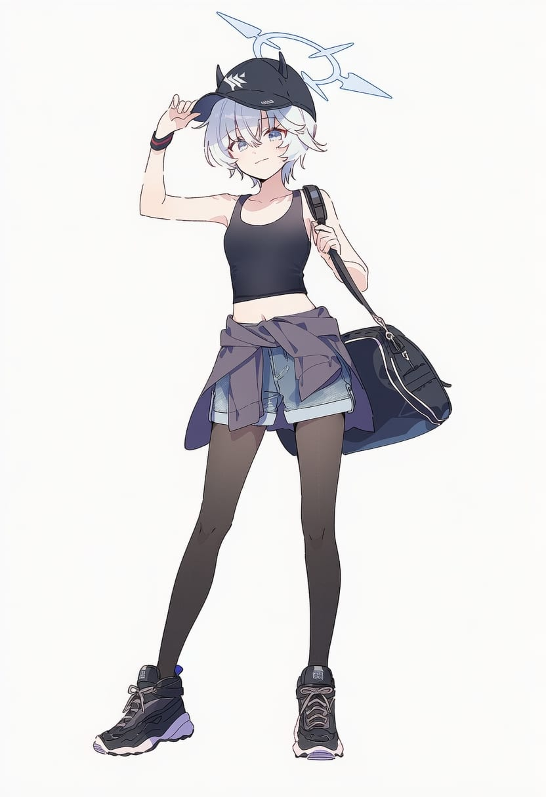

| 字段 | 内容 |
| --- | --- |
| 序号 | 0001 |
| tag | tank_top |
| tag中文名 | 背心 / 坦克背心 |
| tag中文含义 | 无袖、肩部为较宽肩带的基础背心。 |
| tag所属的子类 | 背心 / 短上衣 |
| 角色 | erika_(blue_archive) |

## 2. camisole — 吊带背心

| 字段 | 内容 |
| --- | --- |
| 序号 | 0003 |
| tag | camisole |
| tag中文名 | 吊带背心 |
| tag中文含义 | 以细肩带固定的轻薄女式背心。 |
| tag所属的子类 | 背心 / 短上衣 |
| 角色 | illyasviel_von_einzbern |

## 3. crop_top — 露脐短上衣

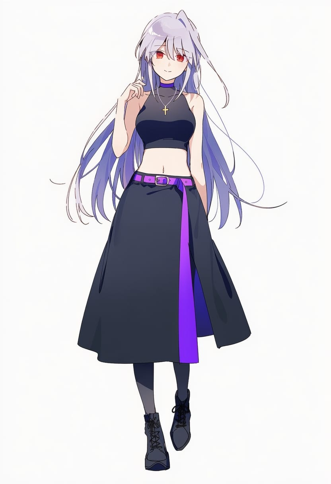

| 字段 | 内容 |
| --- | --- |
| 序号 | 0004 |
| tag | crop_top |
| tag中文名 | 露脐短上衣 |
| tag中文含义 | 衣摆较短、通常露出腹部或腰部的上衣。 |
| tag所属的子类 | 背心 / 短上衣 |
| 角色 | reinforce |

## 4. tube_top — 抹胸上衣

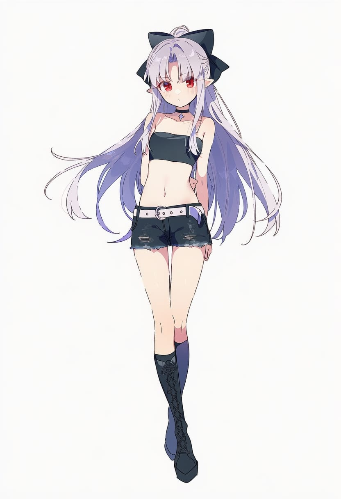

| 字段 | 内容 |
| --- | --- |
| 序号 | 0005 |
| tag | tube_top |
| tag中文名 | 抹胸上衣 |
| tag中文含义 | 环绕胸部、无肩带无袖的筒形上衣。 |
| tag所属的子类 | 背心 / 短上衣 |
| 角色 | white_len_(tsukihime) |

## 5. bandeau — 束胸式抹胸

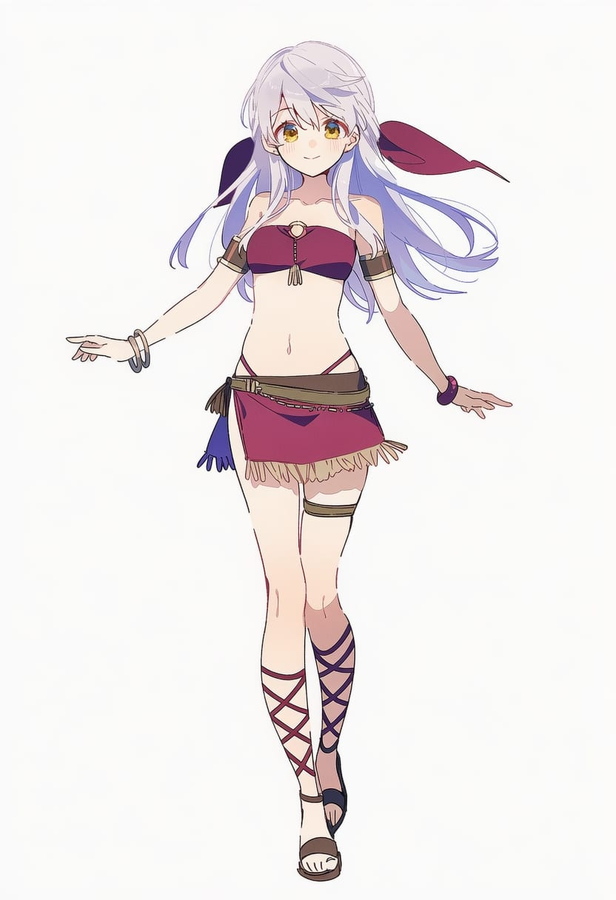

| 字段 | 内容 |
| --- | --- |
| 序号 | 0006 |
| tag | bandeau |
| tag中文名 | 束胸式抹胸 |
| tag中文含义 | 窄条状、横向包裹胸部的无肩带上衣。 |
| tag所属的子类 | 背心 / 短上衣 |
| 角色 | micaiah_(fire_emblem) |

## 6. halterneck — 挂脖上衣

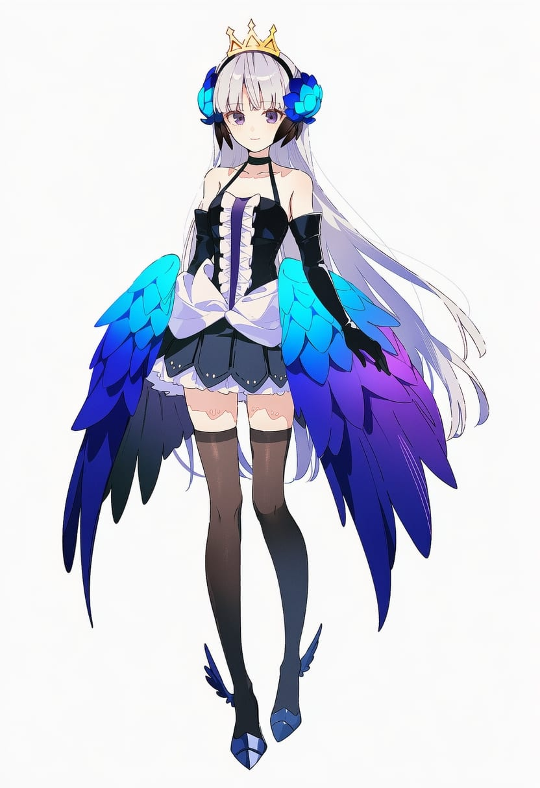

| 字段 | 内容 |
| --- | --- |
| 序号 | 0007 |
| tag | halterneck |
| tag中文名 | 挂脖上衣 |
| tag中文含义 | 肩带或布料绕颈固定、肩背较开放的上衣结构。 |
| tag所属的子类 | 背心 / 短上衣 |
| 角色 | gwendolyn_(odin_sphere) |

## 7. criss-cross_halter — 交叉挂脖

| 字段 | 内容 |
| --- | --- |
| 序号 | 0008 |
| tag | criss-cross_halter |
| tag中文名 | 交叉挂脖 |
| tag中文含义 | 胸前/颈部肩带交叉的挂脖式上衣。 |
| tag所属的子类 | 背心 / 短上衣 |
| 角色 | shijou_takane |

## 8. bustier — 紧身胸衣式上衣

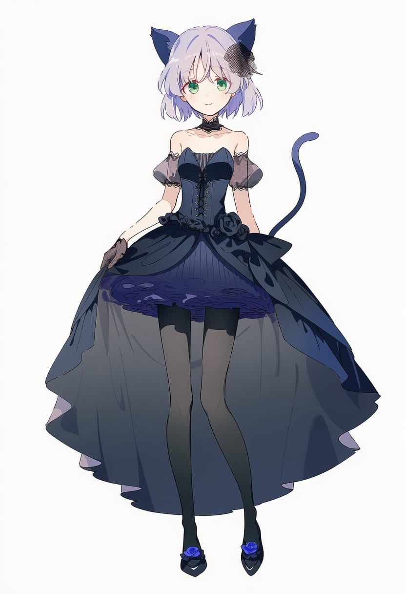

| 字段 | 内容 |
| --- | --- |
| 序号 | 0009 |
| tag | bustier |
| tag中文名 | 紧身胸衣式上衣 |
| tag中文含义 | 带胸杯和塑形结构、可直接作为上衣穿着。 |
| tag所属的子类 | 背心 / 短上衣 |
| 角色 | sanya_v._litvyak |

## 9. corset — 束腰 / 紧身胸衣

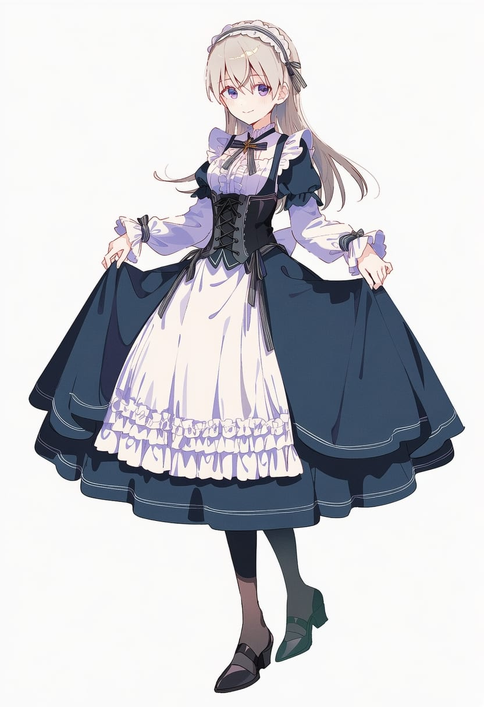

| 字段 | 内容 |
| --- | --- |
| 序号 | 0010 |
| tag | corset |
| tag中文名 | 束腰 / 紧身胸衣 |
| tag中文含义 | 通过硬挺结构或系带塑造躯干线条的服装。 |
| tag所属的子类 | 背心 / 短上衣 |
| 角色 | eila_ilmatar_juutilainen |

## 10. vest — 背心

| 字段 | 内容 |
| --- | --- |
| 序号 | 0011 |
| tag | vest |
| tag中文名 | 背心 |
| tag中文含义 | 无袖、通常套在衬衫或内搭之外的上身服装。 |
| tag所属的子类 | 背心 / 短上衣 |
| 角色 | tachibana_kanade |

## 11. waistcoat — 西装马甲

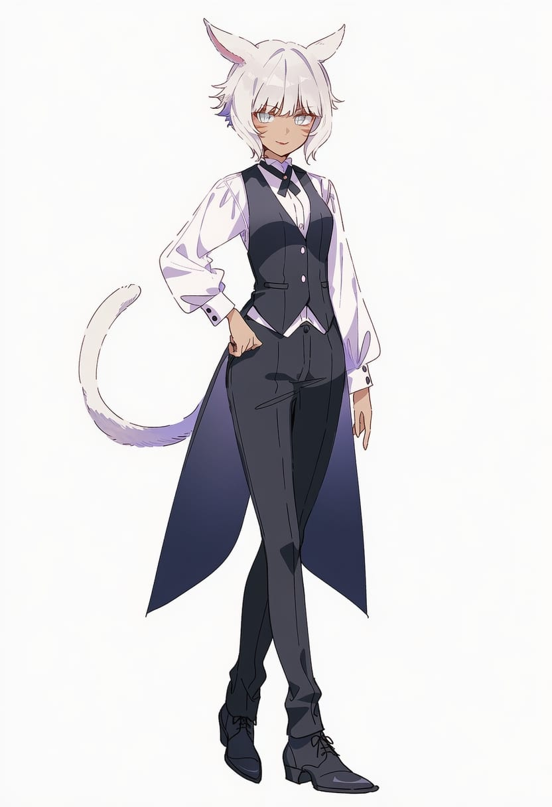

| 字段 | 内容 |
| --- | --- |
| 序号 | 0012 |
| tag | waistcoat |
| tag中文名 | 西装马甲 |
| tag中文含义 | 偏正式、常与衬衫/西装搭配的无袖马甲。 |
| tag所属的子类 | 背心 / 短上衣 |
| 角色 | y'shtola_rhul |

## 12. underbust — 下胸式上衣

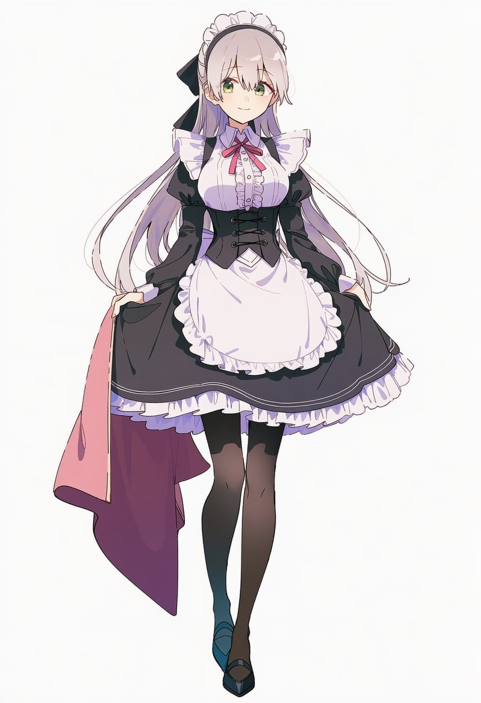

| 字段 | 内容 |
| --- | --- |
| 序号 | 0013 |
| tag | underbust |
| tag中文名 | 下胸式上衣 |
| tag中文含义 | 上缘位于胸部下方、露出上胸区域的上身服装结构。 |
| tag所属的子类 | 背心 / 短上衣 |
| 角色 | elie_macdowell |

## 13. black_tank_top — 黑色背心

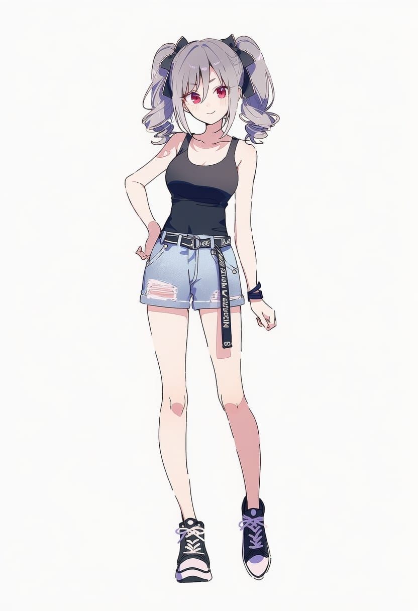

| 字段 | 内容 |
| --- | --- |
| 序号 | 0014 |
| tag | black_tank_top |
| tag中文名 | 黑色背心 |
| tag中文含义 | 黑色 tank top；作为背心颜色变体的代表样本。 |
| tag所属的子类 | 背心 / 短上衣 |
| 角色 | kanzaki_ranko |

## 14. striped_tank_top — 条纹背心

| 字段 | 内容 |
| --- | --- |
| 序号 | 0015 |
| tag | striped_tank_top |
| tag中文名 | 条纹背心 |
| tag中文含义 | 带条纹图案的 tank top。 |
| tag所属的子类 | 背心 / 短上衣 |
| 角色 | irisviel_von_einzbern |

## 15. torn_tank_top — 破损背心

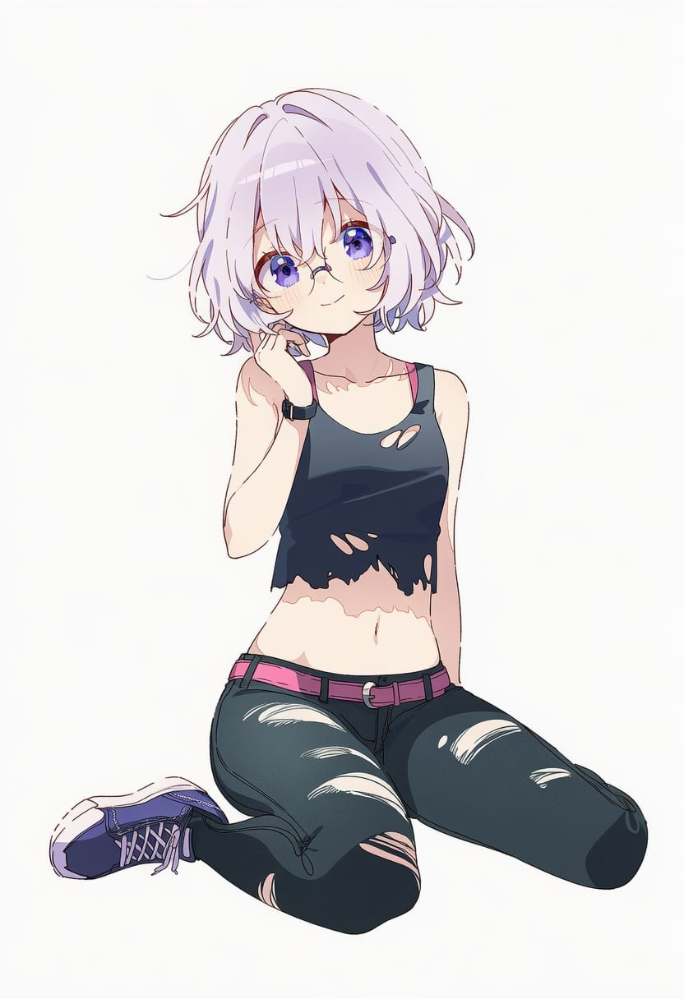

| 字段 | 内容 |
| --- | --- |
| 序号 | 0016 |
| tag | torn_tank_top |
| tag中文名 | 破损背心 |
| tag中文含义 | 有撕裂、破洞或明显破损的 tank top。 |
| tag所属的子类 | 背心 / 短上衣 |
| 角色 | ikeda_chitose |

## 16. frilled_camisole — 荷叶边吊带背心

| 字段 | 内容 |
| --- | --- |
| 序号 | 0017 |
| tag | frilled_camisole |
| tag中文名 | 荷叶边吊带背心 |
| tag中文含义 | 带褶边/荷叶边装饰的 camisole。 |
| tag所属的子类 | 背心 / 短上衣 |
| 角色 | tobiichi_origami |

## 17. striped_camisole — 条纹吊带背心

| 字段 | 内容 |
| --- | --- |
| 序号 | 0018 |
| tag | striped_camisole |
| tag中文名 | 条纹吊带背心 |
| tag中文含义 | 带条纹图案的 camisole。 |
| tag所属的子类 | 背心 / 短上衣 |
| 角色 | itsumi_erika |

## 18. see-through_camisole — 透视吊带背心

| 字段 | 内容 |
| --- | --- |
| 序号 | 0019 |
| tag | see-through_camisole |
| tag中文名 | 透视吊带背心 |
| tag中文含义 | 材质透明或半透明的 camisole。 |
| tag所属的子类 | 背心 / 短上衣 |
| 角色 | emilia_(re:zero) |

## 19. sweater — 毛衣

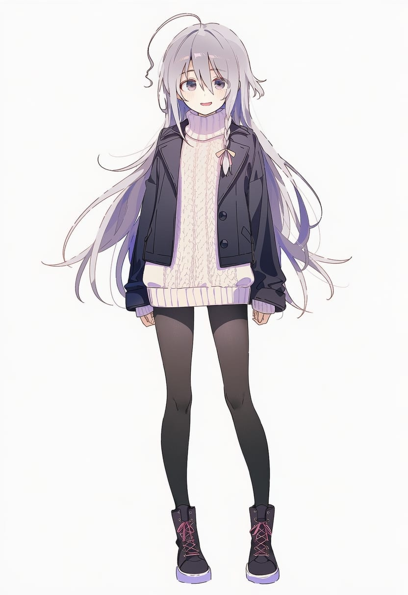

| 字段 | 内容 |
| --- | --- |
| 序号 | 0020 |
| tag | sweater |
| tag中文名 | 毛衣 |
| tag中文含义 | 针织类保暖上衣的泛称。 |
| tag所属的子类 | 针织 / 卫衣 |
| 角色 | hoshi_syoko |

## 20. turtleneck_sweater — 高领毛衣

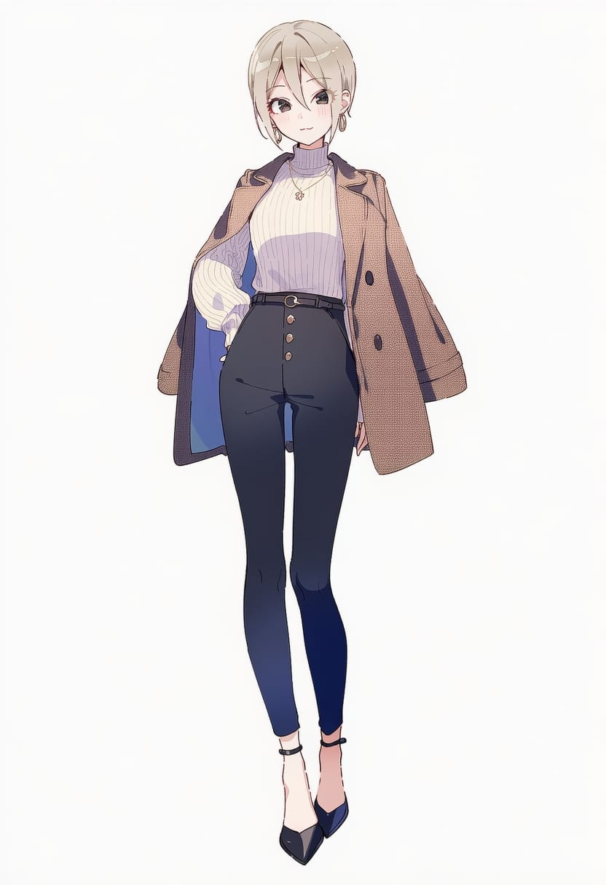

| 字段 | 内容 |
| --- | --- |
| 序号 | 0021 |
| tag | turtleneck_sweater |
| tag中文名 | 高领毛衣 |
| tag中文含义 | 带贴颈高领的针织毛衣。 |
| tag所属的子类 | 针织 / 卫衣 |
| 角色 | shiomi_syuko |

## 21. sleeveless_turtleneck — 无袖高领毛衣

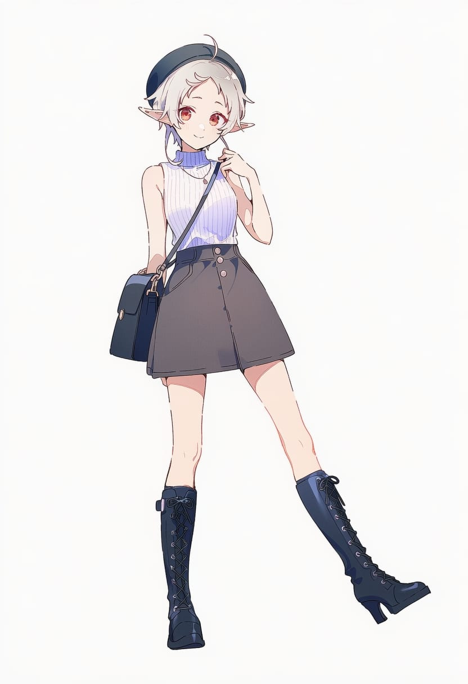

| 字段 | 内容 |
| --- | --- |
| 序号 | 0022 |
| tag | sleeveless_turtleneck |
| tag中文名 | 无袖高领毛衣 |
| tag中文含义 | 无袖、同时具有高领结构的针织上衣。 |
| tag所属的子类 | 针织 / 卫衣 |
| 角色 | sylphiette_(mushoku_tensei) |

## 22. ribbed_sweater — 罗纹毛衣

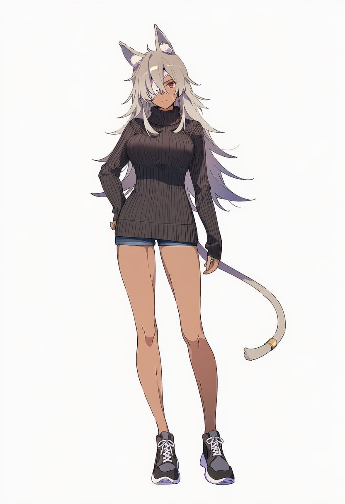

| 字段 | 内容 |
| --- | --- |
| 序号 | 0023 |
| tag | ribbed_sweater |
| tag中文名 | 罗纹毛衣 |
| tag中文含义 | 具有明显纵向罗纹组织的毛衣。 |
| tag所属的子类 | 针织 / 卫衣 |
| 角色 | ghislaine_dedoldia |

## 23. aran_sweater — 阿兰毛衣

| 字段 | 内容 |
| --- | --- |
| 序号 | 0024 |
| tag | aran_sweater |
| tag中文名 | 阿兰毛衣 |
| tag中文含义 | 以麻花、绳索等复杂立体针织纹样为特征的毛衣。 |
| tag所属的子类 | 针织 / 卫衣 |
| 角色 | shoukaku_(kancolle) |

## 24. cropped_sweater — 短款毛衣

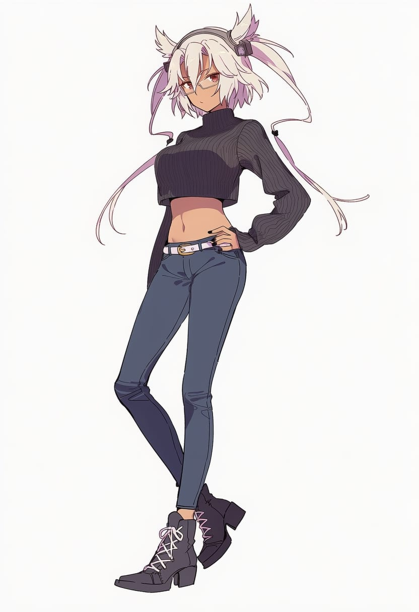

| 字段 | 内容 |
| --- | --- |
| 序号 | 0025 |
| tag | cropped_sweater |
| tag中文名 | 短款毛衣 |
| tag中文含义 | 衣摆明显缩短、常露腰腹的毛衣。 |
| tag所属的子类 | 针织 / 卫衣 |
| 角色 | musashi_(kancolle) |

## 25. off-shoulder_sweater — 露肩毛衣

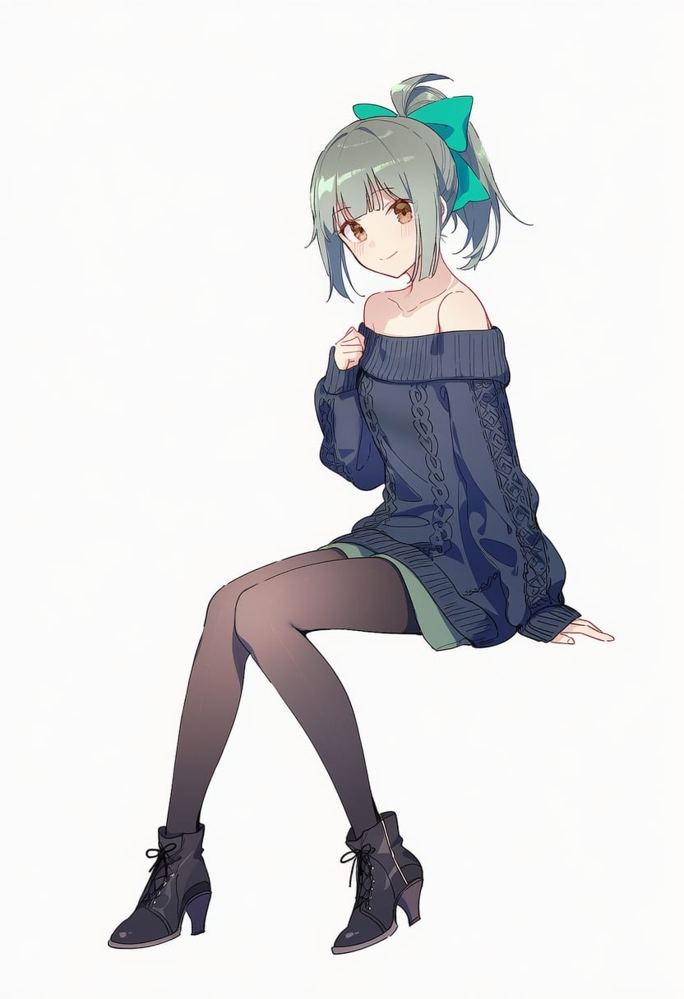

| 字段 | 内容 |
| --- | --- |
| 序号 | 0026 |
| tag | off-shoulder_sweater |
| tag中文名 | 露肩毛衣 |
| tag中文含义 | 领口下移或剪裁宽大、露出肩部的毛衣。 |
| tag所属的子类 | 针织 / 卫衣 |
| 角色 | yuubari_(kancolle) |

## 26. sleeveless_sweater — 无袖毛衣

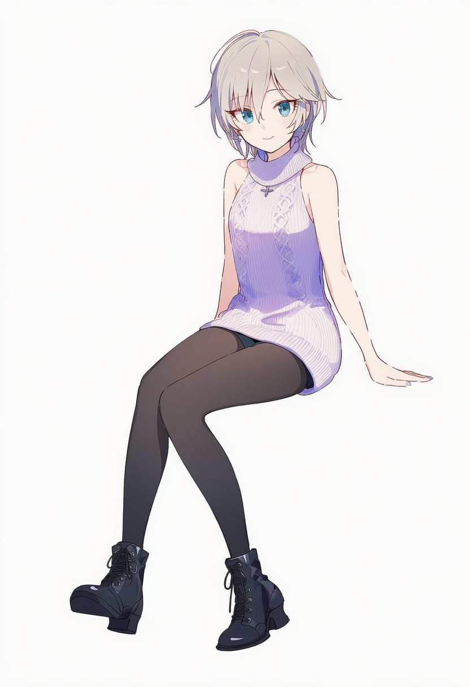

| 字段 | 内容 |
| --- | --- |
| 序号 | 0027 |
| tag | sleeveless_sweater |
| tag中文名 | 无袖毛衣 |
| tag中文含义 | 没有袖子的针织毛衣。 |
| tag所属的子类 | 针织 / 卫衣 |
| 角色 | anastasia_(idolmaster) |

## 27. short-sleeved_sweater — 短袖毛衣

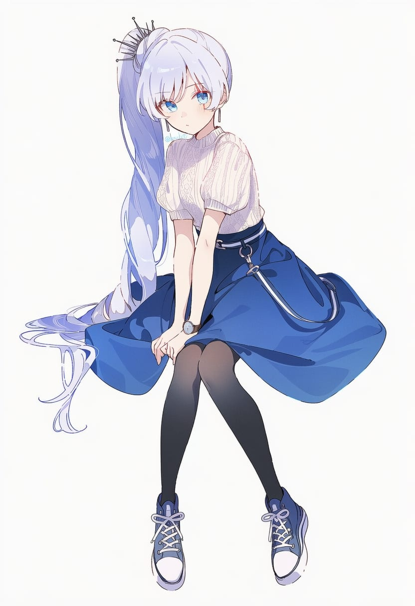

| 字段 | 内容 |
| --- | --- |
| 序号 | 0028 |
| tag | short-sleeved_sweater |
| tag中文名 | 短袖毛衣 |
| tag中文含义 | 具有短袖结构的针织毛衣。 |
| tag所属的子类 | 针织 / 卫衣 |
| 角色 | weiss_schnee |

## 28. argyle_sweater — 菱格毛衣

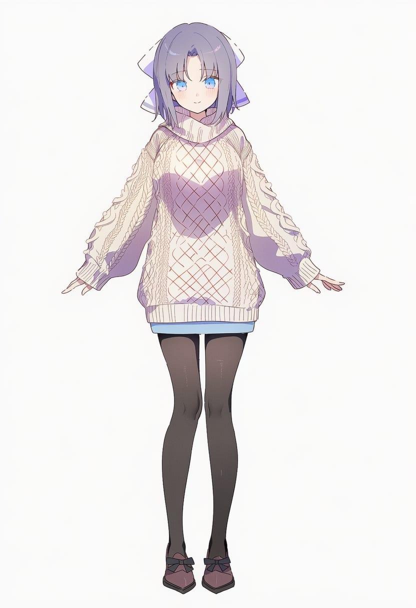

| 字段 | 内容 |
| --- | --- |
| 序号 | 0029 |
| tag | argyle_sweater |
| tag中文名 | 菱格毛衣 |
| tag中文含义 | 带经典菱形/阿盖尔格纹图案的毛衣。 |
| tag所属的子类 | 针织 / 卫衣 |
| 角色 | yumi_(senran_kagura) |

## 29. striped_sweater — 条纹毛衣

| 字段 | 内容 |
| --- | --- |
| 序号 | 0030 |
| tag | striped_sweater |
| tag中文名 | 条纹毛衣 |
| tag中文含义 | 带条纹图案的毛衣。 |
| tag所属的子类 | 针织 / 卫衣 |
| 角色 | chitose_(kancolle) |

## 30. plaid_sweater — 格纹毛衣

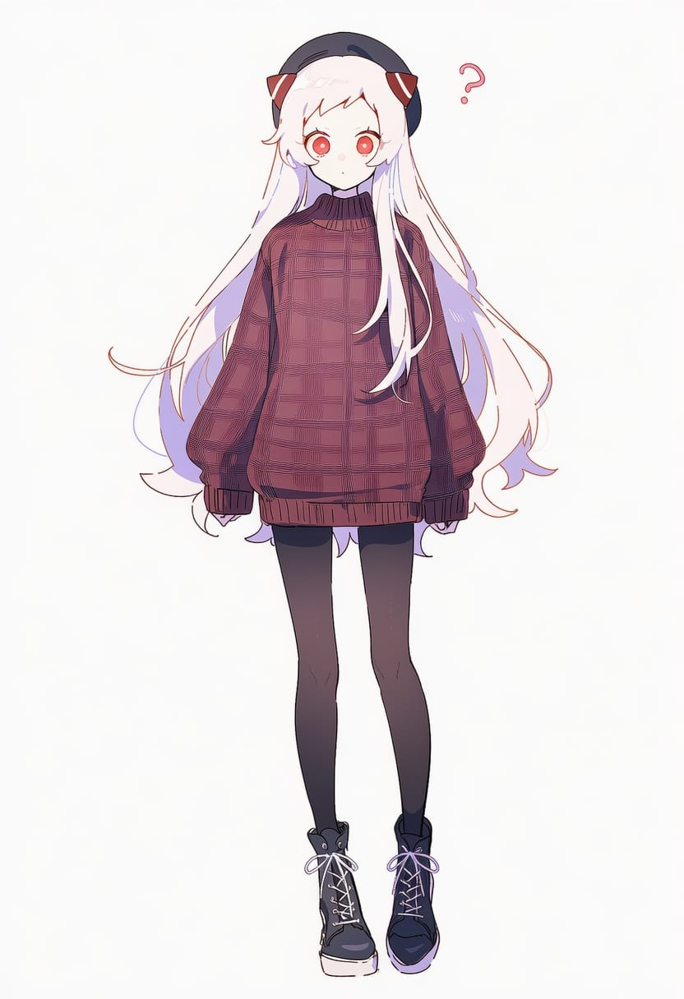

| 字段 | 内容 |
| --- | --- |
| 序号 | 0031 |
| tag | plaid_sweater |
| tag中文名 | 格纹毛衣 |
| tag中文含义 | 带格纹图案的毛衣。 |
| tag所属的子类 | 针织 / 卫衣 |
| 角色 | airfield_princess |

## 31. christmas_sweater — 圣诞毛衣

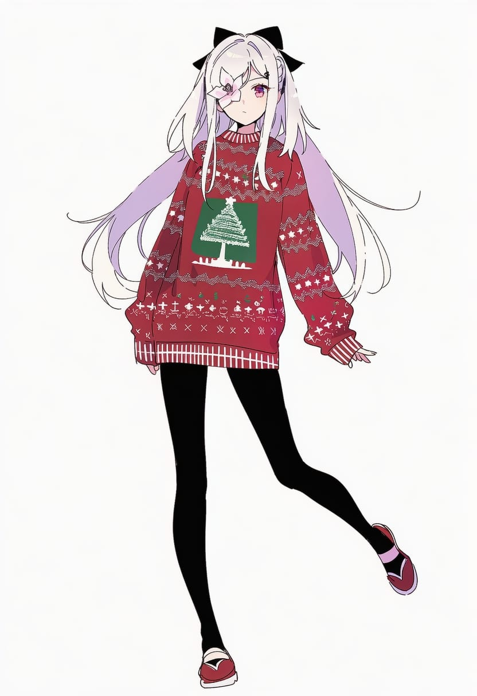

| 字段 | 内容 |
| --- | --- |
| 序号 | 0032 |
| tag | christmas_sweater |
| tag中文名 | 圣诞毛衣 |
| tag中文含义 | 带圣诞主题图案或节庆装饰的毛衣。 |
| tag所属的子类 | 针织 / 卫衣 |
| 角色 | zero_(drag-on_dragoon) |

## 32. sweater_vest — 毛衣背心

| 字段 | 内容 |
| --- | --- |
| 序号 | 0033 |
| tag | sweater_vest |
| tag中文名 | 毛衣背心 |
| tag中文含义 | 无袖针织背心，常叠穿在衬衫外。 |
| tag所属的子类 | 针织 / 卫衣 |
| 角色 | northern_ocean_princess |

## 33. white_sweater — 白色毛衣

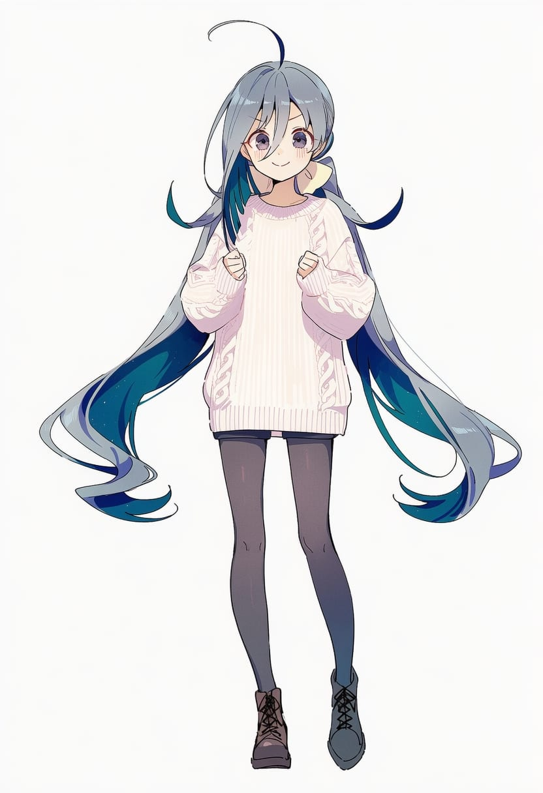

| 字段 | 内容 |
| --- | --- |
| 序号 | 0034 |
| tag | white_sweater |
| tag中文名 | 白色毛衣 |
| tag中文含义 | 白色 sweater；作为毛衣颜色变体的代表样本。 |
| tag所属的子类 | 针织 / 卫衣 |
| 角色 | kiyoshimo_(kancolle) |

## 34. cardigan — 开衫

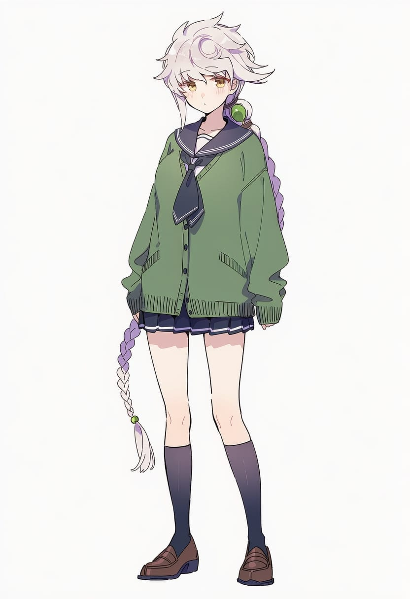

| 字段 | 内容 |
| --- | --- |
| 序号 | 0035 |
| tag | cardigan |
| tag中文名 | 开衫 |
| tag中文含义 | 前襟可打开、通常带纽扣或敞穿的针织上衣。 |
| tag所属的子类 | 针织 / 卫衣 |
| 角色 | unryuu_(kancolle) |

## 35. cardigan_vest — 开衫背心

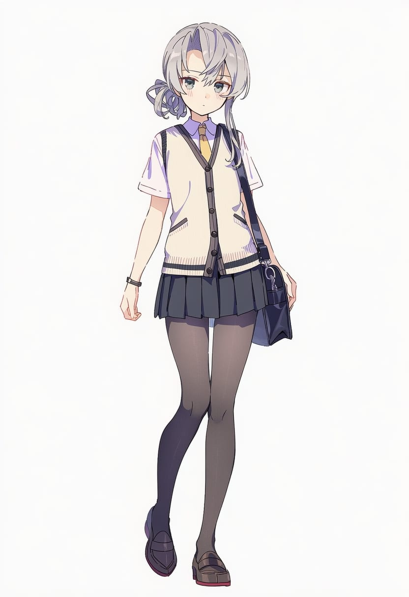

| 字段 | 内容 |
| --- | --- |
| 序号 | 0036 |
| tag | cardigan_vest |
| tag中文名 | 开衫背心 |
| tag中文含义 | 无袖的 cardigan / 针织开襟背心。 |
| tag所属的子类 | 针织 / 卫衣 |
| 角色 | nowaki_(kancolle) |

## 36. ribbed_cardigan — 罗纹开衫

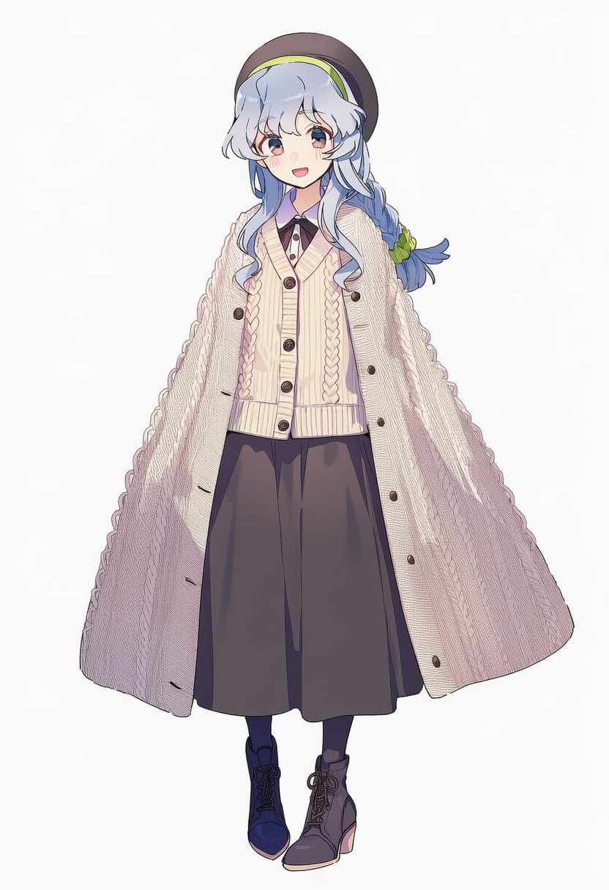

| 字段 | 内容 |
| --- | --- |
| 序号 | 0037 |
| tag | ribbed_cardigan |
| tag中文名 | 罗纹开衫 |
| tag中文含义 | 表面具有明显罗纹针织组织的开衫。 |
| tag所属的子类 | 针织 / 卫衣 |
| 角色 | yamagumo_(kancolle) |

## 37. striped_cardigan — 条纹开衫

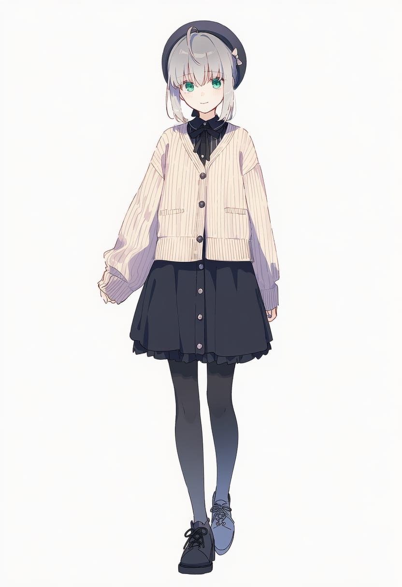

| 字段 | 内容 |
| --- | --- |
| 序号 | 0038 |
| tag | striped_cardigan |
| tag中文名 | 条纹开衫 |
| tag中文含义 | 带条纹图案的针织开衫。 |
| tag所属的子类 | 针织 / 卫衣 |
| 角色 | gray_(fate) |

## 38. plaid_cardigan — 格纹开衫

| 字段 | 内容 |
| --- | --- |
| 序号 | 0039 |
| tag | plaid_cardigan |
| tag中文名 | 格纹开衫 |
| tag中文含义 | 带格纹图案的针织开衫。 |
| tag所属的子类 | 针织 / 卫衣 |
| 角色 | echidna_(re:zero) |

## 39. white_cardigan — 白色开衫

| 字段 | 内容 |
| --- | --- |
| 序号 | 0040 |
| tag | white_cardigan |
| tag中文名 | 白色开衫 |
| tag中文含义 | 白色 cardigan；作为开衫颜色变体的代表样本。 |
| tag所属的子类 | 针织 / 卫衣 |
| 角色 | watanabe_you |

## 40. hoodie — 连帽卫衣

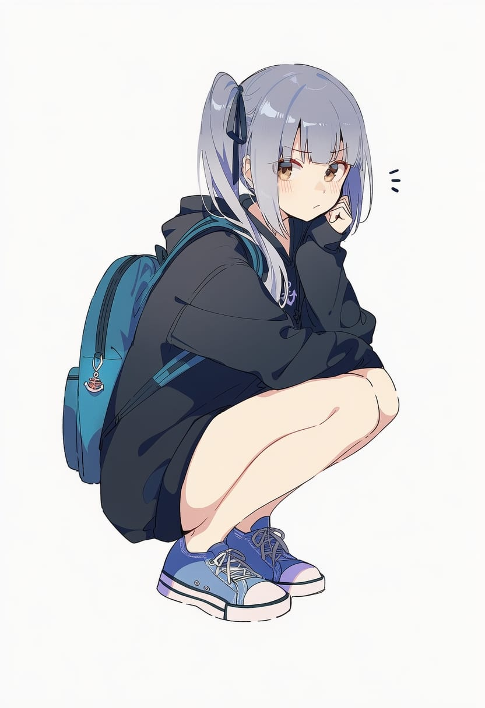

| 字段 | 内容 |
| --- | --- |
| 序号 | 0041 |
| tag | hoodie |
| tag中文名 | 连帽卫衣 |
| tag中文含义 | 带连帽结构的休闲针织/运动上衣。 |
| tag所属的子类 | 针织 / 卫衣 |
| 角色 | kasumi_(kancolle) |

## 41. cropped_hoodie — 短款连帽卫衣

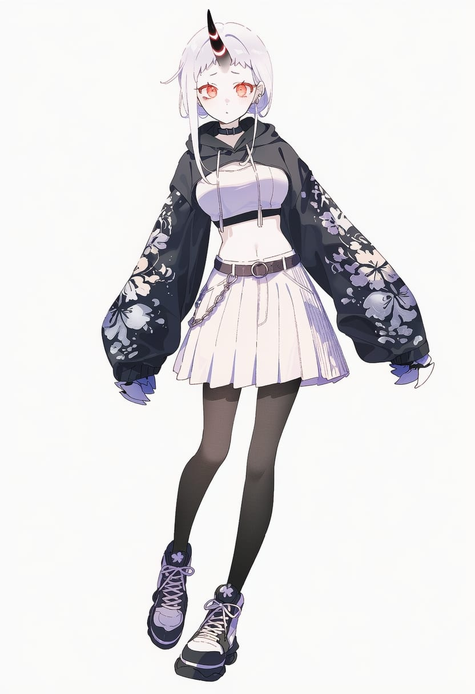

| 字段 | 内容 |
| --- | --- |
| 序号 | 0042 |
| tag | cropped_hoodie |
| tag中文名 | 短款连帽卫衣 |
| tag中文含义 | 衣摆缩短、露出腰腹的 hoodie。 |
| tag所属的子类 | 针织 / 卫衣 |
| 角色 | seaport_princess |

## 42. sleeveless_hoodie — 无袖连帽卫衣

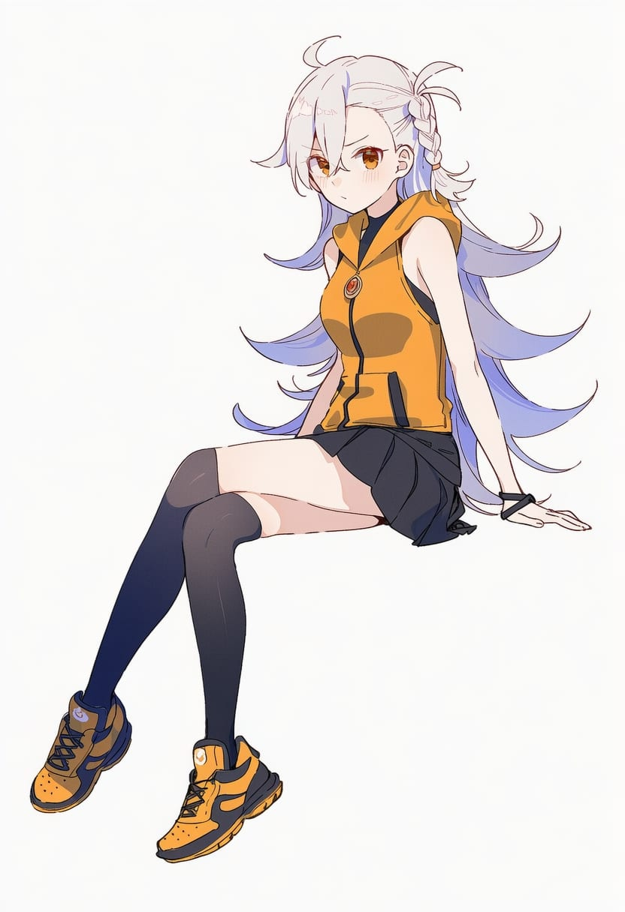

| 字段 | 内容 |
| --- | --- |
| 序号 | 0043 |
| tag | sleeveless_hoodie |
| tag中文名 | 无袖连帽卫衣 |
| tag中文含义 | 无袖但保留连帽结构的 hoodie。 |
| tag所属的子类 | 针织 / 卫衣 |
| 角色 | olga_marie_animusphere |

## 43. white_hoodie — 白色连帽卫衣

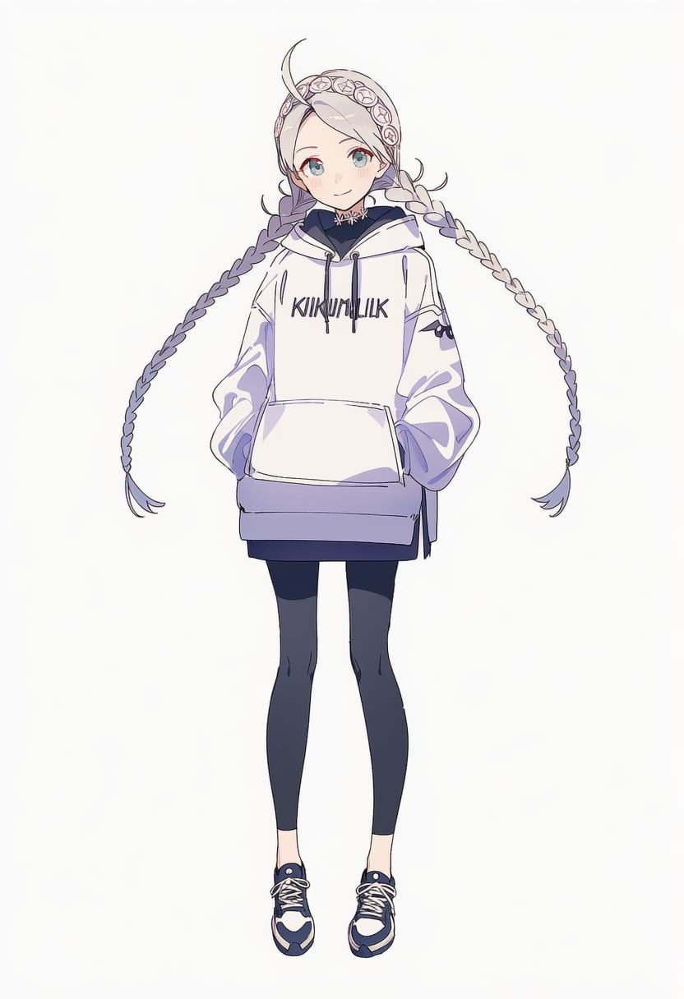

| 字段 | 内容 |
| --- | --- |
| 序号 | 0044 |
| tag | white_hoodie |
| tag中文名 | 白色连帽卫衣 |
| tag中文含义 | 白色 hoodie；作为卫衣颜色变体的代表样本。 |
| tag所属的子类 | 针织 / 卫衣 |
| 角色 | nina_(fire_emblem) |

## 44. jacket — 夹克

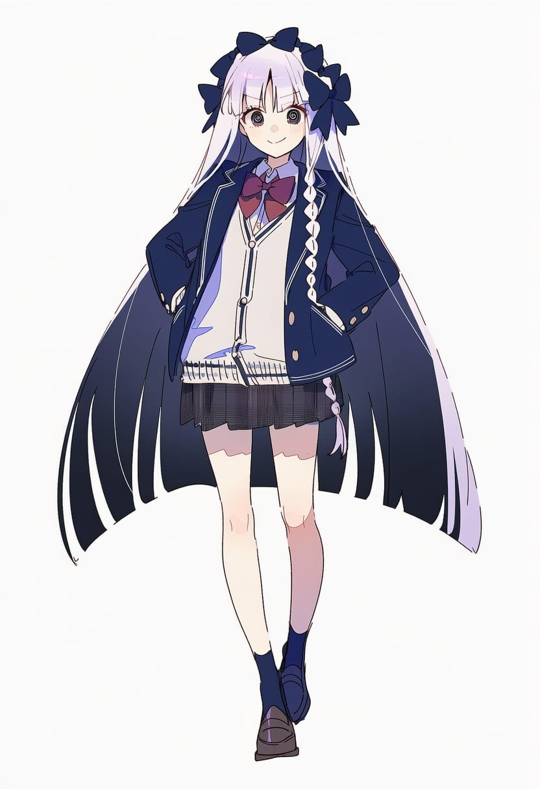

| 字段 | 内容 |
| --- | --- |
| 序号 | 0045 |
| tag | jacket |
| tag中文名 | 夹克 |
| tag中文含义 | 较短的外穿上衣/外套泛称。 |
| tag所属的子类 | 夹克 / 西装外套 |
| 角色 | francesca_prelati_(fate) |

## 45. black_jacket — 黑色夹克

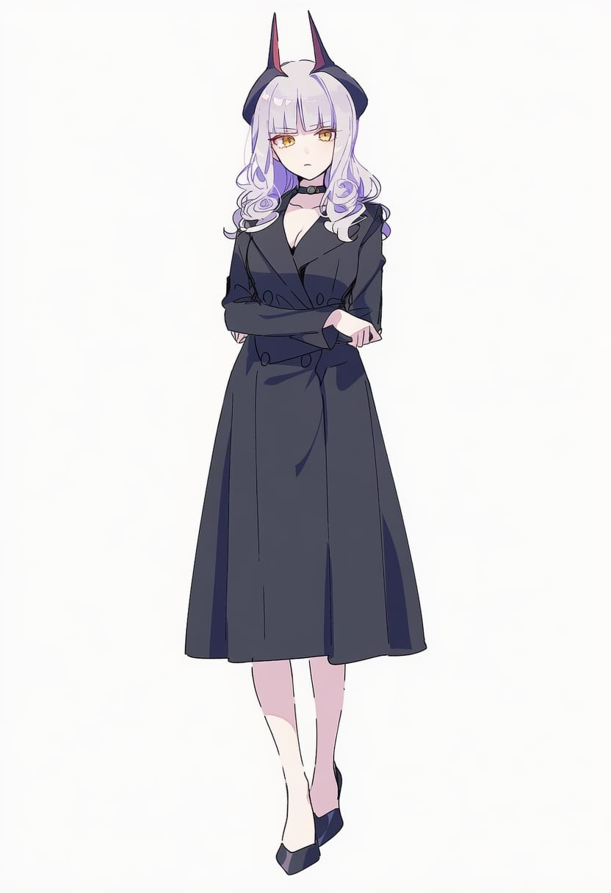

| 字段 | 内容 |
| --- | --- |
| 序号 | 0046 |
| tag | black_jacket |
| tag中文名 | 黑色夹克 |
| tag中文含义 | 黑色 jacket；作为夹克颜色变体的代表样本。 |
| tag所属的子类 | 夹克 / 西装外套 |
| 角色 | carmilla_(fate) |

## 46. blazer — 西装式夹克

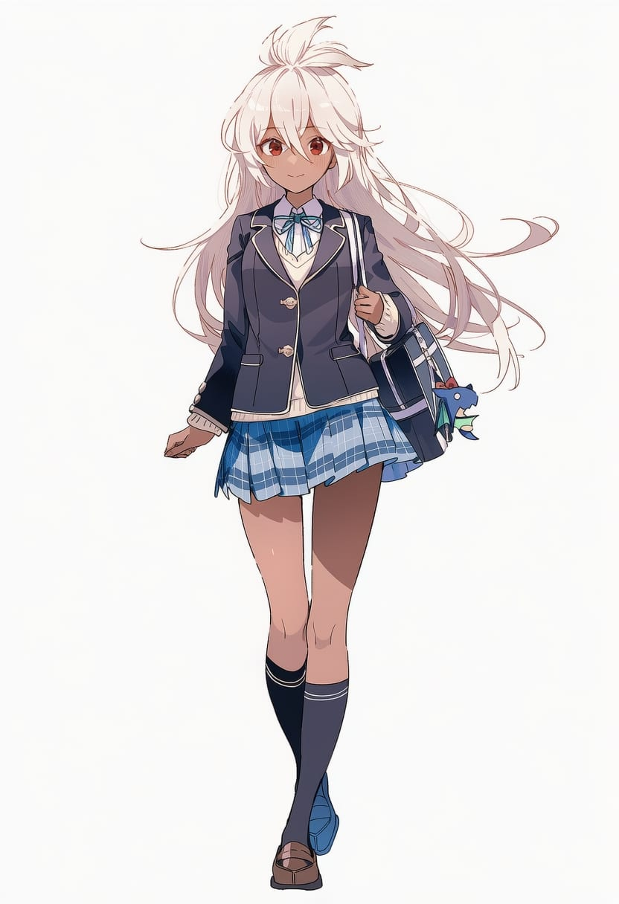

| 字段 | 内容 |
| --- | --- |
| 序号 | 0047 |
| tag | blazer |
| tag中文名 | 西装式夹克 |
| tag中文含义 | 偏学院或半正式风格的单件西装外套。 |
| tag所属的子类 | 夹克 / 西装外套 |
| 角色 | zooey_(granblue_fantasy) |

## 47. bomber_jacket — 飞行夹克

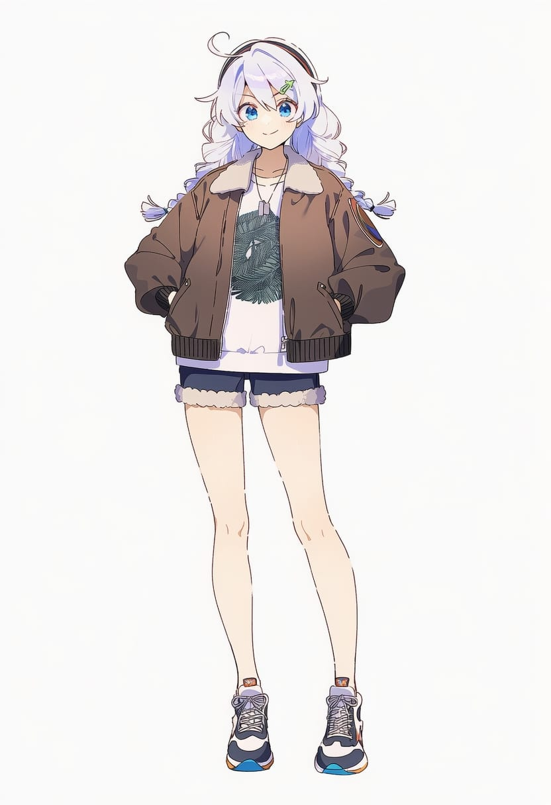

| 字段 | 内容 |
| --- | --- |
| 序号 | 0048 |
| tag | bomber_jacket |
| tag中文名 | 飞行夹克 |
| tag中文含义 | 短款、收口下摆和袖口的飞行员夹克。 |
| tag所属的子类 | 夹克 / 西装外套 |
| 角色 | kiana_kaslana |

## 48. cropped_jacket — 短款夹克

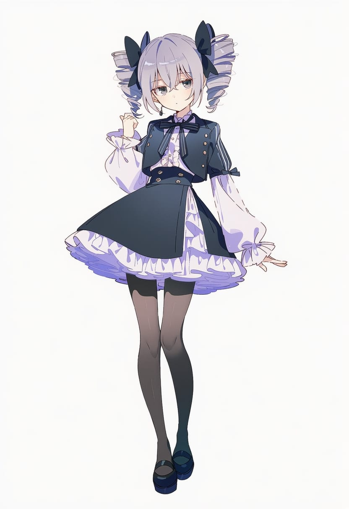

| 字段 | 内容 |
| --- | --- |
| 序号 | 0049 |
| tag | cropped_jacket |
| tag中文名 | 短款夹克 |
| tag中文含义 | 下摆明显缩短的 jacket / bolero 类外套。 |
| tag所属的子类 | 夹克 / 西装外套 |
| 角色 | bronya_zaychik |

## 49. denim_jacket — 牛仔夹克

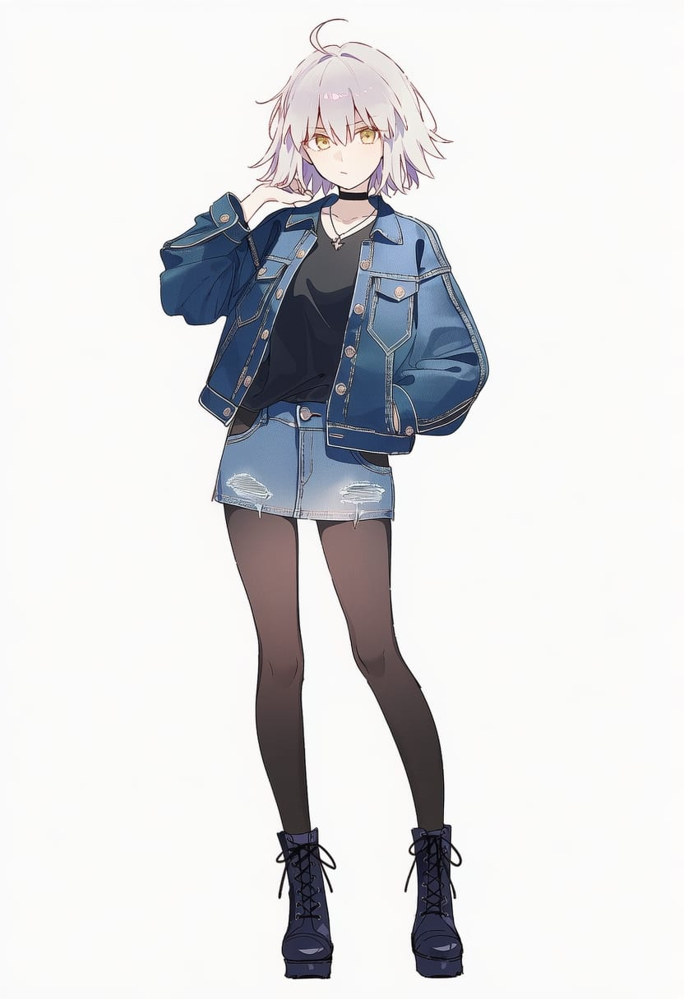

| 字段 | 内容 |
| --- | --- |
| 序号 | 0050 |
| tag | denim_jacket |
| tag中文名 | 牛仔夹克 |
| tag中文含义 | 以牛仔布为主要材质的夹克。 |
| tag所属的子类 | 夹克 / 西装外套 |
| 角色 | jeanne_d'arc_alter_(avenger)_(fate) |

## 50. down_jacket — 羽绒夹克

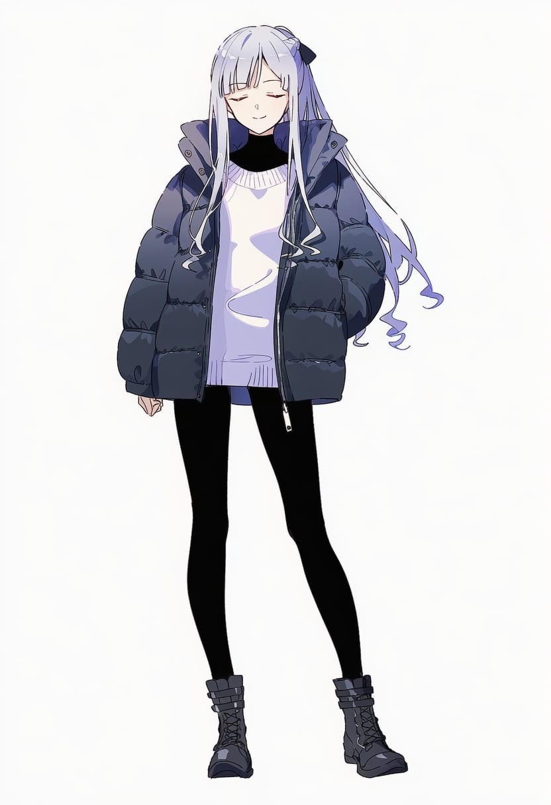

| 字段 | 内容 |
| --- | --- |
| 序号 | 0051 |
| tag | down_jacket |
| tag中文名 | 羽绒夹克 |
| tag中文含义 | 填充羽绒/保暖填充物的蓬松夹克。 |
| tag所属的子类 | 夹克 / 西装外套 |
| 角色 | ak-12_(girls'_frontline) |

## 51. hooded_jacket — 连帽夹克

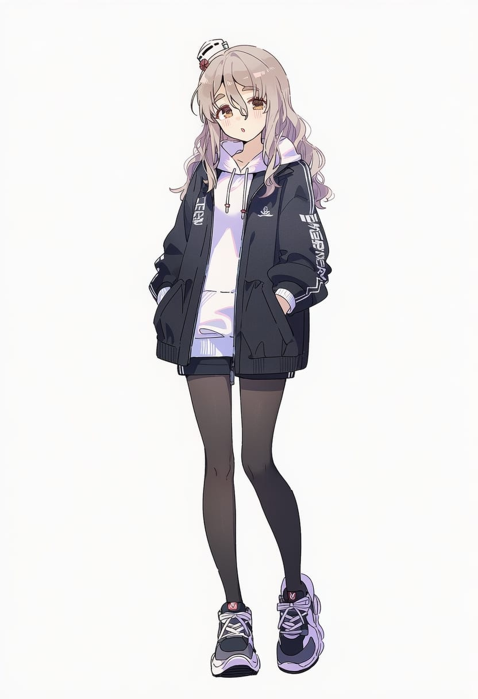

| 字段 | 内容 |
| --- | --- |
| 序号 | 0052 |
| tag | hooded_jacket |
| tag中文名 | 连帽夹克 |
| tag中文含义 | 带固定或可见连帽的夹克。 |
| tag所属的子类 | 夹克 / 西装外套 |
| 角色 | pola_(kancolle) |

## 52. leather_jacket — 皮夹克

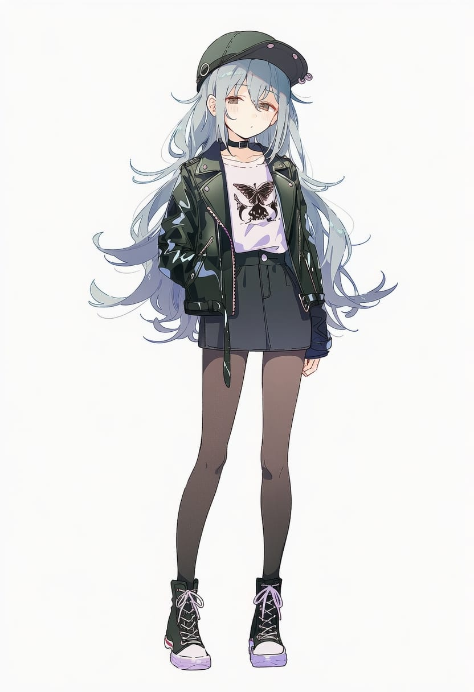

| 字段 | 内容 |
| --- | --- |
| 序号 | 0053 |
| tag | leather_jacket |
| tag中文名 | 皮夹克 |
| tag中文含义 | 以皮革或仿皮为主要材质的夹克。 |
| tag所属的子类 | 夹克 / 西装外套 |
| 角色 | g11_(girls'_frontline) |

## 53. letterman_jacket — 棒球校队夹克

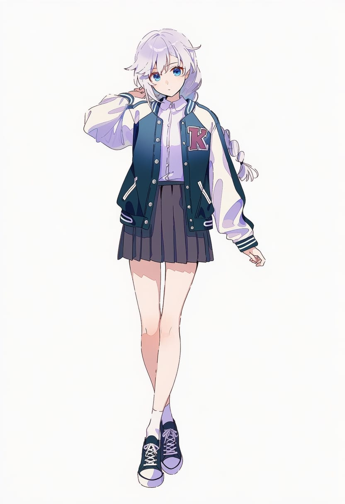

| 字段 | 内容 |
| --- | --- |
| 序号 | 0054 |
| tag | letterman_jacket |
| tag中文名 | 棒球校队夹克 |
| tag中文含义 | 美式校队/棒球夹克风格外套。 |
| tag所属的子类 | 夹克 / 西装外套 |
| 角色 | kallen_kaslana |

## 54. military_jacket — 军装夹克

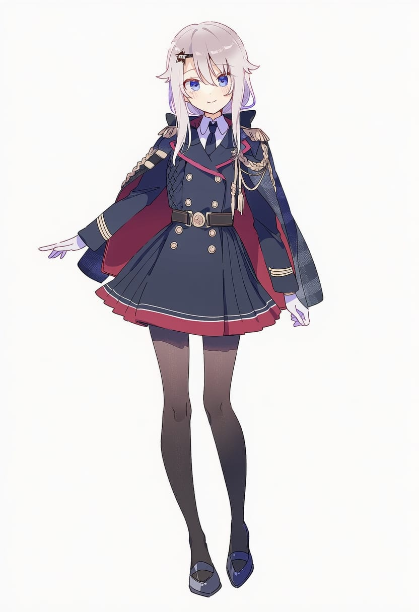

| 字段 | 内容 |
| --- | --- |
| 序号 | 0055 |
| tag | military_jacket |
| tag中文名 | 军装夹克 |
| tag中文含义 | 具有军服剪裁、肩章或军装元素的夹克。 |
| tag所属的子类 | 夹克 / 西装外套 |
| 角色 | 9a-91_(girls'_frontline) |

## 55. safari_jacket — 狩猎夹克

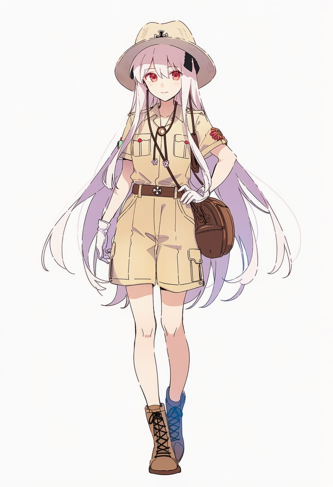

| 字段 | 内容 |
| --- | --- |
| 序号 | 0056 |
| tag | safari_jacket |
| tag中文名 | 狩猎夹克 |
| tag中文含义 | 多口袋、腰带等典型 safari 风格夹克。 |
| tag所属的子类 | 夹克 / 西装外套 |
| 角色 | kar98k_(girls'_frontline) |

## 56. suit_jacket — 西装外套

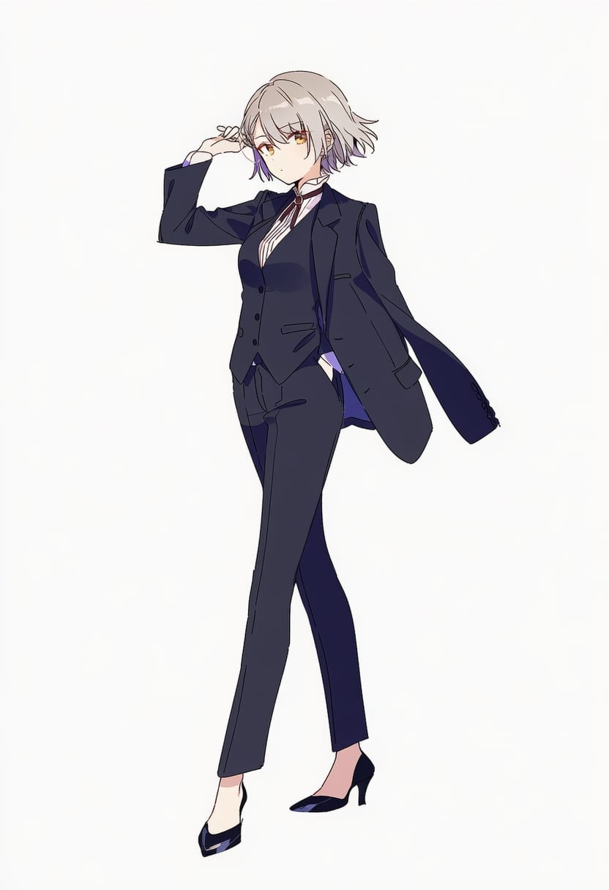

| 字段 | 内容 |
| --- | --- |
| 序号 | 0057 |
| tag | suit_jacket |
| tag中文名 | 西装外套 |
| tag中文含义 | 正式西装套装中的上衣外套。 |
| tag所属的子类 | 夹克 / 西装外套 |
| 角色 | vector_(girls'_frontline) |

## 57. sukajan — 横须贺刺绣夹克

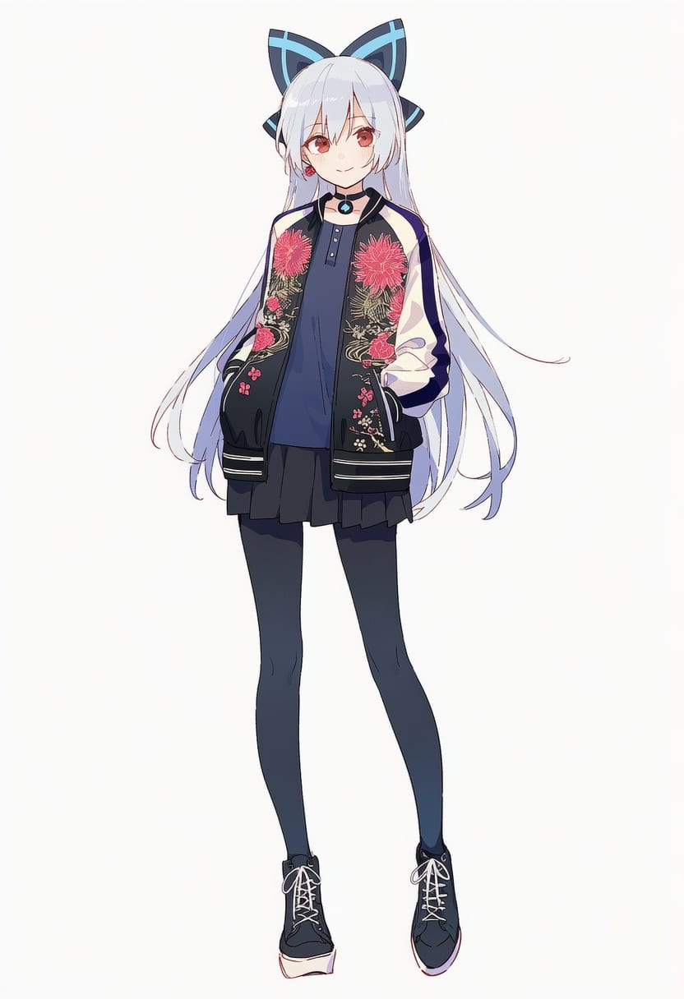

| 字段 | 内容 |
| --- | --- |
| 序号 | 0058 |
| tag | sukajan |
| tag中文名 | 横须贺刺绣夹克 |
| tag中文含义 | 日式横须贺夹克，常带刺绣和光泽面料。 |
| tag所属的子类 | 夹克 / 西装外套 |
| 角色 | tokarev_(girls'_frontline) |

## 58. track_jacket — 运动夹克

| 字段 | 内容 |
| --- | --- |
| 序号 | 0059 |
| tag | track_jacket |
| tag中文名 | 运动夹克 |
| tag中文含义 | 运动套装上衣，常带拉链和运动条纹。 |
| tag所属的子类 | 夹克 / 西装外套 |
| 角色 | five-seven_(girls'_frontline) |

## 59. flak_jacket — 防破片背心式夹克

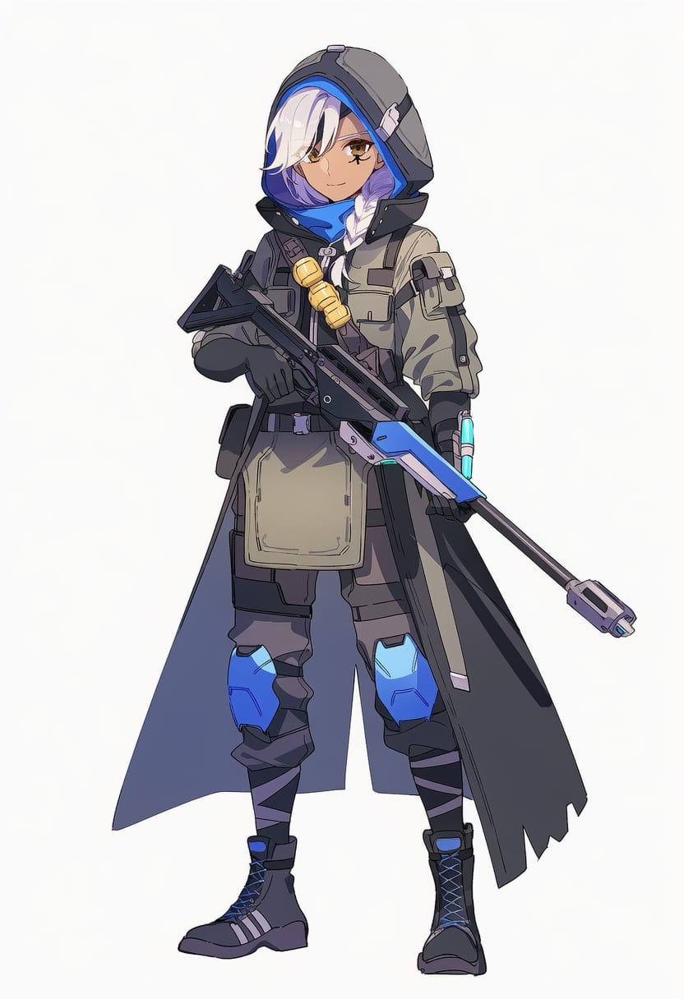

| 字段 | 内容 |
| --- | --- |
| 序号 | 0060 |
| tag | flak_jacket |
| tag中文名 | 防破片背心式夹克 |
| tag中文含义 | 军用防护/战术感较强的 flak jacket。 |
| tag所属的子类 | 夹克 / 西装外套 |
| 角色 | ana_(overwatch) |

## 60. camouflage_jacket — 迷彩夹克

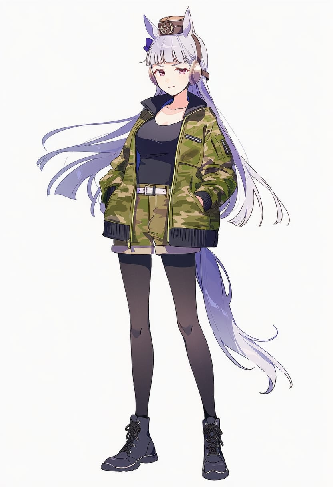

| 字段 | 内容 |
| --- | --- |
| 序号 | 0061 |
| tag | camouflage_jacket |
| tag中文名 | 迷彩夹克 |
| tag中文含义 | 采用迷彩图案的夹克。 |
| tag所属的子类 | 夹克 / 西装外套 |
| 角色 | gold_ship_(umamusume) |

## 61. fur-trimmed_jacket — 毛边夹克

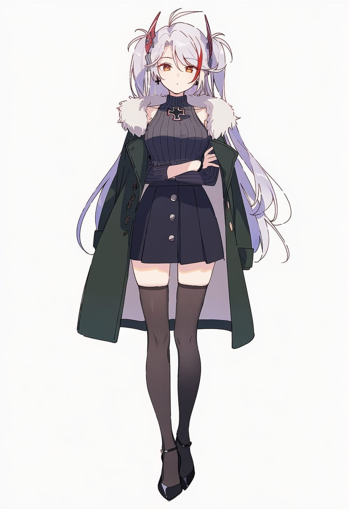

| 字段 | 内容 |
| --- | --- |
| 序号 | 0068 |
| tag | fur-trimmed_jacket |
| tag中文名 | 毛边夹克 |
| tag中文含义 | 领口、袖口或衣摆带毛绒饰边的夹克。 |
| tag所属的子类 | 夹克 / 西装外套 |
| 角色 | prinz_eugen_(azur_lane) |

## 62. fur_jacket — 毛皮夹克

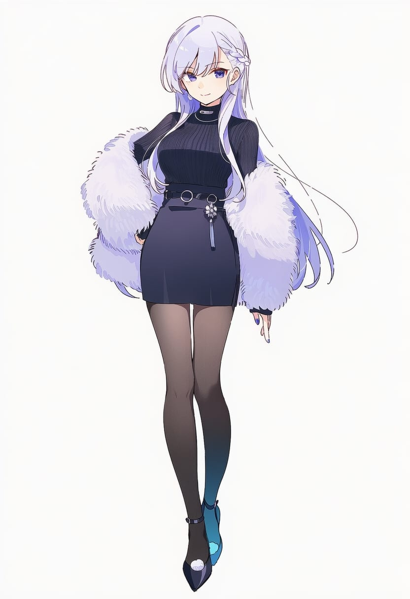

| 字段 | 内容 |
| --- | --- |
| 序号 | 0069 |
| tag | fur_jacket |
| tag中文名 | 毛皮夹克 |
| tag中文含义 | 主体为毛皮/毛绒材质的夹克。 |
| tag所属的子类 | 夹克 / 西装外套 |
| 角色 | belfast_(azur_lane) |

## 63. see-through_jacket — 透视夹克

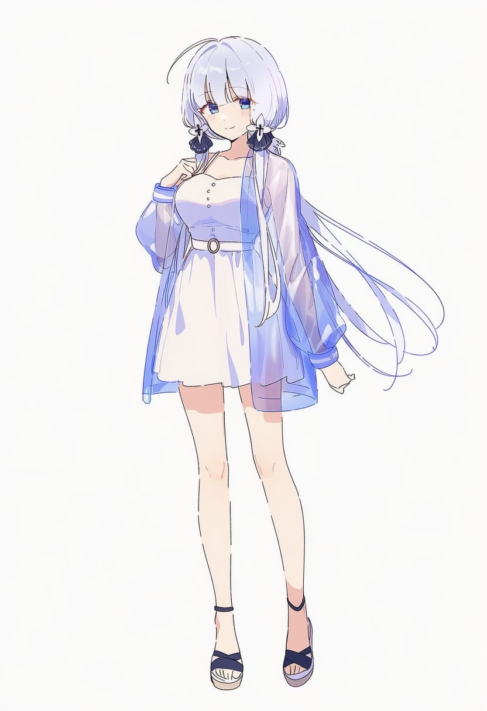

| 字段 | 内容 |
| --- | --- |
| 序号 | 0070 |
| tag | see-through_jacket |
| tag中文名 | 透视夹克 |
| tag中文含义 | 材质透明或半透明的夹克。 |
| tag所属的子类 | 夹克 / 西装外套 |
| 角色 | illustrious_(azur_lane) |

## 64. tied_jacket — 系结夹克

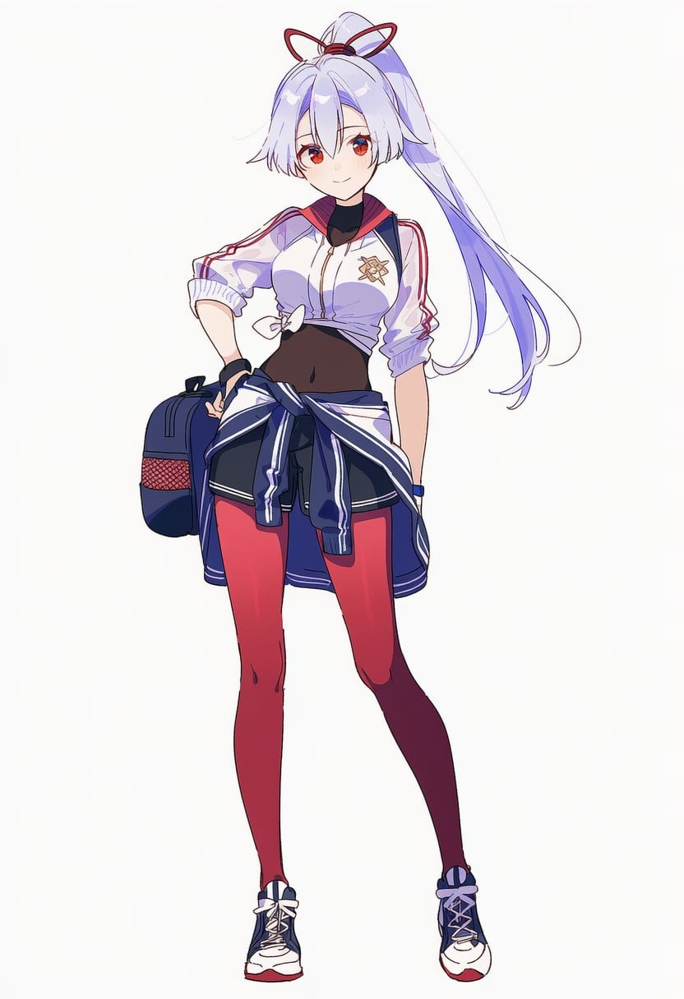

| 字段 | 内容 |
| --- | --- |
| 序号 | 0071 |
| tag | tied_jacket |
| tag中文名 | 系结夹克 |
| tag中文含义 | 衣摆/袖子等被打结系住的夹克。 |
| tag所属的子类 | 夹克 / 西装外套 |
| 角色 | tomoe_gozen_(fate) |

## 65. torn_jacket — 破损夹克

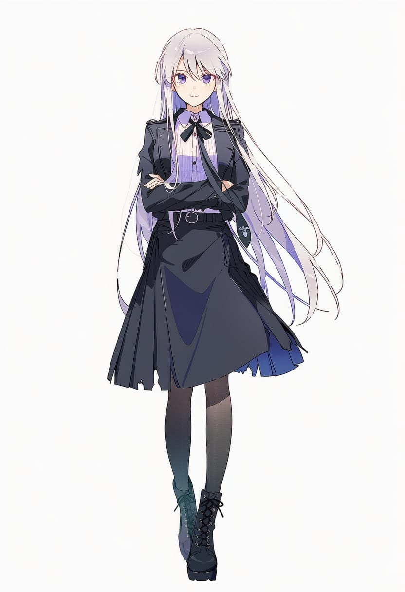

| 字段 | 内容 |
| --- | --- |
| 序号 | 0072 |
| tag | torn_jacket |
| tag中文名 | 破损夹克 |
| tag中文含义 | 有撕裂、破洞或明显破损的夹克。 |
| tag所属的子类 | 夹克 / 西装外套 |
| 角色 | enterprise_(azur_lane) |

## 66. coat — 大衣 / 外套

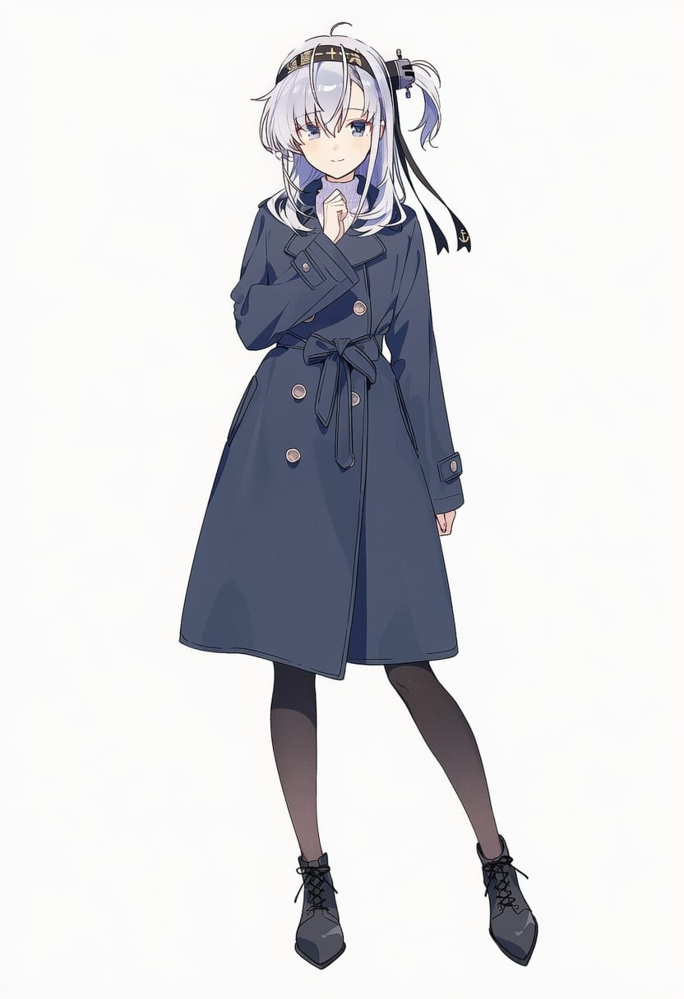

| 字段 | 内容 |
| --- | --- |
| 序号 | 0073 |
| tag | coat |
| tag中文名 | 大衣 / 外套 |
| tag中文含义 | 长度通常比 jacket 更长的外穿保暖服装。 |
| tag所属的子类 | 大衣 / 披肩外套 |
| 角色 | suzutsuki_(kancolle) |

## 67. white_coat — 白色大衣

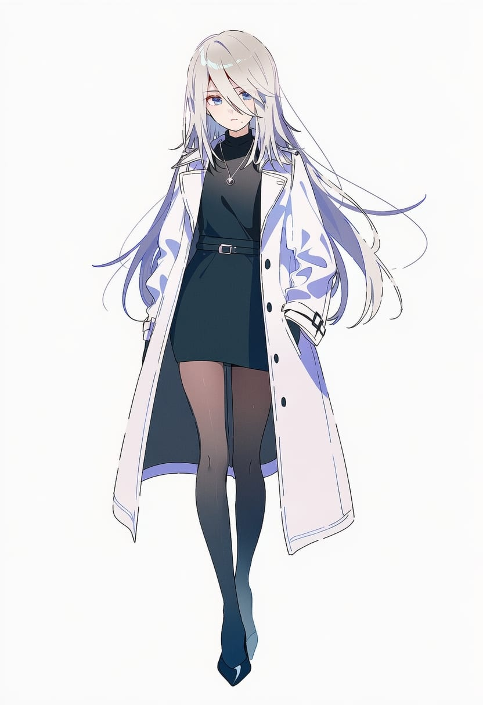

| 字段 | 内容 |
| --- | --- |
| 序号 | 0074 |
| tag | white_coat |
| tag中文名 | 白色大衣 |
| tag中文含义 | 白色 coat；作为大衣颜色变体的代表样本。 |
| tag所属的子类 | 大衣 / 披肩外套 |
| 角色 | a2_(nier:automata) |

## 68. duffel_coat — 牛角扣大衣

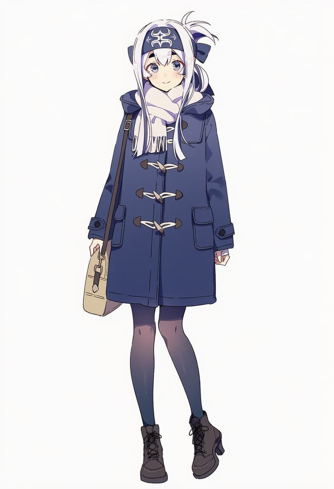

| 字段 | 内容 |
| --- | --- |
| 序号 | 0075 |
| tag | duffel_coat |
| tag中文名 | 牛角扣大衣 |
| tag中文含义 | 带木质/角形搭扣的 duffel coat。 |
| tag所属的子类 | 大衣 / 披肩外套 |
| 角色 | kamoi_(kancolle) |

## 69. fur_coat — 毛皮大衣

| 字段 | 内容 |
| --- | --- |
| 序号 | 0076 |
| tag | fur_coat |
| tag中文名 | 毛皮大衣 |
| tag中文含义 | 主体由毛皮或毛绒材质构成的大衣。 |
| tag所属的子类 | 大衣 / 披肩外套 |
| 角色 | graf_zeppelin_(azur_lane) |

## 70. fur-trimmed_coat — 毛边大衣

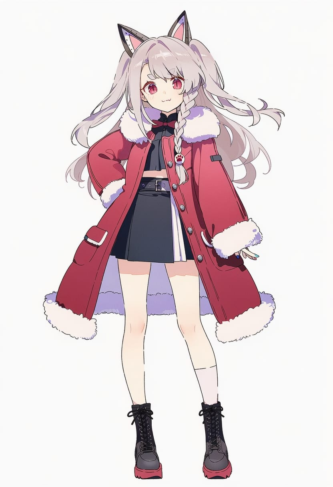

| 字段 | 内容 |
| --- | --- |
| 序号 | 0077 |
| tag | fur-trimmed_coat |
| tag中文名 | 毛边大衣 |
| tag中文含义 | 领口、袖口或下摆带毛绒饰边的大衣。 |
| tag所属的子类 | 大衣 / 披肩外套 |
| 角色 | yuudachi_(azur_lane) |

## 71. long_coat — 长大衣

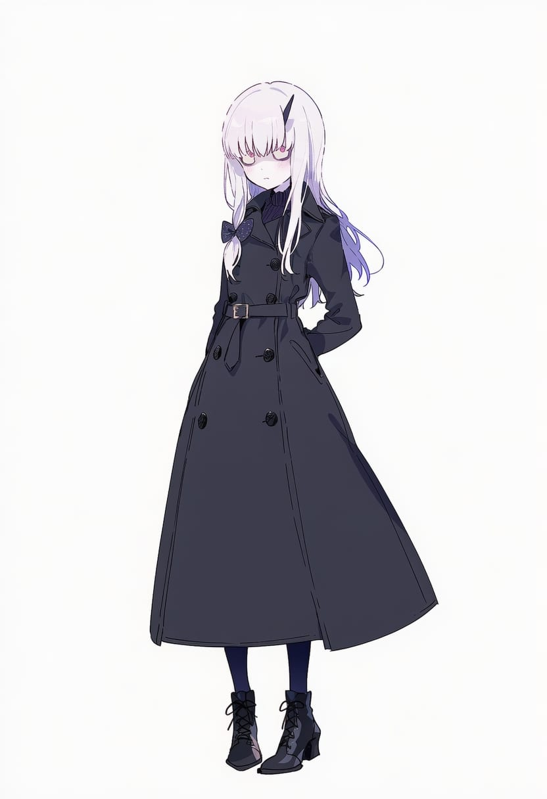

| 字段 | 内容 |
| --- | --- |
| 序号 | 0078 |
| tag | long_coat |
| tag中文名 | 长大衣 |
| tag中文含义 | 衣长明显延伸至大腿、膝部或更低的位置。 |
| tag所属的子类 | 大衣 / 披肩外套 |
| 角色 | lavinia_whateley_(fate) |

## 72. overcoat — 长款正装大衣

| 字段 | 内容 |
| --- | --- |
| 序号 | 0079 |
| tag | overcoat |
| tag中文名 | 长款正装大衣 |
| tag中文含义 | 通常穿在西装等服装外层的长外套。 |
| tag所属的子类 | 大衣 / 披肩外套 |
| 角色 | vladilena_millize |

## 73. peacoat — 海军呢大衣

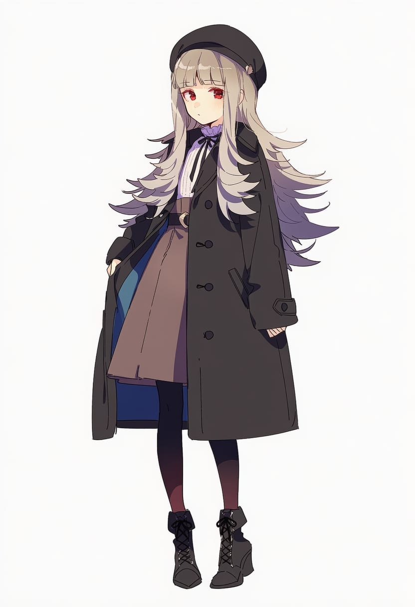

| 字段 | 内容 |
| --- | --- |
| 序号 | 0080 |
| tag | peacoat |
| tag中文名 | 海军呢大衣 |
| tag中文含义 | 双排扣、短至中长款的海军风呢大衣。 |
| tag所属的子类 | 大衣 / 披肩外套 |
| 角色 | veronica_(fire_emblem) |

## 74. raincoat — 雨衣

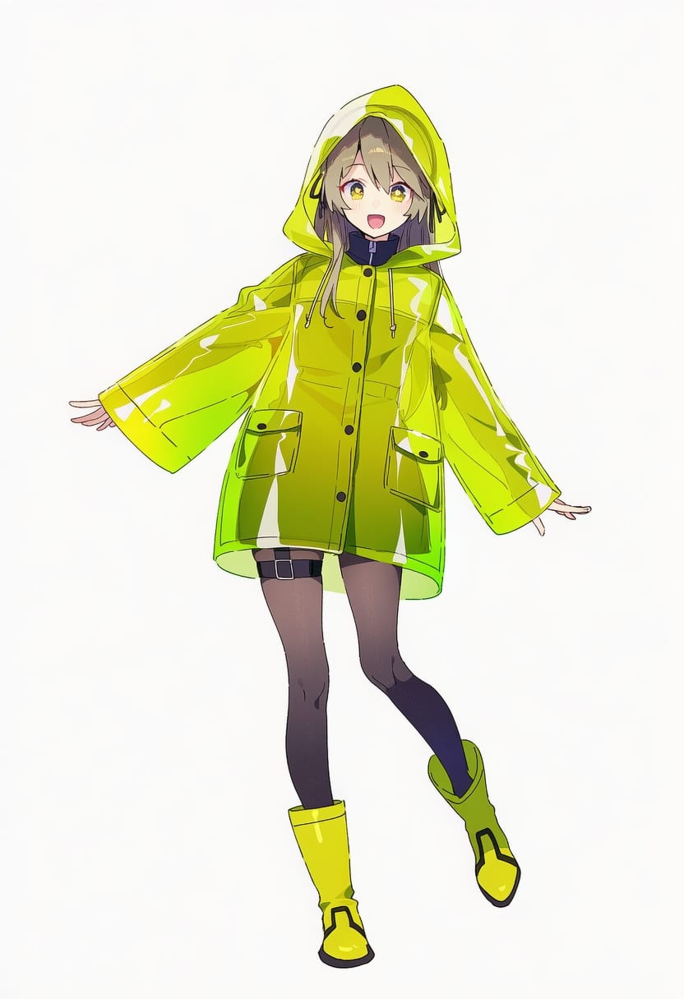

| 字段 | 内容 |
| --- | --- |
| 序号 | 0081 |
| tag | raincoat |
| tag中文名 | 雨衣 |
| tag中文含义 | 用于防雨的外穿上衣/外套。 |
| tag所属的子类 | 大衣 / 披肩外套 |
| 角色 | ump40_(girls'_frontline) |

## 75. yellow_raincoat — 黄色雨衣

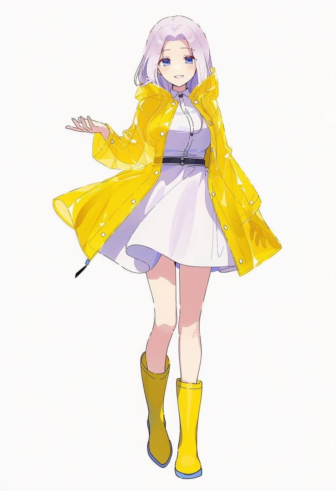

| 字段 | 内容 |
| --- | --- |
| 序号 | 0082 |
| tag | yellow_raincoat |
| tag中文名 | 黄色雨衣 |
| tag中文含义 | 黄色 raincoat；作为雨衣颜色变体的代表样本。 |
| tag所属的子类 | 大衣 / 披肩外套 |
| 角色 | yorktown_(azur_lane) |

## 76. see-through_raincoat — 透明雨衣

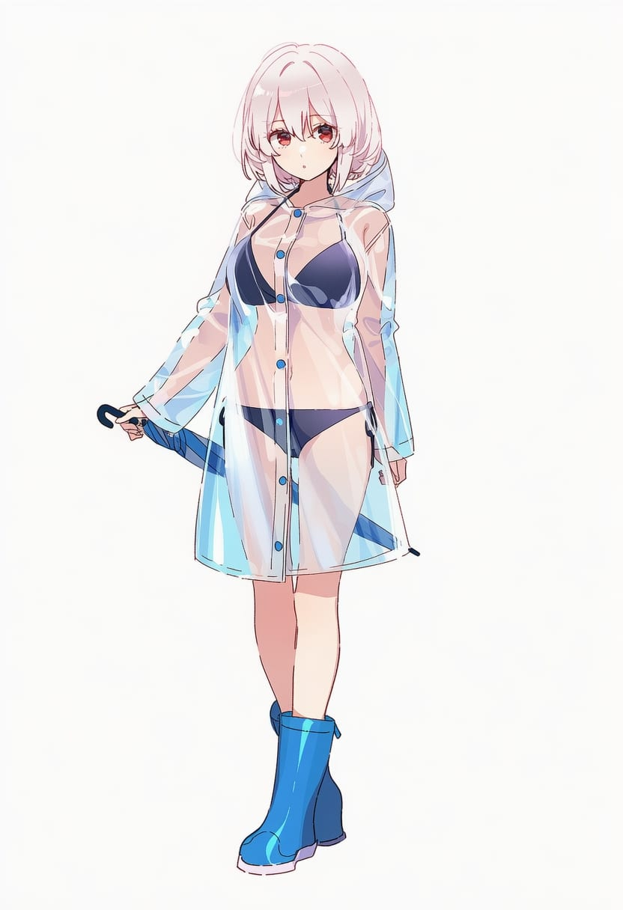

| 字段 | 内容 |
| --- | --- |
| 序号 | 0083 |
| tag | see-through_raincoat |
| tag中文名 | 透明雨衣 |
| tag中文含义 | 透明或半透明材质的雨衣。 |
| tag所属的子类 | 大衣 / 披肩外套 |
| 角色 | sirius_(azur_lane) |

## 77. trench_coat — 风衣

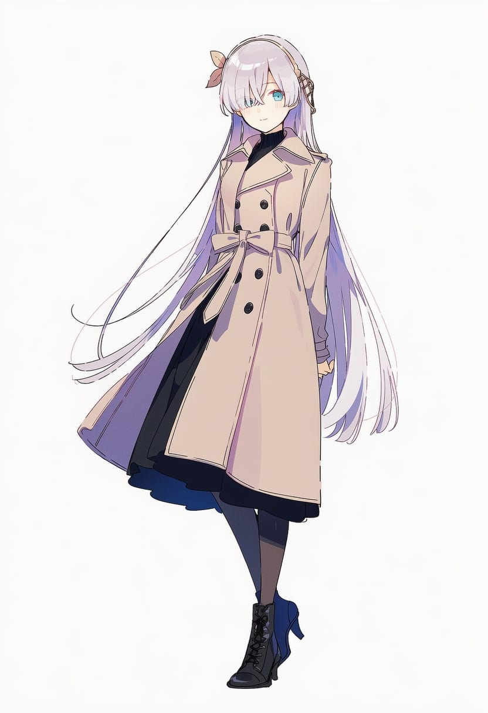

| 字段 | 内容 |
| --- | --- |
| 序号 | 0084 |
| tag | trench_coat |
| tag中文名 | 风衣 |
| tag中文含义 | 带翻领、腰带等经典 trench 结构的长外套。 |
| tag所属的子类 | 大衣 / 披肩外套 |
| 角色 | anastasia_(fate) |

## 78. winter_coat — 冬季大衣

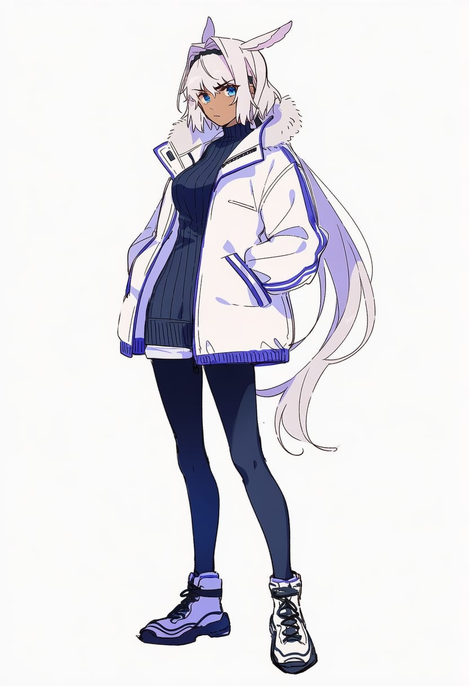

| 字段 | 内容 |
| --- | --- |
| 序号 | 0085 |
| tag | winter_coat |
| tag中文名 | 冬季大衣 |
| tag中文含义 | 强调厚重保暖属性的冬季外套。 |
| tag所属的子类 | 大衣 / 披肩外套 |
| 角色 | caenis_(fate) |

## 79. lab_coat — 实验服 / 白大褂

| 字段 | 内容 |
| --- | --- |
| 序号 | 0086 |
| tag | lab_coat |
| tag中文名 | 实验服 / 白大褂 |
| tag中文含义 | 医生、科研人员常穿的长款工作外套。 |
| tag所属的子类 | 大衣 / 披肩外套 |
| 角色 | yukoku_kiriko |

## 80. military_coat — 军装大衣

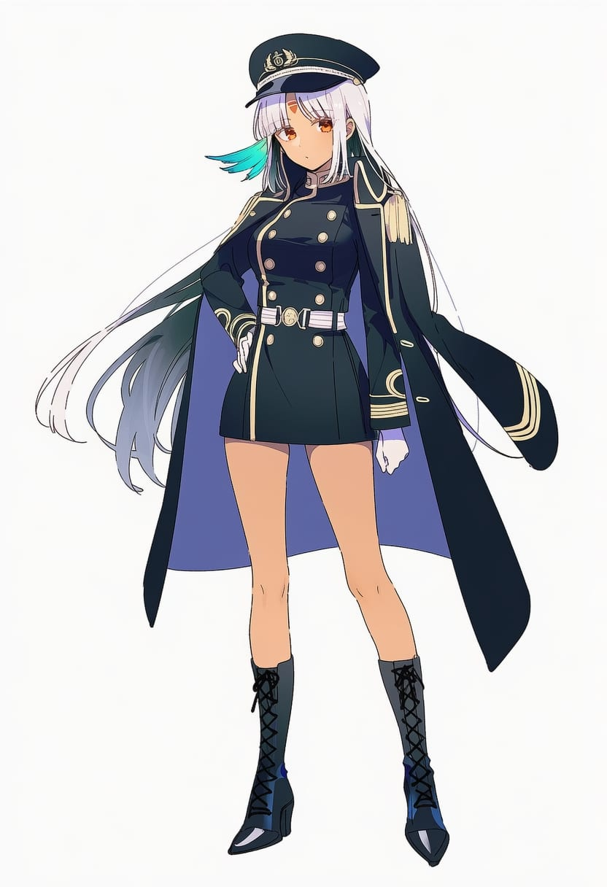

| 字段 | 内容 |
| --- | --- |
| 序号 | 0087 |
| tag | military_coat |
| tag中文名 | 军装大衣 |
| tag中文含义 | 带军服元素的长款外套。 |
| tag所属的子类 | 大衣 / 披肩外套 |
| 角色 | massachusetts_(azur_lane) |

## 81. poncho — 斗篷式披肩

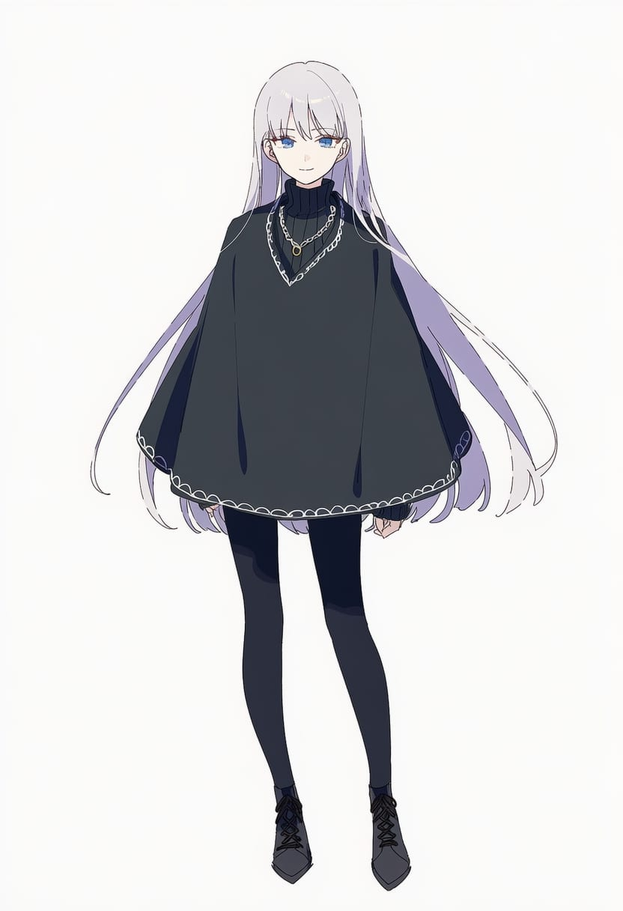

| 字段 | 内容 |
| --- | --- |
| 序号 | 0088 |
| tag | poncho |
| tag中文名 | 斗篷式披肩 |
| tag中文含义 | 无常规袖子、由头部套入的宽大披肩式上衣。 |
| tag所属的子类 | 大衣 / 披肩外套 |
| 角色 | angelica_(project_moon) |

## 82. cape — 披风

| 字段 | 内容 |
| --- | --- |
| 序号 | 0089 |
| tag | cape |
| tag中文名 | 披风 |
| tag中文含义 | 从肩部垂下、无独立袖子的外披服装。 |
| tag所属的子类 | 大衣 / 披肩外套 |
| 角色 | aa-12_(girls'_frontline) |

## 83. capelet — 短披肩

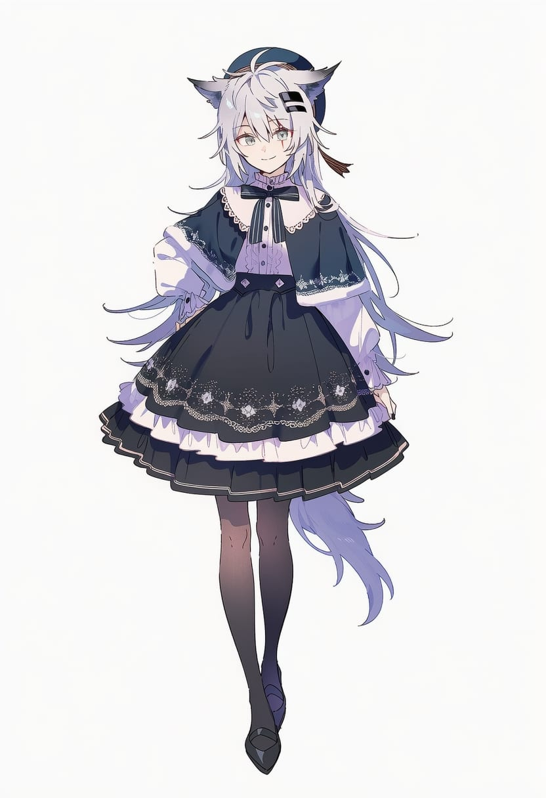

| 字段 | 内容 |
| --- | --- |
| 序号 | 0090 |
| tag | capelet |
| tag中文名 | 短披肩 |
| tag中文含义 | 长度较短、覆盖肩部和上胸的 cape。 |
| tag所属的子类 | 大衣 / 披肩外套 |
| 角色 | lappland_(arknights) |

## 84. side_cape — 单侧披风

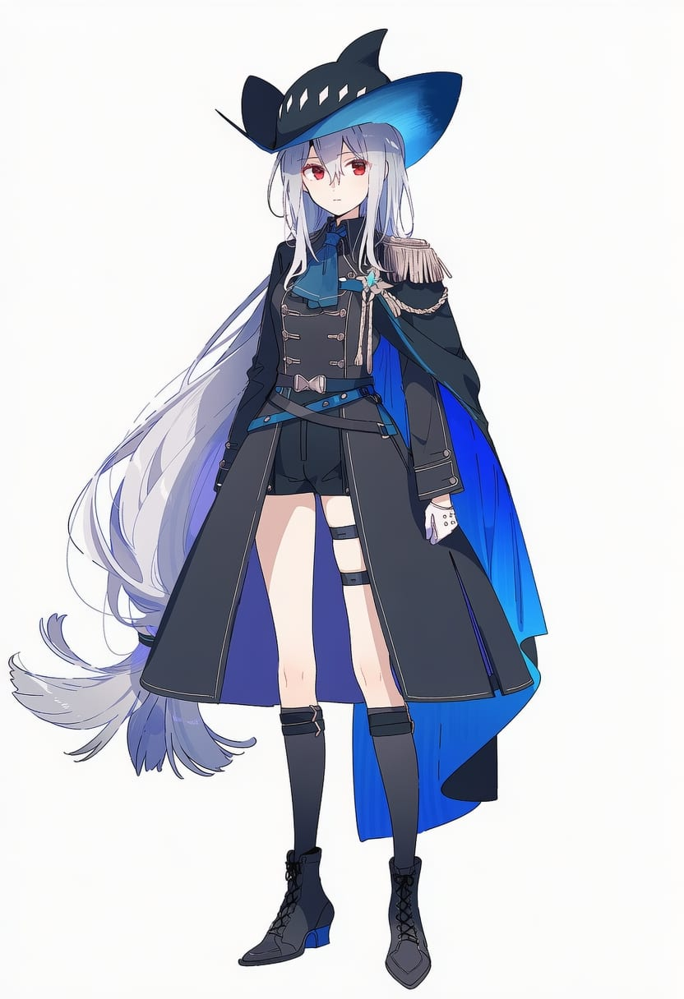

| 字段 | 内容 |
| --- | --- |
| 序号 | 0091 |
| tag | side_cape |
| tag中文名 | 单侧披风 |
| tag中文含义 | 主要从身体一侧肩部垂下的披风。 |
| tag所属的子类 | 大衣 / 披肩外套 |
| 角色 | skadi_(arknights) |

## 85. shawl — 披肩

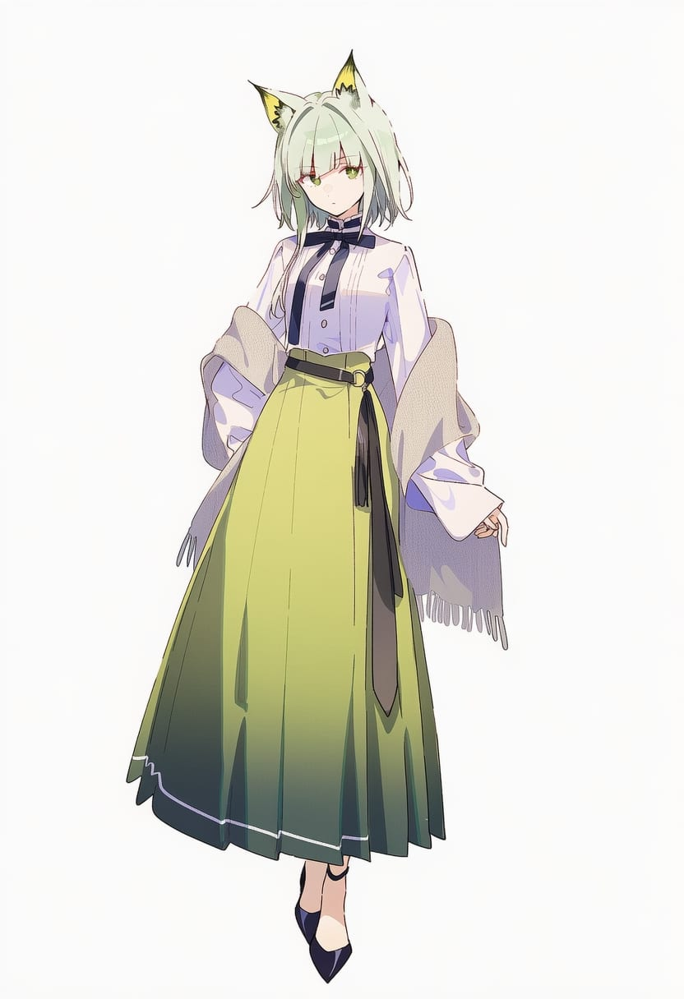

| 字段 | 内容 |
| --- | --- |
| 序号 | 0092 |
| tag | shawl |
| tag中文名 | 披肩 |
| tag中文含义 | 披在肩背上的大块织物或针织外搭。 |
| tag所属的子类 | 大衣 / 披肩外套 |
| 角色 | kal'tsit_(arknights) |

## 86. shrug_(clothing) — 短披肩外套

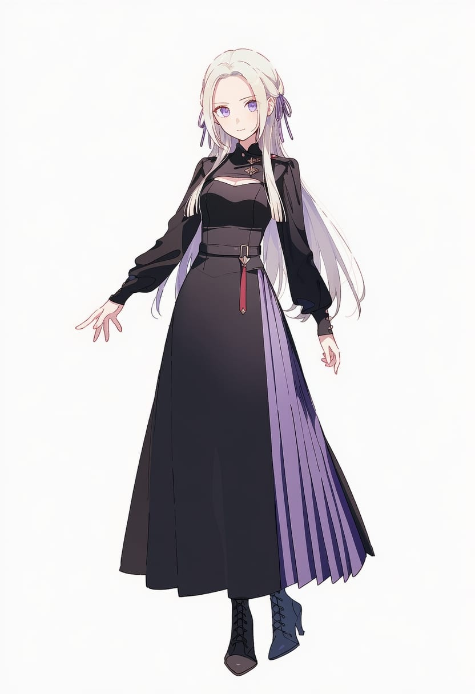

| 字段 | 内容 |
| --- | --- |
| 序号 | 0093 |
| tag | shrug_(clothing) |
| tag中文名 | 短披肩外套 |
| tag中文含义 | 仅覆盖肩、手臂和上背的短外搭。 |
| tag所属的子类 | 大衣 / 披肩外套 |
| 角色 | edelgard_von_hresvelg |

## 87. tailcoat — 燕尾服上衣

| 字段 | 内容 |
| --- | --- |
| 序号 | 0094 |
| tag | tailcoat |
| tag中文名 | 燕尾服上衣 |
| tag中文含义 | 后摆分叉并延长的正式礼服外套。 |
| tag所属的子类 | 大衣 / 披肩外套 |
| 角色 | formidable_(azur_lane) |

## 88. tabard — 罩袍式上衣

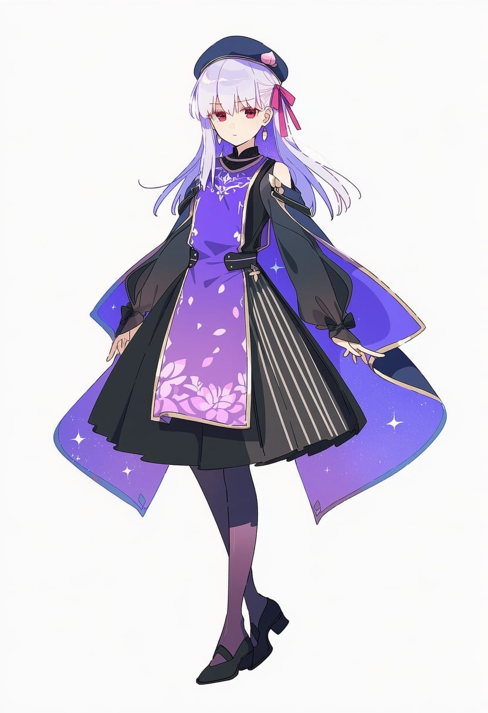

| 字段 | 内容 |
| --- | --- |
| 序号 | 0095 |
| tag | tabard |
| tag中文名 | 罩袍式上衣 |
| tag中文含义 | 套穿在其他服装外、前后垂片明显的无袖罩衣。 |
| tag所属的子类 | 传统 / 特殊上衣 |
| 角色 | kama_(fate) |

## 89. surcoat — 无袖罩衣

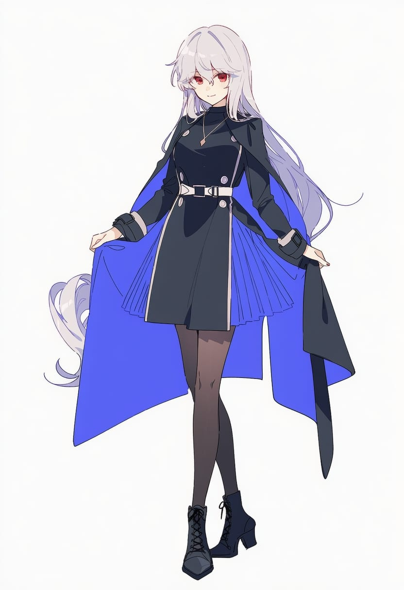

| 字段 | 内容 |
| --- | --- |
| 序号 | 0096 |
| tag | surcoat |
| tag中文名 | 无袖罩衣 |
| tag中文含义 | 中世纪风格、套在盔甲或内衣外层的罩衣。 |
| tag所属的子类 | 传统 / 特殊上衣 |
| 角色 | specter_(arknights) |

## 90. tunic — 束腰长上衣

| 字段 | 内容 |
| --- | --- |
| 序号 | 0097 |
| tag | tunic |
| tag中文名 | 束腰长上衣 |
| tag中文含义 | 长度介于普通上衣和短裙之间的宽松 tunic。 |
| tag所属的子类 | 传统 / 特殊上衣 |
| 角色 | lysithea_von_ordelia |

## 91. rash_guard — 防晒泳衣上衣

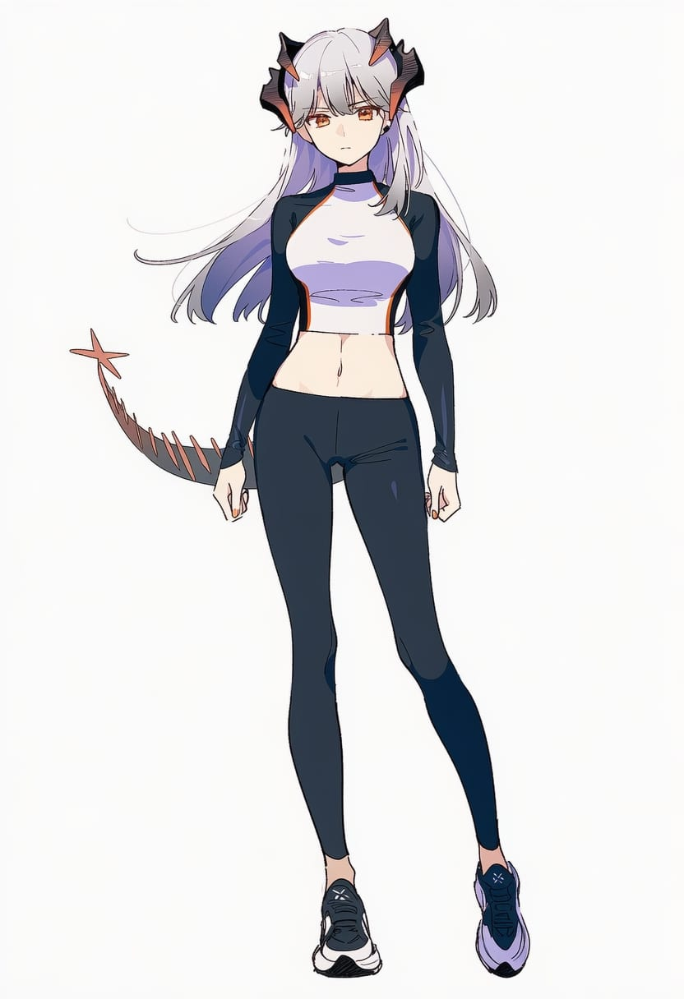

| 字段 | 内容 |
| --- | --- |
| 序号 | 0098 |
| tag | rash_guard |
| tag中文名 | 防晒泳衣上衣 |
| tag中文含义 | 冲浪/水上运动使用的贴身防晒上衣。 |
| tag所属的子类 | 传统 / 特殊上衣 |
| 角色 | saria_(arknights) |

## 92. haori — 羽织

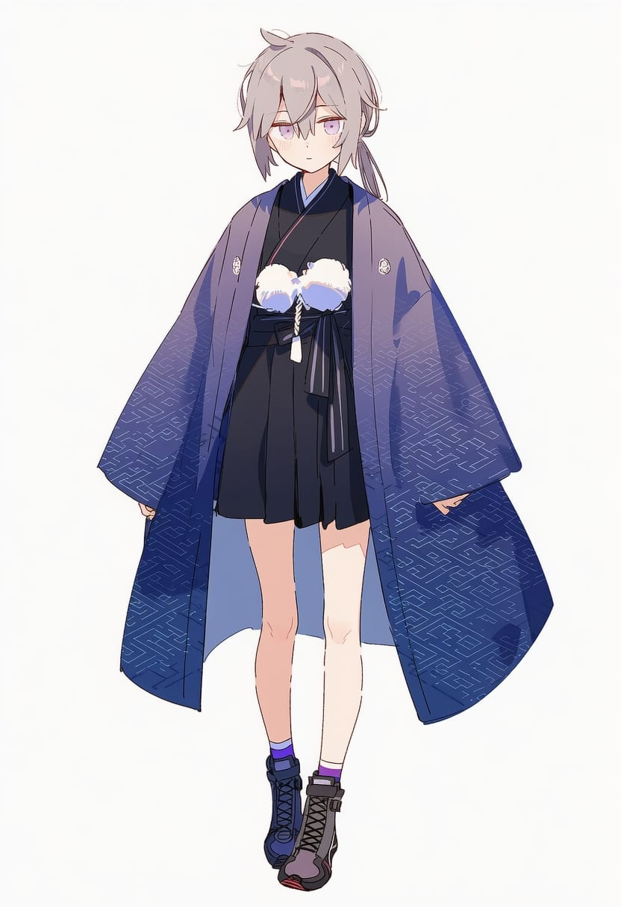

| 字段 | 内容 |
| --- | --- |
| 序号 | 0099 |
| tag | haori |
| tag中文名 | 羽织 |
| tag中文含义 | 日本传统和服外穿的短外套。 |
| tag所属的子类 | 传统 / 特殊上衣 |
| 角色 | m200_(girls'_frontline) |

## 93. happi — 法被

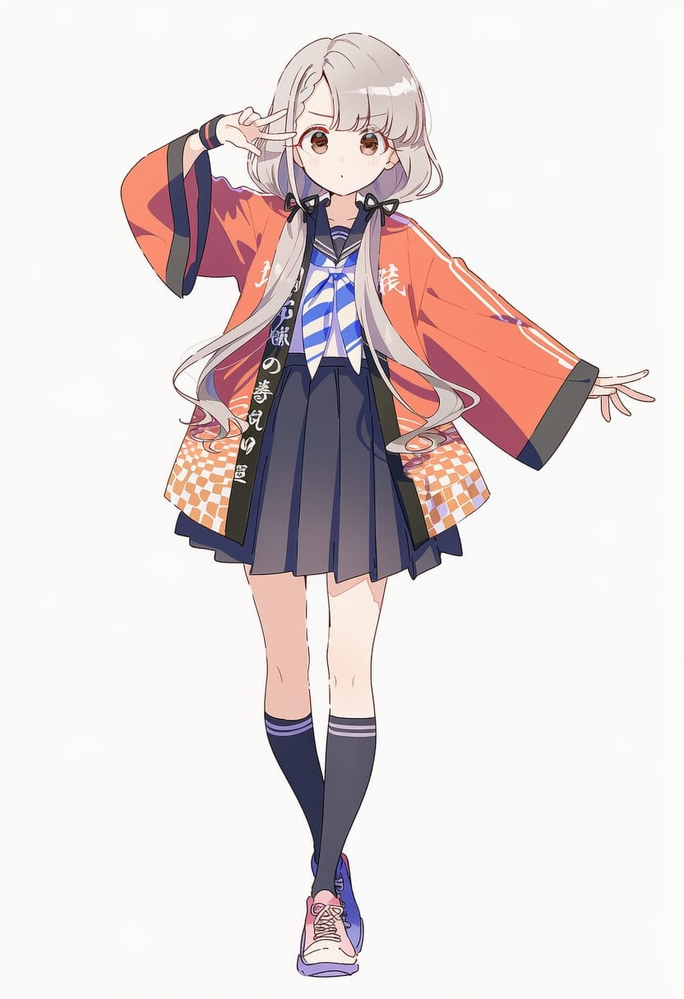

| 字段 | 内容 |
| --- | --- |
| 序号 | 0100 |
| tag | happi |
| tag中文名 | 法被 |
| tag中文含义 | 日本祭典常见、直筒短袖的传统外衣。 |
| tag所属的子类 | 传统 / 特殊上衣 |
| 角色 | hisakawa_nagi |

## 94. hanten — 半缠

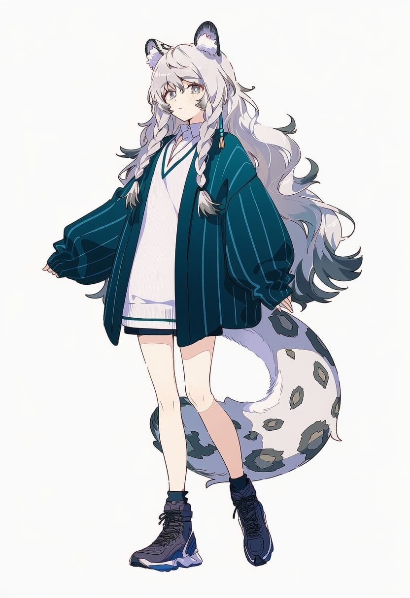

| 字段 | 内容 |
| --- | --- |
| 序号 | 0101 |
| tag | hanten |
| tag中文名 | 半缠 |
| tag中文含义 | 日本传统短外套，常为较厚的保暖款。 |
| tag所属的子类 | 传统 / 特殊上衣 |
| 角色 | pramanix_(arknights) |

## 95. tangzhuang — 唐装上衣

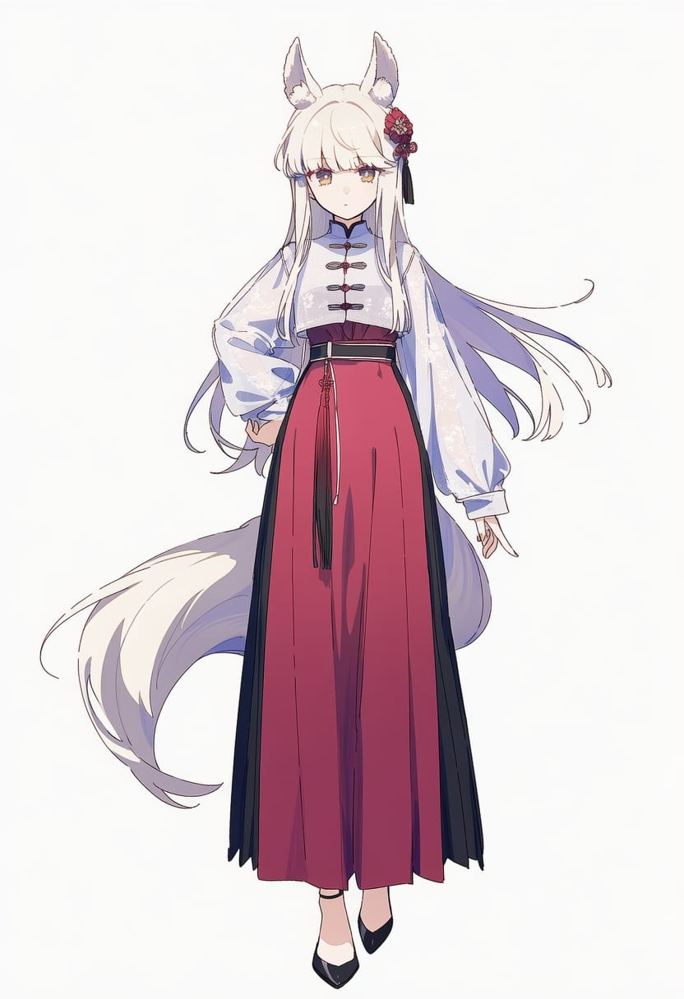

| 字段 | 内容 |
| --- | --- |
| 序号 | 0102 |
| tag | tangzhuang |
| tag中文名 | 唐装上衣 |
| tag中文含义 | 中式立领、盘扣等元素明显的唐装上衣。 |
| tag所属的子类 | 传统 / 特殊上衣 |
| 角色 | platinum_(arknights) |

## 96. muneate — 胸当

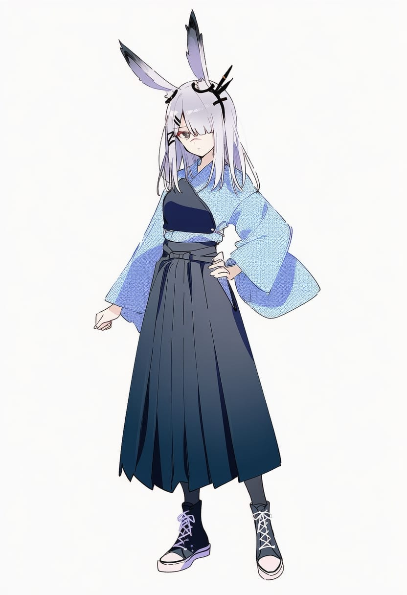

| 字段 | 内容 |
| --- | --- |
| 序号 | 0103 |
| tag | muneate |
| tag中文名 | 胸当 |
| tag中文含义 | 覆盖胸部的传统防护/服饰构件，常见于弓道等。 |
| tag所属的子类 | 传统 / 特殊上衣 |
| 角色 | frostnova_(arknights) |

---
