# 二次元属性

## 1. mature_female, tall_female — 御姐

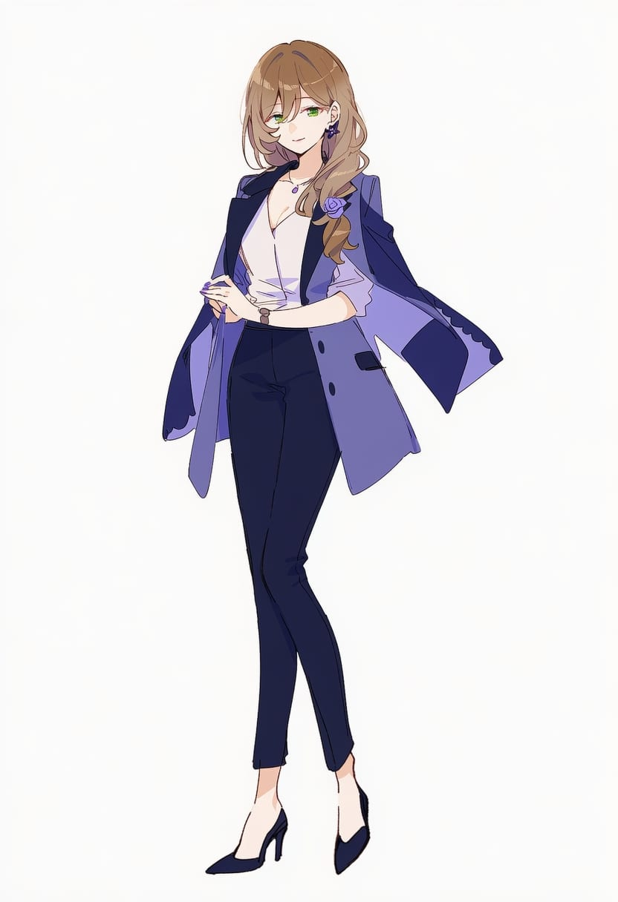

| 字段 | 内容 |
| --- | --- |
| 二次元属性的中文名 | 御姐 |
| Danbooru tag / NovelAI tag串 | mature_female, tall_female |
| 中文属性解释 | 看起来已经是成熟大姐姐，身材和气质都偏成年、修长，不是少女感路线。 |
| 模特 | lisa_(genshin_impact) |
| 序号 | 0001 |

## 2. loli — 萝莉

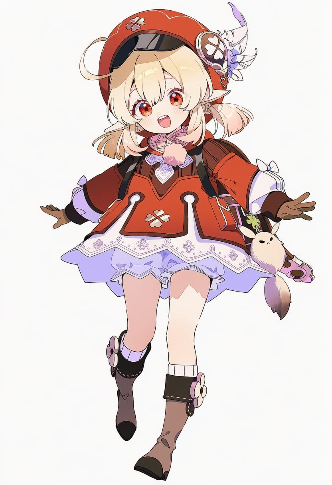

| 字段 | 内容 |
| --- | --- |
| 二次元属性的中文名 | 萝莉 |
| Danbooru tag / NovelAI tag串 | loli |
| 中文属性解释 | 外观看起来年龄很小、幼龄感很强的女性角色。Danbooru 对这个标签的浏览有权限限制。 |
| 模特 | klee_(genshin_impact) |
| 序号 | 0002 |

## 3. gyaru — 辣妹 / Gyaru

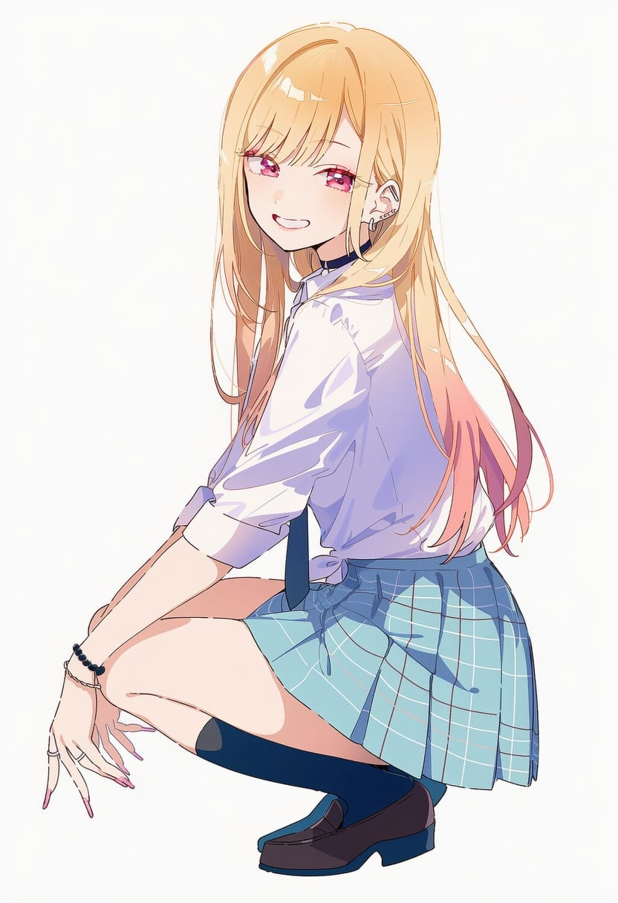

| 字段 | 内容 |
| --- | --- |
| 二次元属性的中文名 | 辣妹 / Gyaru |
| Danbooru tag / NovelAI tag串 | gyaru |
| 中文属性解释 | 日系辣妹风，通常会有明显妆容、染发、时髦穿搭或晒黑等视觉特征。 |
| 模特 | kitagawa_marin |
| 序号 | 0003 |

## 4. onee_gyaru — 大姐姐辣妹

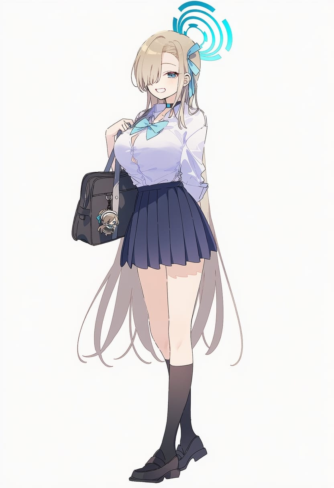

| 字段 | 内容 |
| --- | --- |
| 二次元属性的中文名 | 大姐姐辣妹 |
| Danbooru tag / NovelAI tag串 | onee_gyaru |
| 中文属性解释 | 比普通辣妹更成熟、稳重、偏大姐姐风的 gyaru。 |
| 模特 | asuna_(blue_archive) |
| 序号 | 0004 |

## 5. tomboy — 假小子

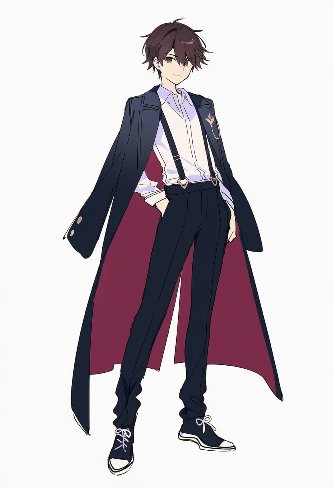

| 字段 | 内容 |
| --- | --- |
| 二次元属性的中文名 | 假小子 |
| Danbooru tag / NovelAI tag串 | tomboy |
| 中文属性解释 | 女生但整体打扮、动作或气质比较男孩子气。 |
| 模特 | beidou_(genshin_impact) |
| 序号 | 0005 |

## 6. tsundere — 傲娇

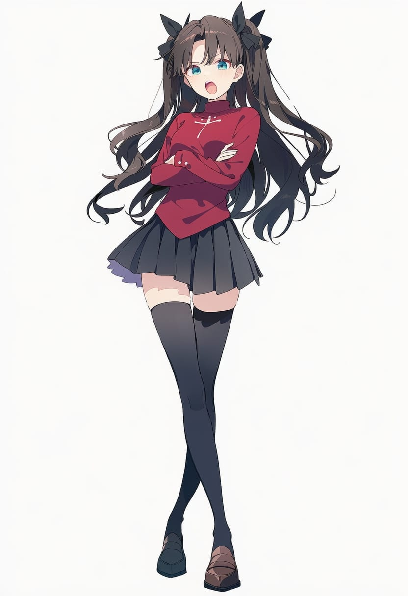

| 字段 | 内容 |
| --- | --- |
| 二次元属性的中文名 | 傲娇 |
| Danbooru tag / NovelAI tag串 | tsundere |
| 中文属性解释 | 嘴上很冲或很冷，实际上很在意别人，典型“才、才不是为了你”的感觉。 |
| 模特 | tohsaka_rin |
| 序号 | 0006 |

## 7. yandere — 病娇

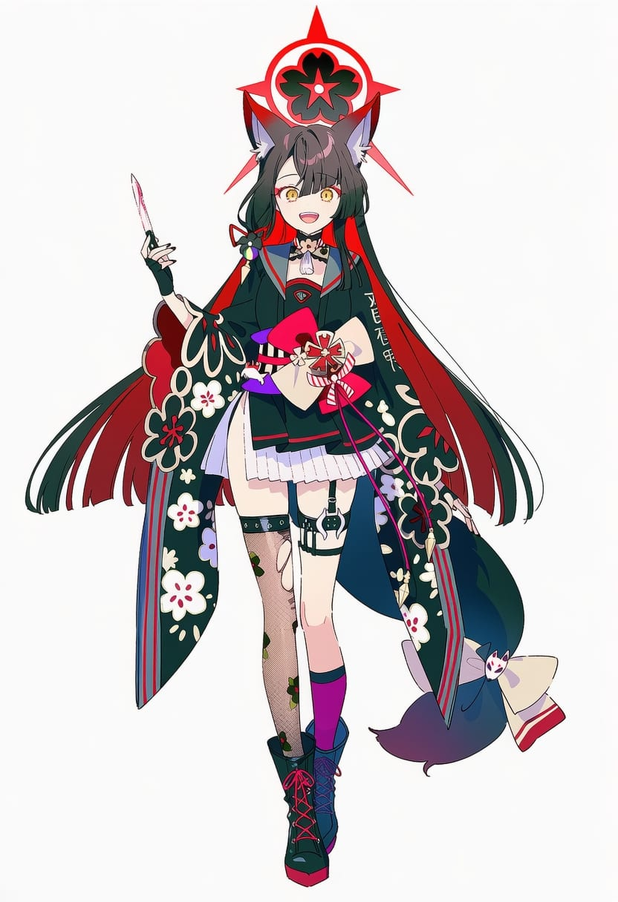

| 字段 | 内容 |
| --- | --- |
| 二次元属性的中文名 | 病娇 |
| Danbooru tag / NovelAI tag串 | yandere |
| 中文属性解释 | 喜欢一个人喜欢到有点危险、偏执，常带压迫感或不正常的笑容。 |
| 模特 | wakamo_(blue_archive) |
| 序号 | 0007 |

## 8. expressionless, half-closed_eyes — 高冷

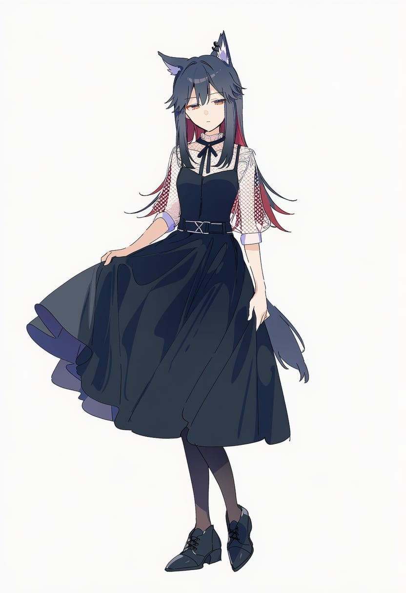

| 字段 | 内容 |
| --- | --- |
| 二次元属性的中文名 | 高冷 |
| Danbooru tag / NovelAI tag串 | expressionless, half-closed_eyes |
| 中文属性解释 | 脸上没什么表情，眼神也比较淡，给人很冷静、不好接近的感觉。 |
| 模特 | texas_(arknights) |
| 序号 | 0008 |

## 9. expressionless, blush — 冷脸萌

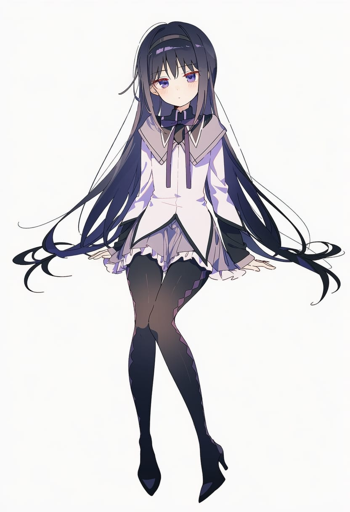

| 字段 | 内容 |
| --- | --- |
| 二次元属性的中文名 | 冷脸萌 |
| Danbooru tag / NovelAI tag串 | expressionless, blush |
| 中文属性解释 | 脸还是冷冷的，但又带一点脸红之类的可爱反差。 |
| 模特 | akemi_homura |
| 序号 | 0009 |

## 10. blush, looking_away — 害羞系

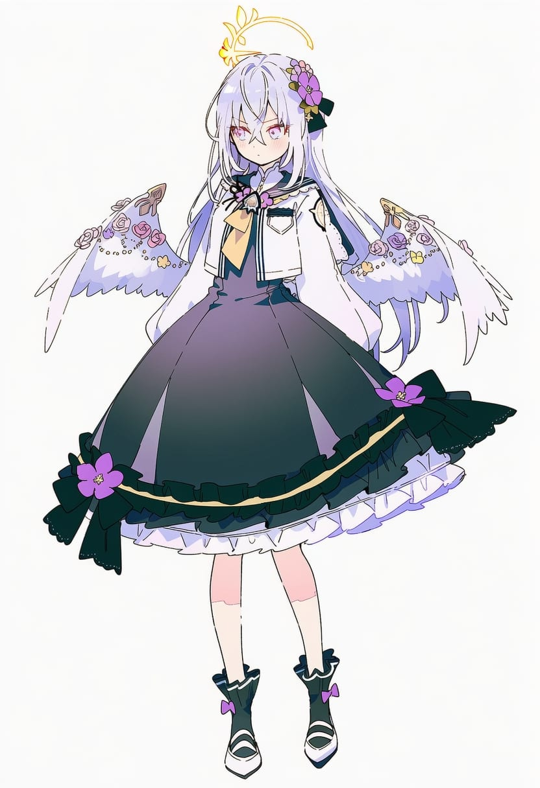

| 字段 | 内容 |
| --- | --- |
| 二次元属性的中文名 | 害羞系 |
| Danbooru tag / NovelAI tag串 | blush, looking_away |
| 中文属性解释 | 脸红又不太敢直视别人，一看就是害羞了。 |
| 模特 | azusa_(blue_archive) |
| 序号 | 0010 |

## 11. smug — 得意脸

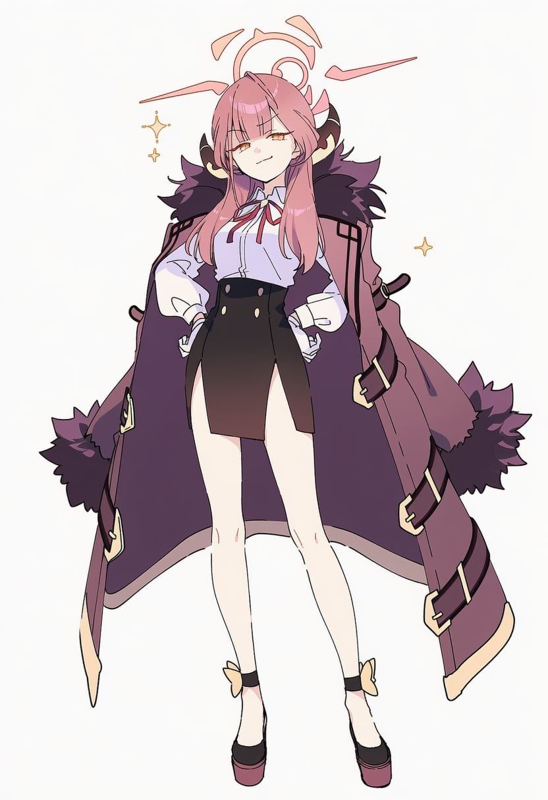

| 字段 | 内容 |
| --- | --- |
| 二次元属性的中文名 | 得意脸 |
| Danbooru tag / NovelAI tag串 | smug |
| 中文属性解释 | 一副“我早就知道”“怎么样，我厉害吧”的得意表情。 |
| 模特 | aru_(blue_archive) |
| 序号 | 0011 |

## 12. smirk — 坏笑

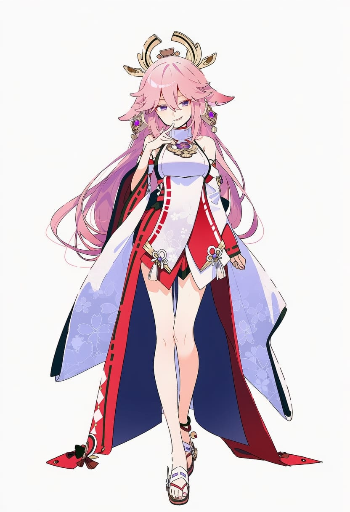

| 字段 | 内容 |
| --- | --- |
| 二次元属性的中文名 | 坏笑 |
| Danbooru tag / NovelAI tag串 | smirk |
| 中文属性解释 | 嘴角带一点歪笑，看起来像在打坏主意或者故意逗人。 |
| 模特 | yae_miko |
| 序号 | 0012 |

## 13. pout — 鼓腮 / 闹别扭

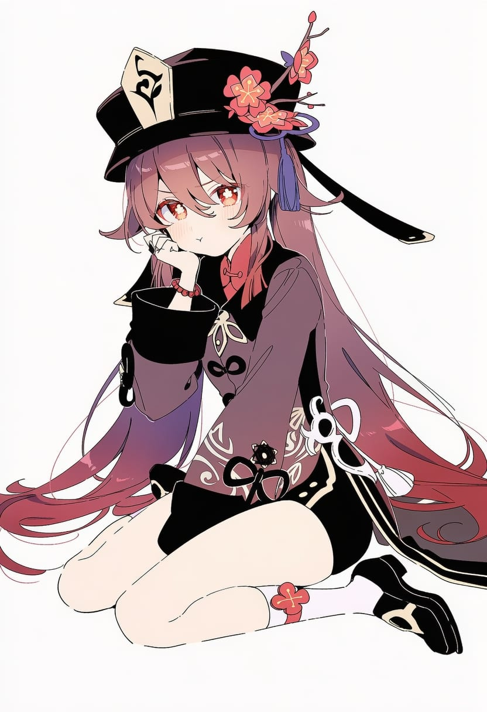

| 字段 | 内容 |
| --- | --- |
| 二次元属性的中文名 | 鼓腮 / 闹别扭 |
| Danbooru tag / NovelAI tag串 | pout |
| 中文属性解释 | 嘴巴撅起来、脸颊鼓鼓的，像在生气、撒娇或者闹小脾气。 |
| 模特 | hu_tao_(genshin_impact) |
| 序号 | 0013 |

## 14. blush — 脸红

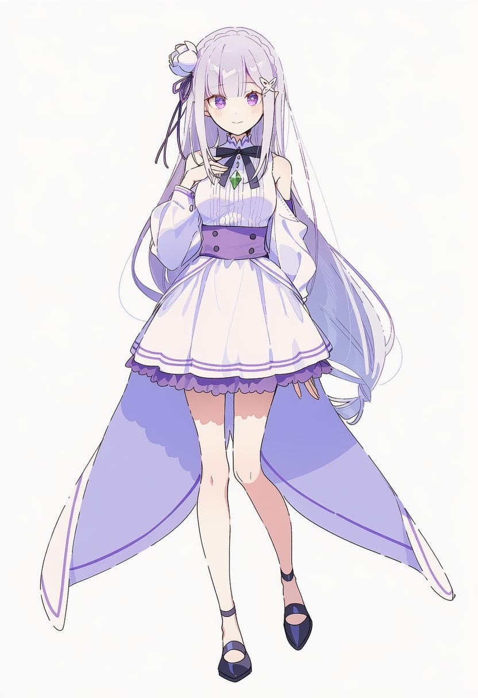

| 字段 | 内容 |
| --- | --- |
| 二次元属性的中文名 | 脸红 |
| Danbooru tag / NovelAI tag串 | blush |
| 中文属性解释 | 脸颊明显泛红，可以是害羞、紧张、开心或心动。 |
| 模特 | emilia_(re:zero) |
| 序号 | 0014 |

## 15. nose_blush — 鼻尖泛红

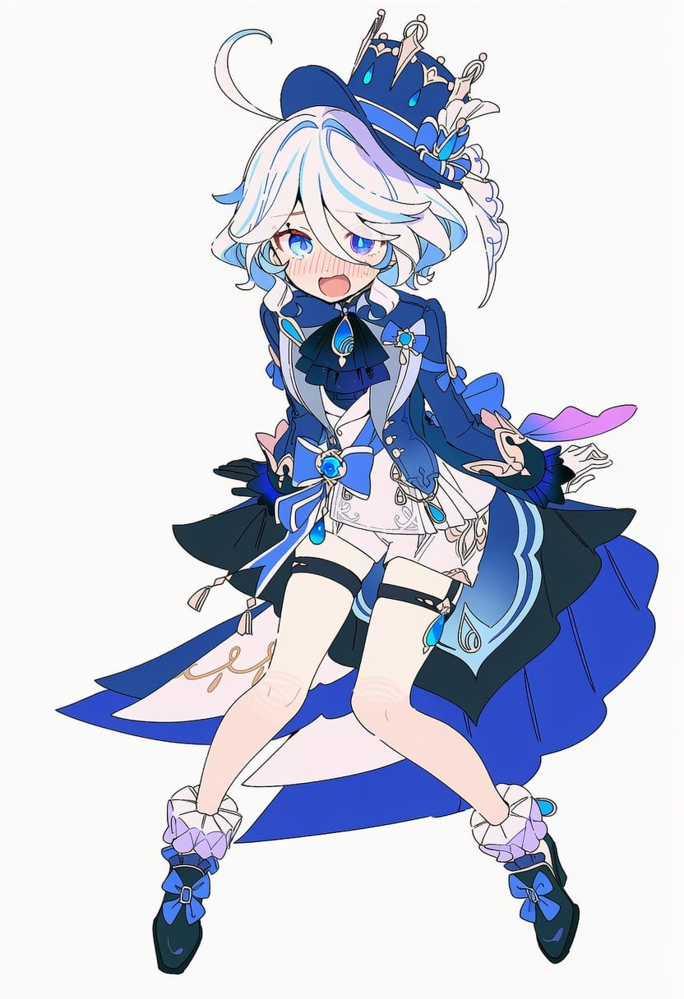

| 字段 | 内容 |
| --- | --- |
| 二次元属性的中文名 | 鼻尖泛红 |
| Danbooru tag / NovelAI tag串 | nose_blush |
| 中文属性解释 | 不只是脸颊，鼻子附近也红红的，常显得更害羞或更可爱。 |
| 模特 | furina_(genshin_impact) |
| 序号 | 0015 |

## 16. half-closed_eyes — 半睁眼

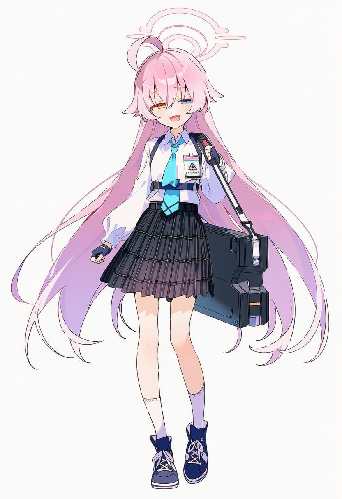

| 字段 | 内容 |
| --- | --- |
| 二次元属性的中文名 | 半睁眼 |
| Danbooru tag / NovelAI tag串 | half-closed_eyes |
| 中文属性解释 | 眼睛懒懒地只睁一半，看起来困、淡定或者有点嫌弃。 |
| 模特 | hoshino_(blue_archive) |
| 序号 | 0016 |

## 17. one_eye_closed — 眨眼

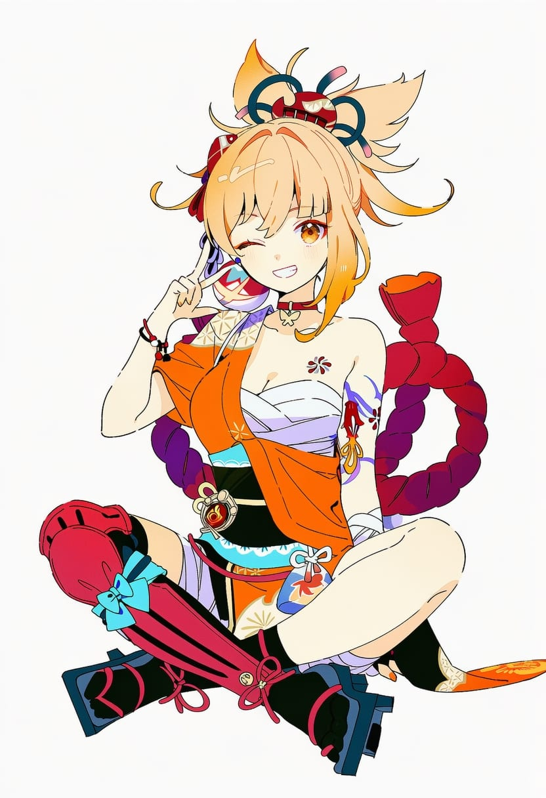

| 字段 | 内容 |
| --- | --- |
| 二次元属性的中文名 | 眨眼 |
| Danbooru tag / NovelAI tag串 | one_eye_closed |
| 中文属性解释 | 一只眼睛闭着，常用来卖萌、打招呼或摆可爱表情。 |
| 模特 | yoimiya_(genshin_impact) |
| 序号 | 0017 |

## 18. :3 — 猫嘴

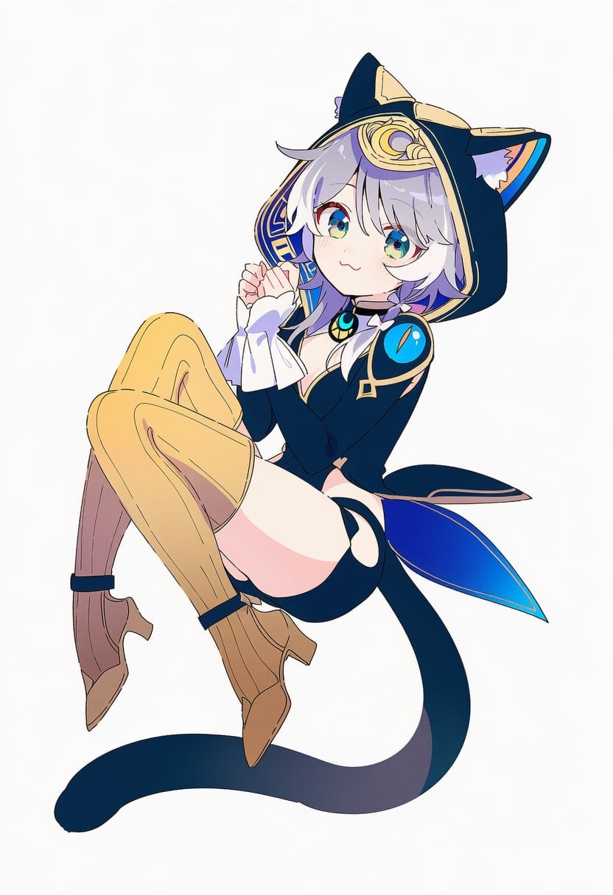

| 字段 | 内容 |
| --- | --- |
| 二次元属性的中文名 | 猫嘴 |
| Danbooru tag / NovelAI tag串 | :3 |
| 中文属性解释 | 嘴巴画成像猫咪一样的“3”形，看起来特别俏皮。 |
| 模特 | shiroko_(blue_archive) |
| 序号 | 0018 |

## 19. tongue_out — 吐舌

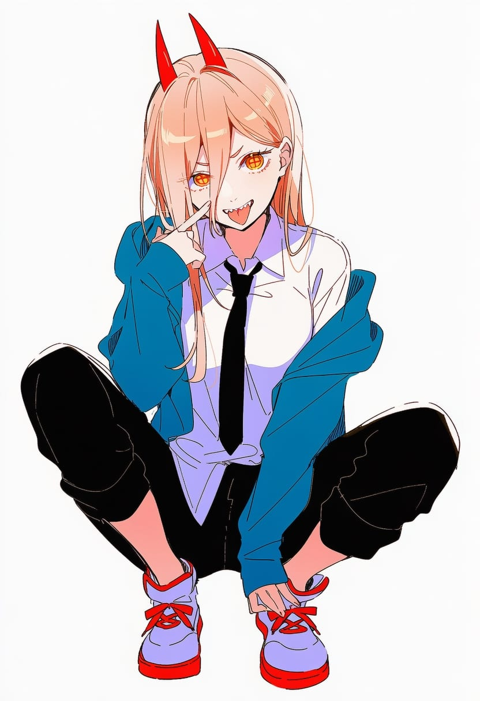

| 字段 | 内容 |
| --- | --- |
| 二次元属性的中文名 | 吐舌 |
| Danbooru tag / NovelAI tag串 | tongue_out |
| 中文属性解释 | 把舌头伸出来，常见于调皮、恶作剧、卖萌的表情。 |
| 模特 | power_(chainsaw_man) |
| 序号 | 0019 |

## 20. fang — 虎牙

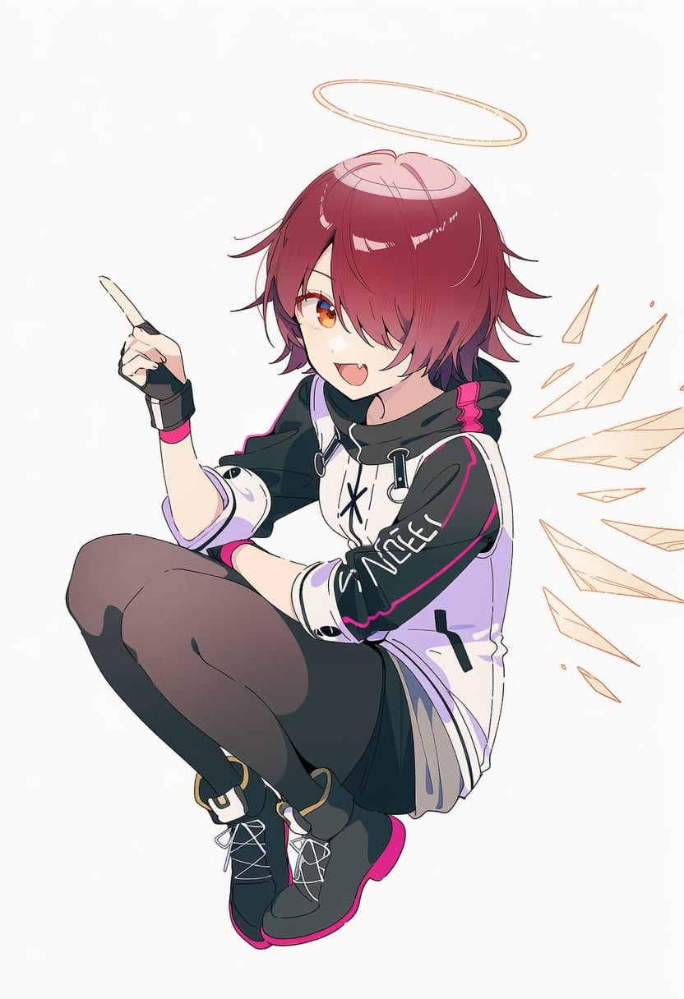

| 字段 | 内容 |
| --- | --- |
| 二次元属性的中文名 | 虎牙 |
| Danbooru tag / NovelAI tag串 | fang |
| 中文属性解释 | 嘴里露出一颗尖尖的小犬齿，是很常见的可爱或淘气萌点。 |
| 模特 | exusiai_(arknights) |
| 序号 | 0020 |

## 21. sharp_teeth — 尖牙

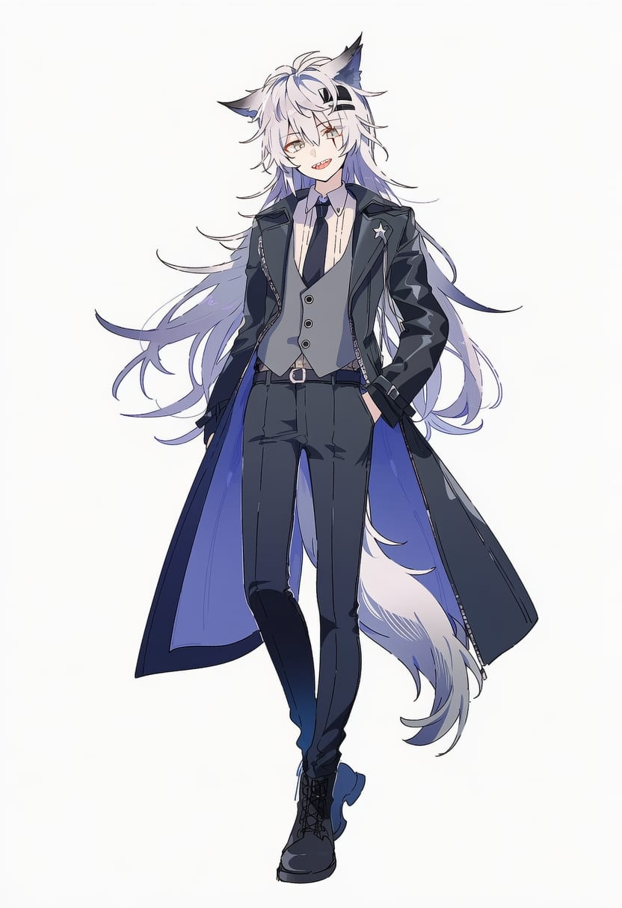

| 字段 | 内容 |
| --- | --- |
| 二次元属性的中文名 | 尖牙 |
| Danbooru tag / NovelAI tag串 | sharp_teeth |
| 中文属性解释 | 不是只有一颗虎牙，而是能明显看到多颗尖锐牙齿。 |
| 模特 | lappland_(arknights) |
| 序号 | 0021 |

## 22. mole_under_eye — 泪痣

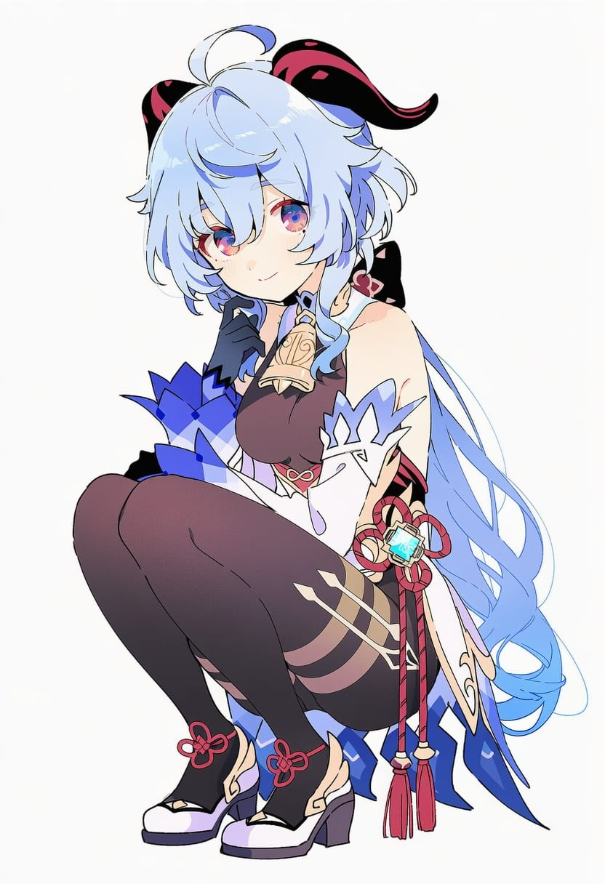

| 字段 | 内容 |
| --- | --- |
| 二次元属性的中文名 | 泪痣 |
| Danbooru tag / NovelAI tag串 | mole_under_eye |
| 中文属性解释 | 眼睛下方有一颗小痣，常给角色增加成熟、妩媚或辨识度。 |
| 模特 | ganyu_(genshin_impact) |
| 序号 | 0022 |

## 23. freckles — 雀斑

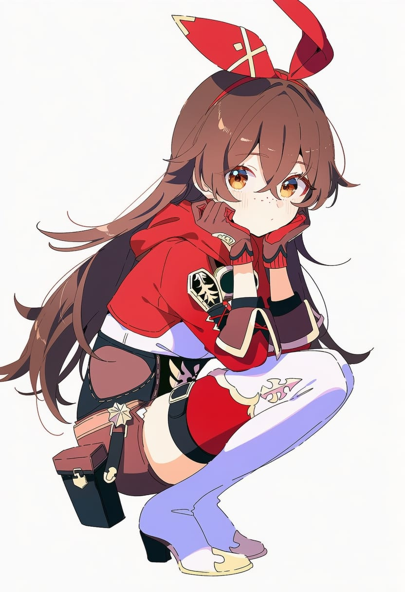

| 字段 | 内容 |
| --- | --- |
| 二次元属性的中文名 | 雀斑 |
| Danbooru tag / NovelAI tag串 | freckles |
| 中文属性解释 | 脸上分布着一些小雀斑，显得自然、有生活感。 |
| 模特 | amber_(genshin_impact) |
| 序号 | 0023 |

## 24. ahoge — 呆毛

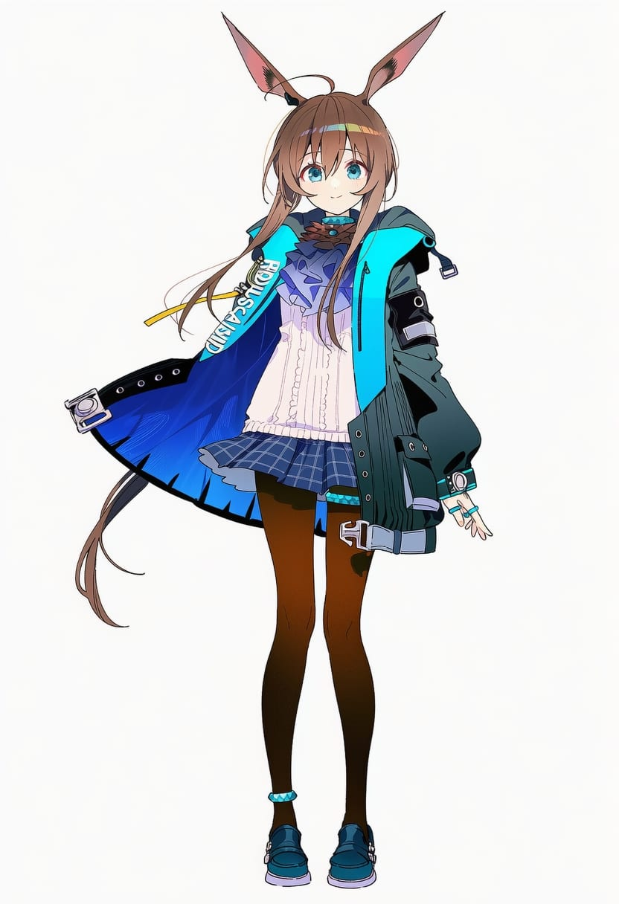

| 字段 | 内容 |
| --- | --- |
| 二次元属性的中文名 | 呆毛 |
| Danbooru tag / NovelAI tag串 | ahoge |
| 中文属性解释 | 头顶有一撮不听话地翘起来的头发，是二次元非常经典的萌点。 |
| 模特 | amiya_(arknights) |
| 序号 | 0024 |

## 25. hair_intakes — 进气口刘海

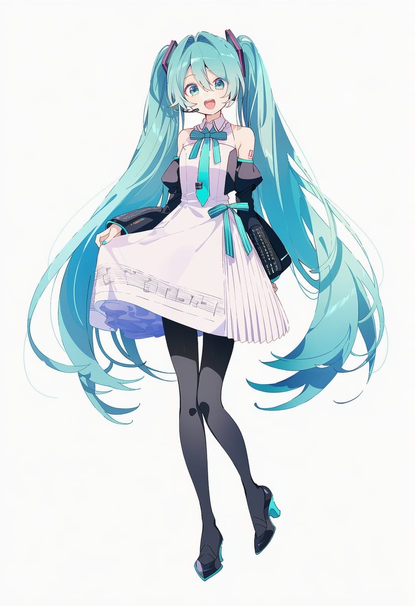

| 字段 | 内容 |
| --- | --- |
| 二次元属性的中文名 | 进气口刘海 |
| Danbooru tag / NovelAI tag串 | hair_intakes |
| 中文属性解释 | 额头两侧的头发形成像进气口一样向内凹的特殊刘海形状。 |
| 模特 | hatsune_miku |
| 序号 | 0026 |

## 26. hair_between_eyes — 眼间发

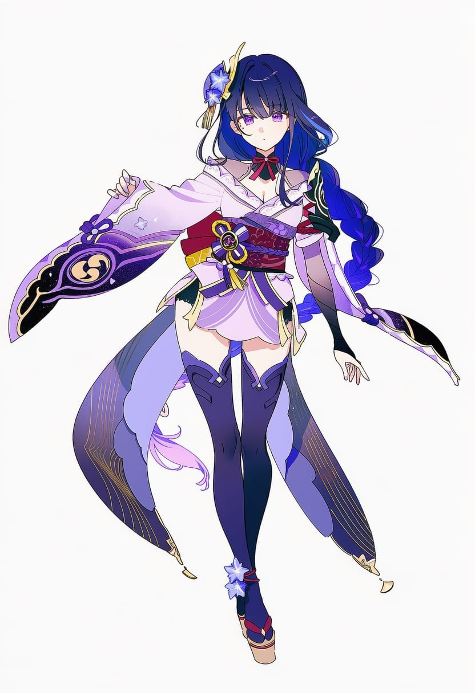

| 字段 | 内容 |
| --- | --- |
| 二次元属性的中文名 | 眼间发 |
| Danbooru tag / NovelAI tag串 | hair_between_eyes |
| 中文属性解释 | 有一缕头发从两眼之间垂下来，是很常见的脸部发型细节。 |
| 模特 | raiden_shogun |
| 序号 | 0027 |

## 27. blunt_bangs — 齐刘海

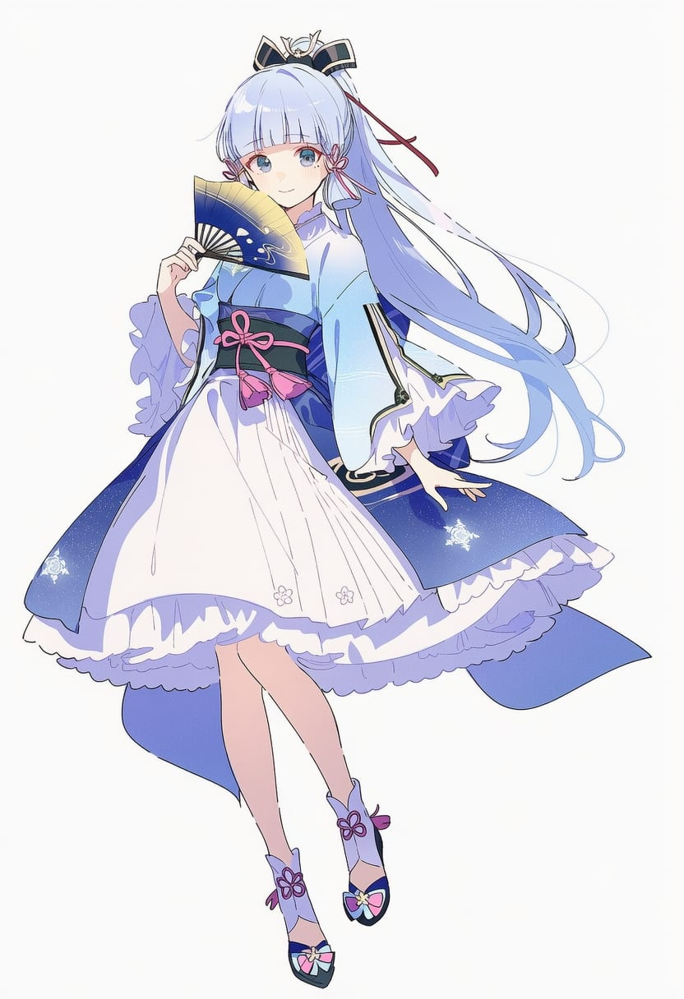

| 字段 | 内容 |
| --- | --- |
| 二次元属性的中文名 | 齐刘海 |
| Danbooru tag / NovelAI tag串 | blunt_bangs |
| 中文属性解释 | 刘海下缘剪得很整齐，像一条比较平直的线。 |
| 模特 | kamisato_ayaka |
| 序号 | 0028 |

## 28. hime_cut — 姬发式

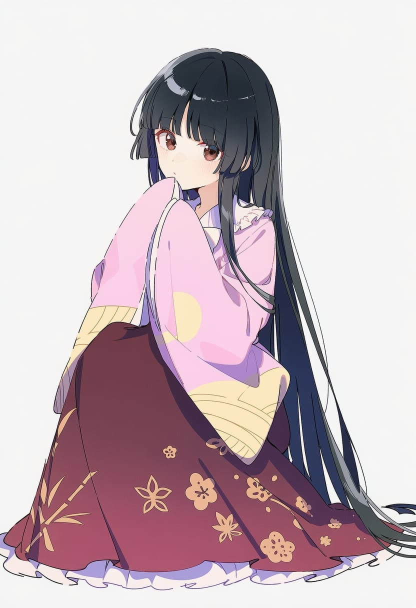

| 字段 | 内容 |
| --- | --- |
| 二次元属性的中文名 | 姬发式 |
| Danbooru tag / NovelAI tag串 | hime_cut |
| 中文属性解释 | 两侧脸颊旁是整齐的短发，后面通常保留长发，经典公主切。 |
| 模特 | houraisan_kaguya |
| 序号 | 0029 |

## 29. drill_hair — 钻头卷

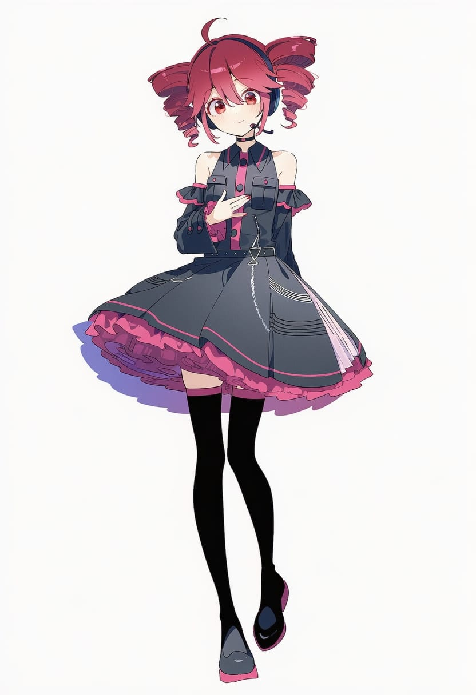

| 字段 | 内容 |
| --- | --- |
| 二次元属性的中文名 | 钻头卷 |
| Danbooru tag / NovelAI tag串 | drill_hair |
| 中文属性解释 | 头发卷成明显的螺旋钻头形，是大小姐系角色常见的夸张发型。 |
| 模特 | fischl_(genshin_impact) |
| 序号 | 0030 |

## 30. sidelocks — 侧发

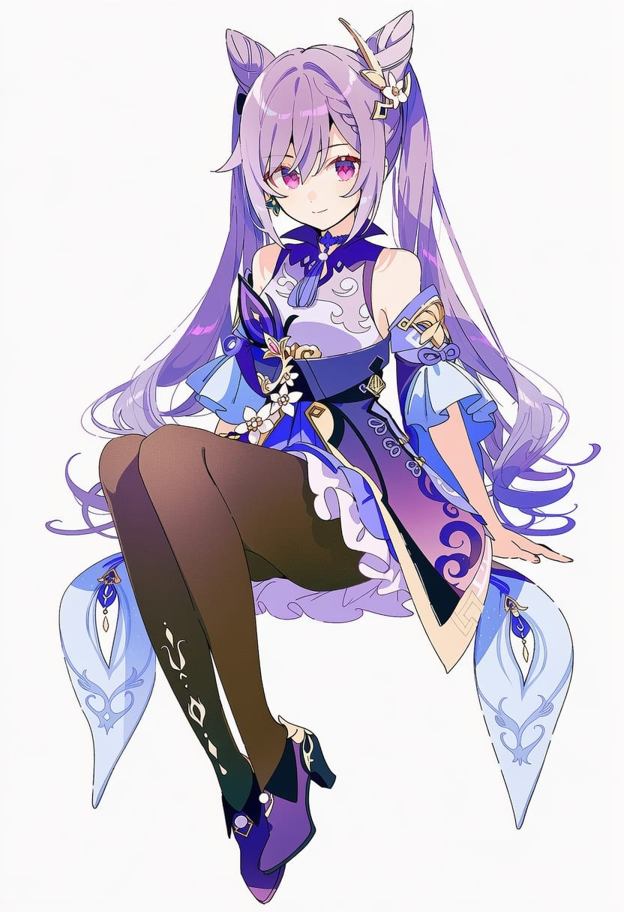

| 字段 | 内容 |
| --- | --- |
| 二次元属性的中文名 | 侧发 |
| Danbooru tag / NovelAI tag串 | sidelocks |
| 中文属性解释 | 脸两侧单独垂下来的长发束，和后面的头发分得比较明显。 |
| 模特 | keqing_(genshin_impact) |
| 序号 | 0031 |

## 31. messy_hair — 凌乱发

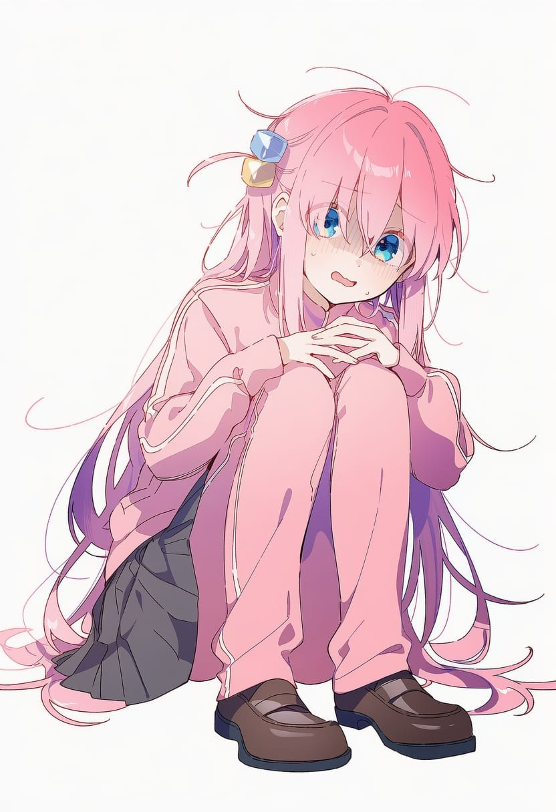

| 字段 | 内容 |
| --- | --- |
| 二次元属性的中文名 | 凌乱发 |
| Danbooru tag / NovelAI tag串 | messy_hair |
| 中文属性解释 | 头发没有梳得很规整，有点乱翘、睡醒或随性的感觉。 |
| 模特 | gotoh_hitori |
| 序号 | 0032 |

## 32. very_long_hair — 超长发

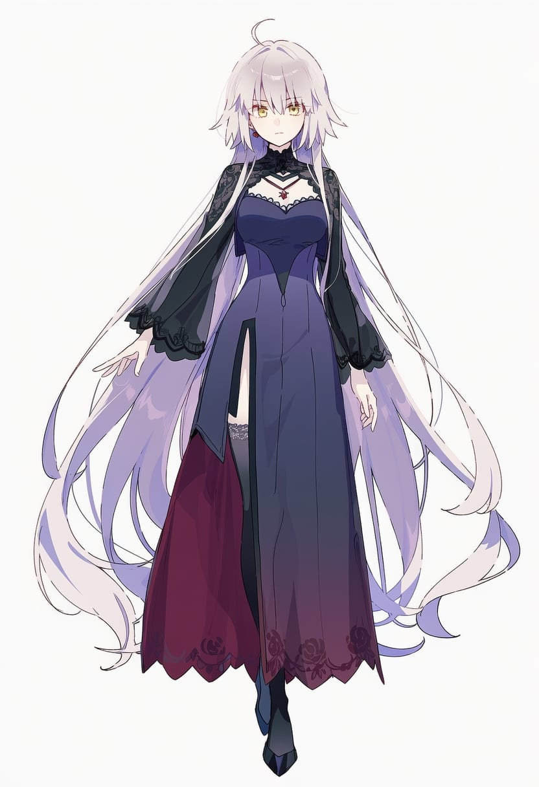

| 字段 | 内容 |
| --- | --- |
| 二次元属性的中文名 | 超长发 |
| Danbooru tag / NovelAI tag串 | very_long_hair |
| 中文属性解释 | 头发长度远超普通长发，通常到腰以下甚至更长。 |
| 模特 | jeanne_d'arc_(alter)_(fate) |
| 序号 | 0033 |

## 33. twintails — 双马尾

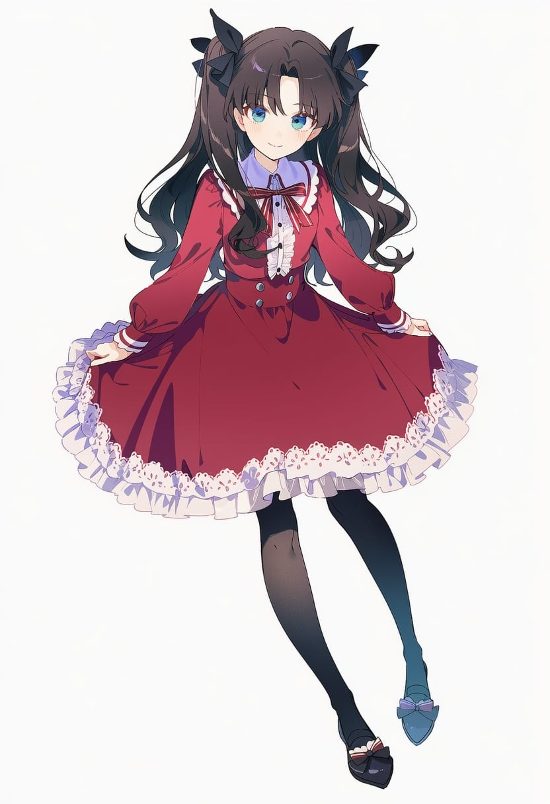

| 字段 | 内容 |
| --- | --- |
| 二次元属性的中文名 | 双马尾 |
| Danbooru tag / NovelAI tag串 | twintails |
| 中文属性解释 | 左右两边各扎一束马尾，是最经典的二次元发型之一。 |
| 模特 | tohsaka_rin |
| 序号 | 0034 |

## 34. side_ponytail — 侧马尾

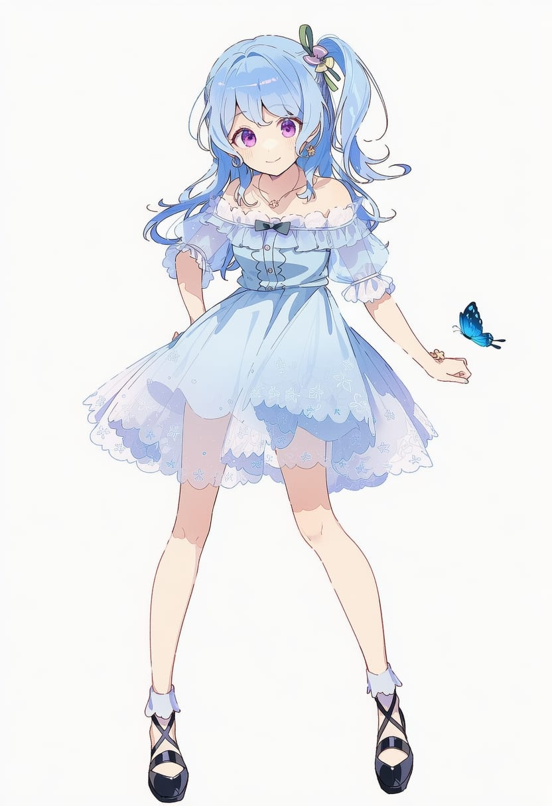

| 字段 | 内容 |
| --- | --- |
| 二次元属性的中文名 | 侧马尾 |
| Danbooru tag / NovelAI tag串 | side_ponytail |
| 中文属性解释 | 马尾不是扎在脑后正中，而是偏到头的一侧。 |
| 模特 | matsubara_kanon |
| 序号 | 0035 |

## 35. high_ponytail — 高马尾

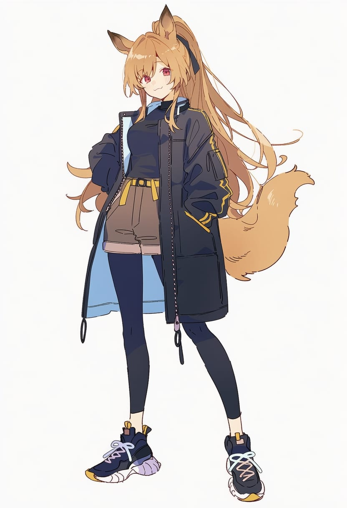

| 字段 | 内容 |
| --- | --- |
| 二次元属性的中文名 | 高马尾 |
| Danbooru tag / NovelAI tag串 | high_ponytail |
| 中文属性解释 | 马尾扎得比较高，整体看起来更利落、更有精神。 |
| 模特 | ceobe_(arknights) |
| 序号 | 0036 |

## 36. heterochromia — 异色瞳

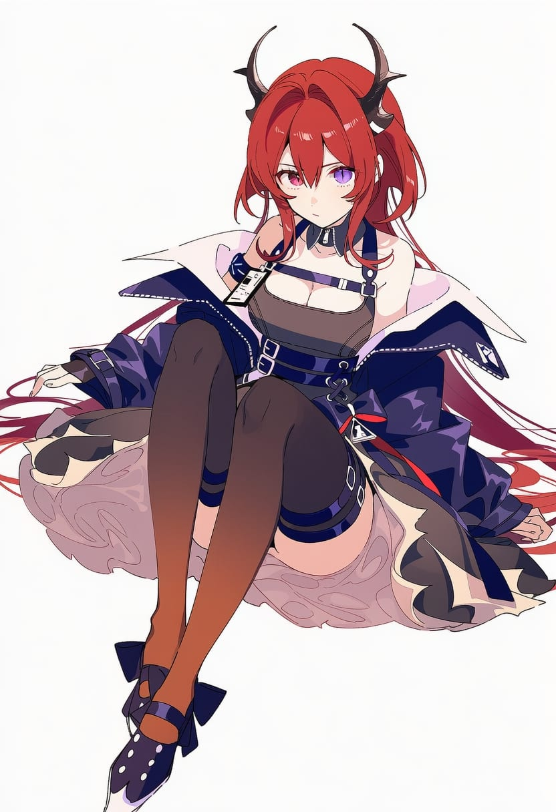

| 字段 | 内容 |
| --- | --- |
| 二次元属性的中文名 | 异色瞳 |
| Danbooru tag / NovelAI tag串 | heterochromia |
| 中文属性解释 | 左右两只眼睛颜色不一样。 |
| 模特 | surtr_(arknights) |
| 序号 | 0037 |

## 37. tareme — 下垂眼

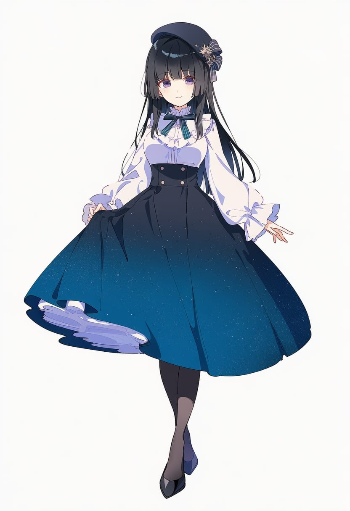

| 字段 | 内容 |
| --- | --- |
| 二次元属性的中文名 | 下垂眼 |
| Danbooru tag / NovelAI tag串 | tareme |
| 中文属性解释 | 眼角视觉上比较往下垂，容易显得温柔、软、无攻击性。 |
| 模特 | shirokane_rinko |
| 序号 | 0038 |

## 38. tsurime — 吊眼

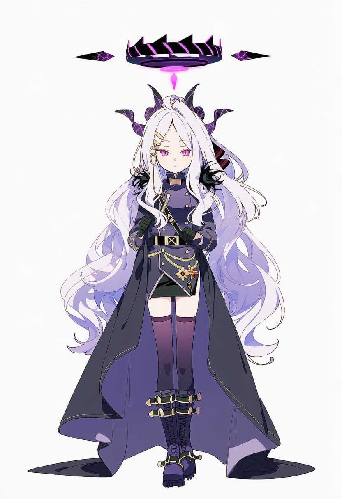

| 字段 | 内容 |
| --- | --- |
| 二次元属性的中文名 | 吊眼 |
| Danbooru tag / NovelAI tag串 | tsurime |
| 中文属性解释 | 外眼角往上挑，看起来更强势、锐利或自信。 |
| 模特 | hina_(blue_archive) |
| 序号 | 0039 |

## 39. sanpaku — 三白眼

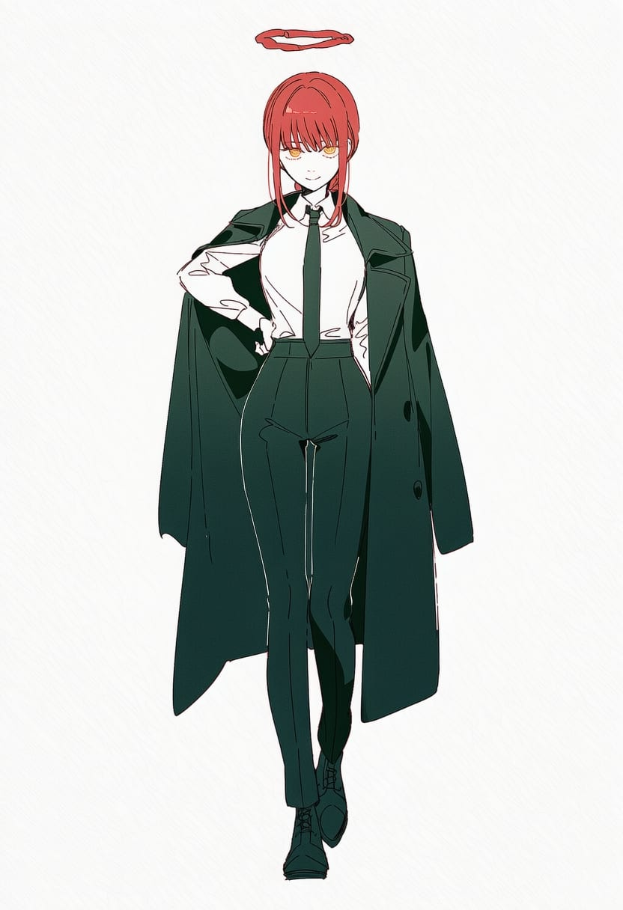

| 字段 | 内容 |
| --- | --- |
| 二次元属性的中文名 | 三白眼 |
| Danbooru tag / NovelAI tag串 | sanpaku |
| 中文属性解释 | 眼白在瞳孔周围露得比较明显，常显得凶、冷或很有压迫感。 |
| 模特 | makima_(chainsaw_man) |
| 序号 | 0040 |

## 40. heart-shaped_pupils — 爱心瞳

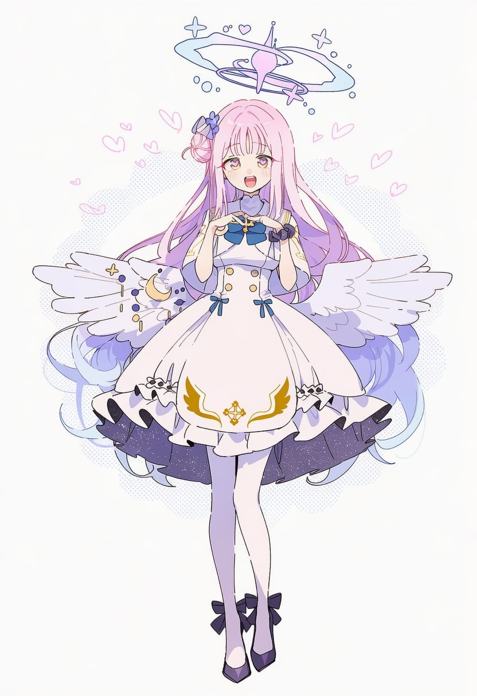

| 字段 | 内容 |
| --- | --- |
| 二次元属性的中文名 | 爱心瞳 |
| Danbooru tag / NovelAI tag串 | heart-shaped_pupils |
| 中文属性解释 | 瞳孔直接变成爱心形状，通常用来表现喜欢、兴奋或强烈迷恋。 |
| 模特 | mika_(blue_archive) |
| 序号 | 0041 |

## 41. slit_pupils — 竖瞳 / 猫瞳

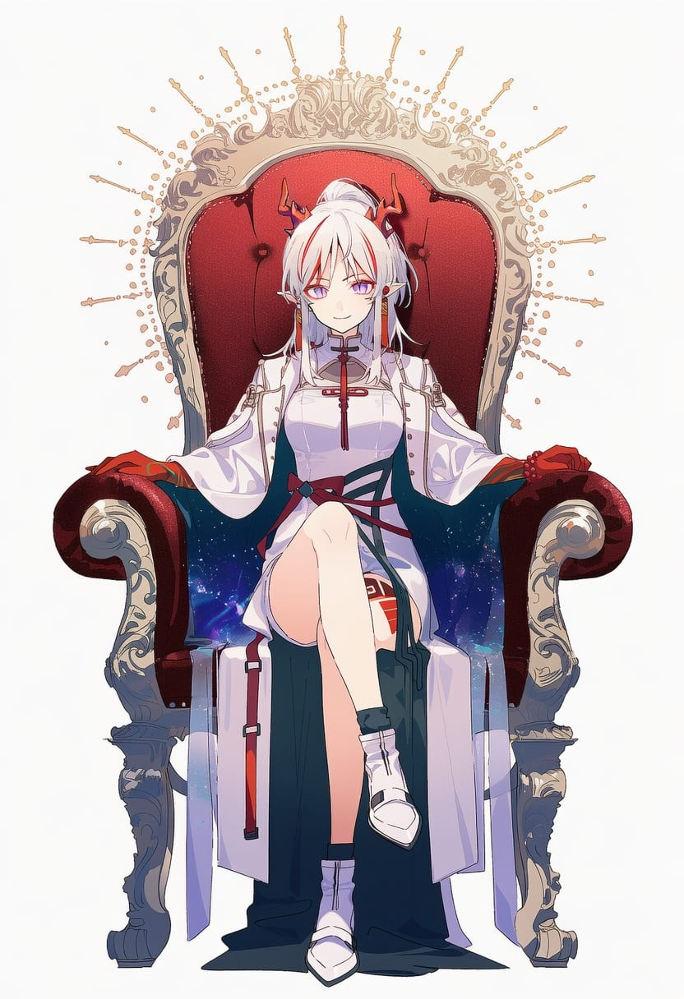

| 字段 | 内容 |
| --- | --- |
| 二次元属性的中文名 | 竖瞳 / 猫瞳 |
| Danbooru tag / NovelAI tag串 | slit_pupils |
| 中文属性解释 | 瞳孔是细长竖线，像猫、蛇或龙的眼睛。 |
| 模特 | nian_(arknights) |
| 序号 | 0042 |

## 42. bags_under_eyes — 黑眼圈

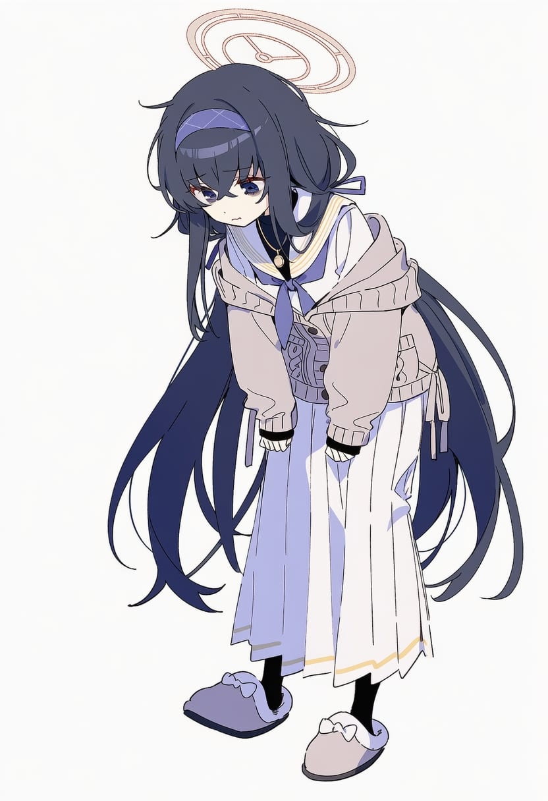

| 字段 | 内容 |
| --- | --- |
| 二次元属性的中文名 | 黑眼圈 |
| Danbooru tag / NovelAI tag串 | bags_under_eyes |
| 中文属性解释 | 眼睛下面有明显疲惫的阴影或眼袋，看起来熬夜、虚弱或阴沉。 |
| 模特 | ui_(blue_archive) |
| 序号 | 0043 |

## 43. head_tilt — 歪头

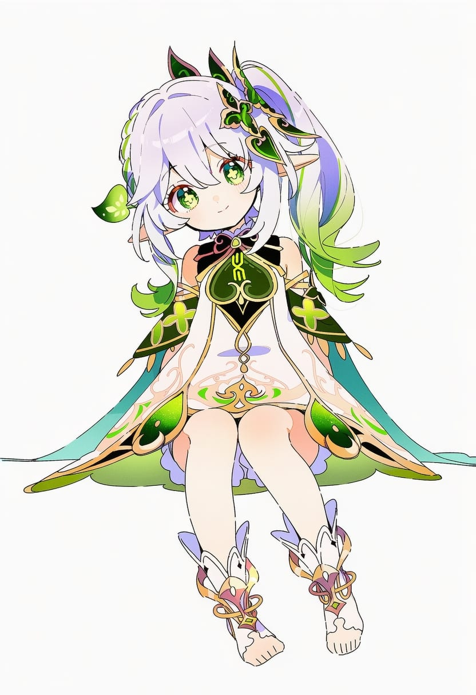

| 字段 | 内容 |
| --- | --- |
| 二次元属性的中文名 | 歪头 |
| Danbooru tag / NovelAI tag串 | head_tilt |
| 中文属性解释 | 把脑袋向一边轻轻歪，是非常典型的可爱或疑惑动作。 |
| 模特 | nahida_(genshin_impact) |
| 序号 | 0044 |

## 44. wariza — 鸭子坐 / W坐

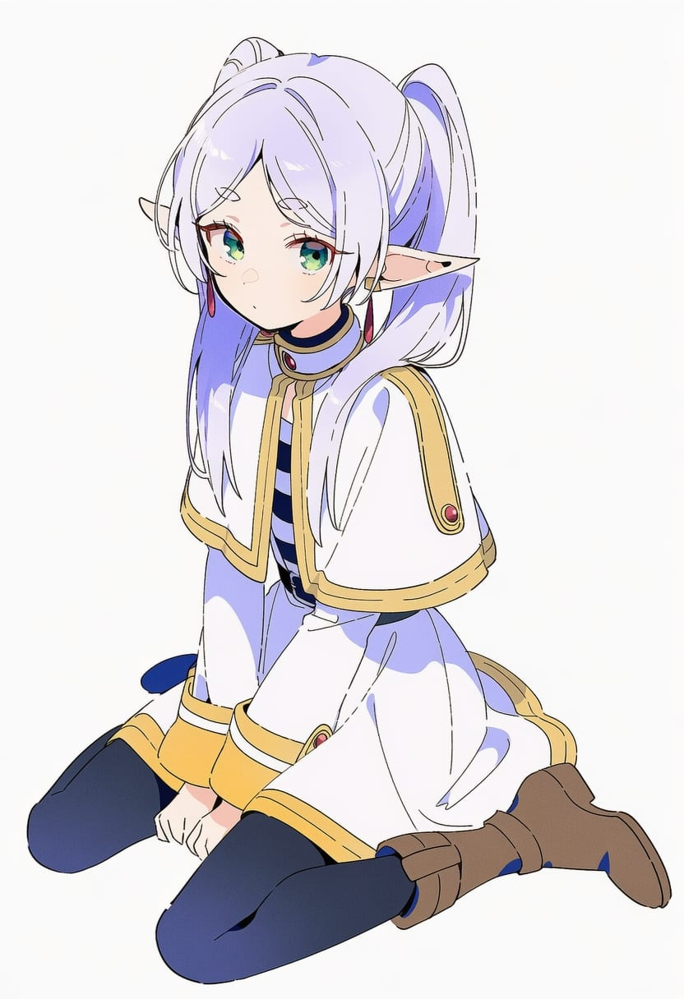

| 字段 | 内容 |
| --- | --- |
| 二次元属性的中文名 | 鸭子坐 / W坐 |
| Danbooru tag / NovelAI tag串 | wariza |
| 中文属性解释 | 坐下时膝盖在前，小腿分别向身体两侧折开。 |
| 模特 | frieren |
| 序号 | 0045 |

## 45. yokozuwari — 侧坐

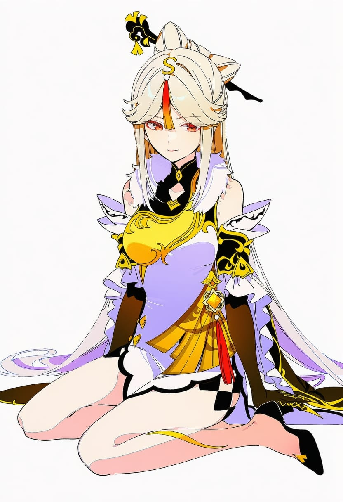

| 字段 | 内容 |
| --- | --- |
| 二次元属性的中文名 | 侧坐 |
| Danbooru tag / NovelAI tag串 | yokozuwari |
| 中文属性解释 | 双腿一起偏向身体一侧坐着，看起来比较柔和、端庄。 |
| 模特 | ningguang_(genshin_impact) |
| 序号 | 0046 |

## 46. hugging_own_legs — 抱膝

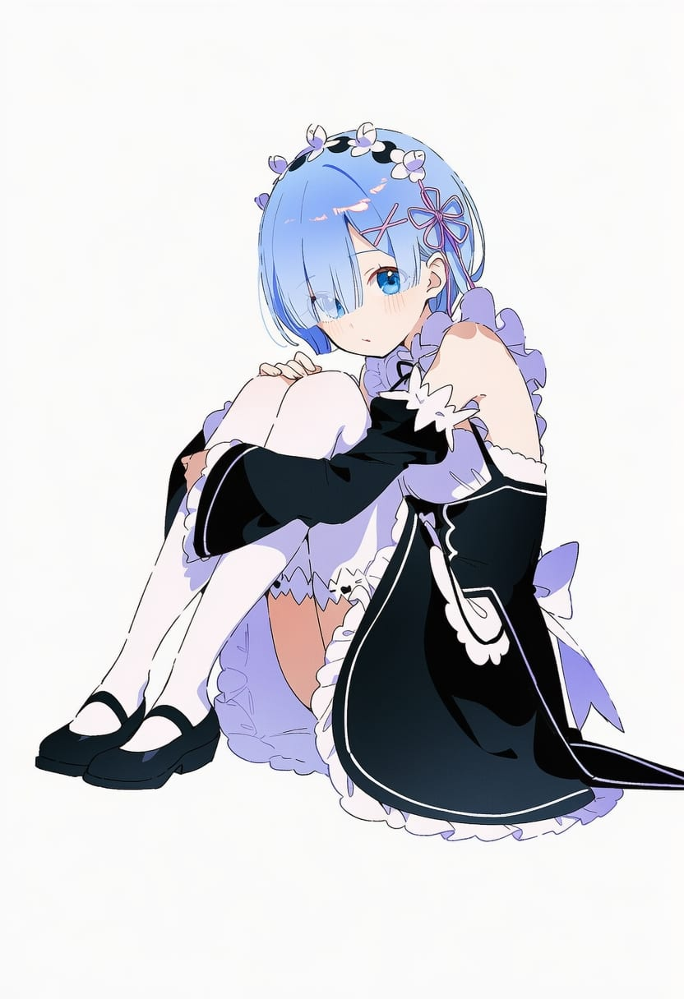

| 字段 | 内容 |
| --- | --- |
| 二次元属性的中文名 | 抱膝 |
| Danbooru tag / NovelAI tag串 | hugging_own_legs |
| 中文属性解释 | 坐着把自己的腿或膝盖抱在怀里，常显得孤单、拘谨或软萌。 |
| 模特 | rem_(re:zero) |
| 序号 | 0047 |

## 47. arms_behind_back — 双手背后

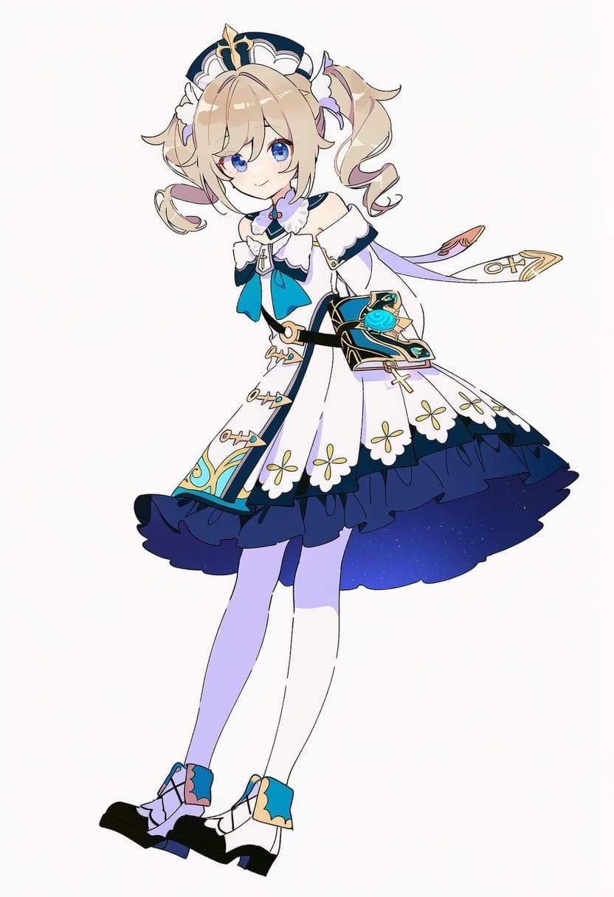

| 字段 | 内容 |
| --- | --- |
| 二次元属性的中文名 | 双手背后 |
| Danbooru tag / NovelAI tag串 | arms_behind_back |
| 中文属性解释 | 两只手放在背后，常见于轻松、俏皮或者略带羞涩的站姿。 |
| 模特 | barbara_(genshin_impact) |
| 序号 | 0048 |

## 48. paw_pose — 猫爪手

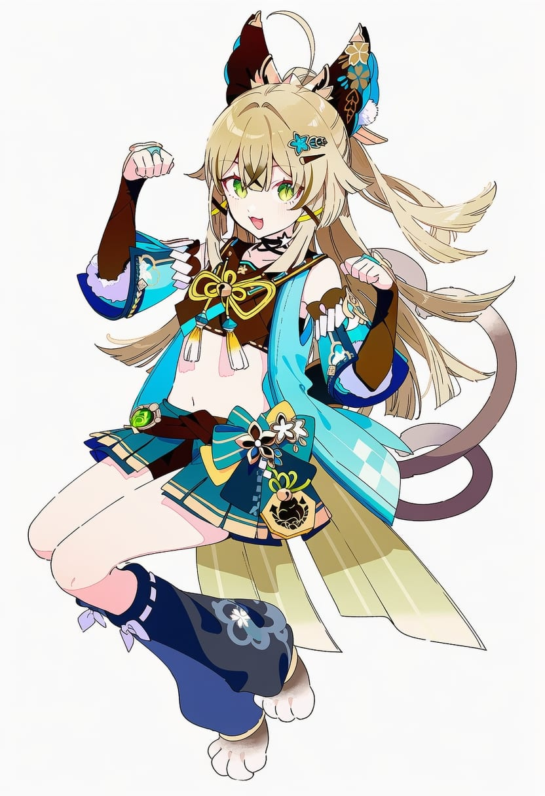

| 字段 | 内容 |
| --- | --- |
| 二次元属性的中文名 | 猫爪手 |
| Danbooru tag / NovelAI tag串 | paw_pose |
| 中文属性解释 | 双手抬起来弯成像猫爪一样的姿势，典型卖萌动作。 |
| 模特 | kirara_(genshin_impact) |
| 序号 | 0049 |

## 49. v — 剪刀手

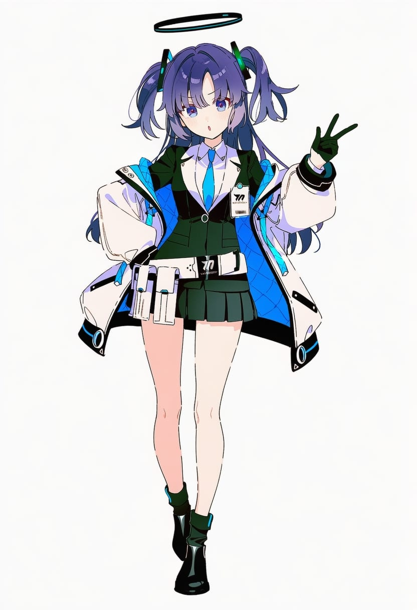

| 字段 | 内容 |
| --- | --- |
| 二次元属性的中文名 | 剪刀手 |
| Danbooru tag / NovelAI tag串 | v |
| 中文属性解释 | 用手指比出 V 字，拍照和卖萌最常见的动作之一。 |
| 模特 | yuuka_(blue_archive) |
| 序号 | 0050 |

## 50. finger_heart — 手指比心

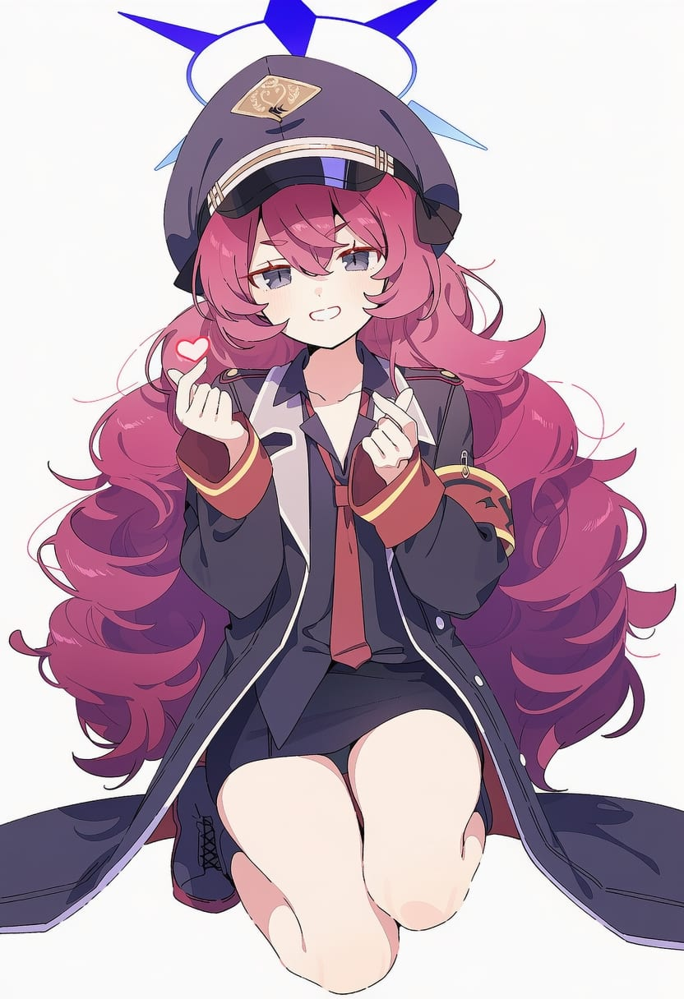

| 字段 | 内容 |
| --- | --- |
| 二次元属性的中文名 | 手指比心 |
| Danbooru tag / NovelAI tag串 | finger_heart |
| 中文属性解释 | 用拇指和食指捏出一个小爱心。 |
| 模特 | iroha_(blue_archive) |
| 序号 | 0051 |

## 51. heart_hands — 双手比心

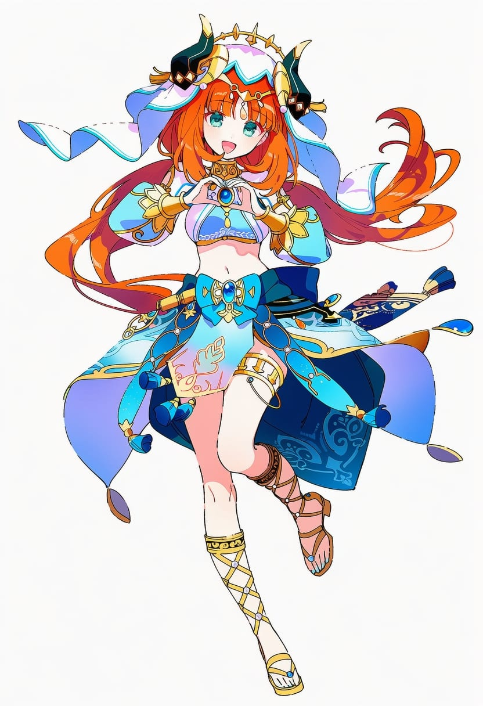

| 字段 | 内容 |
| --- | --- |
| 二次元属性的中文名 | 双手比心 |
| Danbooru tag / NovelAI tag串 | heart_hands |
| 中文属性解释 | 两只手合起来组成一个大爱心形状。 |
| 模特 | nilou_(genshin_impact) |
| 序号 | 0052 |

## 52. covering_mouth — 捂嘴

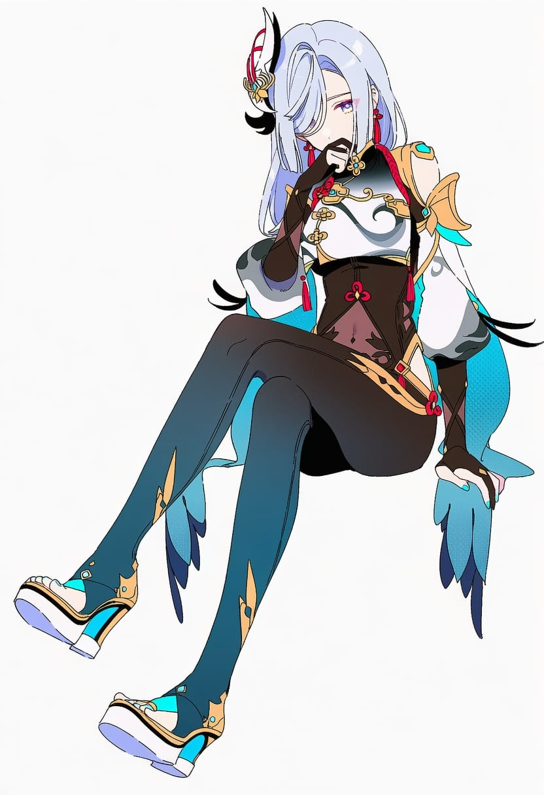

| 字段 | 内容 |
| --- | --- |
| 二次元属性的中文名 | 捂嘴 |
| Danbooru tag / NovelAI tag串 | covering_mouth |
| 中文属性解释 | 用手遮住嘴，可能是在偷笑、惊讶、害羞或者忍住不说话。 |
| 模特 | shenhe_(genshin_impact) |
| 序号 | 0053 |

## 53. sleeves_past_wrists — 萌袖

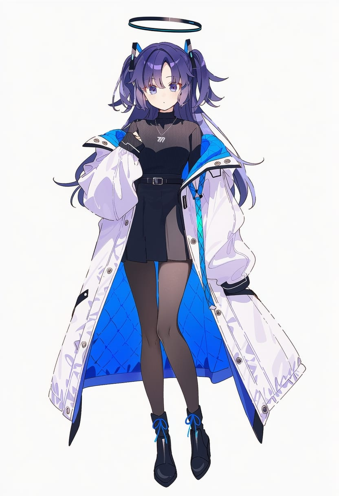

| 字段 | 内容 |
| --- | --- |
| 二次元属性的中文名 | 萌袖 |
| Danbooru tag / NovelAI tag串 | sleeves_past_wrists |
| 中文属性解释 | 袖子长到超过手腕，遮住一部分手掌，是最典型的“萌袖”效果。 |
| 模特 | yuuka_(blue_archive) |
| 序号 | 0054 |

## 54. sleeves_past_fingers — 超长萌袖

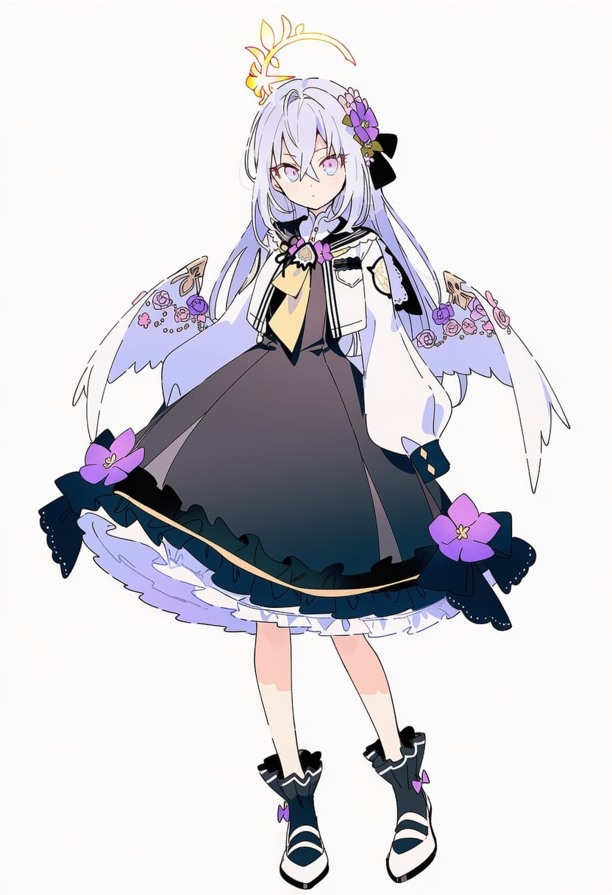

| 字段 | 内容 |
| --- | --- |
| 二次元属性的中文名 | 超长萌袖 |
| Danbooru tag / NovelAI tag串 | sleeves_past_fingers |
| 中文属性解释 | 袖子长到连手指都遮住，比普通萌袖更夸张。 |
| 模特 | azusa_(blue_archive) |
| 序号 | 0055 |

## 55. oversized_clothes — 宽大衣服

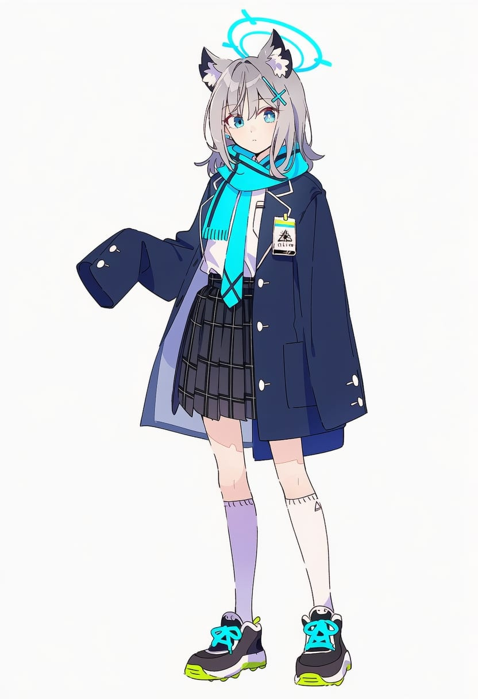

| 字段 | 内容 |
| --- | --- |
| 二次元属性的中文名 | 宽大衣服 |
| Danbooru tag / NovelAI tag串 | oversized_clothes |
| 中文属性解释 | 衣服明显比角色身材大一号或几号，看起来松松垮垮。 |
| 模特 | shiroko_(blue_archive) |
| 序号 | 0056 |

## 56. off_shoulder — 露肩

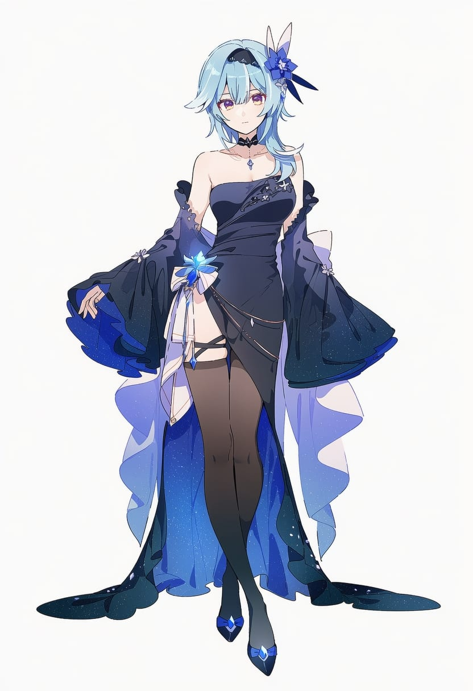

| 字段 | 内容 |
| --- | --- |
| 二次元属性的中文名 | 露肩 |
| Danbooru tag / NovelAI tag串 | off_shoulder |
| 中文属性解释 | 上衣或外套从肩头滑下来，露出肩膀。 |
| 模特 | eula_(genshin_impact) |
| 序号 | 0057 |

## 57. zettai_ryouiki — 绝对领域

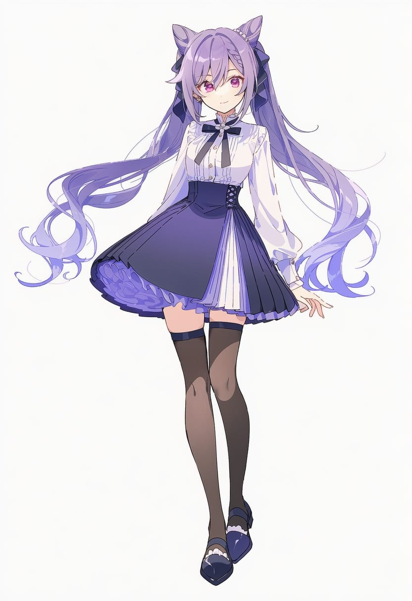

| 字段 | 内容 |
| --- | --- |
| 二次元属性的中文名 | 绝对领域 |
| Danbooru tag / NovelAI tag串 | zettai_ryouiki |
| 中文属性解释 | 短裙或短裤和过膝袜之间露出的一小段大腿区域。 |
| 模特 | keqing_(genshin_impact) |
| 序号 | 0058 |

## 58. cat_ears — 猫耳

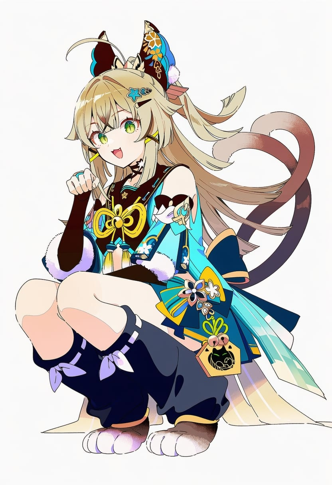

| 字段 | 内容 |
| --- | --- |
| 二次元属性的中文名 | 猫耳 |
| Danbooru tag / NovelAI tag串 | cat_ears |
| 中文属性解释 | 头上有猫一样的耳朵，可以是真耳朵也可以是明显的猫耳特征。 |
| 模特 | kirara_(genshin_impact) |
| 序号 | 0059 |

## 59. pointy_ears — 尖耳 / 精灵耳

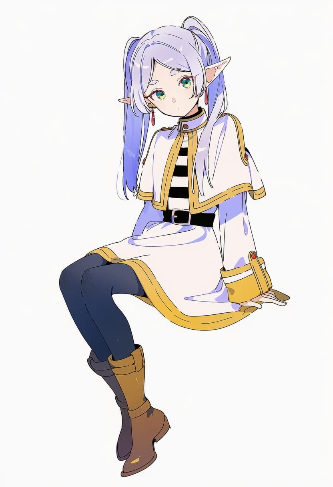

| 字段 | 内容 |
| --- | --- |
| 二次元属性的中文名 | 尖耳 / 精灵耳 |
| Danbooru tag / NovelAI tag串 | pointy_ears |
| 中文属性解释 | 耳朵尖尖的，常见于精灵、妖精等角色。 |
| 模特 | frieren |
| 序号 | 0060 |

---
