# 发型tag展示

## 1. absurdly_long_hair — 头发长得非常夸张，远超普通长发。

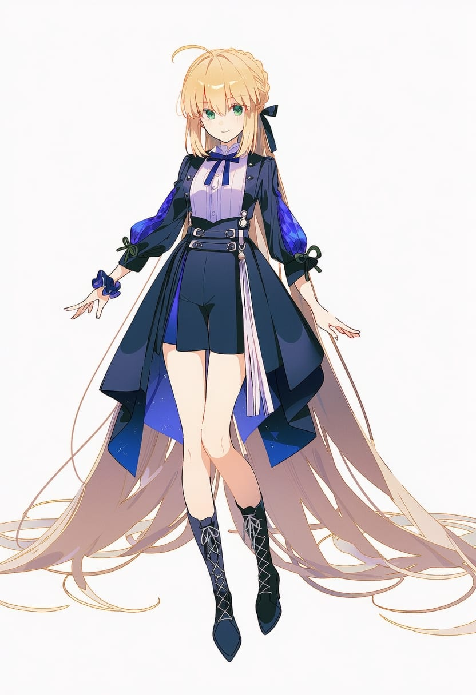

| 字段 | 内容 |
| --- | --- |
| Danbooru Tag | absurdly_long_hair |
| 中文名 | 极端超长发 |
| 中文含义 | 头发长得非常夸张，远超普通长发。 |
| 子类 | 基础发型 |

## 2. big_hair — 头发整体非常蓬大、有体积感。

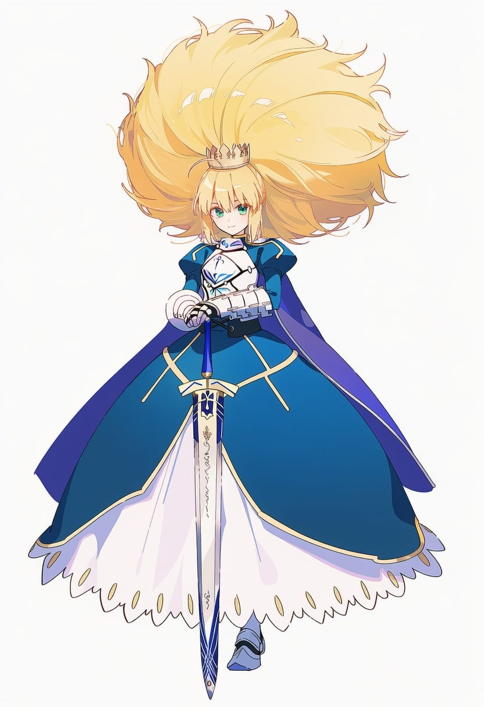

| 字段 | 内容 |
| --- | --- |
| Danbooru Tag | big_hair |
| 中文名 | 蓬大头发 |
| 中文含义 | 头发整体非常蓬大、有体积感。 |
| 子类 | 基础发型 |

## 3. long_hair — 明显的长发。

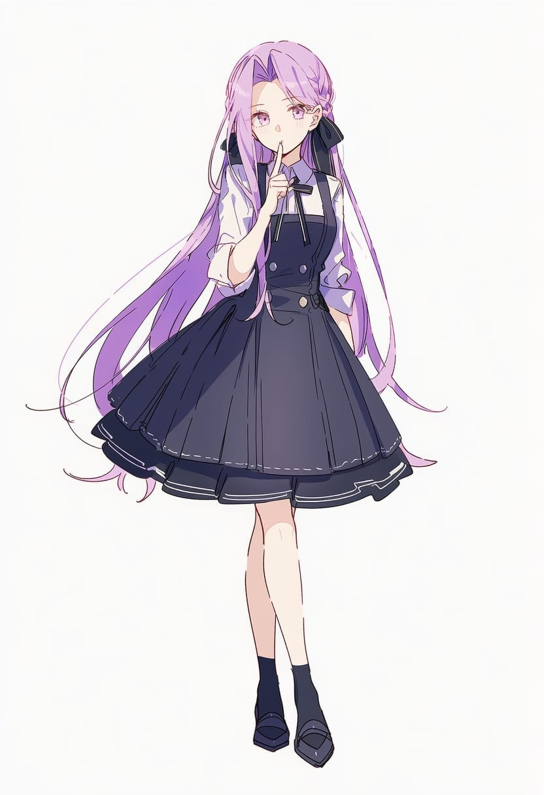

| 字段 | 内容 |
| --- | --- |
| Danbooru Tag | long_hair |
| 中文名 | 长发 |
| 中文含义 | 明显的长发。 |
| 子类 | 基础发型 |

## 4. medium_hair — 长度大约在肩部附近。

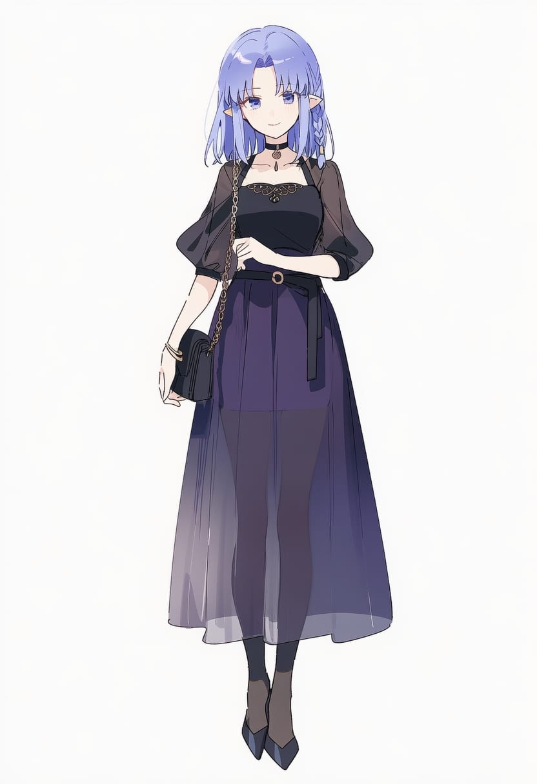

| 字段 | 内容 |
| --- | --- |
| Danbooru Tag | medium_hair |
| 中文名 | 中长发 / 齐肩发 |
| 中文含义 | 长度大约在肩部附近。 |
| 子类 | 基础发型 |

## 5. short_hair — 明显的短发。

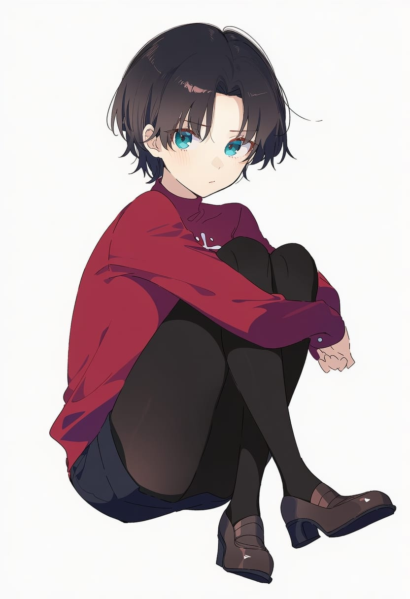

| 字段 | 内容 |
| --- | --- |
| Danbooru Tag | short_hair |
| 中文名 | 短发 |
| 中文含义 | 明显的短发。 |
| 子类 | 基础发型 |

## 6. very_long_hair — 长度远超过普通长发。

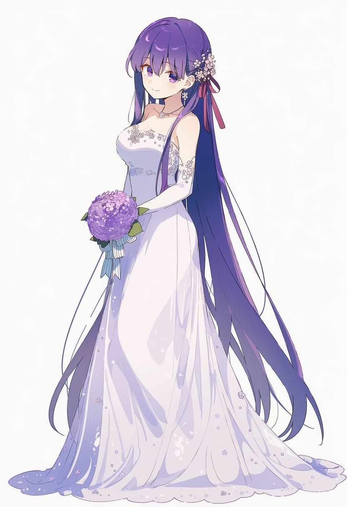

| 字段 | 内容 |
| --- | --- |
| Danbooru Tag | very_long_hair |
| 中文名 | 超长发 |
| 中文含义 | 长度远超过普通长发。 |
| 子类 | 基础发型 |

## 7. very_short_hair — 非常短的头发。

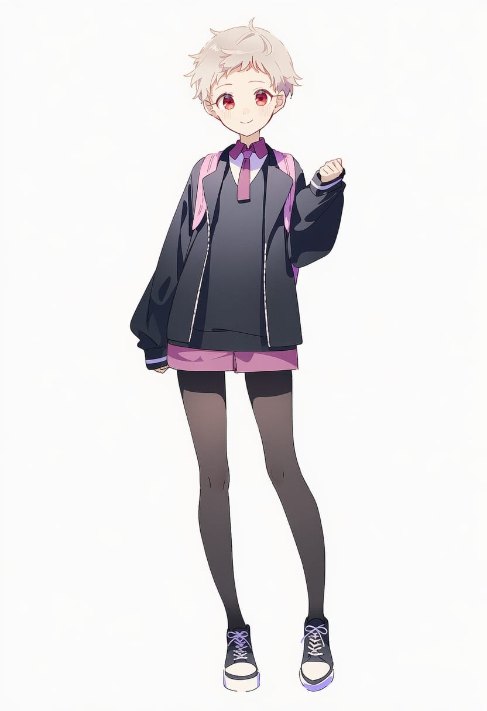

| 字段 | 内容 |
| --- | --- |
| Danbooru Tag | very_short_hair |
| 中文名 | 极短发 |
| 中文含义 | 非常短的头发。 |
| 子类 | 基础发型 |

## 8. beehive_hairdo — 头发高高盘起，像蜂巢一样。

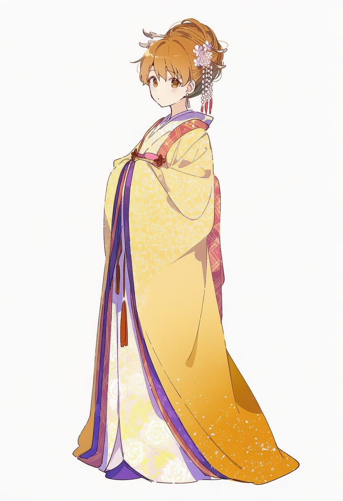

| 字段 | 内容 |
| --- | --- |
| Danbooru Tag | beehive_hairdo |
| 中文名 | 蜂巢高发髻 |
| 中文含义 | 头发高高盘起，像蜂巢一样。 |
| 子类 | 基础发型 |

## 9. bob_cut — 齐颈或齐下巴的波波头。

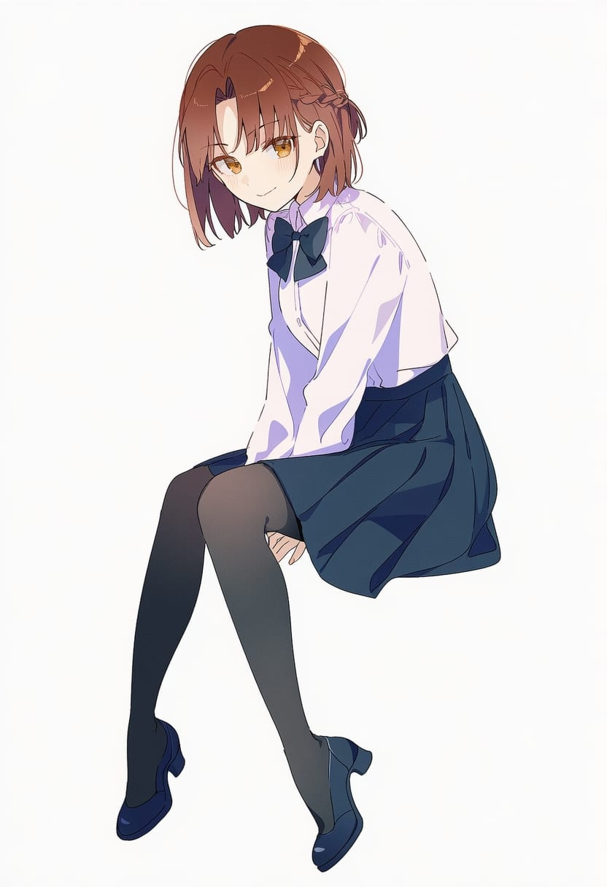

| 字段 | 内容 |
| --- | --- |
| Danbooru Tag | bob_cut |
| 中文名 | 波波头 |
| 中文含义 | 齐颈或齐下巴的波波头。 |
| 子类 | 基础发型 |

## 10. bowl_cut — 头发像锅盖一样整齐包住头部。

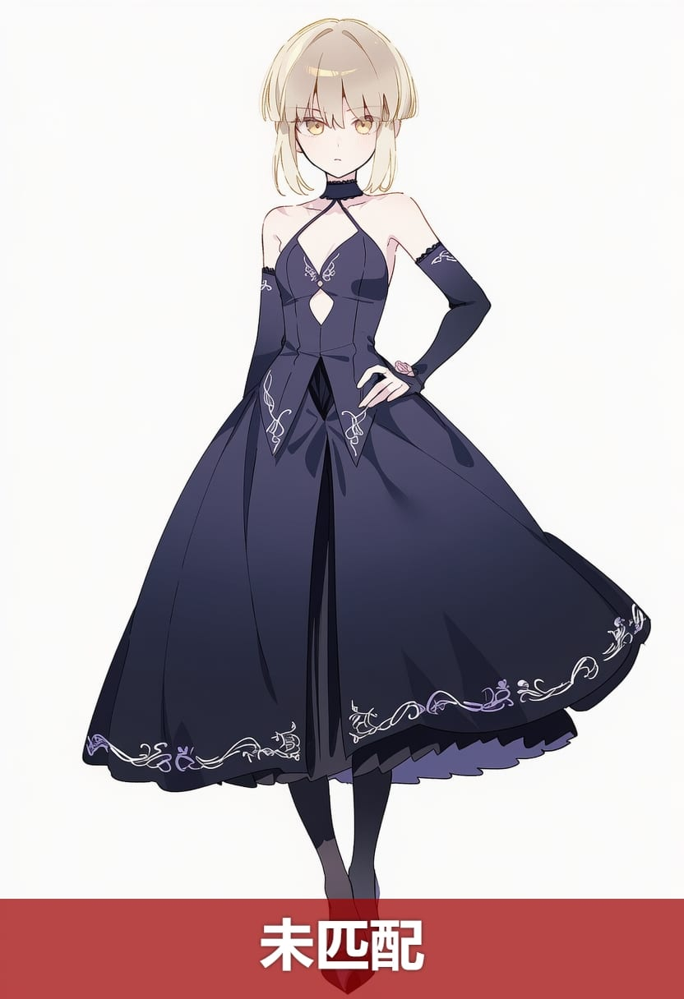

| 字段 | 内容 |
| --- | --- |
| Danbooru Tag | bowl_cut |
| 中文名 | 锅盖头 |
| 中文含义 | 头发像锅盖一样整齐包住头部。 |
| 子类 | 基础发型 |

## 11. hime_cut — 齐刘海配脸侧长直发束的姬发式。

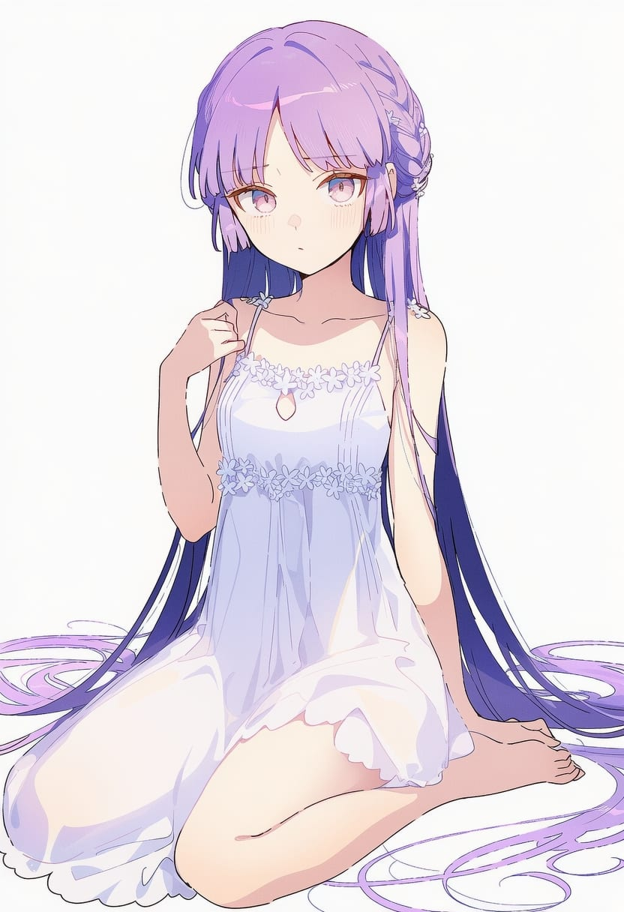

| 字段 | 内容 |
| --- | --- |
| Danbooru Tag | hime_cut |
| 中文名 | 姬发式 |
| 中文含义 | 齐刘海配脸侧长直发束的姬发式。 |
| 子类 | 基础发型 |

## 12. inverted_bob — 后短前长的波波头。

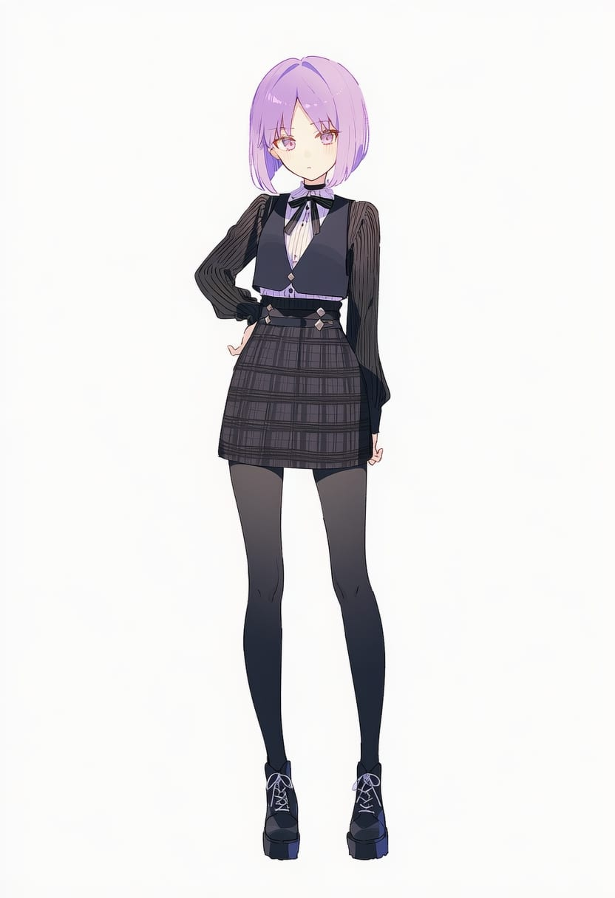

| 字段 | 内容 |
| --- | --- |
| Danbooru Tag | inverted_bob |
| 中文名 | 内长外短倒置波波头 |
| 中文含义 | 后短前长的波波头。 |
| 子类 | 基础发型 |

## 13. jellyfish_cut — 上短下长、像水母层次的发型。

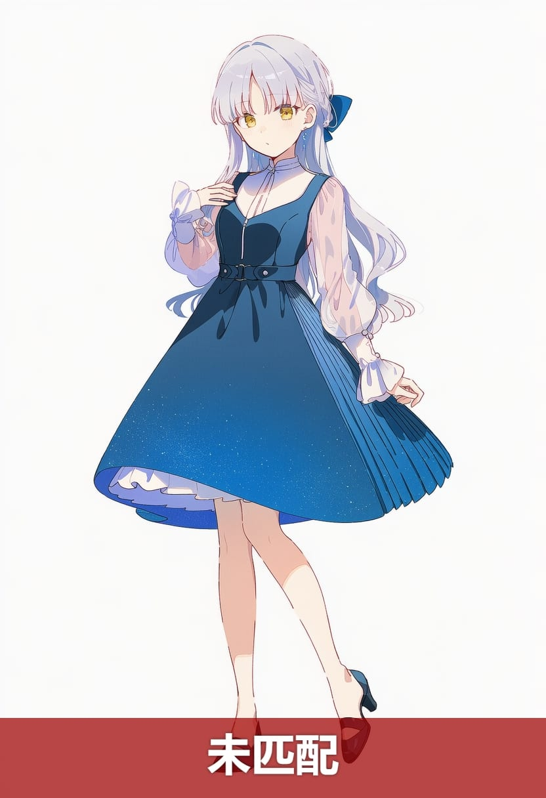

| 字段 | 内容 |
| --- | --- |
| Danbooru Tag | jellyfish_cut |
| 中文名 | 水母头 |
| 中文含义 | 上短下长、像水母层次的发型。 |
| 子类 | 基础发型 |

## 14. mohawk — 头顶中间竖起、两侧较短的莫西干头。

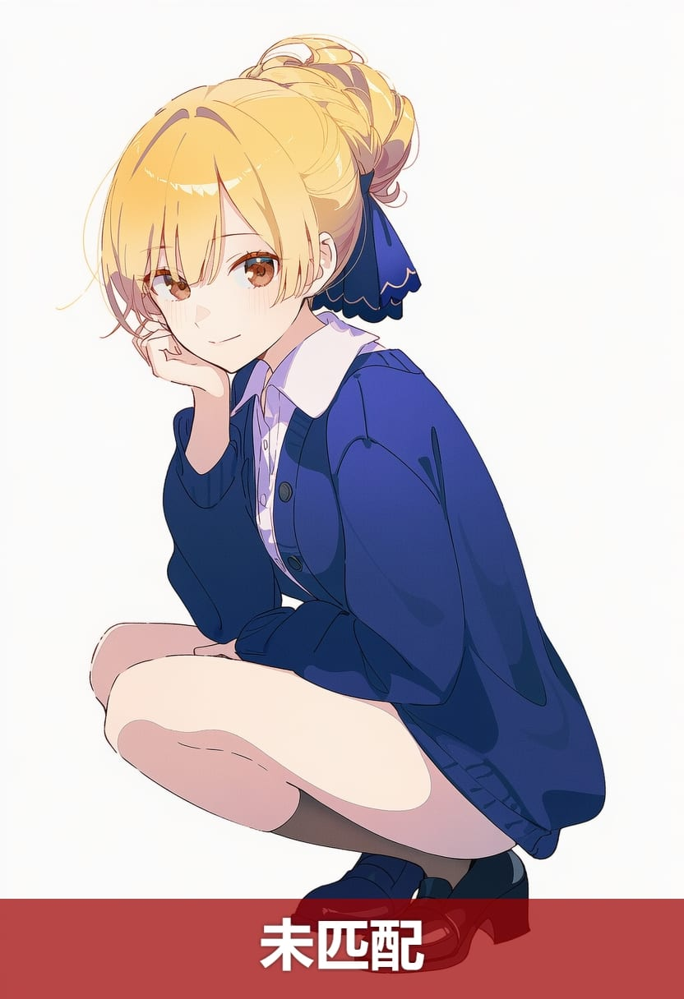

| 字段 | 内容 |
| --- | --- |
| Danbooru Tag | mohawk |
| 中文名 | 莫西干头 |
| 中文含义 | 头顶中间竖起、两侧较短的莫西干头。 |
| 子类 | 基础发型 |

## 15. half_updo — 上半部分头发扎起，下半部分披着。

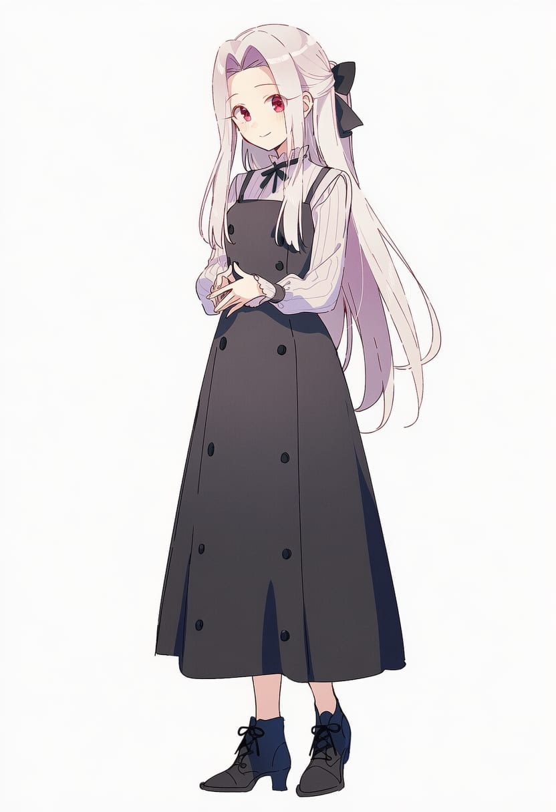

| 字段 | 内容 |
| --- | --- |
| Danbooru Tag | half_updo |
| 中文名 | 半扎发 |
| 中文含义 | 上半部分头发扎起，下半部分披着。 |
| 子类 | 扎发/编发 |

## 16. high_ponytail — 马尾扎在较高位置。

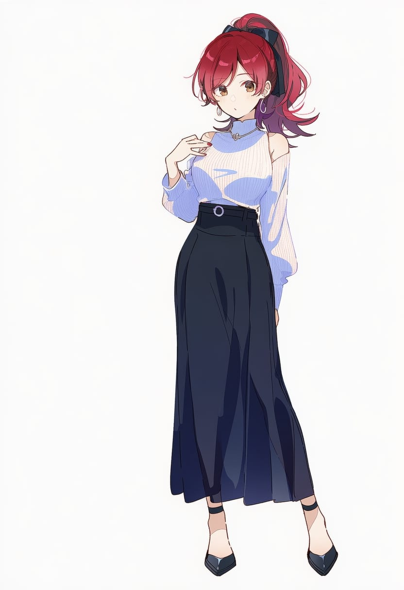

| 字段 | 内容 |
| --- | --- |
| Danbooru Tag | high_ponytail |
| 中文名 | 高马尾 |
| 中文含义 | 马尾扎在较高位置。 |
| 子类 | 扎发/编发 |

## 17. high_side_ponytail — 马尾扎在头部较高的侧边。

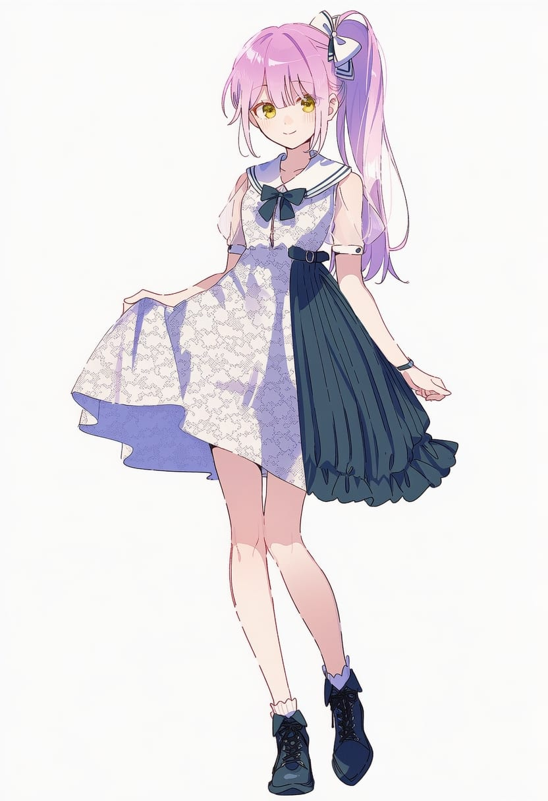

| 字段 | 内容 |
| --- | --- |
| Danbooru Tag | high_side_ponytail |
| 中文名 | 高侧马尾 |
| 中文含义 | 马尾扎在头部较高的侧边。 |
| 子类 | 扎发/编发 |

## 18. low-tied_long_hair — 长发在较低位置扎起。

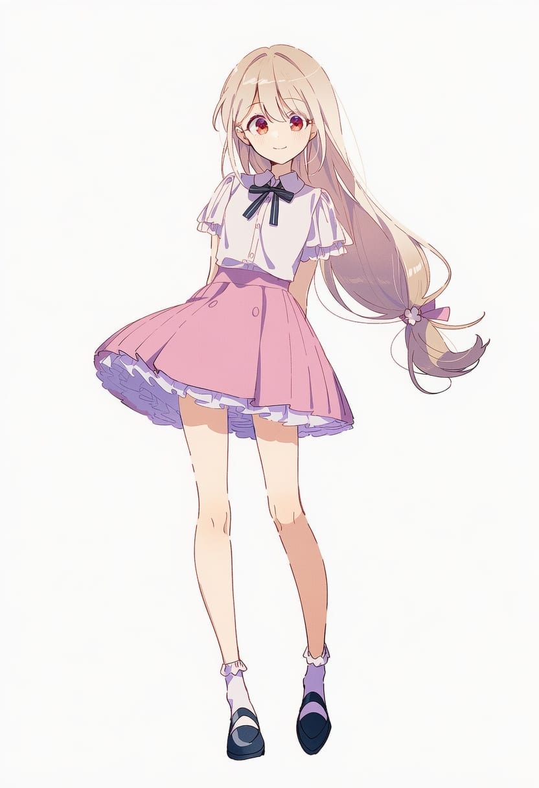

| 字段 | 内容 |
| --- | --- |
| Danbooru Tag | low-tied_long_hair |
| 中文名 | 低扎长发 |
| 中文含义 | 长发在较低位置扎起。 |
| 子类 | 扎发/编发 |

## 19. low_ponytail — 马尾扎在后脑较低位置。

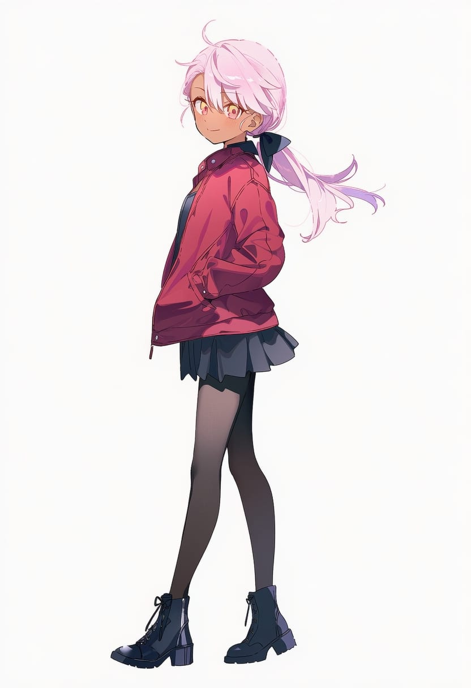

| 字段 | 内容 |
| --- | --- |
| Danbooru Tag | low_ponytail |
| 中文名 | 低马尾 |
| 中文含义 | 马尾扎在后脑较低位置。 |
| 子类 | 扎发/编发 |

## 20. low_side_ponytail — 马尾扎在较低的侧边。

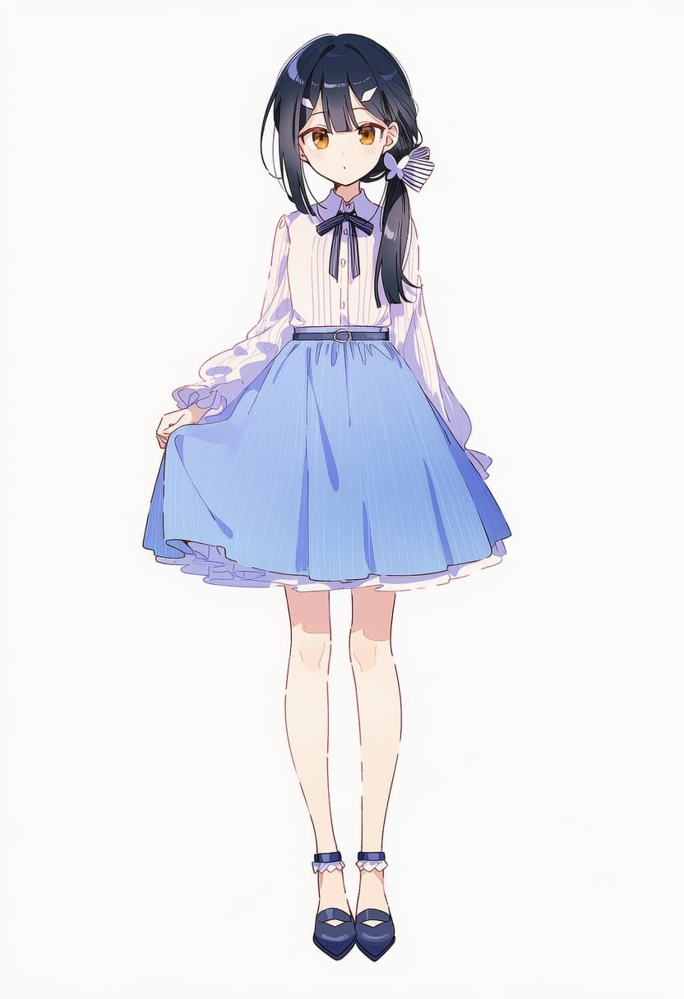

| 字段 | 内容 |
| --- | --- |
| Danbooru Tag | low_side_ponytail |
| 中文名 | 低侧马尾 |
| 中文含义 | 马尾扎在较低的侧边。 |
| 子类 | 扎发/编发 |

## 21. multi-tied_hair — 一束头发被分成多段扎起。

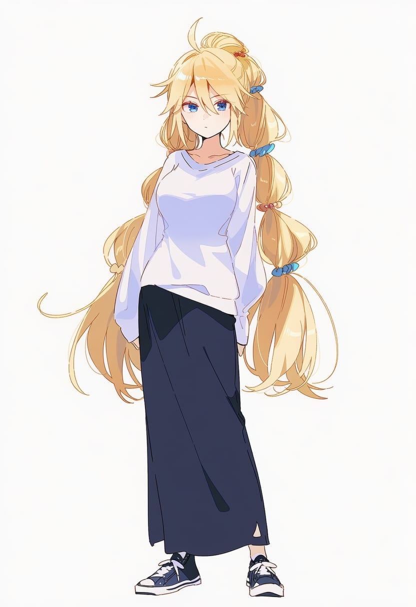

| 字段 | 内容 |
| --- | --- |
| Danbooru Tag | multi-tied_hair |
| 中文名 | 多段扎发 |
| 中文含义 | 一束头发被分成多段扎起。 |
| 子类 | 扎发/编发 |

## 22. one_side_up — 只把一侧头发扎起来。

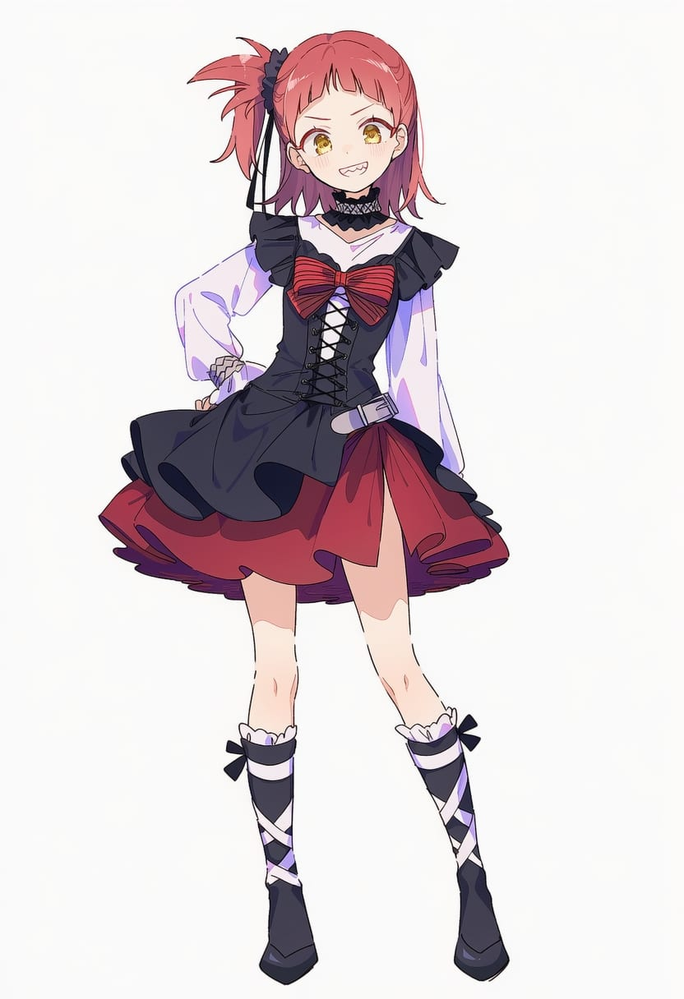

| 字段 | 内容 |
| --- | --- |
| Danbooru Tag | one_side_up |
| 中文名 | 单侧扎发 |
| 中文含义 | 只把一侧头发扎起来。 |
| 子类 | 扎发/编发 |

## 23. ponytail — 头发在后方扎成一束马尾。

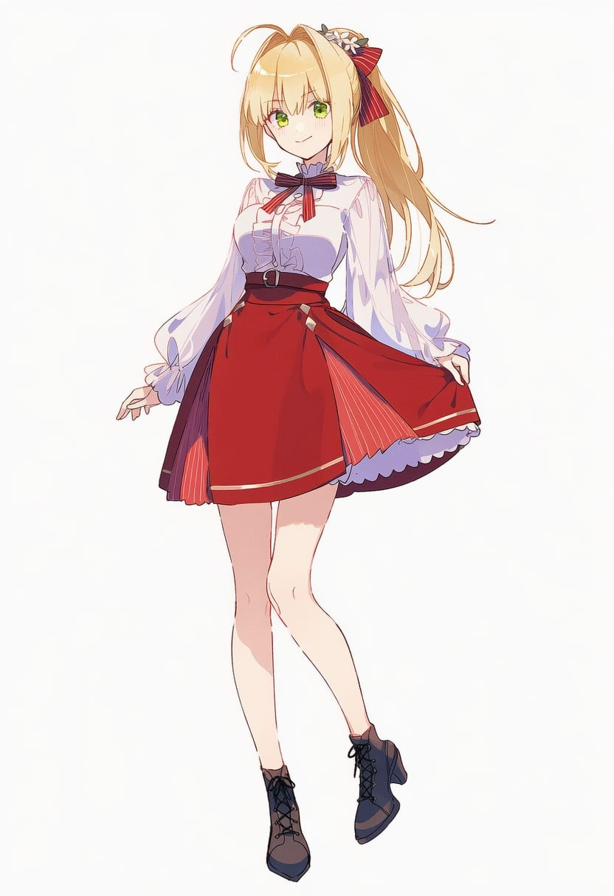

| 字段 | 内容 |
| --- | --- |
| Danbooru Tag | ponytail |
| 中文名 | 马尾 |
| 中文含义 | 头发在后方扎成一束马尾。 |
| 子类 | 扎发/编发 |

## 24. short_ponytail — 长度较短的马尾。

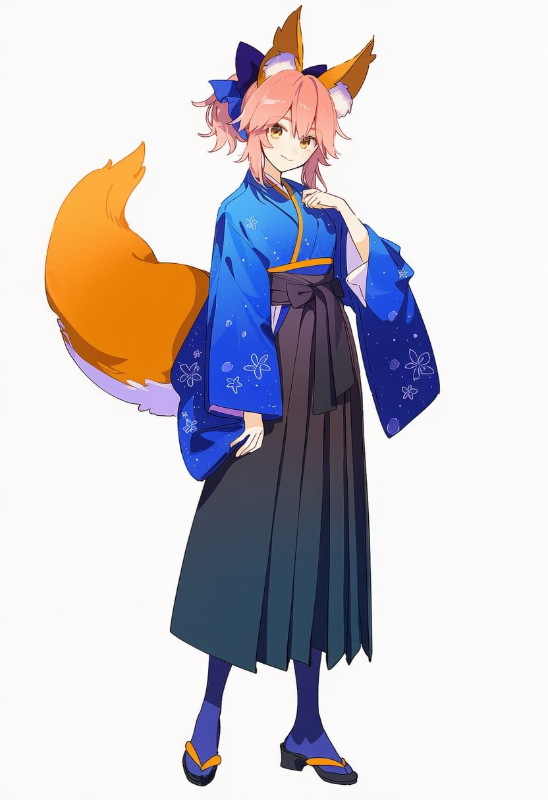

| 字段 | 内容 |
| --- | --- |
| Danbooru Tag | short_ponytail |
| 中文名 | 短马尾 |
| 中文含义 | 长度较短的马尾。 |
| 子类 | 扎发/编发 |

## 25. short_side_ponytail — 较短的侧马尾。

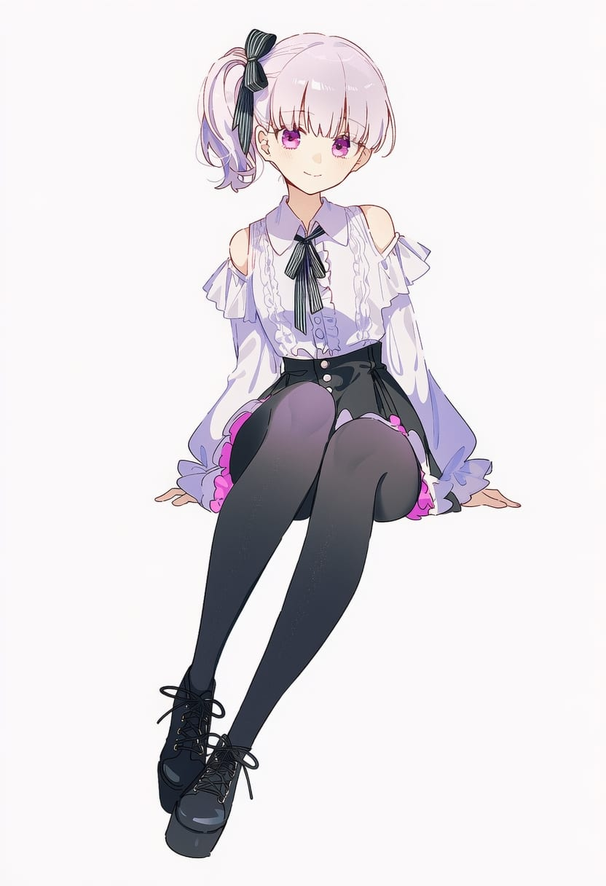

| 字段 | 内容 |
| --- | --- |
| Danbooru Tag | short_side_ponytail |
| 中文名 | 短侧马尾 |
| 中文含义 | 较短的侧马尾。 |
| 子类 | 扎发/编发 |

## 26. side_ponytail — 马尾扎在头部侧边。

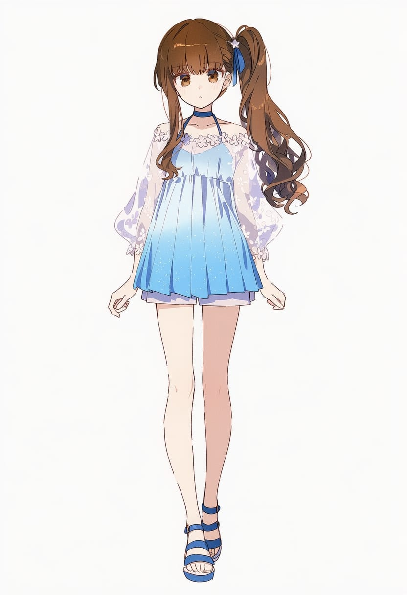

| 字段 | 内容 |
| --- | --- |
| Danbooru Tag | side_ponytail |
| 中文名 | 侧马尾 |
| 中文含义 | 马尾扎在头部侧边。 |
| 子类 | 扎发/编发 |

## 27. topknot — 头发在头顶扎成小髻。

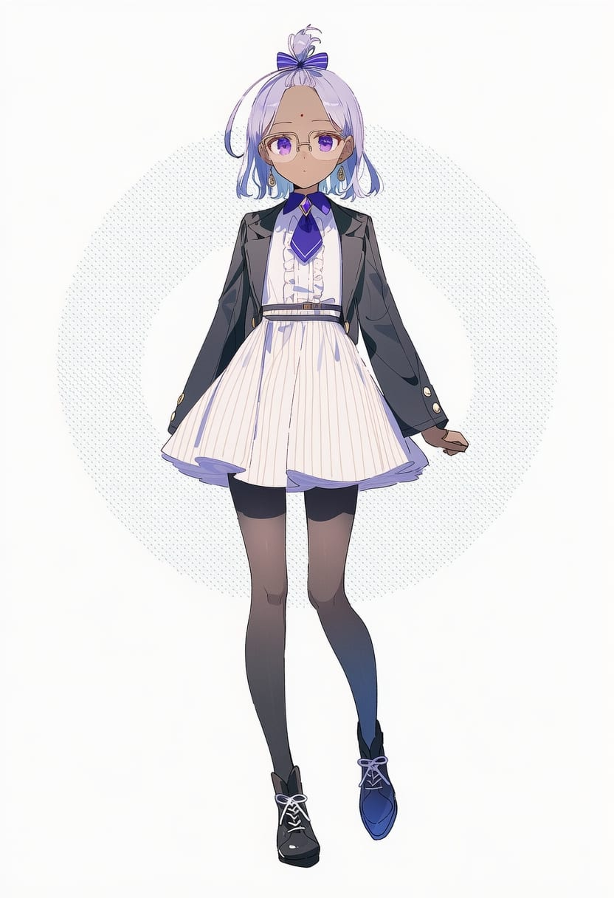

| 字段 | 内容 |
| --- | --- |
| Danbooru Tag | topknot |
| 中文名 | 顶髻 |
| 中文含义 | 头发在头顶扎成小髻。 |
| 子类 | 扎发/编发 |

## 28. two_side_up — 左右两侧各扎起一部分头发。

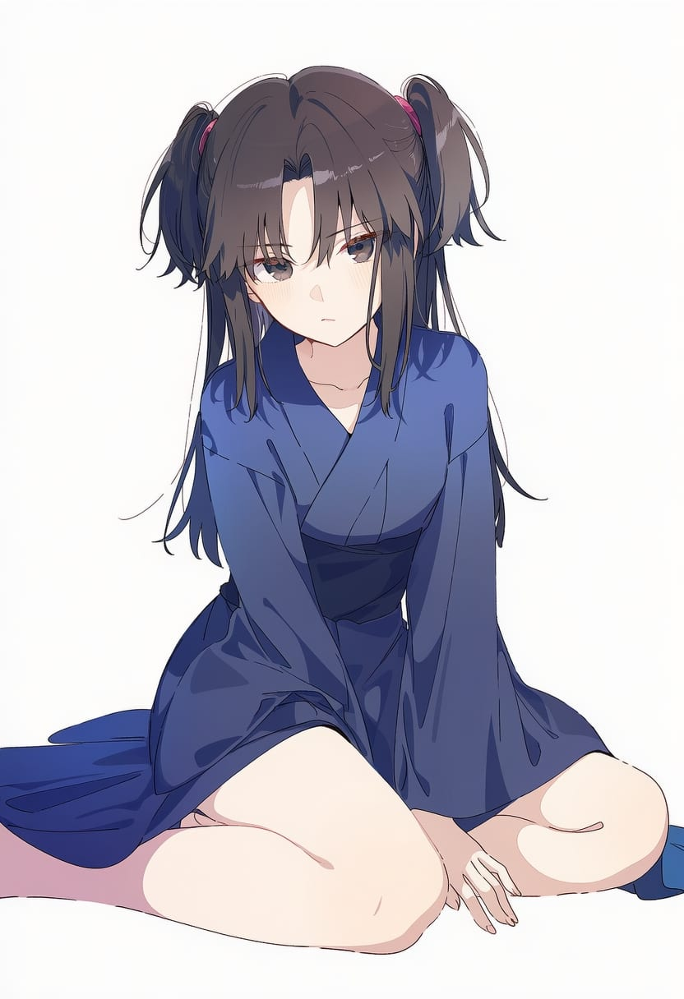

| 字段 | 内容 |
| --- | --- |
| Danbooru Tag | two_side_up |
| 中文名 | 双侧半扎发 |
| 中文含义 | 左右两侧各扎起一部分头发。 |
| 子类 | 扎发/编发 |

## 29. wide_ponytail — 马尾散得很宽，像扇形。

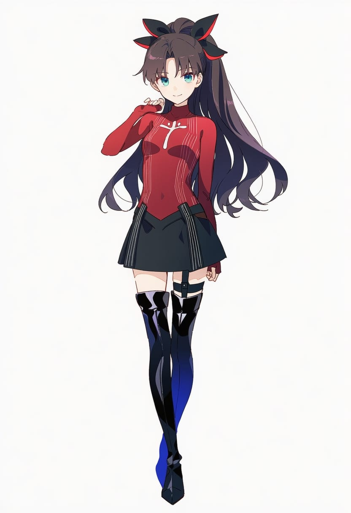

| 字段 | 内容 |
| --- | --- |
| Danbooru Tag | wide_ponytail |
| 中文名 | 宽扇形马尾 |
| 中文含义 | 马尾散得很宽，像扇形。 |
| 子类 | 扎发/编发 |

## 30. braid — 头发编成辫子。

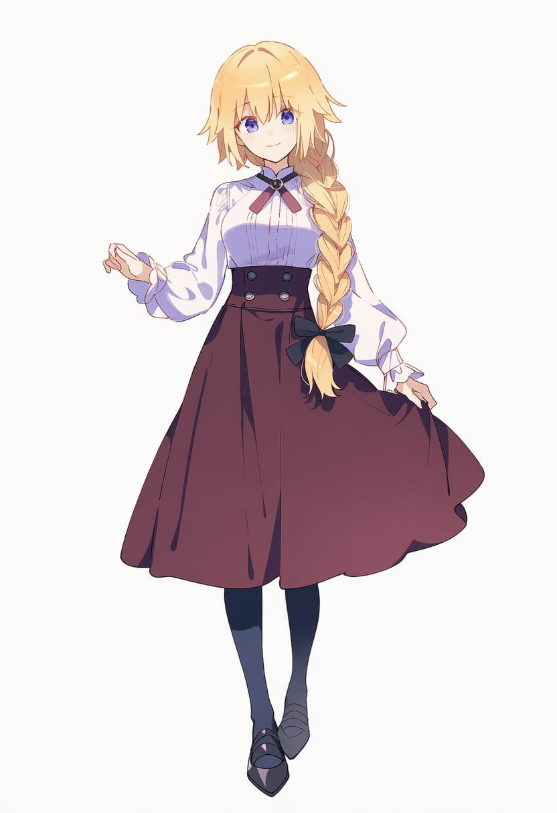

| 字段 | 内容 |
| --- | --- |
| Danbooru Tag | braid |
| 中文名 | 辫发 |
| 中文含义 | 头发编成辫子。 |
| 子类 | 扎发/编发 |

## 31. braided_twintails — 双马尾本身编成辫子。

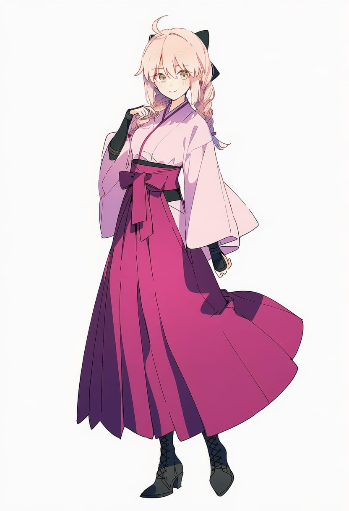

| 字段 | 内容 |
| --- | --- |
| Danbooru Tag | braided_twintails |
| 中文名 | 编辫双马尾 |
| 中文含义 | 双马尾本身编成辫子。 |
| 子类 | 扎发/编发 |

## 32. crown_braid — 辫子沿头顶围成皇冠状。

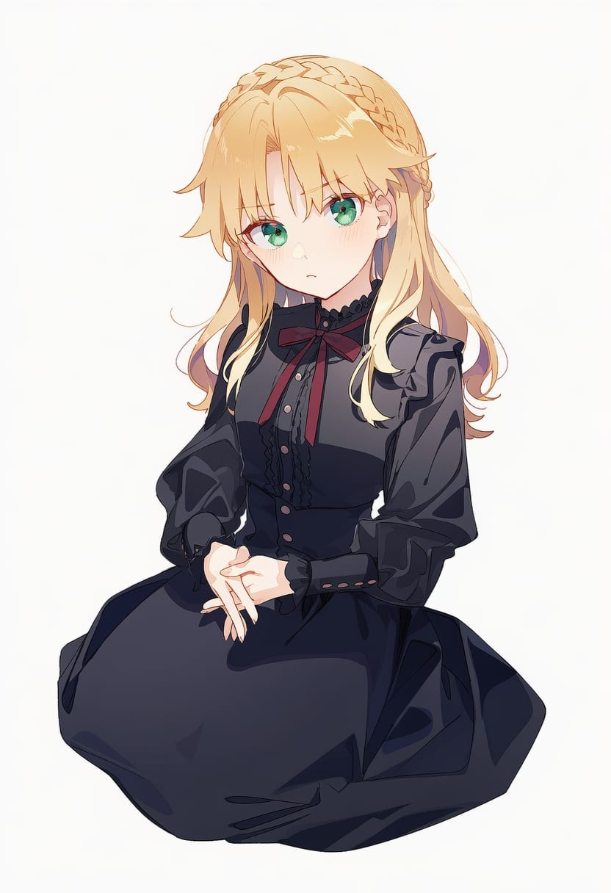

| 字段 | 内容 |
| --- | --- |
| Danbooru Tag | crown_braid |
| 中文名 | 冠状辫 |
| 中文含义 | 辫子沿头顶围成皇冠状。 |
| 子类 | 扎发/编发 |

## 33. dreadlocks — 头发成束缠结成脏辫。

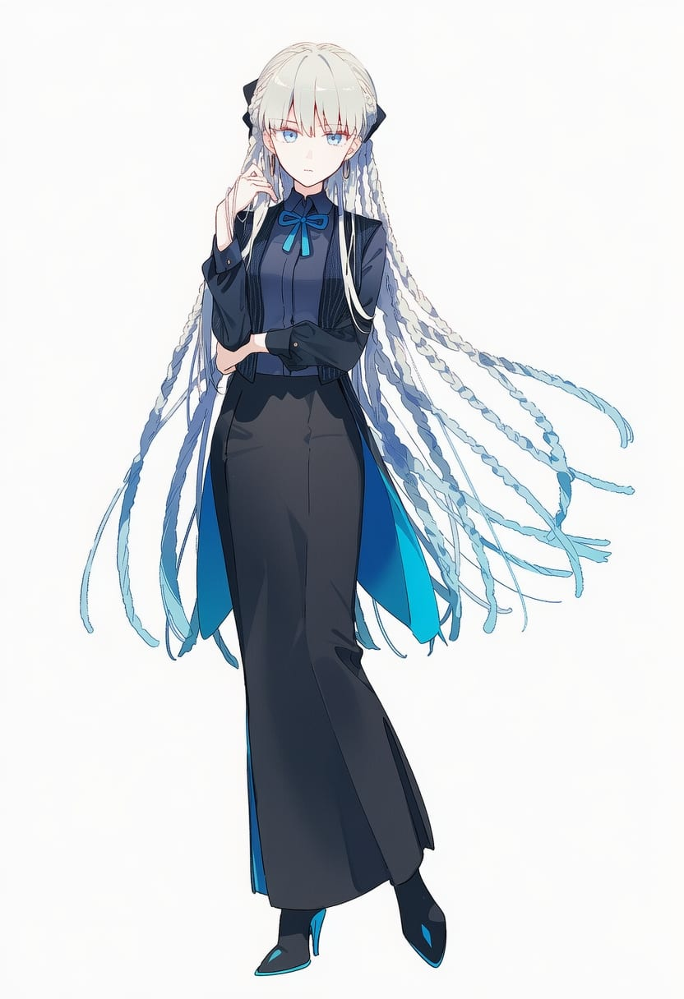

| 字段 | 内容 |
| --- | --- |
| Danbooru Tag | dreadlocks |
| 中文名 | 脏辫 |
| 中文含义 | 头发成束缠结成脏辫。 |
| 子类 | 扎发/编发 |

## 34. low-braided_long_hair — 长发在低位编成辫子。

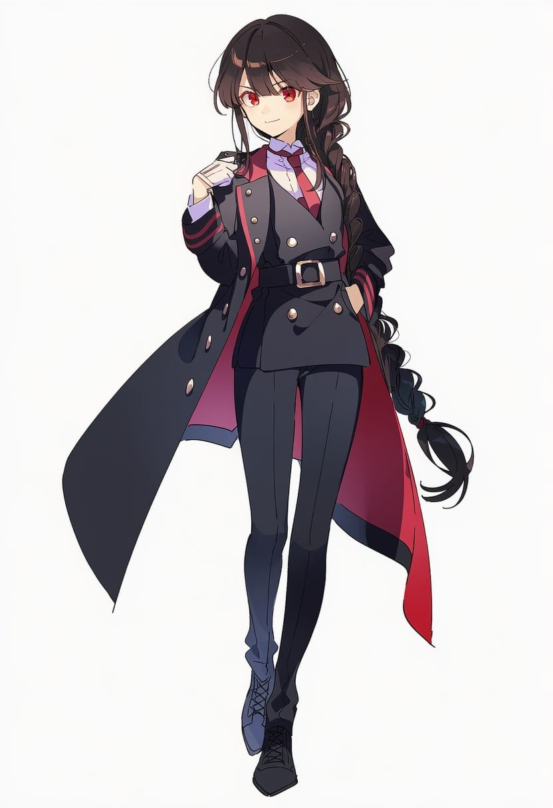

| 字段 | 内容 |
| --- | --- |
| Danbooru Tag | low-braided_long_hair |
| 中文名 | 低位编辫长发 |
| 中文含义 | 长发在低位编成辫子。 |
| 子类 | 扎发/编发 |

## 35. low_twin_braids — 左右两条辫子扎在较低位置。

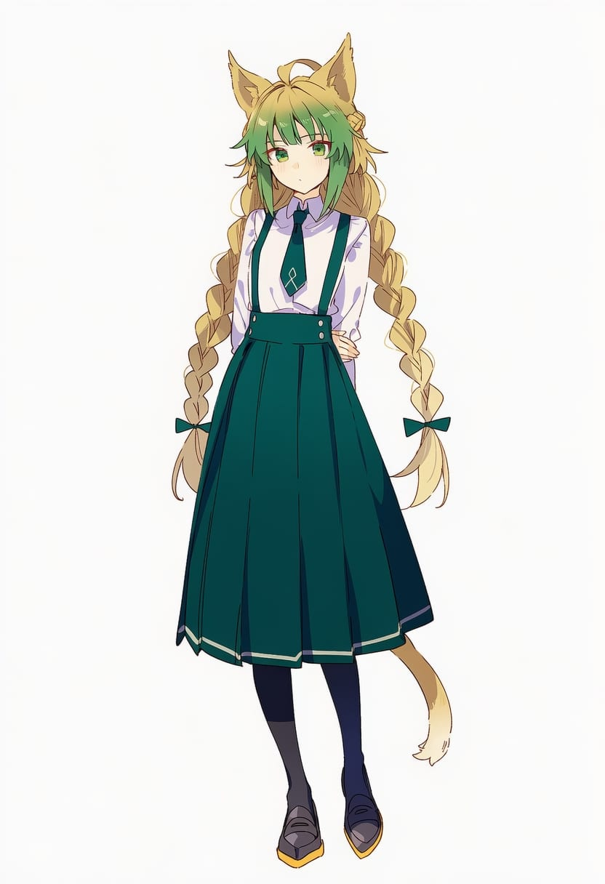

| 字段 | 内容 |
| --- | --- |
| Danbooru Tag | low_twin_braids |
| 中文名 | 低位双辫 |
| 中文含义 | 左右两条辫子扎在较低位置。 |
| 子类 | 扎发/编发 |

## 36. side_braid — 辫子放在头部一侧。

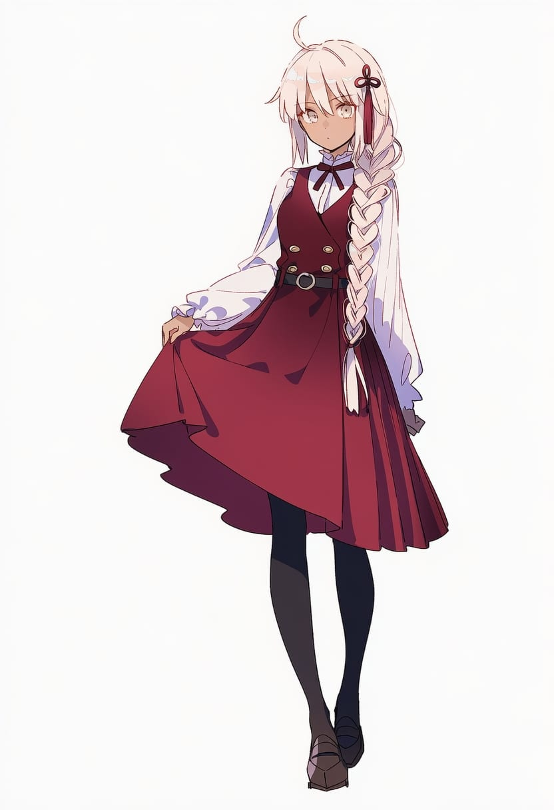

| 字段 | 内容 |
| --- | --- |
| Danbooru Tag | side_braid |
| 中文名 | 侧辫 |
| 中文含义 | 辫子放在头部一侧。 |
| 子类 | 扎发/编发 |

## 37. single_braid — 只有一条主要辫子。

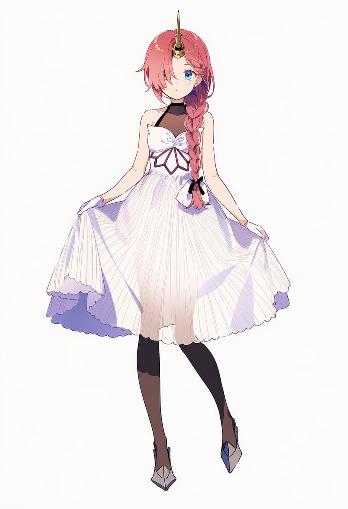

| 字段 | 内容 |
| --- | --- |
| Danbooru Tag | single_braid |
| 中文名 | 单辫 |
| 中文含义 | 只有一条主要辫子。 |
| 子类 | 扎发/编发 |

## 38. twin_braids — 左右各有一条辫子。

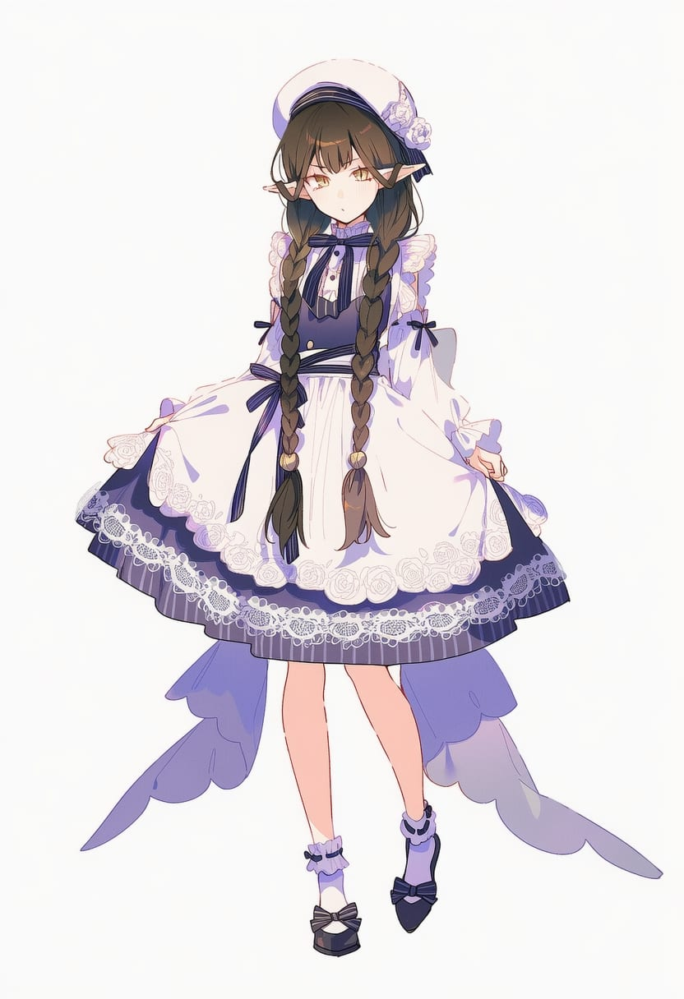

| 字段 | 内容 |
| --- | --- |
| Danbooru Tag | twin_braids |
| 中文名 | 双辫子 |
| 中文含义 | 左右各有一条辫子。 |
| 子类 | 扎发/编发 |

## 39. cone_hair_bun — 发髻盘成锥形。

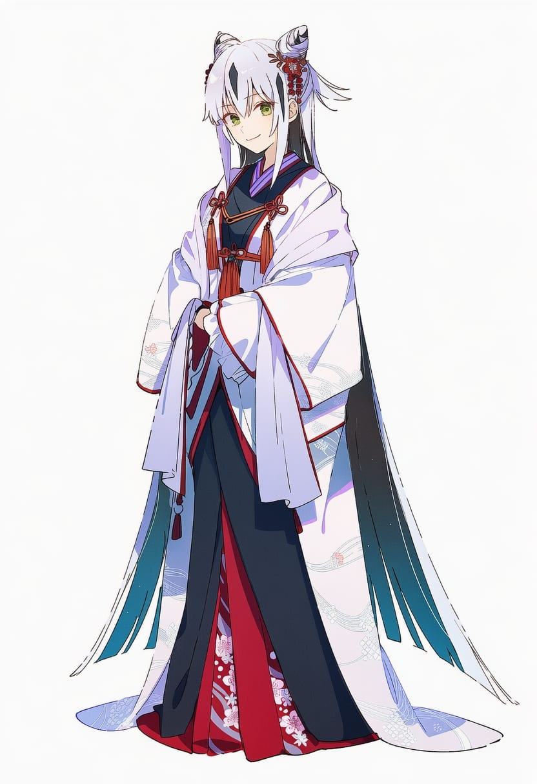

| 字段 | 内容 |
| --- | --- |
| Danbooru Tag | cone_hair_bun |
| 中文名 | 锥形发髻 |
| 中文含义 | 发髻盘成锥形。 |
| 子类 | 扎发/编发 |

## 40. donut_hair_bun — 发髻盘成圆环状。

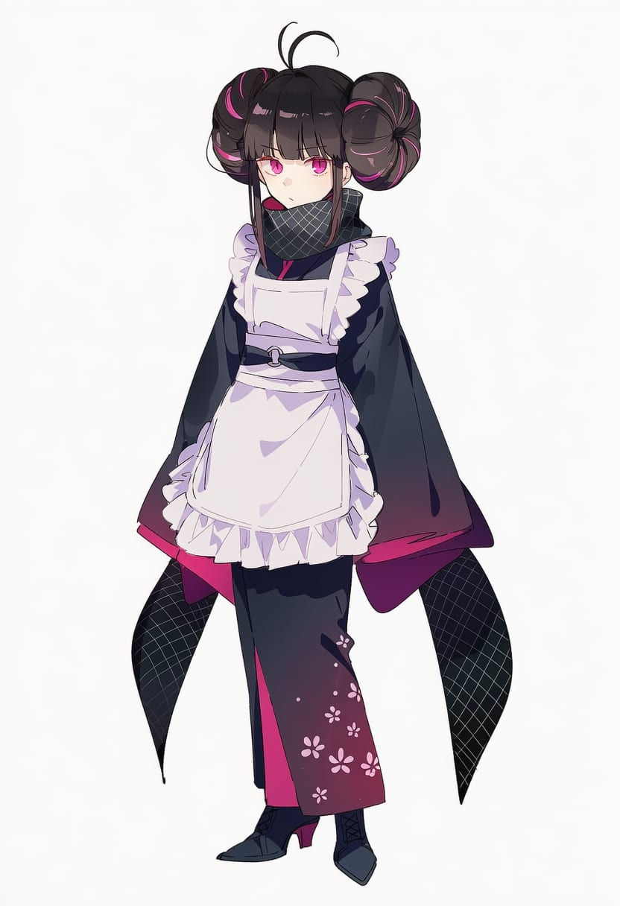

| 字段 | 内容 |
| --- | --- |
| Danbooru Tag | donut_hair_bun |
| 中文名 | 甜甜圈发髻 |
| 中文含义 | 发髻盘成圆环状。 |
| 子类 | 扎发/编发 |

## 41. double_bun — 左右各有一个丸子头。

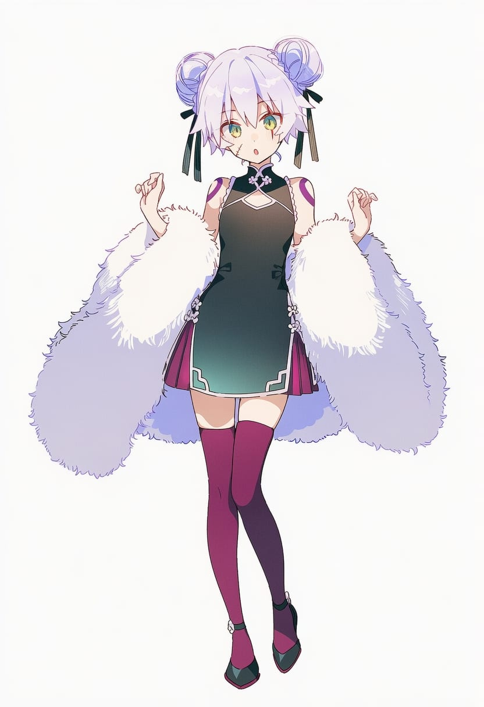

| 字段 | 内容 |
| --- | --- |
| Danbooru Tag | double_bun |
| 中文名 | 双丸子头 |
| 中文含义 | 左右各有一个丸子头。 |
| 子类 | 扎发/编发 |

## 42. hair_bun — 头发盘成发髻或丸子头。

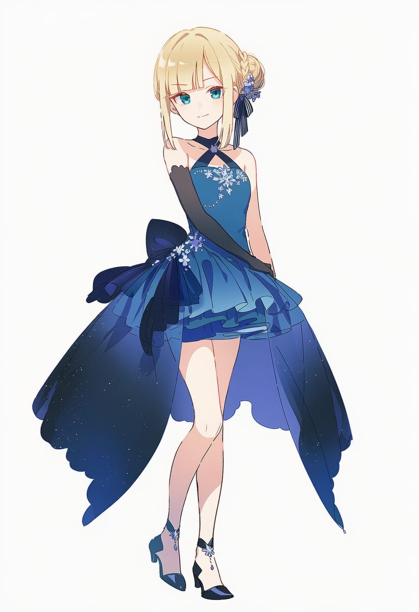

| 字段 | 内容 |
| --- | --- |
| Danbooru Tag | hair_bun |
| 中文名 | 发髻 / 丸子头 |
| 中文含义 | 头发盘成发髻或丸子头。 |
| 子类 | 扎发/编发 |

## 43. hair_rings — 头发盘成多个环状结构。

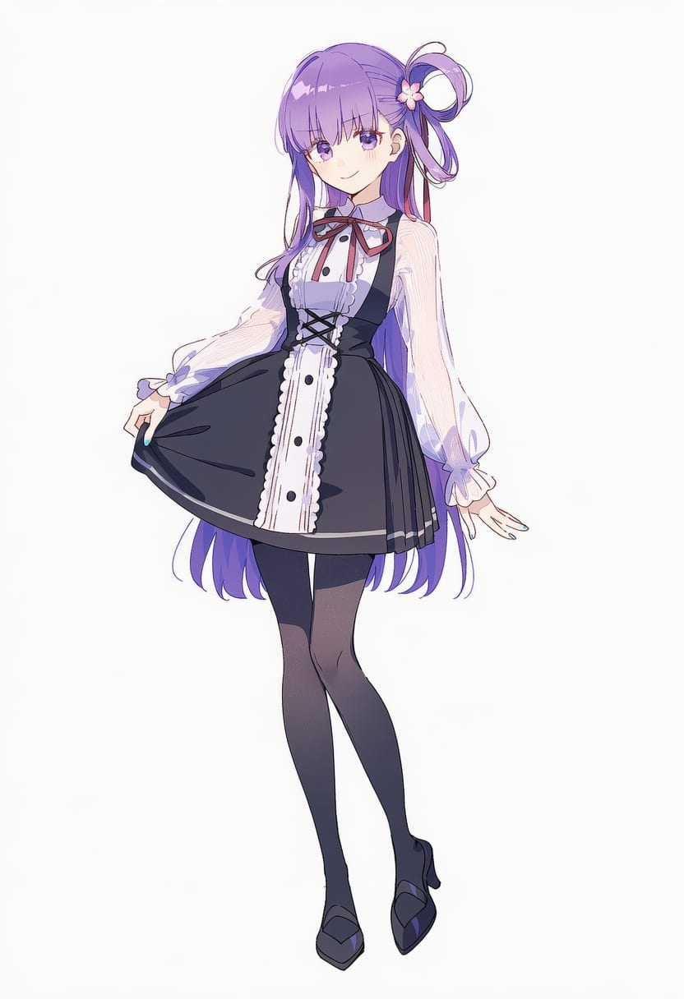

| 字段 | 内容 |
| --- | --- |
| Danbooru Tag | hair_rings |
| 中文名 | 环状发髻 |
| 中文含义 | 头发盘成多个环状结构。 |
| 子类 | 扎发/编发 |

## 44. heart_hair_bun — 发髻盘成心形。

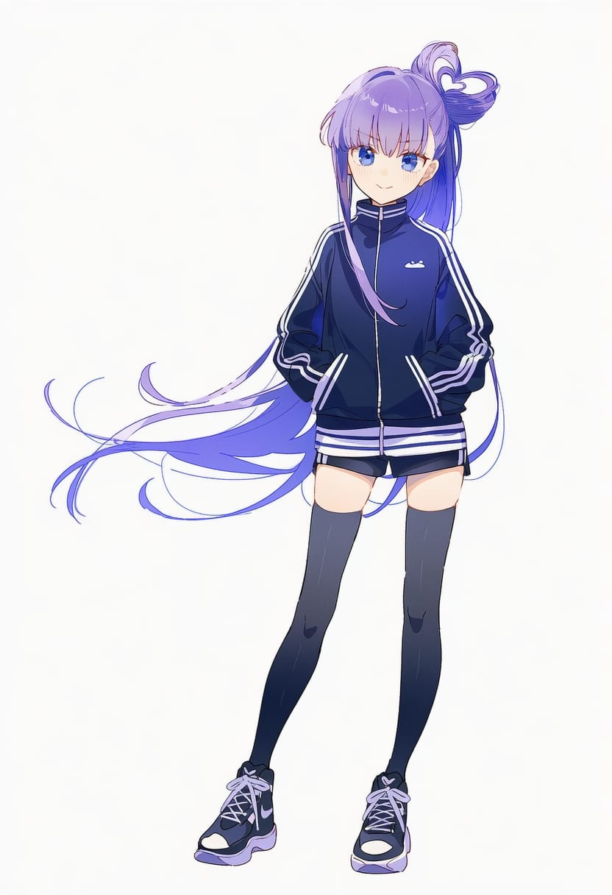

| 字段 | 内容 |
| --- | --- |
| Danbooru Tag | heart_hair_bun |
| 中文名 | 心形发髻 |
| 中文含义 | 发髻盘成心形。 |
| 子类 | 扎发/编发 |

## 45. single_hair_bun — 只有一个丸子头。

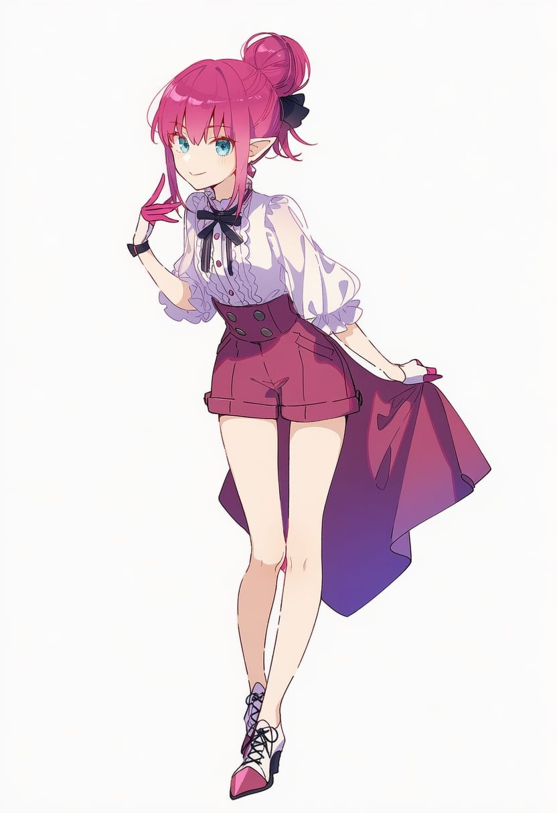

| 字段 | 内容 |
| --- | --- |
| Danbooru Tag | single_hair_bun |
| 中文名 | 单丸子头 |
| 中文含义 | 只有一个丸子头。 |
| 子类 | 扎发/编发 |

## 46. single_hair_ring — 头发形成一个明显圆环。

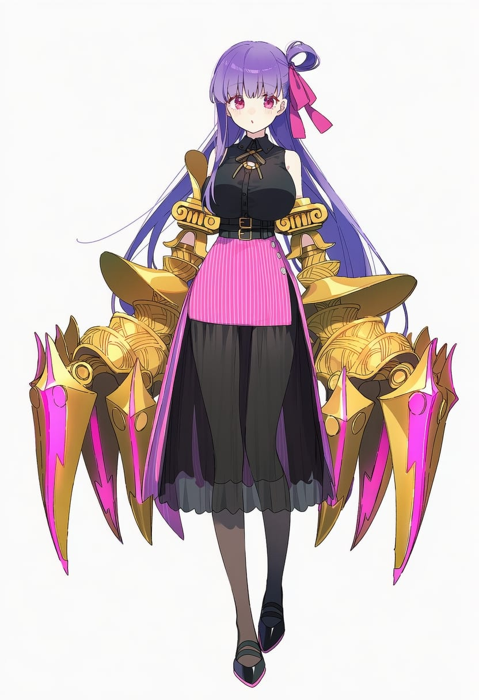

| 字段 | 内容 |
| --- | --- |
| Danbooru Tag | single_hair_ring |
| 中文名 | 单环发 |
| 中文含义 | 头发形成一个明显圆环。 |
| 子类 | 扎发/编发 |

## 47. blunt_bangs — 刘海横向齐切，边缘很整齐。

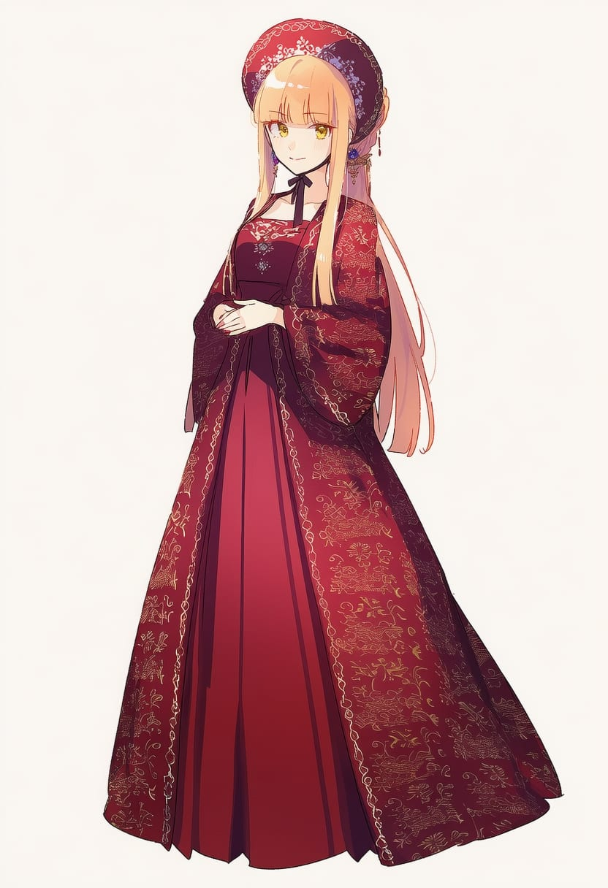

| 字段 | 内容 |
| --- | --- |
| Danbooru Tag | blunt_bangs |
| 中文名 | 齐刘海 |
| 中文含义 | 刘海横向齐切，边缘很整齐。 |
| 子类 | 刘海/侧发 |

## 48. crossed_bangs — 刘海发束在额前交叉。

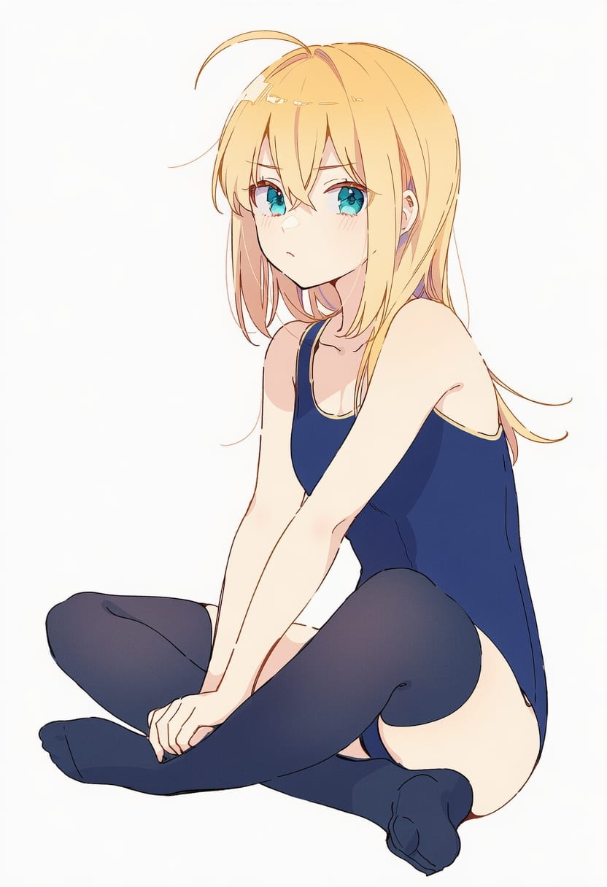

| 字段 | 内容 |
| --- | --- |
| Danbooru Tag | crossed_bangs |
| 中文名 | 交叉刘海 |
| 中文含义 | 刘海发束在额前交叉。 |
| 子类 | 刘海/侧发 |

## 49. curtained_hair — 刘海从中间分开，像帘子一样垂下。

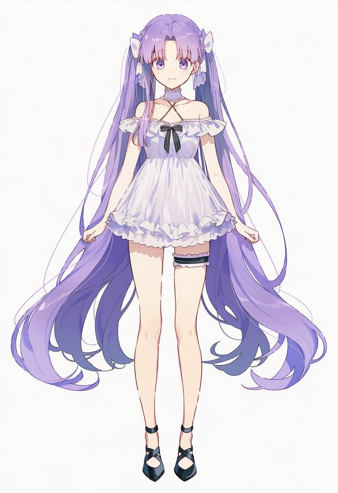

| 字段 | 内容 |
| --- | --- |
| Danbooru Tag | curtained_hair |
| 中文名 | 帘式刘海 |
| 中文含义 | 刘海从中间分开，像帘子一样垂下。 |
| 子类 | 刘海/侧发 |

## 50. diagonal_bangs — 刘海斜着剪或斜着覆盖额头。

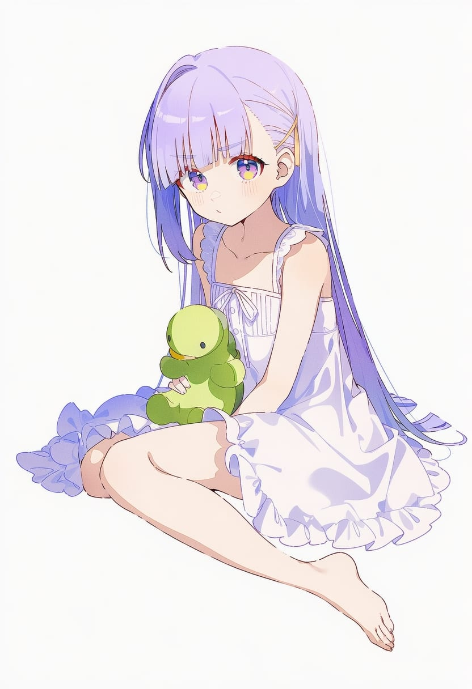

| 字段 | 内容 |
| --- | --- |
| Danbooru Tag | diagonal_bangs |
| 中文名 | 斜切刘海 |
| 中文含义 | 刘海斜着剪或斜着覆盖额头。 |
| 子类 | 刘海/侧发 |

## 51. double-parted_bangs — 刘海有两个明显分缝。

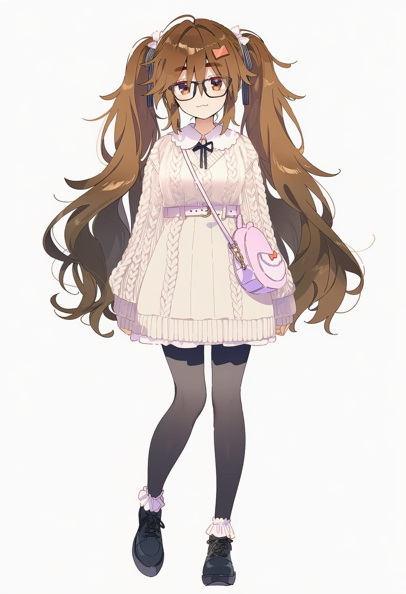

| 字段 | 内容 |
| --- | --- |
| Danbooru Tag | double-parted_bangs |
| 中文名 | 双分缝刘海 |
| 中文含义 | 刘海有两个明显分缝。 |
| 子类 | 刘海/侧发 |

## 52. hair_between_eyes — 一束头发垂在两眼之间。

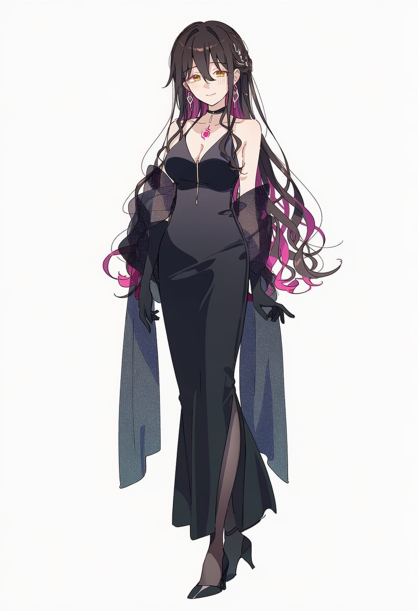

| 字段 | 内容 |
| --- | --- |
| Danbooru Tag | hair_between_eyes |
| 中文名 | 眼间发束 |
| 中文含义 | 一束头发垂在两眼之间。 |
| 子类 | 刘海/侧发 |

## 53. hair_intakes — 额前两侧有向内凹的“进气口”形发束。

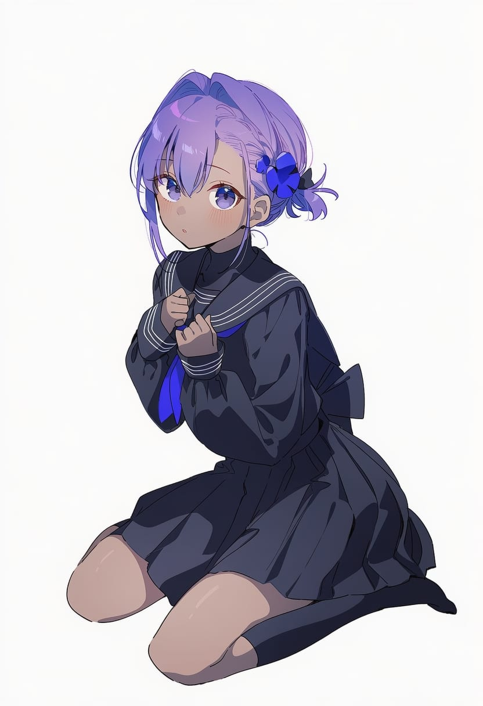

| 字段 | 内容 |
| --- | --- |
| Danbooru Tag | hair_intakes |
| 中文名 | 进气口刘海 |
| 中文含义 | 额前两侧有向内凹的“进气口”形发束。 |
| 子类 | 刘海/侧发 |

## 54. hair_over_eyes — 头发遮住双眼。

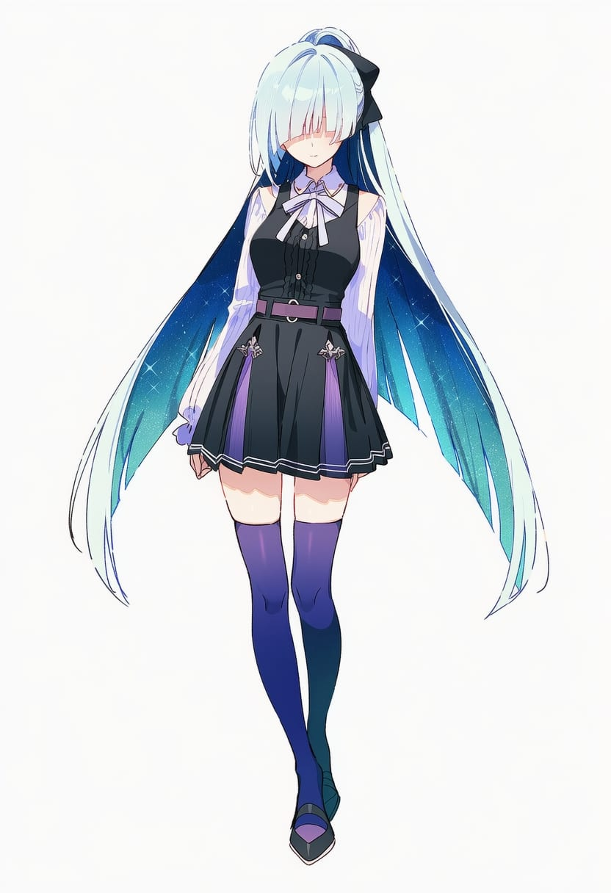

| 字段 | 内容 |
| --- | --- |
| Danbooru Tag | hair_over_eyes |
| 中文名 | 双眼遮发 |
| 中文含义 | 头发遮住双眼。 |
| 子类 | 刘海/侧发 |

## 55. hair_over_one_eye — 头发遮住一只眼睛。

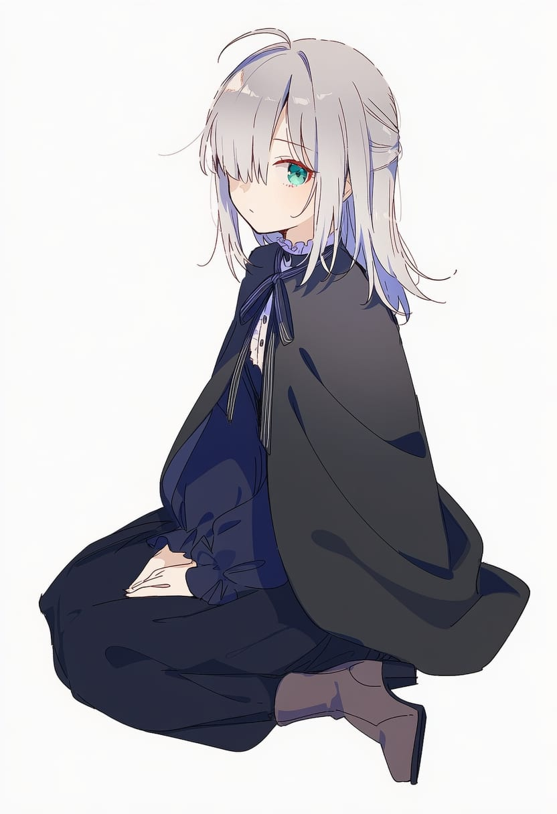

| 字段 | 内容 |
| --- | --- |
| Danbooru Tag | hair_over_one_eye |
| 中文名 | 单眼遮发 |
| 中文含义 | 头发遮住一只眼睛。 |
| 子类 | 刘海/侧发 |

## 56. long_bangs — 刘海很长，明显超过普通长度。

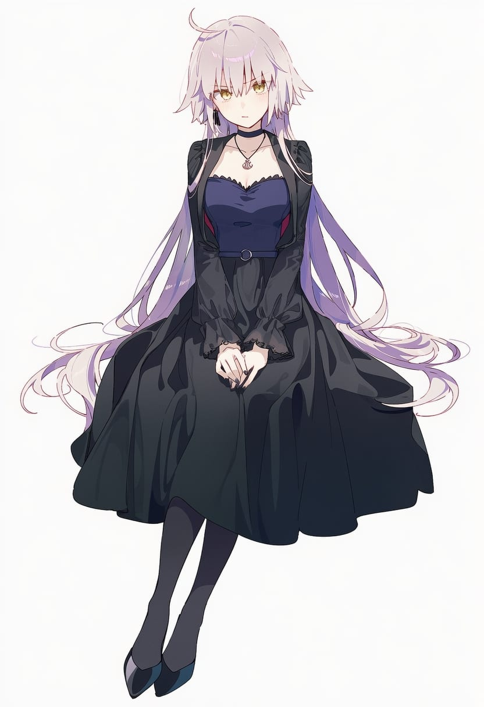

| 字段 | 内容 |
| --- | --- |
| Danbooru Tag | long_bangs |
| 中文名 | 长刘海 |
| 中文含义 | 刘海很长，明显超过普通长度。 |
| 子类 | 刘海/侧发 |

## 57. long_hair_between_eyes — 两眼之间垂着很长的发束。

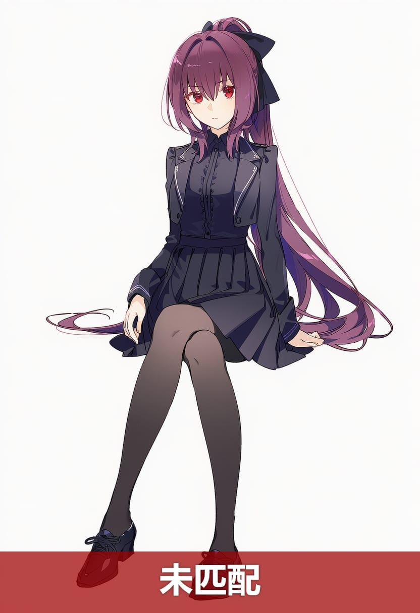

| 字段 | 内容 |
| --- | --- |
| Danbooru Tag | long_hair_between_eyes |
| 中文名 | 长眼间发束 |
| 中文含义 | 两眼之间垂着很长的发束。 |
| 子类 | 刘海/侧发 |

## 58. parted_bangs — 刘海从中间或侧边分开。

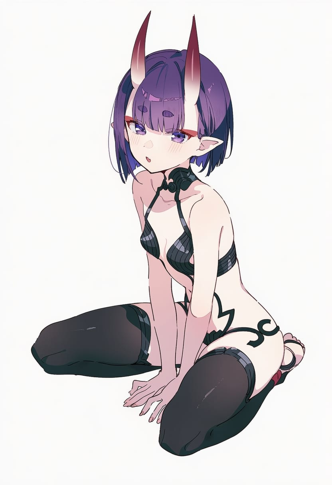

| 字段 | 内容 |
| --- | --- |
| Danbooru Tag | parted_bangs |
| 中文名 | 分缝刘海 |
| 中文含义 | 刘海从中间或侧边分开。 |
| 子类 | 刘海/侧发 |

## 59. single_hair_intake — 只有一侧有“进气口”形刘海。

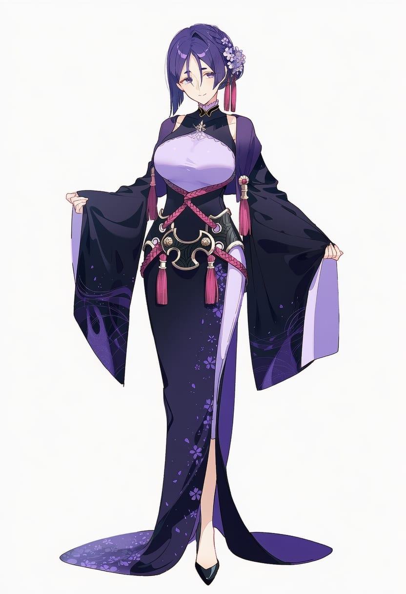

| 字段 | 内容 |
| --- | --- |
| Danbooru Tag | single_hair_intake |
| 中文名 | 单侧进气口刘海 |
| 中文含义 | 只有一侧有“进气口”形刘海。 |
| 子类 | 刘海/侧发 |

## 60. swept_bangs — 刘海整体梳向一侧。

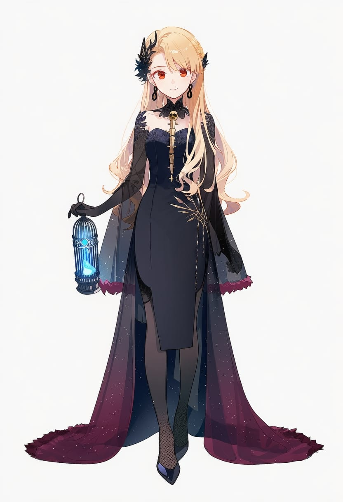

| 字段 | 内容 |
| --- | --- |
| Danbooru Tag | swept_bangs |
| 中文名 | 侧扫刘海 |
| 中文含义 | 刘海整体梳向一侧。 |
| 子类 | 刘海/侧发 |

## 61. drill_sidelocks — 脸侧发束卷成螺旋钻状。

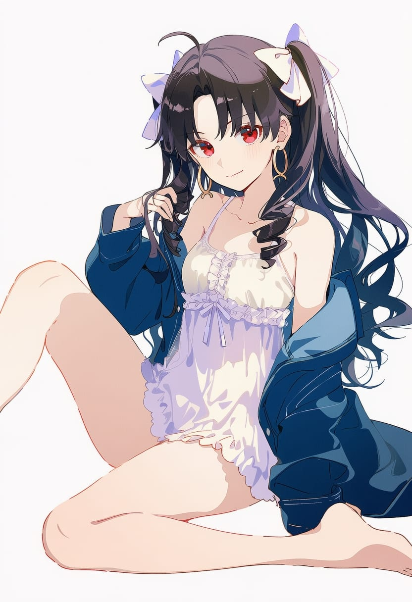

| 字段 | 内容 |
| --- | --- |
| Danbooru Tag | drill_sidelocks |
| 中文名 | 螺旋鬓发 |
| 中文含义 | 脸侧发束卷成螺旋钻状。 |
| 子类 | 刘海/侧发 |

## 62. hair_behind_ear — 一部分头发别到耳朵后面。

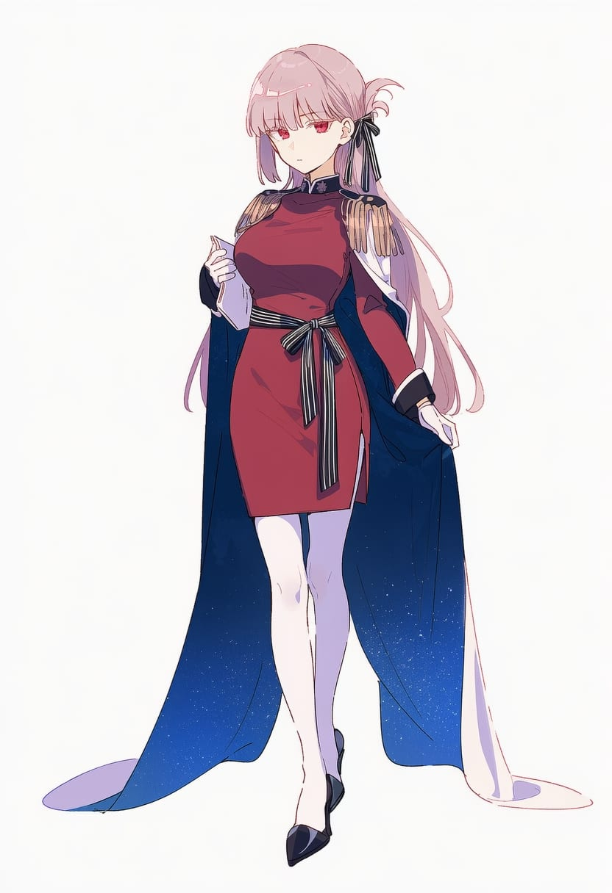

| 字段 | 内容 |
| --- | --- |
| Danbooru Tag | hair_behind_ear |
| 中文名 | 头发别到耳后 |
| 中文含义 | 一部分头发别到耳朵后面。 |
| 子类 | 刘海/侧发 |

## 63. hair_flaps — 耳边有像小片状垂下的发束。

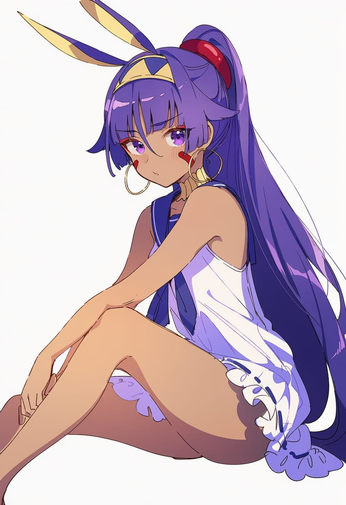

| 字段 | 内容 |
| --- | --- |
| Danbooru Tag | hair_flaps |
| 中文名 | 耳侧发瓣 |
| 中文含义 | 耳边有像小片状垂下的发束。 |
| 子类 | 刘海/侧发 |

## 64. long_sidelocks — 脸侧鬓发很长。

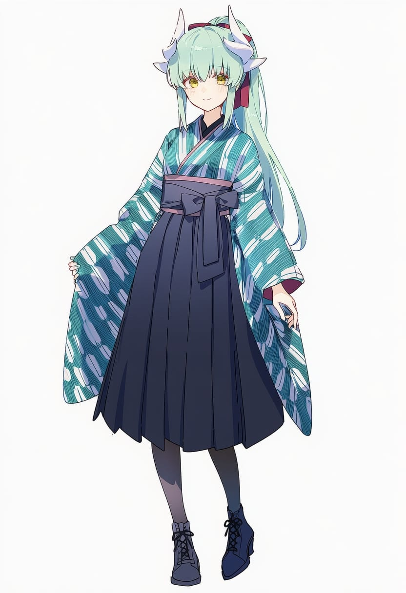

| 字段 | 内容 |
| --- | --- |
| Danbooru Tag | long_sidelocks |
| 中文名 | 长鬓发 |
| 中文含义 | 脸侧鬓发很长。 |
| 子类 | 刘海/侧发 |

## 65. low-tied_sidelocks — 脸侧发束在较低位置扎起。

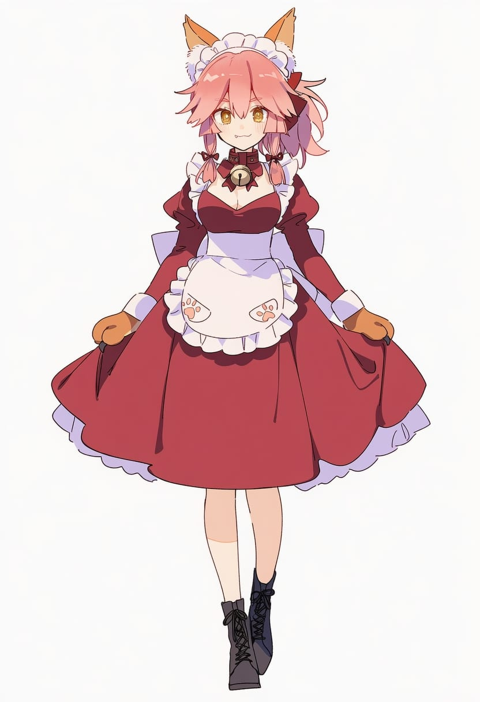

| 字段 | 内容 |
| --- | --- |
| Danbooru Tag | low-tied_sidelocks |
| 中文名 | 低扎鬓发 |
| 中文含义 | 脸侧发束在较低位置扎起。 |
| 子类 | 刘海/侧发 |

## 66. sidelocks — 脸两侧垂着明显发束。

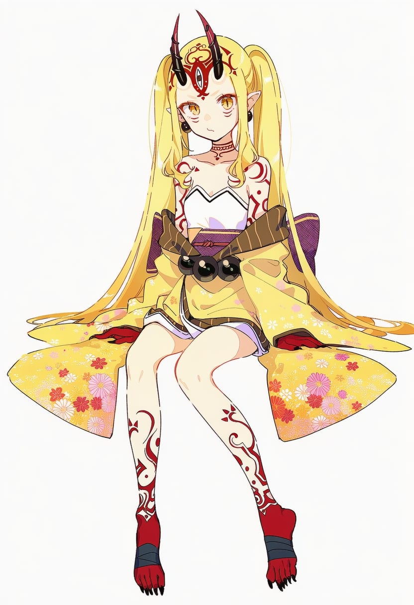

| 字段 | 内容 |
| --- | --- |
| Danbooru Tag | sidelocks |
| 中文名 | 鬓发 / 侧发束 |
| 中文含义 | 脸两侧垂着明显发束。 |
| 子类 | 刘海/侧发 |

## 67. single_sidelock — 只有一侧有明显鬓发。

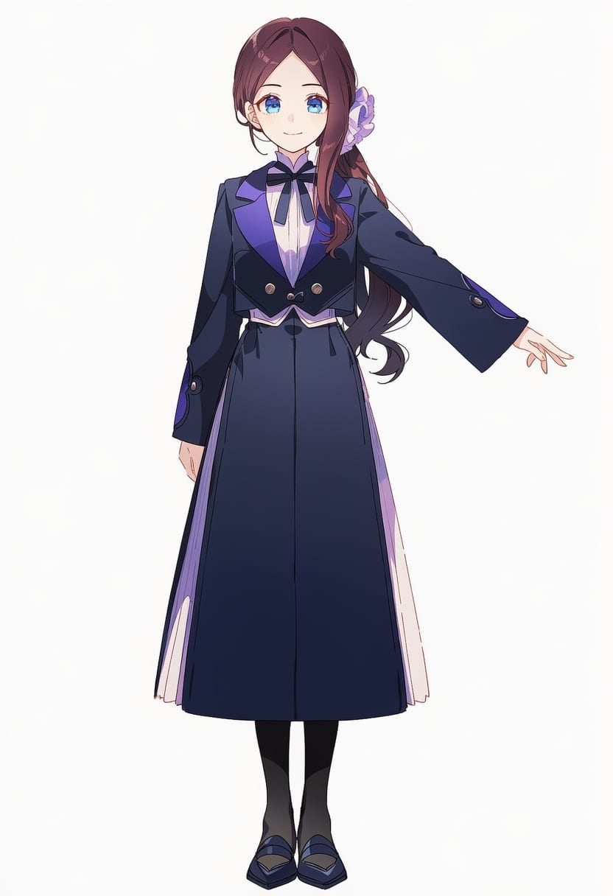

| 字段 | 内容 |
| --- | --- |
| Danbooru Tag | single_sidelock |
| 中文名 | 单侧鬓发 |
| 中文含义 | 只有一侧有明显鬓发。 |
| 子类 | 刘海/侧发 |

## 68. curly_hair — 头发整体呈明显卷曲。

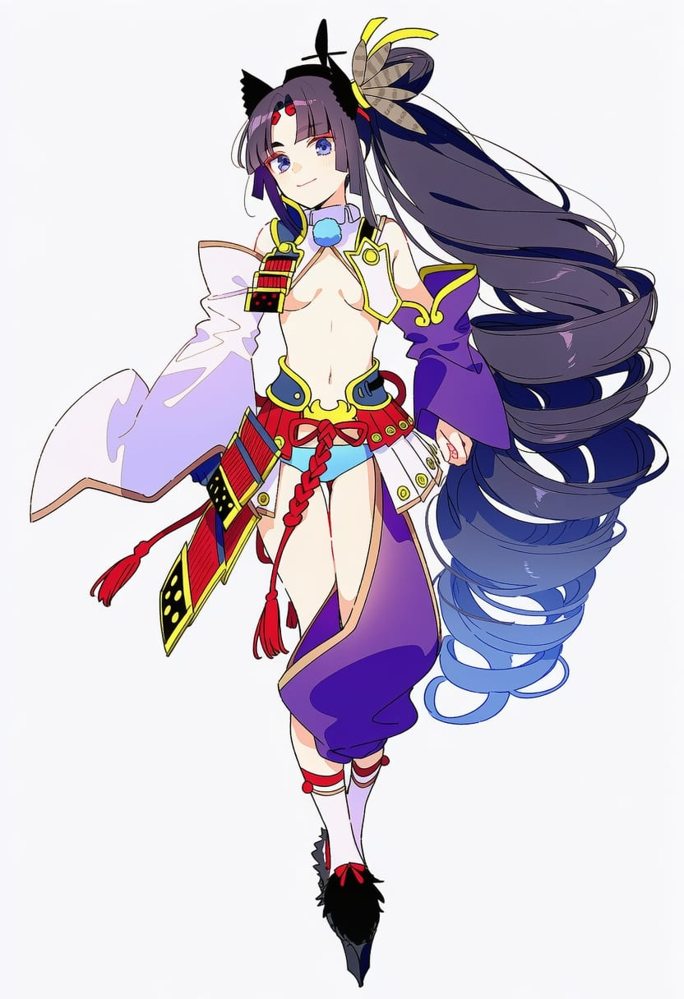

| 字段 | 内容 |
| --- | --- |
| Danbooru Tag | curly_hair |
| 中文名 | 卷发 |
| 中文含义 | 头发整体呈明显卷曲。 |
| 子类 | 发质/状态 |

## 69. drill_hair — 头发卷成粗大的螺旋钻形。

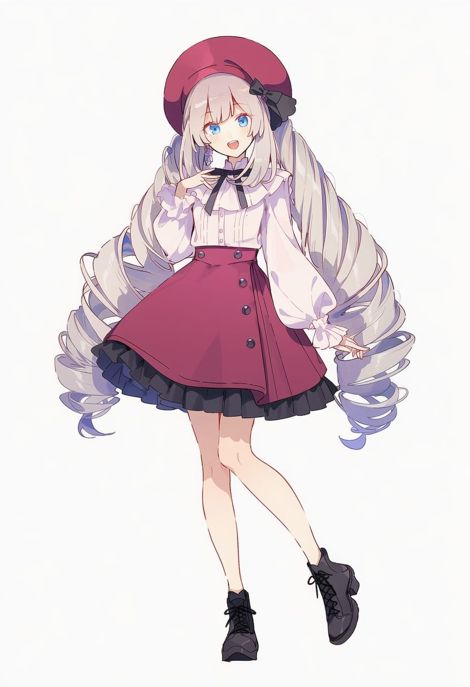

| 字段 | 内容 |
| --- | --- |
| Danbooru Tag | drill_hair |
| 中文名 | 螺旋钻发 |
| 中文含义 | 头发卷成粗大的螺旋钻形。 |
| 子类 | 发质/状态 |

## 70. flipped_hair — 发尾明显向外翘。

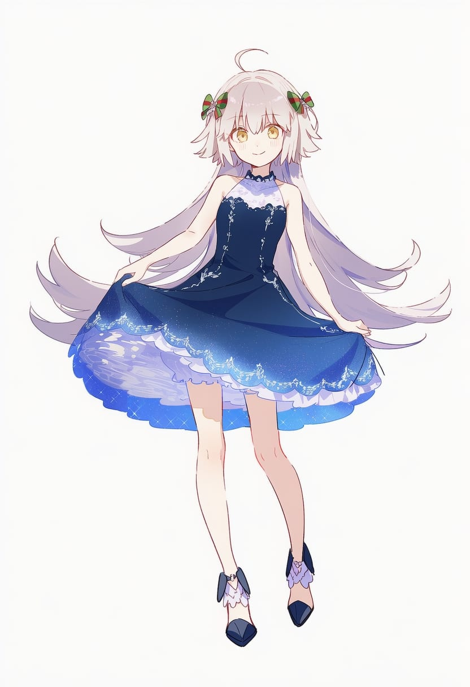

| 字段 | 内容 |
| --- | --- |
| Danbooru Tag | flipped_hair |
| 中文名 | 外翘发 |
| 中文含义 | 发尾明显向外翘。 |
| 子类 | 发质/状态 |

## 71. fluffy_hair — 头发看起来柔软蓬松。

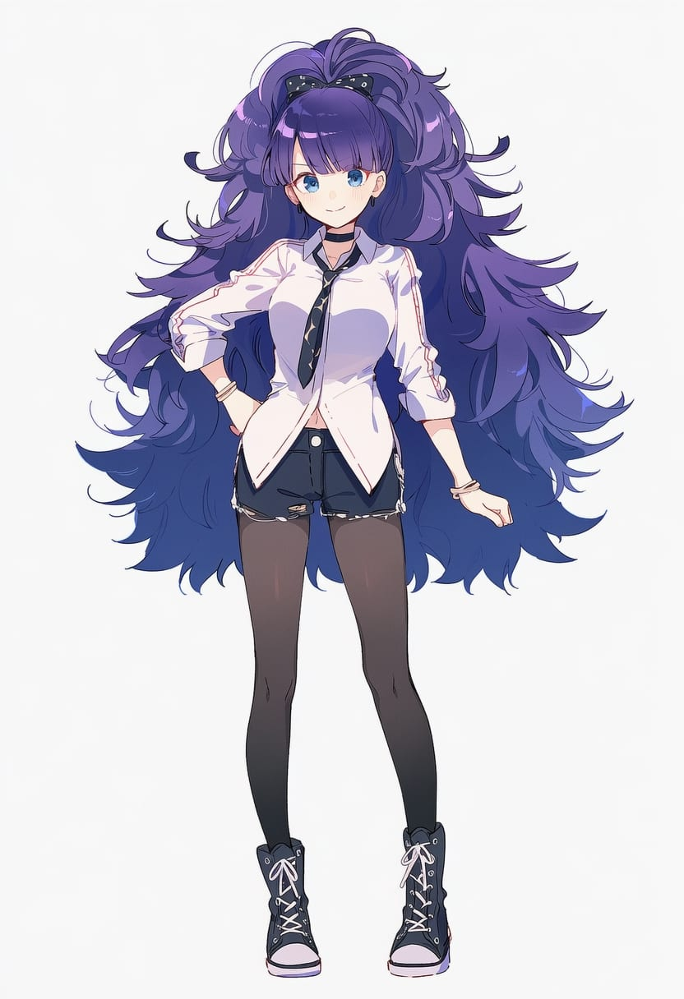

| 字段 | 内容 |
| --- | --- |
| Danbooru Tag | fluffy_hair |
| 中文名 | 蓬松发 |
| 中文含义 | 头发看起来柔软蓬松。 |
| 子类 | 发质/状态 |

## 72. kishimen_hair — 发束宽而扁，像带子一样。

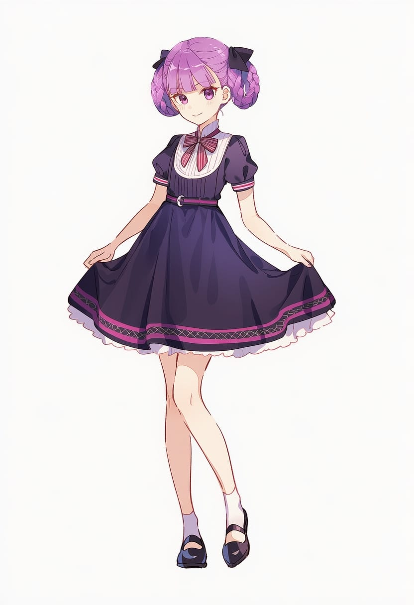

| 字段 | 内容 |
| --- | --- |
| Danbooru Tag | kishimen_hair |
| 中文名 | 宽扁带状发 |
| 中文含义 | 发束宽而扁，像带子一样。 |
| 子类 | 发质/状态 |

## 73. messy_hair — 头发凌乱、不整齐。

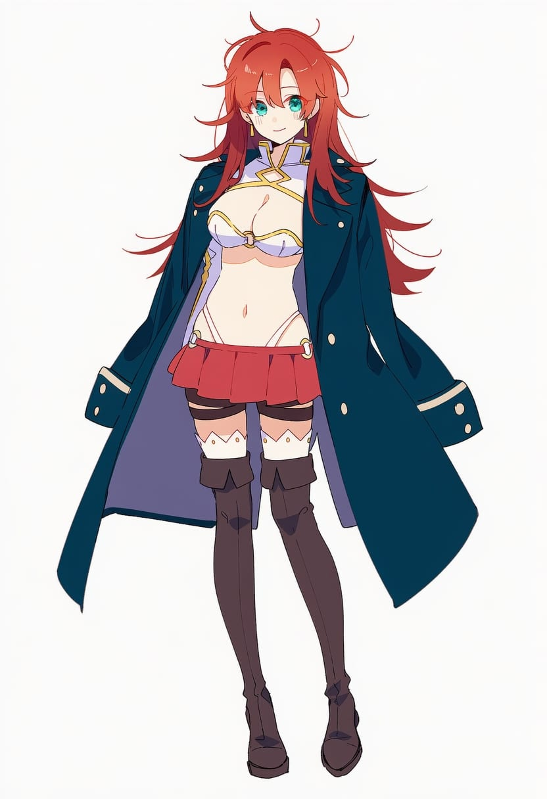

| 字段 | 内容 |
| --- | --- |
| Danbooru Tag | messy_hair |
| 中文名 | 凌乱发 |
| 中文含义 | 头发凌乱、不整齐。 |
| 子类 | 发质/状态 |

## 74. pointy_hair — 头发轮廓有明显尖角。

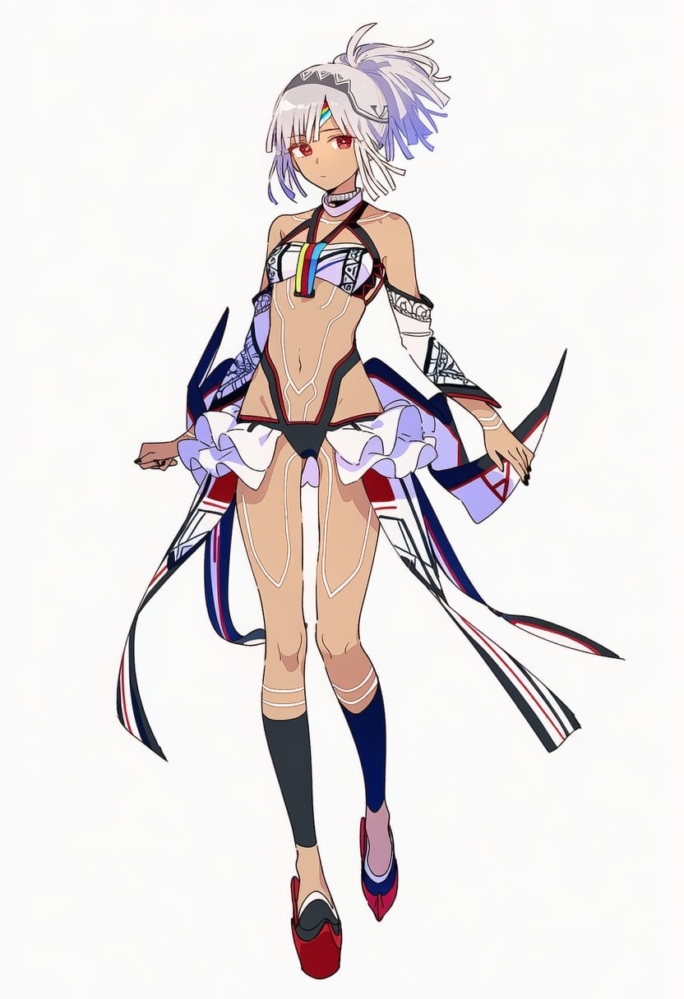

| 字段 | 内容 |
| --- | --- |
| Danbooru Tag | pointy_hair |
| 中文名 | 尖角感头发 |
| 中文含义 | 头发轮廓有明显尖角。 |
| 子类 | 发质/状态 |

## 75. ringlets — 头发卷成一个个圆环卷。

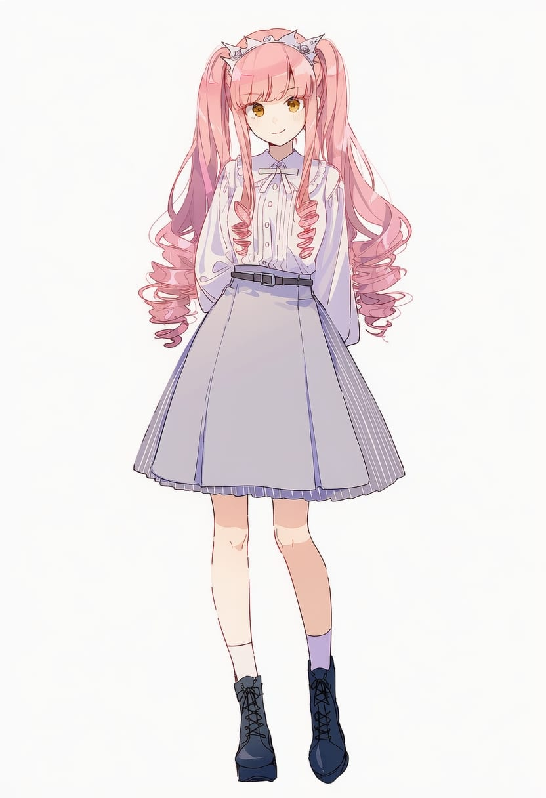

| 字段 | 内容 |
| --- | --- |
| Danbooru Tag | ringlets |
| 中文名 | 卷环发 |
| 中文含义 | 头发卷成一个个圆环卷。 |
| 子类 | 发质/状态 |

## 76. spiked_hair — 头发像刺一样向外竖起。

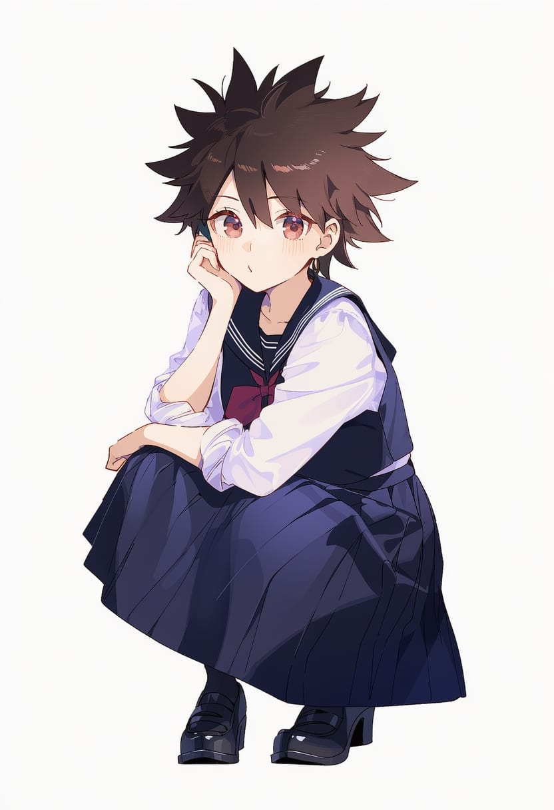

| 字段 | 内容 |
| --- | --- |
| Danbooru Tag | spiked_hair |
| 中文名 | 刺猬尖发 |
| 中文含义 | 头发像刺一样向外竖起。 |
| 子类 | 发质/状态 |

## 77. straight_hair — 头发整体笔直。

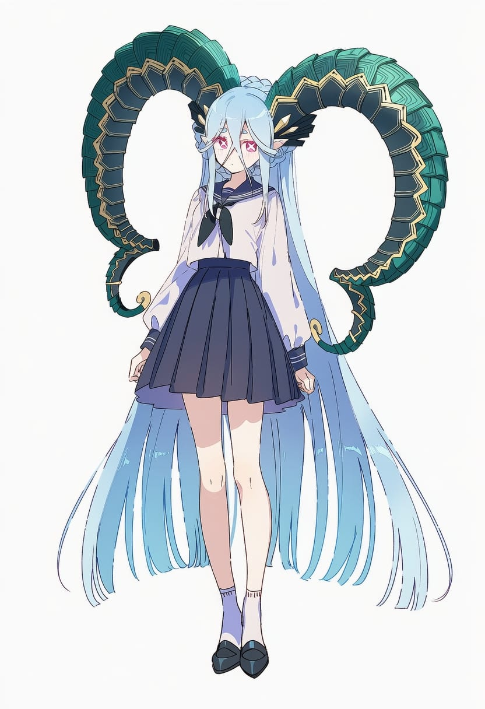

| 字段 | 内容 |
| --- | --- |
| Danbooru Tag | straight_hair |
| 中文名 | 直发 |
| 中文含义 | 头发整体笔直。 |
| 子类 | 发质/状态 |

## 78. wavy_hair — 头发自然呈波浪状。

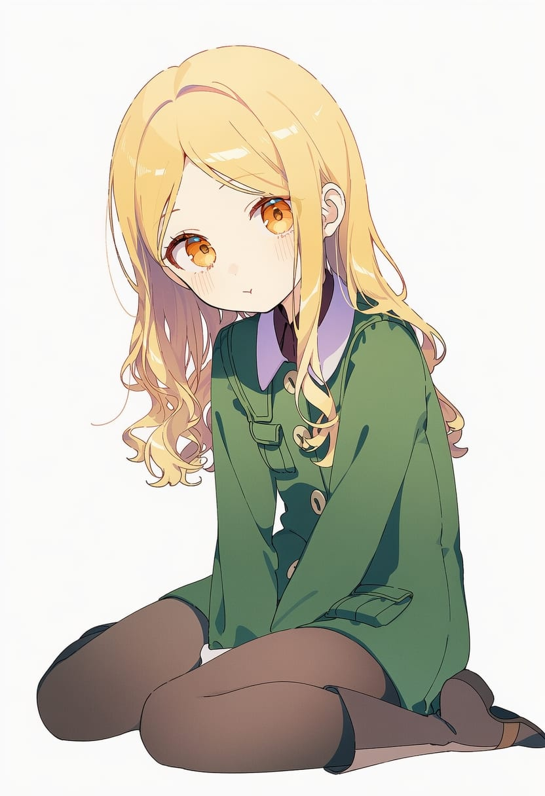

| 字段 | 内容 |
| --- | --- |
| Danbooru Tag | wavy_hair |
| 中文名 | 波浪发 |
| 中文含义 | 头发自然呈波浪状。 |
| 子类 | 发质/状态 |

## 79. floating_hair — 头发像失重一样漂浮。

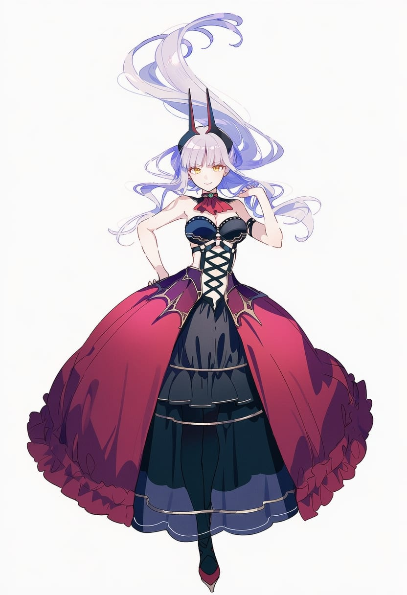

| 字段 | 内容 |
| --- | --- |
| Danbooru Tag | floating_hair |
| 中文名 | 漂浮头发 |
| 中文含义 | 头发像失重一样漂浮。 |
| 子类 | 发质/状态 |

## 80. folded_hair — 发束出现明显折叠或弯折。

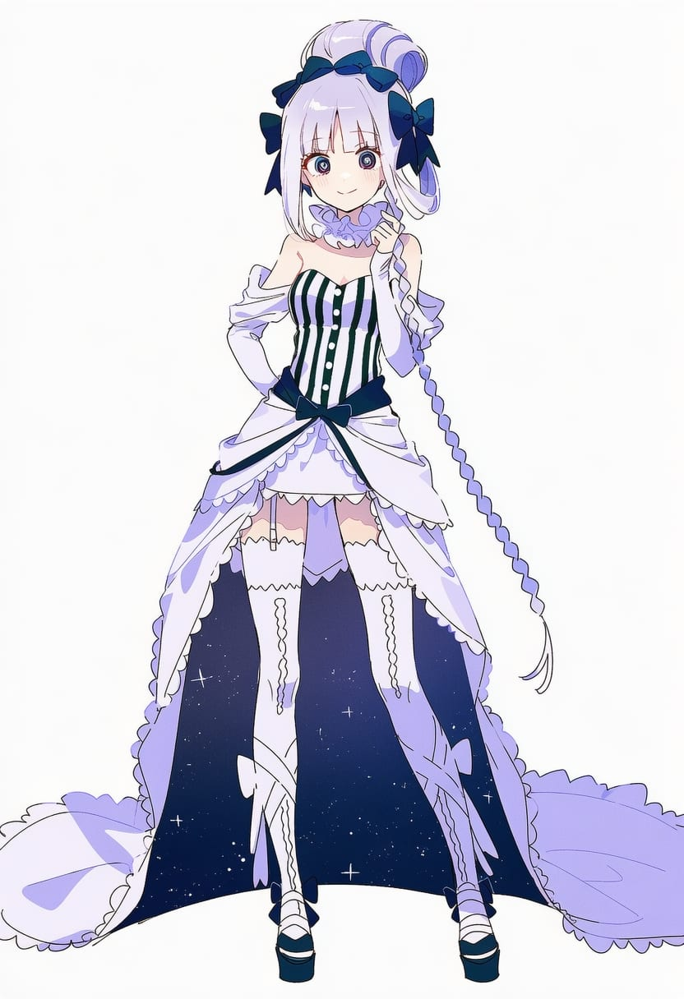

| 字段 | 内容 |
| --- | --- |
| Danbooru Tag | folded_hair |
| 中文名 | 折叠发束 |
| 中文含义 | 发束出现明显折叠或弯折。 |
| 子类 | 发质/状态 |

## 81. hair_down — 头发自然披散下来。

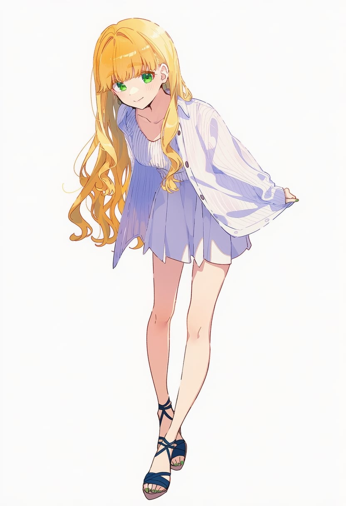

| 字段 | 内容 |
| --- | --- |
| Danbooru Tag | hair_down |
| 中文名 | 披发 |
| 中文含义 | 头发自然披散下来。 |
| 子类 | 发质/状态 |

## 82. hair_floating_upwards — 头发整体向上漂浮。

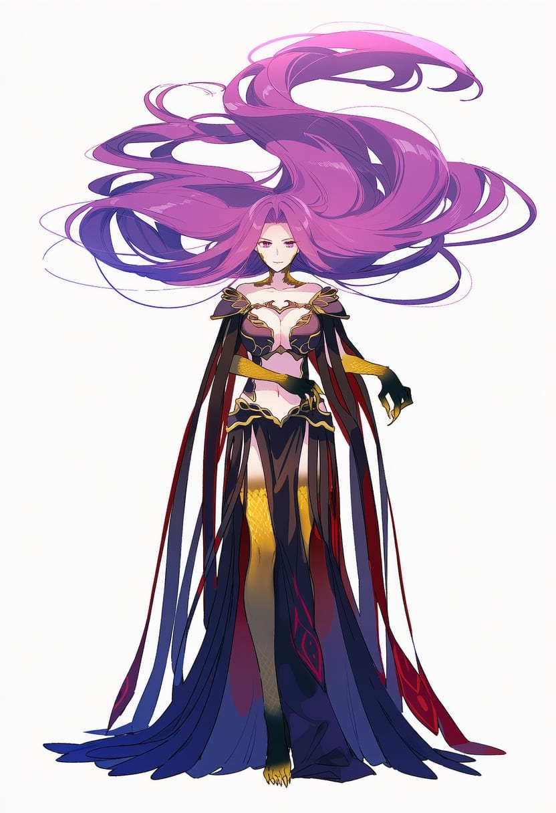

| 字段 | 内容 |
| --- | --- |
| Danbooru Tag | hair_floating_upwards |
| 中文名 | 向上漂浮的头发 |
| 中文含义 | 头发整体向上漂浮。 |
| 子类 | 发质/状态 |

## 83. hair_half_undone — 原本扎好的头发有一部分散开。

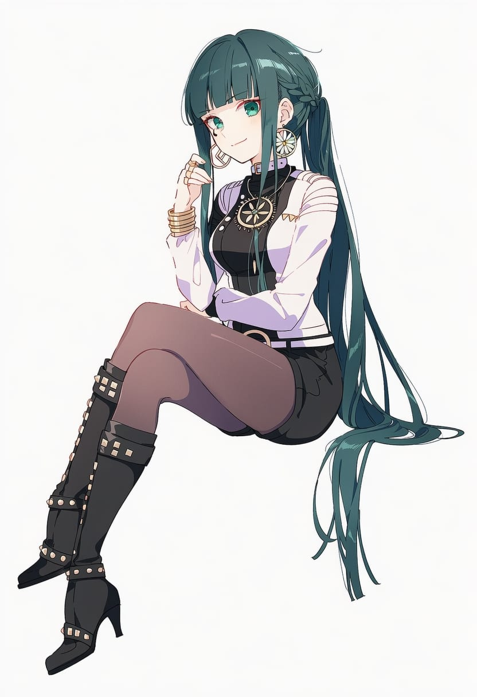

| 字段 | 内容 |
| --- | --- |
| Danbooru Tag | hair_half_undone |
| 中文名 | 半散开发型 |
| 中文含义 | 原本扎好的头发有一部分散开。 |
| 子类 | 发质/状态 |

## 84. hair_lift — 一束或几束头发明显翘起。

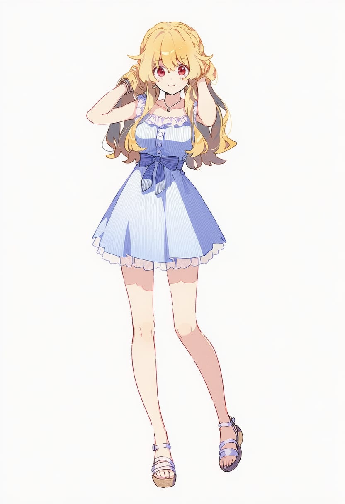

| 字段 | 内容 |
| --- | --- |
| Danbooru Tag | hair_lift |
| 中文名 | 发束翘起 |
| 中文含义 | 一束或几束头发明显翘起。 |
| 子类 | 发质/状态 |

## 85. hair_pulled_back — 头发整体向后收拢。

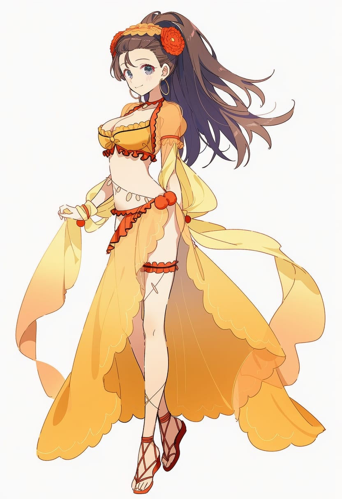

| 字段 | 内容 |
| --- | --- |
| Danbooru Tag | hair_pulled_back |
| 中文名 | 头发向后束起 |
| 中文含义 | 头发整体向后收拢。 |
| 子类 | 发质/状态 |

## 86. hair_slicked_back — 头发贴着头皮向后梳。

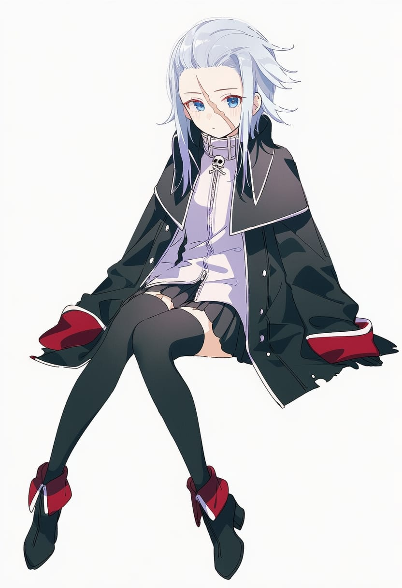

| 字段 | 内容 |
| --- | --- |
| Danbooru Tag | hair_slicked_back |
| 中文名 | 后梳油头 |
| 中文含义 | 头发贴着头皮向后梳。 |
| 子类 | 发质/状态 |

## 87. hair_spread_out — 头发大面积散开铺开。

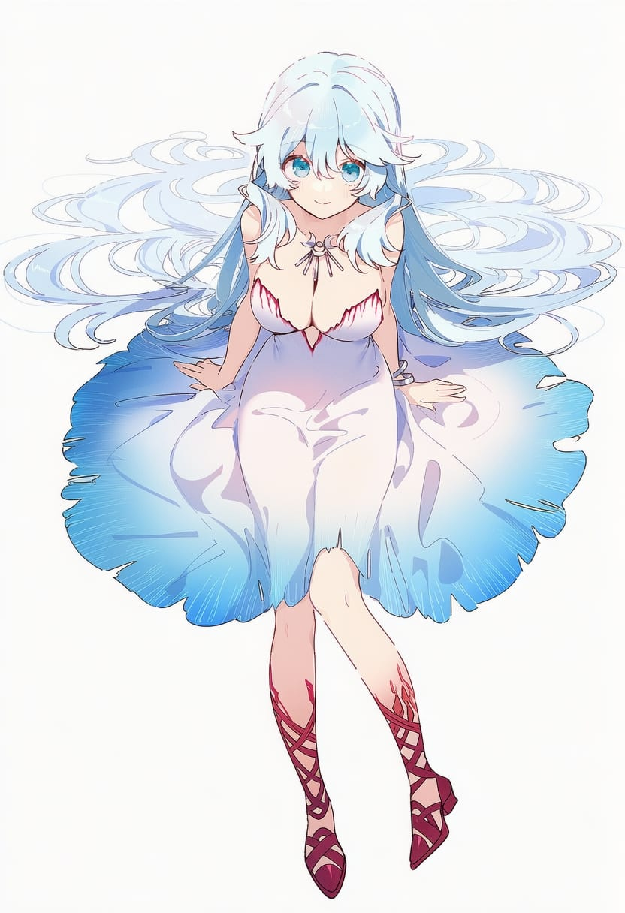

| 字段 | 内容 |
| --- | --- |
| Danbooru Tag | hair_spread_out |
| 中文名 | 头发散开 |
| 中文含义 | 头发大面积散开铺开。 |
| 子类 | 发质/状态 |

## 88. hair_undone — 原本扎起的头发已经散开。

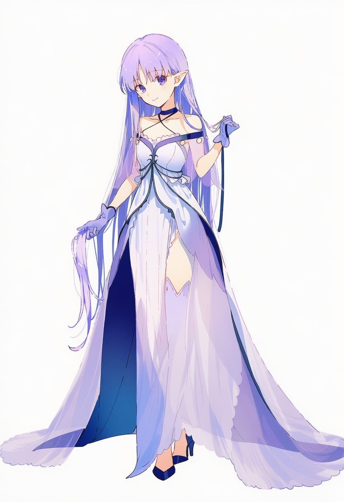

| 字段 | 内容 |
| --- | --- |
| Danbooru Tag | hair_undone |
| 中文名 | 散开发型 |
| 中文含义 | 原本扎起的头发已经散开。 |
| 子类 | 发质/状态 |

## 89. hair_up — 大部分头发被盘起或扎起。

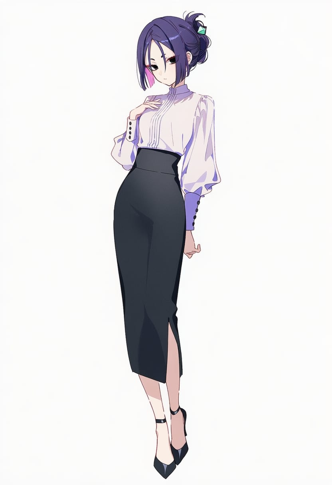

| 字段 | 内容 |
| --- | --- |
| Danbooru Tag | hair_up |
| 中文名 | 盘起头发 |
| 中文含义 | 大部分头发被盘起或扎起。 |
| 子类 | 发质/状态 |

## 90. parted_hair — 头发有明显分缝。

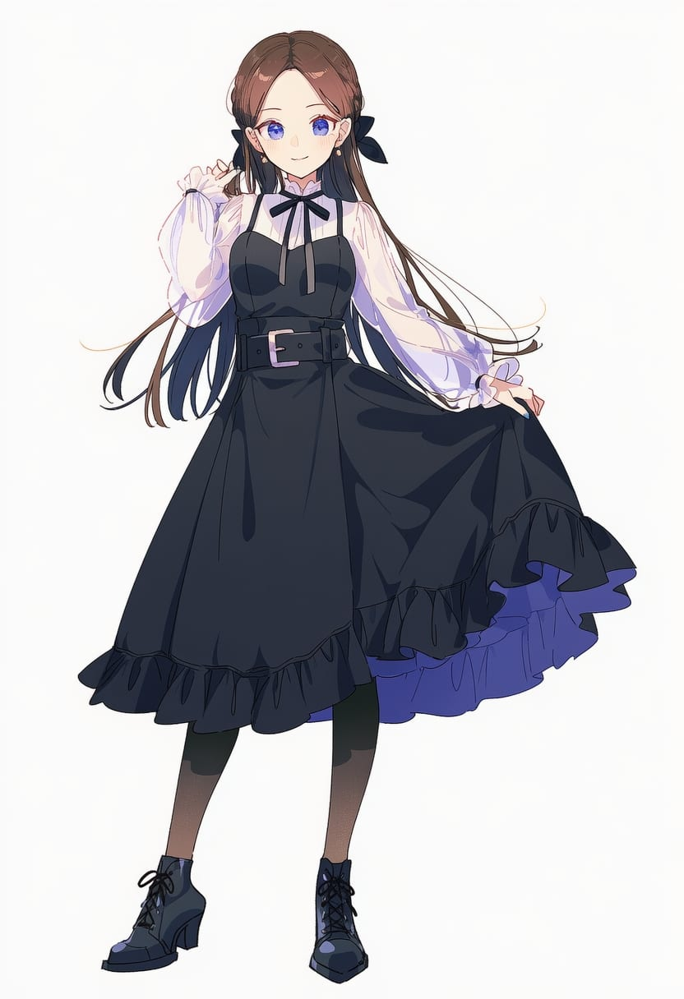

| 字段 | 内容 |
| --- | --- |
| Danbooru Tag | parted_hair |
| 中文名 | 分缝发型 |
| 中文含义 | 头发有明显分缝。 |
| 子类 | 发质/状态 |

## 91. see-through_hair — 头发呈半透明或透视效果。

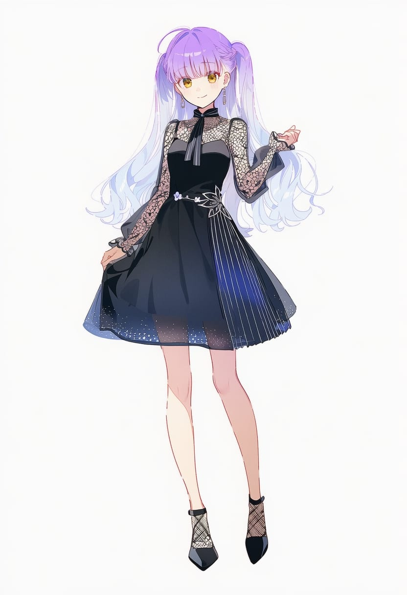

| 字段 | 内容 |
| --- | --- |
| Danbooru Tag | see-through_hair |
| 中文名 | 透视头发 |
| 中文含义 | 头发呈半透明或透视效果。 |
| 子类 | 发质/状态 |

## 92. wet_hair — 头发处于明显湿润状态。

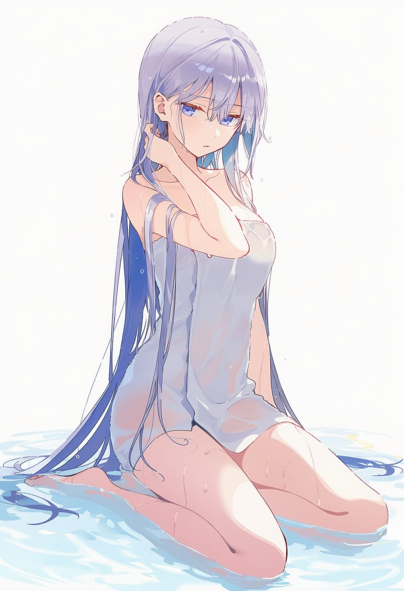

| 字段 | 内容 |
| --- | --- |
| Danbooru Tag | wet_hair |
| 中文名 | 湿发 |
| 中文含义 | 头发处于明显湿润状态。 |
| 子类 | 发质/状态 |

## 93. alternate_hairstyle — 角色使用和平时不同的发型。

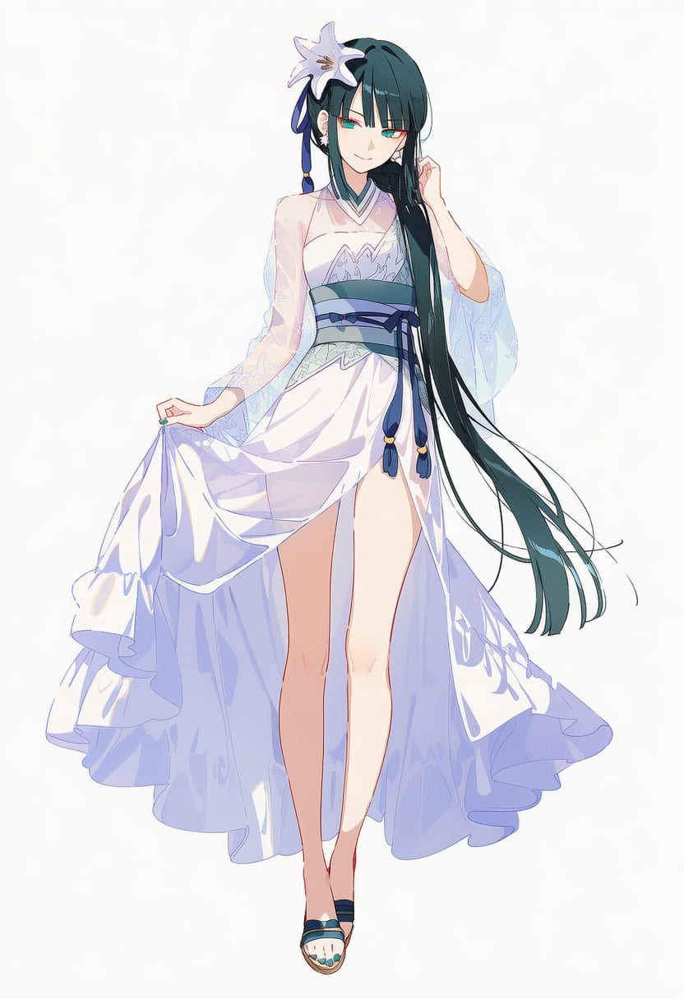

| 字段 | 内容 |
| --- | --- |
| Danbooru Tag | alternate_hairstyle |
| 中文名 | 替代发型 |
| 中文含义 | 角色使用和平时不同的发型。 |
| 子类 | 特殊发型 |

## 94. antenna_hair — 有一根或几根像天线一样翘起的头发。

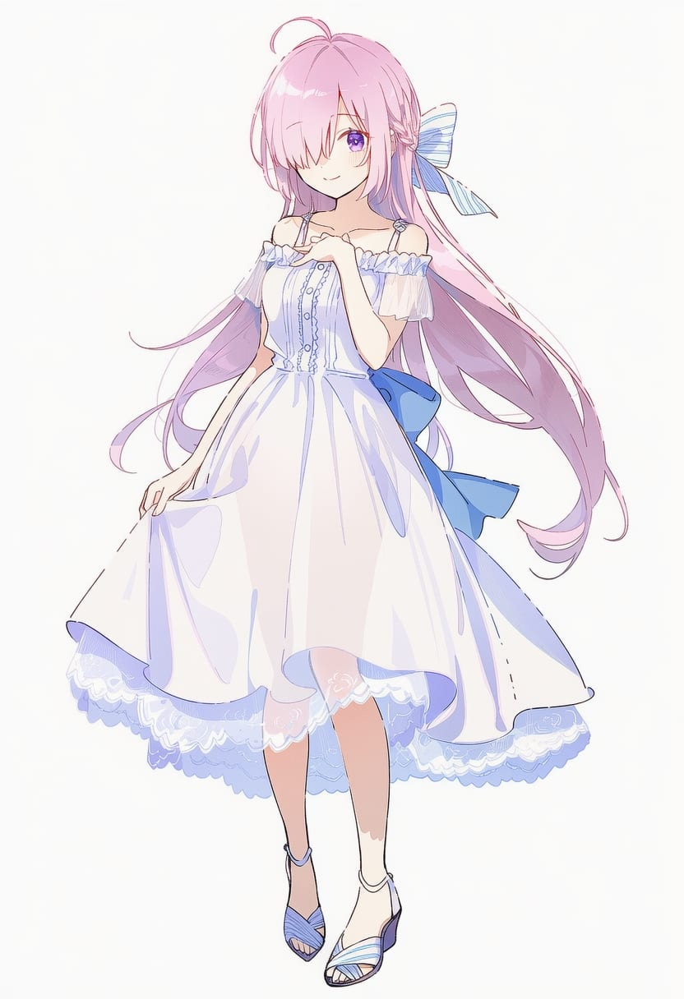

| 字段 | 内容 |
| --- | --- |
| Danbooru Tag | antenna_hair |
| 中文名 | 天线发 |
| 中文含义 | 有一根或几根像天线一样翘起的头发。 |
| 子类 | 特殊发型 |

## 95. asymmetrical_hair — 左右两边发型明显不对称。

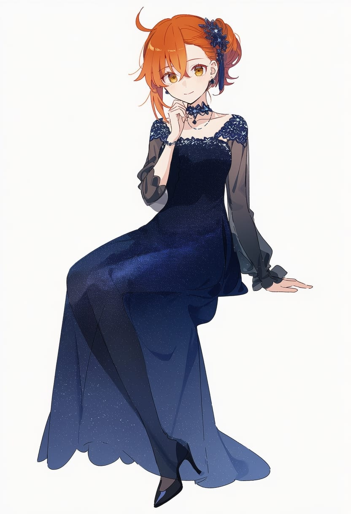

| 字段 | 内容 |
| --- | --- |
| Danbooru Tag | asymmetrical_hair |
| 中文名 | 不对称发型 |
| 中文含义 | 左右两边发型明显不对称。 |
| 子类 | 特殊发型 |

## 96. back_hair — 突出表现后脑或背后的头发。

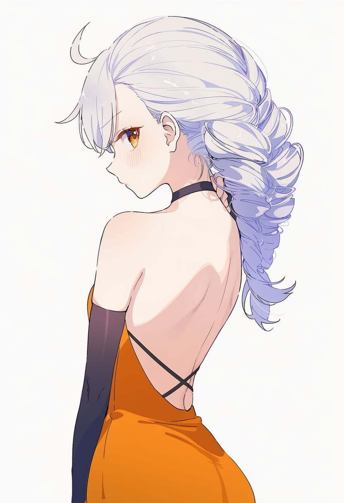

| 字段 | 内容 |
| --- | --- |
| Danbooru Tag | back_hair |
| 中文名 | 后部头发 |
| 中文含义 | 突出表现后脑或背后的头发。 |
| 子类 | 特殊发型 |

## 97. bow-shaped_hair — 头发本身做成蝴蝶结形。

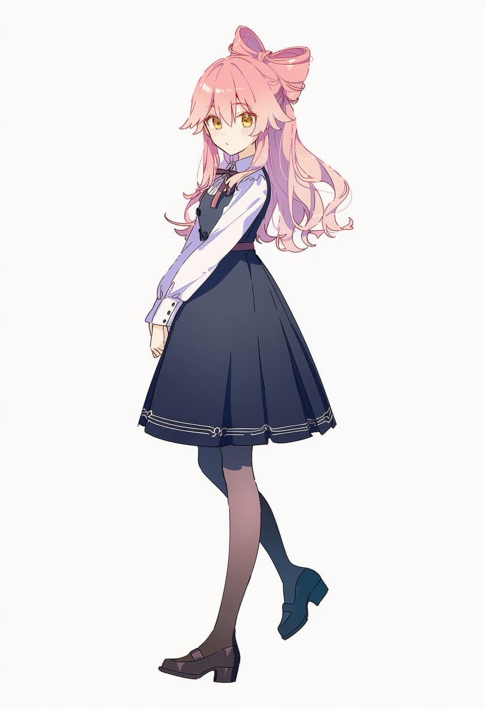

| 字段 | 内容 |
| --- | --- |
| Danbooru Tag | bow-shaped_hair |
| 中文名 | 蝴蝶结形头发 |
| 中文含义 | 头发本身做成蝴蝶结形。 |
| 子类 | 特殊发型 |

## 98. flower-shaped_hair — 头发本身做成花朵形。

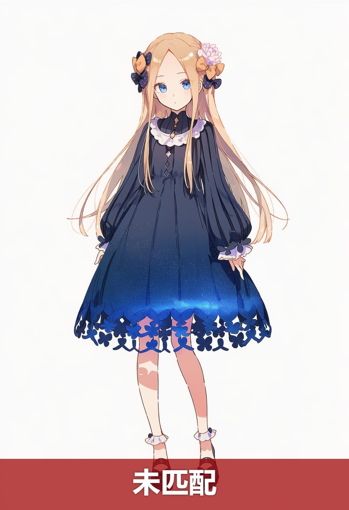

| 字段 | 内容 |
| --- | --- |
| Danbooru Tag | flower-shaped_hair |
| 中文名 | 花形头发 |
| 中文含义 | 头发本身做成花朵形。 |
| 子类 | 特殊发型 |

## 99. hair_around_ear — 发束围绕耳朵形成造型。

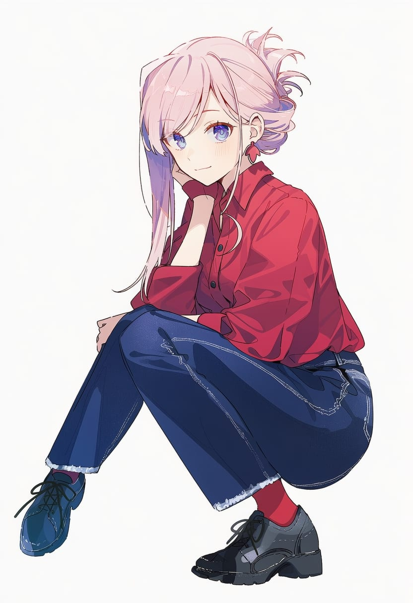

| 字段 | 内容 |
| --- | --- |
| Danbooru Tag | hair_around_ear |
| 中文名 | 绕耳头发 |
| 中文含义 | 发束围绕耳朵形成造型。 |
| 子类 | 特殊发型 |

## 100. hair_between_horns — 头发位于两只角之间。

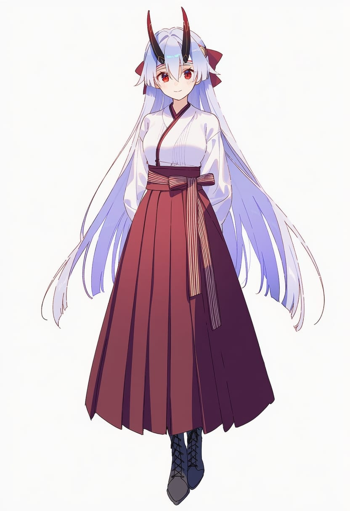

| 字段 | 内容 |
| --- | --- |
| Danbooru Tag | hair_between_horns |
| 中文名 | 双角之间的头发 |
| 中文含义 | 头发位于两只角之间。 |
| 子类 | 特殊发型 |

## 101. hair_ears — 头发本身做成耳朵形。

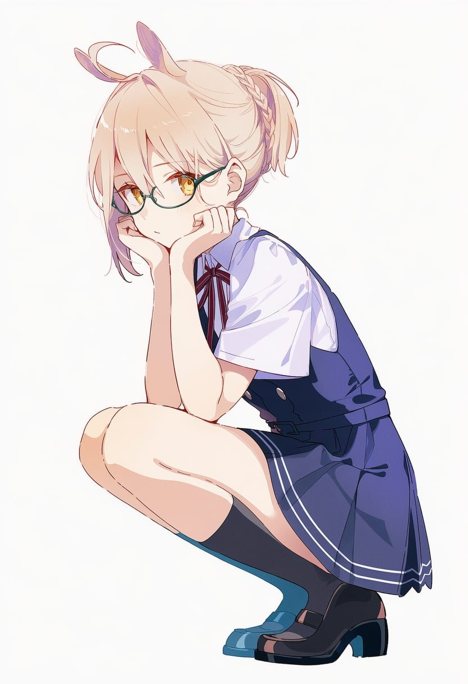

| 字段 | 内容 |
| --- | --- |
| Danbooru Tag | hair_ears |
| 中文名 | 耳朵形头发 |
| 中文含义 | 头发本身做成耳朵形。 |
| 子类 | 特殊发型 |

## 102. hair_hanging_down — 发束明显向下垂落。

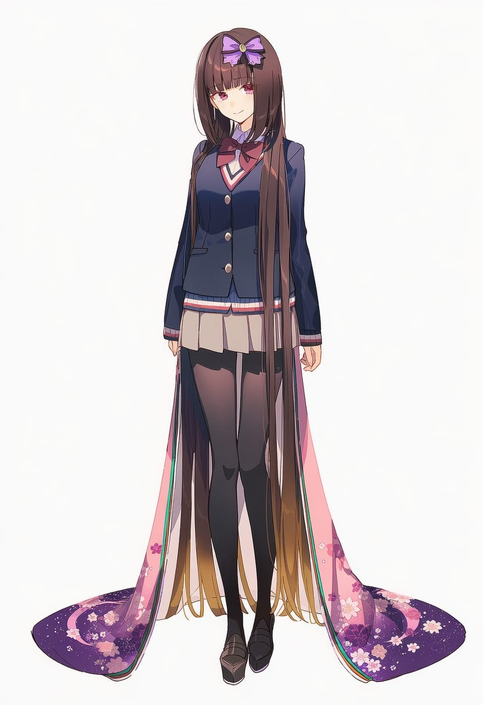

| 字段 | 内容 |
| --- | --- |
| Danbooru Tag | hair_hanging_down |
| 中文名 | 垂落头发 |
| 中文含义 | 发束明显向下垂落。 |
| 子类 | 特殊发型 |

## 103. hair_horns — 头发本身做成角的形状。

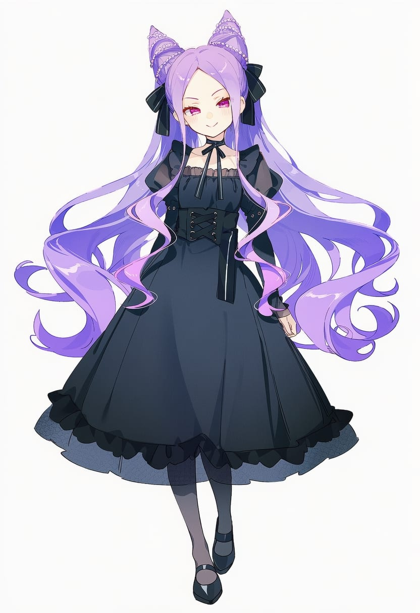

| 字段 | 内容 |
| --- | --- |
| Danbooru Tag | hair_horns |
| 中文名 | 角状头发 |
| 中文含义 | 头发本身做成角的形状。 |
| 子类 | 特殊发型 |

## 104. hair_over_shoulder — 长发搭在肩膀前后。

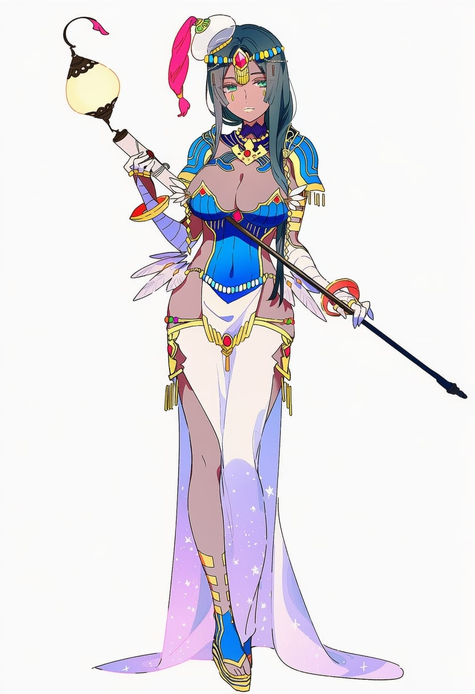

| 字段 | 内容 |
| --- | --- |
| Danbooru Tag | hair_over_shoulder |
| 中文名 | 头发搭肩 |
| 中文含义 | 长发搭在肩膀前后。 |
| 子类 | 特殊发型 |

## 105. hair_scarf — 长发像围巾一样绕在颈肩附近。

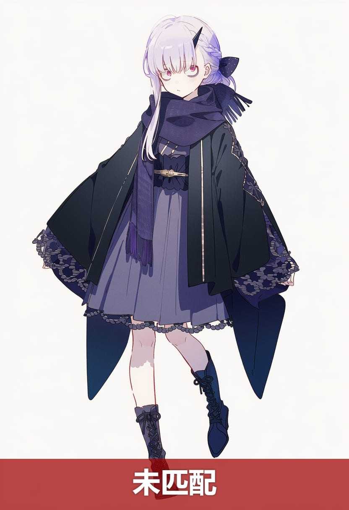

| 字段 | 内容 |
| --- | --- |
| Danbooru Tag | hair_scarf |
| 中文名 | 头发围巾式造型 |
| 中文含义 | 长发像围巾一样绕在颈肩附近。 |
| 子类 | 特殊发型 |

## 106. hair_through_headwear — 头发从帽子或头饰中穿出来。

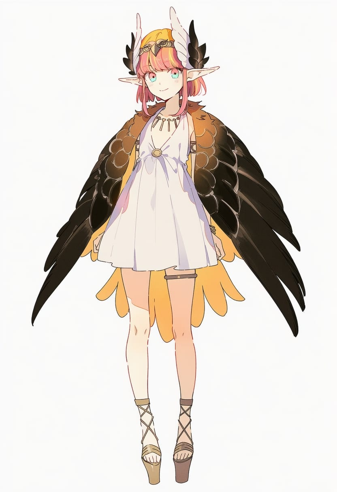

| 字段 | 内容 |
| --- | --- |
| Danbooru Tag | hair_through_headwear |
| 中文名 | 头发穿过头饰 |
| 中文含义 | 头发从帽子或头饰中穿出来。 |
| 子类 | 特殊发型 |

## 107. hair_tuft — 有一小撮明显翘起的头发。

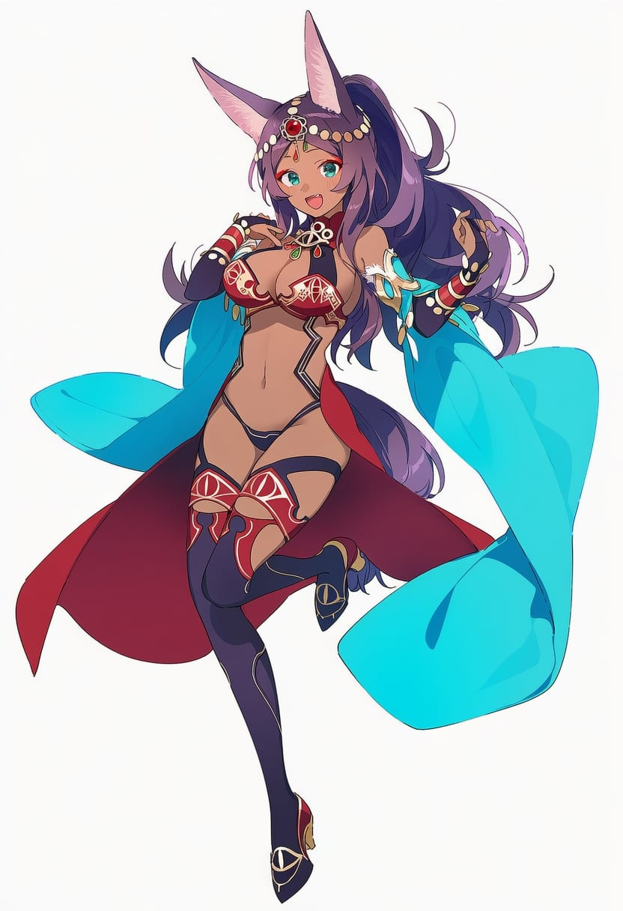

| 字段 | 内容 |
| --- | --- |
| Danbooru Tag | hair_tuft |
| 中文名 | 小撮翘发 |
| 中文含义 | 有一小撮明显翘起的头发。 |
| 子类 | 特殊发型 |

## 108. hair_wings — 头发本身形成翅膀状。

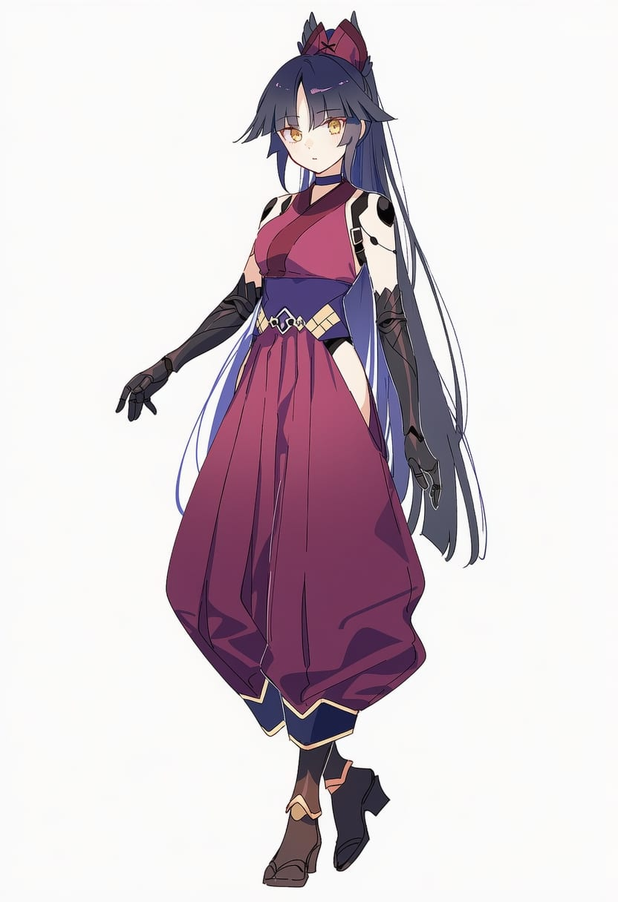

| 字段 | 内容 |
| --- | --- |
| Danbooru Tag | hair_wings |
| 中文名 | 翼状头发 |
| 中文含义 | 头发本身形成翅膀状。 |
| 子类 | 特殊发型 |

## 109. heart-shaped_hair — 头发本身形成心形。

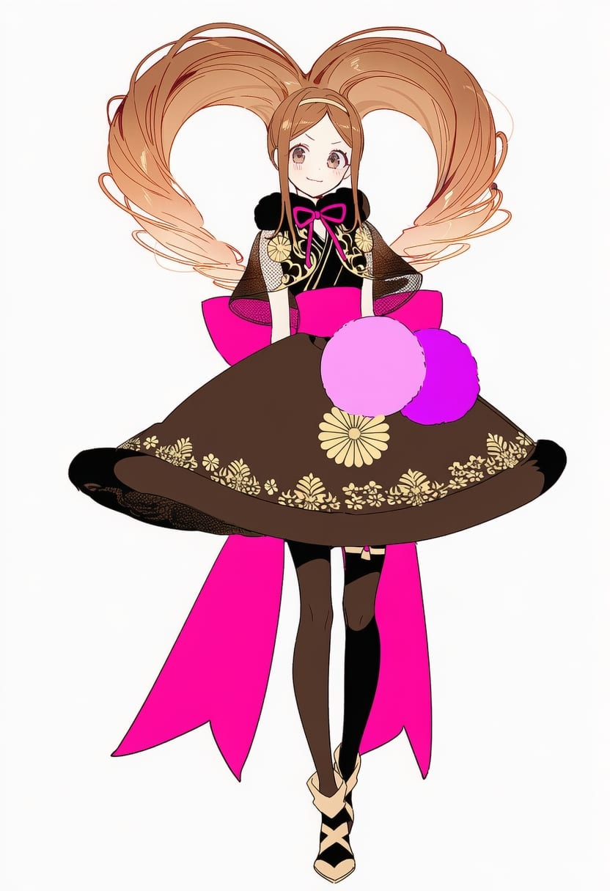

| 字段 | 内容 |
| --- | --- |
| Danbooru Tag | heart-shaped_hair |
| 中文名 | 心形头发 |
| 中文含义 | 头发本身形成心形。 |
| 子类 | 特殊发型 |

## 110. lone_nape_hair — 后颈位置单独留着一束头发。

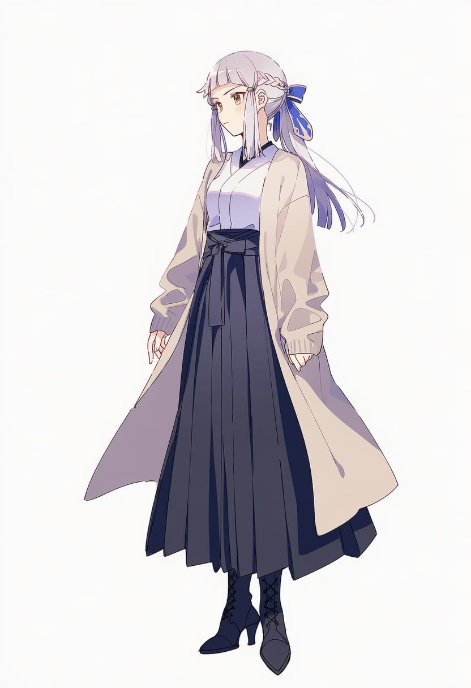

| 字段 | 内容 |
| --- | --- |
| Danbooru Tag | lone_nape_hair |
| 中文名 | 后颈单发束 |
| 中文含义 | 后颈位置单独留着一束头发。 |
| 子类 | 特殊发型 |

## 111. loose_hair_strand — 有一束头发从整体发型中散落出来。

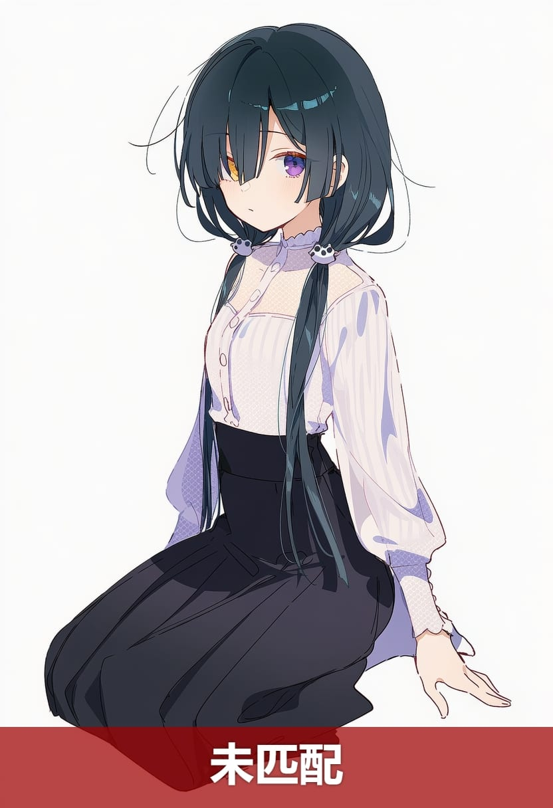

| 字段 | 内容 |
| --- | --- |
| Danbooru Tag | loose_hair_strand |
| 中文名 | 散落发丝 |
| 中文含义 | 有一束头发从整体发型中散落出来。 |
| 子类 | 特殊发型 |

## 112. low_twintails — 双马尾扎在较低位置。

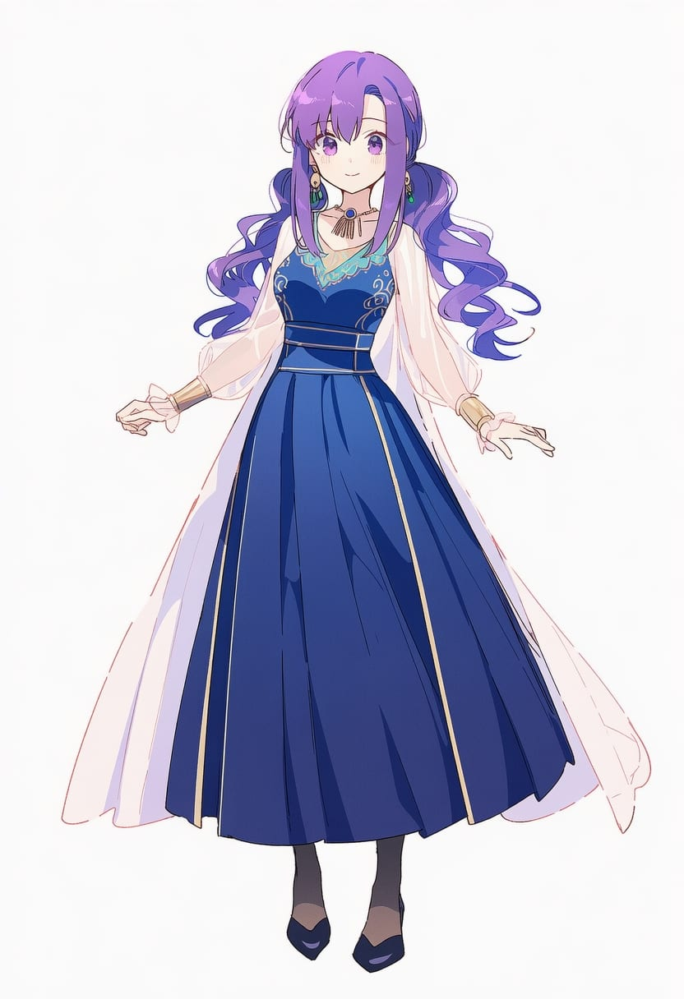

| 字段 | 内容 |
| --- | --- |
| Danbooru Tag | low_twintails |
| 中文名 | 低双马尾 |
| 中文含义 | 双马尾扎在较低位置。 |
| 子类 | 特殊发型 |

## 113. official_alternate_hairstyle — 角色官方设定中的另一种发型。

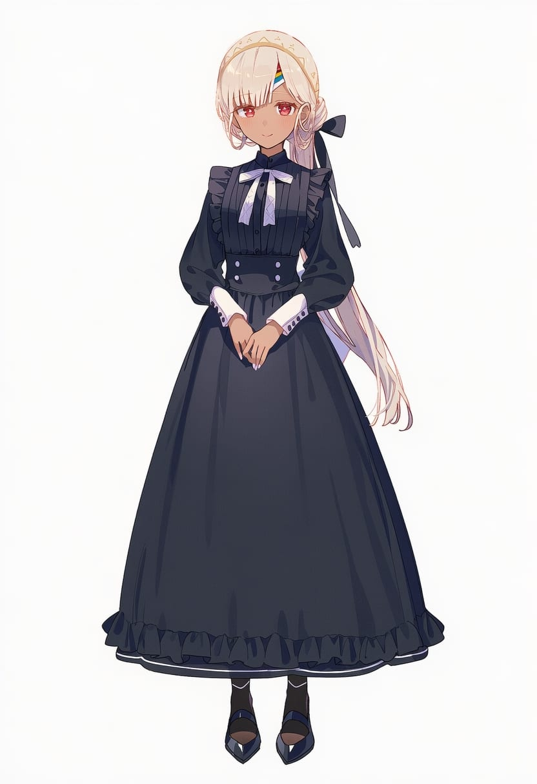

| 字段 | 内容 |
| --- | --- |
| Danbooru Tag | official_alternate_hairstyle |
| 中文名 | 官方替代发型 |
| 中文含义 | 角色官方设定中的另一种发型。 |
| 子类 | 特殊发型 |

## 114. short_hair_with_long_locks — 整体是短发，但混有明显长发束。

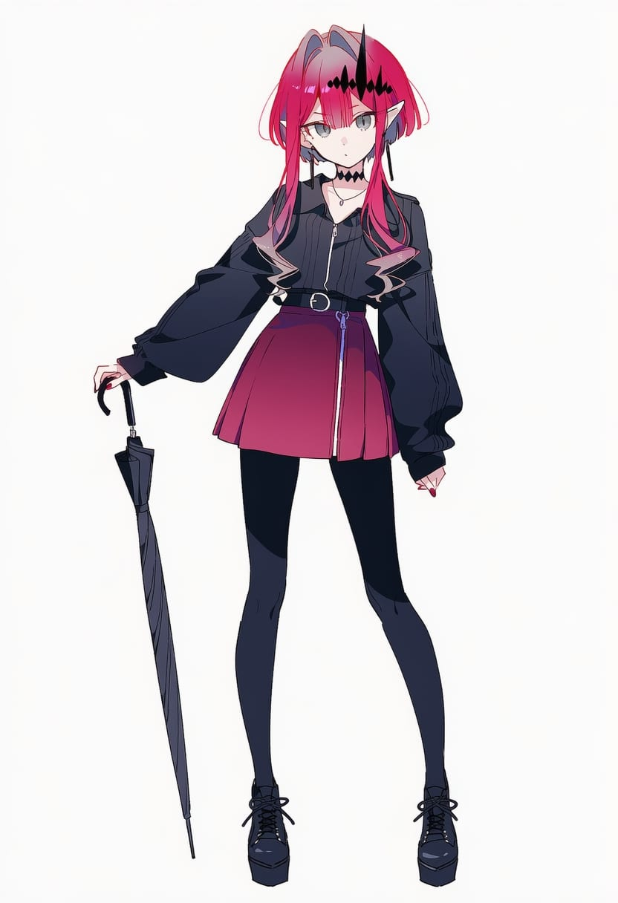

| 字段 | 内容 |
| --- | --- |
| Danbooru Tag | short_hair_with_long_locks |
| 中文名 | 短发配长发束 |
| 中文含义 | 整体是短发，但混有明显长发束。 |
| 子类 | 特殊发型 |

## 115. tall_hair — 发型整体向上堆得很高。

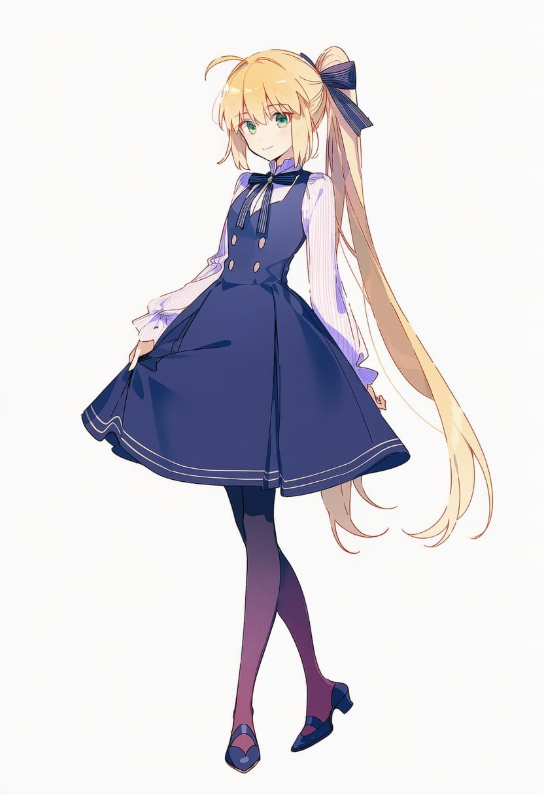

| 字段 | 内容 |
| --- | --- |
| Danbooru Tag | tall_hair |
| 中文名 | 高耸发型 |
| 中文含义 | 发型整体向上堆得很高。 |
| 子类 | 特殊发型 |

## 116. twintails — 左右两侧各扎一束马尾。

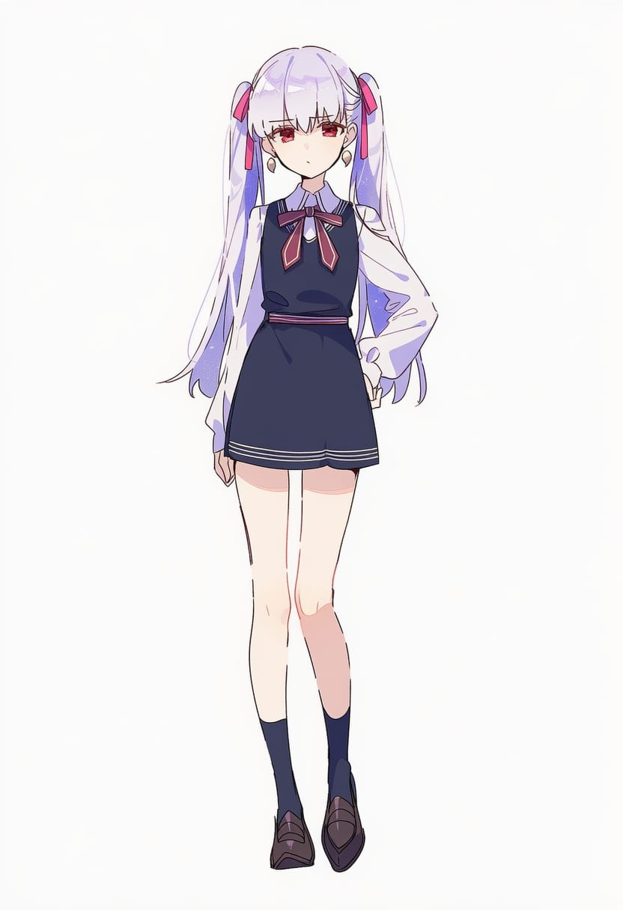

| 字段 | 内容 |
| --- | --- |
| Danbooru Tag | twintails |
| 中文名 | 双马尾 |
| 中文含义 | 左右两侧各扎一束马尾。 |
| 子类 | 特殊发型 |

## 117. uneven_twintails — 左右双马尾长度或位置不一致。

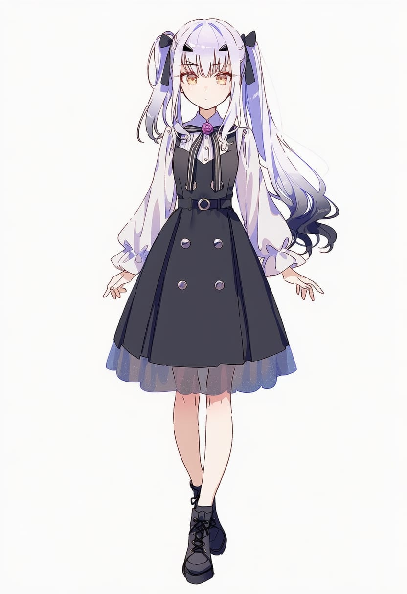

| 字段 | 内容 |
| --- | --- |
| Danbooru Tag | uneven_twintails |
| 中文名 | 不对称双马尾 |
| 中文含义 | 左右双马尾长度或位置不一致。 |
| 子类 | 特殊发型 |

## 118. cable_hair — 头发像电缆或粗线一样。

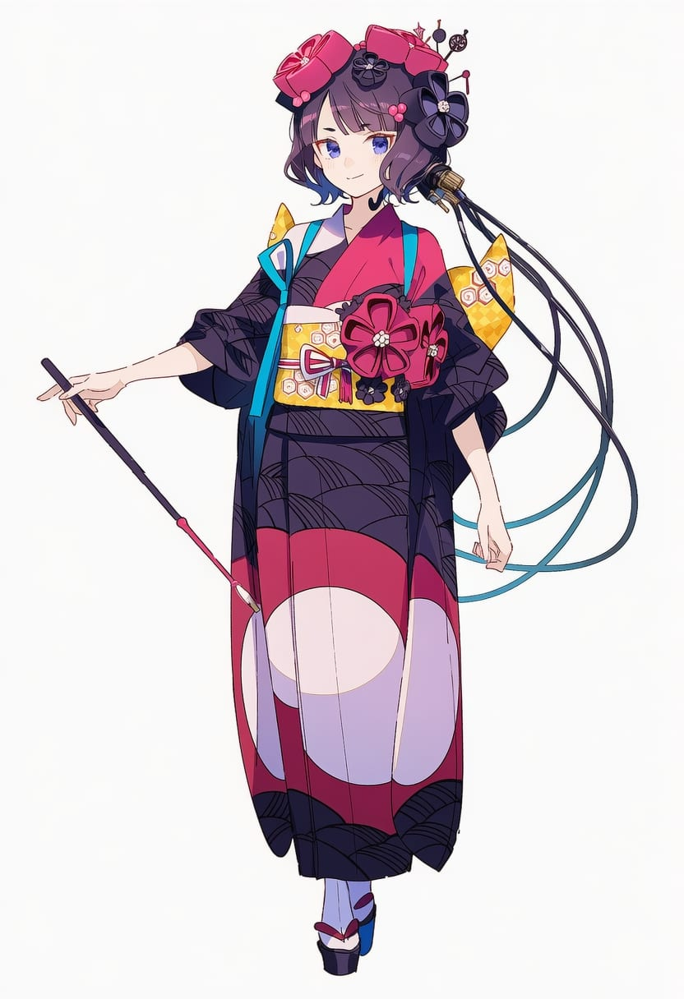

| 字段 | 内容 |
| --- | --- |
| Danbooru Tag | cable_hair |
| 中文名 | 电缆状头发 |
| 中文含义 | 头发像电缆或粗线一样。 |
| 子类 | 特殊发型 |

## 119. cloud_hair — 头发像云朵一样蓬松或云状。

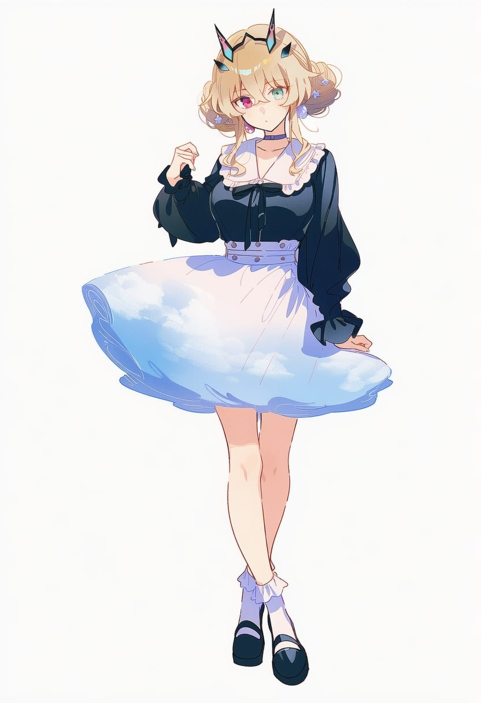

| 字段 | 内容 |
| --- | --- |
| Danbooru Tag | cloud_hair |
| 中文名 | 云朵头发 |
| 中文含义 | 头发像云朵一样蓬松或云状。 |
| 子类 | 特殊发型 |

## 120. crystal_hair — 头发呈水晶一样的质感。

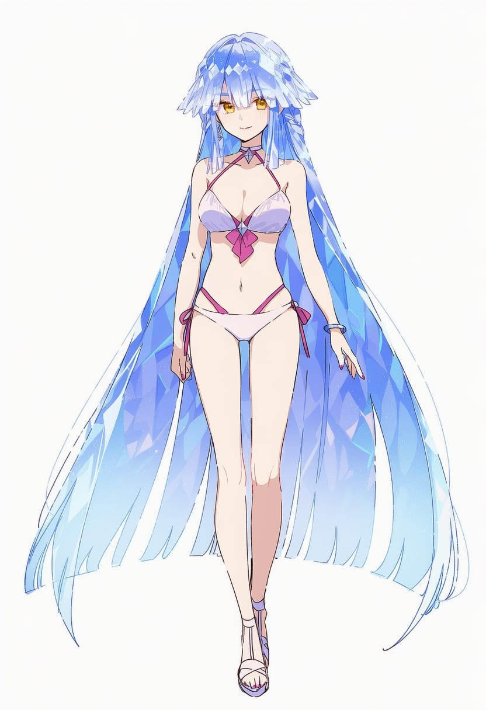

| 字段 | 内容 |
| --- | --- |
| Danbooru Tag | crystal_hair |
| 中文名 | 水晶头发 |
| 中文含义 | 头发呈水晶一样的质感。 |
| 子类 | 特殊发型 |

## 121. feather_hair — 头发像羽毛或由羽毛构成。

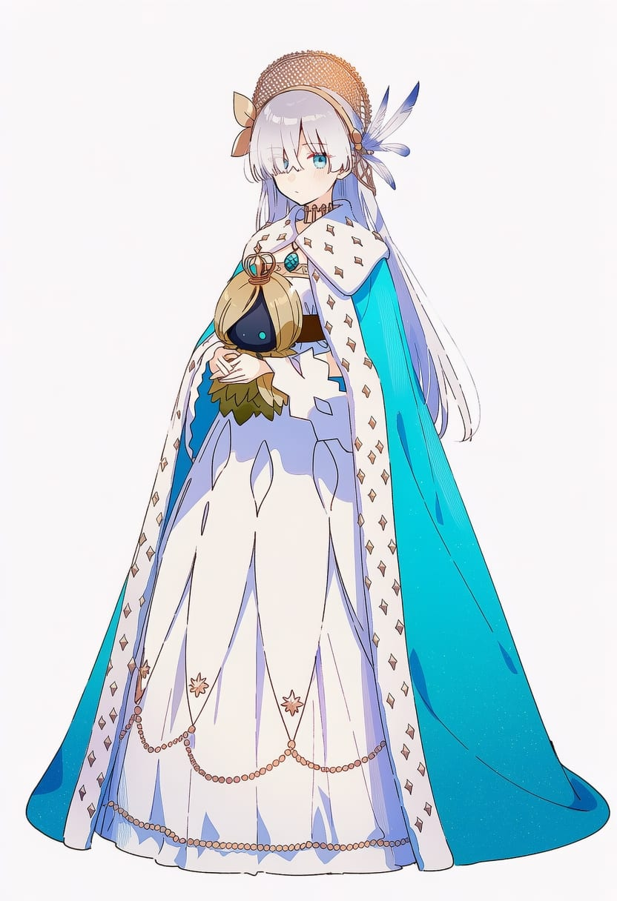

| 字段 | 内容 |
| --- | --- |
| Danbooru Tag | feather_hair |
| 中文名 | 羽毛头发 |
| 中文含义 | 头发像羽毛或由羽毛构成。 |
| 子类 | 特殊发型 |

## 122. fiery_hair — 头发像火焰一样燃烧或流动。

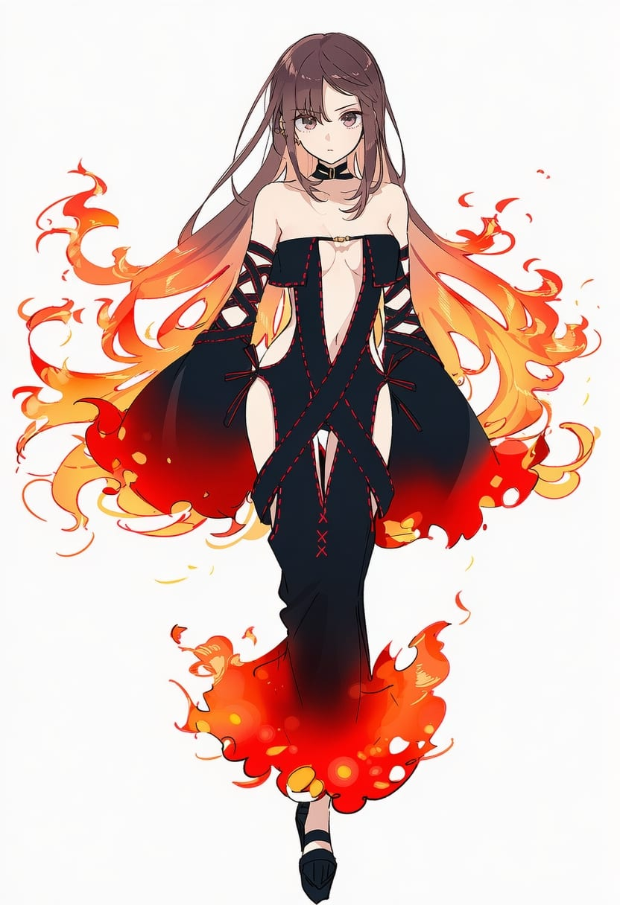

| 字段 | 内容 |
| --- | --- |
| Danbooru Tag | fiery_hair |
| 中文名 | 火焰头发 |
| 中文含义 | 头发像火焰一样燃烧或流动。 |
| 子类 | 特殊发型 |

## 123. food-themed_hair — 头发造型明显带食物元素。

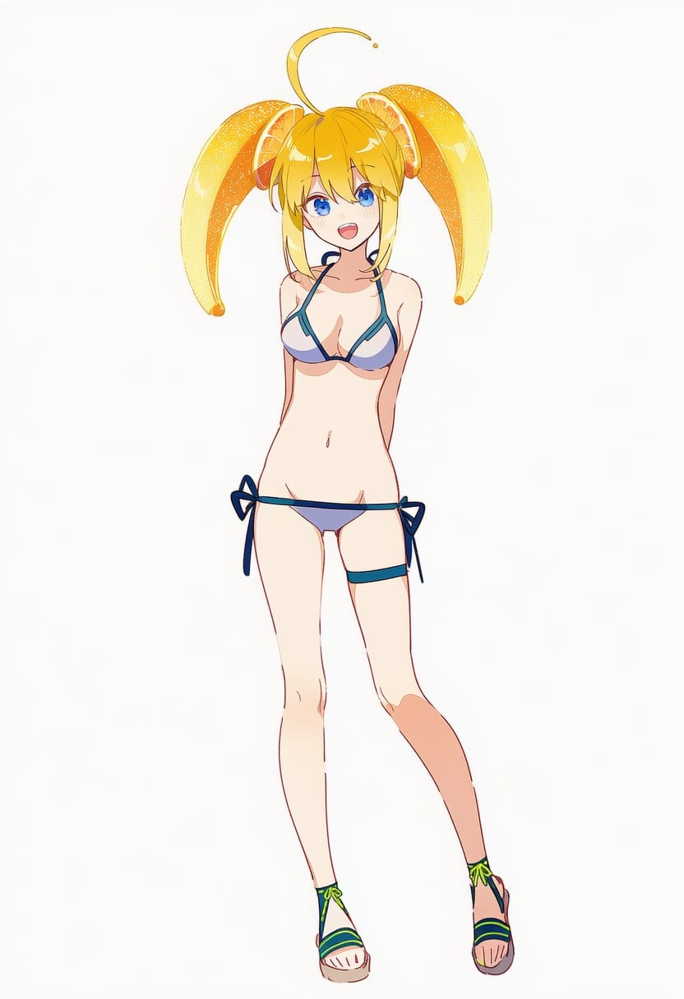

| 字段 | 内容 |
| --- | --- |
| Danbooru Tag | food-themed_hair |
| 中文名 | 食物主题头发 |
| 中文含义 | 头发造型明显带食物元素。 |
| 子类 | 特殊发型 |

## 124. glowing_hair — 头发本身会发光。

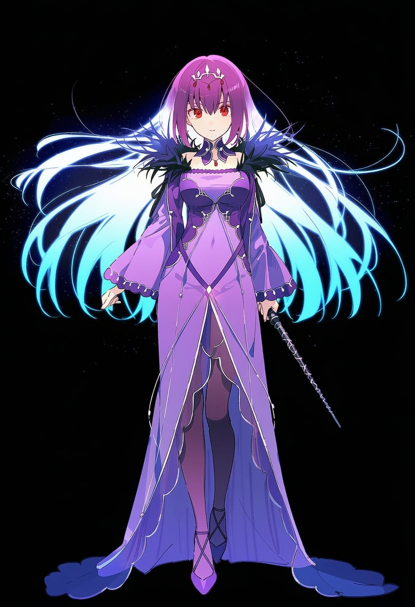

| 字段 | 内容 |
| --- | --- |
| Danbooru Tag | glowing_hair |
| 中文名 | 发光头发 |
| 中文含义 | 头发本身会发光。 |
| 子类 | 特殊发型 |

## 125. iridescent_hair — 头发带彩虹般的变彩效果。

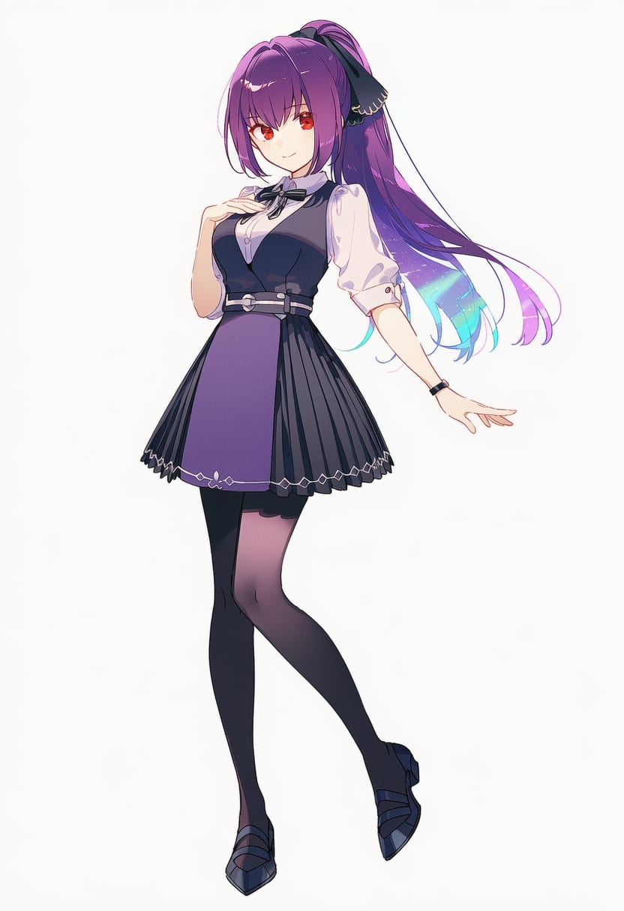

| 字段 | 内容 |
| --- | --- |
| Danbooru Tag | iridescent_hair |
| 中文名 | 虹彩头发 |
| 中文含义 | 头发带彩虹般的变彩效果。 |
| 子类 | 特殊发型 |

## 126. liquid_hair — 头发呈液体一样流动。

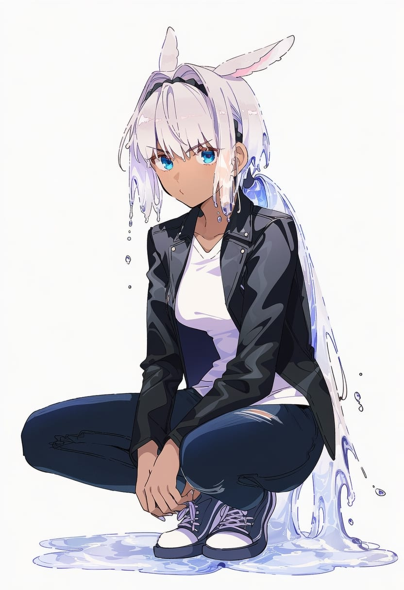

| 字段 | 内容 |
| --- | --- |
| Danbooru Tag | liquid_hair |
| 中文名 | 液体头发 |
| 中文含义 | 头发呈液体一样流动。 |
| 子类 | 特殊发型 |

## 127. living_hair — 头发像有生命一样活动。

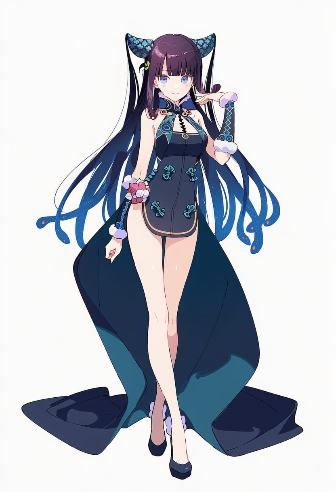

| 字段 | 内容 |
| --- | --- |
| Danbooru Tag | living_hair |
| 中文名 | 活体头发 |
| 中文含义 | 头发像有生命一样活动。 |
| 子类 | 特殊发型 |

## 128. mechanical_hair — 头发呈机械结构或由机械组成。

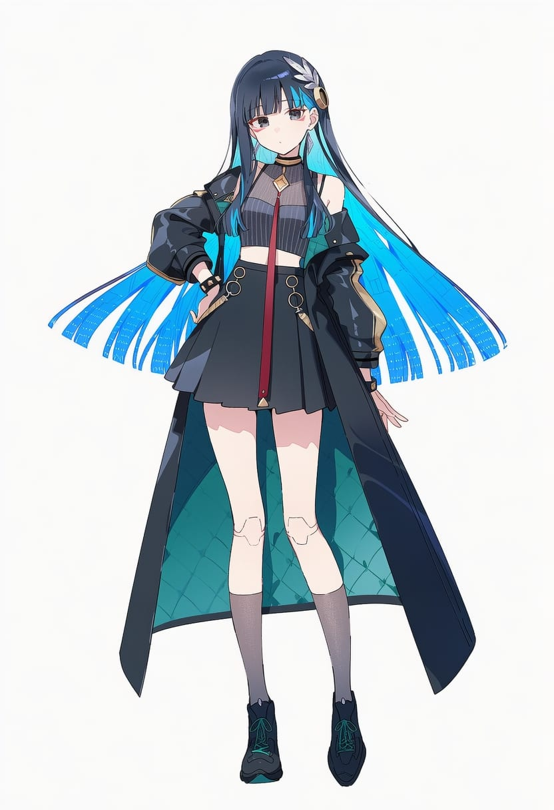

| 字段 | 内容 |
| --- | --- |
| Danbooru Tag | mechanical_hair |
| 中文名 | 机械头发 |
| 中文含义 | 头发呈机械结构或由机械组成。 |
| 子类 | 特殊发型 |

## 129. metal_hair — 头发具有明显金属质感。

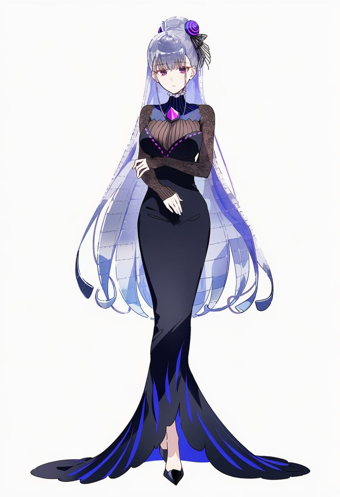

| 字段 | 内容 |
| --- | --- |
| Danbooru Tag | metal_hair |
| 中文名 | 金属头发 |
| 中文含义 | 头发具有明显金属质感。 |
| 子类 | 特殊发型 |

## 130. plant_hair — 头发像植物、藤蔓或叶片。

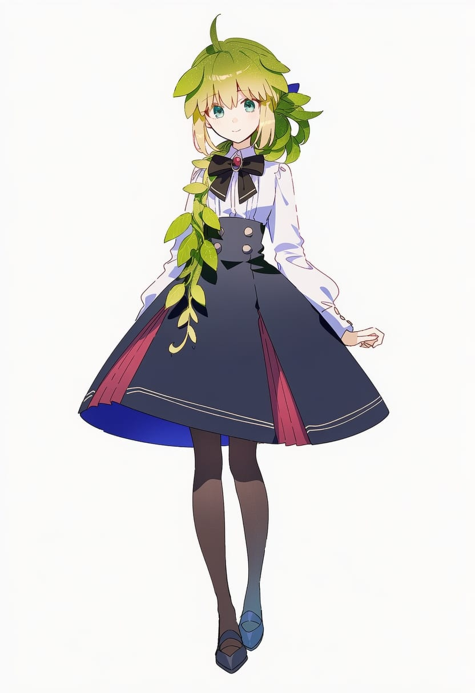

| 字段 | 内容 |
| --- | --- |
| Danbooru Tag | plant_hair |
| 中文名 | 植物头发 |
| 中文含义 | 头发像植物、藤蔓或叶片。 |
| 子类 | 特殊发型 |

## 131. prehensile_hair — 头发能像手脚一样主动抓取或动作。

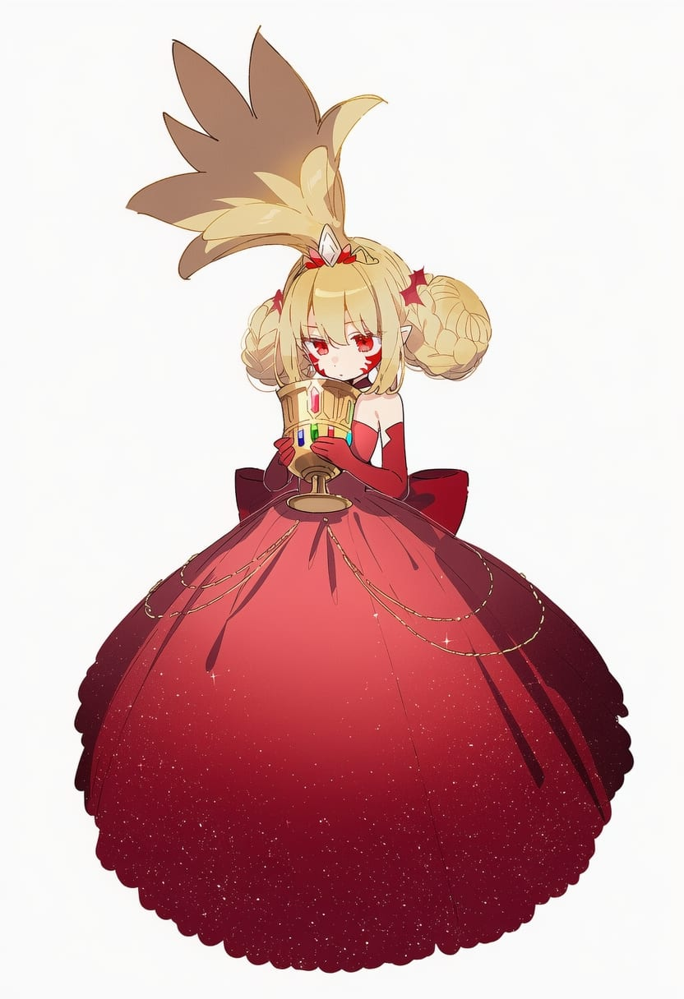

| 字段 | 内容 |
| --- | --- |
| Danbooru Tag | prehensile_hair |
| 中文名 | 可操控头发 |
| 中文含义 | 头发能像手脚一样主动抓取或动作。 |
| 子类 | 特殊发型 |

## 132. slime_hair — 头发呈史莱姆或胶状质感。

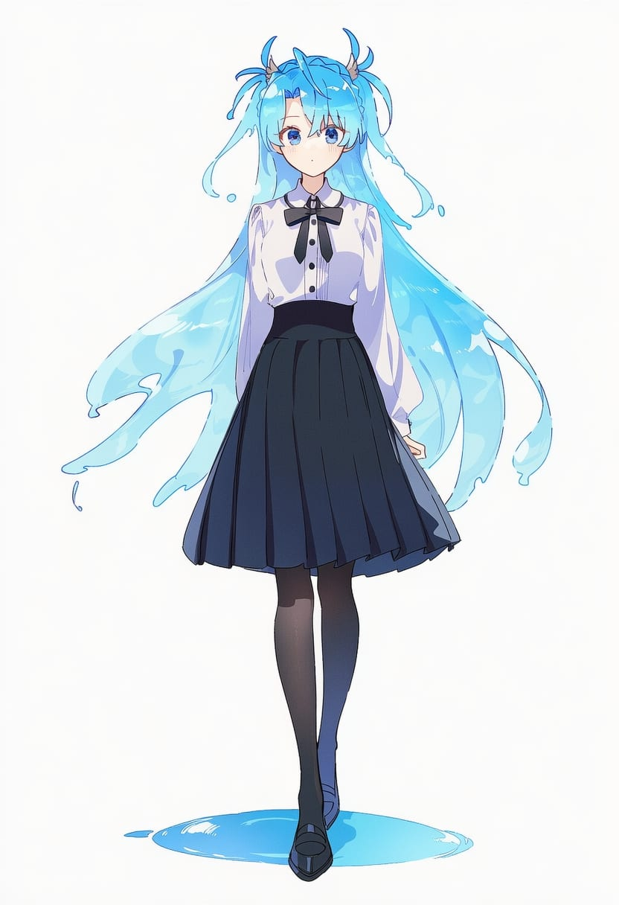

| 字段 | 内容 |
| --- | --- |
| Danbooru Tag | slime_hair |
| 中文名 | 史莱姆头发 |
| 中文含义 | 头发呈史莱姆或胶状质感。 |
| 子类 | 特殊发型 |

## 133. snake_hair — 头发由蛇组成或像蛇一样活动。

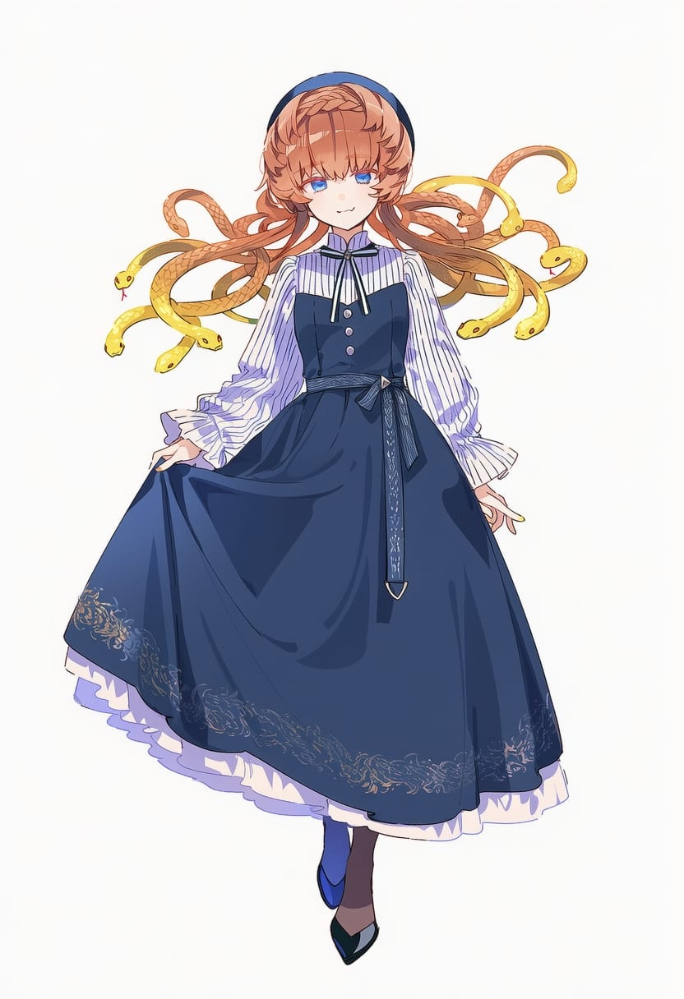

| 字段 | 内容 |
| --- | --- |
| Danbooru Tag | snake_hair |
| 中文名 | 蛇发 |
| 中文含义 | 头发由蛇组成或像蛇一样活动。 |
| 子类 | 特殊发型 |

## 134. starry_hair — 头发里带星空或繁星效果。

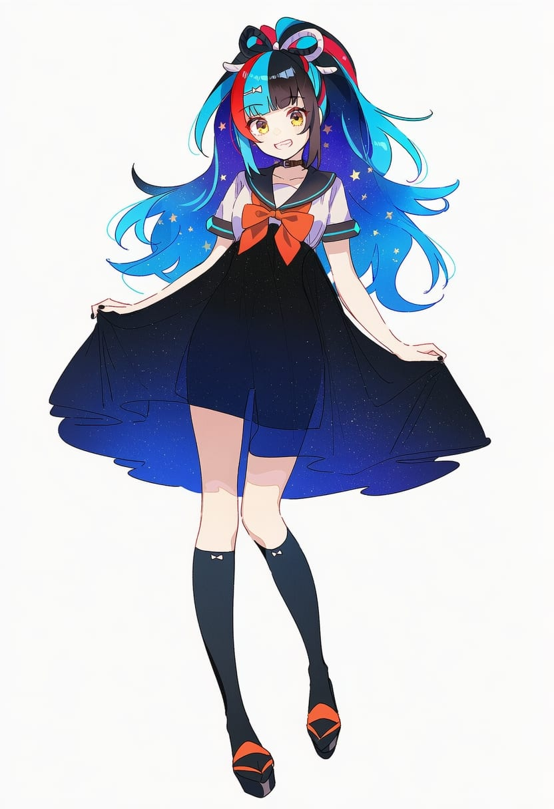

| 字段 | 内容 |
| --- | --- |
| Danbooru Tag | starry_hair |
| 中文名 | 星空头发 |
| 中文含义 | 头发里带星空或繁星效果。 |
| 子类 | 特殊发型 |

---
