# 发饰

## 1. hair_ribbon — 发带丝带

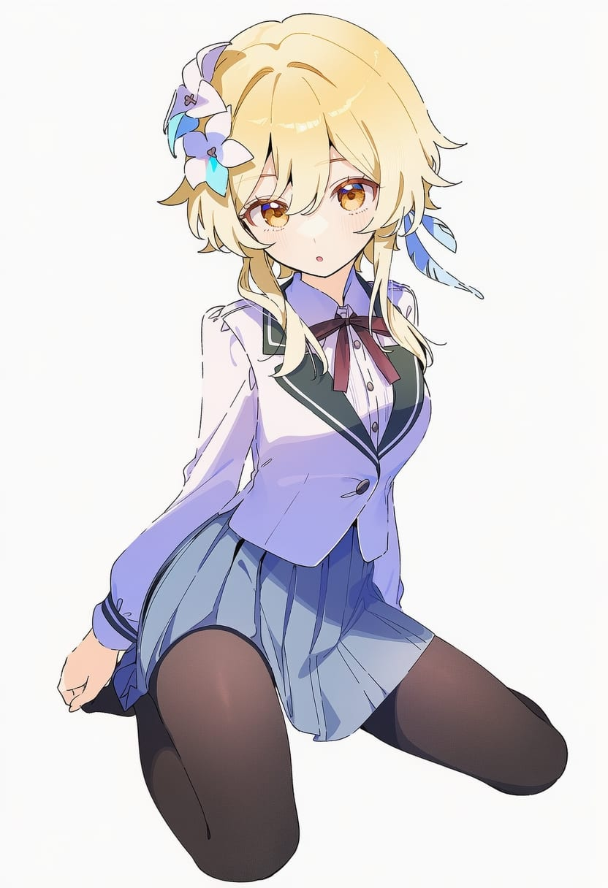

| 字段 | 内容 |
| --- | --- |
| Danbooru Tag | hair_ribbon |
| 中文名 | 发带丝带 |
| 中文含义 | 系在头发上的丝带。 |
| 子类 | 蝴蝶结/丝带 |
| 模特 | lumine_(genshin_impact) |
| 序号 | 0001 |

## 2. hair_bow — 发蝴蝶结

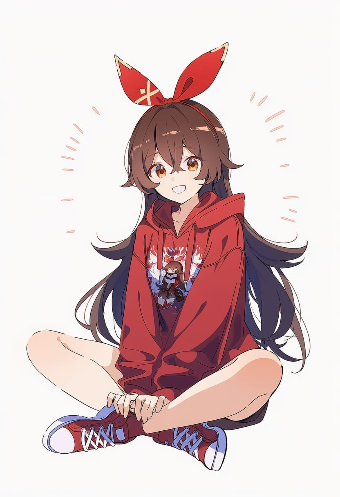

| 字段 | 内容 |
| --- | --- |
| Danbooru Tag | hair_bow |
| 中文名 | 发蝴蝶结 |
| 中文含义 | 戴在头发上的蝴蝶结。 |
| 子类 | 蝴蝶结/丝带 |
| 模特 | amber_(genshin_impact) |
| 序号 | 0002 |

## 3. multiple_hair_bows — 多个发蝴蝶结

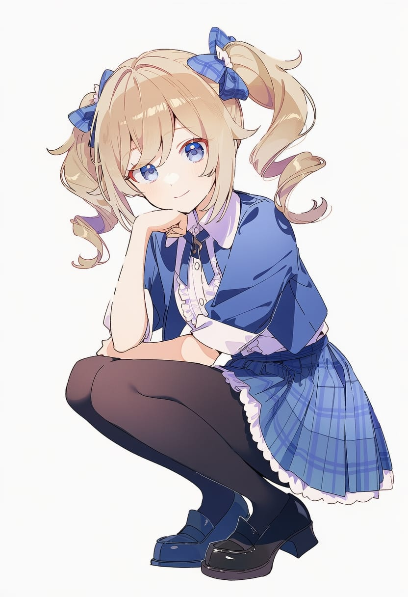

| 字段 | 内容 |
| --- | --- |
| Danbooru Tag | multiple_hair_bows |
| 中文名 | 多个发蝴蝶结 |
| 中文含义 | 头发上戴三个或更多蝴蝶结。 |
| 子类 | 蝴蝶结/丝带 |
| 模特 | barbara_(genshin_impact) |
| 序号 | 0003 |

## 4. multiple_hair_ribbons — 多条发丝带

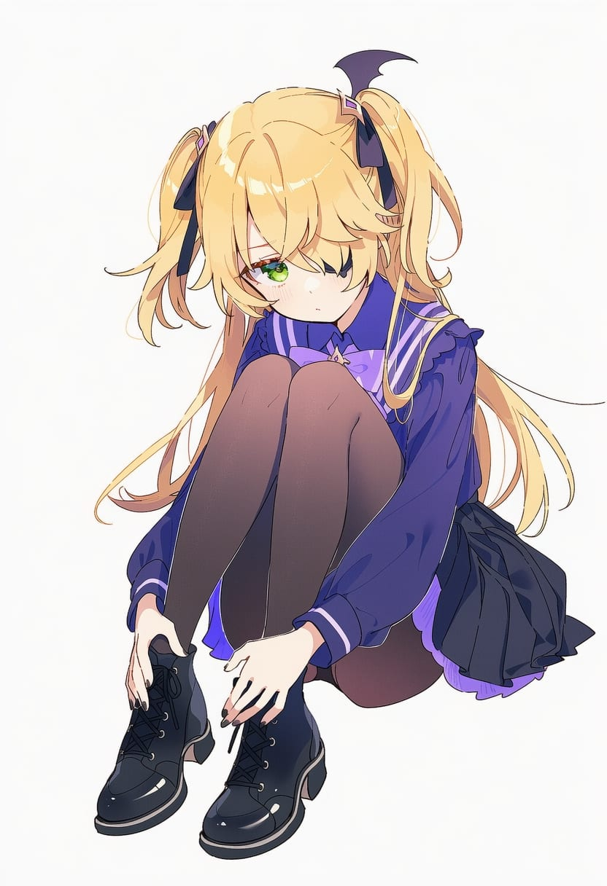

| 字段 | 内容 |
| --- | --- |
| Danbooru Tag | multiple_hair_ribbons |
| 中文名 | 多条发丝带 |
| 中文含义 | 头发上同时系着多条丝带。 |
| 子类 | 蝴蝶结/丝带 |
| 模特 | fischl_(genshin_impact) |
| 序号 | 0004 |

## 5. hairband — 发箍

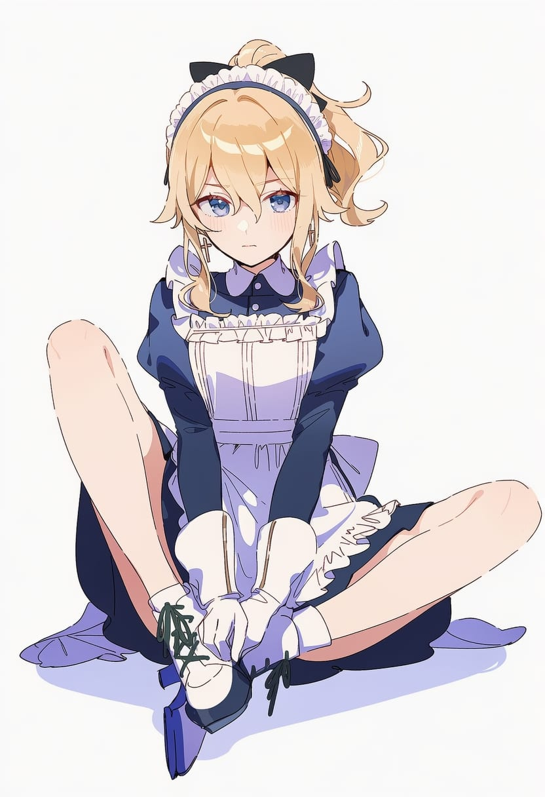

| 字段 | 内容 |
| --- | --- |
| Danbooru Tag | hairband |
| 中文名 | 发箍 |
| 中文含义 | 从头顶箍住头发的发箍。 |
| 子类 | 发箍 |
| 模特 | jean_(genshin_impact) |
| 序号 | 0005 |

## 6. black_hairband — 黑色发箍

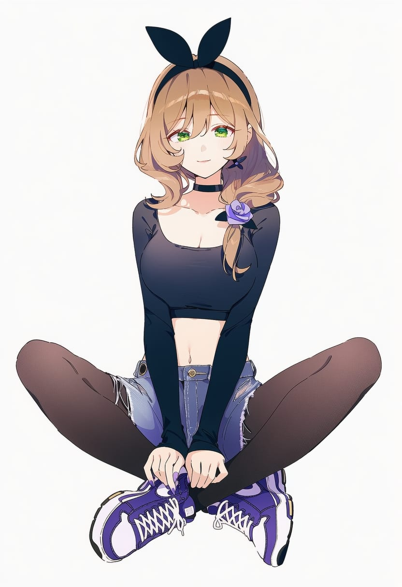

| 字段 | 内容 |
| --- | --- |
| Danbooru Tag | black_hairband |
| 中文名 | 黑色发箍 |
| 中文含义 | 黑色发箍；纯颜色款只留这一种代表。 |
| 子类 | 发箍 |
| 模特 | lisa_(genshin_impact) |
| 序号 | 0006 |

## 7. animal_ear_hairband — 兽耳发箍

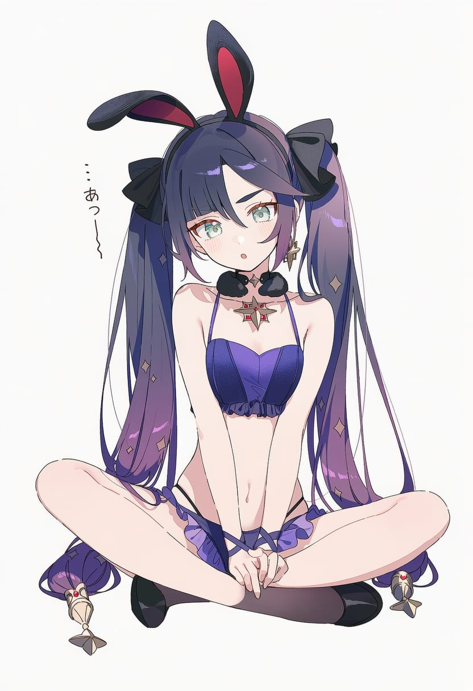

| 字段 | 内容 |
| --- | --- |
| Danbooru Tag | animal_ear_hairband |
| 中文名 | 兽耳发箍 |
| 中文含义 | 带动物耳朵造型的发箍。 |
| 子类 | 发箍 |
| 模特 | mona_(genshin_impact) |
| 序号 | 0007 |

## 8. rabbit_ear_hairband — 兔耳发箍

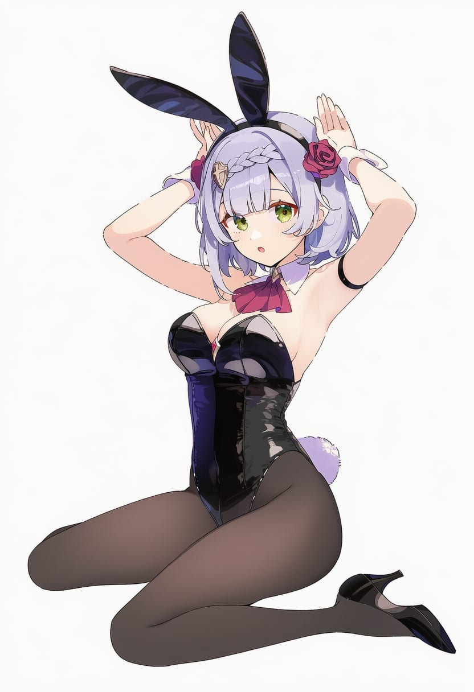

| 字段 | 内容 |
| --- | --- |
| Danbooru Tag | rabbit_ear_hairband |
| 中文名 | 兔耳发箍 |
| 中文含义 | 带兔耳造型的发箍。 |
| 子类 | 发箍 |
| 模特 | noelle_(genshin_impact) |
| 序号 | 0008 |

## 9. bow_hairband — 蝴蝶结发箍

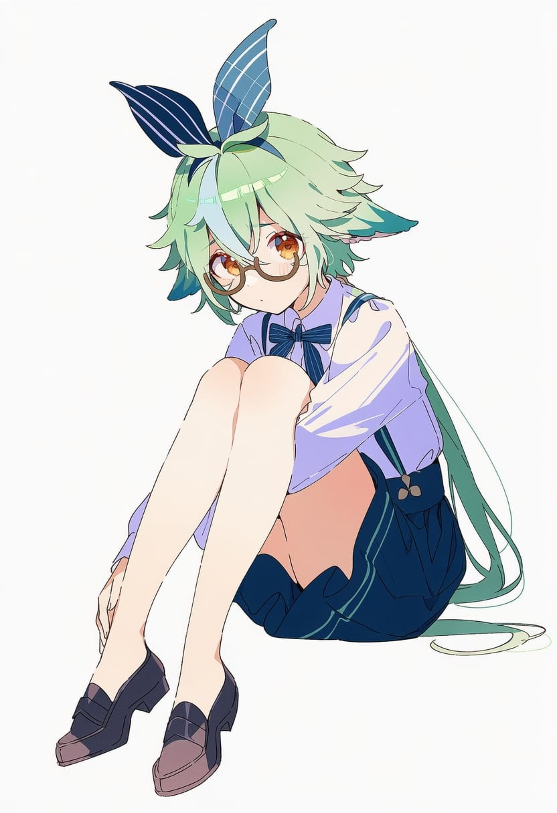

| 字段 | 内容 |
| --- | --- |
| Danbooru Tag | bow_hairband |
| 中文名 | 蝴蝶结发箍 |
| 中文含义 | 带蝴蝶结的发箍。 |
| 子类 | 发箍 |
| 模特 | sucrose_(genshin_impact) |
| 序号 | 0009 |

## 10. frilled_hairband — 荷叶边发箍

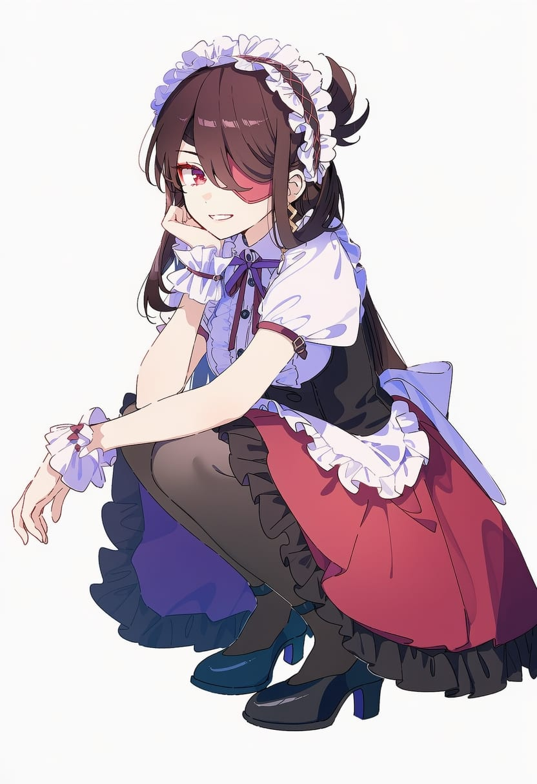

| 字段 | 内容 |
| --- | --- |
| Danbooru Tag | frilled_hairband |
| 中文名 | 荷叶边发箍 |
| 中文含义 | 带褶边或荷叶边的发箍。 |
| 子类 | 发箍 |
| 模特 | beidou_(genshin_impact) |
| 序号 | 0010 |

## 11. lolita_hairband — 洛丽塔发箍

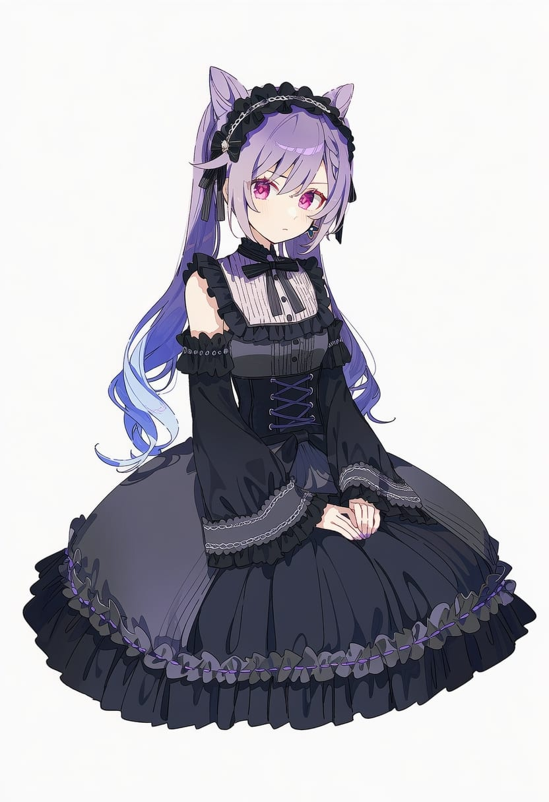

| 字段 | 内容 |
| --- | --- |
| Danbooru Tag | lolita_hairband |
| 中文名 | 洛丽塔发箍 |
| 中文含义 | 洛丽塔风格的装饰发箍。 |
| 子类 | 发箍 |
| 模特 | keqing_(genshin_impact) |
| 序号 | 0011 |

## 12. multicolored_hairband — 多色发箍

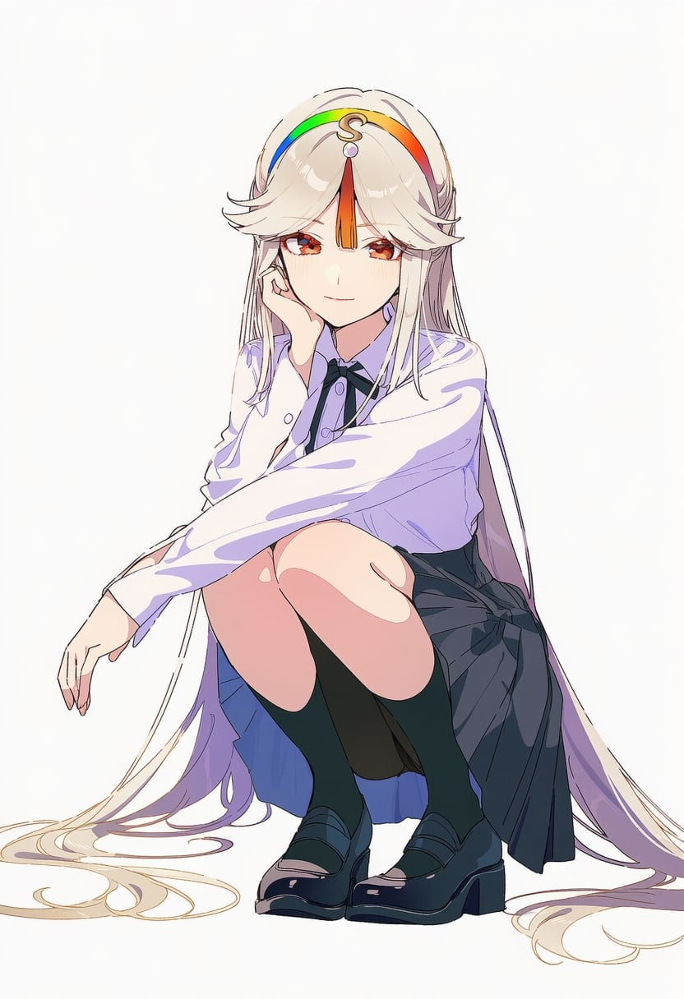

| 字段 | 内容 |
| --- | --- |
| Danbooru Tag | multicolored_hairband |
| 中文名 | 多色发箍 |
| 中文含义 | 同时带多种颜色的发箍。 |
| 子类 | 发箍 |
| 模特 | ningguang_(genshin_impact) |
| 序号 | 0012 |

## 13. diamond_hairband — 菱形发箍

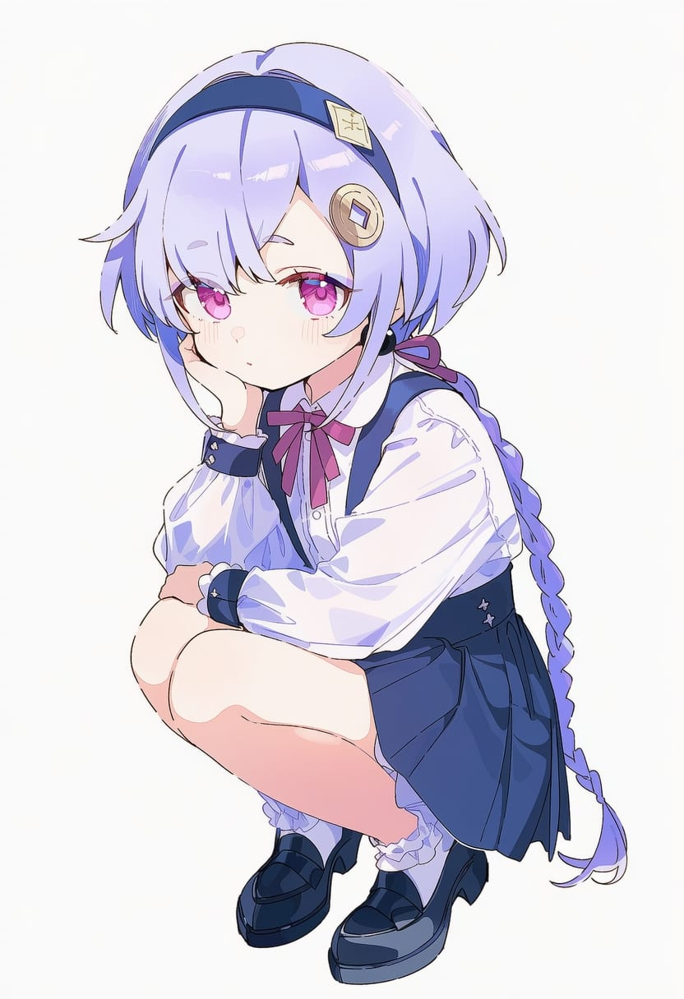

| 字段 | 内容 |
| --- | --- |
| Danbooru Tag | diamond_hairband |
| 中文名 | 菱形发箍 |
| 中文含义 | 带菱形设计的发箍。 |
| 子类 | 发箍 |
| 模特 | qiqi_(genshin_impact) |
| 序号 | 0013 |

## 14. cat_ear_hairband — 猫耳发箍

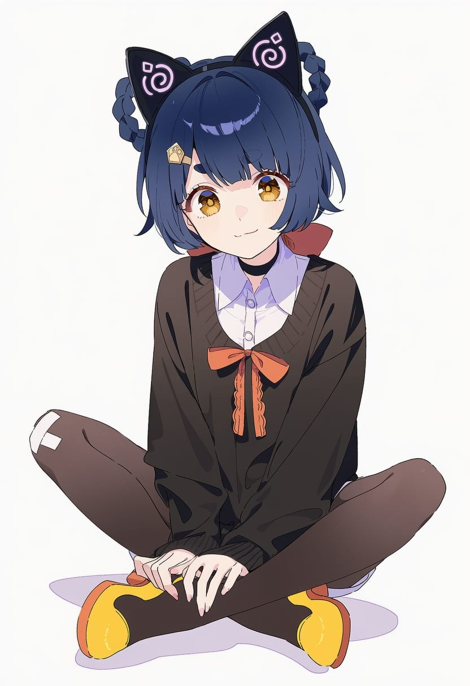

| 字段 | 内容 |
| --- | --- |
| Danbooru Tag | cat_ear_hairband |
| 中文名 | 猫耳发箍 |
| 中文含义 | 带猫耳造型的发箍。 |
| 子类 | 发箍 |
| 模特 | xiangling_(genshin_impact) |
| 序号 | 0014 |

## 15. horn_hairband — 角形发箍

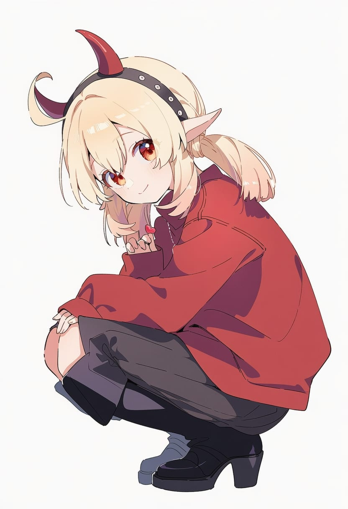

| 字段 | 内容 |
| --- | --- |
| Danbooru Tag | horn_hairband |
| 中文名 | 角形发箍 |
| 中文含义 | 带角造型的发箍。 |
| 子类 | 发箍 |
| 模特 | klee_(genshin_impact) |
| 序号 | 0015 |

## 16. two-tone_hairband — 双色发箍

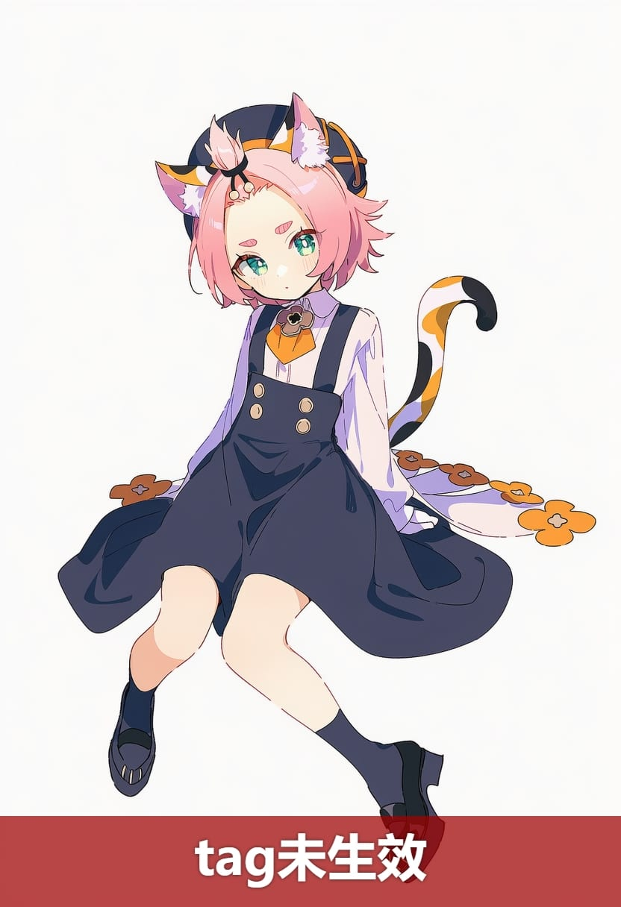

| 字段 | 内容 |
| --- | --- |
| Danbooru Tag | two-tone_hairband |
| 中文名 | 双色发箍 |
| 中文含义 | 由两种主要颜色组成的发箍。 |
| 子类 | 发箍 |
| 模特 | diona_(genshin_impact) |
| 序号 | 0016 |

## 17. metal_hairband — 金属发箍

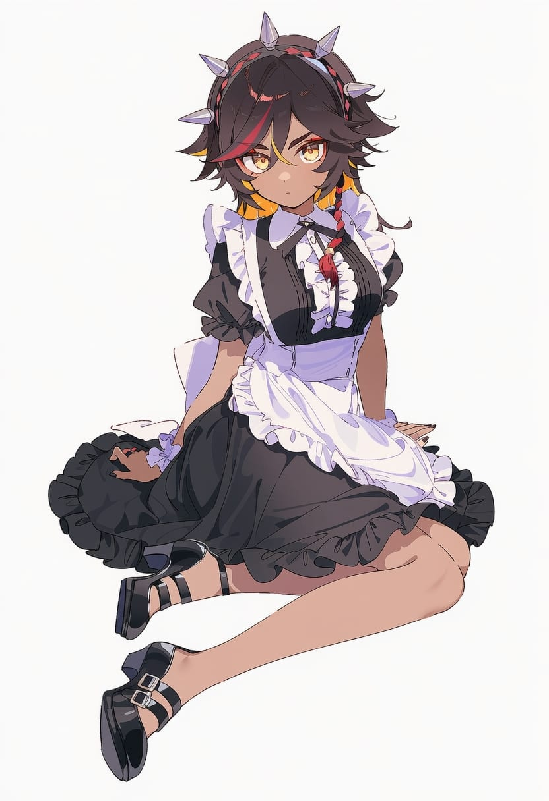

| 字段 | 内容 |
| --- | --- |
| Danbooru Tag | metal_hairband |
| 中文名 | 金属发箍 |
| 中文含义 | 金属材质或金属感发箍。 |
| 子类 | 发箍 |
| 模特 | xinyan_(genshin_impact) |
| 序号 | 0017 |

## 18. striped_hairband — 条纹发箍

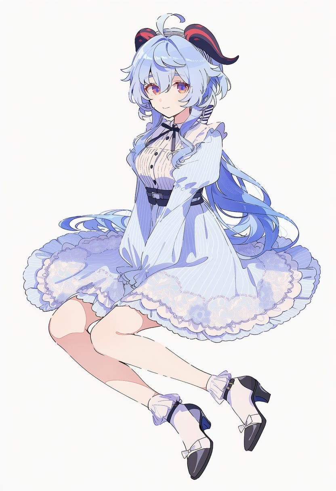

| 字段 | 内容 |
| --- | --- |
| Danbooru Tag | striped_hairband |
| 中文名 | 条纹发箍 |
| 中文含义 | 带条纹图案的发箍。 |
| 子类 | 发箍 |
| 模特 | ganyu_(genshin_impact) |
| 序号 | 0018 |

## 19. spiked_hairband — 尖刺发箍

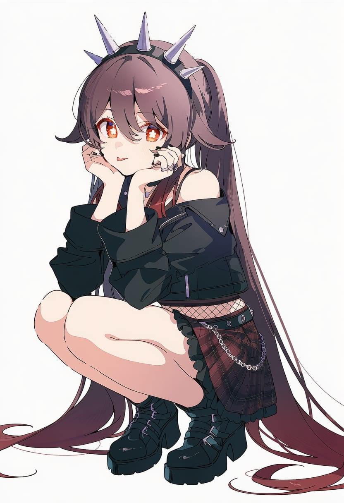

| 字段 | 内容 |
| --- | --- |
| Danbooru Tag | spiked_hairband |
| 中文名 | 尖刺发箍 |
| 中文含义 | 带尖刺装饰的发箍。 |
| 子类 | 发箍 |
| 模特 | hu_tao_(genshin_impact) |
| 序号 | 0019 |

## 20. checkered_hairband — 棋盘格发箍

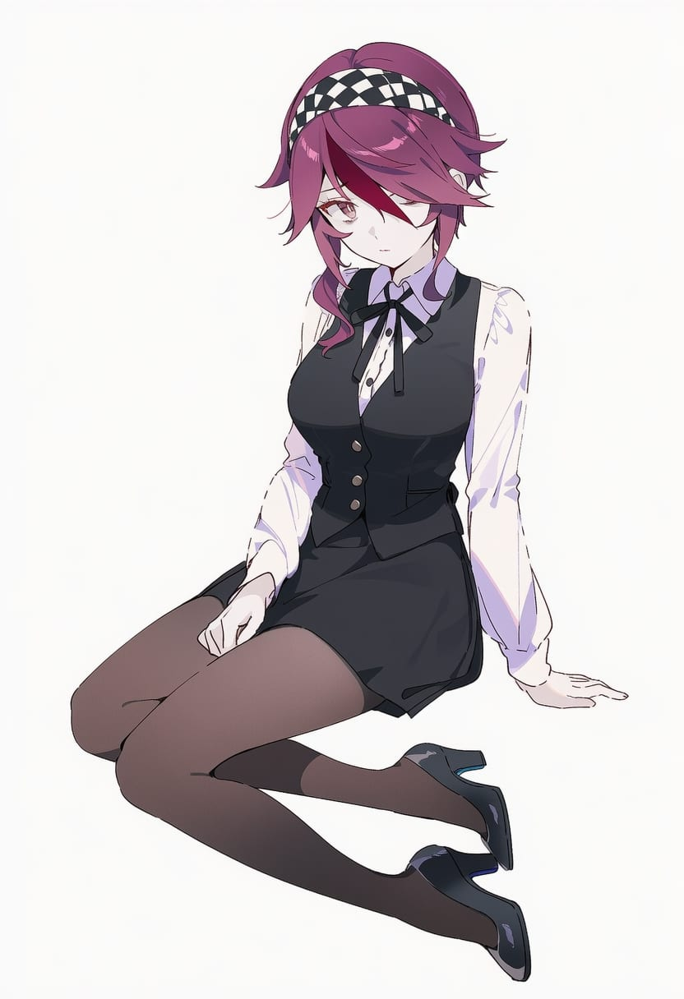

| 字段 | 内容 |
| --- | --- |
| Danbooru Tag | checkered_hairband |
| 中文名 | 棋盘格发箍 |
| 中文含义 | 带棋盘格图案的发箍。 |
| 子类 | 发箍 |
| 模特 | rosaria_(genshin_impact) |
| 序号 | 0020 |

## 21. lace-trimmed_hairband — 蕾丝边发箍

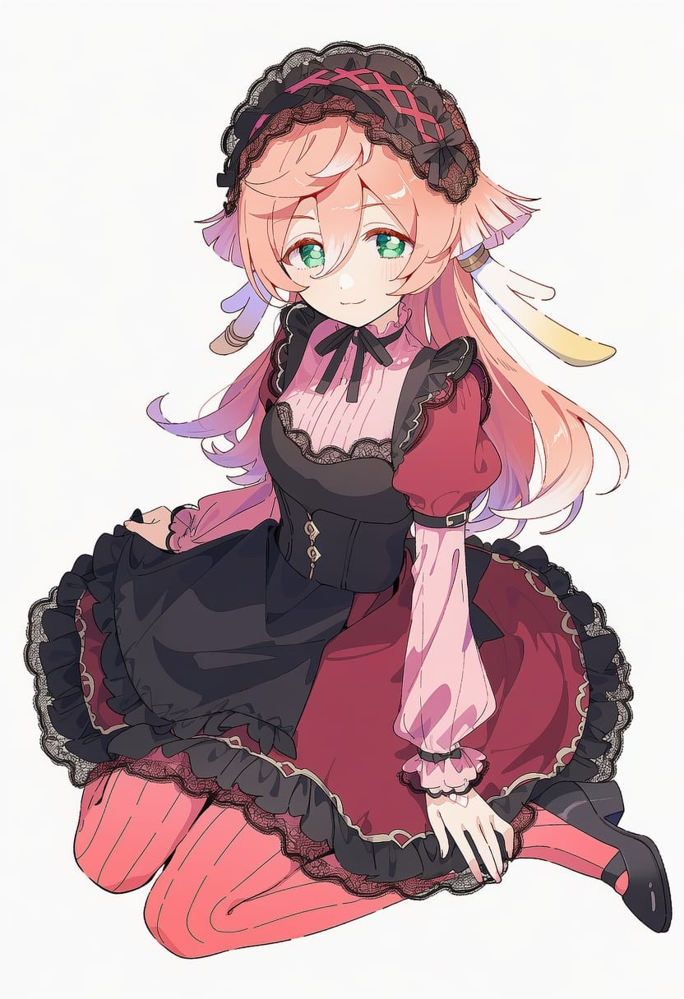

| 字段 | 内容 |
| --- | --- |
| Danbooru Tag | lace-trimmed_hairband |
| 中文名 | 蕾丝边发箍 |
| 中文含义 | 边缘带蕾丝装饰的发箍。 |
| 子类 | 发箍 |
| 模特 | yanfei_(genshin_impact) |
| 序号 | 0021 |

## 22. cow_ear_hairband — 牛耳发箍

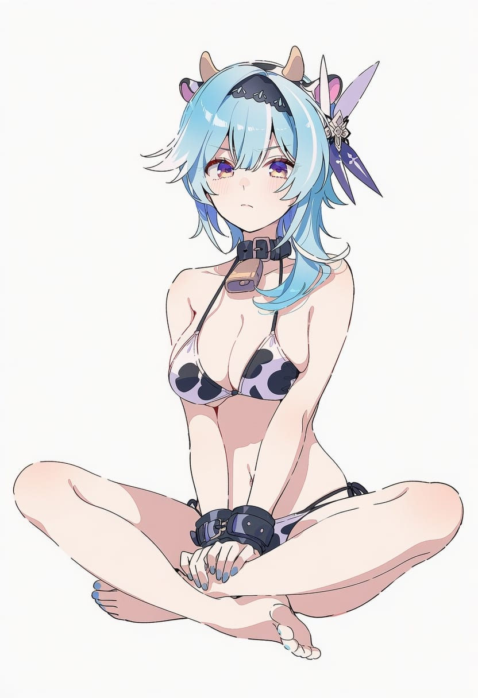

| 字段 | 内容 |
| --- | --- |
| Danbooru Tag | cow_ear_hairband |
| 中文名 | 牛耳发箍 |
| 中文含义 | 带牛耳造型的发箍。 |
| 子类 | 发箍 |
| 模特 | eula_(genshin_impact) |
| 序号 | 0022 |

## 23. flower_hairband — 花朵发箍

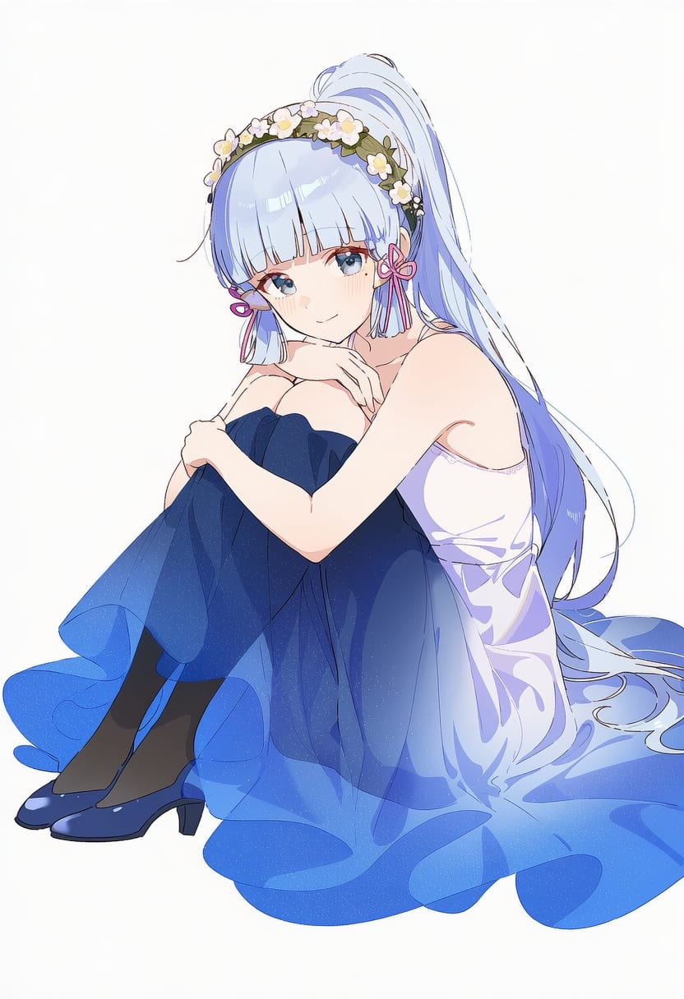

| 字段 | 内容 |
| --- | --- |
| Danbooru Tag | flower_hairband |
| 中文名 | 花朵发箍 |
| 中文含义 | 带花朵装饰的发箍。 |
| 子类 | 发箍 |
| 模特 | kamisato_ayaka |
| 序号 | 0023 |

## 24. polka_dot_hairband — 波点发箍

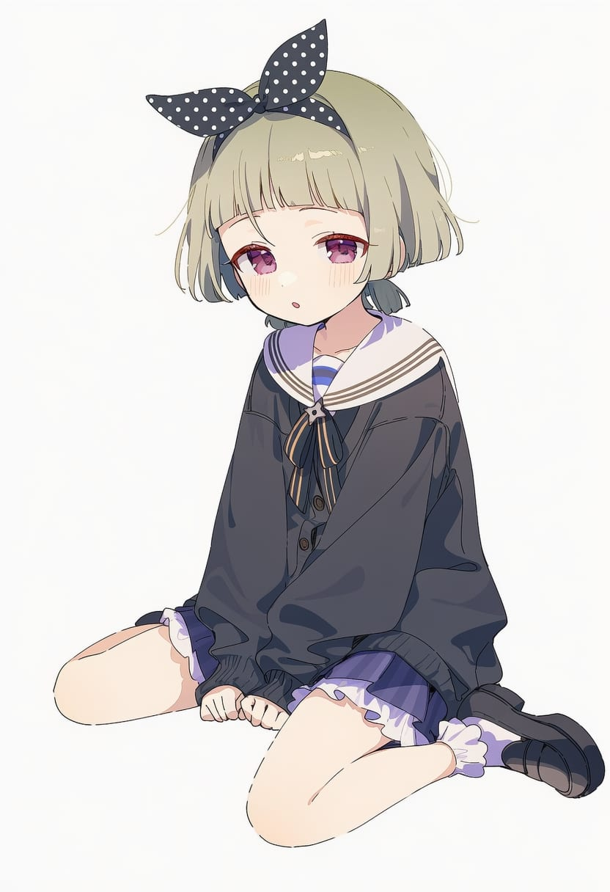

| 字段 | 内容 |
| --- | --- |
| Danbooru Tag | polka_dot_hairband |
| 中文名 | 波点发箍 |
| 中文含义 | 带波点图案的发箍。 |
| 子类 | 发箍 |
| 模特 | sayu_(genshin_impact) |
| 序号 | 0024 |

## 25. print_hairband — 印花发箍

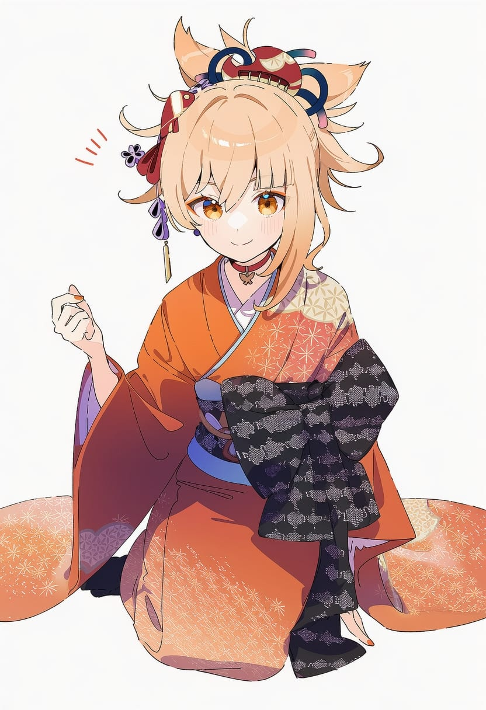

| 字段 | 内容 |
| --- | --- |
| Danbooru Tag | print_hairband |
| 中文名 | 印花发箍 |
| 中文含义 | 表面带印花图案的发箍。 |
| 子类 | 发箍 |
| 模特 | yoimiya_(genshin_impact) |
| 序号 | 0025 |

## 26. ribbon-trimmed_hairband — 丝带装饰发箍

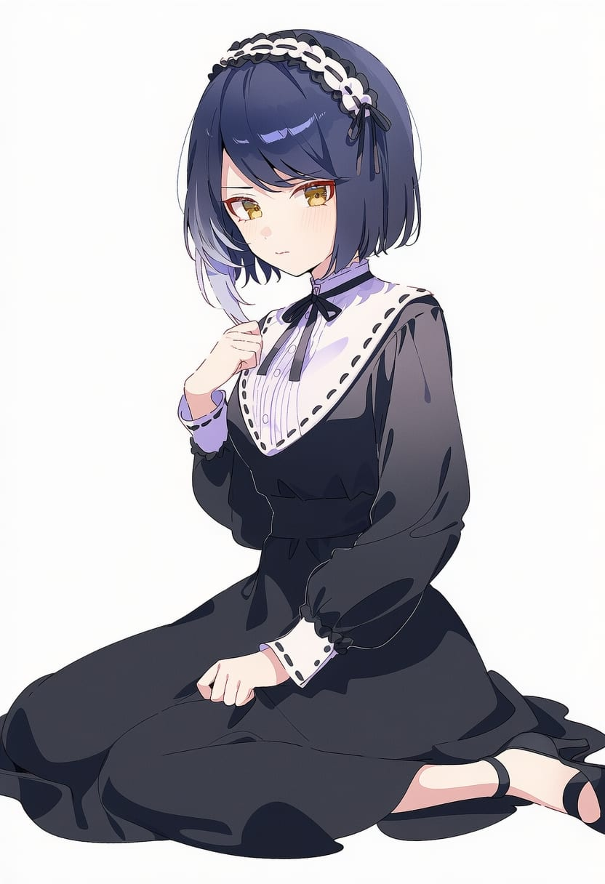

| 字段 | 内容 |
| --- | --- |
| Danbooru Tag | ribbon-trimmed_hairband |
| 中文名 | 丝带装饰发箍 |
| 中文含义 | 带丝带装饰的发箍。 |
| 子类 | 发箍 |
| 模特 | kujou_sara |
| 序号 | 0026 |

## 27. plaid_hairband — 格纹发箍

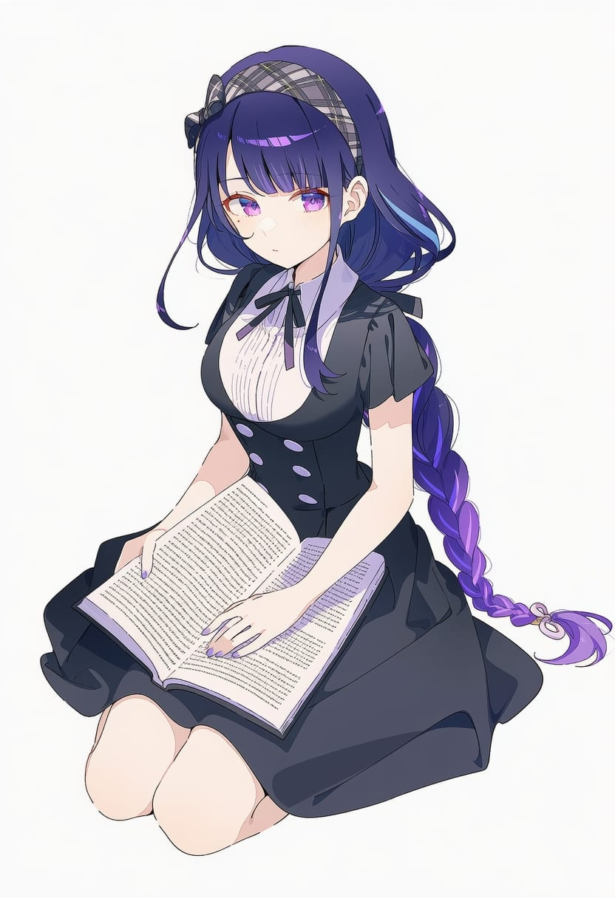

| 字段 | 内容 |
| --- | --- |
| Danbooru Tag | plaid_hairband |
| 中文名 | 格纹发箍 |
| 中文含义 | 带格纹图案的发箍。 |
| 子类 | 发箍 |
| 模特 | raiden_shogun |
| 序号 | 0027 |

## 28. lace_hairband — 蕾丝发箍

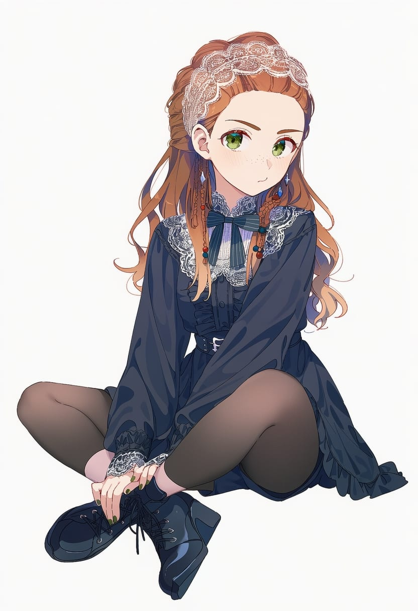

| 字段 | 内容 |
| --- | --- |
| Danbooru Tag | lace_hairband |
| 中文名 | 蕾丝发箍 |
| 中文含义 | 主要由蕾丝构成的发箍。 |
| 子类 | 发箍 |
| 模特 | aloy_(horizon) |
| 序号 | 0028 |

## 29. bear_ear_hairband — 熊耳发箍

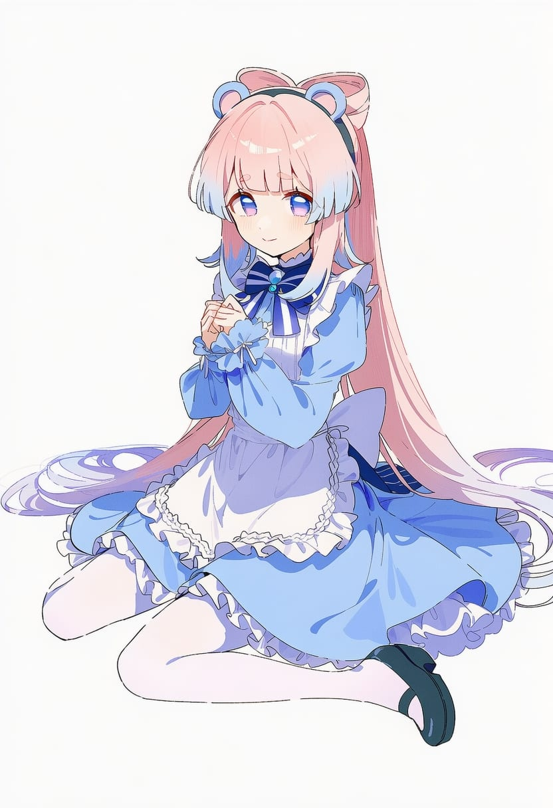

| 字段 | 内容 |
| --- | --- |
| Danbooru Tag | bear_ear_hairband |
| 中文名 | 熊耳发箍 |
| 中文含义 | 带熊耳造型的发箍。 |
| 子类 | 发箍 |
| 模特 | sangonomiya_kokomi |
| 序号 | 0029 |

## 30. rainbow_hairband — 彩虹发箍

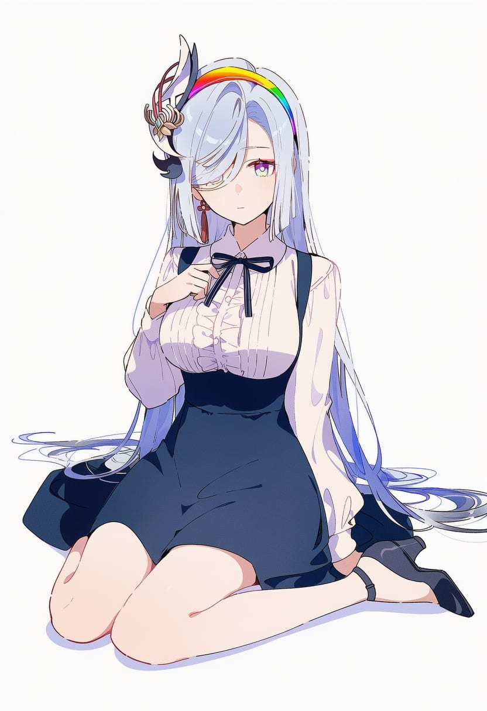

| 字段 | 内容 |
| --- | --- |
| Danbooru Tag | rainbow_hairband |
| 中文名 | 彩虹发箍 |
| 中文含义 | 带彩虹配色或彩虹图案的发箍。 |
| 子类 | 发箍 |
| 模特 | shenhe_(genshin_impact) |
| 序号 | 0030 |

## 31. scrunchie — 布艺发圈

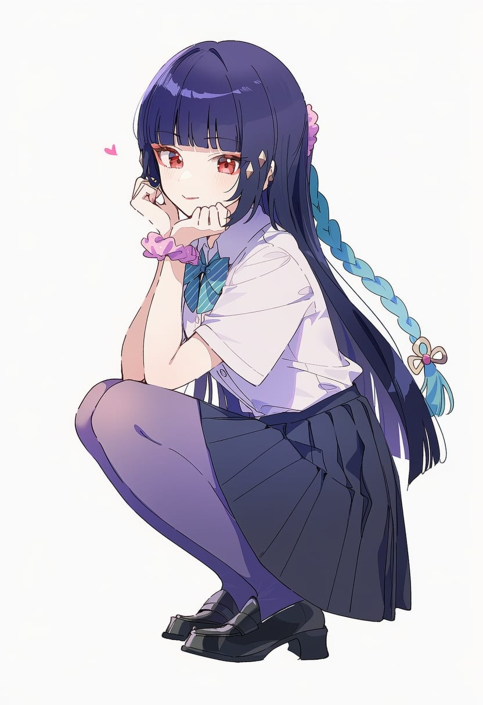

| 字段 | 内容 |
| --- | --- |
| Danbooru Tag | scrunchie |
| 中文名 | 布艺发圈 |
| 中文含义 | 蓬松布料包裹的发圈。 |
| 子类 | 发圈/扎带 |
| 模特 | yun_jin_(genshin_impact) |
| 序号 | 0031 |

## 32. hair_bobbles — 发球 / 发珠圈

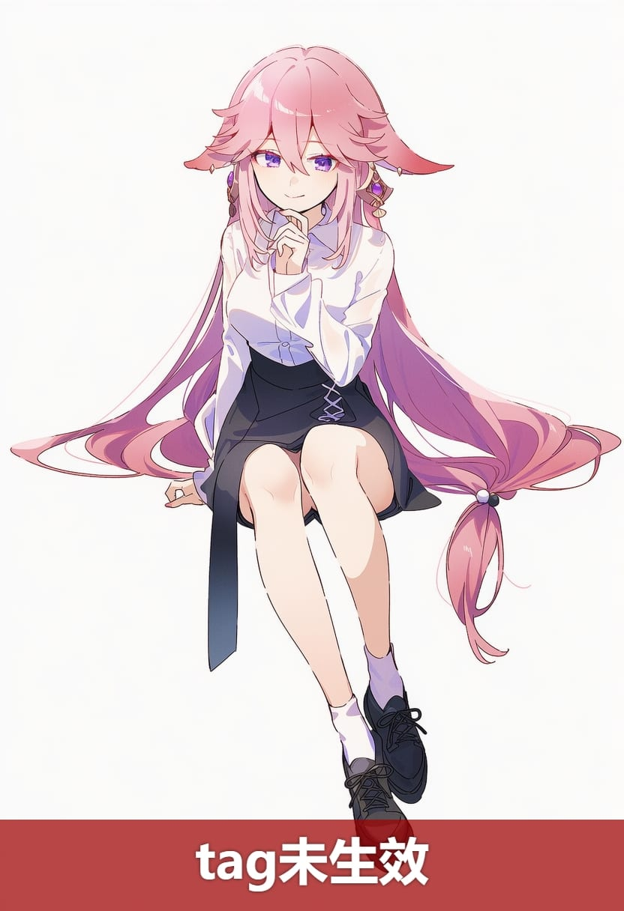

| 字段 | 内容 |
| --- | --- |
| Danbooru Tag | hair_bobbles |
| 中文名 | 发球 / 发珠圈 |
| 中文含义 | 带球状装饰的扎发配件。 |
| 子类 | 发圈/扎带 |
| 模特 | yae_miko |
| 序号 | 0032 |

## 33. hair_scrunchie — 头发上的发圈

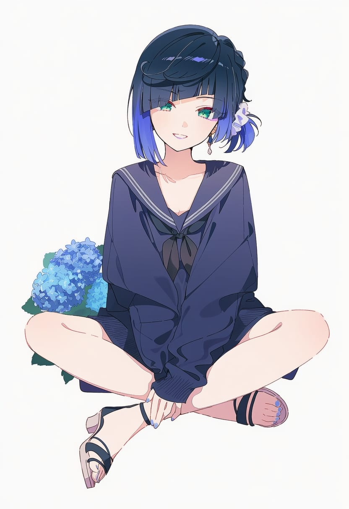

| 字段 | 内容 |
| --- | --- |
| Danbooru Tag | hair_scrunchie |
| 中文名 | 头发上的发圈 |
| 中文含义 | 明确戴在头发上的布艺发圈。 |
| 子类 | 发圈/扎带 |
| 模特 | yelan_(genshin_impact) |
| 序号 | 0033 |

## 34. hair_tie — 发绳

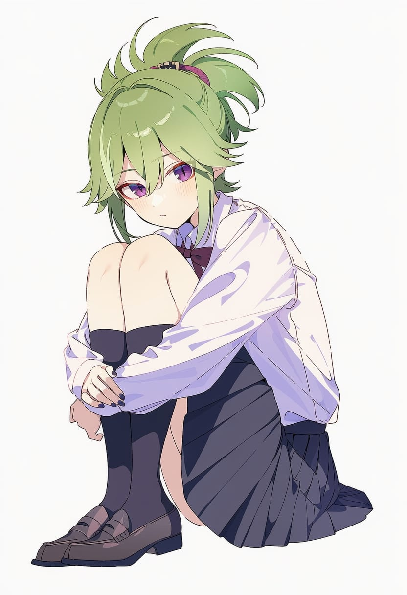

| 字段 | 内容 |
| --- | --- |
| Danbooru Tag | hair_tie |
| 中文名 | 发绳 |
| 中文含义 | 用来扎住头发的细发绳。 |
| 子类 | 发圈/扎带 |
| 模特 | kuki_shinobu |
| 序号 | 0034 |

## 35. black_scrunchie — 黑色发圈

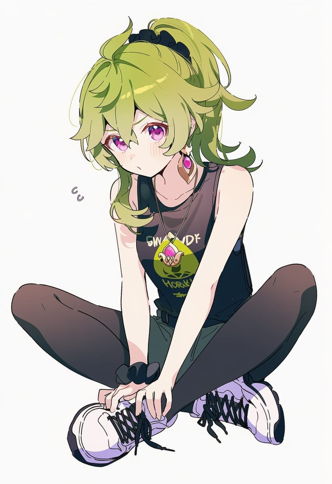

| 字段 | 内容 |
| --- | --- |
| Danbooru Tag | black_scrunchie |
| 中文名 | 黑色发圈 |
| 中文含义 | 黑色布艺发圈；纯颜色款只留这一种代表。 |
| 子类 | 发圈/扎带 |
| 模特 | collei_(genshin_impact) |
| 序号 | 0035 |

## 36. multicolored_hair_bobbles — 多色发球

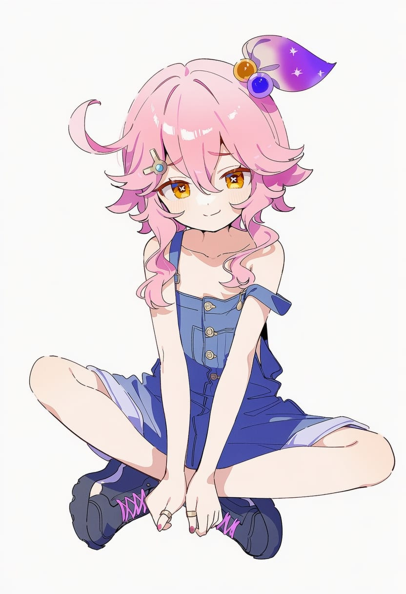

| 字段 | 内容 |
| --- | --- |
| Danbooru Tag | multicolored_hair_bobbles |
| 中文名 | 多色发球 |
| 中文含义 | 带多种颜色的发球装饰。 |
| 子类 | 发圈/扎带 |
| 模特 | dori_(genshin_impact) |
| 序号 | 0036 |

## 37. polka_dot_scrunchie — 波点发圈

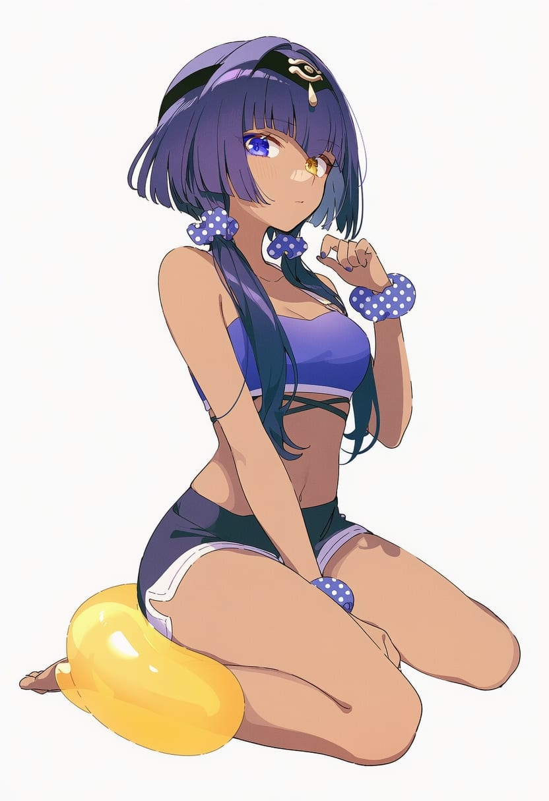

| 字段 | 内容 |
| --- | --- |
| Danbooru Tag | polka_dot_scrunchie |
| 中文名 | 波点发圈 |
| 中文含义 | 带波点图案的布艺发圈。 |
| 子类 | 发圈/扎带 |
| 模特 | candace_(genshin_impact) |
| 序号 | 0037 |

## 38. striped_scrunchie — 条纹发圈

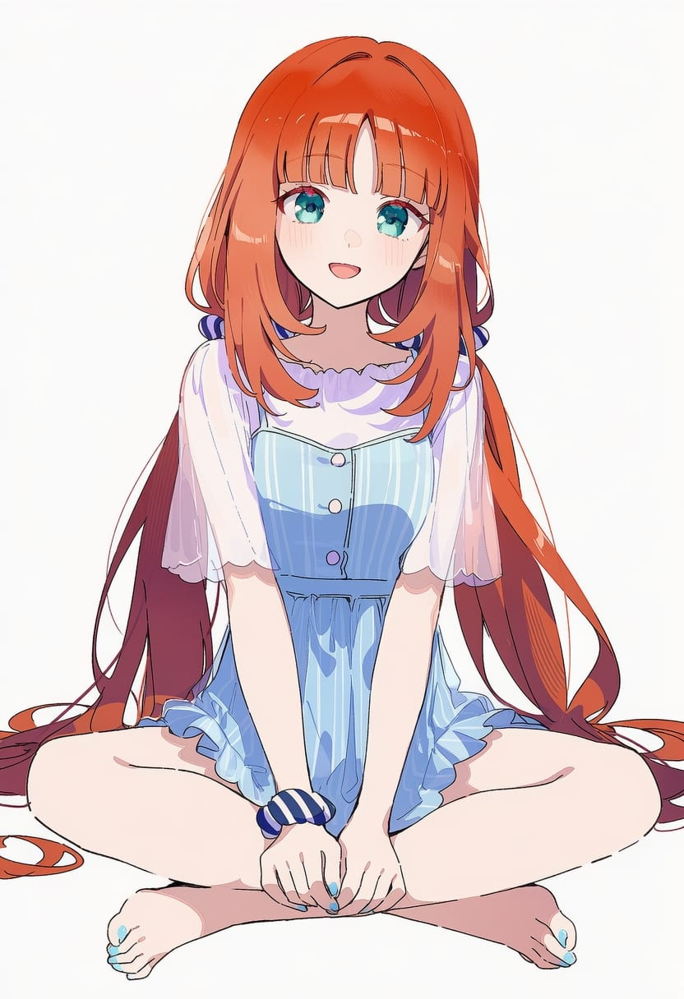

| 字段 | 内容 |
| --- | --- |
| Danbooru Tag | striped_scrunchie |
| 中文名 | 条纹发圈 |
| 中文含义 | 带条纹图案的布艺发圈。 |
| 子类 | 发圈/扎带 |
| 模特 | nilou_(genshin_impact) |
| 序号 | 0038 |

## 39. hairclip — 发夹

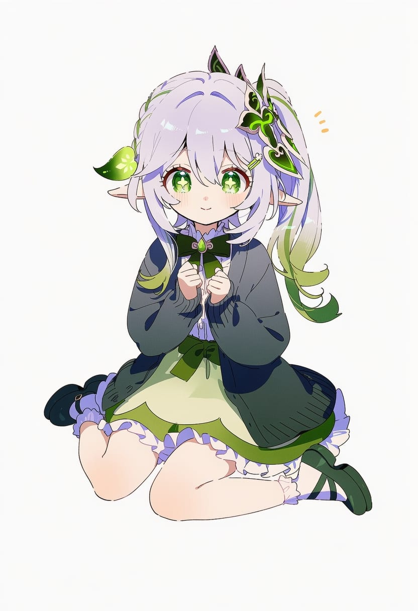

| 字段 | 内容 |
| --- | --- |
| Danbooru Tag | hairclip |
| 中文名 | 发夹 |
| 中文含义 | 夹在头发上的装饰或固定发夹。 |
| 子类 | 发夹/簪/发筒 |
| 模特 | nahida_(genshin_impact) |
| 序号 | 0039 |

## 40. hair_tubes — 发筒

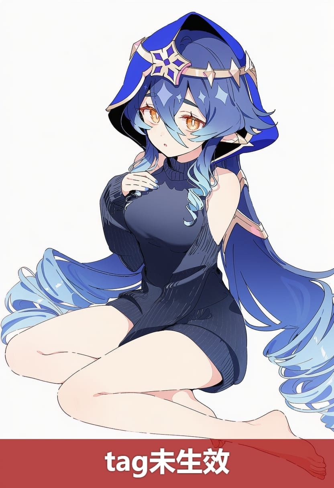

| 字段 | 内容 |
| --- | --- |
| Danbooru Tag | hair_tubes |
| 中文名 | 发筒 |
| 中文含义 | 套在发束上的筒状装饰。 |
| 子类 | 发夹/簪/发筒 |
| 模特 | layla_(genshin_impact) |
| 序号 | 0040 |

## 41. hair_stick — 发簪 / 发棒

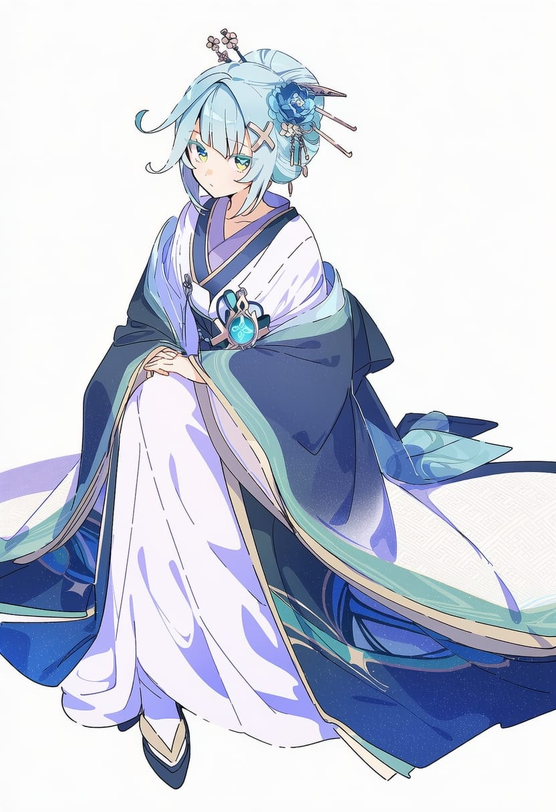

| 字段 | 内容 |
| --- | --- |
| Danbooru Tag | hair_stick |
| 中文名 | 发簪 / 发棒 |
| 中文含义 | 插在头发或发髻里的细长发饰。 |
| 子类 | 发夹/簪/发筒 |
| 模特 | faruzan_(genshin_impact) |
| 序号 | 0041 |

## 42. parallel_hairclips — 平行发夹

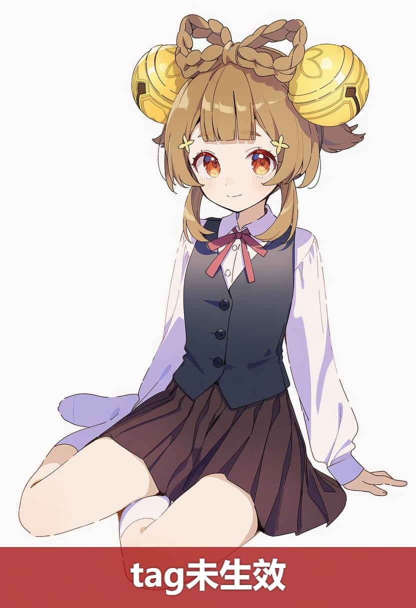

| 字段 | 内容 |
| --- | --- |
| Danbooru Tag | parallel_hairclips |
| 中文名 | 平行发夹 |
| 中文含义 | 多个发夹平行排列。 |
| 子类 | 发夹/簪/发筒 |
| 模特 | yaoyao_(genshin_impact) |
| 序号 | 0042 |

## 43. bun_cover — 发髻套

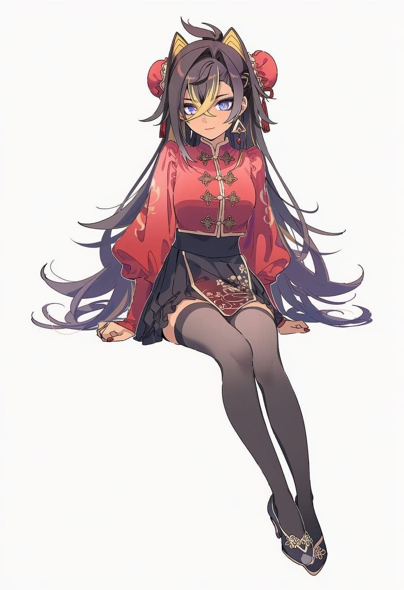

| 字段 | 内容 |
| --- | --- |
| Danbooru Tag | bun_cover |
| 中文名 | 发髻套 |
| 中文含义 | 包住丸子头或发髻的装饰套。 |
| 子类 | 发夹/簪/发筒 |
| 模特 | dehya_(genshin_impact) |
| 序号 | 0043 |

## 44. frilled_hair_tubes — 褶边发筒

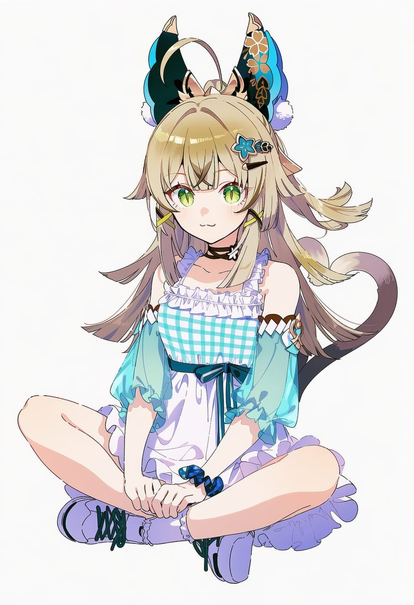

| 字段 | 内容 |
| --- | --- |
| Danbooru Tag | frilled_hair_tubes |
| 中文名 | 褶边发筒 |
| 中文含义 | 带褶边装饰的发筒。 |
| 子类 | 发夹/簪/发筒 |
| 模特 | kirara_(genshin_impact) |
| 序号 | 0044 |

## 45. hairpods — 发髻罩

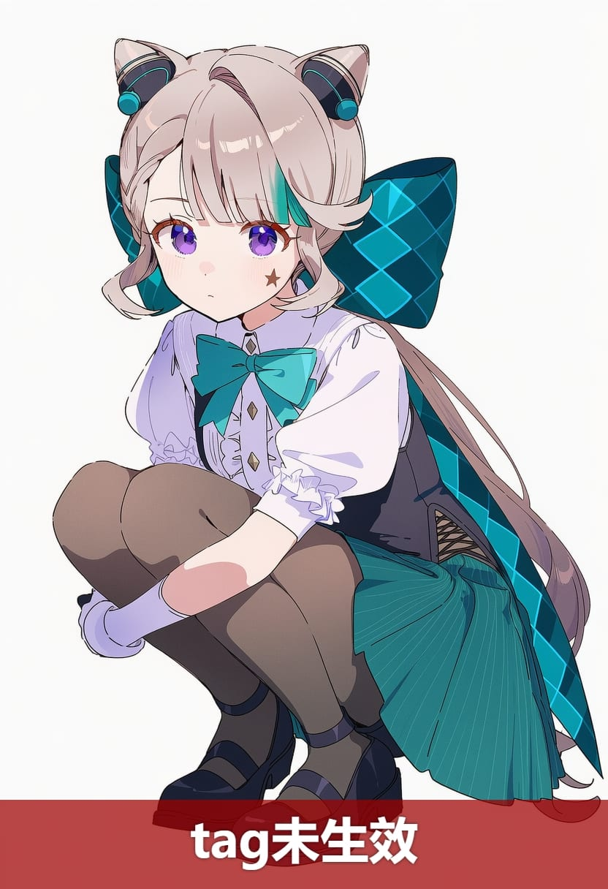

| 字段 | 内容 |
| --- | --- |
| Danbooru Tag | hairpods |
| 中文名 | 发髻罩 |
| 中文含义 | 罩在发髻外的圆形或囊状装饰。 |
| 子类 | 发夹/簪/发筒 |
| 模特 | lynette_(genshin_impact) |
| 序号 | 0045 |

## 46. multiple_hairclips — 多个发夹

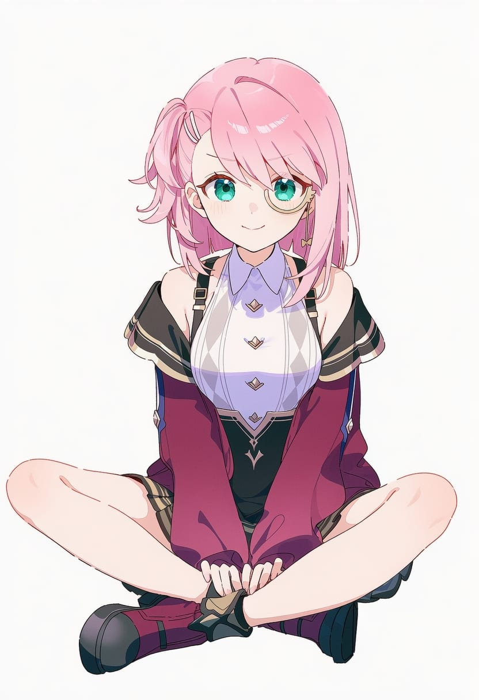

| 字段 | 内容 |
| --- | --- |
| Danbooru Tag | multiple_hairclips |
| 中文名 | 多个发夹 |
| 中文含义 | 头发上同时戴多个发夹。 |
| 子类 | 发夹/簪/发筒 |
| 模特 | charlotte_(genshin_impact) |
| 序号 | 0046 |

## 47. single_hair_tube — 单个发筒

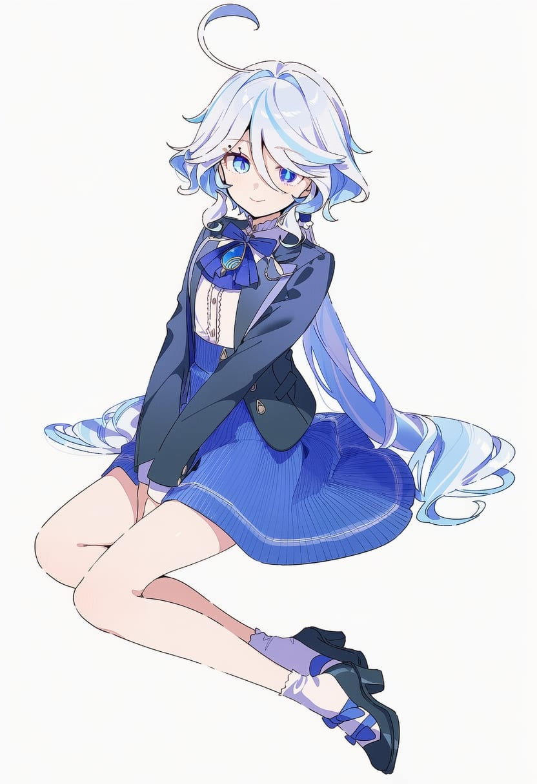

| 字段 | 内容 |
| --- | --- |
| Danbooru Tag | single_hair_tube |
| 中文名 | 单个发筒 |
| 中文含义 | 只使用一个明显的发筒。 |
| 子类 | 发夹/簪/发筒 |
| 模特 | furina_(genshin_impact) |
| 序号 | 0047 |

## 48. comb — 发梳

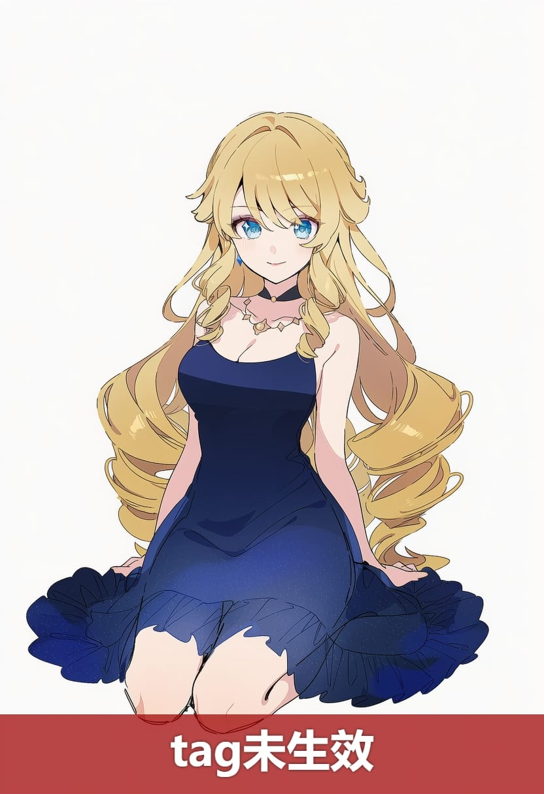

| 字段 | 内容 |
| --- | --- |
| Danbooru Tag | comb |
| 中文名 | 发梳 |
| 中文含义 | 作为头发配件使用的梳子。 |
| 子类 | 发夹/簪/发筒 |
| 模特 | navia_(genshin_impact) |
| 序号 | 0048 |

## 49. chinese_hairpin — 中式发簪

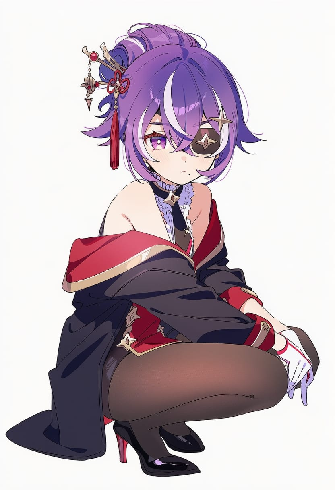

| 字段 | 内容 |
| --- | --- |
| Danbooru Tag | chinese_hairpin |
| 中文名 | 中式发簪 |
| 中文含义 | 中式传统造型的发簪。 |
| 子类 | 发夹/簪/发筒 |
| 模特 | chevreuse_(genshin_impact) |
| 序号 | 0049 |

## 50. flower_hairclip — 花朵发夹

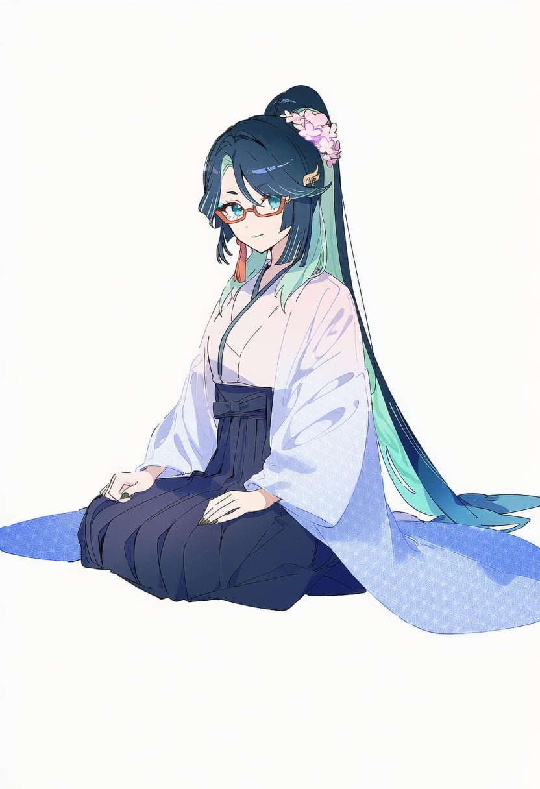

| 字段 | 内容 |
| --- | --- |
| Danbooru Tag | flower_hairclip |
| 中文名 | 花朵发夹 |
| 中文含义 | 花朵造型的发夹。 |
| 子类 | 发夹/簪/发筒 |
| 模特 | xianyun_(genshin_impact) |
| 序号 | 0050 |

## 51. metal_hair_tubes — 金属发筒

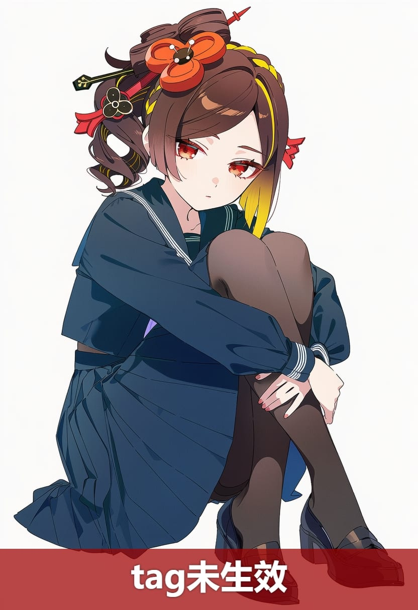

| 字段 | 内容 |
| --- | --- |
| Danbooru Tag | metal_hair_tubes |
| 中文名 | 金属发筒 |
| 中文含义 | 金属材质或金属感的发筒。 |
| 子类 | 发夹/簪/发筒 |
| 模特 | chiori_(genshin_impact) |
| 序号 | 0051 |

## 52. claw_hair_clip — 抓夹

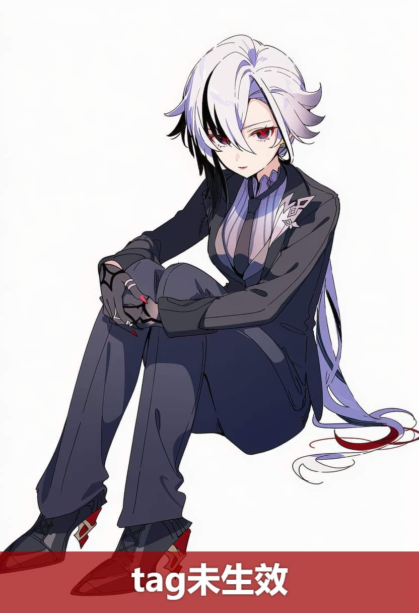

| 字段 | 内容 |
| --- | --- |
| Danbooru Tag | claw_hair_clip |
| 中文名 | 抓夹 |
| 中文含义 | 用爪状结构夹住头发的大发夹。 |
| 子类 | 发夹/簪/发筒 |
| 模特 | arlecchino_(genshin_impact) |
| 序号 | 0052 |

## 53. x_hair_ornament — X形发饰

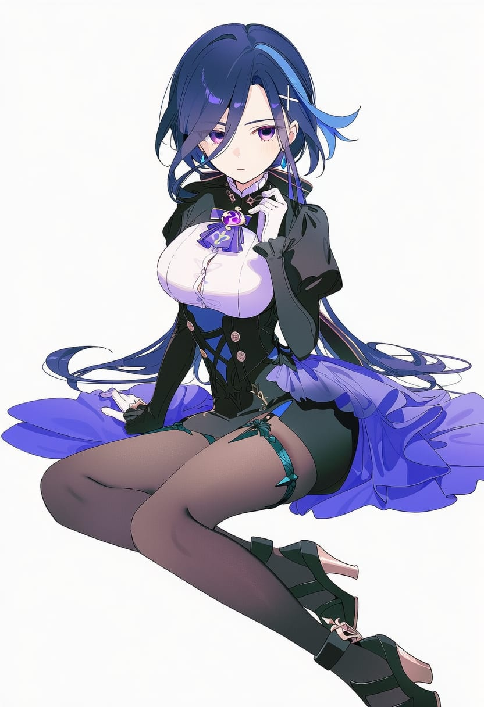

| 字段 | 内容 |
| --- | --- |
| Danbooru Tag | x_hair_ornament |
| 中文名 | X形发饰 |
| 中文含义 | X形造型的发饰。 |
| 子类 | 造型发饰 |
| 模特 | clorinde_(genshin_impact) |
| 序号 | 0053 |

## 54. star_hair_ornament — 星星发饰

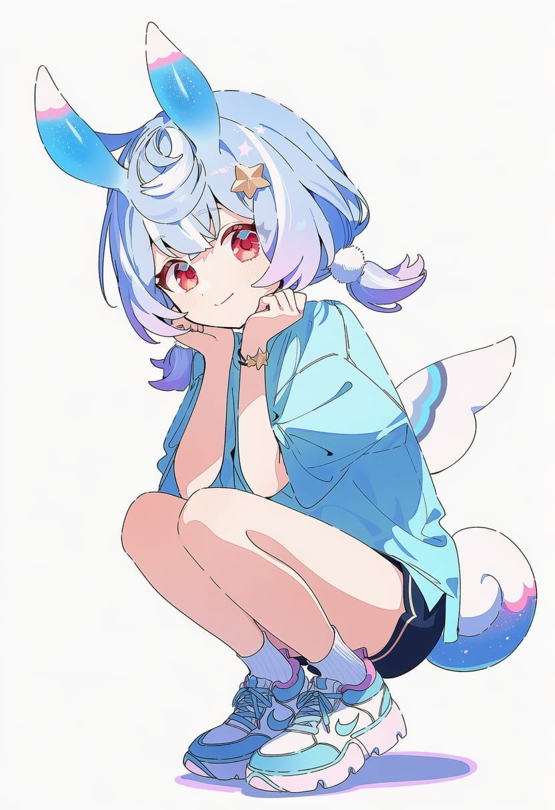

| 字段 | 内容 |
| --- | --- |
| Danbooru Tag | star_hair_ornament |
| 中文名 | 星星发饰 |
| 中文含义 | 星星造型的发饰。 |
| 子类 | 造型发饰 |
| 模特 | sigewinne_(genshin_impact) |
| 序号 | 0054 |

## 55. heart_hair_ornament — 爱心发饰

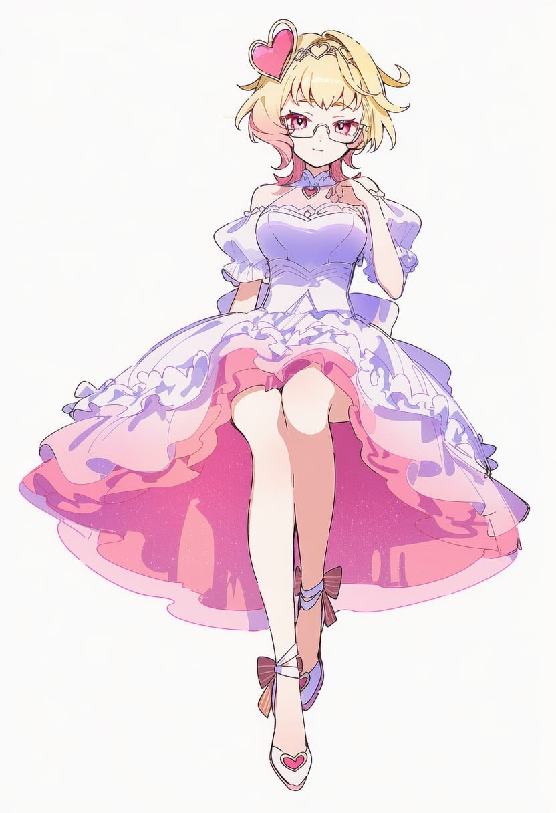

| 字段 | 内容 |
| --- | --- |
| Danbooru Tag | heart_hair_ornament |
| 中文名 | 爱心发饰 |
| 中文含义 | 爱心造型的发饰。 |
| 子类 | 造型发饰 |
| 模特 | emilie_(genshin_impact) |
| 序号 | 0055 |

## 56. butterfly_hair_ornament — 蝴蝶发饰

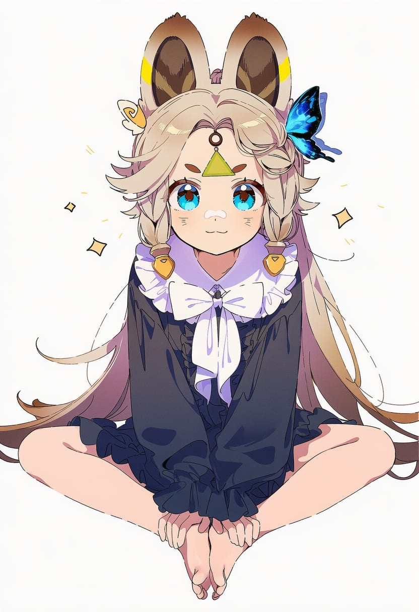

| 字段 | 内容 |
| --- | --- |
| Danbooru Tag | butterfly_hair_ornament |
| 中文名 | 蝴蝶发饰 |
| 中文含义 | 蝴蝶造型的发饰。 |
| 子类 | 造型发饰 |
| 模特 | kachina_(genshin_impact) |
| 序号 | 0056 |

## 57. food-themed_hair_ornament — 食物主题发饰

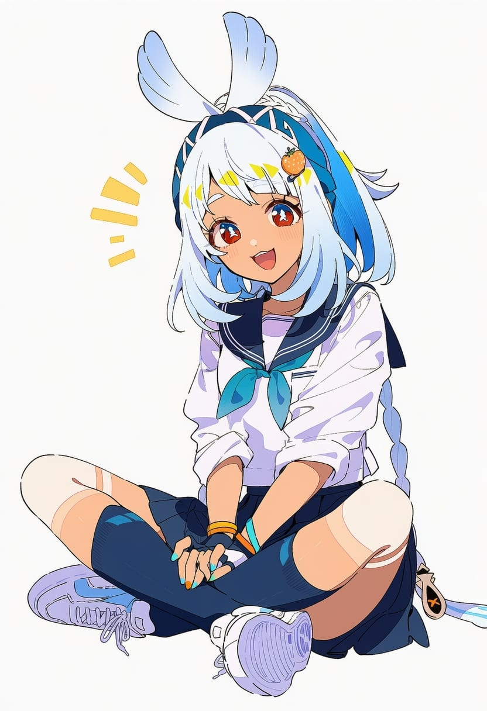

| 字段 | 内容 |
| --- | --- |
| Danbooru Tag | food-themed_hair_ornament |
| 中文名 | 食物主题发饰 |
| 中文含义 | 以食物为主题的发饰。 |
| 子类 | 造型发饰 |
| 模特 | mualani_(genshin_impact) |
| 序号 | 0057 |

## 58. feather_hair_ornament — 羽毛发饰

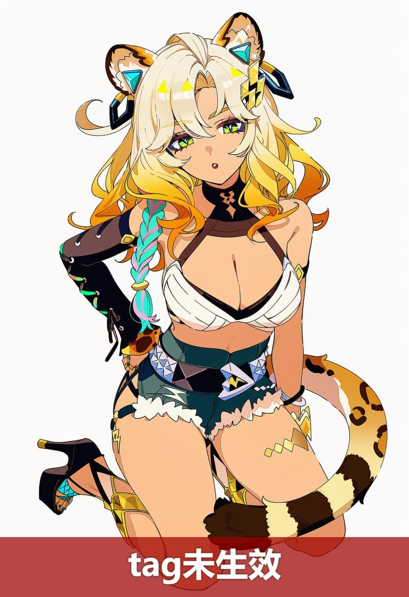

| 字段 | 内容 |
| --- | --- |
| Danbooru Tag | feather_hair_ornament |
| 中文名 | 羽毛发饰 |
| 中文含义 | 羽毛造型的发饰。 |
| 子类 | 造型发饰 |
| 模特 | xilonen_(genshin_impact) |
| 序号 | 0058 |

## 59. frog_hair_ornament — 青蛙发饰

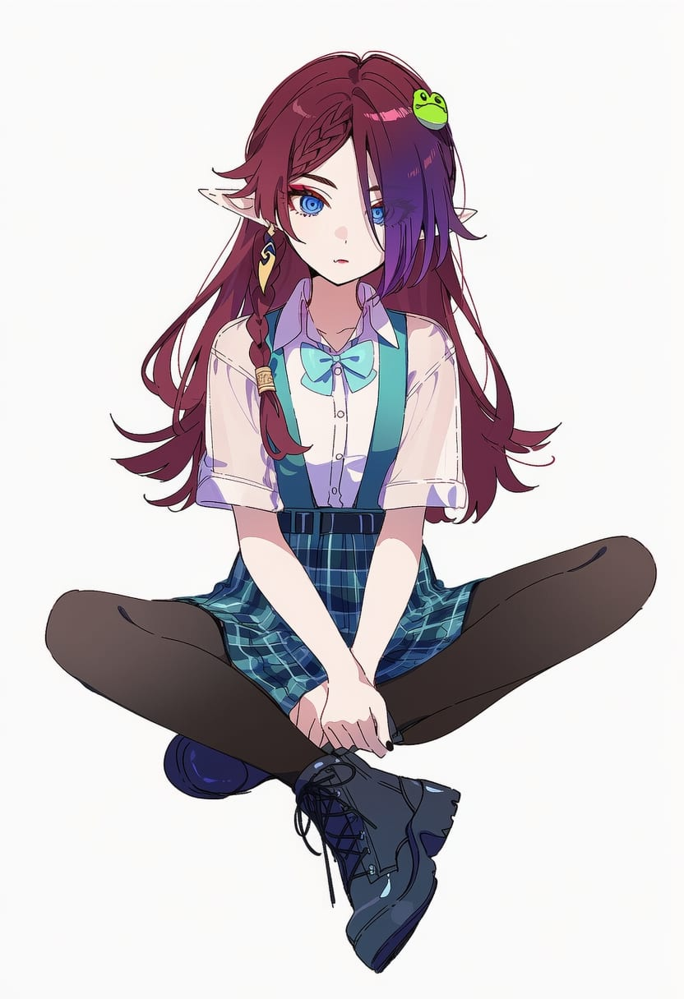

| 字段 | 内容 |
| --- | --- |
| Danbooru Tag | frog_hair_ornament |
| 中文名 | 青蛙发饰 |
| 中文含义 | 青蛙造型的发饰。 |
| 子类 | 造型发饰 |
| 模特 | chasca_(genshin_impact) |
| 序号 | 0059 |

## 60. rabbit_hair_ornament — 兔子发饰

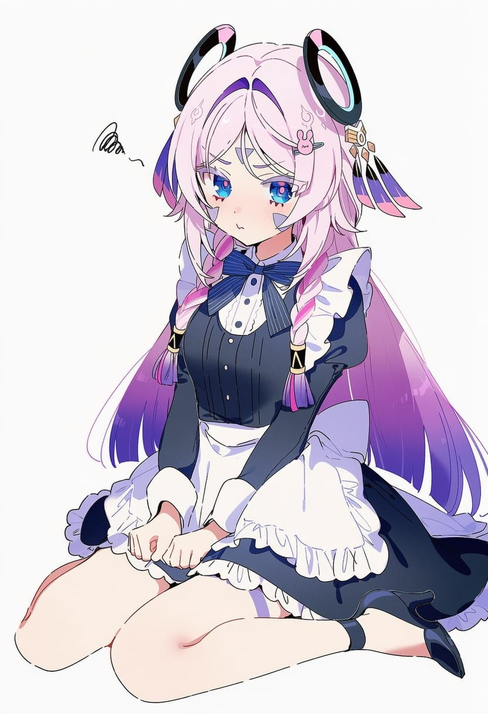

| 字段 | 内容 |
| --- | --- |
| Danbooru Tag | rabbit_hair_ornament |
| 中文名 | 兔子发饰 |
| 中文含义 | 兔子造型的发饰。 |
| 子类 | 造型发饰 |
| 模特 | citlali_(genshin_impact) |
| 序号 | 0060 |

## 61. leaf_hair_ornament — 叶子发饰

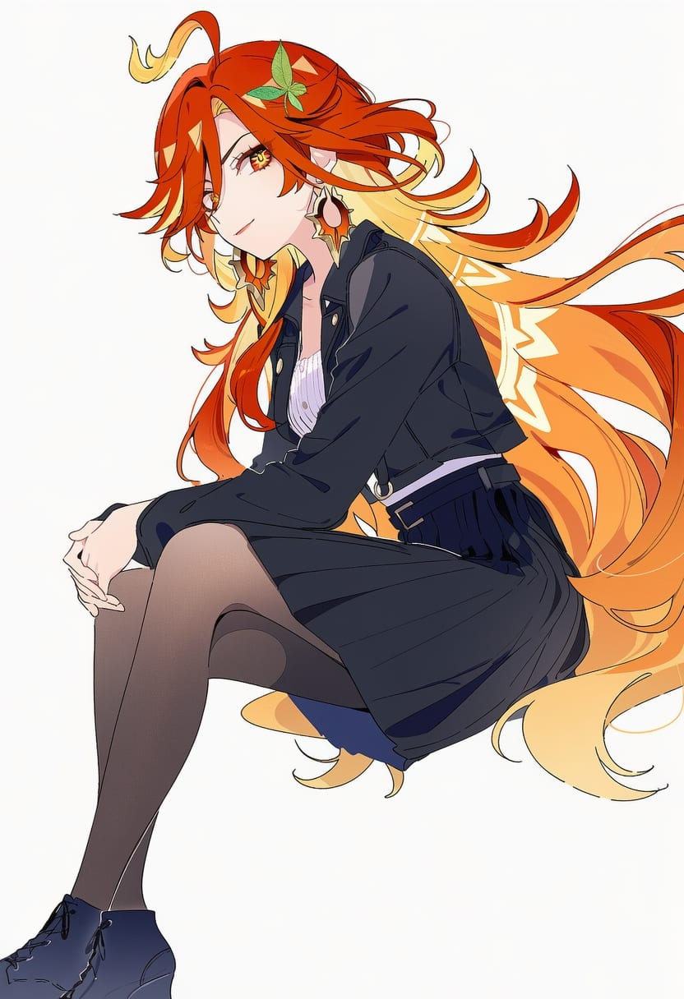

| 字段 | 内容 |
| --- | --- |
| Danbooru Tag | leaf_hair_ornament |
| 中文名 | 叶子发饰 |
| 中文含义 | 叶子造型的发饰。 |
| 子类 | 造型发饰 |
| 模特 | mavuika_(genshin_impact) |
| 序号 | 0061 |

## 62. cross_hair_ornament — 十字发饰

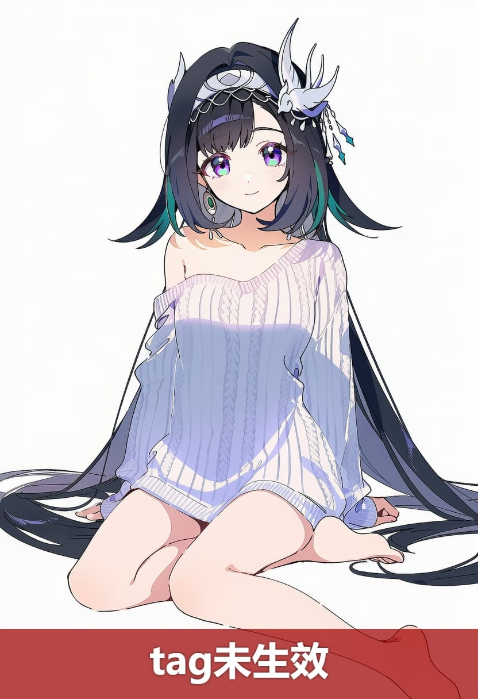

| 字段 | 内容 |
| --- | --- |
| Danbooru Tag | cross_hair_ornament |
| 中文名 | 十字发饰 |
| 中文含义 | 十字造型的发饰。 |
| 子类 | 造型发饰 |
| 模特 | lan_yan_(genshin_impact) |
| 序号 | 0062 |

## 63. snake_hair_ornament — 蛇发饰

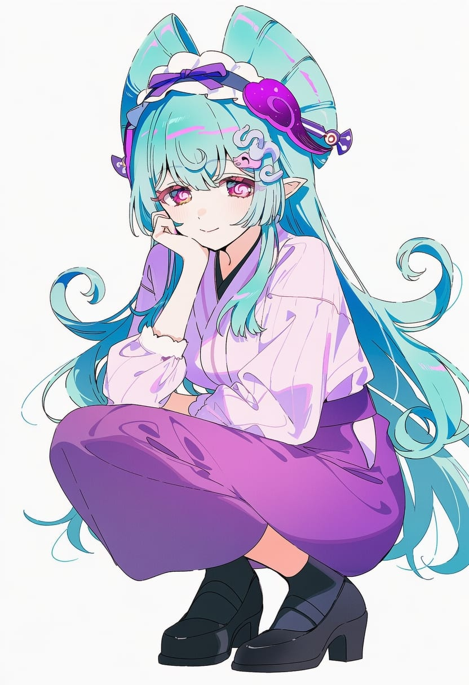

| 字段 | 内容 |
| --- | --- |
| Danbooru Tag | snake_hair_ornament |
| 中文名 | 蛇发饰 |
| 中文含义 | 蛇造型的发饰。 |
| 子类 | 造型发饰 |
| 模特 | yumemizuki_mizuki |
| 序号 | 0063 |

## 64. crescent_hair_ornament — 月牙发饰

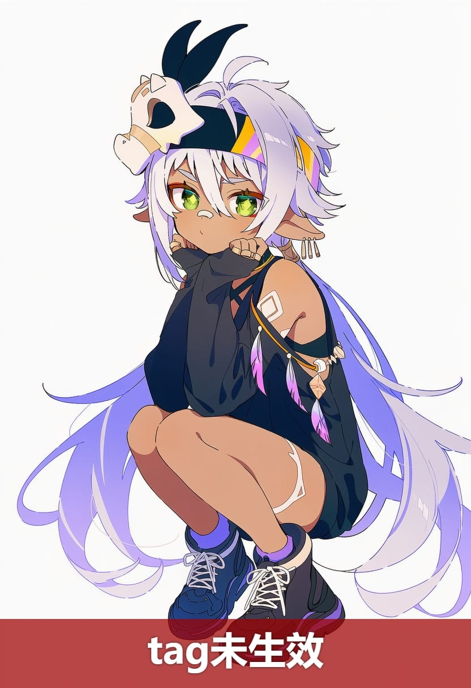

| 字段 | 内容 |
| --- | --- |
| Danbooru Tag | crescent_hair_ornament |
| 中文名 | 月牙发饰 |
| 中文含义 | 月牙造型的发饰。 |
| 子类 | 造型发饰 |
| 模特 | iansan_(genshin_impact) |
| 序号 | 0064 |

## 65. sphere_hair_ornament — 球形发饰

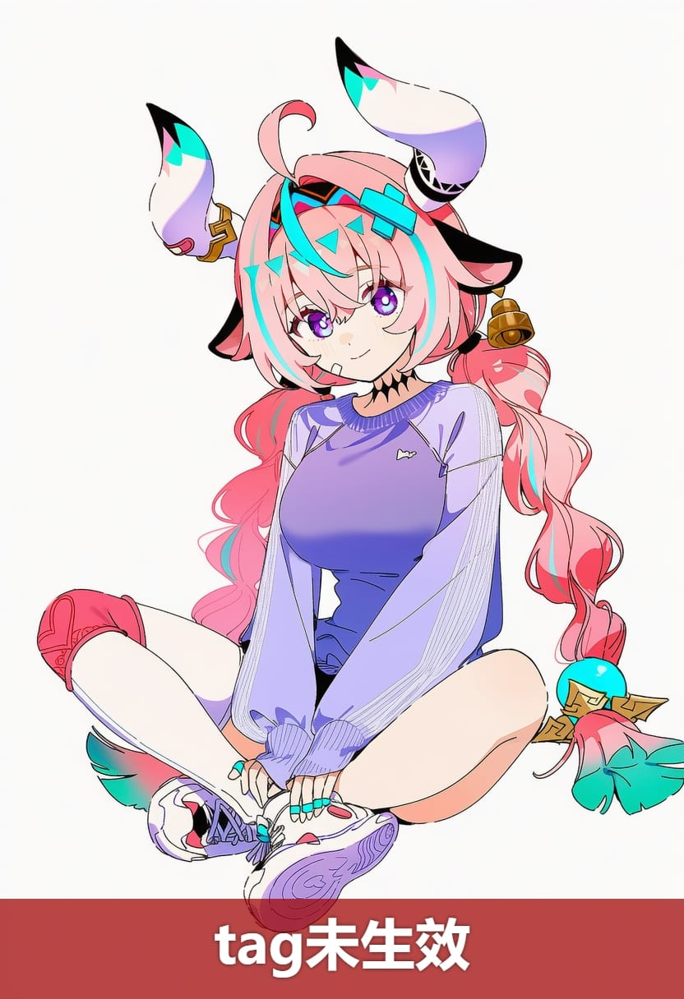

| 字段 | 内容 |
| --- | --- |
| Danbooru Tag | sphere_hair_ornament |
| 中文名 | 球形发饰 |
| 中文含义 | 球形造型的发饰。 |
| 子类 | 造型发饰 |
| 模特 | varesa_(genshin_impact) |
| 序号 | 0065 |

## 66. cube_hair_ornament — 立方体发饰

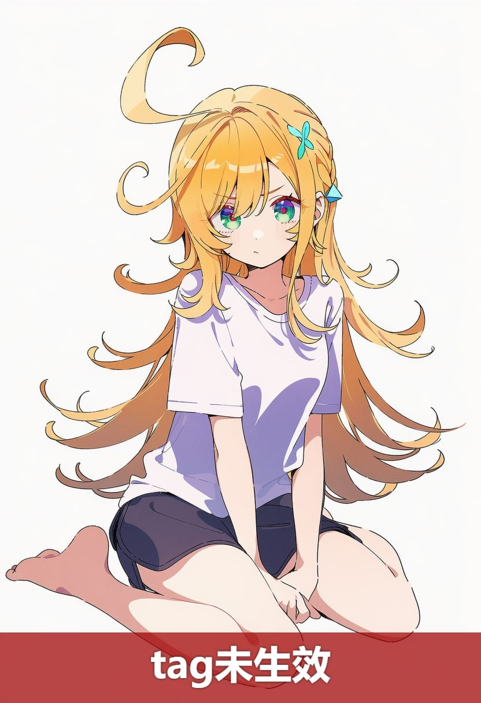

| 字段 | 内容 |
| --- | --- |
| Danbooru Tag | cube_hair_ornament |
| 中文名 | 立方体发饰 |
| 中文含义 | 立方体造型的发饰。 |
| 子类 | 造型发饰 |
| 模特 | escoffier_(genshin_impact) |
| 序号 | 0066 |

## 67. wing_hair_ornament — 翅膀发饰

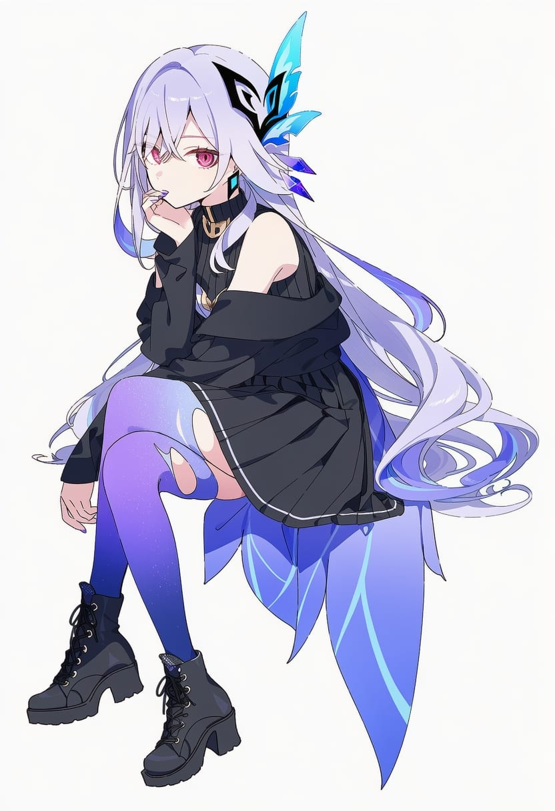

| 字段 | 内容 |
| --- | --- |
| Danbooru Tag | wing_hair_ornament |
| 中文名 | 翅膀发饰 |
| 中文含义 | 翅膀造型的发饰。 |
| 子类 | 造型发饰 |
| 模特 | skirk_(genshin_impact) |
| 序号 | 0067 |

## 68. skull_hair_ornament — 骷髅发饰

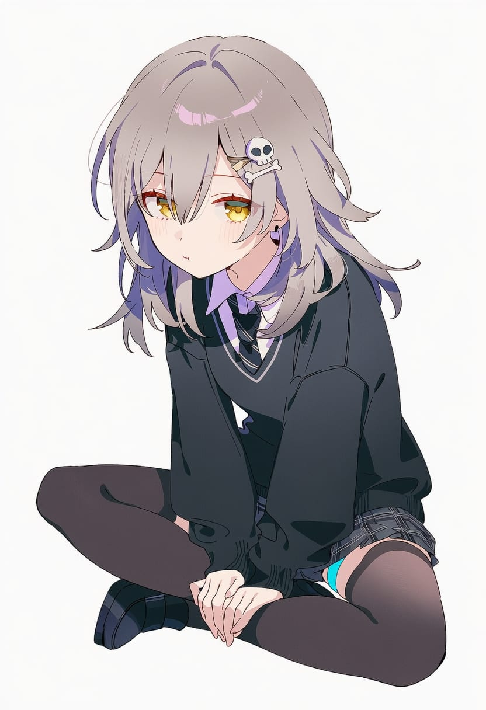

| 字段 | 内容 |
| --- | --- |
| Danbooru Tag | skull_hair_ornament |
| 中文名 | 骷髅发饰 |
| 中文含义 | 骷髅造型的发饰。 |
| 子类 | 造型发饰 |
| 模特 | stelle_(honkai:_star_rail) |
| 序号 | 0068 |

## 69. tassel_hair_ornament — 流苏发饰

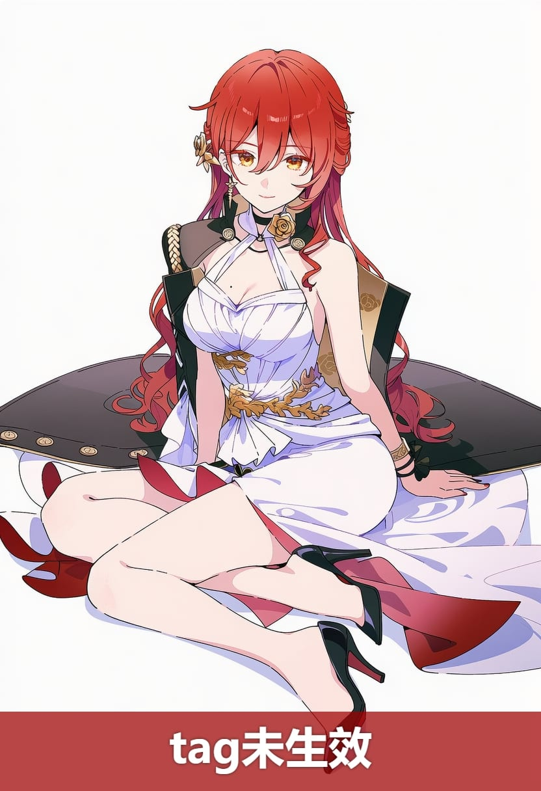

| 字段 | 内容 |
| --- | --- |
| Danbooru Tag | tassel_hair_ornament |
| 中文名 | 流苏发饰 |
| 中文含义 | 流苏造型的发饰。 |
| 子类 | 造型发饰 |
| 模特 | himeko_(honkai:_star_rail) |
| 序号 | 0069 |

## 70. pom_pom_hair_ornament — 毛球发饰

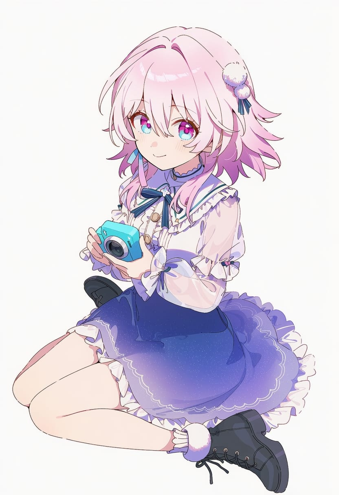

| 字段 | 内容 |
| --- | --- |
| Danbooru Tag | pom_pom_hair_ornament |
| 中文名 | 毛球发饰 |
| 中文含义 | 毛球造型的发饰。 |
| 子类 | 造型发饰 |
| 模特 | march_7th_(honkai:_star_rail) |
| 序号 | 0070 |

## 71. cat_hair_ornament — 猫发饰

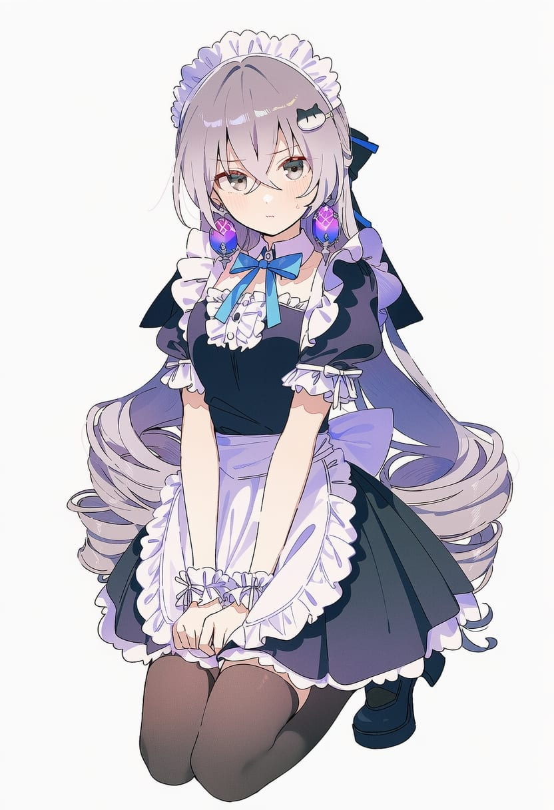

| 字段 | 内容 |
| --- | --- |
| Danbooru Tag | cat_hair_ornament |
| 中文名 | 猫发饰 |
| 中文含义 | 猫造型的发饰。 |
| 子类 | 造型发饰 |
| 模特 | bronya_rand |
| 序号 | 0071 |

## 72. musical_note_hair_ornament — 音符发饰

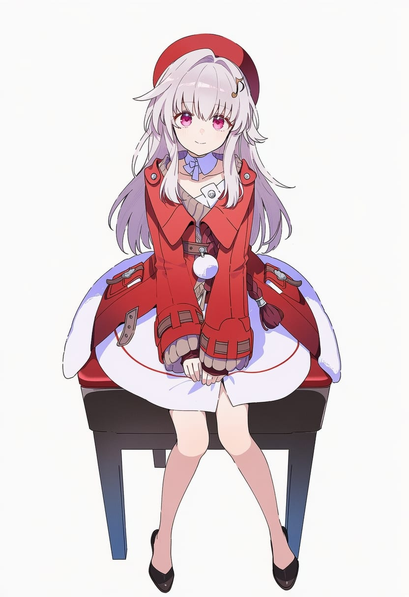

| 字段 | 内容 |
| --- | --- |
| Danbooru Tag | musical_note_hair_ornament |
| 中文名 | 音符发饰 |
| 中文含义 | 音符造型的发饰。 |
| 子类 | 造型发饰 |
| 模特 | clara_(honkai:_star_rail) |
| 序号 | 0072 |

## 73. anchor_hair_ornament — 船锚发饰

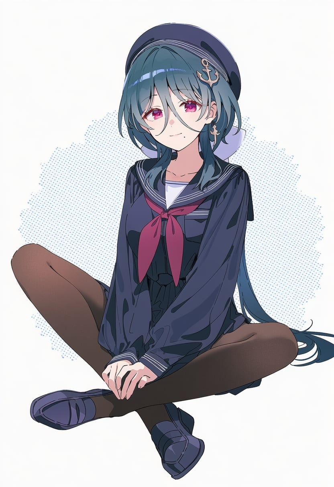

| 字段 | 内容 |
| --- | --- |
| Danbooru Tag | anchor_hair_ornament |
| 中文名 | 船锚发饰 |
| 中文含义 | 船锚造型的发饰。 |
| 子类 | 造型发饰 |
| 模特 | natasha_(honkai:_star_rail) |
| 序号 | 0073 |

## 74. triangle_hair_ornament — 三角形发饰

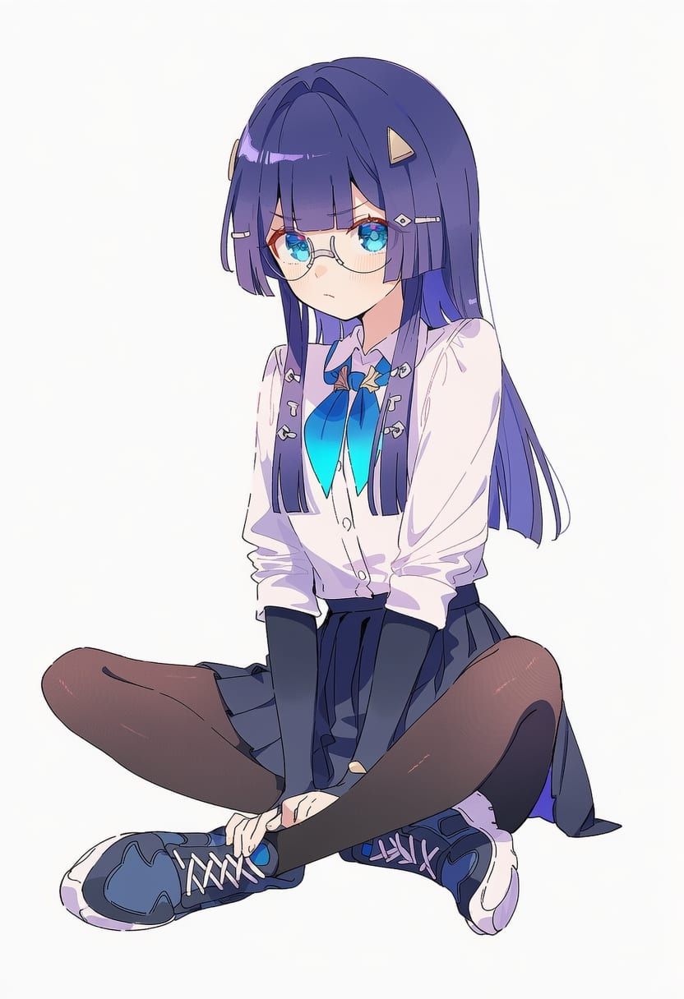

| 字段 | 内容 |
| --- | --- |
| Danbooru Tag | triangle_hair_ornament |
| 中文名 | 三角形发饰 |
| 中文含义 | 三角形造型的发饰。 |
| 子类 | 造型发饰 |
| 模特 | pela_(honkai:_star_rail) |
| 序号 | 0074 |

## 75. carrot_hair_ornament — 胡萝卜发饰

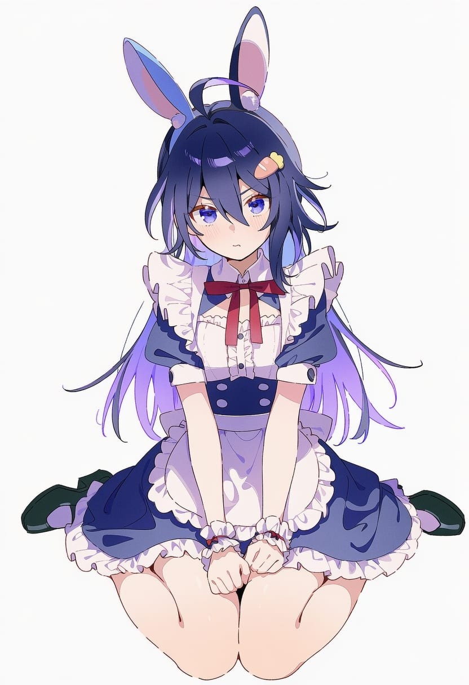

| 字段 | 内容 |
| --- | --- |
| Danbooru Tag | carrot_hair_ornament |
| 中文名 | 胡萝卜发饰 |
| 中文含义 | 胡萝卜造型的发饰。 |
| 子类 | 造型发饰 |
| 模特 | seele_(honkai:_star_rail) |
| 序号 | 0075 |

## 76. bone_hair_ornament — 骨头发饰

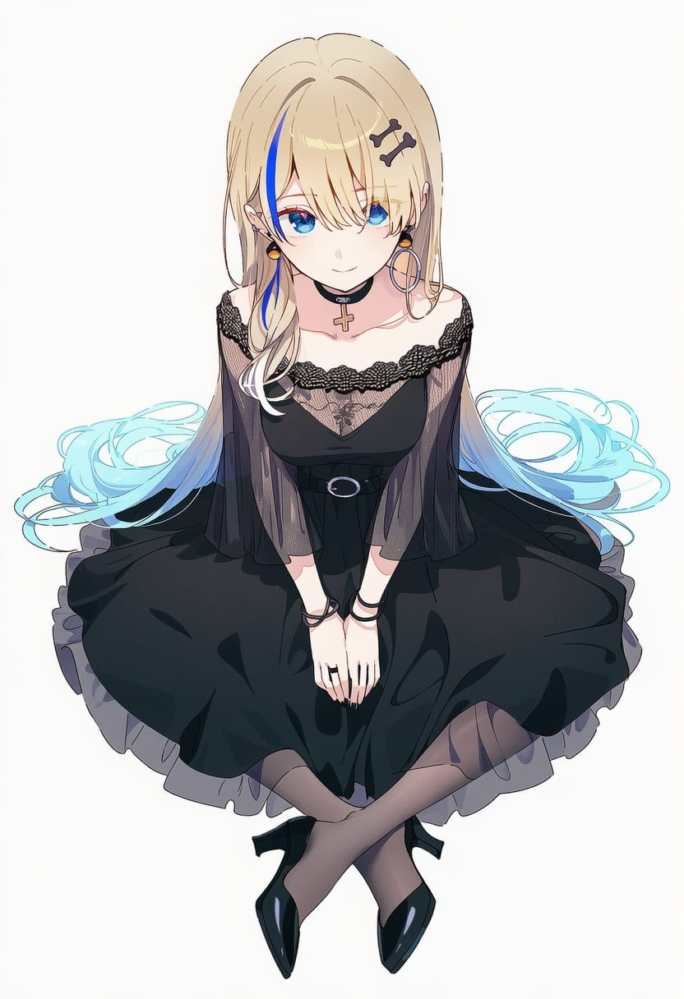

| 字段 | 内容 |
| --- | --- |
| Danbooru Tag | bone_hair_ornament |
| 中文名 | 骨头发饰 |
| 中文含义 | 骨头造型的发饰。 |
| 子类 | 造型发饰 |
| 模特 | serval_landau |
| 序号 | 0076 |

## 77. clover_hair_ornament — 三叶草发饰

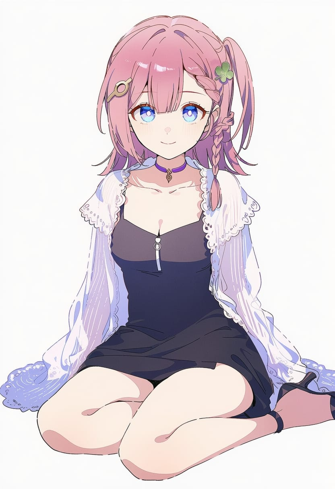

| 字段 | 内容 |
| --- | --- |
| Danbooru Tag | clover_hair_ornament |
| 中文名 | 三叶草发饰 |
| 中文含义 | 三叶草造型的发饰。 |
| 子类 | 造型发饰 |
| 模特 | asta_(honkai:_star_rail) |
| 序号 | 0077 |

## 78. bandaid_hair_ornament — 创可贴发饰

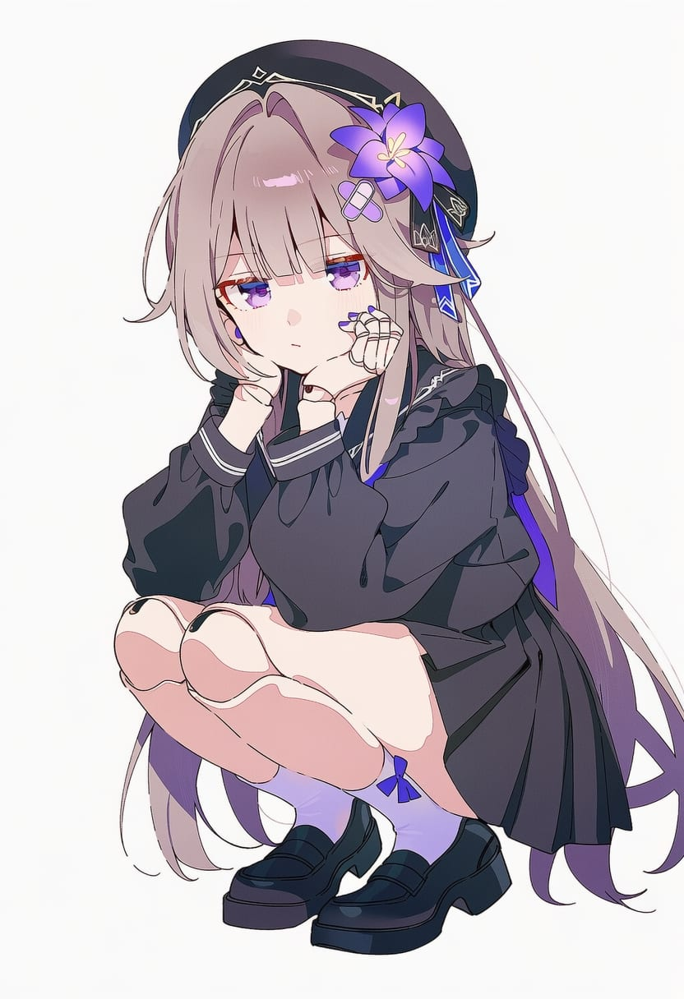

| 字段 | 内容 |
| --- | --- |
| Danbooru Tag | bandaid_hair_ornament |
| 中文名 | 创可贴发饰 |
| 中文含义 | 创可贴造型的发饰。 |
| 子类 | 造型发饰 |
| 模特 | herta_(honkai:_star_rail) |
| 序号 | 0078 |

## 79. shark_hair_ornament — 鲨鱼发饰

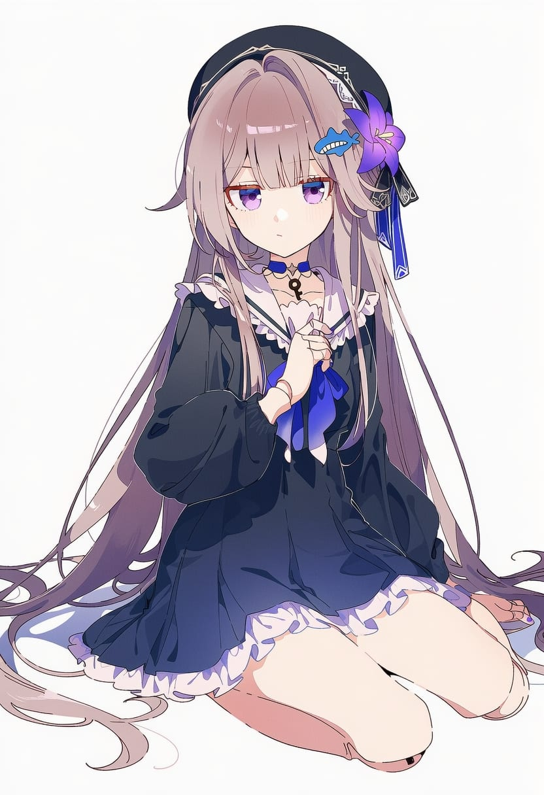

| 字段 | 内容 |
| --- | --- |
| Danbooru Tag | shark_hair_ornament |
| 中文名 | 鲨鱼发饰 |
| 中文含义 | 鲨鱼造型的发饰。 |
| 子类 | 造型发饰 |
| 模特 | herta_(puppet)_(honkai:_star_rail) |
| 序号 | 0079 |

## 80. bat_hair_ornament — 蝙蝠发饰

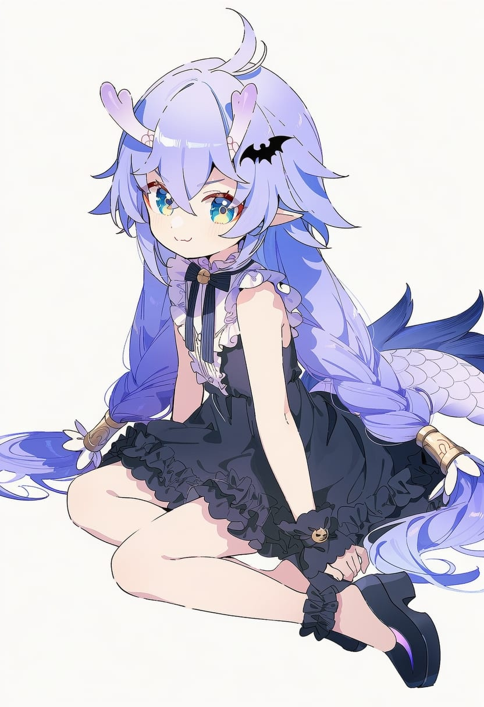

| 字段 | 内容 |
| --- | --- |
| Danbooru Tag | bat_hair_ornament |
| 中文名 | 蝙蝠发饰 |
| 中文含义 | 蝙蝠造型的发饰。 |
| 子类 | 造型发饰 |
| 模特 | bailu_(honkai:_star_rail) |
| 序号 | 0080 |

## 81. character_hair_ornament — 角色造型发饰

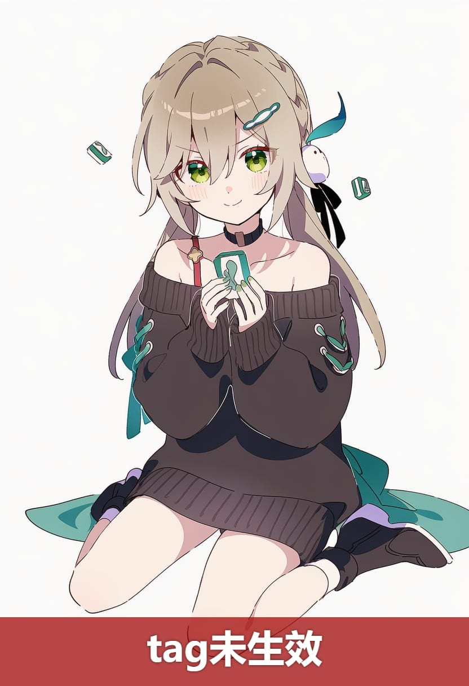

| 字段 | 内容 |
| --- | --- |
| Danbooru Tag | character_hair_ornament |
| 中文名 | 角色造型发饰 |
| 中文含义 | 做成角色或角色头像造型的发饰。 |
| 子类 | 造型发饰 |
| 模特 | qingque_(honkai:_star_rail) |
| 序号 | 0081 |

## 82. fish_hair_ornament — 鱼发饰

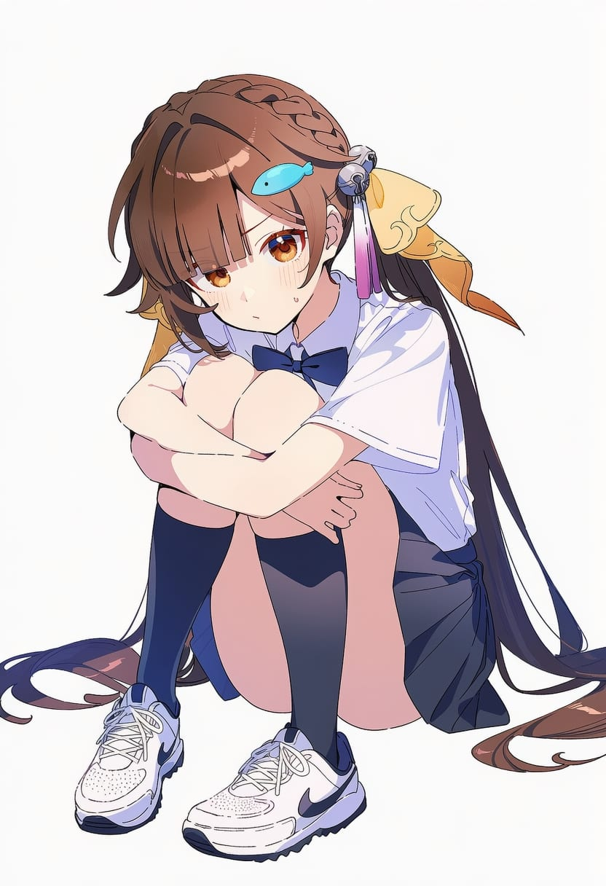

| 字段 | 内容 |
| --- | --- |
| Danbooru Tag | fish_hair_ornament |
| 中文名 | 鱼发饰 |
| 中文含义 | 鱼造型的发饰。 |
| 子类 | 造型发饰 |
| 模特 | sushang_(honkai:_star_rail) |
| 序号 | 0082 |

## 83. snowflake_hair_ornament — 雪花发饰

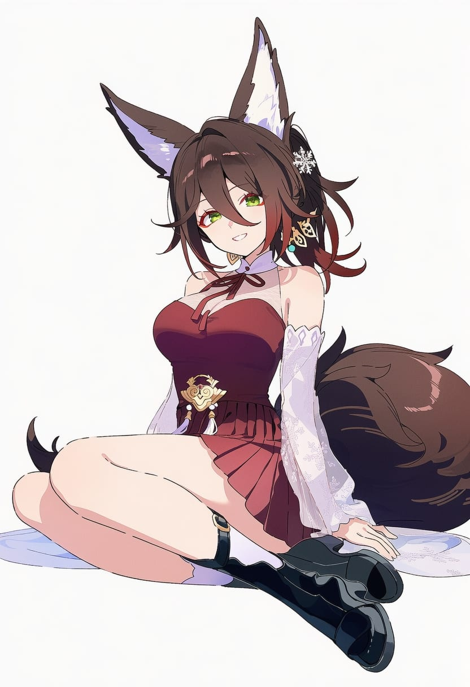

| 字段 | 内容 |
| --- | --- |
| Danbooru Tag | snowflake_hair_ornament |
| 中文名 | 雪花发饰 |
| 中文含义 | 雪花造型的发饰。 |
| 子类 | 造型发饰 |
| 模特 | tingyun_(honkai:_star_rail) |
| 序号 | 0083 |

## 84. bear_hair_ornament — 熊发饰

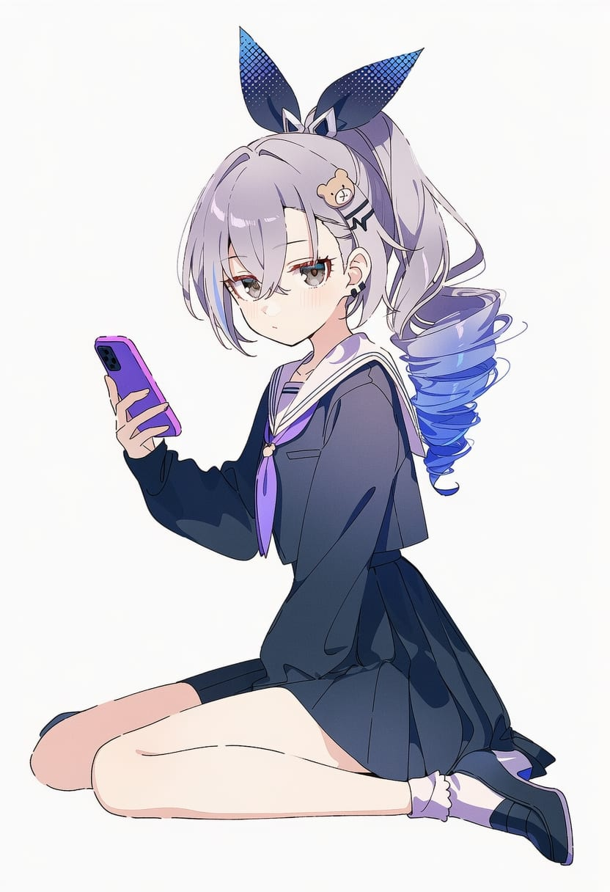

| 字段 | 内容 |
| --- | --- |
| Danbooru Tag | bear_hair_ornament |
| 中文名 | 熊发饰 |
| 中文含义 | 熊造型的发饰。 |
| 子类 | 造型发饰 |
| 模特 | silver_wolf_(honkai:_star_rail) |
| 序号 | 0084 |

## 85. letter_hair_ornament — 字母发饰

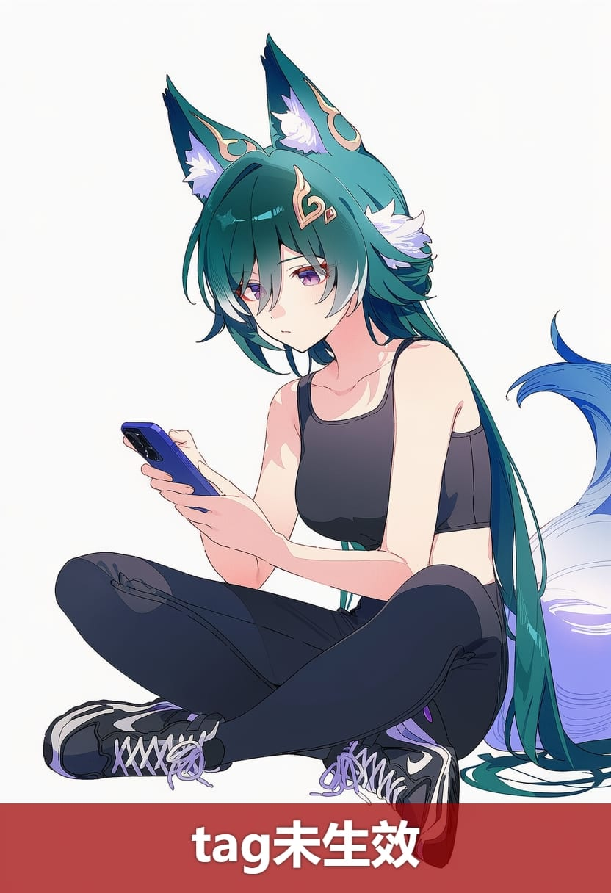

| 字段 | 内容 |
| --- | --- |
| Danbooru Tag | letter_hair_ornament |
| 中文名 | 字母发饰 |
| 中文含义 | 字母造型的发饰。 |
| 子类 | 造型发饰 |
| 模特 | yukong_(honkai:_star_rail) |
| 序号 | 0085 |

## 86. sunflower_hair_ornament — 向日葵发饰

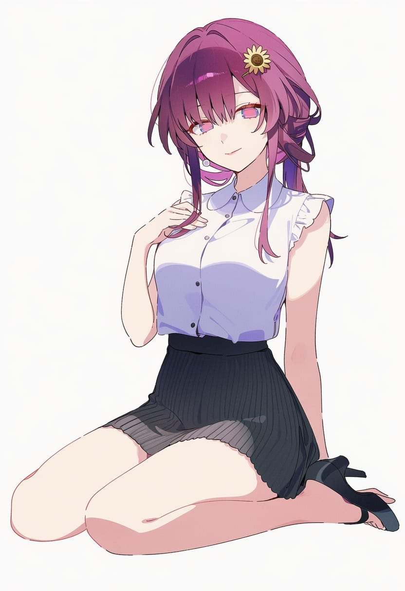

| 字段 | 内容 |
| --- | --- |
| Danbooru Tag | sunflower_hair_ornament |
| 中文名 | 向日葵发饰 |
| 中文含义 | 向日葵造型的发饰。 |
| 子类 | 造型发饰 |
| 模特 | kafka_(honkai:_star_rail) |
| 序号 | 0086 |

## 87. d-pad_hair_ornament — 十字键发饰

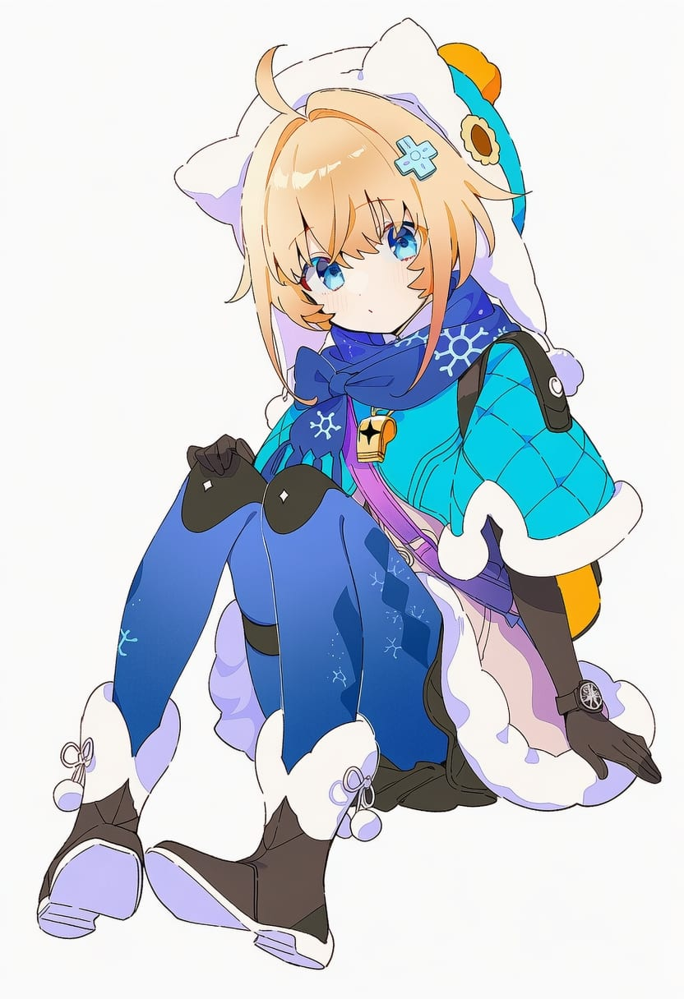

| 字段 | 内容 |
| --- | --- |
| Danbooru Tag | d-pad_hair_ornament |
| 中文名 | 十字键发饰 |
| 中文含义 | 十字键造型的发饰。 |
| 子类 | 造型发饰 |
| 模特 | lynx_landau |
| 序号 | 0087 |

## 88. ring_hair_ornament — 圆环发饰

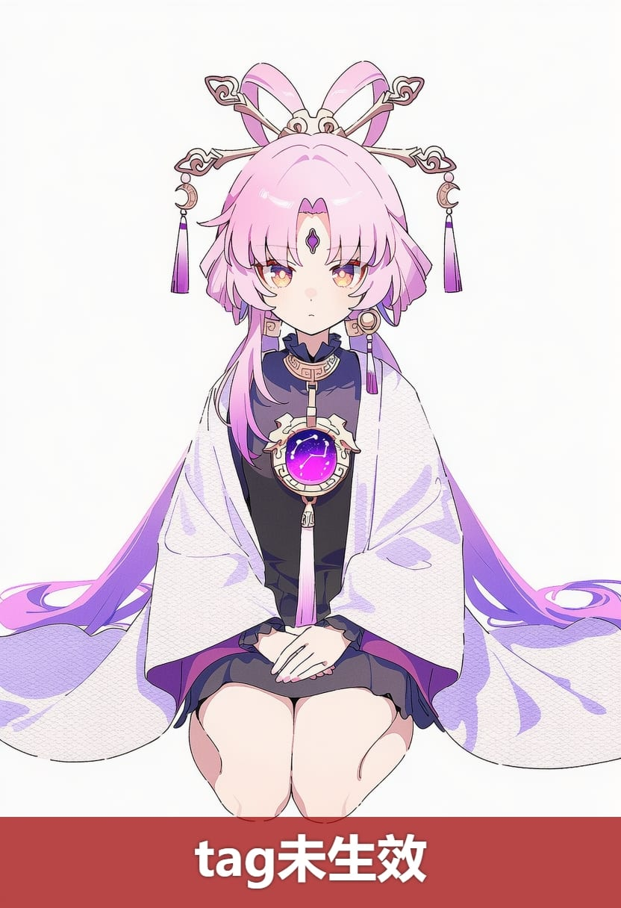

| 字段 | 内容 |
| --- | --- |
| Danbooru Tag | ring_hair_ornament |
| 中文名 | 圆环发饰 |
| 中文含义 | 圆环造型的发饰。 |
| 子类 | 造型发饰 |
| 模特 | fu_xuan_(honkai:_star_rail) |
| 序号 | 0088 |

## 89. diamond_hair_ornament — 菱形发饰

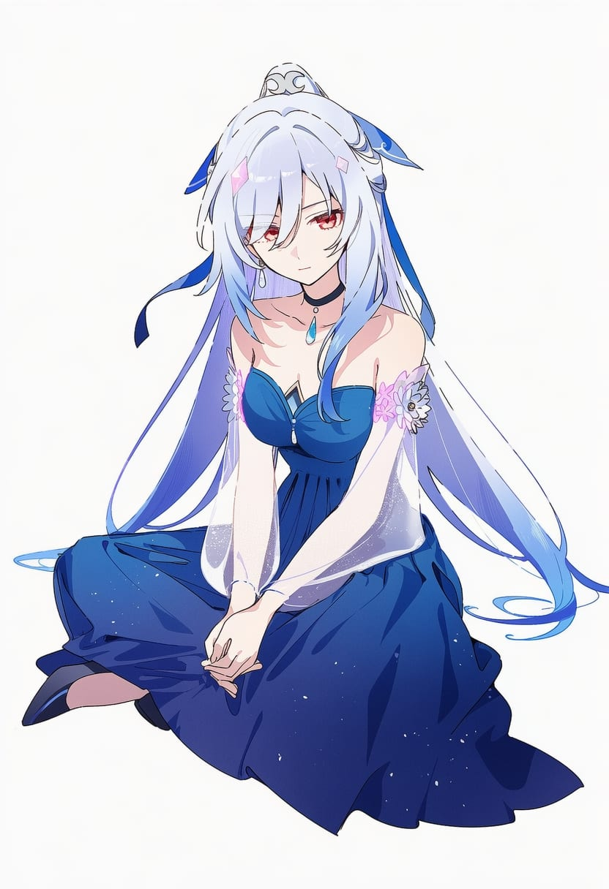

| 字段 | 内容 |
| --- | --- |
| Danbooru Tag | diamond_hair_ornament |
| 中文名 | 菱形发饰 |
| 中文含义 | 菱形造型的发饰。 |
| 子类 | 造型发饰 |
| 模特 | jingliu_(honkai:_star_rail) |
| 序号 | 0089 |

## 90. strawberry_hair_ornament — 草莓发饰

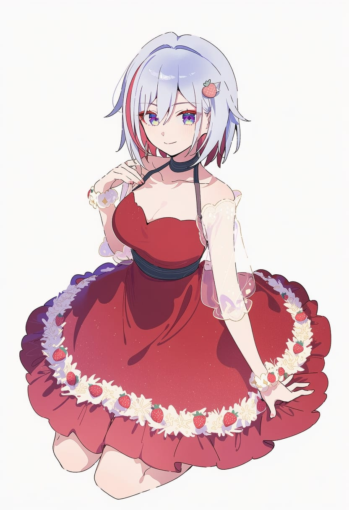

| 字段 | 内容 |
| --- | --- |
| Danbooru Tag | strawberry_hair_ornament |
| 中文名 | 草莓发饰 |
| 中文含义 | 草莓造型的发饰。 |
| 子类 | 造型发饰 |
| 模特 | topaz_(honkai:_star_rail) |
| 序号 | 0090 |

## 91. pearl_hair_ornament — 珍珠发饰

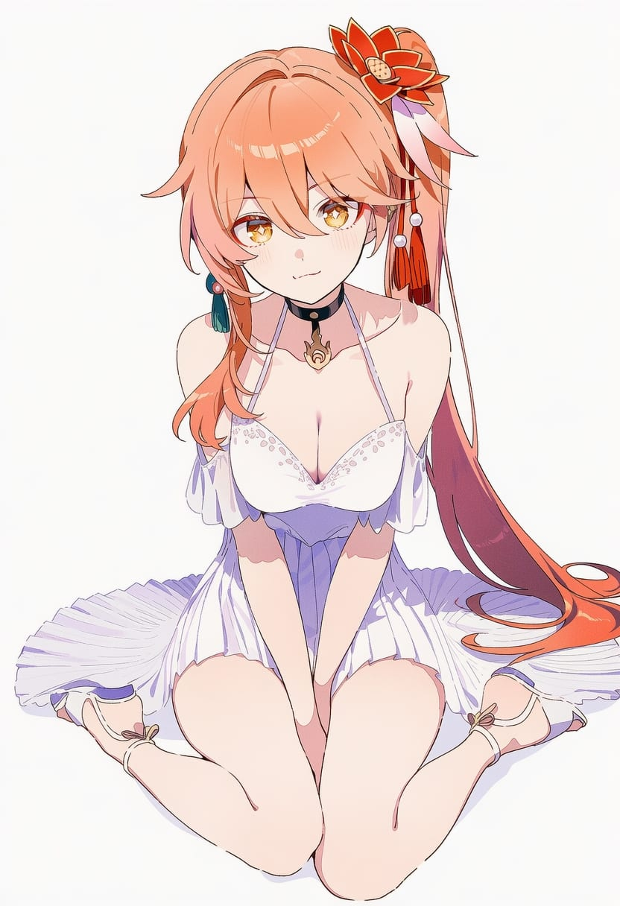

| 字段 | 内容 |
| --- | --- |
| Danbooru Tag | pearl_hair_ornament |
| 中文名 | 珍珠发饰 |
| 中文含义 | 珍珠造型的发饰。 |
| 子类 | 造型发饰 |
| 模特 | guinaifen_(honkai:_star_rail) |
| 序号 | 0091 |

## 92. candy_hair_ornament — 糖果发饰

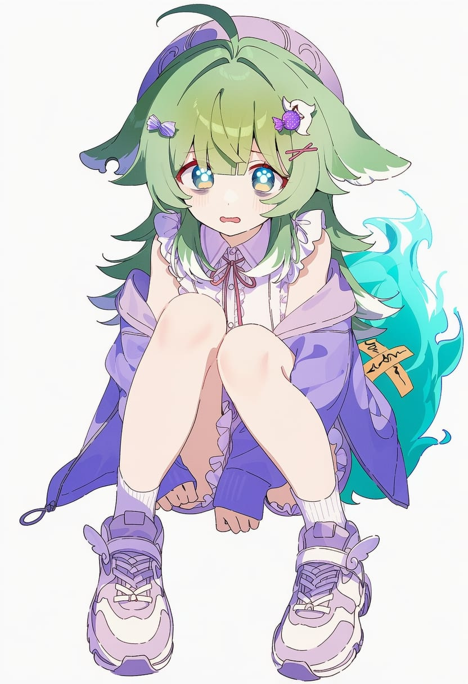

| 字段 | 内容 |
| --- | --- |
| Danbooru Tag | candy_hair_ornament |
| 中文名 | 糖果发饰 |
| 中文含义 | 糖果造型的发饰。 |
| 子类 | 造型发饰 |
| 模特 | huohuo_(honkai:_star_rail) |
| 序号 | 0092 |

## 93. cherry_hair_ornament — 樱桃发饰

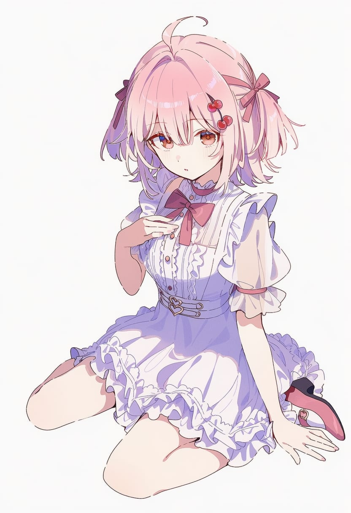

| 字段 | 内容 |
| --- | --- |
| Danbooru Tag | cherry_hair_ornament |
| 中文名 | 樱桃发饰 |
| 中文含义 | 樱桃造型的发饰。 |
| 子类 | 造型发饰 |
| 模特 | hanya_(honkai:_star_rail) |
| 序号 | 0093 |

## 94. dice_hair_ornament — 骰子发饰

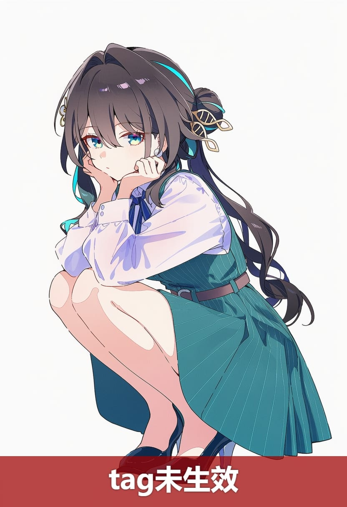

| 字段 | 内容 |
| --- | --- |
| Danbooru Tag | dice_hair_ornament |
| 中文名 | 骰子发饰 |
| 中文含义 | 骰子造型的发饰。 |
| 子类 | 造型发饰 |
| 模特 | ruan_mei_(honkai:_star_rail) |
| 序号 | 0094 |

## 95. shell_hair_ornament — 贝壳发饰

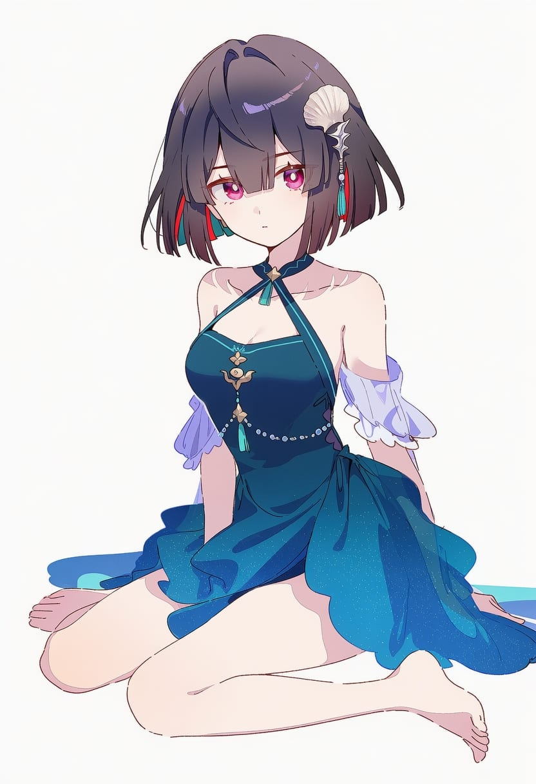

| 字段 | 内容 |
| --- | --- |
| Danbooru Tag | shell_hair_ornament |
| 中文名 | 贝壳发饰 |
| 中文含义 | 贝壳造型的发饰。 |
| 子类 | 造型发饰 |
| 模特 | xueyi_(honkai:_star_rail) |
| 序号 | 0095 |

## 96. four-leaf_clover_hair_ornament — 四叶草发饰

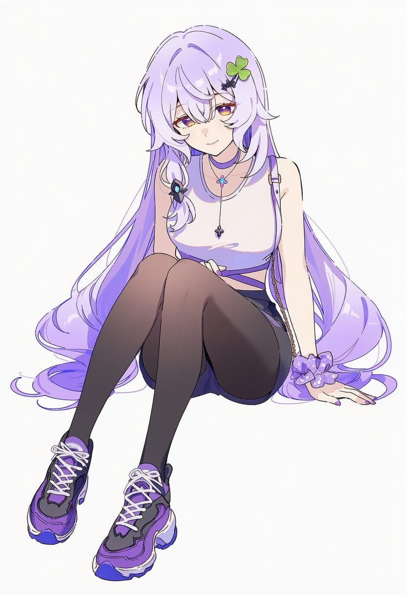

| 字段 | 内容 |
| --- | --- |
| Danbooru Tag | four-leaf_clover_hair_ornament |
| 中文名 | 四叶草发饰 |
| 中文含义 | 四叶草造型的发饰。 |
| 子类 | 造型发饰 |
| 模特 | black_swan_(honkai:_star_rail) |
| 序号 | 0096 |

## 97. egg_hair_ornament — 鸡蛋发饰

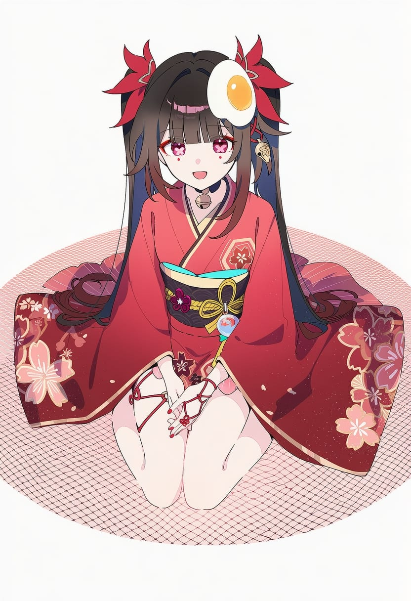

| 字段 | 内容 |
| --- | --- |
| Danbooru Tag | egg_hair_ornament |
| 中文名 | 鸡蛋发饰 |
| 中文含义 | 鸡蛋造型的发饰。 |
| 子类 | 造型发饰 |
| 模特 | sparkle_(honkai:_star_rail) |
| 序号 | 0097 |

## 98. lifebuoy_hair_ornament — 救生圈发饰

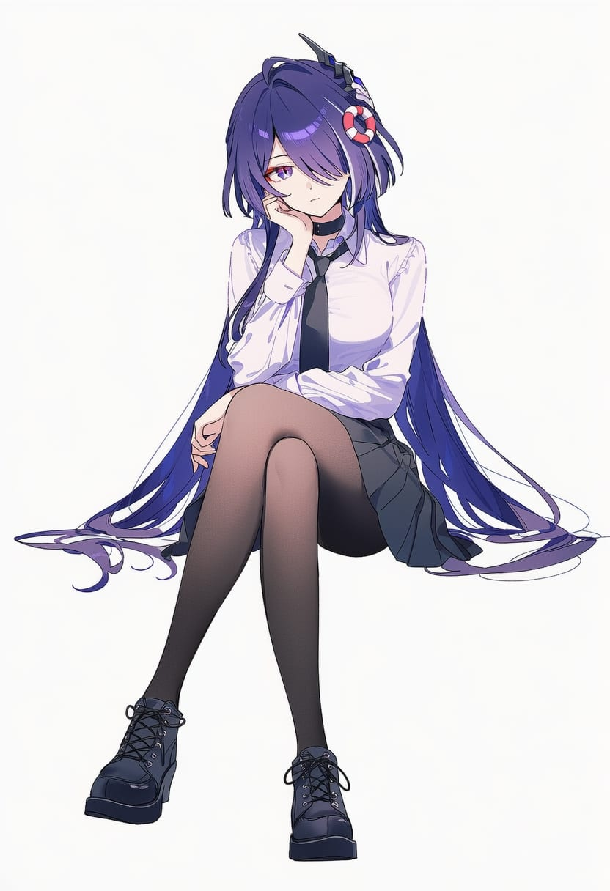

| 字段 | 内容 |
| --- | --- |
| Danbooru Tag | lifebuoy_hair_ornament |
| 中文名 | 救生圈发饰 |
| 中文含义 | 救生圈造型的发饰。 |
| 子类 | 造型发饰 |
| 模特 | acheron_(honkai:_star_rail) |
| 序号 | 0098 |

## 99. smokestack_hair_ornament — 烟囱发饰

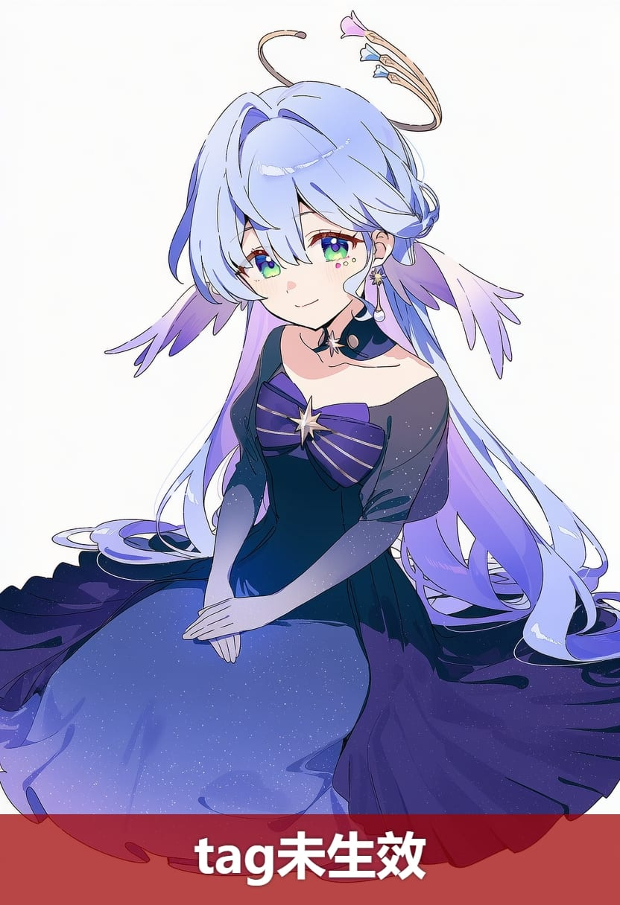

| 字段 | 内容 |
| --- | --- |
| Danbooru Tag | smokestack_hair_ornament |
| 中文名 | 烟囱发饰 |
| 中文含义 | 烟囱造型的发饰。 |
| 子类 | 造型发饰 |
| 模特 | robin_(honkai:_star_rail) |
| 序号 | 0099 |

## 100. sparkle_hair_ornament — 闪光发饰

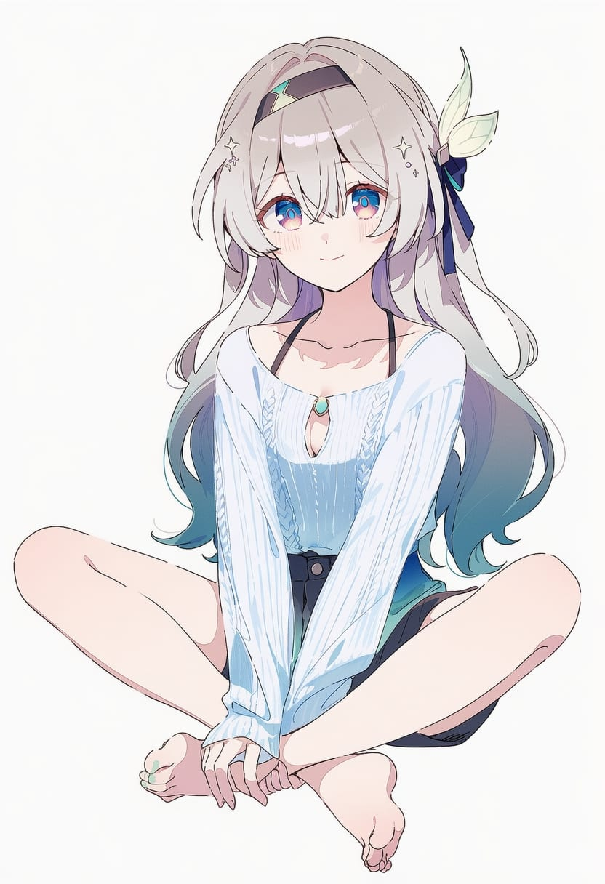

| 字段 | 内容 |
| --- | --- |
| Danbooru Tag | sparkle_hair_ornament |
| 中文名 | 闪光发饰 |
| 中文含义 | 闪光造型的发饰。 |
| 子类 | 造型发饰 |
| 模特 | firefly_(honkai:_star_rail) |
| 序号 | 0100 |

## 101. ghost_hair_ornament — 幽灵发饰

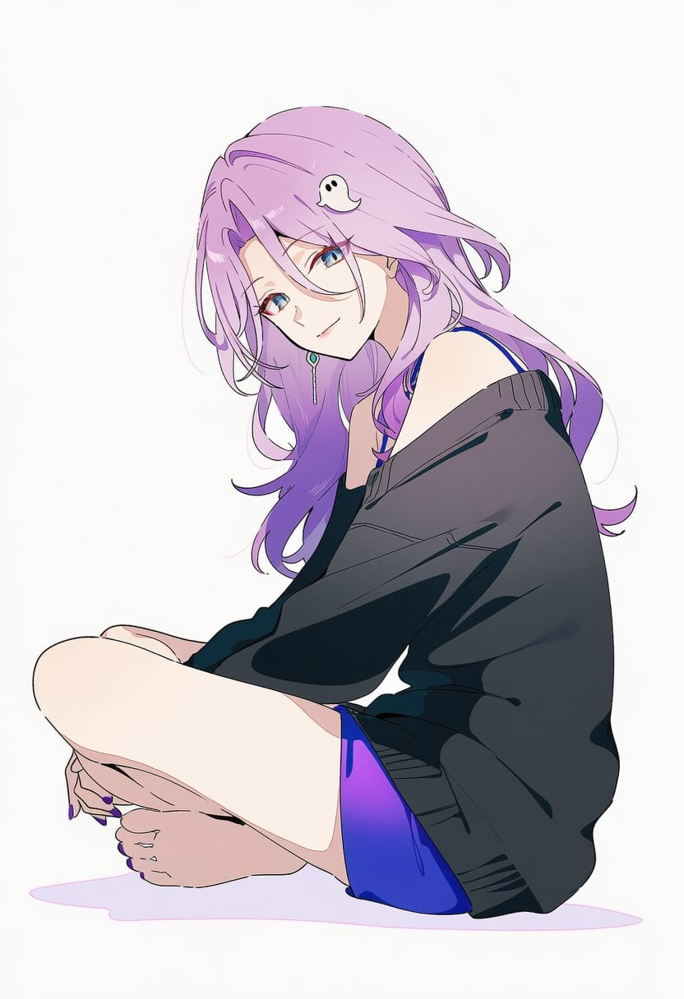

| 字段 | 内容 |
| --- | --- |
| Danbooru Tag | ghost_hair_ornament |
| 中文名 | 幽灵发饰 |
| 中文含义 | 幽灵造型的发饰。 |
| 子类 | 造型发饰 |
| 模特 | jade_(honkai:_star_rail) |
| 序号 | 0101 |

## 102. hexagon_hair_ornament — 六边形发饰

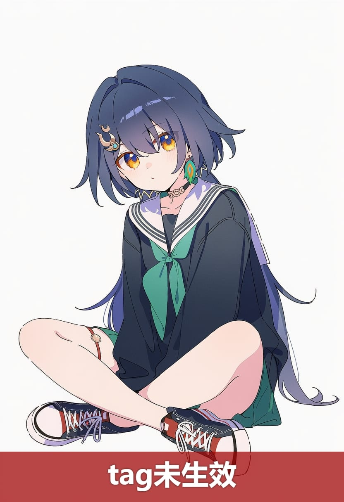

| 字段 | 内容 |
| --- | --- |
| Danbooru Tag | hexagon_hair_ornament |
| 中文名 | 六边形发饰 |
| 中文含义 | 六边形造型的发饰。 |
| 子类 | 造型发饰 |
| 模特 | yunli_(honkai:_star_rail) |
| 序号 | 0102 |

## 103. lightning_bolt_hair_ornament — 闪电发饰

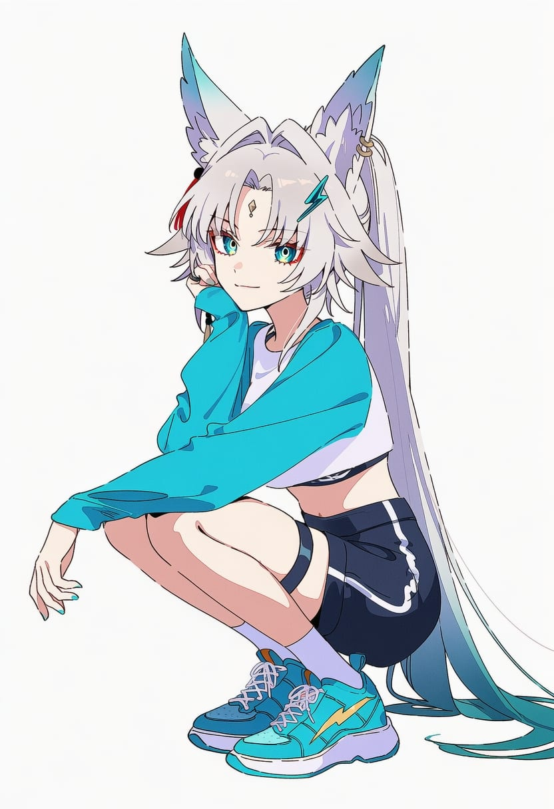

| 字段 | 内容 |
| --- | --- |
| Danbooru Tag | lightning_bolt_hair_ornament |
| 中文名 | 闪电发饰 |
| 中文含义 | 闪电造型的发饰。 |
| 子类 | 造型发饰 |
| 模特 | feixiao_(honkai:_star_rail) |
| 序号 | 0103 |

## 104. gem_hair_ornament — 宝石发饰

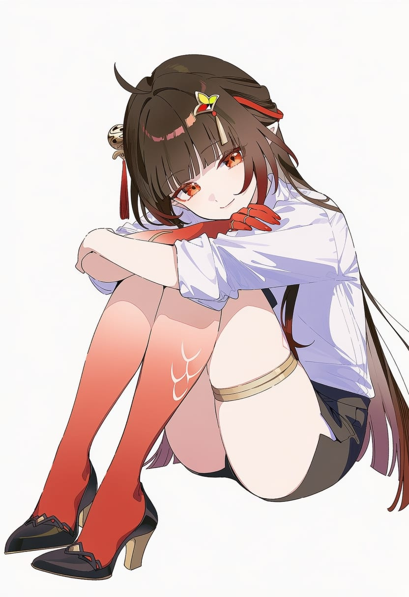

| 字段 | 内容 |
| --- | --- |
| Danbooru Tag | gem_hair_ornament |
| 中文名 | 宝石发饰 |
| 中文含义 | 宝石造型的发饰。 |
| 子类 | 造型发饰 |
| 模特 | lingsha_(honkai:_star_rail) |
| 序号 | 0104 |

## 105. starfish_hair_ornament — 海星发饰

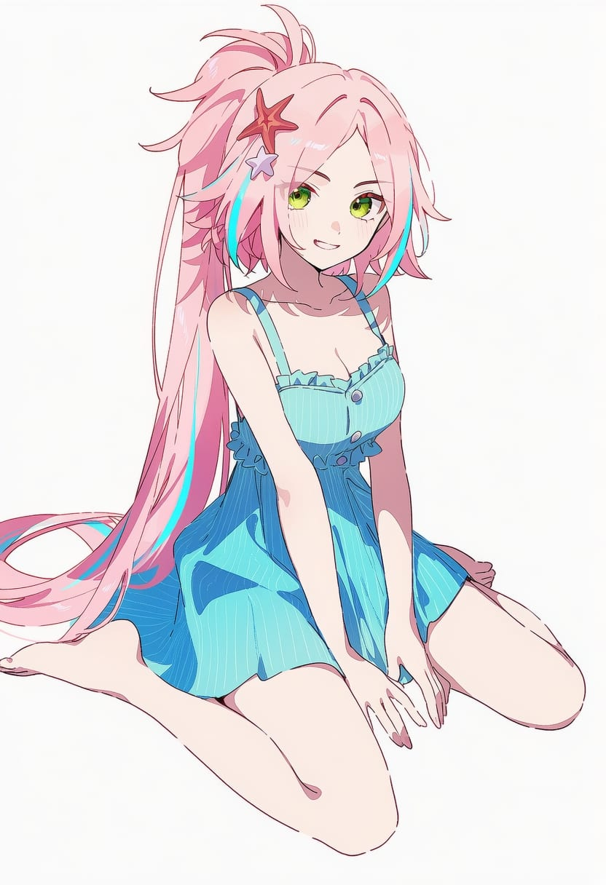

| 字段 | 内容 |
| --- | --- |
| Danbooru Tag | starfish_hair_ornament |
| 中文名 | 海星发饰 |
| 中文含义 | 海星造型的发饰。 |
| 子类 | 造型发饰 |
| 模特 | rappa_(honkai:_star_rail) |
| 序号 | 0105 |

## 106. coin_hair_ornament — 硬币发饰

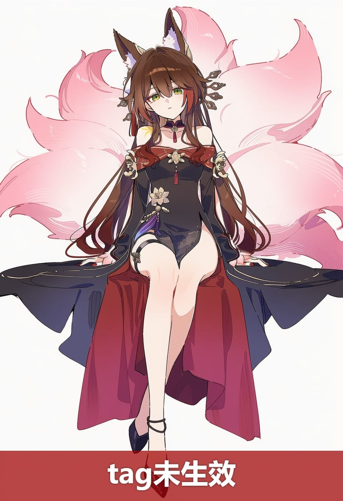

| 字段 | 内容 |
| --- | --- |
| Danbooru Tag | coin_hair_ornament |
| 中文名 | 硬币发饰 |
| 中文含义 | 硬币造型的发饰。 |
| 子类 | 造型发饰 |
| 模特 | fugue_(honkai:_star_rail) |
| 序号 | 0106 |

## 107. fan_hair_ornament — 扇子发饰

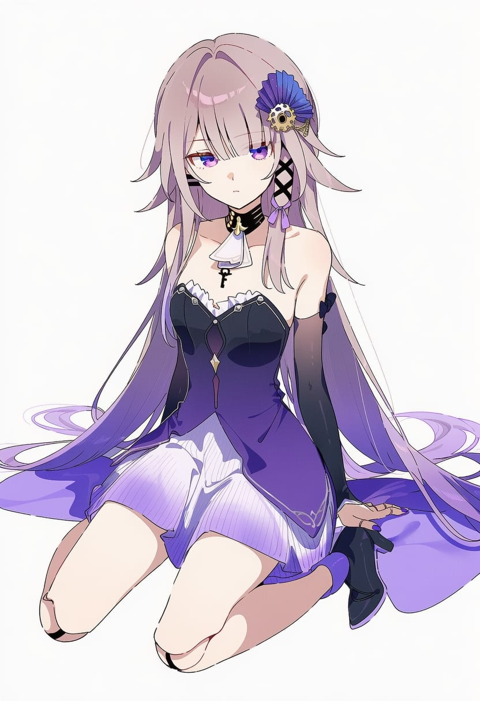

| 字段 | 内容 |
| --- | --- |
| Danbooru Tag | fan_hair_ornament |
| 中文名 | 扇子发饰 |
| 中文含义 | 扇子造型的发饰。 |
| 子类 | 造型发饰 |
| 模特 | the_herta_(honkai:_star_rail) |
| 序号 | 0107 |

## 108. screw_hair_ornament — 螺丝发饰

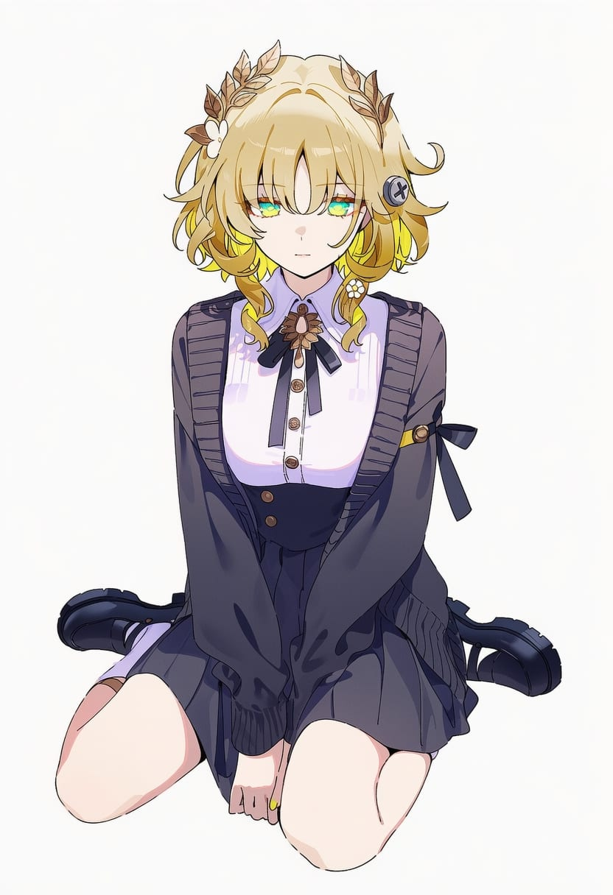

| 字段 | 内容 |
| --- | --- |
| Danbooru Tag | screw_hair_ornament |
| 中文名 | 螺丝发饰 |
| 中文含义 | 螺丝造型的发饰。 |
| 子类 | 造型发饰 |
| 模特 | aglaea_(honkai:_star_rail) |
| 序号 | 0108 |

## 109. eyeball_hair_ornament — 眼球发饰

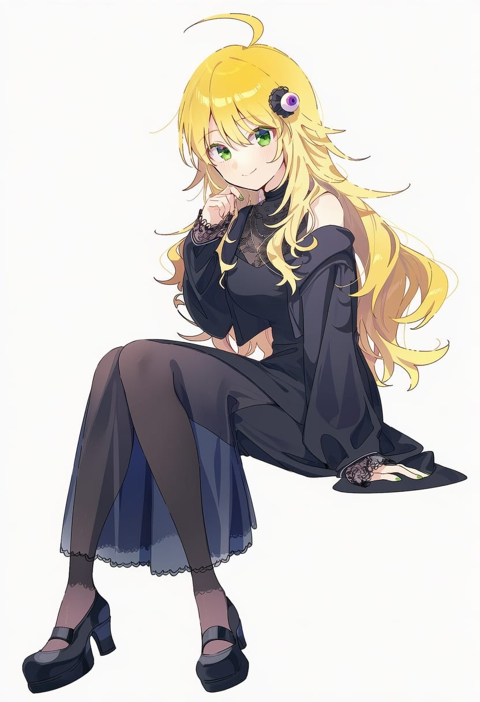

| 字段 | 内容 |
| --- | --- |
| Danbooru Tag | eyeball_hair_ornament |
| 中文名 | 眼球发饰 |
| 中文含义 | 眼球造型的发饰。 |
| 子类 | 造型发饰 |
| 模特 | arona_(blue_archive) |
| 序号 | 0109 |

## 110. holly_hair_ornament — 冬青发饰

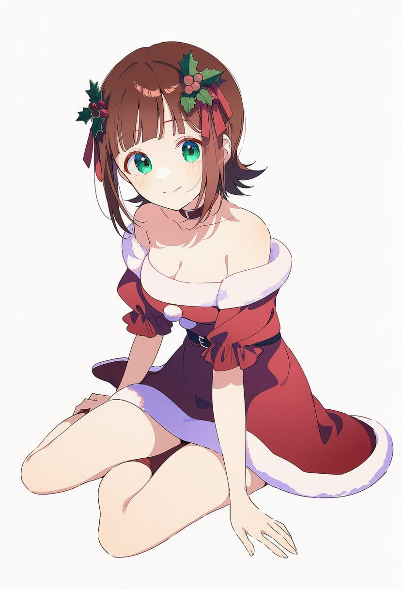

| 字段 | 内容 |
| --- | --- |
| Danbooru Tag | holly_hair_ornament |
| 中文名 | 冬青发饰 |
| 中文含义 | 冬青造型的发饰。 |
| 子类 | 造型发饰 |
| 模特 | sumire_(blue_archive) |
| 序号 | 0110 |

## 111. planet_hair_ornament — 行星发饰

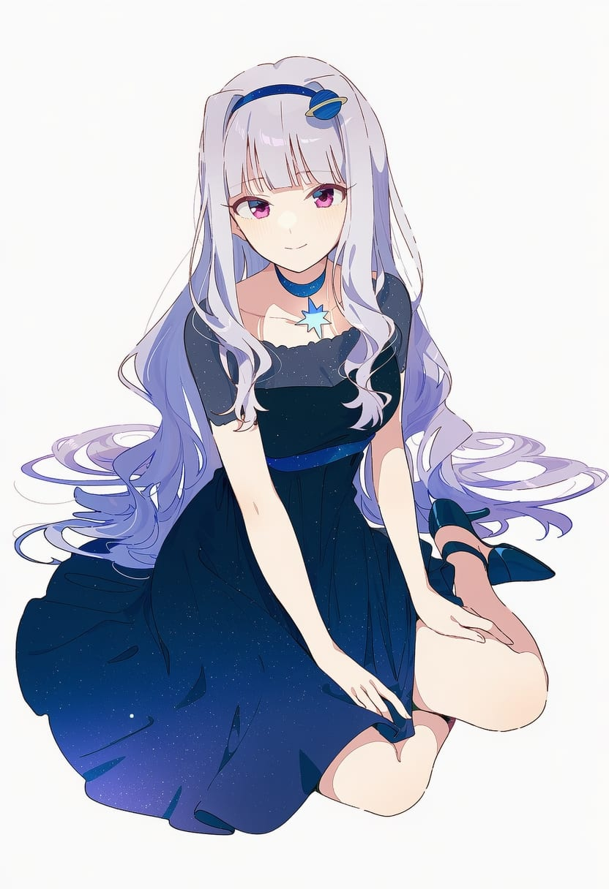

| 字段 | 内容 |
| --- | --- |
| Danbooru Tag | planet_hair_ornament |
| 中文名 | 行星发饰 |
| 中文含义 | 行星造型的发饰。 |
| 子类 | 造型发饰 |
| 模特 | asuna_(blue_archive) |
| 序号 | 0111 |

## 112. crown_hair_ornament — 皇冠发饰

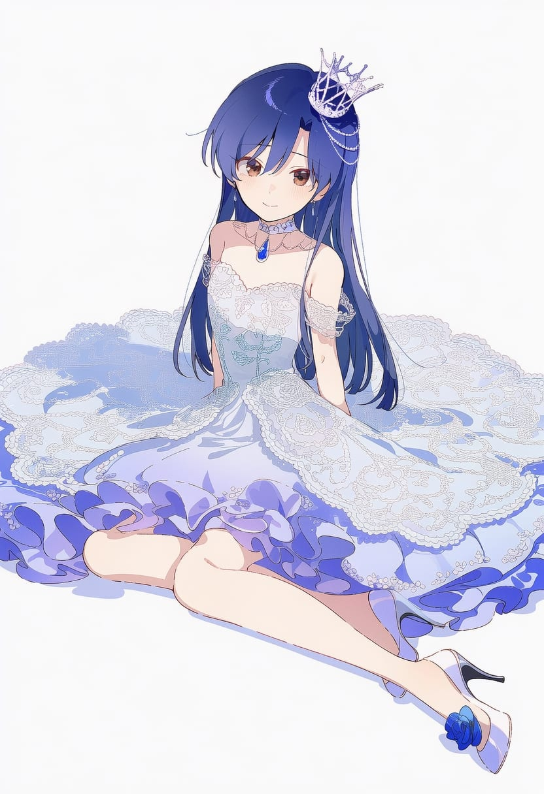

| 字段 | 内容 |
| --- | --- |
| Danbooru Tag | crown_hair_ornament |
| 中文名 | 皇冠发饰 |
| 中文含义 | 皇冠造型的发饰。 |
| 子类 | 造型发饰 |
| 模特 | akane_(blue_archive) |
| 序号 | 0112 |

## 113. spade_hair_ornament — 黑桃发饰

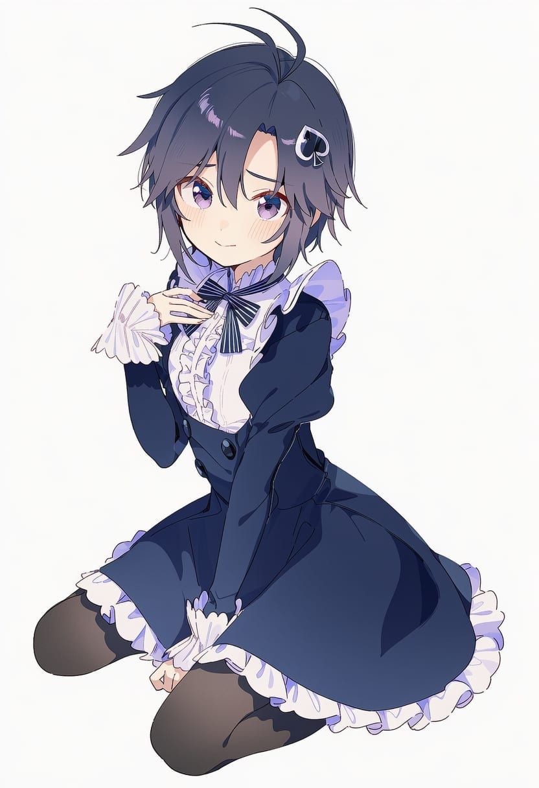

| 字段 | 内容 |
| --- | --- |
| Danbooru Tag | spade_hair_ornament |
| 中文名 | 黑桃发饰 |
| 中文含义 | 黑桃造型的发饰。 |
| 子类 | 造型发饰 |
| 模特 | neru_(blue_archive) |
| 序号 | 0113 |

## 114. bird_hair_ornament — 鸟发饰

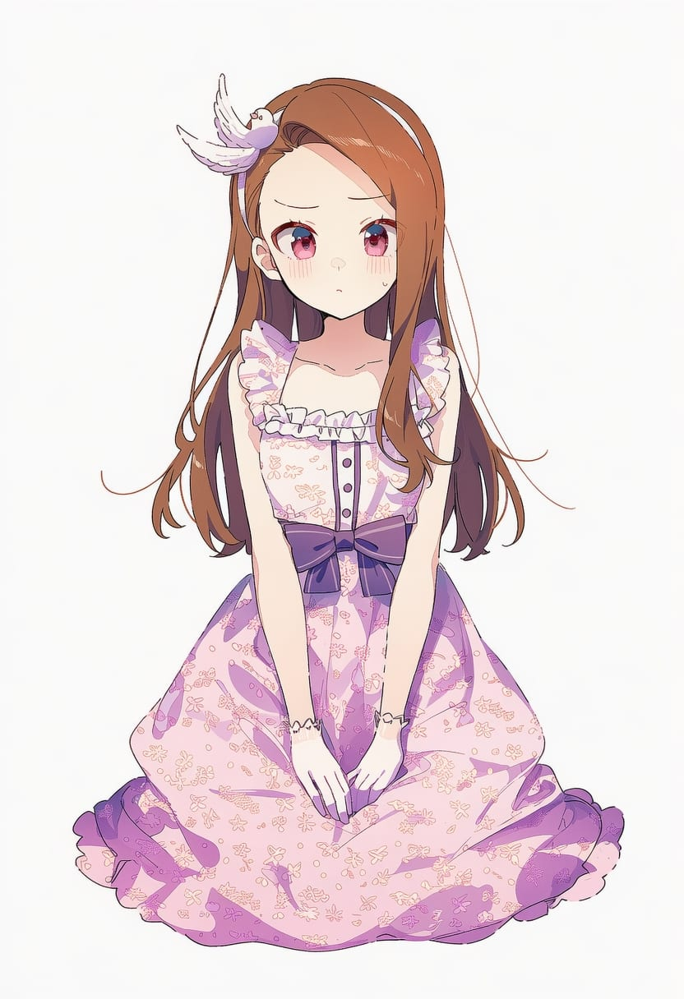

| 字段 | 内容 |
| --- | --- |
| Danbooru Tag | bird_hair_ornament |
| 中文名 | 鸟发饰 |
| 中文含义 | 鸟造型的发饰。 |
| 子类 | 造型发饰 |
| 模特 | karin_(blue_archive) |
| 序号 | 0114 |

## 115. fox_hair_ornament — 狐狸发饰

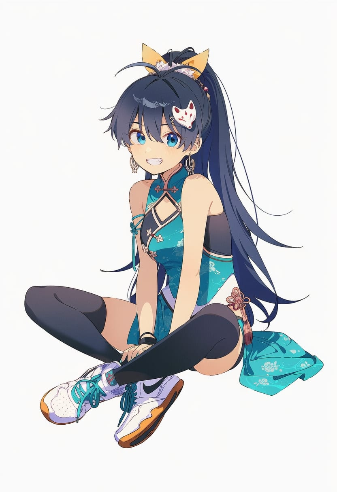

| 字段 | 内容 |
| --- | --- |
| Danbooru Tag | fox_hair_ornament |
| 中文名 | 狐狸发饰 |
| 中文含义 | 狐狸造型的发饰。 |
| 子类 | 造型发饰 |
| 模特 | kotori_(blue_archive) |
| 序号 | 0115 |

## 116. cloud_hair_ornament — 云朵发饰

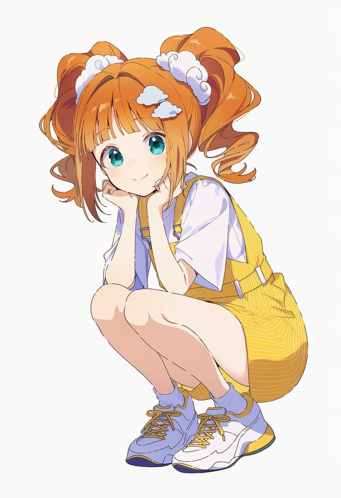

| 字段 | 内容 |
| --- | --- |
| Danbooru Tag | cloud_hair_ornament |
| 中文名 | 云朵发饰 |
| 中文含义 | 云朵造型的发饰。 |
| 子类 | 造型发饰 |
| 模特 | hibiki_(blue_archive) |
| 序号 | 0116 |

## 117. panda_hair_ornament — 熊猫发饰

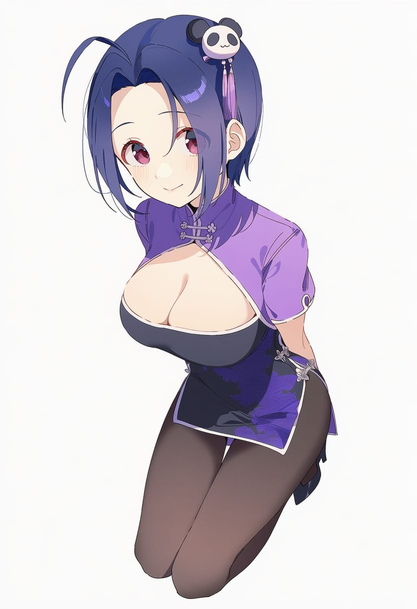

| 字段 | 内容 |
| --- | --- |
| Danbooru Tag | panda_hair_ornament |
| 中文名 | 熊猫发饰 |
| 中文含义 | 熊猫造型的发饰。 |
| 子类 | 造型发饰 |
| 模特 | utaha_(blue_archive) |
| 序号 | 0117 |

## 118. pumpkin_hair_ornament — 南瓜发饰

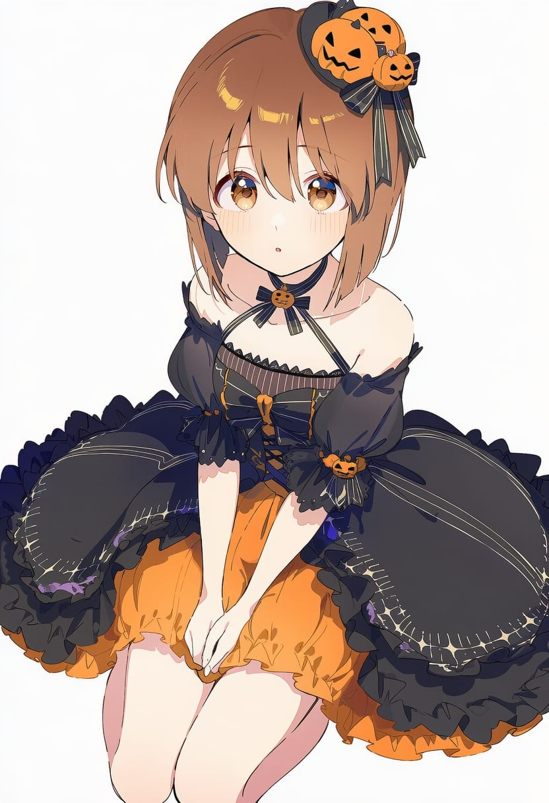

| 字段 | 内容 |
| --- | --- |
| Danbooru Tag | pumpkin_hair_ornament |
| 中文名 | 南瓜发饰 |
| 中文含义 | 南瓜造型的发饰。 |
| 子类 | 造型发饰 |
| 模特 | yuuka_(blue_archive) |
| 序号 | 0118 |

## 119. paw_hair_ornament — 爪印发饰

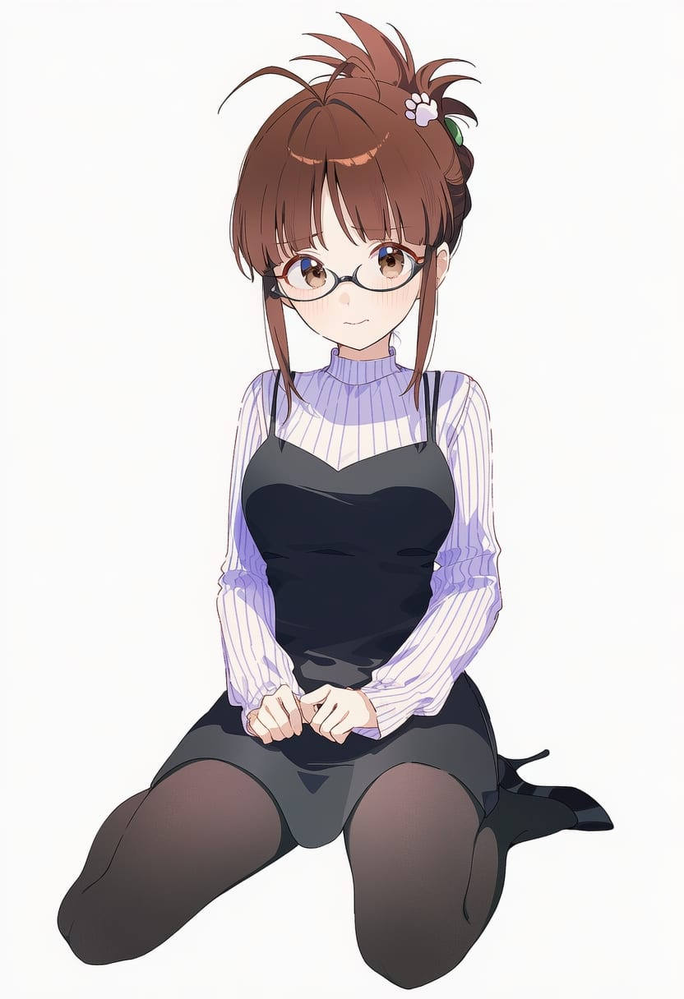

| 字段 | 内容 |
| --- | --- |
| Danbooru Tag | paw_hair_ornament |
| 中文名 | 爪印发饰 |
| 中文含义 | 爪印造型的发饰。 |
| 子类 | 造型发饰 |
| 模特 | eimi_(blue_archive) |
| 序号 | 0119 |

## 120. radar_hair_ornament — 雷达发饰

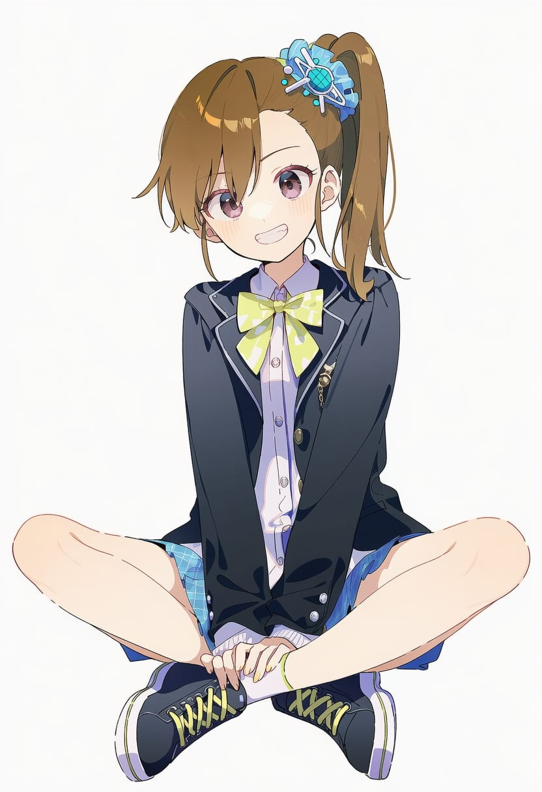

| 字段 | 内容 |
| --- | --- |
| Danbooru Tag | radar_hair_ornament |
| 中文名 | 雷达发饰 |
| 中文含义 | 雷达造型的发饰。 |
| 子类 | 造型发饰 |
| 模特 | maki_(blue_archive) |
| 序号 | 0120 |

## 121. broken_heart_hair_ornament — 破碎爱心发饰

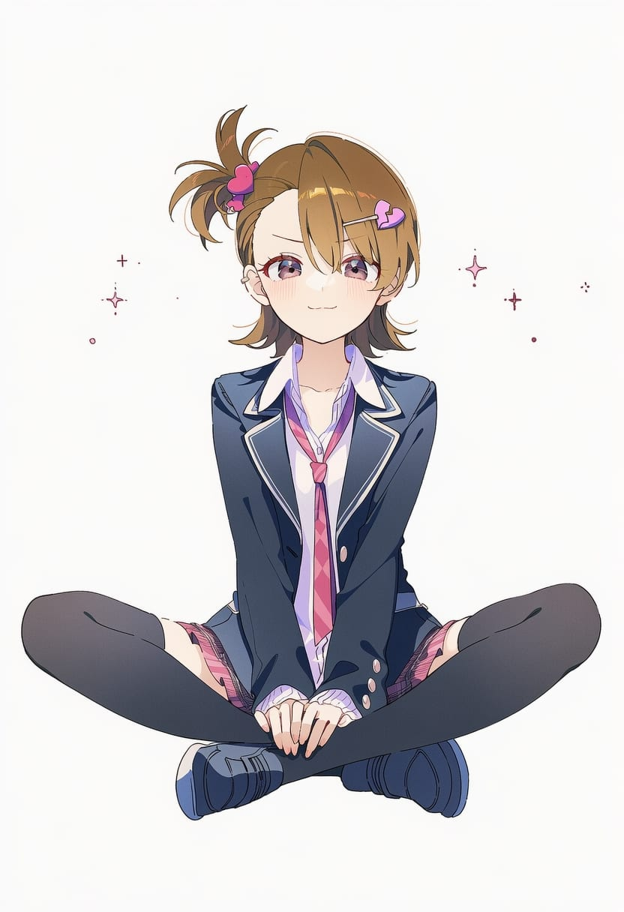

| 字段 | 内容 |
| --- | --- |
| Danbooru Tag | broken_heart_hair_ornament |
| 中文名 | 破碎爱心发饰 |
| 中文含义 | 破碎爱心造型的发饰。 |
| 子类 | 造型发饰 |
| 模特 | hare_(blue_archive) |
| 序号 | 0121 |

## 122. apple_hair_ornament — 苹果发饰

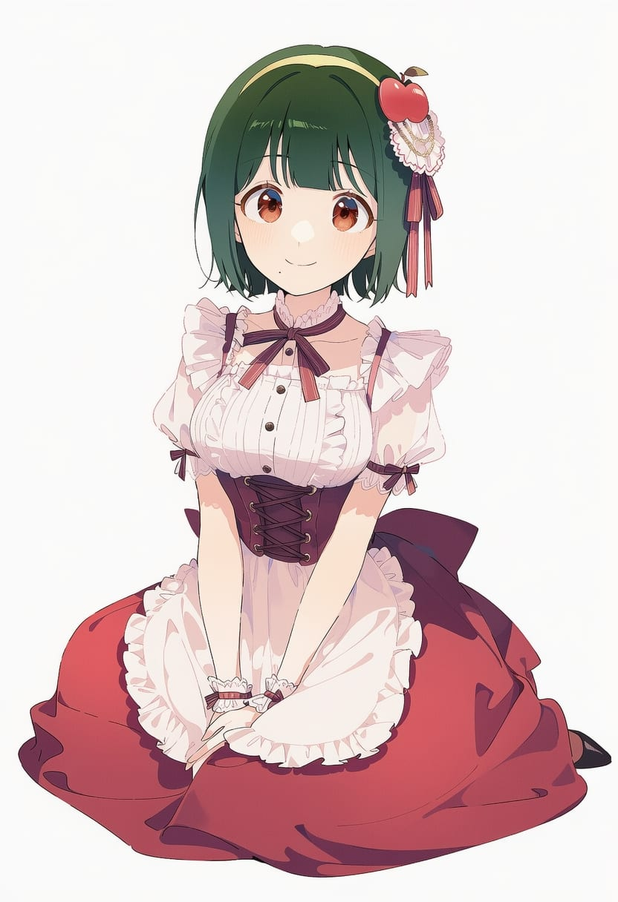

| 字段 | 内容 |
| --- | --- |
| Danbooru Tag | apple_hair_ornament |
| 中文名 | 苹果发饰 |
| 中文含义 | 苹果造型的发饰。 |
| 子类 | 造型发饰 |
| 模特 | kotama_(blue_archive) |
| 序号 | 0122 |

## 123. shuriken_hair_ornament — 手里剑发饰

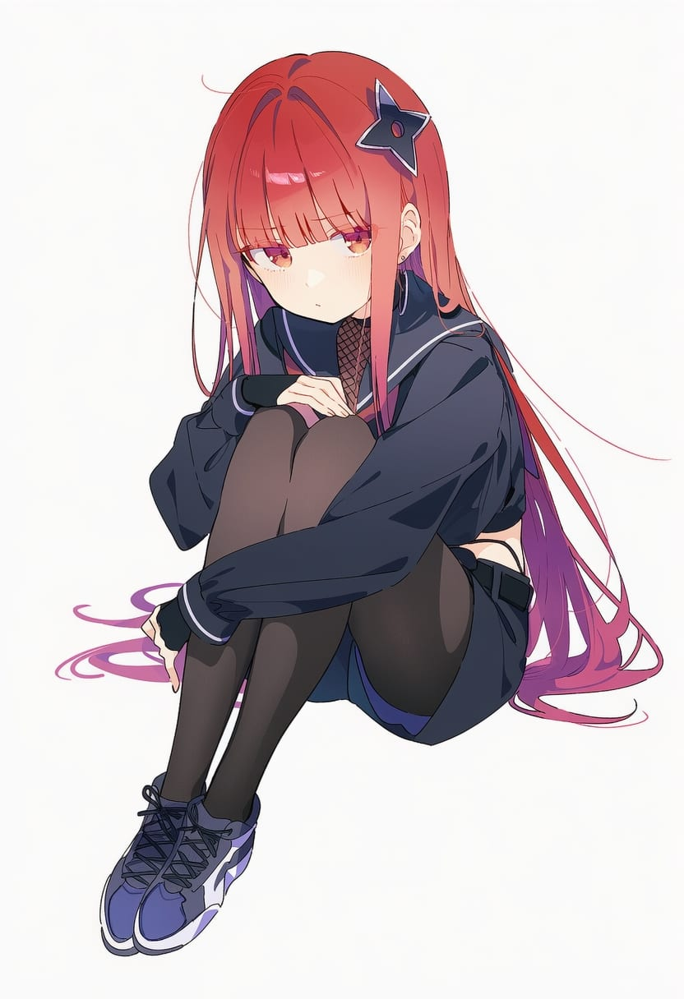

| 字段 | 内容 |
| --- | --- |
| Danbooru Tag | shuriken_hair_ornament |
| 中文名 | 手里剑发饰 |
| 中文含义 | 手里剑造型的发饰。 |
| 子类 | 造型发饰 |
| 模特 | yoshimi_(blue_archive) |
| 序号 | 0123 |

## 124. animal_hair_ornament — 动物发饰

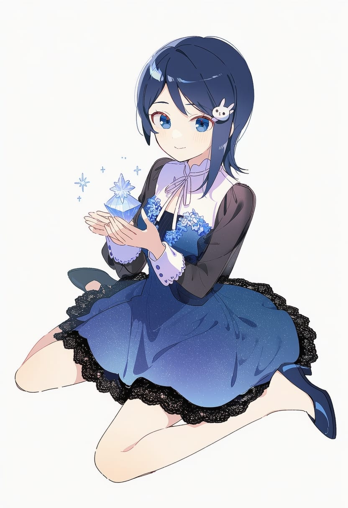

| 字段 | 内容 |
| --- | --- |
| Danbooru Tag | animal_hair_ornament |
| 中文名 | 动物发饰 |
| 中文含义 | 动物造型的发饰。 |
| 子类 | 造型发饰 |
| 模特 | airi_(blue_archive) |
| 序号 | 0124 |

## 125. pill_hair_ornament — 药丸发饰

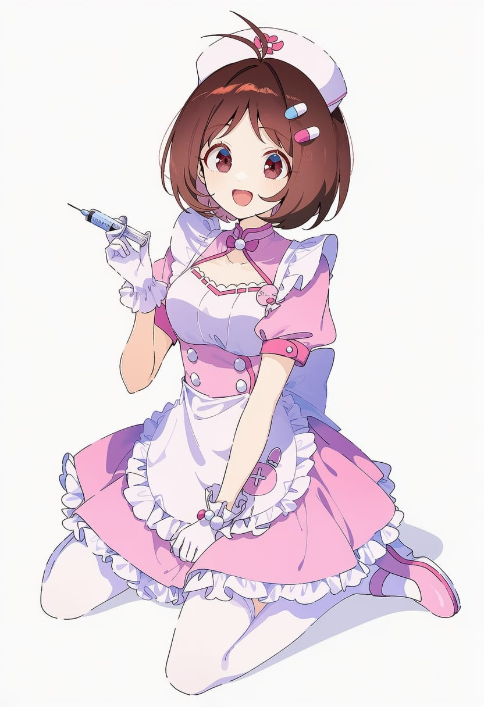

| 字段 | 内容 |
| --- | --- |
| Danbooru Tag | pill_hair_ornament |
| 中文名 | 药丸发饰 |
| 中文含义 | 药丸造型的发饰。 |
| 子类 | 造型发饰 |
| 模特 | tsurugi_(blue_archive) |
| 序号 | 0125 |

## 126. razor_blade_hair_ornament — 剃刀片发饰

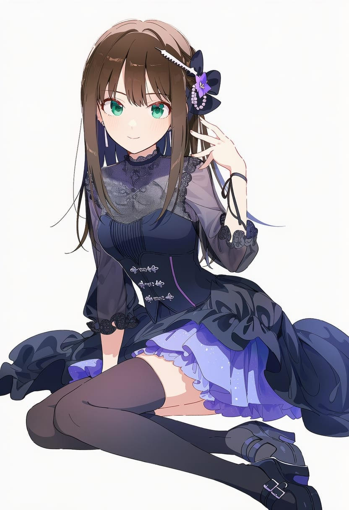

| 字段 | 内容 |
| --- | --- |
| Danbooru Tag | razor_blade_hair_ornament |
| 中文名 | 剃刀片发饰 |
| 中文含义 | 剃刀片造型的发饰。 |
| 子类 | 造型发饰 |
| 模特 | hasumi_(blue_archive) |
| 序号 | 0126 |

## 127. grape_hair_ornament — 葡萄发饰

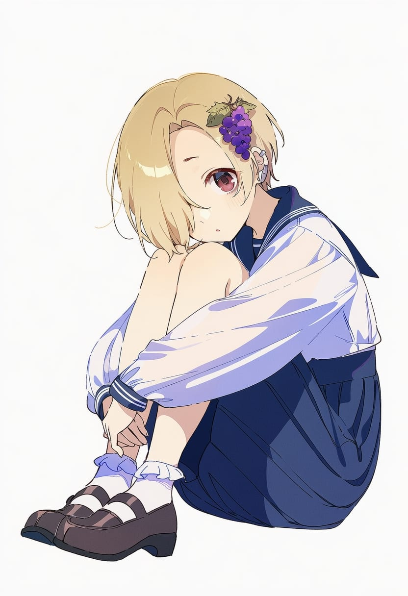

| 字段 | 内容 |
| --- | --- |
| Danbooru Tag | grape_hair_ornament |
| 中文名 | 葡萄发饰 |
| 中文含义 | 葡萄造型的发饰。 |
| 子类 | 造型发饰 |
| 模特 | shimiko_(blue_archive) |
| 序号 | 0127 |

## 128. whale_hair_ornament — 鲸鱼发饰

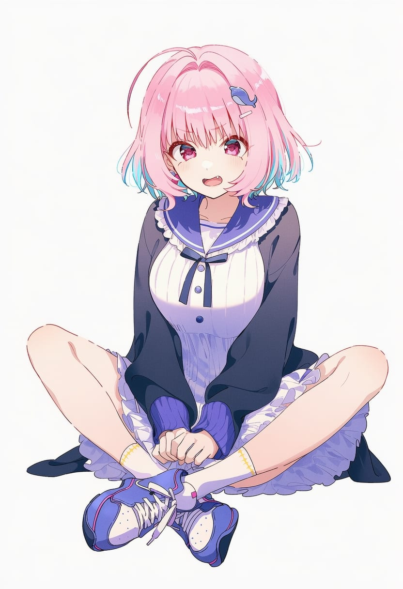

| 字段 | 内容 |
| --- | --- |
| Danbooru Tag | whale_hair_ornament |
| 中文名 | 鲸鱼发饰 |
| 中文含义 | 鲸鱼造型的发饰。 |
| 子类 | 造型发饰 |
| 模特 | hifumi_(blue_archive) |
| 序号 | 0128 |

## 129. dog_hair_ornament — 狗发饰

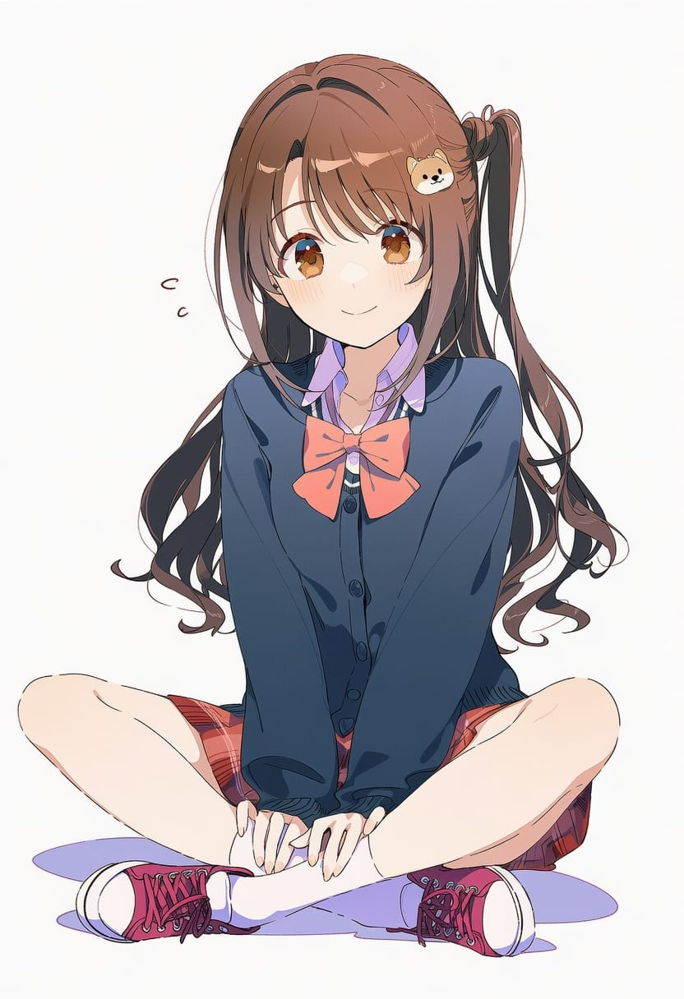

| 字段 | 内容 |
| --- | --- |
| Danbooru Tag | dog_hair_ornament |
| 中文名 | 狗发饰 |
| 中文含义 | 狗造型的发饰。 |
| 子类 | 造型发饰 |
| 模特 | hanae_(blue_archive) |
| 序号 | 0129 |

## 130. dolphin_hair_ornament — 海豚发饰

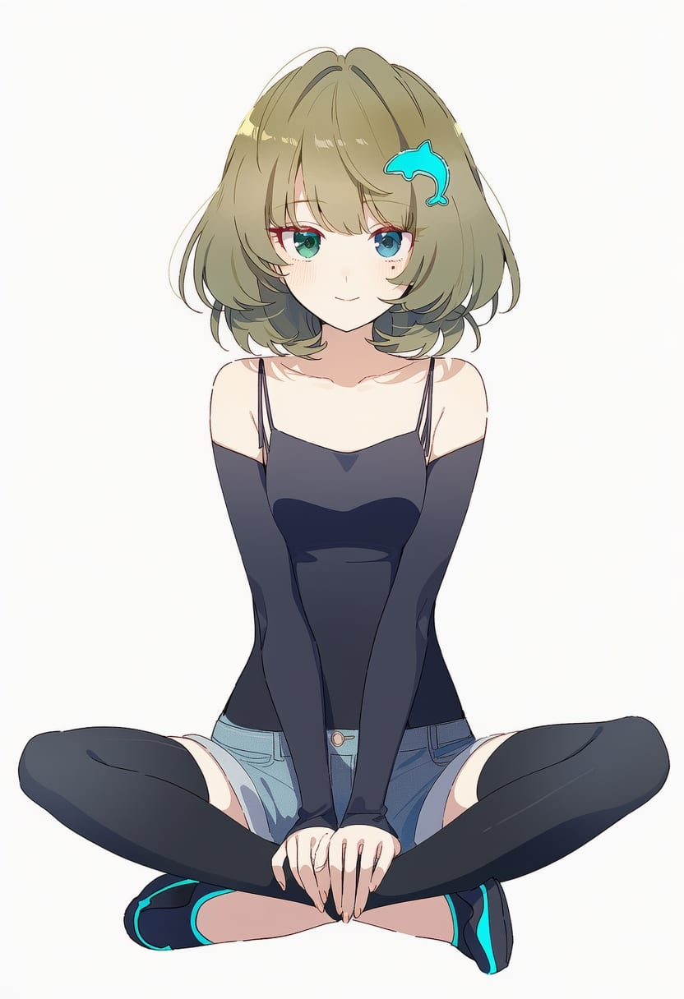

| 字段 | 内容 |
| --- | --- |
| Danbooru Tag | dolphin_hair_ornament |
| 中文名 | 海豚发饰 |
| 中文含义 | 海豚造型的发饰。 |
| 子类 | 造型发饰 |
| 模特 | serina_(blue_archive) |
| 序号 | 0130 |

## 131. winged_hair_ornament — 带翼发饰

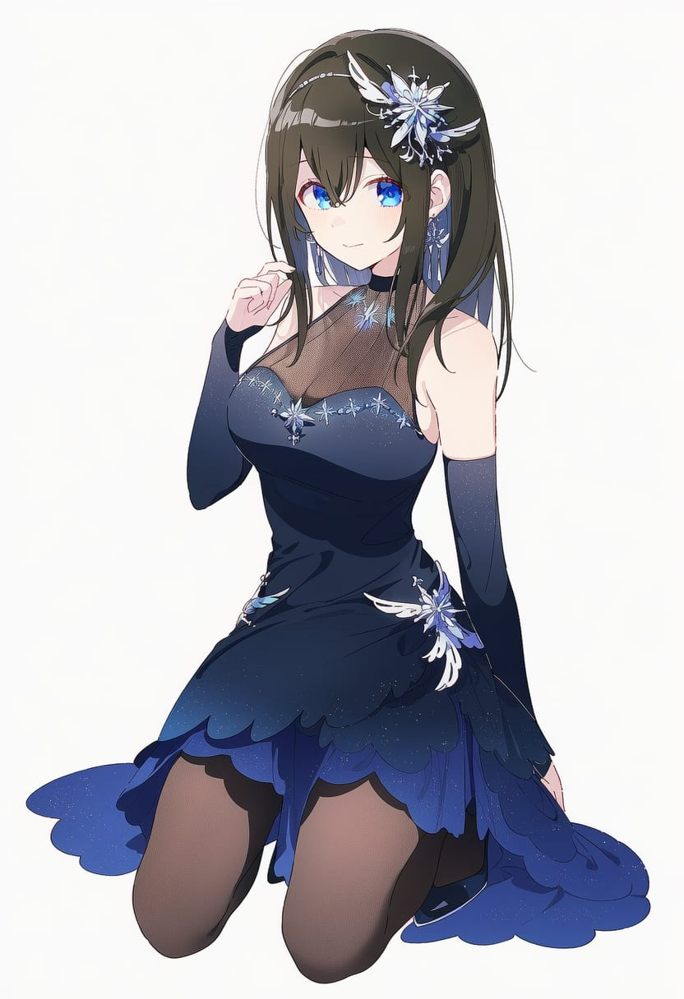

| 字段 | 内容 |
| --- | --- |
| Danbooru Tag | winged_hair_ornament |
| 中文名 | 带翼发饰 |
| 中文含义 | 带翅膀结构的发饰。 |
| 子类 | 造型发饰 |
| 模特 | suzumi_(blue_archive) |
| 序号 | 0131 |

## 132. propeller_hair_ornament — 螺旋桨发饰

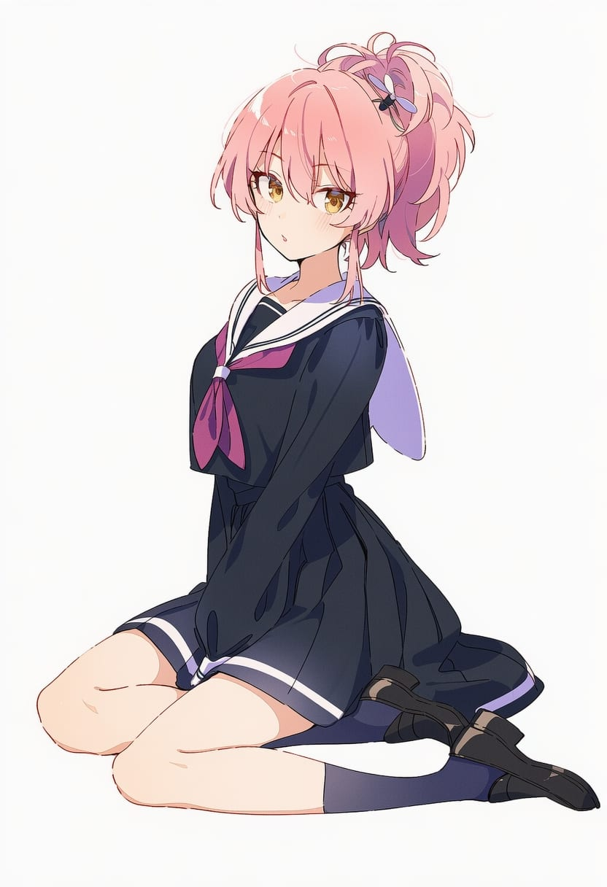

| 字段 | 内容 |
| --- | --- |
| Danbooru Tag | propeller_hair_ornament |
| 中文名 | 螺旋桨发饰 |
| 中文含义 | 螺旋桨造型的发饰。 |
| 子类 | 造型发饰 |
| 模特 | saya_(blue_archive) |
| 序号 | 0132 |

## 133. lemon_hair_ornament — 柠檬发饰

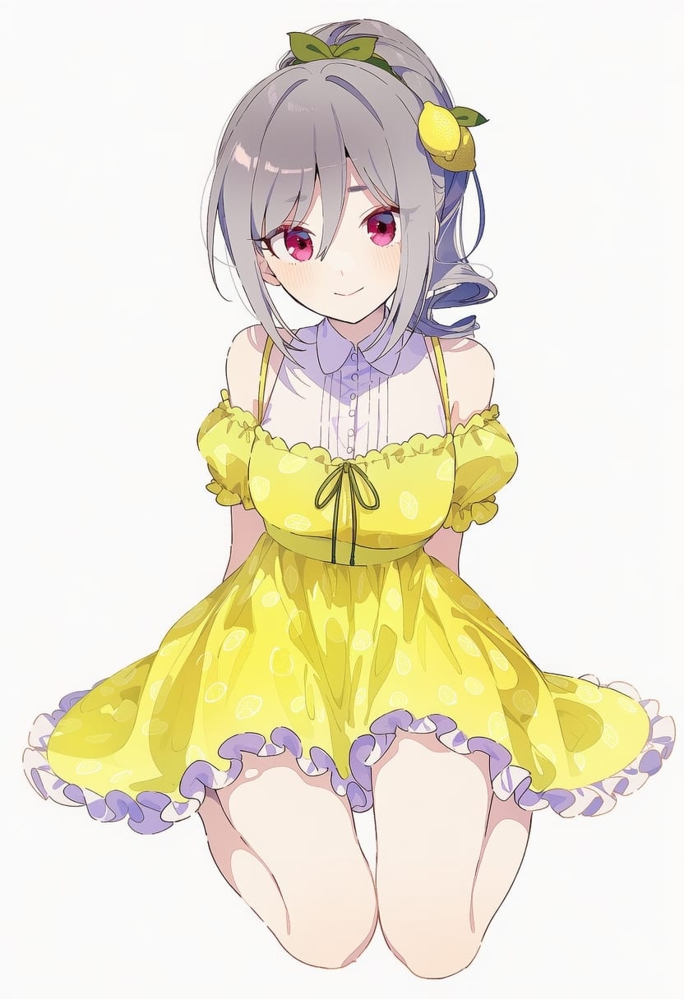

| 字段 | 内容 |
| --- | --- |
| Danbooru Tag | lemon_hair_ornament |
| 中文名 | 柠檬发饰 |
| 中文含义 | 柠檬造型的发饰。 |
| 子类 | 造型发饰 |
| 模特 | shun_(blue_archive) |
| 序号 | 0133 |

## 134. jack-o'-lantern_hair_ornament — 南瓜灯发饰

| 字段 | 内容 |
| --- | --- |
| Danbooru Tag | jack-o'-lantern_hair_ornament |
| 中文名 | 南瓜灯发饰 |
| 中文含义 | 南瓜灯造型的发饰。 |
| 子类 | 造型发饰 |
| 模特 | izumi_(blue_archive) |
| 序号 | 0134 |

## 135. magatama_hair_ornament — 勾玉发饰

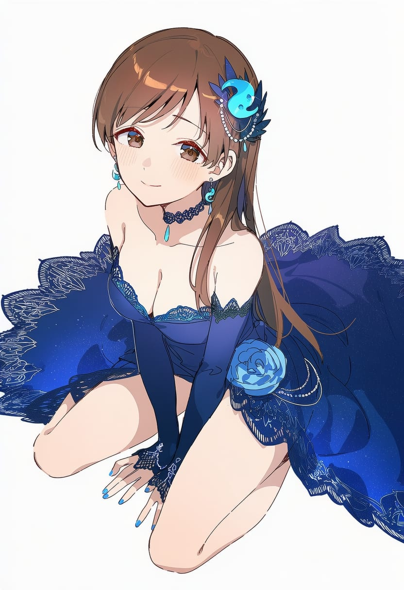

| 字段 | 内容 |
| --- | --- |
| Danbooru Tag | magatama_hair_ornament |
| 中文名 | 勾玉发饰 |
| 中文含义 | 勾玉造型的发饰。 |
| 子类 | 造型发饰 |
| 模特 | junko_(blue_archive) |
| 序号 | 0135 |

## 136. crystal_hair_ornament — 水晶发饰

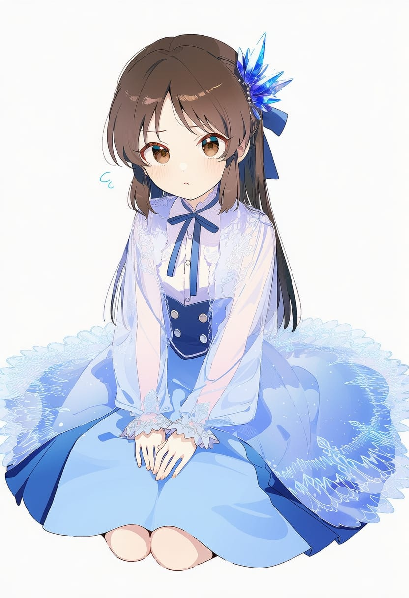

| 字段 | 内容 |
| --- | --- |
| Danbooru Tag | crystal_hair_ornament |
| 中文名 | 水晶发饰 |
| 中文含义 | 水晶造型的发饰。 |
| 子类 | 造型发饰 |
| 模特 | akari_(blue_archive) |
| 序号 | 0136 |

## 137. pinwheel_hair_ornament — 风车发饰

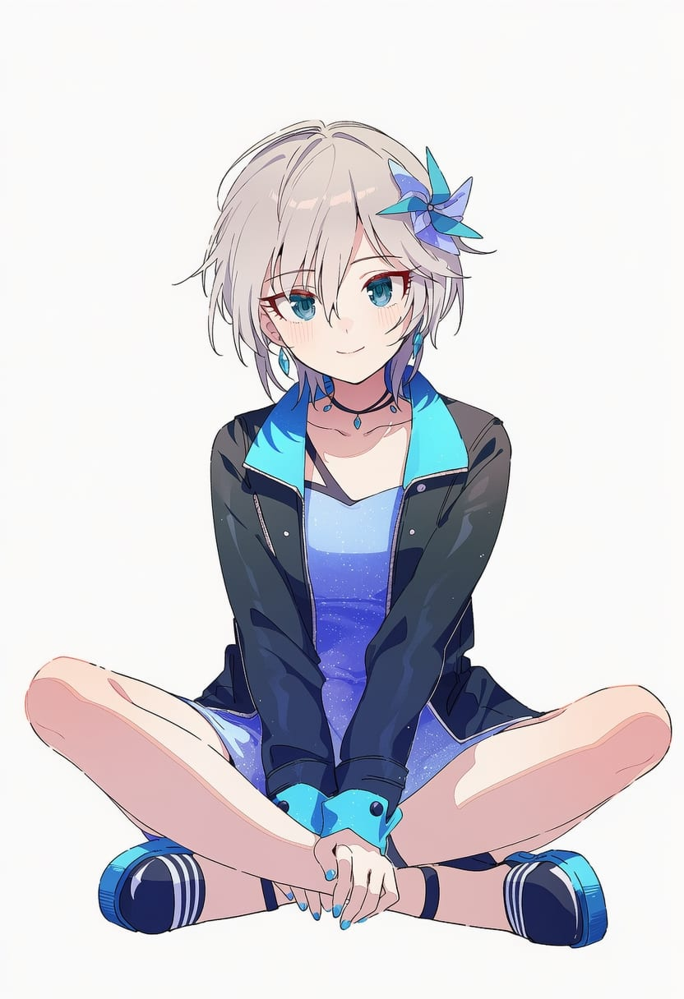

| 字段 | 内容 |
| --- | --- |
| Danbooru Tag | pinwheel_hair_ornament |
| 中文名 | 风车发饰 |
| 中文含义 | 风车造型的发饰。 |
| 子类 | 造型发饰 |
| 模特 | haruna_(blue_archive) |
| 序号 | 0137 |

## 138. gear_hair_ornament — 齿轮发饰

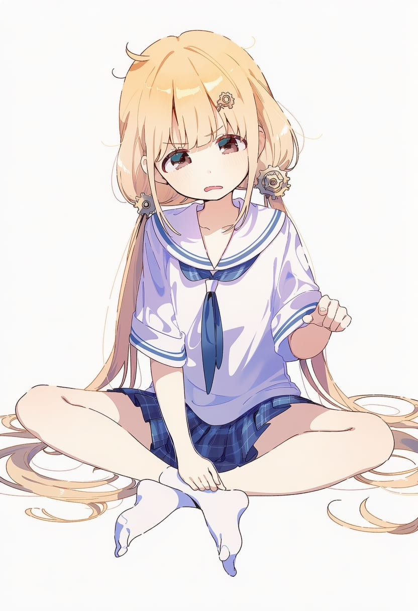

| 字段 | 内容 |
| --- | --- |
| Danbooru Tag | gear_hair_ornament |
| 中文名 | 齿轮发饰 |
| 中文含义 | 齿轮造型的发饰。 |
| 子类 | 造型发饰 |
| 模特 | chinatsu_(blue_archive) |
| 序号 | 0138 |

## 139. fork_hair_ornament — 叉子发饰

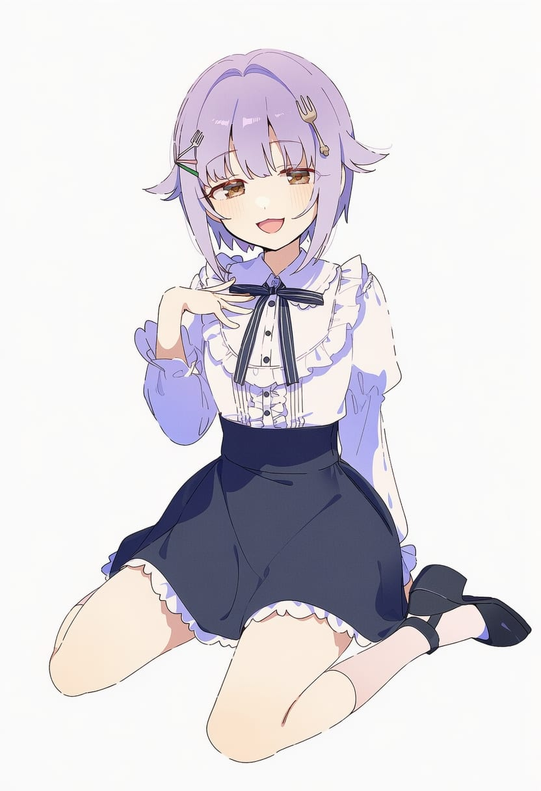

| 字段 | 内容 |
| --- | --- |
| Danbooru Tag | fork_hair_ornament |
| 中文名 | 叉子发饰 |
| 中文含义 | 叉子造型的发饰。 |
| 子类 | 造型发饰 |
| 模特 | hina_(blue_archive) |
| 序号 | 0139 |

## 140. peach_hair_ornament — 桃子发饰

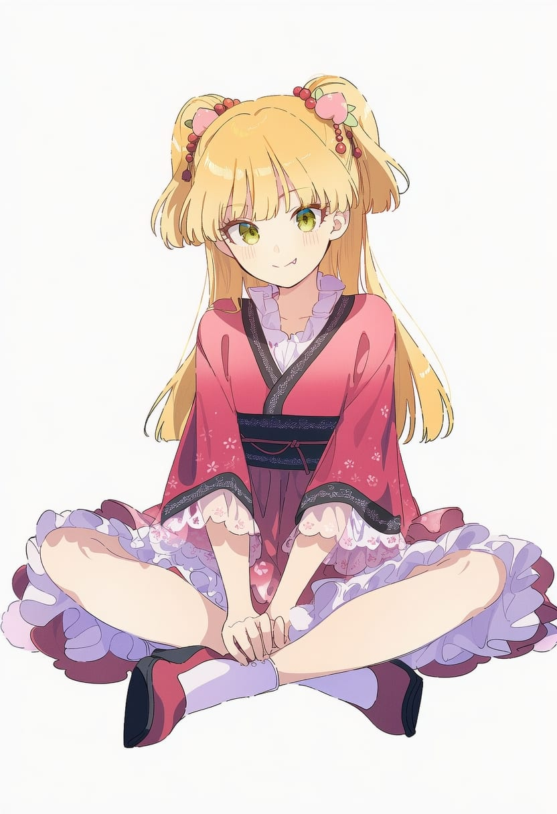

| 字段 | 内容 |
| --- | --- |
| Danbooru Tag | peach_hair_ornament |
| 中文名 | 桃子发饰 |
| 中文含义 | 桃子造型的发饰。 |
| 子类 | 造型发饰 |
| 模特 | iori_(blue_archive) |
| 序号 | 0140 |

## 141. coral_hair_ornament — 珊瑚发饰

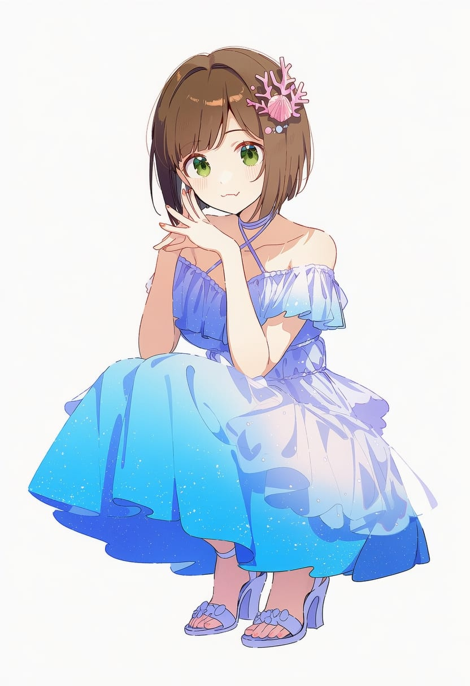

| 字段 | 内容 |
| --- | --- |
| Danbooru Tag | coral_hair_ornament |
| 中文名 | 珊瑚发饰 |
| 中文含义 | 珊瑚造型的发饰。 |
| 子类 | 造型发饰 |
| 模特 | haruka_(blue_archive) |
| 序号 | 0141 |

## 142. fish_skeleton_hair_ornament — 鱼骨发饰

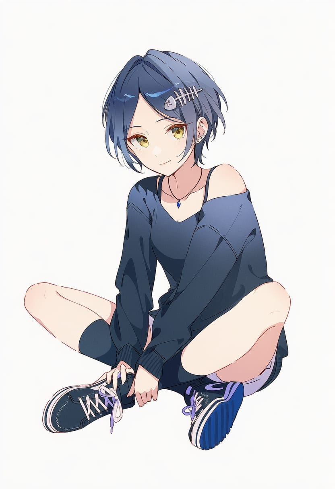

| 字段 | 内容 |
| --- | --- |
| Danbooru Tag | fish_skeleton_hair_ornament |
| 中文名 | 鱼骨发饰 |
| 中文含义 | 鱼骨造型的发饰。 |
| 子类 | 造型发饰 |
| 模特 | mutsuki_(blue_archive) |
| 序号 | 0142 |

## 143. yin_yang_hair_ornament — 阴阳发饰

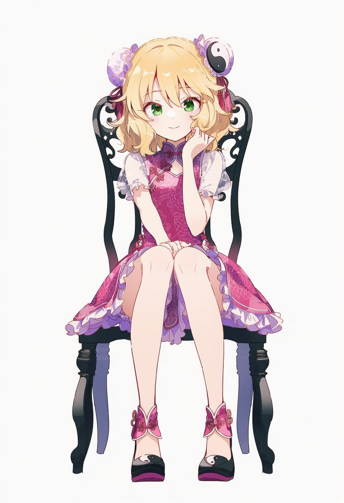

| 字段 | 内容 |
| --- | --- |
| Danbooru Tag | yin_yang_hair_ornament |
| 中文名 | 阴阳发饰 |
| 中文含义 | 阴阳造型的发饰。 |
| 子类 | 造型发饰 |
| 模特 | aru_(blue_archive) |
| 序号 | 0143 |

## 144. watermelon_hair_ornament — 西瓜发饰

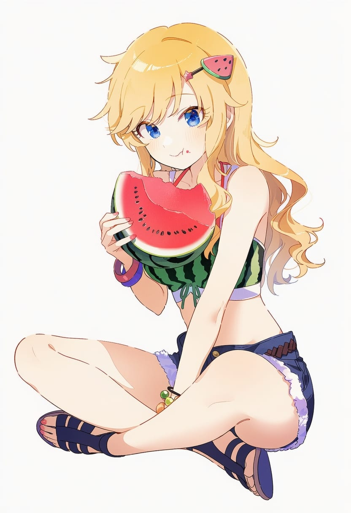

| 字段 | 内容 |
| --- | --- |
| Danbooru Tag | watermelon_hair_ornament |
| 中文名 | 西瓜发饰 |
| 中文含义 | 西瓜造型的发饰。 |
| 子类 | 造型发饰 |
| 模特 | kayoko_(blue_archive) |
| 序号 | 0144 |

## 145. club_hair_ornament — 梅花牌发饰

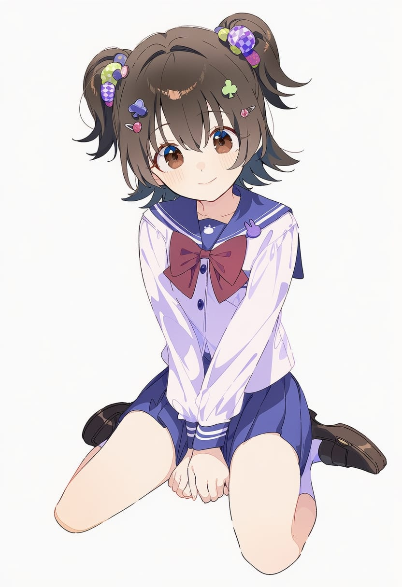

| 字段 | 内容 |
| --- | --- |
| Danbooru Tag | club_hair_ornament |
| 中文名 | 梅花牌发饰 |
| 中文含义 | 梅花牌造型的发饰。 |
| 子类 | 造型发饰 |
| 模特 | fuuka_(blue_archive) |
| 序号 | 0145 |

## 146. peacock_feathers_hair_ornament — 孔雀羽毛发饰

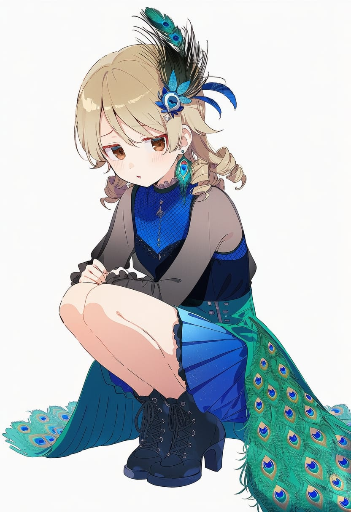

| 字段 | 内容 |
| --- | --- |
| Danbooru Tag | peacock_feathers_hair_ornament |
| 中文名 | 孔雀羽毛发饰 |
| 中文含义 | 孔雀羽毛造型的发饰。 |
| 子类 | 造型发饰 |
| 模特 | juri_(blue_archive) |
| 序号 | 0146 |

## 147. eye_hair_ornament — 眼睛发饰

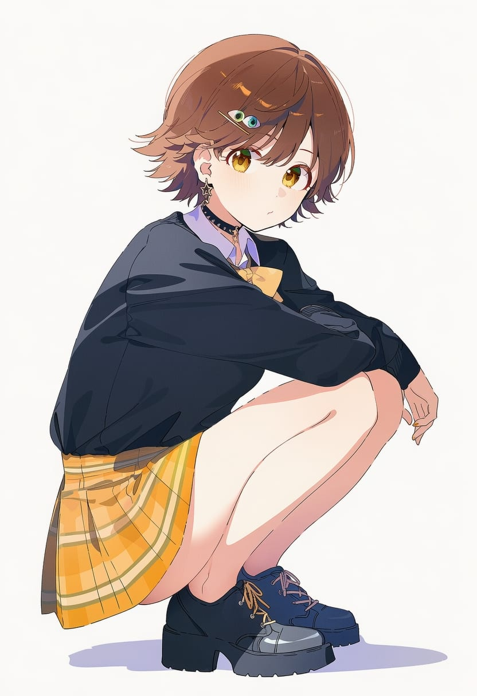

| 字段 | 内容 |
| --- | --- |
| Danbooru Tag | eye_hair_ornament |
| 中文名 | 眼睛发饰 |
| 中文含义 | 眼睛造型的发饰。 |
| 子类 | 造型发饰 |
| 模特 | pina_(blue_archive) |
| 序号 | 0147 |

## 148. scissors_hair_ornament — 剪刀发饰

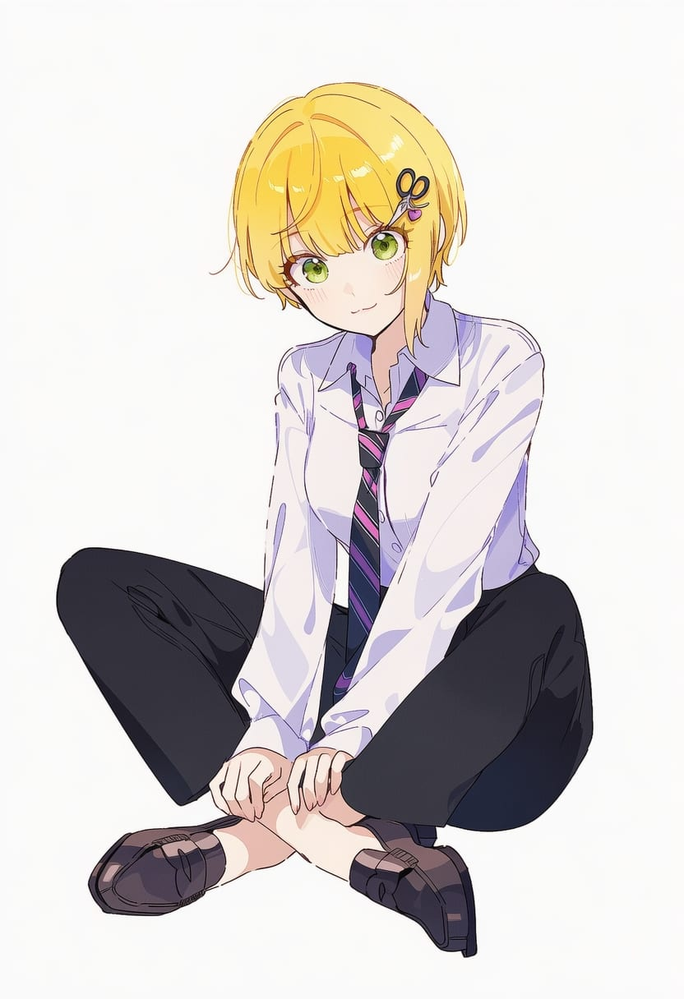

| 字段 | 内容 |
| --- | --- |
| Danbooru Tag | scissors_hair_ornament |
| 中文名 | 剪刀发饰 |
| 中文含义 | 剪刀造型的发饰。 |
| 子类 | 造型发饰 |
| 模特 | tsubaki_(blue_archive) |
| 序号 | 0148 |

## 149. ice_cream_hair_ornament — 冰淇淋发饰

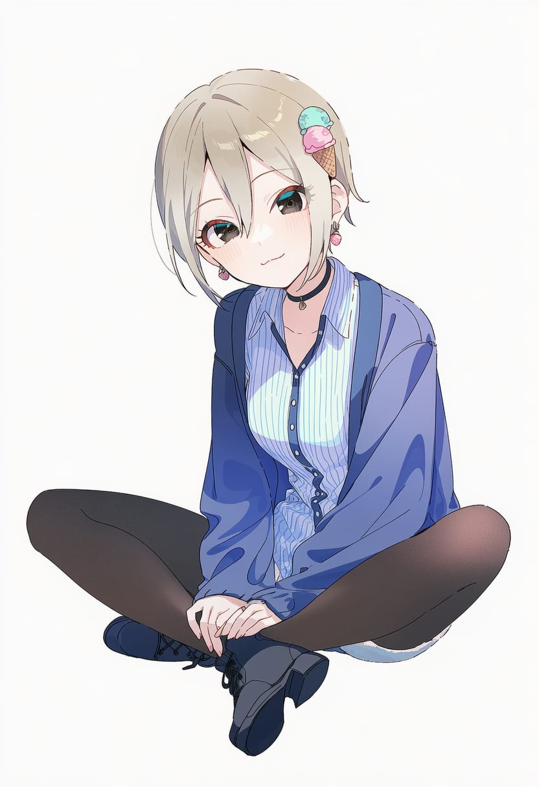

| 字段 | 内容 |
| --- | --- |
| Danbooru Tag | ice_cream_hair_ornament |
| 中文名 | 冰淇淋发饰 |
| 中文含义 | 冰淇淋造型的发饰。 |
| 子类 | 造型发饰 |
| 模特 | chise_(blue_archive) |
| 序号 | 0149 |

## 150. grenade_hair_ornament — 手榴弹发饰

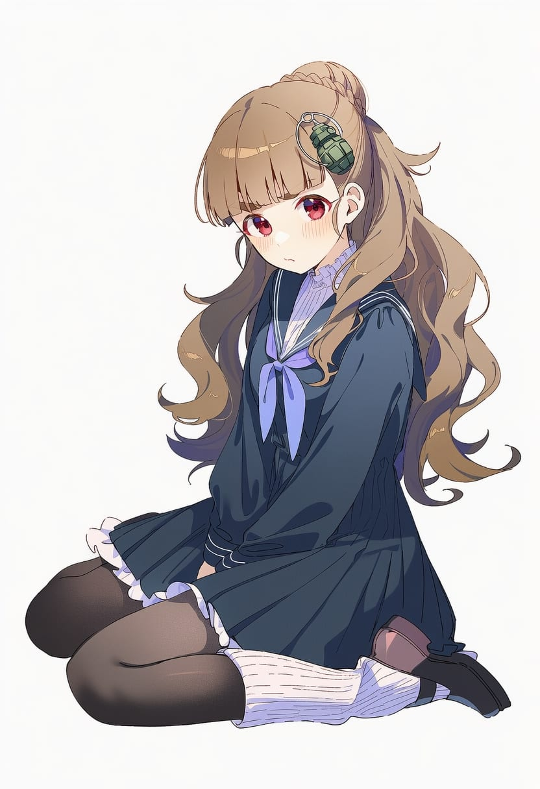

| 字段 | 内容 |
| --- | --- |
| Danbooru Tag | grenade_hair_ornament |
| 中文名 | 手榴弹发饰 |
| 中文含义 | 手榴弹造型的发饰。 |
| 子类 | 造型发饰 |
| 模特 | rin_(blue_archive) |
| 序号 | 0150 |

## 151. orange_hair_ornament — 橙子发饰

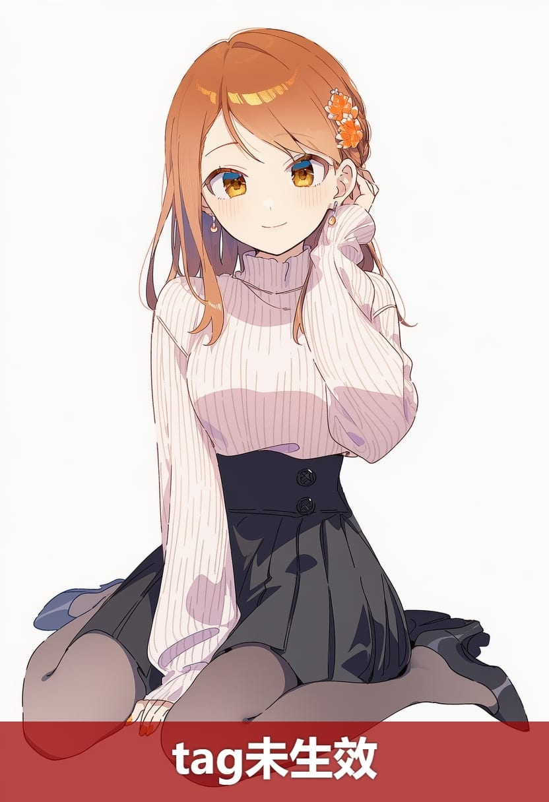

| 字段 | 内容 |
| --- | --- |
| Danbooru Tag | orange_hair_ornament |
| 中文名 | 橙子发饰 |
| 中文含义 | 橙子造型的发饰。 |
| 子类 | 造型发饰 |
| 模特 | ayumu_(blue_archive) |
| 序号 | 0151 |

## 152. number_hair_ornament — 数字发饰

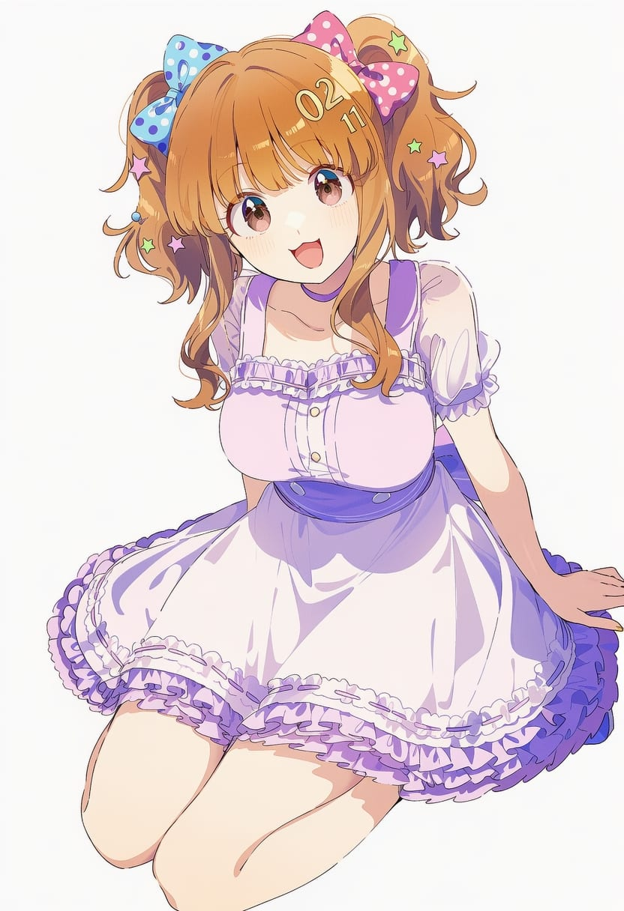

| 字段 | 内容 |
| --- | --- |
| Danbooru Tag | number_hair_ornament |
| 中文名 | 数字发饰 |
| 中文含义 | 数字造型的发饰。 |
| 子类 | 造型发饰 |
| 模特 | momoka_(blue_archive) |
| 序号 | 0152 |

## 153. penguin_hair_ornament — 企鹅发饰

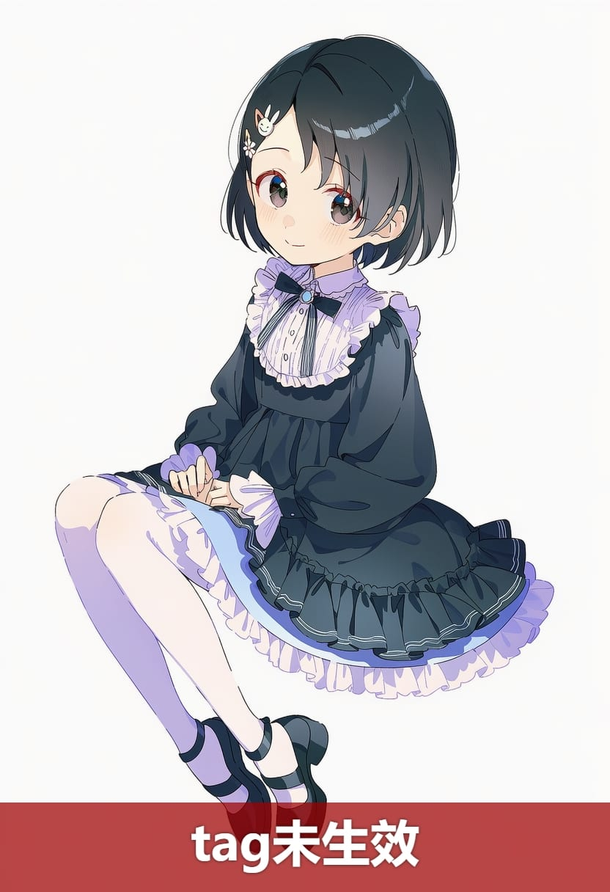

| 字段 | 内容 |
| --- | --- |
| Danbooru Tag | penguin_hair_ornament |
| 中文名 | 企鹅发饰 |
| 中文含义 | 企鹅造型的发饰。 |
| 子类 | 造型发饰 |
| 模特 | nonomi_(blue_archive) |
| 序号 | 0153 |

## 154. key_hair_ornament — 钥匙发饰

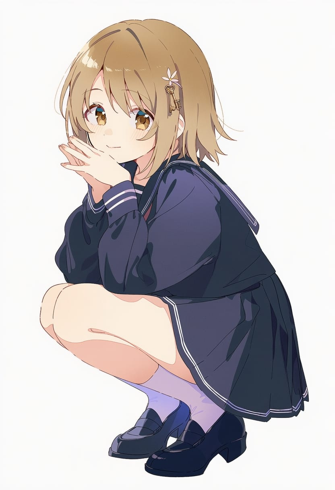

| 字段 | 内容 |
| --- | --- |
| Danbooru Tag | key_hair_ornament |
| 中文名 | 钥匙发饰 |
| 中文含义 | 钥匙造型的发饰。 |
| 子类 | 造型发饰 |
| 模特 | ayane_(blue_archive) |
| 序号 | 0154 |

## 155. green_hair_ornament — 绿色发饰

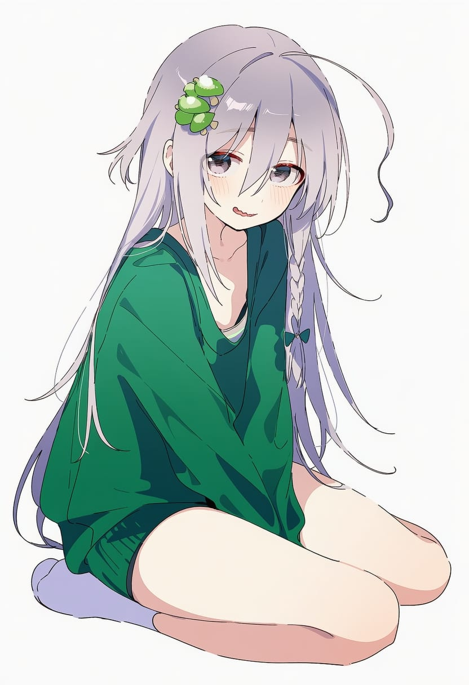

| 字段 | 内容 |
| --- | --- |
| Danbooru Tag | green_hair_ornament |
| 中文名 | 绿色发饰 |
| 中文含义 | 绿色的发饰；通用发饰纯颜色款只留这一种代表。 |
| 子类 | 造型发饰 |
| 模特 | hoshino_(blue_archive) |
| 序号 | 0155 |

## 156. fruit_hair_ornament — 水果发饰

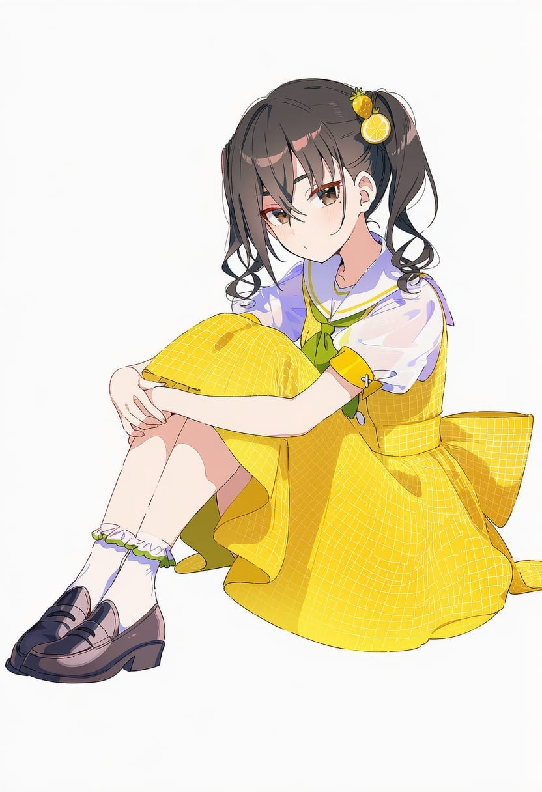

| 字段 | 内容 |
| --- | --- |
| Danbooru Tag | fruit_hair_ornament |
| 中文名 | 水果发饰 |
| 中文含义 | 水果造型的发饰。 |
| 子类 | 造型发饰 |
| 模特 | shiroko_(blue_archive) |
| 序号 | 0156 |

## 157. name_tag_hair_ornament — 名牌发饰

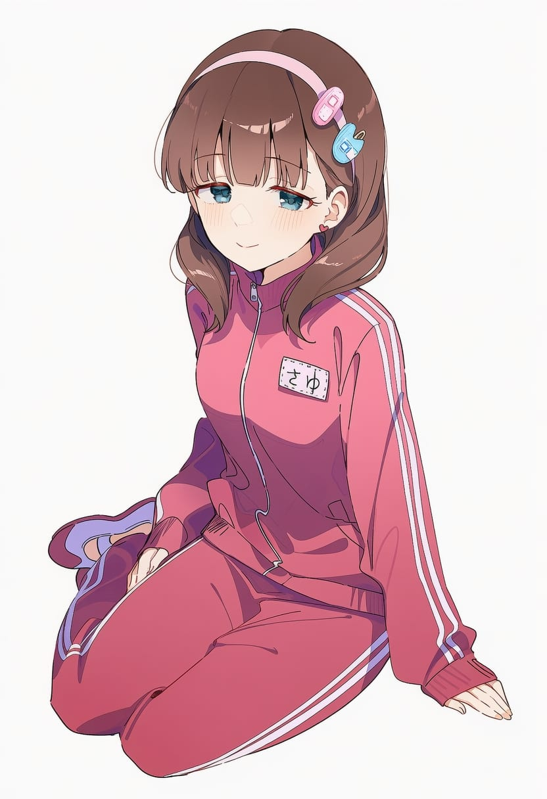

| 字段 | 内容 |
| --- | --- |
| Danbooru Tag | name_tag_hair_ornament |
| 中文名 | 名牌发饰 |
| 中文含义 | 名牌造型的发饰。 |
| 子类 | 造型发饰 |
| 模特 | serika_(blue_archive) |
| 序号 | 0157 |

## 158. shrimp_hair_ornament — 虾发饰

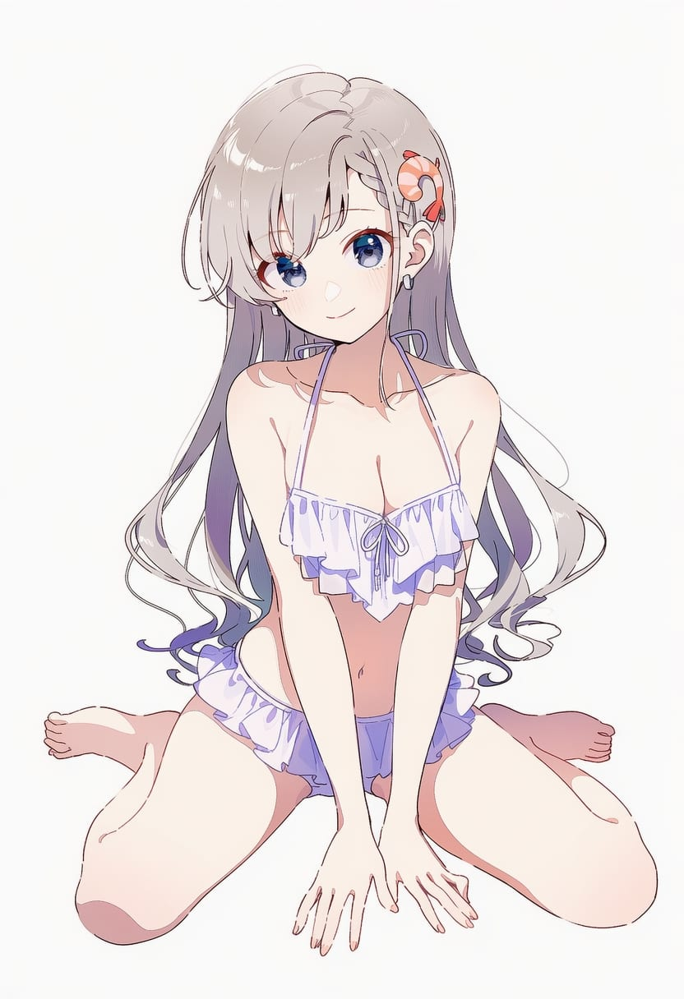

| 字段 | 内容 |
| --- | --- |
| Danbooru Tag | shrimp_hair_ornament |
| 中文名 | 虾发饰 |
| 中文含义 | 虾造型的发饰。 |
| 子类 | 造型发饰 |
| 模特 | mashiro_(blue_archive) |
| 序号 | 0158 |

## 159. palette_hair_ornament — 调色盘发饰

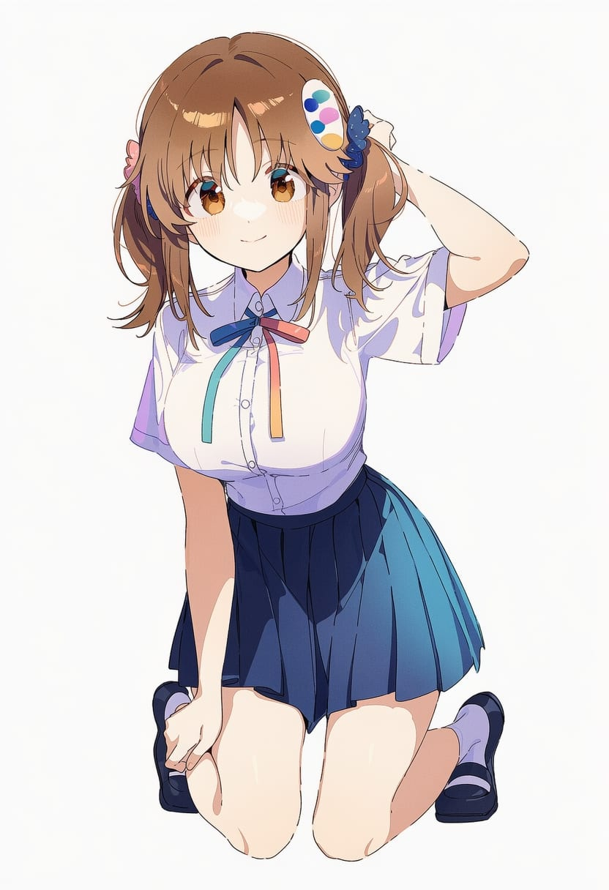

| 字段 | 内容 |
| --- | --- |
| Danbooru Tag | palette_hair_ornament |
| 中文名 | 调色盘发饰 |
| 中文含义 | 调色盘造型的发饰。 |
| 子类 | 造型发饰 |
| 模特 | shizuko_(blue_archive) |
| 序号 | 0159 |

## 160. spiked_hair_ornament — 尖刺发饰

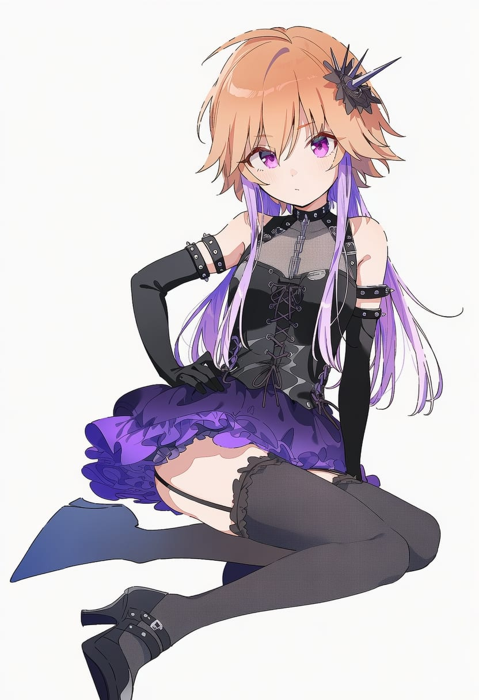

| 字段 | 内容 |
| --- | --- |
| Danbooru Tag | spiked_hair_ornament |
| 中文名 | 尖刺发饰 |
| 中文含义 | 带明显尖刺结构的发饰。 |
| 子类 | 造型发饰 |
| 模特 | izuna_(blue_archive) |
| 序号 | 0160 |

## 161. orca_hair_ornament — 虎鲸发饰

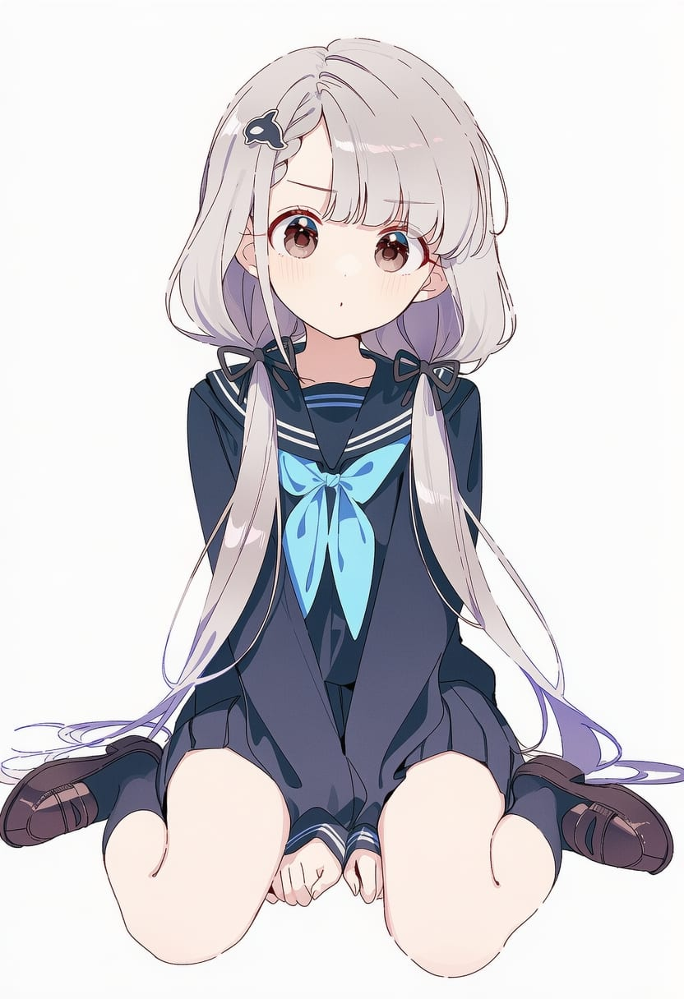

| 字段 | 内容 |
| --- | --- |
| Danbooru Tag | orca_hair_ornament |
| 中文名 | 虎鲸发饰 |
| 中文含义 | 虎鲸造型的发饰。 |
| 子类 | 造型发饰 |
| 模特 | aris_(blue_archive) |
| 序号 | 0161 |

## 162. sun_hair_ornament — 太阳发饰

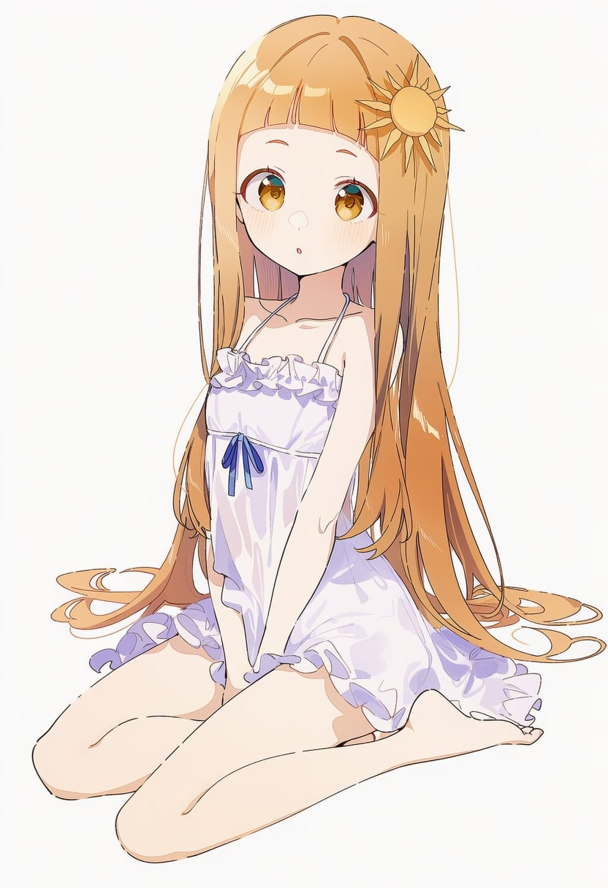

| 字段 | 内容 |
| --- | --- |
| Danbooru Tag | sun_hair_ornament |
| 中文名 | 太阳发饰 |
| 中文含义 | 太阳造型的发饰。 |
| 子类 | 造型发饰 |
| 模特 | momoi_(blue_archive) |
| 序号 | 0162 |

## 163. cake_hair_ornament — 蛋糕发饰

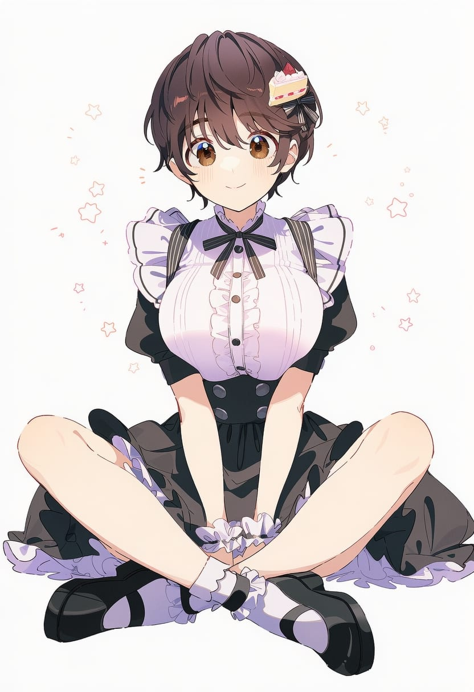

| 字段 | 内容 |
| --- | --- |
| Danbooru Tag | cake_hair_ornament |
| 中文名 | 蛋糕发饰 |
| 中文含义 | 蛋糕造型的发饰。 |
| 子类 | 造型发饰 |
| 模特 | midori_(blue_archive) |
| 序号 | 0163 |

## 164. macaron_hair_ornament — 马卡龙发饰

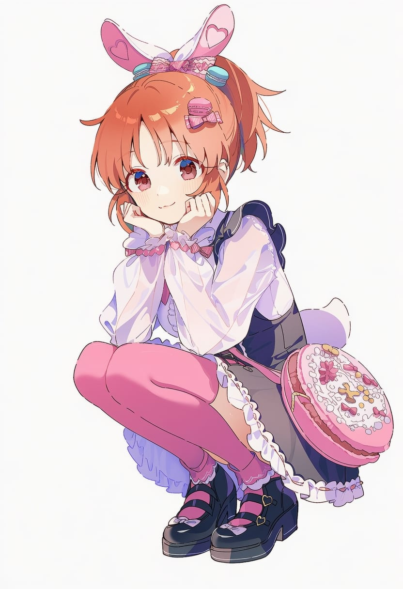

| 字段 | 内容 |
| --- | --- |
| Danbooru Tag | macaron_hair_ornament |
| 中文名 | 马卡龙发饰 |
| 中文含义 | 马卡龙造型的发饰。 |
| 子类 | 造型发饰 |
| 模特 | cherino_(blue_archive) |
| 序号 | 0164 |

## 165. paintbrush_hair_ornament — 画笔发饰

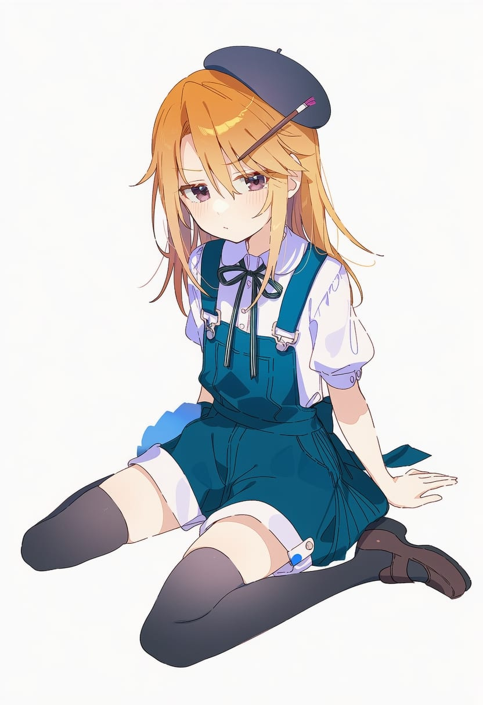

| 字段 | 内容 |
| --- | --- |
| Danbooru Tag | paintbrush_hair_ornament |
| 中文名 | 画笔发饰 |
| 中文含义 | 画笔造型的发饰。 |
| 子类 | 造型发饰 |
| 模特 | nodoka_(blue_archive) |
| 序号 | 0165 |

## 166. arrow_hair_ornament — 箭头发饰

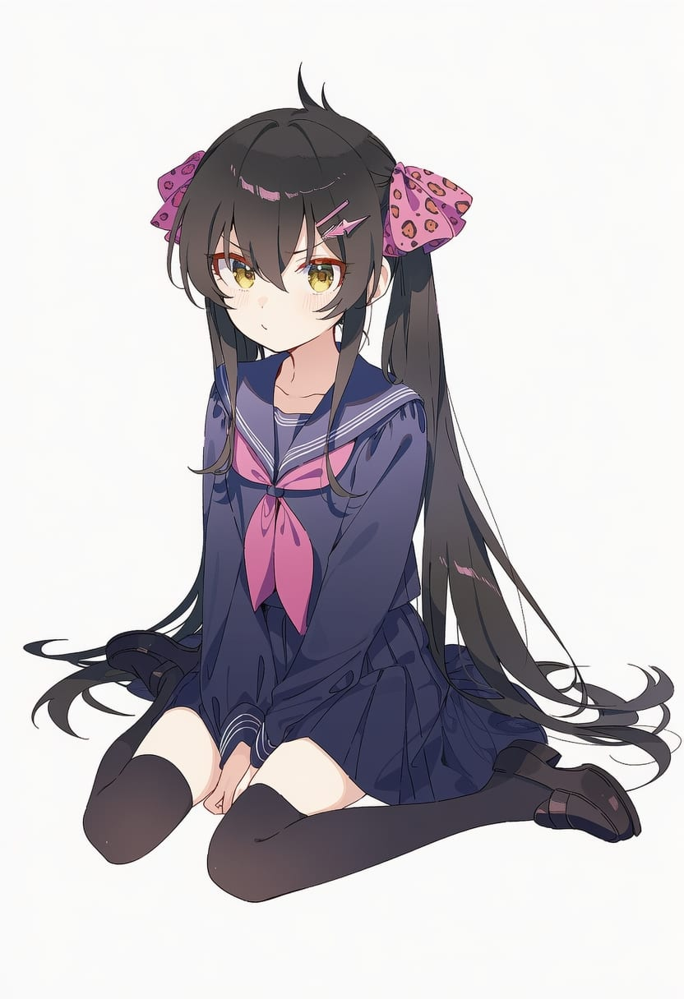

| 字段 | 内容 |
| --- | --- |
| Danbooru Tag | arrow_hair_ornament |
| 中文名 | 箭头发饰 |
| 中文含义 | 箭头造型的发饰。 |
| 子类 | 造型发饰 |
| 模特 | yuzu_(blue_archive) |
| 序号 | 0166 |

## 167. christmas_tree_hair_ornament — 圣诞树发饰

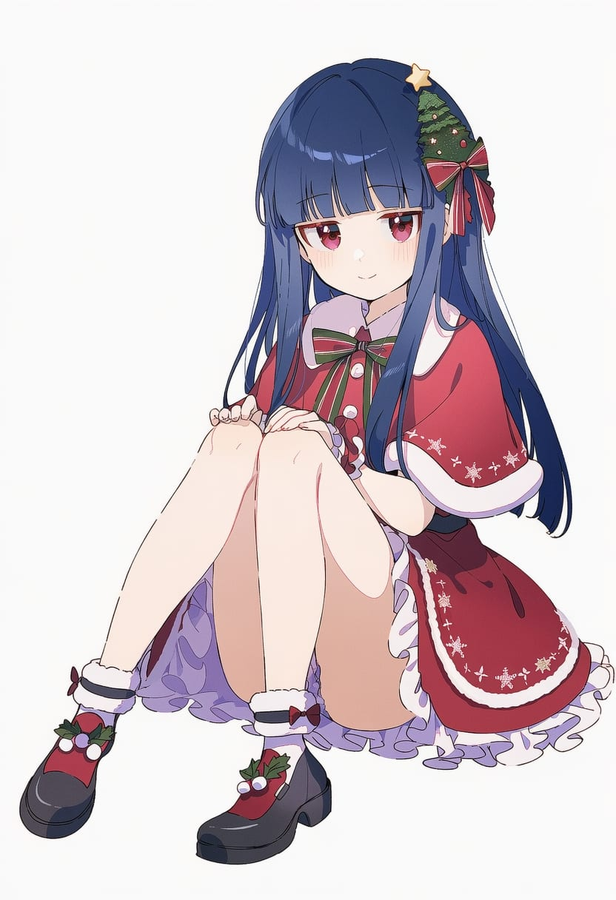

| 字段 | 内容 |
| --- | --- |
| Danbooru Tag | christmas_tree_hair_ornament |
| 中文名 | 圣诞树发饰 |
| 中文含义 | 圣诞树造型的发饰。 |
| 子类 | 造型发饰 |
| 模特 | hanako_(blue_archive) |
| 序号 | 0167 |

## 168. hair_ornament — 发饰

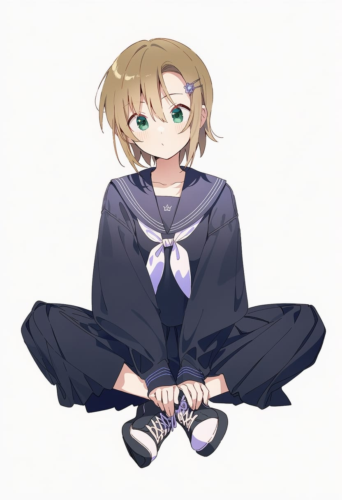

| 字段 | 内容 |
| --- | --- |
| Danbooru Tag | hair_ornament |
| 中文名 | 发饰 |
| 中文含义 | 泛指戴在头发上的装饰物。 |
| 子类 | 其他发饰 |
| 模特 | azusa_(blue_archive) |
| 序号 | 0168 |

## 169. hair_flower — 发花

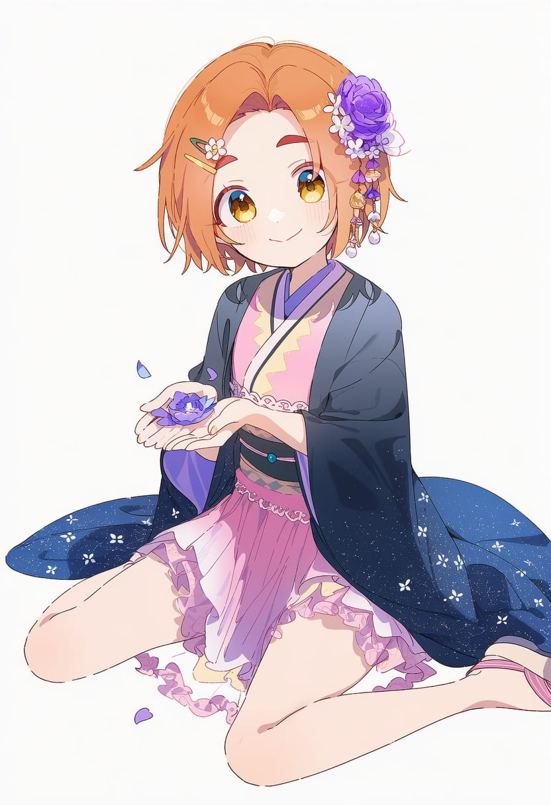

| 字段 | 内容 |
| --- | --- |
| Danbooru Tag | hair_flower |
| 中文名 | 发花 |
| 中文含义 | 戴在头发上的花朵装饰。 |
| 子类 | 其他发饰 |
| 模特 | koharu_(blue_archive) |
| 序号 | 0169 |

## 170. hair_bell — 发铃

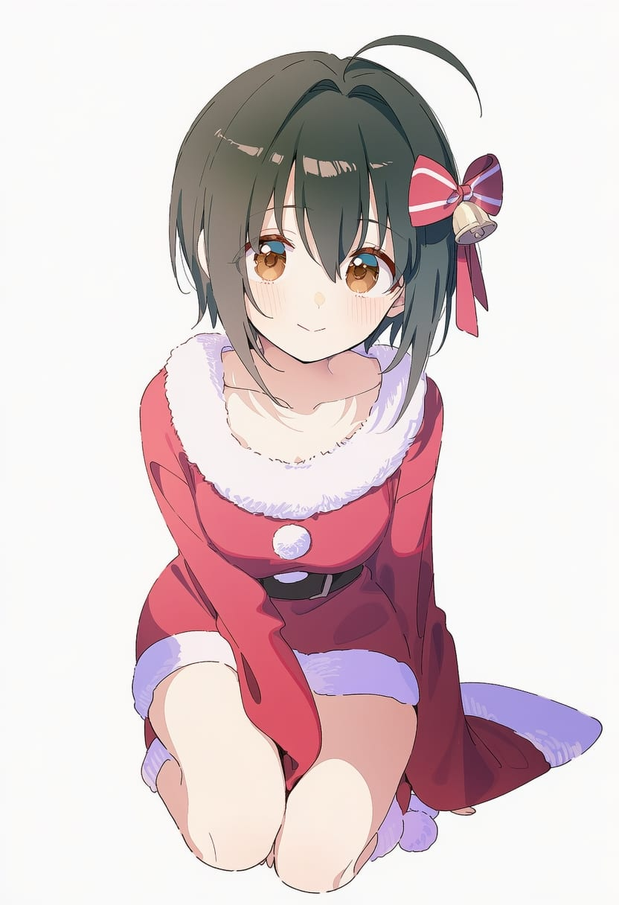

| 字段 | 内容 |
| --- | --- |
| Danbooru Tag | hair_bell |
| 中文名 | 发铃 |
| 中文含义 | 戴在头发上的铃铛装饰。 |
| 子类 | 其他发饰 |
| 模特 | kirino_(blue_archive) |
| 序号 | 0170 |

## 171. hair_beads — 发珠

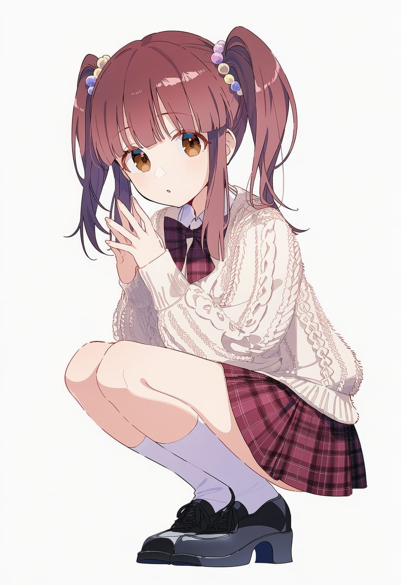

| 字段 | 内容 |
| --- | --- |
| Danbooru Tag | hair_beads |
| 中文名 | 发珠 |
| 中文含义 | 串在或固定在头发上的珠子。 |
| 子类 | 其他发饰 |
| 模特 | natsu_(blue_archive) |
| 序号 | 0171 |

## 172. hair_extensions — 接发

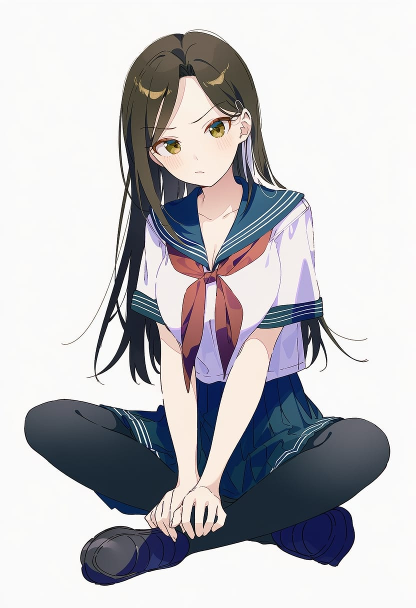

| 字段 | 内容 |
| --- | --- |
| Danbooru Tag | hair_extensions |
| 中文名 | 接发 |
| 中文含义 | 额外接在原本头发上的发束。 |
| 子类 | 其他发饰 |
| 模特 | mari_(blue_archive) |
| 序号 | 0172 |

## 173. ring_hair_extensions — 环形接发

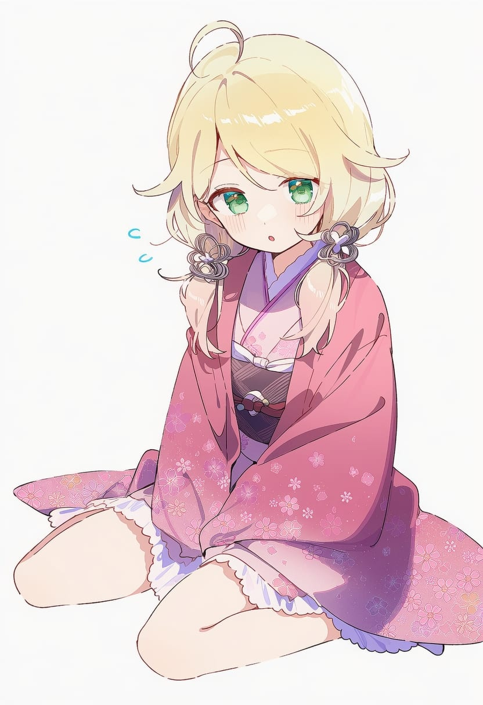

| 字段 | 内容 |
| --- | --- |
| Danbooru Tag | ring_hair_extensions |
| 中文名 | 环形接发 |
| 中文含义 | 带圆环结构的接发。 |
| 子类 | 其他发饰 |
| 模特 | ako_(blue_archive) |
| 序号 | 0173 |

## 174. too_many_hair_ornaments — 大量发饰

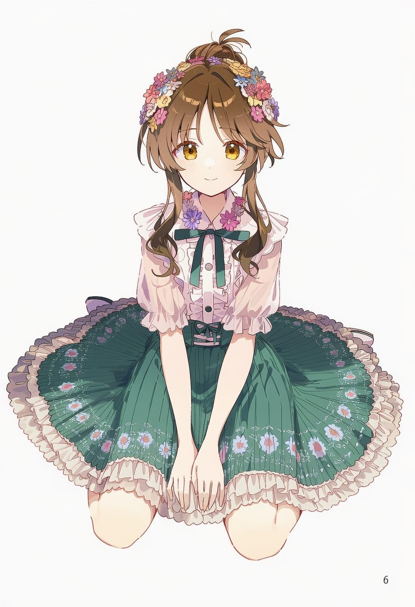

| 字段 | 内容 |
| --- | --- |
| Danbooru Tag | too_many_hair_ornaments |
| 中文名 | 大量发饰 |
| 中文含义 | 头发上堆了很多不同发饰。 |
| 子类 | 其他发饰 |
| 模特 | tomoe_(blue_archive) |
| 序号 | 0174 |

---
