# 头饰

## 1. hat — 帽子

| 字段 | 内容 |
| --- | --- |
| Danbooru Tag | hat |
| 中文名 | 帽子 |
| 中文含义 | 泛指戴在头上的帽子。 |
| 子类 | 帽子 |
| 模特 | arona_(blue_archive) |
| 序号 | 0001 |

## 2. black_hat — 黑色帽子

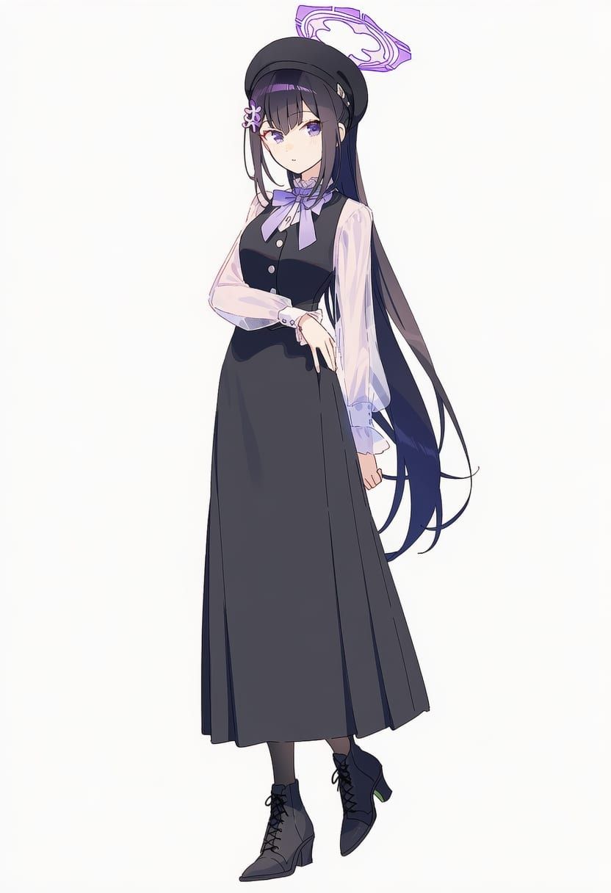

| 字段 | 内容 |
| --- | --- |
| Danbooru Tag | black_hat |
| 中文名 | 黑色帽子 |
| 中文含义 | 黑色帽子；纯颜色款只留这一种代表。 |
| 子类 | 帽子 |
| 模特 | sumire_(blue_archive) |
| 序号 | 0002 |

## 3. baseball_cap — 棒球帽

| 字段 | 内容 |
| --- | --- |
| Danbooru Tag | baseball_cap |
| 中文名 | 棒球帽 |
| 中文含义 | 带前帽檐的棒球帽。 |
| 子类 | 帽子 |
| 模特 | asuna_(blue_archive) |
| 序号 | 0003 |

## 4. deerstalker — 猎鹿帽

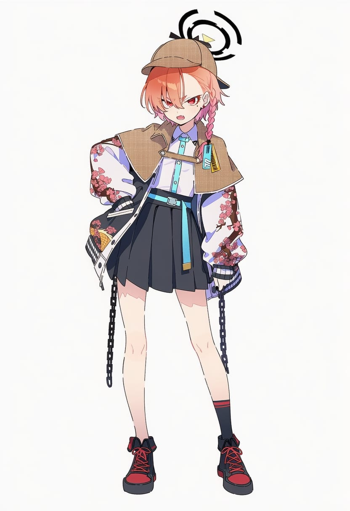

| 字段 | 内容 |
| --- | --- |
| Danbooru Tag | deerstalker |
| 中文名 | 猎鹿帽 |
| 中文含义 | 前后都有帽檐的猎鹿帽。 |
| 子类 | 帽子 |
| 模特 | neru_(blue_archive) |
| 序号 | 0005 |

## 5. field_cap — 野战帽

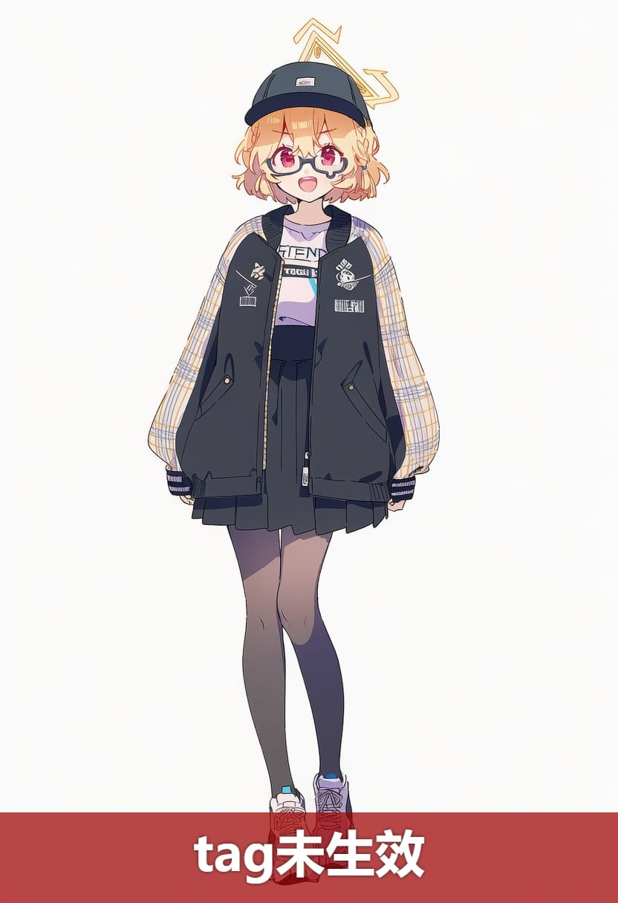

| 字段 | 内容 |
| --- | --- |
| Danbooru Tag | field_cap |
| 中文名 | 野战帽 |
| 中文含义 | 军用软质野战帽。 |
| 子类 | 帽子 |
| 模特 | kotori_(blue_archive) |
| 序号 | 0007 |

## 6. kepi — 平顶军帽

| 字段 | 内容 |
| --- | --- |
| Danbooru Tag | kepi |
| 中文名 | 平顶军帽 |
| 中文含义 | 圆筒形、带短帽檐的军帽。 |
| 子类 | 帽子 |
| 模特 | hibiki_(blue_archive) |
| 序号 | 0008 |

## 7. m43_field_cap_未生效 — M43野战帽

| 字段 | 内容 |
| --- | --- |
| Danbooru Tag | m43_field_cap_未生效 |
| 中文名 | M43野战帽 |
| 中文含义 | 二战时期常见的德式野战帽。 |
| 子类 | 帽子 |
| 模特 | utaha_(blue_archive) |
| 序号 | 0009 |

## 8. newsboy_cap — 报童帽

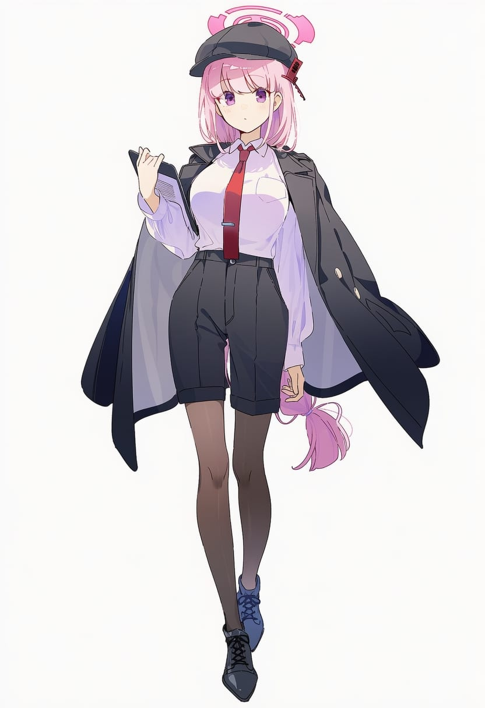

| 字段 | 内容 |
| --- | --- |
| Danbooru Tag | newsboy_cap |
| 中文名 | 报童帽 |
| 中文含义 | 圆鼓帽顶、带短帽檐的报童帽。 |
| 子类 | 帽子 |
| 模特 | eimi_(blue_archive) |
| 序号 | 0011 |

## 9. peaked_cap — 大檐帽

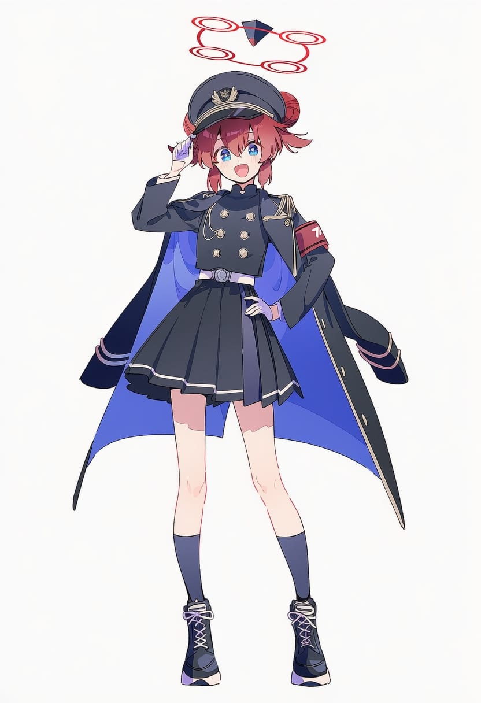

| 字段 | 内容 |
| --- | --- |
| Danbooru Tag | peaked_cap |
| 中文名 | 大檐帽 |
| 中文含义 | 军警制服常见的硬挺大檐帽。 |
| 子类 | 帽子 |
| 模特 | maki_(blue_archive) |
| 序号 | 0012 |

## 10. shako_cap — 筒形军乐帽

| 字段 | 内容 |
| --- | --- |
| Danbooru Tag | shako_cap |
| 中文名 | 筒形军乐帽 |
| 中文含义 | 高筒形的军乐队或军服帽。 |
| 子类 | 帽子 |
| 模特 | hare_(blue_archive) |
| 序号 | 0013 |

## 11. mini_shako_cap — 迷你筒形帽

| 字段 | 内容 |
| --- | --- |
| Danbooru Tag | mini_shako_cap |
| 中文名 | 迷你筒形帽 |
| 中文含义 | 缩小版的筒形军乐帽。 |
| 子类 | 帽子 |
| 模特 | kotama_(blue_archive) |
| 序号 | 0014 |

## 12. bicorne — 双角帽

| 字段 | 内容 |
| --- | --- |
| Danbooru Tag | bicorne |
| 中文名 | 双角帽 |
| 中文含义 | 左右两侧翘起的双角帽。 |
| 子类 | 帽子 |
| 模特 | yoshimi_(blue_archive) |
| 序号 | 0015 |

## 13. boater_hat — 平顶草帽

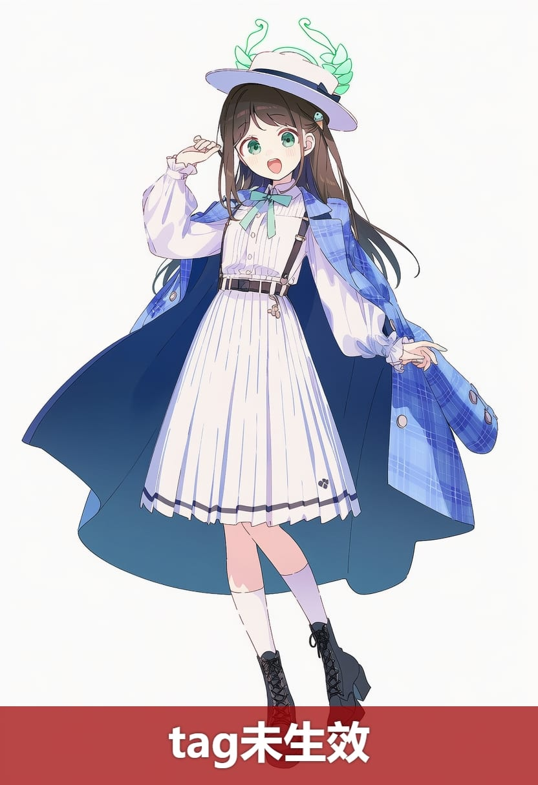

| 字段 | 内容 |
| --- | --- |
| Danbooru Tag | boater_hat |
| 中文名 | 平顶草帽 |
| 中文含义 | 硬质平顶、平帽檐的草帽。 |
| 子类 | 帽子 |
| 模特 | airi_(blue_archive) |
| 序号 | 0016 |

## 14. boonie_hat — 丛林帽

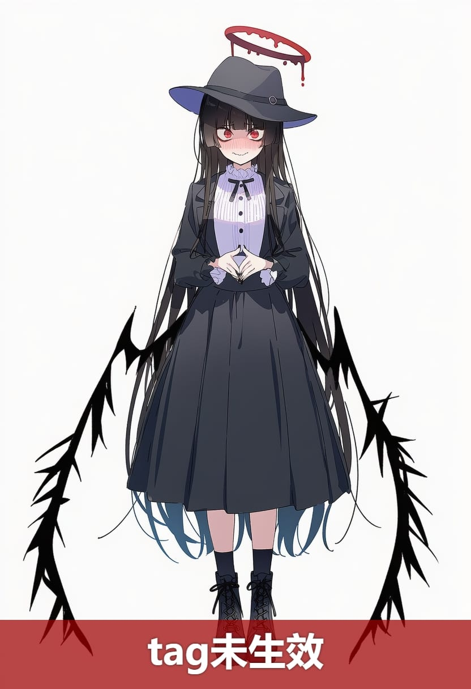

| 字段 | 内容 |
| --- | --- |
| Danbooru Tag | boonie_hat |
| 中文名 | 丛林帽 |
| 中文含义 | 柔软宽檐的户外军用帽。 |
| 子类 | 帽子 |
| 模特 | tsurugi_(blue_archive) |
| 序号 | 0017 |

## 15. bowler_hat — 圆顶礼帽

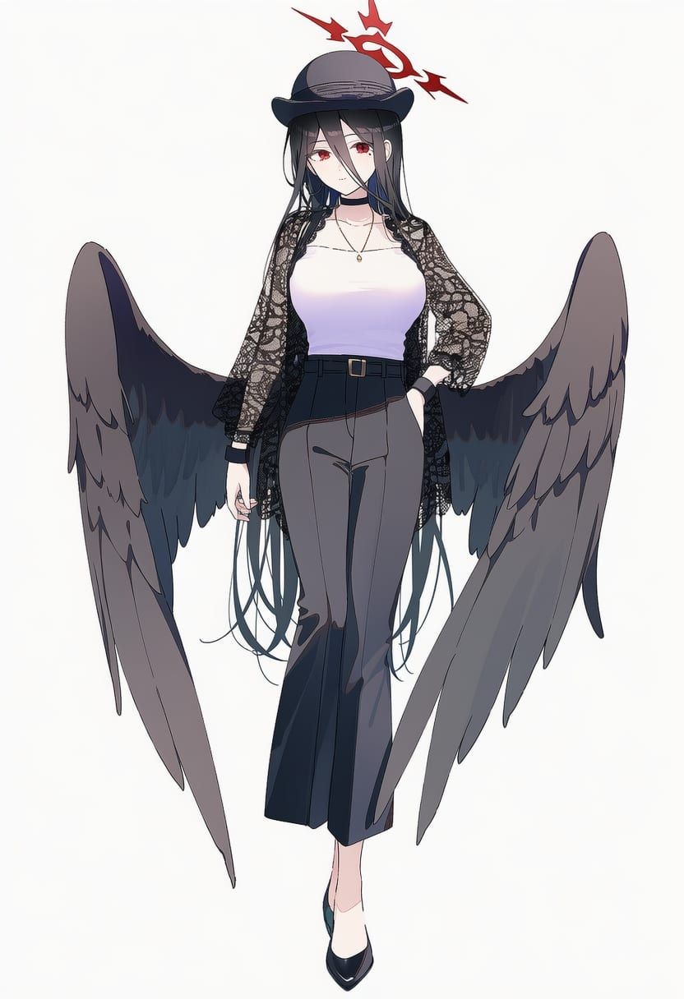

| 字段 | 内容 |
| --- | --- |
| Danbooru Tag | bowler_hat |
| 中文名 | 圆顶礼帽 |
| 中文含义 | 圆顶、窄帽檐的硬礼帽。 |
| 子类 | 帽子 |
| 模特 | hasumi_(blue_archive) |
| 序号 | 0018 |

## 16. bucket_hat — 渔夫帽

| 字段 | 内容 |
| --- | --- |
| Danbooru Tag | bucket_hat |
| 中文名 | 渔夫帽 |
| 中文含义 | 帽檐向下垂的桶形帽。 |
| 子类 | 帽子 |
| 模特 | shimiko_(blue_archive) |
| 序号 | 0019 |

## 17. cavalier_hat — 骑士宽檐帽

| 字段 | 内容 |
| --- | --- |
| Danbooru Tag | cavalier_hat |
| 中文名 | 骑士宽檐帽 |
| 中文含义 | 宽帽檐、常带羽毛的骑士风帽子。 |
| 子类 | 帽子 |
| 模特 | hanae_(blue_archive) |
| 序号 | 0021 |

## 18. cloche_hat — 钟形帽

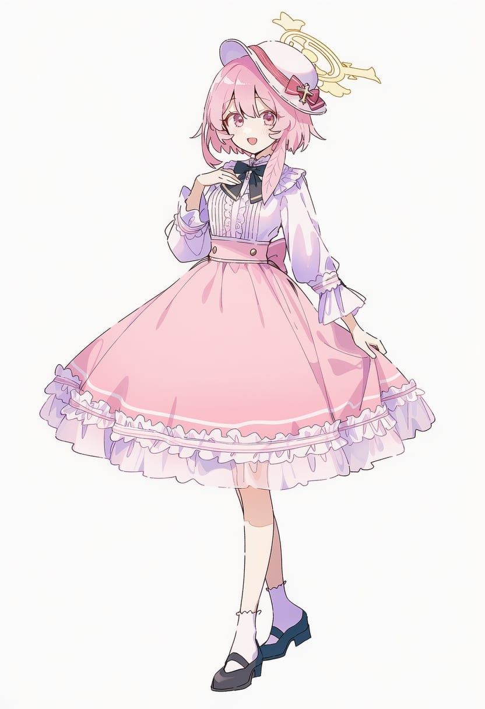

| 字段 | 内容 |
| --- | --- |
| Danbooru Tag | cloche_hat |
| 中文名 | 钟形帽 |
| 中文含义 | 贴头、向下包覆的钟形女帽。 |
| 子类 | 帽子 |
| 模特 | serina_(blue_archive) |
| 序号 | 0022 |

## 19. cowboy_hat — 牛仔帽

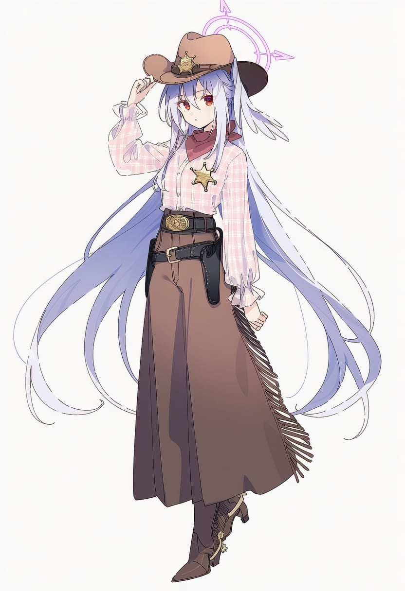

| 字段 | 内容 |
| --- | --- |
| Danbooru Tag | cowboy_hat |
| 中文名 | 牛仔帽 |
| 中文含义 | 高帽冠、宽帽檐的西部牛仔帽。 |
| 子类 | 帽子 |
| 模特 | suzumi_(blue_archive) |
| 序号 | 0023 |

## 20. straw_hat — 草帽

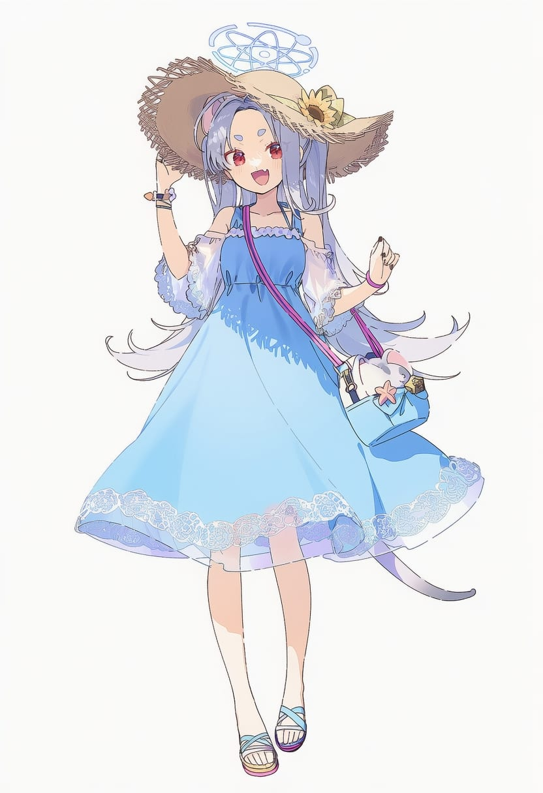

| 字段 | 内容 |
| --- | --- |
| Danbooru Tag | straw_hat |
| 中文名 | 草帽 |
| 中文含义 | 用草或类似材质编成的帽子。 |
| 子类 | 帽子 |
| 模特 | saya_(blue_archive) |
| 序号 | 0024 |

## 21. ajirogasa — 编笠

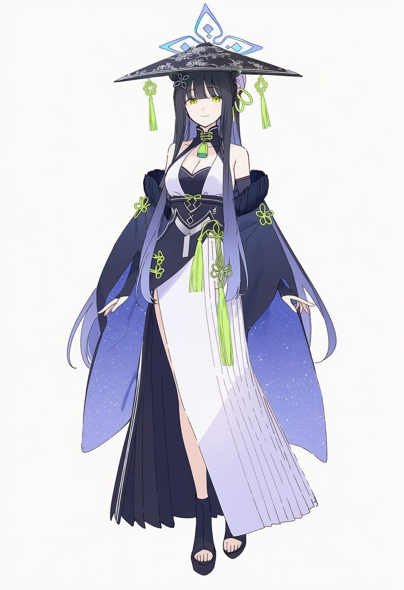

| 字段 | 内容 |
| --- | --- |
| Danbooru Tag | ajirogasa |
| 中文名 | 编笠 |
| 中文含义 | 竹编圆锥形日式斗笠。 |
| 子类 | 帽子 |
| 模特 | shun_(blue_archive) |
| 序号 | 0025 |

## 22. ichimegasa — 市女笠

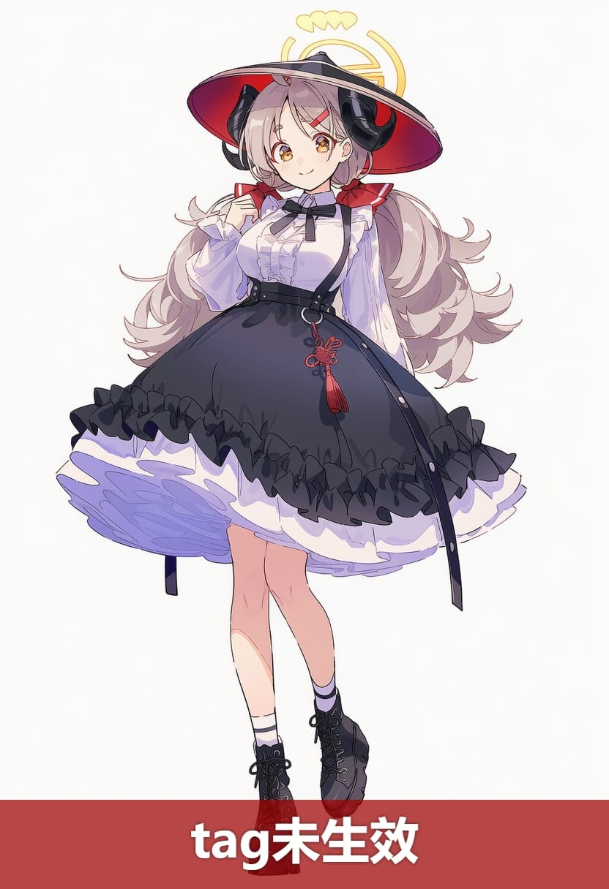

| 字段 | 内容 |
| --- | --- |
| Danbooru Tag | ichimegasa |
| 中文名 | 市女笠 |
| 中文含义 | 常带垂纱的日式圆笠。 |
| 子类 | 帽子 |
| 模特 | izumi_(blue_archive) |
| 序号 | 0026 |

## 23. sandogasa — 三度笠

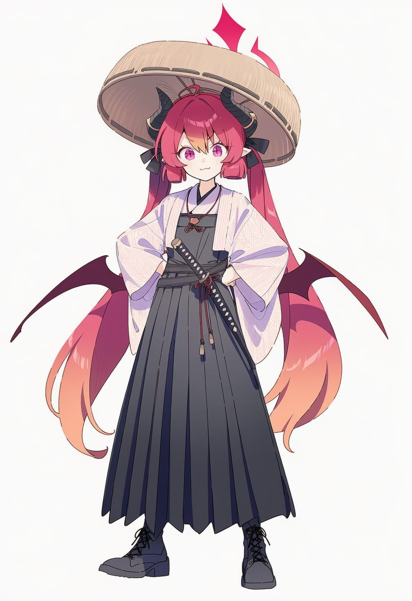

| 字段 | 内容 |
| --- | --- |
| Danbooru Tag | sandogasa |
| 中文名 | 三度笠 |
| 中文含义 | 圆润宽檐的日式斗笠。 |
| 子类 | 帽子 |
| 模特 | junko_(blue_archive) |
| 序号 | 0027 |

## 24. rice_hat — 斗笠

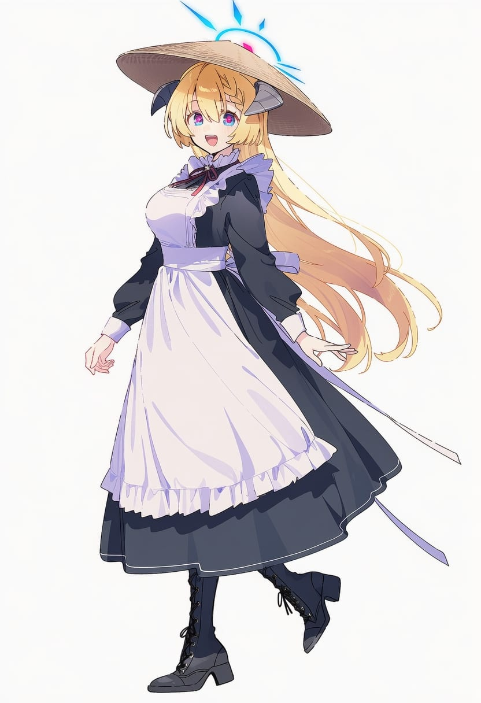

| 字段 | 内容 |
| --- | --- |
| Danbooru Tag | rice_hat |
| 中文名 | 斗笠 |
| 中文含义 | 亚洲常见的圆锥形斗笠。 |
| 子类 | 帽子 |
| 模特 | akari_(blue_archive) |
| 序号 | 0028 |

## 25. fascinator — 小礼帽饰

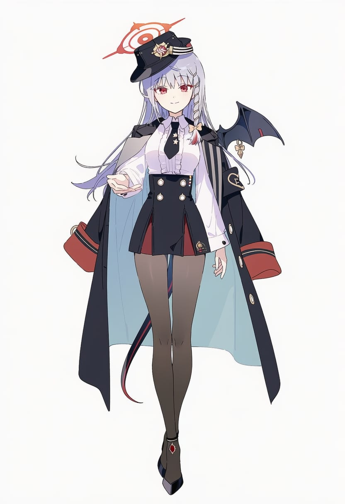

| 字段 | 内容 |
| --- | --- |
| Danbooru Tag | fascinator |
| 中文名 | 小礼帽饰 |
| 中文含义 | 偏装饰性的精致小型头饰帽。 |
| 子类 | 帽子 |
| 模特 | haruna_(blue_archive) |
| 序号 | 0029 |

## 26. fedora — 软呢礼帽

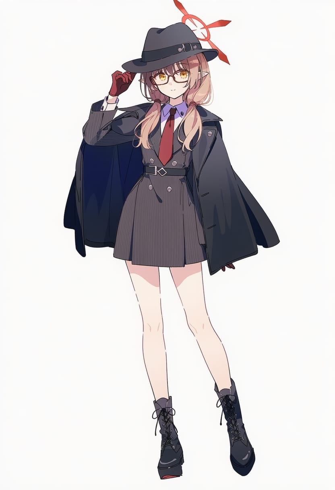

| 字段 | 内容 |
| --- | --- |
| Danbooru Tag | fedora |
| 中文名 | 软呢礼帽 |
| 中文含义 | 帽冠有凹痕的经典软呢帽。 |
| 子类 | 帽子 |
| 模特 | chinatsu_(blue_archive) |
| 序号 | 0030 |

## 27. female_service_cap — 女式制服帽

| 字段 | 内容 |
| --- | --- |
| Danbooru Tag | female_service_cap |
| 中文名 | 女式制服帽 |
| 中文含义 | 女性军警或制服人员常见的帽型。 |
| 子类 | 帽子 |
| 模特 | hina_(blue_archive) |
| 序号 | 0031 |

## 28. flat_cap — 鸭舌扁帽

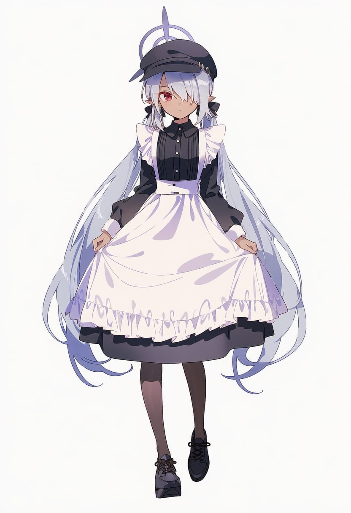

| 字段 | 内容 |
| --- | --- |
| Danbooru Tag | flat_cap |
| 中文名 | 鸭舌扁帽 |
| 中文含义 | 贴头的圆扁帽，前方有短檐。 |
| 子类 | 帽子 |
| 模特 | iori_(blue_archive) |
| 序号 | 0032 |

## 29. gat — 纱帽 / Gat

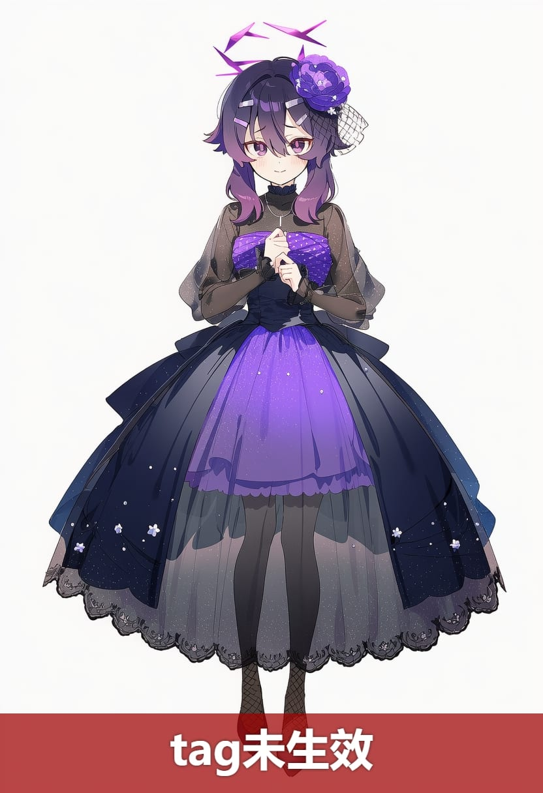

| 字段 | 内容 |
| --- | --- |
| Danbooru Tag | gat |
| 中文名 | 纱帽 / Gat |
| 中文含义 | 韩国传统黑色宽檐帽。 |
| 子类 | 帽子 |
| 模特 | haruka_(blue_archive) |
| 序号 | 0033 |

## 30. jingasa — 阵笠

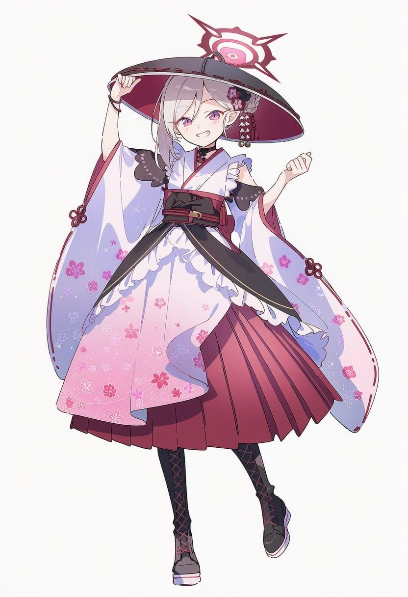

| 字段 | 内容 |
| --- | --- |
| Danbooru Tag | jingasa |
| 中文名 | 阵笠 |
| 中文含义 | 日本武士或足轻使用的圆锥军帽。 |
| 子类 | 帽子 |
| 模特 | mutsuki_(blue_archive) |
| 序号 | 0034 |

## 31. mob_cap — 软布女帽

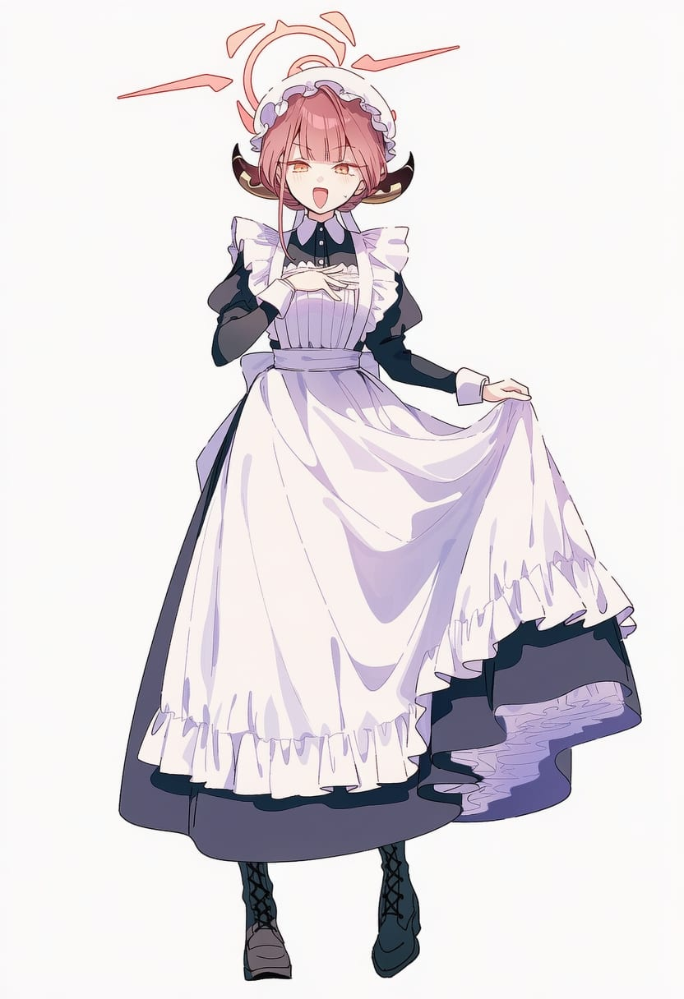

| 字段 | 内容 |
| --- | --- |
| Danbooru Tag | mob_cap |
| 中文名 | 软布女帽 |
| 中文含义 | 带褶边、包住头发的软布帽。 |
| 子类 | 帽子 |
| 模特 | aru_(blue_archive) |
| 序号 | 0035 |

## 32. picture_hat — 华丽宽檐女帽

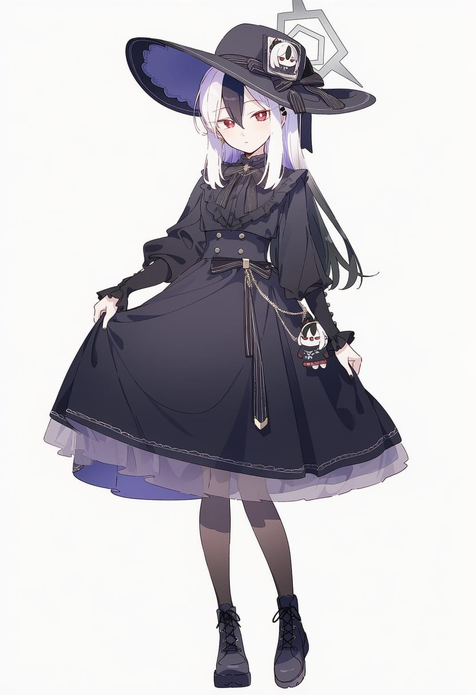

| 字段 | 内容 |
| --- | --- |
| Danbooru Tag | picture_hat |
| 中文名 | 华丽宽檐女帽 |
| 中文含义 | 宽帽檐并带大量装饰的礼帽。 |
| 子类 | 帽子 |
| 模特 | kayoko_(blue_archive) |
| 序号 | 0036 |

## 33. pirate_hat — 海盗帽

| 字段 | 内容 |
| --- | --- |
| Danbooru Tag | pirate_hat |
| 中文名 | 海盗帽 |
| 中文含义 | 典型海盗风格的帽子。 |
| 子类 | 帽子 |
| 模特 | fuuka_(blue_archive) |
| 序号 | 0037 |

## 34. pith_helmet — 殖民地遮阳盔

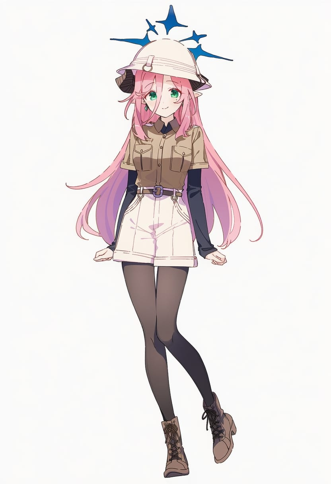

| 字段 | 内容 |
| --- | --- |
| Danbooru Tag | pith_helmet |
| 中文名 | 殖民地遮阳盔 |
| 中文含义 | 硬质圆顶、宽檐的遮阳头盔。 |
| 子类 | 帽子 |
| 模特 | juri_(blue_archive) |
| 序号 | 0038 |

## 35. porkpie_hat — 猪肉派帽

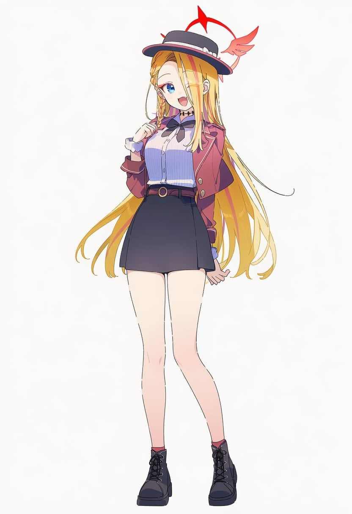

| 字段 | 内容 |
| --- | --- |
| Danbooru Tag | porkpie_hat |
| 中文名 | 猪肉派帽 |
| 中文含义 | 平顶、窄卷边的圆帽。 |
| 子类 | 帽子 |
| 模特 | pina_(blue_archive) |
| 序号 | 0039 |

## 36. shampoo_hat — 洗发帽

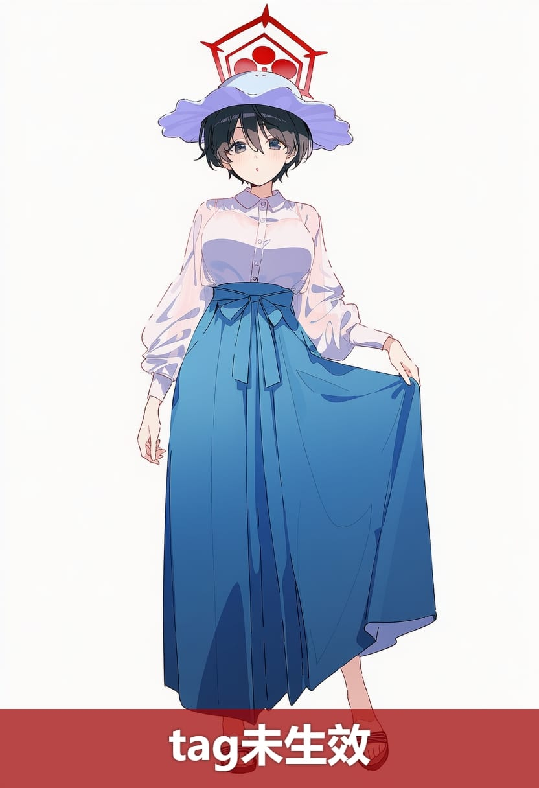

| 字段 | 内容 |
| --- | --- |
| Danbooru Tag | shampoo_hat |
| 中文名 | 洗发帽 |
| 中文含义 | 洗头时挡水用的环形帽。 |
| 子类 | 帽子 |
| 模特 | tsubaki_(blue_archive) |
| 序号 | 0040 |

## 37. sombrero — 墨西哥宽檐帽

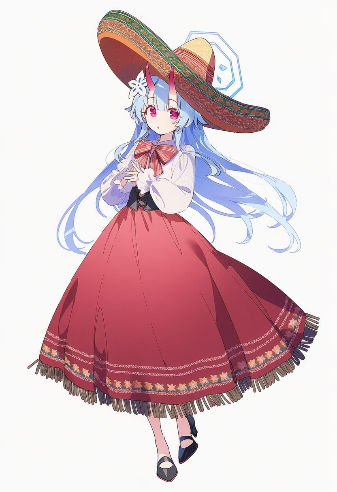

| 字段 | 内容 |
| --- | --- |
| Danbooru Tag | sombrero |
| 中文名 | 墨西哥宽檐帽 |
| 中文含义 | 帽檐非常宽的墨西哥帽。 |
| 子类 | 帽子 |
| 模特 | chise_(blue_archive) |
| 序号 | 0041 |

## 38. sun_hat — 遮阳帽

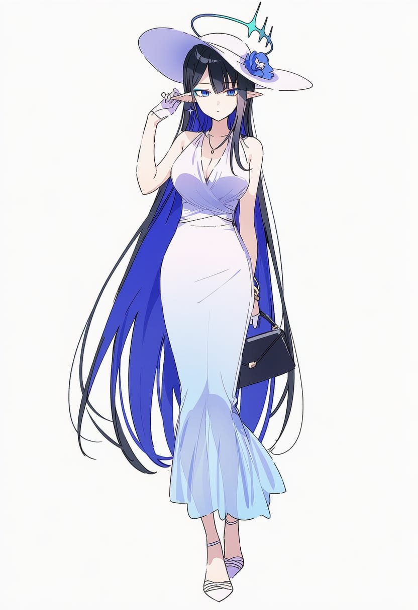

| 字段 | 内容 |
| --- | --- |
| Danbooru Tag | sun_hat |
| 中文名 | 遮阳帽 |
| 中文含义 | 用于遮阳的宽檐帽。 |
| 子类 | 帽子 |
| 模特 | rin_(blue_archive) |
| 序号 | 0042 |

## 39. top_hat — 高顶礼帽

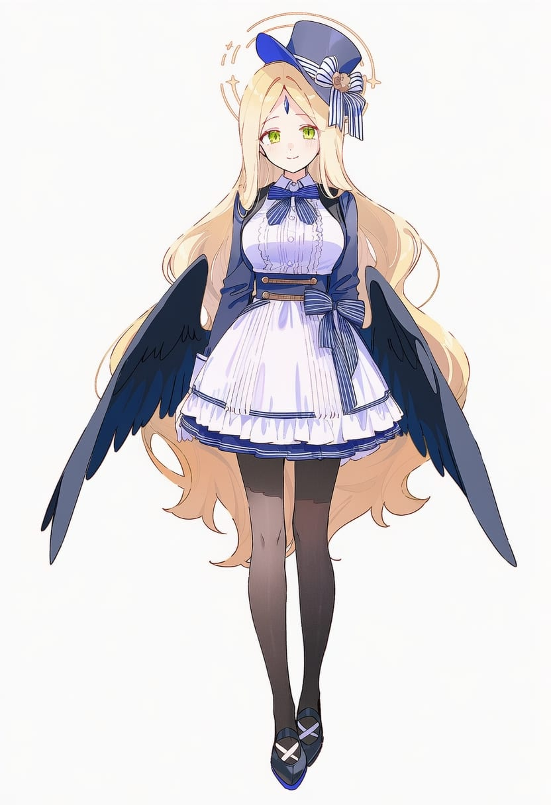

| 字段 | 内容 |
| --- | --- |
| Danbooru Tag | top_hat |
| 中文名 | 高顶礼帽 |
| 中文含义 | 高圆筒帽冠的正式礼帽。 |
| 子类 | 帽子 |
| 模特 | ayumu_(blue_archive) |
| 序号 | 0043 |

## 40. mini_top_hat — 迷你高顶礼帽

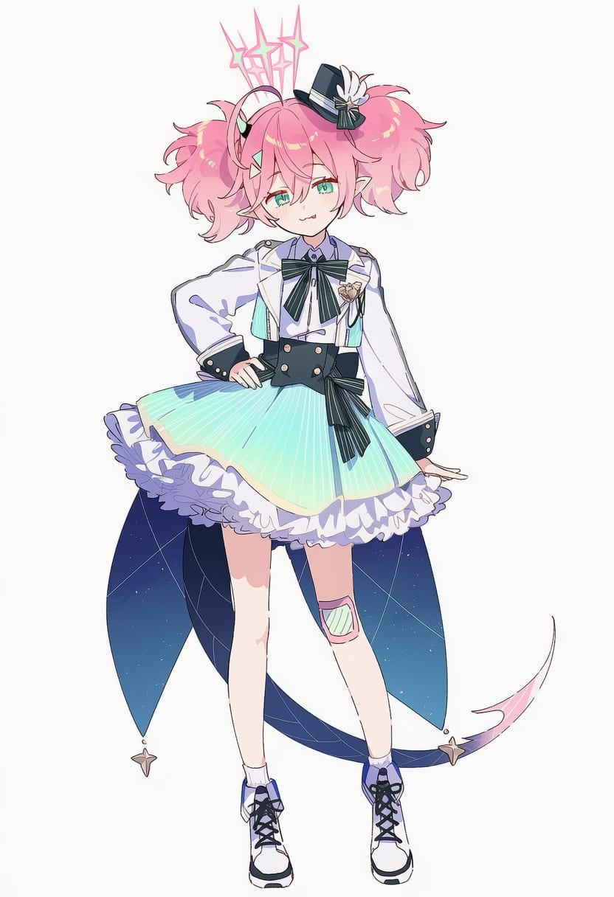

| 字段 | 内容 |
| --- | --- |
| Danbooru Tag | mini_top_hat |
| 中文名 | 迷你高顶礼帽 |
| 中文含义 | 缩小版高顶礼帽。 |
| 子类 | 帽子 |
| 模特 | momoka_(blue_archive) |
| 序号 | 0044 |

## 41. tricorne — 三角帽

| 字段 | 内容 |
| --- | --- |
| Danbooru Tag | tricorne |
| 中文名 | 三角帽 |
| 中文含义 | 帽檐三边翻起的三角帽。 |
| 子类 | 帽子 |
| 模特 | nonomi_(blue_archive) |
| 序号 | 0045 |

## 42. trilby — 窄檐软呢帽

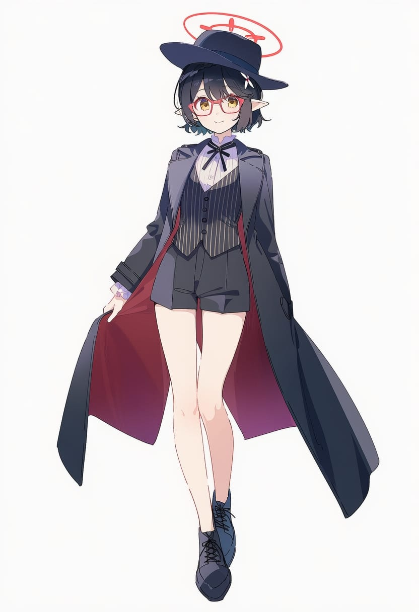

| 字段 | 内容 |
| --- | --- |
| Danbooru Tag | trilby |
| 中文名 | 窄檐软呢帽 |
| 中文含义 | 帽檐比 Fedora 更窄的软帽。 |
| 子类 | 帽子 |
| 模特 | ayane_(blue_archive) |
| 序号 | 0046 |

## 43. tulip_hat — 郁金香帽

| 字段 | 内容 |
| --- | --- |
| Danbooru Tag | tulip_hat |
| 中文名 | 郁金香帽 |
| 中文含义 | 帽身向下展开，外形像郁金香。 |
| 子类 | 帽子 |
| 模特 | hoshino_(blue_archive) |
| 序号 | 0047 |

## 44. witch_hat — 魔女帽

| 字段 | 内容 |
| --- | --- |
| Danbooru Tag | witch_hat |
| 中文名 | 魔女帽 |
| 中文含义 | 大帽檐配高尖帽冠的魔女帽。 |
| 子类 | 帽子 |
| 模特 | shiroko_(blue_archive) |
| 序号 | 0048 |

## 45. mini_witch_hat — 迷你魔女帽

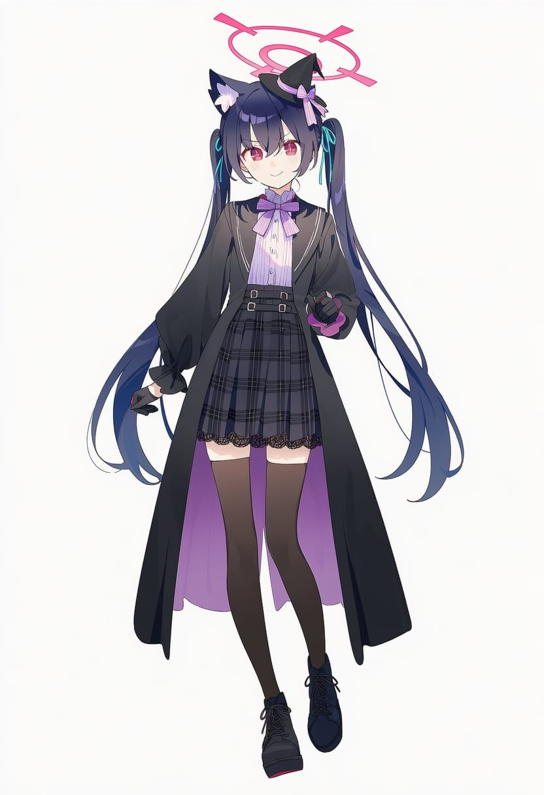

| 字段 | 内容 |
| --- | --- |
| Danbooru Tag | mini_witch_hat |
| 中文名 | 迷你魔女帽 |
| 中文含义 | 缩小版魔女尖帽。 |
| 子类 | 帽子 |
| 模特 | serika_(blue_archive) |
| 序号 | 0049 |

## 46. wizard_hat — 巫师帽

| 字段 | 内容 |
| --- | --- |
| Danbooru Tag | wizard_hat |
| 中文名 | 巫师帽 |
| 中文含义 | 高尖帽冠的魔法师帽。 |
| 子类 | 帽子 |
| 模特 | mashiro_(blue_archive) |
| 序号 | 0050 |

## 47. earflap_beanie — 护耳针织帽

| 字段 | 内容 |
| --- | --- |
| Danbooru Tag | earflap_beanie |
| 中文名 | 护耳针织帽 |
| 中文含义 | 带护耳片的针织帽。 |
| 子类 | 帽子 |
| 模特 | shizuko_(blue_archive) |
| 序号 | 0051 |

## 48. ushanka — 俄式护耳帽

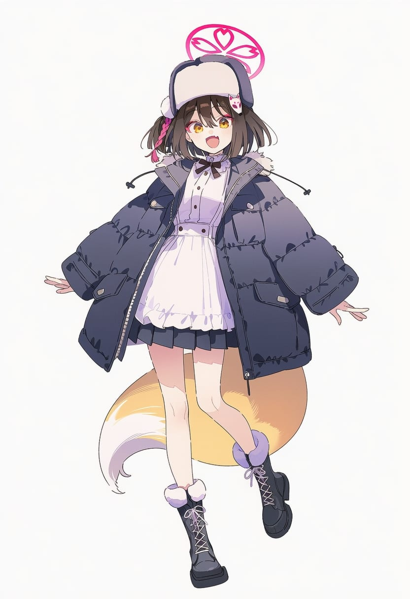

| 字段 | 内容 |
| --- | --- |
| Danbooru Tag | ushanka |
| 中文名 | 俄式护耳帽 |
| 中文含义 | 带可翻下护耳的俄式毛帽。 |
| 子类 | 帽子 |
| 模特 | izuna_(blue_archive) |
| 序号 | 0052 |

## 49. beanie — 针织帽

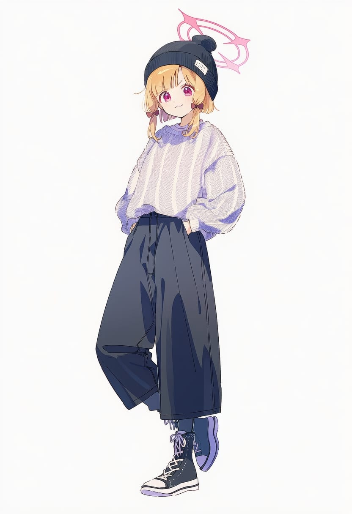

| 字段 | 内容 |
| --- | --- |
| Danbooru Tag | beanie |
| 中文名 | 针织帽 |
| 中文含义 | 贴头的无檐针织帽。 |
| 子类 | 帽子 |
| 模特 | momoi_(blue_archive) |
| 序号 | 0054 |

## 50. beret — 贝雷帽

| 字段 | 内容 |
| --- | --- |
| Danbooru Tag | beret |
| 中文名 | 贝雷帽 |
| 中文含义 | 柔软圆扁、无帽檐的贝雷帽。 |
| 子类 | 帽子 |
| 模特 | midori_(blue_archive) |
| 序号 | 0055 |

## 51. chef_hat — 厨师帽

| 字段 | 内容 |
| --- | --- |
| Danbooru Tag | chef_hat |
| 中文名 | 厨师帽 |
| 中文含义 | 厨师使用的高帽或白帽。 |
| 子类 | 帽子 |
| 模特 | cherino_(blue_archive) |
| 序号 | 0056 |

## 52. flat_top_chef_hat — 平顶厨师帽

| 字段 | 内容 |
| --- | --- |
| Danbooru Tag | flat_top_chef_hat |
| 中文名 | 平顶厨师帽 |
| 中文含义 | 顶部较平的厨师帽。 |
| 子类 | 帽子 |
| 模特 | nodoka_(blue_archive) |
| 序号 | 0057 |

## 53. toque_blanche — 高筒厨师帽

| 字段 | 内容 |
| --- | --- |
| Danbooru Tag | toque_blanche |
| 中文名 | 高筒厨师帽 |
| 中文含义 | 经典高而蓬松的白色厨师帽。 |
| 子类 | 帽子 |
| 模特 | yuzu_(blue_archive) |
| 序号 | 0058 |

## 54. coif — 贴头软帽

| 字段 | 内容 |
| --- | --- |
| Danbooru Tag | coif |
| 中文名 | 贴头软帽 |
| 中文含义 | 紧贴头部、包住头发的传统软帽。 |
| 子类 | 帽子 |
| 模特 | hanako_(blue_archive) |
| 序号 | 0059 |

## 55. dixie_cup_hat — 水兵小白帽

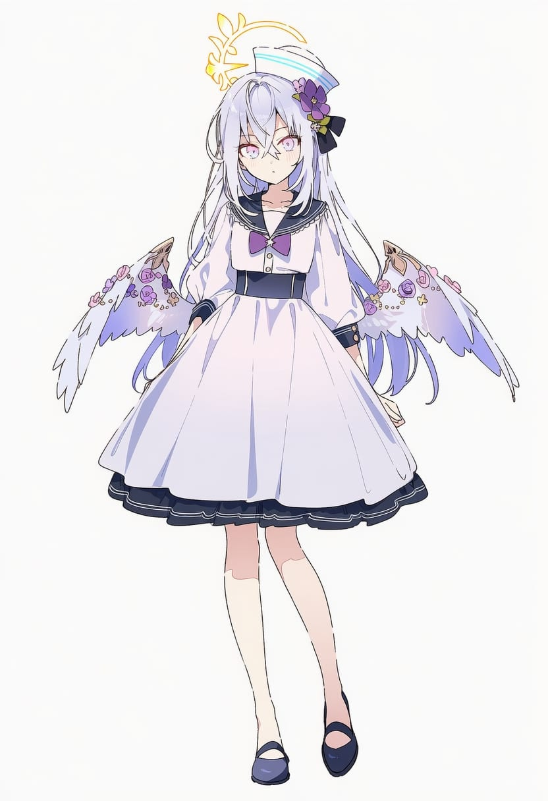

| 字段 | 内容 |
| --- | --- |
| Danbooru Tag | dixie_cup_hat |
| 中文名 | 水兵小白帽 |
| 中文含义 | 美式水兵常见的白色软帽。 |
| 子类 | 帽子 |
| 模特 | azusa_(blue_archive) |
| 序号 | 0060 |

## 56. donald_duck_sailor_hat_未生效 — 唐老鸭式水兵帽

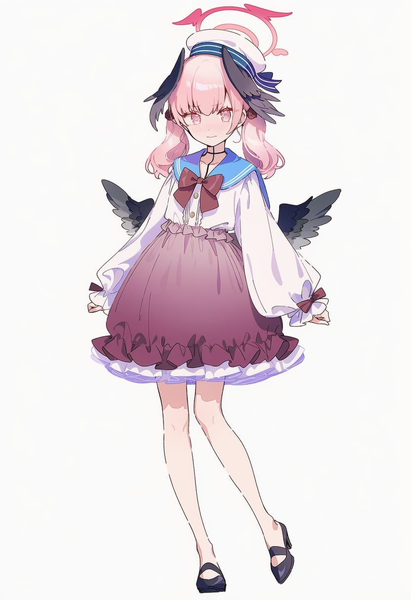

| 字段 | 内容 |
| --- | --- |
| Danbooru Tag | donald_duck_sailor_hat_未生效 |
| 中文名 | 唐老鸭式水兵帽 |
| 中文含义 | 带飘带感的卡通水兵帽。 |
| 子类 | 帽子 |
| 模特 | koharu_(blue_archive) |
| 序号 | 0061 |

## 57. fez_hat — 土耳其毡帽

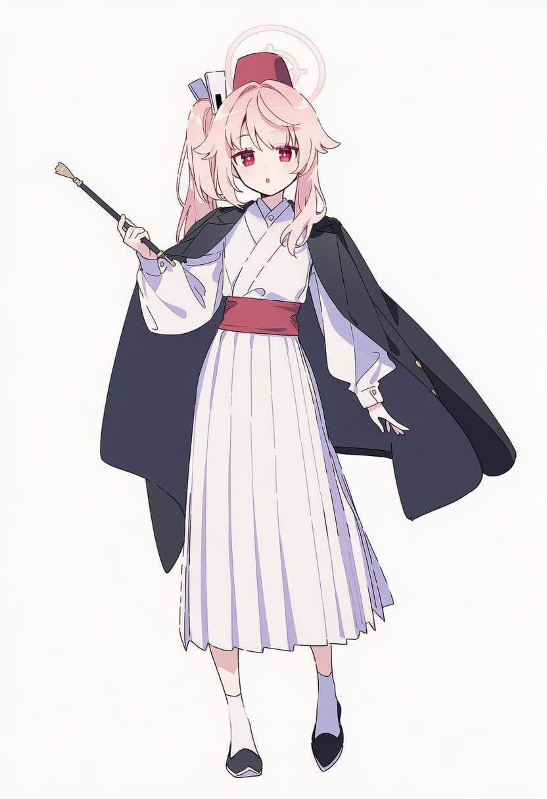

| 字段 | 内容 |
| --- | --- |
| Danbooru Tag | fez_hat |
| 中文名 | 土耳其毡帽 |
| 中文含义 | 圆筒形、无帽檐的小毡帽。 |
| 子类 | 帽子 |
| 模特 | natsu_(blue_archive) |
| 序号 | 0063 |

## 58. flight_attendant_hat_未生效 — 空乘帽

| 字段 | 内容 |
| --- | --- |
| Danbooru Tag | flight_attendant_hat_未生效 |
| 中文名 | 空乘帽 |
| 中文含义 | 空乘制服常见的小型礼帽。 |
| 子类 | 帽子 |
| 模特 | mari_(blue_archive) |
| 序号 | 0064 |

## 59. fur_hat — 毛皮帽

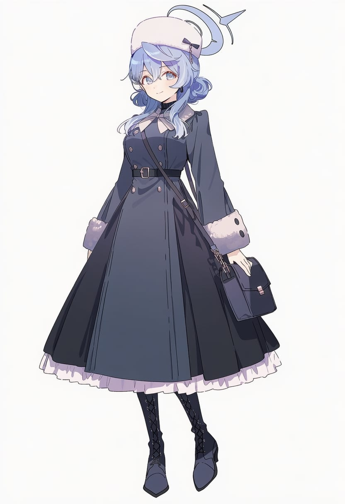

| 字段 | 内容 |
| --- | --- |
| Danbooru Tag | fur_hat |
| 中文名 | 毛皮帽 |
| 中文含义 | 毛绒或毛皮材质的帽子。 |
| 子类 | 帽子 |
| 模特 | ako_(blue_archive) |
| 序号 | 0065 |

## 60. garrison_cap — 船形军帽

| 字段 | 内容 |
| --- | --- |
| Danbooru Tag | garrison_cap |
| 中文名 | 船形军帽 |
| 中文含义 | 可折叠的侧帽式军帽。 |
| 子类 | 帽子 |
| 模特 | tomoe_(blue_archive) |
| 序号 | 0066 |

## 61. mitre — 主教冠

| 字段 | 内容 |
| --- | --- |
| Danbooru Tag | mitre |
| 中文名 | 主教冠 |
| 中文含义 | 基督教主教常见的高冠帽。 |
| 子类 | 帽子 |
| 模特 | chihiro_(blue_archive) |
| 序号 | 0069 |

## 62. mortarboard — 学士帽

| 字段 | 内容 |
| --- | --- |
| Danbooru Tag | mortarboard |
| 中文名 | 学士帽 |
| 中文含义 | 毕业典礼常见的方顶帽。 |
| 子类 | 帽子 |
| 模特 | sena_(blue_archive) |
| 序号 | 0070 |

## 63. nightcap — 睡帽

| 字段 | 内容 |
| --- | --- |
| Danbooru Tag | nightcap |
| 中文名 | 睡帽 |
| 中文含义 | 睡觉时戴的柔软长帽。 |
| 子类 | 帽子 |
| 模特 | mimori_(blue_archive) |
| 序号 | 0071 |

## 64. nurse_cap — 护士帽

| 字段 | 内容 |
| --- | --- |
| Danbooru Tag | nurse_cap |
| 中文名 | 护士帽 |
| 中文含义 | 传统护士制服的小白帽。 |
| 子类 | 帽子 |
| 模特 | ui_(blue_archive) |
| 序号 | 0072 |

## 65. party_hat — 派对尖帽

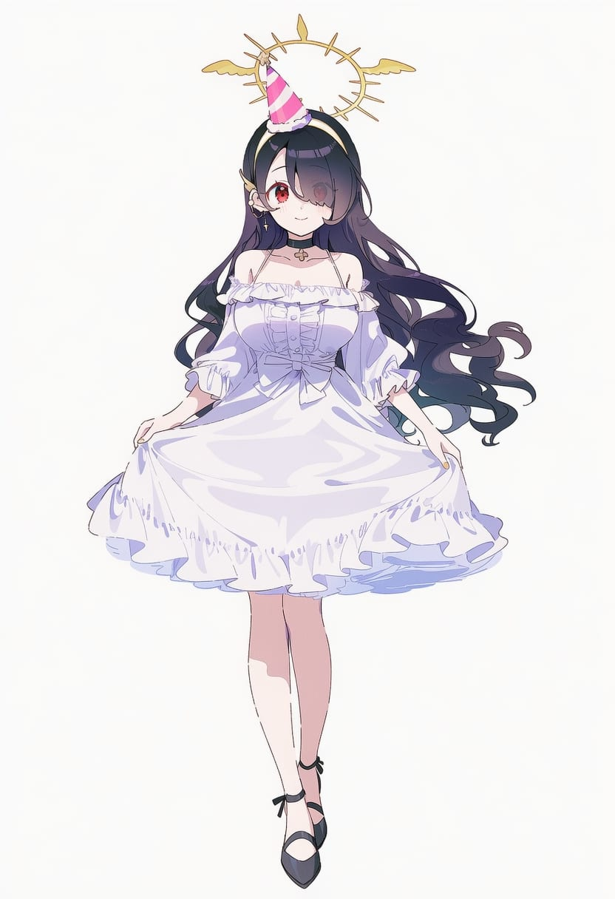

| 字段 | 内容 |
| --- | --- |
| Danbooru Tag | party_hat |
| 中文名 | 派对尖帽 |
| 中文含义 | 生日派对常见的圆锥小帽。 |
| 子类 | 帽子 |
| 模特 | hinata_(blue_archive) |
| 序号 | 0073 |

## 66. sailor_hat — 水兵帽

| 字段 | 内容 |
| --- | --- |
| Danbooru Tag | sailor_hat |
| 中文名 | 水兵帽 |
| 中文含义 | 水手或水兵制服帽。 |
| 子类 | 帽子 |
| 模特 | kurumi_(blue_archive) |
| 序号 | 0077 |

## 67. santa_hat — 圣诞帽

| 字段 | 内容 |
| --- | --- |
| Danbooru Tag | santa_hat |
| 中文名 | 圣诞帽 |
| 中文含义 | 红白配色的圣诞老人帽型。 |
| 子类 | 帽子 |
| 模特 | otogi_(blue_archive) |
| 序号 | 0078 |

## 68. mini_santa_hat — 迷你圣诞帽

| 字段 | 内容 |
| --- | --- |
| Danbooru Tag | mini_santa_hat |
| 中文名 | 迷你圣诞帽 |
| 中文含义 | 缩小版圣诞帽。 |
| 子类 | 帽子 |
| 模特 | miyako_(blue_archive) |
| 序号 | 0079 |

## 69. tam_o'_shanter — 苏格兰圆帽

| 字段 | 内容 |
| --- | --- |
| Danbooru Tag | tam_o'_shanter |
| 中文名 | 苏格兰圆帽 |
| 中文含义 | 带帽顶小球的苏格兰软帽。 |
| 子类 | 帽子 |
| 模特 | shinon_(blue_archive) |
| 序号 | 0081 |

## 70. tate_eboshi — 立乌帽子

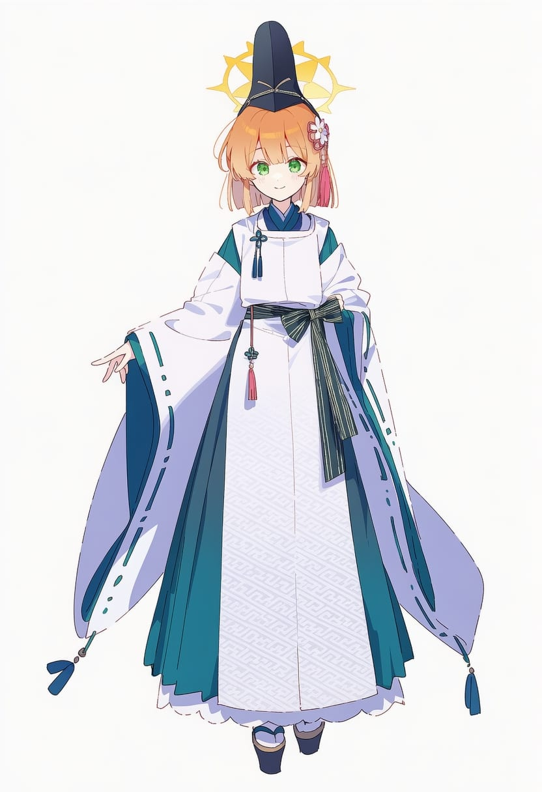

| 字段 | 内容 |
| --- | --- |
| Danbooru Tag | tate_eboshi |
| 中文名 | 立乌帽子 |
| 中文含义 | 高而直立的日本传统乌帽子。 |
| 子类 | 帽子 |
| 模特 | mai_(blue_archive) |
| 序号 | 0082 |

## 71. animal_hat — 动物帽

| 字段 | 内容 |
| --- | --- |
| Danbooru Tag | animal_hat |
| 中文名 | 动物帽 |
| 中文含义 | 整体做成动物造型的帽子。 |
| 子类 | 动物/特殊帽 |
| 模特 | kaede_(blue_archive) |
| 序号 | 0086 |

## 72. hat_with_ears — 带耳朵的帽子

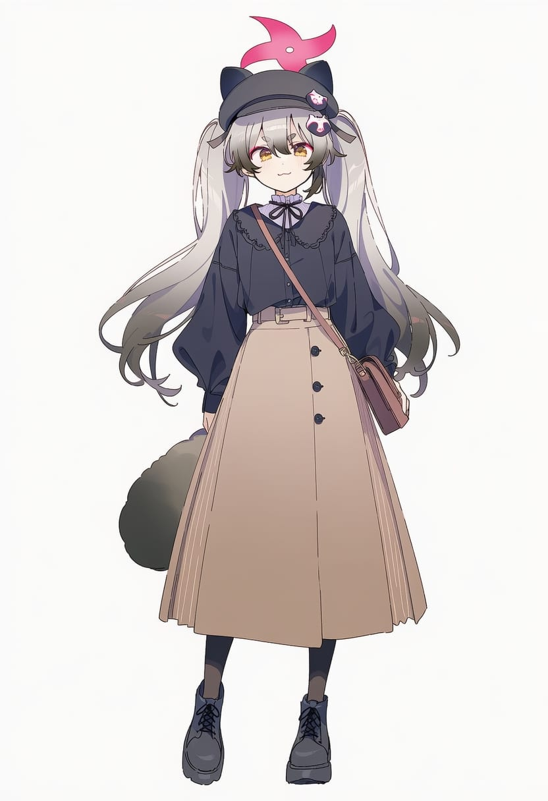

| 字段 | 内容 |
| --- | --- |
| Danbooru Tag | hat_with_ears |
| 中文名 | 带耳朵的帽子 |
| 中文含义 | 帽子本身带动物耳朵造型。 |
| 子类 | 动物/特殊帽 |
| 模特 | michiru_(blue_archive) |
| 序号 | 0087 |

## 73. bear_hat — 熊帽

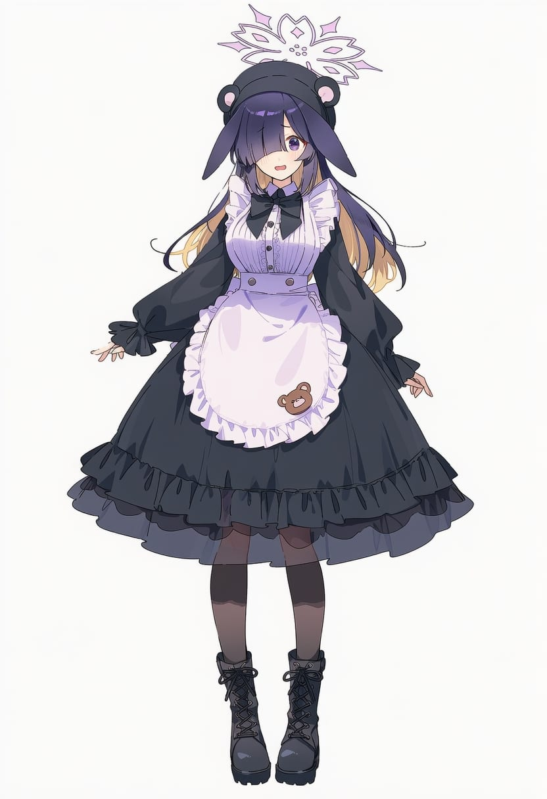

| 字段 | 内容 |
| --- | --- |
| Danbooru Tag | bear_hat |
| 中文名 | 熊帽 |
| 中文含义 | 熊造型或带熊耳的帽子。 |
| 子类 | 动物/特殊帽 |
| 模特 | tsukuyo_(blue_archive) |
| 序号 | 0088 |

## 74. rabbit_hat — 兔子帽

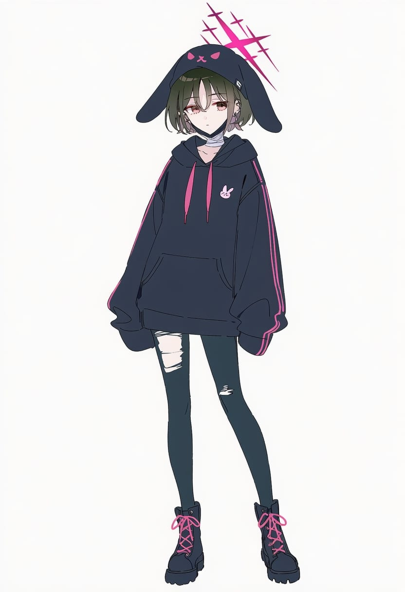

| 字段 | 内容 |
| --- | --- |
| Danbooru Tag | rabbit_hat |
| 中文名 | 兔子帽 |
| 中文含义 | 兔子造型或带兔耳的帽子。 |
| 子类 | 动物/特殊帽 |
| 模特 | misaki_(blue_archive) |
| 序号 | 0089 |

## 75. cat_hat — 猫帽

| 字段 | 内容 |
| --- | --- |
| Danbooru Tag | cat_hat |
| 中文名 | 猫帽 |
| 中文含义 | 猫造型或带猫耳的帽子。 |
| 子类 | 动物/特殊帽 |
| 模特 | hiyori_(blue_archive) |
| 序号 | 0090 |

## 76. dog_hat_未生效 — 狗狗帽

| 字段 | 内容 |
| --- | --- |
| Danbooru Tag | dog_hat_未生效 |
| 中文名 | 狗狗帽 |
| 中文含义 | 狗造型或带狗耳的帽子。 |
| 子类 | 动物/特殊帽 |
| 模特 | atsuko_(blue_archive) |
| 序号 | 0091 |

## 77. fox_hat — 狐狸帽

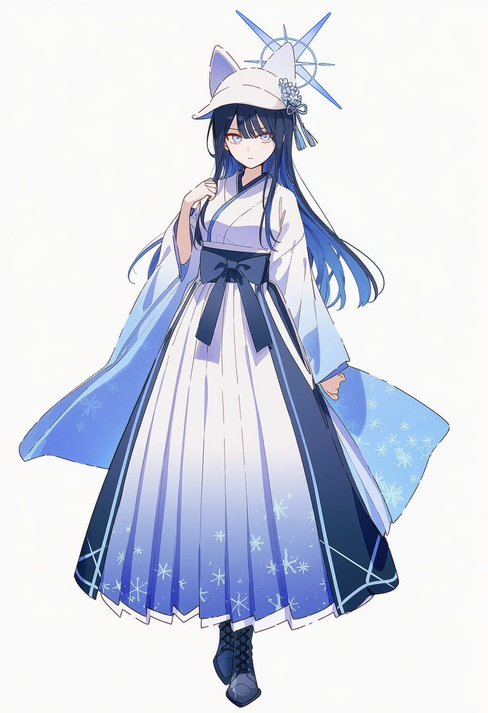

| 字段 | 内容 |
| --- | --- |
| Danbooru Tag | fox_hat |
| 中文名 | 狐狸帽 |
| 中文含义 | 狐狸造型或带狐耳的帽子。 |
| 子类 | 动物/特殊帽 |
| 模特 | saori_(blue_archive) |
| 序号 | 0092 |

## 78. penguin_hat — 企鹅帽

| 字段 | 内容 |
| --- | --- |
| Danbooru Tag | penguin_hat |
| 中文名 | 企鹅帽 |
| 中文含义 | 企鹅造型的帽子。 |
| 子类 | 动物/特殊帽 |
| 模特 | moe_(blue_archive) |
| 序号 | 0093 |

## 79. wolf_hat_未生效 — 狼帽

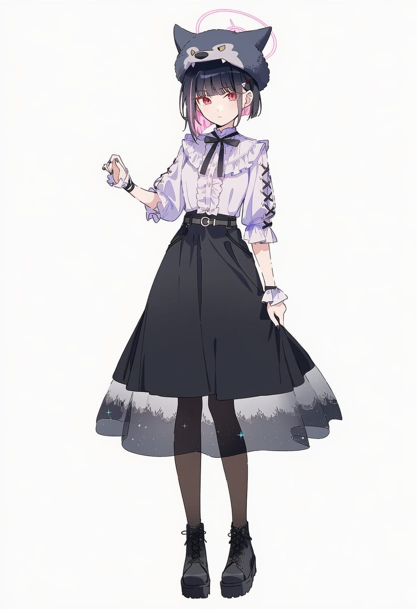

| 字段 | 内容 |
| --- | --- |
| Danbooru Tag | wolf_hat_未生效 |
| 中文名 | 狼帽 |
| 中文含义 | 狼造型或带狼耳的帽子。 |
| 子类 | 动物/特殊帽 |
| 模特 | kazusa_(blue_archive) |
| 序号 | 0094 |

## 80. eggshell_hat — 蛋壳帽

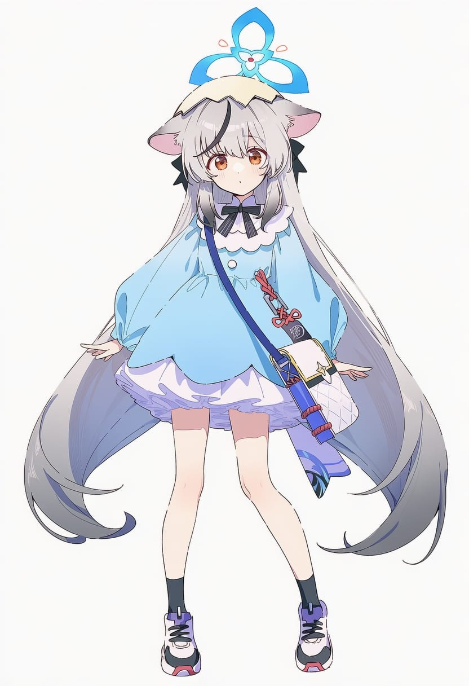

| 字段 | 内容 |
| --- | --- |
| Danbooru Tag | eggshell_hat |
| 中文名 | 蛋壳帽 |
| 中文含义 | 像蛋壳一样扣在头上的帽子。 |
| 子类 | 动物/特殊帽 |
| 模特 | kokona_(blue_archive) |
| 序号 | 0095 |

## 81. pumpkin_hat — 南瓜帽

| 字段 | 内容 |
| --- | --- |
| Danbooru Tag | pumpkin_hat |
| 中文名 | 南瓜帽 |
| 中文含义 | 南瓜造型的帽子。 |
| 子类 | 动物/特殊帽 |
| 模特 | noa_(blue_archive) |
| 序号 | 0096 |

## 82. helmet — 头盔

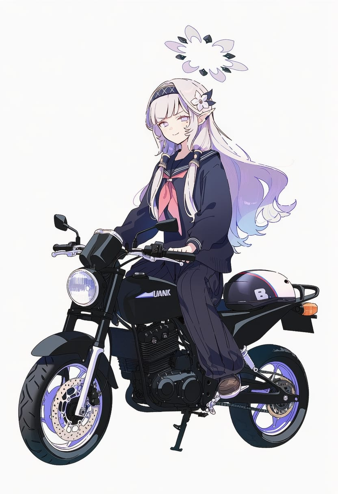

| 字段 | 内容 |
| --- | --- |
| Danbooru Tag | helmet |
| 中文名 | 头盔 |
| 中文含义 | 泛指保护头部的头盔。 |
| 子类 | 头盔/护具 |
| 模特 | himari_(blue_archive) |
| 序号 | 0097 |

## 83. animal_ear_helmet — 兽耳头盔

| 字段 | 内容 |
| --- | --- |
| Danbooru Tag | animal_ear_helmet |
| 中文名 | 兽耳头盔 |
| 中文含义 | 带动物耳朵造型的头盔。 |
| 子类 | 头盔/护具 |
| 模特 | kei_(blue_archive) |
| 序号 | 0098 |

## 84. baseball_helmet — 棒球头盔

| 字段 | 内容 |
| --- | --- |
| Danbooru Tag | baseball_helmet |
| 中文名 | 棒球头盔 |
| 中文含义 | 棒球运动使用的头盔。 |
| 子类 | 头盔/护具 |
| 模特 | shigure_(blue_archive) |
| 序号 | 0099 |

## 85. bicycle_helmet — 自行车头盔

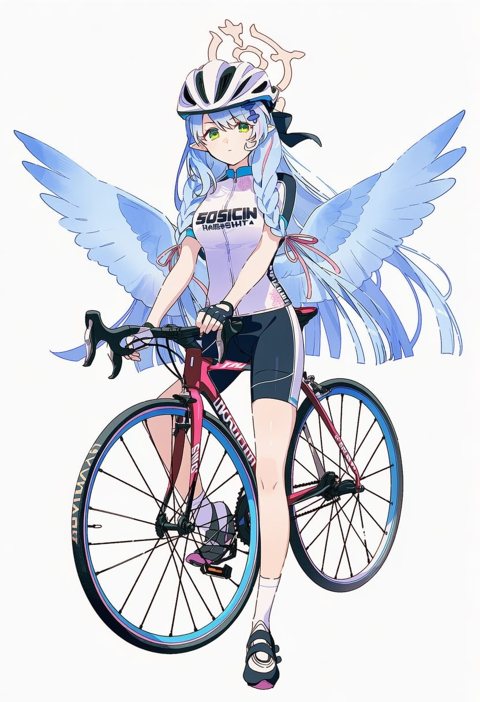

| 字段 | 内容 |
| --- | --- |
| Danbooru Tag | bicycle_helmet |
| 中文名 | 自行车头盔 |
| 中文含义 | 骑行使用的轻型头盔。 |
| 子类 | 头盔/护具 |
| 模特 | mine_(blue_archive) |
| 序号 | 0100 |

## 86. diving_helmet — 潜水头盔

| 字段 | 内容 |
| --- | --- |
| Danbooru Tag | diving_helmet |
| 中文名 | 潜水头盔 |
| 中文含义 | 老式或重型潜水头盔。 |
| 子类 | 头盔/护具 |
| 模特 | aoi_(blue_archive) |
| 序号 | 0101 |

## 87. fishbowl_helmet — 鱼缸头盔

| 字段 | 内容 |
| --- | --- |
| Danbooru Tag | fishbowl_helmet |
| 中文名 | 鱼缸头盔 |
| 中文含义 | 透明圆球罩住头部的头盔。 |
| 子类 | 头盔/护具 |
| 模特 | mika_(blue_archive) |
| 序号 | 0102 |

## 88. hard_hat — 安全帽

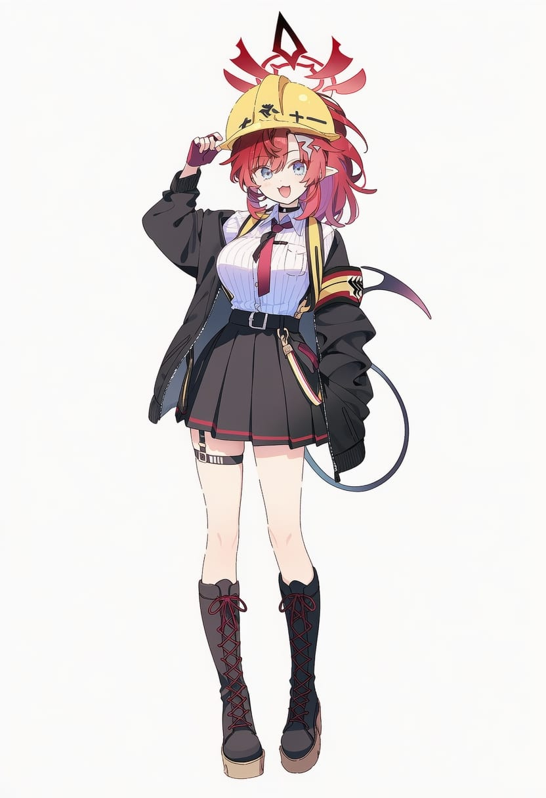

| 字段 | 内容 |
| --- | --- |
| Danbooru Tag | hard_hat |
| 中文名 | 安全帽 |
| 中文含义 | 工地常见的硬质安全帽。 |
| 子类 | 头盔/护具 |
| 模特 | megu_(blue_archive) |
| 序号 | 0103 |

## 89. helm — 金属战盔

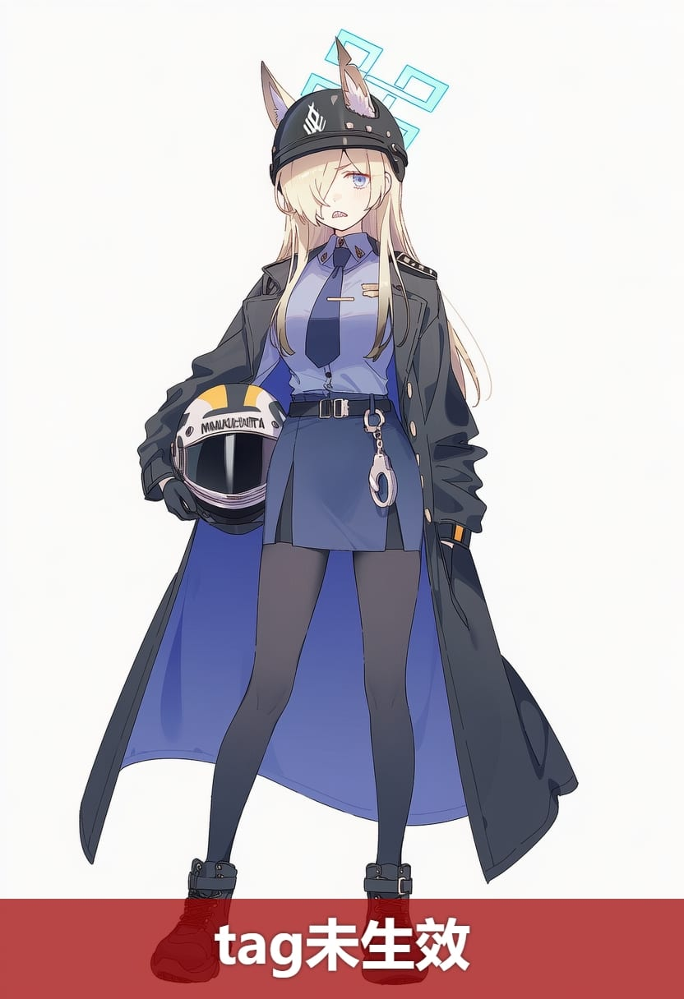

| 字段 | 内容 |
| --- | --- |
| Danbooru Tag | helm |
| 中文名 | 金属战盔 |
| 中文含义 | 中世纪或幻想风金属头盔。 |
| 子类 | 头盔/护具 |
| 模特 | kanna_(blue_archive) |
| 序号 | 0104 |

## 90. horned_helmet — 角盔

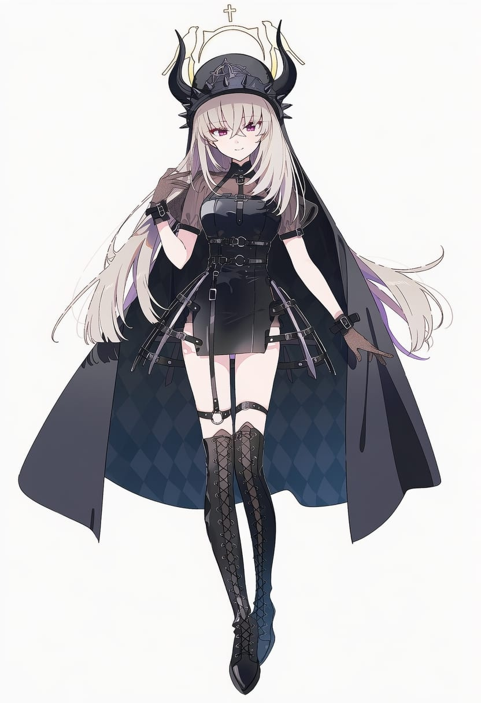

| 字段 | 内容 |
| --- | --- |
| Danbooru Tag | horned_helmet |
| 中文名 | 角盔 |
| 中文含义 | 带角装饰的头盔。 |
| 子类 | 头盔/护具 |
| 模特 | sakurako_(blue_archive) |
| 序号 | 0105 |

## 91. kabuto — 兜

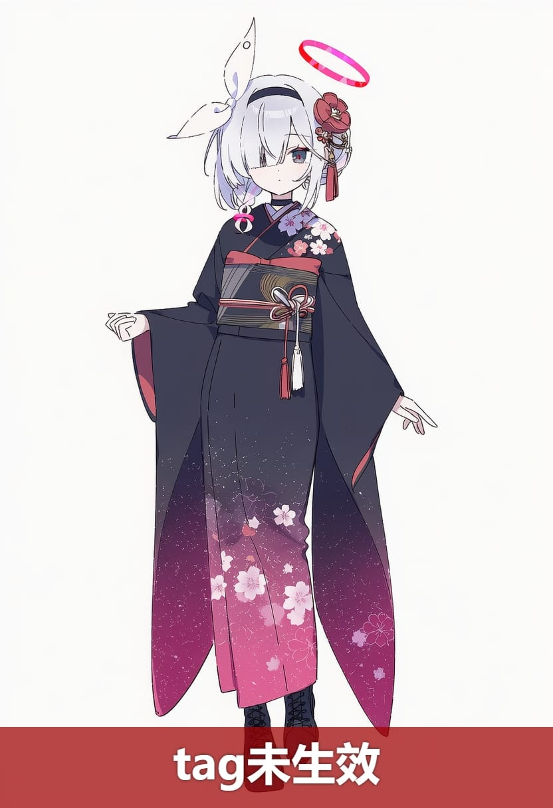

| 字段 | 内容 |
| --- | --- |
| Danbooru Tag | kabuto |
| 中文名 | 兜 |
| 中文含义 | 日本武士铠甲中的头盔。 |
| 子类 | 头盔/护具 |
| 模特 | plana_(blue_archive) |
| 序号 | 0106 |

## 92. pickelhaube — 尖顶盔

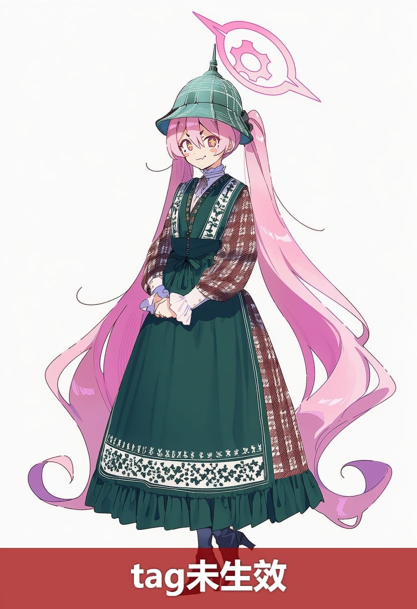

| 字段 | 内容 |
| --- | --- |
| Danbooru Tag | pickelhaube |
| 中文名 | 尖顶盔 |
| 中文含义 | 顶部带尖刺的普鲁士式军盔。 |
| 子类 | 头盔/护具 |
| 模特 | koyuki_(blue_archive) |
| 序号 | 0109 |

## 93. pilot_helmet — 飞行员头盔

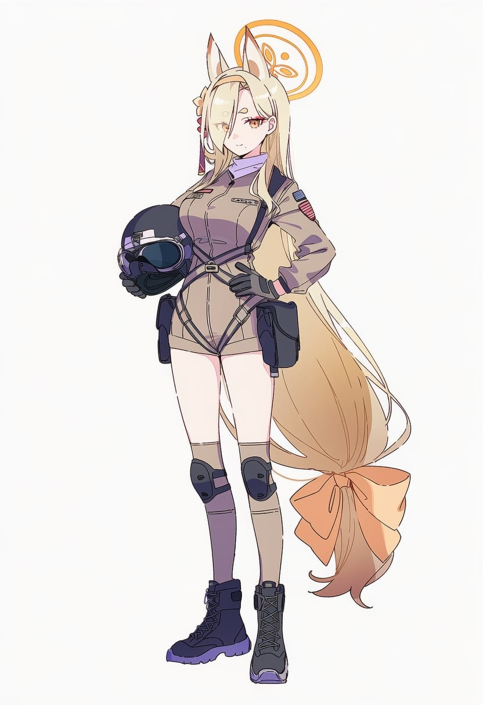

| 字段 | 内容 |
| --- | --- |
| Danbooru Tag | pilot_helmet |
| 中文名 | 飞行员头盔 |
| 中文含义 | 飞行员使用的头盔。 |
| 子类 | 头盔/护具 |
| 模特 | kaho_(blue_archive) |
| 序号 | 0110 |

## 94. space_helmet — 宇航头盔

| 字段 | 内容 |
| --- | --- |
| Danbooru Tag | space_helmet |
| 中文名 | 宇航头盔 |
| 中文含义 | 宇航服配套的密闭头盔。 |
| 子类 | 头盔/护具 |
| 模特 | akira_(blue_archive) |
| 序号 | 0111 |

## 95. tank_helmet — 坦克兵头盔

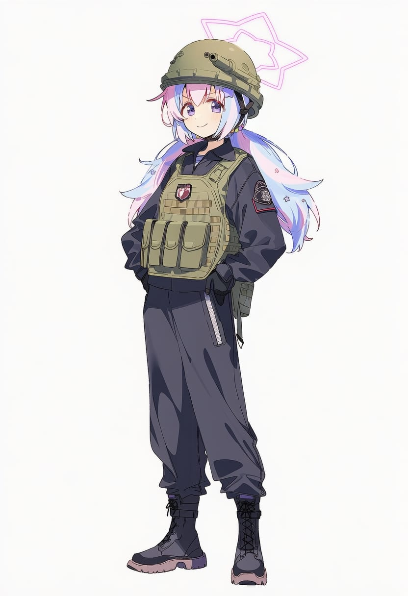

| 字段 | 内容 |
| --- | --- |
| Danbooru Tag | tank_helmet |
| 中文名 | 坦克兵头盔 |
| 中文含义 | 坦克乘员使用的防护帽盔。 |
| 子类 | 头盔/护具 |
| 模特 | reisa_(blue_archive) |
| 序号 | 0112 |

## 96. winged_helmet — 翼盔

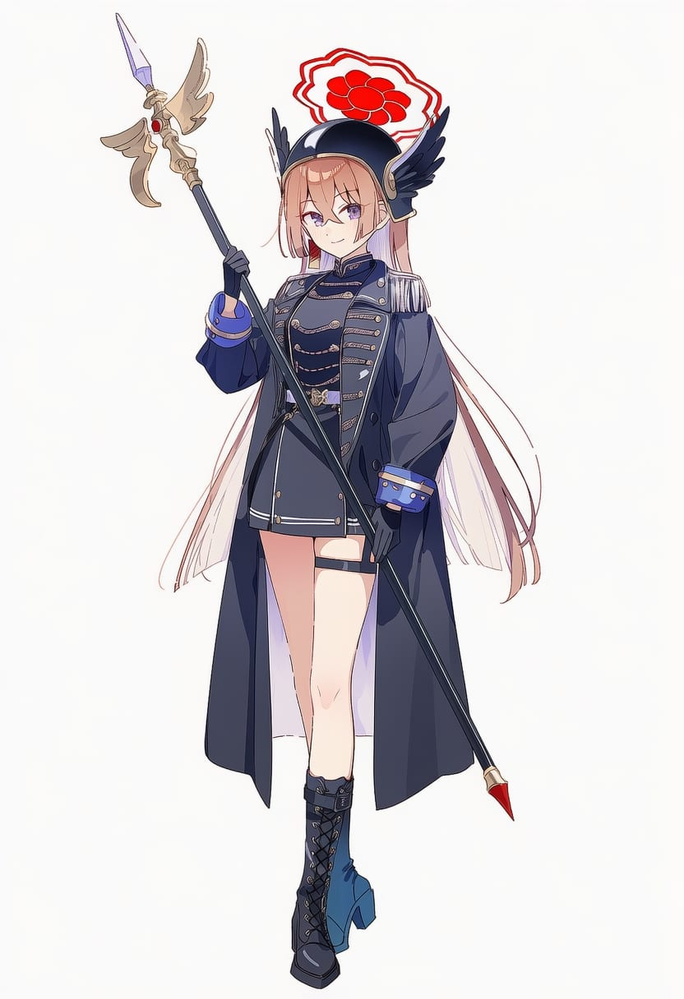

| 字段 | 内容 |
| --- | --- |
| Danbooru Tag | winged_helmet |
| 中文名 | 翼盔 |
| 中文含义 | 两侧带翅膀装饰的头盔。 |
| 子类 | 头盔/护具 |
| 模特 | rumi_(blue_archive) |
| 序号 | 0113 |

## 97. combat_helmet — 战斗头盔

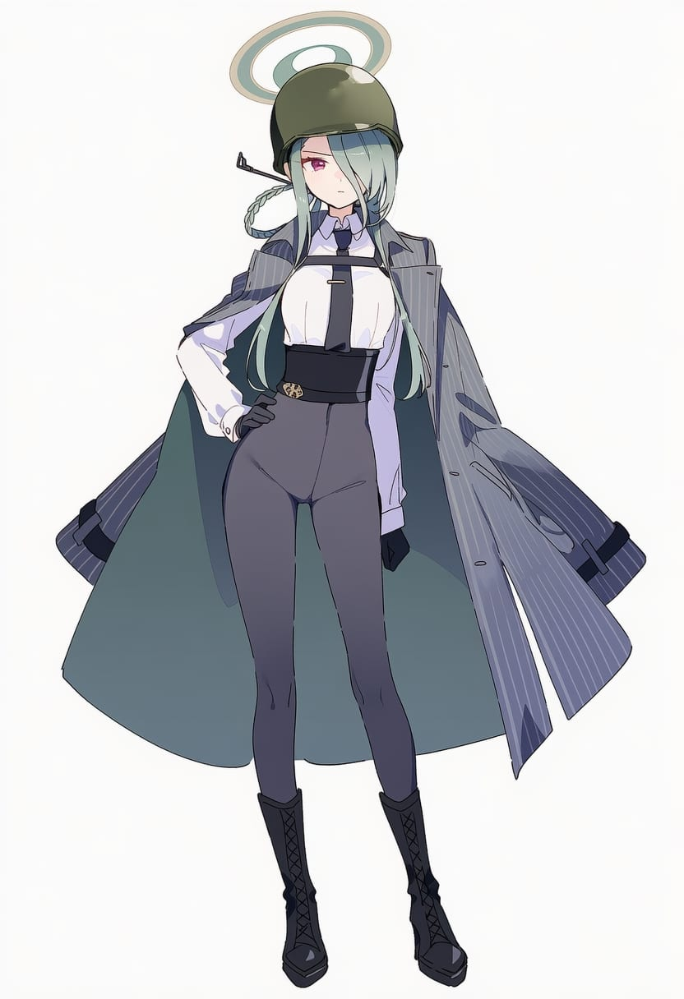

| 字段 | 内容 |
| --- | --- |
| Danbooru Tag | combat_helmet |
| 中文名 | 战斗头盔 |
| 中文含义 | 现代军事风格的作战头盔。 |
| 子类 | 头盔/护具 |
| 模特 | mina_(blue_archive) |
| 序号 | 0114 |

## 98. crown — 王冠

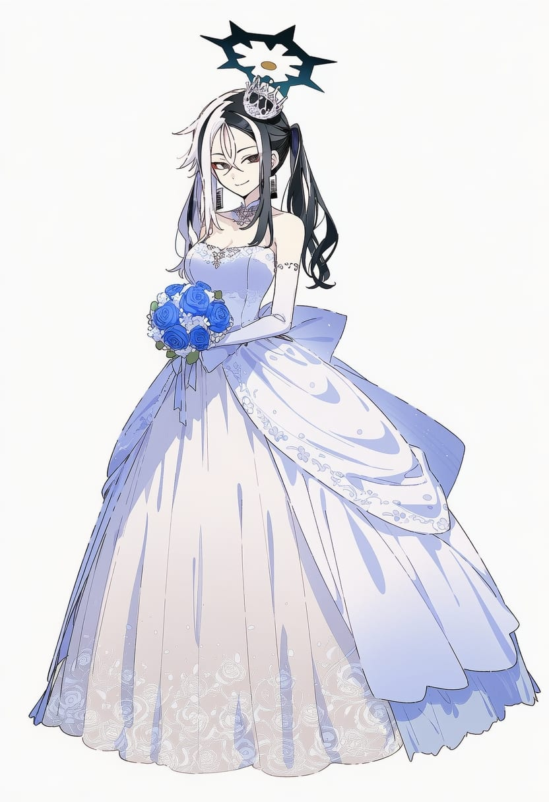

| 字段 | 内容 |
| --- | --- |
| Danbooru Tag | crown |
| 中文名 | 王冠 |
| 中文含义 | 王室或权力象征的冠冕。 |
| 子类 | 冠冕/头冠 |
| 模特 | kai_(blue_archive) |
| 序号 | 0115 |

## 99. black_crown — 黑色王冠

| 字段 | 内容 |
| --- | --- |
| Danbooru Tag | black_crown |
| 中文名 | 黑色王冠 |
| 中文含义 | 黑色王冠；纯颜色款只留这一种代表。 |
| 子类 | 冠冕/头冠 |
| 模特 | minori_(blue_archive) |
| 序号 | 0116 |

## 100. multicolored_crown — 多色王冠

| 字段 | 内容 |
| --- | --- |
| Danbooru Tag | multicolored_crown |
| 中文名 | 多色王冠 |
| 中文含义 | 由多种颜色组成的王冠。 |
| 子类 | 冠冕/头冠 |
| 模特 | meru_(blue_archive) |
| 序号 | 0117 |

## 101. mini_crown — 迷你王冠

| 字段 | 内容 |
| --- | --- |
| Danbooru Tag | mini_crown |
| 中文名 | 迷你王冠 |
| 中文含义 | 尺寸很小、常偏装饰性的王冠。 |
| 子类 | 冠冕/头冠 |
| 模特 | momiji_(blue_archive) |
| 序号 | 0118 |

## 102. tall_crown_未生效 — 高王冠

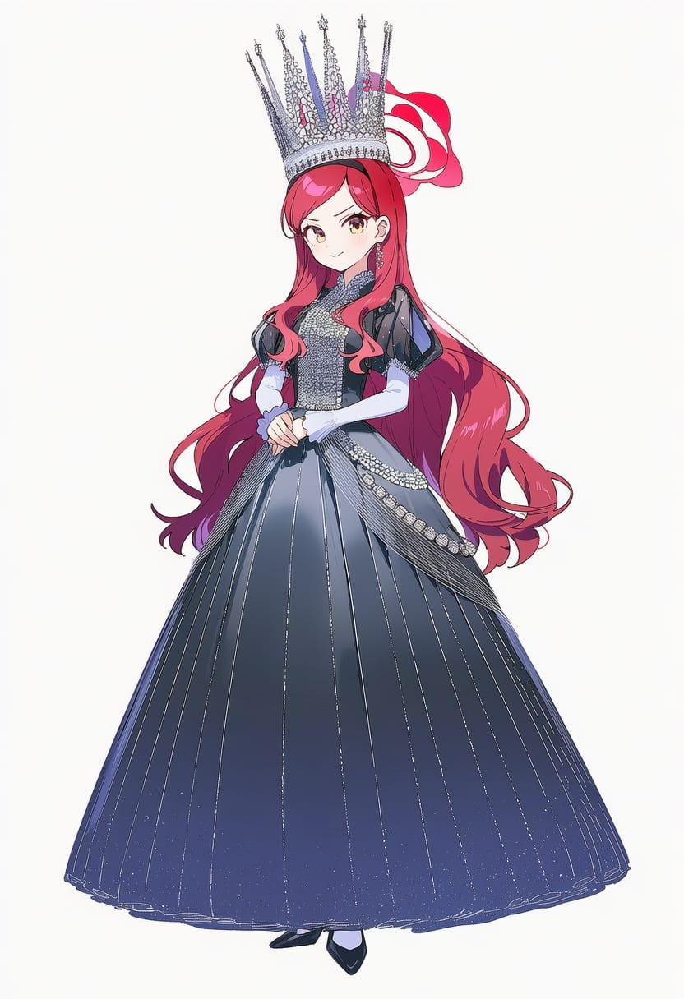

| 字段 | 内容 |
| --- | --- |
| Danbooru Tag | tall_crown_未生效 |
| 中文名 | 高王冠 |
| 中文含义 | 帽冠明显很高的王冠。 |
| 子类 | 冠冕/头冠 |
| 模特 | takane_(blue_archive) |
| 序号 | 0119 |

## 103. arched_crown — 拱形王冠

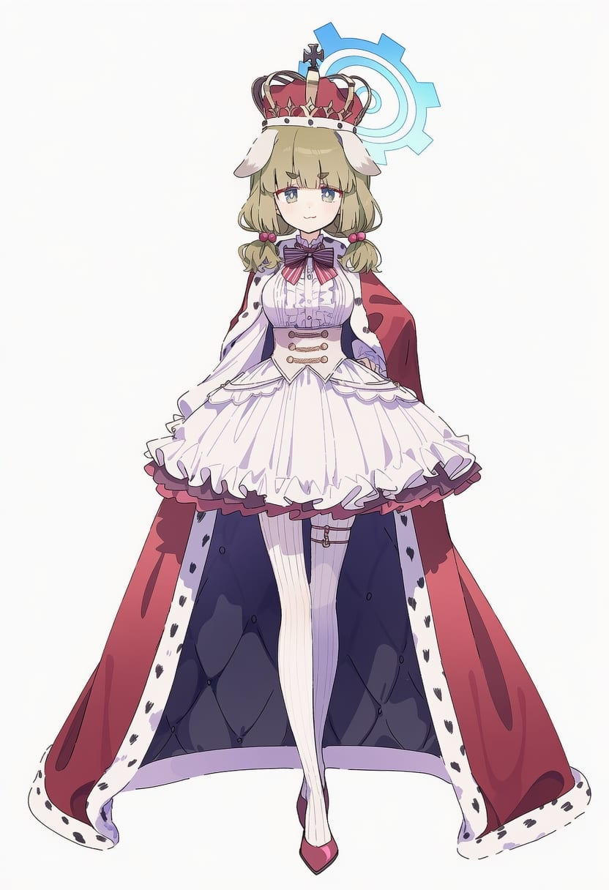

| 字段 | 内容 |
| --- | --- |
| Danbooru Tag | arched_crown |
| 中文名 | 拱形王冠 |
| 中文含义 | 顶部有拱形结构的王冠。 |
| 子类 | 冠冕/头冠 |
| 模特 | yakumo_(blue_archive) |
| 序号 | 0120 |

## 104. crown_of_thorns — 荆棘冠

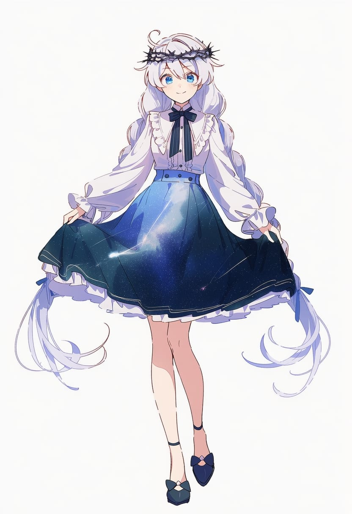

| 字段 | 内容 |
| --- | --- |
| Danbooru Tag | crown_of_thorns |
| 中文名 | 荆棘冠 |
| 中文含义 | 用荆棘编成的冠环。 |
| 子类 | 冠冕/头冠 |
| 模特 | kiana_kaslana |
| 序号 | 0121 |

## 105. laurel_crown — 月桂冠

| 字段 | 内容 |
| --- | --- |
| Danbooru Tag | laurel_crown |
| 中文名 | 月桂冠 |
| 中文含义 | 用月桂叶围成的头冠。 |
| 子类 | 冠冕/头冠 |
| 模特 | bronya_zaychik_(silverwing:_n-ex) |
| 序号 | 0123 |

## 106. floating_crown — 悬浮王冠

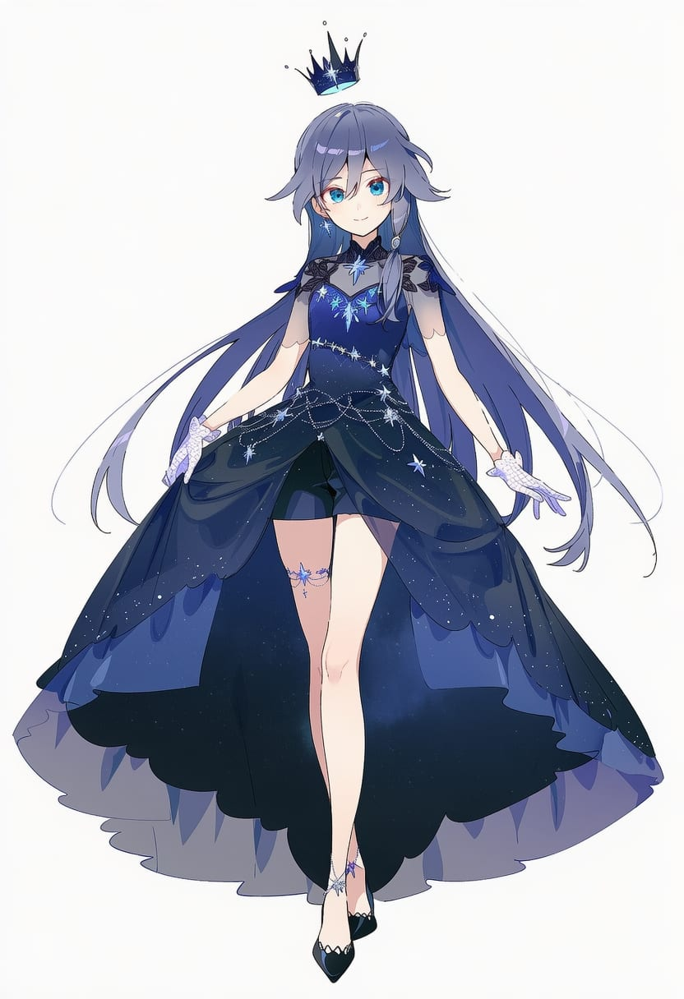

| 字段 | 内容 |
| --- | --- |
| Danbooru Tag | floating_crown |
| 中文名 | 悬浮王冠 |
| 中文含义 | 王冠悬浮在头顶，没有直接接触。 |
| 子类 | 冠冕/头冠 |
| 模特 | fu_hua |
| 序号 | 0126 |

## 107. broken_crown_未生效 — 破损王冠

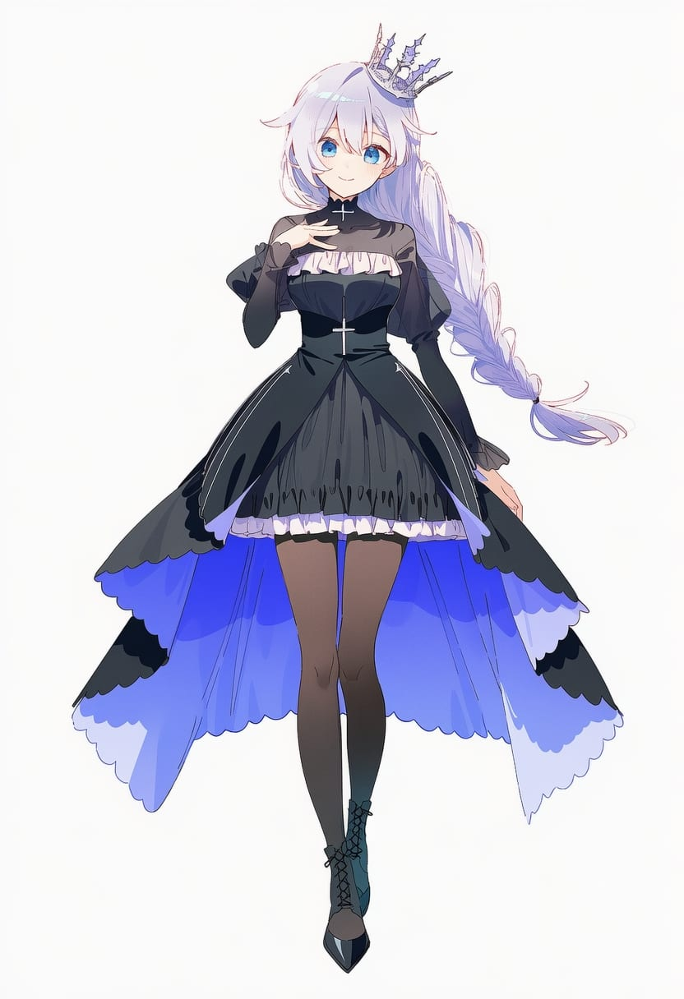

| 字段 | 内容 |
| --- | --- |
| Danbooru Tag | broken_crown_未生效 |
| 中文名 | 破损王冠 |
| 中文含义 | 有断裂或缺损的王冠。 |
| 子类 | 冠冕/头冠 |
| 模特 | kallen_kaslana |
| 序号 | 0127 |

## 108. jeweled_crown — 宝石王冠

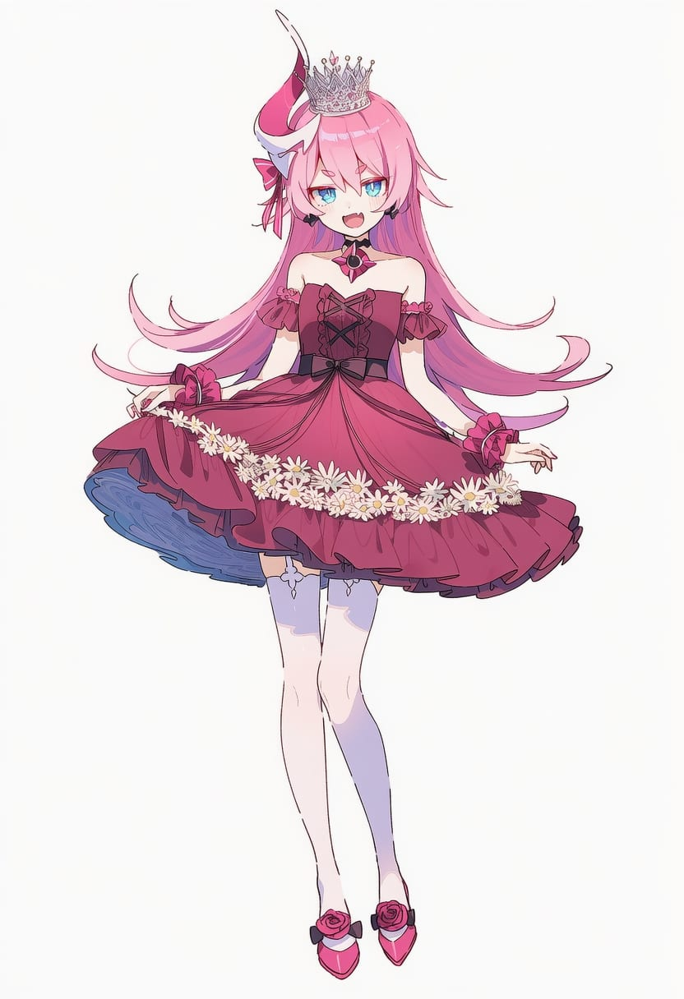

| 字段 | 内容 |
| --- | --- |
| Danbooru Tag | jeweled_crown |
| 中文名 | 宝石王冠 |
| 中文含义 | 镶有明显宝石的王冠。 |
| 子类 | 冠冕/头冠 |
| 模特 | rozaliya_olenyeva |
| 序号 | 0131 |

## 109. paper_crown_未生效 — 纸王冠

| 字段 | 内容 |
| --- | --- |
| Danbooru Tag | paper_crown_未生效 |
| 中文名 | 纸王冠 |
| 中文含义 | 纸质或纸折造型的王冠。 |
| 子类 | 冠冕/头冠 |
| 模特 | liliya_olenyeva |
| 序号 | 0132 |

## 110. circlet — 额冠 / 细冠

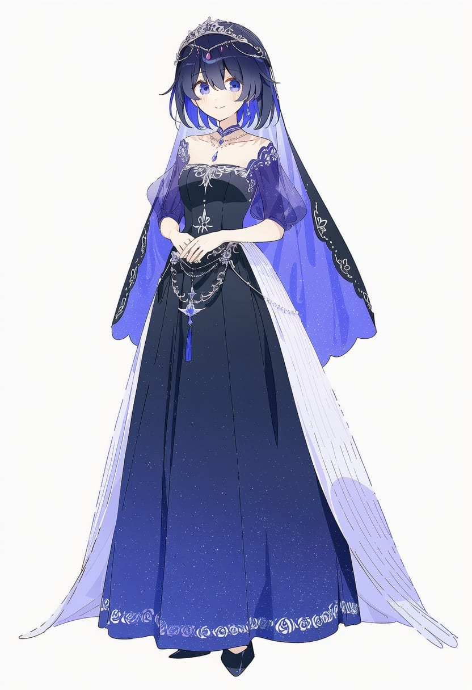

| 字段 | 内容 |
| --- | --- |
| Danbooru Tag | circlet |
| 中文名 | 额冠 / 细冠 |
| 中文含义 | 环绕额头或头部的细窄头冠。 |
| 子类 | 冠冕/头冠 |
| 模特 | seele_vollerei |
| 序号 | 0133 |

## 111. diadem — 冠冕额饰

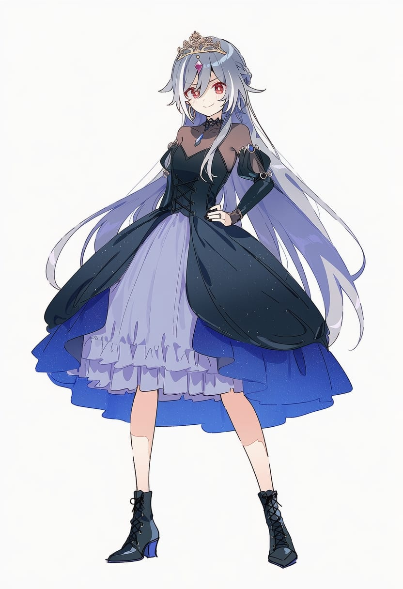

| 字段 | 内容 |
| --- | --- |
| Danbooru Tag | diadem |
| 中文名 | 冠冕额饰 |
| 中文含义 | 华丽的额冠或王室头饰。 |
| 子类 | 冠冕/头冠 |
| 模特 | herrscher_of_sentience |
| 序号 | 0134 |

## 112. saishi — 釵子

| 字段 | 内容 |
| --- | --- |
| Danbooru Tag | saishi |
| 中文名 | 釵子 |
| 中文含义 | 日本传统礼装中的头冠饰。 |
| 子类 | 冠冕/头冠 |
| 模特 | fischl_(genshin_impact) |
| 序号 | 0135 |

## 113. tiara — 皇冠头饰 / Tiara

| 字段 | 内容 |
| --- | --- |
| Danbooru Tag | tiara |
| 中文名 | 皇冠头饰 / Tiara |
| 中文含义 | 女性常见的半冠式珠宝头饰。 |
| 子类 | 冠冕/头冠 |
| 模特 | souryuu_asuka_langley |
| 序号 | 0136 |

## 114. aviator_cap — 飞行帽

| 字段 | 内容 |
| --- | --- |
| Danbooru Tag | aviator_cap |
| 中文名 | 飞行帽 |
| 中文含义 | 贴头并常带护耳的老式飞行帽。 |
| 子类 | 头巾/头纱 |
| 模特 | elysia_(honkai_impact) |
| 序号 | 0137 |

## 115. bandana — 头巾

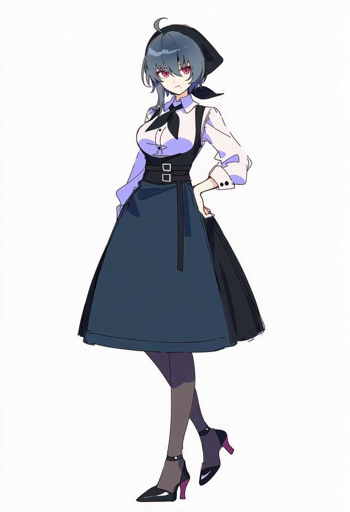

| 字段 | 内容 |
| --- | --- |
| Danbooru Tag | bandana |
| 中文名 | 头巾 |
| 中文含义 | 方巾折叠后系在头上的头巾。 |
| 子类 | 头巾/头纱 |
| 模特 | raven_(honkai_impact) |
| 序号 | 0139 |

## 116. bonnet — 软帽 / Bonnet

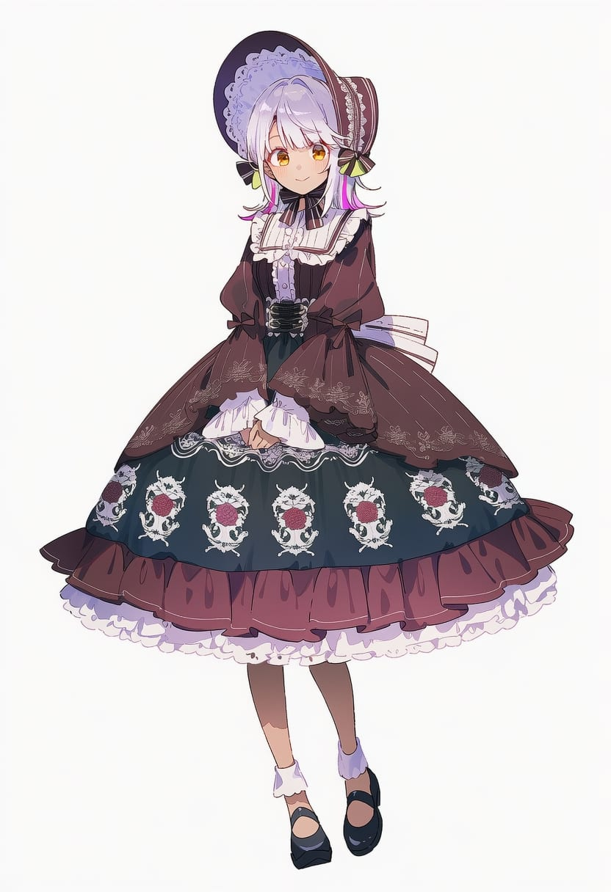

| 字段 | 内容 |
| --- | --- |
| Danbooru Tag | bonnet |
| 中文名 | 软帽 / Bonnet |
| 中文含义 | 系带固定、包住头部两侧的传统软帽。 |
| 子类 | 头巾/头纱 |
| 模特 | carole_peppers |
| 序号 | 0140 |

## 117. headscarf — 包头巾

| 字段 | 内容 |
| --- | --- |
| Danbooru Tag | headscarf |
| 中文名 | 包头巾 |
| 中文含义 | 用布料包住头发或头部。 |
| 子类 | 头巾/头纱 |
| 模特 | aponia |
| 序号 | 0141 |

## 118. hijab — 希贾布

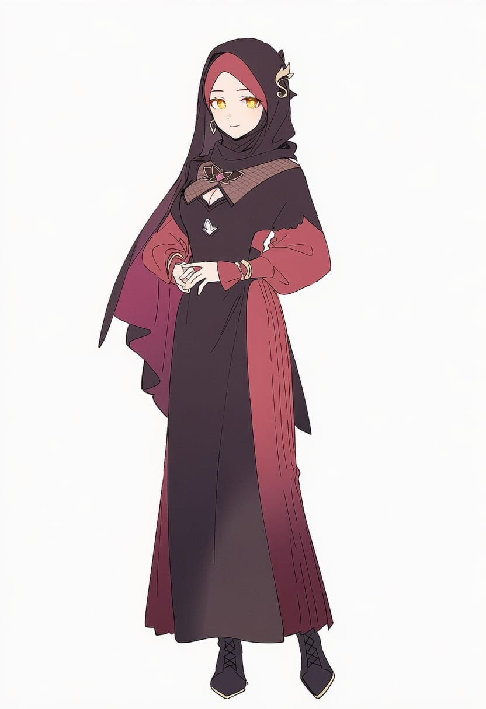

| 字段 | 内容 |
| --- | --- |
| Danbooru Tag | hijab |
| 中文名 | 希贾布 |
| 中文含义 | 覆盖头发和颈部的头巾。 |
| 子类 | 头巾/头纱 |
| 模特 | eden_(honkai_impact) |
| 序号 | 0142 |

## 119. jester_cap — 小丑帽

| 字段 | 内容 |
| --- | --- |
| Danbooru Tag | jester_cap |
| 中文名 | 小丑帽 |
| 中文含义 | 带多个尖角或铃铛的小丑帽。 |
| 子类 | 头巾/头纱 |
| 模特 | griseo |
| 序号 | 0143 |

## 120. keffiyeh — 阿拉伯头巾

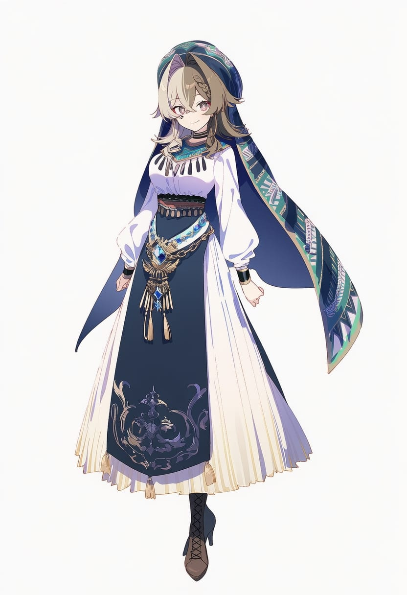

| 字段 | 内容 |
| --- | --- |
| Danbooru Tag | keffiyeh |
| 中文名 | 阿拉伯头巾 |
| 中文含义 | 中东常见的方格头巾。 |
| 子类 | 头巾/头纱 |
| 模特 | vill-v |
| 序号 | 0144 |

## 121. shower_cap — 浴帽

| 字段 | 内容 |
| --- | --- |
| Danbooru Tag | shower_cap |
| 中文名 | 浴帽 |
| 中文含义 | 洗澡时包住头发的防水帽。 |
| 子类 | 头巾/头纱 |
| 模特 | pardofelis |
| 序号 | 0145 |

## 122. turban — 头巾帽 / Turban

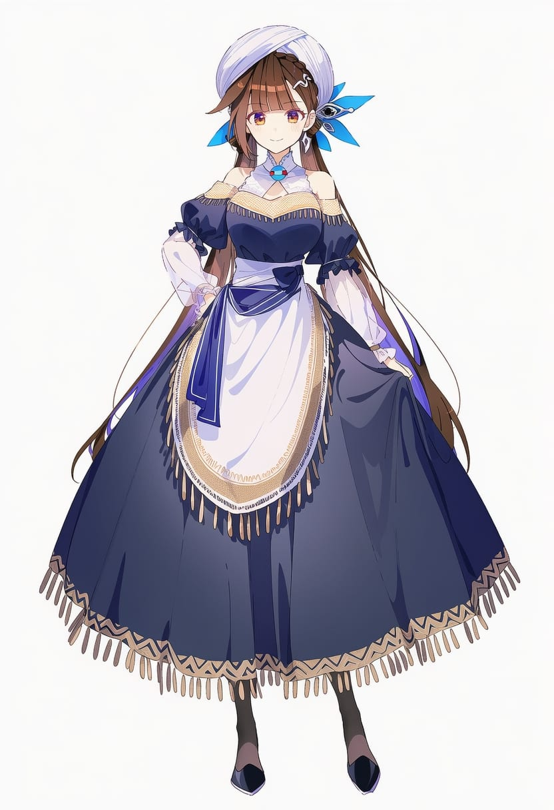

| 字段 | 内容 |
| --- | --- |
| Danbooru Tag | turban |
| 中文名 | 头巾帽 / Turban |
| 中文含义 | 布料层层缠绕形成的头巾。 |
| 子类 | 头巾/头纱 |
| 模特 | li_sushang |
| 序号 | 0146 |

## 123. visor_cap — 遮阳空顶帽

| 字段 | 内容 |
| --- | --- |
| Danbooru Tag | visor_cap |
| 中文名 | 遮阳空顶帽 |
| 中文含义 | 只有帽檐和头箍、顶部开放的帽子。 |
| 子类 | 头巾/头纱 |
| 模特 | ai_hyperion_lambda_(chrono_navi) |
| 序号 | 0147 |

## 124. veil — 头纱

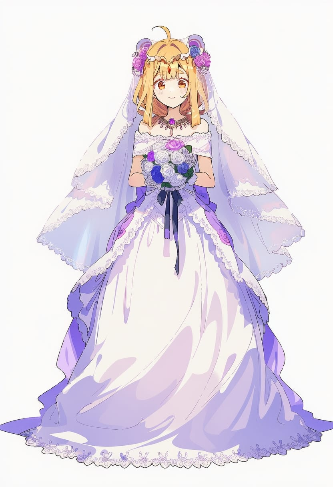

| 字段 | 内容 |
| --- | --- |
| Danbooru Tag | veil |
| 中文名 | 头纱 |
| 中文含义 | 从头部垂下的薄纱。 |
| 子类 | 头巾/头纱 |
| 模特 | susannah_manatt |
| 序号 | 0148 |

## 125. bridal_veil — 新娘头纱

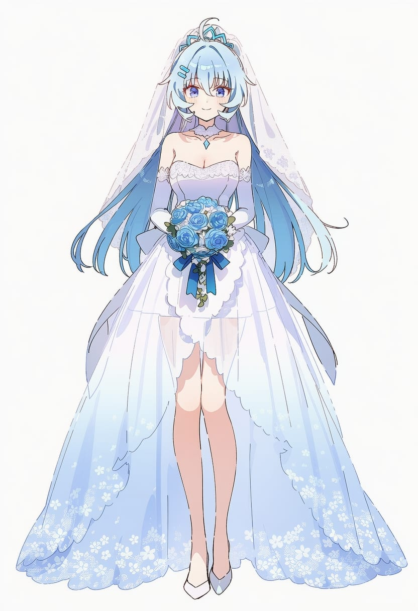

| 字段 | 内容 |
| --- | --- |
| Danbooru Tag | bridal_veil |
| 中文名 | 新娘头纱 |
| 中文含义 | 婚礼中新娘佩戴的头纱。 |
| 子类 | 头巾/头纱 |
| 模特 | shigure_kira |
| 序号 | 0149 |

## 126. see-through_veil — 透明头纱

| 字段 | 内容 |
| --- | --- |
| Danbooru Tag | see-through_veil |
| 中文名 | 透明头纱 |
| 中文含义 | 能明显透出后方轮廓的薄纱。 |
| 子类 | 头巾/头纱 |
| 模特 | sirin_(miracle_magical_girl) |
| 序号 | 0150 |

## 127. head_wrap — 缠头布

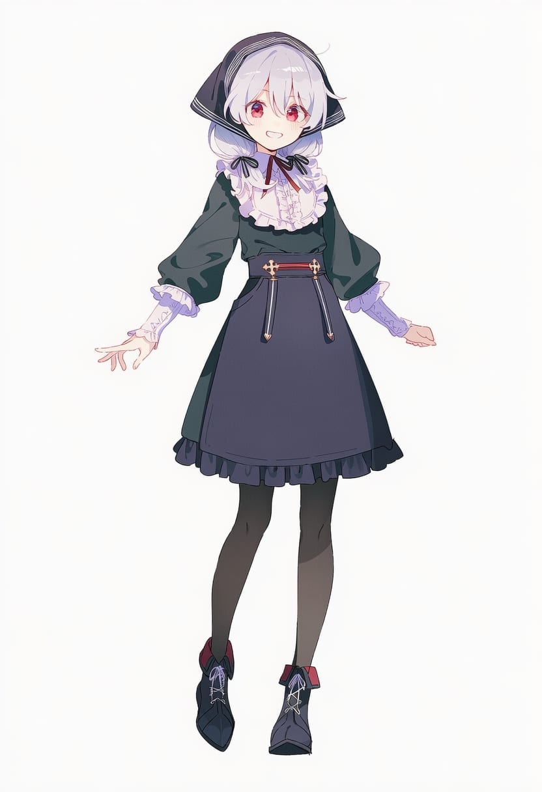

| 字段 | 内容 |
| --- | --- |
| Danbooru Tag | head_wrap |
| 中文名 | 缠头布 |
| 中文含义 | 布料直接缠绕包住头部。 |
| 子类 | 头巾/头纱 |
| 模特 | theresa_apocalypse_(luna_kindred) |
| 序号 | 0151 |

## 128. tenugui — 手拭头巾

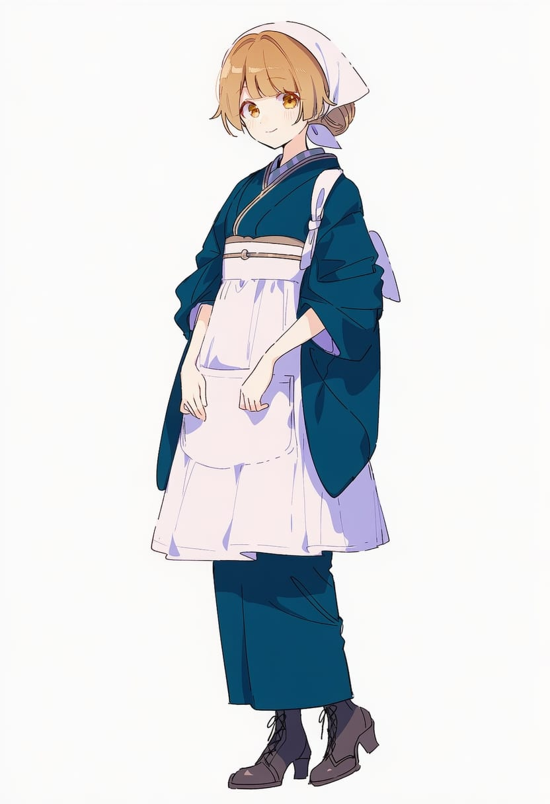

| 字段 | 内容 |
| --- | --- |
| Danbooru Tag | tenugui |
| 中文名 | 手拭头巾 |
| 中文含义 | 日式手拭布系在头上的造型。 |
| 子类 | 头巾/头纱 |
| 模特 | luna_(honkai_impact) |
| 序号 | 0152 |

## 129. headband — 头带

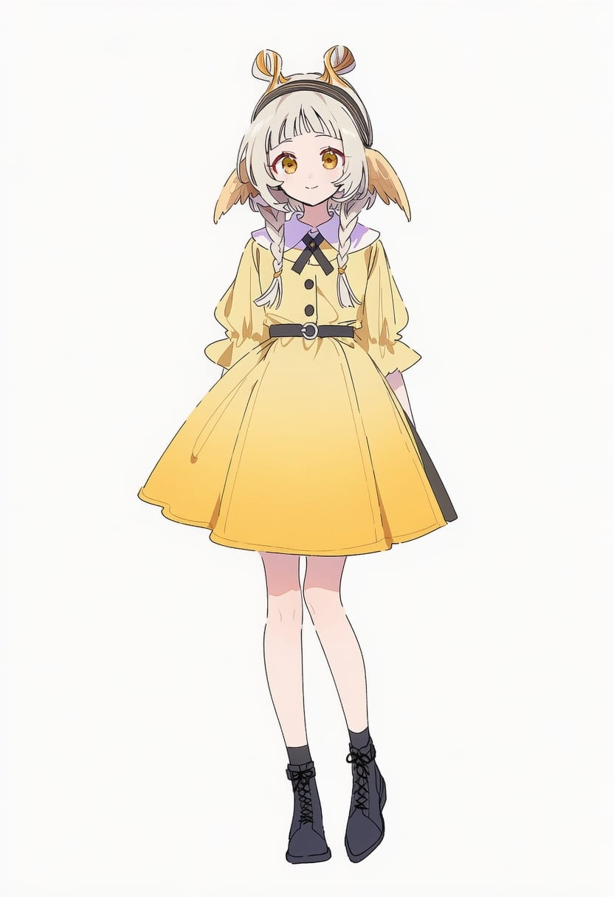

| 字段 | 内容 |
| --- | --- |
| Danbooru Tag | headband |
| 中文名 | 头带 |
| 中文含义 | 横跨额头佩戴的带状头饰。 |
| 子类 | 头带/装饰 |
| 模特 | grain_buds_(arknights) |
| 序号 | 0153 |

## 130. forehead_protector — 护额

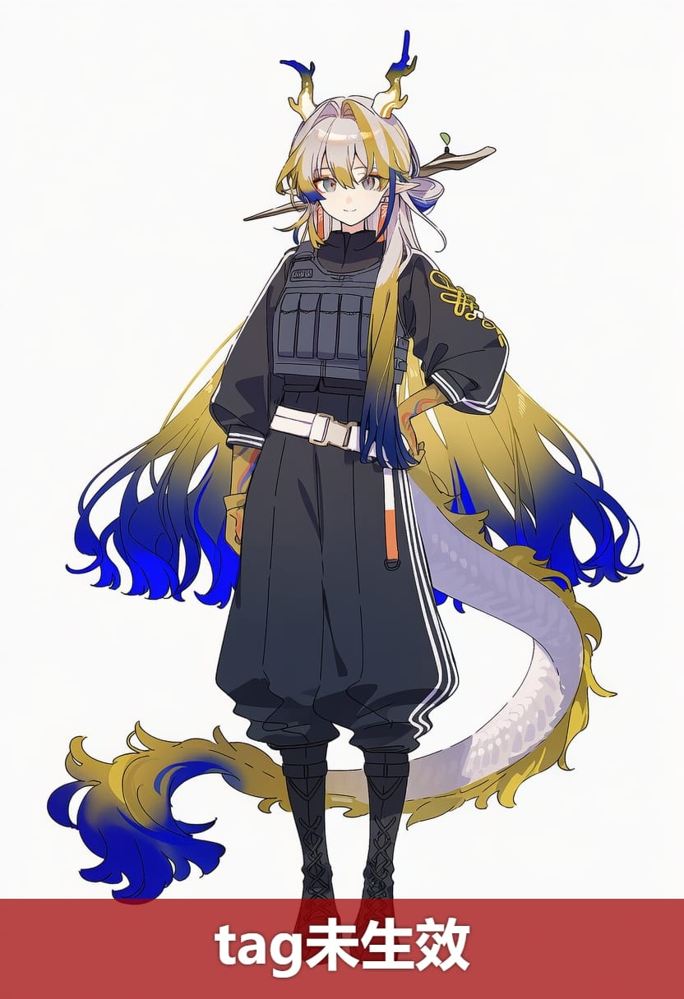

| 字段 | 内容 |
| --- | --- |
| Danbooru Tag | forehead_protector |
| 中文名 | 护额 |
| 中文含义 | 额头位置佩戴的护具或标志带。 |
| 子类 | 头带/装饰 |
| 模特 | shu_(arknights) |
| 序号 | 0154 |

## 131. hachimaki — 钵卷

| 字段 | 内容 |
| --- | --- |
| Danbooru Tag | hachimaki |
| 中文名 | 钵卷 |
| 中文含义 | 日式系在额头上的布带。 |
| 子类 | 头带/装饰 |
| 模特 | kestrel_(arknights) |
| 序号 | 0155 |

## 132. nejiri_hachimaki — 扭结钵卷

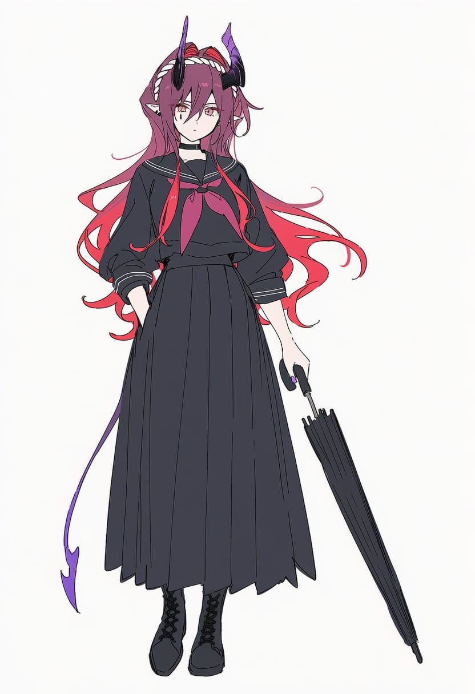

| 字段 | 内容 |
| --- | --- |
| Danbooru Tag | nejiri_hachimaki |
| 中文名 | 扭结钵卷 |
| 中文含义 | 拧成绳状并系在额头的日式头带。 |
| 子类 | 头带/装饰 |
| 模特 | ascalon_(arknights) |
| 序号 | 0156 |

## 133. headdress — 头饰

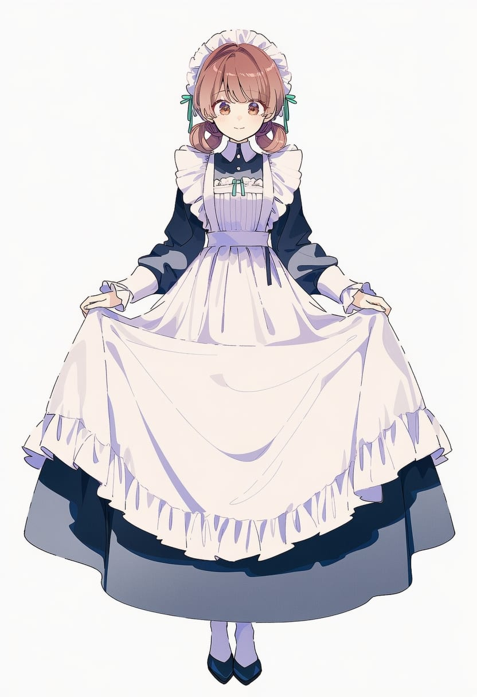

| 字段 | 内容 |
| --- | --- |
| Danbooru Tag | headdress |
| 中文名 | 头饰 |
| 中文含义 | 泛指独立佩戴在头上的装饰。 |
| 子类 | 头带/装饰 |
| 模特 | aroma_(arknights) |
| 序号 | 0158 |

## 134. maid_headdress — 女仆头饰

| 字段 | 内容 |
| --- | --- |
| Danbooru Tag | maid_headdress |
| 中文名 | 女仆头饰 |
| 中文含义 | 女仆装常见的褶边头饰。 |
| 子类 | 头带/装饰 |
| 模特 | theresa_(arknights) |
| 序号 | 0159 |

## 135. native_american_headdress — 原住民羽毛头饰

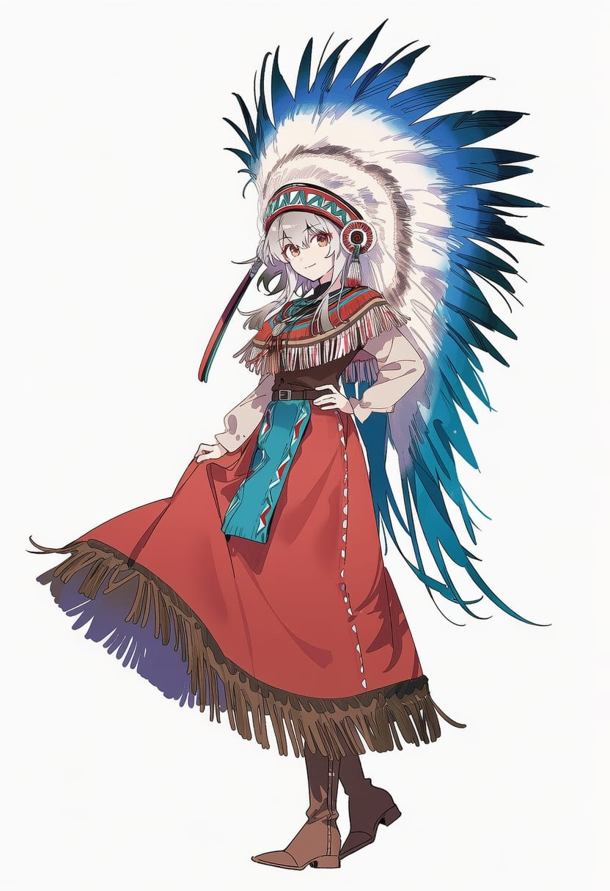

| 字段 | 内容 |
| --- | --- |
| Danbooru Tag | native_american_headdress |
| 中文名 | 原住民羽毛头饰 |
| 中文含义 | 美洲原住民风格的羽毛头饰。 |
| 子类 | 头带/装饰 |
| 模特 | wis'adel_(arknights) |
| 序号 | 0160 |

## 136. head_wreath — 头环花冠

| 字段 | 内容 |
| --- | --- |
| Danbooru Tag | head_wreath |
| 中文名 | 头环花冠 |
| 中文含义 | 花草或装饰物围成的头环。 |
| 子类 | 头带/装饰 |
| 模特 | underflow_(arknights) |
| 序号 | 0162 |

## 137. triangular_headpiece — 三角头巾饰

| 字段 | 内容 |
| --- | --- |
| Danbooru Tag | triangular_headpiece |
| 中文名 | 三角头巾饰 |
| 中文含义 | 额头前方呈三角形的头部装饰。 |
| 子类 | 头带/装饰 |
| 模特 | nymph_(arknights) |
| 序号 | 0163 |

## 138. halo — 光环

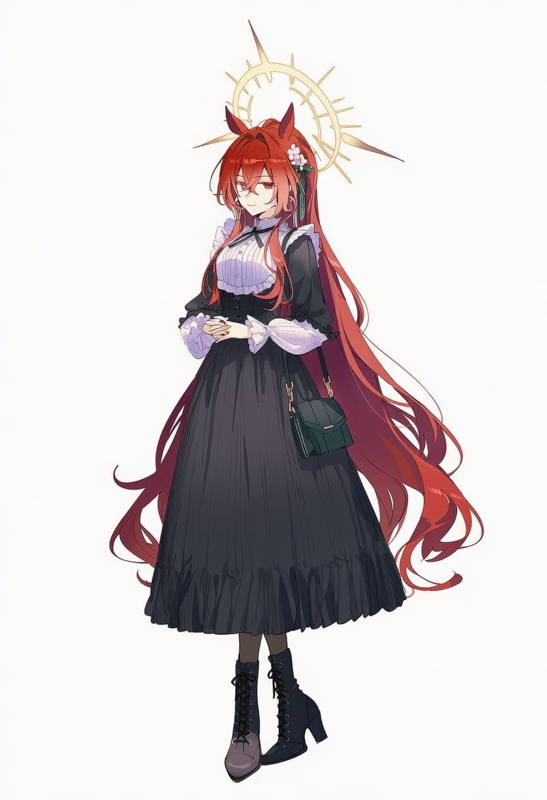

| 字段 | 内容 |
| --- | --- |
| Danbooru Tag | halo |
| 中文名 | 光环 |
| 中文含义 | 悬在头顶或头后的光环。 |
| 子类 | 头带/装饰 |
| 模特 | narantuya_(arknights) |
| 序号 | 0164 |

## 139. halo_behind_head — 头后光环

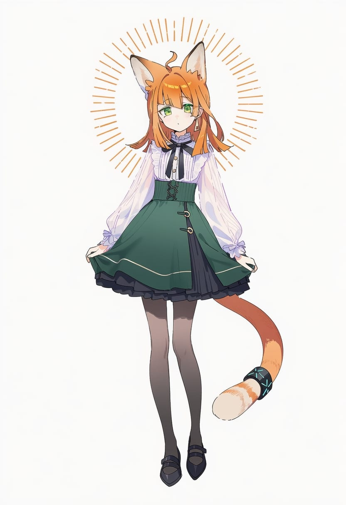

| 字段 | 内容 |
| --- | --- |
| Danbooru Tag | halo_behind_head |
| 中文名 | 头后光环 |
| 中文含义 | 光环明确位于脑后。 |
| 子类 | 头带/装饰 |
| 模特 | papyrus_(arknights) |
| 序号 | 0165 |

## 140. mini_hat — 迷你帽

| 字段 | 内容 |
| --- | --- |
| Danbooru Tag | mini_hat |
| 中文名 | 迷你帽 |
| 中文含义 | 尺寸明显缩小的装饰帽。 |
| 子类 | 帽饰/结构 |
| 模特 | pepe_(arknights) |
| 序号 | 0166 |

## 141. large_hat — 大帽子

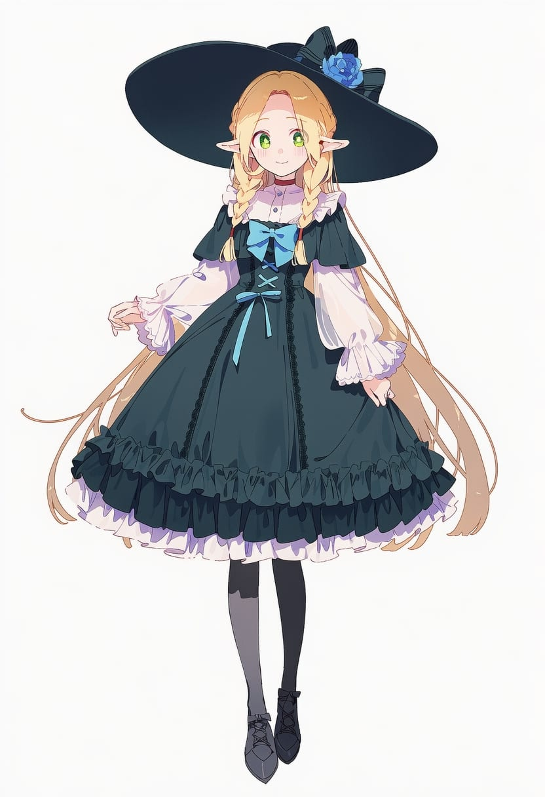

| 字段 | 内容 |
| --- | --- |
| Danbooru Tag | large_hat |
| 中文名 | 大帽子 |
| 中文含义 | 尺寸明显偏大的帽子。 |
| 子类 | 帽饰/结构 |
| 模特 | marcille_donato |
| 序号 | 0167 |

## 142. camouflage_headwear — 迷彩头饰

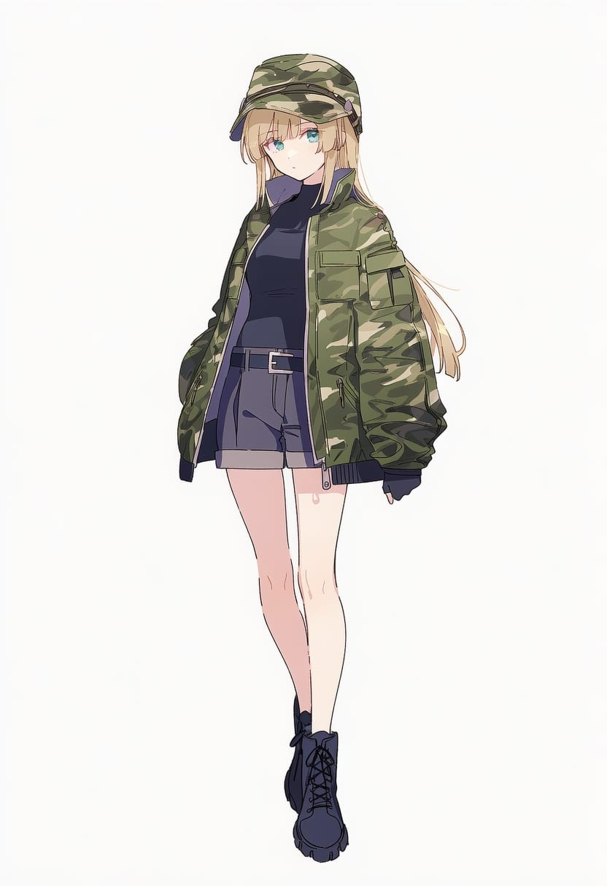

| 字段 | 内容 |
| --- | --- |
| Danbooru Tag | camouflage_headwear |
| 中文名 | 迷彩头饰 |
| 中文含义 | 带迷彩图案的帽子或头饰。 |
| 子类 | 帽饰/结构 |
| 模特 | catherine_(arknights) |
| 序号 | 0168 |

## 143. checkered_headwear — 棋盘格头饰

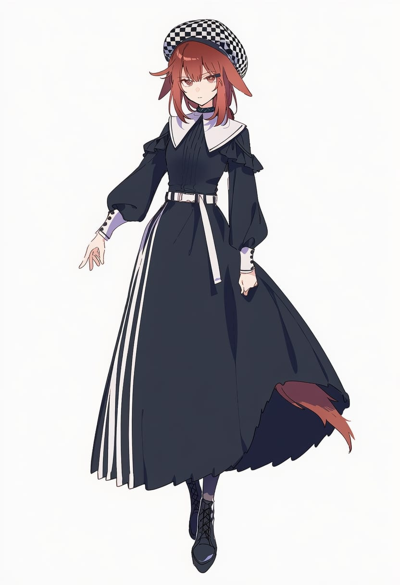

| 字段 | 内容 |
| --- | --- |
| Danbooru Tag | checkered_headwear |
| 中文名 | 棋盘格头饰 |
| 中文含义 | 带棋盘格图案的头饰。 |
| 子类 | 帽饰/结构 |
| 模特 | crownslayer_(arknights) |
| 序号 | 0169 |

## 144. frilled_hat — 荷叶边帽

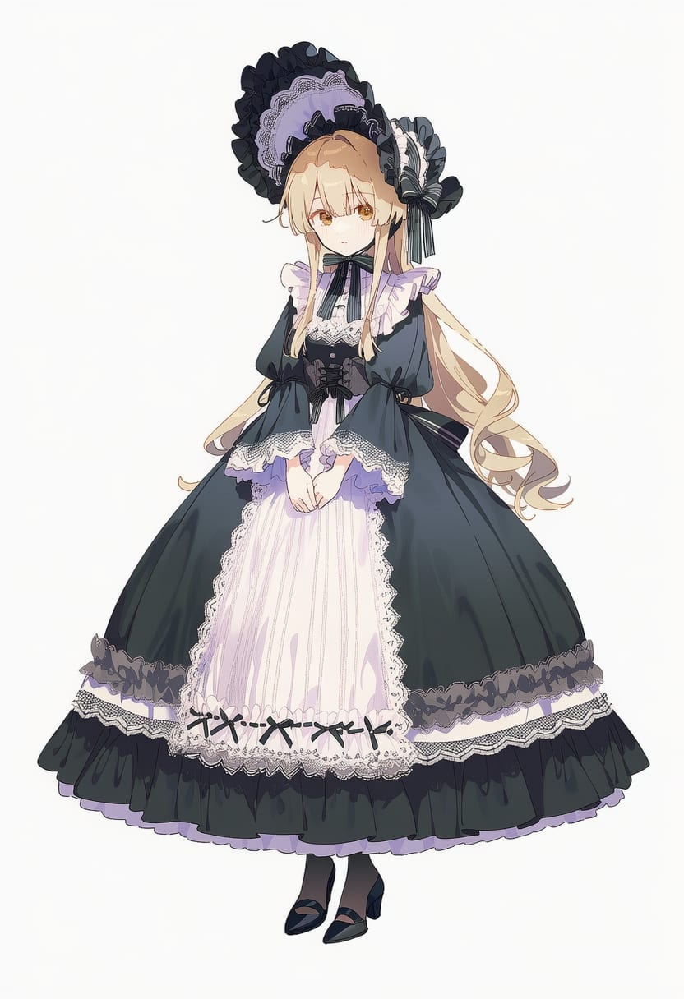

| 字段 | 内容 |
| --- | --- |
| Danbooru Tag | frilled_hat |
| 中文名 | 荷叶边帽 |
| 中文含义 | 帽子边缘带明显褶边。 |
| 子类 | 帽饰/结构 |
| 模特 | contrail_(arknights) |
| 序号 | 0170 |

## 145. military_hat — 军帽

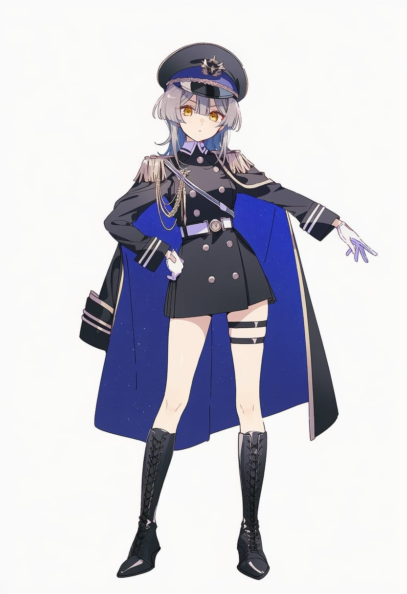

| 字段 | 内容 |
| --- | --- |
| Danbooru Tag | military_hat |
| 中文名 | 军帽 |
| 中文含义 | 具有明显军事制服风格的帽子。 |
| 子类 | 帽饰/结构 |
| 模特 | philae_(arknights) |
| 序号 | 0171 |

## 146. multicolored_headwear — 多色头饰

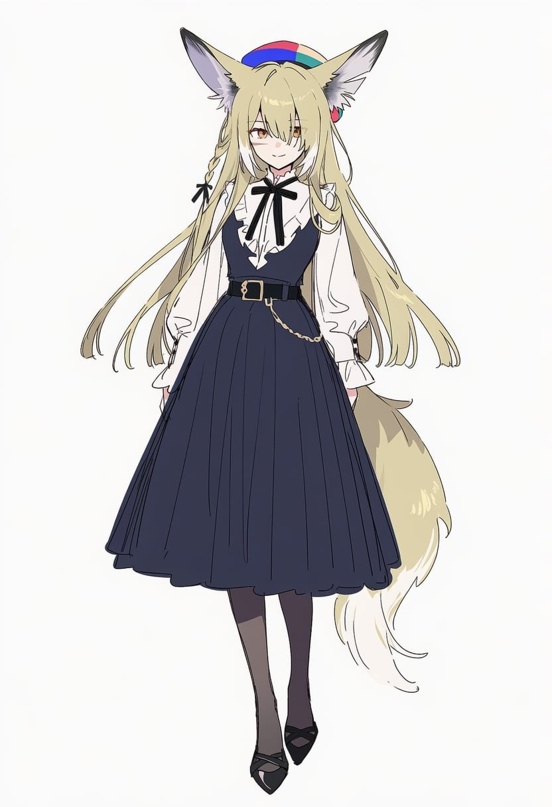

| 字段 | 内容 |
| --- | --- |
| Danbooru Tag | multicolored_headwear |
| 中文名 | 多色头饰 |
| 中文含义 | 同一头饰带多种颜色。 |
| 子类 | 帽饰/结构 |
| 模特 | vulpisfoglia_(arknights) |
| 序号 | 0172 |

## 147. police_hat — 警帽

| 字段 | 内容 |
| --- | --- |
| Danbooru Tag | police_hat |
| 中文名 | 警帽 |
| 中文含义 | 警察制服风格的帽子。 |
| 子类 | 帽饰/结构 |
| 模特 | tecno_(arknights) |
| 序号 | 0173 |

## 148. print_headwear — 印花头饰

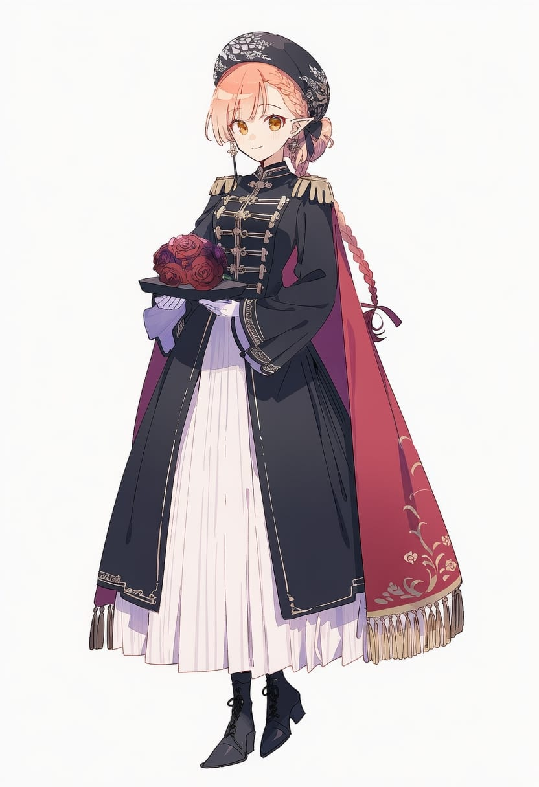

| 字段 | 内容 |
| --- | --- |
| Danbooru Tag | print_headwear |
| 中文名 | 印花头饰 |
| 中文含义 | 表面带明显印花图案的头饰。 |
| 子类 | 帽饰/结构 |
| 模特 | rose_salt_(arknights) |
| 序号 | 0174 |

## 149. school_hat — 学生帽

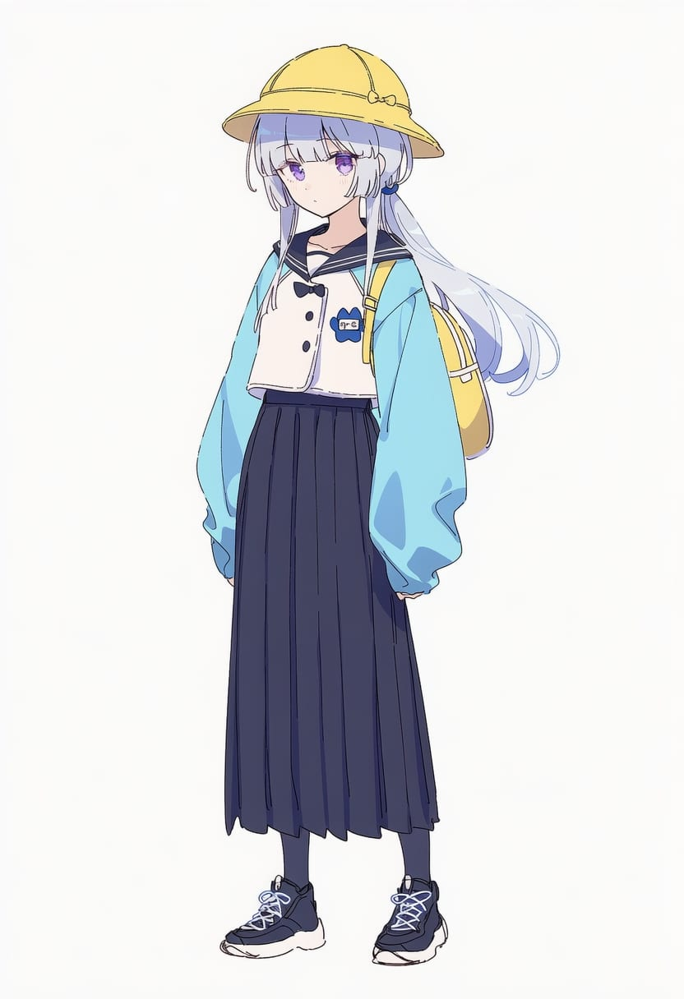

| 字段 | 内容 |
| --- | --- |
| Danbooru Tag | school_hat |
| 中文名 | 学生帽 |
| 中文含义 | 学校制服或儿童上学常见的帽子。 |
| 子类 | 帽饰/结构 |
| 模特 | surfer_(arknights) |
| 序号 | 0175 |

## 150. two-tone_hat — 双色帽

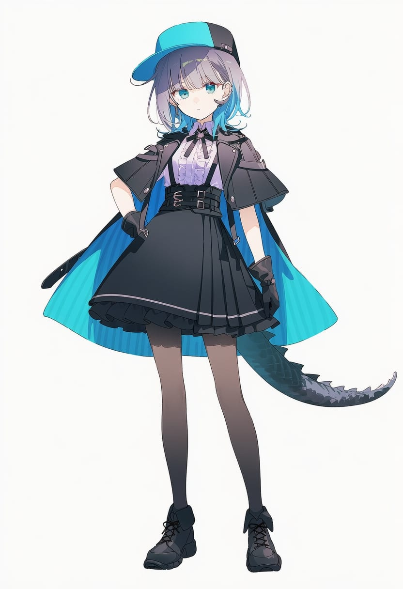

| 字段 | 内容 |
| --- | --- |
| Danbooru Tag | two-tone_hat |
| 中文名 | 双色帽 |
| 中文含义 | 帽子由两种主要颜色组成。 |
| 子类 | 帽饰/结构 |
| 模特 | taraxacum_(arknights) |
| 序号 | 0176 |

## 151. hat_bow — 帽子蝴蝶结

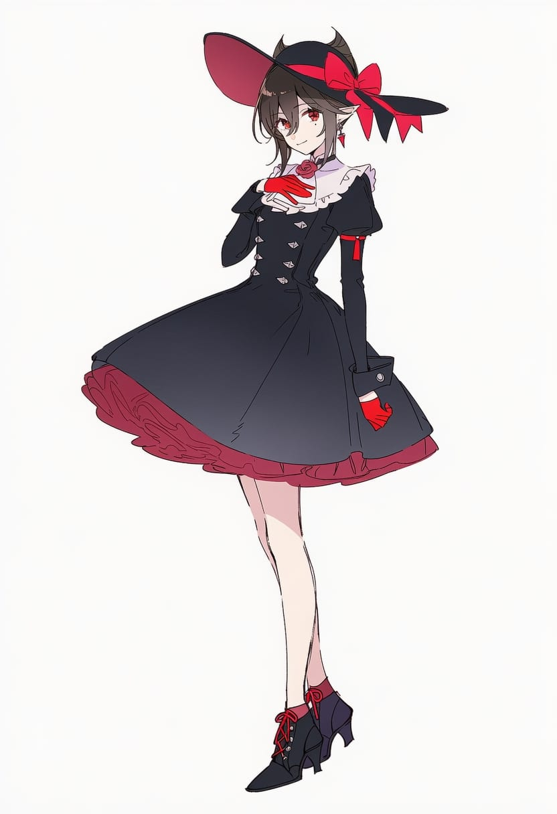

| 字段 | 内容 |
| --- | --- |
| Danbooru Tag | hat_bow |
| 中文名 | 帽子蝴蝶结 |
| 中文含义 | 帽子上带明显蝴蝶结。 |
| 子类 | 帽饰/结构 |
| 模特 | entelechia_(arknights) |
| 序号 | 0177 |

## 152. hat_feather — 帽羽

| 字段 | 内容 |
| --- | --- |
| Danbooru Tag | hat_feather |
| 中文名 | 帽羽 |
| 中文含义 | 插在帽子上的羽毛装饰。 |
| 子类 | 帽饰/结构 |
| 模特 | wulfenite_(arknights) |
| 序号 | 0178 |

## 153. hat_flower — 帽花

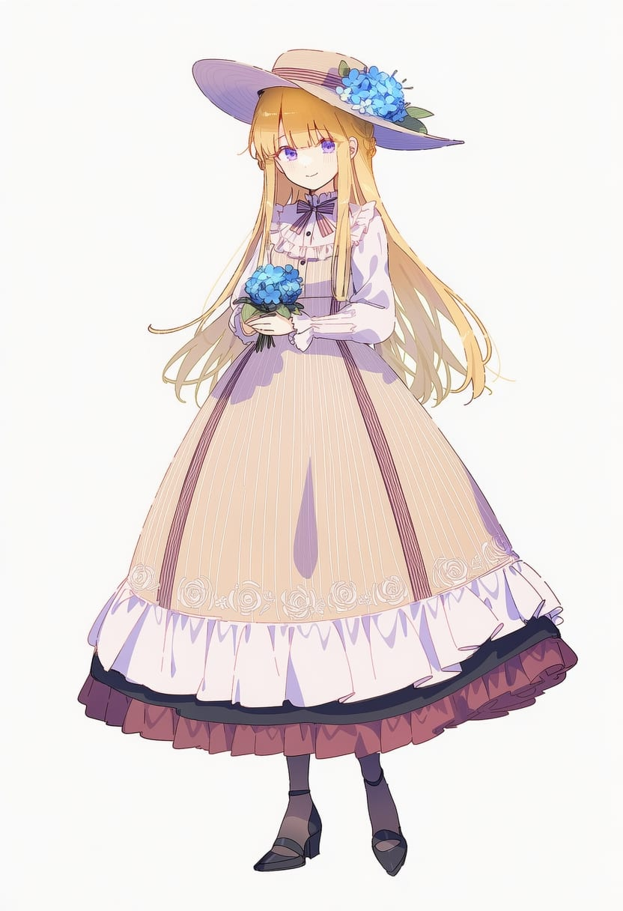

| 字段 | 内容 |
| --- | --- |
| Danbooru Tag | hat_flower |
| 中文名 | 帽花 |
| 中文含义 | 帽子上的花朵装饰。 |
| 子类 | 帽饰/结构 |
| 模特 | brigid_(arknights) |
| 序号 | 0179 |

## 154. hat_ornament — 帽饰

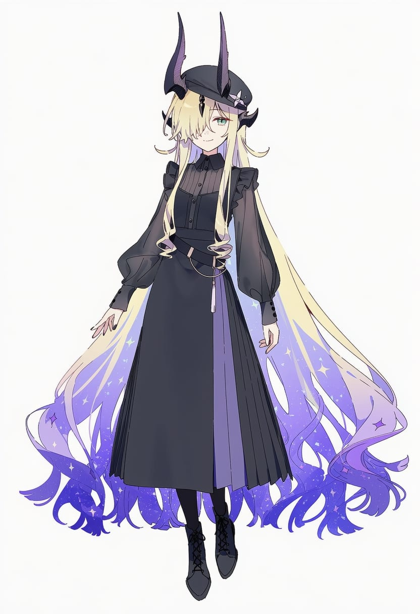

| 字段 | 内容 |
| --- | --- |
| Danbooru Tag | hat_ornament |
| 中文名 | 帽饰 |
| 中文含义 | 帽子上的装饰物。 |
| 子类 | 帽饰/结构 |
| 模特 | necrass_(arknights) |
| 序号 | 0180 |

## 155. anchor_hat_ornament — 船锚帽饰

| 字段 | 内容 |
| --- | --- |
| Danbooru Tag | anchor_hat_ornament |
| 中文名 | 船锚帽饰 |
| 中文含义 | 船锚造型的帽饰。 |
| 子类 | 帽饰/结构 |
| 模特 | mon3tr_(arknights) |
| 序号 | 0181 |

## 156. butterfly_hat_ornament — 蝴蝶帽饰

| 字段 | 内容 |
| --- | --- |
| Danbooru Tag | butterfly_hat_ornament |
| 中文名 | 蝴蝶帽饰 |
| 中文含义 | 蝴蝶造型的帽饰。 |
| 子类 | 帽饰/结构 |
| 模特 | alanna_(arknights) |
| 序号 | 0182 |

## 157. character_hat_ornament — 角色造型帽饰

| 字段 | 内容 |
| --- | --- |
| Danbooru Tag | character_hat_ornament |
| 中文名 | 角色造型帽饰 |
| 中文含义 | 做成角色或头像造型的帽饰。 |
| 子类 | 帽饰/结构 |
| 模特 | lemuen_(arknights) |
| 序号 | 0183 |

## 158. crescent_hat_ornament — 月牙帽饰

| 字段 | 内容 |
| --- | --- |
| Danbooru Tag | crescent_hat_ornament |
| 中文名 | 月牙帽饰 |
| 中文含义 | 月牙造型的帽饰。 |
| 子类 | 帽饰/结构 |
| 模特 | tippi_(arknights) |
| 序号 | 0184 |

## 159. food-themed_hat_ornament — 食物主题帽饰

| 字段 | 内容 |
| --- | --- |
| Danbooru Tag | food-themed_hat_ornament |
| 中文名 | 食物主题帽饰 |
| 中文含义 | 食物造型或食物主题的帽饰。 |
| 子类 | 帽饰/结构 |
| 模特 | pinecone_(arknights) |
| 序号 | 0185 |

## 160. heart_hat_ornament — 爱心帽饰

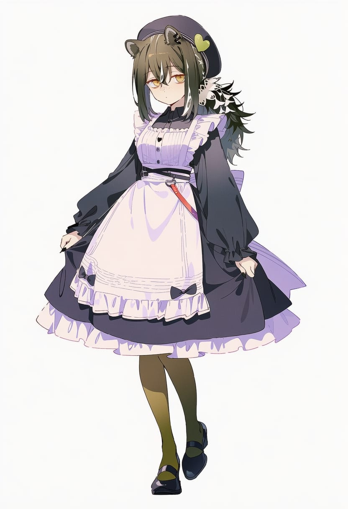

| 字段 | 内容 |
| --- | --- |
| Danbooru Tag | heart_hat_ornament |
| 中文名 | 爱心帽饰 |
| 中文含义 | 爱心造型的帽饰。 |
| 子类 | 帽饰/结构 |
| 模特 | robin_(arknights) |
| 序号 | 0186 |

## 161. holly_hat_ornament — 冬青帽饰

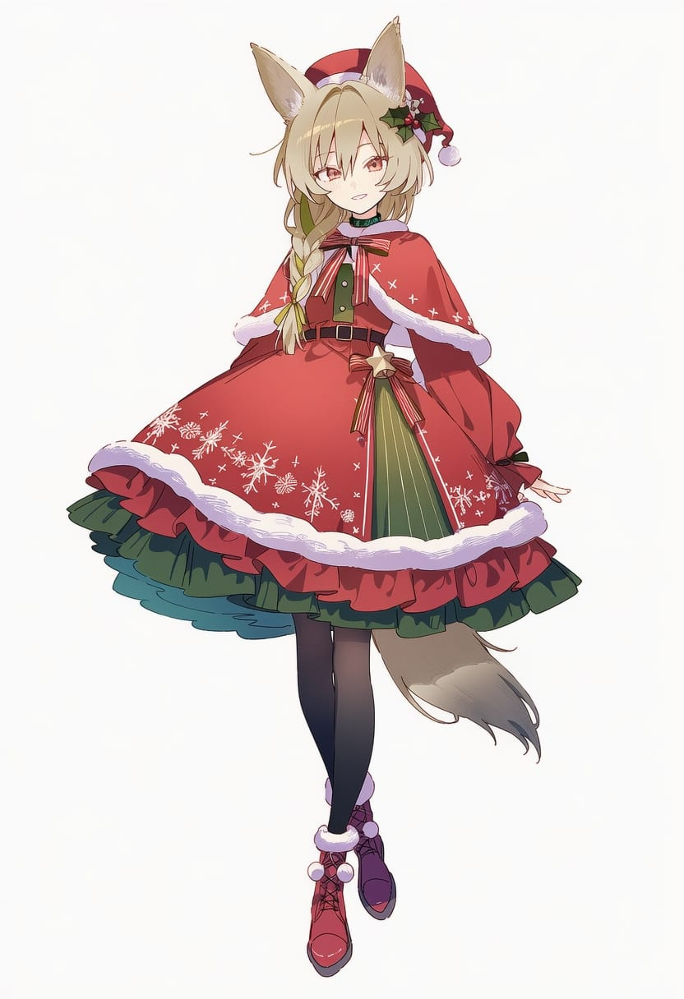

| 字段 | 内容 |
| --- | --- |
| Danbooru Tag | holly_hat_ornament |
| 中文名 | 冬青帽饰 |
| 中文含义 | 冬青叶和果实造型的帽饰。 |
| 子类 | 帽饰/结构 |
| 模特 | beanstalk_(arknights) |
| 序号 | 0187 |

## 162. leaf_hat_ornament — 叶片帽饰

| 字段 | 内容 |
| --- | --- |
| Danbooru Tag | leaf_hat_ornament |
| 中文名 | 叶片帽饰 |
| 中文含义 | 叶子造型的帽饰。 |
| 子类 | 帽饰/结构 |
| 模特 | archetto_(arknights) |
| 序号 | 0188 |

## 163. star_hat_ornament — 星星帽饰

| 字段 | 内容 |
| --- | --- |
| Danbooru Tag | star_hat_ornament |
| 中文名 | 星星帽饰 |
| 中文含义 | 星形帽饰。 |
| 子类 | 帽饰/结构 |
| 模特 | iris_(arknights) |
| 序号 | 0189 |

## 164. skull_hat_ornament — 骷髅帽饰

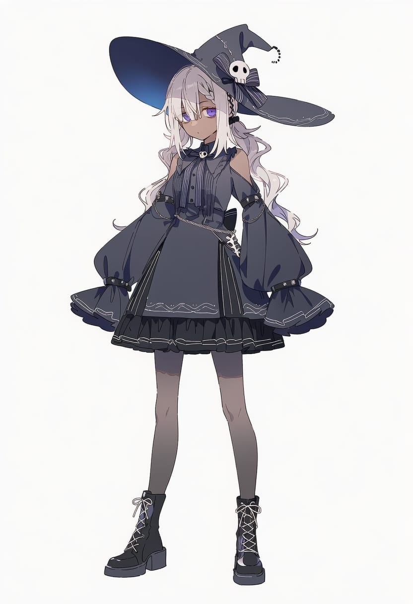

| 字段 | 内容 |
| --- | --- |
| Danbooru Tag | skull_hat_ornament |
| 中文名 | 骷髅帽饰 |
| 中文含义 | 骷髅造型的帽饰。 |
| 子类 | 帽饰/结构 |
| 模特 | tuye_(arknights) |
| 序号 | 0190 |

## 165. hat_tassel — 帽穗

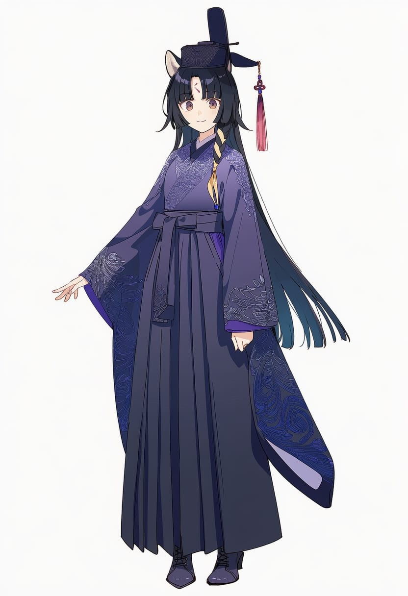

| 字段 | 内容 |
| --- | --- |
| Danbooru Tag | hat_tassel |
| 中文名 | 帽穗 |
| 中文含义 | 帽子上垂下的流苏。 |
| 子类 | 帽饰/结构 |
| 模特 | saga_(arknights) |
| 序号 | 0191 |

## 166. hat_ribbon — 帽带丝带

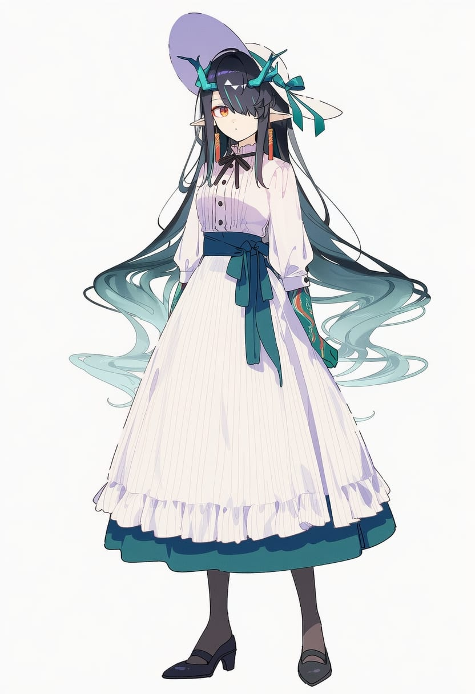

| 字段 | 内容 |
| --- | --- |
| Danbooru Tag | hat_ribbon |
| 中文名 | 帽带丝带 |
| 中文含义 | 缠在或装饰在帽子上的丝带。 |
| 子类 | 帽饰/结构 |
| 模特 | dusk_(arknights) |
| 序号 | 0192 |

## 167. chinstrap — 帽下巴带

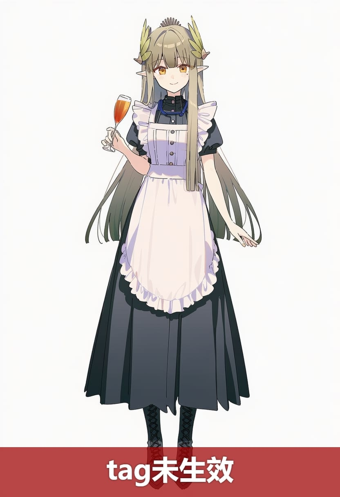

| 字段 | 内容 |
| --- | --- |
| Danbooru Tag | chinstrap |
| 中文名 | 帽下巴带 |
| 中文含义 | 从帽子两侧绕到下巴固定的带子。 |
| 子类 | 帽饰/结构 |
| 模特 | muelsyse_(arknights) |
| 序号 | 0193 |

## 168. headwear_writing — 带文字的头饰

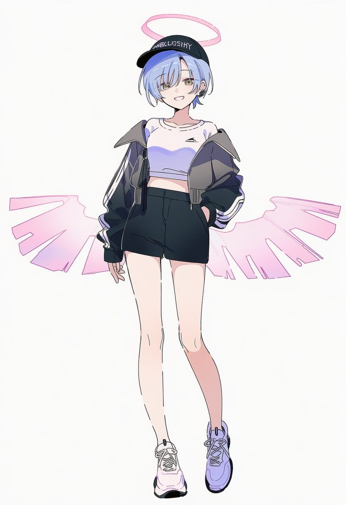

| 字段 | 内容 |
| --- | --- |
| Danbooru Tag | headwear_writing |
| 中文名 | 带文字的头饰 |
| 中文含义 | 帽子或头饰上有清晰文字。 |
| 子类 | 帽饰/结构 |
| 模特 | spuria_(arknights) |
| 序号 | 0194 |

---
