# 套装tag展示

## 1. santa_costume — 圣诞老人装

| 字段 | 内容 |
| --- | --- |
| Danbooru Tag | santa_costume |
| 中文含义 | 圣诞老人装 |
| 详细解释 | 圣诞老人主题完整服装，常见红白配色、毛边、帽子与靴子等。 |
| 所属子类 | 主题套装 |

## 2. pirate_costume — 海盗装

| 字段 | 内容 |
| --- | --- |
| Danbooru Tag | pirate_costume |
| 中文含义 | 海盗装 |
| 详细解释 | 以经典海盗形象为主题的完整装扮。 |
| 所属子类 | 主题套装 |

## 3. mummy_costume — 木乃伊装

| 字段 | 内容 |
| --- | --- |
| Danbooru Tag | mummy_costume |
| 中文含义 | 木乃伊装 |
| 详细解释 | 以绷带缠绕的木乃伊形象为主题的装扮。 |
| 所属子类 | 主题套装 |

## 4. ghost_costume — 幽灵装

| 字段 | 内容 |
| --- | --- |
| Danbooru Tag | ghost_costume |
| 中文含义 | 幽灵装 |
| 详细解释 | 以幽灵形象为主题的完整装扮。 |
| 所属子类 | 主题套装 |

## 5. kigurumi — 连体角色服

| 字段 | 内容 |
| --- | --- |
| Danbooru Tag | kigurumi |
| 中文含义 | 连体角色服 |
| 详细解释 | 包覆全身或大部分身体的动物、角色布偶式服装。 |
| 所属子类 | 主题套装 |

## 6. reindeer_costume — 驯鹿装

| 字段 | 内容 |
| --- | --- |
| Danbooru Tag | reindeer_costume |
| 中文含义 | 驯鹿装 |
| 详细解释 | 以驯鹿形象为主题的完整装扮。 |
| 所属子类 | 主题套装 |

## 7. vampire_costume — 吸血鬼装

| 字段 | 内容 |
| --- | --- |
| Danbooru Tag | vampire_costume |
| 中文含义 | 吸血鬼装 |
| 详细解释 | 以经典吸血鬼形象为主题的完整装扮。 |
| 所属子类 | 主题套装 |

## 8. shark_costume — 鲨鱼套装

| 字段 | 内容 |
| --- | --- |
| Danbooru Tag | shark_costume |
| 中文含义 | 鲨鱼套装 |
| 详细解释 | 以鲨鱼外形为主题的完整角色服装。 |
| 所属子类 | 主题套装 |

## 9. bear_costume — 熊套装

| 字段 | 内容 |
| --- | --- |
| Danbooru Tag | bear_costume |
| 中文含义 | 熊套装 |
| 详细解释 | 以熊外形为主题的完整角色服装。 |
| 所属子类 | 主题套装 |

## 10. cat_costume — 猫套装

| 字段 | 内容 |
| --- | --- |
| Danbooru Tag | cat_costume |
| 中文含义 | 猫套装 |
| 详细解释 | 以猫外形为主题的完整角色服装。 |
| 所属子类 | 主题套装 |

## 11. wolf_costume — 狼套装

| 字段 | 内容 |
| --- | --- |
| Danbooru Tag | wolf_costume |
| 中文含义 | 狼套装 |
| 详细解释 | 以狼外形为主题的完整角色服装。 |
| 所属子类 | 主题套装 |

## 12. penguin_costume — 企鹅套装

| 字段 | 内容 |
| --- | --- |
| Danbooru Tag | penguin_costume |
| 中文含义 | 企鹅套装 |
| 详细解释 | 以企鹅外形为主题的完整角色服装。 |
| 所属子类 | 主题套装 |

## 13. rabbit_costume — 兔子套装

| 字段 | 内容 |
| --- | --- |
| Danbooru Tag | rabbit_costume |
| 中文含义 | 兔子套装 |
| 详细解释 | 以兔子外形为主题的完整角色服装。 |
| 所属子类 | 主题套装 |

## 14. cow_costume — 奶牛套装

| 字段 | 内容 |
| --- | --- |
| Danbooru Tag | cow_costume |
| 中文含义 | 奶牛套装 |
| 详细解释 | 以奶牛外形为主题的完整角色服装。 |
| 所属子类 | 主题套装 |

## 15. sheep_costume — 绵羊套装

| 字段 | 内容 |
| --- | --- |
| Danbooru Tag | sheep_costume |
| 中文含义 | 绵羊套装 |
| 详细解释 | 以绵羊外形为主题的完整角色服装。 |
| 所属子类 | 主题套装 |

## 16. tiger_costume — 老虎套装

| 字段 | 内容 |
| --- | --- |
| Danbooru Tag | tiger_costume |
| 中文含义 | 老虎套装 |
| 详细解释 | 以老虎外形为主题的完整角色服装。 |
| 所属子类 | 主题套装 |

## 17. dog_costume — 狗狗套装

| 字段 | 内容 |
| --- | --- |
| Danbooru Tag | dog_costume |
| 中文含义 | 狗狗套装 |
| 详细解释 | 以狗狗外形为主题的完整角色服装。 |
| 所属子类 | 主题套装 |

## 18. panda_costume — 熊猫套装

| 字段 | 内容 |
| --- | --- |
| Danbooru Tag | panda_costume |
| 中文含义 | 熊猫套装 |
| 详细解释 | 以熊猫外形为主题的完整角色服装。 |
| 所属子类 | 主题套装 |

## 19. maid — 女仆装

| 字段 | 内容 |
| --- | --- |
| Danbooru Tag | maid |
| 中文含义 | 女仆装 |
| 详细解释 | Danbooru 中用于“穿着女仆制服的人”，不要求角色实际从事女仆职业。 |
| 所属子类 | 职业装 |

## 20. suit — 西装套装

| 字段 | 内容 |
| --- | --- |
| Danbooru Tag | suit |
| 中文含义 | 西装套装 |
| 详细解释 | 西式成套正装，通常至少包含衬衫、西装外套与同料裤装或裙装。 |
| 所属子类 | 职业装 |

## 21. skirt_set — 裙装套装

| 字段 | 内容 |
| --- | --- |
| Danbooru Tag | skirt_set |
| 中文含义 | 裙装套装 |
| 详细解释 | 由上装与裙子组成、在设计上明显配套的一整套服饰。 |
| 所属子类 | 职业装 |

## 22. lab_coat — 实验室白大褂

| 字段 | 内容 |
| --- | --- |
| Danbooru Tag | lab_coat |
| 中文含义 | 实验室白大褂 |
| 详细解释 | 医生、研究员、科学工作者常见的白大褂；是职业视觉识别度很高的服装 Tag。 |
| 所属子类 | 职业装 |

## 23. nun — 修女服

| 字段 | 内容 |
| --- | --- |
| Danbooru Tag | nun |
| 中文含义 | 修女服 |
| 详细解释 | 修女典型的宗教制服整体造型。 |
| 所属子类 | 职业装 |

## 24. overalls — 背带工装裤

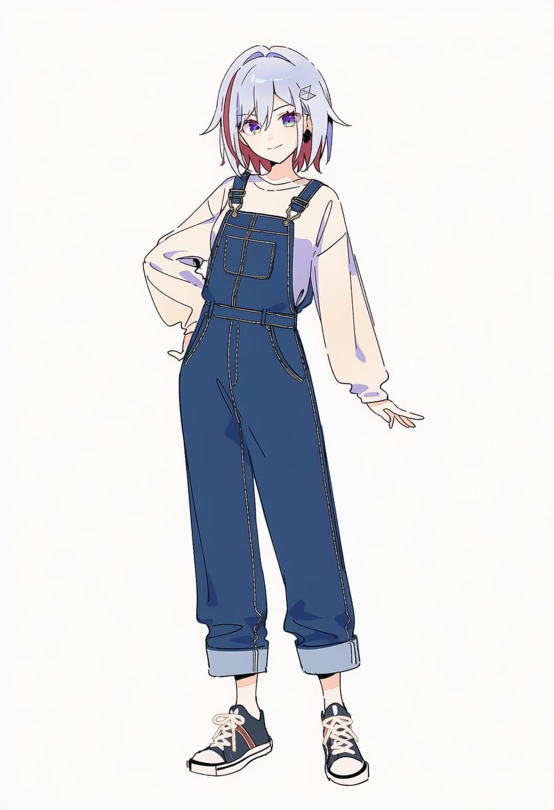

| 字段 | 内容 |
| --- | --- |
| Danbooru Tag | overalls |
| 中文含义 | 背带工装裤 |
| 详细解释 | 带肩带和胸前护片、与裤身连成一体的工装裤。 |
| 所属子类 | 职业装 |

## 25. nurse — 护士装

| 字段 | 内容 |
| --- | --- |
| Danbooru Tag | nurse |
| 中文含义 | 护士装 |
| 详细解释 | Danbooru 中常用于护士角色及典型医疗制服造型；比单独 nurse_cap 更接近整体职业形象。 |
| 所属子类 | 职业装 |

## 26. waitress — 女服务员制服

| 字段 | 内容 |
| --- | --- |
| Danbooru Tag | waitress |
| 中文含义 | 女服务员制服 |
| 详细解释 | 女性餐饮服务人员的典型制服造型。 |
| 所属子类 | 职业装 |

## 27. naval_uniform — 海军制服

| 字段 | 内容 |
| --- | --- |
| Danbooru Tag | naval_uniform |
| 中文含义 | 海军制服 |
| 详细解释 | 海军或海军风格的制式制服，涵盖水兵/军官等完整海军着装造型；比单独的 sailor collar、sailor hat 等部件 Tag 更适。 |
| 所属子类 | 职业装 |

## 28. police_uniform — 警察制服

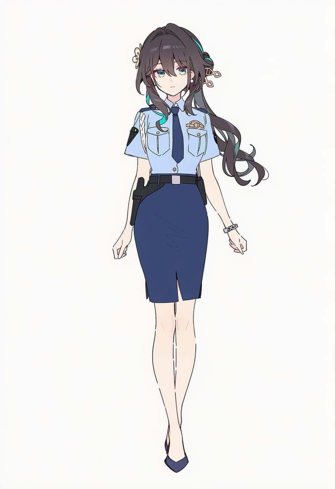

| 字段 | 内容 |
| --- | --- |
| Danbooru Tag | police_uniform |
| 中文含义 | 警察制服 |
| 详细解释 | 警察身份对应的制式制服，常与警帽、徽章、腰带等配套。职业身份对应的制式穿着，单个标签即可概括职业套装。 |
| 所属子类 | 职业装 |

## 29. business_suit — 商务西装

| 字段 | 内容 |
| --- | --- |
| Danbooru Tag | business_suit |
| 中文含义 | 商务西装 |
| 详细解释 | 用于商务场合的正式西装套装。 |
| 所属子类 | 职业装 |

## 30. spacesuit — 宇航服

| 字段 | 内容 |
| --- | --- |
| Danbooru Tag | spacesuit |
| 中文含义 | 宇航服 |
| 详细解释 | 用于太空环境的全身防护服，通常能单独确定完整科幻职业造型。 |
| 所属子类 | 职业装 |

## 31. skirt_suit — 裙装西服套装

| 字段 | 内容 |
| --- | --- |
| Danbooru Tag | skirt_suit |
| 中文含义 | 裙装西服套装 |
| 详细解释 | 西装外套与配套裙装组成的正式套装。 |
| 所属子类 | 职业装 |

## 32. butler — 管家装

| 字段 | 内容 |
| --- | --- |
| Danbooru Tag | butler |
| 中文含义 | 管家装 |
| 详细解释 | Danbooru 中常用于管家角色及其典型正装式制服造型。 |
| 所属子类 | 职业装 |

## 33. tuxedo — 燕尾服

| 字段 | 内容 |
| --- | --- |
| Danbooru Tag | tuxedo |
| 中文含义 | 燕尾服 |
| 详细解释 | 正式晚宴礼服西装，常见黑色礼服外套、礼服衬衫与领结。 |
| 所属子类 | 职业装 |

## 34. pant_suit — 裤装西服套装

| 字段 | 内容 |
| --- | --- |
| Danbooru Tag | pant_suit |
| 中文含义 | 裤装西服套装 |
| 详细解释 | 西装外套与配套长裤组成的正式套装。 |
| 所属子类 | 职业装 |

## 35. diving_suit — 潜水服

| 字段 | 内容 |
| --- | --- |
| Danbooru Tag | diving_suit |
| 中文含义 | 潜水服 |
| 详细解释 | 潜水活动使用的全身或大面积防护服。 |
| 所属子类 | 职业装 |

## 36. wetsuit — 湿式潜水服

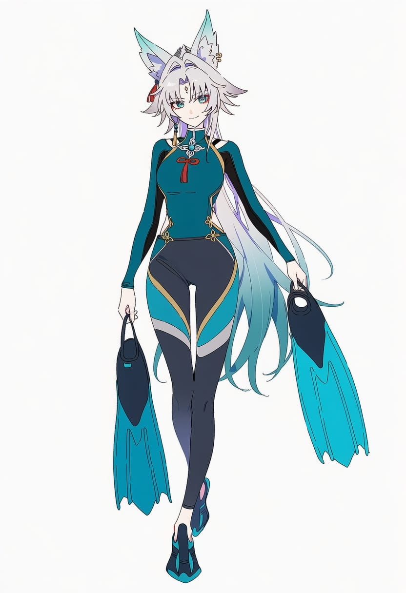

| 字段 | 内容 |
| --- | --- |
| Danbooru Tag | wetsuit |
| 中文含义 | 湿式潜水服 |
| 详细解释 | 以氯丁橡胶等材质保温的贴身潜水服。 |
| 所属子类 | 职业装 |

## 37. military_combat_uniform — 现代作战军服

| 字段 | 内容 |
| --- | --- |
| Danbooru Tag | military_combat_uniform |
| 中文含义 | 现代作战军服 |
| 详细解释 | 现代军队作战用制式服装，强调战斗、野外与战术用途；比泛用 military_uniform 更偏实战穿着。 |
| 所属子类 | 职业装 |

## 38. biker_clothes — 机车骑士服

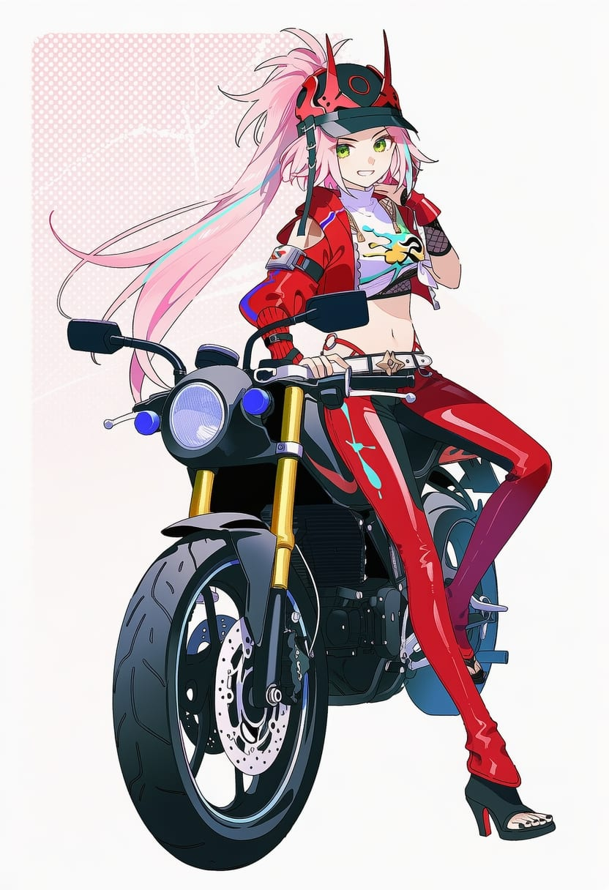

| 字段 | 内容 |
| --- | --- |
| Danbooru Tag | biker_clothes |
| 中文含义 | 机车骑士服 |
| 详细解释 | 机车骑行相关的成套服装，通常强调防护性与耐磨材质。 |
| 所属子类 | 职业装 |

## 39. pilot_suit — 飞行员连体服

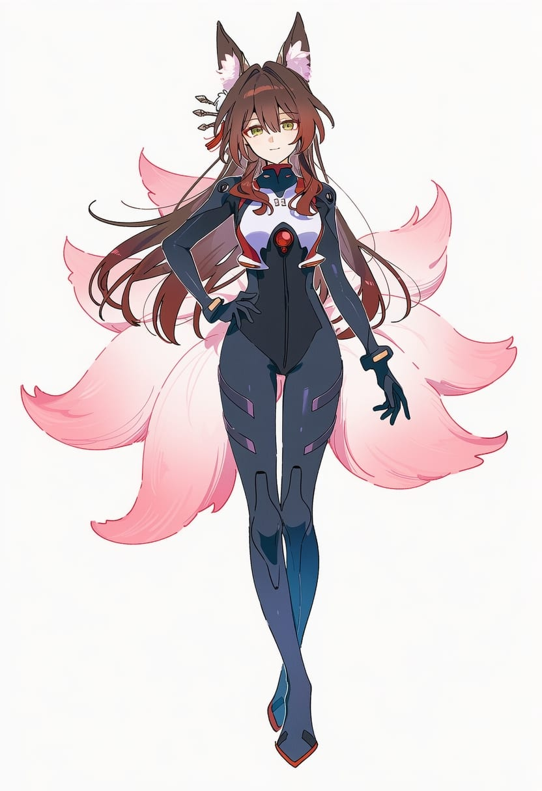

| 字段 | 内容 |
| --- | --- |
| Danbooru Tag | pilot_suit |
| 中文含义 | 飞行员连体服 |
| 详细解释 | 驾驶员使用的制式连体服装，常见拉链、口袋与功能结构；视觉比“驾驶员角色”本身更具体。 |
| 所属子类 | 职业装 |

## 40. military_dress_uniform — 军礼服

| 字段 | 内容 |
| --- | --- |
| Danbooru Tag | military_dress_uniform |
| 中文含义 | 军礼服 |
| 详细解释 | 军队用于典礼、正式场合的礼服式制服；一个 Tag 即可指定正式军装风格。 |
| 所属子类 | 职业装 |

## 41. band_uniform — 乐队 / 行进乐队制服

| 字段 | 内容 |
| --- | --- |
| Danbooru Tag | band_uniform |
| 中文含义 | 乐队 / 行进乐队制服 |
| 详细解释 | 乐队或行进乐队统一穿着的表演制服。 |
| 所属子类 | 职业装 |

## 42. cassock — 神职人员长袍

| 字段 | 内容 |
| --- | --- |
| Danbooru Tag | cassock |
| 中文含义 | 神职人员长袍 |
| 详细解释 | 神职人员穿着的长身、通常较贴体的宗教袍服。 |
| 所属子类 | 职业装 |

## 43. fast_food_uniform — 快餐店制服

| 字段 | 内容 |
| --- | --- |
| Danbooru Tag | fast_food_uniform |
| 中文含义 | 快餐店制服 |
| 详细解释 | 快餐店员工的整套工作制服，通常包含统一上衣、帽子/围裙等。 |
| 所属子类 | 职业装 |

## 44. hazmat_suit — 防化服

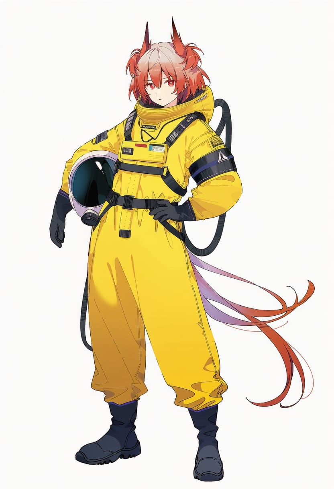

| 字段 | 内容 |
| --- | --- |
| Danbooru Tag | hazmat_suit |
| 中文含义 | 防化服 |
| 详细解释 | 用于隔离危险化学/生物环境的全身防护服。 |
| 所属子类 | 职业装 |

## 45. flight_suit — 飞行服

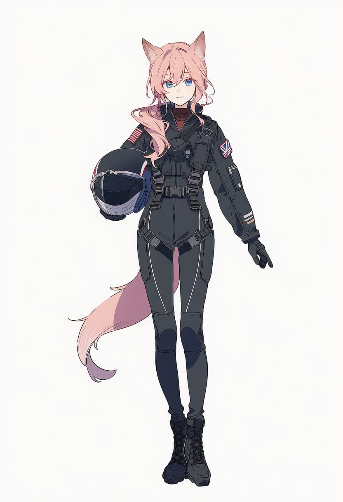

| 字段 | 内容 |
| --- | --- |
| Danbooru Tag | flight_suit |
| 中文含义 | 飞行服 |
| 详细解释 | 航空飞行任务使用的功能性连体服，通常带多口袋、拉链和飞行装备接口，属于稳定服装类型。 |
| 所属子类 | 职业装 |

## 46. fatigues — 作训服 / 野战服

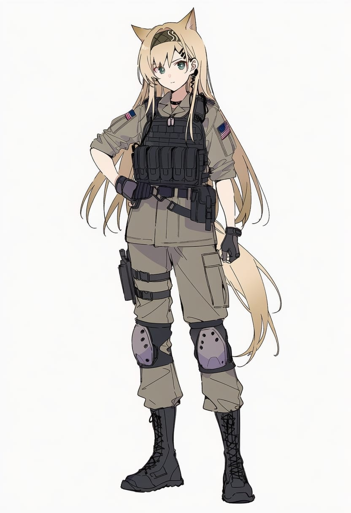

| 字段 | 内容 |
| --- | --- |
| Danbooru Tag | fatigues |
| 中文含义 | 作训服 / 野战服 |
| 详细解释 | 偏实用的军用工作服、野战服或作训服，可概括现代士兵的日常战术穿着。 |
| 所属子类 | 职业装 |

## 47. medical_scrubs — 医用刷手服

| 字段 | 内容 |
| --- | --- |
| Danbooru Tag | medical_scrubs |
| 中文含义 | 医用刷手服 |
| 详细解释 | 医院和医疗环境常见的 scrub 上衣与裤装组合，可直接代表医护工作服。 |
| 所属子类 | 职业装 |

## 48. naval_dress_uniform — 海军礼服

| 字段 | 内容 |
| --- | --- |
| Danbooru Tag | naval_dress_uniform |
| 中文含义 | 海军礼服 |
| 详细解释 | 海军正式礼服/典礼制服，属于 naval_uniform 的正式场合版本。 |
| 所属子类 | 职业装 |

## 49. military_fatigues — 军用作训服

| 字段 | 内容 |
| --- | --- |
| Danbooru Tag | military_fatigues |
| 中文含义 | 军用作训服 |
| 详细解释 | 明确指军队使用的 fatigues，适合现代/近现代野战军装。 |
| 所属子类 | 职业装 |

## 50. cheerleader — 啦啦队服

| 字段 | 内容 |
| --- | --- |
| Danbooru Tag | cheerleader |
| 中文含义 | 啦啦队服 |
| 详细解释 | 啦啦队制服，通常是短上衣/背心与短裙等成套搭配。 |
| 所属子类 | 运动制服 |

## 51. track_suit — 运动套装

| 字段 | 内容 |
| --- | --- |
| Danbooru Tag | track_suit |
| 中文含义 | 运动套装 |
| 详细解释 | 运动套装，典型为运动夹克与配套长裤。 |
| 所属子类 | 运动制服 |

## 52. soccer_uniform — 足球制服

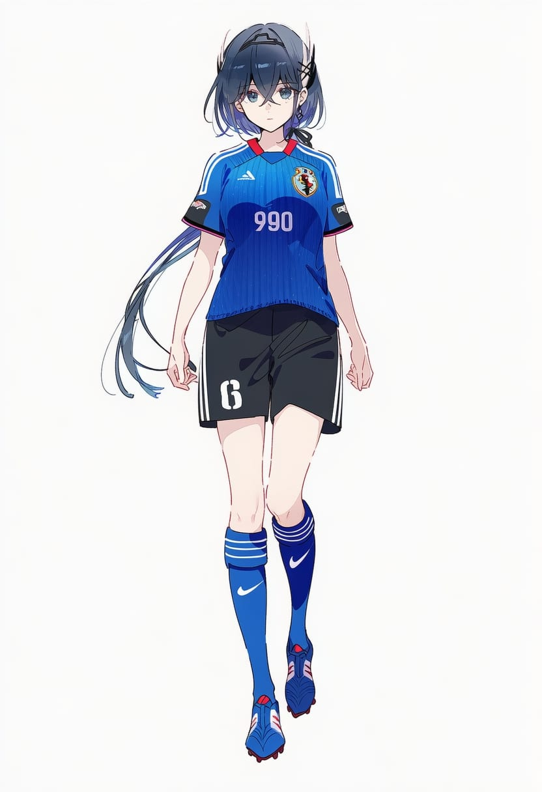

| 字段 | 内容 |
| --- | --- |
| Danbooru Tag | soccer_uniform |
| 中文含义 | 足球制服 |
| 详细解释 | 足球比赛服，通常包含球衣、短裤与长袜的统一搭配。 |
| 所属子类 | 运动制服 |

## 53. baseball_uniform — 棒球制服

| 字段 | 内容 |
| --- | --- |
| Danbooru Tag | baseball_uniform |
| 中文含义 | 棒球制服 |
| 详细解释 | 棒球比赛的制式球衣与下装组合。 |
| 所属子类 | 运动制服 |

## 54. wrestling_outfit — 摔角服

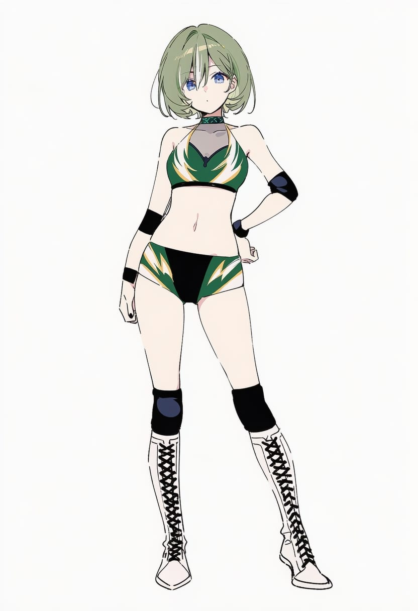

| 字段 | 内容 |
| --- | --- |
| Danbooru Tag | wrestling_outfit |
| 中文含义 | 摔角服 |
| 详细解释 | 职业摔角或竞技摔角的完整比赛服装类型。 |
| 所属子类 | 运动制服 |

## 55. tennis_uniform — 网球服

| 字段 | 内容 |
| --- | --- |
| Danbooru Tag | tennis_uniform |
| 中文含义 | 网球服 |
| 详细解释 | 用于网球运动员的整套比赛/训练服造型，通常由运动上衣配短裙、短裤或网球连衣裙等组成；可直接表达网球运动穿搭。 |
| 所属子类 | 运动制服 |

## 56. volleyball_uniform — 排球制服

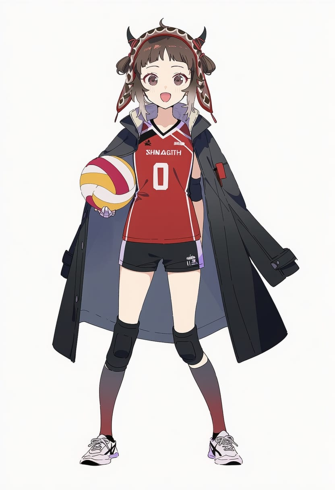

| 字段 | 内容 |
| --- | --- |
| Danbooru Tag | volleyball_uniform |
| 中文含义 | 排球制服 |
| 详细解释 | 排球比赛使用的制式运动上装与下装。 |
| 所属子类 | 运动制服 |

## 57. bikesuit — 骑行紧身服

| 字段 | 内容 |
| --- | --- |
| Danbooru Tag | bikesuit |
| 中文含义 | 骑行紧身服 |
| 详细解释 | 自行车运动使用的一体式或高度贴身骑行服。 |
| 所属子类 | 运动制服 |

## 58. basketball_uniform — 篮球制服

| 字段 | 内容 |
| --- | --- |
| Danbooru Tag | basketball_uniform |
| 中文含义 | 篮球制服 |
| 详细解释 | 篮球比赛服，典型为无袖球衣与运动短裤组合。 |
| 所属子类 | 运动制服 |

## 59. athletic_leotard — 竞技体操紧身衣

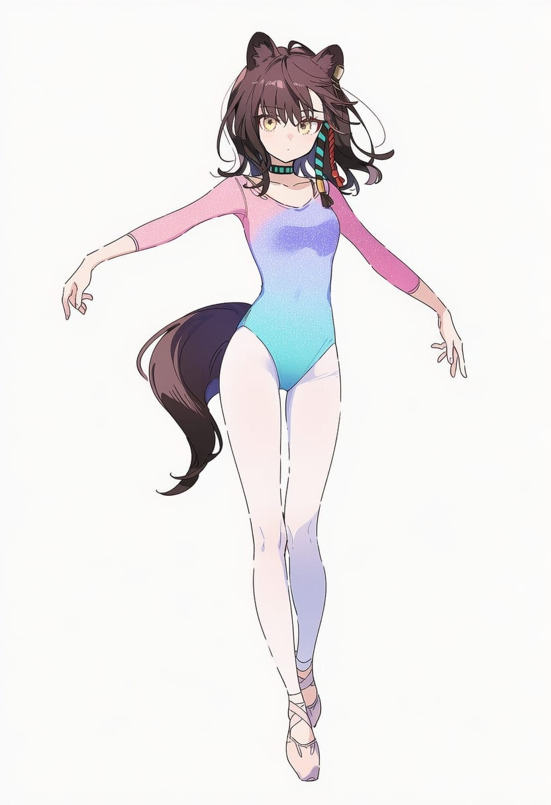

| 字段 | 内容 |
| --- | --- |
| Danbooru Tag | athletic_leotard |
| 中文含义 | 竞技体操紧身衣 |
| 详细解释 | 体操等竞技运动使用的贴身连体服。 |
| 所属子类 | 运动制服 |

## 60. track_uniform — 田径制服

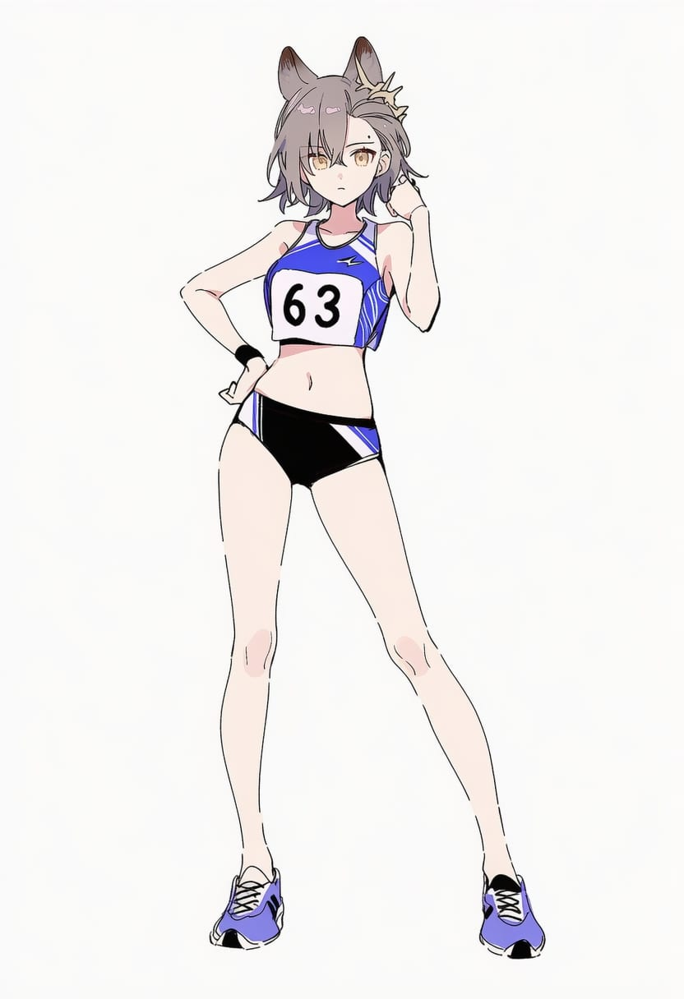

| 字段 | 内容 |
| --- | --- |
| Danbooru Tag | track_uniform |
| 中文含义 | 田径制服 |
| 详细解释 | 田径项目比赛/训练制服，可作为整套竞技穿着标签。 |
| 所属子类 | 运动制服 |

## 61. racing_suit — 赛车服

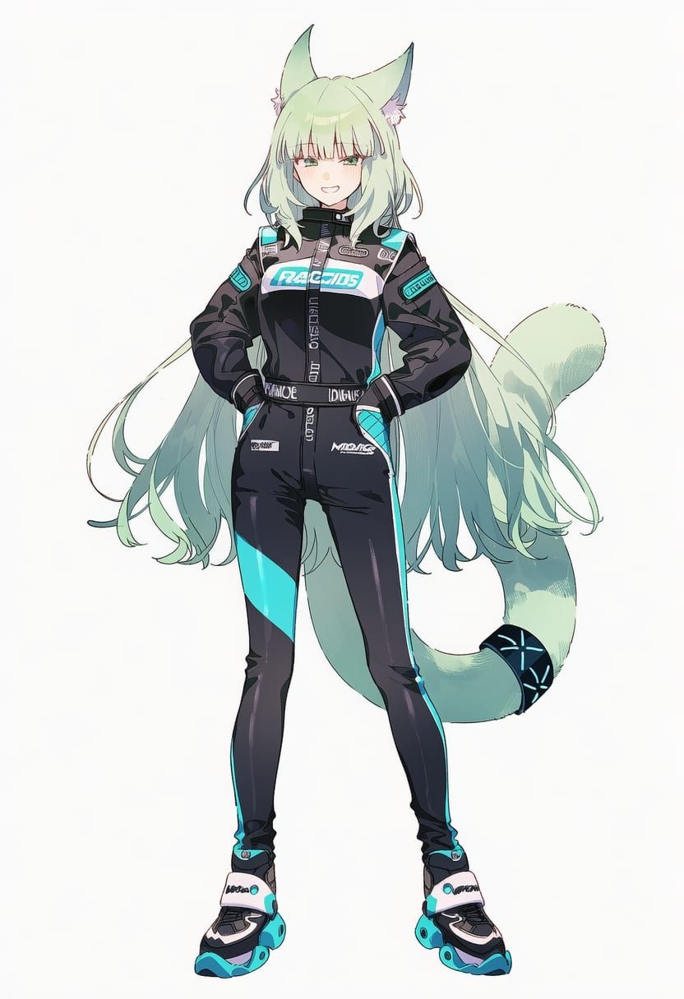

| 字段 | 内容 |
| --- | --- |
| Danbooru Tag | racing_suit |
| 中文含义 | 赛车服 |
| 详细解释 | 赛车运动使用的全身防护连体服。 |
| 所属子类 | 运动制服 |

## 62. bike_jersey — 骑行衫

| 字段 | 内容 |
| --- | --- |
| Danbooru Tag | bike_jersey |
| 中文含义 | 骑行衫 |
| 详细解释 | 自行车运动专用骑行衫；通常与骑行裤共同构成骑行造型。 |
| 所属子类 | 运动制服 |

## 63. cycling_uniform — 自行车比赛服

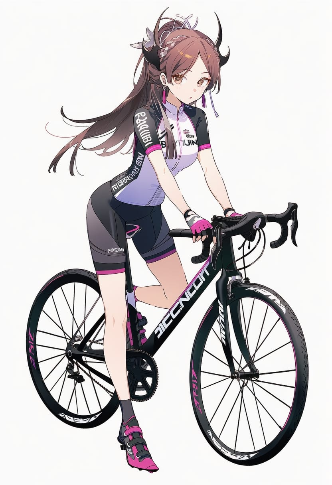

| 字段 | 内容 |
| --- | --- |
| Danbooru Tag | cycling_uniform |
| 中文含义 | 自行车比赛服 |
| 详细解释 | 公路/竞技自行车运动的紧身比赛服套装。 |
| 所属子类 | 运动制服 |

## 64. american_football_uniform — 美式橄榄球制服

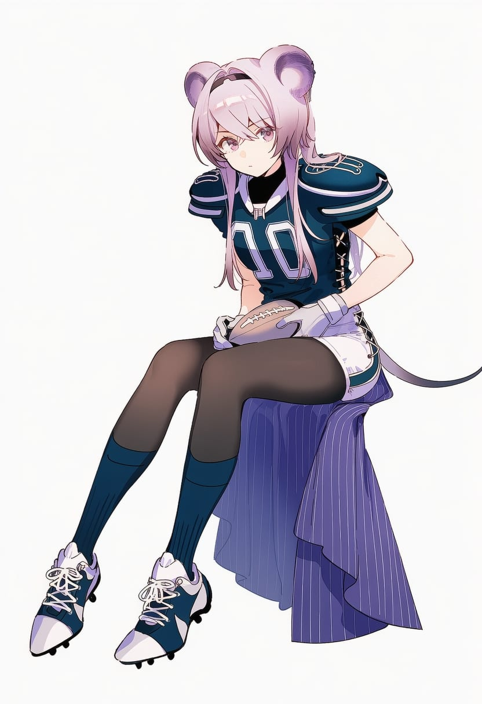

| 字段 | 内容 |
| --- | --- |
| Danbooru Tag | american_football_uniform |
| 中文含义 | 美式橄榄球制服 |
| 详细解释 | 美式橄榄球的比赛制服，通常与护具共同形成完整运动造型。 |
| 所属子类 | 运动制服 |

## 65. rugby_uniform — 英式橄榄球制服

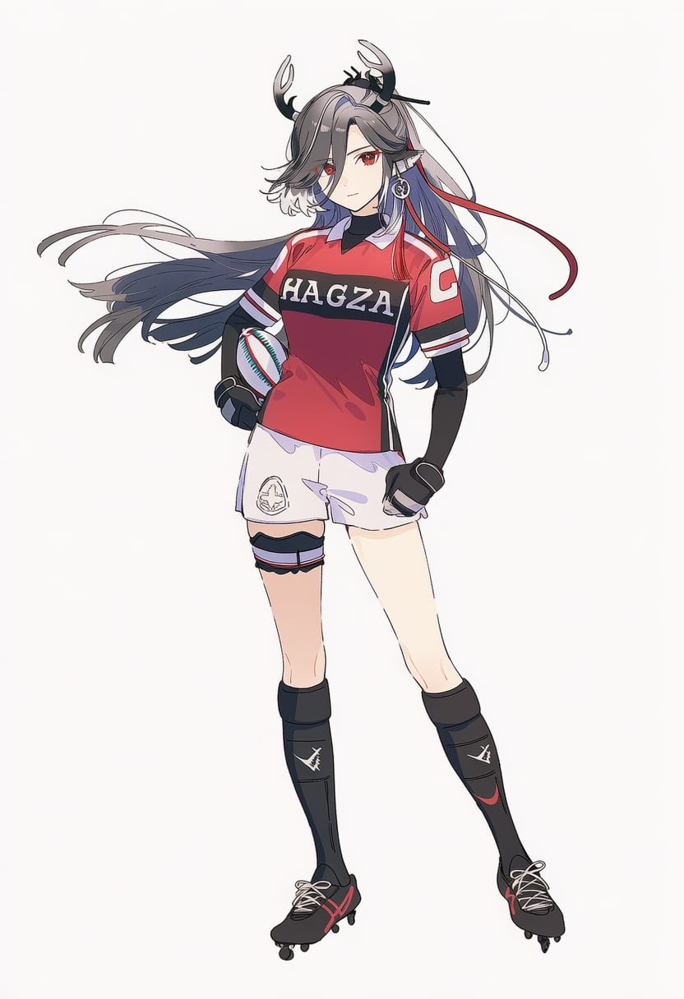

| 字段 | 内容 |
| --- | --- |
| Danbooru Tag | rugby_uniform |
| 中文含义 | 英式橄榄球制服 |
| 详细解释 | 英式橄榄球比赛服装，通常由球衣、短裤和长袜构成。 |
| 所属子类 | 运动制服 |

## 66. lolita_fashion — 洛丽塔时装

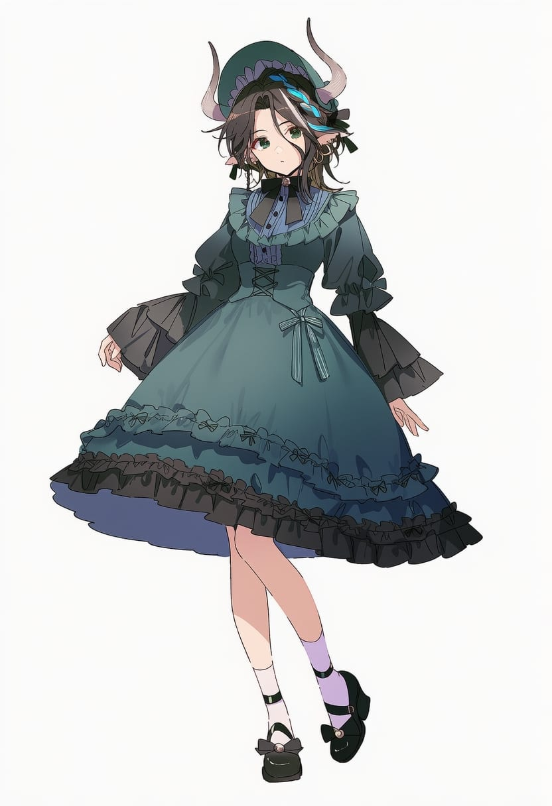

| 字段 | 内容 |
| --- | --- |
| Danbooru Tag | lolita_fashion |
| 中文含义 | 洛丽塔时装 |
| 详细解释 | 以洛丽塔时尚整体搭配为核心，通常包含蓬裙、衬衫/连衣裙、袜类、头饰等协调元素。 |
| 所属子类 | 亚文化服饰 |

## 67. gothic_lolita — 哥特洛丽塔

| 字段 | 内容 |
| --- | --- |
| Danbooru Tag | gothic_lolita |
| 中文含义 | 哥特洛丽塔 |
| 详细解释 | 洛丽塔时尚的哥特分支，常用黑白、十字、蕾丝等较暗色和宗教/哥特元素。 |
| 所属子类 | 亚文化服饰 |

## 68. goth_fashion — 哥特时装

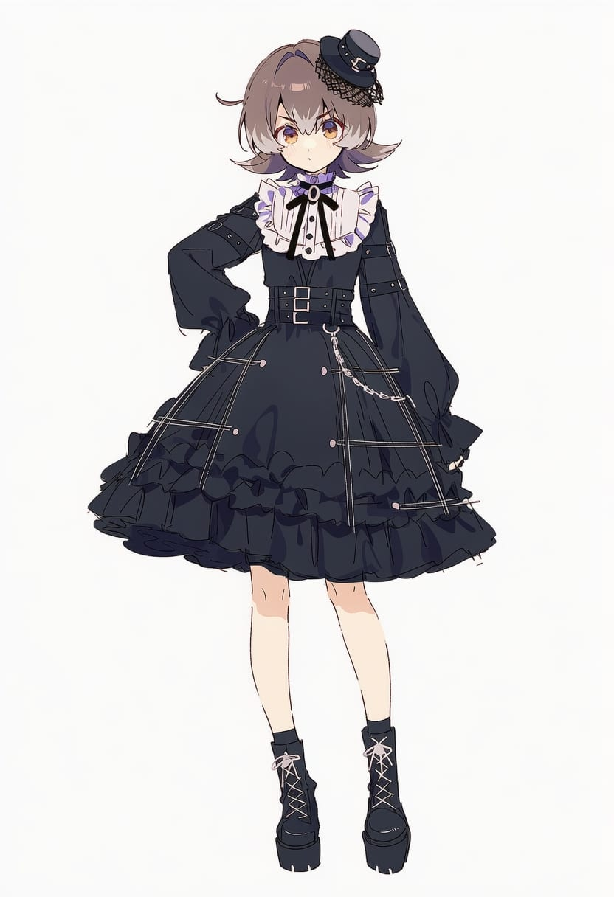

| 字段 | 内容 |
| --- | --- |
| Danbooru Tag | goth_fashion |
| 中文含义 | 哥特时装 |
| 详细解释 | 现代哥特系穿搭风格，常见黑色、蕾丝、皮革、十字等视觉元素。 |
| 所属子类 | 亚文化服饰 |

## 69. kogal — 女高中生辣妹风

| 字段 | 内容 |
| --- | --- |
| Danbooru Tag | kogal |
| 中文含义 | 女高中生辣妹风 |
| 详细解释 | 以日本女高中生制服改造与辣妹审美结合为特征的现代穿搭类型。 |
| 所属子类 | 亚文化服饰 |

## 70. jirai_kei — 地雷系

| 字段 | 内容 |
| --- | --- |
| Danbooru Tag | jirai_kei |
| 中文含义 | 地雷系 |
| 详细解释 | 日本当代“地雷系”时装风格，常见黑/粉、蝴蝶结、蕾丝、短裙与厚底鞋等搭配。 |
| 所属子类 | 亚文化服饰 |

## 71. sweet_lolita — 甜系洛丽塔

| 字段 | 内容 |
| --- | --- |
| Danbooru Tag | sweet_lolita |
| 中文含义 | 甜系洛丽塔 |
| 详细解释 | Lolita fashion 的甜系分支，常见浅色、蝴蝶结、甜点/童话图案和蓬裙。 |
| 所属子类 | 亚文化服饰 |

## 72. y2k_fashion — Y2K 时装

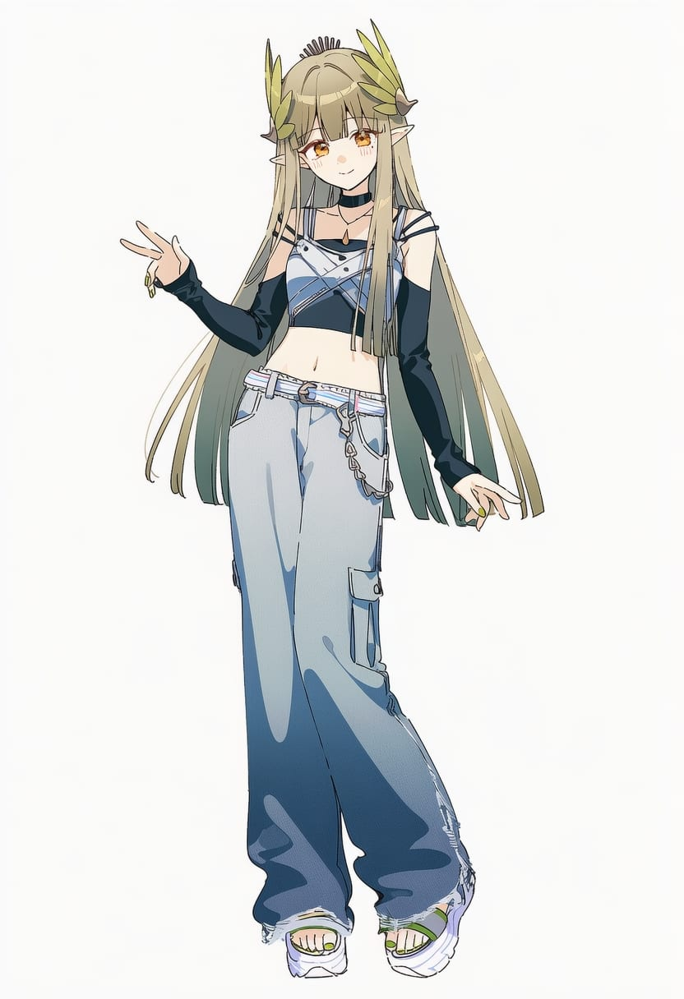

| 字段 | 内容 |
| --- | --- |
| Danbooru Tag | y2k_fashion |
| 中文含义 | Y2K 时装 |
| 详细解释 | 2000 年代初审美复兴的现代时装风格，如低腰、短上衣、金属/亮面和复古数码感。 |
| 所属子类 | 亚文化服饰 |

## 73. streetwear — 街头服饰

| 字段 | 内容 |
| --- | --- |
| Danbooru Tag | streetwear |
| 中文含义 | 街头服饰 |
| 详细解释 | 现代街头穿搭总类，常包含宽松上衣、夹克、运动鞋、工装元素等。 |
| 所属子类 | 亚文化服饰 |

## 74. yume_kawaii — 梦幻可爱系

| 字段 | 内容 |
| --- | --- |
| Danbooru Tag | yume_kawaii |
| 中文含义 | 梦幻可爱系 |
| 详细解释 | 以柔和梦幻色、可爱图案和轻幻想元素为核心的日系亚文化穿搭。 |
| 所属子类 | 亚文化服饰 |

## 75. amesuku_gyaru — 美式校园辣妹风

| 字段 | 内容 |
| --- | --- |
| Danbooru Tag | amesuku_gyaru |
| 中文含义 | 美式校园辣妹风 |
| 详细解释 | 受美式校园/制服元素影响的 gyaru 穿搭类型，属于现代日系亚文化服饰。 |
| 所属子类 | 亚文化服饰 |

## 76. ganguro — Ganguro 辣妹风

| 字段 | 内容 |
| --- | --- |
| Danbooru Tag | ganguro |
| 中文含义 | Ganguro 辣妹风 |
| 详细解释 | 1990s-2000s 日本辣妹亚文化风格，常与深色晒肤、浅色头发和醒目服饰搭配关联。 |
| 所属子类 | 亚文化服饰 |

## 77. cyber_fashion — 赛博时装

| 字段 | 内容 |
| --- | --- |
| Danbooru Tag | cyber_fashion |
| 中文含义 | 赛博时装 |
| 详细解释 | 以未来感、机能感、霓虹或电子元素为核心的现代/科幻时装风格。 |
| 所属子类 | 亚文化服饰 |

## 78. decora — Decora 原宿装

| 字段 | 内容 |
| --- | --- |
| Danbooru Tag | decora |
| 中文含义 | Decora 原宿装 |
| 详细解释 | 日本原宿 Decora 风格，强调大量彩色配饰、层叠服装与高密度装饰。 |
| 所属子类 | 亚文化服饰 |

## 79. techwear — 机能风

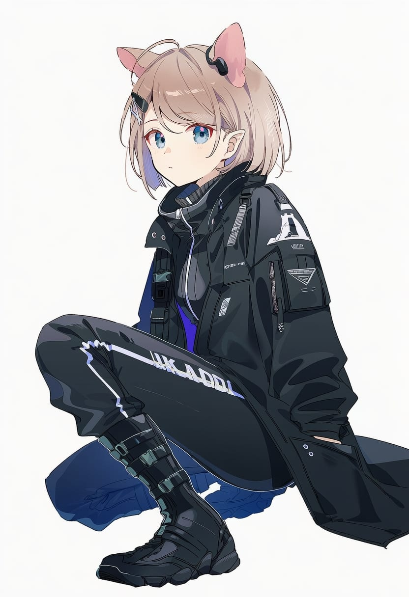

| 字段 | 内容 |
| --- | --- |
| Danbooru Tag | techwear |
| 中文含义 | 机能风 |
| 详细解释 | 现代机能风服装，强调功能面料、口袋、绑带、模块化与都市战术感。 |
| 所属子类 | 亚文化服饰 |

## 80. serafuku — 水手服校服

| 字段 | 内容 |
| --- | --- |
| Danbooru Tag | serafuku |
| 中文含义 | 水手服校服 |
| 详细解释 | 日本女学生水手领校服，常见水手领上衣、百褶裙与领巾。 |
| 所属子类 | 校服 |

## 81. gym_uniform — 体操服 / 体育服

| 字段 | 内容 |
| --- | --- |
| Danbooru Tag | gym_uniform |
| 中文含义 | 体操服 / 体育服 |
| 详细解释 | 日本学校体育课常见体操服/体育服，通常由运动上衣与短裤/灯笼裤等组成。 |
| 所属子类 | 校服 |

## 82. gakuran — 诘襟男生校服

| 字段 | 内容 |
| --- | --- |
| Danbooru Tag | gakuran |
| 中文含义 | 诘襟男生校服 |
| 详细解释 | 日本男学生传统诘襟制服，常见立领深色上衣与长裤。 |
| 所属子类 | 校服 |

## 83. kindergarten_uniform — 幼儿园制服

| 字段 | 内容 |
| --- | --- |
| Danbooru Tag | kindergarten_uniform |
| 中文含义 | 幼儿园制服 |
| 详细解释 | 幼儿园儿童统一穿着的制式服装。 |
| 所属子类 | 校服 |

## 84. playboy_bunny — 兔女郎装

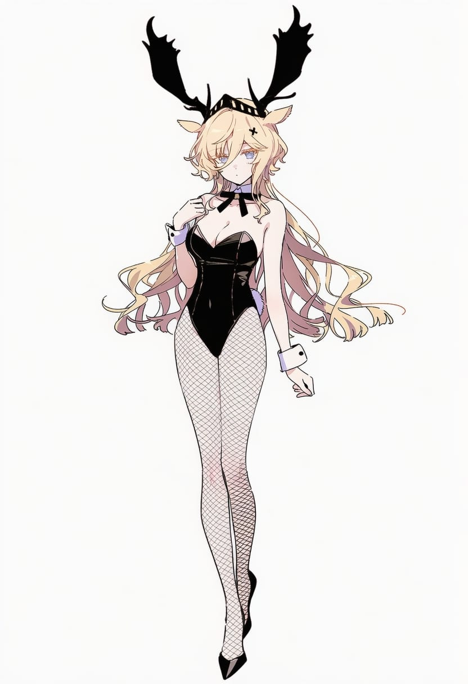

| 字段 | 内容 |
| --- | --- |
| Danbooru Tag | playboy_bunny |
| 中文含义 | 兔女郎装 |
| 详细解释 | 典型兔女郎制服，核心通常为无肩带紧身衣，并搭配兔耳、领结、袖口等。 |
| 所属子类 | 网络梗服饰 |

## 85. naked_apron — 裸体围裙

| 字段 | 内容 |
| --- | --- |
| Danbooru Tag | naked_apron |
| 中文含义 | 裸体围裙 |
| 详细解释 | 裸体状态下仅穿围裙的造型。 |
| 所属子类 | 网络梗服饰 |

## 86. cat_lingerie — 猫咪主题内衣套装

| 字段 | 内容 |
| --- | --- |
| Danbooru Tag | cat_lingerie |
| 中文含义 | 猫咪主题内衣套装 |
| 详细解释 | 具有稳定猫主题设计语言的成套内衣造型。与泛称 lingerie 不同，该 Tag 在视觉上指向更明确的一套主题服饰。 |
| 所属子类 | 网络梗服饰 |

## 87. virgin_killer_sweater — 童贞杀手毛衣

| 字段 | 内容 |
| --- | --- |
| Danbooru Tag | virgin_killer_sweater |
| 中文含义 | 童贞杀手毛衣 |
| 详细解释 | 一种背部大面积裸露、挂脖高领、常带罗纹/阿兰针织结构的毛衣裙式服装。 |
| 所属子类 | 网络梗服饰 |

## 88. nearly_naked_apron — 近裸体围裙

| 字段 | 内容 |
| --- | --- |
| Danbooru Tag | nearly_naked_apron |
| 中文含义 | 近裸体围裙 |
| 详细解释 | 除围裙外仅保留极少其他衣物的造型。 |
| 所属子类 | 网络梗服饰 |

## 89. bondage_outfit — 束缚风套装

| 字段 | 内容 |
| --- | --- |
| Danbooru Tag | bondage_outfit |
| 中文含义 | 束缚风套装 |
| 详细解释 | 以束带、绑缚结构或束缚审美为核心的成套服装。 |
| 所属子类 | 网络梗服饰 |

## 90. virgin_destroyer_sweater — 童贞毁灭者毛衣

| 字段 | 内容 |
| --- | --- |
| Danbooru Tag | virgin_destroyer_sweater |
| 中文含义 | 童贞毁灭者毛衣 |
| 详细解释 | 与经典童贞杀手毛衣相关、但结构更开放的独立针织设计。其前后开口和连接方式形成不同轮廓，不应只用 virgin_killer_sweater。 |
| 所属子类 | 网络梗服饰 |

## 91. virgin_killer_outfit — “童贞杀手”风套装

| 字段 | 内容 |
| --- | --- |
| Danbooru Tag | virgin_killer_outfit |
| 中文含义 | “童贞杀手”风套装 |
| 详细解释 | 以高腰下装搭配露肤上装为代表的“童贞杀手”主题穿搭。 |
| 所属子类 | 网络梗服饰 |

## 92. translucent_bunnysuit — 半透明兔女郎装

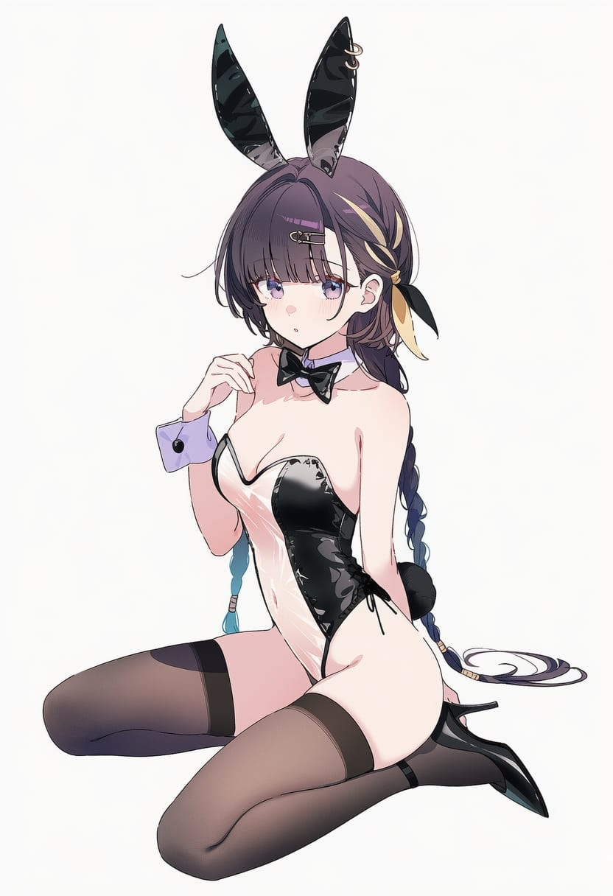

| 字段 | 内容 |
| --- | --- |
| Danbooru Tag | translucent_bunnysuit |
| 中文含义 | 半透明兔女郎装 |
| 详细解释 | 以经典兔女郎装为基础、主体材质呈半透明效果的稳定变体；视觉效果与普通 playboy_bunny 有明显差异。 |
| 所属子类 | 网络梗服饰 |

## 93. tailcoat_playboy_bunny — 燕尾服兔女郎装

| 字段 | 内容 |
| --- | --- |
| Danbooru Tag | tailcoat_playboy_bunny |
| 中文含义 | 燕尾服兔女郎装 |
| 详细解释 | 在经典兔女郎装基础上加入明显燕尾服结构的变体，形成独立轮廓，因此作为具体视觉子类单列。 |
| 所属子类 | 网络梗服饰 |

## 94. heattech_leotard — Heattech 紧身连体衣

| 字段 | 内容 |
| --- | --- |
| Danbooru Tag | heattech_leotard |
| 中文含义 | Heattech 紧身连体衣 |
| 详细解释 | 网络二创中形成固定识别度的高叉、贴身长袖连体衣造型。它指向具体服装结构，而不是“迷因服饰”这一文化大类。 |
| 所属子类 | 网络梗服饰 |

## 95. hot_limit — HOT LIMIT 服装

| 字段 | 内容 |
| --- | --- |
| Danbooru Tag | hot_limit |
| 中文含义 | HOT LIMIT 服装 |
| 详细解释 | 以大量黑色带状、镂空结构为核心的固定舞台服装造型，在二创中形成稳定的 meme 服饰视觉。 |
| 所属子类 | 网络梗服饰 |

## 96. apron — 围裙

| 字段 | 内容 |
| --- | --- |
| Danbooru Tag | apron |
| 中文含义 | 围裙 |
| 详细解释 | 穿在衣物外、用于防污或作装饰的围裙。 |
| 所属子类 | 日常套装 |

## 97. sweater — 毛衣

| 字段 | 内容 |
| --- | --- |
| Danbooru Tag | sweater |
| 中文含义 | 毛衣 |
| 详细解释 | 针织制成的上身保暖服装统称。 |
| 所属子类 | 日常套装 |

## 98. turtleneck_sweater — 高领毛衣

| 字段 | 内容 |
| --- | --- |
| Danbooru Tag | turtleneck_sweater |
| 中文含义 | 高领毛衣 |
| 详细解释 | 领口向上包覆颈部的高领针织毛衣。 |
| 所属子类 | 日常套装 |

## 99. ribbed_sweater — 罗纹毛衣

| 字段 | 内容 |
| --- | --- |
| Danbooru Tag | ribbed_sweater |
| 中文含义 | 罗纹毛衣 |
| 详细解释 | 以纵向或横向罗纹针织纹理为主要特征的毛衣。 |
| 所属子类 | 日常套装 |

## 100. pajamas — 睡衣

| 字段 | 内容 |
| --- | --- |
| Danbooru Tag | pajamas |
| 中文含义 | 睡衣 |
| 详细解释 | 睡眠用成套服装，可为上下分体或一体式睡衣。 |
| 所属子类 | 日常套装 |

## 101. leather_jacket — 皮夹克

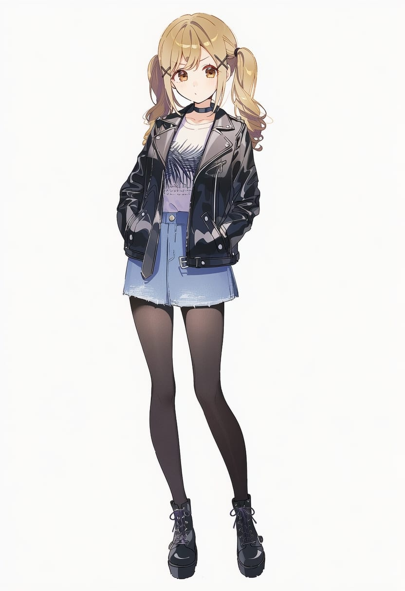

| 字段 | 内容 |
| --- | --- |
| Danbooru Tag | leather_jacket |
| 中文含义 | 皮夹克 |
| 详细解释 | 以皮革材质和夹克剪裁为核心的现代外套类型，视觉稳定，常见于机车或摇滚穿搭。 |
| 所属子类 | 日常套装 |

## 102. winter_coat — 冬季大衣

| 字段 | 内容 |
| --- | --- |
| Danbooru Tag | winter_coat |
| 中文含义 | 冬季大衣 |
| 详细解释 | 面向寒冷天气的厚重大衣。用具体外套替代 winter_clothes 这种可能混入毛衣、围巾、靴子等多种视觉的大类。 |
| 所属子类 | 日常套装 |

## 103. trench_coat — 风衣

| 字段 | 内容 |
| --- | --- |
| Danbooru Tag | trench_coat |
| 中文含义 | 风衣 |
| 详细解释 | 典型双排扣、腰带、中长版型的风衣类外套，属于稳定且可直接复现的服装视觉。 |
| 所属子类 | 日常套装 |

## 104. letterman_jacket — 校队夹克

| 字段 | 内容 |
| --- | --- |
| Danbooru Tag | letterman_jacket |
| 中文含义 | 校队夹克 |
| 详细解释 | 带对比袖、罗纹收口和校队/字母元素的经典 varsity 夹克。这里按服装版型收录，而不是按具体学校或作品细分。 |
| 所属子类 | 日常套装 |

## 105. aran_sweater — 阿兰花纹毛衣

| 字段 | 内容 |
| --- | --- |
| Danbooru Tag | aran_sweater |
| 中文含义 | 阿兰花纹毛衣 |
| 详细解释 | 以立体绞花、麻花等阿兰针织纹样为特征的毛衣。 |
| 所属子类 | 日常套装 |

## 106. raincoat — 雨衣

| 字段 | 内容 |
| --- | --- |
| Danbooru Tag | raincoat |
| 中文含义 | 雨衣 |
| 详细解释 | 用于防雨的外套型服装，整体轮廓和功能稳定，不属于抽象天气穿搭大类。 |
| 所属子类 | 日常套装 |

## 107. bomber_jacket — 飞行员夹克

| 字段 | 内容 |
| --- | --- |
| Danbooru Tag | bomber_jacket |
| 中文含义 | 飞行员夹克 |
| 详细解释 | 短款、收口下摆与袖口的飞行员夹克轮廓，视觉指向明确。 |
| 所属子类 | 日常套装 |

## 108. open-chest_sweater — 胸前大开口毛衣

| 字段 | 内容 |
| --- | --- |
| Danbooru Tag | open-chest_sweater |
| 中文含义 | 胸前大开口毛衣 |
| 详细解释 | 胸前具有大面积开口或镂空结构的毛衣。 |
| 所属子类 | 日常套装 |

## 109. denim_jacket — 牛仔夹克

| 字段 | 内容 |
| --- | --- |
| Danbooru Tag | denim_jacket |
| 中文含义 | 牛仔夹克 |
| 详细解释 | 牛仔布制作的夹克型外套，材质和轮廓共同形成稳定视觉。 |
| 所属子类 | 日常套装 |

## 110. bathrobe — 浴袍

| 字段 | 内容 |
| --- | --- |
| Danbooru Tag | bathrobe |
| 中文含义 | 浴袍 |
| 详细解释 | 洗浴后或居家时穿着的宽松系带长袍。 |
| 所属子类 | 日常套装 |

## 111. parka — 派克大衣

| 字段 | 内容 |
| --- | --- |
| Danbooru Tag | parka |
| 中文含义 | 派克大衣 |
| 详细解释 | 通常带连帽、偏防风保暖用途的中长外套，轮廓和用途都较稳定。 |
| 所属子类 | 日常套装 |

## 112. cape — 披风

| 字段 | 内容 |
| --- | --- |
| Danbooru Tag | cape |
| 中文含义 | 披风 |
| 详细解释 | 从肩部垂下、通常无袖的披风。 |
| 所属子类 | 奇幻世界服饰 |

## 113. capelet — 短披肩

| 字段 | 内容 |
| --- | --- |
| Danbooru Tag | capelet |
| 中文含义 | 短披肩 |
| 详细解释 | 长度较短、主要覆盖肩背的披肩式披风。 |
| 所属子类 | 奇幻世界服饰 |

## 114. cloak — 斗篷

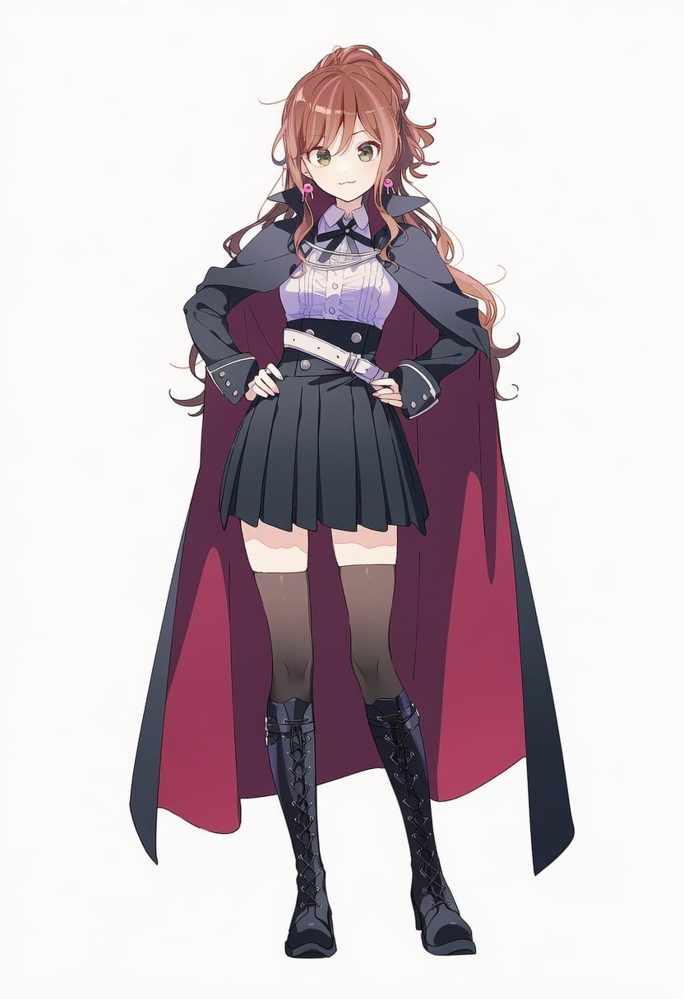

| 字段 | 内容 |
| --- | --- |
| Danbooru Tag | cloak |
| 中文含义 | 斗篷 |
| 详细解释 | 大面积覆盖式斗篷，是法师、游侠、旅行者、冒险者造型中非常通用的单 Tag 服装描述。 |
| 所属子类 | 奇幻世界服饰 |

## 115. robe — 长袍

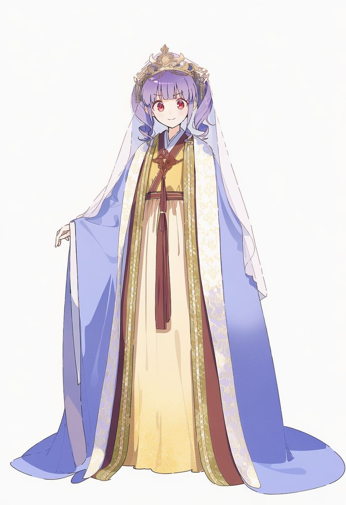

| 字段 | 内容 |
| --- | --- |
| Danbooru Tag | robe |
| 中文含义 | 长袍 |
| 详细解释 | 宽松、长身的袍式服装。 |
| 所属子类 | 奇幻世界服饰 |

## 116. tabard — 战袍

| 字段 | 内容 |
| --- | --- |
| Danbooru Tag | tabard |
| 中文含义 | 战袍 |
| 详细解释 | 穿在盔甲或衣物外的无袖罩袍/战袍，是骑士团、圣骑士、冒险者常见的 RPG 服装元素。 |
| 所属子类 | 奇幻世界服饰 |

## 117. armored_dress — 铠甲连衣裙

| 字段 | 内容 |
| --- | --- |
| Danbooru Tag | armored_dress |
| 中文含义 | 铠甲连衣裙 |
| 详细解释 | 将连衣裙轮廓与铠甲结构结合的服装。 |
| 所属子类 | 奇幻世界服饰 |

## 118. tunic — 束腰外衣

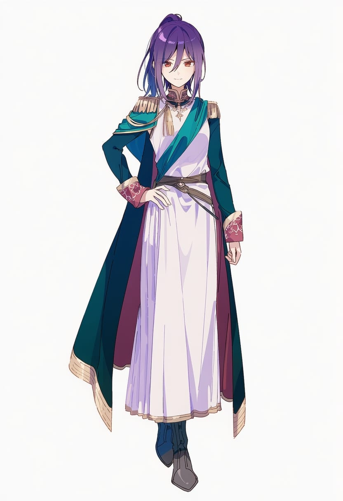

| 字段 | 内容 |
| --- | --- |
| Danbooru Tag | tunic |
| 中文含义 | 束腰外衣 |
| 详细解释 | 长度通常过臀的宽松上衣或束腰外衣。 |
| 所属子类 | 奇幻世界服饰 |

## 119. full_armor — 全身铠甲

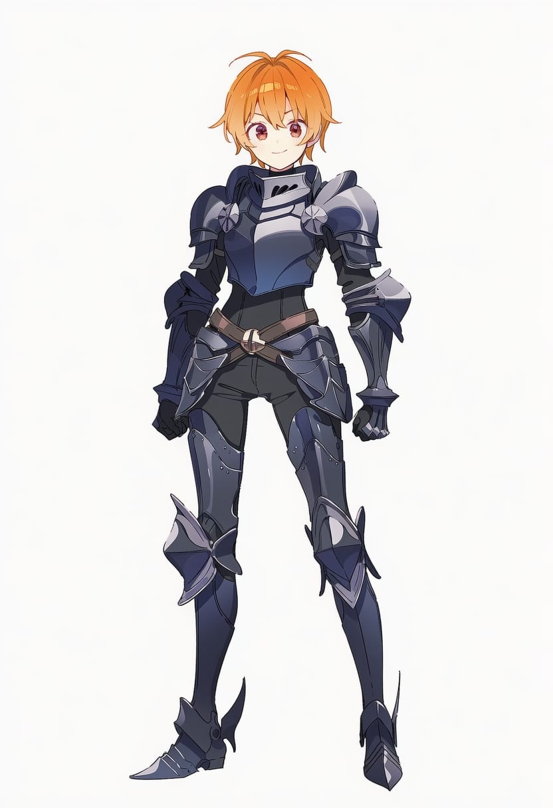

| 字段 | 内容 |
| --- | --- |
| Danbooru Tag | full_armor |
| 中文含义 | 全身铠甲 |
| 详细解释 | 覆盖身体大部分区域的完整铠甲套装。 |
| 所属子类 | 奇幻世界服饰 |

## 120. open_robe — 敞开长袍

| 字段 | 内容 |
| --- | --- |
| Danbooru Tag | open_robe |
| 中文含义 | 敞开长袍 |
| 详细解释 | 前襟敞开穿着的长袍。 |
| 所属子类 | 奇幻世界服饰 |

## 121. hooded_robe — 连帽长袍

| 字段 | 内容 |
| --- | --- |
| Danbooru Tag | hooded_robe |
| 中文含义 | 连帽长袍 |
| 详细解释 | 带固定连帽结构的长袍，常用于法师、教团、神秘职业等 RPG 造型；比泛用 robe 更具体。 |
| 所属子类 | 奇幻世界服饰 |

## 122. chainmail — 锁子甲

| 字段 | 内容 |
| --- | --- |
| Danbooru Tag | chainmail |
| 中文含义 | 锁子甲 |
| 详细解释 | 由金属环连接形成的护甲服装，是骑士、战士类 RPG 造型常见的单 Tag 描述。 |
| 所属子类 | 奇幻世界服饰 |

## 123. plate_armor — 板甲套装

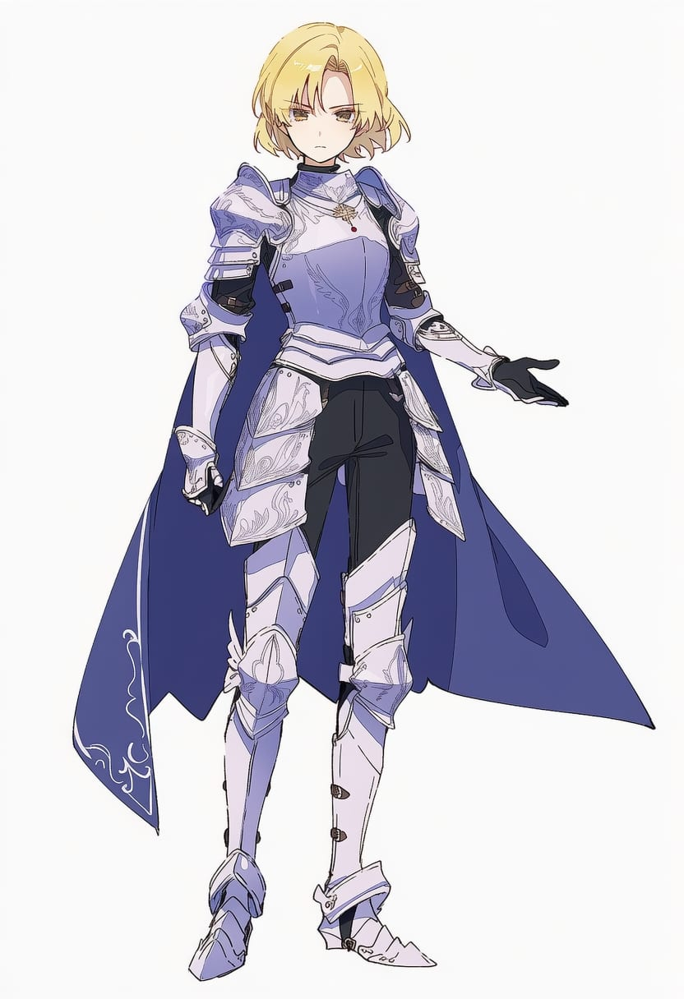

| 字段 | 内容 |
| --- | --- |
| Danbooru Tag | plate_armor |
| 中文含义 | 板甲套装 |
| 详细解释 | 以金属板甲为核心的铠甲穿着。通常用于覆盖躯干并搭配其他板甲护具的战斗造型； |
| 所属子类 | 奇幻世界服饰 |

## 124. leather_armor — 皮甲

| 字段 | 内容 |
| --- | --- |
| Danbooru Tag | leather_armor |
| 中文含义 | 皮甲 |
| 详细解释 | 以皮革为主要防护材料的轻甲，常用于游侠、盗贼、冒险者等 RPG 职业造型。 |
| 所属子类 | 奇幻世界服饰 |

## 125. scale_armor — 鳞甲

| 字段 | 内容 |
| --- | --- |
| Danbooru Tag | scale_armor |
| 中文含义 | 鳞甲 |
| 详细解释 | 由鳞片状甲片构成的护甲类型，可直接指定幻想战士/骑士的护甲风格。 |
| 所属子类 | 奇幻世界服饰 |

## 126. gambeson — 绗缝甲

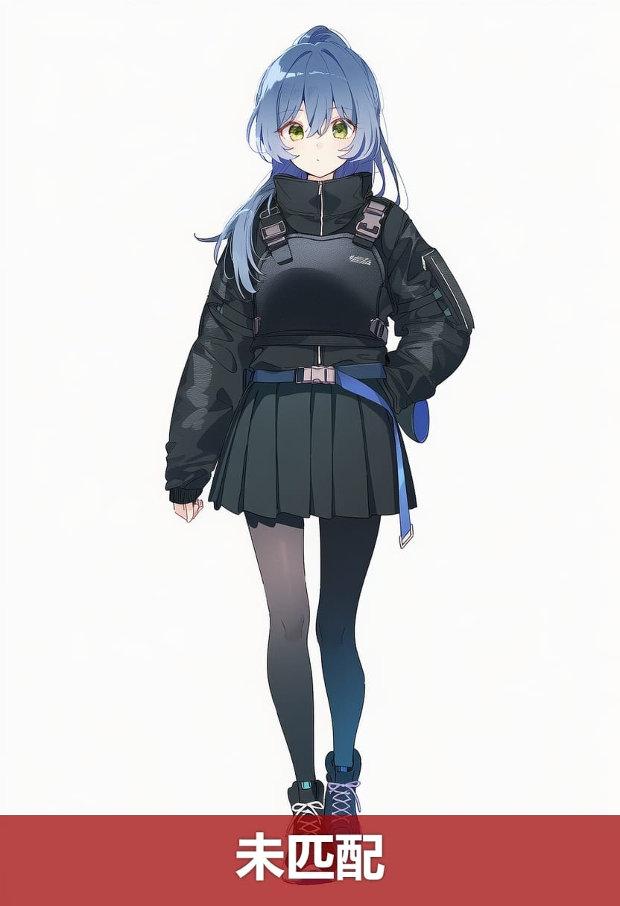

| 字段 | 内容 |
| --- | --- |
| Danbooru Tag | gambeson |
| 中文含义 | 绗缝甲 |
| 详细解释 | 绗缝填充式防护服，可单独作为轻中型护甲，也常穿在板甲/锁子甲内。 |
| 所属子类 | 奇幻世界服饰 |

## 127. ornate_armor — 华丽铠甲

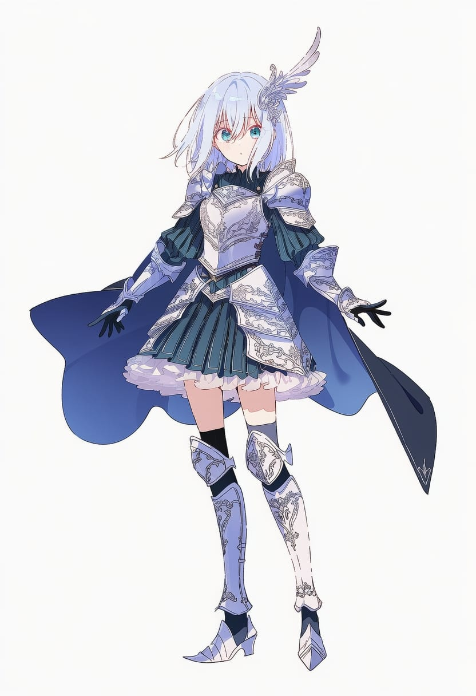

| 字段 | 内容 |
| --- | --- |
| Danbooru Tag | ornate_armor |
| 中文含义 | 华丽铠甲 |
| 详细解释 | 装饰性强、纹样复杂的铠甲，常用于贵族骑士、圣骑士、王室护卫等幻想造型。 |
| 所属子类 | 奇幻世界服饰 |

## 128. royal_robe — 王室礼袍

| 字段 | 内容 |
| --- | --- |
| Danbooru Tag | royal_robe |
| 中文含义 | 王室礼袍 |
| 详细解释 | 王族或高阶贵族使用的华丽长袍型服装。 |
| 所属子类 | 奇幻世界服饰 |

## 129. berserker_armor — 狂战士铠甲

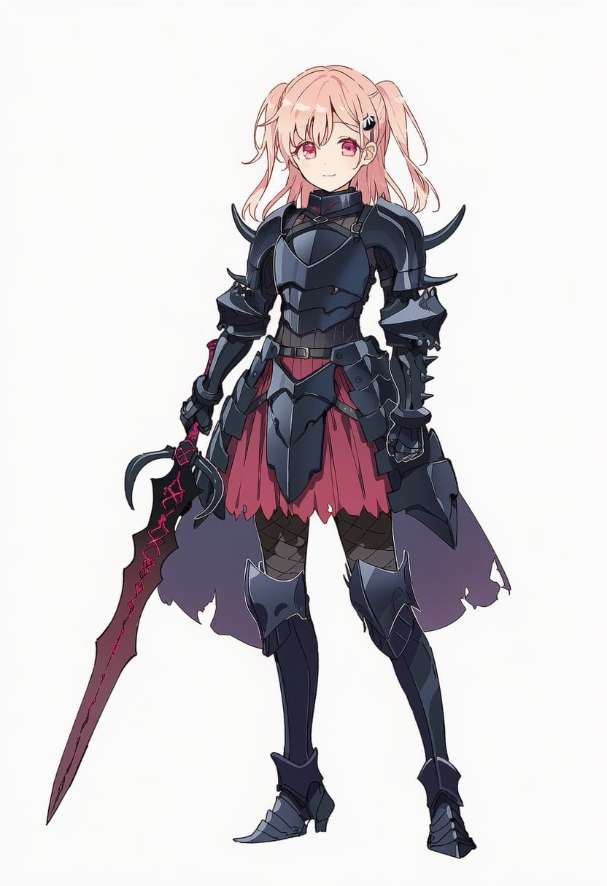

| 字段 | 内容 |
| --- | --- |
| Danbooru Tag | berserker_armor |
| 中文含义 | 狂战士铠甲 |
| 详细解释 | 偏狂战士/重装战士风格的铠甲 Tag，适合高攻击性、厚重幻想战斗造型。 |
| 所属子类 | 奇幻世界服饰 |

## 130. bodystocking — 全身袜衣

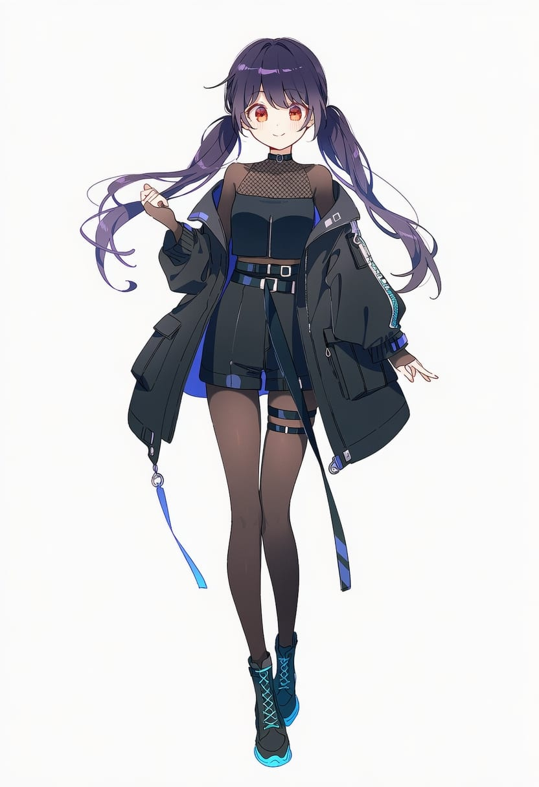

| 字段 | 内容 |
| --- | --- |
| Danbooru Tag | bodystocking |
| 中文含义 | 全身袜衣 |
| 详细解释 | 由袜类弹性材质制成、连续包覆躯干与四肢的贴身衣物。 |
| 所属子类 | 连体/功能服 |

## 131. jumpsuit — 连体工作服

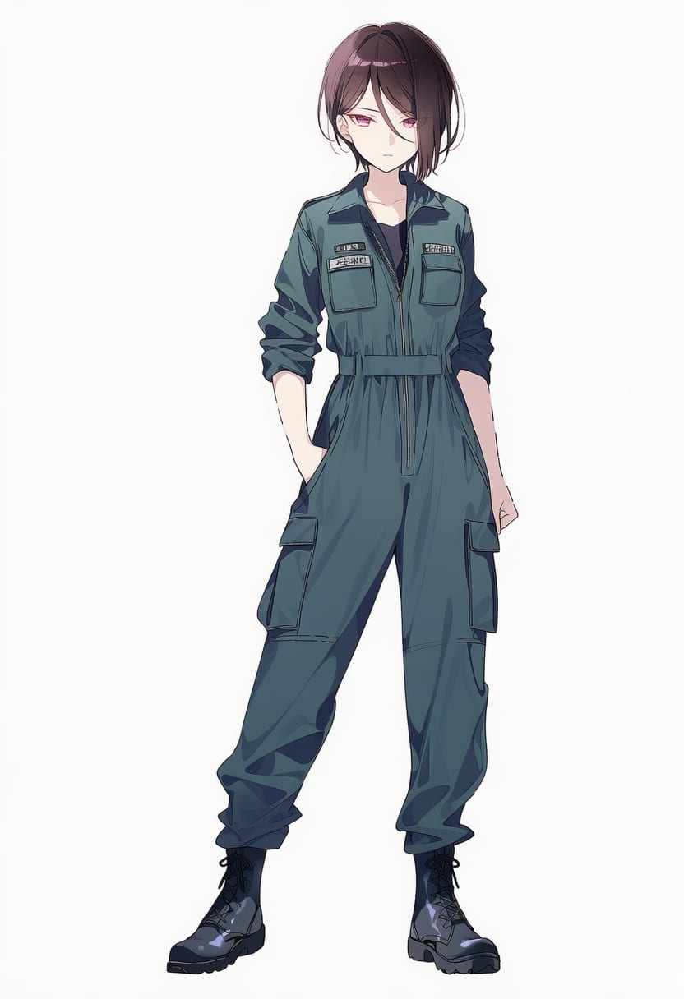

| 字段 | 内容 |
| --- | --- |
| Danbooru Tag | jumpsuit |
| 中文含义 | 连体工作服 |
| 详细解释 | 上衣与长裤连为一体的连体服。 |
| 所属子类 | 连体/功能服 |

## 132. romper — 连体短裤

| 字段 | 内容 |
| --- | --- |
| Danbooru Tag | romper |
| 中文含义 | 连体短裤 |
| 详细解释 | 上衣与短裤连为一体的短款连体服。 |
| 所属子类 | 连体/功能服 |

## 133. unitard — 全身体操紧身衣

| 字段 | 内容 |
| --- | --- |
| Danbooru Tag | unitard |
| 中文含义 | 全身体操紧身衣 |
| 详细解释 | 覆盖躯干并延伸至腿部的贴身一体式服装。 |
| 所属子类 | 连体/功能服 |

## 134. straitjacket — 拘束衣

| 字段 | 内容 |
| --- | --- |
| Danbooru Tag | straitjacket |
| 中文含义 | 拘束衣 |
| 详细解释 | 限制手臂活动、用于拘束人体的特殊服装。 |
| 所属子类 | 连体/功能服 |

## 135. wedding_dress — 婚纱

| 字段 | 内容 |
| --- | --- |
| Danbooru Tag | wedding_dress |
| 中文含义 | 婚纱 |
| 详细解释 | 婚礼场合的主要礼服，通常为白色或浅色长裙，也可有非传统设计。 |
| 所属子类 | 礼服/仪式 |

## 136. cocktail_dress — 鸡尾酒礼服

| 字段 | 内容 |
| --- | --- |
| Danbooru Tag | cocktail_dress |
| 中文含义 | 鸡尾酒礼服 |
| 详细解释 | 适合半正式社交场合、通常较晚礼服简短的礼服裙。 |
| 所属子类 | 礼服/仪式 |

## 137. evening_gown — 晚礼服

| 字段 | 内容 |
| --- | --- |
| Danbooru Tag | evening_gown |
| 中文含义 | 晚礼服 |
| 详细解释 | 正式晚间场合穿着的长款礼服。 |
| 所属子类 | 礼服/仪式 |

## 138. gown — 长礼服

| 字段 | 内容 |
| --- | --- |
| Danbooru Tag | gown |
| 中文含义 | 长礼服 |
| 详细解释 | 正式场合穿着的长款礼服或礼袍。 |
| 所属子类 | 礼服/仪式 |

## 139. funeral_dress — 丧服连衣裙

| 字段 | 内容 |
| --- | --- |
| Danbooru Tag | funeral_dress |
| 中文含义 | 丧服连衣裙 |
| 详细解释 | 用于葬礼或哀悼场合的庄重连衣裙。 |
| 所属子类 | 礼服/仪式 |

## 140. mecha_pilot_suit — 机甲驾驶服

| 字段 | 内容 |
| --- | --- |
| Danbooru Tag | mecha_pilot_suit |
| 中文含义 | 机甲驾驶服 |
| 详细解释 | 机甲/科幻驾驶员的制式全身服装，通常为贴身连体结构。军事、机甲或驾驶场景的制式服装，整体识别度强。 |
| 所属子类 | 科幻世界服饰 |

## 141. power_armor — 动力装甲

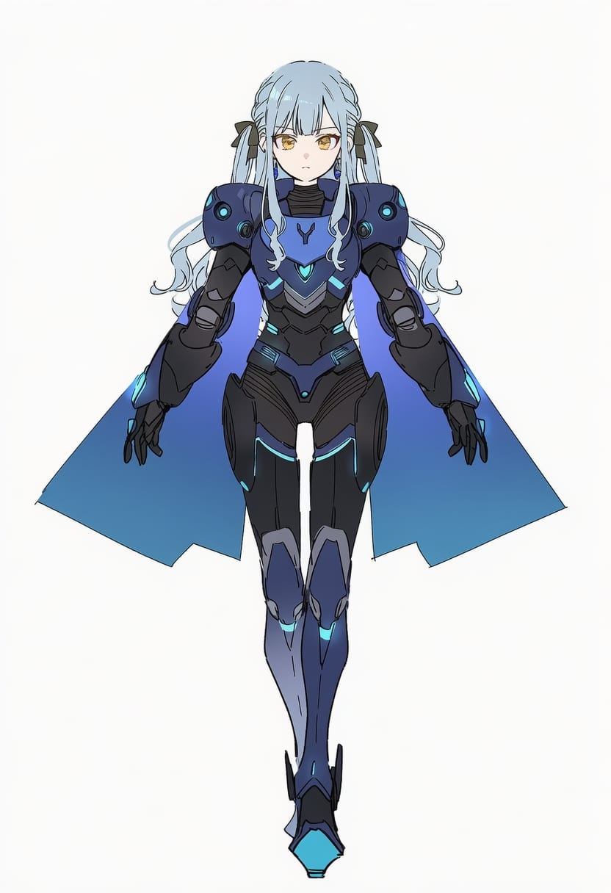

| 字段 | 内容 |
| --- | --- |
| Danbooru Tag | power_armor |
| 中文含义 | 动力装甲 |
| 详细解释 | 带机械助力或高科技结构的全身战斗装甲，适合科幻 RPG/重装职业。 |
| 所属子类 | 科幻世界服饰 |

## 142. fortified_suit — 强化战斗服

| 字段 | 内容 |
| --- | --- |
| Danbooru Tag | fortified_suit |
| 中文含义 | 强化战斗服 |
| 详细解释 | 具有强化、防护或装甲化特征的战斗服，偏科幻/战术 RPG 视觉。 |
| 所属子类 | 科幻世界服饰 |

---
