# 姿势-基础姿势

## 1. standing — 角色直立站着。

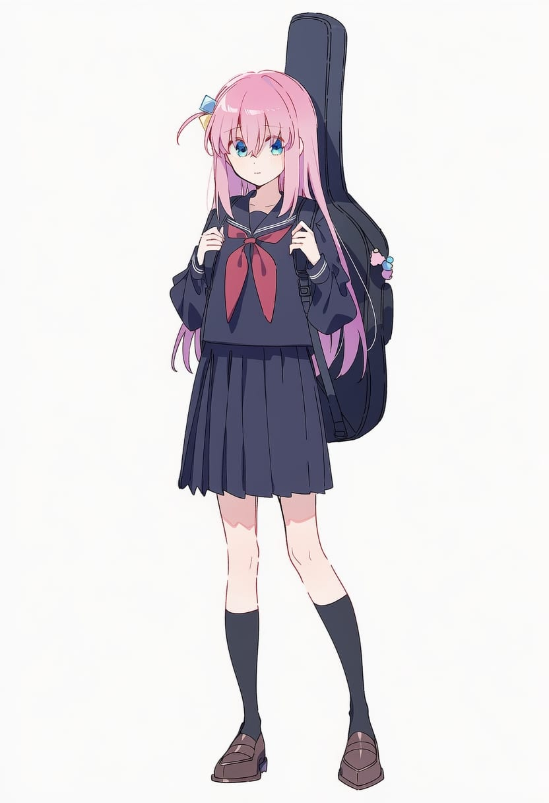

| 字段 | 内容 |
| --- | --- |
| Danbooru Tag | standing |
| 中文名 | 站立 |
| 中文含义 | 角色直立站着。 |
| 子类 | 基础体位 |
| 模特 | 1girl,gotoh_hitori |
| 序号 | 0001 |

## 2. sitting — 角色处于坐着的状态。

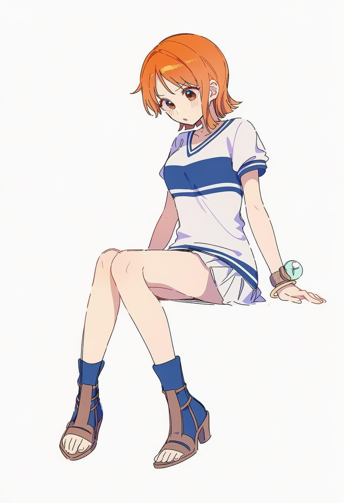

| 字段 | 内容 |
| --- | --- |
| Danbooru Tag | sitting |
| 中文名 | 坐姿 |
| 中文含义 | 角色处于坐着的状态。 |
| 子类 | 基础体位 |
| 模特 | 1girl,nami_(one_piece) |
| 序号 | 0002 |

## 3. kneeling — 双膝或膝部着地的跪姿。

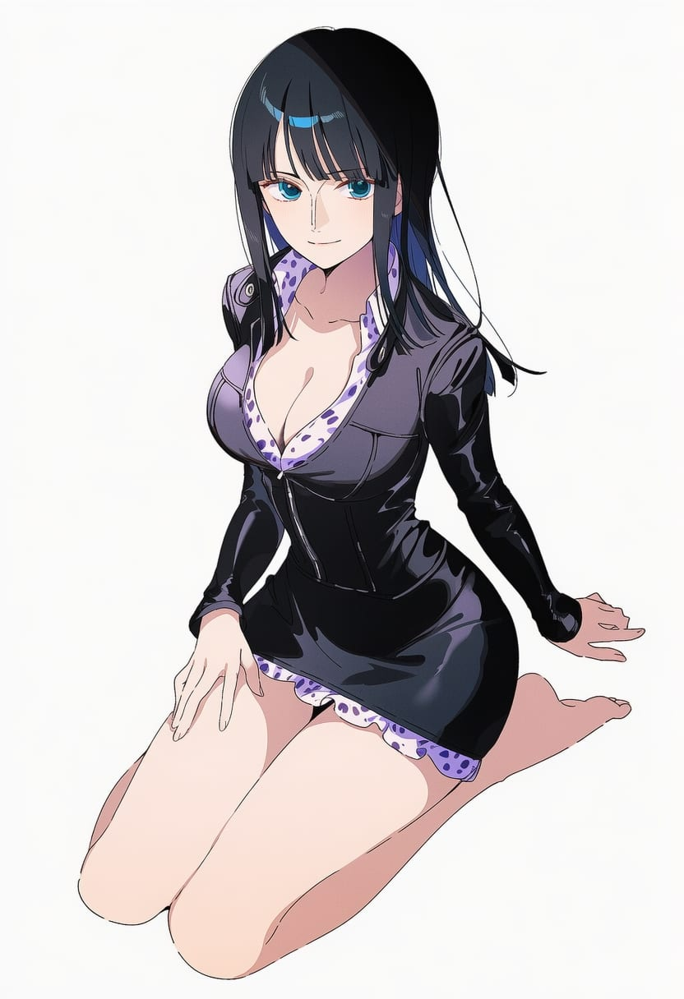

| 字段 | 内容 |
| --- | --- |
| Danbooru Tag | kneeling |
| 中文名 | 跪姿 |
| 中文含义 | 双膝或膝部着地的跪姿。 |
| 子类 | 基础体位 |
| 模特 | 1girl,nico_robin |
| 序号 | 0003 |

## 4. on_one_knee — 一条腿跪地，另一条腿支撑。

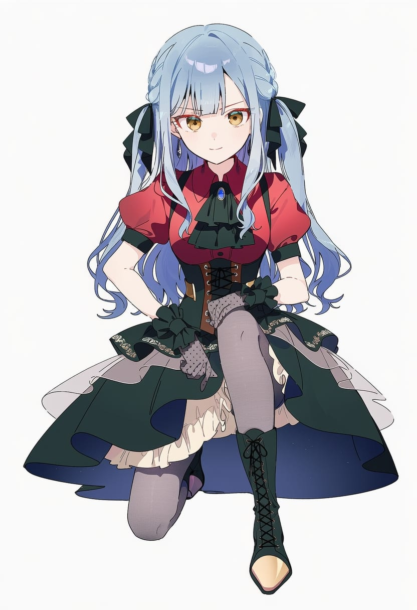

| 字段 | 内容 |
| --- | --- |
| Danbooru Tag | on_one_knee |
| 中文名 | 单膝跪地 |
| 中文含义 | 一条腿跪地，另一条腿支撑。 |
| 子类 | 基础体位 |
| 模特 | 1girl,togawa_sakiko |
| 序号 | 0004 |

## 5. lying — 身体整体处于躺着的状态。

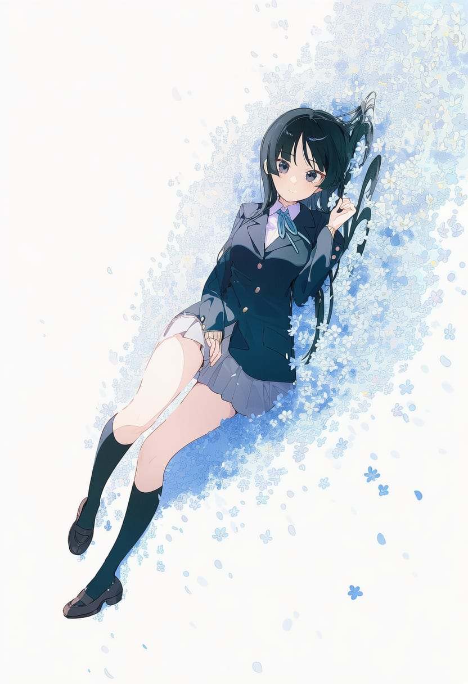

| 字段 | 内容 |
| --- | --- |
| Danbooru Tag | lying |
| 中文名 | 躺卧 |
| 中文含义 | 身体整体处于躺着的状态。 |
| 子类 | 基础体位 |
| 模特 | 1girl,akiyama_mio |
| 序号 | 0005 |

## 6. on_back — 背部朝下躺着。

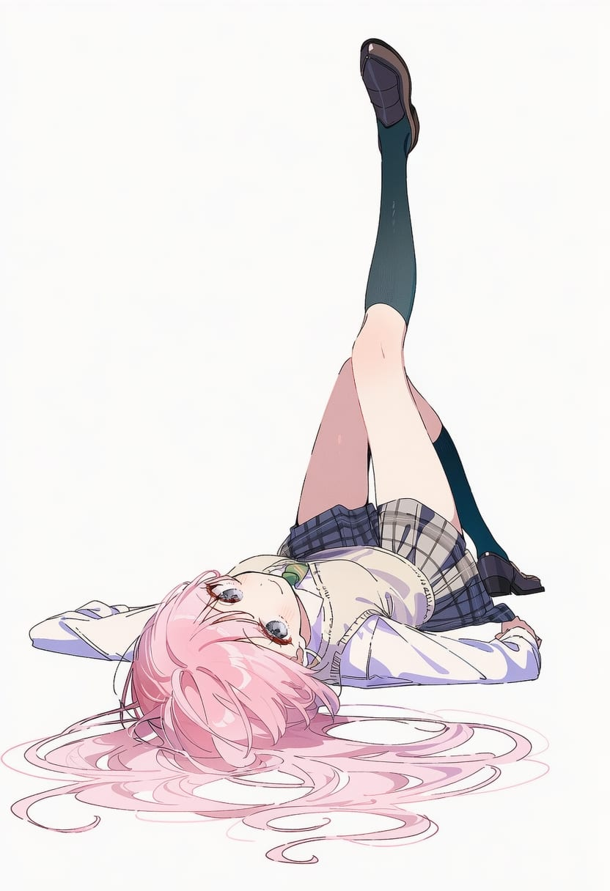

| 字段 | 内容 |
| --- | --- |
| Danbooru Tag | on_back |
| 中文名 | 仰躺 |
| 中文含义 | 背部朝下躺着。 |
| 子类 | 基础体位 |
| 模特 | 1girl,chihaya_anon |
| 序号 | 0006 |

## 7. on_side — 身体侧向躺着。

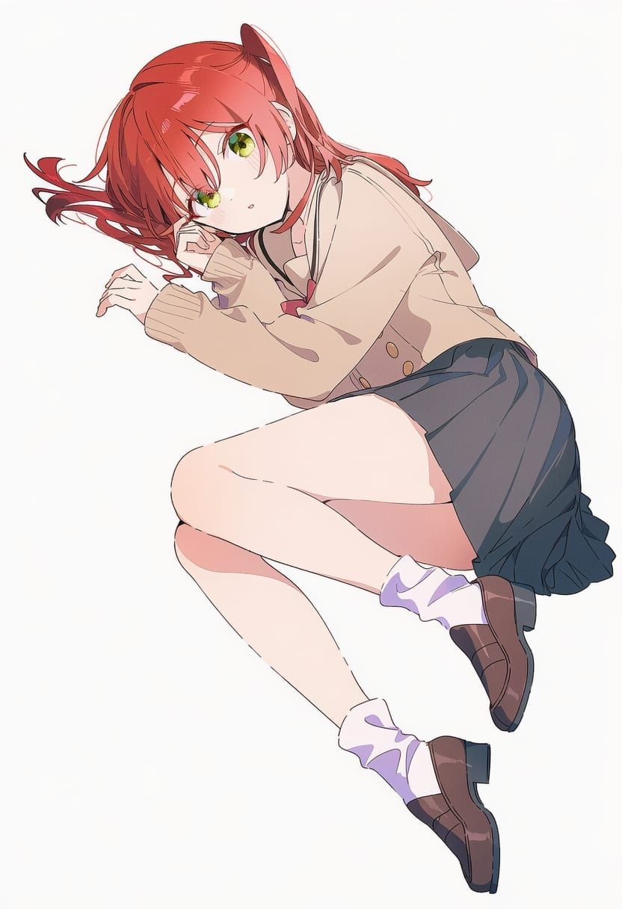

| 字段 | 内容 |
| --- | --- |
| Danbooru Tag | on_side |
| 中文名 | 侧躺 |
| 中文含义 | 身体侧向躺着。 |
| 子类 | 基础体位 |
| 模特 | 1girl,kita_ikuyo |
| 序号 | 0007 |

## 8. on_stomach — 腹部朝下趴着。

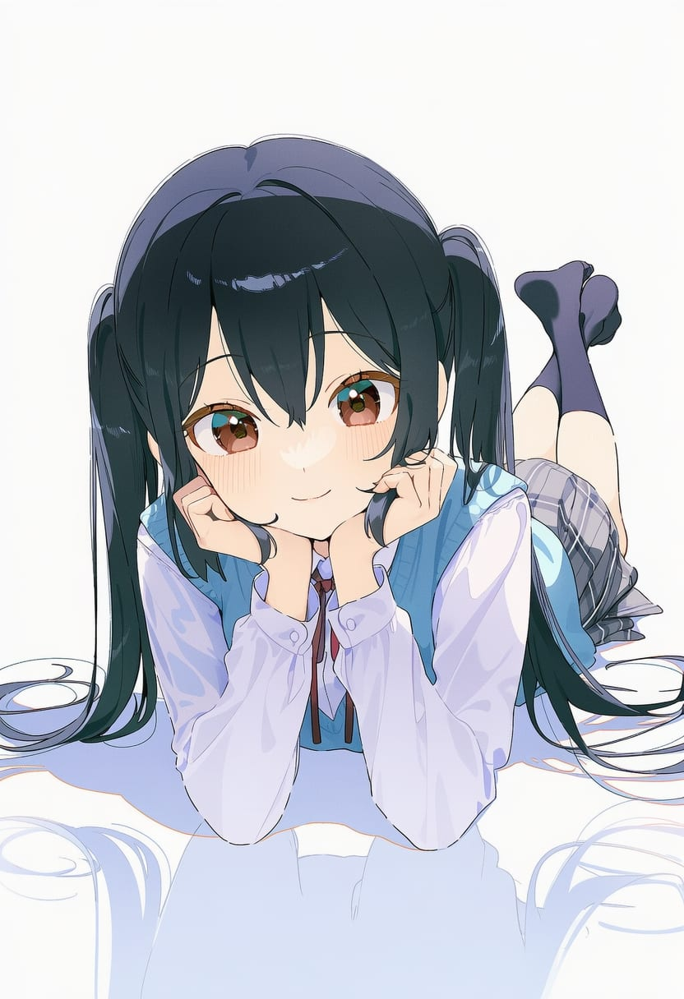

| 字段 | 内容 |
| --- | --- |
| Danbooru Tag | on_stomach |
| 中文名 | 俯卧 |
| 中文含义 | 腹部朝下趴着。 |
| 子类 | 基础体位 |
| 模特 | 1girl,nakano_azusa |
| 序号 | 0008 |

## 9. squatting — 屈膝降低身体重心的蹲姿。

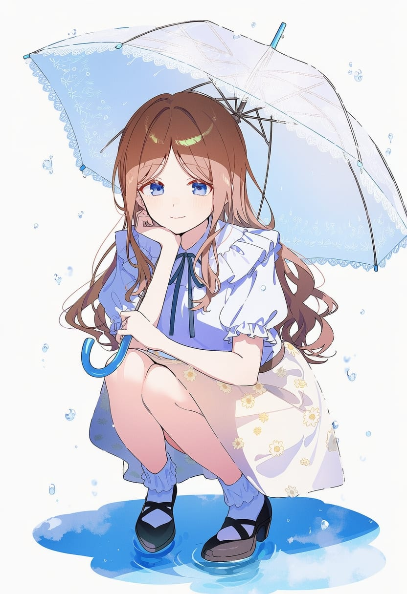

| 字段 | 内容 |
| --- | --- |
| Danbooru Tag | squatting |
| 中文名 | 蹲姿 |
| 中文含义 | 屈膝降低身体重心的蹲姿。 |
| 子类 | 基础体位 |
| 模特 | 1girl,nagasaki_soyo |
| 序号 | 0009 |

## 10. reclining — 身体向后倚靠、半躺半坐。

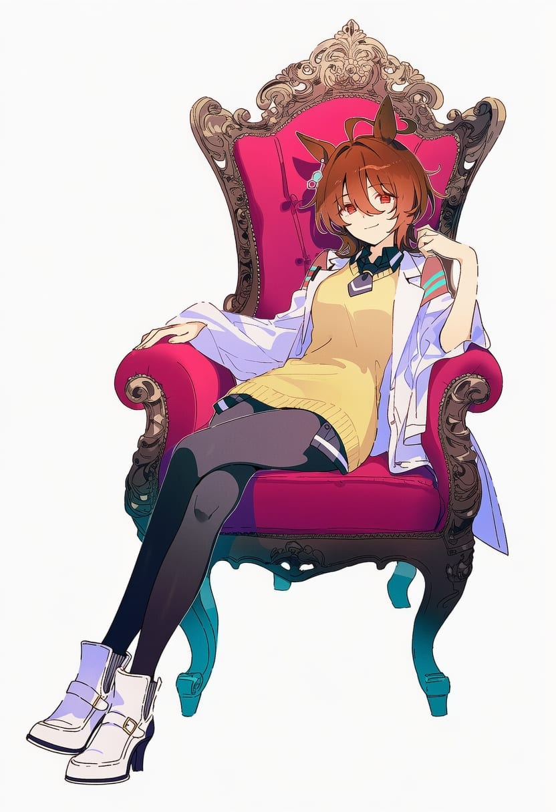

| 字段 | 内容 |
| --- | --- |
| Danbooru Tag | reclining |
| 中文名 | 斜躺 / 倚躺 |
| 中文含义 | 身体向后倚靠、半躺半坐。 |
| 子类 | 基础体位 |
| 模特 | 1girl,agnes_tachyon_(umamusume) |
| 序号 | 0010 |

## 11. balancing — 身体处于明显维持平衡的姿态。

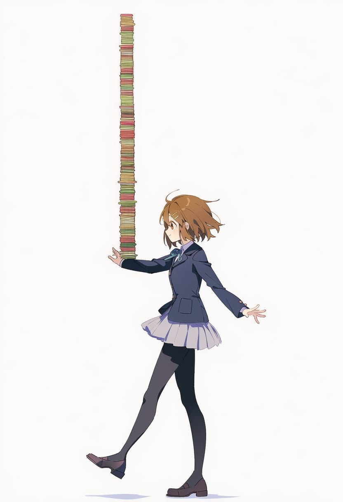

| 字段 | 内容 |
| --- | --- |
| Danbooru Tag | balancing |
| 中文名 | 保持平衡 |
| 中文含义 | 身体处于明显维持平衡的姿态。 |
| 子类 | 基础体位 |
| 模特 | 1girl,hirasawa_yui |
| 序号 | 0011 |

## 12. standing_on_one_leg — 只用一条腿支撑身体站立。

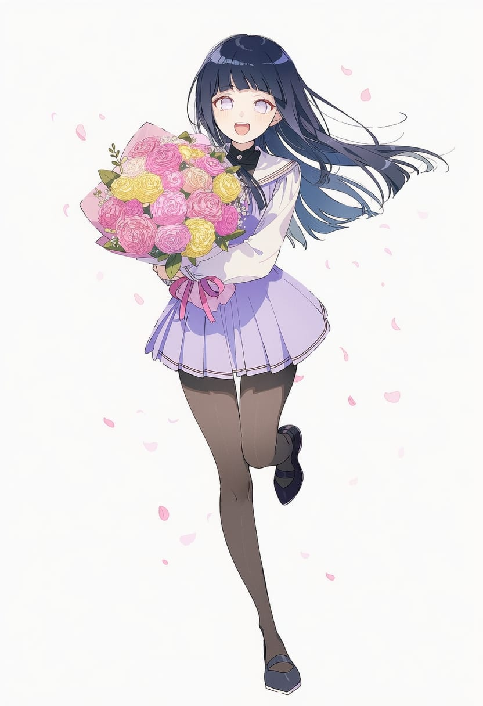

| 字段 | 内容 |
| --- | --- |
| Danbooru Tag | standing_on_one_leg |
| 中文名 | 单腿站立 |
| 中文含义 | 只用一条腿支撑身体站立。 |
| 子类 | 基础体位 |
| 模特 | 1girl,hyuuga_hinata |
| 序号 | 0012 |

## 13. legs_apart — 站立时双腿明显分开。

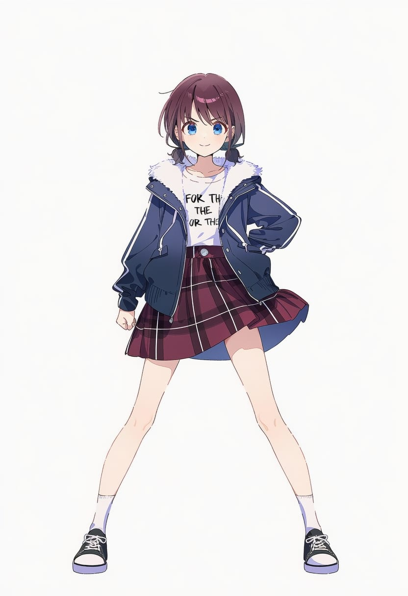

| 字段 | 内容 |
| --- | --- |
| Danbooru Tag | legs_apart |
| 中文名 | 分腿站姿 |
| 中文含义 | 站立时双腿明显分开。 |
| 子类 | 基础体位 |
| 模特 | 1girl,iseri_nina |
| 序号 | 0013 |

## 14. seiza — 日式正座，跪坐在脚跟上。

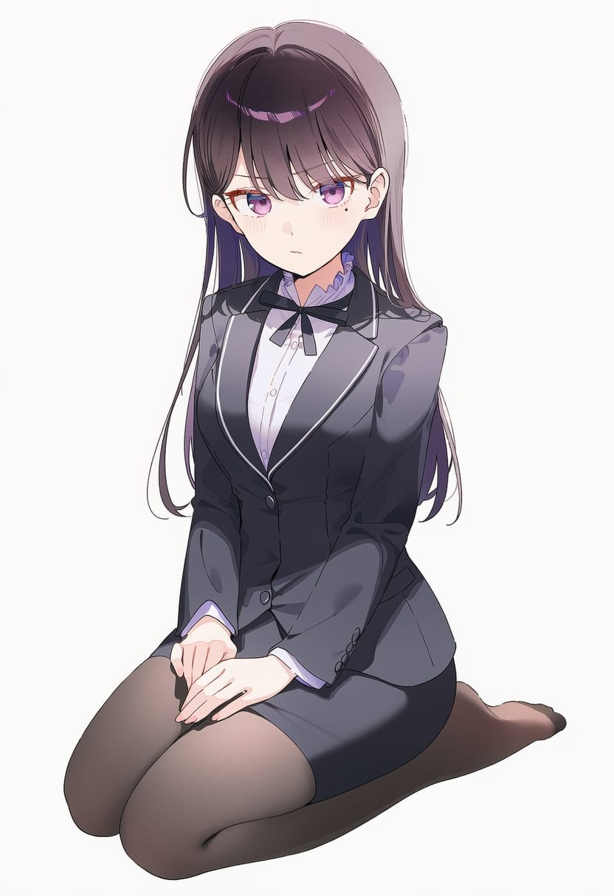

| 字段 | 内容 |
| --- | --- |
| Danbooru Tag | seiza |
| 中文名 | 正座 |
| 中文含义 | 日式正座，跪坐在脚跟上。 |
| 子类 | 坐姿/蜷缩 |
| 模特 | 1girl,shiina_taki |
| 序号 | 0014 |

## 15. wariza — 双腿分别折向身体两侧的坐姿。

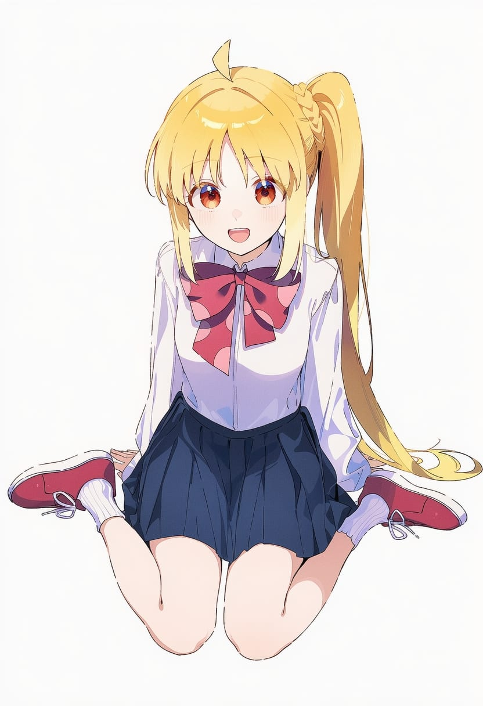

| 字段 | 内容 |
| --- | --- |
| Danbooru Tag | wariza |
| 中文名 | 鸭子坐 / W坐 |
| 中文含义 | 双腿分别折向身体两侧的坐姿。 |
| 子类 | 坐姿/蜷缩 |
| 模特 | 1girl,ijichi_nijika |
| 序号 | 0015 |

## 16. yokozuwari — 双腿并拢折向身体一侧。

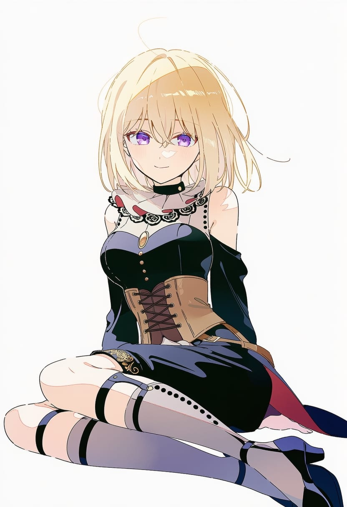

| 字段 | 内容 |
| --- | --- |
| Danbooru Tag | yokozuwari |
| 中文名 | 横座 |
| 中文含义 | 双腿并拢折向身体一侧。 |
| 子类 | 坐姿/蜷缩 |
| 模特 | 1girl,misumi_uika |
| 序号 | 0016 |

## 17. indian_style — 双腿交叉盘坐。

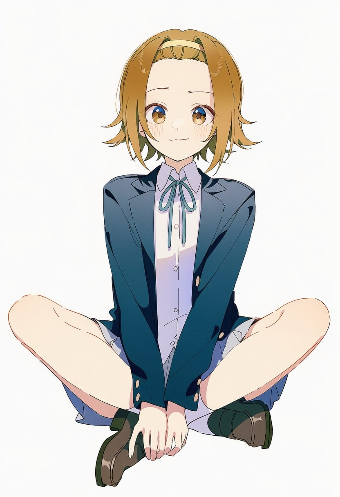

| 字段 | 内容 |
| --- | --- |
| Danbooru Tag | indian_style |
| 中文名 | 盘腿坐 / 胡坐 |
| 中文含义 | 双腿交叉盘坐。 |
| 子类 | 坐姿/蜷缩 |
| 模特 | 1girl,tainaka_ritsu |
| 序号 | 0017 |

## 18. lotus_position — 双腿盘起、双脚置于对侧大腿附近。

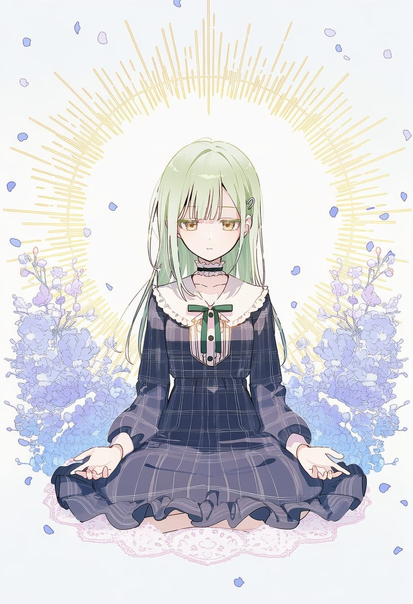

| 字段 | 内容 |
| --- | --- |
| Danbooru Tag | lotus_position |
| 中文名 | 莲花坐 |
| 中文含义 | 双腿盘起、双脚置于对侧大腿附近。 |
| 子类 | 坐姿/蜷缩 |
| 模特 | 1girl,wakaba_mutsumi |
| 序号 | 0018 |

## 19. butterfly_sitting — 屈膝向两侧打开，双脚靠近。

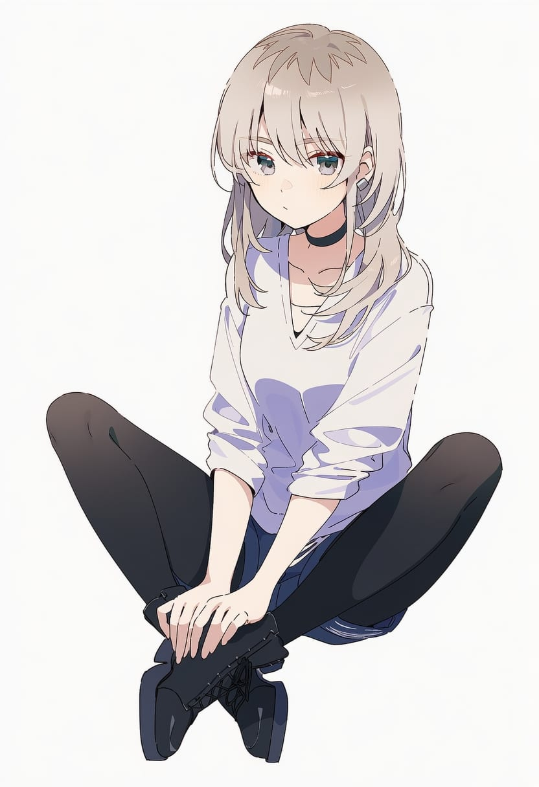

| 字段 | 内容 |
| --- | --- |
| Danbooru Tag | butterfly_sitting |
| 中文名 | 蝴蝶坐 |
| 中文含义 | 屈膝向两侧打开，双脚靠近。 |
| 子类 | 坐姿/蜷缩 |
| 模特 | 1girl,kawaragi_momoka |
| 序号 | 0019 |

## 20. figure_four_sitting — 一只脚踝搭在另一条腿上形成4字。

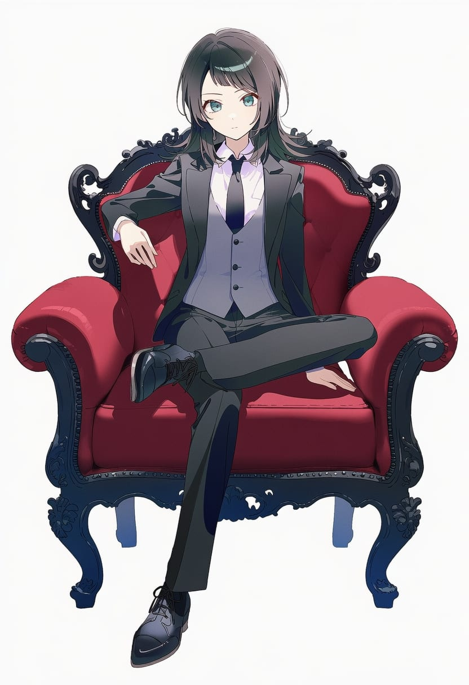

| 字段 | 内容 |
| --- | --- |
| Danbooru Tag | figure_four_sitting |
| 中文名 | 4字坐姿 |
| 中文含义 | 一只脚踝搭在另一条腿上形成4字。 |
| 子类 | 坐姿/蜷缩 |
| 模特 | 1girl,yahata_umiri |
| 序号 | 0020 |

## 21. hugging_own_legs — 坐着抱住自己的双腿或膝盖。

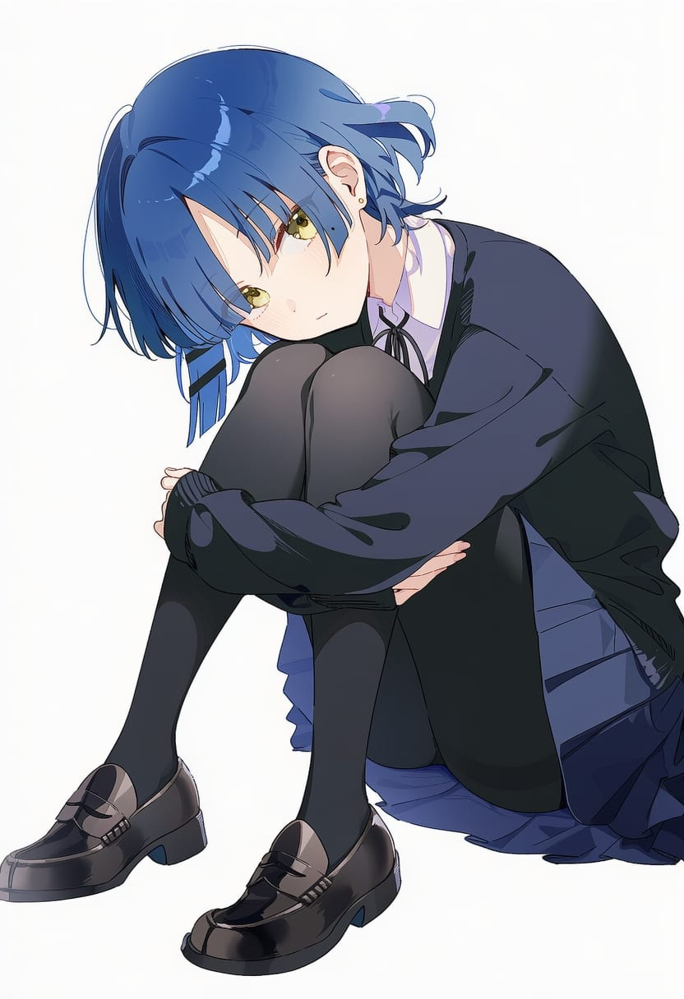

| 字段 | 内容 |
| --- | --- |
| Danbooru Tag | hugging_own_legs |
| 中文名 | 抱膝坐 |
| 中文含义 | 坐着抱住自己的双腿或膝盖。 |
| 子类 | 坐姿/蜷缩 |
| 模特 | 1girl,yamada_ryo |
| 序号 | 0021 |

## 22. fetal_position — 身体蜷缩，膝盖靠近胸部。

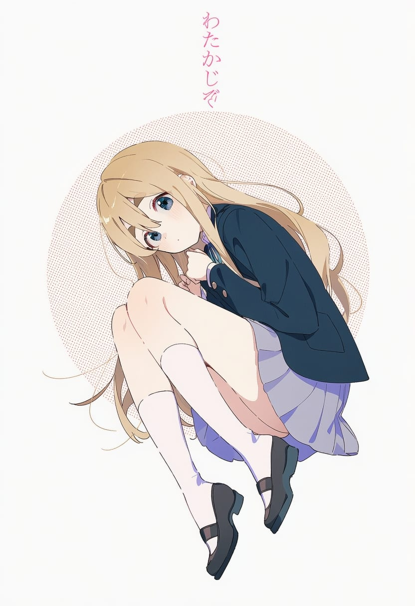

| 字段 | 内容 |
| --- | --- |
| Danbooru Tag | fetal_position |
| 中文名 | 胎儿姿势 |
| 中文含义 | 身体蜷缩，膝盖靠近胸部。 |
| 子类 | 坐姿/蜷缩 |
| 模特 | 1girl,kotobuki_tsumugi |
| 序号 | 0022 |

## 23. crossed_legs — 双腿交叉或翘腿的姿态。

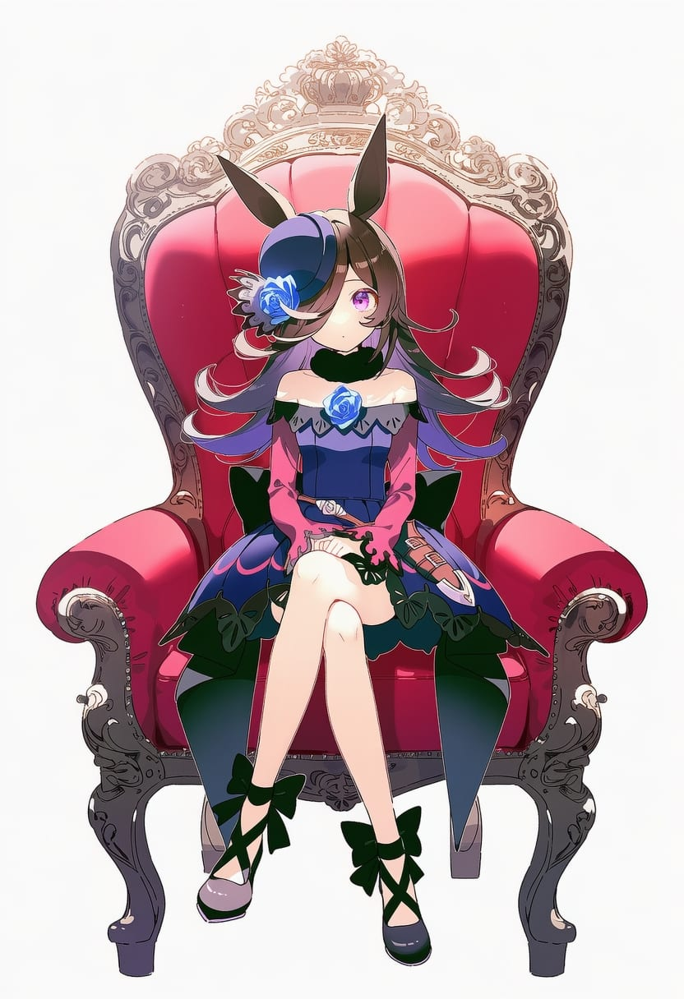

| 字段 | 内容 |
| --- | --- |
| Danbooru Tag | crossed_legs |
| 中文名 | 交叉双腿 |
| 中文含义 | 双腿交叉或翘腿的姿态。 |
| 子类 | 坐姿/蜷缩 |
| 模特 | 1girl,rice_shower_(umamusume) |
| 序号 | 0023 |

## 24. all_fours — 双手和双膝等四点支撑身体。

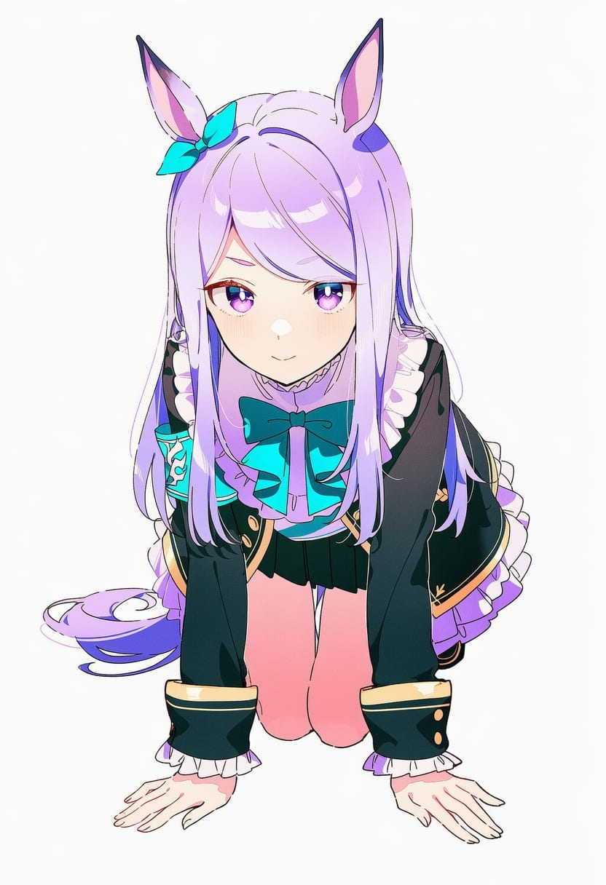

| 字段 | 内容 |
| --- | --- |
| Danbooru Tag | all_fours |
| 中文名 | 四肢着地 |
| 中文含义 | 双手和双膝等四点支撑身体。 |
| 子类 | 全身姿态/支撑 |
| 模特 | 1girl,mejiro_mcqueen_(umamusume) |
| 序号 | 0024 |

## 25. top-down_bottom-up — 前半身压低、臀部明显抬高。

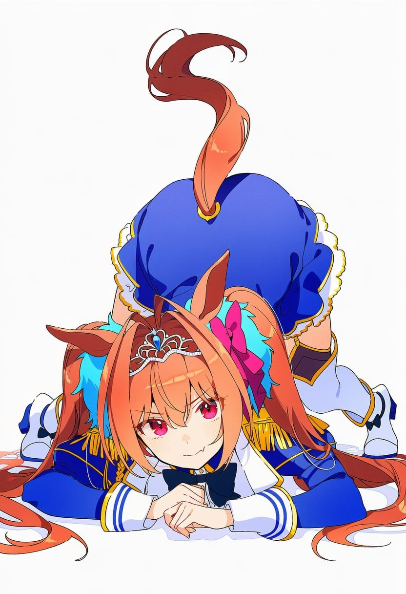

| 字段 | 内容 |
| --- | --- |
| Danbooru Tag | top-down_bottom-up |
| 中文名 | 上身趴低臀部抬高 |
| 中文含义 | 前半身压低、臀部明显抬高。 |
| 子类 | 全身姿态/支撑 |
| 模特 | 1girl,daiwa_scarlet_(umamusume) |
| 序号 | 0025 |

## 26. prostration — 跪地并将上身俯伏到地面。

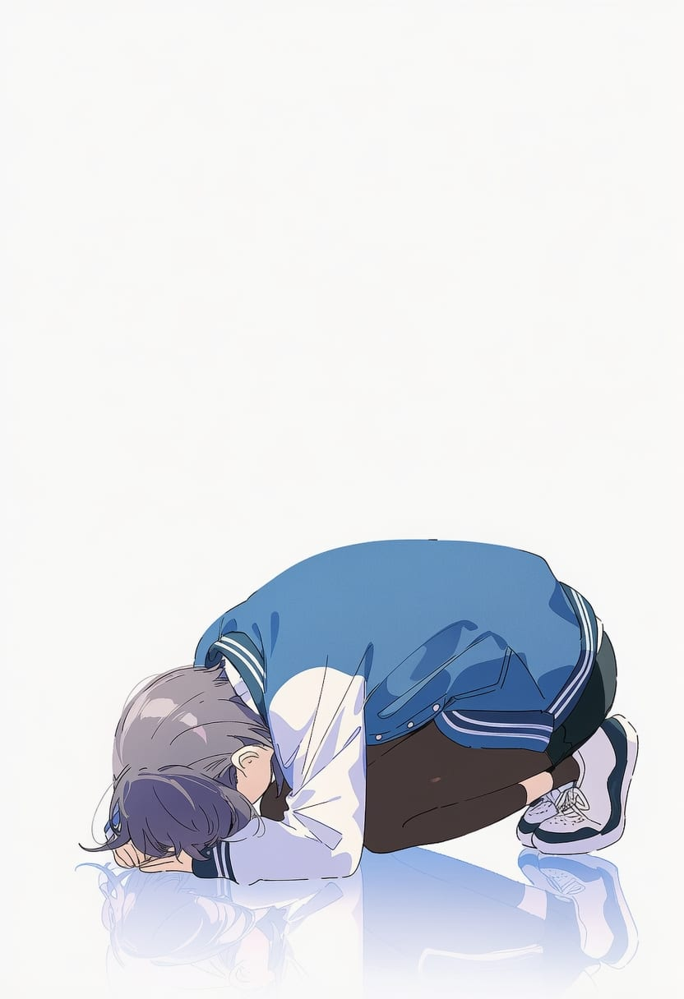

| 字段 | 内容 |
| --- | --- |
| Danbooru Tag | prostration |
| 中文名 | 伏地 / 跪伏 |
| 中文含义 | 跪地并将上身俯伏到地面。 |
| 子类 | 全身姿态/支撑 |
| 模特 | 1girl,takamatsu_tomori |
| 序号 | 0026 |

## 27. chest_stand — 胸部着地支撑，双腿向上翻起。

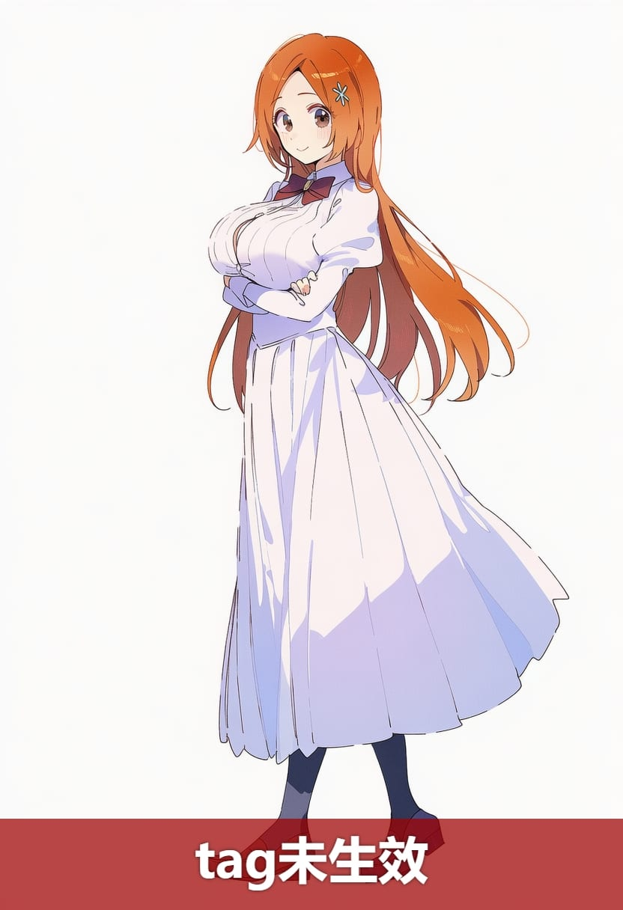

| 字段 | 内容 |
| --- | --- |
| Danbooru Tag | chest_stand |
| 中文名 | 胸部支撑倒立 |
| 中文含义 | 胸部着地支撑，双腿向上翻起。 |
| 子类 | 全身姿态/支撑 |
| 模特 | 1girl,inoue_orihime |
| 序号 | 0027 |

## 28. cowering — 因害怕而缩起身体、降低姿态。

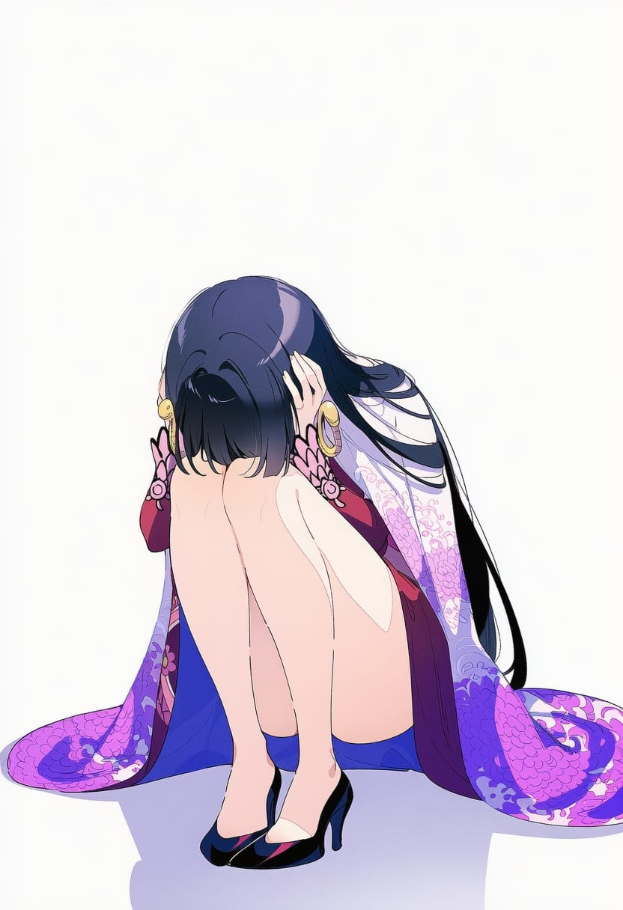

| 字段 | 内容 |
| --- | --- |
| Danbooru Tag | cowering |
| 中文名 | 畏缩蜷缩 |
| 中文含义 | 因害怕而缩起身体、降低姿态。 |
| 子类 | 全身姿态/支撑 |
| 模特 | 1girl,boa_hancock |
| 序号 | 0028 |

## 29. crucifixion — 身体展开并呈类似十字架固定姿态。

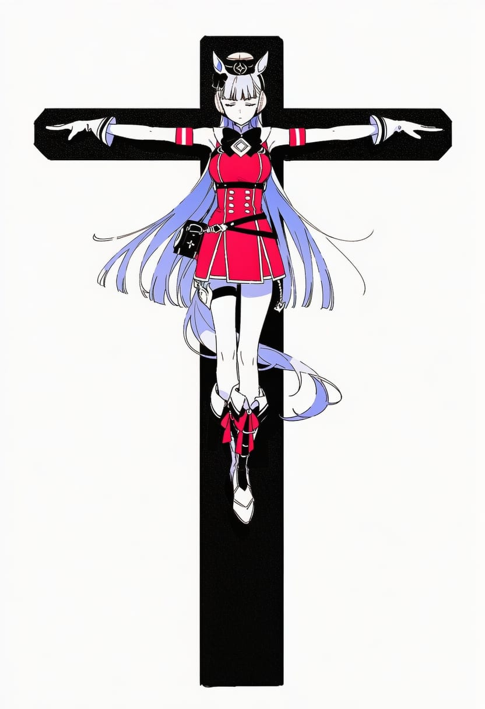

| 字段 | 内容 |
| --- | --- |
| Danbooru Tag | crucifixion |
| 中文名 | 十字受刑姿势 |
| 中文含义 | 身体展开并呈类似十字架固定姿态。 |
| 子类 | 全身姿态/支撑 |
| 模特 | 1girl,gold_ship_(umamusume) |
| 序号 | 0029 |

## 30. faceplant — 身体向前倒下，脸部贴地。

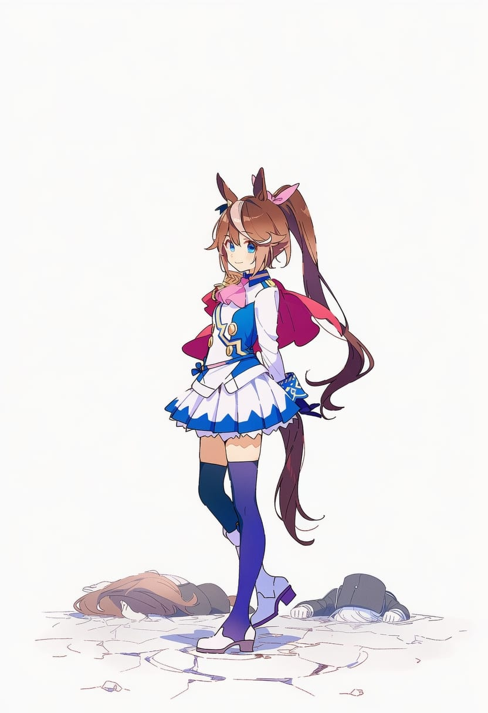

| 字段 | 内容 |
| --- | --- |
| Danbooru Tag | faceplant |
| 中文名 | 脸着地 |
| 中文含义 | 身体向前倒下，脸部贴地。 |
| 子类 | 全身姿态/支撑 |
| 模特 | 1girl,tokai_teio_(umamusume) |
| 序号 | 0030 |

## 31. fighting_stance — 摆出准备攻击或防御的战斗姿势。

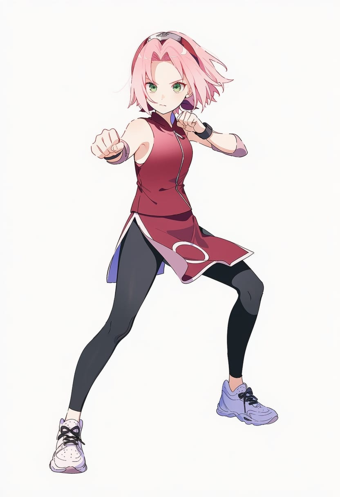

| 字段 | 内容 |
| --- | --- |
| Danbooru Tag | fighting_stance |
| 中文名 | 战斗架势 |
| 中文含义 | 摆出准备攻击或防御的战斗姿势。 |
| 子类 | 全身姿态/支撑 |
| 模特 | 1girl,haruno_sakura |
| 序号 | 0031 |

## 32. battoujutsu_stance — 手靠近刀柄，摆出准备拔刀的姿势。

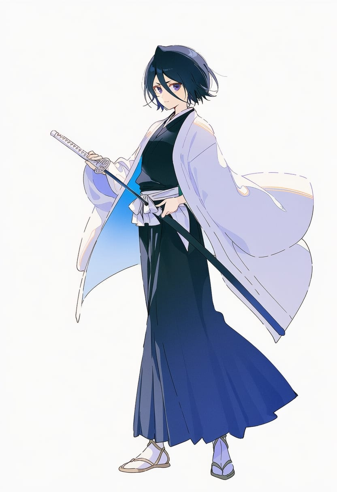

| 字段 | 内容 |
| --- | --- |
| Danbooru Tag | battoujutsu_stance |
| 中文名 | 拔刀术架势 |
| 中文含义 | 手靠近刀柄，摆出准备拔刀的姿势。 |
| 子类 | 全身姿态/支撑 |
| 模特 | 1girl,kuchiki_rukia |
| 序号 | 0032 |

## 33. stretching — 伸展身体或拉伸肌肉的姿态。

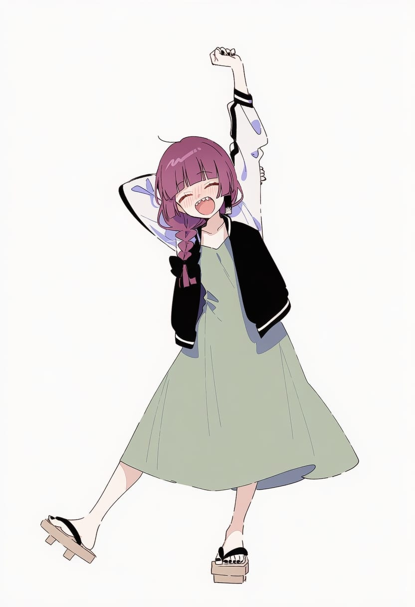

| 字段 | 内容 |
| --- | --- |
| Danbooru Tag | stretching |
| 中文名 | 伸展身体 |
| 中文含义 | 伸展身体或拉伸肌肉的姿态。 |
| 子类 | 全身姿态/支撑 |
| 模特 | 1girl,hiroi_kikuri |
| 序号 | 0033 |

## 34. superhero_landing — 低身单膝或手撑地的英雄式落地姿势。

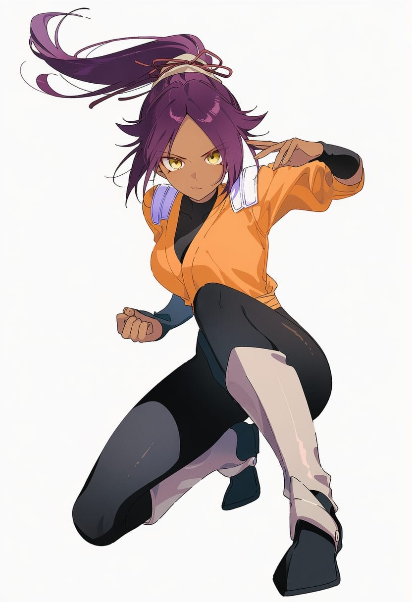

| 字段 | 内容 |
| --- | --- |
| Danbooru Tag | superhero_landing |
| 中文名 | 超级英雄落地 |
| 中文含义 | 低身单膝或手撑地的英雄式落地姿势。 |
| 子类 | 全身姿态/支撑 |
| 模特 | 1girl,shihouin_yoruichi |
| 序号 | 0034 |

## 35. upside-down — 整个身体上下颠倒。

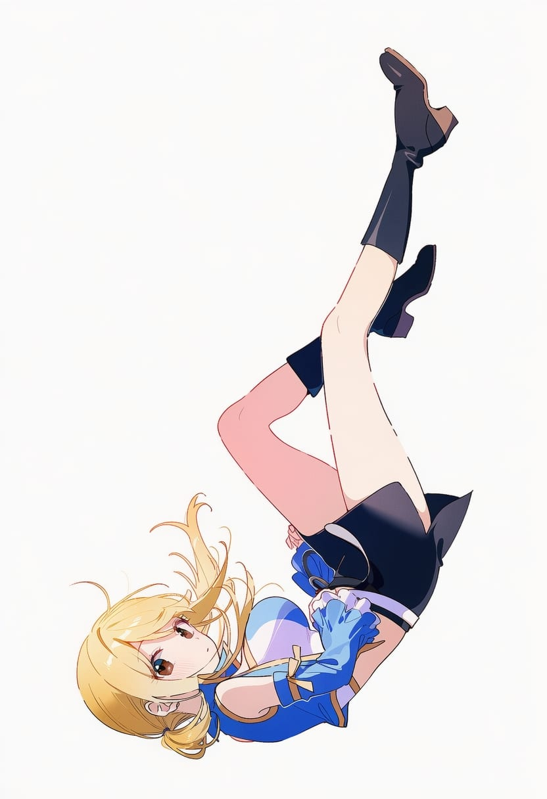

| 字段 | 内容 |
| --- | --- |
| Danbooru Tag | upside-down |
| 中文名 | 倒置姿态 |
| 中文含义 | 整个身体上下颠倒。 |
| 子类 | 全身姿态/支撑 |
| 模特 | 1girl,lucy_heartfilia |
| 序号 | 0035 |

## 36. handstand — 用双手或手臂支撑身体倒立。

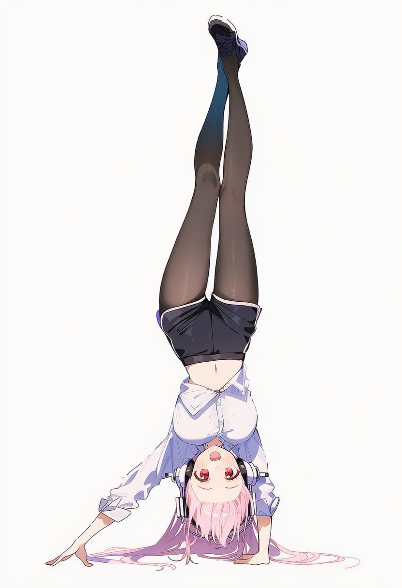

| 字段 | 内容 |
| --- | --- |
| Danbooru Tag | handstand |
| 中文名 | 手倒立 |
| 中文含义 | 用双手或手臂支撑身体倒立。 |
| 子类 | 全身姿态/支撑 |
| 模特 | 1girl,super_sonico |
| 序号 | 0036 |

## 37. yoga — 摆出明显的瑜伽体式。

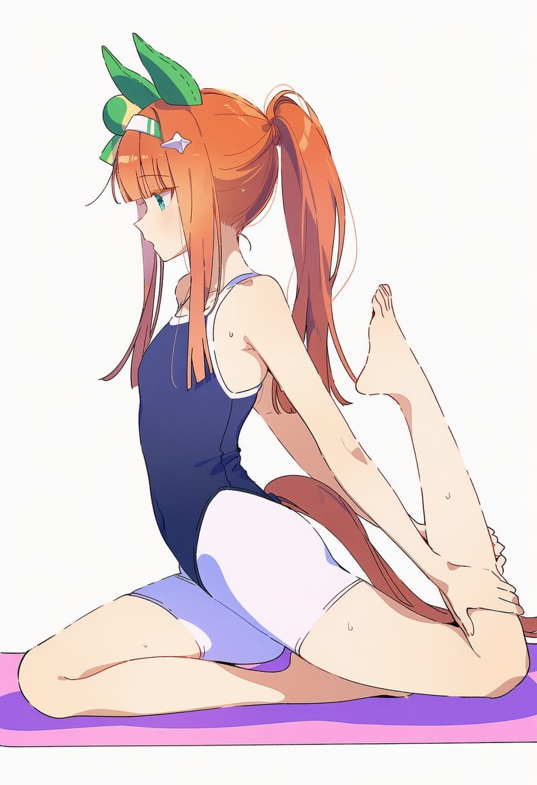

| 字段 | 内容 |
| --- | --- |
| Danbooru Tag | yoga |
| 中文名 | 瑜伽姿势 |
| 中文含义 | 摆出明显的瑜伽体式。 |
| 子类 | 全身姿态/支撑 |
| 模特 | 1girl,silence_suzuka_(umamusume) |
| 序号 | 0037 |

## 38. arm_support — 用手臂或手支撑自身重量。

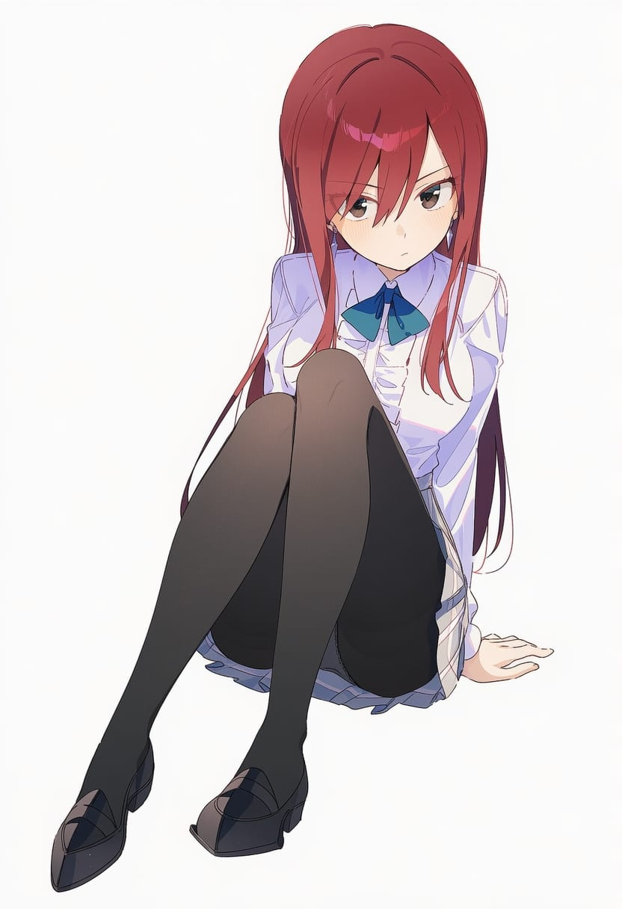

| 字段 | 内容 |
| --- | --- |
| Danbooru Tag | arm_support |
| 中文名 | 手臂支撑身体 |
| 中文含义 | 用手臂或手支撑自身重量。 |
| 子类 | 全身姿态/支撑 |
| 模特 | 1girl,erza_scarlet |
| 序号 | 0038 |

## 39. head_rest — 头部由手、手臂或物体支撑。

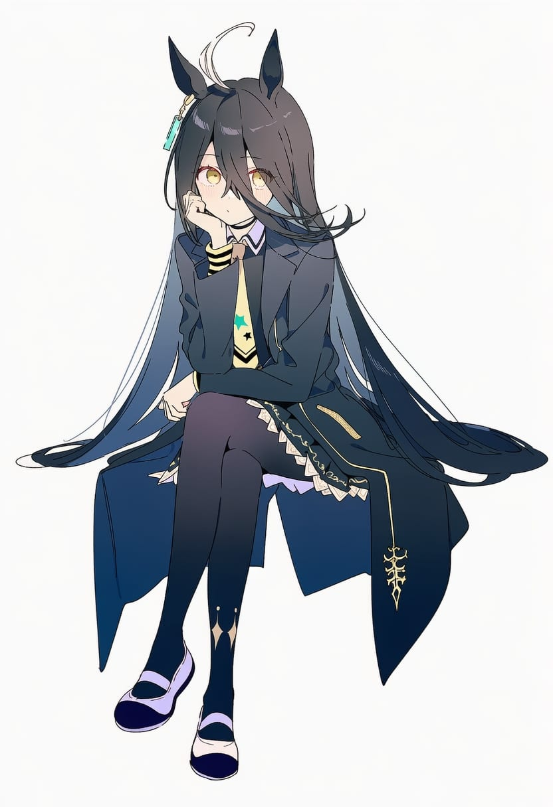

| 字段 | 内容 |
| --- | --- |
| Danbooru Tag | head_rest |
| 中文名 | 托头 / 枕头姿势 |
| 中文含义 | 头部由手、手臂或物体支撑。 |
| 子类 | 全身姿态/支撑 |
| 模特 | 1girl,manhattan_cafe_(umamusume) |
| 序号 | 0039 |

## 40. contrapposto — 重心偏向一条腿，髋肩形成自然反向倾斜。

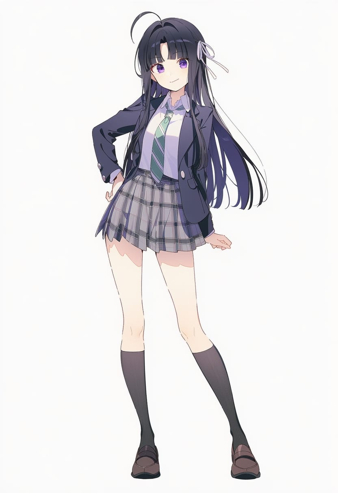

| 字段 | 内容 |
| --- | --- |
| Danbooru Tag | contrapposto |
| 中文名 | 对立式站姿 |
| 中文含义 | 重心偏向一条腿，髋肩形成自然反向倾斜。 |
| 子类 | 全身姿态/支撑 |
| 模特 | 1girl,awa_subaru |
| 序号 | 0040 |

## 41. posing — 有意识地摆出供拍摄或展示的姿势。

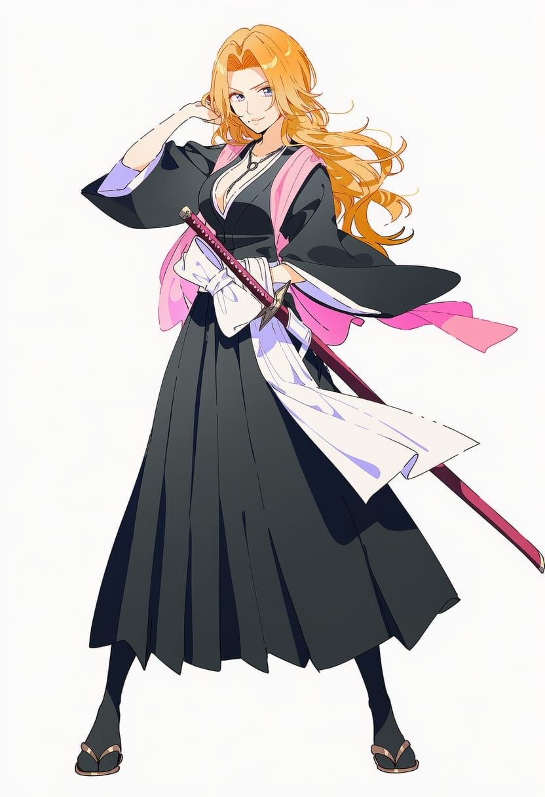

| 字段 | 内容 |
| --- | --- |
| Danbooru Tag | posing |
| 中文名 | 摆姿势 |
| 中文含义 | 有意识地摆出供拍摄或展示的姿势。 |
| 子类 | 全身姿态/支撑 |
| 模特 | 1girl,matsumoto_rangiku |
| 序号 | 0041 |

## 42. head_down — 头部明显向下倾。

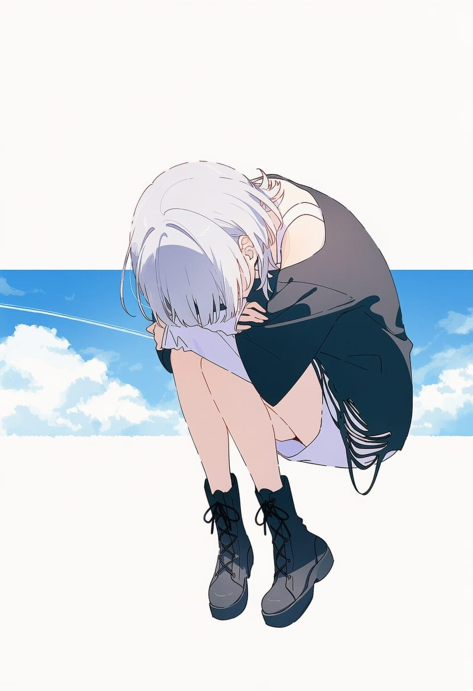

| 字段 | 内容 |
| --- | --- |
| Danbooru Tag | head_down |
| 中文名 | 低头 |
| 中文含义 | 头部明显向下倾。 |
| 子类 | 头部姿态 |
| 模特 | 1girl,kaname_raana |
| 序号 | 0042 |

## 43. head_tilt — 头部向左或右侧倾斜。

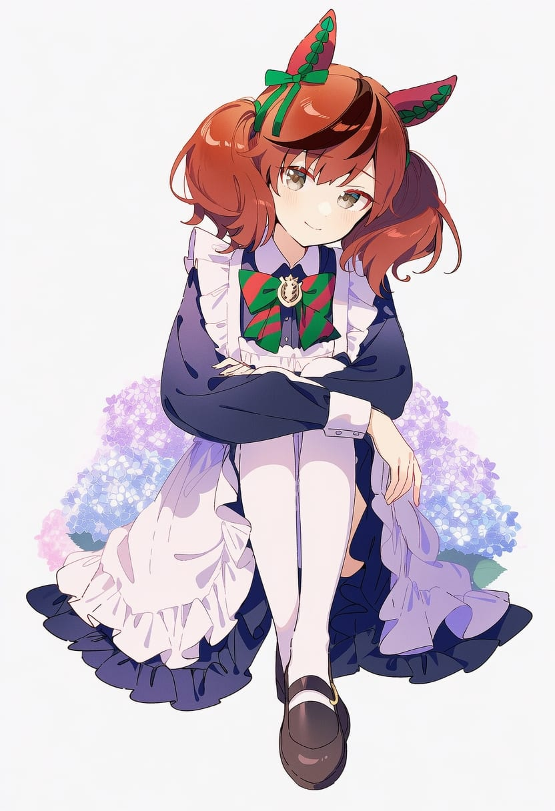

| 字段 | 内容 |
| --- | --- |
| Danbooru Tag | head_tilt |
| 中文名 | 歪头 |
| 中文含义 | 头部向左或右侧倾斜。 |
| 子类 | 头部姿态 |
| 模特 | 1girl,nice_nature_(umamusume) |
| 序号 | 0043 |

## 44. head_back — 头部明显向后仰。

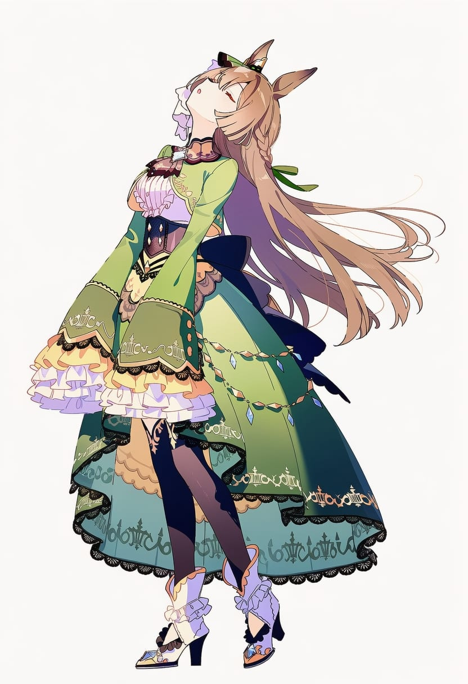

| 字段 | 内容 |
| --- | --- |
| Danbooru Tag | head_back |
| 中文名 | 仰头 |
| 中文含义 | 头部明显向后仰。 |
| 子类 | 头部姿态 |
| 模特 | 1girl,satono_diamond_(umamusume) |
| 序号 | 0044 |

## 45. turning_head — 头部相对身体明显转向一侧。

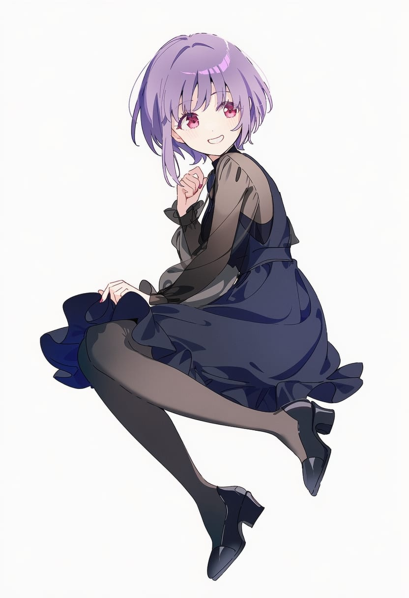

| 字段 | 内容 |
| --- | --- |
| Danbooru Tag | turning_head |
| 中文名 | 转头 |
| 中文含义 | 头部相对身体明显转向一侧。 |
| 子类 | 头部姿态 |
| 模特 | 1girl,yuutenji_nyamu |
| 序号 | 0045 |

## 46. arched_back — 脊柱中段向前推出，身体形成弧线。

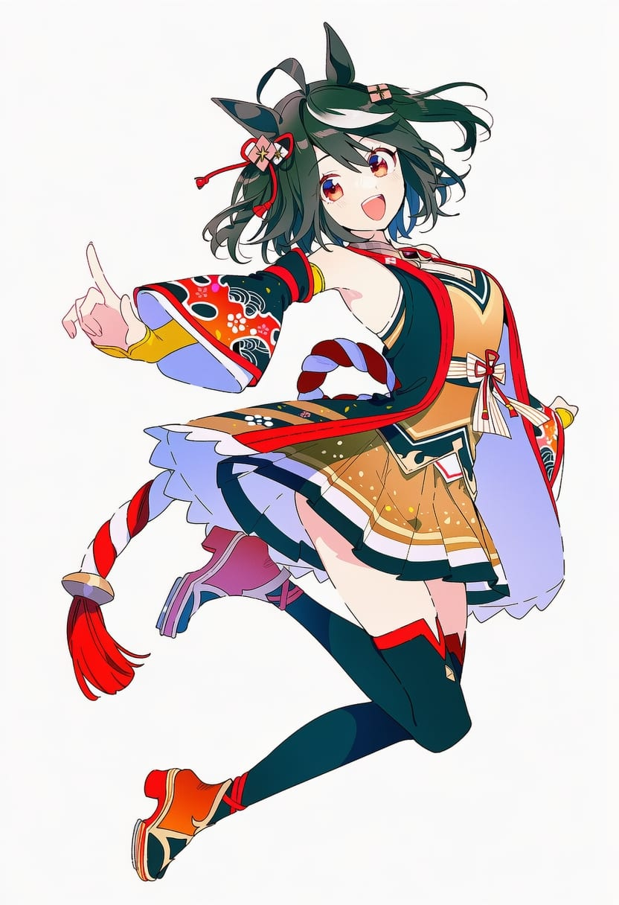

| 字段 | 内容 |
| --- | --- |
| Danbooru Tag | arched_back |
| 中文名 | 弓背 / 腰向前挺 |
| 中文含义 | 脊柱中段向前推出，身体形成弧线。 |
| 子类 | 躯干/倾斜 |
| 模特 | 1girl,kitasan_black_(umamusume) |
| 序号 | 0046 |

## 47. bent_back — 脊柱中段向后弯曲。

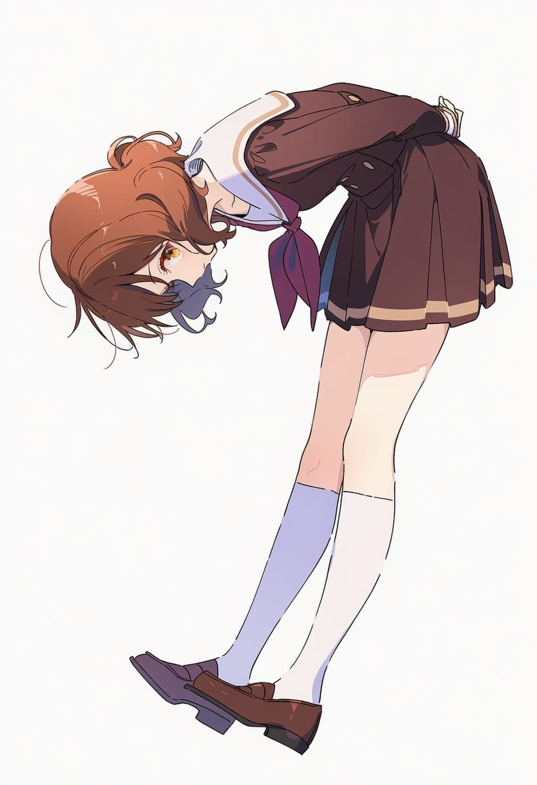

| 字段 | 内容 |
| --- | --- |
| Danbooru Tag | bent_back |
| 中文名 | 背部后弯 |
| 中文含义 | 脊柱中段向后弯曲。 |
| 子类 | 躯干/倾斜 |
| 模特 | 1girl,oumae_kumiko |
| 序号 | 0047 |

## 48. bent_over — 上半身明显向前弯下。

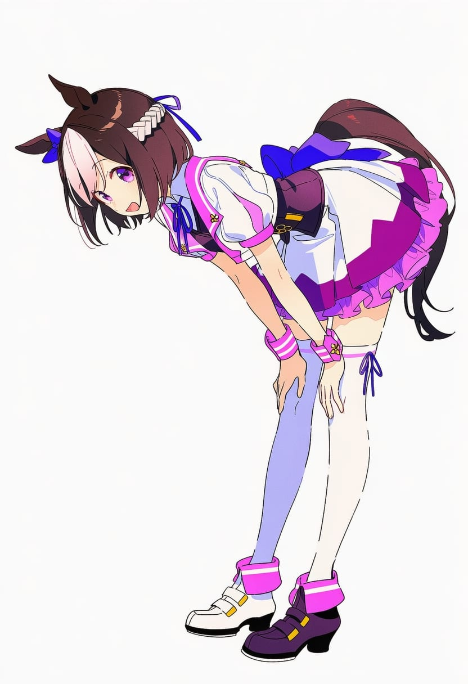

| 字段 | 内容 |
| --- | --- |
| Danbooru Tag | bent_over |
| 中文名 | 弯腰 |
| 中文含义 | 上半身明显向前弯下。 |
| 子类 | 躯干/倾斜 |
| 模特 | 1girl,special_week_(umamusume) |
| 序号 | 0048 |

## 49. leaning — 身体整体明显倾斜。

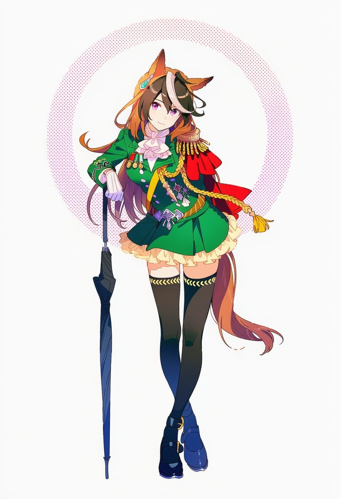

| 字段 | 内容 |
| --- | --- |
| Danbooru Tag | leaning |
| 中文名 | 倾身 |
| 中文含义 | 身体整体明显倾斜。 |
| 子类 | 躯干/倾斜 |
| 模特 | 1girl,symboli_rudolf_(umamusume) |
| 序号 | 0049 |

## 50. leaning_back — 上半身向后倾斜。

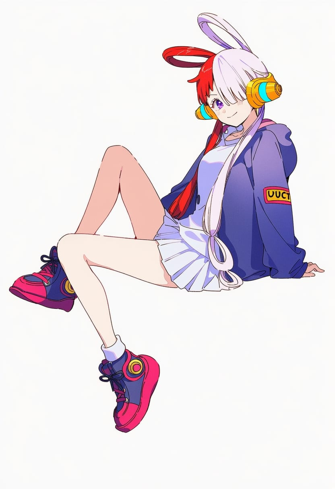

| 字段 | 内容 |
| --- | --- |
| Danbooru Tag | leaning_back |
| 中文名 | 身体后倾 |
| 中文含义 | 上半身向后倾斜。 |
| 子类 | 躯干/倾斜 |
| 模特 | 1girl,uta_(one_piece) |
| 序号 | 0050 |

## 51. leaning_forward — 上半身向前倾斜。

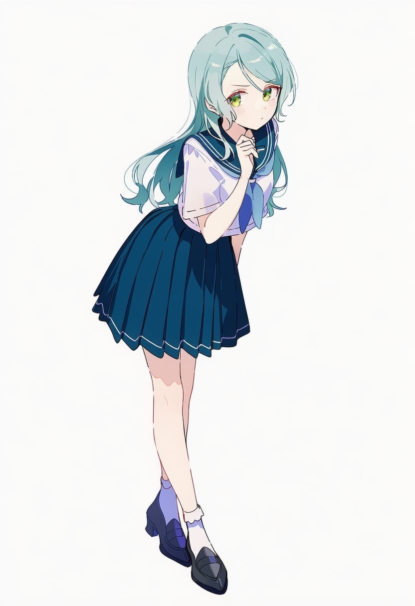

| 字段 | 内容 |
| --- | --- |
| Danbooru Tag | leaning_forward |
| 中文名 | 身体前倾 |
| 中文含义 | 上半身向前倾斜。 |
| 子类 | 躯干/倾斜 |
| 模特 | 1girl,hikawa_sayo |
| 序号 | 0051 |

## 52. leaning_to_the_side — 上半身明显向一侧倾斜。

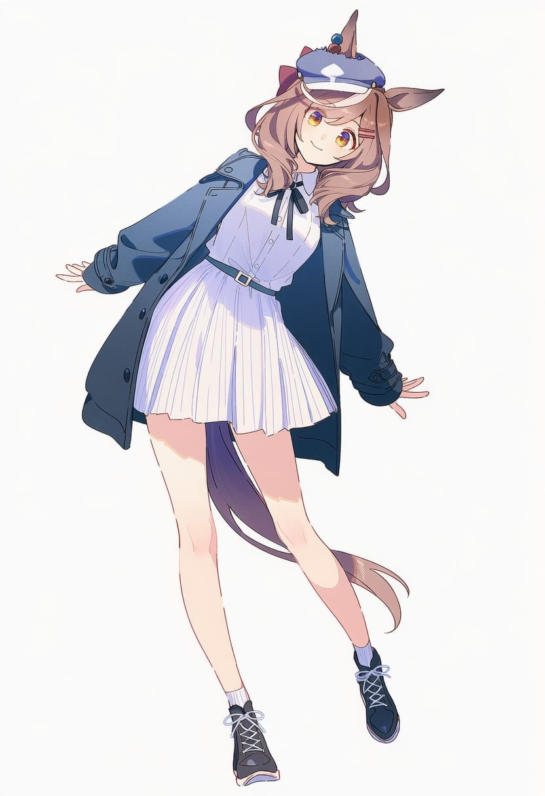

| 字段 | 内容 |
| --- | --- |
| Danbooru Tag | leaning_to_the_side |
| 中文名 | 身体侧倾 |
| 中文含义 | 上半身明显向一侧倾斜。 |
| 子类 | 躯干/倾斜 |
| 模特 | 1girl,matikanetannhauser_(umamusume) |
| 序号 | 0052 |

## 53. slouching — 身体松垮、肩背下沉的姿态。

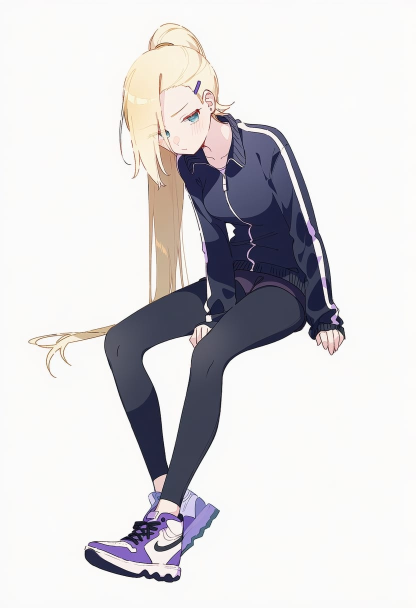

| 字段 | 内容 |
| --- | --- |
| Danbooru Tag | slouching |
| 中文名 | 懒散驼背 |
| 中文含义 | 身体松垮、肩背下沉的姿态。 |
| 子类 | 躯干/倾斜 |
| 模特 | 1girl,yamanaka_ino |
| 序号 | 0053 |

## 54. sway_back — 骨盆前移、上身后仰形成S形姿态。

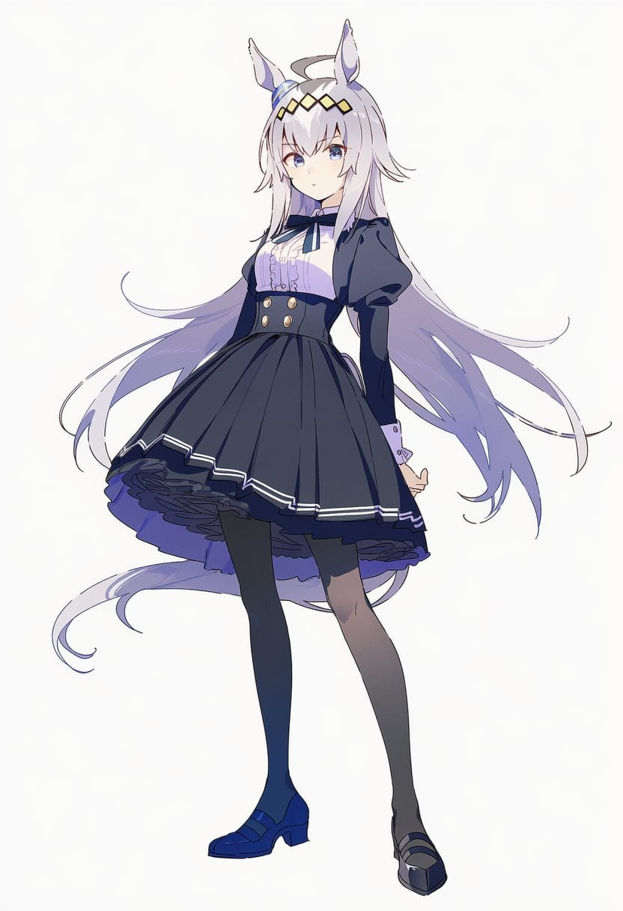

| 字段 | 内容 |
| --- | --- |
| Danbooru Tag | sway_back |
| 中文名 | 挺胯后仰 |
| 中文含义 | 骨盆前移、上身后仰形成S形姿态。 |
| 子类 | 躯干/倾斜 |
| 模特 | 1girl,oguri_cap_(umamusume) |
| 序号 | 0054 |

## 55. twisted_torso — 胸腹部相对髋部发生明显旋转。

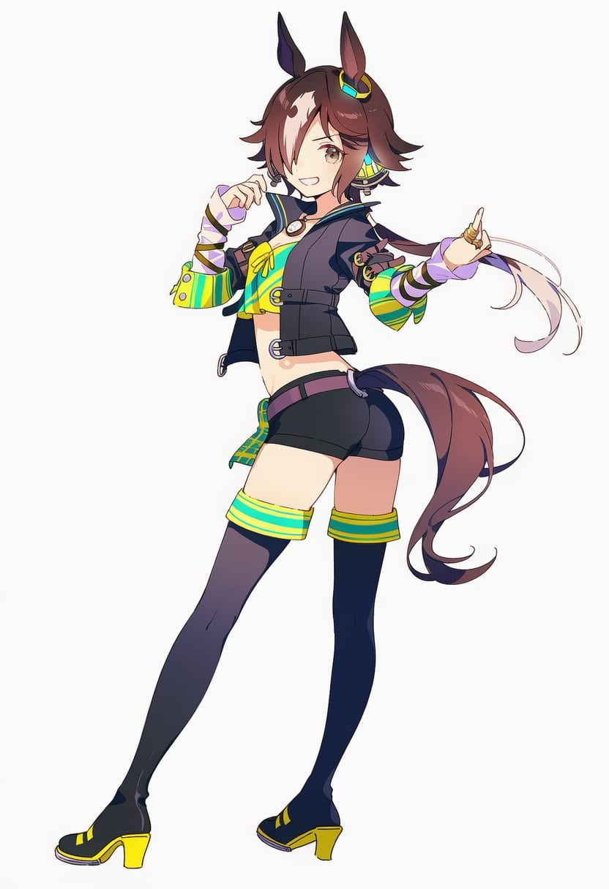

| 字段 | 内容 |
| --- | --- |
| Danbooru Tag | twisted_torso |
| 中文名 | 扭转躯干 |
| 中文含义 | 胸腹部相对髋部发生明显旋转。 |
| 子类 | 躯干/倾斜 |
| 模特 | 1girl,vodka_(umamusume) |
| 序号 | 0055 |

---
