# 手臂姿势

## 1. arm_up — 单臂举起

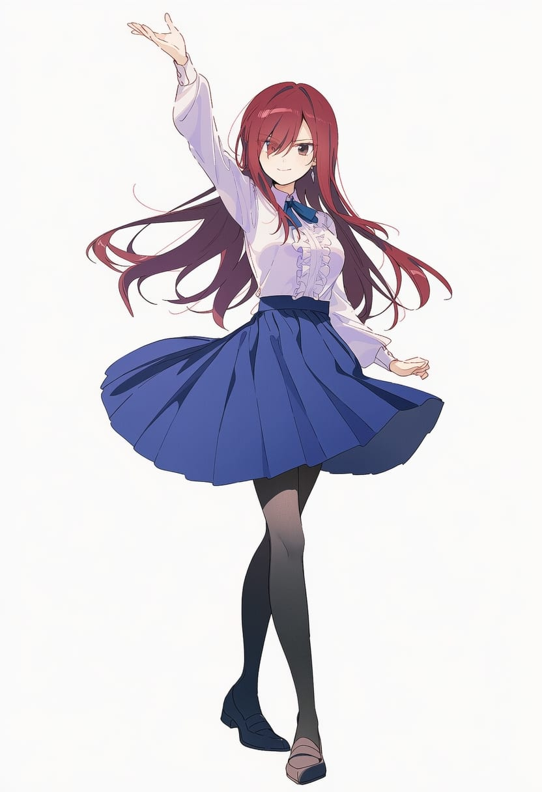

| 字段 | 内容 |
| --- | --- |
| Danbooru Tag | arm_up |
| 中文名 | 单臂举起 |
| 中文含义 | 一只手臂向上抬起。 |
| 子类 | 手臂整体位置 |
| 角色 | 1girl,erza_scarlet |
| 序号 | 0001 |

## 2. arms_up — 双臂高举

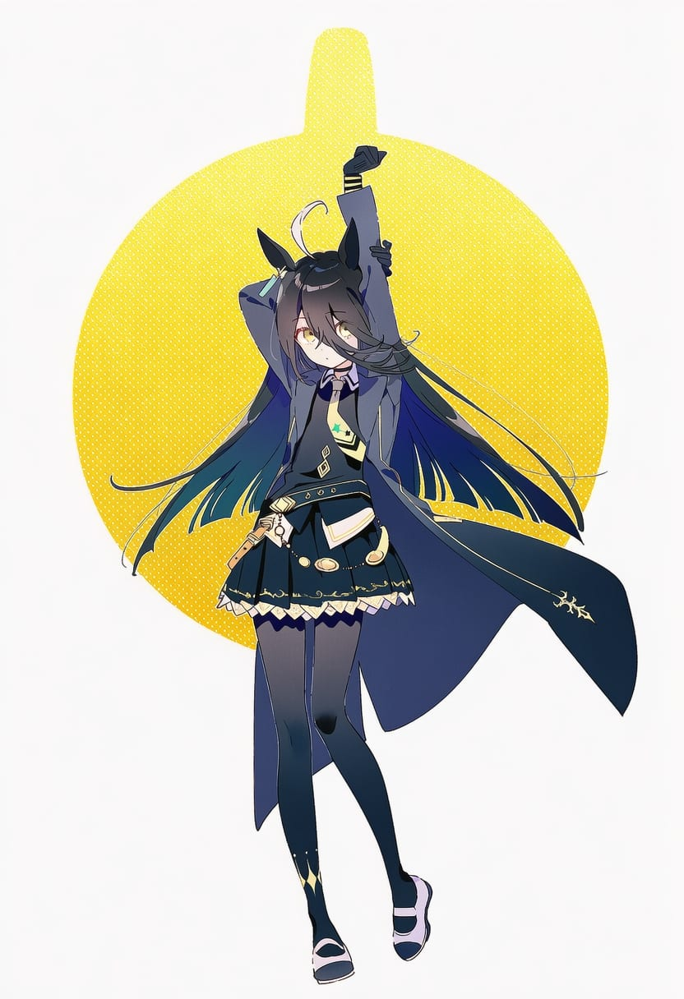

| 字段 | 内容 |
| --- | --- |
| Danbooru Tag | arms_up |
| 中文名 | 双臂高举 |
| 中文含义 | 双臂举到眼睛以上或头顶附近。 |
| 子类 | 手臂整体位置 |
| 角色 | 1girl,manhattan_cafe_(umamusume) |
| 序号 | 0002 |

## 3. hand_up — 单手举起

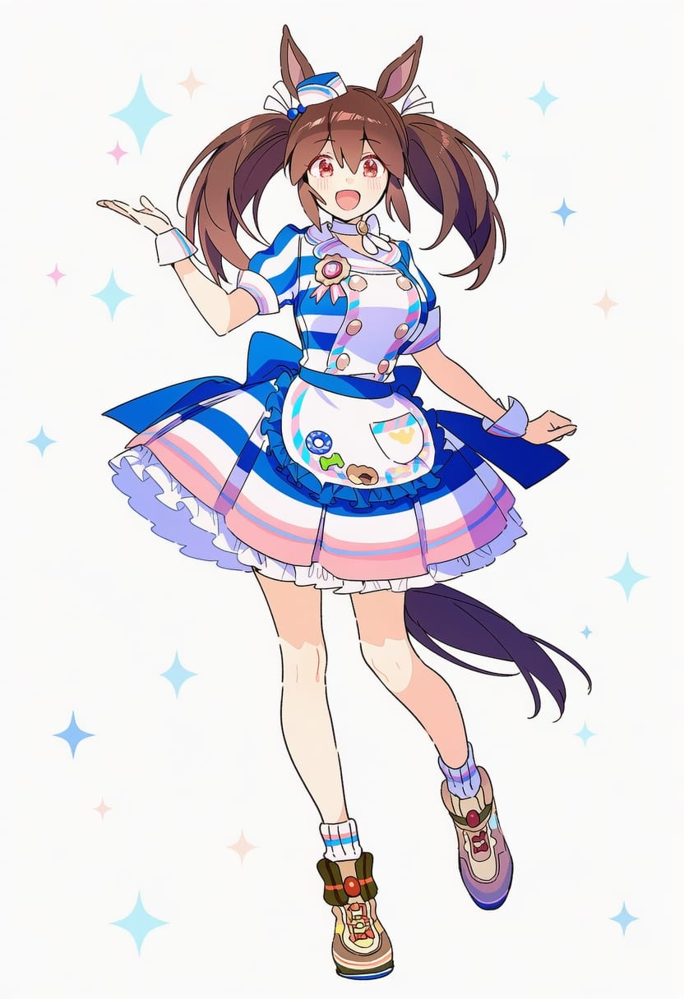

| 字段 | 内容 |
| --- | --- |
| Danbooru Tag | hand_up |
| 中文名 | 单手举起 |
| 中文含义 | 一只手抬到上半身附近或更高。 |
| 子类 | 手臂整体位置 |
| 角色 | 1girl,hishi_akebono_(umamusume) |
| 序号 | 0003 |

## 4. hands_up — 双手举起

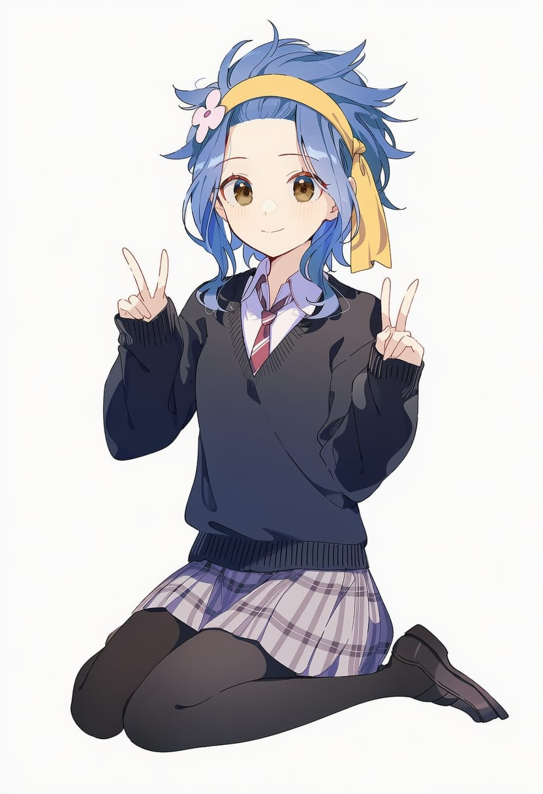

| 字段 | 内容 |
| --- | --- |
| Danbooru Tag | hands_up |
| 中文名 | 双手举起 |
| 中文含义 | 双手抬到上半身附近或更高。 |
| 子类 | 手臂整体位置 |
| 角色 | 1girl,levy_mcgarden |
| 序号 | 0004 |

## 5. arm_at_side — 单臂垂在身侧

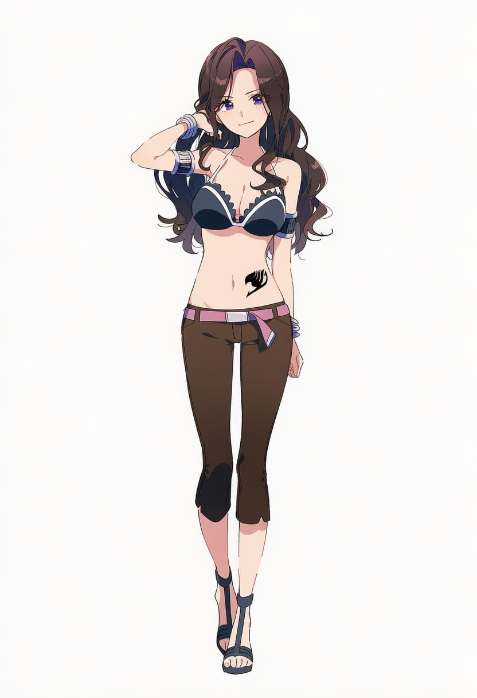

| 字段 | 内容 |
| --- | --- |
| Danbooru Tag | arm_at_side |
| 中文名 | 单臂垂在身侧 |
| 中文含义 | 一只手臂自然垂在身体侧面。 |
| 子类 | 手臂整体位置 |
| 角色 | 1girl,cana_alberona |
| 序号 | 0005 |

## 6. arms_at_sides — 双臂垂在身侧

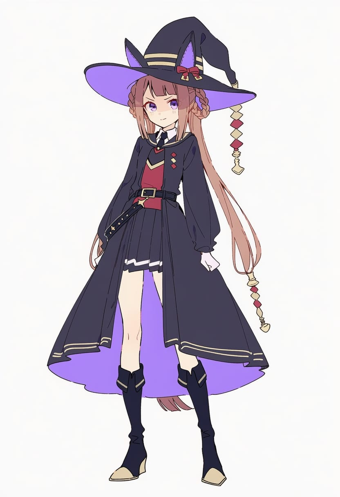

| 字段 | 内容 |
| --- | --- |
| Danbooru Tag | arms_at_sides |
| 中文名 | 双臂垂在身侧 |
| 中文含义 | 双臂自然垂在身体两侧。 |
| 子类 | 手臂整体位置 |
| 角色 | 1girl,sweep_tosho_(umamusume) |
| 序号 | 0006 |

## 7. arm_behind_head — 单臂置于脑后

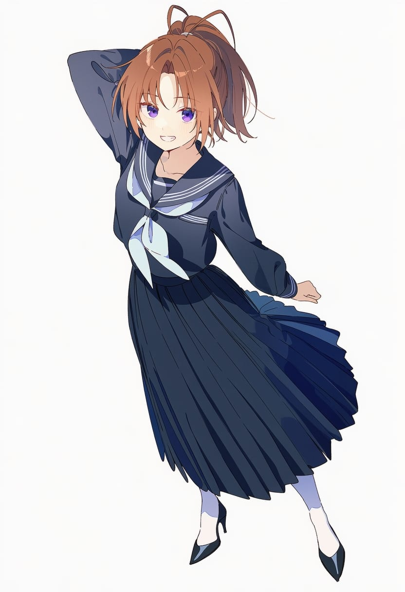

| 字段 | 内容 |
| --- | --- |
| Danbooru Tag | arm_behind_head |
| 中文名 | 单臂置于脑后 |
| 中文含义 | 一只手臂弯曲放到头后方。 |
| 子类 | 手臂整体位置 |
| 角色 | 1girl,nakagawa_natsuki |
| 序号 | 0007 |

## 8. arms_behind_head — 双臂置于脑后

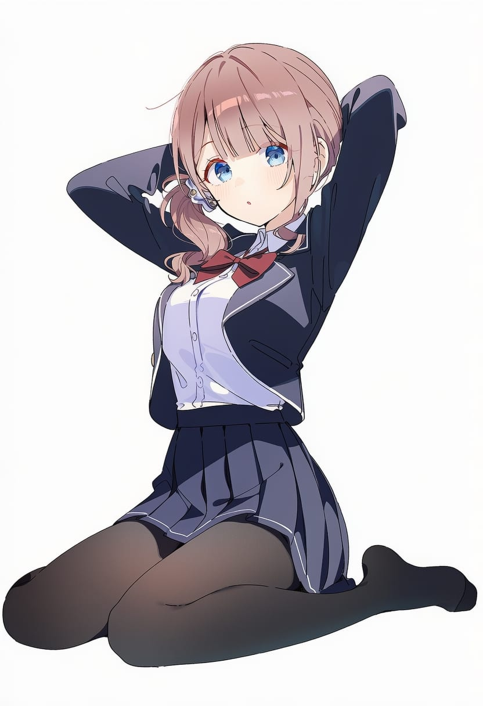

| 字段 | 内容 |
| --- | --- |
| Danbooru Tag | arms_behind_head |
| 中文名 | 双臂置于脑后 |
| 中文含义 | 双臂弯曲放在头后方。 |
| 子类 | 手臂整体位置 |
| 角色 | 1girl,mochizuki_honami |
| 序号 | 0008 |

## 9. arm_behind_back — 单臂背后

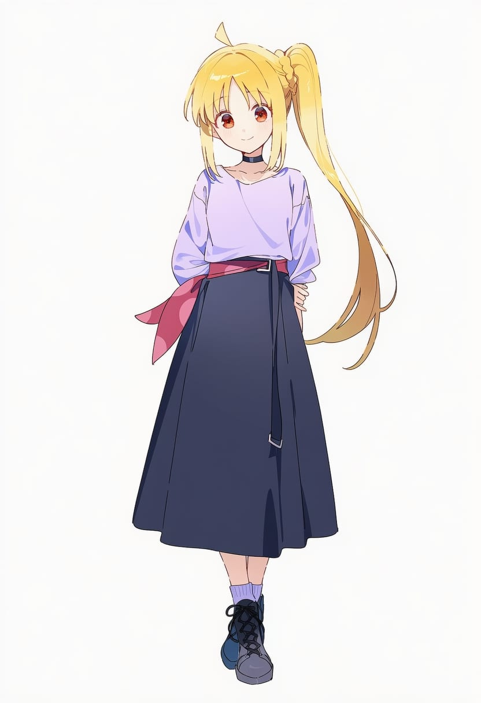

| 字段 | 内容 |
| --- | --- |
| Danbooru Tag | arm_behind_back |
| 中文名 | 单臂背后 |
| 中文含义 | 一只手臂放在背后。 |
| 子类 | 手臂整体位置 |
| 角色 | 1girl,ijichi_nijika |
| 序号 | 0009 |

## 10. arms_behind_back — 双臂背后

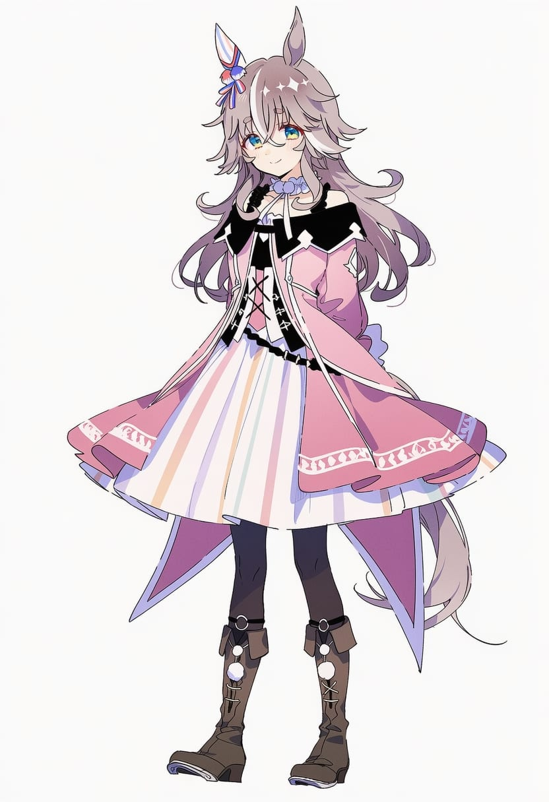

| 字段 | 内容 |
| --- | --- |
| Danbooru Tag | arms_behind_back |
| 中文名 | 双臂背后 |
| 中文含义 | 双臂都放在背后。 |
| 子类 | 手臂整体位置 |
| 角色 | 1girl,wonder_acute_(umamusume) |
| 序号 | 0010 |

## 11. crossed_arms — 双臂交叉

| 字段 | 内容 |
| --- | --- |
| Danbooru Tag | crossed_arms |
| 中文名 | 双臂交叉 |
| 中文含义 | 双臂在胸前交叉。 |
| 子类 | 手臂整体位置 |
| 角色 | 1girl,kitagawa_marin |
| 序号 | 0011 |

## 12. outstretched_arm — 单臂伸出

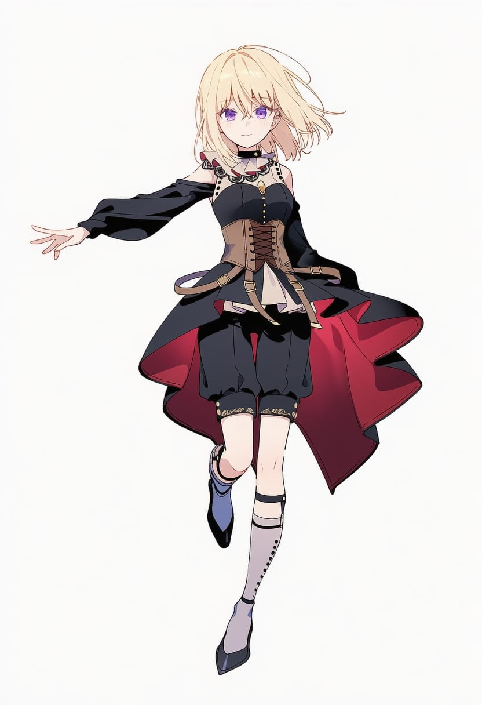

| 字段 | 内容 |
| --- | --- |
| Danbooru Tag | outstretched_arm |
| 中文名 | 单臂伸出 |
| 中文含义 | 一只手臂向外伸展。 |
| 子类 | 手臂整体位置 |
| 角色 | 1girl,misumi_uika |
| 序号 | 0012 |

## 13. outstretched_arms — 双臂伸出

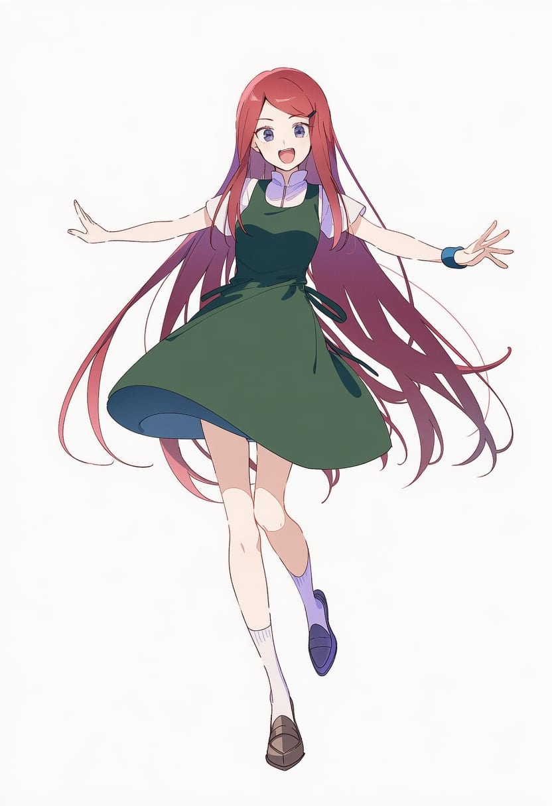

| 字段 | 内容 |
| --- | --- |
| Danbooru Tag | outstretched_arms |
| 中文名 | 双臂伸出 |
| 中文含义 | 双臂向外或向前伸展。 |
| 子类 | 手臂整体位置 |
| 角色 | 1girl,uzumaki_kushina |
| 序号 | 0013 |

## 14. spread_arms — 张开双臂

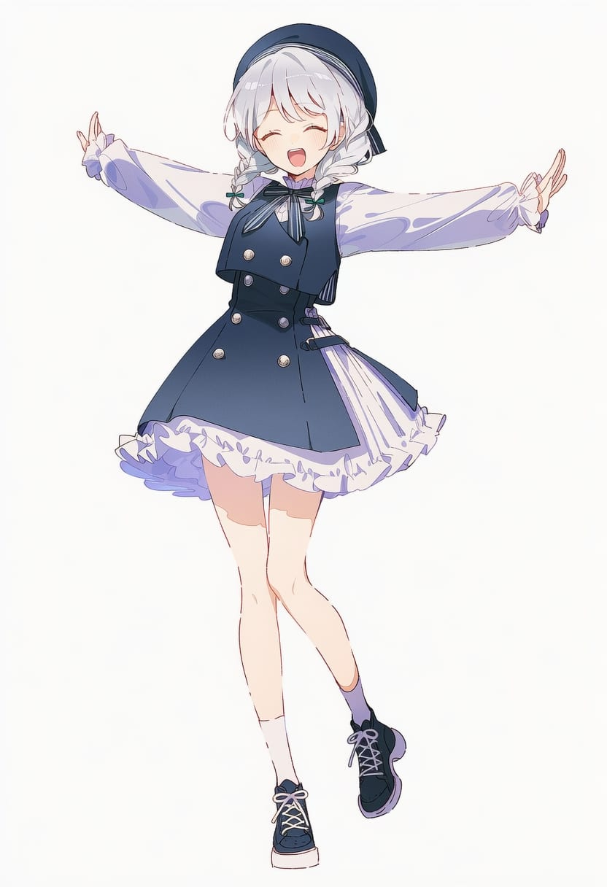

| 字段 | 内容 |
| --- | --- |
| Danbooru Tag | spread_arms |
| 中文名 | 张开双臂 |
| 中文含义 | 双臂向身体两侧大幅展开。 |
| 子类 | 手臂整体位置 |
| 角色 | 1girl,wakamiya_eve |
| 序号 | 0014 |

## 15. arms_across_body — 双臂横过身体

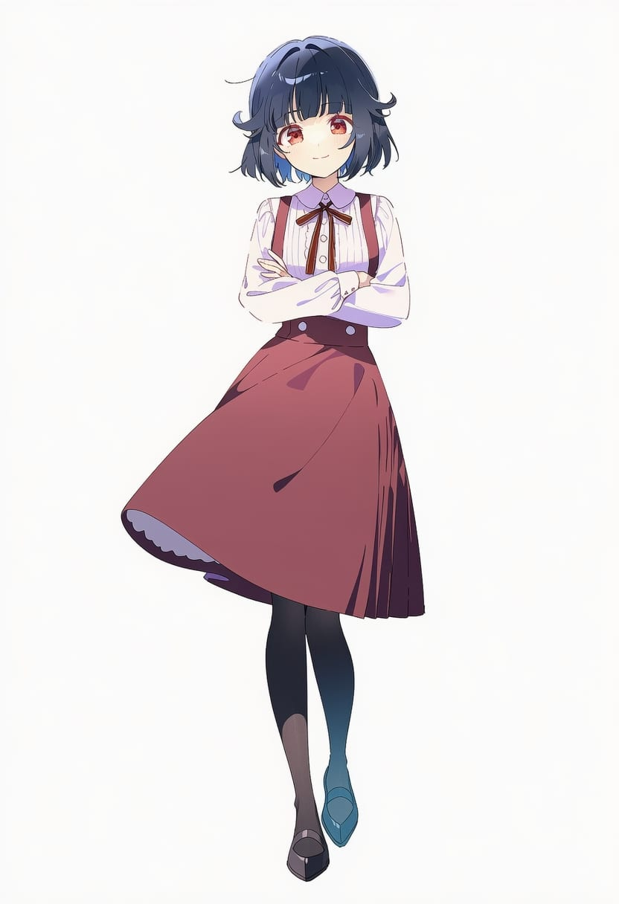

| 字段 | 内容 |
| --- | --- |
| Danbooru Tag | arms_across_body |
| 中文名 | 双臂横过身体 |
| 中文含义 | 双臂横向挡在身体前方。 |
| 子类 | 手臂整体位置 |
| 角色 | 1girl,ushigome_rimi |
| 序号 | 0015 |

## 16. arm_across_waist — 手臂横过腰部

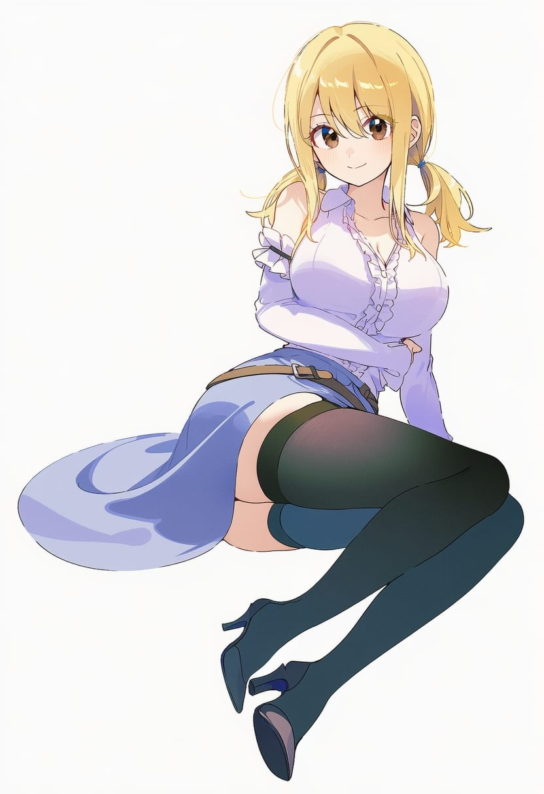

| 字段 | 内容 |
| --- | --- |
| Danbooru Tag | arm_across_waist |
| 中文名 | 手臂横过腰部 |
| 中文含义 | 一只手臂横放在自己的腰前。 |
| 子类 | 手臂整体位置 |
| 角色 | 1girl,lucy_heartfilia |
| 序号 | 0016 |

## 17. arm_under_breasts — 单臂托在胸下

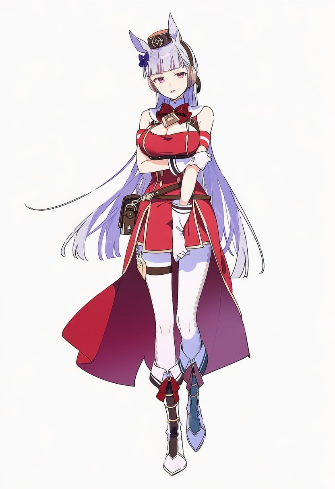

| 字段 | 内容 |
| --- | --- |
| Danbooru Tag | arm_under_breasts |
| 中文名 | 单臂托在胸下 |
| 中文含义 | 一只上臂位于胸部下方。 |
| 子类 | 手臂整体位置 |
| 角色 | 1girl,gold_ship_(umamusume) |
| 序号 | 0017 |

## 18. arms_under_breasts — 双臂托在胸下

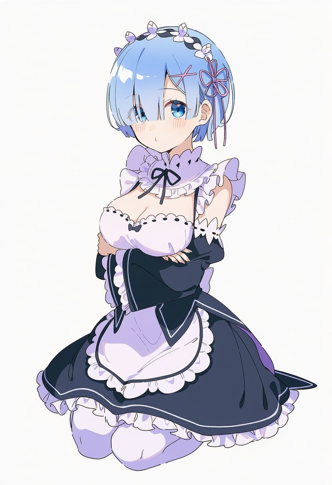

| 字段 | 内容 |
| --- | --- |
| Danbooru Tag | arms_under_breasts |
| 中文名 | 双臂托在胸下 |
| 中文含义 | 双臂位于胸部下方，常与抱臂同时出现。 |
| 子类 | 手臂整体位置 |
| 角色 | 1girl,rem_(re:zero) |
| 序号 | 0018 |

## 19. hand_to_head — 手靠近头部

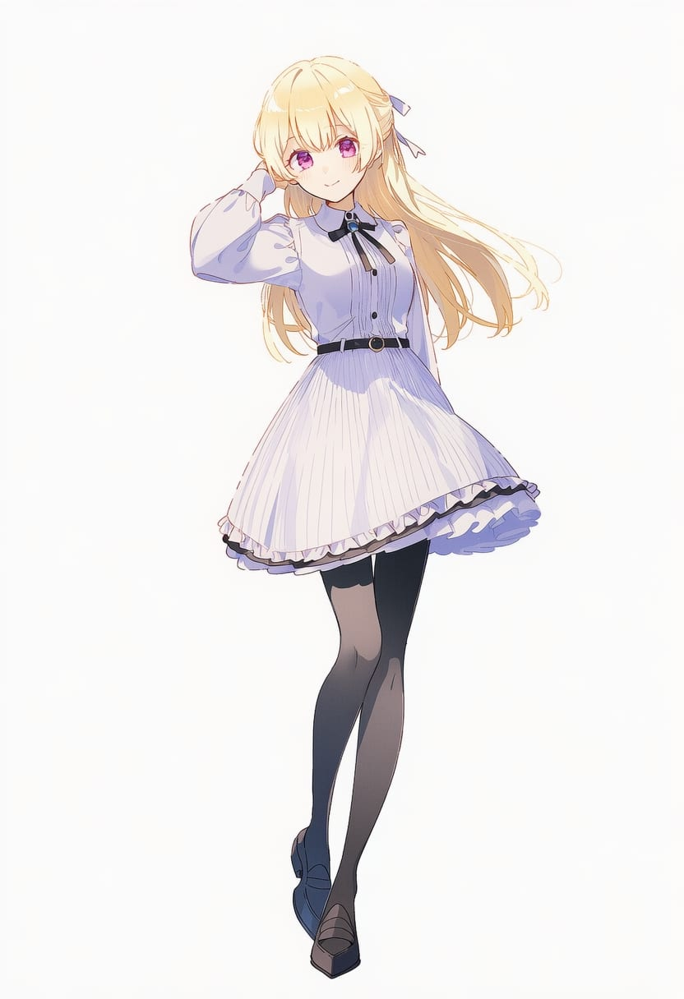

| 字段 | 内容 |
| --- | --- |
| Danbooru Tag | hand_to_head |
| 中文名 | 手靠近头部 |
| 中文含义 | 一只手靠近自己的头部，不要求实际接触。 |
| 子类 | 头脸/头发位置 |
| 角色 | 1girl,shirasagi_chisato |
| 序号 | 0019 |

## 20. hand_in_own_hair — 单手插入头发

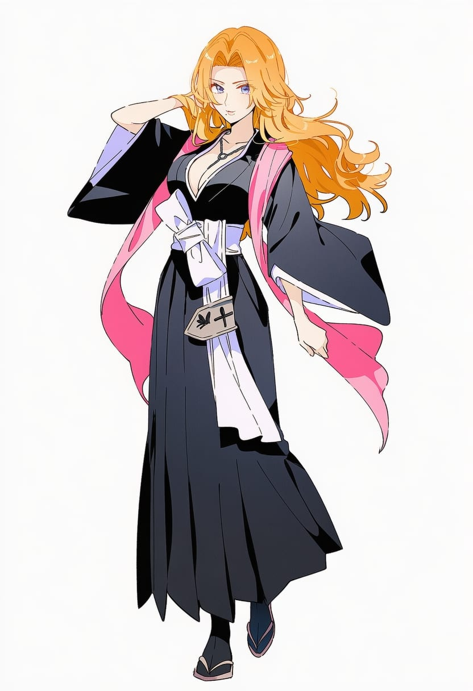

| 字段 | 内容 |
| --- | --- |
| Danbooru Tag | hand_in_own_hair |
| 中文名 | 单手插入头发 |
| 中文含义 | 一只手伸进或抓入自己的头发。 |
| 子类 | 头脸/头发位置 |
| 角色 | 1girl,matsumoto_rangiku |
| 序号 | 0020 |

## 21. hands_in_own_hair — 双手插入头发

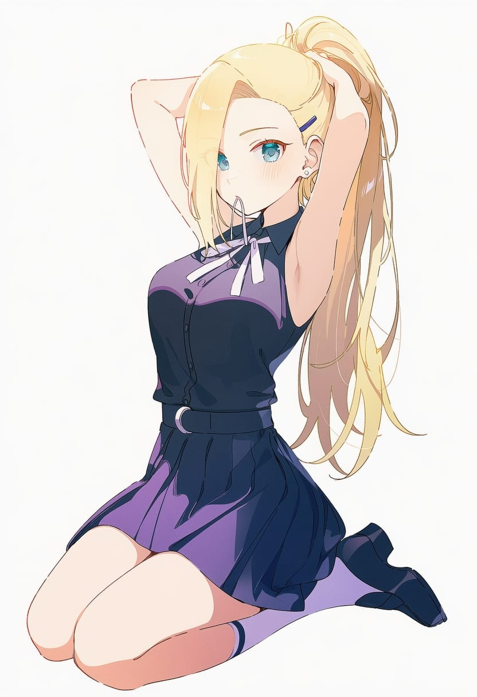

| 字段 | 内容 |
| --- | --- |
| Danbooru Tag | hands_in_own_hair |
| 中文名 | 双手插入头发 |
| 中文含义 | 双手伸进或抓入自己的头发。 |
| 子类 | 头脸/头发位置 |
| 角色 | 1girl,yamanaka_ino |
| 序号 | 0021 |

## 22. hand_on_own_head — 单手放头上

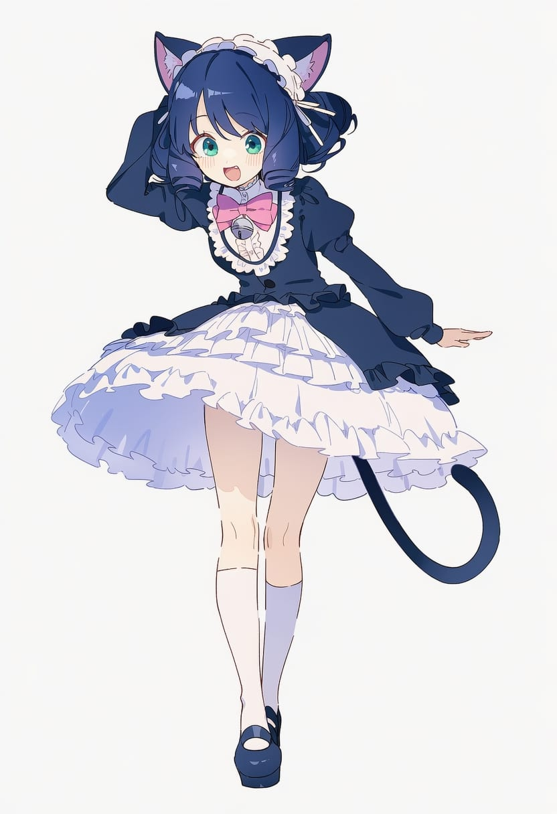

| 字段 | 内容 |
| --- | --- |
| Danbooru Tag | hand_on_own_head |
| 中文名 | 单手放头上 |
| 中文含义 | 一只手放在自己的头部。 |
| 子类 | 头脸/头发位置 |
| 角色 | 1girl,cyan_(show_by_rock!!) |
| 序号 | 0022 |

## 23. hands_on_own_head — 双手放头上

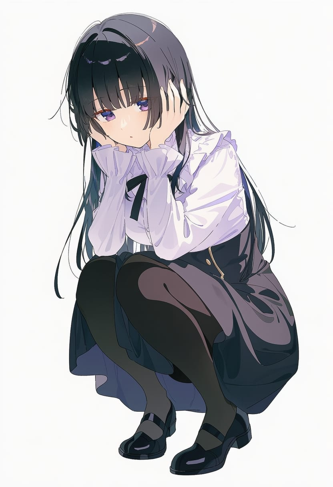

| 字段 | 内容 |
| --- | --- |
| Danbooru Tag | hands_on_own_head |
| 中文名 | 双手放头上 |
| 中文含义 | 双手放在自己的头部。 |
| 子类 | 头脸/头发位置 |
| 角色 | 1girl,shirokane_rinko |
| 序号 | 0023 |

## 24. hand_on_own_face — 单手摸脸

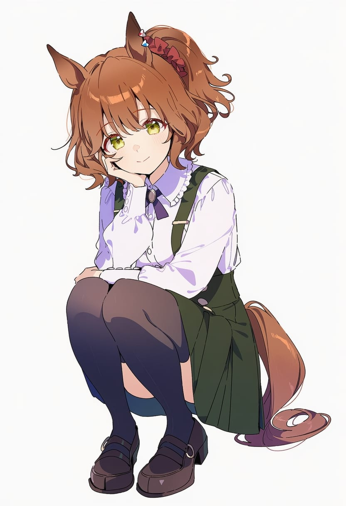

| 字段 | 内容 |
| --- | --- |
| Danbooru Tag | hand_on_own_face |
| 中文名 | 单手摸脸 |
| 中文含义 | 一只手放在自己的脸上。 |
| 子类 | 头脸/头发位置 |
| 角色 | 1girl,aston_machan_(umamusume) |
| 序号 | 0024 |

## 25. hands_on_own_face — 双手捧脸

| 字段 | 内容 |
| --- | --- |
| Danbooru Tag | hands_on_own_face |
| 中文名 | 双手捧脸 |
| 中文含义 | 双手放在自己的脸部。 |
| 子类 | 头脸/头发位置 |
| 角色 | 1girl,charlotte_linlin |
| 序号 | 0025 |

## 26. hand_on_own_cheek — 单手托腮

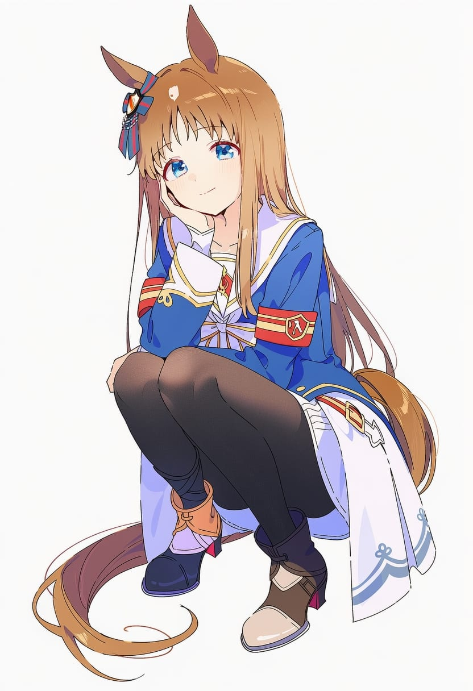

| 字段 | 内容 |
| --- | --- |
| Danbooru Tag | hand_on_own_cheek |
| 中文名 | 单手托腮 |
| 中文含义 | 一只手放在自己的脸颊上。 |
| 子类 | 头脸/头发位置 |
| 角色 | 1girl,grass_wonder_(umamusume) |
| 序号 | 0026 |

## 27. hands_on_own_cheeks — 双手捧脸颊

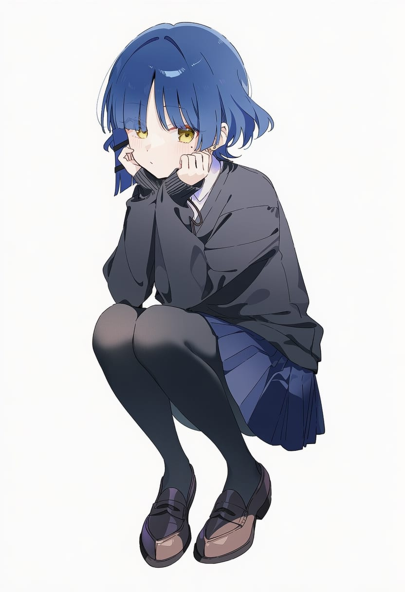

| 字段 | 内容 |
| --- | --- |
| Danbooru Tag | hands_on_own_cheeks |
| 中文名 | 双手捧脸颊 |
| 中文含义 | 双手分别放在自己的两侧脸颊。 |
| 子类 | 头脸/头发位置 |
| 角色 | 1girl,yamada_ryo |
| 序号 | 0027 |

## 28. hand_on_own_chin — 单手托下巴

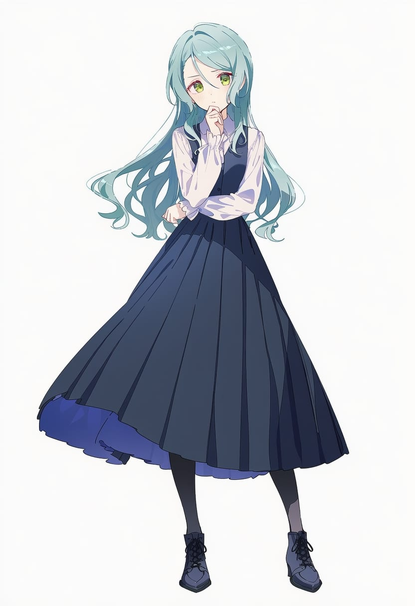

| 字段 | 内容 |
| --- | --- |
| Danbooru Tag | hand_on_own_chin |
| 中文名 | 单手托下巴 |
| 中文含义 | 一只手放在自己的下巴上。 |
| 子类 | 头脸/头发位置 |
| 角色 | 1girl,hikawa_sayo |
| 序号 | 0028 |

## 29. hands_on_own_chin — 双手托下巴

| 字段 | 内容 |
| --- | --- |
| Danbooru Tag | hands_on_own_chin |
| 中文名 | 双手托下巴 |
| 中文含义 | 双手一起托住自己的下巴。 |
| 子类 | 头脸/头发位置 |
| 角色 | 1girl,kusajishi_yachiru |
| 序号 | 0029 |

## 30. hand_on_own_neck — 单手摸脖子

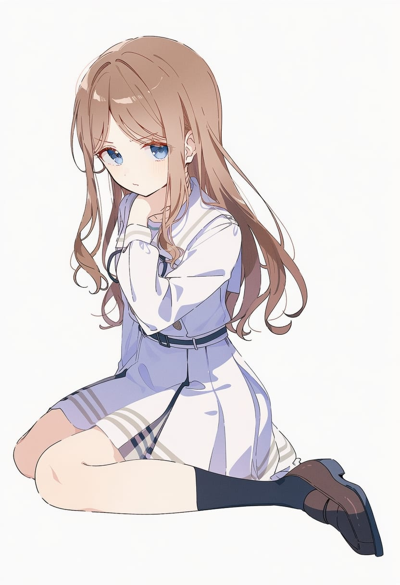

| 字段 | 内容 |
| --- | --- |
| Danbooru Tag | hand_on_own_neck |
| 中文名 | 单手摸脖子 |
| 中文含义 | 一只手放在自己的颈部。 |
| 子类 | 头脸/头发位置 |
| 角色 | 1girl,nagasaki_soyo |
| 序号 | 0030 |

## 31. hands_on_own_neck — 双手摸脖子

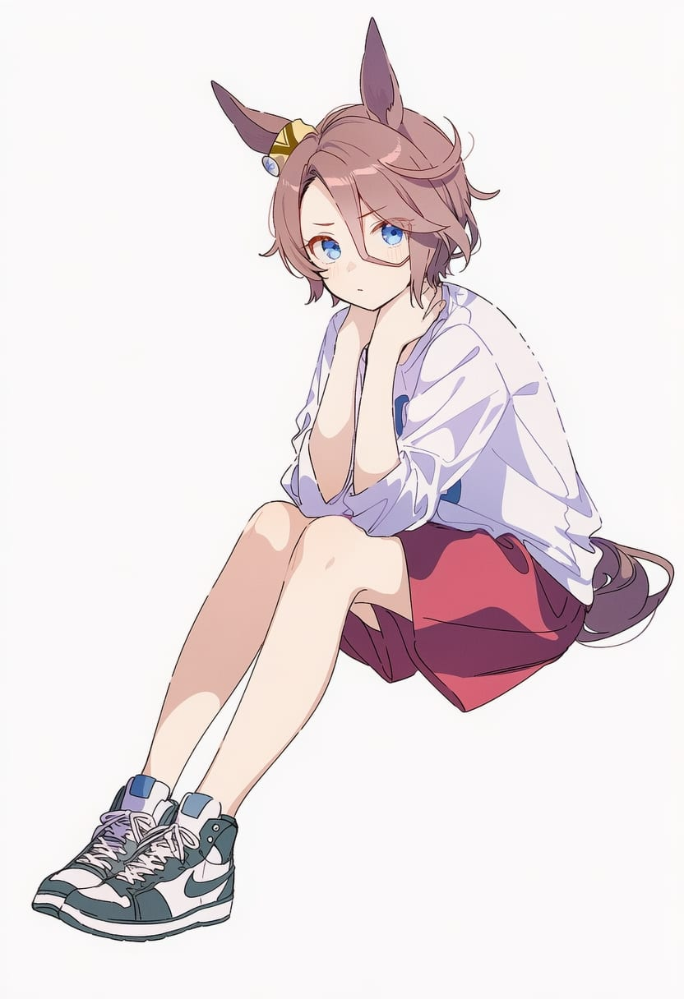

| 字段 | 内容 |
| --- | --- |
| Danbooru Tag | hands_on_own_neck |
| 中文名 | 双手摸脖子 |
| 中文含义 | 双手放在自己的颈部。 |
| 子类 | 头脸/头发位置 |
| 角色 | 1girl,narita_taishin_(umamusume) |
| 序号 | 0031 |

## 32. hand_on_own_shoulder — 单手搭肩

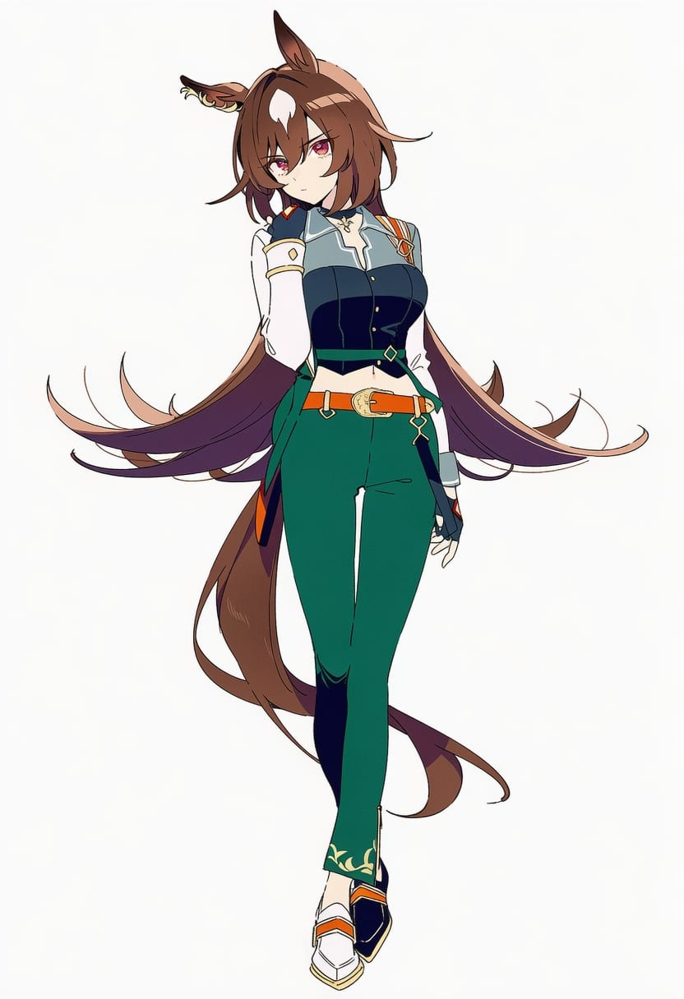

| 字段 | 内容 |
| --- | --- |
| Danbooru Tag | hand_on_own_shoulder |
| 中文名 | 单手搭肩 |
| 中文含义 | 一只手放在自己的肩膀上。 |
| 子类 | 头脸/头发位置 |
| 角色 | 1girl,sirius_symboli_(umamusume) |
| 序号 | 0032 |

## 33. hand_on_own_chest — 单手放胸前

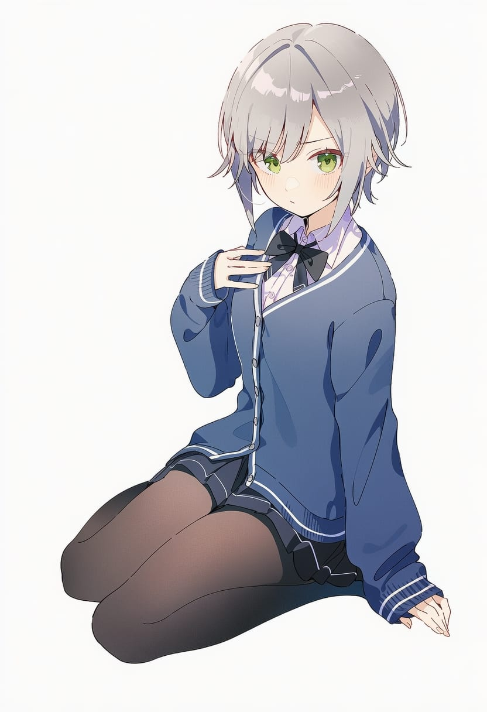

| 字段 | 内容 |
| --- | --- |
| Danbooru Tag | hand_on_own_chest |
| 中文名 | 单手放胸前 |
| 中文含义 | 一只手自然放在自己的胸口。 |
| 子类 | 胸腹/腰胯位置 |
| 角色 | 1girl,hinomori_shiho |
| 序号 | 0033 |

## 34. hands_on_own_chest — 双手放胸前

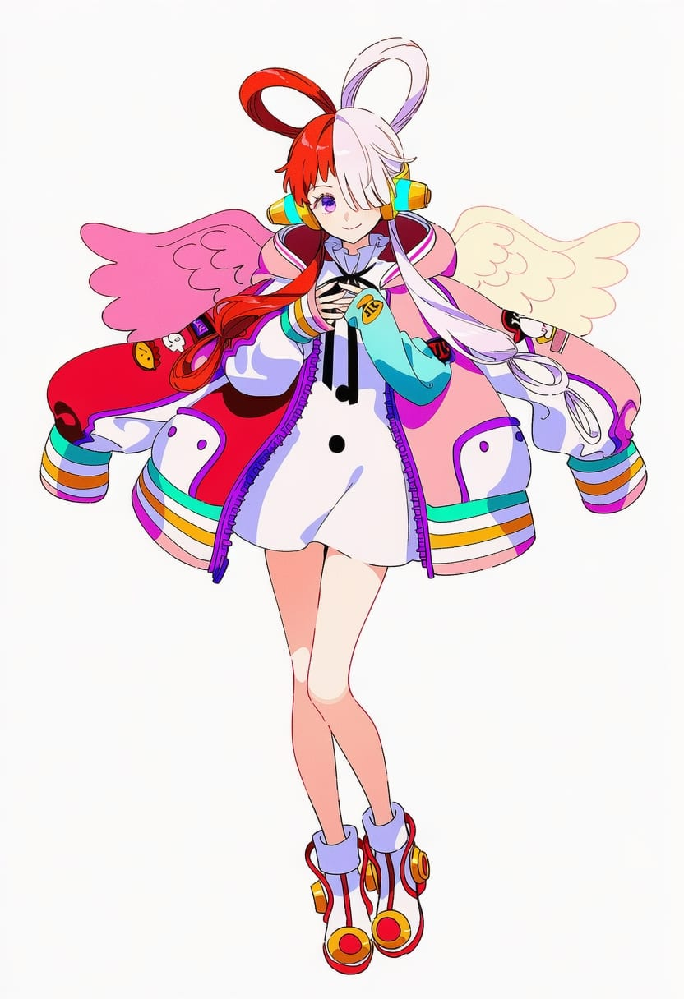

| 字段 | 内容 |
| --- | --- |
| Danbooru Tag | hands_on_own_chest |
| 中文名 | 双手放胸前 |
| 中文含义 | 双手放在自己的胸口。 |
| 子类 | 胸腹/腰胯位置 |
| 角色 | 1girl,uta_(one_piece) |
| 序号 | 0034 |

## 35. hand_on_own_stomach — 单手放腹部

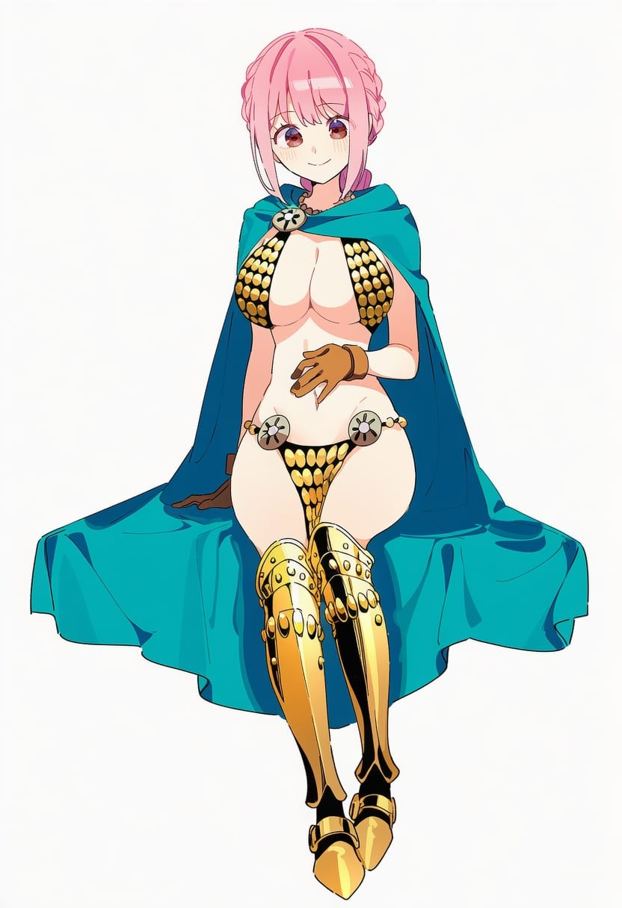

| 字段 | 内容 |
| --- | --- |
| Danbooru Tag | hand_on_own_stomach |
| 中文名 | 单手放腹部 |
| 中文含义 | 一只手放在自己的腹部。 |
| 子类 | 胸腹/腰胯位置 |
| 角色 | 1girl,rebecca_(one_piece) |
| 序号 | 0035 |

## 36. hands_on_own_stomach — 双手放腹部

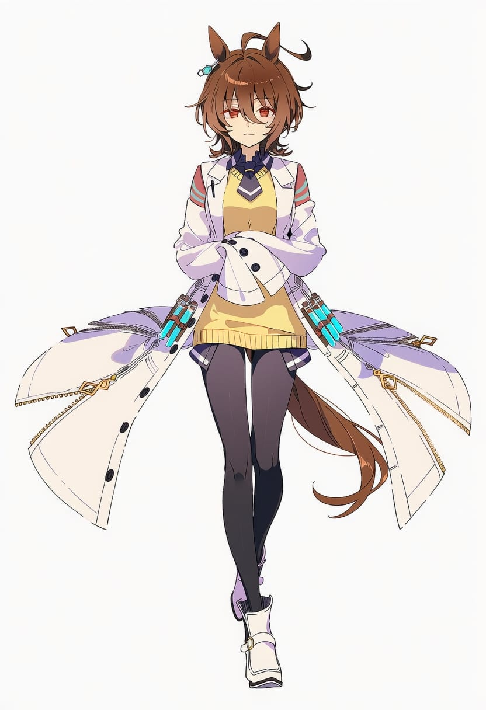

| 字段 | 内容 |
| --- | --- |
| Danbooru Tag | hands_on_own_stomach |
| 中文名 | 双手放腹部 |
| 中文含义 | 双手放在自己的腹部。 |
| 子类 | 胸腹/腰胯位置 |
| 角色 | 1girl,agnes_tachyon_(umamusume) |
| 序号 | 0036 |

## 37. hand_on_own_hip — 单手叉腰

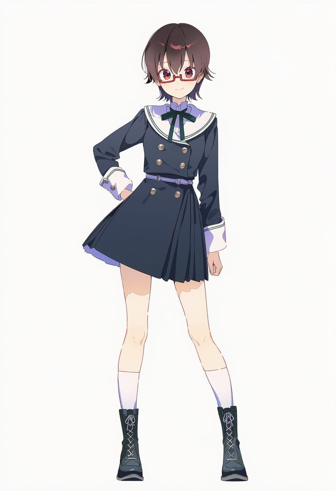

| 字段 | 内容 |
| --- | --- |
| Danbooru Tag | hand_on_own_hip |
| 中文名 | 单手叉腰 |
| 中文含义 | 一只手放在自己的髋部或腰侧。 |
| 子类 | 胸腹/腰胯位置 |
| 角色 | 1girl,manabe_nodoka |
| 序号 | 0037 |

## 38. hands_on_own_hips — 双手叉腰

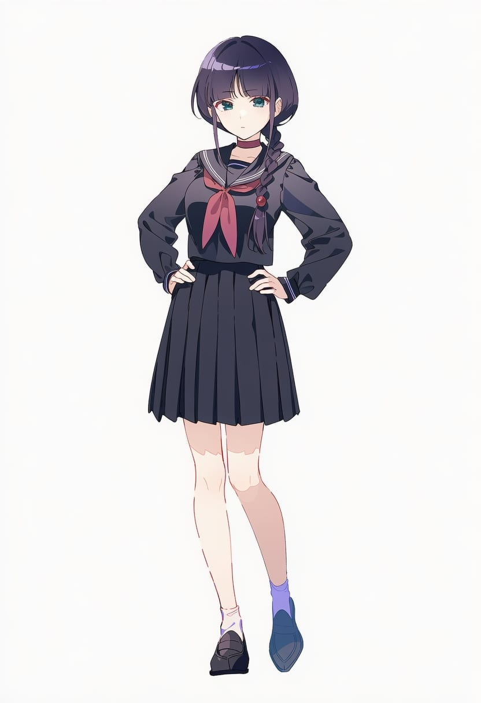

| 字段 | 内容 |
| --- | --- |
| Danbooru Tag | hands_on_own_hips |
| 中文名 | 双手叉腰 |
| 中文含义 | 双手分别放在自己的两侧髋部。 |
| 子类 | 胸腹/腰胯位置 |
| 角色 | 1girl,kurotsuchi_nemu |
| 序号 | 0038 |

## 39. hand_on_own_arm — 手搭自己手臂

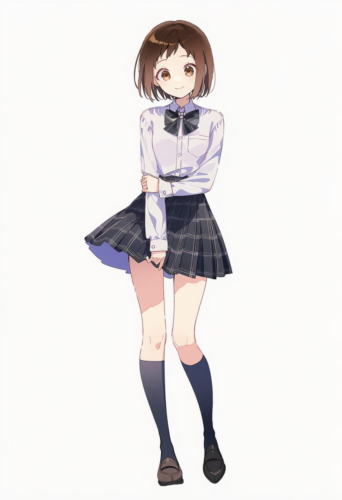

| 字段 | 内容 |
| --- | --- |
| Danbooru Tag | hand_on_own_arm |
| 中文名 | 手搭自己手臂 |
| 中文含义 | 一只手放在自己的另一条手臂上。 |
| 子类 | 自身手臂/口袋 |
| 角色 | 1girl,hazawa_tsugumi |
| 序号 | 0039 |

## 40. hands_on_own_arms — 双手搭自己双臂

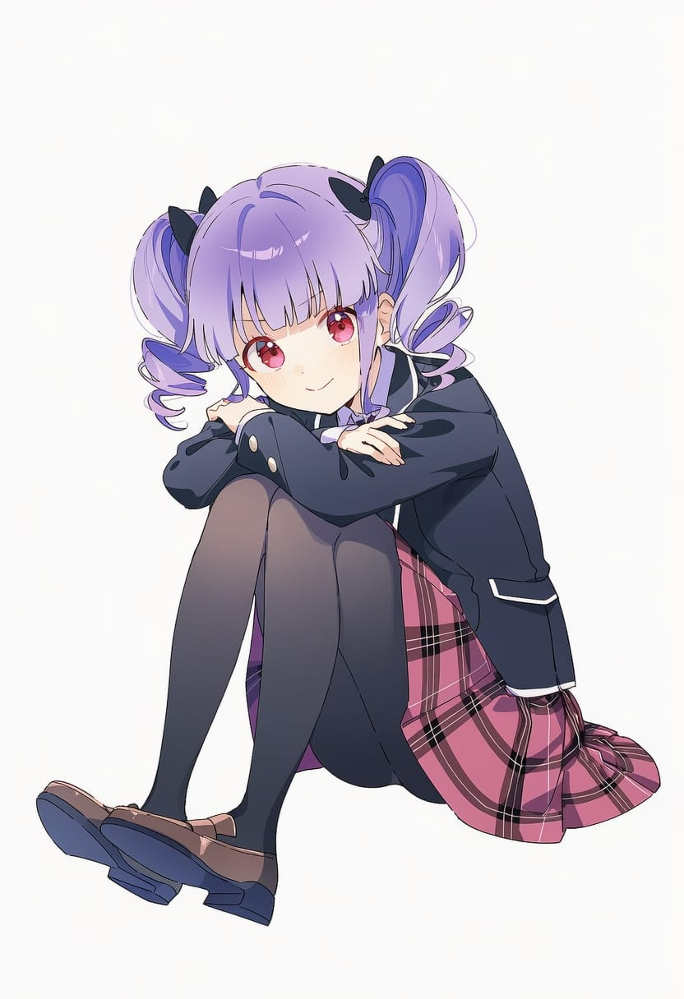

| 字段 | 内容 |
| --- | --- |
| Danbooru Tag | hands_on_own_arms |
| 中文名 | 双手搭自己双臂 |
| 中文含义 | 双手分别接触自己的手臂。 |
| 子类 | 自身手臂/口袋 |
| 角色 | 1girl,udagawa_ako |
| 序号 | 0040 |

## 41. hand_on_own_elbow — 手扶自己手肘

| 字段 | 内容 |
| --- | --- |
| Danbooru Tag | hand_on_own_elbow |
| 中文名 | 手扶自己手肘 |
| 中文含义 | 一只手放在自己的另一侧手肘。 |
| 子类 | 自身手臂/口袋 |
| 角色 | 1girl,t.m.opera_o(umamusume) |
| 序号 | 0041 |

## 42. hand_on_own_wrist — 手搭自己手腕

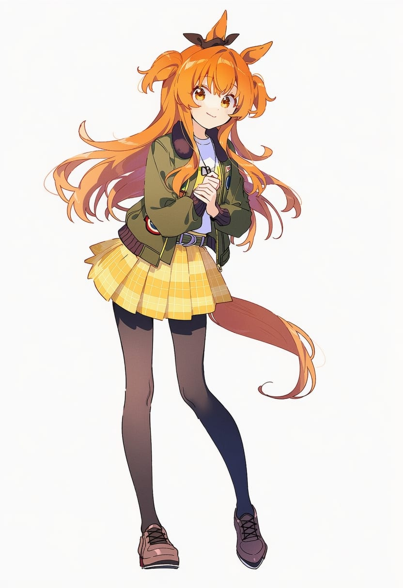

| 字段 | 内容 |
| --- | --- |
| Danbooru Tag | hand_on_own_wrist |
| 中文名 | 手搭自己手腕 |
| 中文含义 | 一只手放在自己的另一侧手腕。 |
| 子类 | 自身手臂/口袋 |
| 角色 | 1girl,mayano_top_gun_(umamusume) |
| 序号 | 0042 |

## 43. holding_own_wrist — 握住自己手腕

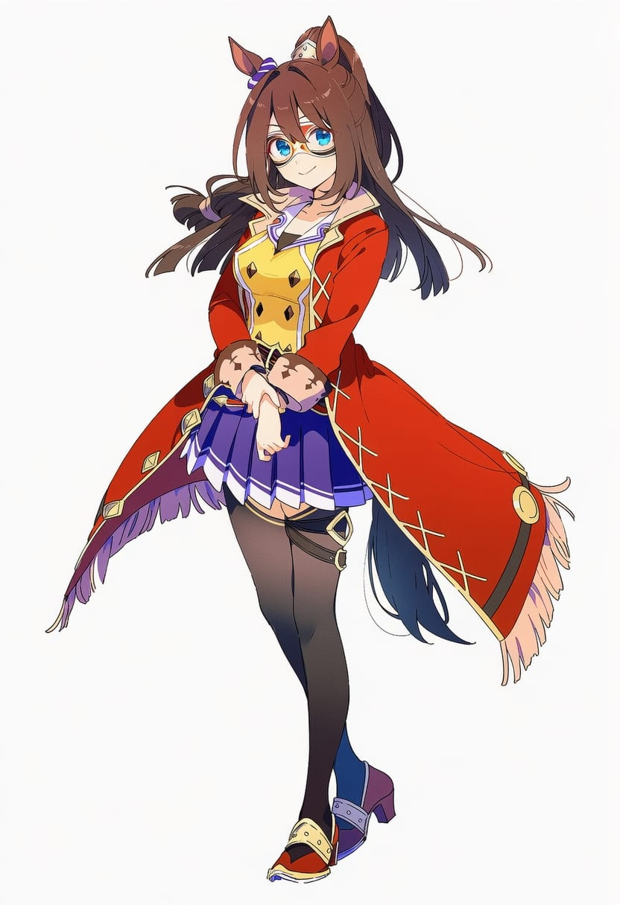

| 字段 | 内容 |
| --- | --- |
| Danbooru Tag | holding_own_wrist |
| 中文名 | 握住自己手腕 |
| 中文含义 | 一只手握住自己的另一侧手腕或前臂。 |
| 子类 | 自身手臂/口袋 |
| 角色 | 1girl,el_condor_pasa_(umamusume) |
| 序号 | 0043 |

## 44. hands_in_opposite_sleeves — 双手藏进对侧袖子

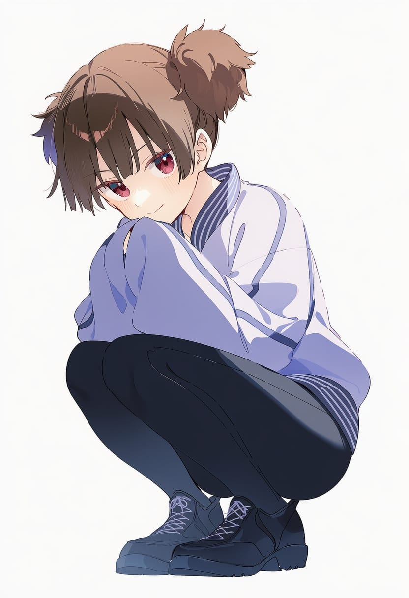

| 字段 | 内容 |
| --- | --- |
| Danbooru Tag | hands_in_opposite_sleeves |
| 中文名 | 双手藏进对侧袖子 |
| 中文含义 | 双手分别伸进相对一侧的袖子里。 |
| 子类 | 自身手臂/口袋 |
| 角色 | 1girl,suzuki_jun |
| 序号 | 0044 |

## 45. hand_in_pocket — 单手插兜

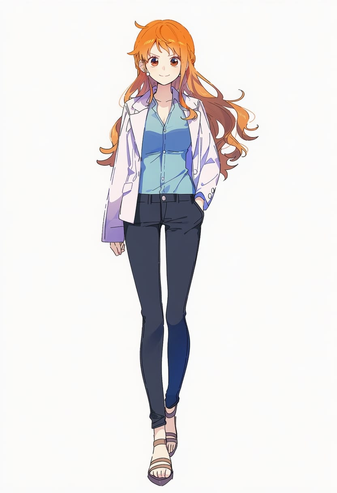

| 字段 | 内容 |
| --- | --- |
| Danbooru Tag | hand_in_pocket |
| 中文名 | 单手插兜 |
| 中文含义 | 一只手插进一个口袋。 |
| 子类 | 自身手臂/口袋 |
| 角色 | 1girl,nami_(one_piece) |
| 序号 | 0045 |

## 46. hands_in_pocket — 双手同兜

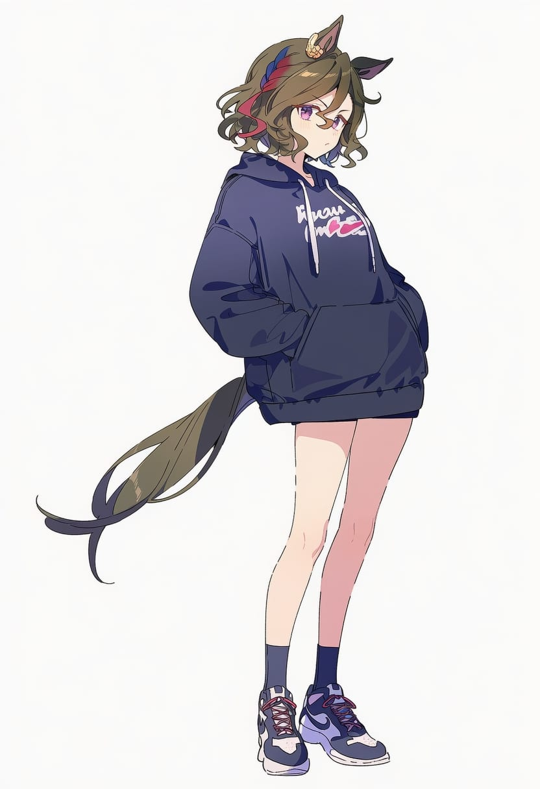

| 字段 | 内容 |
| --- | --- |
| Danbooru Tag | hands_in_pocket |
| 中文名 | 双手同兜 |
| 中文含义 | 双手插进同一个口袋，常见于连帽衫袋。 |
| 子类 | 自身手臂/口袋 |
| 角色 | 1girl,nico_robin |
| 序号 | 0046 |

## 47. hands_in_pockets — 双手插兜

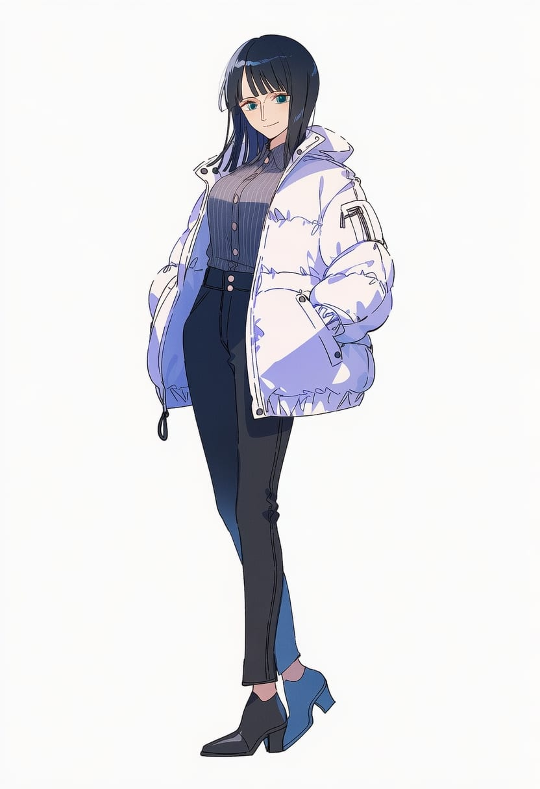

| 字段 | 内容 |
| --- | --- |
| Danbooru Tag | hands_in_pockets |
| 中文名 | 双手插兜 |
| 中文含义 | 双手分别插进两个口袋。 |
| 子类 | 自身手臂/口袋 |
| 角色 | 1girl,tap_dance_city_(umamusume) |
| 序号 | 0047 |

## 48. hand_on_own_thigh — 单手放大腿

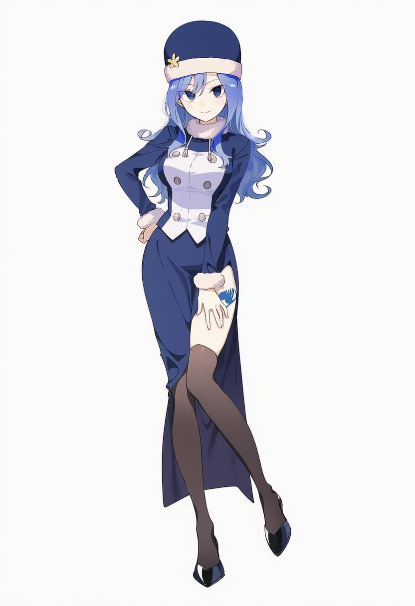

| 字段 | 内容 |
| --- | --- |
| Danbooru Tag | hand_on_own_thigh |
| 中文名 | 单手放大腿 |
| 中文含义 | 一只手放在自己的大腿上。 |
| 子类 | 腿部/坐姿手位 |
| 角色 | 1girl,juvia_lockser |
| 序号 | 0048 |

## 49. hands_on_own_thighs — 双手放双腿

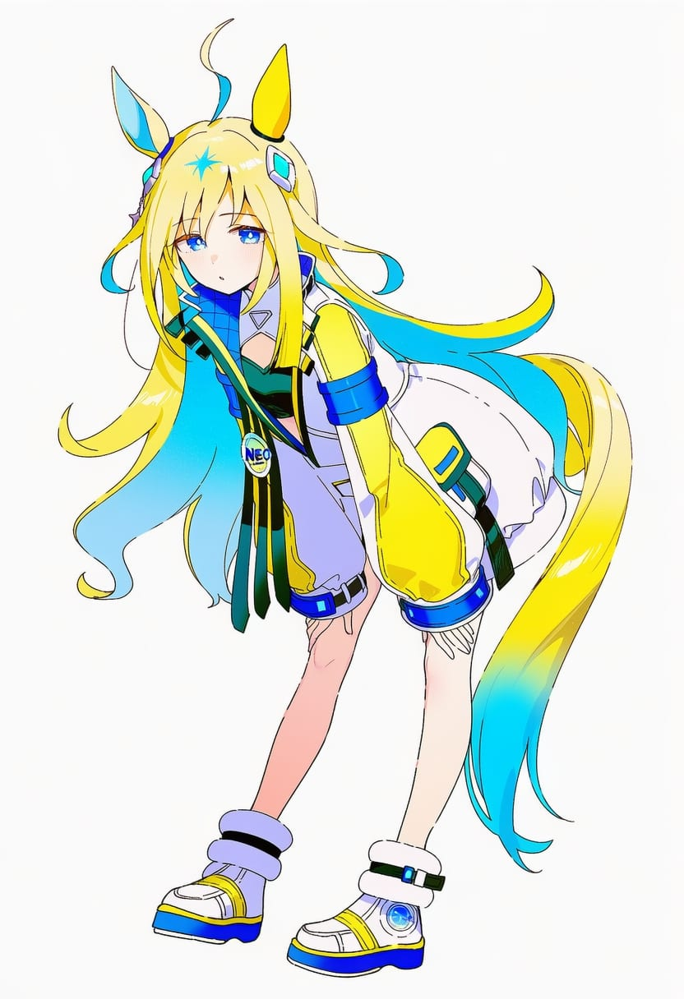

| 字段 | 内容 |
| --- | --- |
| Danbooru Tag | hands_on_own_thighs |
| 中文名 | 双手放双腿 |
| 中文含义 | 双手分别放在自己的两侧大腿上。 |
| 子类 | 腿部/坐姿手位 |
| 角色 | 1girl,neo_universe_(umamusume) |
| 序号 | 0049 |

## 50. hand_on_own_knee — 单手放膝盖

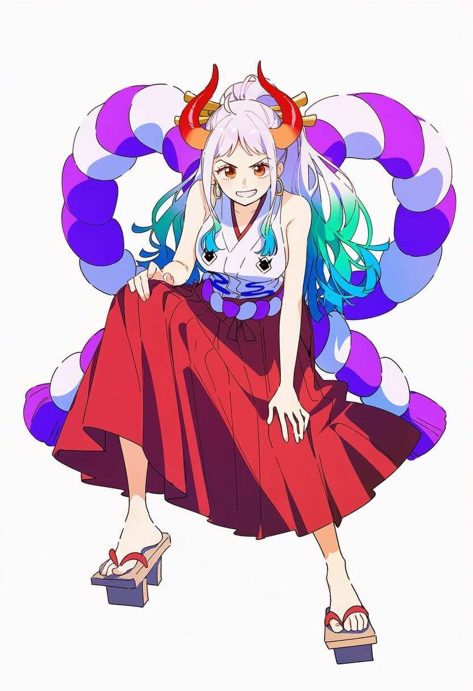

| 字段 | 内容 |
| --- | --- |
| Danbooru Tag | hand_on_own_knee |
| 中文名 | 单手放膝盖 |
| 中文含义 | 一只手放在自己的膝盖上。 |
| 子类 | 腿部/坐姿手位 |
| 角色 | 1girl,yamato_(one_piece) |
| 序号 | 0050 |

## 51. hands_on_own_knees — 双手放膝盖

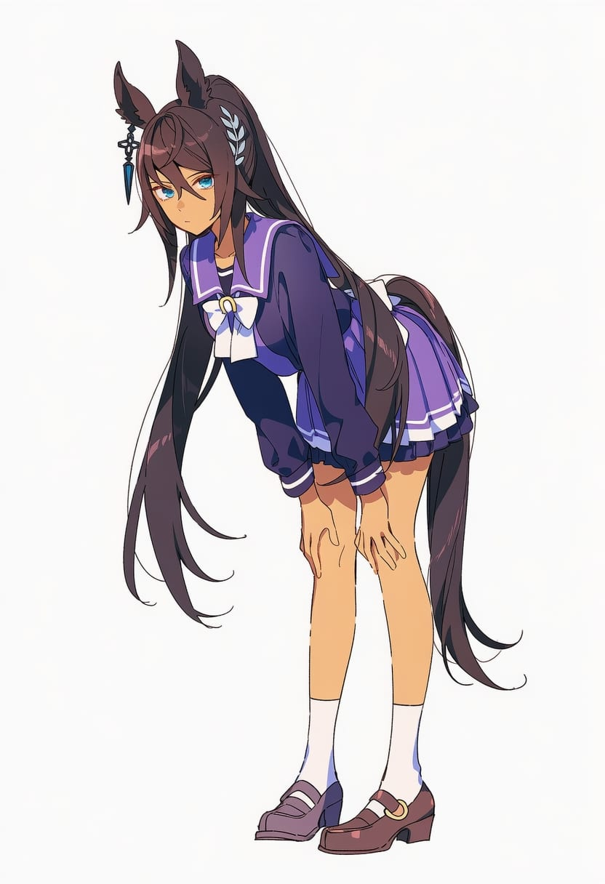

| 字段 | 内容 |
| --- | --- |
| Danbooru Tag | hands_on_own_knees |
| 中文名 | 双手放膝盖 |
| 中文含义 | 双手放在自己的膝盖上。 |
| 子类 | 腿部/坐姿手位 |
| 角色 | 1girl,symboli_kris_s_(umamusume) |
| 序号 | 0051 |

## 52. hand_on_own_leg — 单手搭腿

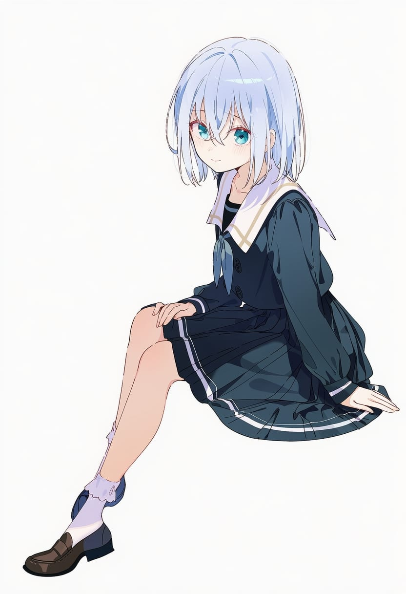

| 字段 | 内容 |
| --- | --- |
| Danbooru Tag | hand_on_own_leg |
| 中文名 | 单手搭腿 |
| 中文含义 | 一只手放在自己的腿上。 |
| 子类 | 腿部/坐姿手位 |
| 角色 | 1girl,kurata_mashiro |
| 序号 | 0052 |

## 53. hands_on_own_leg — 双手搭单腿

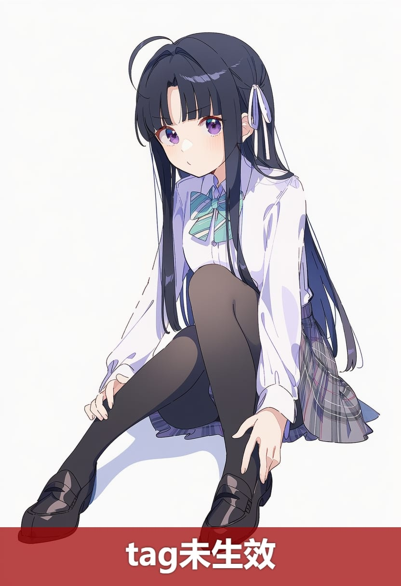

| 字段 | 内容 |
| --- | --- |
| Danbooru Tag | hands_on_own_leg |
| 中文名 | 双手搭单腿 |
| 中文含义 | 双手一起放在自己的同一条腿上。 |
| 子类 | 腿部/坐姿手位 |
| 角色 | 1girl,awa_subaru |
| 序号 | 0053 |

## 54. hands_on_own_legs — 双手搭双腿

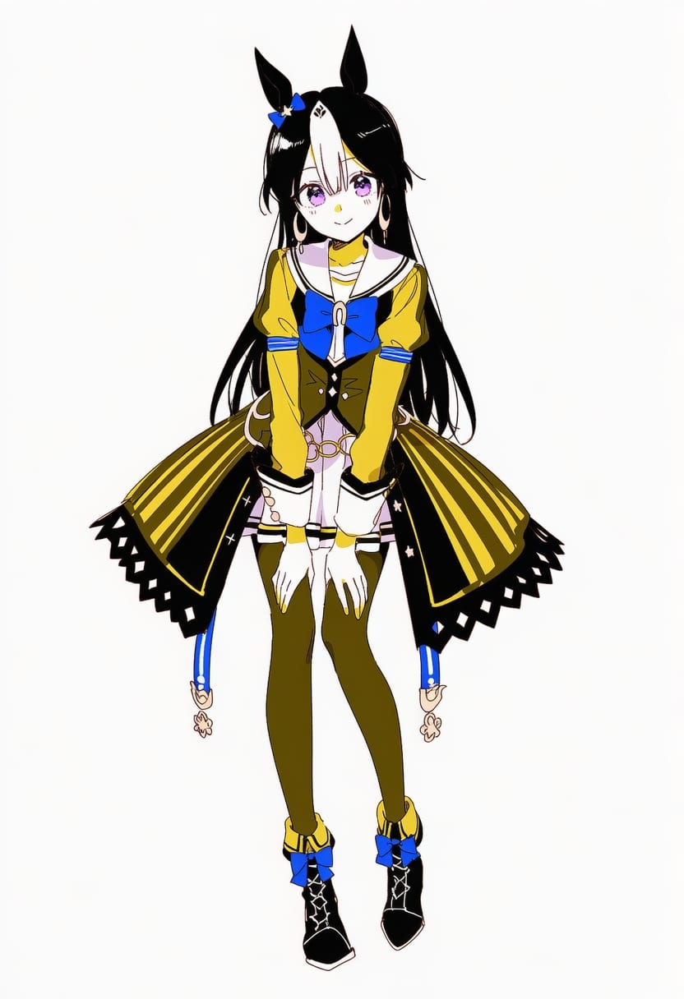

| 字段 | 内容 |
| --- | --- |
| Danbooru Tag | hands_on_own_legs |
| 中文名 | 双手搭双腿 |
| 中文含义 | 双手分别或同时放在自己的双腿上。 |
| 子类 | 腿部/坐姿手位 |
| 角色 | 1girl,stay_gold_(umamusume) |
| 序号 | 0054 |

## 55. hand_on_own_ankle — 单手扶脚踝

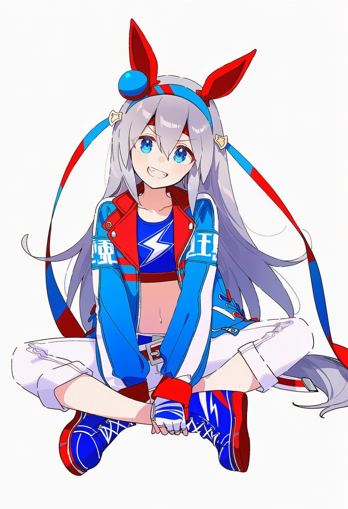

| 字段 | 内容 |
| --- | --- |
| Danbooru Tag | hand_on_own_ankle |
| 中文名 | 单手扶脚踝 |
| 中文含义 | 一只手放在自己的脚踝上。 |
| 子类 | 腿部/坐姿手位 |
| 角色 | 1girl,tamamo_cross_(umamusume) |
| 序号 | 0055 |

## 56. hand_on_own_calf — 单手扶小腿

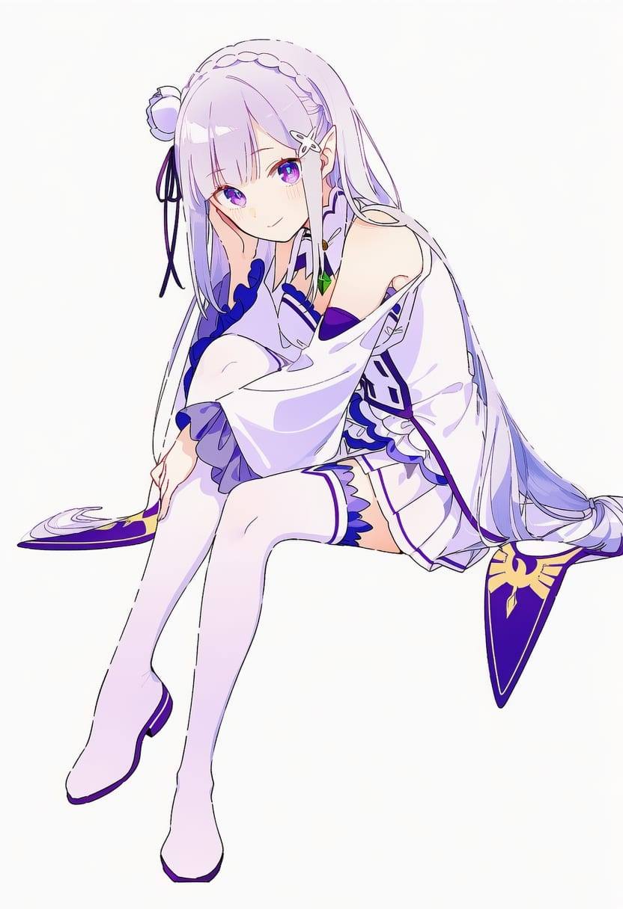

| 字段 | 内容 |
| --- | --- |
| Danbooru Tag | hand_on_own_calf |
| 中文名 | 单手扶小腿 |
| 中文含义 | 一只手放在自己的小腿上。 |
| 子类 | 腿部/坐姿手位 |
| 角色 | 1girl,emilia_(re:zero) |
| 序号 | 0056 |

## 57. hand_on_own_opposite_thigh — 手搭对侧大腿

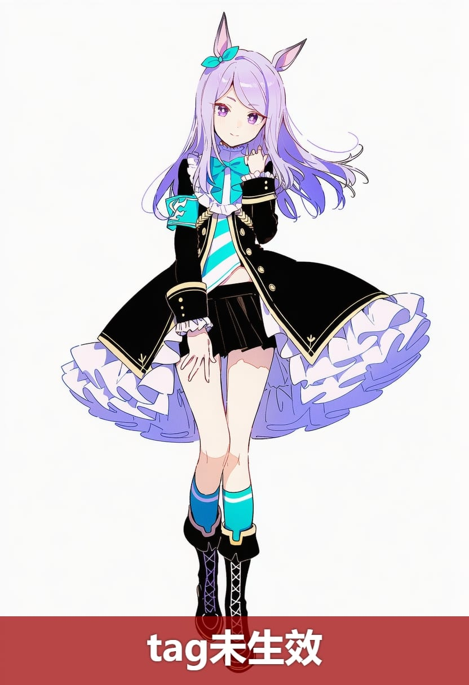

| 字段 | 内容 |
| --- | --- |
| Danbooru Tag | hand_on_own_opposite_thigh |
| 中文名 | 手搭对侧大腿 |
| 中文含义 | 一只手跨过身体放在对侧大腿上。 |
| 子类 | 腿部/坐姿手位 |
| 角色 | 1girl,mejiro_mcqueen_(umamusume) |
| 序号 | 0057 |

## 58. hand_between_own_legs — 手放双腿之间

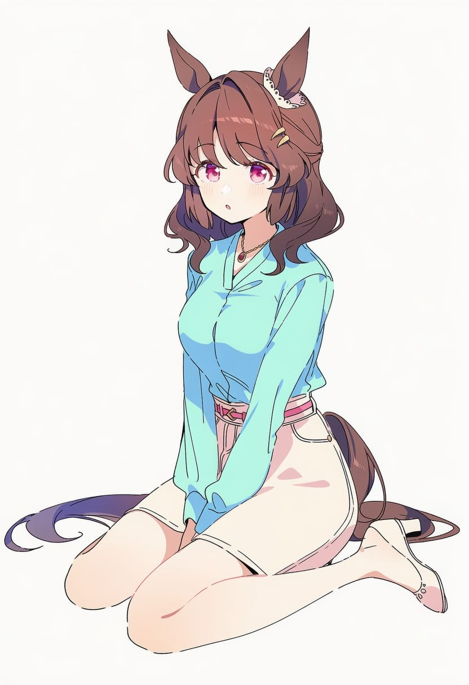

| 字段 | 内容 |
| --- | --- |
| Danbooru Tag | hand_between_own_legs |
| 中文名 | 手放双腿之间 |
| 中文含义 | 一只手位于自己的两腿之间。 |
| 子类 | 腿部/坐姿手位 |
| 角色 | 1girl,light_hello_(umamusume) |
| 序号 | 0058 |

## 59. hand_on_lap — 单手放腿面

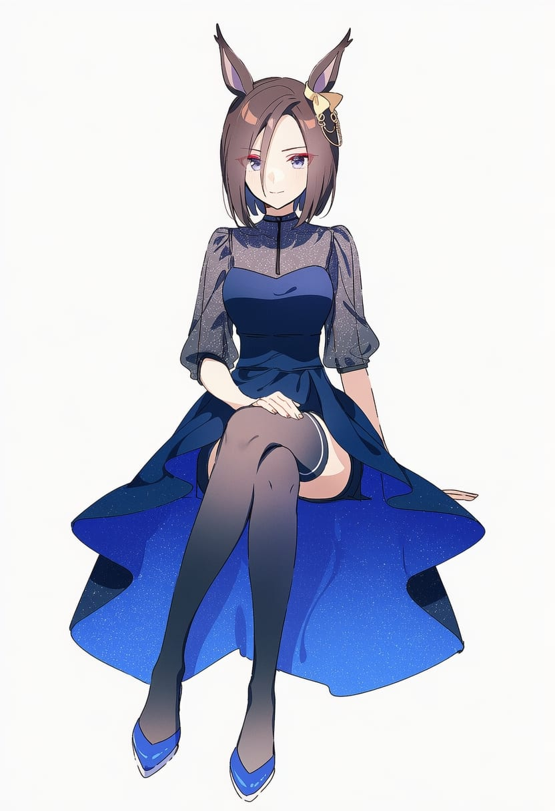

| 字段 | 内容 |
| --- | --- |
| Danbooru Tag | hand_on_lap |
| 中文名 | 单手放腿面 |
| 中文含义 | 一只手放在坐姿时的大腿上表面。 |
| 子类 | 腿部/坐姿手位 |
| 角色 | 1girl,air_groove_(umamusume) |
| 序号 | 0059 |

## 60. hands_on_lap — 双手放腿面

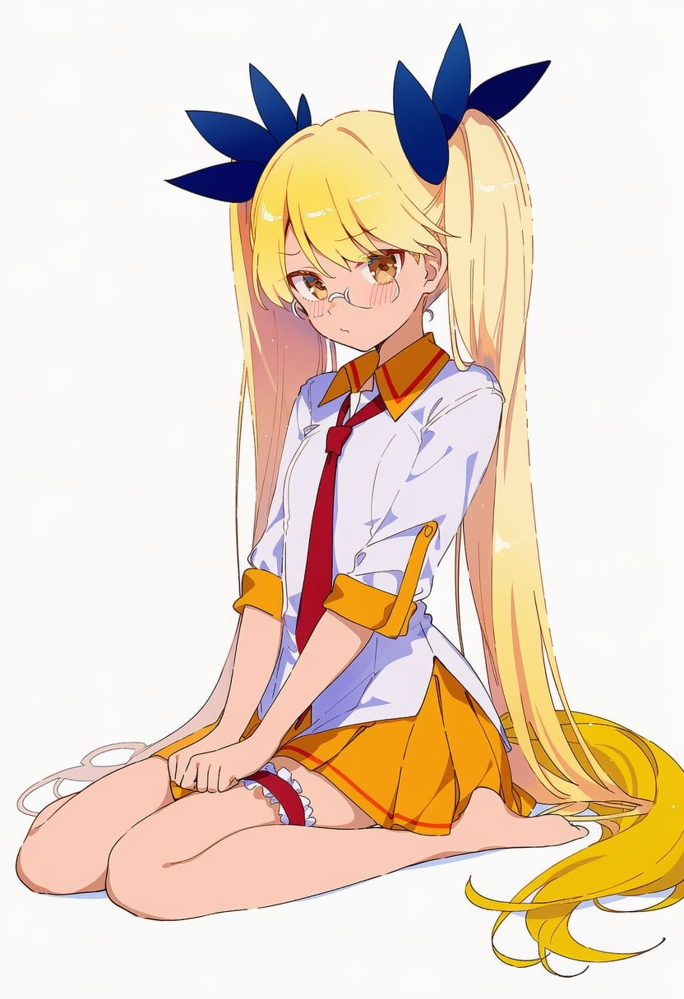

| 字段 | 内容 |
| --- | --- |
| Danbooru Tag | hands_on_lap |
| 中文名 | 双手放腿面 |
| 中文含义 | 坐着或跪着时，双手放在腿面上。 |
| 子类 | 腿部/坐姿手位 |
| 角色 | 1girl,retoree_(show_by_rock!!) |
| 序号 | 0060 |

## 61. holding_own_leg — 抱住自己一条腿

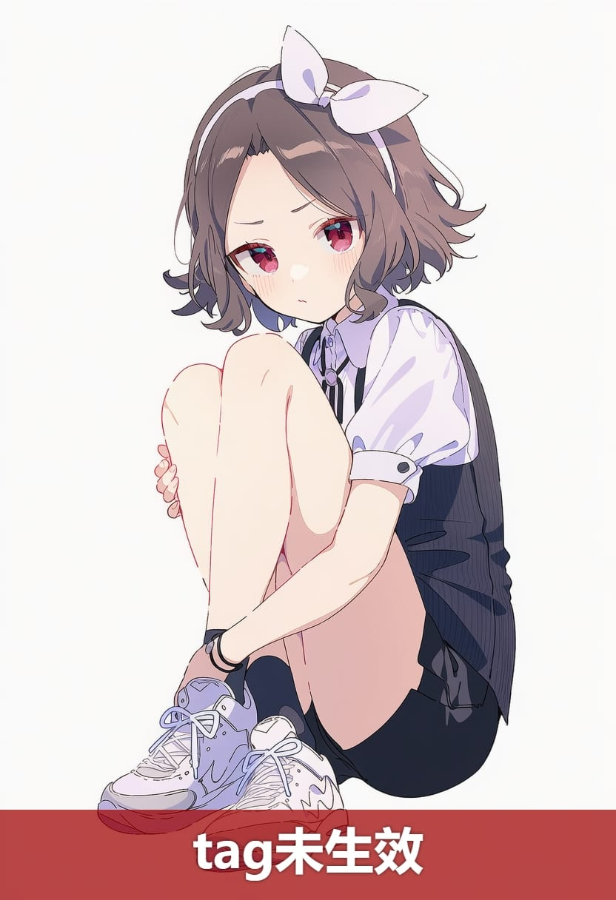

| 字段 | 内容 |
| --- | --- |
| Danbooru Tag | holding_own_leg |
| 中文名 | 抱住自己一条腿 |
| 中文含义 | 用手抓住或抱住自己的一条腿。 |
| 子类 | 腿部/坐姿手位 |
| 角色 | 1girl,ebizuka_tomo |
| 序号 | 0061 |

## 62. holding_own_ankle — 握住自己脚踝

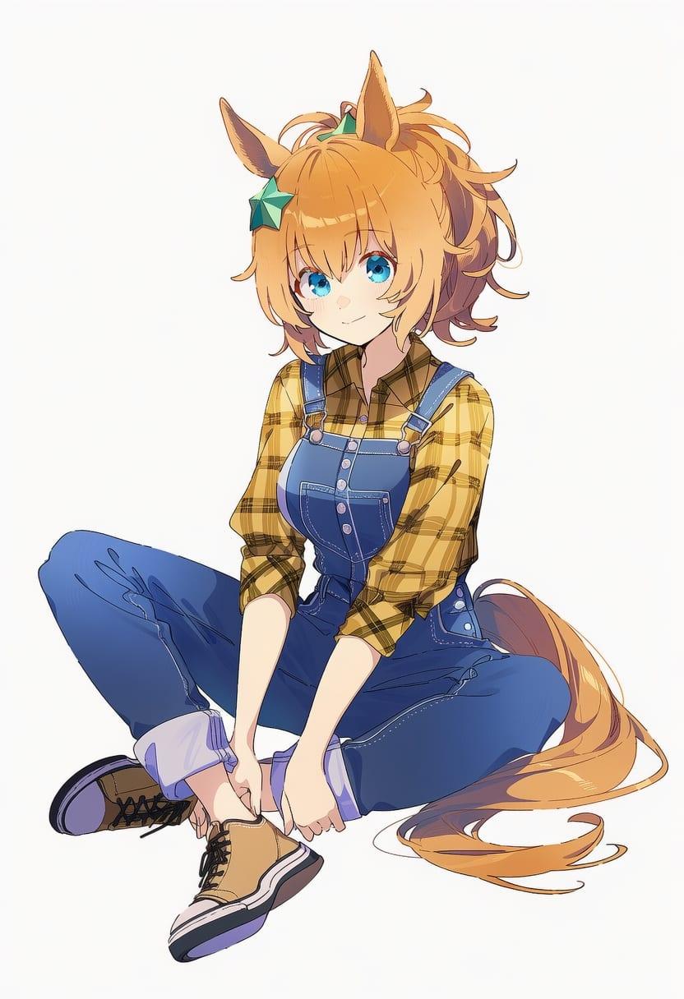

| 字段 | 内容 |
| --- | --- |
| Danbooru Tag | holding_own_ankle |
| 中文名 | 握住自己脚踝 |
| 中文含义 | 用手握住自己的一个脚踝。 |
| 子类 | 腿部/坐姿手位 |
| 角色 | 1girl,taiki_shuttle_(umamusume) |
| 序号 | 0062 |

## 63. holding_own_ankles — 握住双脚踝

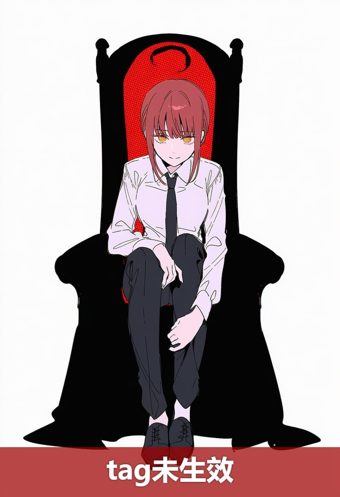

| 字段 | 内容 |
| --- | --- |
| Danbooru Tag | holding_own_ankles |
| 中文名 | 握住双脚踝 |
| 中文含义 | 双手握住自己的两个脚踝。 |
| 子类 | 腿部/坐姿手位 |
| 角色 | 1girl,makima_(chainsaw_man) |
| 序号 | 0063 |

## 64. hugging_own_leg — 抱住自己单腿

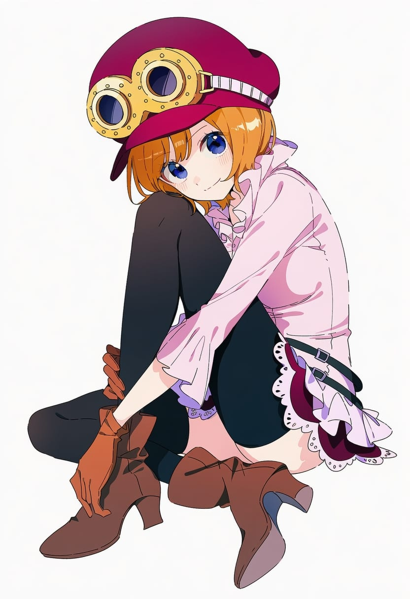

| 字段 | 内容 |
| --- | --- |
| Danbooru Tag | hugging_own_leg |
| 中文名 | 抱住自己单腿 |
| 中文含义 | 用双臂环抱自己的一条腿。 |
| 子类 | 腿部/坐姿手位 |
| 角色 | 1girl,koala_(one_piece) |
| 序号 | 0064 |

## 65. hugging_own_legs — 抱住自己双腿

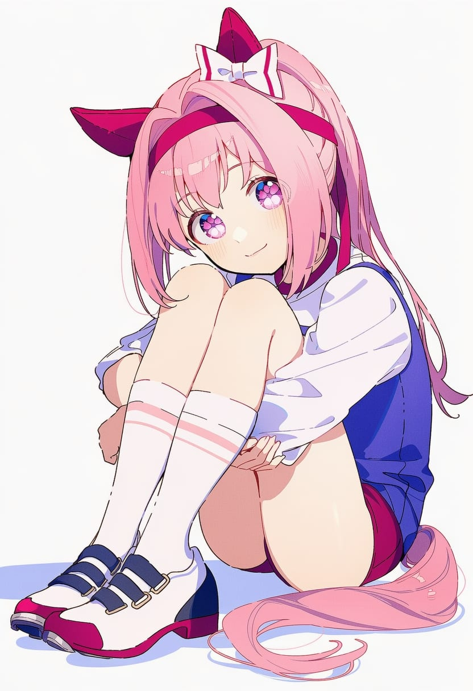

| 字段 | 内容 |
| --- | --- |
| Danbooru Tag | hugging_own_legs |
| 中文名 | 抱住自己双腿 |
| 中文含义 | 用双臂环抱自己的双腿或膝盖。 |
| 子类 | 腿部/坐姿手位 |
| 角色 | 1girl,haru_urara_(umamusume) |
| 序号 | 0065 |

## 66. arm_rest — 手臂支靠

| 字段 | 内容 |
| --- | --- |
| Danbooru Tag | arm_rest |
| 中文名 | 手臂支靠 |
| 中文含义 | 手臂靠在物体或身体部位上休息。 |
| 子类 | 支撑/接触表面 |
| 角色 | 1girl,wendy_marvell |
| 序号 | 0066 |

## 67. arms_on_knees — 双臂搭膝

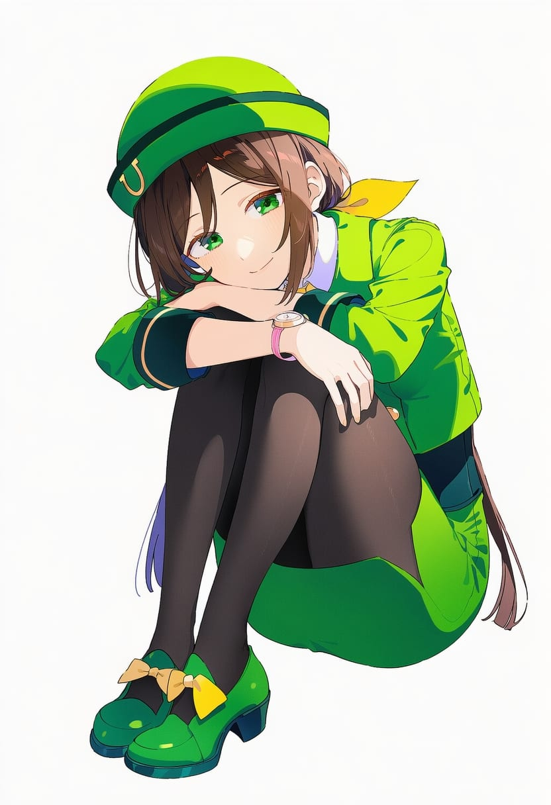

| 字段 | 内容 |
| --- | --- |
| Danbooru Tag | arms_on_knees |
| 中文名 | 双臂搭膝 |
| 中文含义 | 双臂放在膝盖上。 |
| 子类 | 支撑/接触表面 |
| 角色 | 1girl,hayakawa_tazuna |
| 序号 | 0067 |

## 68. elbow_on_knee — 单肘撑膝

| 字段 | 内容 |
| --- | --- |
| Danbooru Tag | elbow_on_knee |
| 中文名 | 单肘撑膝 |
| 中文含义 | 一只手肘支在膝盖上。 |
| 子类 | 支撑/接触表面 |
| 角色 | 1girl,iwasawa_masami |
| 序号 | 0068 |

## 69. elbows_on_knees — 双肘撑膝

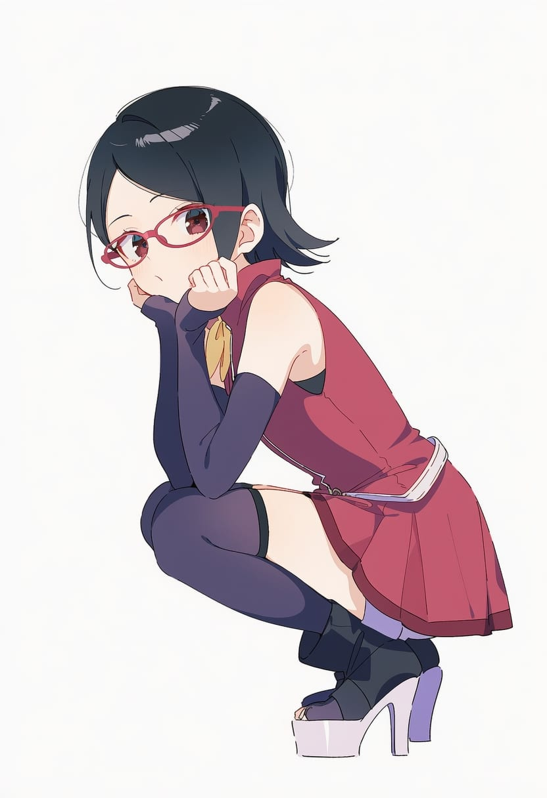

| 字段 | 内容 |
| --- | --- |
| Danbooru Tag | elbows_on_knees |
| 中文名 | 双肘撑膝 |
| 中文含义 | 双肘分别支在膝盖上。 |
| 子类 | 支撑/接触表面 |
| 角色 | 1girl,uchiha_sarada |
| 序号 | 0069 |

## 70. elbow_on_thigh — 单肘撑大腿

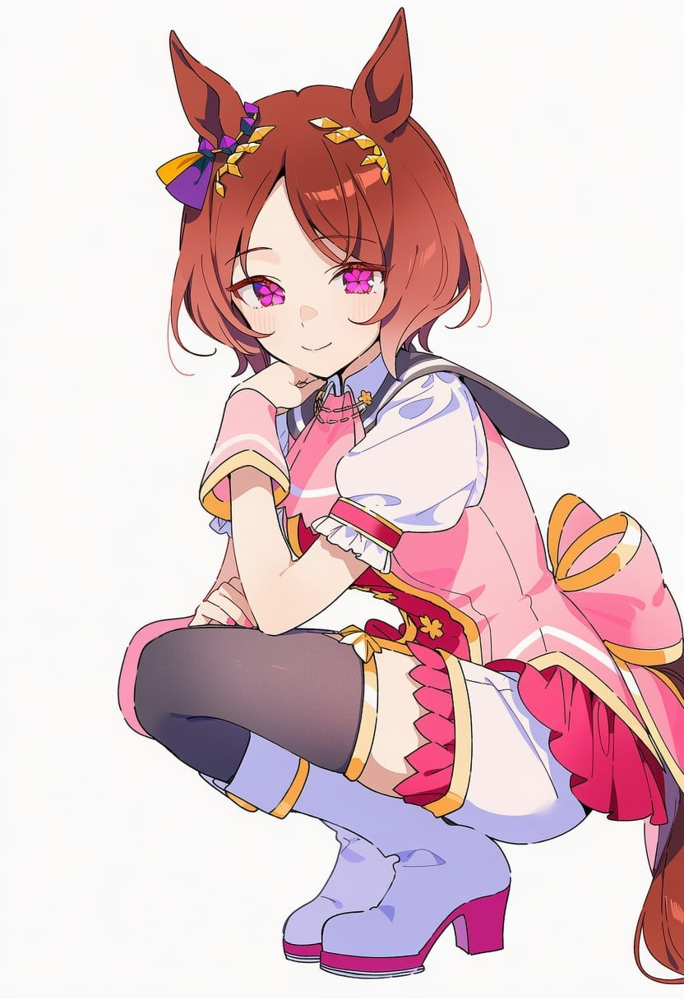

| 字段 | 内容 |
| --- | --- |
| Danbooru Tag | elbow_on_thigh |
| 中文名 | 单肘撑大腿 |
| 中文含义 | 一只手肘支在大腿上。 |
| 子类 | 支撑/接触表面 |
| 角色 | 1girl,sakura_laurel_(umamusume) |
| 序号 | 0070 |

## 71. elbows_on_thighs — 双肘撑大腿

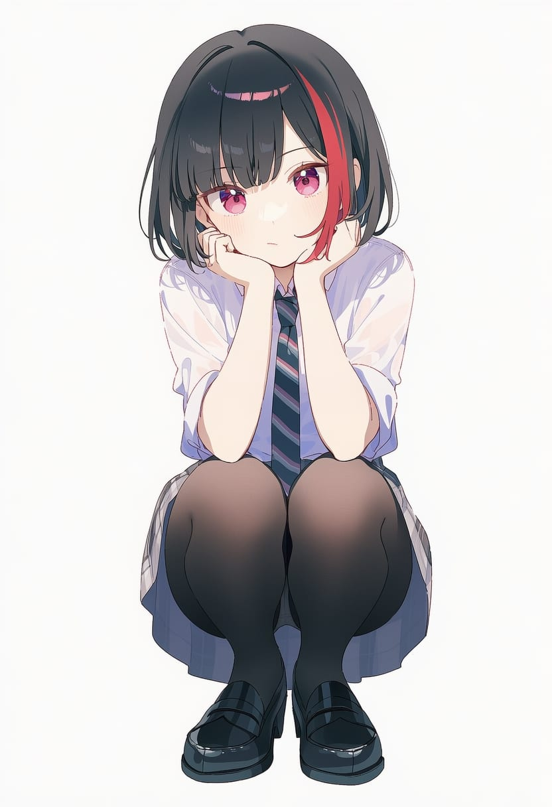

| 字段 | 内容 |
| --- | --- |
| Danbooru Tag | elbows_on_thighs |
| 中文名 | 双肘撑大腿 |
| 中文含义 | 双肘分别支在大腿上。 |
| 子类 | 支撑/接触表面 |
| 角色 | 1girl,mitake_ran |
| 序号 | 0071 |

## 72. arm_on_knee — 手臂搭膝

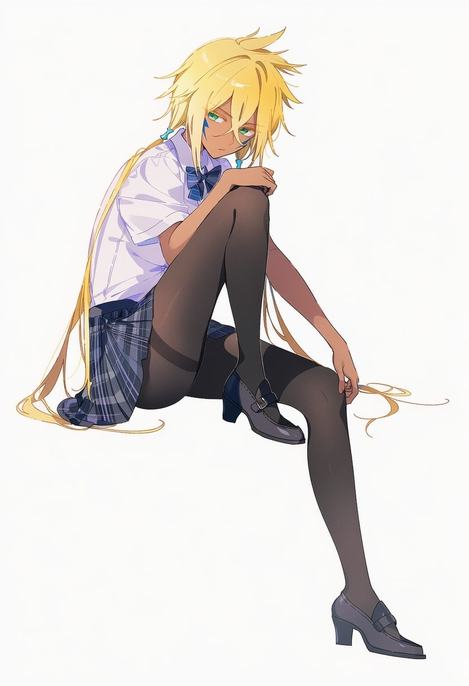

| 字段 | 内容 |
| --- | --- |
| Danbooru Tag | arm_on_knee |
| 中文名 | 手臂搭膝 |
| 中文含义 | 一条手臂放在膝盖上。 |
| 子类 | 支撑/接触表面 |
| 角色 | 1girl,tier_harribel |
| 序号 | 0072 |

## 73. arm_on_thigh — 手臂搭大腿

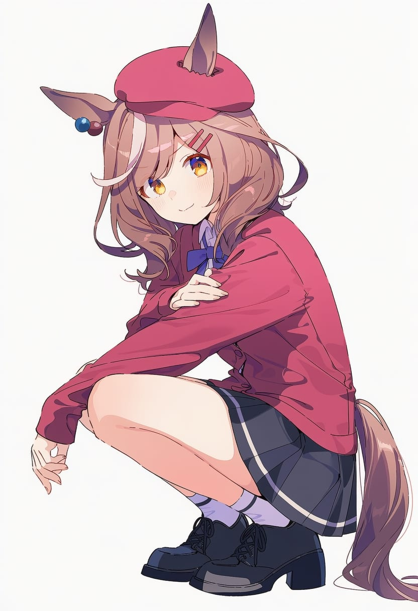

| 字段 | 内容 |
| --- | --- |
| Danbooru Tag | arm_on_thigh |
| 中文名 | 手臂搭大腿 |
| 中文含义 | 一条手臂放在大腿上。 |
| 子类 | 支撑/接触表面 |
| 角色 | 1girl,matikanetannhauser_(umamusume) |
| 序号 | 0073 |

## 74. elbow_rest — 手肘支靠

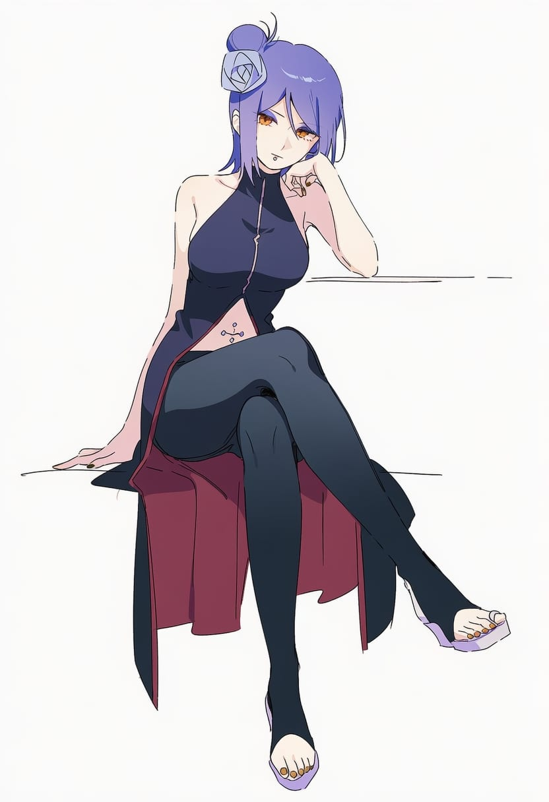

| 字段 | 内容 |
| --- | --- |
| Danbooru Tag | elbow_rest |
| 中文名 | 手肘支靠 |
| 中文含义 | 用手肘靠在物体或身体部位上。 |
| 子类 | 支撑/接触表面 |
| 角色 | 1girl,konan_(naruto) |
| 序号 | 0074 |

## 75. hand_on_table — 手放桌面

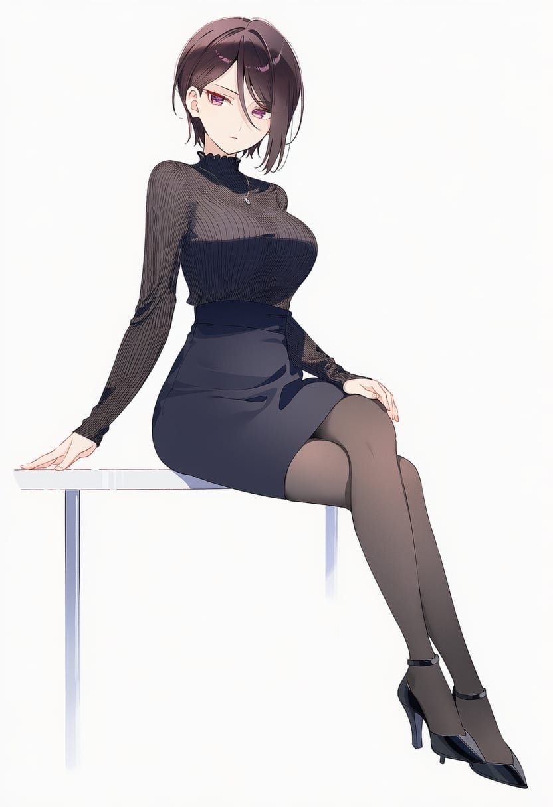

| 字段 | 内容 |
| --- | --- |
| Danbooru Tag | hand_on_table |
| 中文名 | 手放桌面 |
| 中文含义 | 一只手放在桌面上。 |
| 子类 | 支撑/接触表面 |
| 角色 | 1girl,yashio_rui |
| 序号 | 0075 |

## 76. arms_on_table — 双前臂放桌面

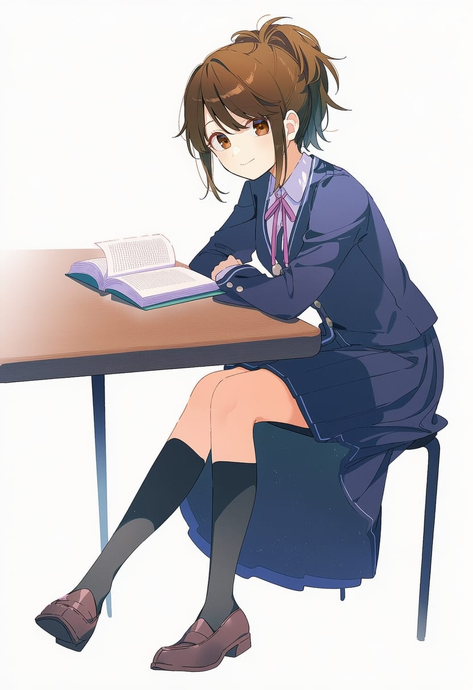

| 字段 | 内容 |
| --- | --- |
| Danbooru Tag | arms_on_table |
| 中文名 | 双前臂放桌面 |
| 中文含义 | 两条前臂平放在桌面上。 |
| 子类 | 支撑/接触表面 |
| 角色 | 1girl,shimura_tae |
| 序号 | 0076 |

## 77. arm_on_table — 单前臂放桌面

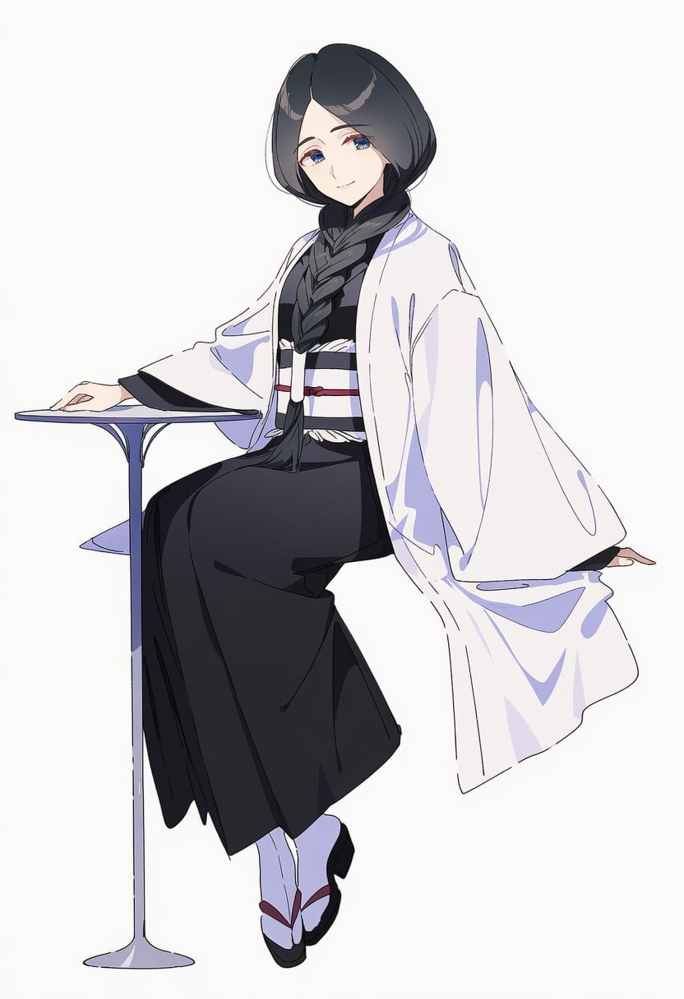

| 字段 | 内容 |
| --- | --- |
| Danbooru Tag | arm_on_table |
| 中文名 | 单前臂放桌面 |
| 中文含义 | 一条前臂平放在桌面上。 |
| 子类 | 支撑/接触表面 |
| 角色 | 1girl,unohana_retsu |
| 序号 | 0077 |

## 78. head_on_hand — 头靠手

| 字段 | 内容 |
| --- | --- |
| Danbooru Tag | head_on_hand |
| 中文名 | 头靠手 |
| 中文含义 | 头部靠在自己的手上。 |
| 子类 | 支撑/接触表面 |
| 角色 | 1girl,mirajane_strauss |
| 序号 | 0078 |

---
