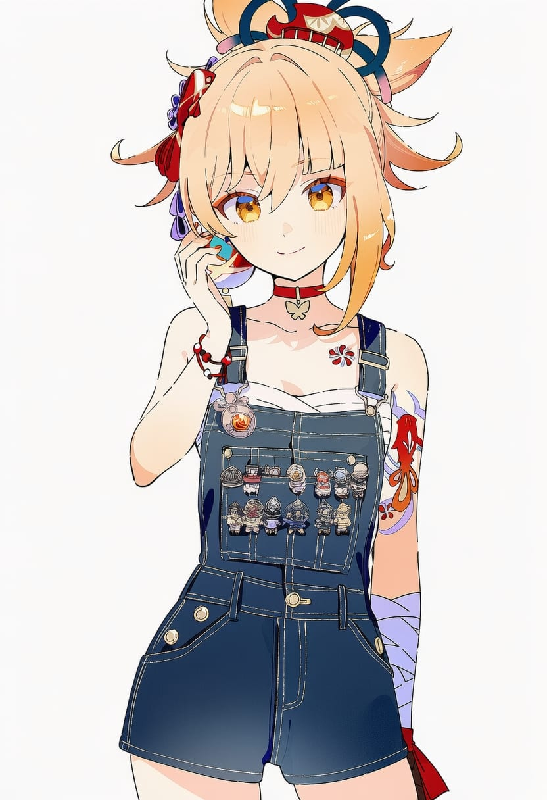

# 手部配饰tag展示文档

## 1. gloves — 普通手套，覆盖手掌和手指。

| 字段 | 内容 |
| --- | --- |
| Danbooru Tag | gloves |
| 中文名 | 手套 |
| 中文含义 | 普通手套，覆盖手掌和手指。 |
| 子类 | 手套 |

## 2. fingerless_gloves — 手掌被覆盖，但手指露出。

| 字段 | 内容 |
| --- | --- |
| Danbooru Tag | fingerless_gloves |
| 中文名 | 露指手套 |
| 中文含义 | 手掌被覆盖，但手指露出。 |
| 子类 | 手套 |

## 3. partially_fingerless_gloves — 只有部分手指露出的手套。

| 字段 | 内容 |
| --- | --- |
| Danbooru Tag | partially_fingerless_gloves |
| 中文名 | 部分露指手套 |
| 中文含义 | 只有部分手指露出的手套。 |
| 子类 | 手套 |

## 4. half_gloves — 很短的手套，通常不到手腕。

| 字段 | 内容 |
| --- | --- |
| Danbooru Tag | half_gloves |
| 中文名 | 短手套 |
| 中文含义 | 很短的手套，通常不到手腕。 |
| 子类 | 手套 |

## 5. elbow_gloves — 长度延伸到手肘附近或以上。

| 字段 | 内容 |
| --- | --- |
| Danbooru Tag | elbow_gloves |
| 中文名 | 肘上长手套 |
| 中文含义 | 长度延伸到手肘附近或以上。 |
| 子类 | 手套 |

## 6. bridal_gauntlets — 无指、覆盖手背并延伸到手臂的礼服式手套。

| 字段 | 内容 |
| --- | --- |
| Danbooru Tag | bridal_gauntlets |
| 中文名 | 新娘臂套 |
| 中文含义 | 无指、覆盖手背并延伸到手臂的礼服式手套。 |
| 子类 | 手套 |

## 7. black_bridal_gauntlets — 黑色的新娘臂套；该款颜色只留一种。

| 字段 | 内容 |
| --- | --- |
| Danbooru Tag | black_bridal_gauntlets |
| 中文名 | 黑色新娘臂套 |
| 中文含义 | 黑色的新娘臂套；该款颜色只留一种。 |
| 子类 | 手套 |

## 8. gauntlets — 较厚重的护手或铠甲手套。

| 字段 | 内容 |
| --- | --- |
| Danbooru Tag | gauntlets |
| 中文名 | 护手甲 |
| 中文含义 | 较厚重的护手或铠甲手套。 |
| 子类 | 手套 |

## 9. single_glove — 只有一只手戴手套。

| 字段 | 内容 |
| --- | --- |
| Danbooru Tag | single_glove |
| 中文名 | 单只手套 |
| 中文含义 | 只有一只手戴手套。 |
| 子类 | 手套 |

## 10. asymmetrical_gloves — 左右手套的设计不一样。

| 字段 | 内容 |
| --- | --- |
| Danbooru Tag | asymmetrical_gloves |
| 中文名 | 不对称手套 |
| 中文含义 | 左右手套的设计不一样。 |
| 子类 | 手套 |

## 11. uneven_gloves — 左右手套长度不同。

| 字段 | 内容 |
| --- | --- |
| Danbooru Tag | uneven_gloves |
| 中文名 | 长短不一手套 |
| 中文含义 | 左右手套长度不同。 |
| 子类 | 手套 |

## 12. mismatched_gloves — 左右手套颜色或图案不同。

| 字段 | 内容 |
| --- | --- |
| Danbooru Tag | mismatched_gloves |
| 中文名 | 不配对手套 |
| 中文含义 | 左右手套颜色或图案不同。 |
| 子类 | 手套 |

## 13. multicolored_gloves — 同一副手套包含多种颜色。

| 字段 | 内容 |
| --- | --- |
| Danbooru Tag | multicolored_gloves |
| 中文名 | 多色手套 |
| 中文含义 | 同一副手套包含多种颜色。 |
| 子类 | 手套 |

## 14. two-tone_gloves — 手套由两种主要颜色组成。

| 字段 | 内容 |
| --- | --- |
| Danbooru Tag | two-tone_gloves |
| 中文名 | 双色手套 |
| 中文含义 | 手套由两种主要颜色组成。 |
| 子类 | 手套 |

## 15. mittens — 除拇指外，其余手指包在一起。

| 字段 | 内容 |
| --- | --- |
| Danbooru Tag | mittens |
| 中文名 | 连指手套 |
| 中文含义 | 除拇指外，其余手指包在一起。 |
| 子类 | 手套 |

## 16. boxing_gloves — 拳击用的厚实防护手套。

| 字段 | 内容 |
| --- | --- |
| Danbooru Tag | boxing_gloves |
| 中文名 | 拳击手套 |
| 中文含义 | 拳击用的厚实防护手套。 |
| 子类 | 手套 |

## 17. yugake — 日本弓道使用的传统射箭手套。

| 字段 | 内容 |
| --- | --- |
| Danbooru Tag | yugake |
| 中文名 | 弓道手套 |
| 中文含义 | 日本弓道使用的传统射箭手套。 |
| 子类 | 手套 |

## 18. kote — 日式铠甲中保护手臂和手部的护具。

| 字段 | 内容 |
| --- | --- |
| Danbooru Tag | kote |
| 中文名 | 笼手 |
| 中文含义 | 日式铠甲中保护手臂和手部的护具。 |
| 子类 | 手套 |

## 19. kurokote — 日式铠甲里的黑色笼手护具。

| 字段 | 内容 |
| --- | --- |
| Danbooru Tag | kurokote |
| 中文名 | 黑笼手 |
| 中文含义 | 日式铠甲里的黑色笼手护具。 |
| 子类 | 手套 |

## 20. lace_gloves — 主要由蕾丝制成的手套。

| 字段 | 内容 |
| --- | --- |
| Danbooru Tag | lace_gloves |
| 中文名 | 蕾丝手套 |
| 中文含义 | 主要由蕾丝制成的手套。 |
| 子类 | 手套 |

## 21. latex_gloves — 乳胶材质的贴手手套。

| 字段 | 内容 |
| --- | --- |
| Danbooru Tag | latex_gloves |
| 中文名 | 乳胶手套 |
| 中文含义 | 乳胶材质的贴手手套。 |
| 子类 | 手套 |

## 22. leather_gloves — 皮革材质的手套。

| 字段 | 内容 |
| --- | --- |
| Danbooru Tag | leather_gloves |
| 中文名 | 皮手套 |
| 中文含义 | 皮革材质的手套。 |
| 子类 | 手套 |

## 23. frilled_gloves — 带明显褶边或荷叶边装饰。

| 字段 | 内容 |
| --- | --- |
| Danbooru Tag | frilled_gloves |
| 中文名 | 荷叶边手套 |
| 中文含义 | 带明显褶边或荷叶边装饰。 |
| 子类 | 手套 |

## 24. fur-trimmed_gloves — 边缘带毛绒装饰的手套。

| 字段 | 内容 |
| --- | --- |
| Danbooru Tag | fur-trimmed_gloves |
| 中文名 | 毛边手套 |
| 中文含义 | 边缘带毛绒装饰的手套。 |
| 子类 | 手套 |

## 25. ribbon-trimmed_gloves — 边缘带缎带装饰的手套。

| 字段 | 内容 |
| --- | --- |
| Danbooru Tag | ribbon-trimmed_gloves |
| 中文名 | 缎带边手套 |
| 中文含义 | 边缘带缎带装饰的手套。 |
| 子类 | 手套 |

## 26. see-through_gloves — 材质半透明、能看到皮肤的手套。

| 字段 | 内容 |
| --- | --- |
| Danbooru Tag | see-through_gloves |
| 中文名 | 透明薄纱手套 |
| 中文含义 | 材质半透明、能看到皮肤的手套。 |
| 子类 | 手套 |

## 27. spiked_gloves — 带尖刺装饰的手套。

| 字段 | 内容 |
| --- | --- |
| Danbooru Tag | spiked_gloves |
| 中文名 | 尖刺手套 |
| 中文含义 | 带尖刺装饰的手套。 |
| 子类 | 手套 |

## 28. glove_cuffs — 手套腕口有明显翻边或袖口结构。

| 字段 | 内容 |
| --- | --- |
| Danbooru Tag | glove_cuffs |
| 中文名 | 手套翻边 |
| 中文含义 | 手套腕口有明显翻边或袖口结构。 |
| 子类 | 手套 |

## 29. disposable_gloves — 医用、实验或清洁用的一次性薄手套。

| 字段 | 内容 |
| --- | --- |
| Danbooru Tag | disposable_gloves |
| 中文名 | 一次性手套 |
| 中文含义 | 医用、实验或清洁用的一次性薄手套。 |
| 子类 | 手套 |

## 30. finger_cots — 只套住单个或少数手指的小型指套。

| 字段 | 内容 |
| --- | --- |
| Danbooru Tag | finger_cots |
| 中文名 | 指套 |
| 中文含义 | 只套住单个或少数手指的小型指套。 |
| 子类 | 手套 |

## 31. paw_gloves — 做成动物爪子或肉球造型的手套。

| 字段 | 内容 |
| --- | --- |
| Danbooru Tag | paw_gloves |
| 中文名 | 兽爪手套 |
| 中文含义 | 做成动物爪子或肉球造型的手套。 |
| 子类 | 手套 |

## 32. wrist_cuffs — 独立戴在手腕上的装饰性袖口。

| 字段 | 内容 |
| --- | --- |
| Danbooru Tag | wrist_cuffs |
| 中文名 | 腕饰袖口 |
| 中文含义 | 独立戴在手腕上的装饰性袖口。 |
| 子类 | 手腕配饰 |

## 33. black_wrist_cuffs — 黑色腕饰袖口；颜色款只留这一种。

| 字段 | 内容 |
| --- | --- |
| Danbooru Tag | black_wrist_cuffs |
| 中文名 | 黑色腕饰袖口 |
| 中文含义 | 黑色腕饰袖口；颜色款只留这一种。 |
| 子类 | 手腕配饰 |

## 34. frilled_wrist_cuffs — 带褶边的装饰性腕饰袖口。

| 字段 | 内容 |
| --- | --- |
| Danbooru Tag | frilled_wrist_cuffs |
| 中文名 | 荷叶边腕饰 |
| 中文含义 | 带褶边的装饰性腕饰袖口。 |
| 子类 | 手腕配饰 |

## 35. single_wrist_cuff — 只有一只手腕戴装饰袖口。

| 字段 | 内容 |
| --- | --- |
| Danbooru Tag | single_wrist_cuff |
| 中文名 | 单侧腕饰 |
| 中文含义 | 只有一只手腕戴装饰袖口。 |
| 子类 | 手腕配饰 |

## 36. fur_cuffs — 毛绒材质的腕部或踝部装饰圈。

| 字段 | 内容 |
| --- | --- |
| Danbooru Tag | fur_cuffs |
| 中文名 | 毛绒腕饰 |
| 中文含义 | 毛绒材质的腕部或踝部装饰圈。 |
| 子类 | 手腕配饰 |

## 37. wristband — 戴在手腕上的带状配饰。

| 字段 | 内容 |
| --- | --- |
| Danbooru Tag | wristband |
| 中文名 | 腕带 |
| 中文含义 | 戴在手腕上的带状配饰。 |
| 子类 | 手腕配饰 |

## 38. striped_wristband — 带条纹图案的腕带。

| 字段 | 内容 |
| --- | --- |
| Danbooru Tag | striped_wristband |
| 中文名 | 条纹腕带 |
| 中文含义 | 带条纹图案的腕带。 |
| 子类 | 手腕配饰 |

## 39. frilled_wristband — 带褶边装饰的腕带。

| 字段 | 内容 |
| --- | --- |
| Danbooru Tag | frilled_wristband |
| 中文名 | 荷叶边腕带 |
| 中文含义 | 带褶边装饰的腕带。 |
| 子类 | 手腕配饰 |

## 40. wrist_scrunchie — 把发圈当作腕饰戴在手腕上。

| 字段 | 内容 |
| --- | --- |
| Danbooru Tag | wrist_scrunchie |
| 中文名 | 手腕发圈 |
| 中文含义 | 把发圈当作腕饰戴在手腕上。 |
| 子类 | 手腕配饰 |

## 41. wrist_ribbon — 丝带直接系在手腕上。

| 字段 | 内容 |
| --- | --- |
| Danbooru Tag | wrist_ribbon |
| 中文名 | 手腕丝带 |
| 中文含义 | 丝带直接系在手腕上。 |
| 子类 | 手腕配饰 |

## 42. wrist_bow — 手腕处系着明显的蝴蝶结。

| 字段 | 内容 |
| --- | --- |
| Danbooru Tag | wrist_bow |
| 中文名 | 手腕蝴蝶结 |
| 中文含义 | 手腕处系着明显的蝴蝶结。 |
| 子类 | 手腕配饰 |

## 43. bracelet — 戴在手腕上的首饰。

| 字段 | 内容 |
| --- | --- |
| Danbooru Tag | bracelet |
| 中文名 | 手链 / 手镯 |
| 中文含义 | 戴在手腕上的首饰。 |
| 子类 | 手腕配饰 |

## 44. gold_bracelet — 金色或金质感手链；颜色/材质款留这一种。

| 字段 | 内容 |
| --- | --- |
| Danbooru Tag | gold_bracelet |
| 中文名 | 金色手链 |
| 中文含义 | 金色或金质感手链；颜色/材质款留这一种。 |
| 子类 | 手腕配饰 |

## 45. bangle — 没有链节、整体偏硬的环形手镯。

| 字段 | 内容 |
| --- | --- |
| Danbooru Tag | bangle |
| 中文名 | 硬质手镯 |
| 中文含义 | 没有链节、整体偏硬的环形手镯。 |
| 子类 | 手腕配饰 |

## 46. bead_bracelet — 由珠子串成的手链。

| 字段 | 内容 |
| --- | --- |
| Danbooru Tag | bead_bracelet |
| 中文名 | 珠串手链 |
| 中文含义 | 由珠子串成的手链。 |
| 子类 | 手腕配饰 |

## 47. spiked_bracelet — 带尖刺装饰的手链或手环。

| 字段 | 内容 |
| --- | --- |
| Danbooru Tag | spiked_bracelet |
| 中文名 | 尖刺手环 |
| 中文含义 | 带尖刺装饰的手链或手环。 |
| 子类 | 手腕配饰 |

## 48. studded_bracelet — 带铆钉装饰的手环。

| 字段 | 内容 |
| --- | --- |
| Danbooru Tag | studded_bracelet |
| 中文名 | 铆钉手环 |
| 中文含义 | 带铆钉装饰的手环。 |
| 子类 | 手腕配饰 |

## 49. chain_bracelet — 以金属链节为主体的手链。

| 字段 | 内容 |
| --- | --- |
| Danbooru Tag | chain_bracelet |
| 中文名 | 链式手链 |
| 中文含义 | 以金属链节为主体的手链。 |
| 子类 | 手腕配饰 |

## 50. pearl_bracelet — 由珍珠组成或装饰的手链。

| 字段 | 内容 |
| --- | --- |
| Danbooru Tag | pearl_bracelet |
| 中文名 | 珍珠手链 |
| 中文含义 | 由珍珠组成或装饰的手链。 |
| 子类 | 手腕配饰 |

## 51. checkered_wristband — 带棋盘格或方格图案的腕带。

| 字段 | 内容 |
| --- | --- |
| Danbooru Tag | checkered_wristband |
| 中文名 | 格纹腕带 |
| 中文含义 | 带棋盘格或方格图案的腕带。 |
| 子类 | 手腕配饰 |

## 52. sweatband — 运动时戴的毛圈或吸汗腕带。

| 字段 | 内容 |
| --- | --- |
| Danbooru Tag | sweatband |
| 中文名 | 吸汗腕带 |
| 中文含义 | 运动时戴的毛圈或吸汗腕带。 |
| 子类 | 手腕配饰 |

## 53. wrist_wrap — 缠绕在手腕上的布带或绑带。

| 字段 | 内容 |
| --- | --- |
| Danbooru Tag | wrist_wrap |
| 中文名 | 手腕缠带 |
| 中文含义 | 缠绕在手腕上的布带或绑带。 |
| 子类 | 手腕配饰 |

## 54. wrist_flower — 戴在手腕上的花朵装饰。

| 字段 | 内容 |
| --- | --- |
| Danbooru Tag | wrist_flower |
| 中文名 | 手腕花饰 |
| 中文含义 | 戴在手腕上的花朵装饰。 |
| 子类 | 手腕配饰 |

## 55. wrist_guards — 保护手腕的护具。

| 字段 | 内容 |
| --- | --- |
| Danbooru Tag | wrist_guards |
| 中文名 | 护腕 |
| 中文含义 | 保护手腕的护具。 |
| 子类 | 手腕配饰 |

## 56. cuff_links — 固定衬衫袖口的小型装饰扣。

| 字段 | 内容 |
| --- | --- |
| Danbooru Tag | cuff_links |
| 中文名 | 袖扣 |
| 中文含义 | 固定衬衫袖口的小型装饰扣。 |
| 子类 | 手腕配饰 |

## 57. bandaged_wrist — 手腕位置缠着绷带。

| 字段 | 内容 |
| --- | --- |
| Danbooru Tag | bandaged_wrist |
| 中文名 | 手腕缠绷带 |
| 中文含义 | 手腕位置缠着绷带。 |
| 子类 | 手腕配饰 |

## 58. bandaid_on_wrist — 创可贴贴在手腕上。

| 字段 | 内容 |
| --- | --- |
| Danbooru Tag | bandaid_on_wrist |
| 中文名 | 手腕创可贴 |
| 中文含义 | 创可贴贴在手腕上。 |
| 子类 | 手腕配饰 |

## 59. armlet — 戴在上臂位置的环形首饰。

| 字段 | 内容 |
| --- | --- |
| Danbooru Tag | armlet |
| 中文名 | 臂环 |
| 中文含义 | 戴在上臂位置的环形首饰。 |
| 子类 | 手臂配饰 |

## 60. spiked_armlet — 带尖刺装饰的臂环。

| 字段 | 内容 |
| --- | --- |
| Danbooru Tag | spiked_armlet |
| 中文名 | 尖刺臂环 |
| 中文含义 | 带尖刺装饰的臂环。 |
| 子类 | 手臂配饰 |

## 61. studded_armlet — 带铆钉装饰的臂环。

| 字段 | 内容 |
| --- | --- |
| Danbooru Tag | studded_armlet |
| 中文名 | 铆钉臂环 |
| 中文含义 | 带铆钉装饰的臂环。 |
| 子类 | 手臂配饰 |

## 62. armband — 环绕上臂佩戴的带状配饰。

| 字段 | 内容 |
| --- | --- |
| Danbooru Tag | armband |
| 中文名 | 臂带 |
| 中文含义 | 环绕上臂佩戴的带状配饰。 |
| 子类 | 手臂配饰 |

## 63. striped_armband — 带条纹图案的臂带。

| 字段 | 内容 |
| --- | --- |
| Danbooru Tag | striped_armband |
| 中文名 | 条纹臂带 |
| 中文含义 | 带条纹图案的臂带。 |
| 子类 | 手臂配饰 |

## 64. arm_belt — 像腰带一样扣在手臂上的带子。

| 字段 | 内容 |
| --- | --- |
| Danbooru Tag | arm_belt |
| 中文名 | 手臂皮带 |
| 中文含义 | 像腰带一样扣在手臂上的带子。 |
| 子类 | 手臂配饰 |

## 65. arm_warmers — 独立套在手臂上的保暖或装饰套。

| 字段 | 内容 |
| --- | --- |
| Danbooru Tag | arm_warmers |
| 中文名 | 臂套 |
| 中文含义 | 独立套在手臂上的保暖或装饰套。 |
| 子类 | 手臂配饰 |

## 66. black_arm_warmers — 黑色臂套；颜色款只留这一种。

| 字段 | 内容 |
| --- | --- |
| Danbooru Tag | black_arm_warmers |
| 中文名 | 黑色臂套 |
| 中文含义 | 黑色臂套；颜色款只留这一种。 |
| 子类 | 手臂配饰 |

## 67. arm_ribbon — 系在手臂上的丝带。

| 字段 | 内容 |
| --- | --- |
| Danbooru Tag | arm_ribbon |
| 中文名 | 手臂丝带 |
| 中文含义 | 系在手臂上的丝带。 |
| 子类 | 手臂配饰 |

## 68. vambraces — 覆盖前臂的护甲或护臂。

| 字段 | 内容 |
| --- | --- |
| Danbooru Tag | vambraces |
| 中文名 | 前臂护甲 |
| 中文含义 | 覆盖前臂的护甲或护臂。 |
| 子类 | 手臂配饰 |

## 69. single_vambrace — 只有一侧手臂佩戴前臂护甲。

| 字段 | 内容 |
| --- | --- |
| Danbooru Tag | single_vambrace |
| 中文名 | 单侧前臂护甲 |
| 中文含义 | 只有一侧手臂佩戴前臂护甲。 |
| 子类 | 手臂配饰 |

## 70. arm_guards — 用于保护手臂的护具。

| 字段 | 内容 |
| --- | --- |
| Danbooru Tag | arm_guards |
| 中文名 | 护臂 |
| 中文含义 | 用于保护手臂的护具。 |
| 子类 | 手臂配饰 |

## 71. bracer — 戴在前臂上的硬质护具或护腕。

| 字段 | 内容 |
| --- | --- |
| Danbooru Tag | bracer |
| 中文名 | 前臂护腕 |
| 中文含义 | 戴在前臂上的硬质护具或护腕。 |
| 子类 | 手臂配饰 |

## 72. single_bracer — 只有一侧手臂戴前臂护具。

| 字段 | 内容 |
| --- | --- |
| Danbooru Tag | single_bracer |
| 中文名 | 单侧前臂护腕 |
| 中文含义 | 只有一侧手臂戴前臂护具。 |
| 子类 | 手臂配饰 |

## 73. arm_wrap — 布带或绷带状材料缠绕手臂。

| 字段 | 内容 |
| --- | --- |
| Danbooru Tag | arm_wrap |
| 中文名 | 手臂缠带 |
| 中文含义 | 布带或绷带状材料缠绕手臂。 |
| 子类 | 手臂配饰 |

## 74. bandaged_arm — 手臂上缠着明显的绷带。

| 字段 | 内容 |
| --- | --- |
| Danbooru Tag | bandaged_arm |
| 中文名 | 手臂缠绷带 |
| 中文含义 | 手臂上缠着明显的绷带。 |
| 子类 | 手臂配饰 |

## 75. bandaid_on_arm — 创可贴贴在手臂上。

| 字段 | 内容 |
| --- | --- |
| Danbooru Tag | bandaid_on_arm |
| 中文名 | 手臂创可贴 |
| 中文含义 | 创可贴贴在手臂上。 |
| 子类 | 手臂配饰 |

## 76. gauze_on_arm — 手臂上贴着或包着纱布。

| 字段 | 内容 |
| --- | --- |
| Danbooru Tag | gauze_on_arm |
| 中文名 | 手臂纱布 |
| 中文含义 | 手臂上贴着或包着纱布。 |
| 子类 | 手臂配饰 |

## 77. arm_sling — 用吊带把受伤的手臂托在胸前。

| 字段 | 内容 |
| --- | --- |
| Danbooru Tag | arm_sling |
| 中文名 | 手臂吊带 |
| 中文含义 | 用吊带把受伤的手臂托在胸前。 |
| 子类 | 手臂配饰 |

## 78. hand_chains — 连接手指与手腕的链式手部首饰。

| 字段 | 内容 |
| --- | --- |
| Danbooru Tag | hand_chains |
| 中文名 | 手背链饰 |
| 中文含义 | 连接手指与手腕的链式手部首饰。 |
| 子类 | 手指/手部配饰 |

## 79. ring — 戴在手指上的环形首饰。

| 字段 | 内容 |
| --- | --- |
| Danbooru Tag | ring |
| 中文名 | 戒指 |
| 中文含义 | 戴在手指上的环形首饰。 |
| 子类 | 手指/手部配饰 |

## 80. multiple_rings — 同一只手或多根手指戴多枚戒指。

| 字段 | 内容 |
| --- | --- |
| Danbooru Tag | multiple_rings |
| 中文名 | 多枚戒指 |
| 中文含义 | 同一只手或多根手指戴多枚戒指。 |
| 子类 | 手指/手部配饰 |

## 81. ornate_ring — 装饰复杂、造型华丽的戒指。

| 字段 | 内容 |
| --- | --- |
| Danbooru Tag | ornate_ring |
| 中文名 | 华丽戒指 |
| 中文含义 | 装饰复杂、造型华丽的戒指。 |
| 子类 | 手指/手部配饰 |

## 82. gold_ring — 金色或金质感戒指；颜色/材质款留这一种。

| 字段 | 内容 |
| --- | --- |
| Danbooru Tag | gold_ring |
| 中文名 | 金色戒指 |
| 中文含义 | 金色或金质感戒指；颜色/材质款留这一种。 |
| 子类 | 手指/手部配饰 |

## 83. claw_ring — 带爪状或指甲延伸造型的戒指。

| 字段 | 内容 |
| --- | --- |
| Danbooru Tag | claw_ring |
| 中文名 | 爪形戒指 |
| 中文含义 | 带爪状或指甲延伸造型的戒指。 |
| 子类 | 手指/手部配饰 |

## 84. horn_ring — 套在角上的环形饰品；常作为角色装饰。

| 字段 | 内容 |
| --- | --- |
| Danbooru Tag | horn_ring |
| 中文名 | 角环 |
| 中文含义 | 套在角上的环形饰品；常作为角色装饰。 |
| 子类 | 手指/手部配饰 |

## 85. thumb_ring — 戴在拇指上的戒指。

| 字段 | 内容 |
| --- | --- |
| Danbooru Tag | thumb_ring |
| 中文名 | 拇指戒 |
| 中文含义 | 戴在拇指上的戒指。 |
| 子类 | 手指/手部配饰 |

## 86. pinky_ring — 戴在小指上的戒指。

| 字段 | 内容 |
| --- | --- |
| Danbooru Tag | pinky_ring |
| 中文名 | 小指戒 |
| 中文含义 | 戴在小指上的戒指。 |
| 子类 | 手指/手部配饰 |

## 87. middle_ring — 戴在中指上的戒指。

| 字段 | 内容 |
| --- | --- |
| Danbooru Tag | middle_ring |
| 中文名 | 中指戒 |
| 中文含义 | 戴在中指上的戒指。 |
| 子类 | 手指/手部配饰 |

## 88. puppet_rings — 用于连接或操纵傀儡线的指环。

| 字段 | 内容 |
| --- | --- |
| Danbooru Tag | puppet_rings |
| 中文名 | 傀儡指环 |
| 中文含义 | 用于连接或操纵傀儡线的指环。 |
| 子类 | 手指/手部配饰 |

## 89. wedding_ring — 明确作为结婚或订婚意义佩戴的戒指。

| 字段 | 内容 |
| --- | --- |
| Danbooru Tag | wedding_ring |
| 中文名 | 婚戒 |
| 中文含义 | 明确作为结婚或订婚意义佩戴的戒指。 |
| 子类 | 手指/手部配饰 |

## 90. bandaged_hand — 手掌或手部缠着绷带。

| 字段 | 内容 |
| --- | --- |
| Danbooru Tag | bandaged_hand |
| 中文名 | 手部缠绷带 |
| 中文含义 | 手掌或手部缠着绷带。 |
| 子类 | 手指/手部配饰 |

## 91. bandaged_fingers — 一根或多根手指缠着绷带。

| 字段 | 内容 |
| --- | --- |
| Danbooru Tag | bandaged_fingers |
| 中文名 | 手指缠绷带 |
| 中文含义 | 一根或多根手指缠着绷带。 |
| 子类 | 手指/手部配饰 |

## 92. bandaid_on_hand — 创可贴贴在手掌或手背。

| 字段 | 内容 |
| --- | --- |
| Danbooru Tag | bandaid_on_hand |
| 中文名 | 手部创可贴 |
| 中文含义 | 创可贴贴在手掌或手背。 |
| 子类 | 手指/手部配饰 |

## 93. bandaid_on_finger — 创可贴贴在手指上。

| 字段 | 内容 |
| --- | --- |
| Danbooru Tag | bandaid_on_finger |
| 中文名 | 手指创可贴 |
| 中文含义 | 创可贴贴在手指上。 |
| 子类 | 手指/手部配饰 |

## 94. watch — 用于显示时间的表。

| 字段 | 内容 |
| --- | --- |
| Danbooru Tag | watch |
| 中文名 | 手表 |
| 中文含义 | 用于显示时间的表。 |
| 子类 | 腕表 |

## 95. wristwatch — 明确佩戴在手腕上的手表。

| 字段 | 内容 |
| --- | --- |
| Danbooru Tag | wristwatch |
| 中文名 | 腕表 |
| 中文含义 | 明确佩戴在手腕上的手表。 |
| 子类 | 腕表 |

## 96. smartwatch — 带电子屏幕或智能功能的腕表。

| 字段 | 内容 |
| --- | --- |
| Danbooru Tag | smartwatch |
| 中文名 | 智能手表 |
| 中文含义 | 带电子屏幕或智能功能的腕表。 |
| 子类 | 腕表 |

---
