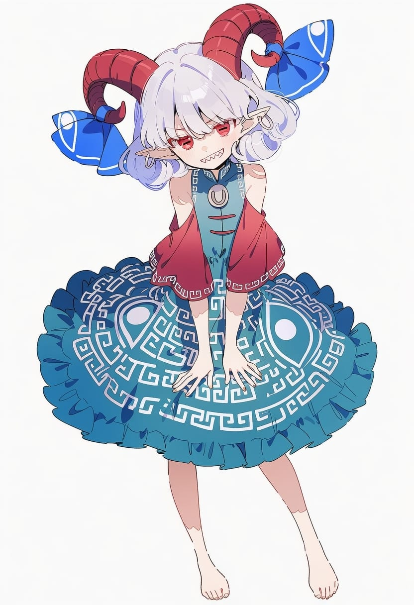
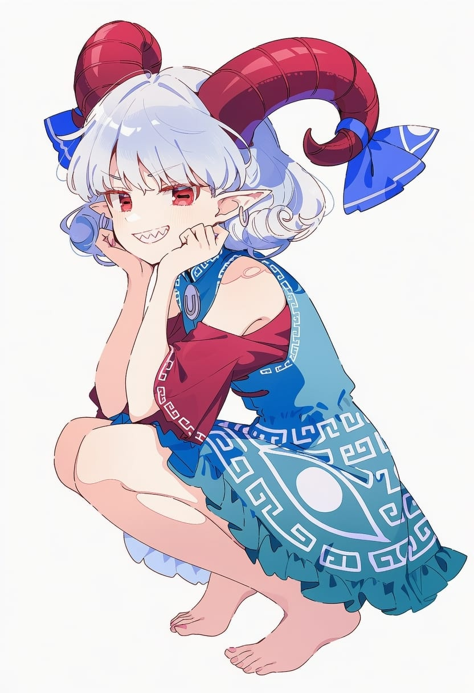
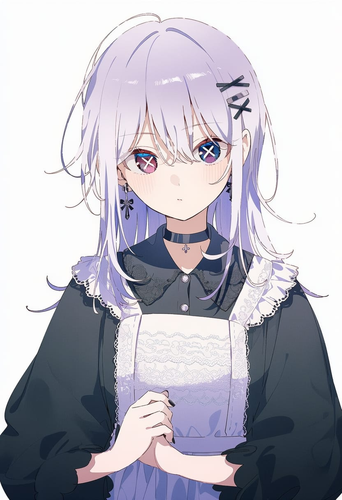
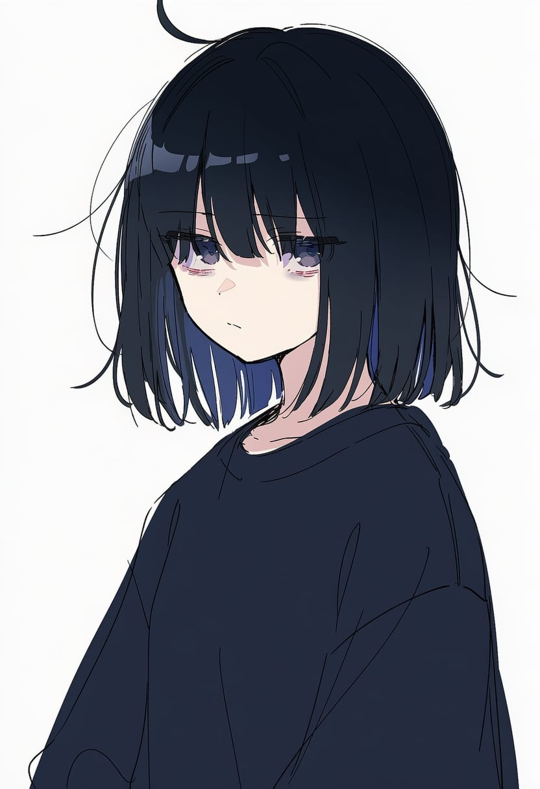
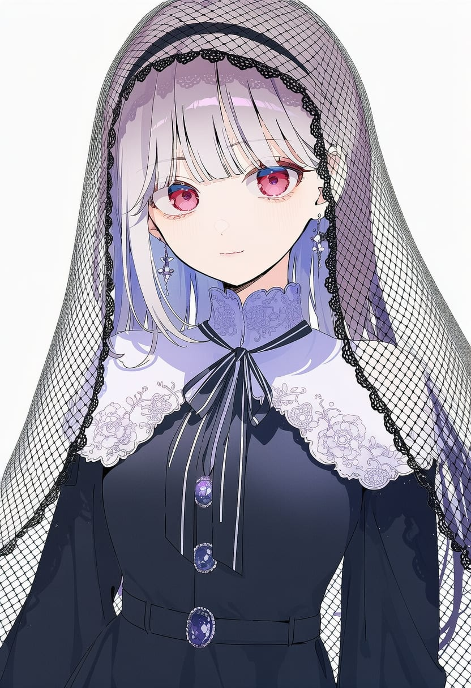
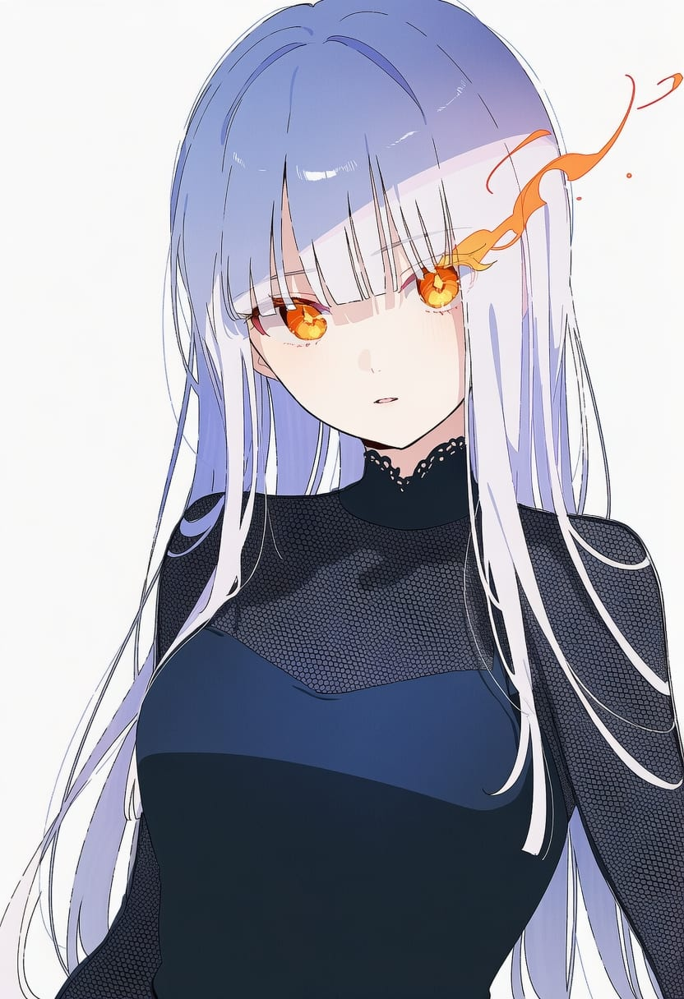
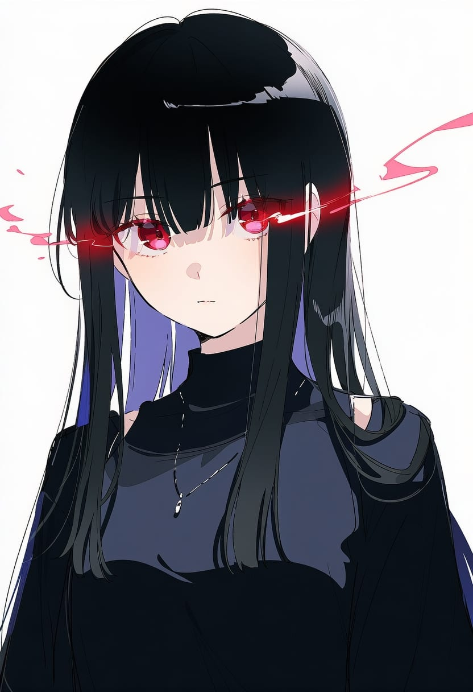
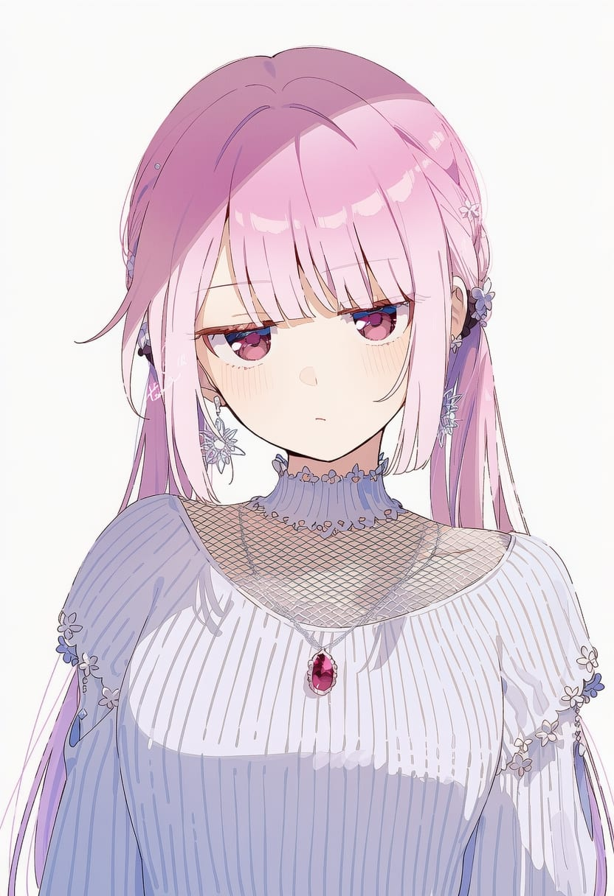
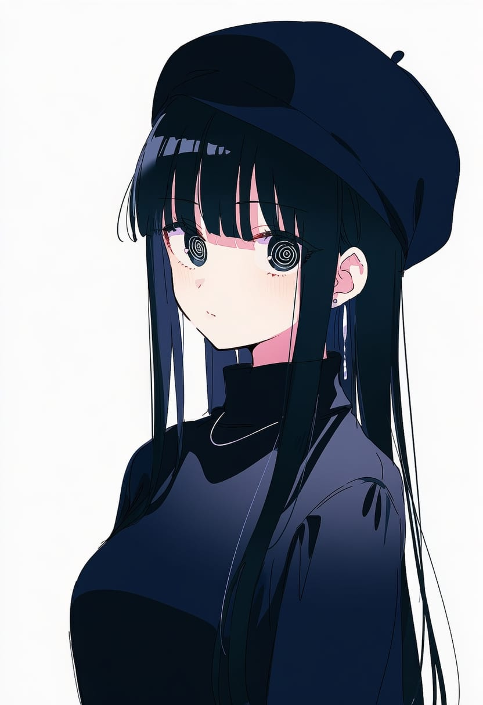
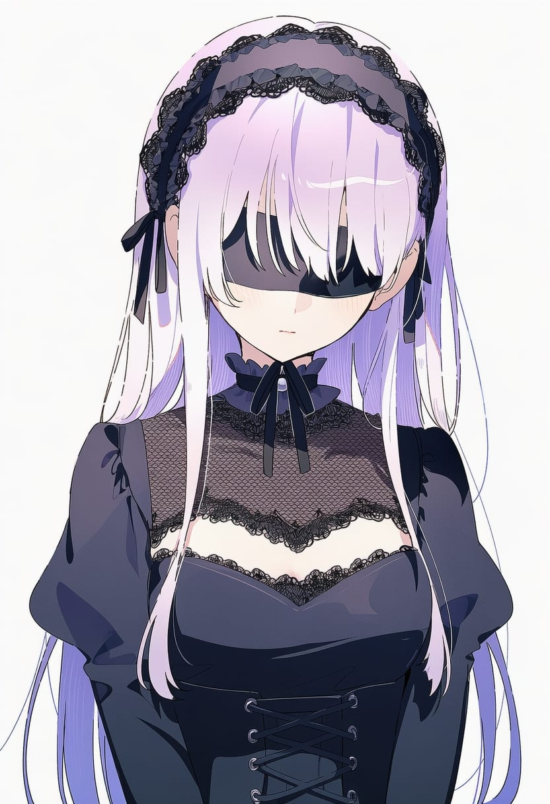

## 1. blue_eyes — 蓝眼睛

| 字段 | 内容 |
| --- | --- |
| 序号 | 0001 |
| tag | blue_eyes |
| tag中文名 | 蓝眼睛 |
| tag中文含义 | 虹膜是蓝色。 |
| tag所属的子类 | 虹膜颜色 |
| __EMPTY |  |

## 2. heterochromia — 异色瞳

| 字段 | 内容 |
| --- | --- |
| 序号 | 0002 |
| tag | heterochromia |
| tag中文名 | 异色瞳 |
| tag中文含义 | 左右眼的虹膜颜色不同。 |
| tag所属的子类 | 虹膜颜色 |
| __EMPTY |  |

## 3. multicolored_eyes — 多彩眼睛

| 字段 | 内容 |
| --- | --- |
| 序号 | 0003 |
| tag | multicolored_eyes |
| tag中文名 | 多彩眼睛 |
| tag中文含义 | 同一双眼里能看到多种明显颜色。 |
| tag所属的子类 | 虹膜颜色 |
| __EMPTY |  |

## 4. gradient_eyes — 渐变眼睛

| 字段 | 内容 |
| --- | --- |
| 序号 | 0004 |
| tag | gradient_eyes |
| tag中文名 | 渐变眼睛 |
| tag中文含义 | 虹膜颜色有明显渐变。 |
| tag所属的子类 | 虹膜颜色 |
| __EMPTY |  |

## 5. rainbow_eyes — 彩虹眼睛

| 字段 | 内容 |
| --- | --- |
| 序号 | 0005 |
| tag | rainbow_eyes |
| tag中文名 | 彩虹眼睛 |
| tag中文含义 | 虹膜呈彩虹般多色。 |
| tag所属的子类 | 虹膜颜色 |
| __EMPTY |  |

## 6. two-tone_eyes — 双色眼睛

| 字段 | 内容 |
| --- | --- |
| 序号 | 0006 |
| tag | two-tone_eyes |
| tag中文名 | 双色眼睛 |
| tag中文含义 | 单只眼睛里主要有两种明显颜色。 |
| tag所属的子类 | 虹膜颜色 |
| __EMPTY |  |

## 7. mismatched_irises — 虹膜不对称

| 字段 | 内容 |
| --- | --- |
| 序号 | 0007 |
| tag | mismatched_irises |
| tag中文名 | 虹膜不对称 |
| tag中文含义 | 两只眼睛的虹膜样式或形态不一样。 |
| tag所属的子类 | 瞳孔与虹膜形状 |
| __EMPTY |  |

## 8. ringed_eyes — 环状眼睛

| 字段 | 内容 |
| --- | --- |
| 序号 | 0008 |
| tag | ringed_eyes |
| tag中文名 | 环状眼睛 |
| tag中文含义 | 虹膜里有明显一圈圈的环纹。 |
| tag所属的子类 | 瞳孔与虹膜形状 |
| __EMPTY |  |

## 9. constricted_pupils — 缩小瞳孔

| 字段 | 内容 |
| --- | --- |
| 序号 | 0009 |
| tag | constricted_pupils |
| tag中文名 | 缩小瞳孔 |
| tag中文含义 | 瞳孔缩得很小。 |
| tag所属的子类 | 瞳孔与虹膜形状 |
| __EMPTY |  |

## 10. horizontal_pupils — 横向瞳孔

| 字段 | 内容 |
| --- | --- |
| 序号 | 0012 |
| tag | horizontal_pupils |
| tag中文名 | 横向瞳孔 |
| tag中文含义 | 瞳孔横着拉长，像羊或山羊的眼睛。 |
| tag所属的子类 | 瞳孔与虹膜形状 |
| __EMPTY |  |

## 11. mismatched_pupils — 瞳孔不对称

| 字段 | 内容 |
| --- | --- |
| 序号 | 0013 |
| tag | mismatched_pupils |
| tag中文名 | 瞳孔不对称 |
| tag中文含义 | 两只眼睛的瞳孔形状不同。 |
| tag所属的子类 | 瞳孔与虹膜形状 |
| __EMPTY |  |

## 12. no_pupils — 无瞳孔

| 字段 | 内容 |
| --- | --- |
| 序号 | 0014 |
| tag | no_pupils |
| tag中文名 | 无瞳孔 |
| tag中文含义 | 眼睛里看不到正常瞳孔。 |
| tag所属的子类 | 瞳孔与虹膜形状 |
| __EMPTY |  |

## 13. rectangular_pupils — 矩形瞳孔

| 字段 | 内容 |
| --- | --- |
| 序号 | 0015 |
| tag | rectangular_pupils |
| tag中文名 | 矩形瞳孔 |
| tag中文含义 | 瞳孔是方形或长方形。 |
| tag所属的子类 | 瞳孔与虹膜形状 |
| __EMPTY |  |

## 14. symbol-shaped_pupils — 符号形瞳孔

| 字段 | 内容 |
| --- | --- |
| 序号 | 0016 |
| tag | symbol-shaped_pupils |
| tag中文名 | 符号形瞳孔 |
| tag中文含义 | 瞳孔被画成某种符号形状。 |
| tag所属的子类 | 瞳孔与虹膜形状 |
| __EMPTY |  |

## 15. clock_eyes — 时钟眼

| 字段 | 内容 |
| --- | --- |
| 序号 | 0017 |
| tag | clock_eyes |
| tag中文名 | 时钟眼 |
| tag中文含义 | 眼睛里有钟表或表盘形图案。 |
| tag所属的子类 | 瞳孔与虹膜形状 |
| __EMPTY |  |

## 16. cross-shaped_pupils — 十字瞳孔

| 字段 | 内容 |
| --- | --- |
| 序号 | 0018 |
| tag | cross-shaped_pupils |
| tag中文名 | 十字瞳孔 |
| tag中文含义 | 瞳孔是十字形。 |
| tag所属的子类 | 瞳孔与虹膜形状 |
| __EMPTY |  |

## 17. crosshair_pupils — 准星瞳孔

| 字段 | 内容 |
| --- | --- |
| 序号 | 0019 |
| tag | crosshair_pupils |
| tag中文名 | 准星瞳孔 |
| tag中文含义 | 瞳孔像瞄准镜准星。 |
| tag所属的子类 | 瞳孔与虹膜形状 |
| __EMPTY |  |

## 18. diamond-shaped_pupils — 菱形瞳孔

| 字段 | 内容 |
| --- | --- |
| 序号 | 0020 |
| tag | diamond-shaped_pupils |
| tag中文名 | 菱形瞳孔 |
| tag中文含义 | 瞳孔是菱形。 |
| tag所属的子类 | 瞳孔与虹膜形状 |
| __EMPTY |  |

## 19. flower-shaped_pupils — 花形瞳孔

| 字段 | 内容 |
| --- | --- |
| 序号 | 0021 |
| tag | flower-shaped_pupils |
| tag中文名 | 花形瞳孔 |
| tag中文含义 | 瞳孔像花朵。 |
| tag所属的子类 | 瞳孔与虹膜形状 |
| __EMPTY |  |

## 20. heart-shaped_pupils — 心形瞳孔

| 字段 | 内容 |
| --- | --- |
| 序号 | 0022 |
| tag | heart-shaped_pupils |
| tag中文名 | 心形瞳孔 |
| tag中文含义 | 瞳孔是爱心形。 |
| tag所属的子类 | 瞳孔与虹膜形状 |
| __EMPTY |  |

## 21. slit_pupils — 竖缝瞳孔

| 字段 | 内容 |
| --- | --- |
| 序号 | 0023 |
| tag | slit_pupils |
| tag中文名 | 竖缝瞳孔 |
| tag中文含义 | 瞳孔是一条细长竖缝，像猫或爬行动物。 |
| tag所属的子类 | 瞳孔与虹膜形状 |
| __EMPTY |  |

## 22. solid_circle_pupils — 实心圆瞳孔

| 字段 | 内容 |
| --- | --- |
| 序号 | 0024 |
| tag | solid_circle_pupils |
| tag中文名 | 实心圆瞳孔 |
| tag中文含义 | 瞳孔是明显的实心圆。 |
| tag所属的子类 | 瞳孔与虹膜形状 |
| __EMPTY |  |

## 23. star-shaped_pupils — 星形瞳孔

| 字段 | 内容 |
| --- | --- |
| 序号 | 0025 |
| tag | star-shaped_pupils |
| tag中文名 | 星形瞳孔 |
| tag中文含义 | 瞳孔或瞳孔中心呈星星形。 |
| tag所属的子类 | 瞳孔与虹膜形状 |
| __EMPTY |  |

## 24. x-shaped_pupils — X形瞳孔

| 字段 | 内容 |
| --- | --- |
| 序号 | 0026 |
| tag | x-shaped_pupils |
| tag中文名 | X形瞳孔 |
| tag中文含义 | 瞳孔呈X形。 |
| tag所属的子类 | 瞳孔与虹膜形状 |
| __EMPTY |  |

## 25. bags_under_eyes — 眼袋

| 字段 | 内容 |
| --- | --- |
| 序号 | 0033 |
| tag | bags_under_eyes |
| tag中文名 | 眼袋 |
| tag中文含义 | 下眼睑下面有明显眼袋。 |
| tag所属的子类 | 眼周与特效 |
| __EMPTY |  |

## 26. aegyo_sal — 卧蚕

| 字段 | 内容 |
| --- | --- |
| 序号 | 0034 |
| tag | aegyo_sal |
| tag中文名 | 卧蚕 |
| tag中文含义 | 下眼睑紧贴睫毛处有饱满的小凸起。 |
| tag所属的子类 | 眼周与特效 |
| __EMPTY |  |

## 27. flaming_eyes — 燃烧眼睛

| 字段 | 内容 |
| --- | --- |
| 序号 | 0036 |
| tag | flaming_eyes |
| tag中文名 | 燃烧眼睛 |
| tag中文含义 | 眼睛周围或眼里有火焰效果。 |
| tag所属的子类 | 眼周与特效 |
| __EMPTY |  |

## 28. glowing_eyes — 发光双眼

| 字段 | 内容 |
| --- | --- |
| 序号 | 0037 |
| tag | glowing_eyes |
| tag中文名 | 发光双眼 |
| tag中文含义 | 两只眼睛明显发光。 |
| tag所属的子类 | 眼周与特效 |
| __EMPTY |  |

## 29. eye_trail — 眼部光轨

| 字段 | 内容 |
| --- | --- |
| 序号 | 0039 |
| tag | eye_trail |
| tag中文名 | 眼部光轨 |
| tag中文含义 | 眼睛发光并拖出光线或残影。 |
| tag所属的子类 | 眼周与特效 |
| __EMPTY |  |

## 30. pixel_eyes — 像素眼

| 字段 | 内容 |
| --- | --- |
| 序号 | 0042 |
| tag | pixel_eyes |
| tag中文名 | 像素眼 |
| tag中文含义 | 眼睛被表现成明显像素块风格。 |
| tag所属的子类 | 风格化眼睛 |
| __EMPTY |  |

## 31. crazy_eyes — 疯狂眼神

| 字段 | 内容 |
| --- | --- |
| 序号 | 0045 |
| tag | crazy_eyes |
| tag中文名 | 疯狂眼神 |
| tag中文含义 | 眼睛画得失控、癫狂或非常不稳定。 |
| tag所属的子类 | 风格化眼睛 |
| __EMPTY |  |

## 32. empty_eyes — 空洞眼神

| 字段 | 内容 |
| --- | --- |
| 序号 | 0046 |
| tag | empty_eyes |
| tag中文名 | 空洞眼神 |
| tag中文含义 | 眼睛没有神采，像失神或精神空白。 |
| tag所属的子类 | 风格化眼睛 |
| __EMPTY |  |

## 33. heart-shaped_eyes — 爱心眼

| 字段 | 内容 |
| --- | --- |
| 序号 | 0047 |
| tag | heart-shaped_eyes |
| tag中文名 | 爱心眼 |
| tag中文含义 | 整只眼睛被画成爱心形。 |
| tag所属的子类 | 风格化眼睛 |
| __EMPTY |  |

## 34. jitome — 鄙视眼/半睁眼

| 字段 | 内容 |
| --- | --- |
| 序号 | 0048 |
| tag | jitome |
| tag中文名 | 鄙视眼/半睁眼 |
| tag中文含义 | 上眼线较平，带冷淡或嫌弃感的半睁眼。 |
| tag所属的子类 | 风格化眼睛 |
| __EMPTY |  |

## 35. sanpaku — 三白眼

| 字段 | 内容 |
| --- | --- |
| 序号 | 0049 |
| tag | sanpaku |
| tag中文名 | 三白眼 |
| tag中文含义 | 虹膜上下或一侧露出较多眼白。 |
| tag所属的子类 | 风格化眼睛 |
| __EMPTY |  |

## 36. sparkling_eyes — 闪闪发亮的眼睛

| 字段 | 内容 |
| --- | --- |
| 序号 | 0052 |
| tag | sparkling_eyes |
| tag中文名 | 闪闪发亮的眼睛 |
| tag中文含义 | 眼睛里有很多高光或闪耀效果。 |
| tag所属的子类 | 风格化眼睛 |
| __EMPTY |  |

## 37. spiral-only_eyes — 螺旋眼

| 字段 | 内容 |
| --- | --- |
| 序号 | 0053 |
| tag | spiral-only_eyes |
| tag中文名 | 螺旋眼 |
| tag中文含义 | 眼睛主要由螺旋线组成。 |
| tag所属的子类 | 风格化眼睛 |
| __EMPTY |  |

## 38. tareme — 下垂眼

| 字段 | 内容 |
| --- | --- |
| 序号 | 0054 |
| tag | tareme |
| tag中文名 | 下垂眼 |
| tag中文含义 | 外眼角偏下，整体看起来柔和下垂。 |
| tag所属的子类 | 风格化眼睛 |
| __EMPTY |  |

## 39. tsurime — 吊梢眼

| 字段 | 内容 |
| --- | --- |
| 序号 | 0055 |
| tag | tsurime |
| tag中文名 | 吊梢眼 |
| tag中文含义 | 外眼角上挑，眼型偏锐利。 |
| tag所属的子类 | 风格化眼睛 |
| __EMPTY |  |

## 40. blinking — 眨眼

| 字段 | 内容 |
| --- | --- |
| 序号 | 0066 |
| tag | blinking |
| tag中文名 | 眨眼 |
| tag中文含义 | 正在眨眼的瞬间。 |
| tag所属的子类 | 闭眼与眼部状态 |
| __EMPTY |  |

## 41. closed_eyes — 闭眼

| 字段 | 内容 |
| --- | --- |
| 序号 | 0067 |
| tag | closed_eyes |
| tag中文名 | 闭眼 |
| tag中文含义 | 两只眼睛都闭着。 |
| tag所属的子类 | 闭眼与眼部状态 |
| __EMPTY |  |

## 42. one_eye_closed — 单眼闭合

| 字段 | 内容 |
| --- | --- |
| 序号 | 0068 |
| tag | one_eye_closed |
| tag中文名 | 单眼闭合 |
| tag中文含义 | 一只眼闭着，另一只睁着。 |
| tag所属的子类 | 闭眼与眼部状态 |
| __EMPTY |  |

## 43. half-closed_eyes — 半闭眼

| 字段 | 内容 |
| --- | --- |
| 序号 | 0070 |
| tag | half-closed_eyes |
| tag中文名 | 半闭眼 |
| tag中文含义 | 眼皮压低，眼睛只睁开一部分。 |
| tag所属的子类 | 闭眼与眼部状态 |
| __EMPTY |  |

## 44. narrowed_eyes — 眯细眼

| 字段 | 内容 |
| --- | --- |
| 序号 | 0071 |
| tag | narrowed_eyes |
| tag中文名 | 眯细眼 |
| tag中文含义 | 眼睛主动眯成细缝。 |
| tag所属的子类 | 闭眼与眼部状态 |
| __EMPTY |  |

## 45. squinting — 眯眼

| 字段 | 内容 |
| --- | --- |
| 序号 | 0072 |
| tag | squinting |
| tag中文名 | 眯眼 |
| tag中文含义 | 为了看清或受刺激而眯眼。 |
| tag所属的子类 | 闭眼与眼部状态 |
| __EMPTY |  |

## 46. pleading_eyes — 恳求眼神

| 字段 | 内容 |
| --- | --- |
| 序号 | 0073 |
| tag | pleading_eyes |
| tag中文名 | 恳求眼神 |
| tag中文含义 | 眼神表现出请求、撒娇或求助。 |
| tag所属的子类 | 闭眼与眼部状态 |
| __EMPTY |  |

## 47. covering_own_eyes — 遮住自己的眼睛

| 字段 | 内容 |
| --- | --- |
| 序号 | 0075 |
| tag | covering_own_eyes |
| tag中文名 | 遮住自己的眼睛 |
| tag中文含义 | 用自己的手或物体挡住眼睛。 |
| tag所属的子类 | 遮挡与眼部配饰 |
| __EMPTY |  |

## 48. hair_over_eyes — 头发遮住双眼

| 字段 | 内容 |
| --- | --- |
| 序号 | 0076 |
| tag | hair_over_eyes |
| tag中文名 | 头发遮住双眼 |
| tag中文含义 | 头发把两只眼睛都挡住。 |
| tag所属的子类 | 遮挡与眼部配饰 |
| __EMPTY |  |

## 49. hair_over_one_eye — 头发遮一只眼

| 字段 | 内容 |
| --- | --- |
| 序号 | 0077 |
| tag | hair_over_one_eye |
| tag中文名 | 头发遮一只眼 |
| tag中文含义 | 头发盖住其中一只眼睛。 |
| tag所属的子类 | 遮挡与眼部配饰 |
| __EMPTY |  |

## 50. bandage_over_one_eye — 绷带遮一只眼

| 字段 | 内容 |
| --- | --- |
| 序号 | 0078 |
| tag | bandage_over_one_eye |
| tag中文名 | 绷带遮一只眼 |
| tag中文含义 | 一只眼被绷带盖住。 |
| tag所属的子类 | 遮挡与眼部配饰 |
| __EMPTY |  |

## 51. blindfold — 蒙眼

| 字段 | 内容 |
| --- | --- |
| 序号 | 0079 |
| tag | blindfold |
| tag中文名 | 蒙眼 |
| tag中文含义 | 眼睛被布带或类似物完全遮住。 |
| tag所属的子类 | 遮挡与眼部配饰 |
| __EMPTY |  |

## 52. hat_over_eyes — 帽子遮眼

| 字段 | 内容 |
| --- | --- |
| 序号 | 0080 |
| tag | hat_over_eyes |
| tag中文名 | 帽子遮眼 |
| tag中文含义 | 帽檐压低挡住眼睛。 |
| tag所属的子类 | 遮挡与眼部配饰 |
| __EMPTY |  |

## 53. eyepatch — 眼罩

| 字段 | 内容 |
| --- | --- |
| 序号 | 0081 |
| tag | eyepatch |
| tag中文名 | 眼罩 |
| tag中文含义 | 戴着单眼眼罩。 |
| tag所属的子类 | 遮挡与眼部配饰 |
| __EMPTY |  |

## 54. eyelashes — 睫毛

| 字段 | 内容 |
| --- | --- |
| 序号 | 0082 |
| tag | eyelashes |
| tag中文名 | 睫毛 |
| tag中文含义 | 睫毛被明显画出来。 |
| tag所属的子类 | 遮挡与眼部配饰 |
| __EMPTY |  |

## 55. colored_eyelashes — 彩色睫毛

| 字段 | 内容 |
| --- | --- |
| 序号 | 0083 |
| tag | colored_eyelashes |
| tag中文名 | 彩色睫毛 |
| tag中文含义 | 睫毛不是常见黑色，而是明显其他颜色。 |
| tag所属的子类 | 遮挡与眼部配饰 |
| __EMPTY |  |

## 56. fake_eyelashes — 假睫毛

| 字段 | 内容 |
| --- | --- |
| 序号 | 0084 |
| tag | fake_eyelashes |
| tag中文名 | 假睫毛 |
| tag中文含义 | 佩戴明显的假睫毛。 |
| tag所属的子类 | 遮挡与眼部配饰 |
| __EMPTY |  |

## 57. eyes_visible_through_hair — 隔着头发可见眼睛

| 字段 | 内容 |
| --- | --- |
| 序号 | 0085 |
| tag | eyes_visible_through_hair |
| tag中文名 | 隔着头发可见眼睛 |
| tag中文含义 | 头发挡在前面，但眼睛仍被画出来看得见。 |
| tag所属的子类 | 遮挡与眼部配饰 |
| __EMPTY |  |

## 58. glasses — 眼镜

| 字段 | 内容 |
| --- | --- |
| 序号 | 0086 |
| tag | glasses |
| tag中文名 | 眼镜 |
| tag中文含义 | 佩戴普通眼镜。 |
| tag所属的子类 | 遮挡与眼部配饰 |
| __EMPTY |  |

## 59. eyeliner — 眼线

| 字段 | 内容 |
| --- | --- |
| 序号 | 0087 |
| tag | eyeliner |
| tag中文名 | 眼线 |
| tag中文含义 | 眼睛周围画有明显眼线。 |
| tag所属的子类 | 遮挡与眼部配饰 |
| __EMPTY |  |

## 60. eyeshadow — 眼影

| 字段 | 内容 |
| --- | --- |
| 序号 | 0088 |
| tag | eyeshadow |
| tag中文名 | 眼影 |
| tag中文含义 | 眼皮或眼周有明显眼影。 |
| tag所属的子类 | 遮挡与眼部配饰 |
| __EMPTY |  |

## 61. mascara — 睫毛膏

| 字段 | 内容 |
| --- | --- |
| 序号 | 0089 |
| tag | mascara |
| tag中文名 | 睫毛膏 |
| tag中文含义 | 睫毛有明显睫毛膏妆效。 |
| tag所属的子类 | 遮挡与眼部配饰 |
| __EMPTY |  |

---
