# 礼服

## 1. formal_clothes — 正装／正式服装

| 字段 | 内容 |
| --- | --- |
| 序号 | 0001 |
| tag | formal_clothes |
| tag中文名 | 正装／正式服装 |
| tag中文含义 | 泛指正式场合穿着的服饰组合，可覆盖礼服、西装、晚宴装等。 |
| tag所属的子类 | 通用正式礼服 |
| 角色 | navia_(genshin_impact) |

## 2. gown — 长礼服／舞会礼服

| 字段 | 内容 |
| --- | --- |
| 序号 | 0002 |
| tag | gown |
| tag中文名 | 长礼服／舞会礼服 |
| tag中文含义 | 正式、较华丽的长款裙装；Danbooru 中 ball_gown 为其别名/归并方向。 |
| tag所属的子类 | 通用正式礼服 |
| 角色 | himeko_(honkai:_star_rail) |

## 3. evening_gown — 晚礼服

| 字段 | 内容 |
| --- | --- |
| 序号 | 0003 |
| tag | evening_gown |
| tag中文名 | 晚礼服 |
| tag中文含义 | 晚宴、晚会、红毯或黑领结场合常见的长款正式礼服。 |
| tag所属的子类 | 通用正式礼服 |
| 角色 | black_swan_(honkai:_star_rail) |

## 4. cocktail_dress — 鸡尾酒裙／小礼服

| 字段 | 内容 |
| --- | --- |
| 序号 | 0004 |
| tag | cocktail_dress |
| tag中文名 | 鸡尾酒裙／小礼服 |
| tag中文含义 | 用于鸡尾酒会、宴会等半正式社交场合的礼服裙。 |
| tag所属的子类 | 通用正式礼服 |
| 角色 | nero_claudius_(fate) |

## 5. long_dress — 长款连衣裙

| 字段 | 内容 |
| --- | --- |
| 序号 | 0005 |
| tag | long_dress |
| tag中文名 | 长款连衣裙 |
| tag中文含义 | 裙摆较长、通常过膝至小腿或脚踝，可作为长礼服的基础结构标签。 |
| tag所属的子类 | 通用正式礼服 |
| 角色 | artoria_pendragon_(fate) |

## 6. silver_dress — 银色礼服

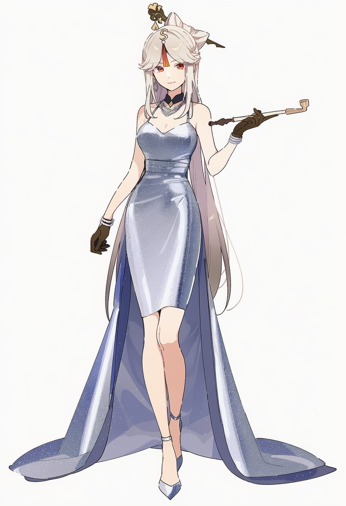

| 字段 | 内容 |
| --- | --- |
| 序号 | 0006 |
| tag | silver_dress |
| tag中文名 | 银色礼服 |
| tag中文含义 | 银色连衣裙；按“颜色只留一种”的规则作为唯一颜色变体代表。 |
| tag所属的子类 | 通用正式礼服 |
| 角色 | ningguang_(genshin_impact) |

## 7. backless_dress — 露背礼服

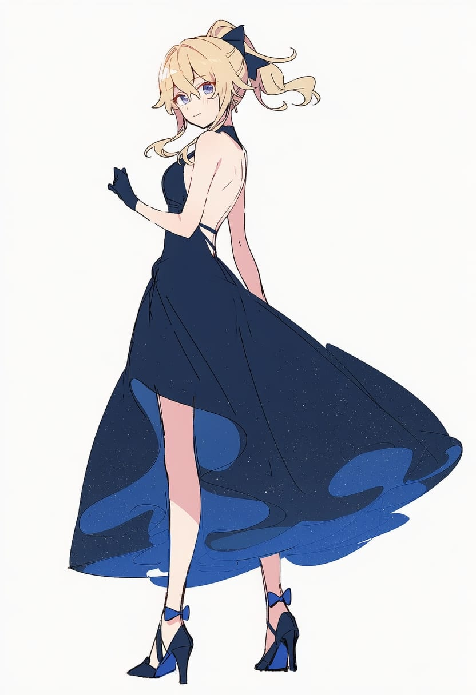

| 字段 | 内容 |
| --- | --- |
| 序号 | 0007 |
| tag | backless_dress |
| tag中文名 | 露背礼服 |
| tag中文含义 | 背部部分或大面积露出的连衣裙/礼服结构。 |
| tag所属的子类 | 礼服剪裁与装饰 |
| 角色 | jean_(genshin_impact) |

## 8. halter_dress — 挂脖礼服

| 字段 | 内容 |
| --- | --- |
| 序号 | 0008 |
| tag | halter_dress |
| tag中文名 | 挂脖礼服 |
| tag中文含义 | 领部或肩带绕颈固定的挂脖式连衣裙。 |
| tag所属的子类 | 礼服剪裁与装饰 |
| 角色 | lisa_(genshin_impact) |

## 9. off-shoulder_dress — 露肩／一字肩礼服

| 字段 | 内容 |
| --- | --- |
| 序号 | 0009 |
| tag | off-shoulder_dress |
| tag中文名 | 露肩／一字肩礼服 |
| tag中文含义 | 领口或袖部落在肩下，突出裸露肩部的礼服。 |
| tag所属的子类 | 礼服剪裁与装饰 |
| 角色 | mona_(genshin_impact) |

## 10. single-shoulder_dress — 单肩礼服

| 字段 | 内容 |
| --- | --- |
| 序号 | 0010 |
| tag | single-shoulder_dress |
| tag中文名 | 单肩礼服 |
| tag中文含义 | 只覆盖一侧肩部的非对称礼服结构。 |
| tag所属的子类 | 礼服剪裁与装饰 |
| 角色 | fischl_(genshin_impact) |

## 11. sleeveless_dress — 无袖礼服

| 字段 | 内容 |
| --- | --- |
| 序号 | 0011 |
| tag | sleeveless_dress |
| tag中文名 | 无袖礼服 |
| tag中文含义 | 没有常规袖子的连衣裙；适合作为正式裙装结构标签。 |
| tag所属的子类 | 礼服剪裁与装饰 |
| 角色 | eula_(genshin_impact) |

## 12. strapless_dress — 无肩带／抹胸礼服

| 字段 | 内容 |
| --- | --- |
| 序号 | 0012 |
| tag | strapless_dress |
| tag中文名 | 无肩带／抹胸礼服 |
| tag中文含义 | 没有肩带和常规袖子的抹胸式礼服。 |
| tag所属的子类 | 礼服剪裁与装饰 |
| 角色 | rosaria_(genshin_impact) |

## 13. high-low_dress — 前短后长礼服

| 字段 | 内容 |
| --- | --- |
| 序号 | 0013 |
| tag | high-low_dress |
| tag中文名 | 前短后长礼服 |
| tag中文含义 | 前侧裙摆较短、后侧裙摆较长的礼服轮廓。 |
| tag所属的子类 | 礼服剪裁与装饰 |
| 角色 | raiden_shogun |

## 14. layered_dress — 多层礼服

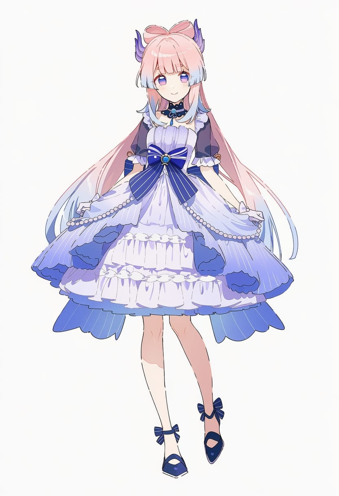

| 字段 | 内容 |
| --- | --- |
| 序号 | 0014 |
| tag | layered_dress |
| tag中文名 | 多层礼服 |
| tag中文含义 | 由多层面料或多层裙摆构成的连衣裙。 |
| tag所属的子类 | 礼服剪裁与装饰 |
| 角色 | sangonomiya_kokomi |

## 15. lace-trimmed_dress — 蕾丝饰边礼服

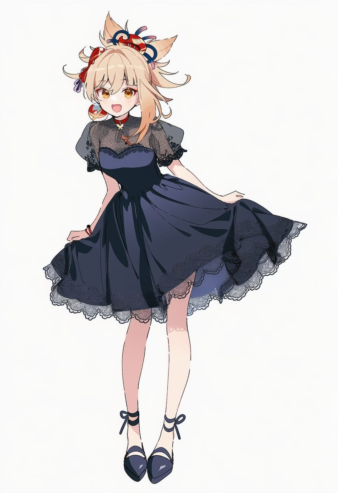

| 字段 | 内容 |
| --- | --- |
| 序号 | 0015 |
| tag | lace-trimmed_dress |
| tag中文名 | 蕾丝饰边礼服 |
| tag中文含义 | 边缘或局部带有蕾丝饰边的连衣裙。 |
| tag所属的子类 | 礼服剪裁与装饰 |
| 角色 | yoimiya_(genshin_impact) |

## 16. frilled_dress — 荷叶边／褶边礼服

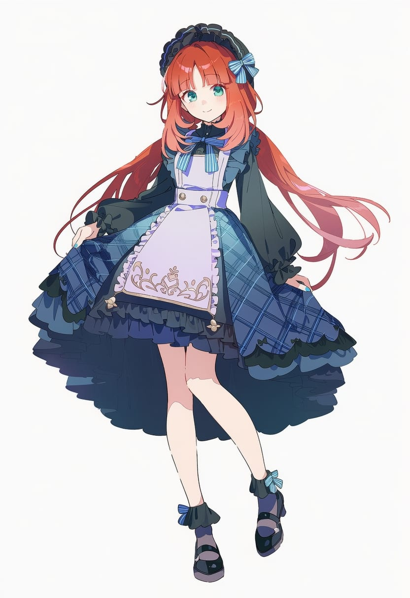

| 字段 | 内容 |
| --- | --- |
| 序号 | 0016 |
| tag | frilled_dress |
| tag中文名 | 荷叶边／褶边礼服 |
| tag中文含义 | 使用明显褶边、荷叶边装饰的连衣裙。 |
| tag所属的子类 | 礼服剪裁与装饰 |
| 角色 | nilou_(genshin_impact) |

## 17. ribbon-trimmed_dress — 缎带饰边礼服

| 字段 | 内容 |
| --- | --- |
| 序号 | 0017 |
| tag | ribbon-trimmed_dress |
| tag中文名 | 缎带饰边礼服 |
| tag中文含义 | 边缘或局部使用缎带进行装饰的礼服。 |
| tag所属的子类 | 礼服剪裁与装饰 |
| 角色 | dehya_(genshin_impact) |

## 18. glitter_dress — 闪光粉饰礼服

| 字段 | 内容 |
| --- | --- |
| 序号 | 0018 |
| tag | glitter_dress |
| tag中文名 | 闪光粉饰礼服 |
| tag中文含义 | 布料或表面具有 glitter 闪光颗粒效果的礼服。 |
| tag所属的子类 | 礼服剪裁与装饰 |
| 角色 | candace_(genshin_impact) |

## 19. puffy_dress — 蓬鼓礼服

| 字段 | 内容 |
| --- | --- |
| 序号 | 0019 |
| tag | puffy_dress |
| tag中文名 | 蓬鼓礼服 |
| tag中文含义 | 裙体或裙摆呈明显蓬起、鼓胀轮廓的连衣裙。 |
| tag所属的子类 | 礼服剪裁与装饰 |
| 角色 | furina_(genshin_impact) |

## 20. pencil_dress — 铅笔裙式连衣裙

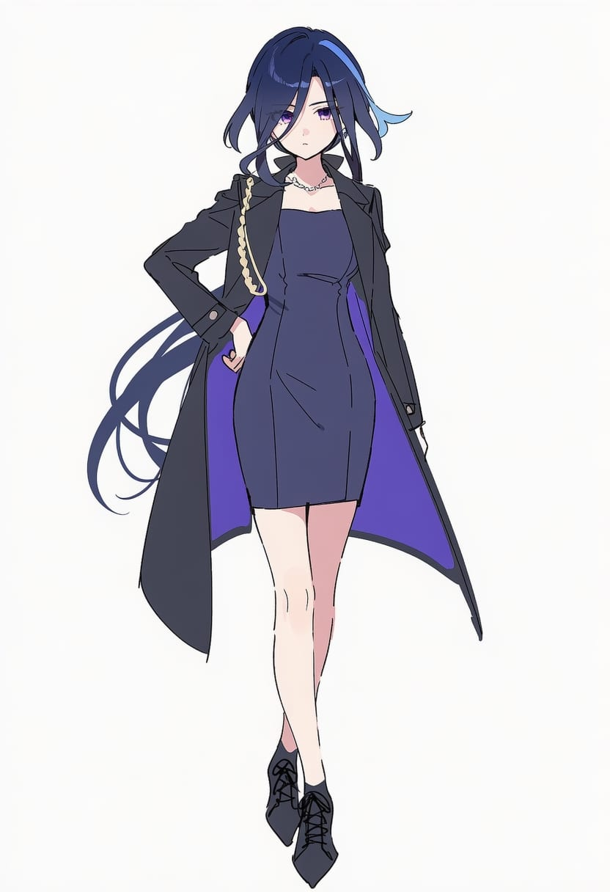

| 字段 | 内容 |
| --- | --- |
| 序号 | 0020 |
| tag | pencil_dress |
| tag中文名 | 铅笔裙式连衣裙 |
| tag中文含义 | 整体窄直、贴合身体线条的铅笔裙式连衣裙。 |
| tag所属的子类 | 礼服剪裁与装饰 |
| 角色 | clorinde_(genshin_impact) |

## 21. tight_dress — 紧身礼服

| 字段 | 内容 |
| --- | --- |
| 序号 | 0021 |
| tag | tight_dress |
| tag中文名 | 紧身礼服 |
| tag中文含义 | 整体较贴身、强调身体线条的连衣裙。 |
| tag所属的子类 | 礼服剪裁与装饰 |
| 角色 | arlecchino_(genshin_impact) |

## 22. suit — 西装／正式套装

| 字段 | 内容 |
| --- | --- |
| 序号 | 0022 |
| tag | suit |
| tag中文名 | 西装／正式套装 |
| tag中文含义 | 剪裁正式的成套服装，适合商务、典礼、宴会等正式场合。 |
| tag所属的子类 | 正式套装／社交正装 |
| 角色 | stelle_(honkai:_star_rail) |

## 23. business_suit — 商务西装

| 字段 | 内容 |
| --- | --- |
| 序号 | 0023 |
| tag | business_suit |
| tag中文名 | 商务西装 |
| tag中文含义 | 偏商务正式场合的成套西装。 |
| tag所属的子类 | 正式套装／社交正装 |
| 角色 | bronya_rand |

## 24. skirt_suit — 裙装西服

| 字段 | 内容 |
| --- | --- |
| 序号 | 0024 |
| tag | skirt_suit |
| tag中文名 | 裙装西服 |
| tag中文含义 | 西装外套与配套半身裙组成的正式女式套装。 |
| tag所属的子类 | 正式套装／社交正装 |
| 角色 | kafka_(honkai:_star_rail) |

## 25. pant_suit — 裤装西服

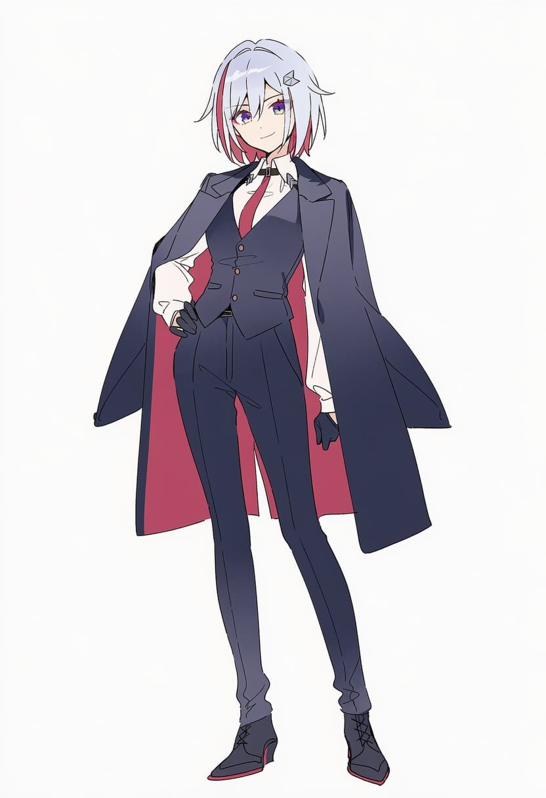

| 字段 | 内容 |
| --- | --- |
| 序号 | 0025 |
| tag | pant_suit |
| tag中文名 | 裤装西服 |
| tag中文含义 | 西装外套与配套长裤组成的正式女式套装。 |
| tag所属的子类 | 正式套装／社交正装 |
| 角色 | topaz_(honkai:_star_rail) |

## 26. tuxedo — 晚礼服西装／礼服西装

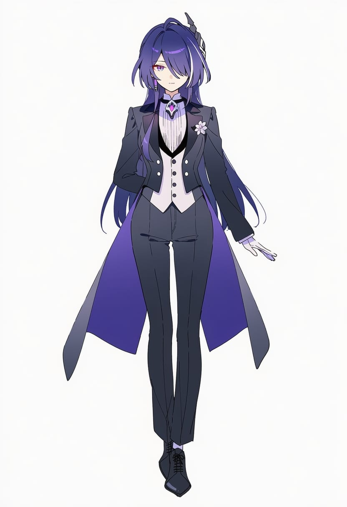

| 字段 | 内容 |
| --- | --- |
| 序号 | 0026 |
| tag | tuxedo |
| tag中文名 | 晚礼服西装／礼服西装 |
| tag中文含义 | 黑领结等晚间正式场合常用的礼服西装。 |
| tag所属的子类 | 正式套装／社交正装 |
| 角色 | acheron_(honkai:_star_rail) |

## 27. wedding_dress — 婚纱／西式婚礼礼服

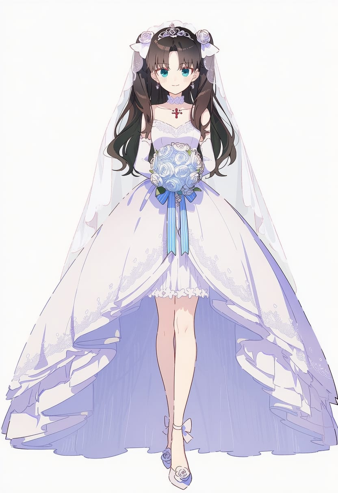

| 字段 | 内容 |
| --- | --- |
| 序号 | 0027 |
| tag | wedding_dress |
| tag中文名 | 婚纱／西式婚礼礼服 |
| tag中文含义 | 西式婚礼中典型的新娘礼服。 |
| tag所属的子类 | 西式婚礼礼装 |
| 角色 | tohsaka_rin |

## 28. bridal_veil — 新娘头纱

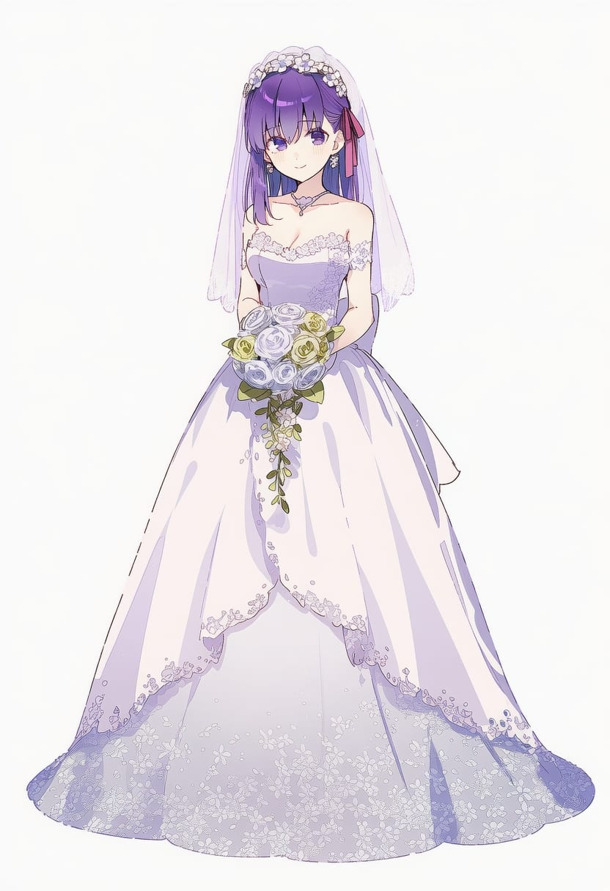

| 字段 | 内容 |
| --- | --- |
| 序号 | 0028 |
| tag | bridal_veil |
| tag中文名 | 新娘头纱 |
| tag中文含义 | 婚礼中覆盖头部或面部的新娘头纱。 |
| tag所属的子类 | 西式婚礼礼装 |
| 角色 | matou_sakura |

## 29. bridal_gauntlets — 新娘长手套／新娘臂套

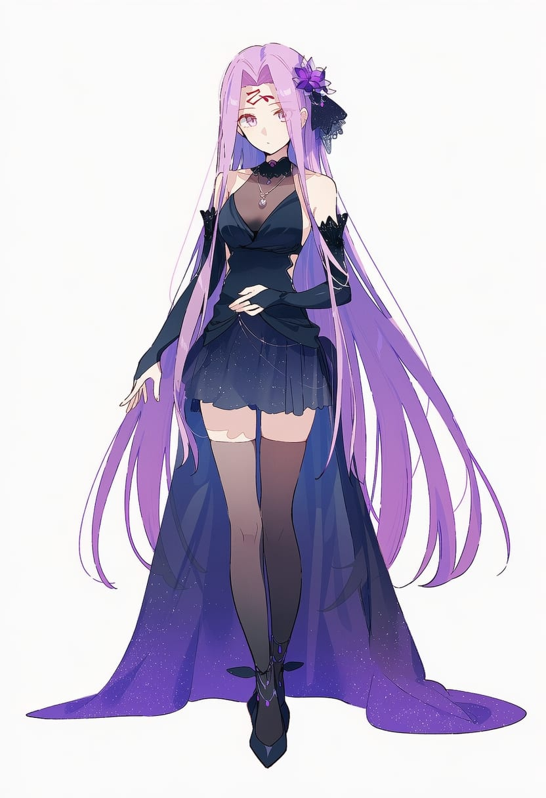

| 字段 | 内容 |
| --- | --- |
| 序号 | 0029 |
| tag | bridal_gauntlets |
| tag中文名 | 新娘长手套／新娘臂套 |
| tag中文含义 | 常见于婚纱造型的贴身长手套或带指环固定的臂套。 |
| tag所属的子类 | 西式婚礼礼装 |
| 角色 | medusa_(fate) |

## 30. veil — 面纱／头纱

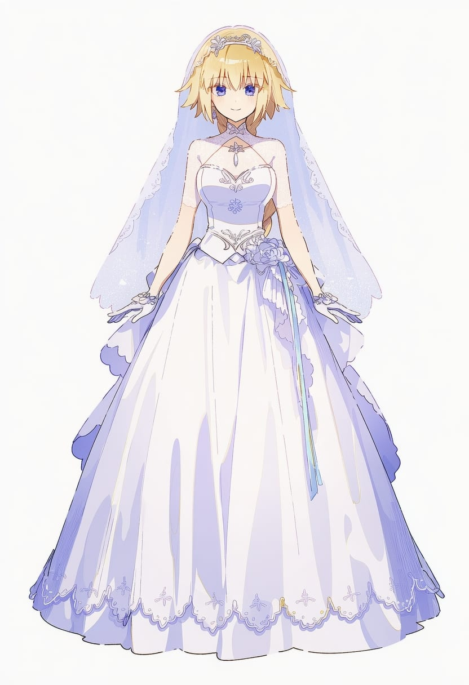

| 字段 | 内容 |
| --- | --- |
| 序号 | 0030 |
| tag | veil |
| tag中文名 | 面纱／头纱 |
| tag中文含义 | 覆盖头部或面部的薄纱；婚礼和部分哀悼场合都可出现。 |
| tag所属的子类 | 西式婚礼礼装 |
| 角色 | jeanne_d'arc_(fate) |

## 31. train_(clothing) — 礼服拖尾

| 字段 | 内容 |
| --- | --- |
| 序号 | 0031 |
| tag | train_(clothing) |
| tag中文名 | 礼服拖尾 |
| tag中文含义 | 裙摆向身后延伸并拖地的部分，婚纱和正式长礼服中很常见。 |
| tag所属的子类 | 西式婚礼礼装 |
| 角色 | mash_kyrielight |

## 32. nontraditional_wedding_dress — 非传统婚纱／非传统婚礼礼服

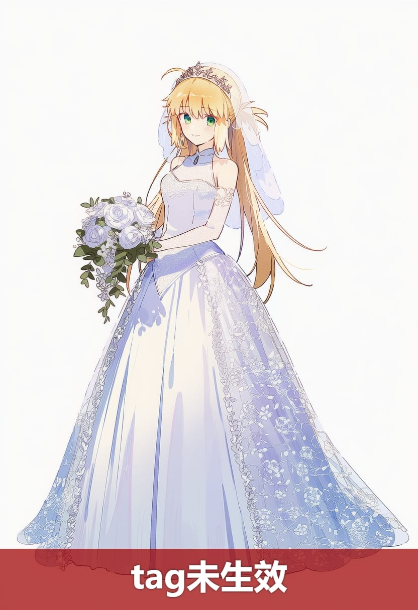

| 字段 | 内容 |
| --- | --- |
| 序号 | 0032 |
| tag | nontraditional_wedding_dress |
| tag中文名 | 非传统婚纱／非传统婚礼礼服 |
| tag中文含义 | 打破传统西式婚纱规范的婚礼礼服，例如特殊轮廓、非常规结构或明显非传统设计。 |
| tag所属的子类 | 西式婚礼礼装 |
| 角色 | altria_caster_(fate) |

## 33. chinese_clothes — 中式传统服饰

| 字段 | 内容 |
| --- | --- |
| 序号 | 0033 |
| tag | chinese_clothes |
| tag中文名 | 中式传统服饰 |
| tag中文含义 | Danbooru 对中式传统/民族服装的宽泛总类标签。 |
| tag所属的子类 | 中式婚礼／传统礼装 |
| 角色 | keqing_(genshin_impact) |

## 34. china_dress — 中式连衣裙／旗袍系礼装

| 字段 | 内容 |
| --- | --- |
| 序号 | 0034 |
| tag | china_dress |
| tag中文名 | 中式连衣裙／旗袍系礼装 |
| tag中文含义 | Danbooru 常见的 China dress 标签，常与 chinese_clothes、dress 搭配。 |
| tag所属的子类 | 中式婚礼／传统礼装 |
| 角色 | ganyu_(genshin_impact) |

## 35. qipao — 旗袍

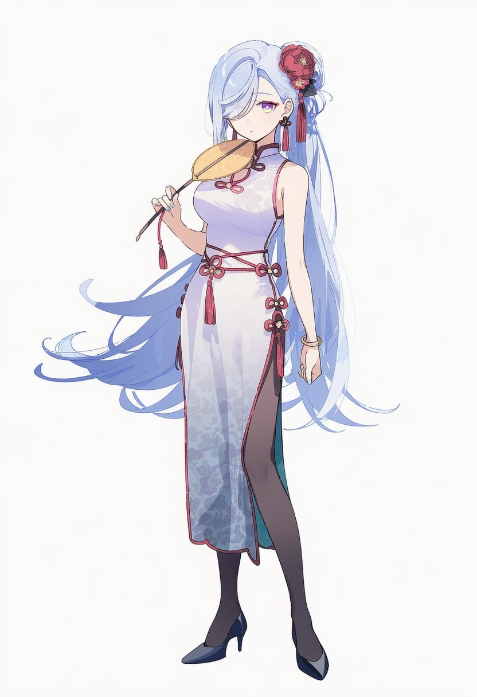

| 字段 | 内容 |
| --- | --- |
| 序号 | 0035 |
| tag | qipao |
| tag中文名 | 旗袍 |
| tag中文含义 | 具有立领、盘扣、侧开衩等典型特征的中式礼装/连衣裙。 |
| tag所属的子类 | 中式婚礼／传统礼装 |
| 角色 | shenhe_(genshin_impact) |

## 36. hanfu — 汉服

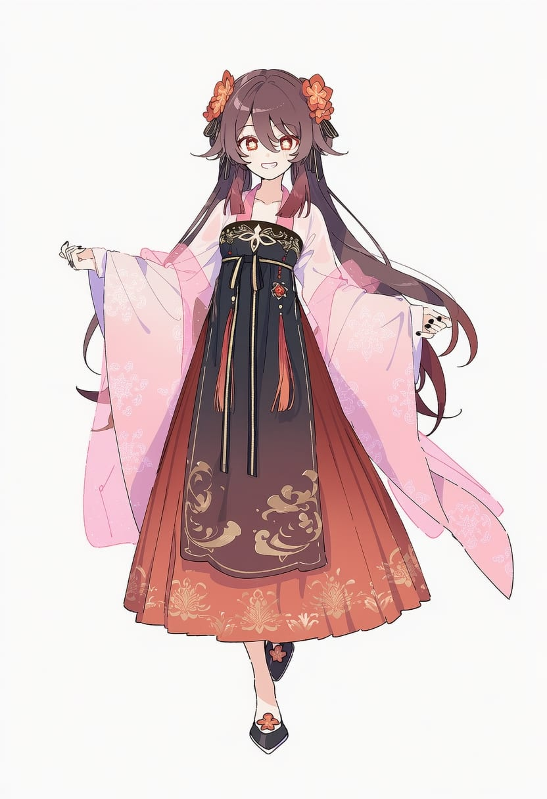

| 字段 | 内容 |
| --- | --- |
| 序号 | 0036 |
| tag | hanfu |
| tag中文名 | 汉服 |
| tag中文含义 | 汉民族传统服饰的总称，可用于婚礼、节庆和典礼造型。 |
| tag所属的子类 | 中式婚礼／传统礼装 |
| 角色 | hu_tao_(genshin_impact) |

## 37. tangzhuang — 唐装

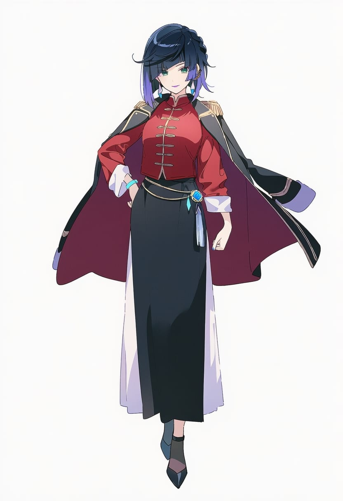

| 字段 | 内容 |
| --- | --- |
| 序号 | 0037 |
| tag | tangzhuang |
| tag中文名 | 唐装 |
| tag中文含义 | 中式传统上装/礼装风格，常见盘扣和立领元素。 |
| tag所属的子类 | 中式婚礼／传统礼装 |
| 角色 | yelan_(genshin_impact) |

## 38. changpao — 长袍

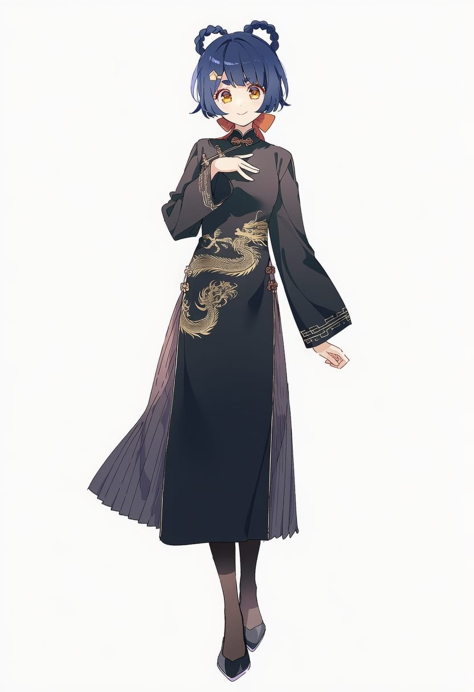

| 字段 | 内容 |
| --- | --- |
| 序号 | 0038 |
| tag | changpao |
| tag中文名 | 长袍 |
| tag中文含义 | 中式传统长袍类服装，可用于正式、历史或礼仪造型。 |
| tag所属的子类 | 中式婚礼／传统礼装 |
| 角色 | xiangling_(genshin_impact) |

## 39. chinese_wedding — 中式婚礼

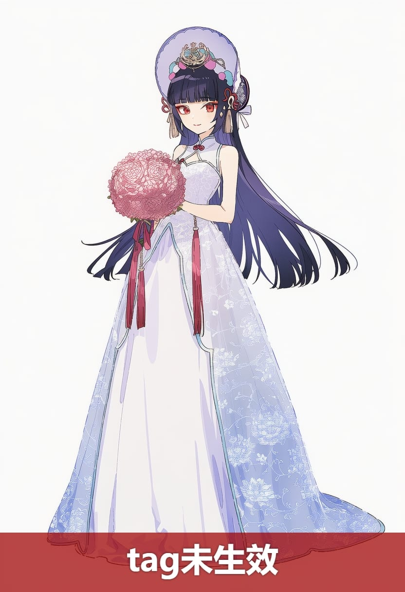

| 字段 | 内容 |
| --- | --- |
| 序号 | 0039 |
| tag | chinese_wedding |
| tag中文名 | 中式婚礼 |
| tag中文含义 | 用于中式婚礼主题或中式婚礼造型的场景／服饰组合标签，常与 chinese_clothes、hanfu、honggaitou 等共同出现。 |
| tag所属的子类 | 中式婚礼／传统礼装 |
| 角色 | yun_jin_(genshin_impact) |

## 40. honggaitou — 红盖头

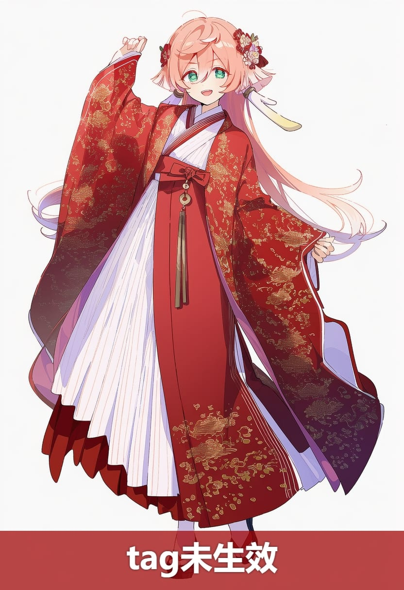

| 字段 | 内容 |
| --- | --- |
| 序号 | 0040 |
| tag | honggaitou |
| tag中文名 | 红盖头 |
| tag中文含义 | 中式传统婚礼中新娘用于遮盖头部和面部的红色盖头／婚礼面纱。 |
| tag所属的子类 | 中式婚礼／传统礼装 |
| 角色 | yanfei_(genshin_impact) |

## 41. japanese_clothes — 日式传统服饰

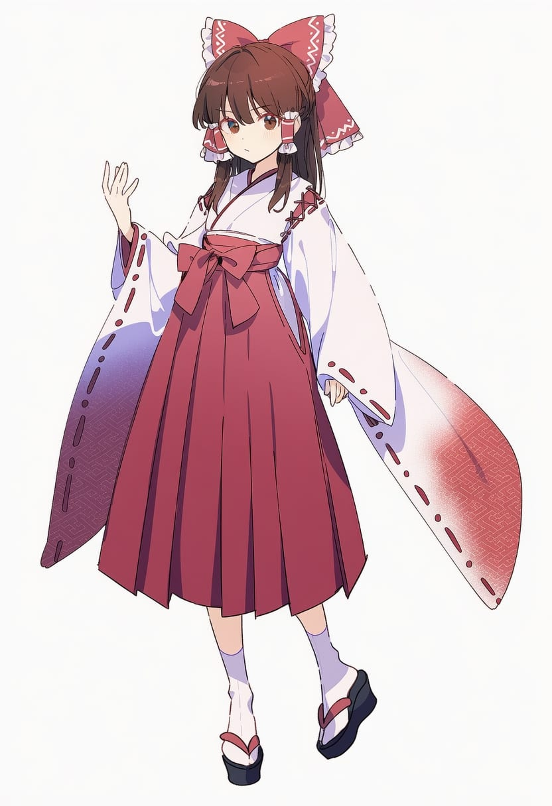

| 字段 | 内容 |
| --- | --- |
| 序号 | 0041 |
| tag | japanese_clothes |
| tag中文名 | 日式传统服饰 |
| tag中文含义 | Danbooru 对日本传统服饰的宽泛总类标签。 |
| tag所属的子类 | 日式婚礼／礼仪礼装 |
| 角色 | hakurei_reimu |

## 42. kimono — 和服

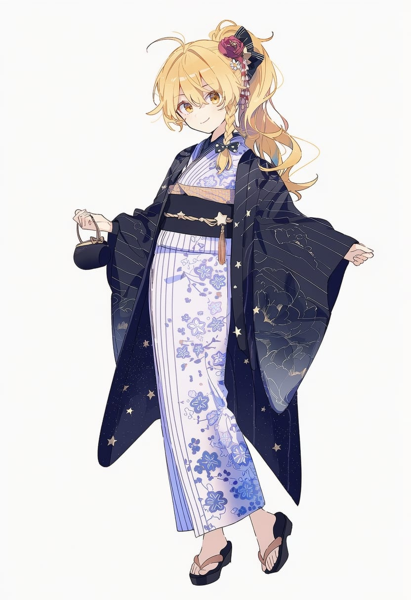

| 字段 | 内容 |
| --- | --- |
| 序号 | 0042 |
| tag | kimono |
| tag中文名 | 和服 |
| tag中文含义 | 日本传统袍服总类；婚礼、成人式、节庆等正式场合均常见。 |
| tag所属的子类 | 日式婚礼／礼仪礼装 |
| 角色 | kirisame_marisa |

## 43. furisode — 振袖

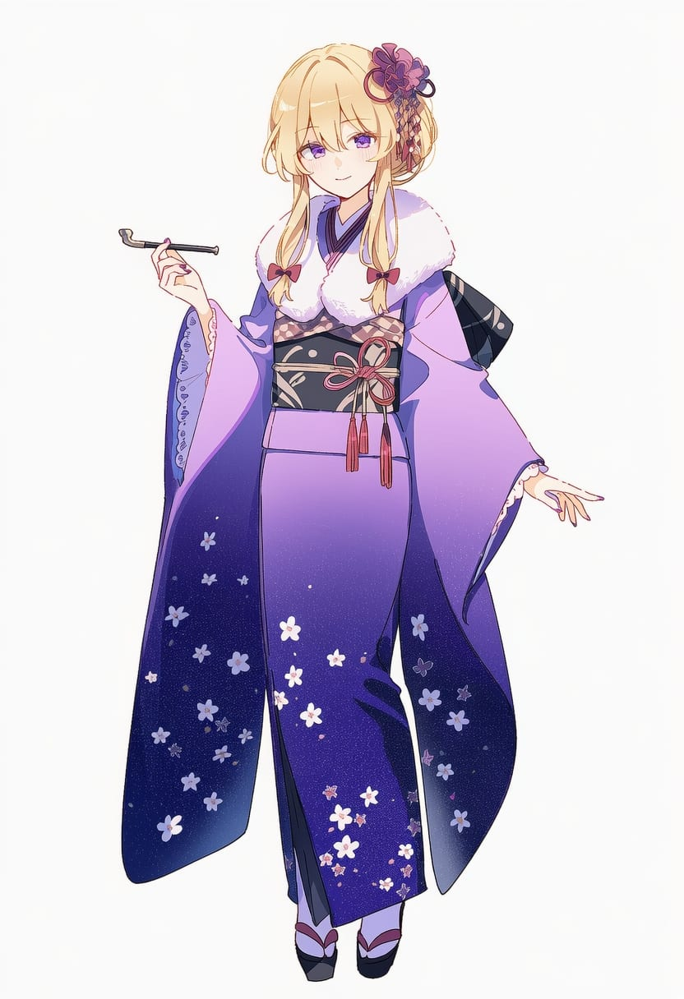

| 字段 | 内容 |
| --- | --- |
| 序号 | 0043 |
| tag | furisode |
| tag中文名 | 振袖 |
| tag中文含义 | 未婚女性最正式的和服样式之一，长袖，常用于成人式和婚礼等场合。 |
| tag所属的子类 | 日式婚礼／礼仪礼装 |
| 角色 | yakumo_yukari |

## 44. shiromuku — 白无垢

| 字段 | 内容 |
| --- | --- |
| 序号 | 0045 |
| tag | shiromuku |
| tag中文名 | 白无垢 |
| tag中文含义 | 通体白色的日式新娘婚礼礼装，属于婚礼用 uchikake 系。 |
| tag所属的子类 | 日式婚礼／礼仪礼装 |
| 角色 | kochiya_sanae |

## 45. hakama — 袴

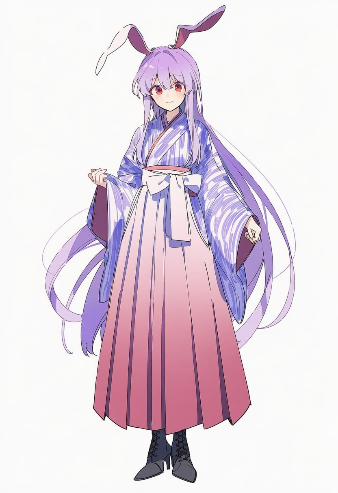

| 字段 | 内容 |
| --- | --- |
| 序号 | 0048 |
| tag | hakama |
| tag中文名 | 袴 |
| tag中文含义 | 传统褶裥下装，既可为分腿式也可呈裙状，常用于礼仪、毕业等正式场合。 |
| tag所属的子类 | 日式婚礼／礼仪礼装 |
| 角色 | reisen_udongein_inaba |

## 46. haori — 羽织

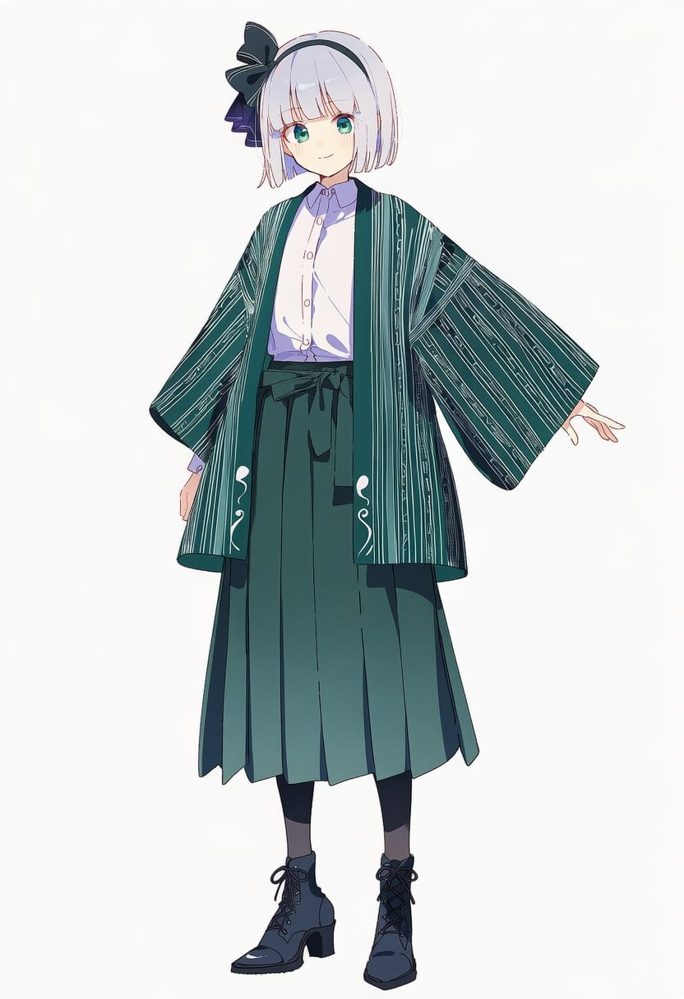

| 字段 | 内容 |
| --- | --- |
| 序号 | 0049 |
| tag | haori |
| tag中文名 | 羽织 |
| tag中文含义 | 穿在和服外的短外套，可加强正式和传统造型层次。 |
| tag所属的子类 | 日式婚礼／礼仪礼装 |
| 角色 | konpaku_youmu |

## 47. layered_kimono — 多层和服

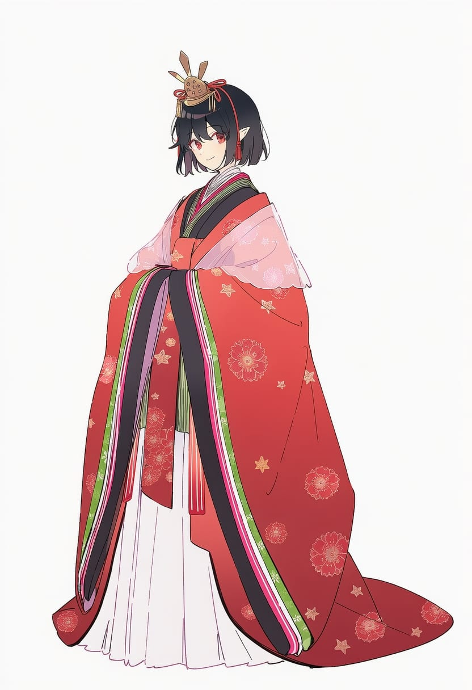

| 字段 | 内容 |
| --- | --- |
| 序号 | 0050 |
| tag | layered_kimono |
| tag中文名 | 多层和服 |
| tag中文含义 | 多层叠穿的和服造型，适合强调礼仪、宫廷或华丽传统服装。 |
| tag所属的子类 | 日式婚礼／礼仪礼装 |
| 角色 | shameimaru_aya |

## 48. shiroshouzoku — 白装束

| 字段 | 内容 |
| --- | --- |
| 序号 | 0051 |
| tag | shiroshouzoku |
| tag中文名 | 白装束 |
| tag中文含义 | 全白色的日本仪式服装，可见于神道祭祀等宗教/礼仪场景。 |
| tag所属的子类 | 日式婚礼／礼仪礼装 |
| 角色 | ibuki_suika |

## 49. korean_clothes — 韩国传统服饰

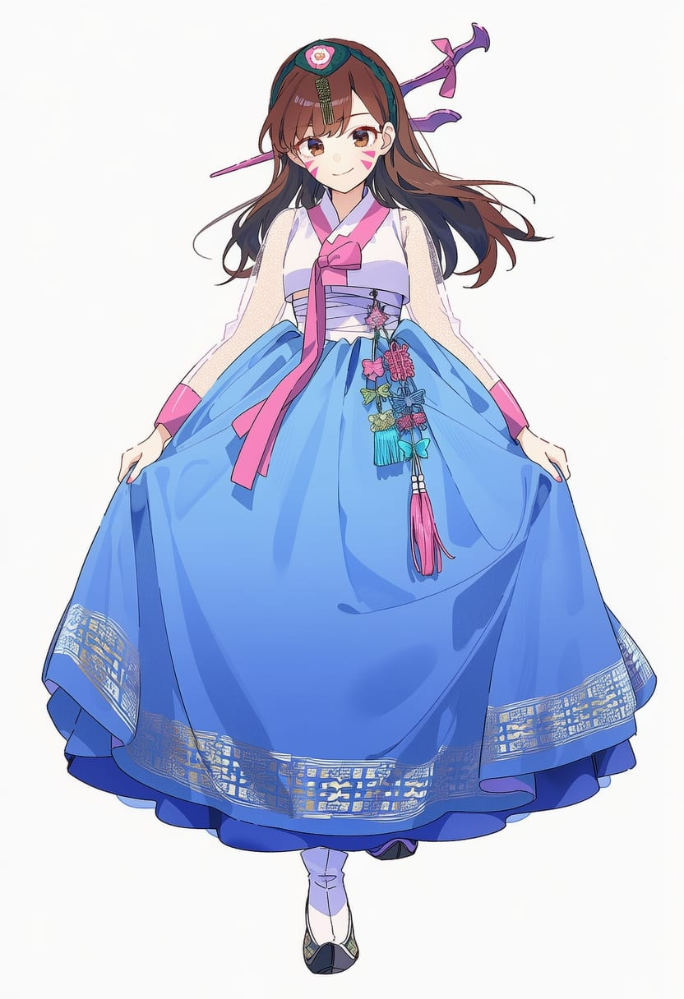

| 字段 | 内容 |
| --- | --- |
| 序号 | 0052 |
| tag | korean_clothes |
| tag中文名 | 韩国传统服饰 |
| tag中文含义 | 韩国传统服装的宽泛总类标签。 |
| tag所属的子类 | 其他民族／地区礼装 |
| 角色 | d.va_(overwatch) |

## 50. hanbok — 韩服

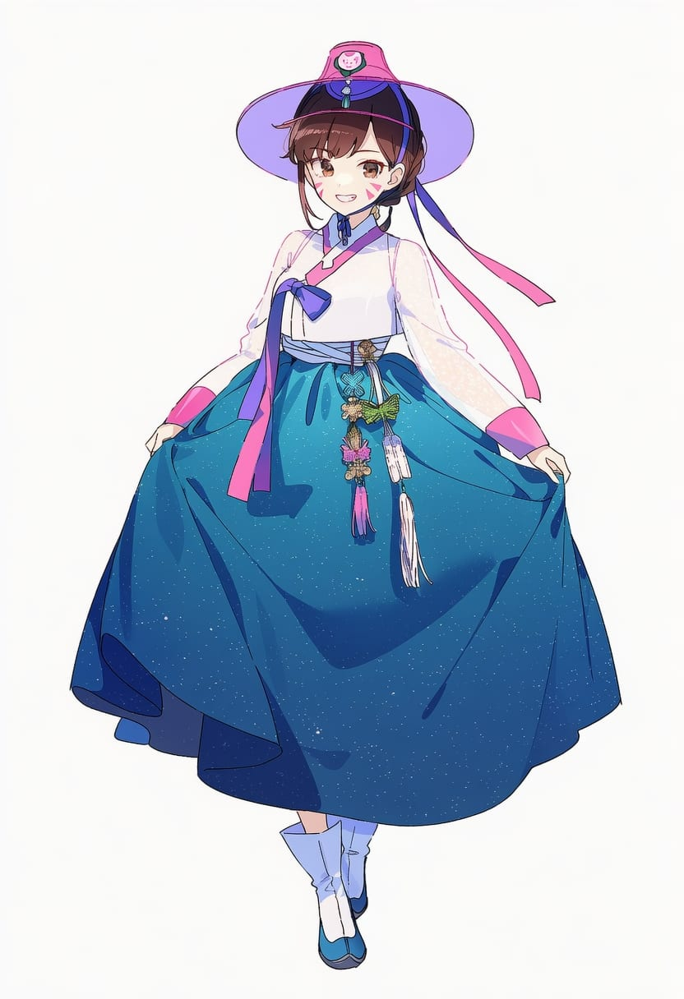

| 字段 | 内容 |
| --- | --- |
| 序号 | 0053 |
| tag | hanbok |
| tag中文名 | 韩服 |
| tag中文含义 | 韩国传统礼装体系，适用于节庆、婚礼、宫廷等造型。 |
| tag所属的子类 | 其他民族／地区礼装 |
| 角色 | d.va_(overwatch) |

## 51. ao_dai — 奥黛

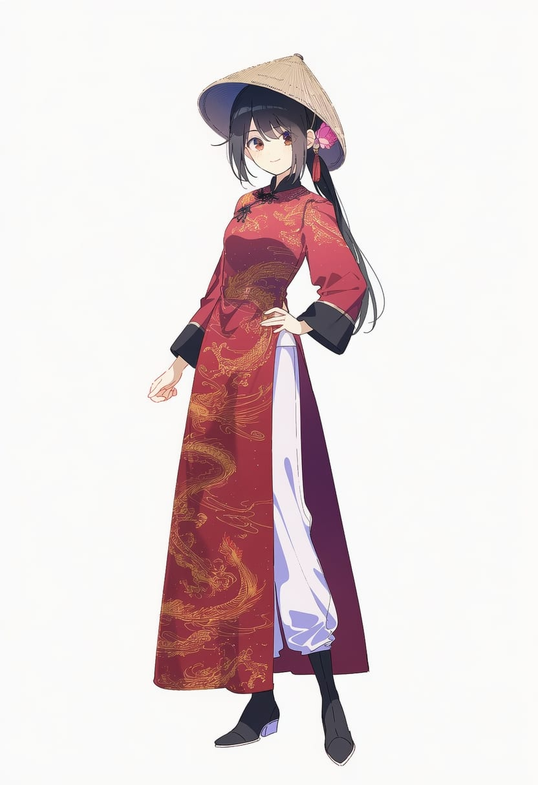

| 字段 | 内容 |
| --- | --- |
| 序号 | 0054 |
| tag | ao_dai |
| tag中文名 | 奥黛 |
| tag中文含义 | 越南传统长衫式礼装，常配长裤，适合正式或节庆场合。 |
| tag所属的子类 | 其他民族／地区礼装 |
| 角色 | vietnam_(hetalia) |

## 52. vietnamese_clothes — 越南传统服饰

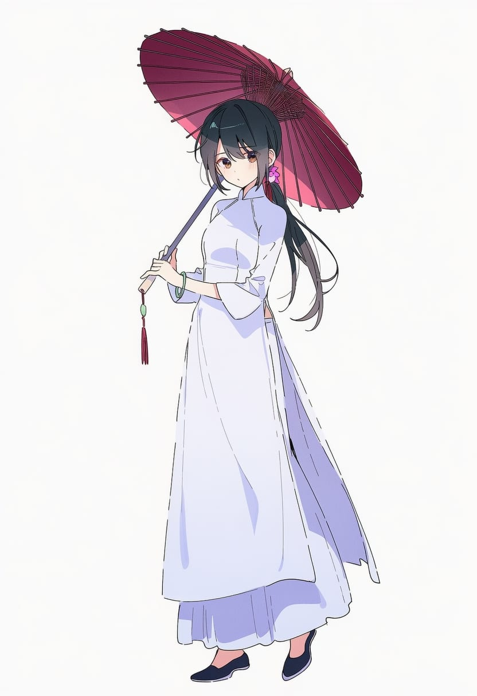

| 字段 | 内容 |
| --- | --- |
| 序号 | 0055 |
| tag | vietnamese_clothes |
| tag中文名 | 越南传统服饰 |
| tag中文含义 | 越南传统服装的宽泛总类标签。 |
| tag所属的子类 | 其他民族／地区礼装 |
| 角色 | vietnam_(hetalia) |

## 53. asian_indian_clothes — 南亚／印度传统服饰

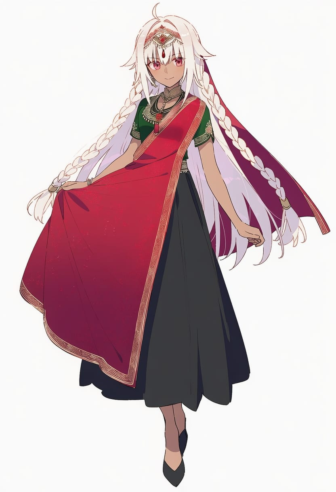

| 字段 | 内容 |
| --- | --- |
| 序号 | 0056 |
| tag | asian_indian_clothes |
| tag中文名 | 南亚／印度传统服饰 |
| tag中文含义 | 用于印度/南亚传统服装的总类标签。 |
| tag所属的子类 | 其他民族／地区礼装 |
| 角色 | lakshmibai_(fate/grand_order) |

## 54. sari — 纱丽

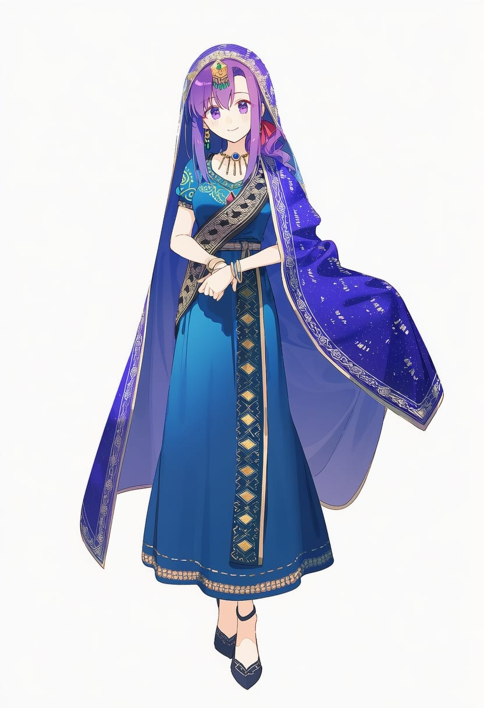

| 字段 | 内容 |
| --- | --- |
| 序号 | 0057 |
| tag | sari |
| tag中文名 | 纱丽 |
| tag中文含义 | 南亚传统的缠裹式长幅服装，可用于婚礼、节庆和正式场合。 |
| tag所属的子类 | 其他民族／地区礼装 |
| 角色 | parvati_(fate/grand_order) |

## 55. arabian_clothes — 阿拉伯传统服饰

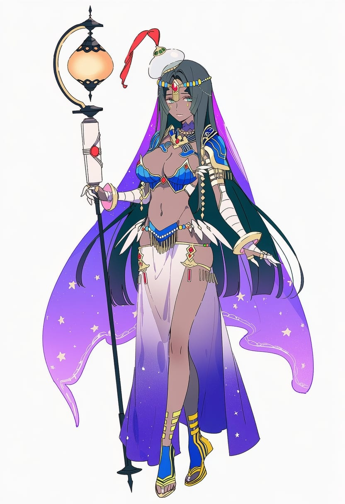

| 字段 | 内容 |
| --- | --- |
| 序号 | 0058 |
| tag | arabian_clothes |
| tag中文名 | 阿拉伯传统服饰 |
| tag中文含义 | 阿拉伯地区传统服装的宽泛总类标签。 |
| tag所属的子类 | 其他民族／地区礼装 |
| 角色 | scheherazade_(fate/grand_order) |

## 56. ancient_egyptian_clothes — 古埃及服饰

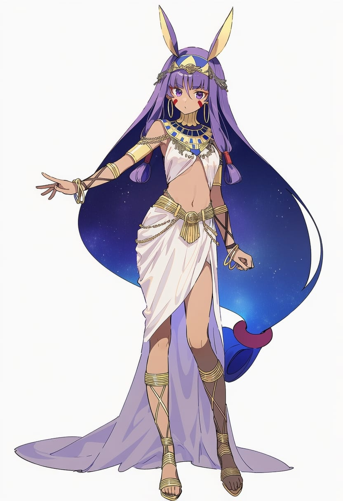

| 字段 | 内容 |
| --- | --- |
| 序号 | 0059 |
| tag | ancient_egyptian_clothes |
| tag中文名 | 古埃及服饰 |
| tag中文含义 | 古埃及风格的传统/历史礼装。 |
| tag所属的子类 | 其他民族／地区礼装 |
| 角色 | nitocris_(fate/grand_order) |

## 57. greco-roman_clothes — 古希腊罗马服饰

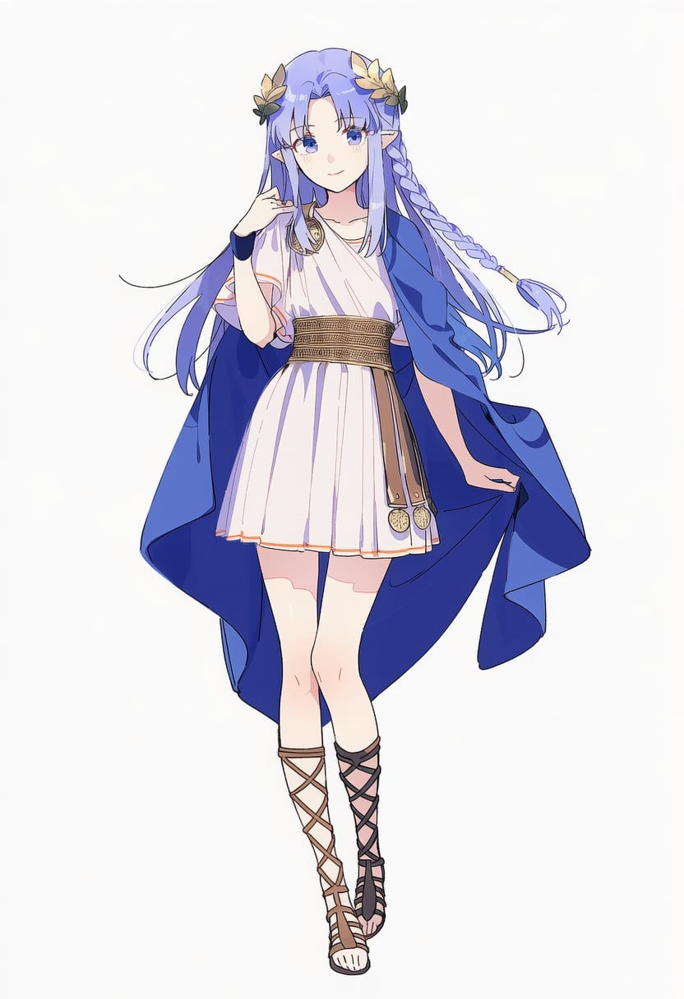

| 字段 | 内容 |
| --- | --- |
| 序号 | 0060 |
| tag | greco-roman_clothes |
| tag中文名 | 古希腊罗马服饰 |
| tag中文含义 | 古希腊与古罗马风格的传统/历史礼装。 |
| tag所属的子类 | 其他民族／地区礼装 |
| 角色 | medea_(fate) |

## 58. russian_clothes — 俄罗斯传统服饰

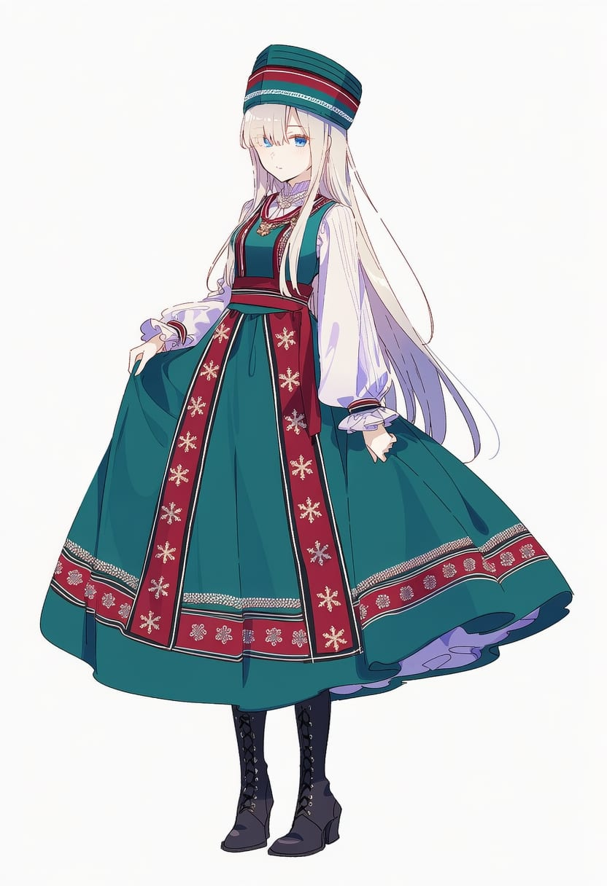

| 字段 | 内容 |
| --- | --- |
| 序号 | 0061 |
| tag | russian_clothes |
| tag中文名 | 俄罗斯传统服饰 |
| tag中文含义 | 俄罗斯传统民族服装。 |
| tag所属的子类 | 其他民族／地区礼装 |
| 角色 | anastasia_nikolaevna_romanova_(fate/grand_order) |

## 59. slavic_clothes — 斯拉夫传统服饰

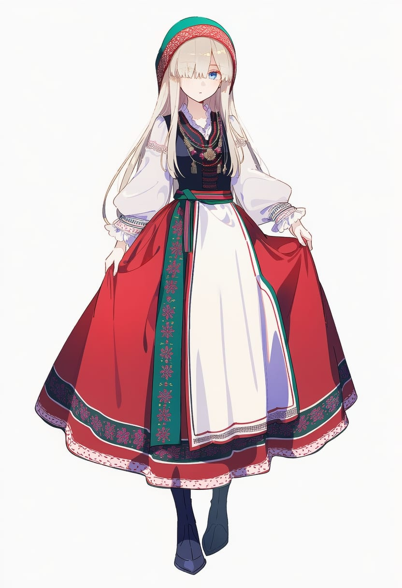

| 字段 | 内容 |
| --- | --- |
| 序号 | 0062 |
| tag | slavic_clothes |
| tag中文名 | 斯拉夫传统服饰 |
| tag中文含义 | 斯拉夫文化圈传统民族服装。 |
| tag所属的子类 | 其他民族／地区礼装 |
| 角色 | anastasia_nikolaevna_romanova_(fate/grand_order) |

## 60. mongolian_clothes — 蒙古传统服饰

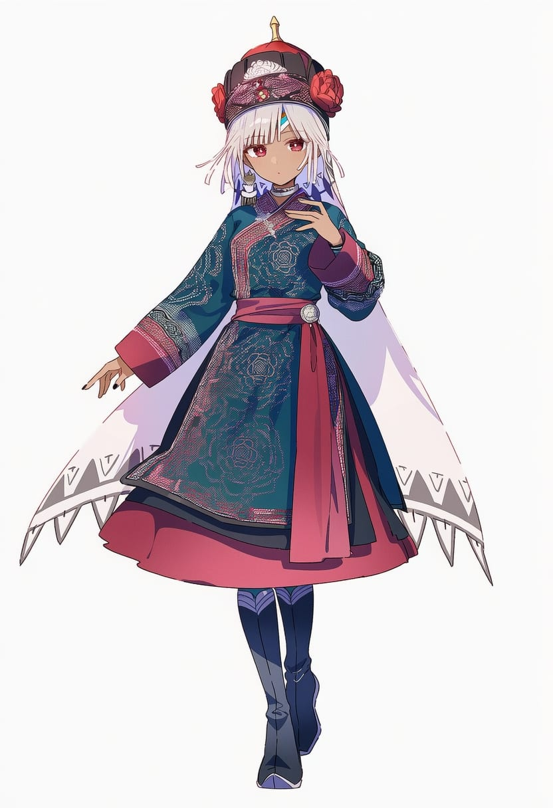

| 字段 | 内容 |
| --- | --- |
| 序号 | 0063 |
| tag | mongolian_clothes |
| tag中文名 | 蒙古传统服饰 |
| tag中文含义 | 蒙古族/蒙古地区传统服装。 |
| tag所属的子类 | 其他民族／地区礼装 |
| 角色 | altera_(fate) |

## 61. native_american_clothes — 美洲原住民传统服饰

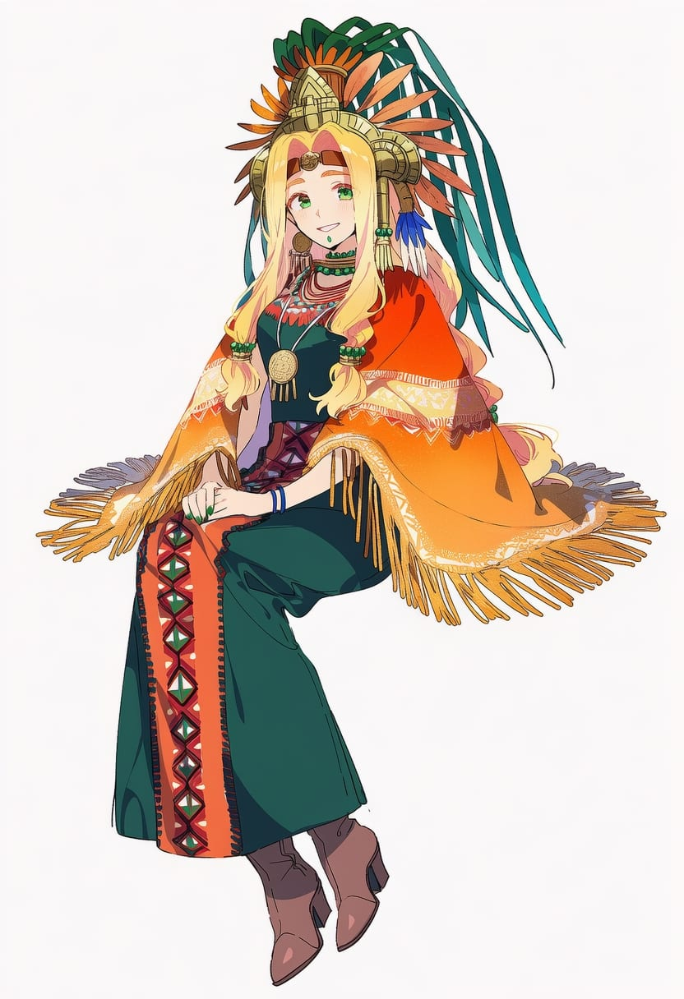

| 字段 | 内容 |
| --- | --- |
| 序号 | 0064 |
| tag | native_american_clothes |
| tag中文名 | 美洲原住民传统服饰 |
| tag中文含义 | 用于美洲原住民传统服饰的宽泛标签。 |
| tag所属的子类 | 其他民族／地区礼装 |
| 角色 | quetzalcoatl_(fate/grand_order) |

## 62. funeral_dress — 葬礼礼服／丧服

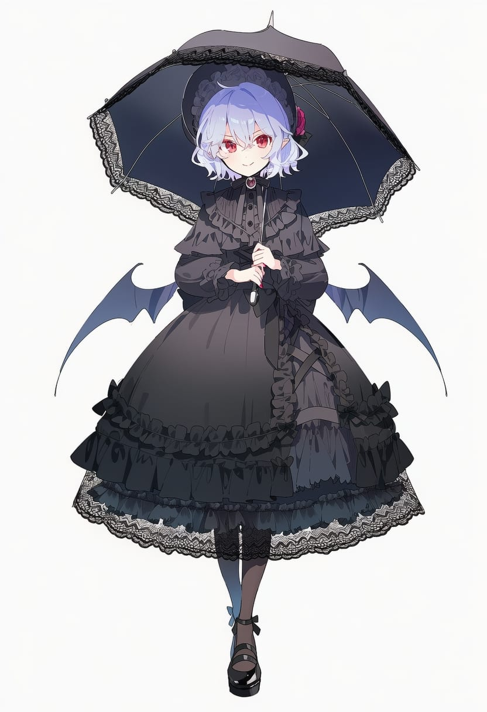

| 字段 | 内容 |
| --- | --- |
| 序号 | 0065 |
| tag | funeral_dress |
| tag中文名 | 葬礼礼服／丧服 |
| tag中文含义 | 用于葬礼、守丧或哀悼场合的正式长裙/丧服；Danbooru 亦有 mourning_dress 别名关系。 |
| tag所属的子类 | 葬礼／哀悼礼装 |
| 角色 | remilia_scarlet |

## 63. santa_costume — 圣诞装／圣诞老人服

| 字段 | 内容 |
| --- | --- |
| 序号 | 0066 |
| tag | santa_costume |
| tag中文名 | 圣诞装／圣诞老人服 |
| tag中文含义 | 圣诞老人主题服装的总类，可由裙装、外套等多种单品构成。 |
| tag所属的子类 | 节日／庆典服饰 |
| 角色 | cirno |

## 64. santa_dress — 圣诞礼服裙

| 字段 | 内容 |
| --- | --- |
| 序号 | 0067 |
| tag | santa_dress |
| tag中文名 | 圣诞礼服裙 |
| tag中文含义 | 圣诞老人主题的连衣裙/礼服裙。 |
| tag所属的子类 | 节日／庆典服饰 |
| 角色 | flandre_scarlet |

## 65. fur-trimmed_dress — 毛绒饰边礼服

| 字段 | 内容 |
| --- | --- |
| 序号 | 0068 |
| tag | fur-trimmed_dress |
| tag中文名 | 毛绒饰边礼服 |
| tag中文含义 | 带毛绒/皮草饰边的连衣裙，和圣诞礼服造型高度相关。 |
| tag所属的子类 | 节日／庆典服饰 |
| 角色 | patchouli_knowledge |

## 66. yukata — 浴衣

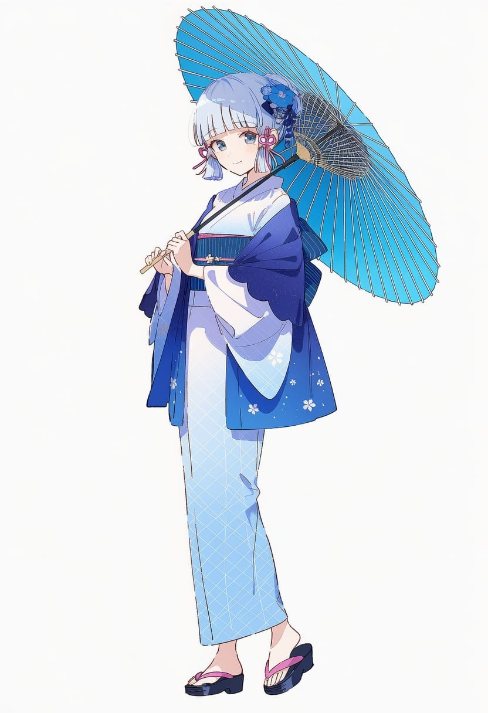

| 字段 | 内容 |
| --- | --- |
| 序号 | 0069 |
| tag | yukata |
| tag中文名 | 浴衣 |
| tag中文含义 | 轻便夏季和服，常见于花火大会、祭典和夏季节庆。 |
| tag所属的子类 | 节日／庆典服饰 |
| 角色 | kamisato_ayaka |

## 67. happi — 法被／祭典短褂

| 字段 | 内容 |
| --- | --- |
| 序号 | 0070 |
| tag | happi |
| tag中文名 | 法被／祭典短褂 |
| tag中文含义 | 日本祭典常见的传统短外衣。 |
| tag所属的子类 | 节日／庆典服饰 |
| 角色 | yae_miko |

## 68. mizu_happi — 水法被／轻便祭典法被

| 字段 | 内容 |
| --- | --- |
| 序号 | 0071 |
| tag | mizu_happi |
| tag中文名 | 水法被／轻便祭典法被 |
| tag中文含义 | 较轻便的法被类祭典服装标签，用于传统庆典造型。 |
| tag所属的子类 | 节日／庆典服饰 |
| 角色 | tamamo_no_mae_(fate) |

## 69. ghost_costume — 幽灵装／万圣节幽灵服

| 字段 | 内容 |
| --- | --- |
| 序号 | 0072 |
| tag | ghost_costume |
| tag中文名 | 幽灵装／万圣节幽灵服 |
| tag中文含义 | 幽灵主题服装，适合作为万圣节庆典类示例。 |
| tag所属的子类 | 节日／庆典服饰 |
| 角色 | saber_alter |

## 70. dirndl — 迪恩德尔裙

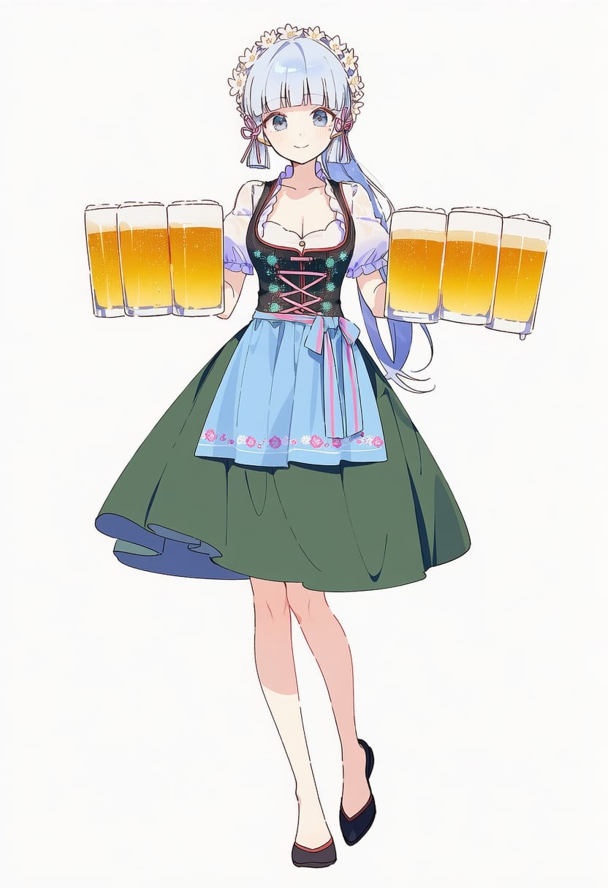

| 字段 | 内容 |
| --- | --- |
| 序号 | 0073 |
| tag | dirndl |
| tag中文名 | 迪恩德尔裙 |
| tag中文含义 | 阿尔卑斯/巴伐利亚传统女装，也常见于啤酒节等庆典场景。 |
| tag所属的子类 | 节日／庆典服饰 |
| 角色 | kamisato_ayaka |

---
