## 1. aqua_background — 以水蓝色为主背景。

| 字段 | 内容 |
| --- | --- |
| 序号 | 0001 |
| tag | aqua_background |
| tag中文名 | 水蓝色背景 |
| tag中文含义 | 以水蓝色为主背景。 |
| tag所属的子类（简单分类即可） | 纯色/简洁背景 |
| 角色 | hoshii_miki |

## 2. black_background — 以黑色为主背景。

| 字段 | 内容 |
| --- | --- |
| 序号 | 0002 |
| tag | black_background |
| tag中文名 | 黑色背景 |
| tag中文含义 | 以黑色为主背景。 |
| tag所属的子类（简单分类即可） | 纯色/简洁背景 |
| 角色 | amami_haruka |

## 3. blue_background — 以蓝色为主背景。

| 字段 | 内容 |
| --- | --- |
| 序号 | 0003 |
| tag | blue_background |
| tag中文名 | 蓝色背景 |
| tag中文含义 | 以蓝色为主背景。 |
| tag所属的子类（简单分类即可） | 纯色/简洁背景 |
| 角色 | shijou_takane |

## 4. brown_background — 以棕色为主背景。

| 字段 | 内容 |
| --- | --- |
| 序号 | 0004 |
| tag | brown_background |
| tag中文名 | 棕色背景 |
| tag中文含义 | 以棕色为主背景。 |
| tag所属的子类（简单分类即可） | 纯色/简洁背景 |
| 角色 | kisaragi_chihaya |

## 5. green_background — 以绿色为主背景。

| 字段 | 内容 |
| --- | --- |
| 序号 | 0005 |
| tag | green_background |
| tag中文名 | 绿色背景 |
| tag中文含义 | 以绿色为主背景。 |
| tag所属的子类（简单分类即可） | 纯色/简洁背景 |
| 角色 | kikuchi_makoto |

## 6. grey_background — 以灰色为主背景。

| 字段 | 内容 |
| --- | --- |
| 序号 | 0006 |
| tag | grey_background |
| tag中文名 | 灰色背景 |
| tag中文含义 | 以灰色为主背景。 |
| tag所属的子类（简单分类即可） | 纯色/简洁背景 |
| 角色 | minase_iori |

## 7. orange_background — 以橙色为主背景。

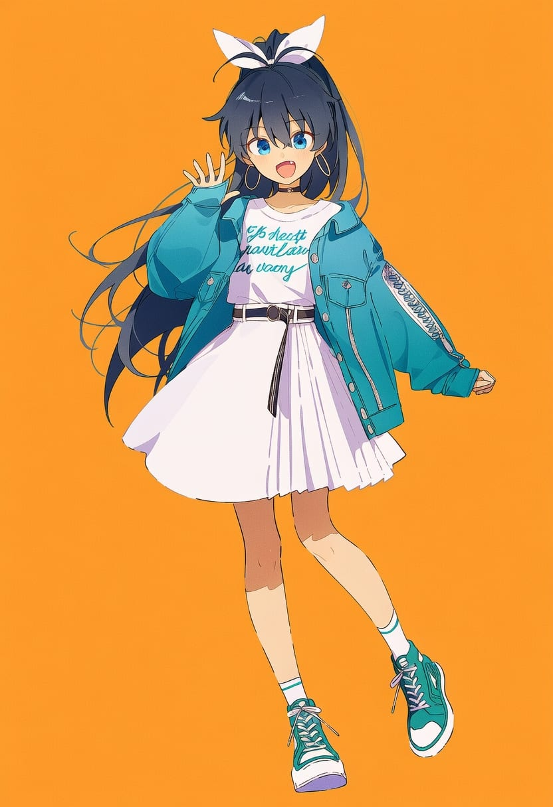

| 字段 | 内容 |
| --- | --- |
| 序号 | 0007 |
| tag | orange_background |
| tag中文名 | 橙色背景 |
| tag中文含义 | 以橙色为主背景。 |
| tag所属的子类（简单分类即可） | 纯色/简洁背景 |
| 角色 | ganaha_hibiki |

## 8. pink_background — 以粉色为主背景。

| 字段 | 内容 |
| --- | --- |
| 序号 | 0008 |
| tag | pink_background |
| tag中文名 | 粉色背景 |
| tag中文含义 | 以粉色为主背景。 |
| tag所属的子类（简单分类即可） | 纯色/简洁背景 |
| 角色 | takatsuki_yayoi |

## 9. purple_background — 以紫色为主背景。

| 字段 | 内容 |
| --- | --- |
| 序号 | 0009 |
| tag | purple_background |
| tag中文名 | 紫色背景 |
| tag中文含义 | 以紫色为主背景。 |
| tag所属的子类（简单分类即可） | 纯色/简洁背景 |
| 角色 | miura_azusa |

## 10. red_background — 以红色为主背景。

| 字段 | 内容 |
| --- | --- |
| 序号 | 0010 |
| tag | red_background |
| tag中文名 | 红色背景 |
| tag中文含义 | 以红色为主背景。 |
| tag所属的子类（简单分类即可） | 纯色/简洁背景 |
| 角色 | hagiwara_yukiho |

## 11. simple_background — 以简洁背景为主。

| 字段 | 内容 |
| --- | --- |
| 序号 | 0011 |
| tag | simple_background |
| tag中文名 | 简单背景 |
| tag中文含义 | 以简洁背景为主。 |
| tag所属的子类（简单分类即可） | 纯色/简洁背景 |
| 角色 | akizuki_ritsuko |

## 12. transparent_background — 背景为透明效果。

| 字段 | 内容 |
| --- | --- |
| 序号 | 0012 |
| tag | transparent_background |
| tag中文名 | 透明背景 |
| tag中文含义 | 背景为透明效果。 |
| tag所属的子类（简单分类即可） | 纯色/简洁背景 |
| 角色 | futami_mami |

## 13. white_background — 以白色为主背景。

| 字段 | 内容 |
| --- | --- |
| 序号 | 0013 |
| tag | white_background |
| tag中文名 | 白色背景 |
| tag中文含义 | 以白色为主背景。 |
| tag所属的子类（简单分类即可） | 纯色/简洁背景 |
| 角色 | futami_ami |

## 14. yellow_background — 以黄色为主背景。

| 字段 | 内容 |
| --- | --- |
| 序号 | 0014 |
| tag | yellow_background |
| tag中文名 | 黄色背景 |
| tag中文含义 | 以黄色为主背景。 |
| tag所属的子类（简单分类即可） | 纯色/简洁背景 |
| 角色 | otonashi_kotori |

## 15. argyle_background — 以菱格纹作为背景配色或纹样。

| 字段 | 内容 |
| --- | --- |
| 序号 | 0015 |
| tag | argyle_background |
| tag中文名 | 菱格纹背景 |
| tag中文含义 | 以菱格纹作为背景配色或纹样。 |
| tag所属的子类（简单分类即可） | 多色/图案背景 |
| 角色 | awakened_miki |

## 16. checkered_background — 以棋盘格作为背景配色或纹样。

| 字段 | 内容 |
| --- | --- |
| 序号 | 0016 |
| tag | checkered_background |
| tag中文名 | 棋盘格背景 |
| tag中文含义 | 以棋盘格作为背景配色或纹样。 |
| tag所属的子类（简单分类即可） | 多色/图案背景 |
| 角色 | mizutani_eri |

## 17. colorful_background — 以多彩作为背景配色或纹样。

| 字段 | 内容 |
| --- | --- |
| 序号 | 0017 |
| tag | colorful_background |
| tag中文名 | 多彩背景 |
| tag中文含义 | 以多彩作为背景配色或纹样。 |
| tag所属的子类（简单分类即可） | 多色/图案背景 |
| 角色 | hidaka_ai |

## 18. diagonal-striped_background — 以斜条纹作为背景配色或纹样。

| 字段 | 内容 |
| --- | --- |
| 序号 | 0018 |
| tag | diagonal-striped_background |
| tag中文名 | 斜条纹背景 |
| tag中文含义 | 以斜条纹作为背景配色或纹样。 |
| tag所属的子类（简单分类即可） | 多色/图案背景 |
| 角色 | shibuya_rin |

## 19. dotted_background — 以点状作为背景配色或纹样。

| 字段 | 内容 |
| --- | --- |
| 序号 | 0019 |
| tag | dotted_background |
| tag中文名 | 点状背景 |
| tag中文含义 | 以点状作为背景配色或纹样。 |
| tag所属的子类（简单分类即可） | 多色/图案背景 |
| 角色 | shirasaka_koume |

## 20. gingham_background — 以方格布纹作为背景配色或纹样。

| 字段 | 内容 |
| --- | --- |
| 序号 | 0020 |
| tag | gingham_background |
| tag中文名 | 方格布纹背景 |
| tag中文含义 | 以方格布纹作为背景配色或纹样。 |
| tag所属的子类（简单分类即可） | 多色/图案背景 |
| 角色 | yumemi_riamu |

## 21. gradient_background — 以渐变作为背景配色或纹样。

| 字段 | 内容 |
| --- | --- |
| 序号 | 0021 |
| tag | gradient_background |
| tag中文名 | 渐变背景 |
| tag中文含义 | 以渐变作为背景配色或纹样。 |
| tag所属的子类（简单分类即可） | 多色/图案背景 |
| 角色 | shimamura_uzuki |

## 22. greyscale_with_colored_background — 以灰度主体配彩色作为背景配色或纹样。

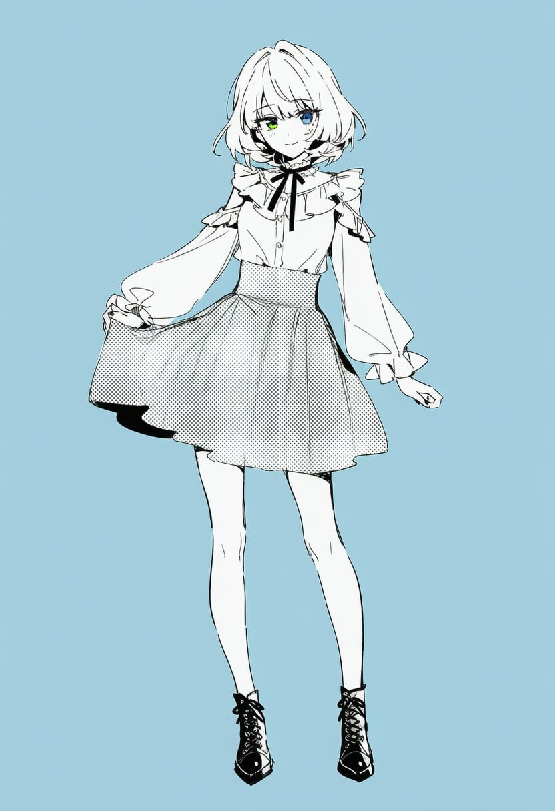

| 字段 | 内容 |
| --- | --- |
| 序号 | 0022 |
| tag | greyscale_with_colored_background |
| tag中文名 | 灰度主体配彩色背景 |
| tag中文含义 | 以灰度主体配彩色作为背景配色或纹样。 |
| tag所属的子类（简单分类即可） | 多色/图案背景 |
| 角色 | takagaki_kaede |

## 23. grid_background — 以网格作为背景配色或纹样。

| 字段 | 内容 |
| --- | --- |
| 序号 | 0023 |
| tag | grid_background |
| tag中文名 | 网格背景 |
| tag中文含义 | 以网格作为背景配色或纹样。 |
| tag所属的子类（简单分类即可） | 多色/图案背景 |
| 角色 | sagisawa_fumika |

## 24. halftone_background — 以半色调网点作为背景配色或纹样。

| 字段 | 内容 |
| --- | --- |
| 序号 | 0024 |
| tag | halftone_background |
| tag中文名 | 半色调网点背景 |
| tag中文含义 | 以半色调网点作为背景配色或纹样。 |
| tag所属的子类（简单分类即可） | 多色/图案背景 |
| 角色 | jougasaki_mika |

## 25. honeycomb_background — 以蜂窝纹作为背景配色或纹样。

| 字段 | 内容 |
| --- | --- |
| 序号 | 0025 |
| tag | honeycomb_background |
| tag中文名 | 蜂窝纹背景 |
| tag中文含义 | 以蜂窝纹作为背景配色或纹样。 |
| tag所属的子类（简单分类即可） | 多色/图案背景 |
| 角色 | kanzaki_ranko |

## 26. lace_background — 以蕾丝纹作为背景配色或纹样。

| 字段 | 内容 |
| --- | --- |
| 序号 | 0026 |
| tag | lace_background |
| tag中文名 | 蕾丝纹背景 |
| tag中文含义 | 以蕾丝纹作为背景配色或纹样。 |
| tag所属的子类（简单分类即可） | 多色/图案背景 |
| 角色 | ichinose_shiki |

## 27. monochrome_background — 以单色调作为背景配色或纹样。

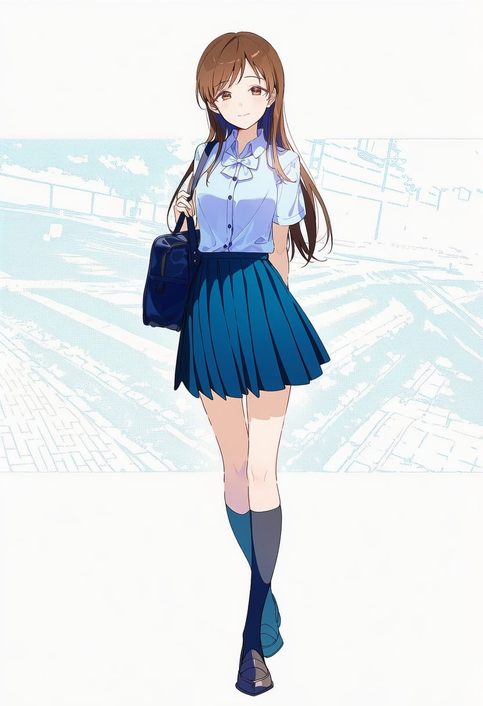

| 字段 | 内容 |
| --- | --- |
| 序号 | 0027 |
| tag | monochrome_background |
| tag中文名 | 单色调背景 |
| tag中文含义 | 以单色调作为背景配色或纹样。 |
| tag所属的子类（简单分类即可） | 多色/图案背景 |
| 角色 | nitta_minami |

## 28. mosaic_background — 以马赛克作为背景配色或纹样。

| 字段 | 内容 |
| --- | --- |
| 序号 | 0028 |
| tag | mosaic_background |
| tag中文名 | 马赛克背景 |
| tag中文含义 | 以马赛克作为背景配色或纹样。 |
| tag所属的子类（简单分类即可） | 多色/图案背景 |
| 角色 | tachibana_arisu |

## 29. patterned_background — 以图案化作为背景配色或纹样。

| 字段 | 内容 |
| --- | --- |
| 序号 | 0029 |
| tag | patterned_background |
| tag中文名 | 图案化背景 |
| tag中文含义 | 以图案化作为背景配色或纹样。 |
| tag所属的子类（简单分类即可） | 多色/图案背景 |
| 角色 | anastasia_(idolmaster) |

## 30. plaid_background — 以格纹作为背景配色或纹样。

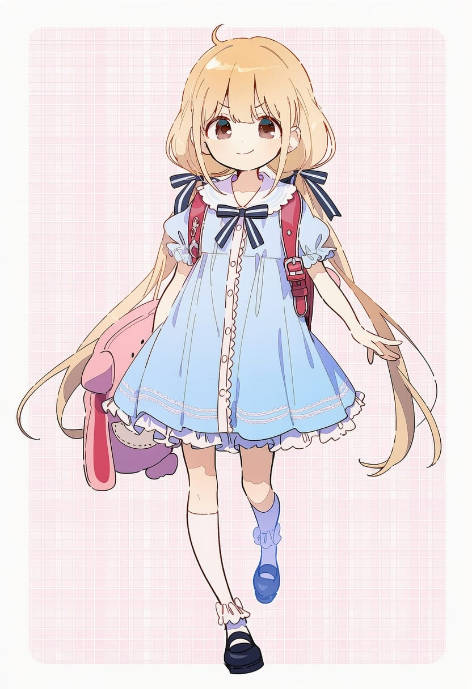

| 字段 | 内容 |
| --- | --- |
| 序号 | 0030 |
| tag | plaid_background |
| tag中文名 | 格纹背景 |
| tag中文含义 | 以格纹作为背景配色或纹样。 |
| tag所属的子类（简单分类即可） | 多色/图案背景 |
| 角色 | futaba_anzu |

## 31. polka_dot_background — 以波点作为背景配色或纹样。

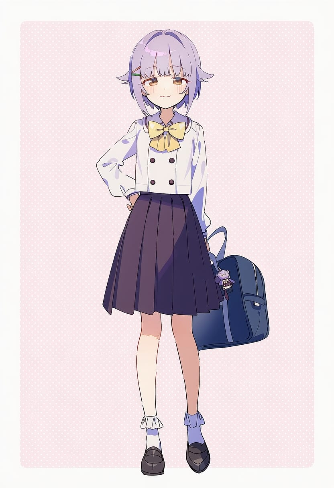

| 字段 | 内容 |
| --- | --- |
| 序号 | 0031 |
| tag | polka_dot_background |
| tag中文名 | 波点背景 |
| tag中文含义 | 以波点作为背景配色或纹样。 |
| tag所属的子类（简单分类即可） | 多色/图案背景 |
| 角色 | koshimizu_sachiko |

## 32. rainbow_background — 以彩虹色作为背景配色或纹样。

| 字段 | 内容 |
| --- | --- |
| 序号 | 0032 |
| tag | rainbow_background |
| tag中文名 | 彩虹色背景 |
| tag中文含义 | 以彩虹色作为背景配色或纹样。 |
| tag所属的子类（简单分类即可） | 多色/图案背景 |
| 角色 | jougasaki_rika |

## 33. spiral_background — 以螺旋纹作为背景配色或纹样。

| 字段 | 内容 |
| --- | --- |
| 序号 | 0033 |
| tag | spiral_background |
| tag中文名 | 螺旋纹背景 |
| tag中文含义 | 以螺旋纹作为背景配色或纹样。 |
| tag所属的子类（简单分类即可） | 多色/图案背景 |
| 角色 | maekawa_miku |

## 34. splatter_background — 以泼溅纹作为背景配色或纹样。

| 字段 | 内容 |
| --- | --- |
| 序号 | 0034 |
| tag | splatter_background |
| tag中文名 | 泼溅纹背景 |
| tag中文含义 | 以泼溅纹作为背景配色或纹样。 |
| tag所属的子类（简单分类即可） | 多色/图案背景 |
| 角色 | hayami_kanade |

## 35. striped_background — 以条纹作为背景配色或纹样。

| 字段 | 内容 |
| --- | --- |
| 序号 | 0035 |
| tag | striped_background |
| tag中文名 | 条纹背景 |
| tag中文含义 | 以条纹作为背景配色或纹样。 |
| tag所属的子类（简单分类即可） | 多色/图案背景 |
| 角色 | sakurai_momoka |

## 36. sunburst_background — 以放射状作为背景配色或纹样。

| 字段 | 内容 |
| --- | --- |
| 序号 | 0036 |
| tag | sunburst_background |
| tag中文名 | 放射状背景 |
| tag中文含义 | 以放射状作为背景配色或纹样。 |
| tag所属的子类（简单分类即可） | 多色/图案背景 |
| 角色 | ohtsuki_yui |

## 37. three-toned_background — 以三色作为背景配色或纹样。

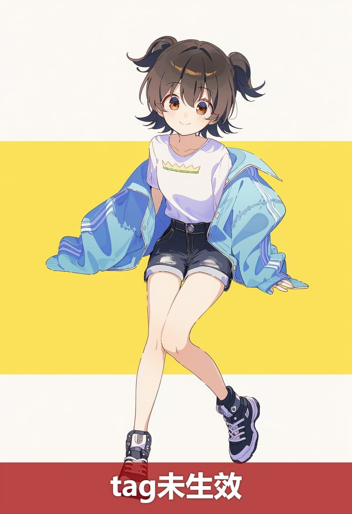

| 字段 | 内容 |
| --- | --- |
| 序号 | 0037 |
| tag | three-toned_background |
| tag中文名 | 三色背景 |
| tag中文含义 | 以三色作为背景配色或纹样。 |
| tag所属的子类（简单分类即可） | 多色/图案背景 |
| 角色 | akagi_miria |

## 38. two-tone_background — 以双色作为背景配色或纹样。

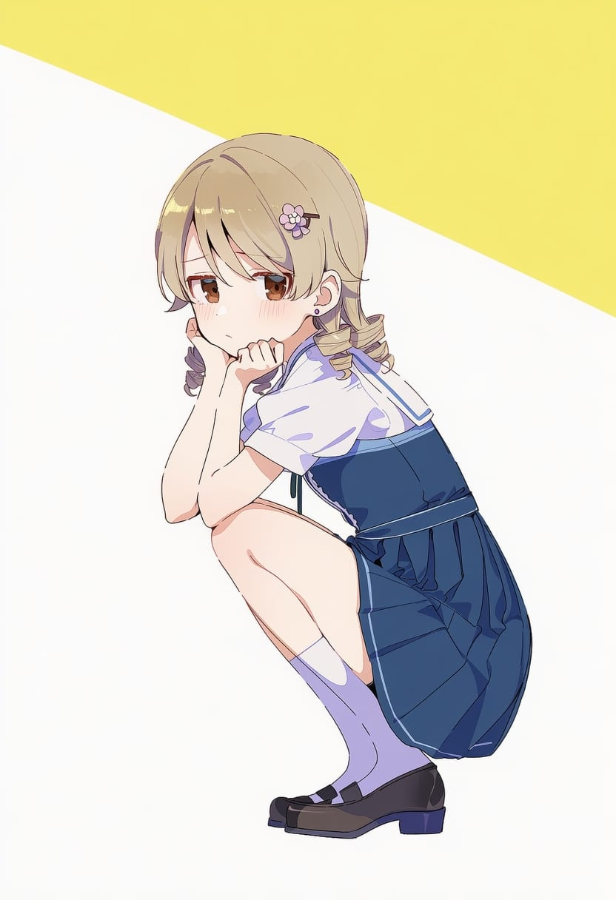

| 字段 | 内容 |
| --- | --- |
| 序号 | 0038 |
| tag | two-tone_background |
| tag中文名 | 双色背景 |
| tag中文含义 | 以双色作为背景配色或纹样。 |
| tag所属的子类（简单分类即可） | 多色/图案背景 |
| 角色 | morikubo_nono |

## 39. vertical-striped_background — 以竖条纹作为背景配色或纹样。

| 字段 | 内容 |
| --- | --- |
| 序号 | 0039 |
| tag | vertical-striped_background |
| tag中文名 | 竖条纹背景 |
| tag中文含义 | 以竖条纹作为背景配色或纹样。 |
| tag所属的子类（简单分类即可） | 多色/图案背景 |
| 角色 | honda_mio |

## 40. 3d_background — 背景呈现方式：3D背景。

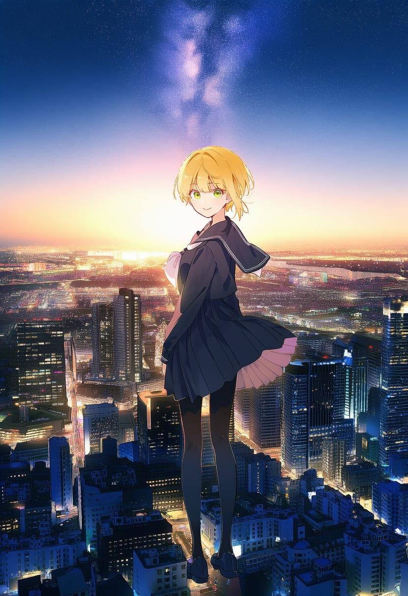

| 字段 | 内容 |
| --- | --- |
| 序号 | 0040 |
| tag | 3d_background |
| tag中文名 | 3D背景 |
| tag中文含义 | 背景呈现方式：3D背景。 |
| tag所属的子类（简单分类即可） | 风格/媒介/构图背景 |
| 角色 | miyamoto_frederica |

## 41. abstract_background — 背景呈现方式：抽象背景。

| 字段 | 内容 |
| --- | --- |
| 序号 | 0041 |
| tag | abstract_background |
| tag中文名 | 抽象背景 |
| tag中文含义 | 背景呈现方式：抽象背景。 |
| tag所属的子类（简单分类即可） | 风格/媒介/构图背景 |
| 角色 | shiomi_syuko |

## 42. ai-generated_background — 背景呈现方式：AI生成背景。

| 字段 | 内容 |
| --- | --- |
| 序号 | 0042 |
| tag | ai-generated_background |
| tag中文名 | AI生成背景 |
| tag中文含义 | 背景呈现方式：AI生成背景。 |
| tag所属的子类（简单分类即可） | 风格/媒介/构图背景 |
| 角色 | kamiya_nao |

## 43. backlighting — 背景呈现方式：逆光。

| 字段 | 内容 |
| --- | --- |
| 序号 | 0043 |
| tag | backlighting |
| tag中文名 | 逆光 |
| tag中文含义 | 背景呈现方式：逆光。 |
| tag所属的子类（简单分类即可） | 风格/媒介/构图背景 |
| 角色 | hojo_karen |

## 44. blending — 背景呈现方式：背景融合。

| 字段 | 内容 |
| --- | --- |
| 序号 | 0044 |
| tag | blending |
| tag中文名 | 背景融合 |
| tag中文含义 | 背景呈现方式：背景融合。 |
| tag所属的子类（简单分类即可） | 风格/媒介/构图背景 |
| 角色 | moroboshi_kirari |

## 45. blurry_background — 背景呈现方式：模糊背景。

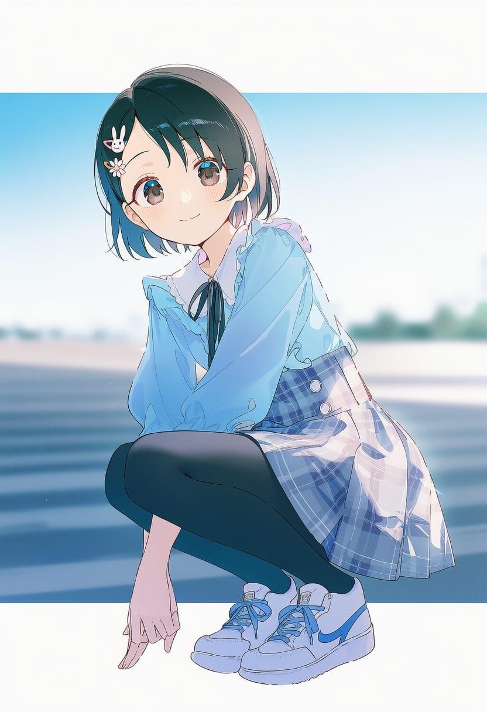

| 字段 | 内容 |
| --- | --- |
| 序号 | 0045 |
| tag | blurry_background |
| tag中文名 | 模糊背景 |
| tag中文含义 | 背景呈现方式：模糊背景。 |
| tag所属的子类（简单分类即可） | 风格/媒介/构图背景 |
| 角色 | sasaki_chie |

## 46. border — 背景呈现方式：边框。

| 字段 | 内容 |
| --- | --- |
| 序号 | 0046 |
| tag | border |
| tag中文名 | 边框 |
| tag中文含义 | 背景呈现方式：边框。 |
| tag所属的子类（简单分类即可） | 风格/媒介/构图背景 |
| 角色 | mimura_kanako |

## 47. bright_background — 背景呈现方式：明亮背景。

| 字段 | 内容 |
| --- | --- |
| 序号 | 0047 |
| tag | bright_background |
| tag中文名 | 明亮背景 |
| tag中文含义 | 背景呈现方式：明亮背景。 |
| tag所属的子类（简单分类即可） | 风格/媒介/构图背景 |
| 角色 | hoshi_syoko |

## 48. chibi_inset — 背景呈现方式：Q版插图嵌入。

| 字段 | 内容 |
| --- | --- |
| 序号 | 0048 |
| tag | chibi_inset |
| tag中文名 | Q版插图嵌入 |
| tag中文含义 | 背景呈现方式：Q版插图嵌入。 |
| tag所属的子类（简单分类即可） | 风格/媒介/构图背景 |
| 角色 | sunazuka_akira |

## 49. dark_background — 背景呈现方式：暗色背景。

| 字段 | 内容 |
| --- | --- |
| 序号 | 0049 |
| tag | dark_background |
| tag中文名 | 暗色背景 |
| tag中文含义 | 背景呈现方式：暗色背景。 |
| tag所属的子类（简单分类即可） | 风格/媒介/构图背景 |
| 角色 | sakuma_mayu |

## 50. game_screenshot_background — 背景呈现方式：游戏截图背景。

| 字段 | 内容 |
| --- | --- |
| 序号 | 0050 |
| tag | game_screenshot_background |
| tag中文名 | 游戏截图背景 |
| tag中文含义 | 背景呈现方式：游戏截图背景。 |
| tag所属的子类（简单分类即可） | 风格/媒介/构图背景 |
| 角色 | hisakawa_hayate |

## 51. horizon — 背景呈现方式：地平线。

| 字段 | 内容 |
| --- | --- |
| 序号 | 0051 |
| tag | horizon |
| tag中文名 | 地平线 |
| tag中文含义 | 背景呈现方式：地平线。 |
| tag所属的子类（简单分类即可） | 风格/媒介/构图背景 |
| 角色 | totoki_airi |

## 52. paneled_background — 背景呈现方式：分格背景。

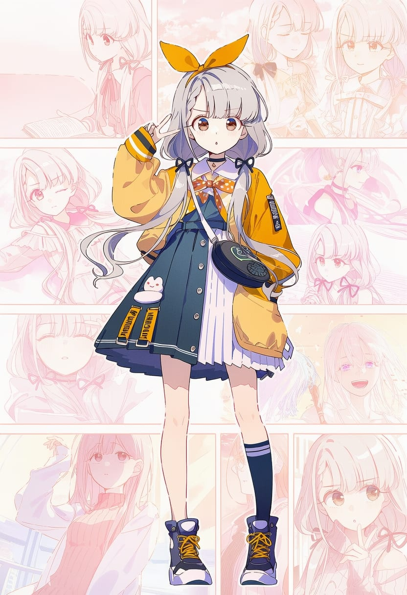

| 字段 | 内容 |
| --- | --- |
| 序号 | 0053 |
| tag | paneled_background |
| tag中文名 | 分格背景 |
| tag中文含义 | 背景呈现方式：分格背景。 |
| tag所属的子类（简单分类即可） | 风格/媒介/构图背景 |
| 角色 | hisakawa_nagi |

## 53. paper_background — 背景呈现方式：纸张背景。

| 字段 | 内容 |
| --- | --- |
| 序号 | 0054 |
| tag | paper_background |
| tag中文名 | 纸张背景 |
| tag中文含义 | 背景呈现方式：纸张背景。 |
| tag所属的子类（简单分类即可） | 风格/媒介/构图背景 |
| 角色 | ichihara_nina |

## 54. photo_background — 背景呈现方式：照片背景。

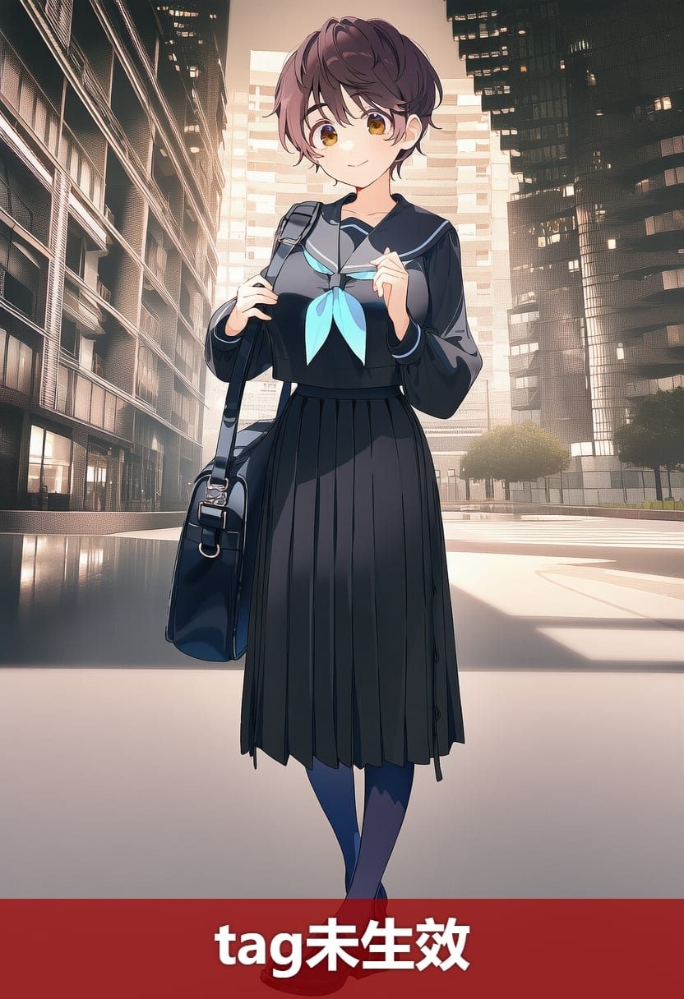

| 字段 | 内容 |
| --- | --- |
| 序号 | 0055 |
| tag | photo_background |
| tag中文名 | 照片背景 |
| tag中文含义 | 背景呈现方式：照片背景。 |
| tag所属的子类（简单分类即可） | 风格/媒介/构图背景 |
| 角色 | oikawa_shizuku |

## 55. projected_inset — 背景呈现方式：投影式嵌入画面。

| 字段 | 内容 |
| --- | --- |
| 序号 | 0056 |
| tag | projected_inset |
| tag中文名 | 投影式嵌入画面 |
| tag中文含义 | 背景呈现方式：投影式嵌入画面。 |
| tag所属的子类（简单分类即可） | 风格/媒介/构图背景 |
| 角色 | abe_nana |

## 56. screenshot_background — 背景呈现方式：截图背景。

| 字段 | 内容 |
| --- | --- |
| 序号 | 0057 |
| tag | screenshot_background |
| tag中文名 | 截图背景 |
| tag中文含义 | 背景呈现方式：截图背景。 |
| tag所属的子类（简单分类即可） | 风格/媒介/构图背景 |
| 角色 | yuuki_haru |

## 57. sketch_background — 背景呈现方式：素描背景。

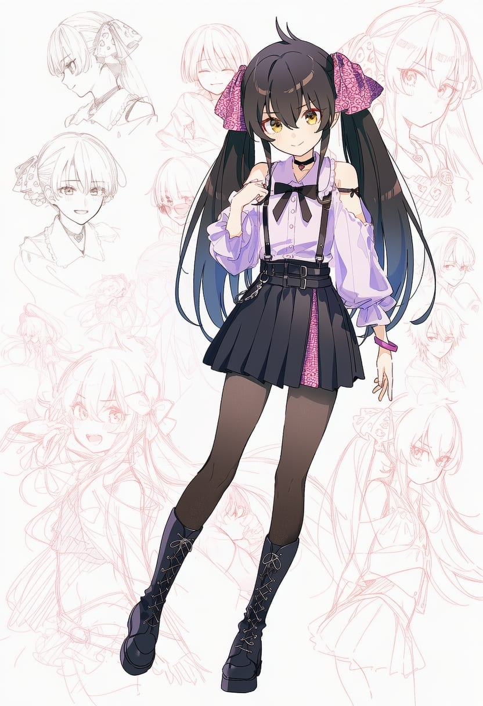

| 字段 | 内容 |
| --- | --- |
| 序号 | 0058 |
| tag | sketch_background |
| tag中文名 | 素描背景 |
| tag中文含义 | 背景呈现方式：素描背景。 |
| tag所属的子类（简单分类即可） | 风格/媒介/构图背景 |
| 角色 | matoba_risa |

## 58. step_and_repeat — 背景呈现方式：重复标志墙背景。

| 字段 | 内容 |
| --- | --- |
| 序号 | 0059 |
| tag | step_and_repeat |
| tag中文名 | 重复标志墙背景 |
| tag中文含义 | 背景呈现方式：重复标志墙背景。 |
| tag所属的子类（简单分类即可） | 风格/媒介/构图背景 |
| 角色 | sajo_yukimi |

## 59. watercolor_background — 背景呈现方式：水彩背景。

| 字段 | 内容 |
| --- | --- |
| 序号 | 0060 |
| tag | watercolor_background |
| tag中文名 | 水彩背景 |
| tag中文含义 | 背景呈现方式：水彩背景。 |
| tag所属的子类（简单分类即可） | 风格/媒介/构图背景 |
| 角色 | tada_riina |

## 60. zoom_layer — 背景呈现方式：局部放大层。

| 字段 | 内容 |
| --- | --- |
| 序号 | 0061 |
| tag | zoom_layer |
| tag中文名 | 局部放大层 |
| tag中文含义 | 背景呈现方式：局部放大层。 |
| tag所属的子类（简单分类即可） | 风格/媒介/构图背景 |
| 角色 | ryuzaki_kaoru |

## 61. animal_background — 背景大量或重复出现动物主题元素。

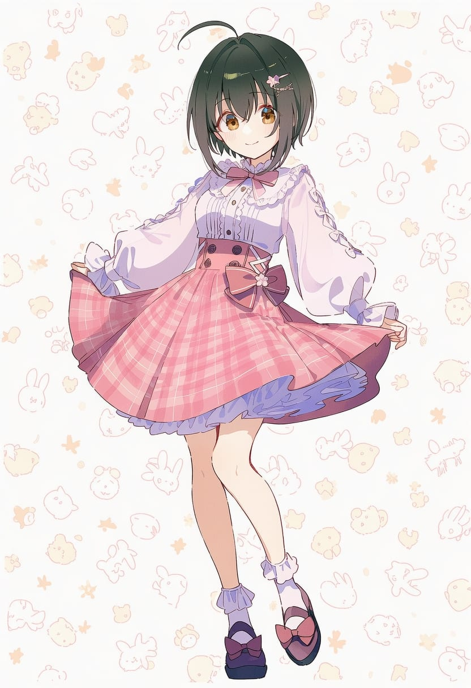

| 字段 | 内容 |
| --- | --- |
| 序号 | 0062 |
| tag | animal_background |
| tag中文名 | 动物主题背景 |
| tag中文含义 | 背景大量或重复出现动物主题元素。 |
| tag所属的子类（简单分类即可） | 主题元素背景 |
| 角色 | kohinata_miho |

## 62. bubble_background — 背景大量或重复出现气泡元素。

| 字段 | 内容 |
| --- | --- |
| 序号 | 0063 |
| tag | bubble_background |
| tag中文名 | 气泡背景 |
| tag中文含义 | 背景大量或重复出现气泡元素。 |
| tag所属的子类（简单分类即可） | 主题元素背景 |
| 角色 | ogata_chieri |

## 63. butterfly_background — 背景大量或重复出现蝴蝶元素。

| 字段 | 内容 |
| --- | --- |
| 序号 | 0064 |
| tag | butterfly_background |
| tag中文名 | 蝴蝶背景 |
| tag中文含义 | 背景大量或重复出现蝴蝶元素。 |
| tag所属的子类（简单分类即可） | 主题元素背景 |
| 角色 | mukai_takumi |

## 64. cloud_background — 背景大量或重复出现云朵元素。

| 字段 | 内容 |
| --- | --- |
| 序号 | 0065 |
| tag | cloud_background |
| tag中文名 | 云朵背景 |
| tag中文含义 | 背景大量或重复出现云朵元素。 |
| tag所属的子类（简单分类即可） | 主题元素背景 |
| 角色 | yusa_kozue |

## 65. fiery_background — 背景大量或重复出现火焰元素。

| 字段 | 内容 |
| --- | --- |
| 序号 | 0066 |
| tag | fiery_background |
| tag中文名 | 火焰背景 |
| tag中文含义 | 背景大量或重复出现火焰元素。 |
| tag所属的子类（简单分类即可） | 主题元素背景 |
| 角色 | takamori_aiko |

## 66. flag_background — 背景大量或重复出现旗帜元素。

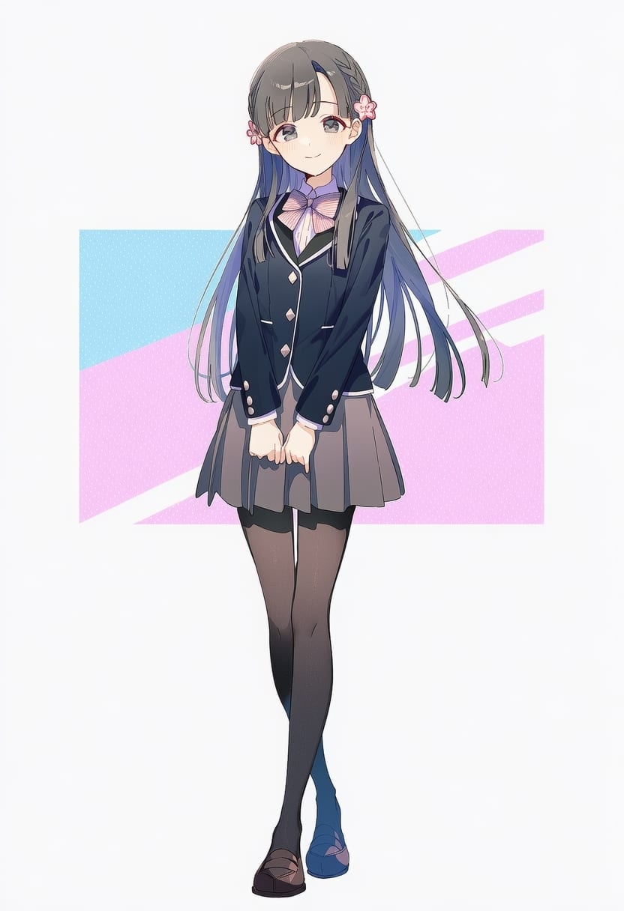

| 字段 | 内容 |
| --- | --- |
| 序号 | 0067 |
| tag | flag_background |
| tag中文名 | 旗帜背景 |
| tag中文含义 | 背景大量或重复出现旗帜元素。 |
| tag所属的子类（简单分类即可） | 主题元素背景 |
| 角色 | kobayakawa_sae |

## 67. floral_background — 背景大量或重复出现花卉元素。

| 字段 | 内容 |
| --- | --- |
| 序号 | 0068 |
| tag | floral_background |
| tag中文名 | 花卉背景 |
| tag中文含义 | 背景大量或重复出现花卉元素。 |
| tag所属的子类（简单分类即可） | 主题元素背景 |
| 角色 | mifune_miyu |

## 68. food-themed_background — 背景大量或重复出现食物主题元素。

| 字段 | 内容 |
| --- | --- |
| 序号 | 0069 |
| tag | food-themed_background |
| tag中文名 | 食物主题背景 |
| tag中文含义 | 背景大量或重复出现食物主题元素。 |
| tag所属的子类（简单分类即可） | 主题元素背景 |
| 角色 | natalia_(idolmaster) |

## 69. fruit_background — 背景大量或重复出现水果元素。

| 字段 | 内容 |
| --- | --- |
| 序号 | 0070 |
| tag | fruit_background |
| tag中文名 | 水果背景 |
| tag中文含义 | 背景大量或重复出现水果元素。 |
| tag所属的子类（简单分类即可） | 主题元素背景 |
| 角色 | senkawa_chihiro |

## 70. heart_background — 背景大量或重复出现爱心元素。

| 字段 | 内容 |
| --- | --- |
| 序号 | 0071 |
| tag | heart_background |
| tag中文名 | 爱心背景 |
| tag中文含义 | 背景大量或重复出现爱心元素。 |
| tag所属的子类（简单分类即可） | 主题元素背景 |
| 角色 | otokura_yuuki |

## 71. leaf_background — 背景大量或重复出现叶片元素。

| 字段 | 内容 |
| --- | --- |
| 序号 | 0072 |
| tag | leaf_background |
| tag中文名 | 叶片背景 |
| tag中文含义 | 背景大量或重复出现叶片元素。 |
| tag所属的子类（简单分类即可） | 主题元素背景 |
| 角色 | hino_akane_(idolmaster) |

## 72. lightning_background — 背景大量或重复出现闪电元素。

| 字段 | 内容 |
| --- | --- |
| 序号 | 0073 |
| tag | lightning_background |
| tag中文名 | 闪电背景 |
| tag中文含义 | 背景大量或重复出现闪电元素。 |
| tag所属的子类（简单分类即可） | 主题元素背景 |
| 角色 | igarashi_kyoko |

## 73. paw_print_background — 背景大量或重复出现爪印元素。

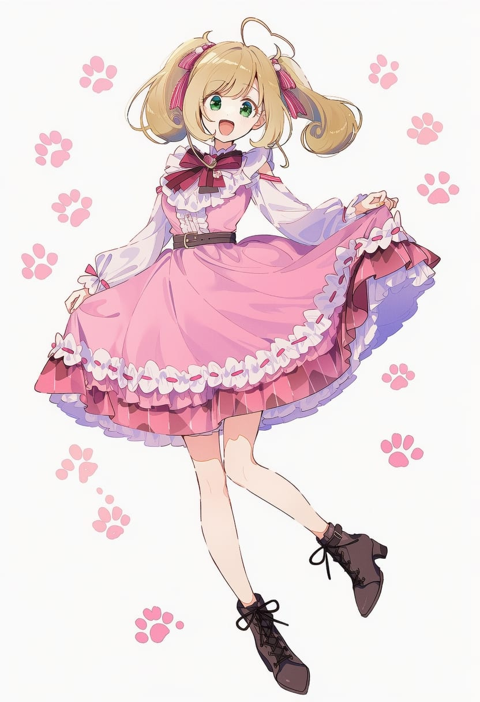

| 字段 | 内容 |
| --- | --- |
| 序号 | 0074 |
| tag | paw_print_background |
| tag中文名 | 爪印背景 |
| tag中文含义 | 背景大量或重复出现爪印元素。 |
| tag所属的子类（简单分类即可） | 主题元素背景 |
| 角色 | sato_shin |

## 74. rabbit_background — 背景大量或重复出现兔子主题元素。

| 字段 | 内容 |
| --- | --- |
| 序号 | 0075 |
| tag | rabbit_background |
| tag中文名 | 兔子主题背景 |
| tag中文含义 | 背景大量或重复出现兔子主题元素。 |
| tag所属的子类（简单分类即可） | 主题元素背景 |
| 角色 | himekawa_yuki |

## 75. rose_background — 背景大量或重复出现玫瑰元素。

| 字段 | 内容 |
| --- | --- |
| 序号 | 0076 |
| tag | rose_background |
| tag中文名 | 玫瑰背景 |
| tag中文含义 | 背景大量或重复出现玫瑰元素。 |
| tag所属的子类（简单分类即可） | 主题元素背景 |
| 角色 | katagiri_sanae |

## 76. snowflake_background — 背景大量或重复出现雪花元素。

| 字段 | 内容 |
| --- | --- |
| 序号 | 0077 |
| tag | snowflake_background |
| tag中文名 | 雪花背景 |
| tag中文含义 | 背景大量或重复出现雪花元素。 |
| tag所属的子类（简单分类即可） | 主题元素背景 |
| 角色 | hayasaka_mirei |

## 77. sofmap_background — 背景大量或重复出现Sofmap发布会式元素。

| 字段 | 内容 |
| --- | --- |
| 序号 | 0078 |
| tag | sofmap_background |
| tag中文名 | Sofmap发布会式背景 |
| tag中文含义 | 背景大量或重复出现Sofmap发布会式元素。 |
| tag所属的子类（简单分类即可） | 主题元素背景 |
| 角色 | yorita_yoshino |

## 78. sparkle_background — 背景大量或重复出现闪光元素。

| 字段 | 内容 |
| --- | --- |
| 序号 | 0079 |
| tag | sparkle_background |
| tag中文名 | 闪光背景 |
| tag中文含义 | 背景大量或重复出现闪光元素。 |
| tag所属的子类（简单分类即可） | 主题元素背景 |
| 角色 | aiba_yumi |

## 79. star_symbol_background — 背景大量或重复出现星形符号元素。

| 字段 | 内容 |
| --- | --- |
| 序号 | 0080 |
| tag | star_symbol_background |
| tag中文名 | 星形符号背景 |
| tag中文含义 | 背景大量或重复出现星形符号元素。 |
| tag所属的子类（简单分类即可） | 主题元素背景 |
| 角色 | shirayuki_chiyo |

## 80. starry_sky_background — 背景大量或重复出现星空图案元素。

| 字段 | 内容 |
| --- | --- |
| 序号 | 0081 |
| tag | starry_sky_background |
| tag中文名 | 星空图案背景 |
| tag中文含义 | 背景大量或重复出现星空图案元素。 |
| tag所属的子类（简单分类即可） | 主题元素背景 |
| 角色 | tsujino_akari |

## 81. text_background — 背景大量或重复出现文字元素。

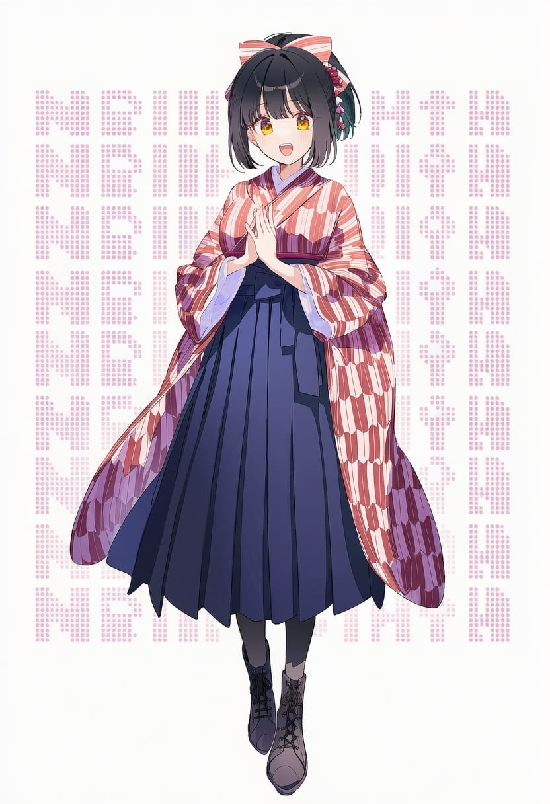

| 字段 | 内容 |
| --- | --- |
| 序号 | 0082 |
| tag | text_background |
| tag中文名 | 文字背景 |
| tag中文含义 | 背景大量或重复出现文字元素。 |
| tag所属的子类（简单分类即可） | 主题元素背景 |
| 角色 | takafuji_kako |

## 82. weapon_background — 背景大量或重复出现武器主题元素。

| 字段 | 内容 |
| --- | --- |
| 序号 | 0083 |
| tag | weapon_background |
| tag中文名 | 武器主题背景 |
| tag中文含义 | 背景大量或重复出现武器主题元素。 |
| tag所属的子类（简单分类即可） | 主题元素背景 |
| 角色 | kurosaki_chitose |

## 83. backstage — 场景位于后台。

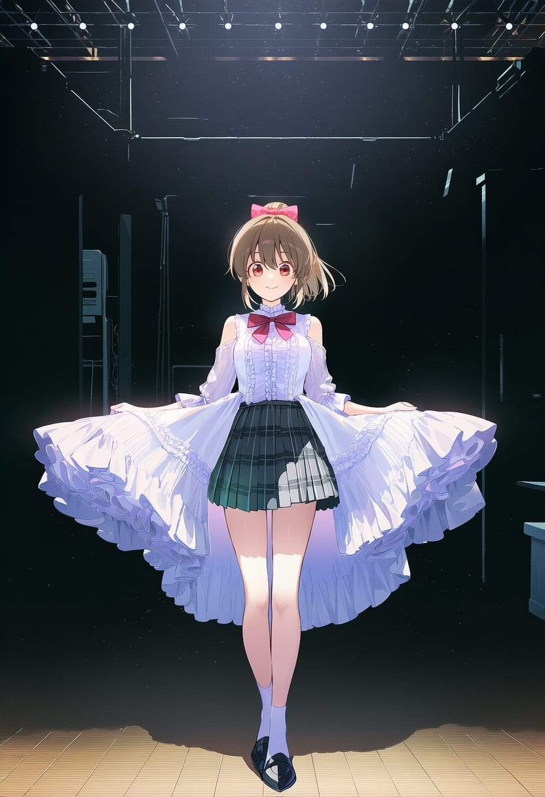

| 字段 | 内容 |
| --- | --- |
| 序号 | 0084 |
| tag | backstage |
| tag中文名 | 后台 |
| tag中文含义 | 场景位于后台。 |
| tag所属的子类（简单分类即可） | 室内空间 |
| 角色 | hori_yuko |

## 84. ballroom — 场景位于舞厅。

| 字段 | 内容 |
| --- | --- |
| 序号 | 0085 |
| tag | ballroom |
| tag中文名 | 舞厅 |
| tag中文含义 | 场景位于舞厅。 |
| tag所属的子类（简单分类即可） | 室内空间 |
| 角色 | mizumoto_yukari |

## 85. bathroom — 场景位于浴室。

| 字段 | 内容 |
| --- | --- |
| 序号 | 0086 |
| tag | bathroom |
| tag中文名 | 浴室 |
| tag中文含义 | 场景位于浴室。 |
| tag所属的子类（简单分类即可） | 室内空间 |
| 角色 | fukuyama_mai |

## 86. bathtub — 场景位于浴缸场景。

| 字段 | 内容 |
| --- | --- |
| 序号 | 0087 |
| tag | bathtub |
| tag中文名 | 浴缸场景 |
| tag中文含义 | 场景位于浴缸场景。 |
| tag所属的子类（简单分类即可） | 室内空间 |
| 角色 | layla_(idolmaster) |

## 87. bedroom — 场景位于卧室。

| 字段 | 内容 |
| --- | --- |
| 序号 | 0088 |
| tag | bedroom |
| tag中文名 | 卧室 |
| tag中文含义 | 场景位于卧室。 |
| tag所属的子类（简单分类即可） | 室内空间 |
| 角色 | kimura_natsuki |

## 88. boxing_ring — 场景位于拳击台。

| 字段 | 内容 |
| --- | --- |
| 序号 | 0089 |
| tag | boxing_ring |
| tag中文名 | 拳击台 |
| tag中文含义 | 场景位于拳击台。 |
| tag所属的子类（简单分类即可） | 室内空间 |
| 角色 | asari_nanami |

## 89. cafeteria — 场景位于食堂。

| 字段 | 内容 |
| --- | --- |
| 序号 | 0090 |
| tag | cafeteria |
| tag中文名 | 食堂 |
| tag中文含义 | 场景位于食堂。 |
| tag所属的子类（简单分类即可） | 室内空间 |
| 角色 | fujiwara_hajime |

## 90. changing_room — 场景位于更衣室。

| 字段 | 内容 |
| --- | --- |
| 序号 | 0091 |
| tag | changing_room |
| tag中文名 | 更衣室 |
| tag中文含义 | 场景位于更衣室。 |
| tag所属的子类（简单分类即可） | 室内空间 |
| 角色 | kawashima_mizuki |

## 91. classroom — 场景位于教室。

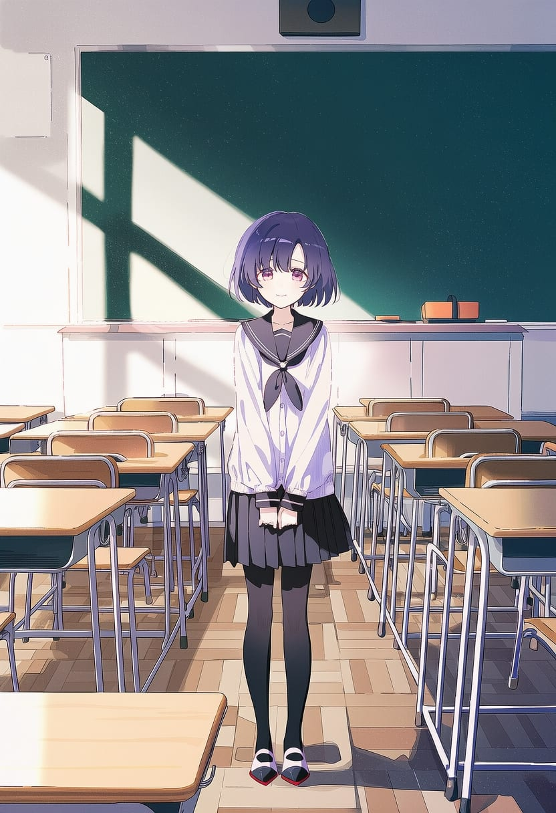

| 字段 | 内容 |
| --- | --- |
| 序号 | 0092 |
| tag | classroom |
| tag中文名 | 教室 |
| tag中文含义 | 场景位于教室。 |
| tag所属的子类（简单分类即可） | 室内空间 |
| 角色 | shiragiku_hotaru |

## 92. closet — 场景位于壁橱/衣橱空间。

| 字段 | 内容 |
| --- | --- |
| 序号 | 0093 |
| tag | closet |
| tag中文名 | 壁橱/衣橱空间 |
| tag中文含义 | 场景位于壁橱/衣橱空间。 |
| tag所属的子类（简单分类即可） | 室内空间 |
| 角色 | nakano_yuka |

## 93. clubroom — 场景位于社团活动室。

| 字段 | 内容 |
| --- | --- |
| 序号 | 0094 |
| tag | clubroom |
| tag中文名 | 社团活动室 |
| tag中文含义 | 场景位于社团活动室。 |
| tag所属的子类（简单分类即可） | 室内空间 |
| 角色 | hamaguchi_ayame |

## 94. courtroom — 场景位于法庭。

| 字段 | 内容 |
| --- | --- |
| 序号 | 0095 |
| tag | courtroom |
| tag中文名 | 法庭 |
| tag中文含义 | 场景位于法庭。 |
| tag所属的子类（简单分类即可） | 室内空间 |
| 角色 | shiina_noriko |

## 95. cubicle — 场景位于办公隔间。

| 字段 | 内容 |
| --- | --- |
| 序号 | 0096 |
| tag | cubicle |
| tag中文名 | 办公隔间 |
| tag中文含义 | 场景位于办公隔间。 |
| tag所属的子类（简单分类即可） | 室内空间 |
| 角色 | munakata_atsumi |

## 96. dining_room — 场景位于餐厅/饭厅。

| 字段 | 内容 |
| --- | --- |
| 序号 | 0097 |
| tag | dining_room |
| tag中文名 | 餐厅/饭厅 |
| tag中文含义 | 场景位于餐厅/饭厅。 |
| tag所属的子类（简单分类即可） | 室内空间 |
| 角色 | koga_koharu |

## 97. dressing_room — 场景位于化妆间/更衣化妆室。

| 字段 | 内容 |
| --- | --- |
| 序号 | 0098 |
| tag | dressing_room |
| tag中文名 | 化妆间/更衣化妆室 |
| tag中文含义 | 场景位于化妆间/更衣化妆室。 |
| tag所属的子类（简单分类即可） | 室内空间 |
| 角色 | ohishi_izumi |

## 98. dungeon — 场景位于地牢。

| 字段 | 内容 |
| --- | --- |
| 序号 | 0099 |
| tag | dungeon |
| tag中文名 | 地牢 |
| tag中文含义 | 场景位于地牢。 |
| tag所属的子类（简单分类即可） | 室内空间 |
| 角色 | araki_hina |

## 99. fitness_gym — 场景位于健身房。

| 字段 | 内容 |
| --- | --- |
| 序号 | 0100 |
| tag | fitness_gym |
| tag中文名 | 健身房 |
| tag中文含义 | 场景位于健身房。 |
| tag所属的子类（简单分类即可） | 室内空间 |
| 角色 | yokoyama_chika |

## 100. fitting_room — 场景位于试衣间。

| 字段 | 内容 |
| --- | --- |
| 序号 | 0101 |
| tag | fitting_room |
| tag中文名 | 试衣间 |
| tag中文含义 | 场景位于试衣间。 |
| tag所属的子类（简单分类即可） | 室内空间 |
| 角色 | seki_hiromi |

## 101. genkan — 场景位于日式玄关。

| 字段 | 内容 |
| --- | --- |
| 序号 | 0102 |
| tag | genkan |
| tag中文名 | 日式玄关 |
| tag中文含义 | 场景位于日式玄关。 |
| tag所属的子类（简单分类即可） | 室内空间 |
| 角色 | fujimoto_rina |

## 102. gym_storeroom — 场景位于体育器材室。

| 字段 | 内容 |
| --- | --- |
| 序号 | 0103 |
| tag | gym_storeroom |
| tag中文名 | 体育器材室 |
| tag中文含义 | 场景位于体育器材室。 |
| tag所属的子类（简单分类即可） | 室内空间 |
| 角色 | yagami_makino |

## 103. hallway — 场景位于走廊。

| 字段 | 内容 |
| --- | --- |
| 序号 | 0104 |
| tag | hallway |
| tag中文名 | 走廊 |
| tag中文含义 | 场景位于走廊。 |
| tag所属的子类（简单分类即可） | 室内空间 |
| 角色 | zaizen_tokiko |

## 104. hotel_room — 场景位于酒店客房。

| 字段 | 内容 |
| --- | --- |
| 序号 | 0105 |
| tag | hotel_room |
| tag中文名 | 酒店客房 |
| tag中文含义 | 场景位于酒店客房。 |
| tag所属的子类（简单分类即可） | 室内空间 |
| 角色 | kitami_yuzu |

## 105. infirmary — 场景位于医务室。

| 字段 | 内容 |
| --- | --- |
| 序号 | 0106 |
| tag | infirmary |
| tag中文名 | 医务室 |
| tag中文含义 | 场景位于医务室。 |
| tag所属的子类（简单分类即可） | 室内空间 |
| 角色 | matsunaga_ryo |

## 106. kitchen — 场景位于厨房。

| 字段 | 内容 |
| --- | --- |
| 序号 | 0107 |
| tag | kitchen |
| tag中文名 | 厨房 |
| tag中文含义 | 场景位于厨房。 |
| tag所属的子类（简单分类即可） | 室内空间 |
| 角色 | ikebukuro_akiha |

## 107. laboratory — 场景位于实验室。

| 字段 | 内容 |
| --- | --- |
| 序号 | 0108 |
| tag | laboratory |
| tag中文名 | 实验室 |
| tag中文含义 | 场景位于实验室。 |
| tag所属的子类（简单分类即可） | 室内空间 |
| 角色 | koseki_reina |

## 108. library — 场景位于图书馆。

| 字段 | 内容 |
| --- | --- |
| 序号 | 0109 |
| tag | library |
| tag中文名 | 图书馆 |
| tag中文含义 | 场景位于图书馆。 |
| tag所属的子类（简单分类即可） | 室内空间 |
| 角色 | nanjo_hikaru |

## 109. living_room — 场景位于客厅。

| 字段 | 内容 |
| --- | --- |
| 序号 | 0110 |
| tag | living_room |
| tag中文名 | 客厅 |
| tag中文含义 | 场景位于客厅。 |
| tag所属的子类（简单分类即可） | 室内空间 |
| 角色 | narumiya_yume |

## 110. locker_room — 场景位于更衣柜室。

| 字段 | 内容 |
| --- | --- |
| 序号 | 0111 |
| tag | locker_room |
| tag中文名 | 更衣柜室 |
| tag中文含义 | 场景位于更衣柜室。 |
| tag所属的子类（简单分类即可） | 室内空间 |
| 角色 | murakami_tomoe |

## 111. messy_room — 场景位于凌乱房间。

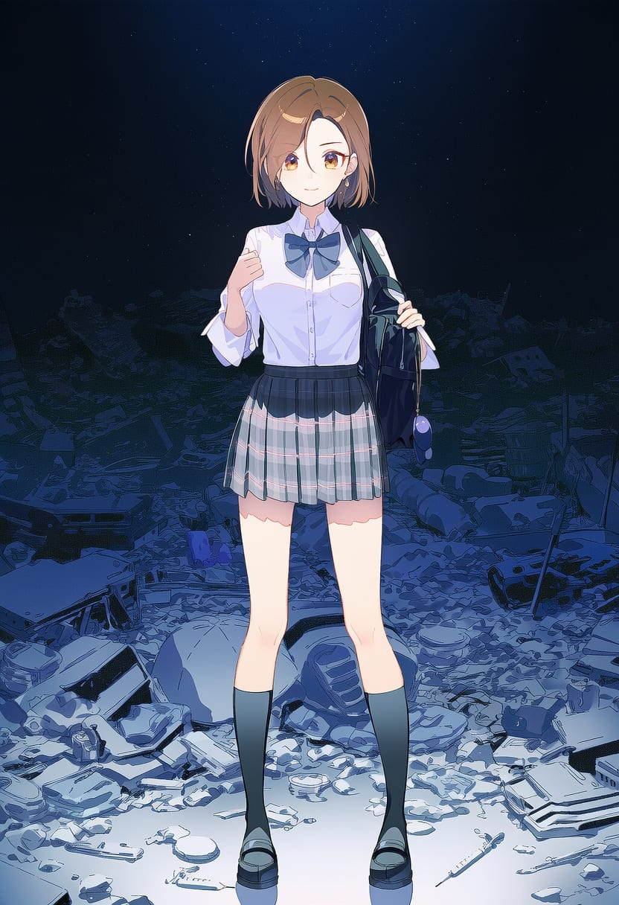

| 字段 | 内容 |
| --- | --- |
| 序号 | 0112 |
| tag | messy_room |
| tag中文名 | 凌乱房间 |
| tag中文含义 | 场景位于凌乱房间。 |
| tag所属的子类（简单分类即可） | 室内空间 |
| 角色 | mizuki_seira |

## 112. office — 场景位于办公室。

| 字段 | 内容 |
| --- | --- |
| 序号 | 0113 |
| tag | office |
| tag中文名 | 办公室 |
| tag中文含义 | 场景位于办公室。 |
| tag所属的子类（简单分类即可） | 室内空间 |
| 角色 | yamato_aki |

## 113. otaku_room — 场景位于御宅房间。

| 字段 | 内容 |
| --- | --- |
| 序号 | 0114 |
| tag | otaku_room |
| tag中文名 | 御宅房间 |
| tag中文含义 | 场景位于御宅房间。 |
| tag所属的子类（简单分类即可） | 室内空间 |
| 角色 | ayase_honoka |

## 114. pool — 场景位于泳池。

| 字段 | 内容 |
| --- | --- |
| 序号 | 0115 |
| tag | pool |
| tag中文名 | 泳池 |
| tag中文含义 | 场景位于泳池。 |
| tag所属的子类（简单分类即可） | 室内空间 |
| 角色 | suou_momoko |

## 115. poolside — 场景位于泳池边。

| 字段 | 内容 |
| --- | --- |
| 序号 | 0116 |
| tag | poolside |
| tag中文名 | 泳池边 |
| tag中文含义 | 场景位于泳池边。 |
| tag所属的子类（简单分类即可） | 室内空间 |
| 角色 | kitazawa_shiho |

## 116. prison_cell — 场景位于牢房。

| 字段 | 内容 |
| --- | --- |
| 序号 | 0117 |
| tag | prison_cell |
| tag中文名 | 牢房 |
| tag中文含义 | 场景位于牢房。 |
| tag所属的子类（简单分类即可） | 室内空间 |
| 角色 | makabe_mizuki |

## 117. public_restroom — 场景位于公共厕所。

| 字段 | 内容 |
| --- | --- |
| 序号 | 0118 |
| tag | public_restroom |
| tag中文名 | 公共厕所 |
| tag中文含义 | 场景位于公共厕所。 |
| tag所属的子类（简单分类即可） | 室内空间 |
| 角色 | nanao_yuriko |

## 118. sauna — 场景位于桑拿房。

| 字段 | 内容 |
| --- | --- |
| 序号 | 0119 |
| tag | sauna |
| tag中文名 | 桑拿房 |
| tag中文含义 | 场景位于桑拿房。 |
| tag所属的子类（简单分类即可） | 室内空间 |
| 角色 | yokoyama_nao |

## 119. school_gym — 场景位于学校体育馆。

| 字段 | 内容 |
| --- | --- |
| 序号 | 0120 |
| tag | school_gym |
| tag中文名 | 学校体育馆 |
| tag中文含义 | 场景位于学校体育馆。 |
| tag所属的子类（简单分类即可） | 室内空间 |
| 角色 | ibuki_tsubasa |

## 120. shower_(place) — 场景位于淋浴间。

| 字段 | 内容 |
| --- | --- |
| 序号 | 0121 |
| tag | shower_(place) |
| tag中文名 | 淋浴间 |
| tag中文含义 | 场景位于淋浴间。 |
| tag所属的子类（简单分类即可） | 室内空间 |
| 角色 | mochizuki_anna |

## 121. stage — 场景位于舞台。

| 字段 | 内容 |
| --- | --- |
| 序号 | 0122 |
| tag | stage |
| tag中文名 | 舞台 |
| tag中文含义 | 场景位于舞台。 |
| tag所属的子类（简单分类即可） | 室内空间 |
| 角色 | toyokawa_fuka |

## 122. toilet_stall — 场景位于厕所隔间。

| 字段 | 内容 |
| --- | --- |
| 序号 | 0123 |
| tag | toilet_stall |
| tag中文名 | 厕所隔间 |
| tag中文含义 | 场景位于厕所隔间。 |
| tag所属的子类（简单分类即可） | 室内空间 |
| 角色 | mogami_shizuka |

## 123. wrestling_ring — 场景位于摔角擂台。

| 字段 | 内容 |
| --- | --- |
| 序号 | 0124 |
| tag | wrestling_ring |
| tag中文名 | 摔角擂台 |
| tag中文含义 | 场景位于摔角擂台。 |
| tag所属的子类（简单分类即可） | 室内空间 |
| 角色 | satake_minako |

## 124. bamboo_forest — 以竹林为主要自然环境。

| 字段 | 内容 |
| --- | --- |
| 序号 | 0125 |
| tag | bamboo_forest |
| tag中文名 | 竹林 |
| tag中文含义 | 以竹林为主要自然环境。 |
| tag所属的子类（简单分类即可） | 自然地貌/植被 |
| 角色 | tokoro_megumi |

## 125. canyon — 以峡谷为主要自然环境。

| 字段 | 内容 |
| --- | --- |
| 序号 | 0126 |
| tag | canyon |
| tag中文名 | 峡谷 |
| tag中文含义 | 以峡谷为主要自然环境。 |
| tag所属的子类（简单分类即可） | 自然地貌/植被 |
| 角色 | hakozaki_serika |

## 126. cave — 以洞穴为主要自然环境。

| 字段 | 内容 |
| --- | --- |
| 序号 | 0127 |
| tag | cave |
| tag中文名 | 洞穴 |
| tag中文含义 | 以洞穴为主要自然环境。 |
| tag所属的子类（简单分类即可） | 自然地貌/植被 |
| 角色 | tanaka_kotoha |

## 127. cliff — 以悬崖为主要自然环境。

| 字段 | 内容 |
| --- | --- |
| 序号 | 0128 |
| tag | cliff |
| tag中文名 | 悬崖 |
| tag中文含义 | 以悬崖为主要自然环境。 |
| tag所属的子类（简单分类即可） | 自然地貌/植被 |
| 角色 | kasuga_mirai |

## 128. desert — 以沙漠为主要自然环境。

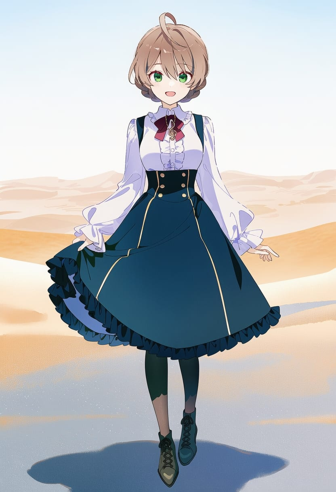

| 字段 | 内容 |
| --- | --- |
| 序号 | 0129 |
| tag | desert |
| tag中文名 | 沙漠 |
| tag中文含义 | 以沙漠为主要自然环境。 |
| tag所属的子类（简单分类即可） | 自然地貌/植被 |
| 角色 | sakuramori_kaori |

## 129. forest — 以森林为主要自然环境。

| 字段 | 内容 |
| --- | --- |
| 序号 | 0130 |
| tag | forest |
| tag中文名 | 森林 |
| tag中文含义 | 以森林为主要自然环境。 |
| tag所属的子类（简单分类即可） | 自然地貌/植被 |
| 角色 | shiraishi_tsumugi |

## 130. glacier — 以冰川为主要自然环境。

| 字段 | 内容 |
| --- | --- |
| 序号 | 0131 |
| tag | glacier |
| tag中文名 | 冰川 |
| tag中文含义 | 以冰川为主要自然环境。 |
| tag所属的子类（简单分类即可） | 自然地貌/植被 |
| 角色 | shimabara_elena |

## 131. grasslands — 以草原为主要自然环境。

| 字段 | 内容 |
| --- | --- |
| 序号 | 0132 |
| tag | grasslands |
| tag中文名 | 草原 |
| tag中文含义 | 以草原为主要自然环境。 |
| tag所属的子类（简单分类即可） | 自然地貌/植被 |
| 角色 | kousaka_umi |

## 132. hill — 以丘陵为主要自然环境。

| 字段 | 内容 |
| --- | --- |
| 序号 | 0133 |
| tag | hill |
| tag中文名 | 丘陵 |
| tag中文含义 | 以丘陵为主要自然环境。 |
| tag所属的子类（简单分类即可） | 自然地貌/植被 |
| 角色 | baba_konomi |

## 133. jungle — 以丛林为主要自然环境。

| 字段 | 内容 |
| --- | --- |
| 序号 | 0134 |
| tag | jungle |
| tag中文名 | 丛林 |
| tag中文含义 | 以丛林为主要自然环境。 |
| tag所属的子类（简单分类即可） | 自然地貌/植被 |
| 角色 | nakatani_iku |

## 134. meadow — 以草甸为主要自然环境。

| 字段 | 内容 |
| --- | --- |
| 序号 | 0135 |
| tag | meadow |
| tag中文名 | 草甸 |
| tag中文含义 | 以草甸为主要自然环境。 |
| tag所属的子类（简单分类即可） | 自然地貌/植被 |
| 角色 | emily_stewart |

## 135. mountain — 以山地为主要自然环境。

| 字段 | 内容 |
| --- | --- |
| 序号 | 0136 |
| tag | mountain |
| tag中文名 | 山地 |
| tag中文含义 | 以山地为主要自然环境。 |
| tag所属的子类（简单分类即可） | 自然地貌/植被 |
| 角色 | takayama_sayoko |

## 136. nature — 以自然景观为主要自然环境。

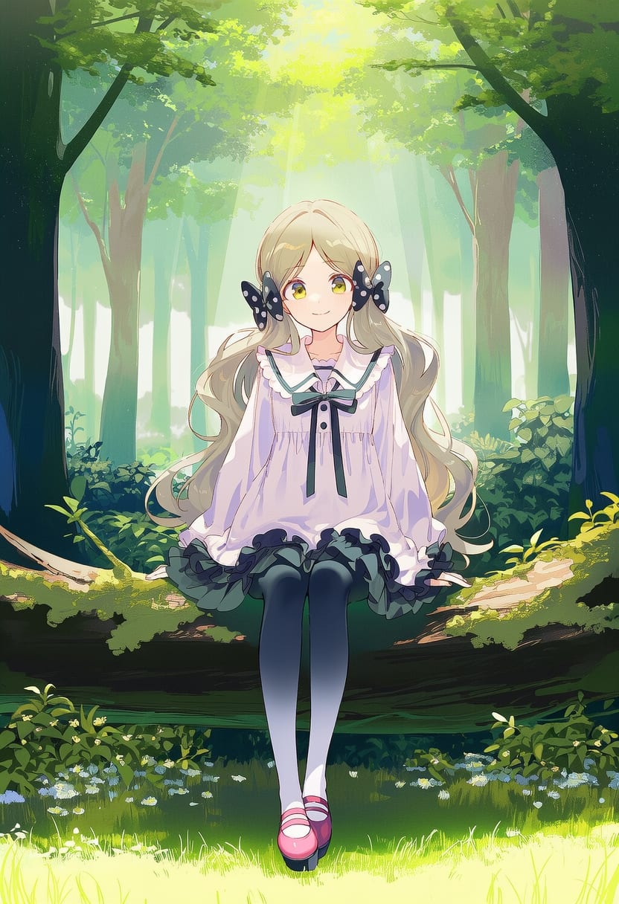

| 字段 | 内容 |
| --- | --- |
| 序号 | 0137 |
| tag | nature |
| tag中文名 | 自然景观 |
| tag中文含义 | 以自然景观为主要自然环境。 |
| tag所属的子类（简单分类即可） | 自然地貌/植被 |
| 角色 | handa_roco |

## 137. plain — 以平原为主要自然环境。

| 字段 | 内容 |
| --- | --- |
| 序号 | 0138 |
| tag | plain |
| tag中文名 | 平原 |
| tag中文含义 | 以平原为主要自然环境。 |
| tag所属的子类（简单分类即可） | 自然地貌/植被 |
| 角色 | ogami_tamaki |

## 138. savannah — 以稀树草原为主要自然环境。

| 字段 | 内容 |
| --- | --- |
| 序号 | 0139 |
| tag | savannah |
| tag中文名 | 稀树草原 |
| tag中文含义 | 以稀树草原为主要自然环境。 |
| tag所属的子类（简单分类即可） | 自然地貌/植被 |
| 角色 | tokugawa_matsuri |

## 139. volcano — 以火山为主要自然环境。

| 字段 | 内容 |
| --- | --- |
| 序号 | 0140 |
| tag | volcano |
| tag中文名 | 火山 |
| tag中文含义 | 以火山为主要自然环境。 |
| tag所属的子类（简单分类即可） | 自然地貌/植被 |
| 角色 | kitakami_reika |

## 140. wasteland — 以荒原为主要自然环境。

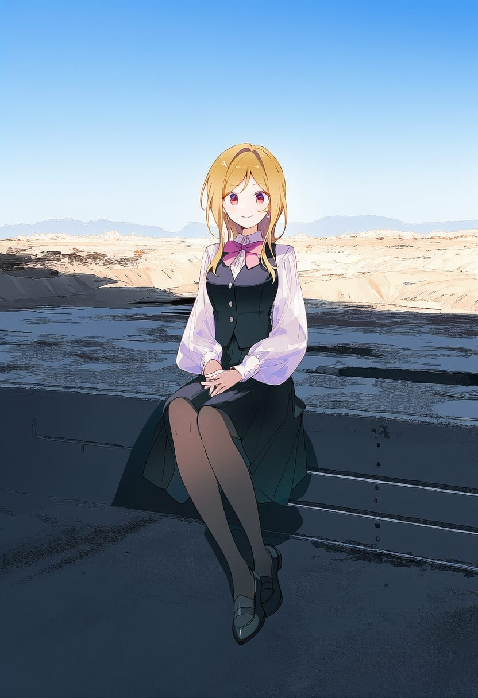

| 字段 | 内容 |
| --- | --- |
| 序号 | 0141 |
| tag | wasteland |
| tag中文名 | 荒原 |
| tag中文含义 | 以荒原为主要自然环境。 |
| tag所属的子类（简单分类即可） | 自然地貌/植被 |
| 角色 | momose_rio |

## 141. wetland — 以湿地为主要自然环境。

| 字段 | 内容 |
| --- | --- |
| 序号 | 0142 |
| tag | wetland |
| tag中文名 | 湿地 |
| tag中文含义 | 以湿地为主要自然环境。 |
| tag所属的子类（简单分类即可） | 自然地貌/植被 |
| 角色 | miyao_miya |

## 142. beach — 以海滩为主要水域或滨水环境。

| 字段 | 内容 |
| --- | --- |
| 序号 | 0143 |
| tag | beach |
| tag中文名 | 海滩 |
| tag中文含义 | 以海滩为主要水域或滨水环境。 |
| tag所属的子类（简单分类即可） | 水域/海滨 |
| 角色 | nagayoshi_subaru |

## 143. floating_island — 以浮空岛为主要水域或滨水环境。

| 字段 | 内容 |
| --- | --- |
| 序号 | 0144 |
| tag | floating_island |
| tag中文名 | 浮空岛 |
| tag中文含义 | 以浮空岛为主要水域或滨水环境。 |
| tag所属的子类（简单分类即可） | 水域/海滨 |
| 角色 | tenkubashi_tomoka |

## 144. island — 以岛屿为主要水域或滨水环境。

| 字段 | 内容 |
| --- | --- |
| 序号 | 0145 |
| tag | island |
| tag中文名 | 岛屿 |
| tag中文含义 | 以岛屿为主要水域或滨水环境。 |
| tag所属的子类（简单分类即可） | 水域/海滨 |
| 角色 | julia_(idolmaster) |

## 145. lake — 以湖泊为主要水域或滨水环境。

| 字段 | 内容 |
| --- | --- |
| 序号 | 0146 |
| tag | lake |
| tag中文名 | 湖泊 |
| tag中文含义 | 以湖泊为主要水域或滨水环境。 |
| tag所属的子类（简单分类即可） | 水域/海滨 |
| 角色 | yabuki_kana |

## 146. ocean — 以海洋为主要水域或滨水环境。

| 字段 | 内容 |
| --- | --- |
| 序号 | 0147 |
| tag | ocean |
| tag中文名 | 海洋 |
| tag中文含义 | 以海洋为主要水域或滨水环境。 |
| tag所属的子类（简单分类即可） | 水域/海滨 |
| 角色 | fukuda_noriko |

## 147. pond — 以池塘为主要水域或滨水环境。

| 字段 | 内容 |
| --- | --- |
| 序号 | 0148 |
| tag | pond |
| tag中文名 | 池塘 |
| tag中文含义 | 以池塘为主要水域或滨水环境。 |
| tag所属的子类（简单分类即可） | 水域/海滨 |
| 角色 | nonohara_akane |

## 148. river — 以河流为主要水域或滨水环境。

| 字段 | 内容 |
| --- | --- |
| 序号 | 0149 |
| tag | river |
| tag中文名 | 河流 |
| tag中文含义 | 以河流为主要水域或滨水环境。 |
| tag所属的子类（简单分类即可） | 水域/海滨 |
| 角色 | maihama_ayumu |

## 149. seafloor — 以海床为主要水域或滨水环境。

| 字段 | 内容 |
| --- | --- |
| 序号 | 0150 |
| tag | seafloor |
| tag中文名 | 海床 |
| tag中文含义 | 以海床为主要水域或滨水环境。 |
| tag所属的子类（简单分类即可） | 水域/海滨 |
| 角色 | nikaido_chizuru |

## 150. shore — 以岸边为主要水域或滨水环境。

| 字段 | 内容 |
| --- | --- |
| 序号 | 0151 |
| tag | shore |
| tag中文名 | 岸边 |
| tag中文含义 | 以岸边为主要水域或滨水环境。 |
| tag所属的子类（简单分类即可） | 水域/海滨 |
| 角色 | shinomiya_karen |

## 151. stream — 以溪流为主要水域或滨水环境。

| 字段 | 内容 |
| --- | --- |
| 序号 | 0152 |
| tag | stream |
| tag中文名 | 溪流 |
| tag中文含义 | 以溪流为主要水域或滨水环境。 |
| tag所属的子类（简单分类即可） | 水域/海滨 |
| 角色 | matsuda_arisa |

## 152. underwater — 以水下为主要水域或滨水环境。

| 字段 | 内容 |
| --- | --- |
| 序号 | 0153 |
| tag | underwater |
| tag中文名 | 水下 |
| tag中文含义 | 以水下为主要水域或滨水环境。 |
| tag所属的子类（简单分类即可） | 水域/海滨 |
| 角色 | kinoshita_hinata |

## 153. water — 以水域/水体为主要水域或滨水环境。

| 字段 | 内容 |
| --- | --- |
| 序号 | 0154 |
| tag | water |
| tag中文名 | 水域/水体 |
| tag中文含义 | 以水域/水体为主要水域或滨水环境。 |
| tag所属的子类（简单分类即可） | 水域/海滨 |
| 角色 | higuchi_madoka |

## 154. waterfall — 以瀑布为主要水域或滨水环境。

| 字段 | 内容 |
| --- | --- |
| 序号 | 0155 |
| tag | waterfall |
| tag中文名 | 瀑布 |
| tag中文含义 | 以瀑布为主要水域或滨水环境。 |
| tag所属的子类（简单分类即可） | 水域/海滨 |
| 角色 | mayuzumi_fuyuko |

## 155. alley — 场景包含或位于小巷。

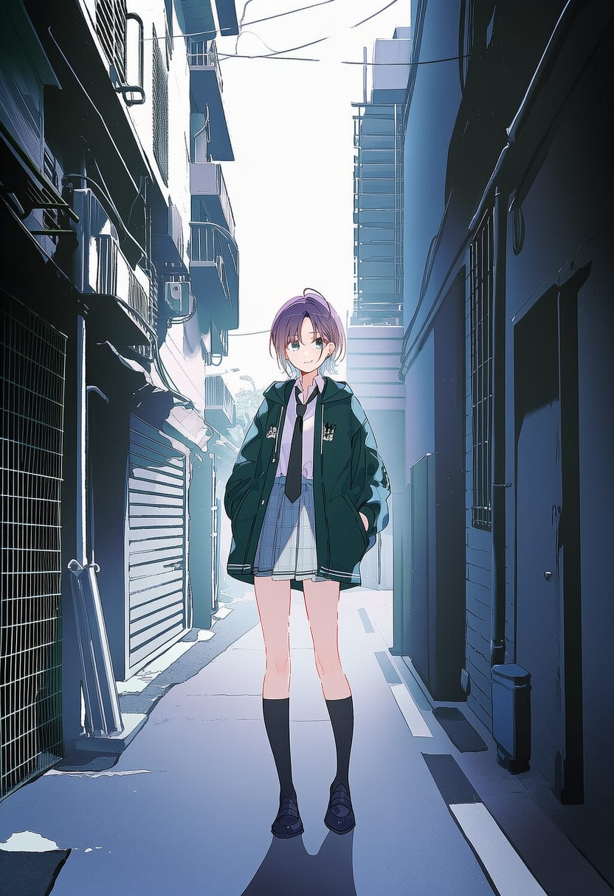

| 字段 | 内容 |
| --- | --- |
| 序号 | 0156 |
| tag | alley |
| tag中文名 | 小巷 |
| tag中文含义 | 场景包含或位于小巷。 |
| tag所属的子类（简单分类即可） | 城市/道路/户外设施 |
| 角色 | asakura_toru |

## 156. amusement_park — 场景包含或位于游乐园。

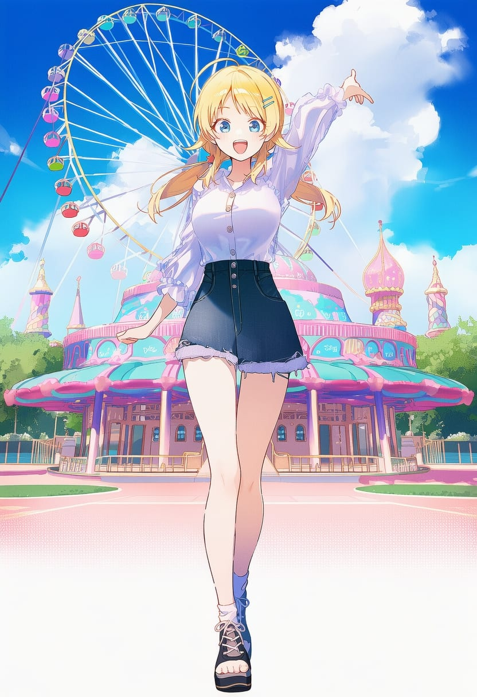

| 字段 | 内容 |
| --- | --- |
| 序号 | 0157 |
| tag | amusement_park |
| tag中文名 | 游乐园 |
| tag中文含义 | 场景包含或位于游乐园。 |
| tag所属的子类（简单分类即可） | 城市/道路/户外设施 |
| 角色 | hachimiya_meguru |

## 157. bridge — 场景包含或位于桥梁。

| 字段 | 内容 |
| --- | --- |
| 序号 | 0158 |
| tag | bridge |
| tag中文名 | 桥梁 |
| tag中文含义 | 场景包含或位于桥梁。 |
| tag所属的子类（简单分类即可） | 城市/道路/户外设施 |
| 角色 | fukumaru_koito |

## 158. canal — 场景包含或位于运河。

| 字段 | 内容 |
| --- | --- |
| 序号 | 0159 |
| tag | canal |
| tag中文名 | 运河 |
| tag中文含义 | 场景包含或位于运河。 |
| tag所属的子类（简单分类即可） | 城市/道路/户外设施 |
| 角色 | shirase_sakuya |

## 159. carousel — 场景包含或位于旋转木马。

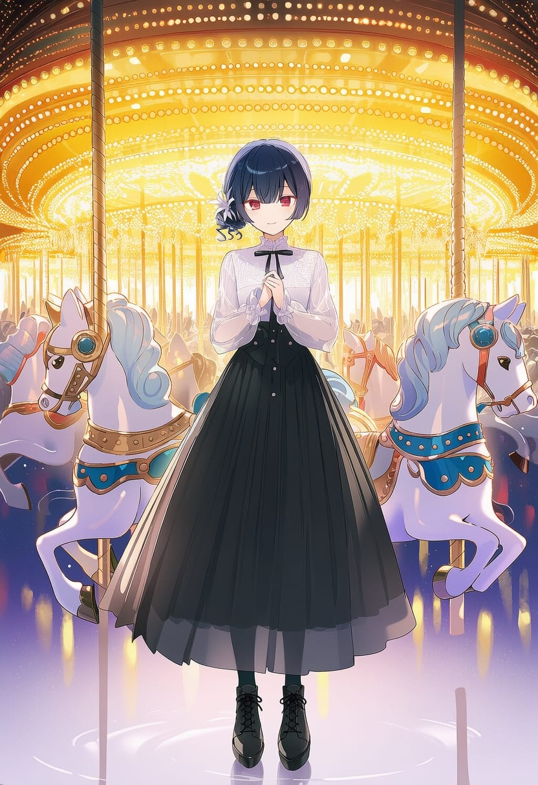

| 字段 | 内容 |
| --- | --- |
| 序号 | 0160 |
| tag | carousel |
| tag中文名 | 旋转木马 |
| tag中文含义 | 场景包含或位于旋转木马。 |
| tag所属的子类（简单分类即可） | 城市/道路/户外设施 |
| 角色 | morino_rinze |

## 160. city — 场景包含或位于城市。

| 字段 | 内容 |
| --- | --- |
| 序号 | 0161 |
| tag | city |
| tag中文名 | 城市 |
| tag中文含义 | 场景包含或位于城市。 |
| tag所属的子类（简单分类即可） | 城市/道路/户外设施 |
| 角色 | kuwayama_chiyuki |

## 161. dirt_road — 场景包含或位于土路。

| 字段 | 内容 |
| --- | --- |
| 序号 | 0162 |
| tag | dirt_road |
| tag中文名 | 土路 |
| tag中文含义 | 场景包含或位于土路。 |
| tag所属的子类（简单分类即可） | 城市/道路/户外设施 |
| 角色 | tsukioka_kogane |

## 162. dock — 场景包含或位于码头。

| 字段 | 内容 |
| --- | --- |
| 序号 | 0163 |
| tag | dock |
| tag中文名 | 码头 |
| tag中文含义 | 场景包含或位于码头。 |
| tag所属的子类（简单分类即可） | 城市/道路/户外设施 |
| 角色 | osaki_amana |

## 163. farm — 场景包含或位于农场。

| 字段 | 内容 |
| --- | --- |
| 序号 | 0164 |
| tag | farm |
| tag中文名 | 农场 |
| tag中文含义 | 场景包含或位于农场。 |
| tag所属的子类（简单分类即可） | 城市/道路/户外设施 |
| 角色 | serizawa_asahi |

## 164. ferris_wheel — 场景包含或位于摩天轮。

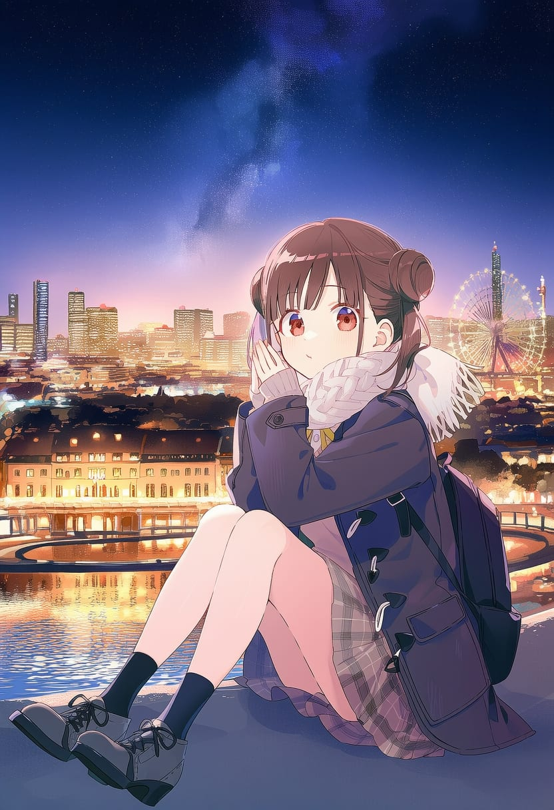

| 字段 | 内容 |
| --- | --- |
| 序号 | 0165 |
| tag | ferris_wheel |
| tag中文名 | 摩天轮 |
| tag中文含义 | 场景包含或位于摩天轮。 |
| tag所属的子类（简单分类即可） | 城市/道路/户外设施 |
| 角色 | sonoda_chiyoko |

## 165. field — 场景包含或位于田野。

| 字段 | 内容 |
| --- | --- |
| 序号 | 0166 |
| tag | field |
| tag中文名 | 田野 |
| tag中文含义 | 场景包含或位于田野。 |
| tag所属的子类（简单分类即可） | 城市/道路/户外设施 |
| 角色 | komiya_kaho |

## 166. floating_city — 场景包含或位于浮空城市。

| 字段 | 内容 |
| --- | --- |
| 序号 | 0167 |
| tag | floating_city |
| tag中文名 | 浮空城市 |
| tag中文含义 | 场景包含或位于浮空城市。 |
| tag所属的子类（简单分类即可） | 城市/道路/户外设施 |
| 角色 | sakuragi_mano |

## 167. flower_field — 场景包含或位于花田。

| 字段 | 内容 |
| --- | --- |
| 序号 | 0168 |
| tag | flower_field |
| tag中文名 | 花田 |
| tag中文含义 | 场景包含或位于花田。 |
| tag所属的子类（简单分类即可） | 城市/道路/户外设施 |
| 角色 | tanaka_mamimi |

## 168. fountain — 场景包含或位于喷泉。

| 字段 | 内容 |
| --- | --- |
| 序号 | 0169 |
| tag | fountain |
| tag中文名 | 喷泉 |
| tag中文含义 | 场景包含或位于喷泉。 |
| tag所属的子类（简单分类即可） | 城市/道路/户外设施 |
| 角色 | osaki_tenka |

## 169. garden — 场景包含或位于花园。

| 字段 | 内容 |
| --- | --- |
| 序号 | 0170 |
| tag | garden |
| tag中文名 | 花园 |
| tag中文含义 | 场景包含或位于花园。 |
| tag所属的子类（简单分类即可） | 城市/道路/户外设施 |
| 角色 | kazano_hiori |

## 170. graveyard — 场景包含或位于墓地。

| 字段 | 内容 |
| --- | --- |
| 序号 | 0171 |
| tag | graveyard |
| tag中文名 | 墓地 |
| tag中文含义 | 场景包含或位于墓地。 |
| tag所属的子类（简单分类即可） | 城市/道路/户外设施 |
| 角色 | arisugawa_natsuha |

## 171. harbor — 场景包含或位于港湾。

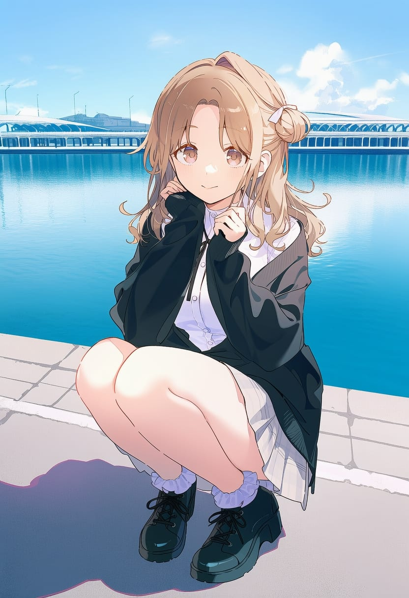

| 字段 | 内容 |
| --- | --- |
| 序号 | 0172 |
| tag | harbor |
| tag中文名 | 港湾 |
| tag中文含义 | 场景包含或位于港湾。 |
| tag所属的子类（简单分类即可） | 城市/道路/户外设施 |
| 角色 | ichikawa_hinana |

## 172. highway — 场景包含或位于高速公路。

| 字段 | 内容 |
| --- | --- |
| 序号 | 0173 |
| tag | highway |
| tag中文名 | 高速公路 |
| tag中文含义 | 场景包含或位于高速公路。 |
| tag所属的子类（简单分类即可） | 城市/道路/户外设施 |
| 角色 | izumi_mei |

## 173. horse_racing_track — 场景包含或位于赛马场。

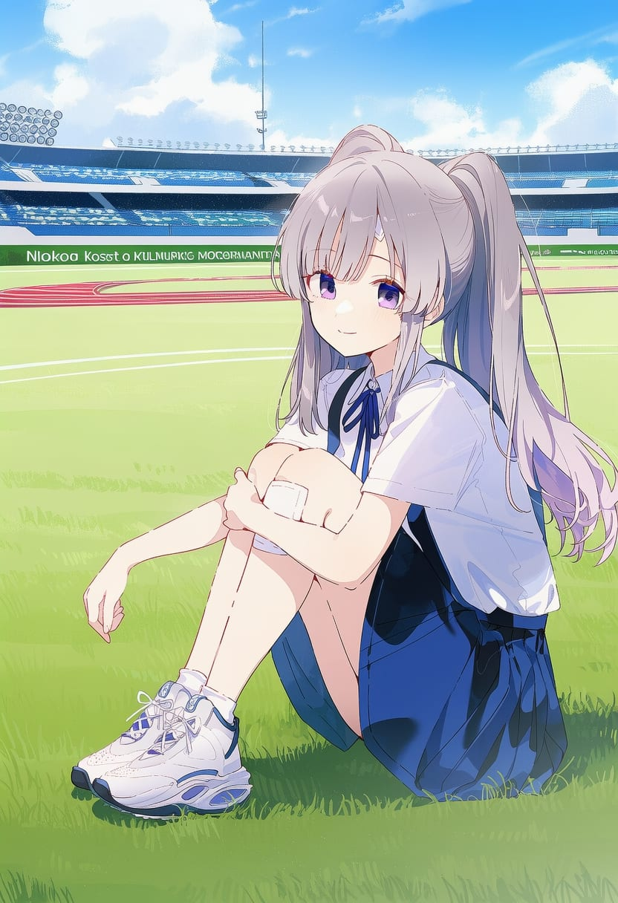

| 字段 | 内容 |
| --- | --- |
| 序号 | 0174 |
| tag | horse_racing_track |
| tag中文名 | 赛马场 |
| tag中文含义 | 场景包含或位于赛马场。 |
| tag所属的子类（简单分类即可） | 城市/道路/户外设施 |
| 角色 | yukoku_kiriko |

## 174. junkyard — 场景包含或位于废品场。

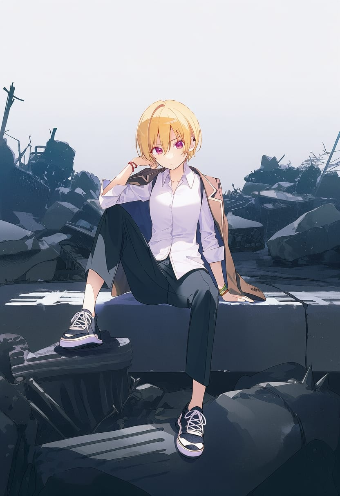

| 字段 | 内容 |
| --- | --- |
| 序号 | 0175 |
| tag | junkyard |
| tag中文名 | 废品场 |
| tag中文含义 | 场景包含或位于废品场。 |
| tag所属的子类（简单分类即可） | 城市/道路/户外设施 |
| 角色 | saijo_juri |

## 175. market — 场景包含或位于市场。

| 字段 | 内容 |
| --- | --- |
| 序号 | 0176 |
| tag | market |
| tag中文名 | 市场 |
| tag中文含义 | 场景包含或位于市场。 |
| tag所属的子类（简单分类即可） | 城市/道路/户外设施 |
| 角色 | mitsumine_yuika |

## 176. market_stall — 场景包含或位于市场摊位。

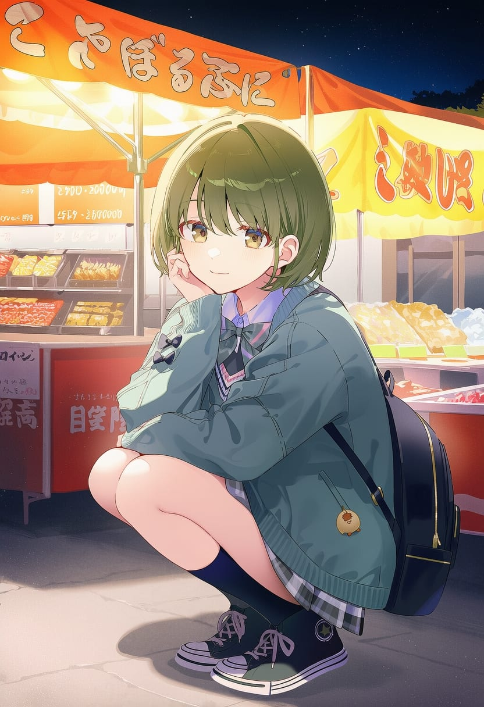

| 字段 | 内容 |
| --- | --- |
| 序号 | 0177 |
| tag | market_stall |
| tag中文名 | 市场摊位 |
| tag中文含义 | 场景包含或位于市场摊位。 |
| tag所属的子类（简单分类即可） | 城市/道路/户外设施 |
| 角色 | nanakusa_nichika |

## 177. park — 场景包含或位于公园。

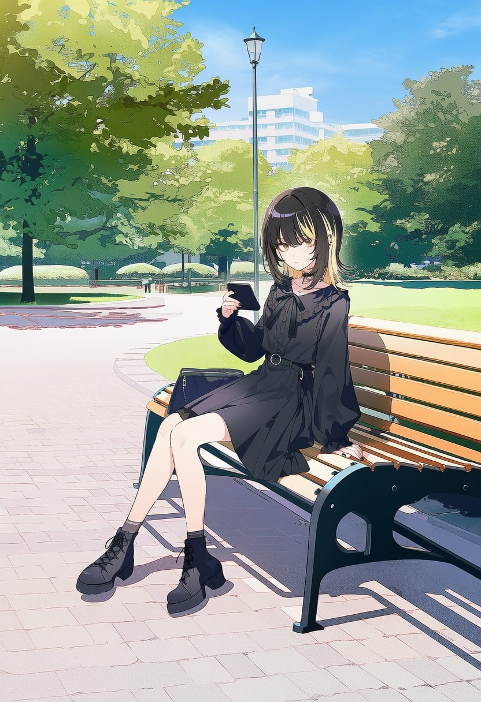

| 字段 | 内容 |
| --- | --- |
| 序号 | 0178 |
| tag | park |
| tag中文名 | 公园 |
| tag中文含义 | 场景包含或位于公园。 |
| tag所属的子类（简单分类即可） | 城市/道路/户外设施 |
| 角色 | ikaruga_luca |

## 178. parking_lot — 场景包含或位于停车场。

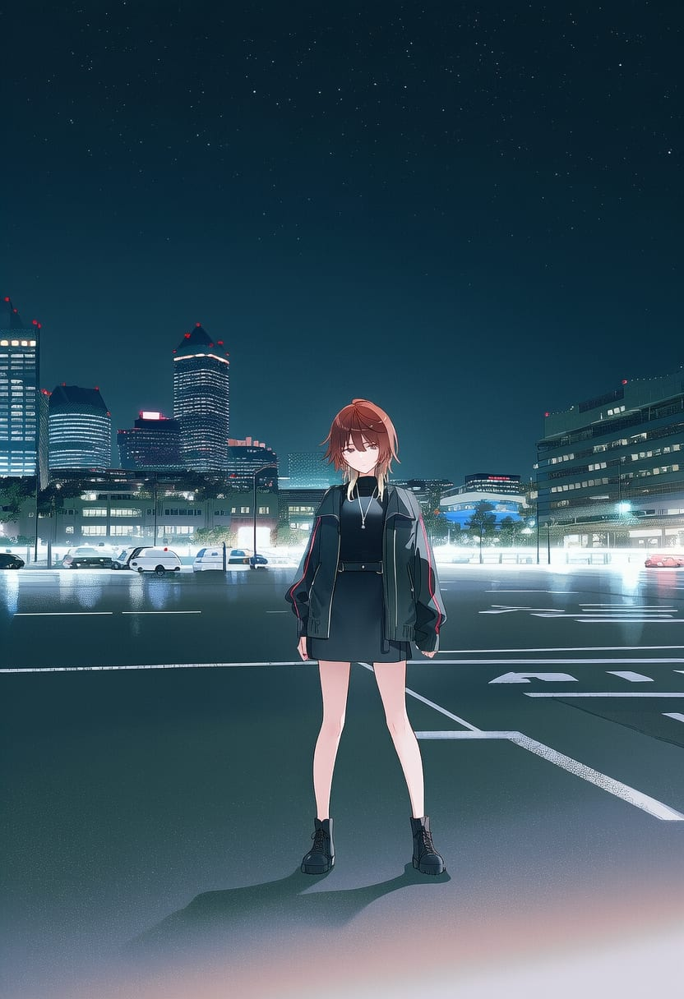

| 字段 | 内容 |
| --- | --- |
| 序号 | 0179 |
| tag | parking_lot |
| tag中文名 | 停车场 |
| tag中文含义 | 场景包含或位于停车场。 |
| tag所属的子类（简单分类即可） | 城市/道路/户外设施 |
| 角色 | aketa_mikoto |

## 179. path — 场景包含或位于小径。

| 字段 | 内容 |
| --- | --- |
| 序号 | 0180 |
| tag | path |
| tag中文名 | 小径 |
| tag中文含义 | 场景包含或位于小径。 |
| tag所属的子类（简单分类即可） | 城市/道路/户外设施 |
| 角色 | nanakusa_hazuki |

## 180. phone_booth — 场景包含或位于电话亭。

| 字段 | 内容 |
| --- | --- |
| 序号 | 0181 |
| tag | phone_booth |
| tag中文名 | 电话亭 |
| tag中文含义 | 场景包含或位于电话亭。 |
| tag所属的子类（简单分类即可） | 城市/道路/户外设施 |
| 角色 | suzuki_hana |

## 181. pier — 场景包含或位于栈桥/码头。

| 字段 | 内容 |
| --- | --- |
| 序号 | 0182 |
| tag | pier |
| tag中文名 | 栈桥/码头 |
| tag中文含义 | 场景包含或位于栈桥/码头。 |
| tag所属的子类（简单分类即可） | 城市/道路/户外设施 |
| 角色 | ikuta_haruki |

## 182. playground — 场景包含或位于游乐场。

| 字段 | 内容 |
| --- | --- |
| 序号 | 0183 |
| tag | playground |
| tag中文名 | 游乐场 |
| tag中文含义 | 场景包含或位于游乐场。 |
| tag所属的子类（简单分类即可） | 城市/道路/户外设施 |
| 角色 | shinosawa_hiro |

## 183. racetrack — 场景包含或位于赛道。

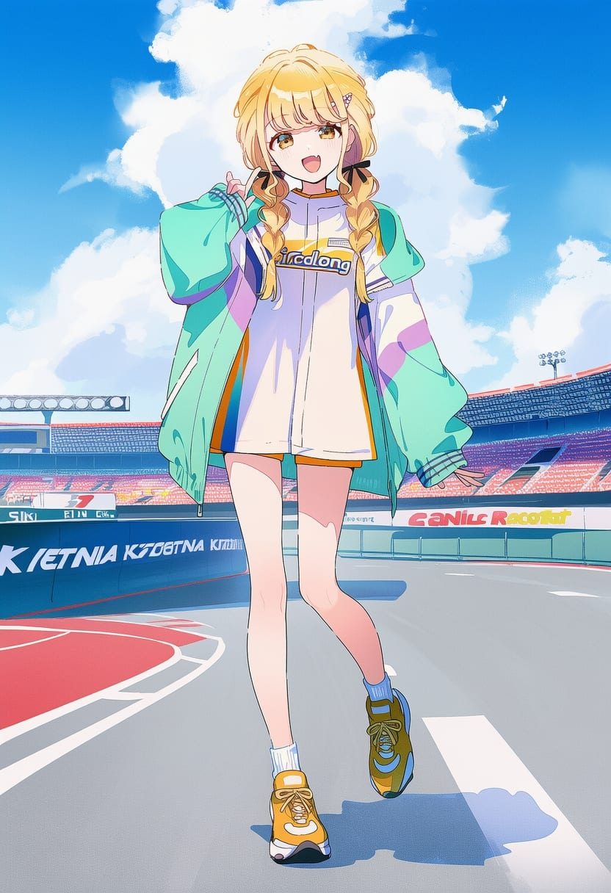

| 字段 | 内容 |
| --- | --- |
| 序号 | 0184 |
| tag | racetrack |
| tag中文名 | 赛道 |
| tag中文含义 | 场景包含或位于赛道。 |
| tag所属的子类（简单分类即可） | 城市/道路/户外设施 |
| 角色 | fujita_kotone |

## 184. railroad_crossing — 场景包含或位于铁路道口。

| 字段 | 内容 |
| --- | --- |
| 序号 | 0185 |
| tag | railroad_crossing |
| tag中文名 | 铁路道口 |
| tag中文含义 | 场景包含或位于铁路道口。 |
| tag所属的子类（简单分类即可） | 城市/道路/户外设施 |
| 角色 | hanami_ume |

## 185. railroad_tracks — 场景包含或位于铁轨。

| 字段 | 内容 |
| --- | --- |
| 序号 | 0186 |
| tag | railroad_tracks |
| tag中文名 | 铁轨 |
| tag中文含义 | 场景包含或位于铁轨。 |
| tag所属的子类（简单分类即可） | 城市/道路/户外设施 |
| 角色 | hanami_saki |

## 186. rice_paddy — 场景包含或位于稻田。

| 字段 | 内容 |
| --- | --- |
| 序号 | 0187 |
| tag | rice_paddy |
| tag中文名 | 稻田 |
| tag中文含义 | 场景包含或位于稻田。 |
| tag所属的子类（简单分类即可） | 城市/道路/户外设施 |
| 角色 | tsukimura_temari |

## 187. road — 场景包含或位于道路。

| 字段 | 内容 |
| --- | --- |
| 序号 | 0188 |
| tag | road |
| tag中文名 | 道路 |
| tag中文含义 | 场景包含或位于道路。 |
| tag所属的子类（简单分类即可） | 城市/道路/户外设施 |
| 角色 | himesaki_rinami |

## 188. roller_coaster — 场景包含或位于过山车。

| 字段 | 内容 |
| --- | --- |
| 序号 | 0189 |
| tag | roller_coaster |
| tag中文名 | 过山车 |
| tag中文含义 | 场景包含或位于过山车。 |
| tag所属的子类（简单分类即可） | 城市/道路/户外设施 |
| 角色 | katsuragi_lilja |

## 189. running_track — 场景包含或位于跑道。

| 字段 | 内容 |
| --- | --- |
| 序号 | 0190 |
| tag | running_track |
| tag中文名 | 跑道 |
| tag中文含义 | 场景包含或位于跑道。 |
| tag所属的子类（简单分类即可） | 城市/道路/户外设施 |
| 角色 | hataya_misuzu |

## 190. runway — 场景包含或位于机场跑道。

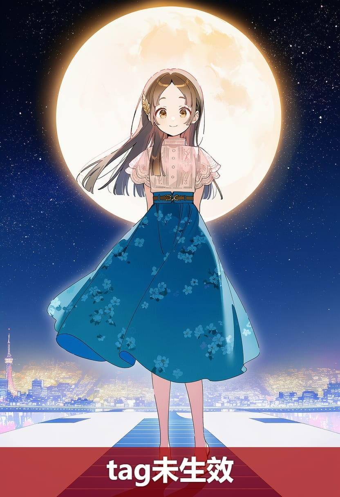

| 字段 | 内容 |
| --- | --- |
| 序号 | 0191 |
| tag | runway |
| tag中文名 | 机场跑道 |
| tag中文含义 | 场景包含或位于机场跑道。 |
| tag所属的子类（简单分类即可） | 城市/道路/户外设施 |
| 角色 | kuramoto_china |

## 191. rural — 场景包含或位于乡村环境。

| 字段 | 内容 |
| --- | --- |
| 序号 | 0192 |
| tag | rural |
| tag中文名 | 乡村环境 |
| tag中文含义 | 场景包含或位于乡村环境。 |
| tag所属的子类（简单分类即可） | 城市/道路/户外设施 |
| 角色 | juo_sena |

## 192. sidewalk — 场景包含或位于人行道。

| 字段 | 内容 |
| --- | --- |
| 序号 | 0193 |
| tag | sidewalk |
| tag中文名 | 人行道 |
| tag中文含义 | 场景包含或位于人行道。 |
| tag所属的子类（简单分类即可） | 城市/道路/户外设施 |
| 角色 | arimura_mao |

## 193. soccer_field — 场景包含或位于足球场。

| 字段 | 内容 |
| --- | --- |
| 序号 | 0194 |
| tag | soccer_field |
| tag中文名 | 足球场 |
| tag中文含义 | 场景包含或位于足球场。 |
| tag所属的子类（简单分类即可） | 城市/道路/户外设施 |
| 角色 | shiun_sumika |

## 194. stone_walkway — 场景包含或位于石板路。

| 字段 | 内容 |
| --- | --- |
| 序号 | 0195 |
| tag | stone_walkway |
| tag中文名 | 石板路 |
| tag中文含义 | 场景包含或位于石板路。 |
| tag所属的子类（简单分类即可） | 城市/道路/户外设施 |
| 角色 | kaya_rinha |

## 195. street — 场景包含或位于街道。

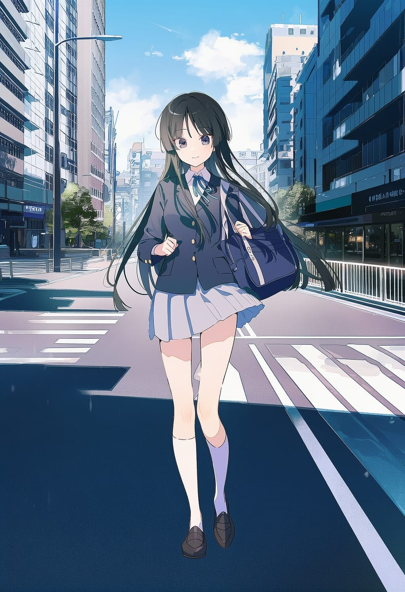

| 字段 | 内容 |
| --- | --- |
| 序号 | 0196 |
| tag | street |
| tag中文名 | 街道 |
| tag中文含义 | 场景包含或位于街道。 |
| tag所属的子类（简单分类即可） | 城市/道路/户外设施 |
| 角色 | akiyama_mio |

## 196. town — 场景包含或位于城镇。

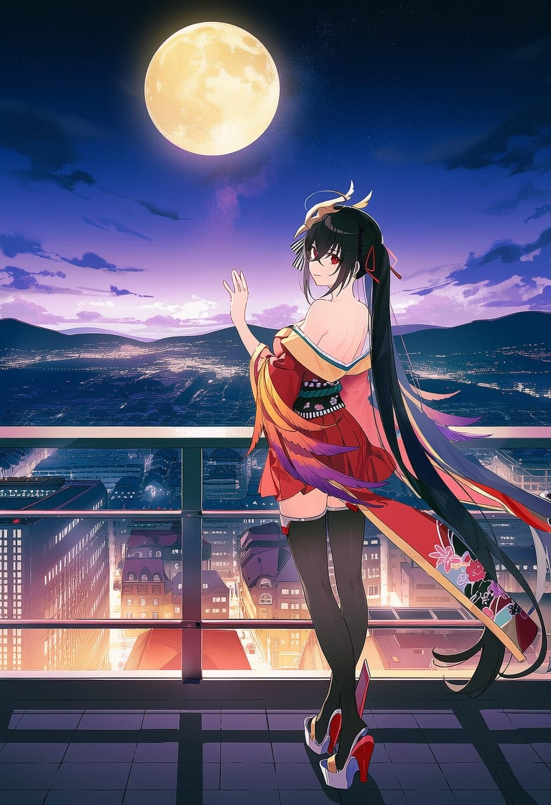

| 字段 | 内容 |
| --- | --- |
| 序号 | 0197 |
| tag | town |
| tag中文名 | 城镇 |
| tag中文含义 | 场景包含或位于城镇。 |
| tag所属的子类（简单分类即可） | 城市/道路/户外设施 |
| 角色 | taihou_(azur_lane) |

## 197. trench — 场景包含或位于壕沟。

| 字段 | 内容 |
| --- | --- |
| 序号 | 0198 |
| tag | trench |
| tag中文名 | 壕沟 |
| tag中文含义 | 场景包含或位于壕沟。 |
| tag所属的子类（简单分类即可） | 城市/道路/户外设施 |
| 角色 | rio_(blue_archive) |

## 198. tunnel — 场景包含或位于隧道。

| 字段 | 内容 |
| --- | --- |
| 序号 | 0199 |
| tag | tunnel |
| tag中文名 | 隧道 |
| tag中文含义 | 场景包含或位于隧道。 |
| tag所属的子类（简单分类即可） | 城市/道路/户外设施 |
| 角色 | miyu_(blue_archive) |

## 199. village — 场景包含或位于村庄。

| 字段 | 内容 |
| --- | --- |
| 序号 | 0200 |
| tag | village |
| tag中文名 | 村庄 |
| tag中文含义 | 场景包含或位于村庄。 |
| tag所属的子类（简单分类即可） | 城市/道路/户外设施 |
| 角色 | chitanda_eru |

## 200. waterpark — 场景包含或位于水上乐园。

| 字段 | 内容 |
| --- | --- |
| 序号 | 0201 |
| tag | waterpark |
| tag中文名 | 水上乐园 |
| tag中文含义 | 场景包含或位于水上乐园。 |
| tag所属的子类（简单分类即可） | 城市/道路/户外设施 |
| 角色 | tsukino_mito |

## 201. well — 场景包含或位于水井。

| 字段 | 内容 |
| --- | --- |
| 序号 | 0202 |
| tag | well |
| tag中文名 | 水井 |
| tag中文含义 | 场景包含或位于水井。 |
| tag所属的子类（简单分类即可） | 城市/道路/户外设施 |
| 角色 | kousaka_reina |

## 202. wheat_field — 场景包含或位于麦田。

| 字段 | 内容 |
| --- | --- |
| 序号 | 0203 |
| tag | wheat_field |
| tag中文名 | 麦田 |
| tag中文含义 | 场景包含或位于麦田。 |
| tag所属的子类（简单分类即可） | 城市/道路/户外设施 |
| 角色 | mari_(omori) |

## 203. wooden_bridge — 场景包含或位于木桥。

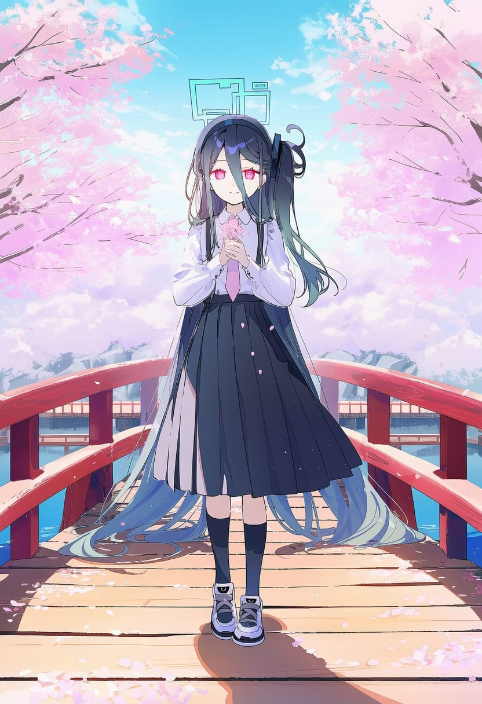

| 字段 | 内容 |
| --- | --- |
| 序号 | 0204 |
| tag | wooden_bridge |
| tag中文名 | 木桥 |
| tag中文含义 | 场景包含或位于木桥。 |
| tag所属的子类（简单分类即可） | 城市/道路/户外设施 |
| 角色 | kei_(blue_archive) |

## 204. airport — 以机场为主要场所。

| 字段 | 内容 |
| --- | --- |
| 序号 | 0206 |
| tag | airport |
| tag中文名 | 机场 |
| tag中文含义 | 以机场为主要场所。 |
| tag所属的子类（简单分类即可） | 建筑/商业/公共设施 |
| 角色 | komori_kiri |

## 205. apartment — 以公寓楼为主要场所。

| 字段 | 内容 |
| --- | --- |
| 序号 | 0207 |
| tag | apartment |
| tag中文名 | 公寓楼 |
| tag中文含义 | 以公寓楼为主要场所。 |
| tag所属的子类（简单分类即可） | 建筑/商业/公共设施 |
| 角色 | kitsu_chiri |

## 206. aquarium — 以水族馆为主要场所。

| 字段 | 内容 |
| --- | --- |
| 序号 | 0208 |
| tag | aquarium |
| tag中文名 | 水族馆 |
| tag中文含义 | 以水族馆为主要场所。 |
| tag所属的子类（简单分类即可） | 建筑/商业/公共设施 |
| 角色 | naihe_(female)_(touqi_guaitan) |

## 207. arcade — 以游戏厅为主要场所。

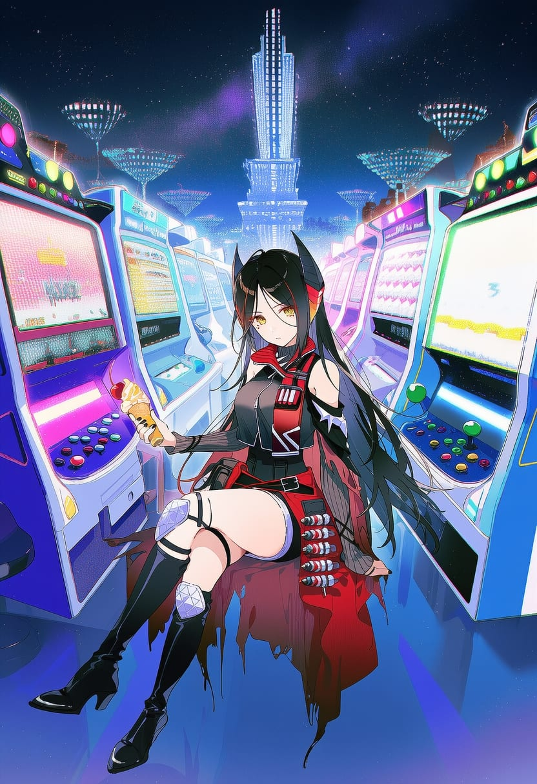

| 字段 | 内容 |
| --- | --- |
| 序号 | 0209 |
| tag | arcade |
| tag中文名 | 游戏厅 |
| tag中文含义 | 以游戏厅为主要场所。 |
| tag所属的子类（简单分类即可） | 建筑/商业/公共设施 |
| 角色 | ines_(arknights) |

## 208. arena — 以竞技场为主要场所。

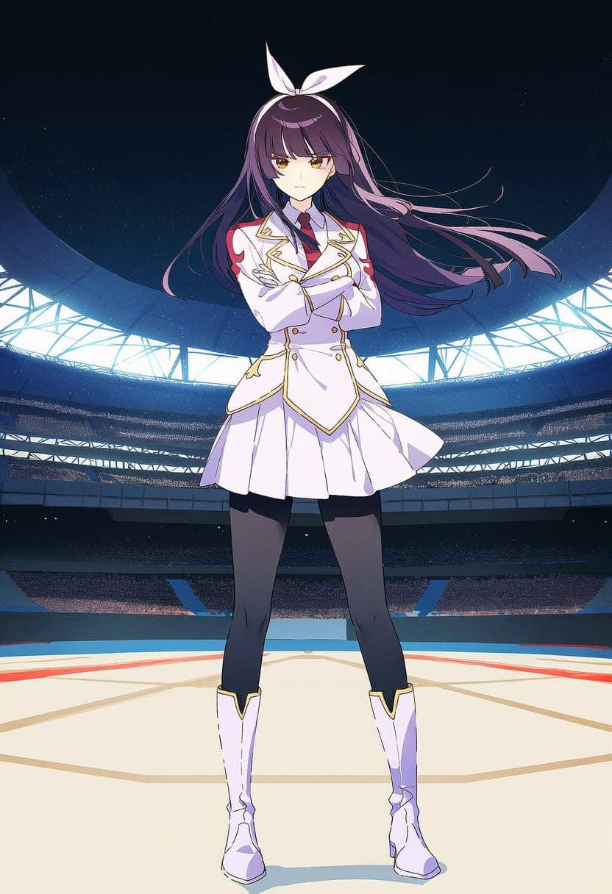

| 字段 | 内容 |
| --- | --- |
| 序号 | 0210 |
| tag | arena |
| tag中文名 | 竞技场 |
| tag中文含义 | 以竞技场为主要场所。 |
| tag所属的子类（简单分类即可） | 建筑/商业/公共设施 |
| 角色 | kagura_mikazuchi |

## 209. ashiyu — 以足汤设施为主要场所。

| 字段 | 内容 |
| --- | --- |
| 序号 | 0211 |
| tag | ashiyu |
| tag中文名 | 足汤设施 |
| tag中文含义 | 以足汤设施为主要场所。 |
| tag所属的子类（简单分类即可） | 建筑/商业/公共设施 |
| 角色 | shirokane_rinko |

## 210. bakery — 以面包店为主要场所。

| 字段 | 内容 |
| --- | --- |
| 序号 | 0212 |
| tag | bakery |
| tag中文名 | 面包店 |
| tag中文含义 | 以面包店为主要场所。 |
| tag所属的子类（简单分类即可） | 建筑/商业/公共设施 |
| 角色 | yashio_rui |

## 211. bar_(place) — 以酒吧场所为主要场所。

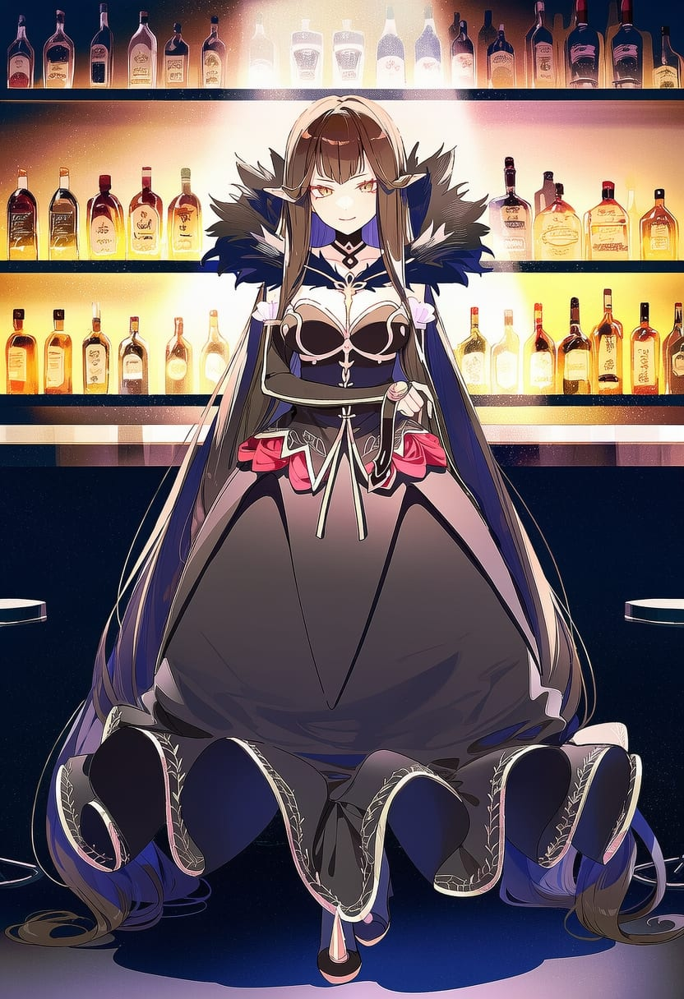

| 字段 | 内容 |
| --- | --- |
| 序号 | 0213 |
| tag | bar_(place) |
| tag中文名 | 酒吧场所 |
| tag中文含义 | 以酒吧场所为主要场所。 |
| tag所属的子类（简单分类即可） | 建筑/商业/公共设施 |
| 角色 | semiramis_(fate) |

## 212. barn — 以谷仓为主要场所。

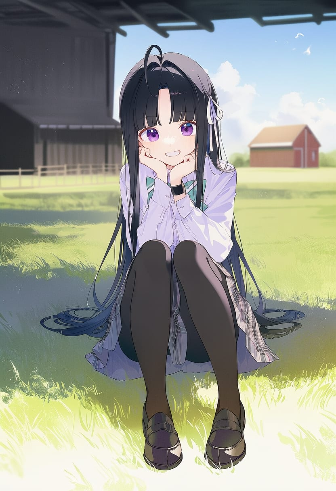

| 字段 | 内容 |
| --- | --- |
| 序号 | 0214 |
| tag | barn |
| tag中文名 | 谷仓 |
| tag中文含义 | 以谷仓为主要场所。 |
| tag所属的子类（简单分类即可） | 建筑/商业/公共设施 |
| 角色 | awa_subaru |

## 213. baseball_stadium — 以棒球场为主要场所。

| 字段 | 内容 |
| --- | --- |
| 序号 | 0215 |
| tag | baseball_stadium |
| tag中文名 | 棒球场 |
| tag中文含义 | 以棒球场为主要场所。 |
| tag所属的子类（简单分类即可） | 建筑/商业/公共设施 |
| 角色 | himejima_akeno |

## 214. bell_tower — 以钟楼（钟塔）为主要场所。

| 字段 | 内容 |
| --- | --- |
| 序号 | 0216 |
| tag | bell_tower |
| tag中文名 | 钟楼（钟塔） |
| tag中文含义 | 以钟楼（钟塔）为主要场所。 |
| tag所属的子类（简单分类即可） | 建筑/商业/公共设施 |
| 角色 | yamagishi_yukako |

## 215. bookstore — 以书店为主要场所。

| 字段 | 内容 |
| --- | --- |
| 序号 | 0217 |
| tag | bookstore |
| tag中文名 | 书店 |
| tag中文含义 | 以书店为主要场所。 |
| tag所属的子类（简单分类即可） | 建筑/商业/公共设施 |
| 角色 | hazuki_ren |

## 216. bus_stop — 以公交站为主要场所。

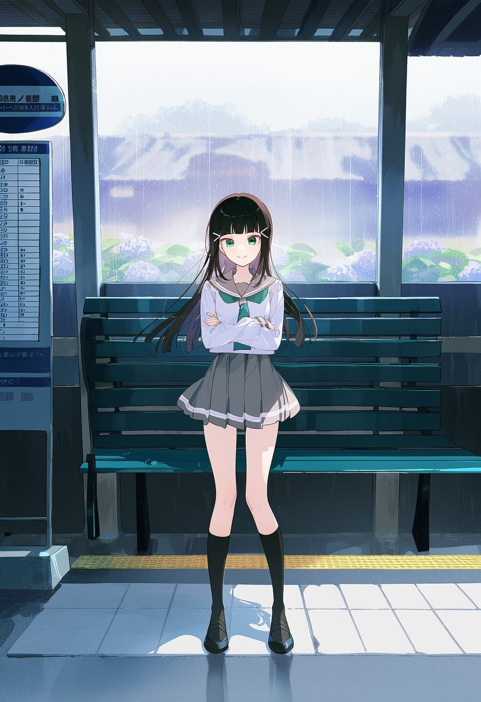

| 字段 | 内容 |
| --- | --- |
| 序号 | 0218 |
| tag | bus_stop |
| tag中文名 | 公交站 |
| tag中文含义 | 以公交站为主要场所。 |
| tag所属的子类（简单分类即可） | 建筑/商业/公共设施 |
| 角色 | kurosawa_dia |

## 217. cafe — 以咖啡馆为主要场所。

| 字段 | 内容 |
| --- | --- |
| 序号 | 0219 |
| tag | cafe |
| tag中文名 | 咖啡馆 |
| tag中文含义 | 以咖啡馆为主要场所。 |
| tag所属的子类（简单分类即可） | 建筑/商业/公共设施 |
| 角色 | sonoda_umi |

## 218. casino — 以赌场为主要场所。

| 字段 | 内容 |
| --- | --- |
| 序号 | 0220 |
| tag | casino |
| tag中文名 | 赌场 |
| tag中文含义 | 以赌场为主要场所。 |
| tag所属的子类（简单分类即可） | 建筑/商业/公共设施 |
| 角色 | shizuka_rin |

## 219. clock_tower — 以钟表塔为主要场所。

| 字段 | 内容 |
| --- | --- |
| 序号 | 0221 |
| tag | clock_tower |
| tag中文名 | 钟表塔 |
| tag中文含义 | 以钟表塔为主要场所。 |
| tag所属的子类（简单分类即可） | 建筑/商业/公共设施 |
| 角色 | suzuhara_lulu |

## 220. clothes_shop — 以服装店为主要场所。

| 字段 | 内容 |
| --- | --- |
| 序号 | 0222 |
| tag | clothes_shop |
| tag中文名 | 服装店 |
| tag中文含义 | 以服装店为主要场所。 |
| tag所属的子类（简单分类即可） | 建筑/商业/公共设施 |
| 角色 | boa_hancock |

## 221. construction_site — 以施工现场为主要场所。

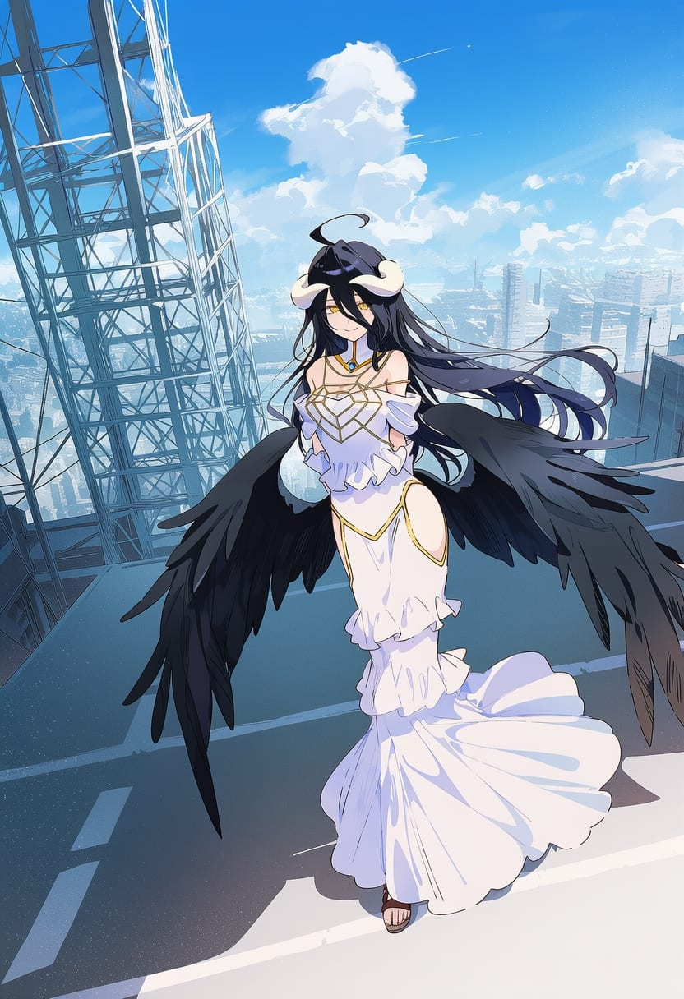

| 字段 | 内容 |
| --- | --- |
| 序号 | 0223 |
| tag | construction_site |
| tag中文名 | 施工现场 |
| tag中文含义 | 以施工现场为主要场所。 |
| tag所属的子类（简单分类即可） | 建筑/商业/公共设施 |
| 角色 | albedo_(overlord) |

## 222. convenience_store — 以便利店为主要场所。

| 字段 | 内容 |
| --- | --- |
| 序号 | 0224 |
| tag | convenience_store |
| tag中文名 | 便利店 |
| tag中文含义 | 以便利店为主要场所。 |
| tag所属的子类（简单分类即可） | 建筑/商业/公共设施 |
| 角色 | elsa_granhiert |

## 223. convention — 以会展/展会场地为主要场所。

| 字段 | 内容 |
| --- | --- |
| 序号 | 0225 |
| tag | convention |
| tag中文名 | 会展/展会场地 |
| tag中文含义 | 以会展/展会场地为主要场所。 |
| tag所属的子类（简单分类即可） | 建筑/商业/公共设施 |
| 角色 | katsura_kotonoha |

## 224. dance_studio — 以舞蹈室为主要场所。

| 字段 | 内容 |
| --- | --- |
| 序号 | 0226 |
| tag | dance_studio |
| tag中文名 | 舞蹈室 |
| tag中文含义 | 以舞蹈室为主要场所。 |
| tag所属的子类（简单分类即可） | 建筑/商业/公共设施 |
| 角色 | kotegawa_yui |

## 225. factory — 以工厂为主要场所。

| 字段 | 内容 |
| --- | --- |
| 序号 | 0227 |
| tag | factory |
| tag中文名 | 工厂 |
| tag中文含义 | 以工厂为主要场所。 |
| tag所属的子类（简单分类即可） | 建筑/商业/公共设施 |
| 角色 | shiori_novella |

## 226. flower_shop — 以花店为主要场所。

| 字段 | 内容 |
| --- | --- |
| 序号 | 0228 |
| tag | flower_shop |
| tag中文名 | 花店 |
| tag中文含义 | 以花店为主要场所。 |
| tag所属的子类（简单分类即可） | 建筑/商业/公共设施 |
| 角色 | ichihara_yuuko |

## 227. garage — 以车库为主要场所。

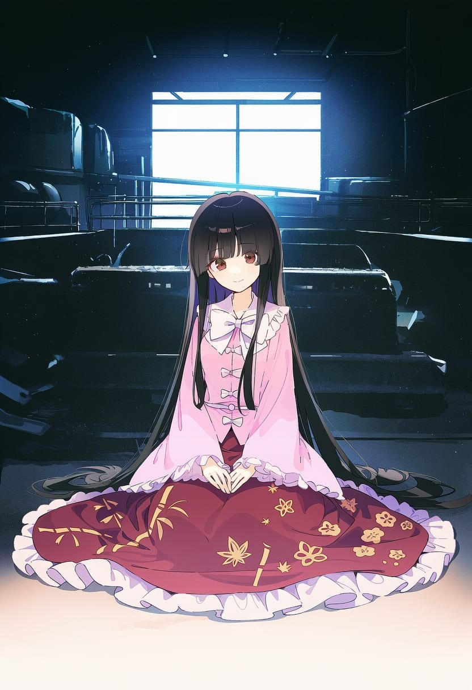

| 字段 | 内容 |
| --- | --- |
| 序号 | 0229 |
| tag | garage |
| tag中文名 | 车库 |
| tag中文含义 | 以车库为主要场所。 |
| tag所属的子类（简单分类即可） | 建筑/商业/公共设施 |
| 角色 | houraisan_kaguya |

## 228. gas_station — 以加油站为主要场所。

| 字段 | 内容 |
| --- | --- |
| 序号 | 0230 |
| tag | gas_station |
| tag中文名 | 加油站 |
| tag中文含义 | 以加油站为主要场所。 |
| tag所属的子类（简单分类即可） | 建筑/商业/公共设施 |
| 角色 | sagisawa_fumika |

## 229. gazebo — 以凉亭为主要场所。

| 字段 | 内容 |
| --- | --- |
| 序号 | 0231 |
| tag | gazebo |
| tag中文名 | 凉亭 |
| tag中文含义 | 以凉亭为主要场所。 |
| tag所属的子类（简单分类即可） | 建筑/商业/公共设施 |
| 角色 | shibuya_rin |

## 230. greenhouse — 以温室为主要场所。

| 字段 | 内容 |
| --- | --- |
| 序号 | 0232 |
| tag | greenhouse |
| tag中文名 | 温室 |
| tag中文含义 | 以温室为主要场所。 |
| tag所属的子类（简单分类即可） | 建筑/商业/公共设施 |
| 角色 | shiraishi_tsumugi |

## 231. hangar — 以机库为主要场所。

| 字段 | 内容 |
| --- | --- |
| 序号 | 0233 |
| tag | hangar |
| tag中文名 | 机库 |
| tag中文含义 | 以机库为主要场所。 |
| tag所属的子类（简单分类即可） | 建筑/商业/公共设施 |
| 角色 | rei_(princess_connect!) |

## 232. hospital — 以医院为主要场所。

| 字段 | 内容 |
| --- | --- |
| 序号 | 0234 |
| tag | hospital |
| tag中文名 | 医院 |
| tag中文含义 | 以医院为主要场所。 |
| tag所属的子类（简单分类即可） | 建筑/商业/公共设施 |
| 角色 | kuroyukihime |

## 233. hotel — 以酒店为主要场所。

| 字段 | 内容 |
| --- | --- |
| 序号 | 0235 |
| tag | hotel |
| tag中文名 | 酒店 |
| tag中文含义 | 以酒店为主要场所。 |
| tag所属的子类（简单分类即可） | 建筑/商业/公共设施 |
| 角色 | enma_ai |

## 234. house — 以住宅为主要场所。

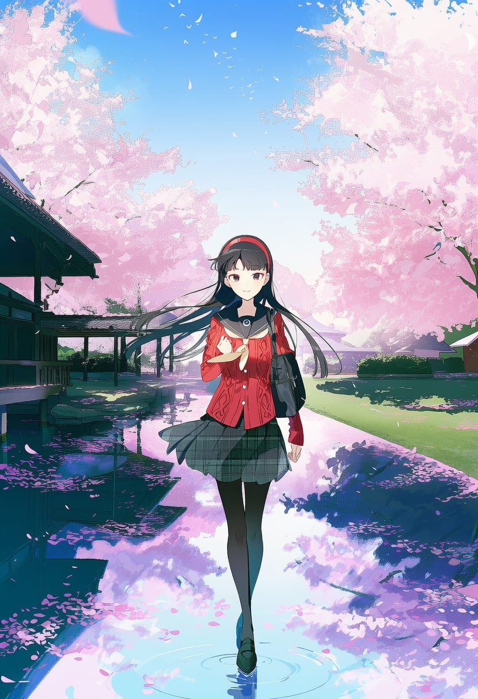

| 字段 | 内容 |
| --- | --- |
| 序号 | 0236 |
| tag | house |
| tag中文名 | 住宅 |
| tag中文含义 | 以住宅为主要场所。 |
| tag所属的子类（简单分类即可） | 建筑/商业/公共设施 |
| 角色 | amagi_yukiko |

## 235. hut — 以小屋为主要场所。

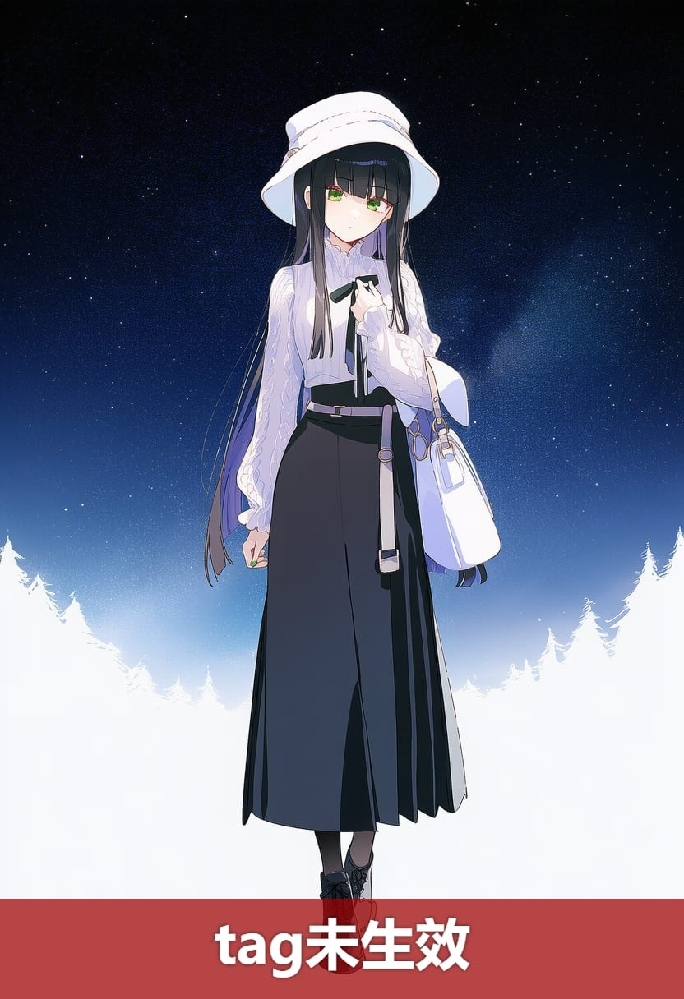

| 字段 | 内容 |
| --- | --- |
| 序号 | 0237 |
| tag | hut |
| tag中文名 | 小屋 |
| tag中文含义 | 以小屋为主要场所。 |
| tag所属的子类（简单分类即可） | 建筑/商业/公共设施 |
| 角色 | togo_hifumi |

## 236. industrial — 以工业设施/工业场景为主要场所。

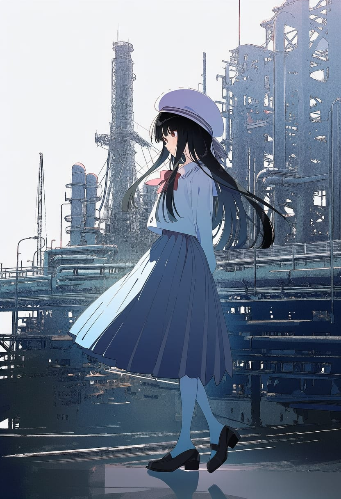

| 字段 | 内容 |
| --- | --- |
| 序号 | 0238 |
| tag | industrial |
| tag中文名 | 工业设施/工业场景 |
| tag中文含义 | 以工业设施/工业场景为主要场所。 |
| tag所属的子类（简单分类即可） | 建筑/商业/公共设施 |
| 角色 | kuronuma_sawako |

## 237. izakaya — 以居酒屋为主要场所。

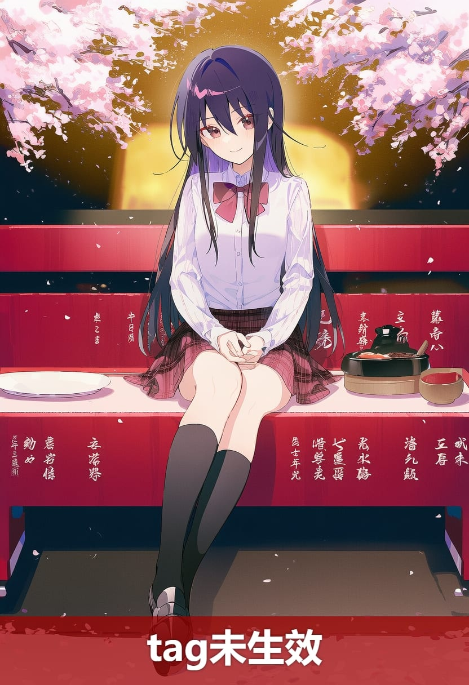

| 字段 | 内容 |
| --- | --- |
| 序号 | 0239 |
| tag | izakaya |
| tag中文名 | 居酒屋 |
| tag中文含义 | 以居酒屋为主要场所。 |
| tag所属的子类（简单分类即可） | 建筑/商业/公共设施 |
| 角色 | amakusa_shino |

## 238. lighthouse — 以灯塔为主要场所。

| 字段 | 内容 |
| --- | --- |
| 序号 | 0240 |
| tag | lighthouse |
| tag中文名 | 灯塔 |
| tag中文含义 | 以灯塔为主要场所。 |
| tag所属的子类（简单分类即可） | 建筑/商业/公共设施 |
| 角色 | geeta_(pokemon) |

## 239. love_hotel — 以情趣酒店为主要场所。

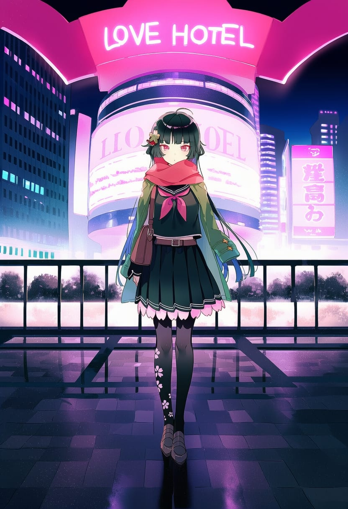

| 字段 | 内容 |
| --- | --- |
| 序号 | 0241 |
| tag | love_hotel |
| tag中文名 | 情趣酒店 |
| tag中文含义 | 以情趣酒店为主要场所。 |
| tag所属的子类（简单分类即可） | 建筑/商业/公共设施 |
| 角色 | type_100_(girls'_frontline) |

## 240. maid_cafe — 以女仆咖啡馆为主要场所。

| 字段 | 内容 |
| --- | --- |
| 序号 | 0242 |
| tag | maid_cafe |
| tag中文名 | 女仆咖啡馆 |
| tag中文含义 | 以女仆咖啡馆为主要场所。 |
| tag所属的子类（简单分类即可） | 建筑/商业/公共设施 |
| 角色 | type_95_(girls'_frontline) |

## 241. mall — 以购物中心为主要场所。

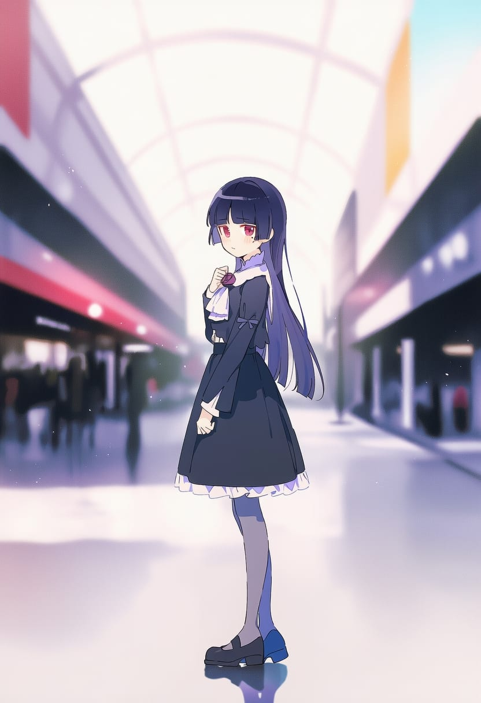

| 字段 | 内容 |
| --- | --- |
| 序号 | 0243 |
| tag | mall |
| tag中文名 | 购物中心 |
| tag中文含义 | 以购物中心为主要场所。 |
| tag所属的子类（简单分类即可） | 建筑/商业/公共设施 |
| 角色 | gokou_ruri |

## 242. megastructure — 以巨型建筑为主要场所。

| 字段 | 内容 |
| --- | --- |
| 序号 | 0244 |
| tag | megastructure |
| tag中文名 | 巨型建筑 |
| tag中文含义 | 以巨型建筑为主要场所。 |
| tag所属的子类（简单分类即可） | 建筑/商业/公共设施 |
| 角色 | yukinoshita_yukino |

## 243. movie_theater — 以电影院为主要场所。

| 字段 | 内容 |
| --- | --- |
| 序号 | 0245 |
| tag | movie_theater |
| tag中文名 | 电影院 |
| tag中文含义 | 以电影院为主要场所。 |
| tag所属的子类（简单分类即可） | 建筑/商业/公共设施 |
| 角色 | aizawa_azusa |

## 244. museum — 以博物馆为主要场所。

| 字段 | 内容 |
| --- | --- |
| 序号 | 0246 |
| tag | museum |
| tag中文名 | 博物馆 |
| tag中文含义 | 以博物馆为主要场所。 |
| tag所属的子类（简单分类即可） | 建筑/商业/公共设施 |
| 角色 | kagura_chizuru |

## 245. nightclub — 以夜总会为主要场所。

| 字段 | 内容 |
| --- | --- |
| 序号 | 0247 |
| tag | nightclub |
| tag中文名 | 夜总会 |
| tag中文含义 | 以夜总会为主要场所。 |
| tag所属的子类（简单分类即可） | 建筑/商业/公共设施 |
| 角色 | akame_(akame_ga_kill!) |

## 246. on_roof — 以在屋顶上为主要场所。

| 字段 | 内容 |
| --- | --- |
| 序号 | 0248 |
| tag | on_roof |
| tag中文名 | 在屋顶上 |
| tag中文含义 | 以在屋顶上为主要场所。 |
| tag所属的子类（简单分类即可） | 建筑/商业/公共设施 |
| 角色 | kiryuuin_satsuki |

## 247. onsen — 以温泉设施为主要场所。

| 字段 | 内容 |
| --- | --- |
| 序号 | 0249 |
| tag | onsen |
| tag中文名 | 温泉设施 |
| tag中文含义 | 以温泉设施为主要场所。 |
| tag所属的子类（简单分类即可） | 建筑/商业/公共设施 |
| 角色 | sonohara_anri |

## 248. prison — 以监狱为主要场所。

| 字段 | 内容 |
| --- | --- |
| 序号 | 0250 |
| tag | prison |
| tag中文名 | 监狱 |
| tag中文含义 | 以监狱为主要场所。 |
| tag所属的子类（简单分类即可） | 建筑/商业/公共设施 |
| 角色 | minakami_mai |

## 249. restaurant — 以餐馆为主要场所。

| 字段 | 内容 |
| --- | --- |
| 序号 | 0251 |
| tag | restaurant |
| tag中文名 | 餐馆 |
| tag中文含义 | 以餐馆为主要场所。 |
| tag所属的子类（简单分类即可） | 建筑/商业/公共设施 |
| 角色 | tifa_lockhart |

## 250. rooftop — 以屋顶/天台为主要场所。

| 字段 | 内容 |
| --- | --- |
| 序号 | 0252 |
| tag | rooftop |
| tag中文名 | 屋顶/天台 |
| tag中文含义 | 以屋顶/天台为主要场所。 |
| tag所属的子类（简单分类即可） | 建筑/商业/公共设施 |
| 角色 | rinoa_heartilly |

## 251. school — 以学校为主要场所。

| 字段 | 内容 |
| --- | --- |
| 序号 | 0253 |
| tag | school |
| tag中文名 | 学校 |
| tag中文含义 | 以学校为主要场所。 |
| tag所属的子类（简单分类即可） | 建筑/商业/公共设施 |
| 角色 | tohno_akiha |

## 252. school_gateway — 以学校大门为主要场所。

| 字段 | 内容 |
| --- | --- |
| 序号 | 0254 |
| tag | school_gateway |
| tag中文名 | 学校大门 |
| tag中文含义 | 以学校大门为主要场所。 |
| tag所属的子类（简单分类即可） | 建筑/商业/公共设施 |
| 角色 | ayra_(fire_emblem) |

## 253. sewer — 以下水道为主要场所。

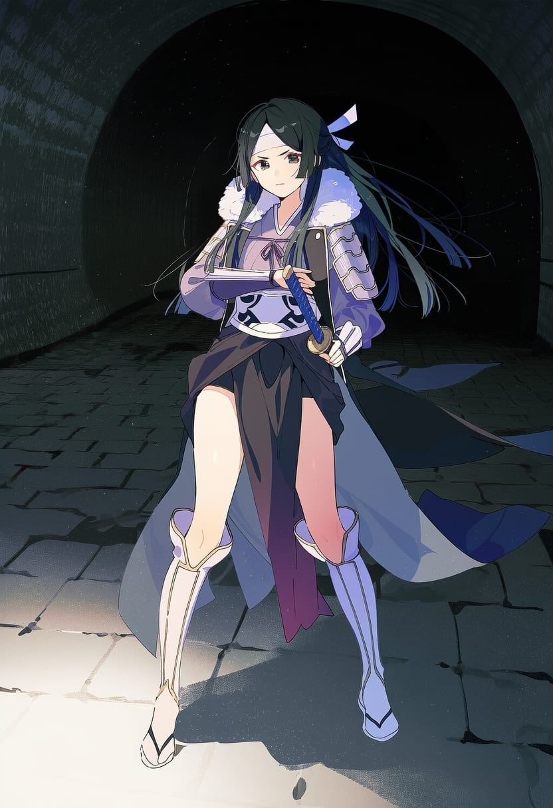

| 字段 | 内容 |
| --- | --- |
| 序号 | 0255 |
| tag | sewer |
| tag中文名 | 下水道 |
| tag中文含义 | 以下水道为主要场所。 |
| tag所属的子类（简单分类即可） | 建筑/商业/公共设施 |
| 角色 | say'ri_(fire_emblem) |

## 254. shed — 以棚屋为主要场所。

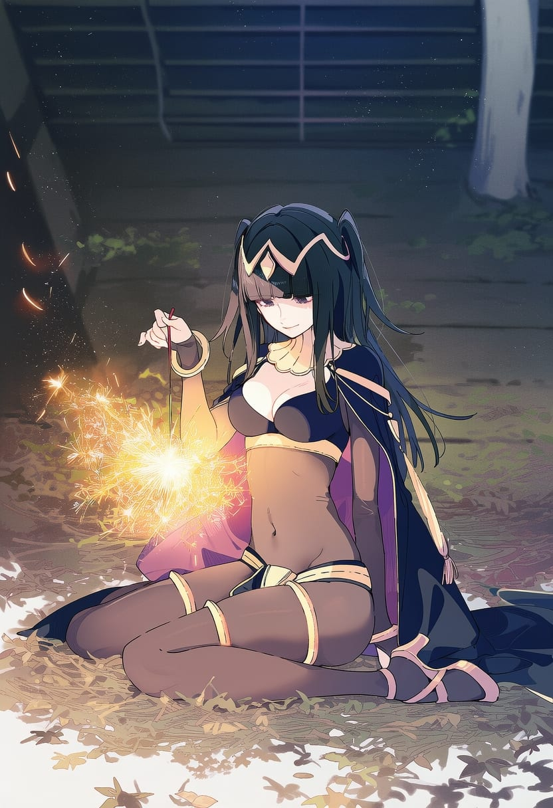

| 字段 | 内容 |
| --- | --- |
| 序号 | 0256 |
| tag | shed |
| tag中文名 | 棚屋 |
| tag中文含义 | 以棚屋为主要场所。 |
| tag所属的子类（简单分类即可） | 建筑/商业/公共设施 |
| 角色 | tharja_(fire_emblem) |

## 255. shop — 以商店为主要场所。

| 字段 | 内容 |
| --- | --- |
| 序号 | 0257 |
| tag | shop |
| tag中文名 | 商店 |
| tag中文含义 | 以商店为主要场所。 |
| tag所属的子类（简单分类即可） | 建筑/商业/公共设施 |
| 角色 | sakaki_yumiko |

## 256. skating_rink — 以滑冰场为主要场所。

| 字段 | 内容 |
| --- | --- |
| 序号 | 0258 |
| tag | skating_rink |
| tag中文名 | 滑冰场 |
| tag中文含义 | 以滑冰场为主要场所。 |
| tag所属的子类（简单分类即可） | 建筑/商业/公共设施 |
| 角色 | higurashi_kagome |

## 257. skyscraper — 以摩天大楼为主要场所。

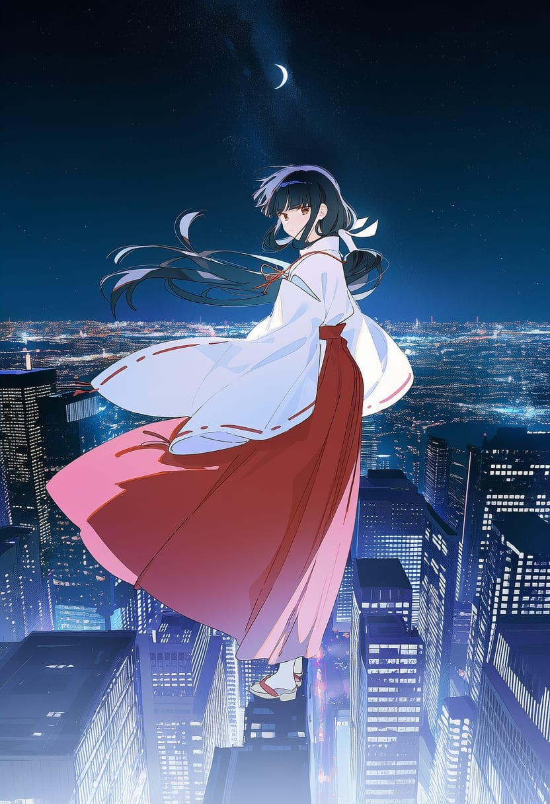

| 字段 | 内容 |
| --- | --- |
| 序号 | 0259 |
| tag | skyscraper |
| tag中文名 | 摩天大楼 |
| tag中文含义 | 以摩天大楼为主要场所。 |
| tag所属的子类（简单分类即可） | 建筑/商业/公共设施 |
| 角色 | kikyou_(inuyasha) |

## 258. stable — 以马厩为主要场所。

| 字段 | 内容 |
| --- | --- |
| 序号 | 0261 |
| tag | stable |
| tag中文名 | 马厩 |
| tag中文含义 | 以马厩为主要场所。 |
| tag所属的子类（简单分类即可） | 建筑/商业/公共设施 |
| 角色 | asagiri_shiori |

## 259. stadium — 以体育场为主要场所。

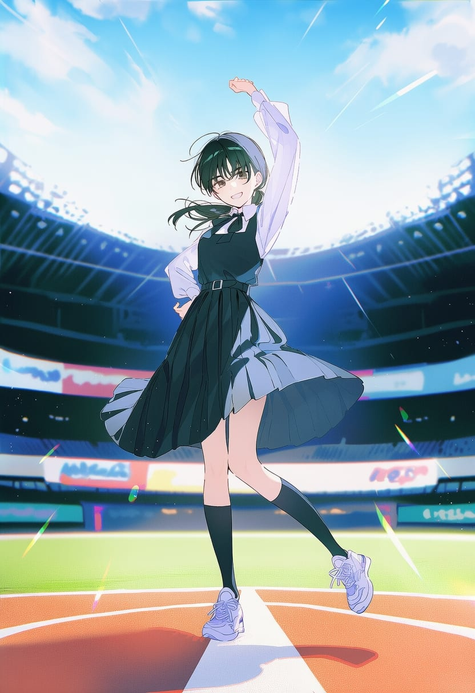

| 字段 | 内容 |
| --- | --- |
| 序号 | 0262 |
| tag | stadium |
| tag中文名 | 体育场 |
| tag中文含义 | 以体育场为主要场所。 |
| tag所属的子类（简单分类即可） | 建筑/商业/公共设施 |
| 角色 | mitaka_asa |

## 260. subway — 以地铁系统/地铁场景为主要场所。

| 字段 | 内容 |
| --- | --- |
| 序号 | 0263 |
| tag | subway |
| tag中文名 | 地铁系统/地铁场景 |
| tag中文含义 | 以地铁系统/地铁场景为主要场所。 |
| tag所属的子类（简单分类即可） | 建筑/商业/公共设施 |
| 角色 | touma_kazusa |

## 261. subway_station — 以地铁站为主要场所。

| 字段 | 内容 |
| --- | --- |
| 序号 | 0264 |
| tag | subway_station |
| tag中文名 | 地铁站 |
| tag中文含义 | 以地铁站为主要场所。 |
| tag所属的子类（简单分类即可） | 建筑/商业/公共设施 |
| 角色 | azuma_(azur_lane) |

## 262. supermarket — 以超市为主要场所。

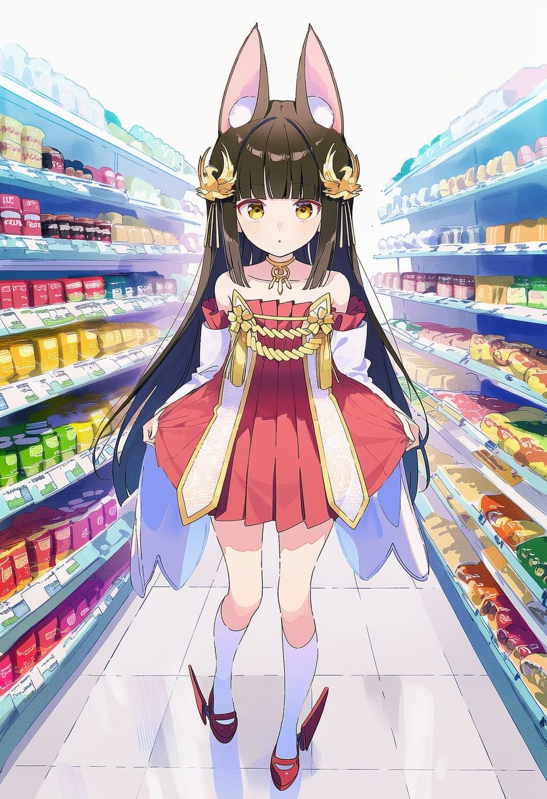

| 字段 | 内容 |
| --- | --- |
| 序号 | 0265 |
| tag | supermarket |
| tag中文名 | 超市 |
| tag中文含义 | 以超市为主要场所。 |
| tag所属的子类（简单分类即可） | 建筑/商业/公共设施 |
| 角色 | nagato_(azur_lane) |

## 263. tavern — 以酒馆为主要场所。

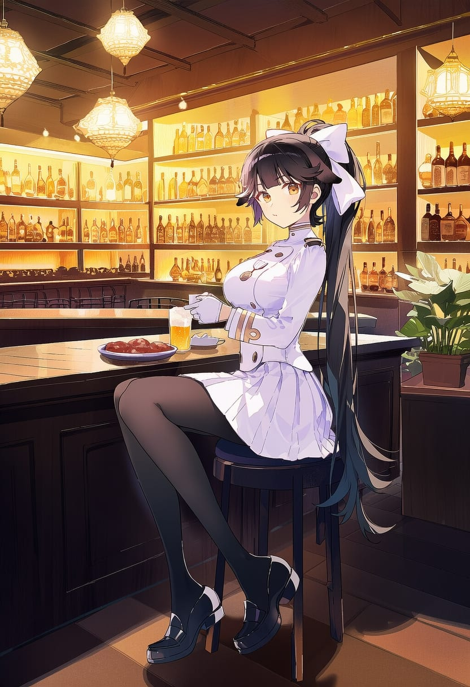

| 字段 | 内容 |
| --- | --- |
| 序号 | 0266 |
| tag | tavern |
| tag中文名 | 酒馆 |
| tag中文含义 | 以酒馆为主要场所。 |
| tag所属的子类（简单分类即可） | 建筑/商业/公共设施 |
| 角色 | takao_(azur_lane) |

## 264. theater — 以剧院为主要场所。

| 字段 | 内容 |
| --- | --- |
| 序号 | 0267 |
| tag | theater |
| tag中文名 | 剧院 |
| tag中文含义 | 以剧院为主要场所。 |
| tag所属的子类（简单分类即可） | 建筑/商业/公共设施 |
| 角色 | asagami_fujino |

## 265. tower — 以塔楼为主要场所。

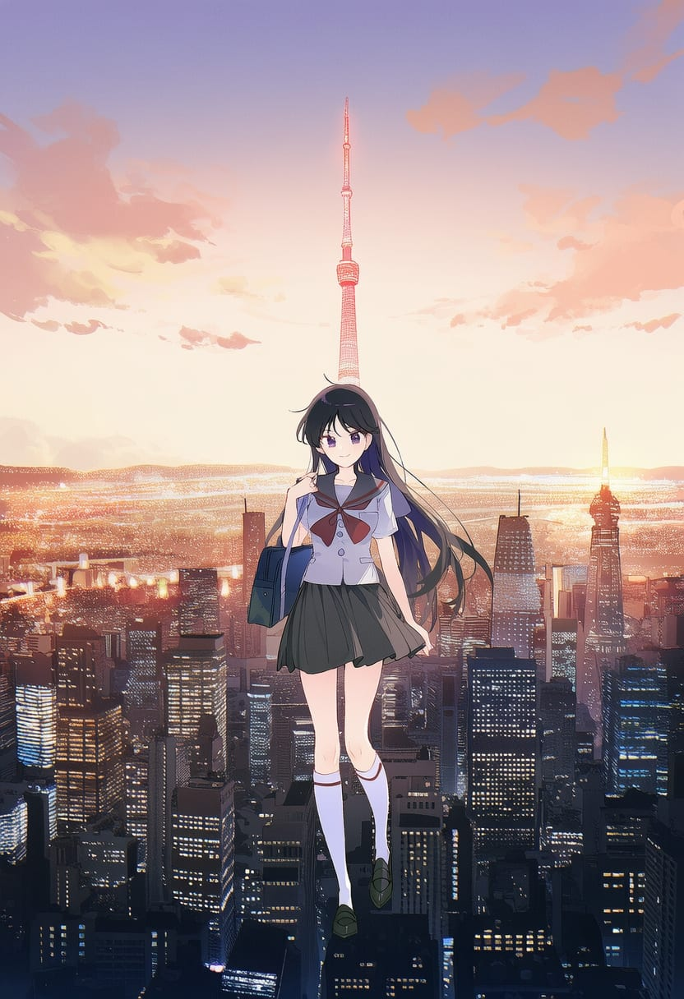

| 字段 | 内容 |
| --- | --- |
| 序号 | 0268 |
| tag | tower |
| tag中文名 | 塔楼 |
| tag中文含义 | 以塔楼为主要场所。 |
| tag所属的子类（简单分类即可） | 建筑/商业/公共设施 |
| 角色 | hino_rei |

## 266. train_station — 以火车站为主要场所。

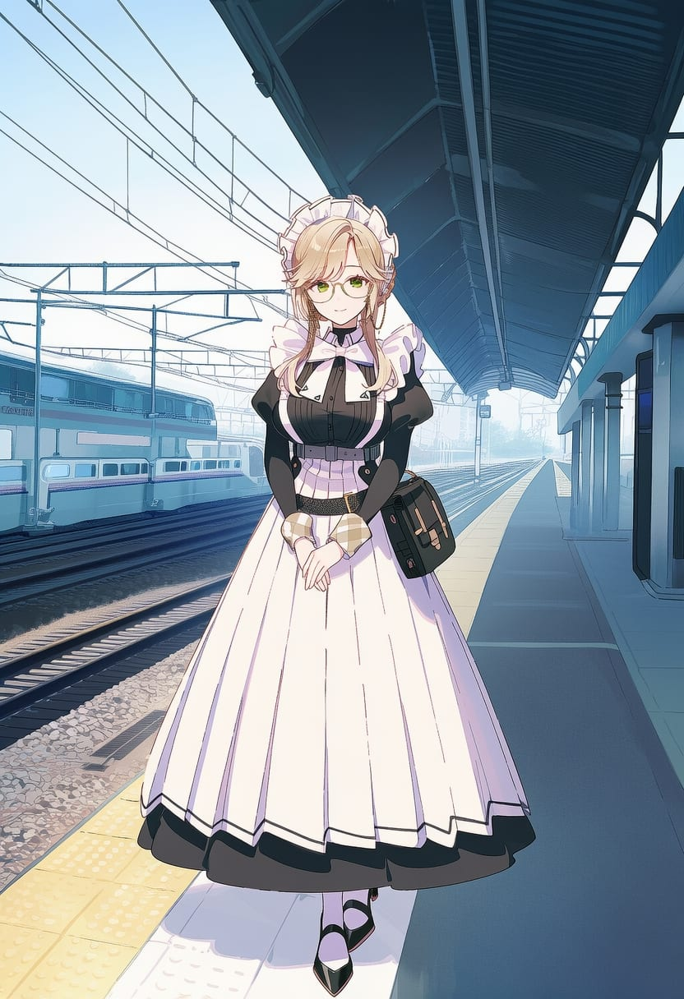

| 字段 | 内容 |
| --- | --- |
| 序号 | 0269 |
| tag | train_station |
| tag中文名 | 火车站 |
| tag中文含义 | 以火车站为主要场所。 |
| tag所属的子类（简单分类即可） | 建筑/商业/公共设施 |
| 角色 | ade_(nikke) |

## 267. train_station_platform — 以火车站站台为主要场所。

| 字段 | 内容 |
| --- | --- |
| 序号 | 0270 |
| tag | train_station_platform |
| tag中文名 | 火车站站台 |
| tag中文含义 | 以火车站站台为主要场所。 |
| tag所属的子类（简单分类即可） | 建筑/商业/公共设施 |
| 角色 | maiden_(nikke) |

## 268. treehouse — 以树屋为主要场所。

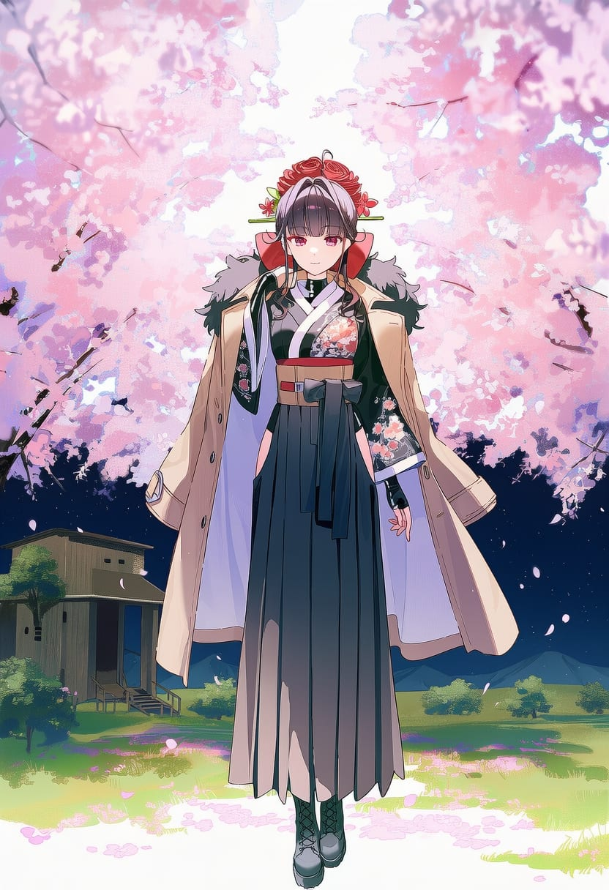

| 字段 | 内容 |
| --- | --- |
| 序号 | 0271 |
| tag | treehouse |
| tag中文名 | 树屋 |
| tag中文含义 | 以树屋为主要场所。 |
| tag所属的子类（简单分类即可） | 建筑/商业/公共设施 |
| 角色 | sakura_(nikke) |

## 269. warehouse — 以仓库为主要场所。

| 字段 | 内容 |
| --- | --- |
| 序号 | 0272 |
| tag | warehouse |
| tag中文名 | 仓库 |
| tag中文含义 | 以仓库为主要场所。 |
| tag所属的子类（简单分类即可） | 建筑/商业/公共设施 |
| 角色 | inoue_takina |

## 270. windmill — 以风车建筑为主要场所。

| 字段 | 内容 |
| --- | --- |
| 序号 | 0273 |
| tag | windmill |
| tag中文名 | 风车建筑 |
| tag中文含义 | 以风车建筑为主要场所。 |
| tag所属的子类（简单分类即可） | 建筑/商业/公共设施 |
| 角色 | eishin_flash_(umamusume) |

## 271. architecture — 以建筑景观为主要景观。

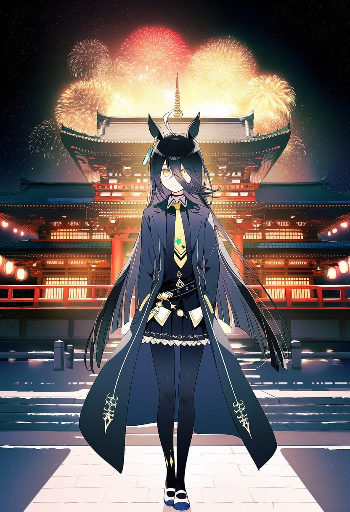

| 字段 | 内容 |
| --- | --- |
| 序号 | 0274 |
| tag | architecture |
| tag中文名 | 建筑景观 |
| tag中文含义 | 以建筑景观为主要景观。 |
| tag所属的子类（简单分类即可） | 宗教/历史/特殊景观 |
| 角色 | manhattan_cafe_(umamusume) |

## 272. battlefield — 以战场为主要景观。

| 字段 | 内容 |
| --- | --- |
| 序号 | 0275 |
| tag | battlefield |
| tag中文名 | 战场 |
| tag中文含义 | 以战场为主要景观。 |
| tag所属的子类（简单分类即可） | 宗教/历史/特殊景观 |
| 角色 | satono_diamond_(umamusume) |

## 273. castle — 以城堡为主要景观。

| 字段 | 内容 |
| --- | --- |
| 序号 | 0276 |
| tag | castle |
| tag中文名 | 城堡 |
| tag中文含义 | 以城堡为主要景观。 |
| tag所属的子类（简单分类即可） | 宗教/历史/特殊景观 |
| 角色 | kasumigaoka_utaha |

## 274. cathedral — 以大教堂为主要景观。

| 字段 | 内容 |
| --- | --- |
| 序号 | 0277 |
| tag | cathedral |
| tag中文名 | 大教堂 |
| tag中文含义 | 以大教堂为主要景观。 |
| tag所属的子类（简单分类即可） | 宗教/历史/特殊景观 |
| 角色 | shinomiya_kaguya |

## 275. church — 以教堂为主要景观。

| 字段 | 内容 |
| --- | --- |
| 序号 | 0278 |
| tag | church |
| tag中文名 | 教堂 |
| tag中文含义 | 以教堂为主要景观。 |
| tag所属的子类（简单分类即可） | 宗教/历史/特殊景观 |
| 角色 | jun_kazama |

## 276. cityscape — 以城市风景为主要景观。

| 字段 | 内容 |
| --- | --- |
| 序号 | 0279 |
| tag | cityscape |
| tag中文名 | 城市风景 |
| tag中文含义 | 以城市风景为主要景观。 |
| tag所属的子类（简单分类即可） | 宗教/历史/特殊景观 |
| 角色 | ikaruga_(senran_kagura) |

## 277. landscape — 以风景/地景为主要景观。

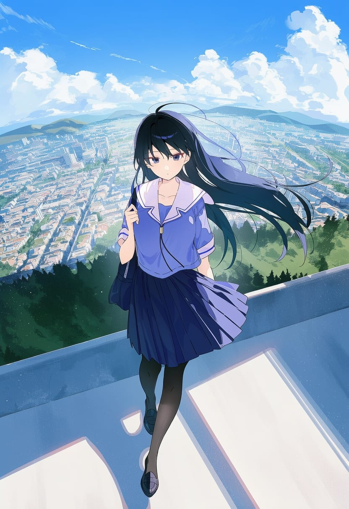

| 字段 | 内容 |
| --- | --- |
| 序号 | 0280 |
| tag | landscape |
| tag中文名 | 风景/地景 |
| tag中文含义 | 以风景/地景为主要景观。 |
| tag所属的子类（简单分类即可） | 宗教/历史/特殊景观 |
| 角色 | sakaki_(azumanga_daioh) |

## 278. pagoda — 以宝塔为主要景观。

| 字段 | 内容 |
| --- | --- |
| 序号 | 0281 |
| tag | pagoda |
| tag中文名 | 宝塔 |
| tag中文含义 | 以宝塔为主要景观。 |
| tag所属的子类（简单分类即可） | 宗教/历史/特殊景观 |
| 角色 | sakurajima_mai |

## 279. ruins — 以遗迹为主要景观。

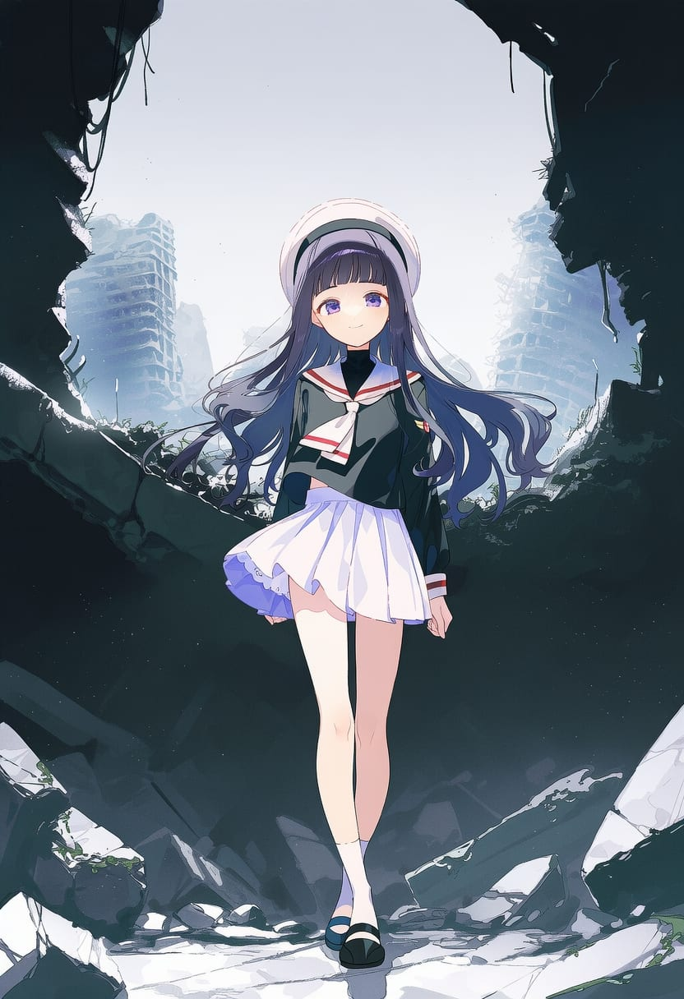

| 字段 | 内容 |
| --- | --- |
| 序号 | 0282 |
| tag | ruins |
| tag中文名 | 遗迹 |
| tag中文含义 | 以遗迹为主要景观。 |
| tag所属的子类（简单分类即可） | 宗教/历史/特殊景观 |
| 角色 | daidouji_tomoyo |

## 280. shrine — 以神社为主要景观。

| 字段 | 内容 |
| --- | --- |
| 序号 | 0283 |
| tag | shrine |
| tag中文名 | 神社 |
| tag中文含义 | 以神社为主要景观。 |
| tag所属的子类（简单分类即可） | 宗教/历史/特殊景观 |
| 角色 | kuonji_alice |

## 281. temple — 以寺庙为主要景观。

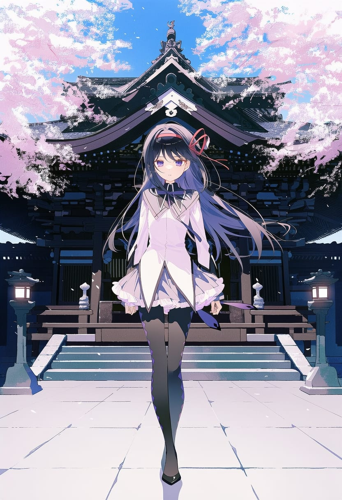

| 字段 | 内容 |
| --- | --- |
| 序号 | 0284 |
| tag | temple |
| tag中文名 | 寺庙 |
| tag中文含义 | 以寺庙为主要景观。 |
| tag所属的子类（简单分类即可） | 宗教/历史/特殊景观 |
| 角色 | akemi_homura |

## 282. asteroid — 天空或远景呈现小行星。

| 字段 | 内容 |
| --- | --- |
| 序号 | 0285 |
| tag | asteroid |
| tag中文名 | 小行星 |
| tag中文含义 | 天空或远景呈现小行星。 |
| tag所属的子类（简单分类即可） | 天空/天体/宇宙 |
| 角色 | himegami_aisa |

## 283. blue_sky — 天空或远景呈现蓝天。

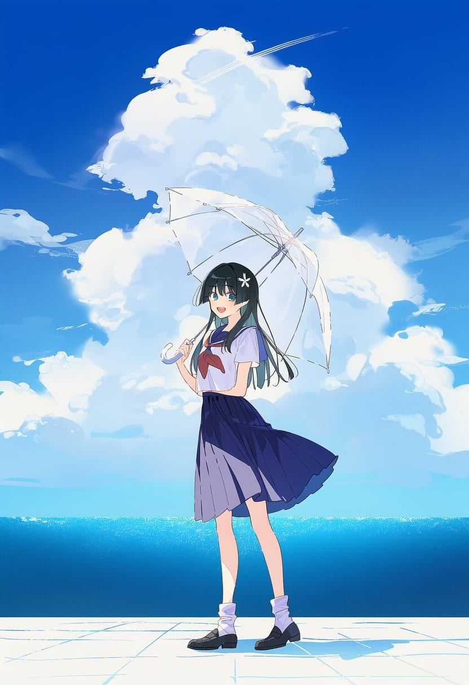

| 字段 | 内容 |
| --- | --- |
| 序号 | 0286 |
| tag | blue_sky |
| tag中文名 | 蓝天 |
| tag中文含义 | 天空或远景呈现蓝天。 |
| tag所属的子类（简单分类即可） | 天空/天体/宇宙 |
| 角色 | saten_ruiko |

## 284. clear_sky — 天空或远景呈现晴朗无云天空。

| 字段 | 内容 |
| --- | --- |
| 序号 | 0287 |
| tag | clear_sky |
| tag中文名 | 晴朗无云天空 |
| tag中文含义 | 天空或远景呈现晴朗无云天空。 |
| tag所属的子类（简单分类即可） | 天空/天体/宇宙 |
| 角色 | shiba_miyuki |

## 285. cloud — 天空或远景呈现云。

| 字段 | 内容 |
| --- | --- |
| 序号 | 0288 |
| tag | cloud |
| tag中文名 | 云 |
| tag中文含义 | 天空或远景呈现云。 |
| tag所属的子类（简单分类即可） | 天空/天体/宇宙 |
| 角色 | baizhi_(wuthering_waves) |

## 286. cloudy_sky — 天空或远景呈现多云天空。

| 字段 | 内容 |
| --- | --- |
| 序号 | 0289 |
| tag | cloudy_sky |
| tag中文名 | 多云天空 |
| tag中文含义 | 天空或远景呈现多云天空。 |
| tag所属的子类（简单分类即可） | 天空/天体/宇宙 |
| 角色 | jianxin_(wuthering_waves) |

## 287. crescent_moon — 天空或远景呈现新月/弯月。

| 字段 | 内容 |
| --- | --- |
| 序号 | 0290 |
| tag | crescent_moon |
| tag中文名 | 新月/弯月 |
| tag中文含义 | 天空或远景呈现新月/弯月。 |
| tag所属的子类（简单分类即可） | 天空/天体/宇宙 |
| 角色 | rover_(female)_(wuthering_waves) |

## 288. full_moon — 天空或远景呈现满月。

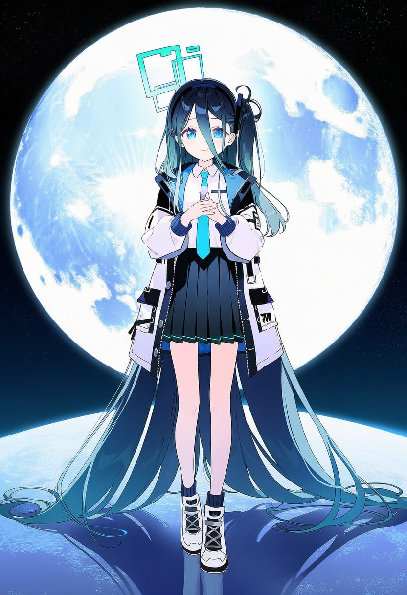

| 字段 | 内容 |
| --- | --- |
| 序号 | 0291 |
| tag | full_moon |
| tag中文名 | 满月 |
| tag中文含义 | 天空或远景呈现满月。 |
| tag所属的子类（简单分类即可） | 天空/天体/宇宙 |
| 角色 | aris_(blue_archive) |

## 289. galaxy — 天空或远景呈现星系。

| 字段 | 内容 |
| --- | --- |
| 序号 | 0292 |
| tag | galaxy |
| tag中文名 | 星系 |
| tag中文含义 | 天空或远景呈现星系。 |
| tag所属的子类（简单分类即可） | 天空/天体/宇宙 |
| 角色 | hyuuga_hinata |

## 290. grey_sky — 天空或远景呈现灰色天空。

| 字段 | 内容 |
| --- | --- |
| 序号 | 0293 |
| tag | grey_sky |
| tag中文名 | 灰色天空 |
| tag中文含义 | 天空或远景呈现灰色天空。 |
| tag所属的子类（简单分类即可） | 天空/天体/宇宙 |
| 角色 | saori_(blue_archive) |

## 291. in_orbit — 天空或远景呈现位于轨道中。

| 字段 | 内容 |
| --- | --- |
| 序号 | 0294 |
| tag | in_orbit |
| tag中文名 | 位于轨道中 |
| tag中文含义 | 天空或远景呈现位于轨道中。 |
| tag所属的子类（简单分类即可） | 天空/天体/宇宙 |
| 角色 | ichika_(blue_archive) |

## 292. milky_way — 天空或远景呈现银河。

| 字段 | 内容 |
| --- | --- |
| 序号 | 0295 |
| tag | milky_way |
| tag中文名 | 银河 |
| tag中文含义 | 天空或远景呈现银河。 |
| tag所属的子类（简单分类即可） | 天空/天体/宇宙 |
| 角色 | wakamo_(blue_archive) |

## 293. moon — 天空或远景呈现月亮。

| 字段 | 内容 |
| --- | --- |
| 序号 | 0296 |
| tag | moon |
| tag中文名 | 月亮 |
| tag中文含义 | 天空或远景呈现月亮。 |
| tag所属的子类（简单分类即可） | 天空/天体/宇宙 |
| 角色 | ziche_fuzhao |

## 294. nebula — 天空或远景呈现星云。

| 字段 | 内容 |
| --- | --- |
| 序号 | 0297 |
| tag | nebula |
| tag中文名 | 星云 |
| tag中文含义 | 天空或远景呈现星云。 |
| tag所属的子类（简单分类即可） | 天空/天体/宇宙 |
| 角色 | ado_(utaite) |

## 295. planet — 天空或远景呈现行星。

| 字段 | 内容 |
| --- | --- |
| 序号 | 0298 |
| tag | planet |
| tag中文名 | 行星 |
| tag中文含义 | 天空或远景呈现行星。 |
| tag所属的子类（简单分类即可） | 天空/天体/宇宙 |
| 角色 | saga_(arknights) |

## 296. shooting_star — 天空或远景呈现流星。

| 字段 | 内容 |
| --- | --- |
| 序号 | 0299 |
| tag | shooting_star |
| tag中文名 | 流星 |
| tag中文含义 | 天空或远景呈现流星。 |
| tag所属的子类（简单分类即可） | 天空/天体/宇宙 |
| 角色 | kasumi_(blue_archive) |

## 297. sky — 天空或远景呈现天空。

| 字段 | 内容 |
| --- | --- |
| 序号 | 0300 |
| tag | sky |
| tag中文名 | 天空 |
| tag中文含义 | 天空或远景呈现天空。 |
| tag所属的子类（简单分类即可） | 天空/天体/宇宙 |
| 角色 | chando_(ado) |

## 298. space — 天空或远景呈现太空。

| 字段 | 内容 |
| --- | --- |
| 序号 | 0301 |
| tag | space |
| tag中文名 | 太空 |
| tag中文含义 | 天空或远景呈现太空。 |
| tag所属的子类（简单分类即可） | 天空/天体/宇宙 |
| 角色 | hinata_(blue_archive) |

## 299. space_station — 天空或远景呈现空间站。

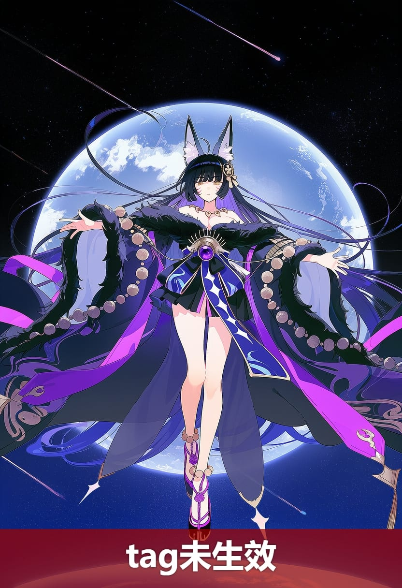

| 字段 | 内容 |
| --- | --- |
| 序号 | 0302 |
| tag | space_station |
| tag中文名 | 空间站 |
| tag中文含义 | 天空或远景呈现空间站。 |
| tag所属的子类（简单分类即可） | 天空/天体/宇宙 |
| 角色 | musashi_(azur_lane) |

## 300. star_(sky) — 天空或远景呈现天空中的星星。

| 字段 | 内容 |
| --- | --- |
| 序号 | 0303 |
| tag | star_(sky) |
| tag中文名 | 天空中的星星 |
| tag中文含义 | 天空或远景呈现天空中的星星。 |
| tag所属的子类（简单分类即可） | 天空/天体/宇宙 |
| 角色 | airi_(blue_archive) |

## 301. starry_sky — 天空或远景呈现星空。

| 字段 | 内容 |
| --- | --- |
| 序号 | 0304 |
| tag | starry_sky |
| tag中文名 | 星空 |
| tag中文含义 | 天空或远景呈现星空。 |
| tag所属的子类（简单分类即可） | 天空/天体/宇宙 |
| 角色 | yomotsu_hisami |

## 302. sun — 天空或远景呈现太阳。

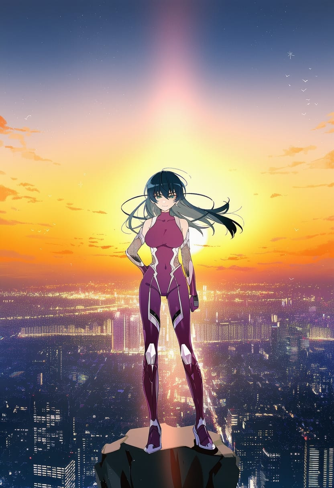

| 字段 | 内容 |
| --- | --- |
| 序号 | 0305 |
| tag | sun |
| tag中文名 | 太阳 |
| tag中文含义 | 天空或远景呈现太阳。 |
| tag所属的子类（简单分类即可） | 天空/天体/宇宙 |
| 角色 | igawa_asagi |

## 303. aurora — 天气/时间氛围：极光。

| 字段 | 内容 |
| --- | --- |
| 序号 | 0306 |
| tag | aurora |
| tag中文名 | 极光 |
| tag中文含义 | 天气/时间氛围：极光。 |
| tag所属的子类（简单分类即可） | 天气/大气/时间 |
| 角色 | dobermann_(arknights) |

## 304. blizzard — 天气/时间氛围：暴风雪。

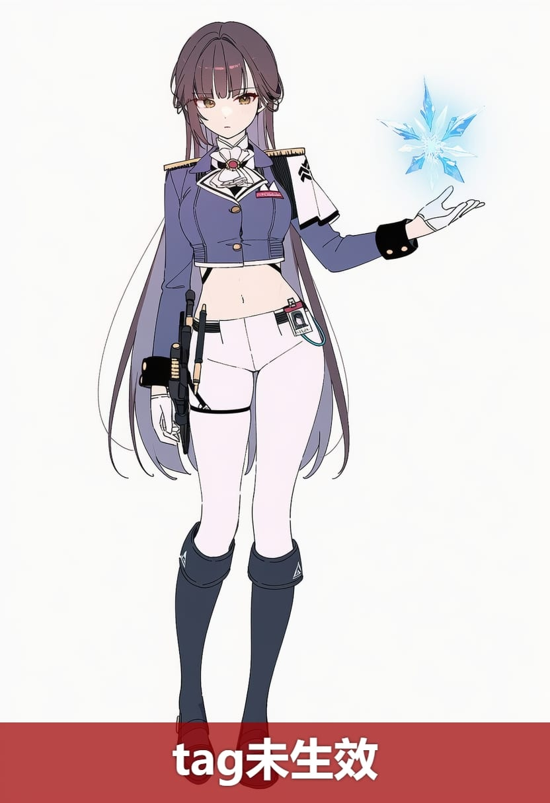

| 字段 | 内容 |
| --- | --- |
| 序号 | 0307 |
| tag | blizzard |
| tag中文名 | 暴风雪 |
| tag中文含义 | 天气/时间氛围：暴风雪。 |
| tag所属的子类（简单分类即可） | 天气/大气/时间 |
| 角色 | marciana_(nikke) |

## 305. day — 天气/时间氛围：白天。

| 字段 | 内容 |
| --- | --- |
| 序号 | 0308 |
| tag | day |
| tag中文名 | 白天 |
| tag中文含义 | 天气/时间氛围：白天。 |
| tag所属的子类（简单分类即可） | 天气/大气/时间 |
| 角色 | chiaki_(blue_archive) |

## 306. dusk — 天气/时间氛围：黄昏。

| 字段 | 内容 |
| --- | --- |
| 序号 | 0309 |
| tag | dusk |
| tag中文名 | 黄昏 |
| tag中文含义 | 天气/时间氛围：黄昏。 |
| tag所属的子类（简单分类即可） | 天气/大气/时间 |
| 角色 | bambietta_basterbine |

## 307. evening — 天气/时间氛围：傍晚。

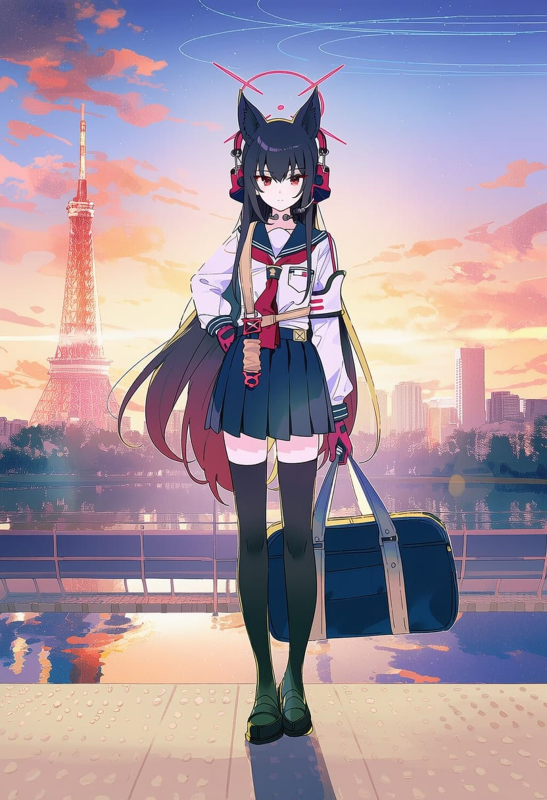

| 字段 | 内容 |
| --- | --- |
| 序号 | 0310 |
| tag | evening |
| tag中文名 | 傍晚 |
| tag中文含义 | 天气/时间氛围：傍晚。 |
| tag所属的子类（简单分类即可） | 天气/大气/时间 |
| 角色 | yukino_(blue_archive) |

## 308. fog — 天气/时间氛围：雾。

| 字段 | 内容 |
| --- | --- |
| 序号 | 0311 |
| tag | fog |
| tag中文名 | 雾 |
| tag中文含义 | 天气/时间氛围：雾。 |
| tag所属的子类（简单分类即可） | 天气/大气/时间 |
| 角色 | yahata_umiri |

## 309. lightning — 天气/时间氛围：闪电。

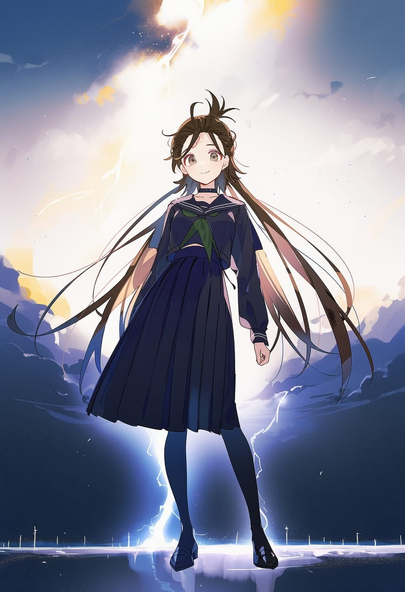

| 字段 | 内容 |
| --- | --- |
| 序号 | 0312 |
| tag | lightning |
| tag中文名 | 闪电 |
| tag中文含义 | 天气/时间氛围：闪电。 |
| tag所属的子类（简单分类即可） | 天气/大气/时间 |
| 角色 | himiko_(fate) |

## 310. meteor_shower — 天气/时间氛围：流星雨。

| 字段 | 内容 |
| --- | --- |
| 序号 | 0313 |
| tag | meteor_shower |
| tag中文名 | 流星雨 |
| tag中文含义 | 天气/时间氛围：流星雨。 |
| tag所属的子类（简单分类即可） | 天气/大气/时间 |
| 角色 | ishtar_(fate) |

## 311. morning — 天气/时间氛围：早晨。

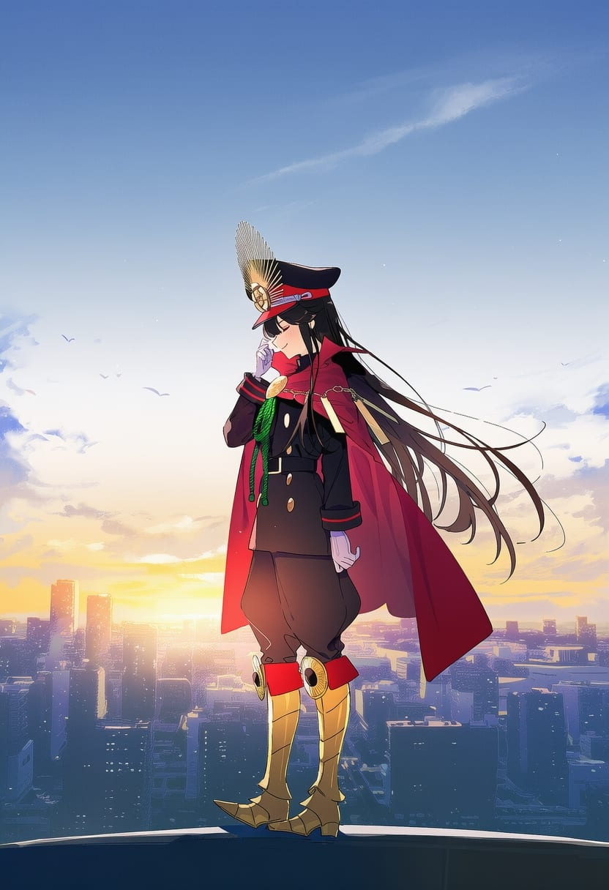

| 字段 | 内容 |
| --- | --- |
| 序号 | 0314 |
| tag | morning |
| tag中文名 | 早晨 |
| tag中文含义 | 天气/时间氛围：早晨。 |
| tag所属的子类（简单分类即可） | 天气/大气/时间 |
| 角色 | oda_nobunaga_(fate) |

## 312. night — 天气/时间氛围：夜晚。

| 字段 | 内容 |
| --- | --- |
| 序号 | 0315 |
| tag | night |
| tag中文名 | 夜晚 |
| tag中文含义 | 天气/时间氛围：夜晚。 |
| tag所属的子类（简单分类即可） | 天气/大气/时间 |
| 角色 | asaka_karin |

## 313. overcast — 天气/时间氛围：阴天/完全云覆盖。

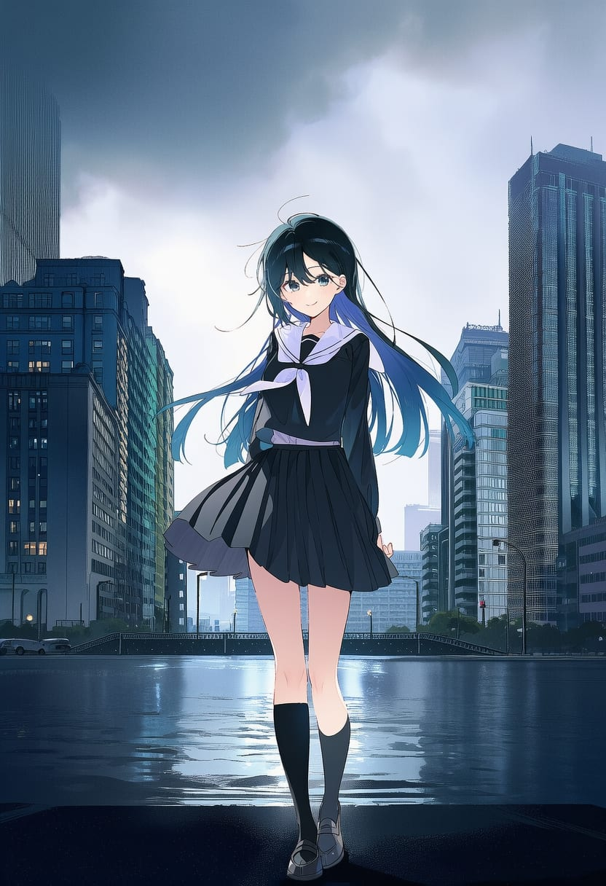

| 字段 | 内容 |
| --- | --- |
| 序号 | 0316 |
| tag | overcast |
| tag中文名 | 阴天/完全云覆盖 |
| tag中文含义 | 天气/时间氛围：阴天/完全云覆盖。 |
| tag所属的子类（简单分类即可） | 天气/大气/时间 |
| 角色 | yuuki_setsuna |

## 314. rain — 天气/时间氛围：下雨。

| 字段 | 内容 |
| --- | --- |
| 序号 | 0317 |
| tag | rain |
| tag中文名 | 下雨 |
| tag中文含义 | 天气/时间氛围：下雨。 |
| tag所属的子类（简单分类即可） | 天气/大气/时间 |
| 角色 | nico_robin |

## 315. rainbow — 天气/时间氛围：彩虹。

| 字段 | 内容 |
| --- | --- |
| 序号 | 0318 |
| tag | rainbow |
| tag中文名 | 彩虹 |
| tag中文含义 | 天气/时间氛围：彩虹。 |
| tag所属的子类（简单分类即可） | 天气/大气/时间 |
| 角色 | miyadeguchi_mizuchi |

## 316. snow — 天气/时间氛围：积雪/雪。

| 字段 | 内容 |
| --- | --- |
| 序号 | 0319 |
| tag | snow |
| tag中文名 | 积雪/雪 |
| tag中文含义 | 天气/时间氛围：积雪/雪。 |
| tag所属的子类（简单分类即可） | 天气/大气/时间 |
| 角色 | izumi_mei |

## 317. snowing — 天气/时间氛围：正在下雪。

| 字段 | 内容 |
| --- | --- |
| 序号 | 0320 |
| tag | snowing |
| tag中文名 | 正在下雪 |
| tag中文含义 | 天气/时间氛围：正在下雪。 |
| tag所属的子类（简单分类即可） | 天气/大气/时间 |
| 角色 | kitazawa_shiho |

## 318. storm — 天气/时间氛围：风暴。

| 字段 | 内容 |
| --- | --- |
| 序号 | 0321 |
| tag | storm |
| tag中文名 | 风暴 |
| tag中文含义 | 天气/时间氛围：风暴。 |
| tag所属的子类（简单分类即可） | 天气/大气/时间 |
| 角色 | kurosaki_chitose |

## 319. sun_shower — 天气/时间氛围：太阳雨。

| 字段 | 内容 |
| --- | --- |
| 序号 | 0322 |
| tag | sun_shower |
| tag中文名 | 太阳雨 |
| tag中文含义 | 天气/时间氛围：太阳雨。 |
| tag所属的子类（简单分类即可） | 天气/大气/时间 |
| 角色 | shirase_sakuya |

## 320. sunrise — 天气/时间氛围：日出。

| 字段 | 内容 |
| --- | --- |
| 序号 | 0323 |
| tag | sunrise |
| tag中文名 | 日出 |
| tag中文含义 | 天气/时间氛围：日出。 |
| tag所属的子类（简单分类即可） | 天气/大气/时间 |
| 角色 | lan_yan_(genshin_impact) |

## 321. sunset — 天气/时间氛围：日落。

| 字段 | 内容 |
| --- | --- |
| 序号 | 0324 |
| tag | sunset |
| tag中文名 | 日落 |
| tag中文含义 | 天气/时间氛围：日落。 |
| tag所属的子类（简单分类即可） | 天气/大气/时间 |
| 角色 | iori_utahime |

## 322. tornado — 天气/时间氛围：龙卷风。

| 字段 | 内容 |
| --- | --- |
| 序号 | 0325 |
| tag | tornado |
| tag中文名 | 龙卷风 |
| tag中文含义 | 天气/时间氛围：龙卷风。 |
| tag所属的子类（简单分类即可） | 天气/大气/时间 |
| 角色 | himeragi_yukina |

## 323. twilight — 天气/时间氛围：暮光/晨昏。

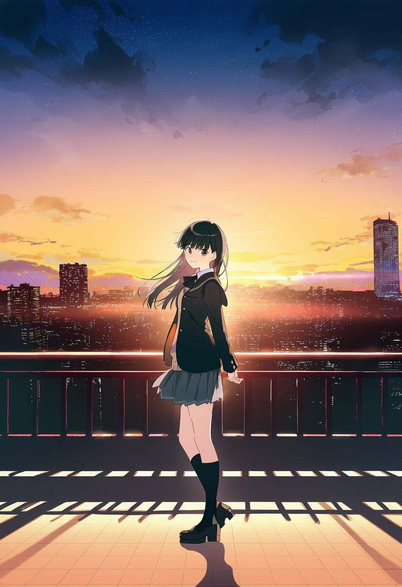

| 字段 | 内容 |
| --- | --- |
| 序号 | 0326 |
| tag | twilight |
| tag中文名 | 暮光/晨昏 |
| tag中文含义 | 天气/时间氛围：暮光/晨昏。 |
| tag所属的子类（简单分类即可） | 天气/大气/时间 |
| 角色 | ayatsuji_tsukasa |

## 324. from_inside — 场景/视角：从室内向外看。

| 字段 | 内容 |
| --- | --- |
| 序号 | 0327 |
| tag | from_inside |
| tag中文名 | 从室内向外看 |
| tag中文含义 | 场景/视角：从室内向外看。 |
| tag所属的子类（简单分类即可） | 场景/视角总标签 |
| 角色 | morishima_haruka |

## 325. from_outside — 场景/视角：从室外向内看。

| 字段 | 内容 |
| --- | --- |
| 序号 | 0328 |
| tag | from_outside |
| tag中文名 | 从室外向内看 |
| tag中文含义 | 场景/视角：从室外向内看。 |
| tag所属的子类（简单分类即可） | 场景/视角总标签 |
| 角色 | takemi_tae |

## 326. indoors — 场景/视角：室内。

| 字段 | 内容 |
| --- | --- |
| 序号 | 0329 |
| tag | indoors |
| tag中文名 | 室内 |
| tag中文含义 | 场景/视角：室内。 |
| tag所属的子类（简单分类即可） | 场景/视角总标签 |
| 角色 | carmine_(pokemon) |

## 327. outdoors — 场景/视角：室外。

| 字段 | 内容 |
| --- | --- |
| 序号 | 0330 |
| tag | outdoors |
| tag中文名 | 室外 |
| tag中文含义 | 场景/视角：室外。 |
| tag所属的子类（简单分类即可） | 场景/视角总标签 |
| 角色 | olivia_(pokemon) |

## 328. scenery — 场景/视角：风景主导画面。

| 字段 | 内容 |
| --- | --- |
| 序号 | 0331 |
| tag | scenery |
| tag中文名 | 风景主导画面 |
| tag中文含义 | 场景/视角：风景主导画面。 |
| tag所属的子类（简单分类即可） | 场景/视角总标签 |
| 角色 | sabrina_(pokemon) |

## 329. airplane_interior — 视角位于飞机内部。

| 字段 | 内容 |
| --- | --- |
| 序号 | 0332 |
| tag | airplane_interior |
| tag中文名 | 飞机内部 |
| tag中文含义 | 视角位于飞机内部。 |
| tag所属的子类（简单分类即可） | 交通工具内部 |
| 角色 | zinnia_(pokemon) |

## 330. bus_interior — 视角位于公交车内部。

| 字段 | 内容 |
| --- | --- |
| 序号 | 0333 |
| tag | bus_interior |
| tag中文名 | 公交车内部 |
| tag中文含义 | 视角位于公交车内部。 |
| tag所属的子类（简单分类即可） | 交通工具内部 |
| 角色 | elma_(maidragon) |

## 331. car_interior — 视角位于汽车内部。

| 字段 | 内容 |
| --- | --- |
| 序号 | 0334 |
| tag | car_interior |
| tag中文名 | 汽车内部 |
| tag中文含义 | 视角位于汽车内部。 |
| tag所属的子类（简单分类即可） | 交通工具内部 |
| 角色 | ots-14_(girls'_frontline) |

## 332. cockpit — 视角位于驾驶舱。

| 字段 | 内容 |
| --- | --- |
| 序号 | 0335 |
| tag | cockpit |
| tag中文名 | 驾驶舱 |
| tag中文含义 | 视角位于驾驶舱。 |
| tag所属的子类（简单分类即可） | 交通工具内部 |
| 角色 | st_ar-15_(girls'_frontline) |

## 333. spacecraft_interior — 视角位于航天器内部。

| 字段 | 内容 |
| --- | --- |
| 序号 | 0336 |
| tag | spacecraft_interior |
| tag中文名 | 航天器内部 |
| tag中文含义 | 视角位于航天器内部。 |
| tag所属的子类（简单分类即可） | 交通工具内部 |
| 角色 | type_79_(girls'_frontline) |

## 334. tank_interior — 视角位于坦克内部。

| 字段 | 内容 |
| --- | --- |
| 序号 | 0337 |
| tag | tank_interior |
| tag中文名 | 坦克内部 |
| tag中文含义 | 视角位于坦克内部。 |
| tag所属的子类（简单分类即可） | 交通工具内部 |
| 角色 | wa2000_(girls'_frontline) |

## 335. train_interior — 视角位于列车内部。

| 字段 | 内容 |
| --- | --- |
| 序号 | 0338 |
| tag | train_interior |
| tag中文名 | 列车内部 |
| tag中文含义 | 视角位于列车内部。 |
| tag所属的子类（简单分类即可） | 交通工具内部 |
| 角色 | mikazuki_yozora |

## 336. vehicle_interior — 视角位于交通工具内部。

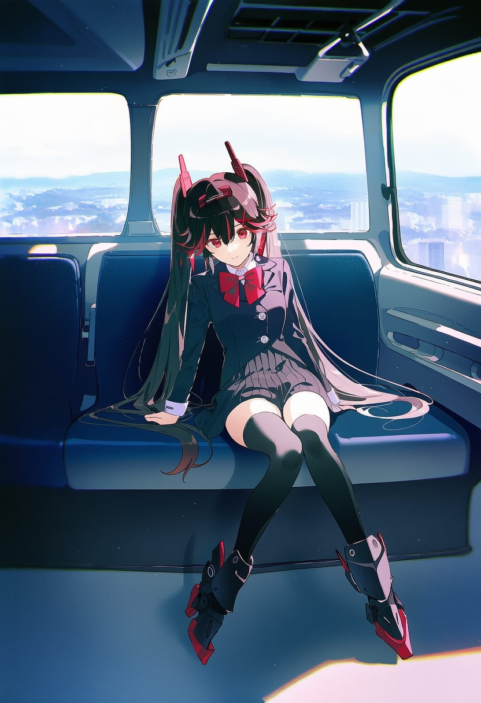

| 字段 | 内容 |
| --- | --- |
| 序号 | 0339 |
| tag | vehicle_interior |
| tag中文名 | 交通工具内部 |
| tag中文含义 | 视角位于交通工具内部。 |
| tag所属的子类（简单分类即可） | 交通工具内部 |
| 角色 | lucia_(punishing:_gray_raven) |

---
