# 袜子tag展示

## 1. socks — 袜子

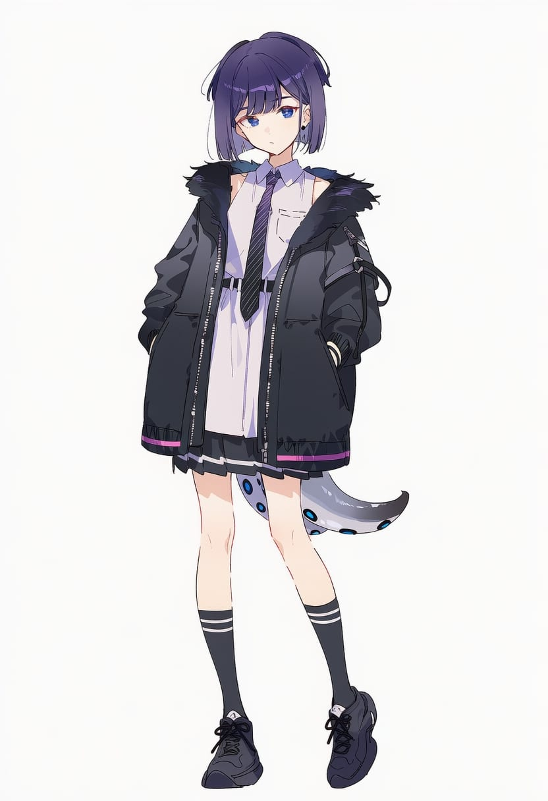

| 字段 | 内容 |
| --- | --- |
| Danbooru tag | socks |
| 中文释义 | 袜子 |
| 详细释义 | Danbooru 的基础袜子 tag：覆盖脚部，通常从踝部到膝部；更高的袜类进一步使用 kneehighs、over-kneehighs、thighhighs、hiphighs 等细分。 |
| tag所属的子类 | 袜子种类 |

## 2. no-show_socks — 隐形袜/船袜

| 字段 | 内容 |
| --- | --- |
| Danbooru tag | no-show_socks |
| 中文释义 | 隐形袜/船袜 |
| 详细释义 | 鞋口以下的低帮袜，穿鞋后通常几乎看不到袜口；比 ankle_socks 更低。 |
| tag所属的子类 | 袜子种类 |

## 3. ankle_socks — 踝袜/短袜

| 字段 | 内容 |
| --- | --- |
| Danbooru tag | ankle_socks |
| 中文释义 | 踝袜/短袜 |
| 详细释义 | 袜口位于脚踝附近的短袜。 |
| tag所属的子类 | 袜子种类 |

## 4. bobby_socks — Bobby 袜/翻口短袜

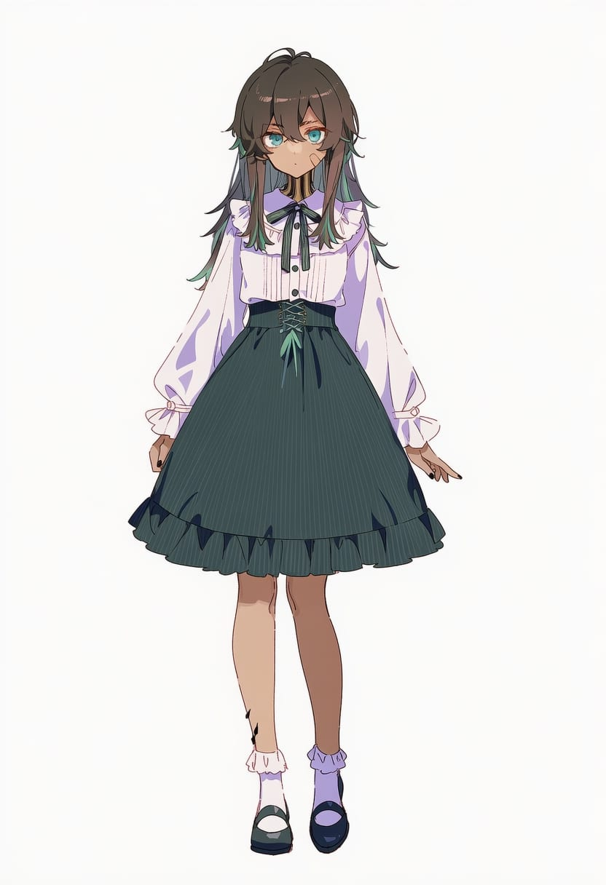

| 字段 | 内容 |
| --- | --- |
| Danbooru tag | bobby_socks |
| 中文释义 | Bobby 袜/翻口短袜 |
| 详细释义 | 常见为踝部附近并带翻折袜口的短袜款式，常见于复古学生装语境。 |
| tag所属的子类 | 袜子种类 |

## 5. loose_socks — 泡泡袜/宽松袜

| 字段 | 内容 |
| --- | --- |
| Danbooru tag | loose_socks |
| 中文释义 | 泡泡袜/宽松袜 |
| 详细释义 | 袜筒宽松并在小腿或脚踝处堆叠形成褶皱；不要与无足的 leg_warmers 混淆。 |
| tag所属的子类 | 袜子种类 |

## 6. tube_socks — 筒袜

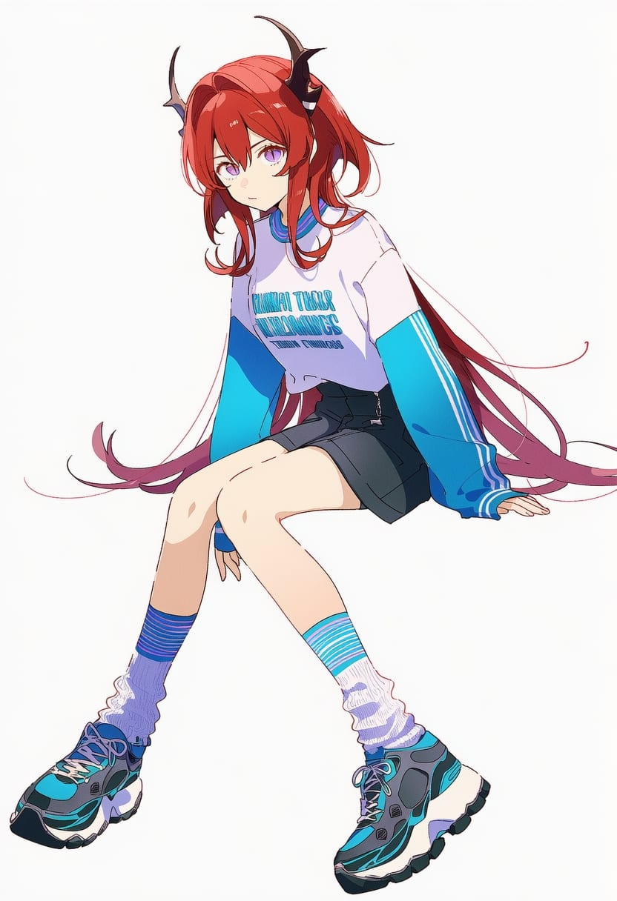

| 字段 | 内容 |
| --- | --- |
| Danbooru tag | tube_socks |
| 中文释义 | 筒袜 |
| 详细释义 | 无明显独立脚跟造型、近似直筒的一码袜，常到小腿或膝部，常见运动袜式袜口条纹。 |
| tag所属的子类 | 袜子种类 |

## 7. kneehighs — 及膝袜

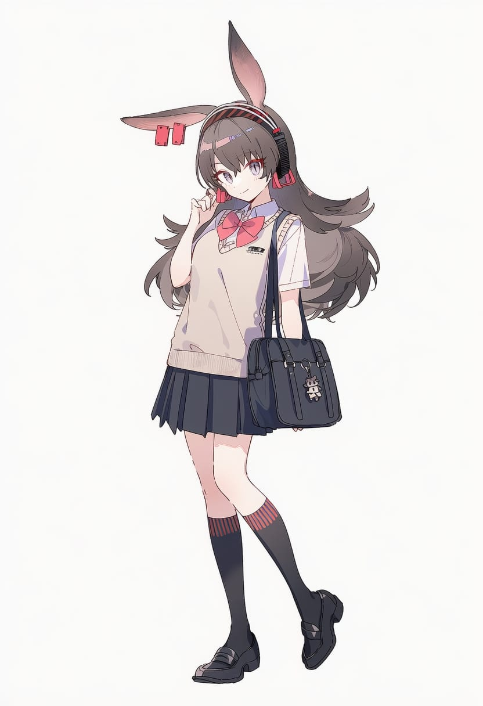

| 字段 | 内容 |
| --- | --- |
| Danbooru tag | kneehighs |
| 中文释义 | 及膝袜 |
| 详细释义 | 长度到膝盖附近、通常略低于膝盖的长袜；更高一些用 over-kneehighs。 |
| tag所属的子类 | 袜子种类 |

## 8. over-kneehighs — 过膝袜

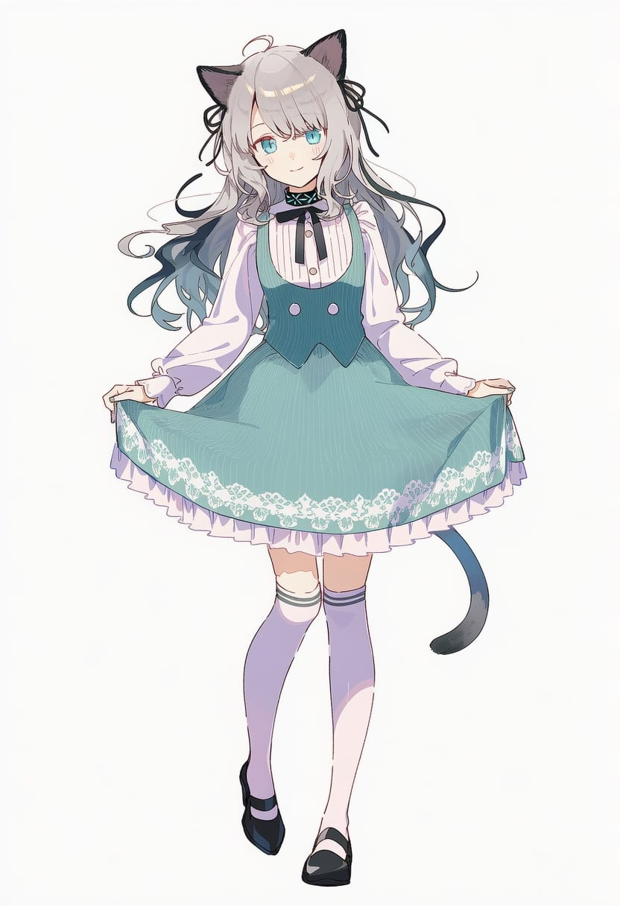

| 字段 | 内容 |
| --- | --- |
| Danbooru tag | over-kneehighs |
| 中文释义 | 过膝袜 |
| 详细释义 | 袜口刚越过膝盖、但通常短于 thighhighs 的长袜。 |
| tag所属的子类 | 袜子种类 |

## 9. thighhighs — 大腿袜/长筒袜

| 字段 | 内容 |
| --- | --- |
| Danbooru tag | thighhighs |
| 中文释义 | 大腿袜/长筒袜 |
| 详细释义 | 从脚部一直覆盖到大腿的长袜；不覆盖腰部和裆部，因此与 pantyhose 区分。 |
| tag所属的子类 | 袜子种类 |

## 10. hiphighs — 胯高袜/髋高袜

| 字段 | 内容 |
| --- | --- |
| Danbooru tag | hiphighs |
| 中文释义 | 胯高袜/髋高袜 |
| 详细释义 | 袜筒一直延伸到腹股沟或髋部，比 thighhighs 更高，但不连接覆盖裆部。 |
| tag所属的子类 | 袜子种类 |

## 11. pantyhose — 连裤袜

| 字段 | 内容 |
| --- | --- |
| Danbooru tag | pantyhose |
| 中文释义 | 连裤袜 |
| 详细释义 | 从腰/髋部连续覆盖双腿直到脚趾的紧身袜类；Danbooru 将 tights 作为其别名。 |
| tag所属的子类 | 袜子种类 |

## 12. tabi — 足袋/分趾袜

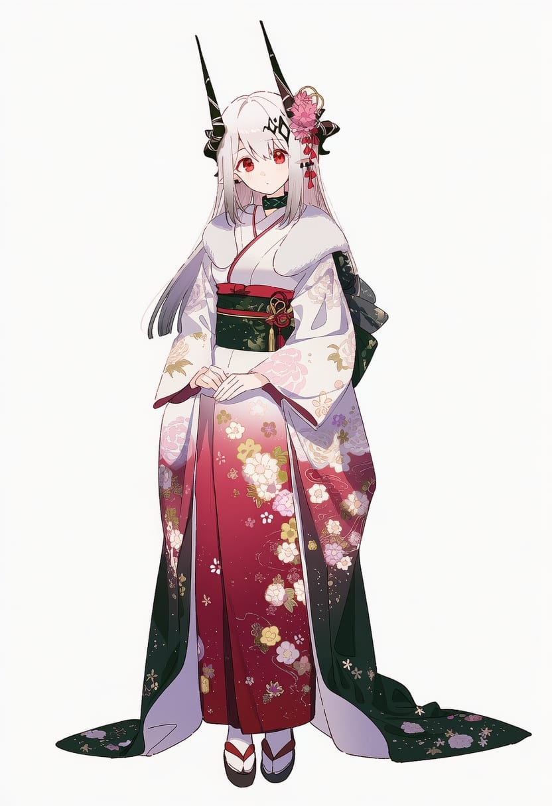

| 字段 | 内容 |
| --- | --- |
| Danbooru tag | tabi |
| 中文释义 | 足袋/分趾袜 |
| 详细释义 | 日本传统分趾袜，大拇趾与其余脚趾分开；不同于每根脚趾独立的 toe_socks。 |
| tag所属的子类 | 袜子种类 |

## 13. toe_socks — 五趾袜

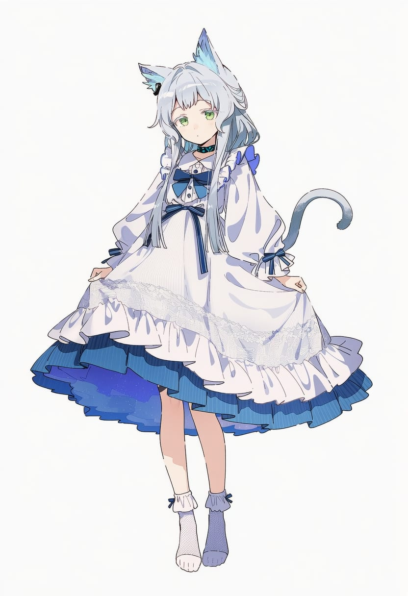

| 字段 | 内容 |
| --- | --- |
| Danbooru tag | toe_socks |
| 中文释义 | 五趾袜 |
| 详细释义 | 每根脚趾都有独立袜套的袜子；不要与只分“大拇趾/其余四趾”的 tabi 混用。 |
| tag所属的子类 | 袜子种类 |

## 14. half_soles — 半掌袜/前掌套

| 字段 | 内容 |
| --- | --- |
| Danbooru tag | half_soles |
| 中文释义 | 半掌袜/前掌套 |
| 详细释义 | 只覆盖脚掌前部的一类足部穿戴物；官方 Socks Wiki 将其列在袜类相关款式中，严格说不是完整袜子。 |
| tag所属的子类 | 袜子种类 |

## 15. beoseon — 韩式传统袜（버선）

| 字段 | 内容 |
| --- | --- |
| Danbooru tag | beoseon |
| 中文释义 | 韩式传统袜（버선） |
| 详细释义 | 韩国传统袜，常与 hanbok（韩服）搭配。 |
| tag所属的子类 | 袜子种类 |

## 16. bodystocking — 连体丝袜/全身袜

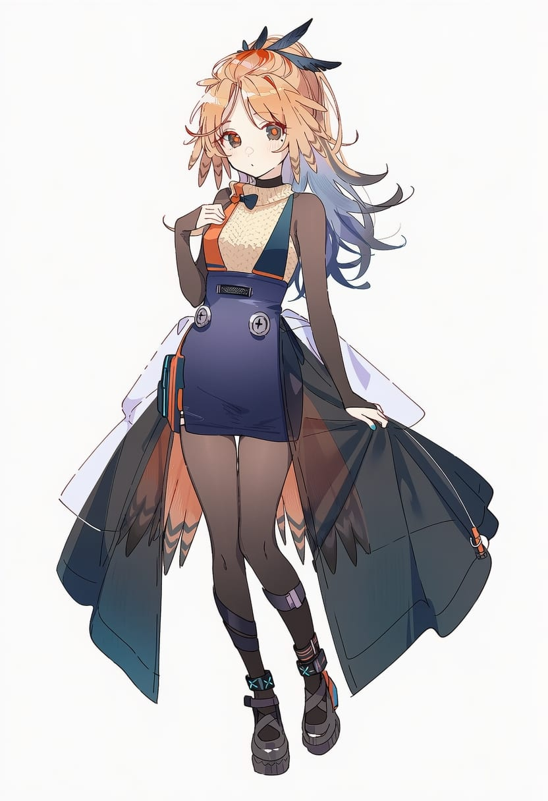

| 字段 | 内容 |
| --- | --- |
| Danbooru tag | bodystocking |
| 中文释义 | 连体丝袜/全身袜 |
| 详细释义 | 从躯干延伸到腿部的连体紧身袜装；与 pantyhose 相邻但覆盖范围更大。 |
| tag所属的子类 | 袜子种类 |

## 17. black_socks — 黑色袜子

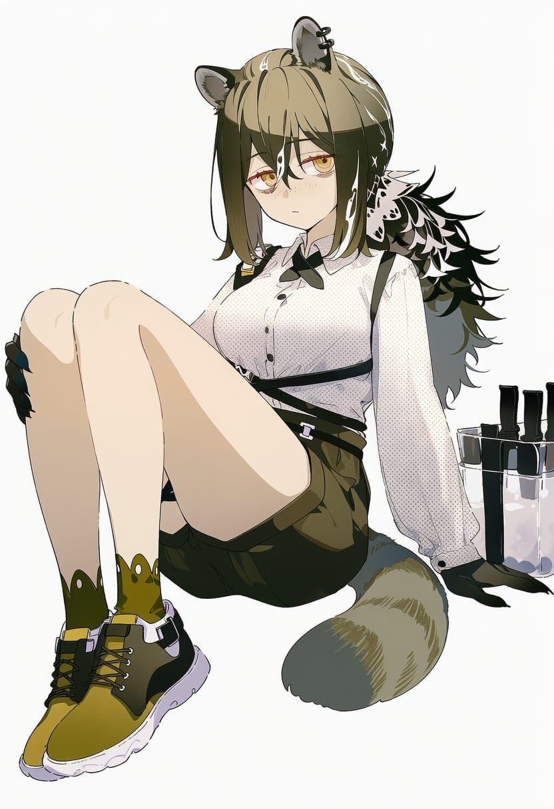

| 字段 | 内容 |
| --- | --- |
| Danbooru tag | black_socks |
| 中文释义 | 黑色袜子 |
| 详细释义 | 表示袜子的主体颜色为黑色；可与长度、材质、图案、穿法等 tag 组合。 |
| tag所属的子类 | 颜色图案 |

## 18. white_thighhighs — 白色大腿袜

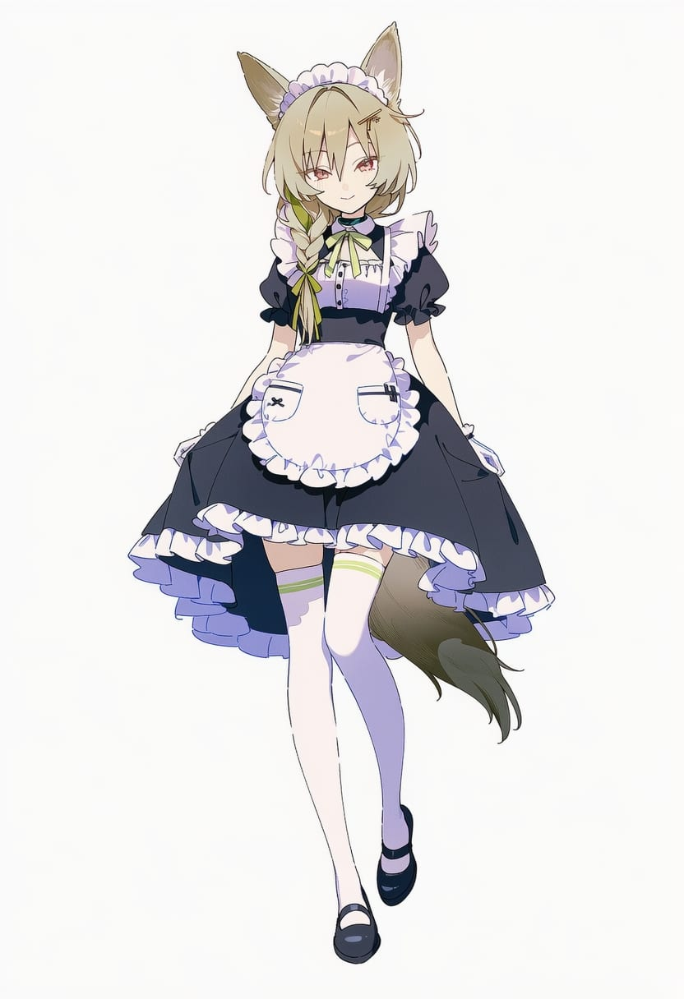

| 字段 | 内容 |
| --- | --- |
| Danbooru tag | white_thighhighs |
| 中文释义 | 白色大腿袜 |
| 详细释义 | 表示大腿袜的主体颜色为白色；可与长度、材质、图案、穿法等 tag 组合。 |
| tag所属的子类 | 颜色图案 |

## 19. argyle_socks — 菱格/阿盖尔纹袜子

| 字段 | 内容 |
| --- | --- |
| Danbooru tag | argyle_socks |
| 中文释义 | 菱格/阿盖尔纹袜子 |
| 详细释义 | 袜子表面具有菱格/阿盖尔纹；可与颜色、材质和长度类 tag 并用。 |
| tag所属的子类 | 颜色图案 |

## 20. print_socks — 印花袜子

| 字段 | 内容 |
| --- | --- |
| Danbooru tag | print_socks |
| 中文释义 | 印花袜子 |
| 详细释义 | 袜子表面具有印花；可与颜色、材质和长度类 tag 并用。 |
| tag所属的子类 | 颜色图案 |

## 21. plaid_socks — 格纹袜子

| 字段 | 内容 |
| --- | --- |
| Danbooru tag | plaid_socks |
| 中文释义 | 格纹袜子 |
| 详细释义 | 袜子表面具有格纹；可与颜色、材质和长度类 tag 并用。 |
| tag所属的子类 | 颜色图案 |

## 22. polka_dot_socks — 波点袜子

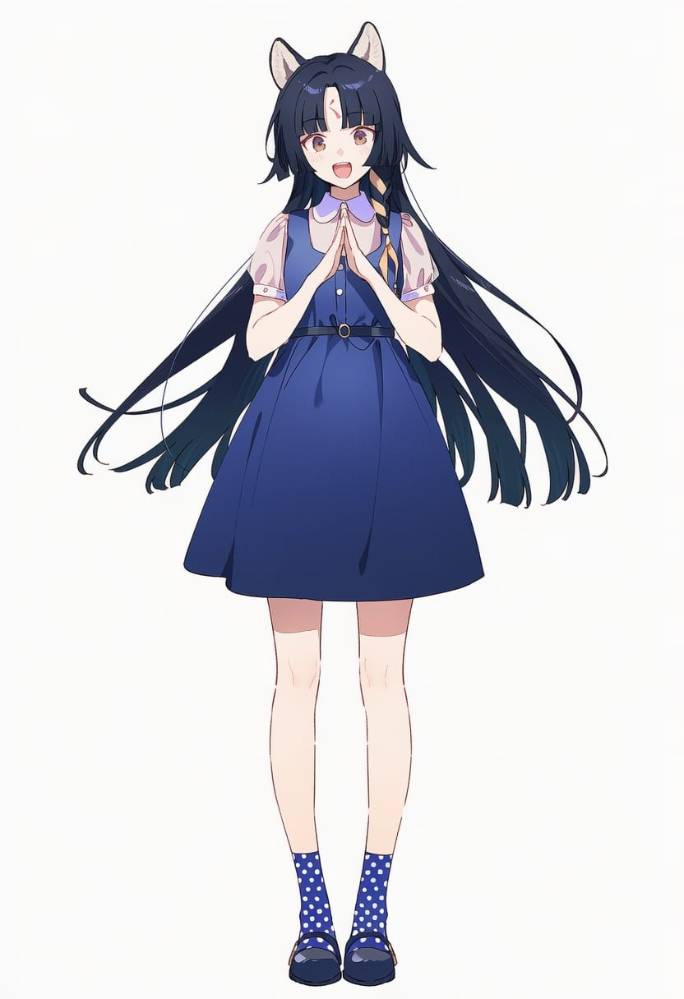

| 字段 | 内容 |
| --- | --- |
| Danbooru tag | polka_dot_socks |
| 中文释义 | 波点袜子 |
| 详细释义 | 袜子表面具有波点；可与颜色、材质和长度类 tag 并用。 |
| tag所属的子类 | 颜色图案 |

## 23. striped_socks — 条纹袜子

| 字段 | 内容 |
| --- | --- |
| Danbooru tag | striped_socks |
| 中文释义 | 条纹袜子 |
| 详细释义 | 袜子表面具有条纹；可与颜色、材质和长度类 tag 并用。 |
| tag所属的子类 | 颜色图案 |

## 24. pinstripe_socks — 细条纹袜子

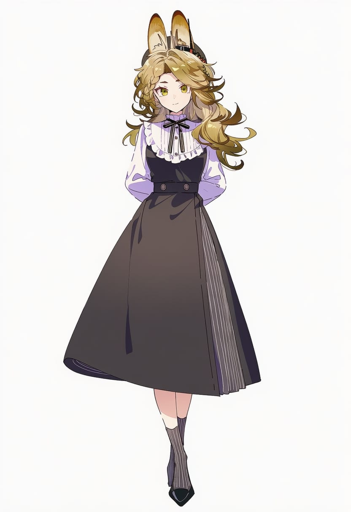

| 字段 | 内容 |
| --- | --- |
| Danbooru tag | pinstripe_socks |
| 中文释义 | 细条纹袜子 |
| 详细释义 | 袜子表面具有细条纹；可与颜色、材质和长度类 tag 并用。 |
| tag所属的子类 | 颜色图案 |

## 25. vertical-striped_socks — 竖条纹袜子

| 字段 | 内容 |
| --- | --- |
| Danbooru tag | vertical-striped_socks |
| 中文释义 | 竖条纹袜子 |
| 详细释义 | 袜子表面具有竖条纹；可与颜色、材质和长度类 tag 并用。 |
| tag所属的子类 | 颜色图案 |

## 26. cow_print_thighhighs — 奶牛纹大腿袜

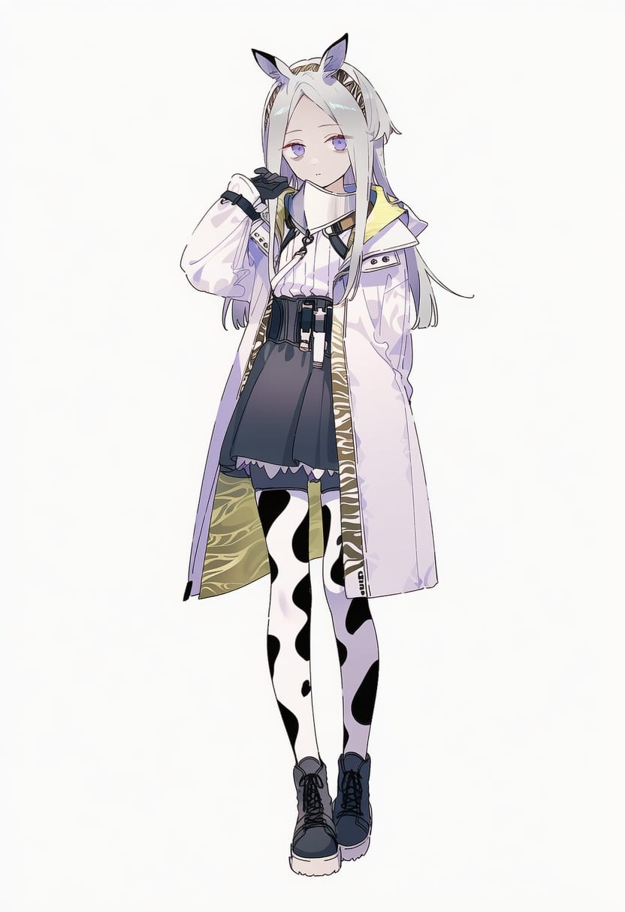

| 字段 | 内容 |
| --- | --- |
| Danbooru tag | cow_print_thighhighs |
| 中文释义 | 奶牛纹大腿袜 |
| 详细释义 | 大腿袜表面具有奶牛纹；可与颜色、材质和长度类 tag 并用。 |
| tag所属的子类 | 颜色图案 |

## 27. american_flag_legwear — 美国国旗图案腿部穿戴物

| 字段 | 内容 |
| --- | --- |
| Danbooru tag | american_flag_legwear |
| 中文释义 | 美国国旗图案腿部穿戴物 |
| 详细释义 | 腿部穿戴物表面具有美国国旗图案；可与颜色、材质和长度类 tag 并用。 |
| tag所属的子类 | 颜色图案 |

## 28. camouflage_legwear — 迷彩腿部穿戴物

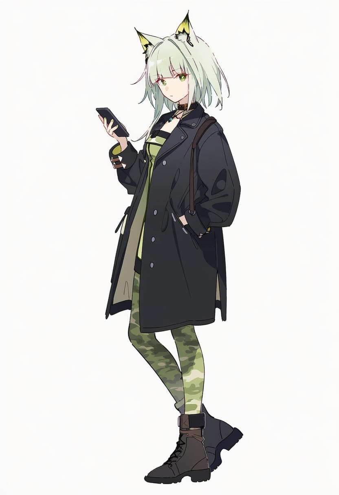

| 字段 | 内容 |
| --- | --- |
| Danbooru tag | camouflage_legwear |
| 中文释义 | 迷彩腿部穿戴物 |
| 详细释义 | 腿部穿戴物表面具有迷彩；可与颜色、材质和长度类 tag 并用。 |
| tag所属的子类 | 颜色图案 |

## 29. checkered_legwear — 棋盘格腿部穿戴物

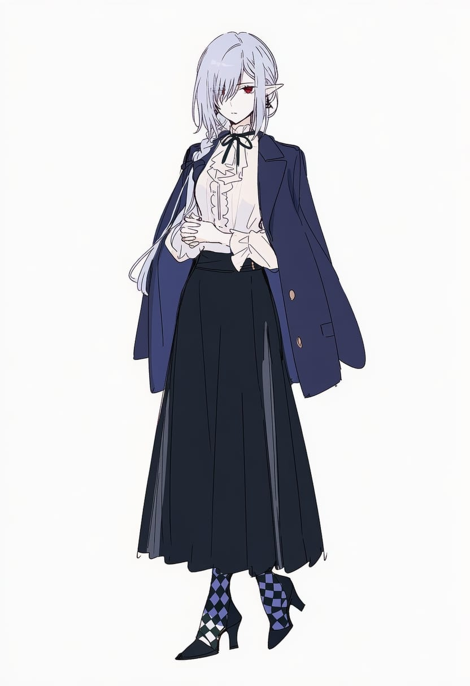

| 字段 | 内容 |
| --- | --- |
| Danbooru tag | checkered_legwear |
| 中文释义 | 棋盘格腿部穿戴物 |
| 详细释义 | 腿部穿戴物表面具有棋盘格；可与颜色、材质和长度类 tag 并用。 |
| tag所属的子类 | 颜色图案 |

## 30. diagonal-striped_legwear — 斜条纹腿部穿戴物

| 字段 | 内容 |
| --- | --- |
| Danbooru tag | diagonal-striped_legwear |
| 中文释义 | 斜条纹腿部穿戴物 |
| 详细释义 | 腿部穿戴物表面具有斜条纹；可与颜色、材质和长度类 tag 并用。 |
| tag所属的子类 | 颜色图案 |

## 31. gingham_legwear — 维希格纹/小方格腿部穿戴物

| 字段 | 内容 |
| --- | --- |
| Danbooru tag | gingham_legwear |
| 中文释义 | 维希格纹/小方格腿部穿戴物 |
| 详细释义 | 腿部穿戴物表面具有维希格纹/小方格；可与颜色、材质和长度类 tag 并用。 |
| tag所属的子类 | 颜色图案 |

## 32. rainbow_legwear — 彩虹图案腿部穿戴物

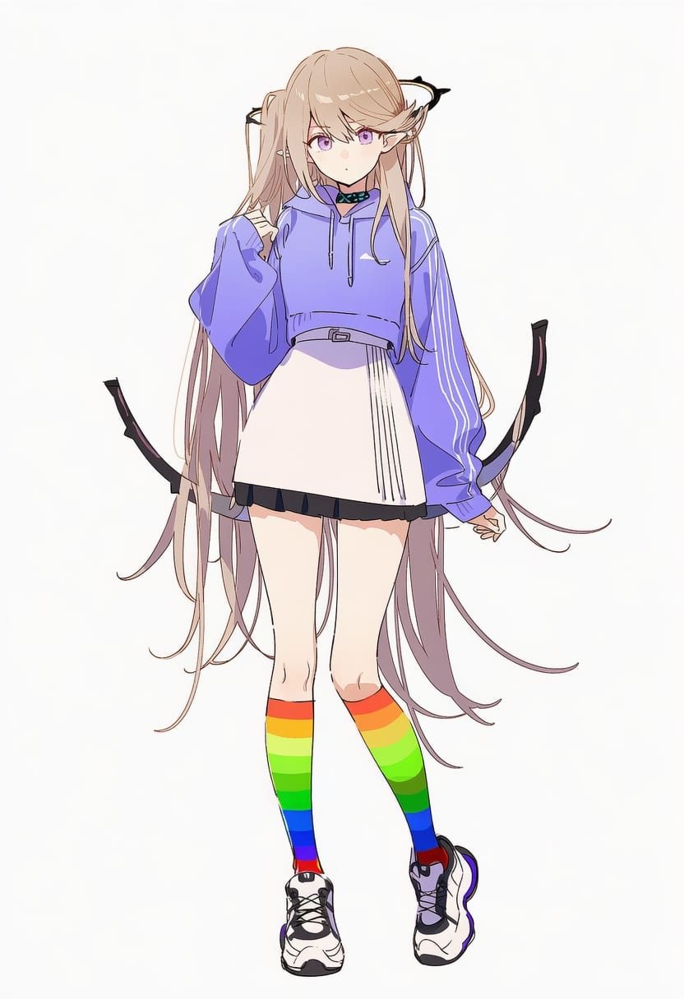

| 字段 | 内容 |
| --- | --- |
| Danbooru tag | rainbow_legwear |
| 中文释义 | 彩虹图案腿部穿戴物 |
| 详细释义 | 腿部穿戴物表面具有彩虹图案；可与颜色、材质和长度类 tag 并用。 |
| tag所属的子类 | 颜色图案 |

## 33. patterned_legwear — 图案化腿部穿戴物

| 字段 | 内容 |
| --- | --- |
| Danbooru tag | patterned_legwear |
| 中文释义 | 图案化腿部穿戴物 |
| 详细释义 | 腿部穿戴物表面具有图案化；可与颜色、材质和长度类 tag 并用。 |
| tag所属的子类 | 颜色图案 |

## 34. gradient_legwear — 渐变色腿部穿戴物

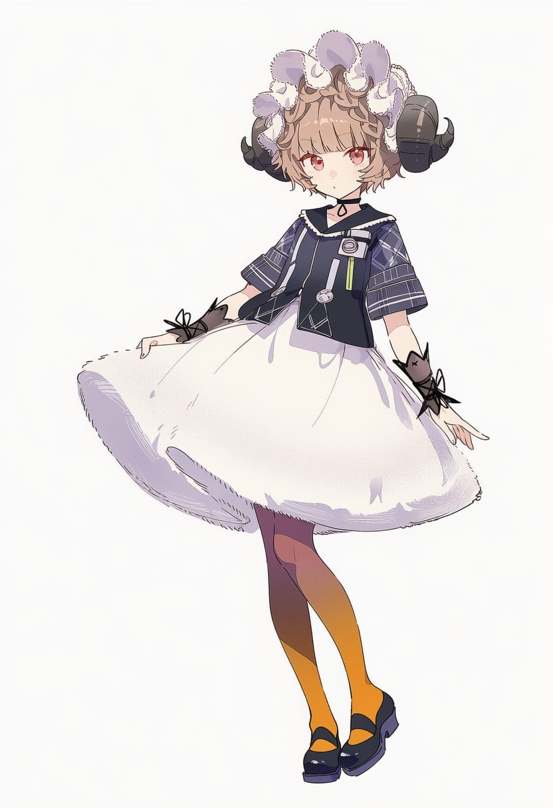

| 字段 | 内容 |
| --- | --- |
| Danbooru tag | gradient_legwear |
| 中文释义 | 渐变色腿部穿戴物 |
| 详细释义 | 腿部穿戴物颜色沿袜体逐渐过渡形成渐变；用于颜色结构而不是材质。 |
| tag所属的子类 | 颜色图案 |

## 35. two-tone_legwear — 双色腿部穿戴物

| 字段 | 内容 |
| --- | --- |
| Danbooru tag | two-tone_legwear |
| 中文释义 | 双色腿部穿戴物 |
| 详细释义 | 腿部穿戴物以两种主要颜色构成；用于颜色结构而不是材质。 |
| tag所属的子类 | 颜色图案 |

## 36. multicolored_legwear — 多色腿部穿戴物

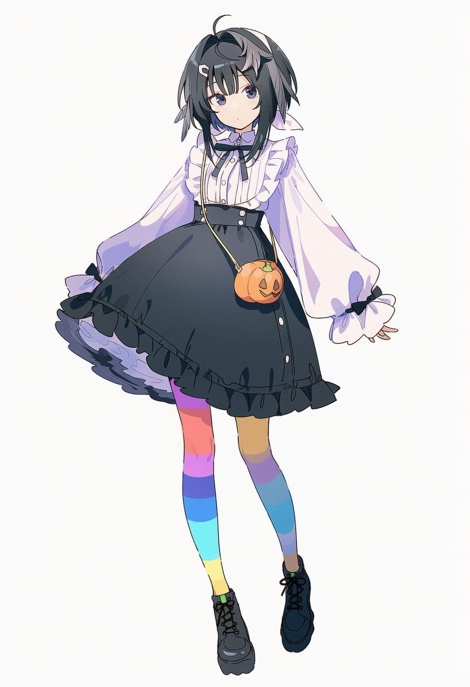

| 字段 | 内容 |
| --- | --- |
| Danbooru tag | multicolored_legwear |
| 中文释义 | 多色腿部穿戴物 |
| 详细释义 | 腿部穿戴物包含多种明显颜色；用于颜色结构而不是材质。 |
| tag所属的子类 | 颜色图案 |

## 37. leg_warmers — 暖腿套/护腿套

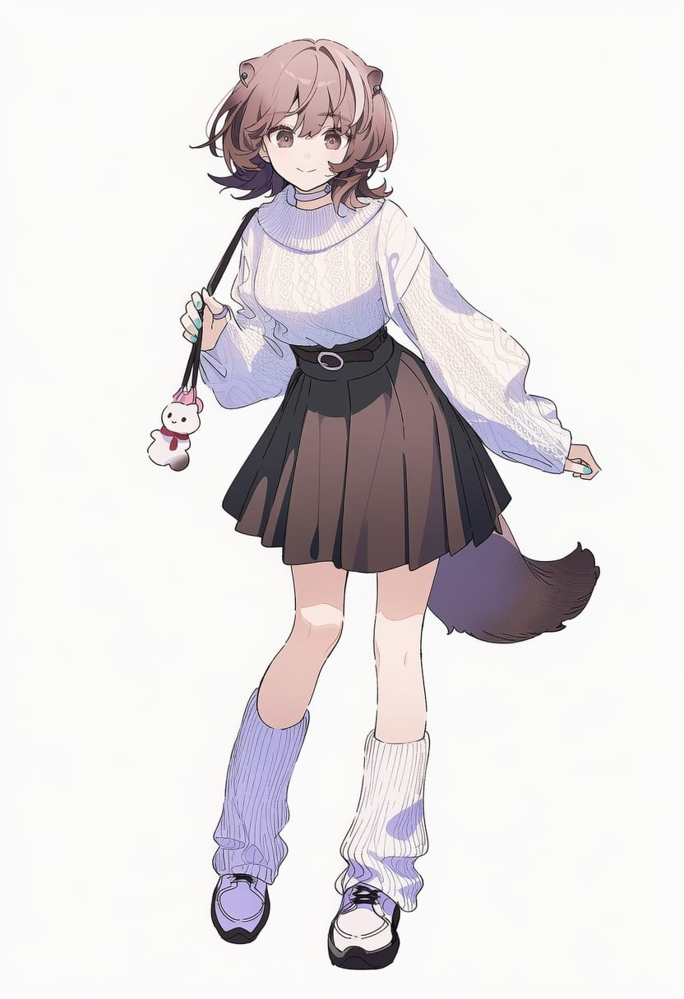

| 字段 | 内容 |
| --- | --- |
| Danbooru tag | leg_warmers |
| 中文释义 | 暖腿套/护腿套 |
| 详细释义 | 套在小腿上的厚实宽松保暖套，通常无足、覆盖踝到膝；不要与 loose_socks 混淆。 |
| tag所属的子类 | 邻近腿部配饰 |

## 38. no_socks — 未穿袜子

| 字段 | 内容 |
| --- | --- |
| Danbooru tag | no_socks |
| 中文释义 | 未穿袜子 |
| 详细释义 | 明确表现角色没有穿袜子的状态；是与 socks 对照的否定/缺失类 tag。 |
| tag所属的子类 | 邻近腿部配饰 |

## 39. toe_warmer — 脚趾暖贴

| 字段 | 内容 |
| --- | --- |
| Danbooru tag | toe_warmer |
| 中文释义 | 脚趾暖贴 |
| 详细释义 | 用于脚趾/鞋内保暖的暖贴或用品；不是袜子本体，但被 Socks Wiki 列为相关概念。 |
| tag所属的子类 | 邻近腿部配饰 |

## 40. leggings — 紧身裤/打底裤

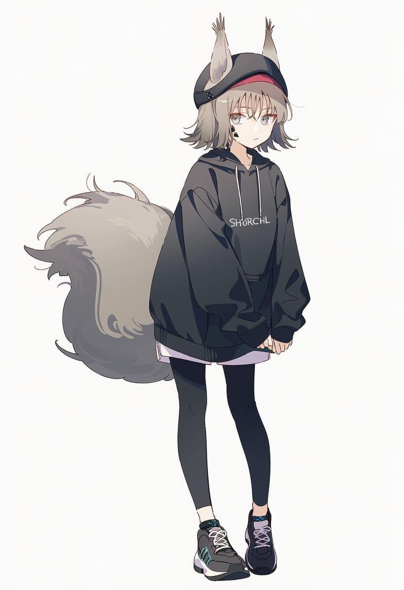

| 字段 | 内容 |
| --- | --- |
| Danbooru tag | leggings |
| 中文释义 | 紧身裤/打底裤 |
| 详细释义 | 贴腿的裤状腿部服饰，通常不包覆脚部；用于与 pantyhose、toeless_legwear 等区分。 |
| tag所属的子类 | 邻近腿部配饰 |

## 41. gaiters — 绑腿/雪套

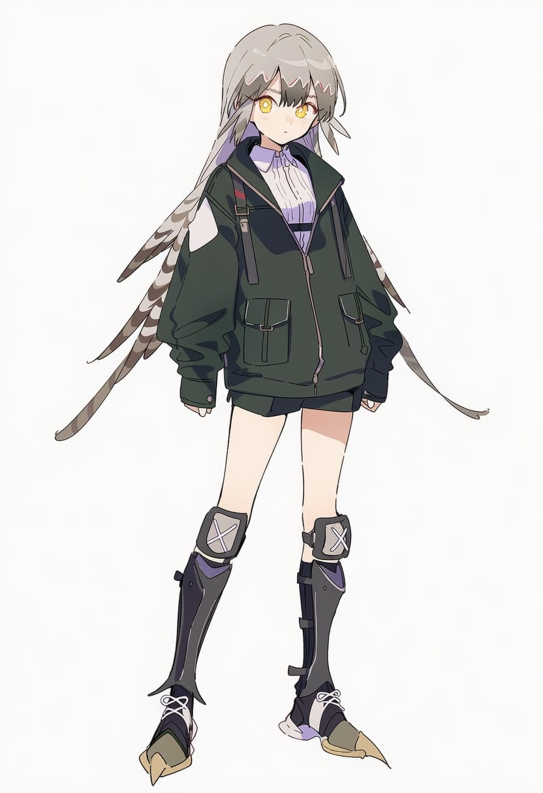

| 字段 | 内容 |
| --- | --- |
| Danbooru tag | gaiters |
| 中文释义 | 绑腿/雪套 |
| 详细释义 | 穿在鞋和裤腿外侧、用于阻挡雨雪泥沙的腿套，可从踝高到大腿高。 |
| tag所属的子类 | 邻近腿部配饰 |

## 42. zettai_ryouiki — 绝对领域

| 字段 | 内容 |
| --- | --- |
| Danbooru tag | zettai_ryouiki |
| 中文释义 | 绝对领域 |
| 详细释义 | 短裙/短裤下摆与 thighhighs 等长袜袜口之间露出的裸露大腿区域；是搭配构图 tag，不是袜子本体。 |
| tag所属的子类 | 邻近腿部配饰 |

## 43. thighhigh_gaiters — 大腿高绑腿/雪套

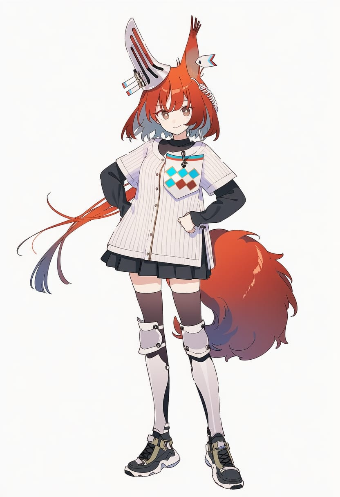

| 字段 | 内容 |
| --- | --- |
| Danbooru tag | thighhigh_gaiters |
| 中文释义 | 大腿高绑腿/雪套 |
| 详细释义 | 高度达到大腿的 gaiters；名称含 thighhigh，但本质是绑腿/鞋外腿套。 |
| tag所属的子类 | 邻近腿部配饰 |

## 44. legwear_garter — 袜用吊带/袜带

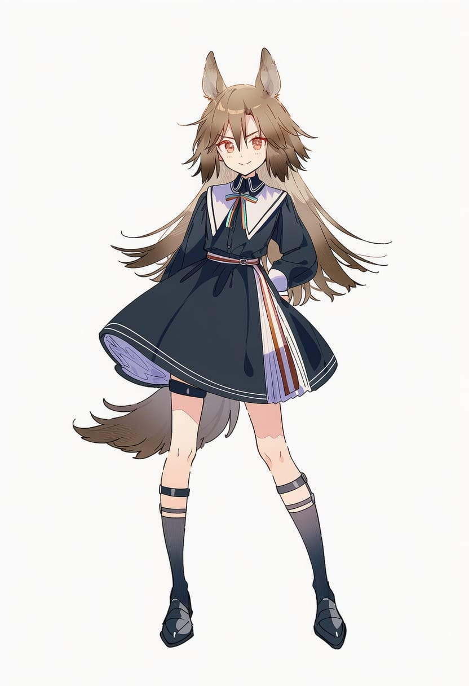

| 字段 | 内容 |
| --- | --- |
| Danbooru tag | legwear_garter |
| 中文释义 | 袜用吊带/袜带 |
| 详细释义 | 用于固定袜类的带状配件，通常直接连接或箍住腿部袜类。 |
| tag所属的子类 | 邻近腿部配饰 |

## 45. single_legwear_garter — 单侧袜带

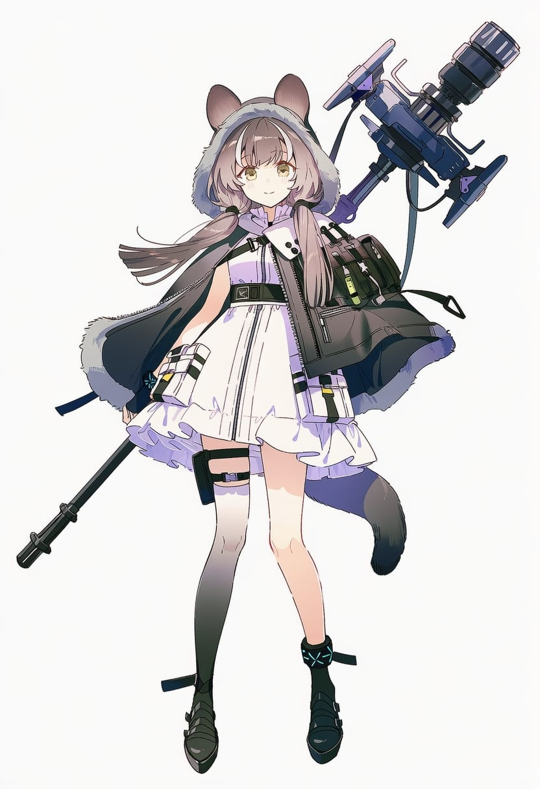

| 字段 | 内容 |
| --- | --- |
| Danbooru tag | single_legwear_garter |
| 中文释义 | 单侧袜带 |
| 详细释义 | 只在一条腿上使用的 legwear_garter。 |
| tag所属的子类 | 邻近腿部配饰 |

## 46. garter_straps — 吊袜带带条

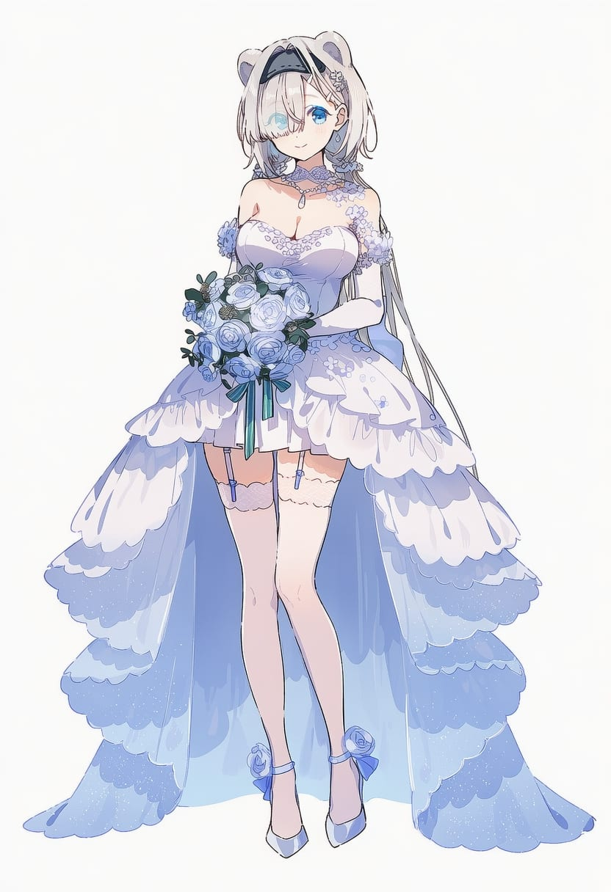

| 字段 | 内容 |
| --- | --- |
| Danbooru tag | garter_straps |
| 中文释义 | 吊袜带带条 |
| 详细释义 | 从吊袜带/腰带连接到长袜袜口的带条，用于固定 thighhighs 等。 |
| tag所属的子类 | 邻近腿部配饰 |

## 47. adjusting_legwear — 整理腿部穿戴物

| 字段 | 内容 |
| --- | --- |
| Danbooru tag | adjusting_legwear |
| 中文释义 | 整理腿部穿戴物 |
| 详细释义 | 用手调整袜口、袜筒、连裤袜或其他腿部穿戴物的位置。 |
| tag所属的子类 | 动作互动 |

## 48. holding_legwear — 手持腿部穿戴物

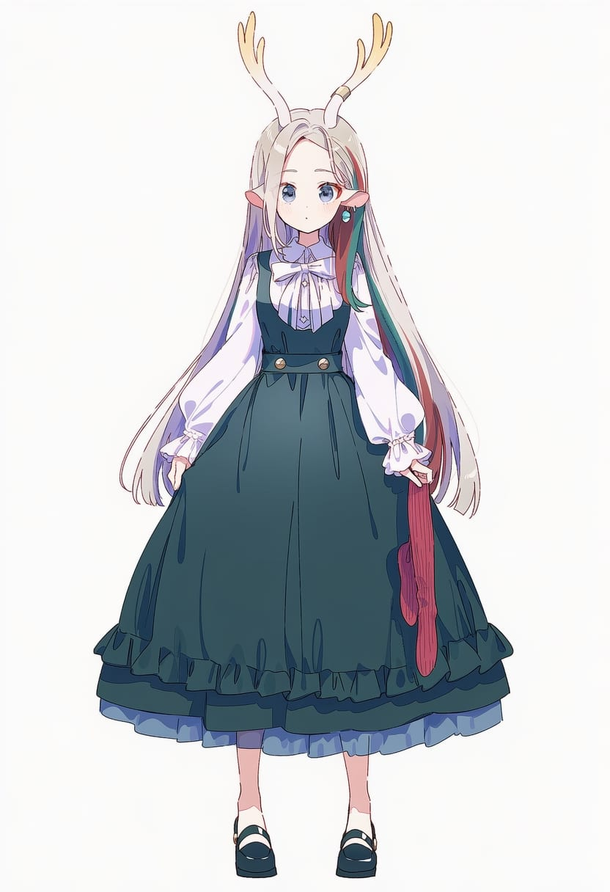

| 字段 | 内容 |
| --- | --- |
| Danbooru tag | holding_legwear |
| 中文释义 | 手持腿部穿戴物 |
| 详细释义 | 手里拿着已脱下或尚未穿上的袜类/腿部穿戴物。 |
| tag所属的子类 | 动作互动 |

## 49. holding_sock — 手持袜子

| 字段 | 内容 |
| --- | --- |
| Danbooru tag | holding_sock |
| 中文释义 | 手持袜子 |
| 详细释义 | 手中拿着一只或多只袜子。 |
| tag所属的子类 | 动作互动 |

## 50. putting_on_legwear — 正在穿腿部穿戴物

| 字段 | 内容 |
| --- | --- |
| Danbooru tag | putting_on_legwear |
| 中文释义 | 正在穿腿部穿戴物 |
| 详细释义 | 正在把袜子、长袜、连裤袜等穿到腿上。 |
| tag所属的子类 | 动作互动 |

## 51. pulling_off_legwear — 向下拉脱腿部穿戴物

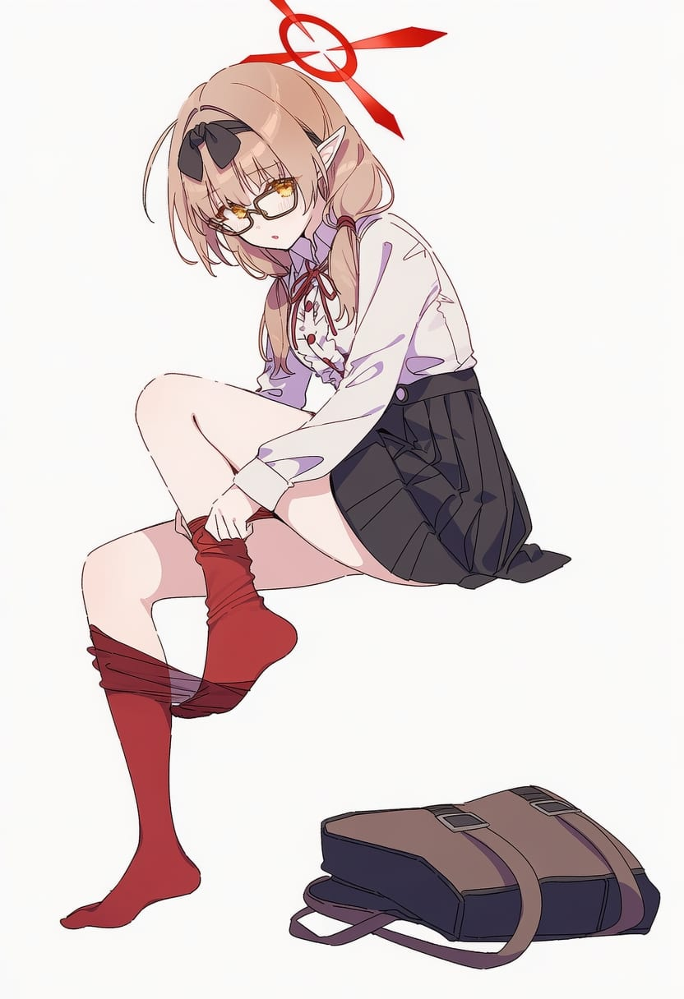

| 字段 | 内容 |
| --- | --- |
| Danbooru tag | pulling_off_legwear |
| 中文释义 | 向下拉脱腿部穿戴物 |
| 详细释义 | 正在把袜类向下拉以脱下。 |
| tag所属的子类 | 动作互动 |

## 52. removing_legwear — 脱腿部穿戴物

| 字段 | 内容 |
| --- | --- |
| Danbooru tag | removing_legwear |
| 中文释义 | 脱腿部穿戴物 |
| 详细释义 | 泛指正在脱袜子、长袜、连裤袜等。 |
| tag所属的子类 | 动作互动 |

## 53. removing_sock — 脱袜子

| 字段 | 内容 |
| --- | --- |
| Danbooru tag | removing_sock |
| 中文释义 | 脱袜子 |
| 详细释义 | 正在从脚上脱下一只袜子。 |
| tag所属的子类 | 动作互动 |

## 54. removing_thighhigh — 脱大腿袜

| 字段 | 内容 |
| --- | --- |
| Danbooru tag | removing_thighhigh |
| 中文释义 | 脱大腿袜 |
| 详细释义 | 正在从腿上脱下一只 thighhigh。 |
| tag所属的子类 | 动作互动 |

## 55. removing_pantyhose — 脱连裤袜

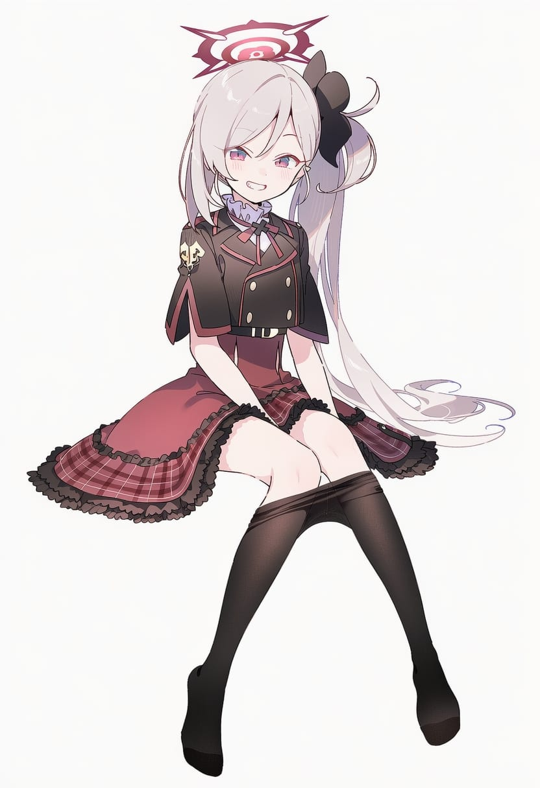

| 字段 | 内容 |
| --- | --- |
| Danbooru tag | removing_pantyhose |
| 中文释义 | 脱连裤袜 |
| 详细释义 | 正在脱下 pantyhose。 |
| tag所属的子类 | 动作互动 |

## 56. sock_pull — 拉袜子

| 字段 | 内容 |
| --- | --- |
| Danbooru tag | sock_pull |
| 中文释义 | 拉袜子 |
| 详细释义 | 用手拉扯袜口/袜筒，常见于往上提、往下拉或调整。 |
| tag所属的子类 | 动作互动 |

## 57. sock_dangle — 袜子半脱悬挂

| 字段 | 内容 |
| --- | --- |
| Danbooru tag | sock_dangle |
| 中文释义 | 袜子半脱悬挂 |
| 详细释义 | 袜子部分脱离脚部、松松挂在脚或脚趾附近，可能露出脚底/脚趾。 |
| tag所属的子类 | 动作互动 |

## 58. thighhighs_pull — 拉大腿袜

| 字段 | 内容 |
| --- | --- |
| Danbooru tag | thighhighs_pull |
| 中文释义 | 拉大腿袜 |
| 详细释义 | 用手拉扯或调整 thighhighs 的袜筒/袜口。 |
| tag所属的子类 | 动作互动 |

## 59. thighhigh_dangle — 大腿袜半脱悬挂

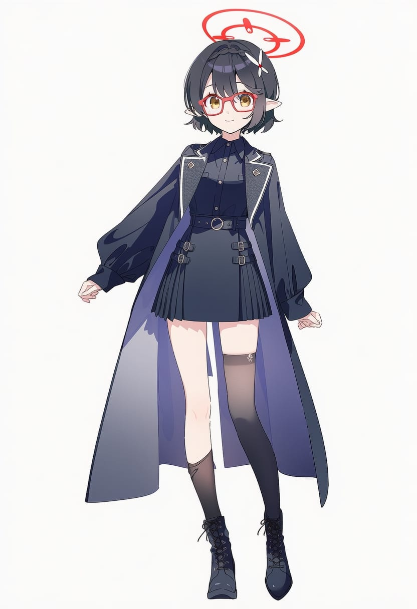

| 字段 | 内容 |
| --- | --- |
| Danbooru tag | thighhigh_dangle |
| 中文释义 | 大腿袜半脱悬挂 |
| 详细释义 | 一只或两只 thighhighs 大幅滑落，仍悬挂在腿/脚上。 |
| tag所属的子类 | 动作互动 |

## 60. pantyhose_pull — 拉连裤袜

| 字段 | 内容 |
| --- | --- |
| Danbooru tag | pantyhose_pull |
| 中文释义 | 拉连裤袜 |
| 详细释义 | 用手拉扯、提起或下拉 pantyhose。 |
| tag所属的子类 | 动作互动 |

## 61. pantyhose_on_head — 连裤袜套头

| 字段 | 内容 |
| --- | --- |
| Danbooru tag | pantyhose_on_head |
| 中文释义 | 连裤袜套头 |
| 详细释义 | 将 pantyhose 套在头部而非正常穿在腿上。 |
| tag所属的子类 | 动作互动 |

## 62. lace_pantyhose_hooked_on_heel_(meme) — 蕾丝连裤袜勾高跟鞋梗

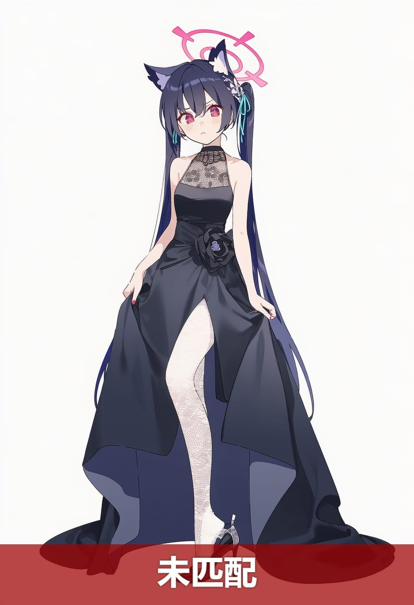

| 字段 | 内容 |
| --- | --- |
| Danbooru tag | lace_pantyhose_hooked_on_heel_(meme) |
| 中文释义 | 蕾丝连裤袜勾高跟鞋梗 |
| 详细释义 | 2025 年出现的图片重绘梗：高跟鞋鞋跟勾住蕾丝连裤袜；属于 meme tag，不是袜型属性。 |
| tag所属的子类 | 动作互动 |

## 63. mismatched_socks — 不配对袜子

| 字段 | 内容 |
| --- | --- |
| Danbooru tag | mismatched_socks |
| 中文释义 | 不配对袜子 |
| 详细释义 | 左右脚袜子的颜色、图案或设计不同；如果主要差异是长度，更适合 uneven_legwear。 |
| tag所属的子类 | 穿戴状态 |

## 64. mismatched_thighhighs — 不配对大腿袜

| 字段 | 内容 |
| --- | --- |
| Danbooru tag | mismatched_thighhighs |
| 中文释义 | 不配对大腿袜 |
| 详细释义 | 左右两只 thighhighs 在颜色、图案或设计上不同。 |
| tag所属的子类 | 穿戴状态 |

## 65. mismatched_legwear — 不配对腿部穿戴物

| 字段 | 内容 |
| --- | --- |
| Danbooru tag | mismatched_legwear |
| 中文释义 | 不配对腿部穿戴物 |
| 详细释义 | 左右腿的袜类/腿部穿戴物在颜色、图案或设计上不同。 |
| tag所属的子类 | 穿戴状态 |

## 66. asymmetrical_legwear — 不对称腿部穿戴

| 字段 | 内容 |
| --- | --- |
| Danbooru tag | asymmetrical_legwear |
| 中文释义 | 不对称腿部穿戴 |
| 详细释义 | 左右腿袜类在长度、颜色或设计上不对称的总括 tag；可再配合 uneven_legwear / mismatched_legwear 细分。 |
| tag所属的子类 | 穿戴状态 |

## 67. uneven_legwear — 长短不一的腿部穿戴

| 字段 | 内容 |
| --- | --- |
| Danbooru tag | uneven_legwear |
| 中文释义 | 长短不一的腿部穿戴 |
| 详细释义 | 左右腿所穿袜类主要在长度上不同，例如一边短袜、一边长袜。 |
| tag所属的子类 | 穿戴状态 |

## 68. single_sock — 单只袜

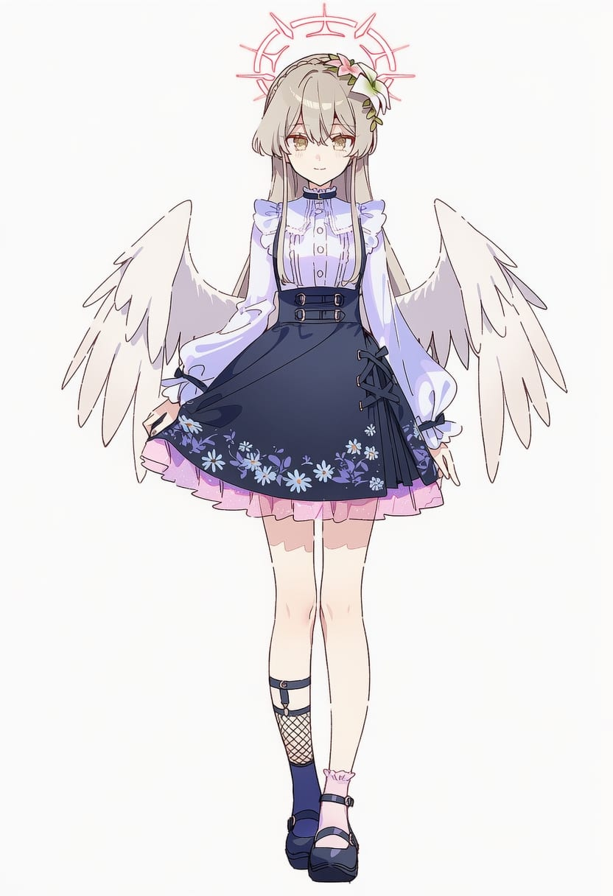

| 字段 | 内容 |
| --- | --- |
| Danbooru tag | single_sock |
| 中文释义 | 单只袜 |
| 详细释义 | 只在一只脚/腿上穿 socks，另一侧没有对应袜子。 |
| tag所属的子类 | 穿戴状态 |

## 69. single_kneehigh — 单只及膝袜

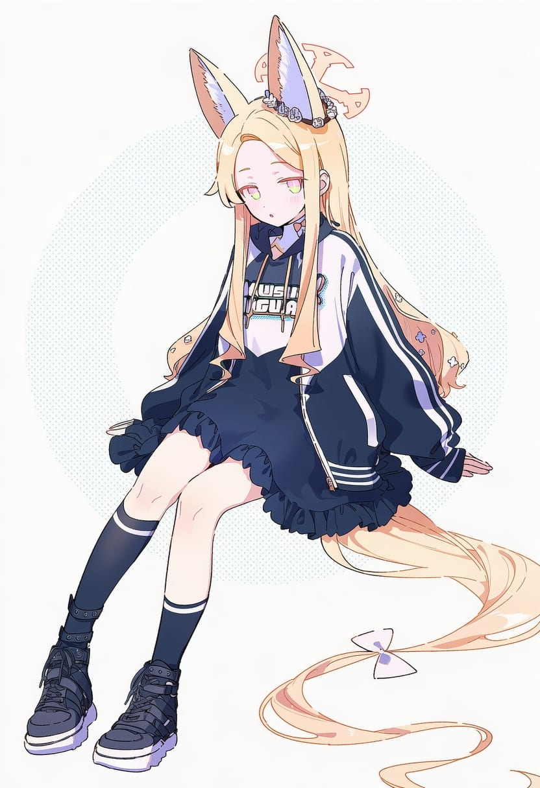

| 字段 | 内容 |
| --- | --- |
| Danbooru tag | single_kneehigh |
| 中文释义 | 单只及膝袜 |
| 详细释义 | 只穿一只 kneehigh，另一腿没有配对及膝袜。 |
| tag所属的子类 | 穿戴状态 |

## 70. single_over-kneehigh — 单只过膝袜

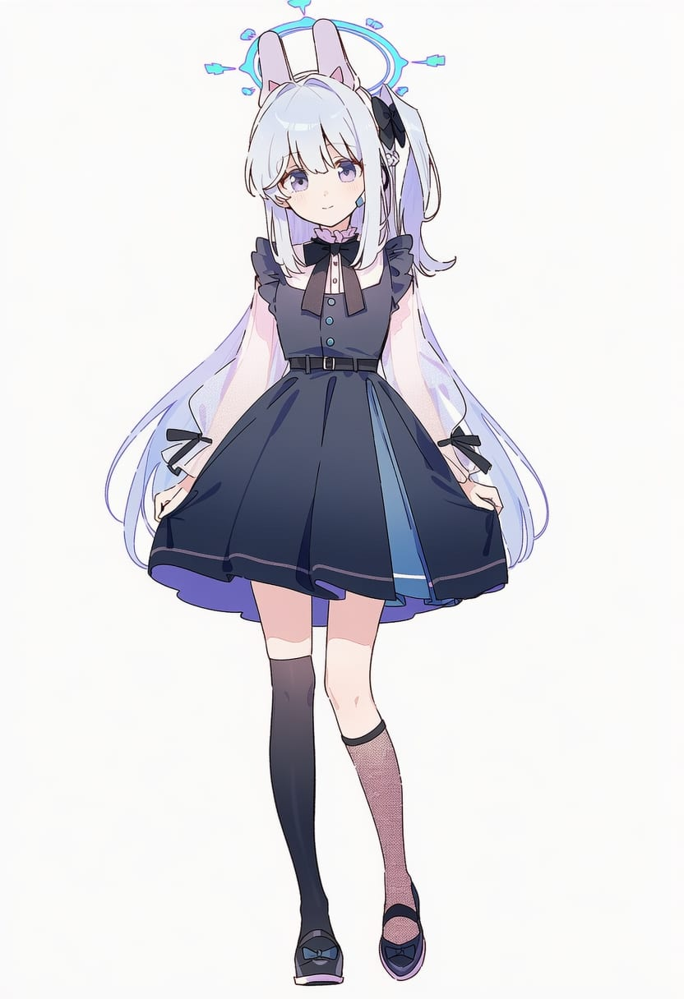

| 字段 | 内容 |
| --- | --- |
| Danbooru tag | single_over-kneehigh |
| 中文释义 | 单只过膝袜 |
| 详细释义 | 只穿一只 over-kneehigh。 |
| tag所属的子类 | 穿戴状态 |

## 71. single_thighhigh — 单只大腿袜

| 字段 | 内容 |
| --- | --- |
| Danbooru tag | single_thighhigh |
| 中文释义 | 单只大腿袜 |
| 详细释义 | 只穿一只 thighhigh，另一腿裸露或穿其他腿部服饰。 |
| tag所属的子类 | 穿戴状态 |

## 72. single_hiphigh — 单只胯高袜

| 字段 | 内容 |
| --- | --- |
| Danbooru tag | single_hiphigh |
| 中文释义 | 单只胯高袜 |
| 详细释义 | 只穿一只 hiphigh；覆盖范围与 single_leg_pantyhose 不同。 |
| tag所属的子类 | 穿戴状态 |

## 73. single_leg_pantyhose — 单腿连裤袜

| 字段 | 内容 |
| --- | --- |
| Danbooru tag | single_leg_pantyhose |
| 中文释义 | 单腿连裤袜 |
| 详细释义 | 只覆盖一条腿的连裤袜式设计，另一腿裸露或穿其他腿部服饰。 |
| tag所属的子类 | 穿戴状态 |

## 74. single_fishnet_legwear — 单腿渔网袜类

| 字段 | 内容 |
| --- | --- |
| Danbooru tag | single_fishnet_legwear |
| 中文释义 | 单腿渔网袜类 |
| 详细释义 | 只在一条腿上穿 fishnet 类型腿部服饰，可是渔网袜或渔网大腿袜。 |
| tag所属的子类 | 穿戴状态 |

## 75. unworn_socks — 脱下/未穿的袜子

| 字段 | 内容 |
| --- | --- |
| Danbooru tag | unworn_socks |
| 中文释义 | 脱下/未穿的袜子 |
| 详细释义 | 袜子出现在画面中但没有穿在脚上。 |
| tag所属的子类 | 穿戴状态 |

## 76. unworn_kneehighs — 脱下/未穿的及膝袜

| 字段 | 内容 |
| --- | --- |
| Danbooru tag | unworn_kneehighs |
| 中文释义 | 脱下/未穿的及膝袜 |
| 详细释义 | kneehighs 出现在画面中但未穿着。 |
| tag所属的子类 | 穿戴状态 |

## 77. unworn_thighhighs — 脱下/未穿的大腿袜

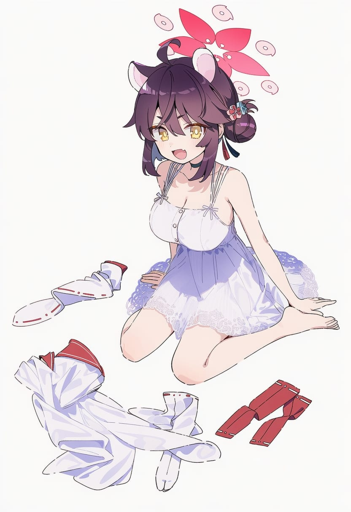

| 字段 | 内容 |
| --- | --- |
| Danbooru tag | unworn_thighhighs |
| 中文释义 | 脱下/未穿的大腿袜 |
| 详细释义 | thighhighs 出现在画面中但未穿着。 |
| tag所属的子类 | 穿戴状态 |

## 78. unworn_hiphighs — 脱下/未穿的胯高袜

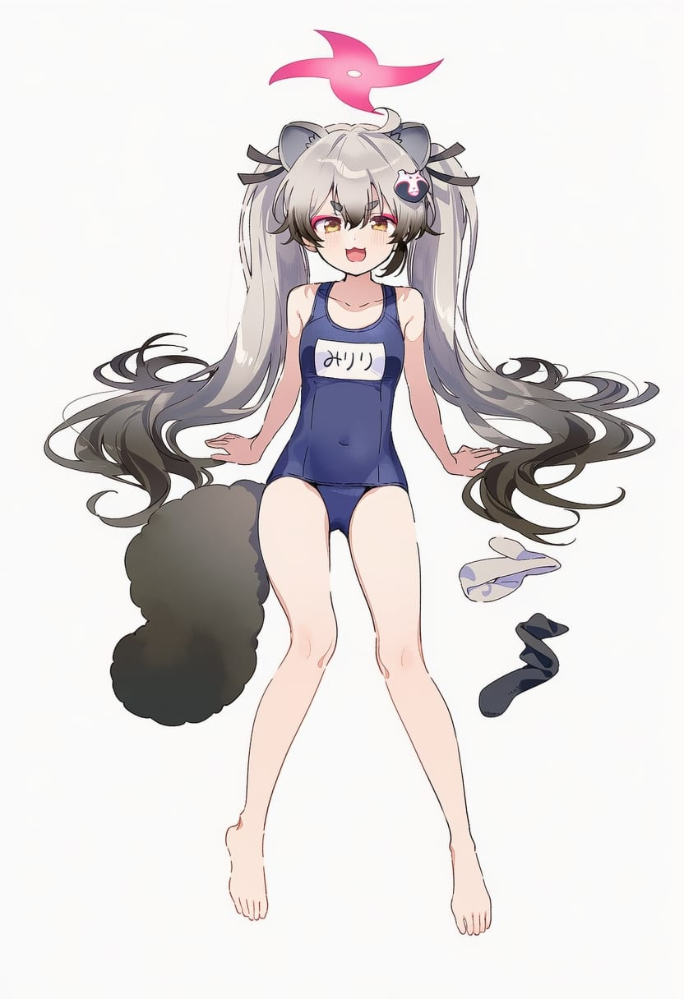

| 字段 | 内容 |
| --- | --- |
| Danbooru tag | unworn_hiphighs |
| 中文释义 | 脱下/未穿的胯高袜 |
| 详细释义 | hiphighs 出现在画面中但未穿着。 |
| tag所属的子类 | 穿戴状态 |

## 79. unworn_pantyhose — 脱下/未穿的连裤袜

| 字段 | 内容 |
| --- | --- |
| Danbooru tag | unworn_pantyhose |
| 中文释义 | 脱下/未穿的连裤袜 |
| 详细释义 | pantyhose 出现在画面中但未穿着。 |
| tag所属的子类 | 穿戴状态 |

## 80. wet_socks — 湿袜子

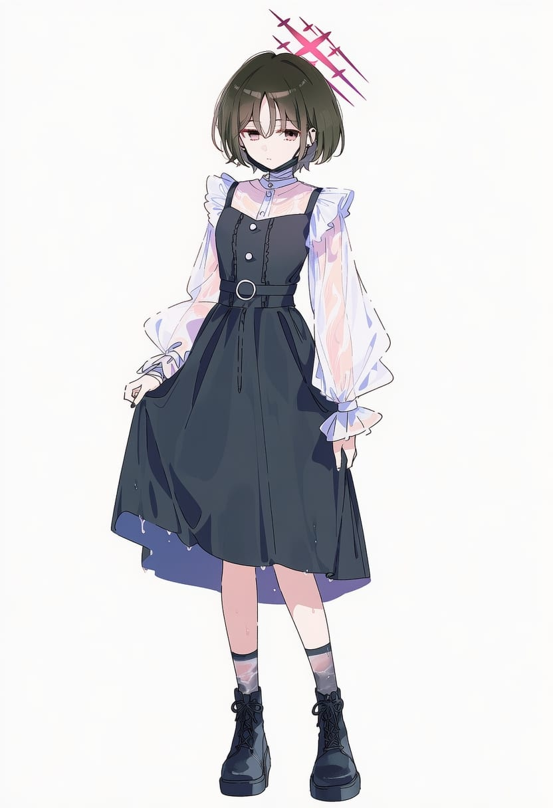

| 字段 | 内容 |
| --- | --- |
| Danbooru tag | wet_socks |
| 中文释义 | 湿袜子 |
| 详细释义 | 被水或其他液体浸湿、明显呈湿润状态的袜子。 |
| tag所属的子类 | 穿戴状态 |

## 81. wet_thighhighs — 湿大腿袜

| 字段 | 内容 |
| --- | --- |
| Danbooru tag | wet_thighhighs |
| 中文释义 | 湿大腿袜 |
| 详细释义 | 明显被水或其他液体打湿的 thighhighs。 |
| tag所属的子类 | 穿戴状态 |

## 82. wet_pantyhose — 湿连裤袜

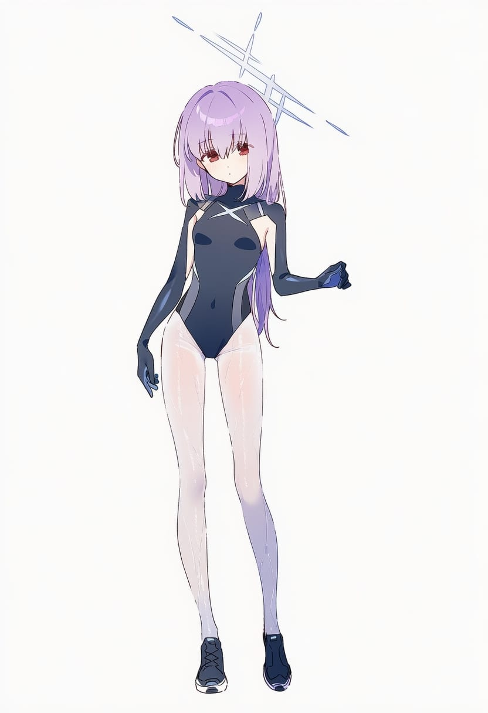

| 字段 | 内容 |
| --- | --- |
| Danbooru tag | wet_pantyhose |
| 中文释义 | 湿连裤袜 |
| 详细释义 | 明显被水或其他液体打湿的 pantyhose。 |
| tag所属的子类 | 穿戴状态 |

## 83. alternate_legwear — 替换版腿部穿戴

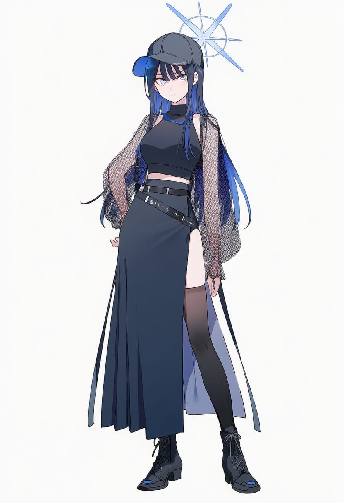

| 字段 | 内容 |
| --- | --- |
| Danbooru tag | alternate_legwear |
| 中文释义 | 替换版腿部穿戴 |
| 详细释义 | 角色在替换服装/设计中使用了不同于通常设定的袜类或腿部服饰。 |
| tag所属的子类 | 穿戴状态 |

## 84. missing_legwear — 缺失腿部穿戴

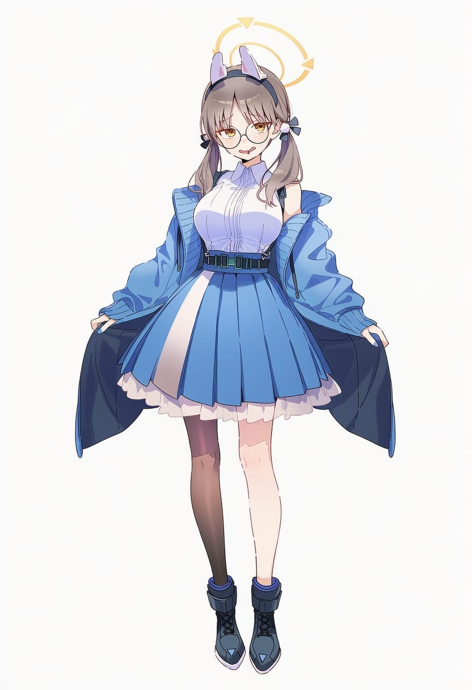

| 字段 | 内容 |
| --- | --- |
| Danbooru tag | missing_legwear |
| 中文释义 | 缺失腿部穿戴 |
| 详细释义 | 角色通常应穿某种袜类/腿部服饰，但当前画面中缺失。 |
| tag所属的子类 | 穿戴状态 |

## 85. layered_legwear — 叠穿腿部服饰

| 字段 | 内容 |
| --- | --- |
| Danbooru tag | layered_legwear |
| 中文释义 | 叠穿腿部服饰 |
| 详细释义 | 同一条腿上叠穿两层或更多袜类/腿部穿戴物。 |
| tag所属的子类 | 穿戴状态 |

## 86. dirty_legwear — 脏污腿部穿戴

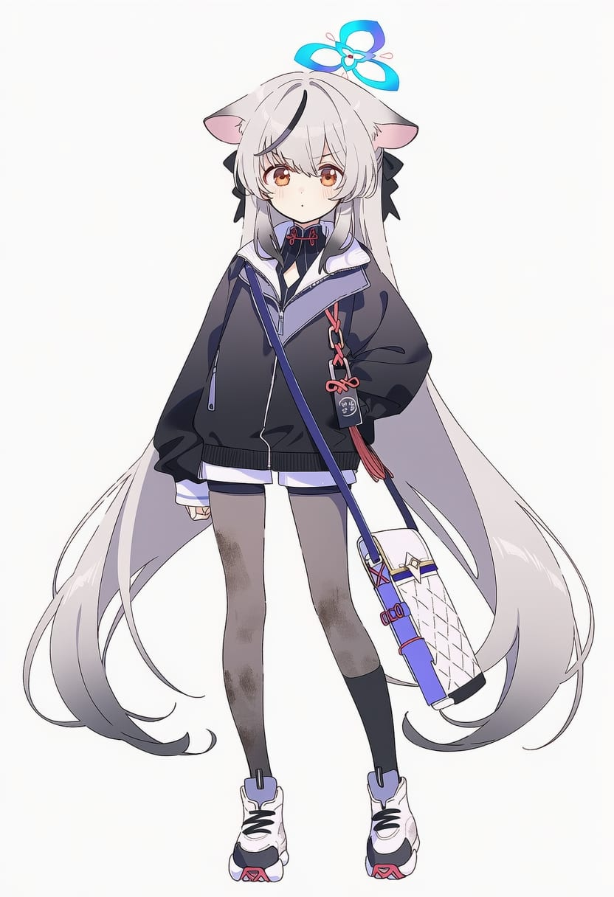

| 字段 | 内容 |
| --- | --- |
| Danbooru tag | dirty_legwear |
| 中文释义 | 脏污腿部穿戴 |
| 详细释义 | 袜类/腿部穿戴物明显沾有泥土、灰尘等污渍。 |
| tag所属的子类 | 穿戴状态 |

## 87. socks_over_pantyhose — 袜子套在连裤袜外

| 字段 | 内容 |
| --- | --- |
| Danbooru tag | socks_over_pantyhose |
| 中文释义 | 袜子套在连裤袜外 |
| 详细释义 | 普通袜子穿在 pantyhose 外层。 |
| tag所属的子类 | 穿戴状态 |

## 88. socks_over_thighhighs — 袜子套在大腿袜外

| 字段 | 内容 |
| --- | --- |
| Danbooru tag | socks_over_thighhighs |
| 中文释义 | 袜子套在大腿袜外 |
| 详细释义 | 普通袜子穿在 thighhighs 外层。 |
| tag所属的子类 | 穿戴状态 |

## 89. thighhighs_over_pantyhose — 大腿袜套在连裤袜外

| 字段 | 内容 |
| --- | --- |
| Danbooru tag | thighhighs_over_pantyhose |
| 中文释义 | 大腿袜套在连裤袜外 |
| 详细释义 | thighhighs 穿在 pantyhose 外层。 |
| tag所属的子类 | 穿戴状态 |

## 90. thighhighs_under_pantyhose — 大腿袜穿在连裤袜内

| 字段 | 内容 |
| --- | --- |
| Danbooru tag | thighhighs_under_pantyhose |
| 中文释义 | 大腿袜穿在连裤袜内 |
| 详细释义 | thighhighs 位于 pantyhose 下层；与 thighhighs_over_pantyhose 相反。 |
| tag所属的子类 | 穿戴状态 |

## 91. thighhighs_over_hiphighs — 大腿袜套在胯高袜外

| 字段 | 内容 |
| --- | --- |
| Danbooru tag | thighhighs_over_hiphighs |
| 中文释义 | 大腿袜套在胯高袜外 |
| 详细释义 | thighhighs 与 hiphighs 叠穿，且 thighhighs 位于外层。 |
| tag所属的子类 | 穿戴状态 |

## 92. thighhighs_under_boots — 靴子内的大腿袜

| 字段 | 内容 |
| --- | --- |
| Danbooru tag | thighhighs_under_boots |
| 中文释义 | 靴子内的大腿袜 |
| 详细释义 | thighhighs 的一部分被长靴覆盖，袜子穿在靴子里面。 |
| tag所属的子类 | 穿戴状态 |

## 93. pantyhose_under_shorts — 短裤下的连裤袜

| 字段 | 内容 |
| --- | --- |
| Danbooru tag | pantyhose_under_shorts |
| 中文释义 | 短裤下的连裤袜 |
| 详细释义 | 在 shorts 内/下层穿 pantyhose。 |
| tag所属的子类 | 穿戴状态 |

## 94. pantyhose_under_swimsuit — 泳装下的连裤袜

| 字段 | 内容 |
| --- | --- |
| Danbooru tag | pantyhose_under_swimsuit |
| 中文释义 | 泳装下的连裤袜 |
| 详细释义 | 在 swimsuit 下层穿 pantyhose。 |
| tag所属的子类 | 穿戴状态 |

## 95. panties_under_pantyhose — 连裤袜内穿内裤

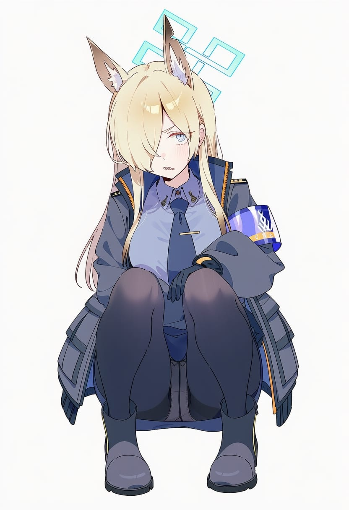

| 字段 | 内容 |
| --- | --- |
| Danbooru tag | panties_under_pantyhose |
| 中文释义 | 连裤袜内穿内裤 |
| 详细释义 | panties 穿在 pantyhose 内层。 |
| tag所属的子类 | 穿戴状态 |

## 96. panties_over_pantyhose — 内裤套在连裤袜外

| 字段 | 内容 |
| --- | --- |
| Danbooru tag | panties_over_pantyhose |
| 中文释义 | 内裤套在连裤袜外 |
| 详细释义 | panties 穿在 pantyhose 外层。 |
| tag所属的子类 | 穿戴状态 |

## 97. pantyhose_around_one_leg — 连裤袜只挂在一条腿上

| 字段 | 内容 |
| --- | --- |
| Danbooru tag | pantyhose_around_one_leg |
| 中文释义 | 连裤袜只挂在一条腿上 |
| 详细释义 | 连裤袜部分脱下，仍套/挂在其中一条腿上。 |
| tag所属的子类 | 穿戴状态 |

## 98. pantyhose_only — 只穿连裤袜

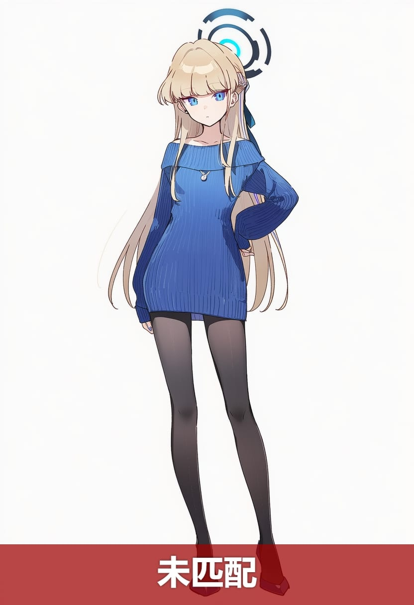

| 字段 | 内容 |
| --- | --- |
| Danbooru tag | pantyhose_only |
| 中文释义 | 只穿连裤袜 |
| 详细释义 | 角色除内裤外仅穿 pantyhose，用于强调服装几乎只剩连裤袜。 |
| tag所属的子类 | 穿戴状态 |

## 99. frilled_socks — 褶边袜子

| 字段 | 内容 |
| --- | --- |
| Danbooru tag | frilled_socks |
| 中文释义 | 褶边袜子 |
| 详细释义 | 袜子袜口或边缘带荷叶边/褶饰；用于描述本体的材质、结构或装饰。 |
| tag所属的子类 | 材质款式 |

## 100. non-slip_socks — 防滑袜子

| 字段 | 内容 |
| --- | --- |
| Danbooru tag | non-slip_socks |
| 中文释义 | 防滑袜子 |
| 详细释义 | 袜子袜底带橡胶/塑料防滑颗粒、胶点或防滑纹；用于描述本体的材质、结构或装饰。 |
| tag所属的子类 | 材质款式 |

## 101. toeless_socks — 露趾袜

| 字段 | 内容 |
| --- | --- |
| Danbooru tag | toeless_socks |
| 中文释义 | 露趾袜 |
| 详细释义 | 袜体覆盖脚部但脚趾露出；也可参考更通用的 toeless_legwear。 |
| tag所属的子类 | 材质款式 |

## 102. torn_socks — 破损袜子

| 字段 | 内容 |
| --- | --- |
| Danbooru tag | torn_socks |
| 中文释义 | 破损袜子 |
| 详细释义 | 袜子出现破洞、撕裂或明显损坏；用于描述本体的材质、结构或装饰。 |
| tag所属的子类 | 材质款式 |

## 103. loose_thighhigh — 宽松大腿袜

| 字段 | 内容 |
| --- | --- |
| Danbooru tag | loose_thighhigh |
| 中文释义 | 宽松大腿袜 |
| 详细释义 | 袜筒明显宽松、不贴腿的单只/款式化 thighhigh；与 loose_socks 的短袜体系区分。 |
| tag所属的子类 | 材质款式 |

## 104. backless_pantyhose — 后部开口连裤袜

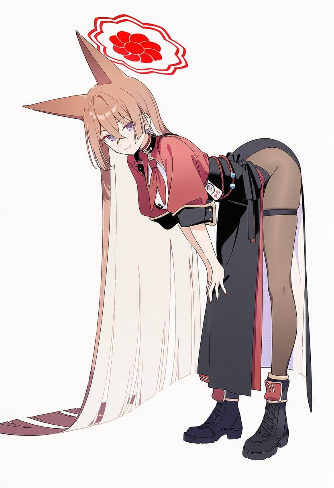

| 字段 | 内容 |
| --- | --- |
| Danbooru tag | backless_pantyhose |
| 中文释义 | 后部开口连裤袜 |
| 详细释义 | pantyhose 后侧/臀部区域具有明显开口的款式。 |
| tag所属的子类 | 材质款式 |

## 105. crotchless_pantyhose — 开裆连裤袜

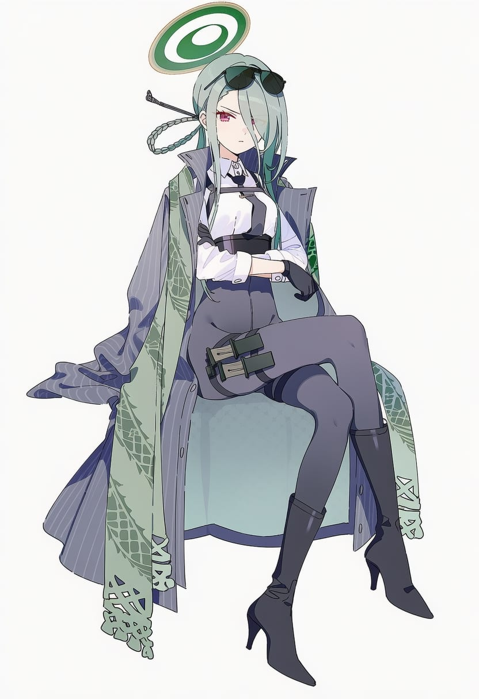

| 字段 | 内容 |
| --- | --- |
| Danbooru tag | crotchless_pantyhose |
| 中文释义 | 开裆连裤袜 |
| 详细释义 | 裆部留有开口的 pantyhose。 |
| tag所属的子类 | 材质款式 |

## 106. thighband_pantyhose — 大腿加深带连裤袜

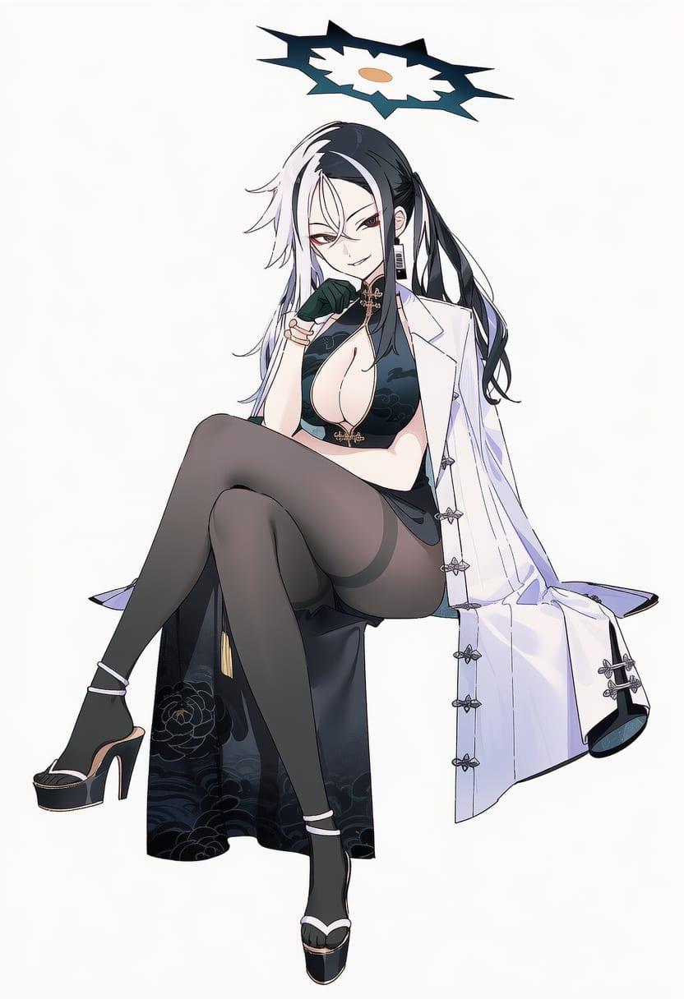

| 字段 | 内容 |
| --- | --- |
| Danbooru tag | thighband_pantyhose |
| 中文释义 | 大腿加深带连裤袜 |
| 详细释义 | 连裤袜大腿处有明显较深色带状区域（run guard），视觉上像大腿袜袜口。 |
| tag所属的子类 | 材质款式 |

## 107. high-waist_pantyhose — 高腰连裤袜

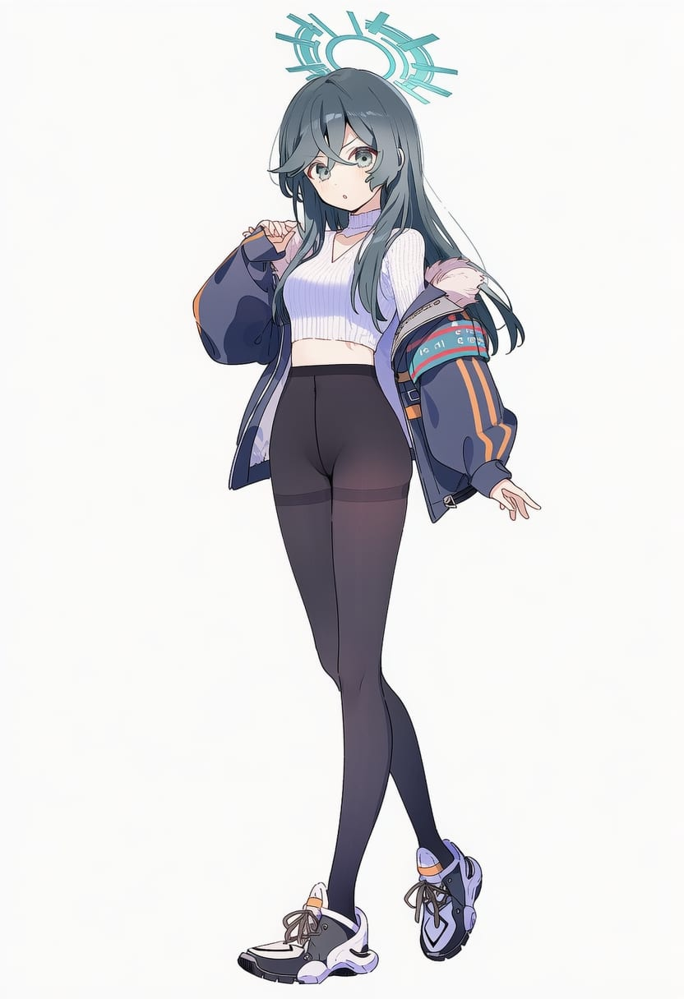

| 字段 | 内容 |
| --- | --- |
| Danbooru tag | high-waist_pantyhose |
| 中文释义 | 高腰连裤袜 |
| 详细释义 | 腰线上提、覆盖腹部较高位置的 pantyhose。 |
| tag所属的子类 | 材质款式 |

## 108. laddered_pantyhose — 抽丝/跑线连裤袜

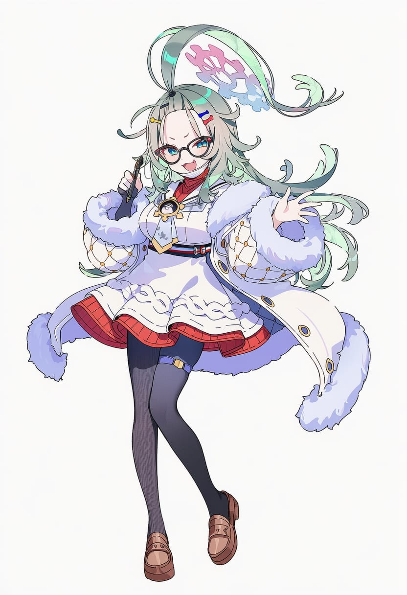

| 字段 | 内容 |
| --- | --- |
| Danbooru tag | laddered_pantyhose |
| 中文释义 | 抽丝/跑线连裤袜 |
| 详细释义 | 连裤袜出现梯状延伸的破洞或跑线（fabric run），是特定类型的破损状态。 |
| tag所属的子类 | 材质款式 |

## 109. lowleg_pantyhose — 低臀覆盖连裤袜

| 字段 | 内容 |
| --- | --- |
| Danbooru tag | lowleg_pantyhose |
| 中文释义 | 低臀覆盖连裤袜 |
| 详细释义 | 连裤袜上部没有完全覆盖臀部的款式；Danbooru 的特定设计 tag。 |
| tag所属的子类 | 材质款式 |

## 110. thighband_hiphighs — 大腿带胯高袜

| 字段 | 内容 |
| --- | --- |
| Danbooru tag | thighband_hiphighs |
| 中文释义 | 大腿带胯高袜 |
| 详细释义 | hiphighs 在大腿位置带有明显带状、束带式或加深色区域的款式。 |
| tag所属的子类 | 材质款式 |

## 111. fur_leg_warmers — 毛绒暖腿套

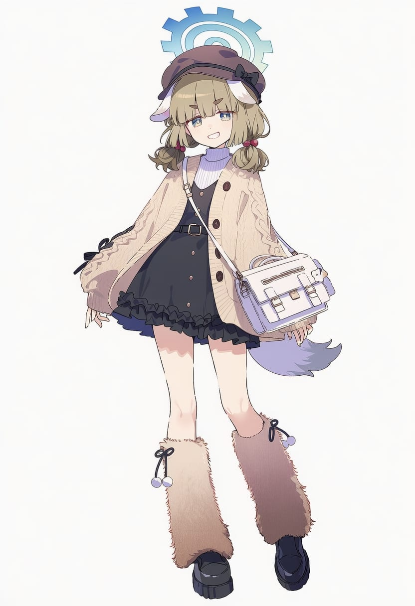

| 字段 | 内容 |
| --- | --- |
| Danbooru tag | fur_leg_warmers |
| 中文释义 | 毛绒暖腿套 |
| 详细释义 | 整体以毛绒/毛皮质感为主要特征的 leg_warmers。 |
| tag所属的子类 | 材质款式 |

## 112. fishnet_legwear — 渔网腿部穿戴物

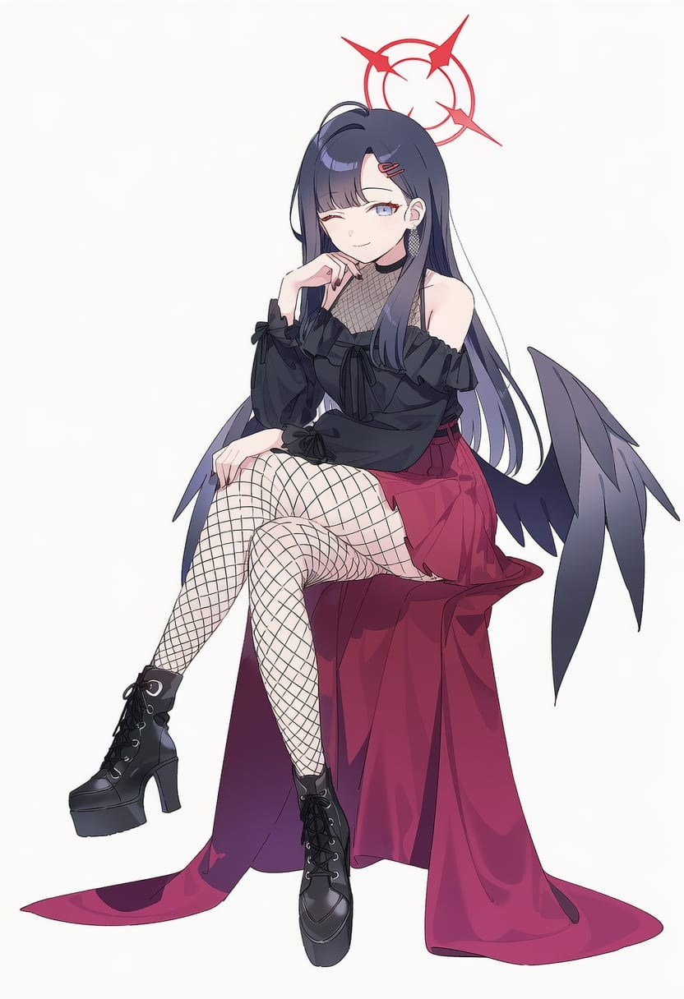

| 字段 | 内容 |
| --- | --- |
| Danbooru tag | fishnet_legwear |
| 中文释义 | 渔网腿部穿戴物 |
| 详细释义 | 通用渔网袜类 tag；无法或无需细分为 socks / thighhighs / pantyhose 时可使用。 |
| tag所属的子类 | 材质款式 |

## 113. lace_legwear — 蕾丝腿部穿戴物

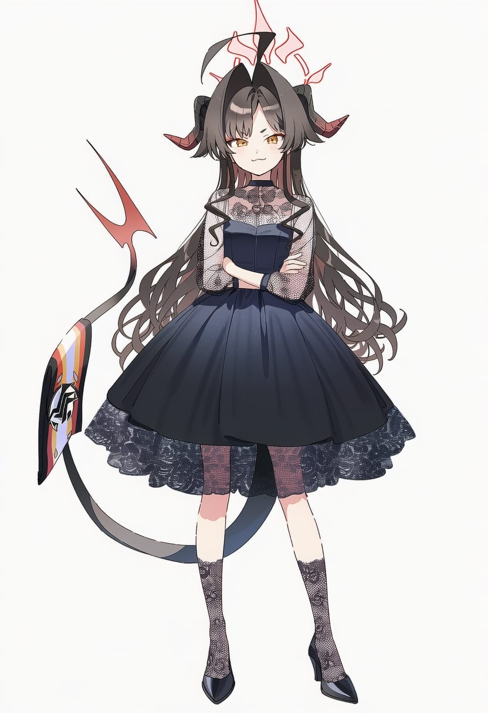

| 字段 | 内容 |
| --- | --- |
| Danbooru tag | lace_legwear |
| 中文释义 | 蕾丝腿部穿戴物 |
| 详细释义 | 腿部穿戴物主体由蕾丝材质或明显蕾丝纹理构成；用于描述本体的材质、结构或装饰。 |
| tag所属的子类 | 材质款式 |

## 114. lace-trimmed_legwear — 蕾丝边腿部穿戴物

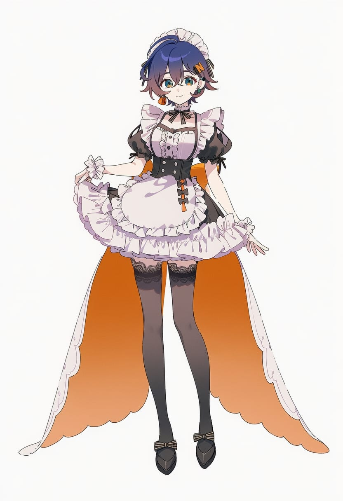

| 字段 | 内容 |
| --- | --- |
| Danbooru tag | lace-trimmed_legwear |
| 中文释义 | 蕾丝边腿部穿戴物 |
| 详细释义 | 腿部穿戴物边缘或袜口带蕾丝装饰；用于描述本体的材质、结构或装饰。 |
| tag所属的子类 | 材质款式 |

## 115. lace-up_legwear — 系带腿部穿戴物

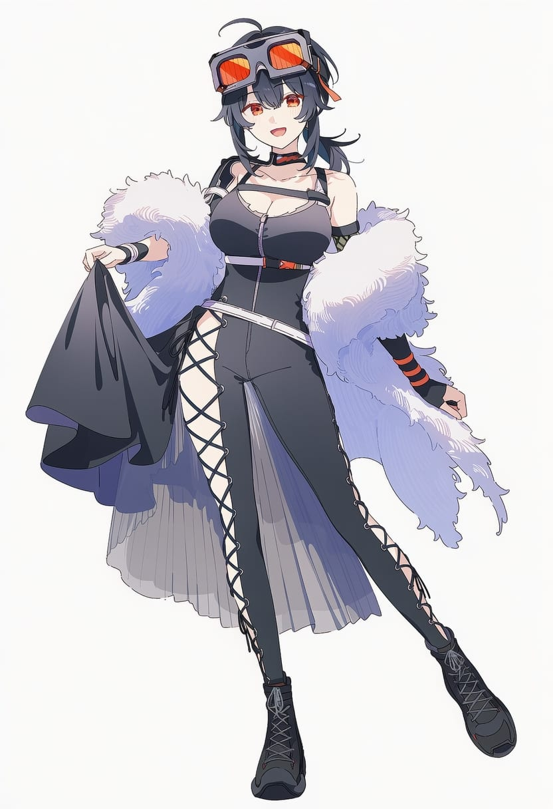

| 字段 | 内容 |
| --- | --- |
| Danbooru tag | lace-up_legwear |
| 中文释义 | 系带腿部穿戴物 |
| 详细释义 | 腿部穿戴物带可见的穿孔、绑带或交叉系带结构；用于描述本体的材质、结构或装饰。 |
| tag所属的子类 | 材质款式 |

## 116. latex_legwear — 乳胶腿部穿戴物

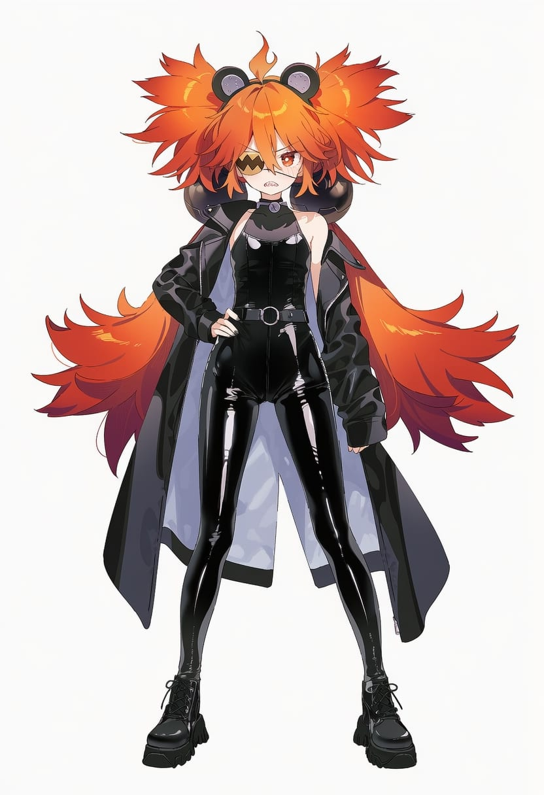

| 字段 | 内容 |
| --- | --- |
| Danbooru tag | latex_legwear |
| 中文释义 | 乳胶腿部穿戴物 |
| 详细释义 | 腿部穿戴物由乳胶或具有明显乳胶质感的材料构成；用于描述本体的材质、结构或装饰。 |
| tag所属的子类 | 材质款式 |

## 117. ribbed_legwear — 罗纹腿部穿戴物

| 字段 | 内容 |
| --- | --- |
| Danbooru tag | ribbed_legwear |
| 中文释义 | 罗纹腿部穿戴物 |
| 详细释义 | 腿部穿戴物织物表面有明显纵向罗纹；不要仅凭纵线外观与 vertical-striped 混淆；用于描述本体的材质、结构或装饰。 |
| tag所属的子类 | 材质款式 |

## 118. knit_legwear — 针织腿部穿戴物

| 字段 | 内容 |
| --- | --- |
| Danbooru tag | knit_legwear |
| 中文释义 | 针织腿部穿戴物 |
| 详细释义 | 腿部穿戴物具有明显针织材质或织法；用于描述本体的材质、结构或装饰。 |
| tag所属的子类 | 材质款式 |

## 119. aran_legwear — 阿兰针织纹腿部穿戴物

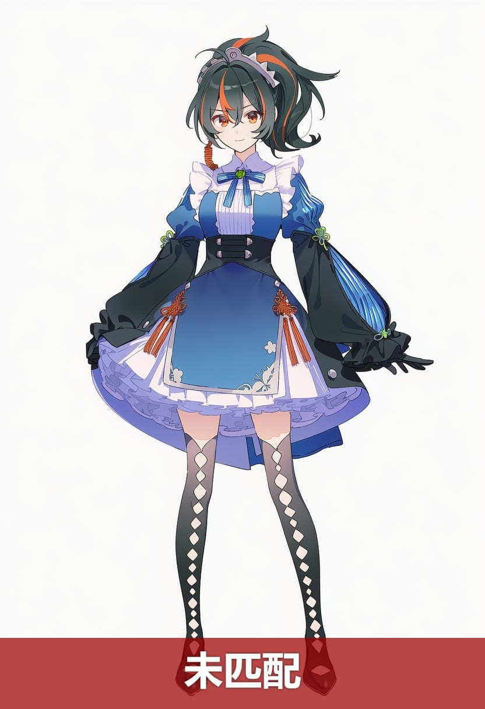

| 字段 | 内容 |
| --- | --- |
| Danbooru tag | aran_legwear |
| 中文释义 | 阿兰针织纹腿部穿戴物 |
| 详细释义 | 腿部穿戴物具有阿兰毛衣式绞花针织纹理；用于描述本体的材质、结构或装饰。 |
| tag所属的子类 | 材质款式 |

## 120. armored_legwear — 装甲腿部穿戴物

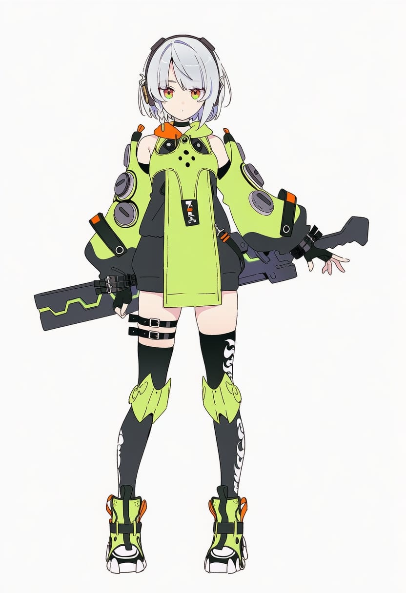

| 字段 | 内容 |
| --- | --- |
| Danbooru tag | armored_legwear |
| 中文释义 | 装甲腿部穿戴物 |
| 详细释义 | 腿部穿戴物呈硬质护甲/装甲式设计；用于描述本体的材质、结构或装饰。 |
| tag所属的子类 | 材质款式 |

## 121. bow_legwear — 蝴蝶结袜类

| 字段 | 内容 |
| --- | --- |
| Danbooru tag | bow_legwear |
| 中文释义 | 蝴蝶结袜类 |
| 详细释义 | 腿部袜类上带蝴蝶结装饰；多个旧的 bow_socks / bow_thighhighs 等名称归并到这里。 |
| tag所属的子类 | 材质款式 |

## 122. cross-laced_legwear — 交叉系带腿部穿戴物

| 字段 | 内容 |
| --- | --- |
| Danbooru tag | cross-laced_legwear |
| 中文释义 | 交叉系带腿部穿戴物 |
| 详细释义 | 腿部穿戴物表面有交叉穿绳/绑带结构；用于描述本体的材质、结构或装饰。 |
| tag所属的子类 | 材质款式 |

## 123. fluffy_legwear — 毛绒腿部穿戴物

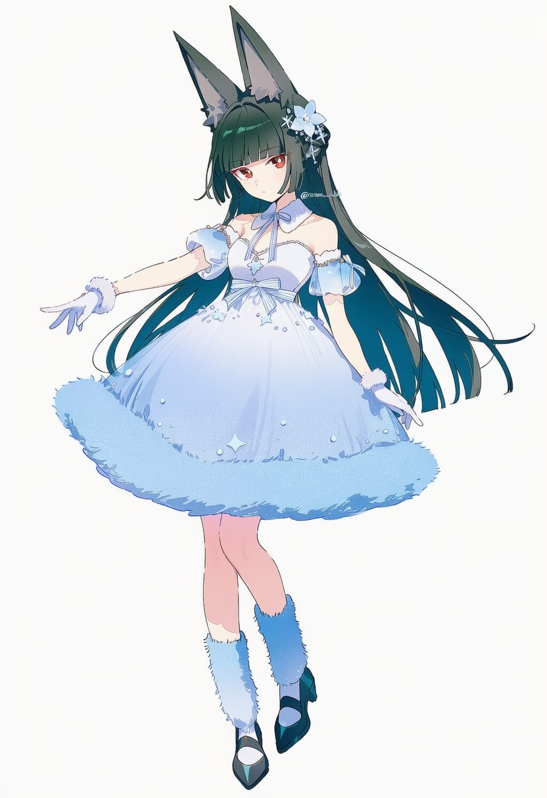

| 字段 | 内容 |
| --- | --- |
| Danbooru tag | fluffy_legwear |
| 中文释义 | 毛绒腿部穿戴物 |
| 详细释义 | 腿部穿戴物材质蓬松、毛绒感明显；用于描述本体的材质、结构或装饰。 |
| tag所属的子类 | 材质款式 |

## 124. legwear_bell — 铃铛袜类

| 字段 | 内容 |
| --- | --- |
| Danbooru tag | legwear_bell |
| 中文释义 | 铃铛袜类 |
| 详细释义 | 袜类或腿部穿戴物上装有铃铛。 |
| tag所属的子类 | 材质款式 |

## 125. o-ring_legwear — O形环腿部穿戴物

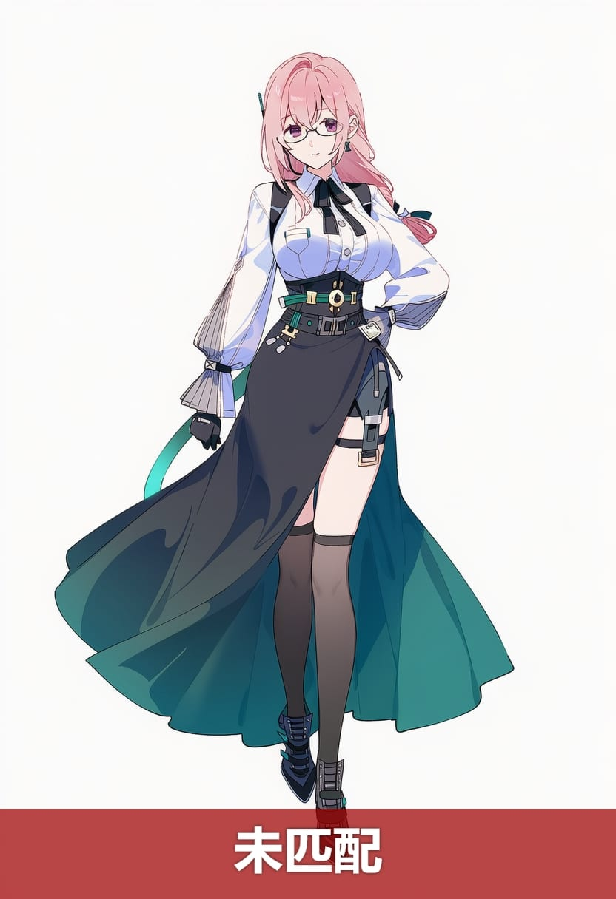

| 字段 | 内容 |
| --- | --- |
| Danbooru tag | o-ring_legwear |
| 中文释义 | O形环腿部穿戴物 |
| 详细释义 | 腿部穿戴物带金属或装饰性 O 形环；用于描述本体的材质、结构或装饰。 |
| tag所属的子类 | 材质款式 |

## 126. seamed_legwear — 有缝线袜类

| 字段 | 内容 |
| --- | --- |
| Danbooru tag | seamed_legwear |
| 中文释义 | 有缝线袜类 |
| 详细释义 | 袜类上有明显接缝；可进一步细分 back-seamed、front-seamed、side-seamed。 |
| tag所属的子类 | 材质款式 |

## 127. back-seamed_legwear — 后缝腿部穿戴物

| 字段 | 内容 |
| --- | --- |
| Danbooru tag | back-seamed_legwear |
| 中文释义 | 后缝腿部穿戴物 |
| 详细释义 | 腿部穿戴物腿后侧有纵向接缝；用于描述本体的材质、结构或装饰。 |
| tag所属的子类 | 材质款式 |

## 128. front-seamed_legwear — 前缝腿部穿戴物

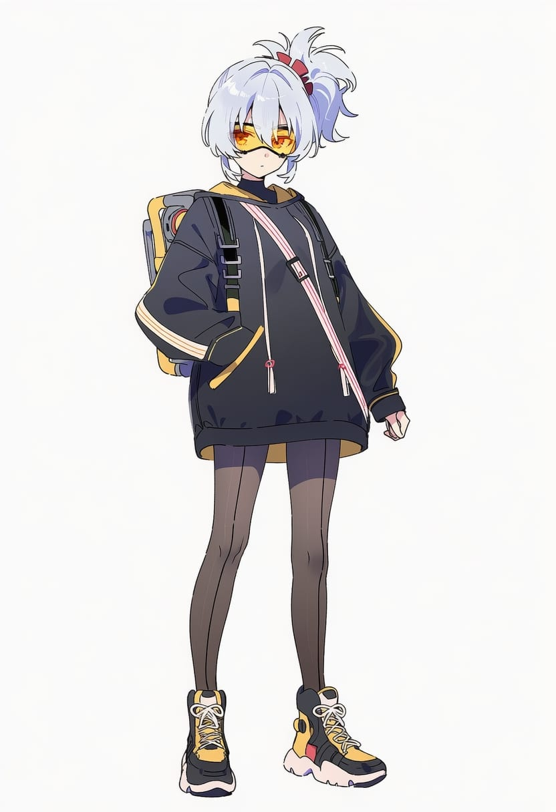

| 字段 | 内容 |
| --- | --- |
| Danbooru tag | front-seamed_legwear |
| 中文释义 | 前缝腿部穿戴物 |
| 详细释义 | 腿部穿戴物腿前侧有纵向接缝；用于描述本体的材质、结构或装饰。 |
| tag所属的子类 | 材质款式 |

## 129. side-seamed_legwear — 侧缝腿部穿戴物

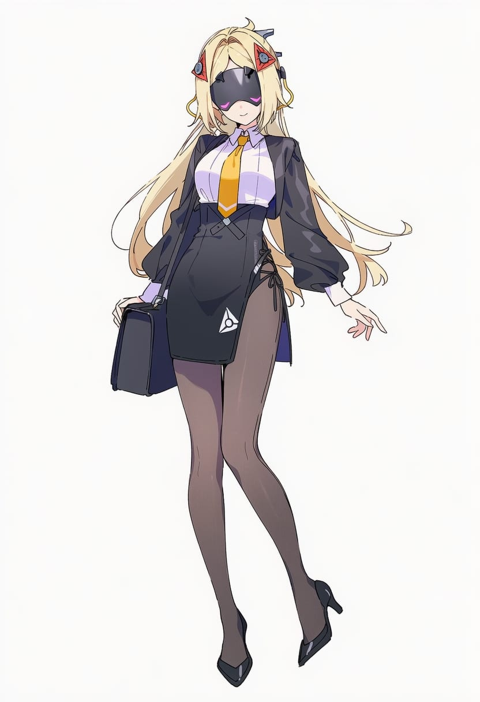

| 字段 | 内容 |
| --- | --- |
| Danbooru tag | side-seamed_legwear |
| 中文释义 | 侧缝腿部穿戴物 |
| 详细释义 | 腿部穿戴物腿侧有纵向接缝；用于描述本体的材质、结构或装饰。 |
| tag所属的子类 | 材质款式 |

## 130. see-through_legwear — 透视腿部穿戴物

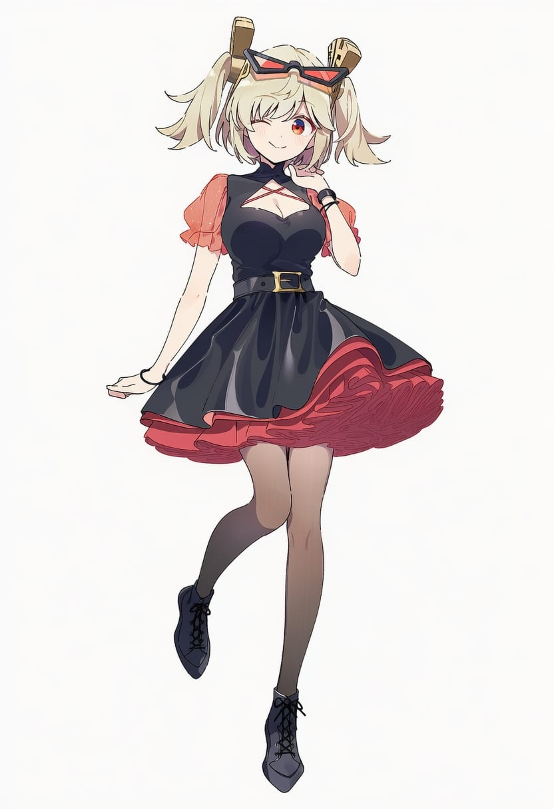

| 字段 | 内容 |
| --- | --- |
| Danbooru tag | see-through_legwear |
| 中文释义 | 透视腿部穿戴物 |
| 详细释义 | 腿部穿戴物材质半透明或透明，可以明显透出下方皮肤/衣物；用于描述本体的材质、结构或装饰。 |
| tag所属的子类 | 材质款式 |

## 131. shiny_legwear — 光泽腿部穿戴物

| 字段 | 内容 |
| --- | --- |
| Danbooru tag | shiny_legwear |
| 中文释义 | 光泽腿部穿戴物 |
| 详细释义 | 腿部穿戴物材质表面有明显高光/光泽感；用于描述本体的材质、结构或装饰。 |
| tag所属的子类 | 材质款式 |

## 132. side-tie_legwear — 侧系带腿部穿戴物

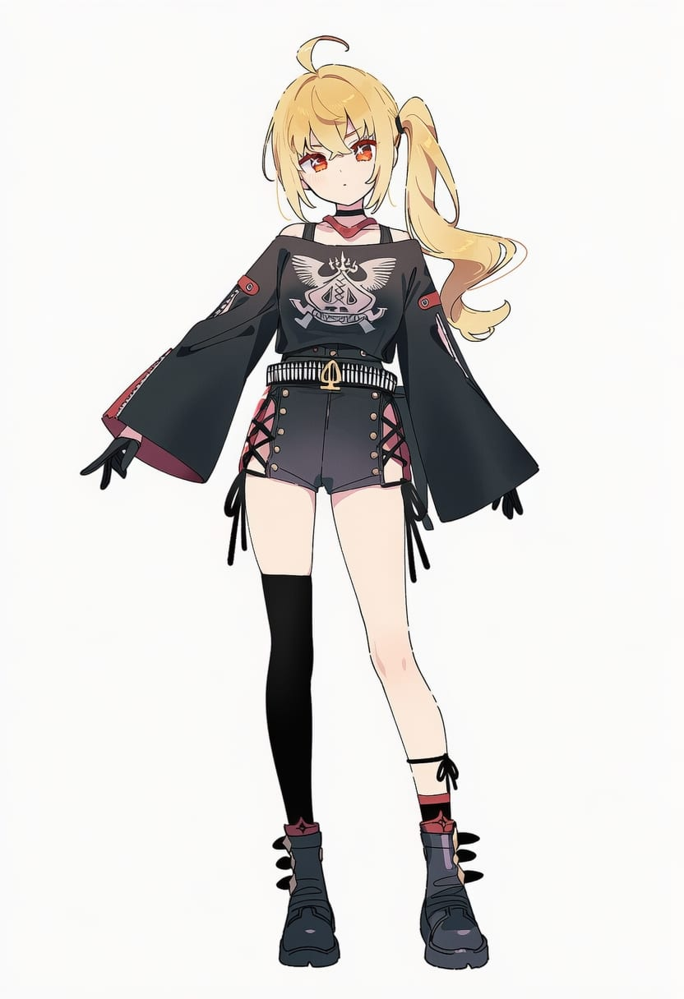

| 字段 | 内容 |
| --- | --- |
| Danbooru tag | side-tie_legwear |
| 中文释义 | 侧系带腿部穿戴物 |
| 详细释义 | 腿部穿戴物侧面带绑带、蝴蝶结或系结结构；用于描述本体的材质、结构或装饰。 |
| tag所属的子类 | 材质款式 |

## 133. spiked_legwear — 尖刺腿部穿戴物

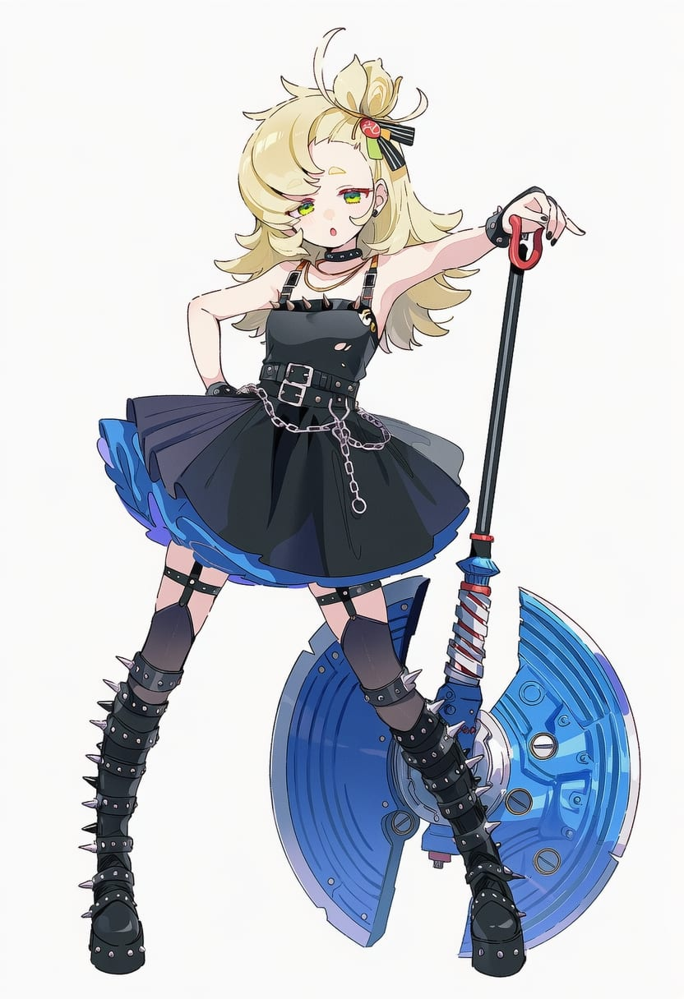

| 字段 | 内容 |
| --- | --- |
| Danbooru tag | spiked_legwear |
| 中文释义 | 尖刺腿部穿戴物 |
| 详细释义 | 腿部穿戴物带尖刺/刺状装饰；用于描述本体的材质、结构或装饰。 |
| tag所属的子类 | 材质款式 |

## 134. studded_legwear — 铆钉腿部穿戴物

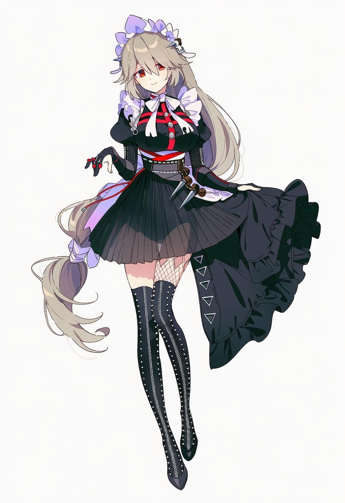

| 字段 | 内容 |
| --- | --- |
| Danbooru tag | studded_legwear |
| 中文释义 | 铆钉腿部穿戴物 |
| 详细释义 | 腿部穿戴物带铆钉装饰；用于描述本体的材质、结构或装饰。 |
| tag所属的子类 | 材质款式 |

## 135. toeless_legwear — 露趾腿部穿戴物

| 字段 | 内容 |
| --- | --- |
| Danbooru tag | toeless_legwear |
| 中文释义 | 露趾腿部穿戴物 |
| 详细释义 | 覆盖脚部但露出脚趾；若整个脚都不覆盖，应考虑 leggings。 |
| tag所属的子类 | 材质款式 |

## 136. bridal_legwear — 新娘式腿部穿戴物

| 字段 | 内容 |
| --- | --- |
| Danbooru tag | bridal_legwear |
| 中文释义 | 新娘式腿部穿戴物 |
| 详细释义 | 腿部穿戴物带婚礼/新娘袜常见装饰风格；用于描述本体的材质、结构或装饰。 |
| tag所属的子类 | 材质款式 |

## 137. stirrup_legwear — 踩脚/马镫式腿部穿戴

| 字段 | 内容 |
| --- | --- |
| Danbooru tag | stirrup_legwear |
| 中文释义 | 踩脚/马镫式腿部穿戴 |
| 详细释义 | 脚底有一条带子跨过足弓来固定，脚趾和脚跟多半露出。 |
| tag所属的子类 | 材质款式 |

## 138. zipper_legwear — 拉链腿部穿戴物

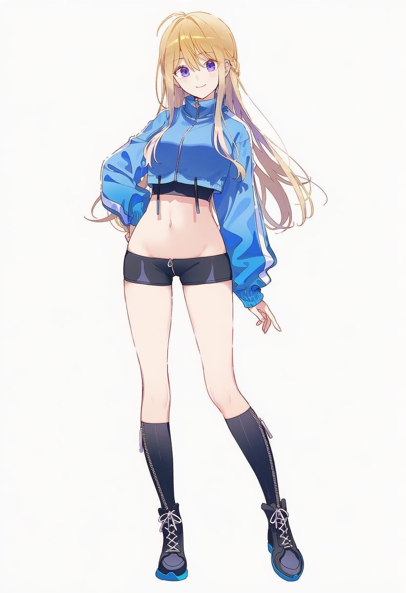

| 字段 | 内容 |
| --- | --- |
| Danbooru tag | zipper_legwear |
| 中文释义 | 拉链腿部穿戴物 |
| 详细释义 | 腿部穿戴物带可见拉链结构；用于描述本体的材质、结构或装饰。 |
| tag所属的子类 | 材质款式 |

## 139. fur-trimmed_legwear — 毛边腿部穿戴物

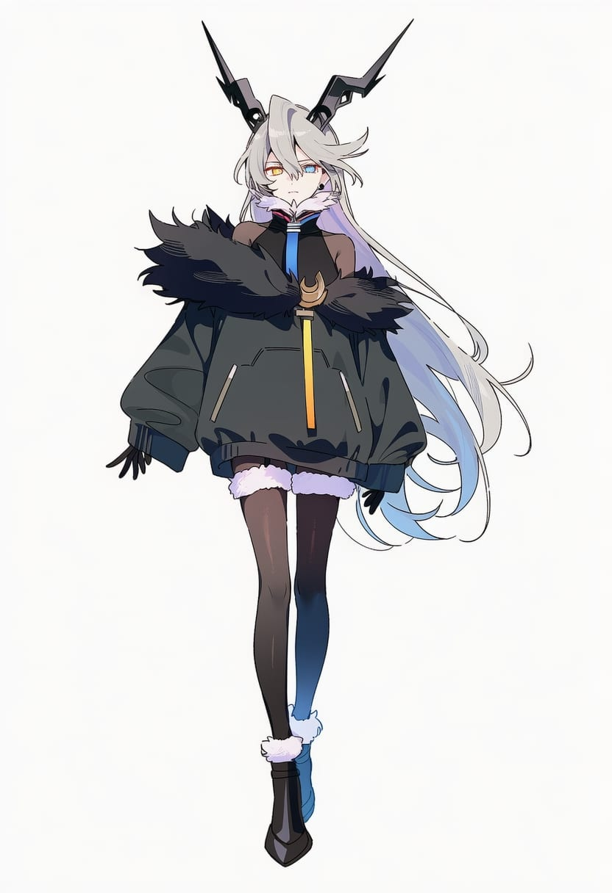

| 字段 | 内容 |
| --- | --- |
| Danbooru tag | fur-trimmed_legwear |
| 中文释义 | 毛边腿部穿戴物 |
| 详细释义 | 腿部穿戴物边缘带毛皮/绒毛装饰；用于描述本体的材质、结构或装饰。 |
| tag所属的子类 | 材质款式 |

## 140. ribbon-trimmed_legwear — 丝带边腿部穿戴物

| 字段 | 内容 |
| --- | --- |
| Danbooru tag | ribbon-trimmed_legwear |
| 中文释义 | 丝带边腿部穿戴物 |
| 详细释义 | 腿部穿戴物边缘或袜口带丝带装饰；用于描述本体的材质、结构或装饰。 |
| tag所属的子类 | 材质款式 |

## 141. animal_ear_legwear — 动物耳式腿部穿戴物

| 字段 | 内容 |
| --- | --- |
| Danbooru tag | animal_ear_legwear |
| 中文释义 | 动物耳式腿部穿戴物 |
| 详细释义 | 腿部穿戴物袜口或腿部穿戴物上缘带动物耳朵造型；用于描述本体的材质、结构或装饰。 |
| tag所属的子类 | 材质款式 |

## 142. bat_legwear — 蝙蝠式腿部穿戴物

| 字段 | 内容 |
| --- | --- |
| Danbooru tag | bat_legwear |
| 中文释义 | 蝙蝠式腿部穿戴物 |
| 详细释义 | 腿部穿戴物带蝙蝠主题或翼状上缘装饰；用于描述本体的材质、结构或装饰。 |
| tag所属的子类 | 材质款式 |

## 143. bear_band_legwear — 熊耳带腿部穿戴物

| 字段 | 内容 |
| --- | --- |
| Danbooru tag | bear_band_legwear |
| 中文释义 | 熊耳带腿部穿戴物 |
| 详细释义 | 腿部穿戴物袜口上缘呈熊耳样式；用于描述本体的材质、结构或装饰。 |
| tag所属的子类 | 材质款式 |

## 144. cat_ear_legwear — 猫耳式腿部穿戴物

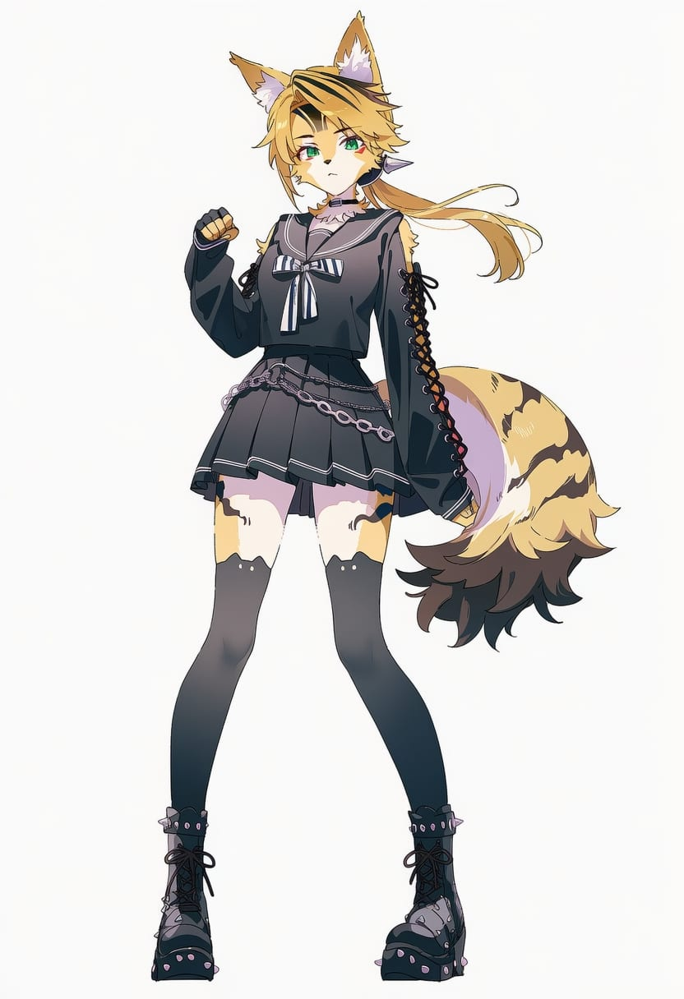

| 字段 | 内容 |
| --- | --- |
| Danbooru tag | cat_ear_legwear |
| 中文释义 | 猫耳式腿部穿戴物 |
| 详细释义 | 腿部穿戴物袜口上缘带猫耳造型；用于描述本体的材质、结构或装饰。 |
| tag所属的子类 | 材质款式 |

## 145. rabbit_ear_legwear — 兔耳式腿部穿戴物

| 字段 | 内容 |
| --- | --- |
| Danbooru tag | rabbit_ear_legwear |
| 中文释义 | 兔耳式腿部穿戴物 |
| 详细释义 | 腿部穿戴物袜口上缘带兔耳造型；用于描述本体的材质、结构或装饰。 |
| tag所属的子类 | 材质款式 |

## 146. horn_band_legwear — 角状带腿部穿戴物

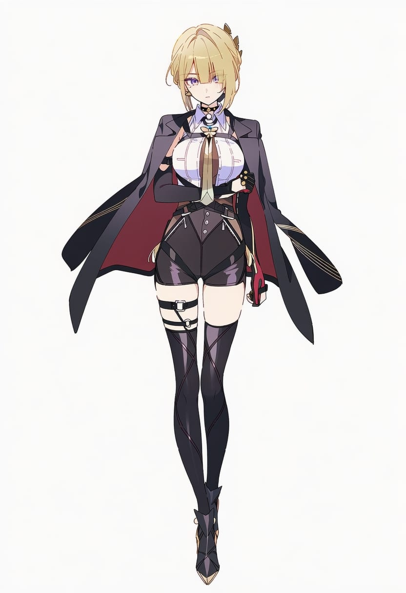

| 字段 | 内容 |
| --- | --- |
| Danbooru tag | horn_band_legwear |
| 中文释义 | 角状带腿部穿戴物 |
| 详细释义 | 腿部穿戴物袜口/腿带上带角状突起装饰；用于描述本体的材质、结构或装饰。 |
| tag所属的子类 | 材质款式 |

## 147. legwear_cutout — 腿部穿戴物镂空

| 字段 | 内容 |
| --- | --- |
| Danbooru tag | legwear_cutout |
| 中文释义 | 腿部穿戴物镂空 |
| 详细释义 | 袜类/腿部穿戴物上存在刻意设计的镂空或开口区域。 |
| tag所属的子类 | 材质款式 |

---
