# 裤子标签展示

## 1. pants — 覆盖双腿、通常从腰部延伸到脚踝附近的下装总称。

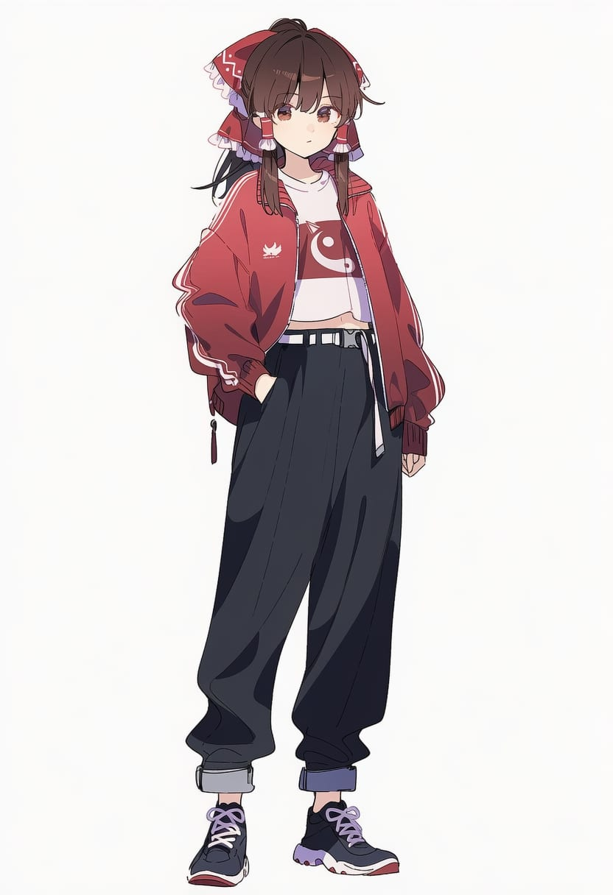

| 字段 | 内容 |
| --- | --- |
| Danbooru Tag | pants |
| 中文名 | 长裤 / 裤子 |
| 中文含义 | 覆盖双腿、通常从腰部延伸到脚踝附近的下装总称。 |
| 子类 | 基础大类 |

## 2. shorts — 从腰部穿着、但不会完整覆盖双腿的裤装总称。

| 字段 | 内容 |
| --- | --- |
| Danbooru Tag | shorts |
| 中文名 | 短裤 |
| 中文含义 | 从腰部穿着、但不会完整覆盖双腿的裤装总称。 |
| 子类 | 基础大类 |

## 3. hakama_pants — 呈分腿裤装结构的日本袴。

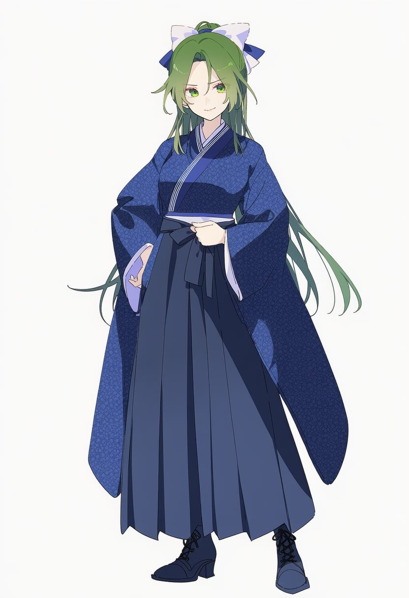

| 字段 | 内容 |
| --- | --- |
| Danbooru Tag | hakama_pants |
| 中文名 | 裤式袴 |
| 中文含义 | 呈分腿裤装结构的日本袴。 |
| 子类 | 传统/特殊裤装 |

## 4. detached_pants — 裤腿与腰部主体分离、呈独立腿套式结构的裤装。

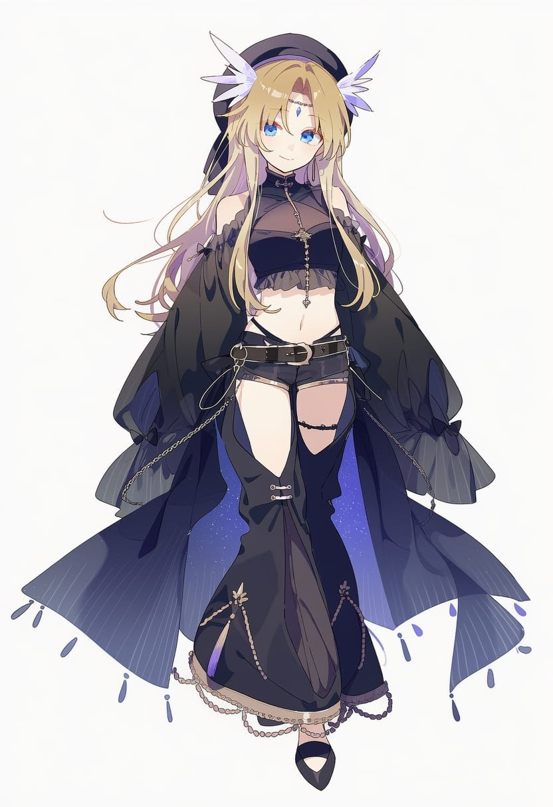

| 字段 | 内容 |
| --- | --- |
| Danbooru Tag | detached_pants |
| 中文名 | 分离式裤腿 |
| 中文含义 | 裤腿与腰部主体分离、呈独立腿套式结构的裤装。 |
| 子类 | 传统/特殊裤装 |

## 5. chaps — 覆盖腿部但通常露出胯部或臀部的骑马护腿式裤装。

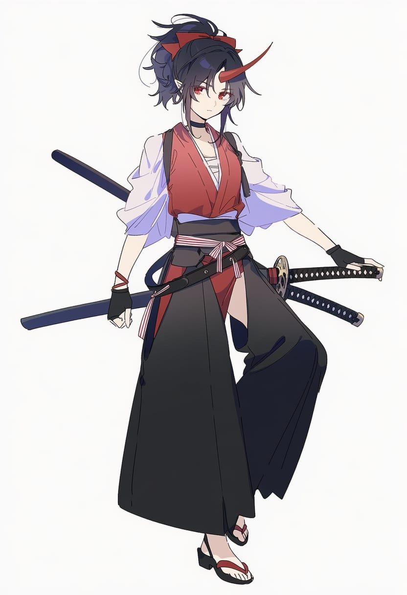

| 字段 | 内容 |
| --- | --- |
| Danbooru Tag | chaps |
| 中文名 | 皮套裤 / 牛仔护腿裤 |
| 中文含义 | 覆盖腿部但通常露出胯部或臀部的骑马护腿式裤装。 |
| 子类 | 传统/特殊裤装 |

## 6. hakama_shorts — 长度较短、呈分腿短裤结构的袴。

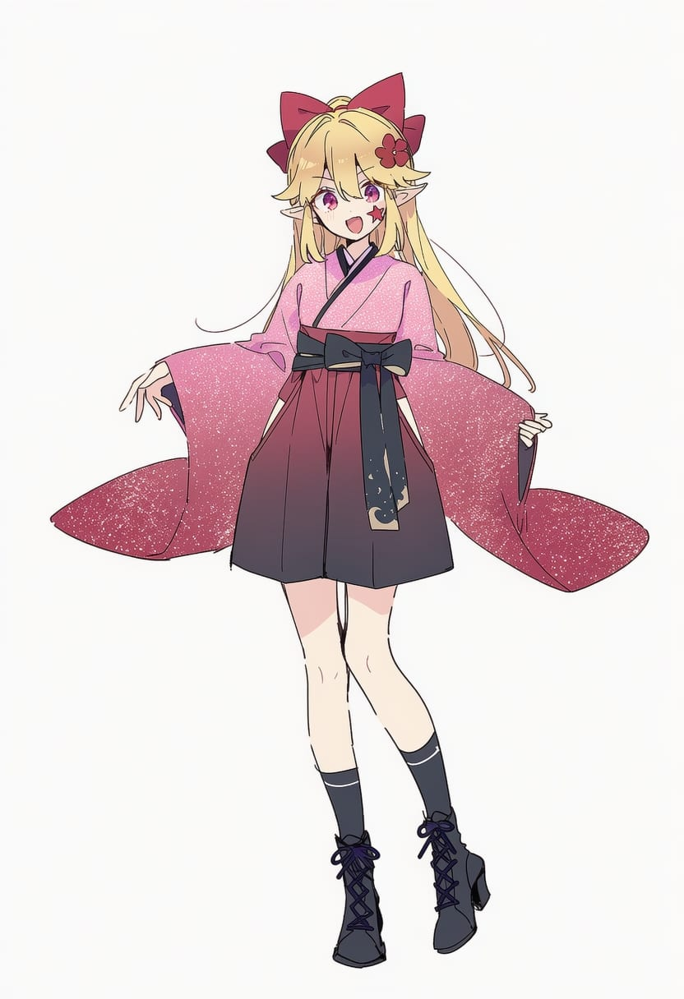

| 字段 | 内容 |
| --- | --- |
| Danbooru Tag | hakama_shorts |
| 中文名 | 短裤式袴 |
| 中文含义 | 长度较短、呈分腿短裤结构的袴。 |
| 子类 | 传统/特殊裤装 |

## 7. bloomers — 腰部和裤脚收拢、裤身较蓬松的传统 bloomer。

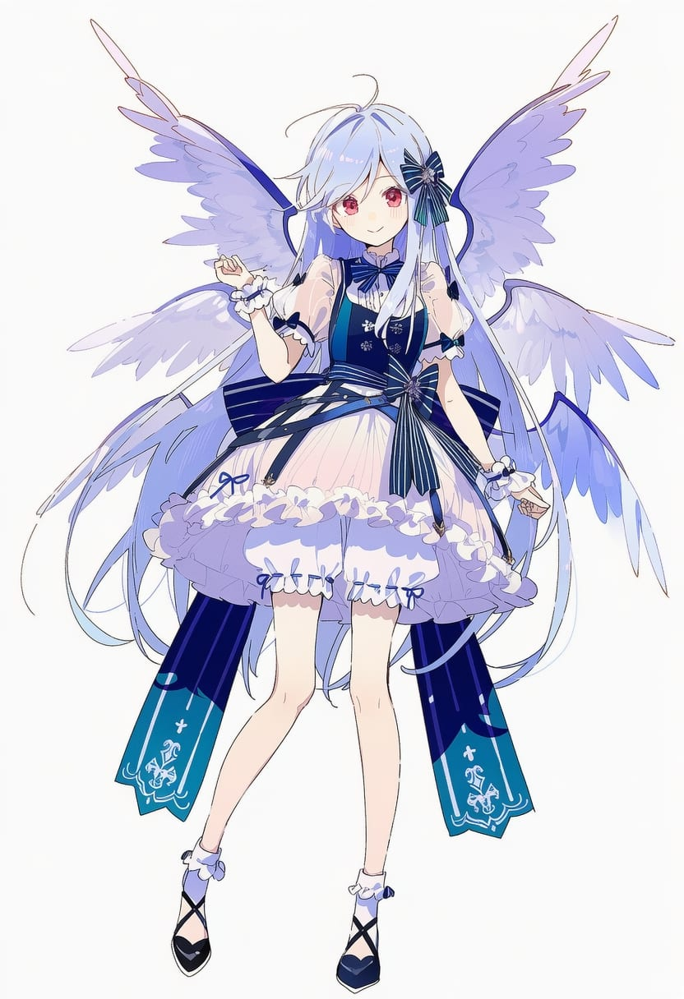

| 字段 | 内容 |
| --- | --- |
| Danbooru Tag | bloomers |
| 中文名 | 灯笼短裤 / 灯笼裤 |
| 中文含义 | 腰部和裤脚收拢、裤身较蓬松的传统 bloomer。 |
| 子类 | 传统/特殊裤装 |

## 8. baggy_shorts — 裤腿和臀部整体较宽松的短裤。

| 字段 | 内容 |
| --- | --- |
| Danbooru Tag | baggy_shorts |
| 中文名 | 宽松短裤 |
| 中文含义 | 裤腿和臀部整体较宽松的短裤。 |
| 子类 | 款式/结构 |

## 9. taut_shorts — 短裤被身体撑得很紧、布料呈明显拉伸状态。

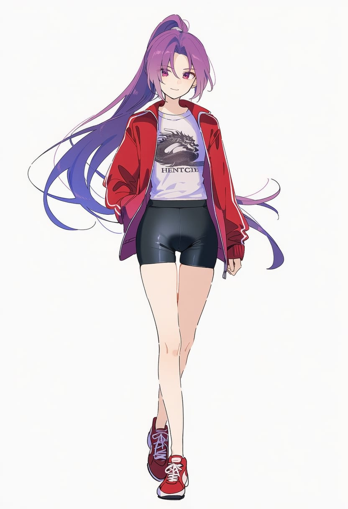

| 字段 | 内容 |
| --- | --- |
| Danbooru Tag | taut_shorts |
| 中文名 | 绷紧短裤 |
| 中文含义 | 短裤被身体撑得很紧、布料呈明显拉伸状态。 |
| 子类 | 款式/结构 |

## 10. denim_shorts — 以牛仔布制成的短裤。

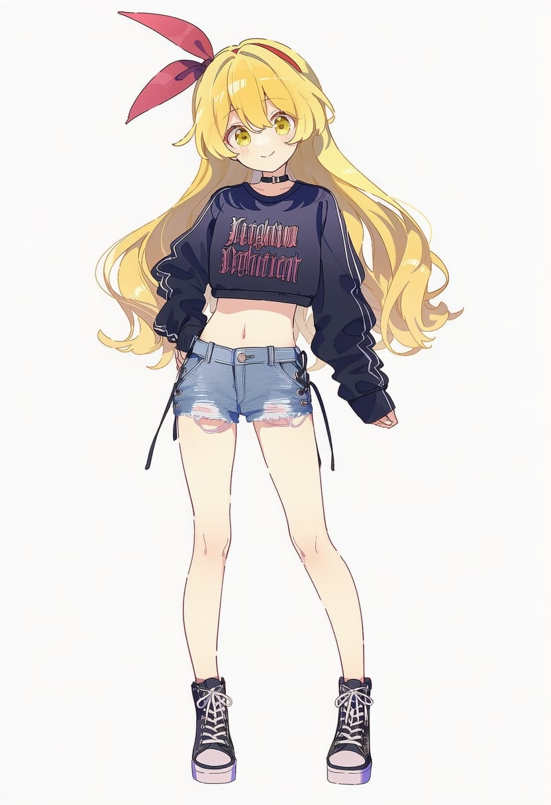

| 字段 | 内容 |
| --- | --- |
| Danbooru Tag | denim_shorts |
| 中文名 | 牛仔短裤 |
| 中文含义 | 以牛仔布制成的短裤。 |
| 子类 | 材质/透明 |

## 11. latex_shorts — 以乳胶材质制成的短裤。

| 字段 | 内容 |
| --- | --- |
| Danbooru Tag | latex_shorts |
| 中文名 | 乳胶短裤 |
| 中文含义 | 以乳胶材质制成的短裤。 |
| 子类 | 材质/透明 |

## 12. see-through_shorts — 布料具有明显透视效果的短裤。

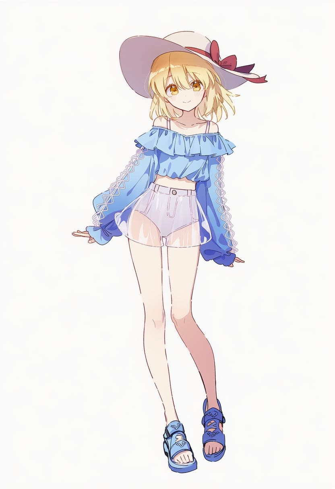

| 字段 | 内容 |
| --- | --- |
| Danbooru Tag | see-through_shorts |
| 中文名 | 透明短裤 |
| 中文含义 | 布料具有明显透视效果的短裤。 |
| 子类 | 材质/透明 |

## 13. open_shorts — 短裤的腰头、裤门或开合处处于打开状态。

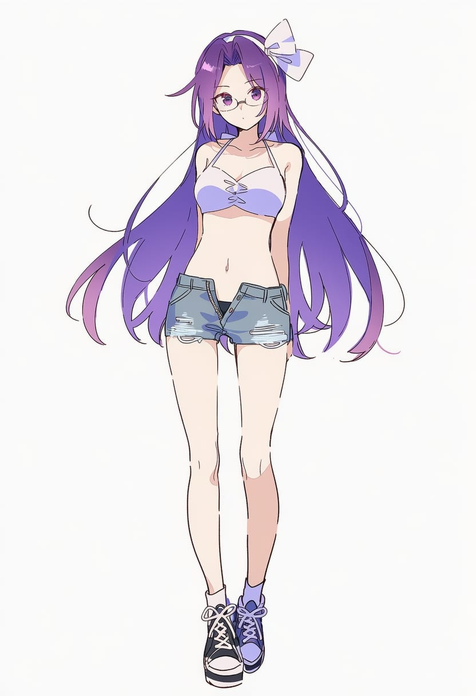

| 字段 | 内容 |
| --- | --- |
| Danbooru Tag | open_shorts |
| 中文名 | 敞开的短裤 |
| 中文含义 | 短裤的腰头、裤门或开合处处于打开状态。 |
| 子类 | 穿着状态/搭配 |

## 14. shorts_pull — 人物正在拉动、下拉或调整短裤。

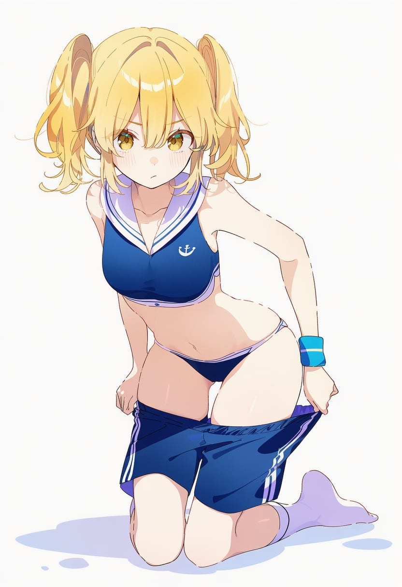

| 字段 | 内容 |
| --- | --- |
| Danbooru Tag | shorts_pull |
| 中文名 | 拉短裤 |
| 中文含义 | 人物正在拉动、下拉或调整短裤。 |
| 子类 | 穿着状态/搭配 |

## 15. shorts_aside — 短裤被拨向一边、偏离正常穿着位置。

| 字段 | 内容 |
| --- | --- |
| Danbooru Tag | shorts_aside |
| 中文名 | 短裤拨到一侧 |
| 中文含义 | 短裤被拨向一边、偏离正常穿着位置。 |
| 子类 | 穿着状态/搭配 |

## 16. shorts_around_one_leg — 短裤已脱下大部分，仅挂在一条腿上。

| 字段 | 内容 |
| --- | --- |
| Danbooru Tag | shorts_around_one_leg |
| 中文名 | 短裤挂在单腿 |
| 中文含义 | 短裤已脱下大部分，仅挂在一条腿上。 |
| 子类 | 穿着状态/搭配 |

## 17. unworn_shorts — 短裤作为物件出现，但没有穿在人物身上。

| 字段 | 内容 |
| --- | --- |
| Danbooru Tag | unworn_shorts |
| 中文名 | 未穿着的短裤 |
| 中文含义 | 短裤作为物件出现，但没有穿在人物身上。 |
| 子类 | 穿着状态/搭配 |

## 18. wet_shorts — 短裤被水浸湿、呈明显湿润状态。

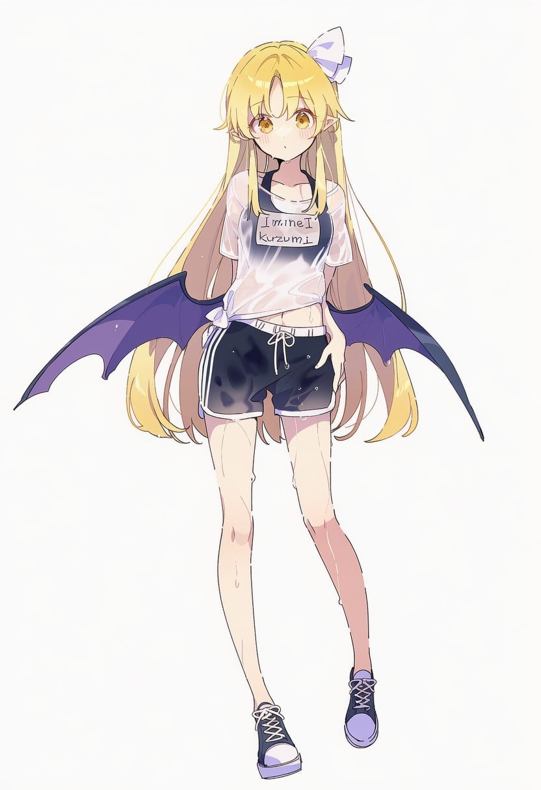

| 字段 | 内容 |
| --- | --- |
| Danbooru Tag | wet_shorts |
| 中文名 | 湿短裤 |
| 中文含义 | 短裤被水浸湿、呈明显湿润状态。 |
| 子类 | 穿着状态/搭配 |

## 19. shorts_under_skirt — 裙子下面额外穿着短裤。

| 字段 | 内容 |
| --- | --- |
| Danbooru Tag | shorts_under_skirt |
| 中文名 | 裙下穿短裤 |
| 中文含义 | 裙子下面额外穿着短裤。 |
| 子类 | 穿着状态/搭配 |

## 20. pantyhose_under_shorts — 短裤外层之下穿着 pantyhose。

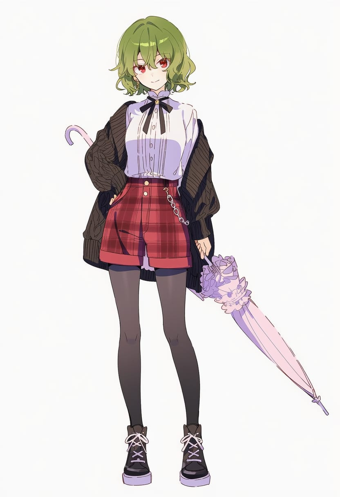

| 字段 | 内容 |
| --- | --- |
| Danbooru Tag | pantyhose_under_shorts |
| 中文名 | 短裤下穿连裤袜 |
| 中文含义 | 短裤外层之下穿着 pantyhose。 |
| 子类 | 穿着状态/搭配 |

## 21. bikini_bottom_under_shorts — 短裤里面同时穿着比基尼下装。

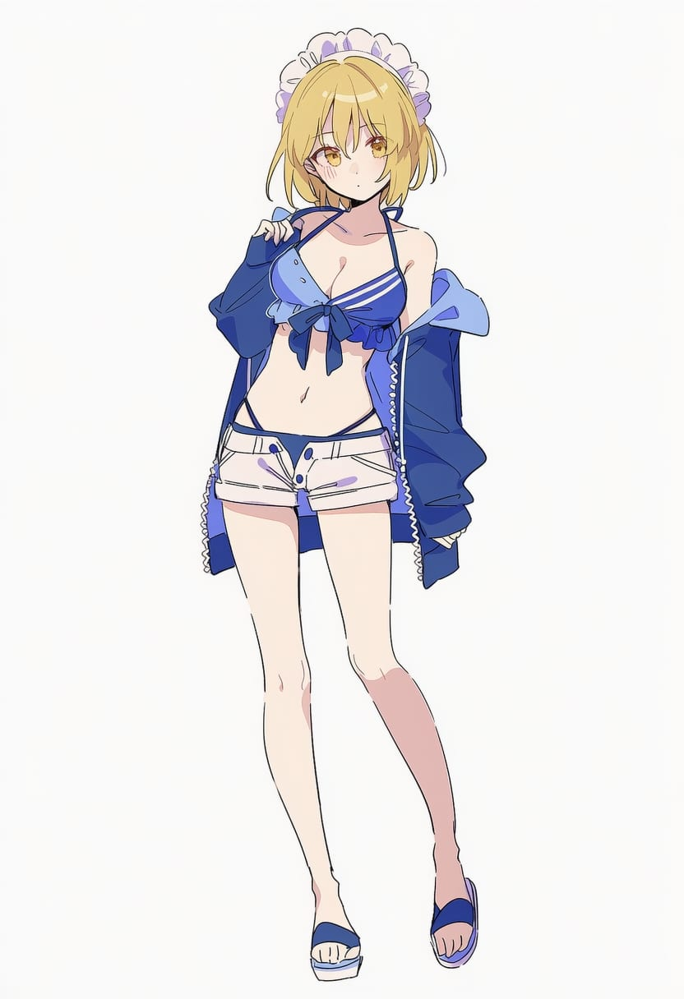

| 字段 | 内容 |
| --- | --- |
| Danbooru Tag | bikini_bottom_under_shorts |
| 中文名 | 短裤下穿比基尼下装 |
| 中文含义 | 短裤里面同时穿着比基尼下装。 |
| 子类 | 穿着状态/搭配 |

## 22. pleated_shorts — 带有明显纵向褶裥结构的短裤。

| 字段 | 内容 |
| --- | --- |
| Danbooru Tag | pleated_shorts |
| 中文名 | 百褶短裤 |
| 中文含义 | 带有明显纵向褶裥结构的短裤。 |
| 子类 | 款式/结构 |

## 23. side_slit_shorts — 裤腿侧面带有明显开衩结构的短裤。

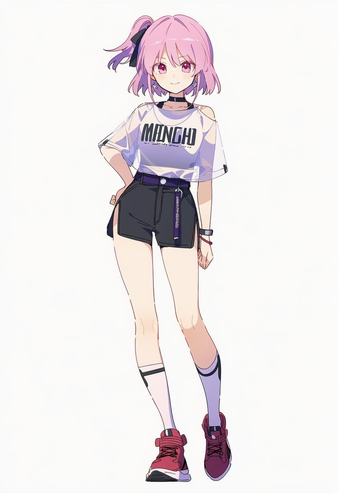

| 字段 | 内容 |
| --- | --- |
| Danbooru Tag | side_slit_shorts |
| 中文名 | 侧开衩短裤 |
| 中文含义 | 裤腿侧面带有明显开衩结构的短裤。 |
| 子类 | 款式/结构 |

## 24. cargo_shorts — 带有明显外置大口袋的宽松工装风短裤。

| 字段 | 内容 |
| --- | --- |
| Danbooru Tag | cargo_shorts |
| 中文名 | 工装短裤 |
| 中文含义 | 带有明显外置大口袋的宽松工装风短裤。 |
| 子类 | 款式/结构 |

## 25. puffy_shorts — 裤腿具有明显蓬松体积感的短裤。

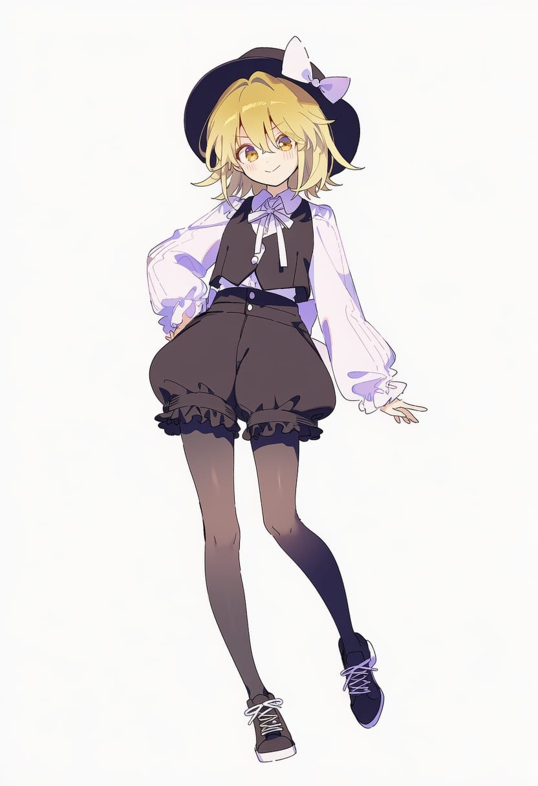

| 字段 | 内容 |
| --- | --- |
| Danbooru Tag | puffy_shorts |
| 中文名 | 蓬蓬短裤 |
| 中文含义 | 裤腿具有明显蓬松体积感的短裤。 |
| 子类 | 款式/结构 |

## 26. bikini_shorts — 外观或用途接近比基尼下装的短裤。

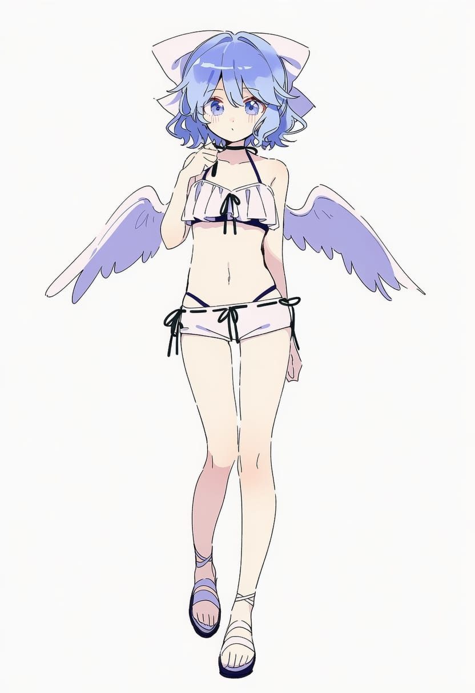

| 字段 | 内容 |
| --- | --- |
| Danbooru Tag | bikini_shorts |
| 中文名 | 比基尼式短裤 |
| 中文含义 | 外观或用途接近比基尼下装的短裤。 |
| 子类 | 款式/结构 |

## 27. plaid_shorts — 带有 plaid / tartan 交叉格纹的短裤。

| 字段 | 内容 |
| --- | --- |
| Danbooru Tag | plaid_shorts |
| 中文名 | 格纹短裤 |
| 中文含义 | 带有 plaid / tartan 交叉格纹的短裤。 |
| 子类 | 图案/配色 |

## 28. checkered_shorts — 带有规则方格或棋盘格图案的短裤。

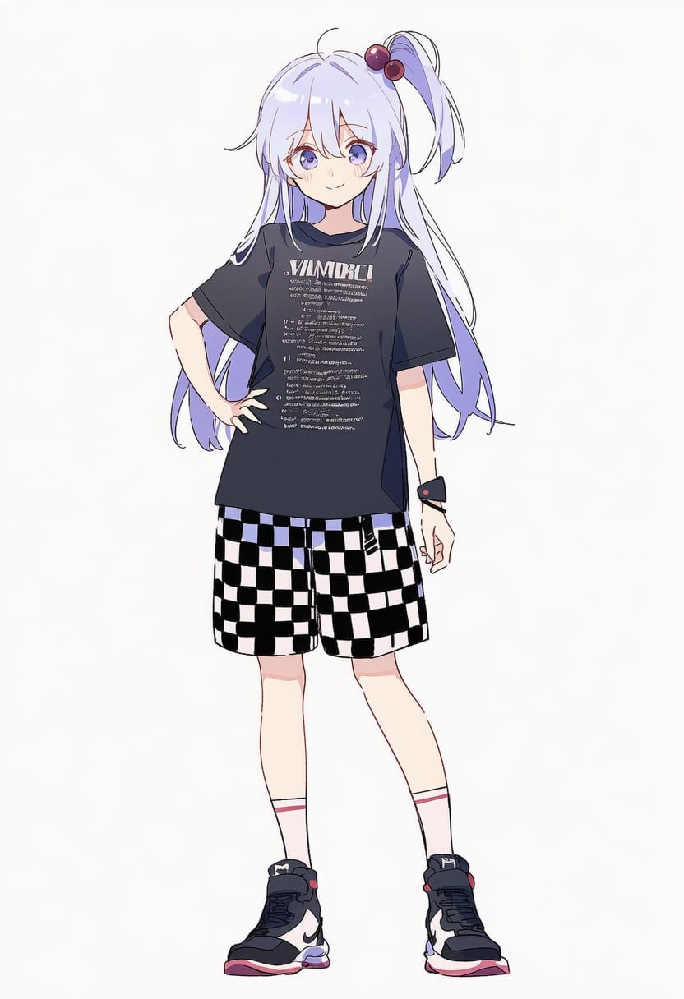

| 字段 | 内容 |
| --- | --- |
| Danbooru Tag | checkered_shorts |
| 中文名 | 棋盘格短裤 |
| 中文含义 | 带有规则方格或棋盘格图案的短裤。 |
| 子类 | 图案/配色 |

## 29. striped_shorts — 带有条纹图案的短裤。

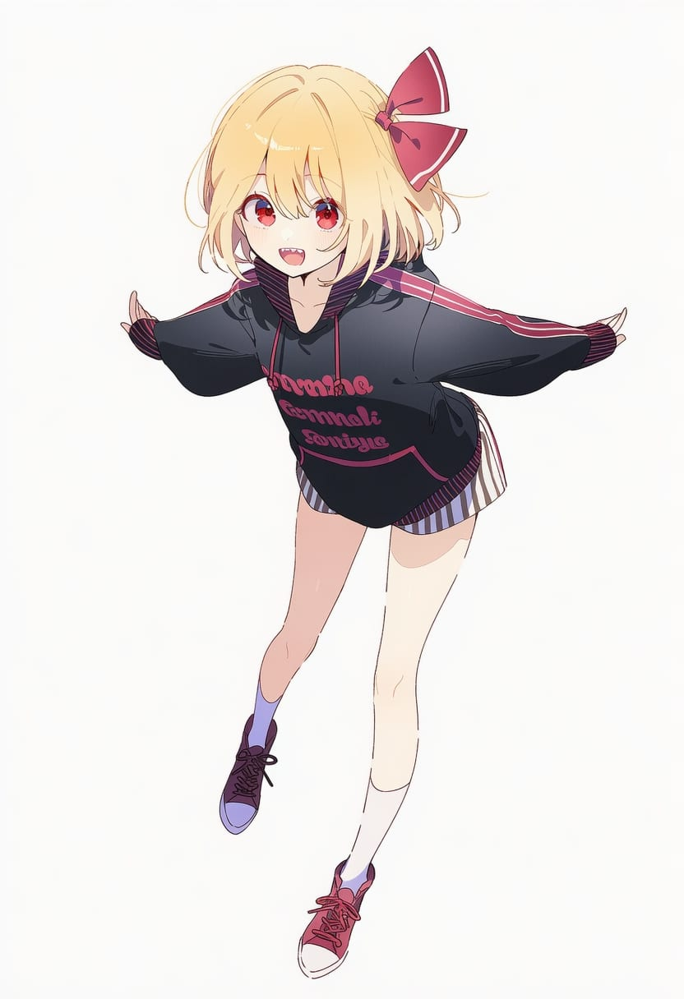

| 字段 | 内容 |
| --- | --- |
| Danbooru Tag | striped_shorts |
| 中文名 | 条纹短裤 |
| 中文含义 | 带有条纹图案的短裤。 |
| 子类 | 图案/配色 |

## 30. camouflage_shorts — 带有军事迷彩图案的短裤。

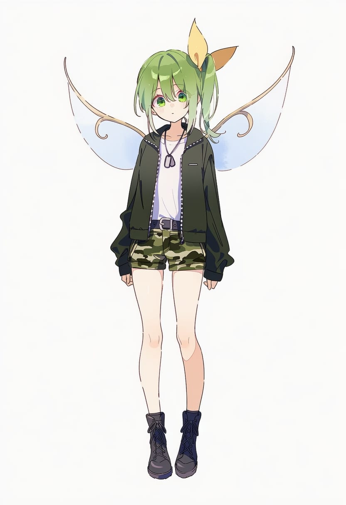

| 字段 | 内容 |
| --- | --- |
| Danbooru Tag | camouflage_shorts |
| 中文名 | 迷彩短裤 |
| 中文含义 | 带有军事迷彩图案的短裤。 |
| 子类 | 图案/配色 |

## 31. polka_dot_shorts — 带有规则圆点 / 波点图案的短裤。

| 字段 | 内容 |
| --- | --- |
| Danbooru Tag | polka_dot_shorts |
| 中文名 | 波点短裤 |
| 中文含义 | 带有规则圆点 / 波点图案的短裤。 |
| 子类 | 图案/配色 |

## 32. print_shorts — 表面带有明确印花、图形或重复图案的短裤。

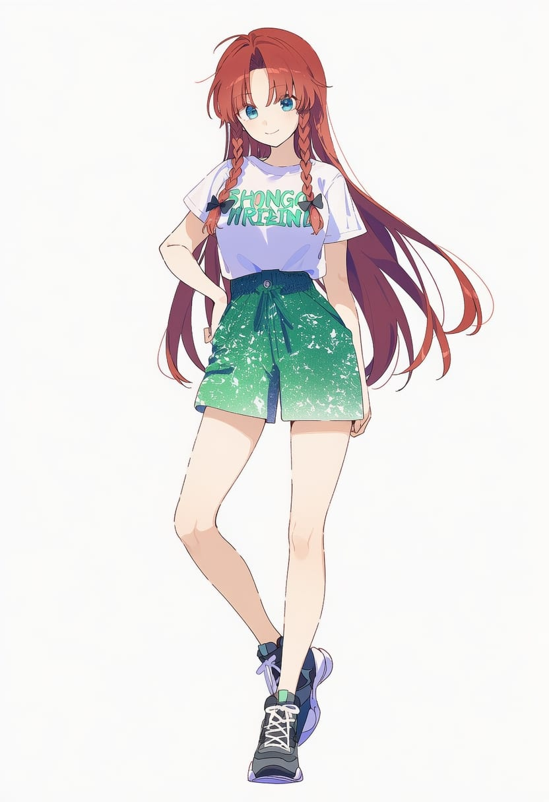

| 字段 | 内容 |
| --- | --- |
| Danbooru Tag | print_shorts |
| 中文名 | 印花短裤 |
| 中文含义 | 表面带有明确印花、图形或重复图案的短裤。 |
| 子类 | 图案/配色 |

## 33. black_shorts — 主要颜色为黑色的短裤。

| 字段 | 内容 |
| --- | --- |
| Danbooru Tag | black_shorts |
| 中文名 | 黑色短裤 |
| 中文含义 | 主要颜色为黑色的短裤。 |
| 子类 | 图案/配色 |

## 34. multicolored_shorts — 短裤同时具有三种或更多明显颜色。

| 字段 | 内容 |
| --- | --- |
| Danbooru Tag | multicolored_shorts |
| 中文名 | 多色短裤 |
| 中文含义 | 短裤同时具有三种或更多明显颜色。 |
| 子类 | 图案/配色 |

## 35. high-waist_shorts — 裤腰位置明显高于常规腰线的短裤。

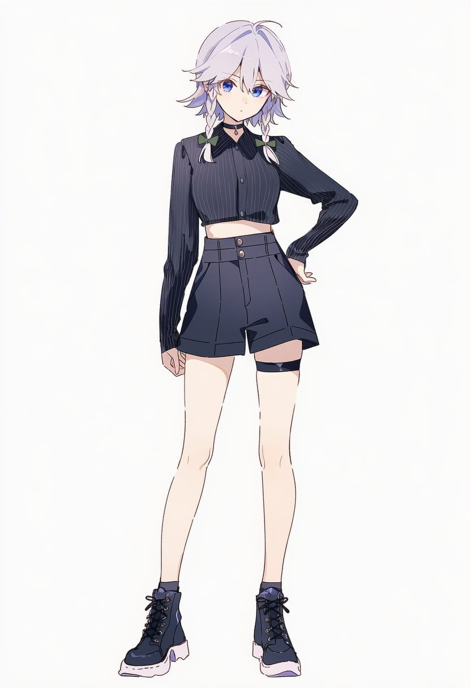

| 字段 | 内容 |
| --- | --- |
| Danbooru Tag | high-waist_shorts |
| 中文名 | 高腰短裤 |
| 中文含义 | 裤腰位置明显高于常规腰线的短裤。 |
| 子类 | 款式/结构 |

## 36. lowleg_shorts — 腰线明显下移的短裤。

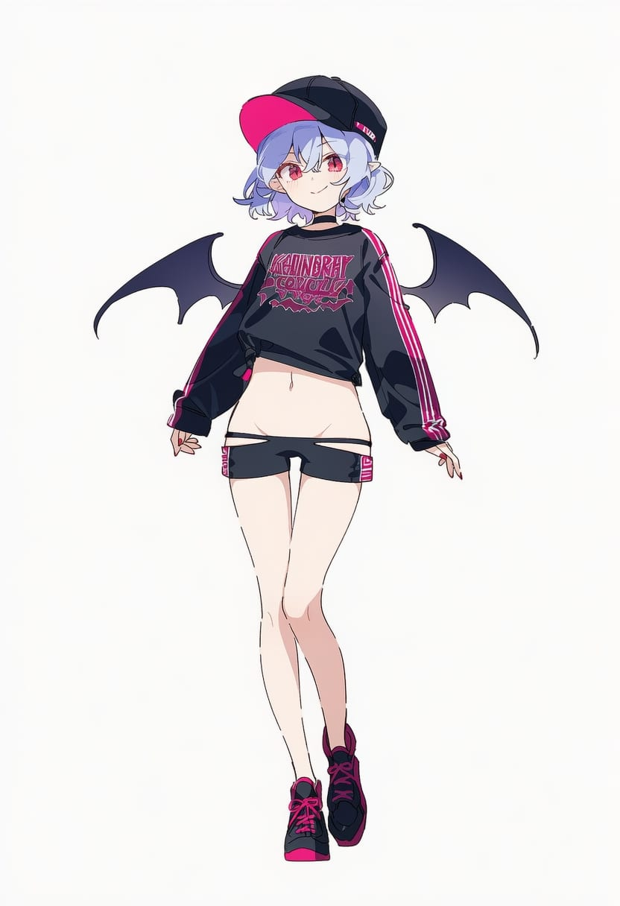

| 字段 | 内容 |
| --- | --- |
| Danbooru Tag | lowleg_shorts |
| 中文名 | 低腰短裤 |
| 中文含义 | 腰线明显下移的短裤。 |
| 子类 | 款式/结构 |

## 37. short_shorts — 裤腿非常短、通常露出大部分大腿的短裤。

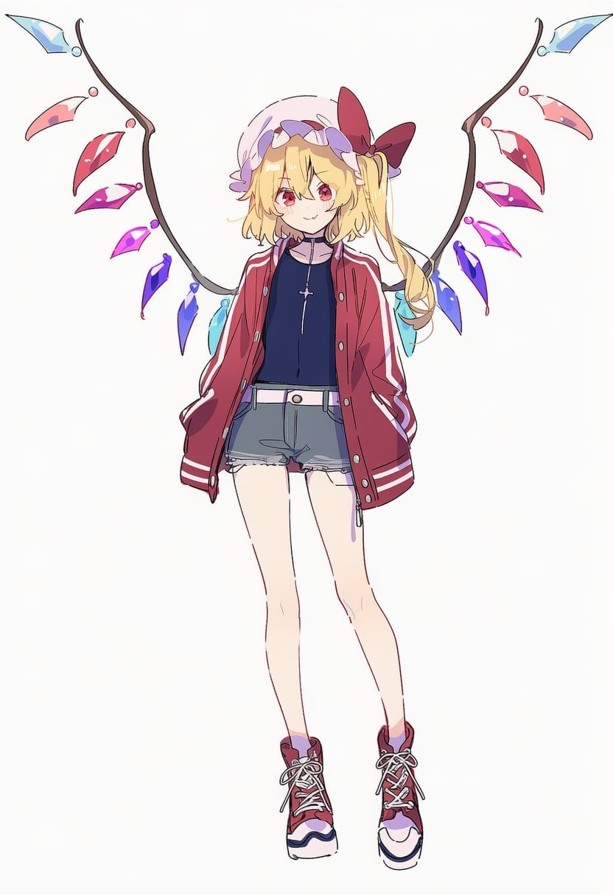

| 字段 | 内容 |
| --- | --- |
| Danbooru Tag | short_shorts |
| 中文名 | 超短裤 |
| 中文含义 | 裤腿非常短、通常露出大部分大腿的短裤。 |
| 子类 | 款式/结构 |

## 38. micro_shorts — 短到接近内裤尺寸、覆盖范围极小的短裤。

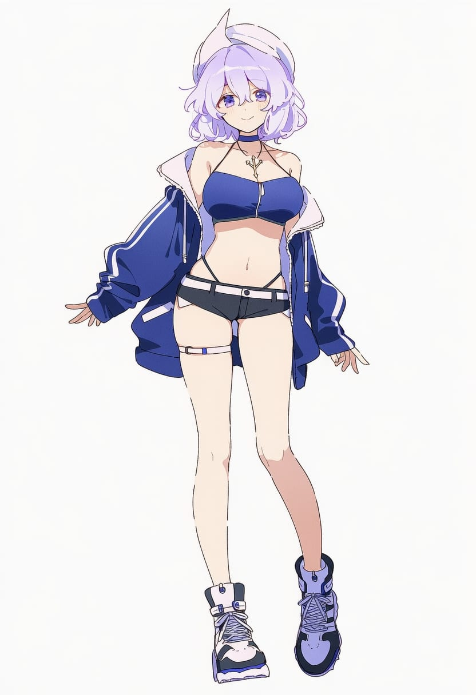

| 字段 | 内容 |
| --- | --- |
| Danbooru Tag | micro_shorts |
| 中文名 | 微型短裤 |
| 中文含义 | 短到接近内裤尺寸、覆盖范围极小的短裤。 |
| 子类 | 款式/结构 |

## 39. frilled_shorts — 带有荷叶边、褶边装饰的短裤。

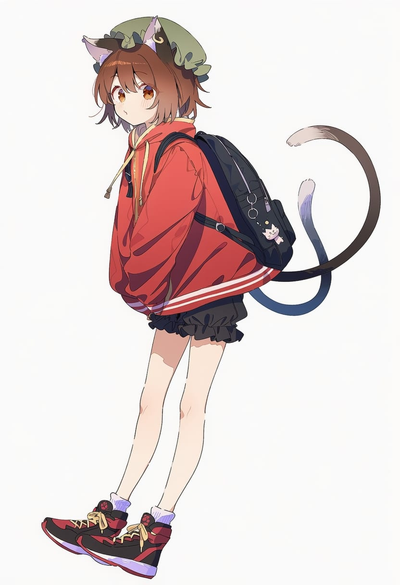

| 字段 | 内容 |
| --- | --- |
| Danbooru Tag | frilled_shorts |
| 中文名 | 荷叶边短裤 |
| 中文含义 | 带有荷叶边、褶边装饰的短裤。 |
| 子类 | 款式/结构 |

## 40. torn_shorts — 带有撕裂、破洞或磨损开口的短裤。

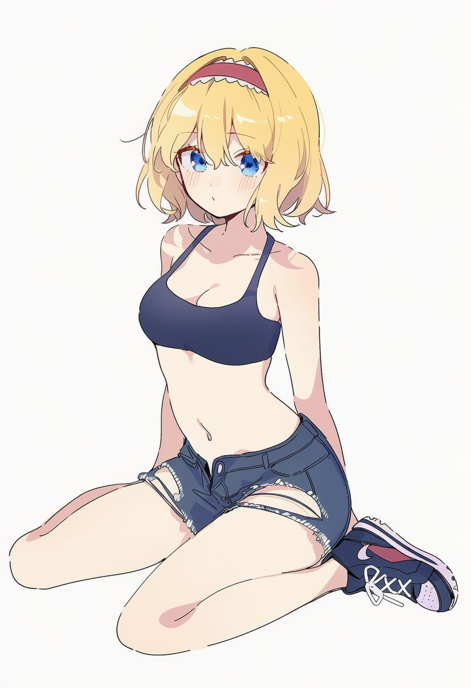

| 字段 | 内容 |
| --- | --- |
| Danbooru Tag | torn_shorts |
| 中文名 | 破损短裤 |
| 中文含义 | 带有撕裂、破洞或磨损开口的短裤。 |
| 子类 | 款式/结构 |

## 41. overalls — 胸前带护片并由肩带固定的连体式工装裤。

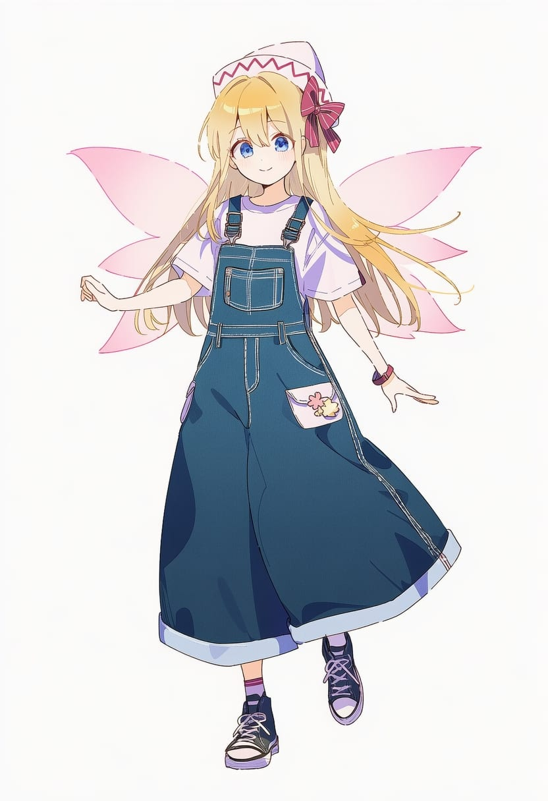

| 字段 | 内容 |
| --- | --- |
| Danbooru Tag | overalls |
| 中文名 | 背带工装裤 |
| 中文含义 | 胸前带护片并由肩带固定的连体式工装裤。 |
| 子类 | 背带/连体裤 |

## 42. suspender_shorts — 通过肩带或吊带固定的短裤。

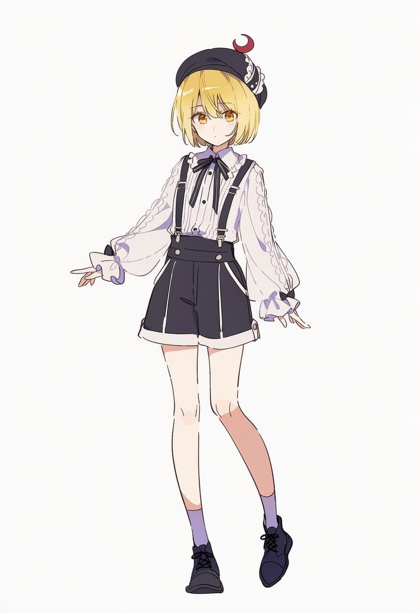

| 字段 | 内容 |
| --- | --- |
| Danbooru Tag | suspender_shorts |
| 中文名 | 背带短裤 |
| 中文含义 | 通过肩带或吊带固定的短裤。 |
| 子类 | 背带/连体裤 |

## 43. overall_shorts — 裤腿不超过膝部的短款 overalls。

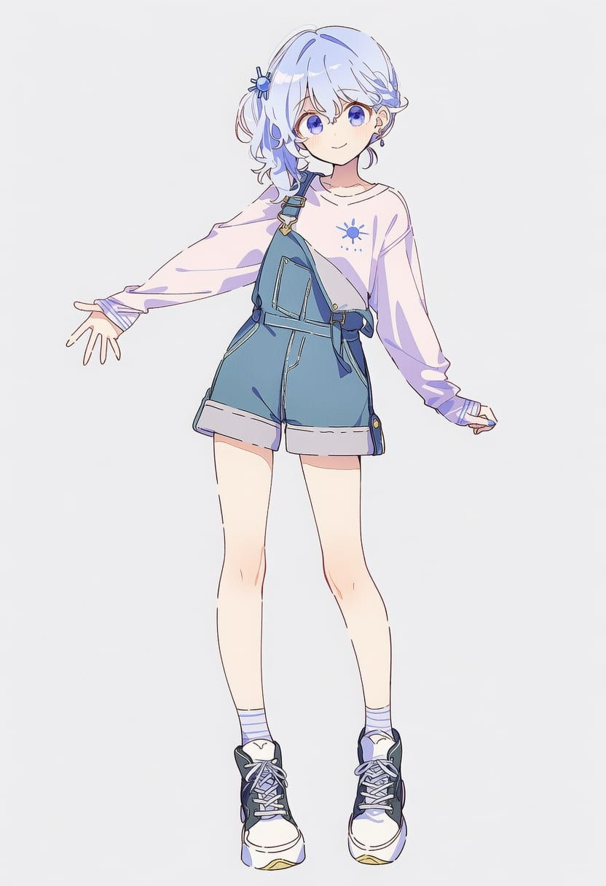

| 字段 | 内容 |
| --- | --- |
| Danbooru Tag | overall_shorts |
| 中文名 | 短款背带工装裤 |
| 中文含义 | 裤腿不超过膝部的短款 overalls。 |
| 子类 | 背带/连体裤 |

## 44. jeans — 以牛仔布制成的长裤，常见为蓝色或灰色。

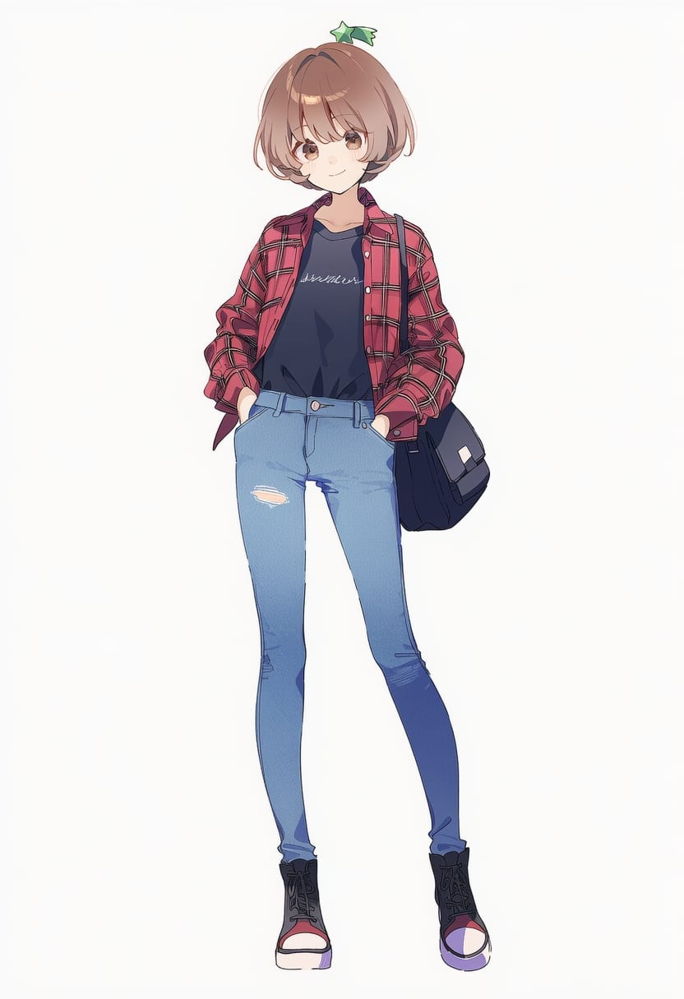

| 字段 | 内容 |
| --- | --- |
| Danbooru Tag | jeans |
| 中文名 | 牛仔裤 |
| 中文含义 | 以牛仔布制成的长裤，常见为蓝色或灰色。 |
| 子类 | 牛仔裤装 |

## 45. cutoff_jeans — 由牛仔裤剪短形成、裤脚通常保留毛边或未锁边效果。

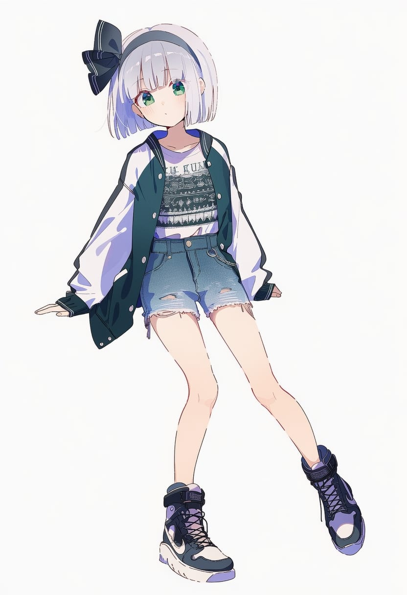

| 字段 | 内容 |
| --- | --- |
| Danbooru Tag | cutoff_jeans |
| 中文名 | 剪短牛仔裤 |
| 中文含义 | 由牛仔裤剪短形成、裤脚通常保留毛边或未锁边效果。 |
| 子类 | 牛仔裤装 |

## 46. skinny_jeans — 腿部剪裁明显贴身、轮廓收窄的牛仔裤。

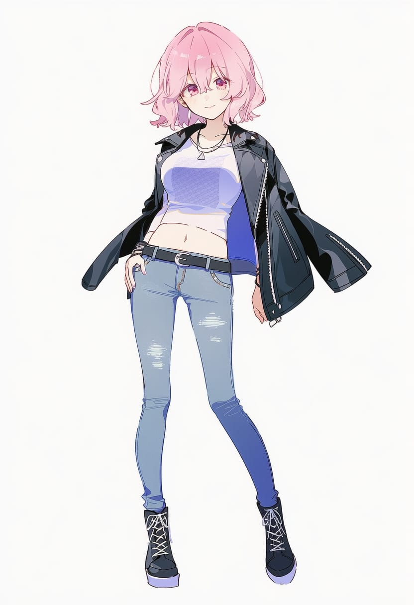

| 字段 | 内容 |
| --- | --- |
| Danbooru Tag | skinny_jeans |
| 中文名 | 紧身牛仔裤 |
| 中文含义 | 腿部剪裁明显贴身、轮廓收窄的牛仔裤。 |
| 子类 | 牛仔裤装 |

## 47. torn_jeans — 带有撕裂、破洞或磨损开口的牛仔裤。

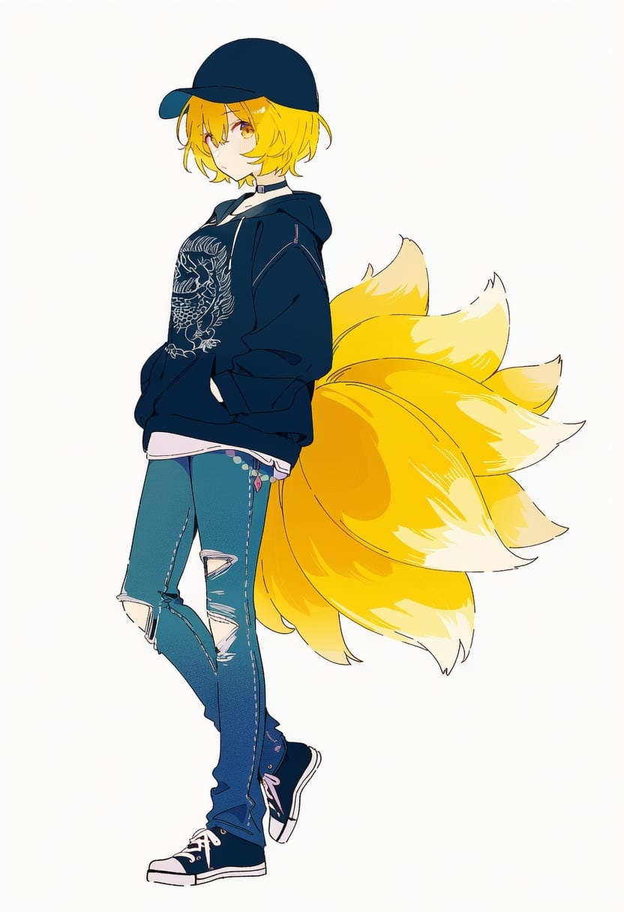

| 字段 | 内容 |
| --- | --- |
| Danbooru Tag | torn_jeans |
| 中文名 | 破洞牛仔裤 |
| 中文含义 | 带有撕裂、破洞或磨损开口的牛仔裤。 |
| 子类 | 牛仔裤装 |

## 48. bike_shorts — 弹力贴身、通常到大腿中部的运动型短裤。

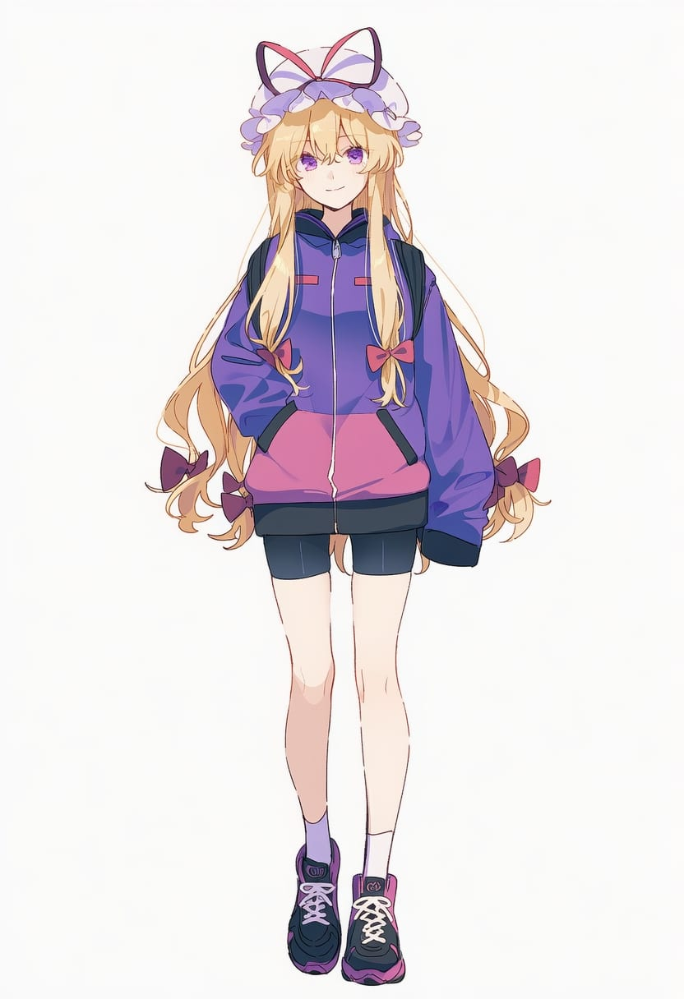

| 字段 | 内容 |
| --- | --- |
| Danbooru Tag | bike_shorts |
| 中文名 | 骑行短裤 |
| 中文含义 | 弹力贴身、通常到大腿中部的运动型短裤。 |
| 子类 | 运动裤装 |

## 49. dolphin_shorts — 运动风短裤，裤脚圆弧、侧边常有开衩或包边。

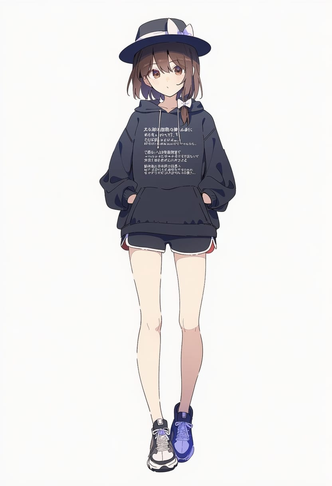

| 字段 | 内容 |
| --- | --- |
| Danbooru Tag | dolphin_shorts |
| 中文名 | 海豚短裤 |
| 中文含义 | 运动风短裤，裤脚圆弧、侧边常有开衩或包边。 |
| 子类 | 运动裤装 |

## 50. gym_shorts — 用于体育、健身或校园运动场景的短裤。

| 字段 | 内容 |
| --- | --- |
| Danbooru Tag | gym_shorts |
| 中文名 | 运动短裤 |
| 中文含义 | 用于体育、健身或校园运动场景的短裤。 |
| 子类 | 运动裤装 |

## 51. boxing_shorts — 拳击或格斗运动常见的宽松运动短裤。

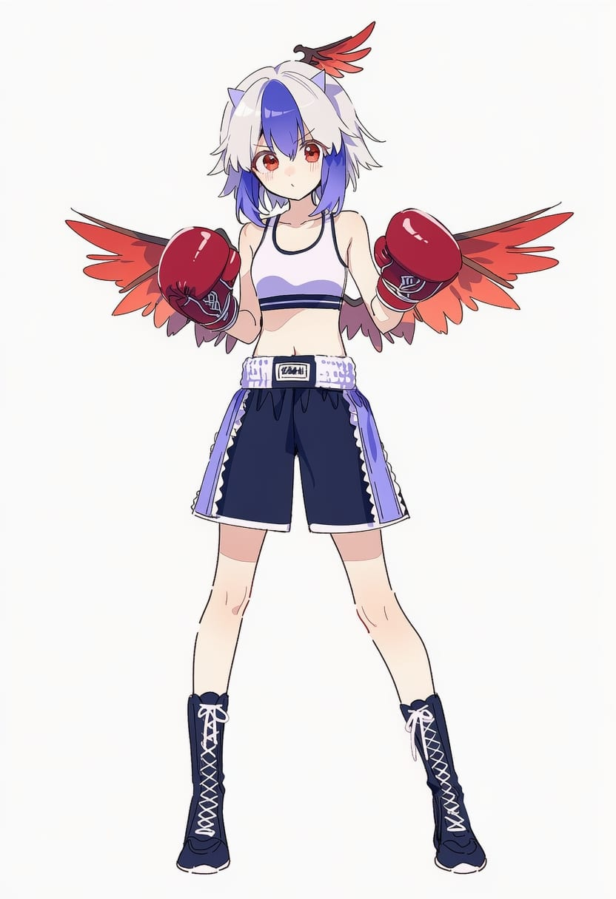

| 字段 | 内容 |
| --- | --- |
| Danbooru Tag | boxing_shorts |
| 中文名 | 拳击短裤 |
| 中文含义 | 拳击或格斗运动常见的宽松运动短裤。 |
| 子类 | 运动裤装 |

## 52. buruma — 日本学校体育服中常见的贴身体操短裤。

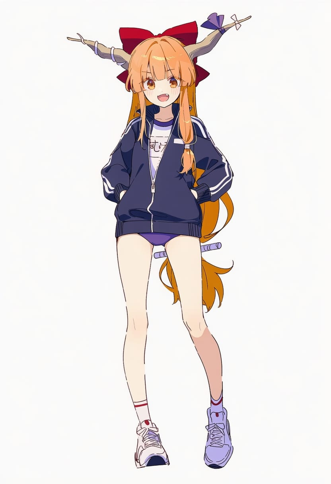

| 字段 | 内容 |
| --- | --- |
| Danbooru Tag | buruma |
| 中文名 | 日式体操短裤 |
| 中文含义 | 日本学校体育服中常见的贴身体操短裤。 |
| 子类 | 运动裤装 |

## 53. sweatpants — 柔软宽松、常用于运动或休闲穿着的长裤。

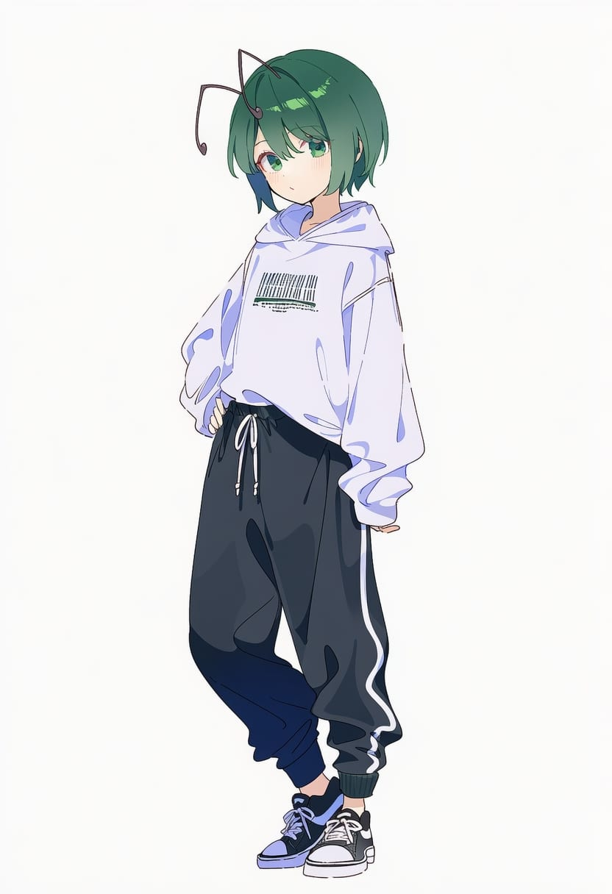

| 字段 | 内容 |
| --- | --- |
| Danbooru Tag | sweatpants |
| 中文名 | 运动卫裤 |
| 中文含义 | 柔软宽松、常用于运动或休闲穿着的长裤。 |
| 子类 | 运动裤装 |

## 54. track_pants — 运动套装式长裤，常见侧条纹或运动服面料。

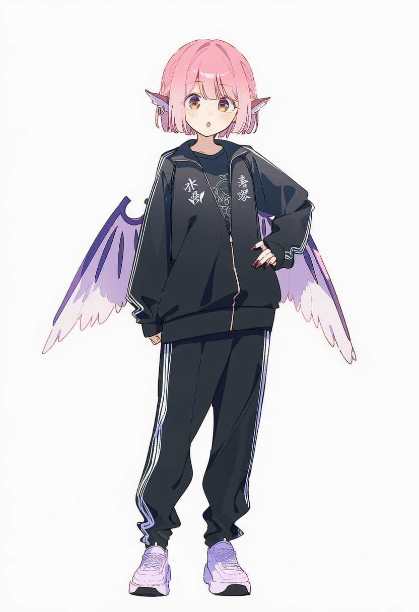

| 字段 | 内容 |
| --- | --- |
| Danbooru Tag | track_pants |
| 中文名 | 运动长裤 |
| 中文含义 | 运动套装式长裤，常见侧条纹或运动服面料。 |
| 子类 | 运动裤装 |

## 55. yoga_pants — 弹力贴身、常用于瑜伽或健身的长裤。

| 字段 | 内容 |
| --- | --- |
| Danbooru Tag | yoga_pants |
| 中文名 | 瑜伽裤 |
| 中文含义 | 弹力贴身、常用于瑜伽或健身的长裤。 |
| 子类 | 运动裤装 |

## 56. baggy_pants — 整体裤腿明显宽大松垮的长裤。

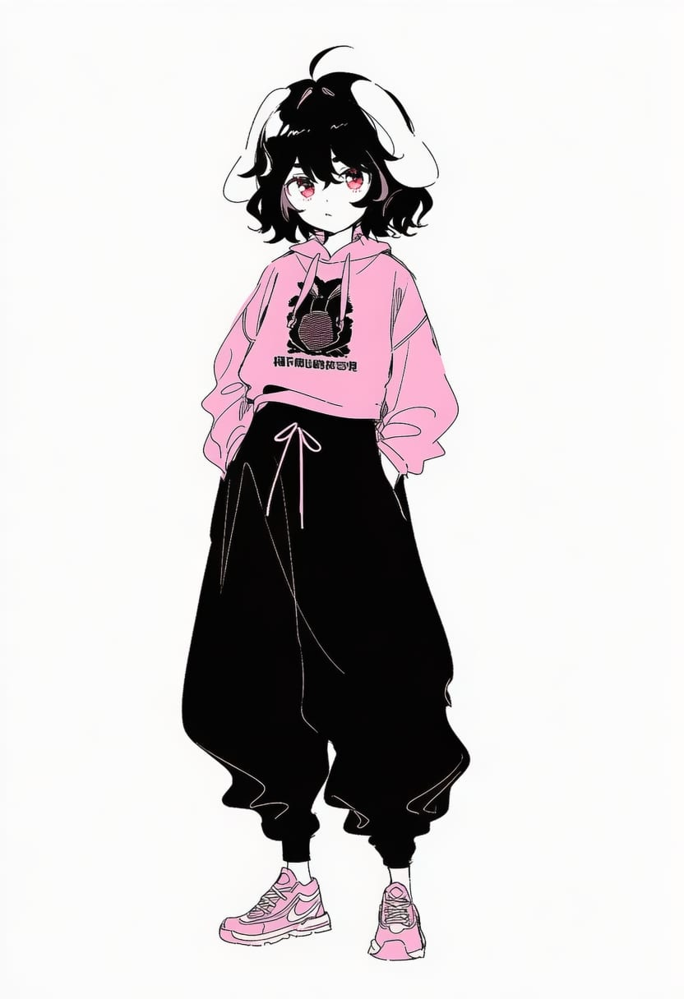

| 字段 | 内容 |
| --- | --- |
| Danbooru Tag | baggy_pants |
| 中文名 | 宽松长裤 |
| 中文含义 | 整体裤腿明显宽大松垮的长裤。 |
| 子类 | 款式/结构 |

## 57. tight_pants — 明显贴合腿部，但未必达到完全贴肤程度的长裤。

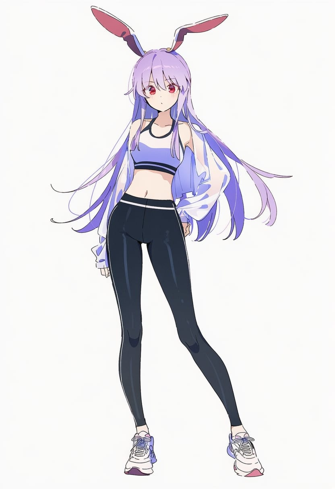

| 字段 | 内容 |
| --- | --- |
| Danbooru Tag | tight_pants |
| 中文名 | 紧身长裤 |
| 中文含义 | 明显贴合腿部，但未必达到完全贴肤程度的长裤。 |
| 子类 | 款式/结构 |

## 58. taut_pants — 裤子被身体撑得非常紧，布料呈明显拉伸状态。

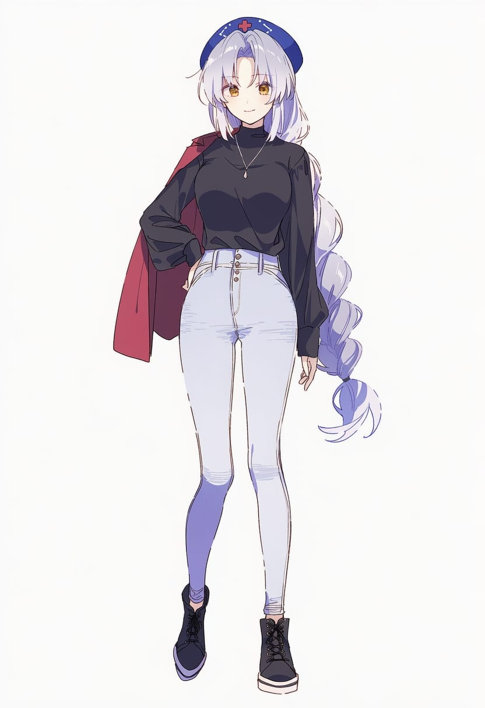

| 字段 | 内容 |
| --- | --- |
| Danbooru Tag | taut_pants |
| 中文名 | 绷紧的裤子 |
| 中文含义 | 裤子被身体撑得非常紧，布料呈明显拉伸状态。 |
| 子类 | 款式/结构 |

## 59. leather_pants — 以皮革或皮革质感材料制成的长裤。

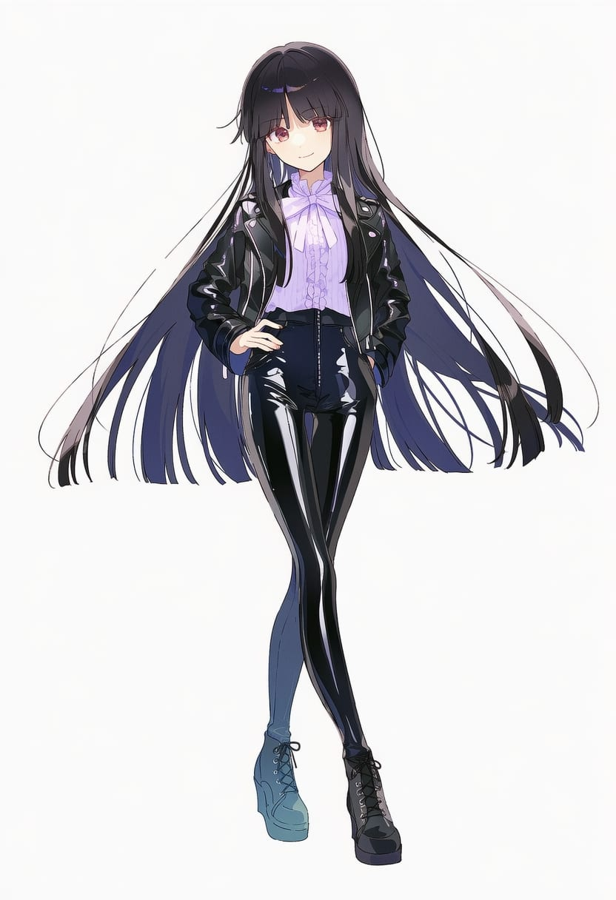

| 字段 | 内容 |
| --- | --- |
| Danbooru Tag | leather_pants |
| 中文名 | 皮裤 |
| 中文含义 | 以皮革或皮革质感材料制成的长裤。 |
| 子类 | 材质/透明 |

## 60. latex_pants — 以乳胶材质制成、表面光滑且通常贴身的长裤。

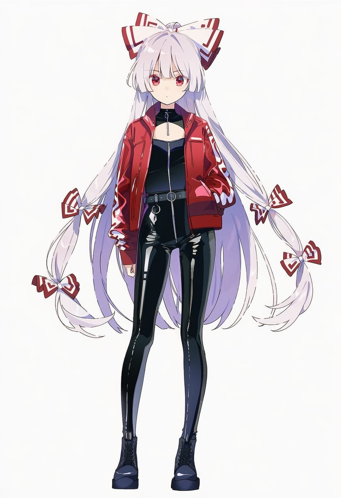

| 字段 | 内容 |
| --- | --- |
| Danbooru Tag | latex_pants |
| 中文名 | 乳胶裤 |
| 中文含义 | 以乳胶材质制成、表面光滑且通常贴身的长裤。 |
| 子类 | 材质/透明 |

## 61. see-through_pants — 布料具有明显透视效果、可看见内层或身体的长裤。

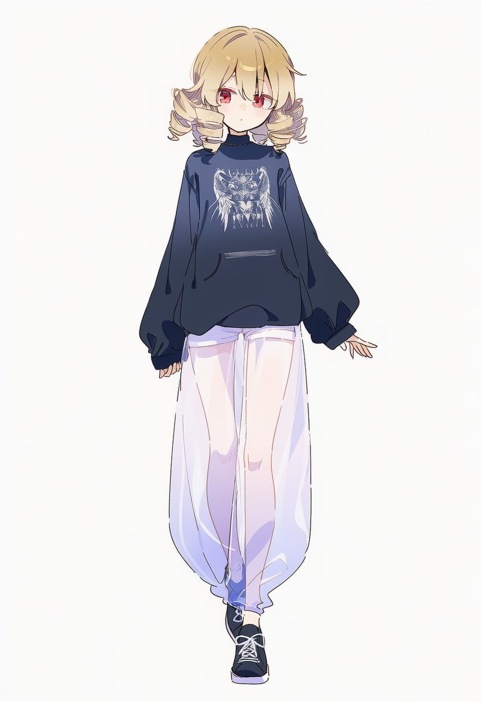

| 字段 | 内容 |
| --- | --- |
| Danbooru Tag | see-through_pants |
| 中文名 | 透明裤 |
| 中文含义 | 布料具有明显透视效果、可看见内层或身体的长裤。 |
| 子类 | 材质/透明 |

## 62. pants_rolled_up — 长裤裤脚被向上卷起，露出更多小腿或脚踝。

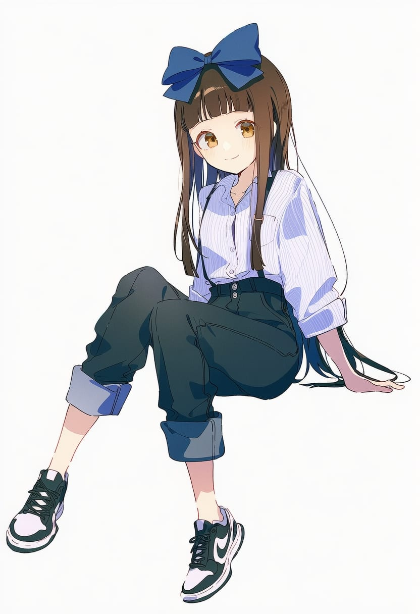

| 字段 | 内容 |
| --- | --- |
| Danbooru Tag | pants_rolled_up |
| 中文名 | 卷起裤脚 |
| 中文含义 | 长裤裤脚被向上卷起，露出更多小腿或脚踝。 |
| 子类 | 穿着状态/搭配 |

## 63. pants_tucked_in — 长裤裤脚被塞进靴子、鞋或其他腿部穿戴物内。

| 字段 | 内容 |
| --- | --- |
| Danbooru Tag | pants_tucked_in |
| 中文名 | 裤脚塞入鞋靴 |
| 中文含义 | 长裤裤脚被塞进靴子、鞋或其他腿部穿戴物内。 |
| 子类 | 穿着状态/搭配 |

## 64. open_pants — 裤门、腰头或裤装开合部位处于打开状态。

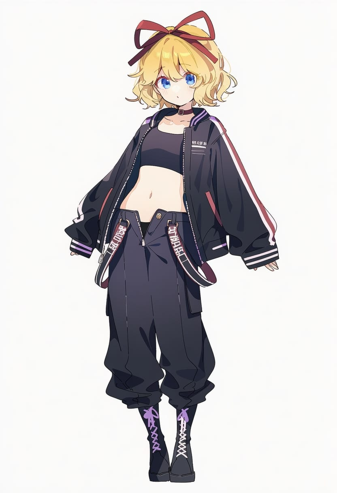

| 字段 | 内容 |
| --- | --- |
| Danbooru Tag | open_pants |
| 中文名 | 敞开的裤子 |
| 中文含义 | 裤门、腰头或裤装开合部位处于打开状态。 |
| 子类 | 穿着状态/搭配 |

## 65. pants_pull — 人物正在拉动、下拉或调整裤子。

| 字段 | 内容 |
| --- | --- |
| Danbooru Tag | pants_pull |
| 中文名 | 拉裤子 |
| 中文含义 | 人物正在拉动、下拉或调整裤子。 |
| 子类 | 穿着状态/搭配 |

## 66. unworn_pants — 裤子作为物件出现，但当前没有穿在人物身上。

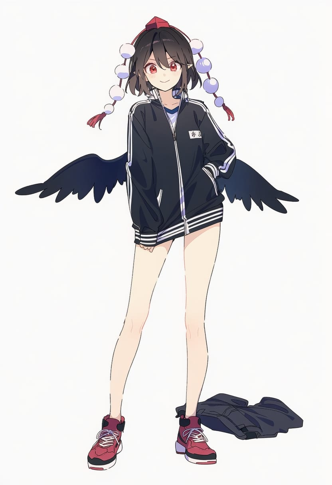

| 字段 | 内容 |
| --- | --- |
| Danbooru Tag | unworn_pants |
| 中文名 | 未穿着的裤子 |
| 中文含义 | 裤子作为物件出现，但当前没有穿在人物身上。 |
| 子类 | 穿着状态/搭配 |

## 67. pants_under_skirt — 裙子下面同时穿着长裤。

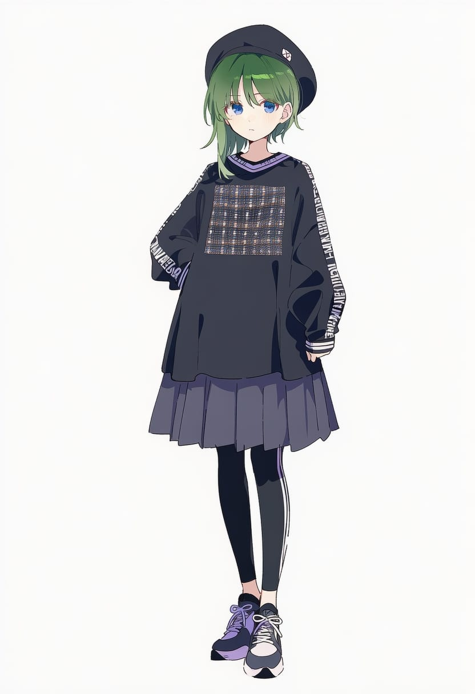

| 字段 | 内容 |
| --- | --- |
| Danbooru Tag | pants_under_skirt |
| 中文名 | 裙下穿长裤 |
| 中文含义 | 裙子下面同时穿着长裤。 |
| 子类 | 穿着状态/搭配 |

## 68. pants_under_dress — 连衣裙下面同时穿着长裤。

| 字段 | 内容 |
| --- | --- |
| Danbooru Tag | pants_under_dress |
| 中文名 | 连衣裙下穿长裤 |
| 中文含义 | 连衣裙下面同时穿着长裤。 |
| 子类 | 穿着状态/搭配 |

## 69. cargo_pants — 带有明显外置大口袋或工装结构的长裤。

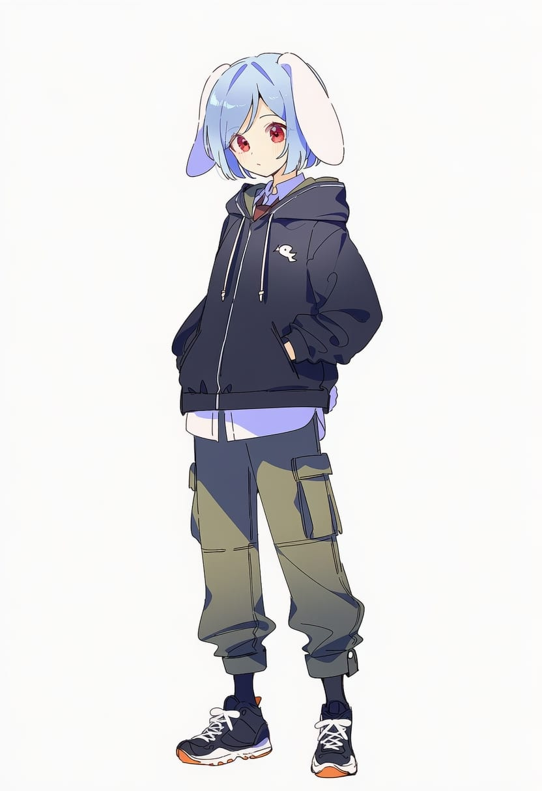

| 字段 | 内容 |
| --- | --- |
| Danbooru Tag | cargo_pants |
| 中文名 | 工装裤 |
| 中文含义 | 带有明显外置大口袋或工装结构的长裤。 |
| 子类 | 款式/结构 |

## 70. suit_pants — 与西装、正装搭配的正式长裤。

| 字段 | 内容 |
| --- | --- |
| Danbooru Tag | suit_pants |
| 中文名 | 西装裤 |
| 中文含义 | 与西装、正装搭配的正式长裤。 |
| 子类 | 款式/结构 |

## 71. harem_pants — 裆部和大腿较宽松、裤脚收窄的灯笼式长裤。

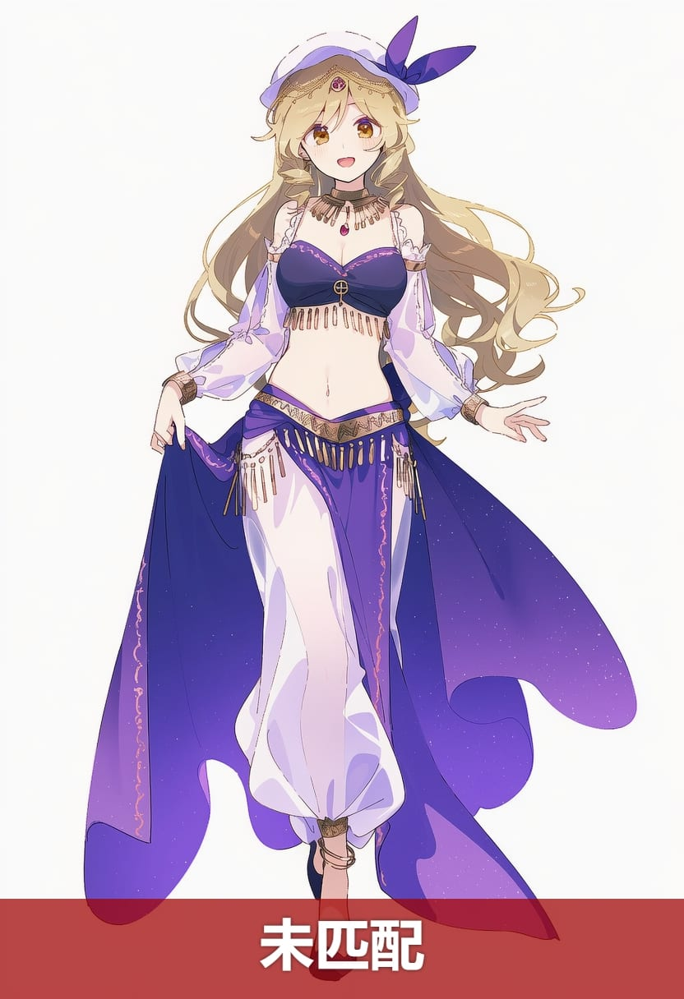

| 字段 | 内容 |
| --- | --- |
| Danbooru Tag | harem_pants |
| 中文名 | 哈伦裤 |
| 中文含义 | 裆部和大腿较宽松、裤脚收窄的灯笼式长裤。 |
| 子类 | 款式/结构 |

## 72. jodhpurs — 骑马用裤型，通常大腿较宽、膝下明显收紧。

| 字段 | 内容 |
| --- | --- |
| Danbooru Tag | jodhpurs |
| 中文名 | 马裤 |
| 中文含义 | 骑马用裤型，通常大腿较宽、膝下明显收紧。 |
| 子类 | 款式/结构 |

## 73. bell-bottoms — 裤腿从膝部向下逐渐外扩形成喇叭形。

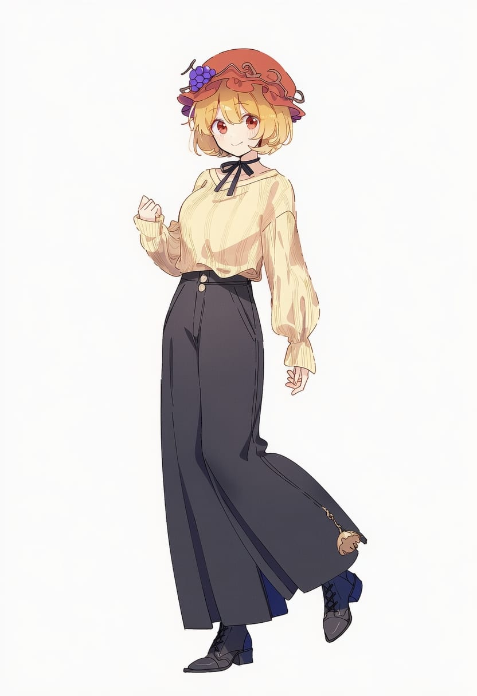

| 字段 | 内容 |
| --- | --- |
| Danbooru Tag | bell-bottoms |
| 中文名 | 喇叭裤 |
| 中文含义 | 裤腿从膝部向下逐渐外扩形成喇叭形。 |
| 子类 | 款式/结构 |

## 74. puffy_pants — 裤腿明显蓬松，但脚踝附近收紧的裤型。

| 字段 | 内容 |
| --- | --- |
| Danbooru Tag | puffy_pants |
| 中文名 | 蓬蓬裤 |
| 中文含义 | 裤腿明显蓬松，但脚踝附近收紧的裤型。 |
| 子类 | 款式/结构 |

## 75. parachute_pants — 宽松、轻薄、带机能或束口感的长裤。

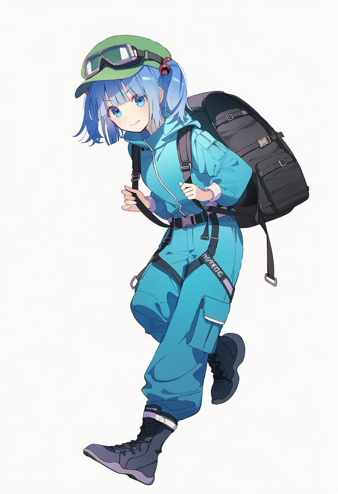

| 字段 | 内容 |
| --- | --- |
| Danbooru Tag | parachute_pants |
| 中文名 | 降落伞裤 |
| 中文含义 | 宽松、轻薄、带机能或束口感的长裤。 |
| 子类 | 款式/结构 |

## 76. plaid_pants — 带有 plaid / tartan 风格交叉格纹的长裤。

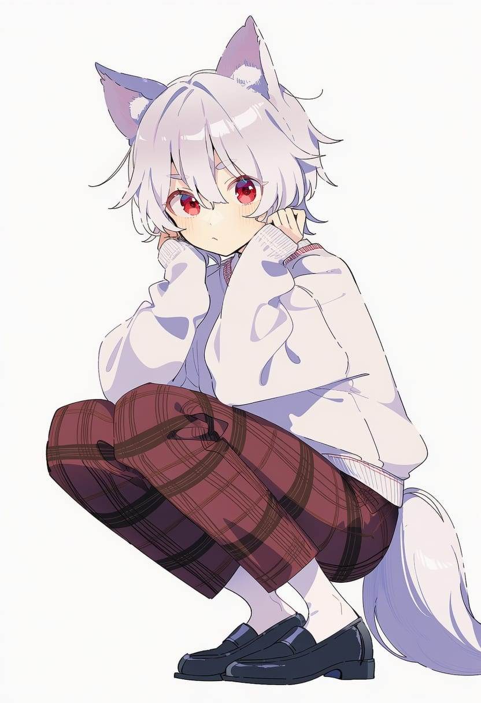

| 字段 | 内容 |
| --- | --- |
| Danbooru Tag | plaid_pants |
| 中文名 | 格纹长裤 |
| 中文含义 | 带有 plaid / tartan 风格交叉格纹的长裤。 |
| 子类 | 图案/配色 |

## 77. checkered_pants — 带有规则方格或棋盘格图案的长裤。

| 字段 | 内容 |
| --- | --- |
| Danbooru Tag | checkered_pants |
| 中文名 | 棋盘格长裤 |
| 中文含义 | 带有规则方格或棋盘格图案的长裤。 |
| 子类 | 图案/配色 |

## 78. striped_pants — 带有条纹图案的长裤。

| 字段 | 内容 |
| --- | --- |
| Danbooru Tag | striped_pants |
| 中文名 | 条纹长裤 |
| 中文含义 | 带有条纹图案的长裤。 |
| 子类 | 图案/配色 |

## 79. camouflage_pants — 带有军事迷彩图案的长裤。

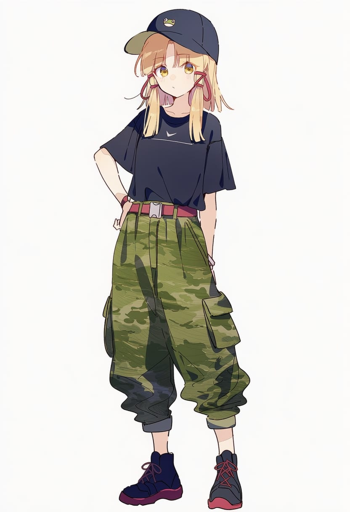

| 字段 | 内容 |
| --- | --- |
| Danbooru Tag | camouflage_pants |
| 中文名 | 迷彩长裤 |
| 中文含义 | 带有军事迷彩图案的长裤。 |
| 子类 | 图案/配色 |

## 80. pinstripe_pants — 带有细而密集的正装式条纹图案。

| 字段 | 内容 |
| --- | --- |
| Danbooru Tag | pinstripe_pants |
| 中文名 | 细条纹长裤 |
| 中文含义 | 带有细而密集的正装式条纹图案。 |
| 子类 | 图案/配色 |

## 81. print_pants — 表面带有明确印花、图形或重复图案的长裤。

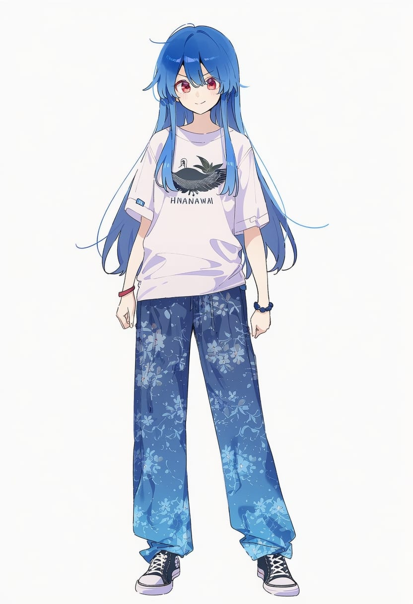

| 字段 | 内容 |
| --- | --- |
| Danbooru Tag | print_pants |
| 中文名 | 印花长裤 |
| 中文含义 | 表面带有明确印花、图形或重复图案的长裤。 |
| 子类 | 图案/配色 |

## 82. black_pants — 主要颜色为黑色的长裤。

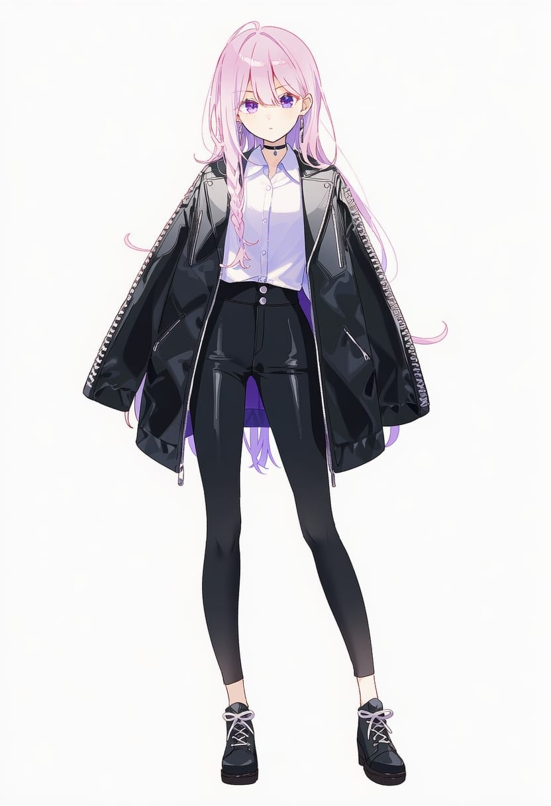

| 字段 | 内容 |
| --- | --- |
| Danbooru Tag | black_pants |
| 中文名 | 黑色长裤 |
| 中文含义 | 主要颜色为黑色的长裤。 |
| 子类 | 图案/配色 |

## 83. multicolored_pants — 裤子同时具有三种或更多明显颜色。

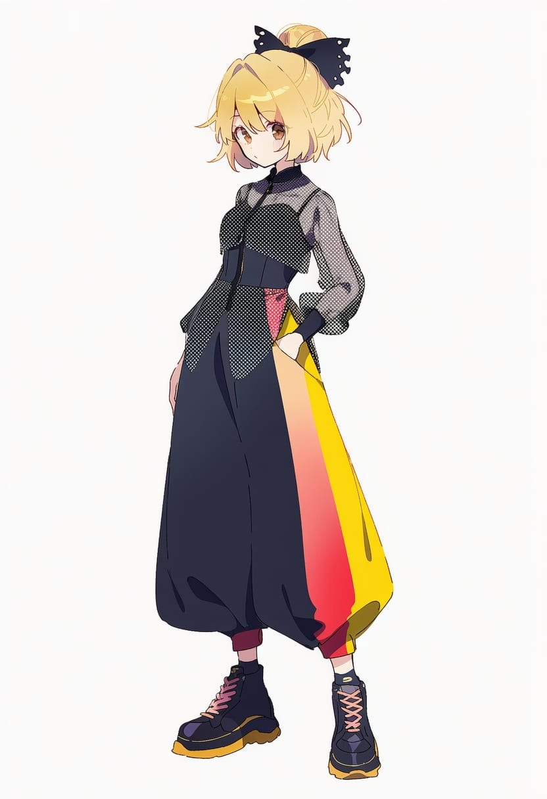

| 字段 | 内容 |
| --- | --- |
| Danbooru Tag | multicolored_pants |
| 中文名 | 多色长裤 |
| 中文含义 | 裤子同时具有三种或更多明显颜色。 |
| 子类 | 图案/配色 |

## 84. two-tone_pants — 裤子由两种主要颜色构成。

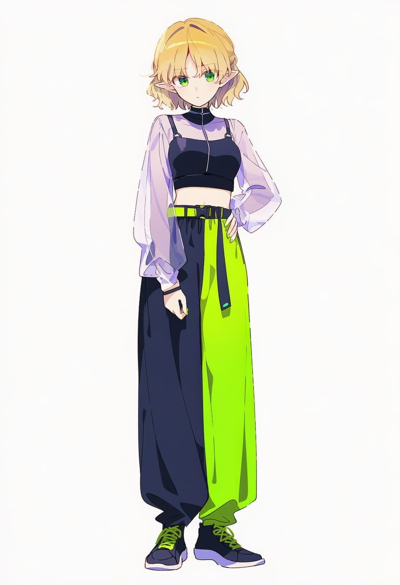

| 字段 | 内容 |
| --- | --- |
| Danbooru Tag | two-tone_pants |
| 中文名 | 双色长裤 |
| 中文含义 | 裤子由两种主要颜色构成。 |
| 子类 | 图案/配色 |

## 85. gradient_pants — 裤子颜色呈连续渐变过渡。

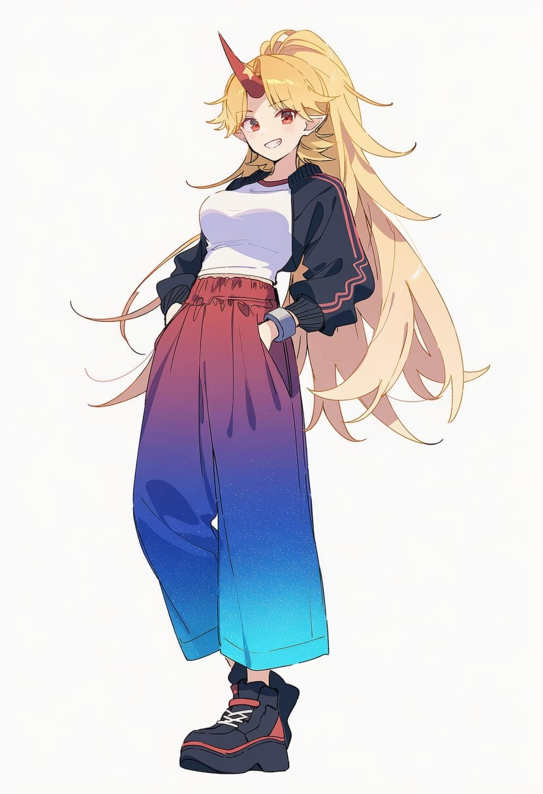

| 字段 | 内容 |
| --- | --- |
| Danbooru Tag | gradient_pants |
| 中文名 | 渐变色长裤 |
| 中文含义 | 裤子颜色呈连续渐变过渡。 |
| 子类 | 图案/配色 |

## 86. high-waist_pants — 裤腰位置明显高于常规腰线的长裤。

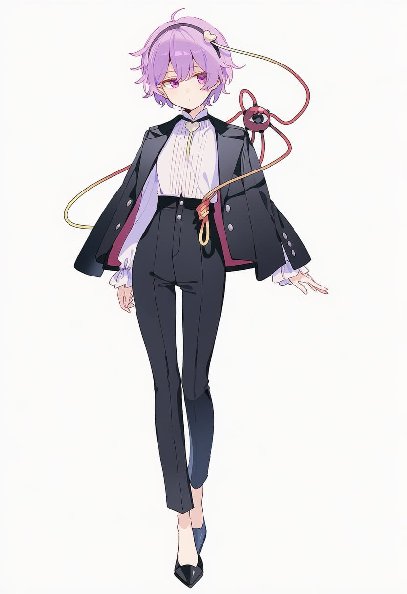

| 字段 | 内容 |
| --- | --- |
| Danbooru Tag | high-waist_pants |
| 中文名 | 高腰裤 |
| 中文含义 | 裤腰位置明显高于常规腰线的长裤。 |
| 子类 | 款式/结构 |

## 87. lowleg_pants — 裤腰下移、胯部和下腹暴露更多的长裤。

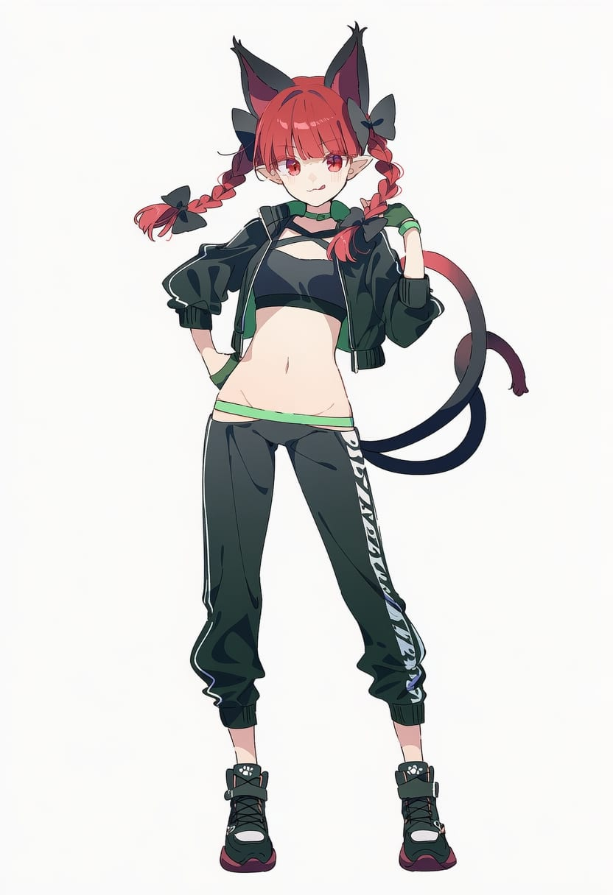

| 字段 | 内容 |
| --- | --- |
| Danbooru Tag | lowleg_pants |
| 中文名 | 低腰裤 |
| 中文含义 | 裤腰下移、胯部和下腹暴露更多的长裤。 |
| 子类 | 款式/结构 |

## 88. capri_pants — 长度短于普通长裤、通常露出脚踝或小腿下部。

| 字段 | 内容 |
| --- | --- |
| Danbooru Tag | capri_pants |
| 中文名 | 七分裤 / 卡普里裤 |
| 中文含义 | 长度短于普通长裤、通常露出脚踝或小腿下部。 |
| 子类 | 款式/结构 |

## 89. frilled_pants — 裤装带有荷叶边、褶边等装饰。

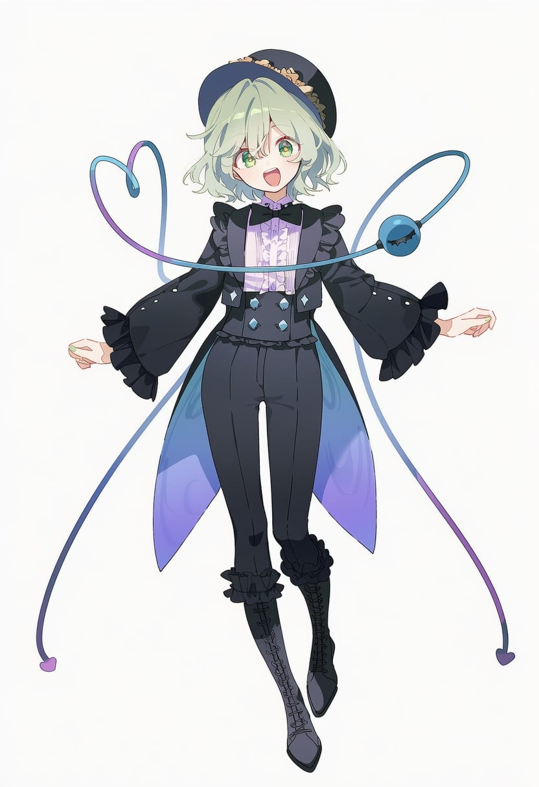

| 字段 | 内容 |
| --- | --- |
| Danbooru Tag | frilled_pants |
| 中文名 | 荷叶边裤 |
| 中文含义 | 裤装带有荷叶边、褶边等装饰。 |
| 子类 | 款式/结构 |

## 90. fur-trimmed_pants — 裤装边缘带有毛皮或绒毛饰边。

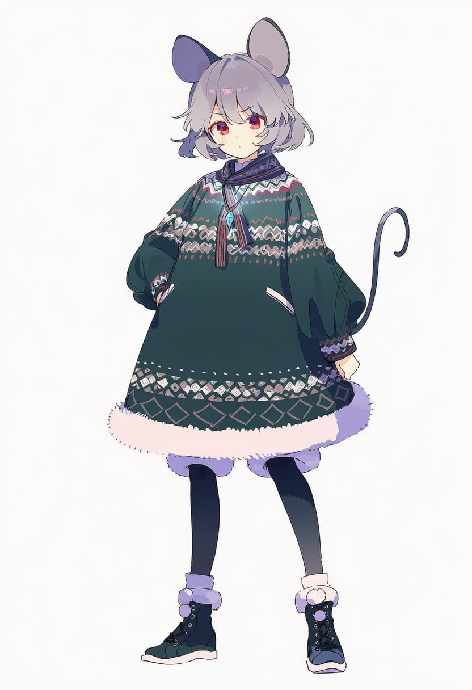

| 字段 | 内容 |
| --- | --- |
| Danbooru Tag | fur-trimmed_pants |
| 中文名 | 毛边装饰裤 |
| 中文含义 | 裤装边缘带有毛皮或绒毛饰边。 |
| 子类 | 款式/结构 |

## 91. torn_pants — 裤面有明显撕裂、破洞或破损结构的长裤。

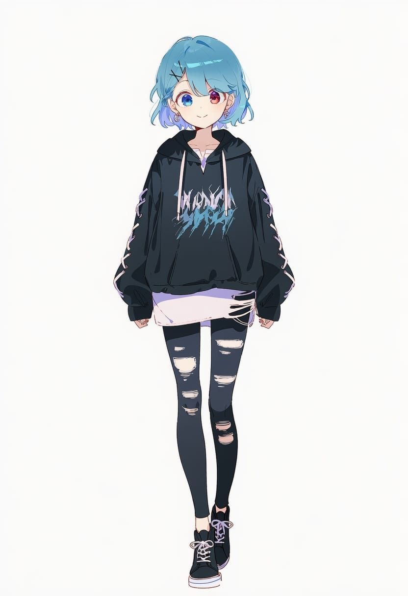

| 字段 | 内容 |
| --- | --- |
| Danbooru Tag | torn_pants |
| 中文名 | 破损长裤 |
| 中文含义 | 裤面有明显撕裂、破洞或破损结构的长裤。 |
| 子类 | 款式/结构 |

---
