# 身份设定

## 1. 海盗

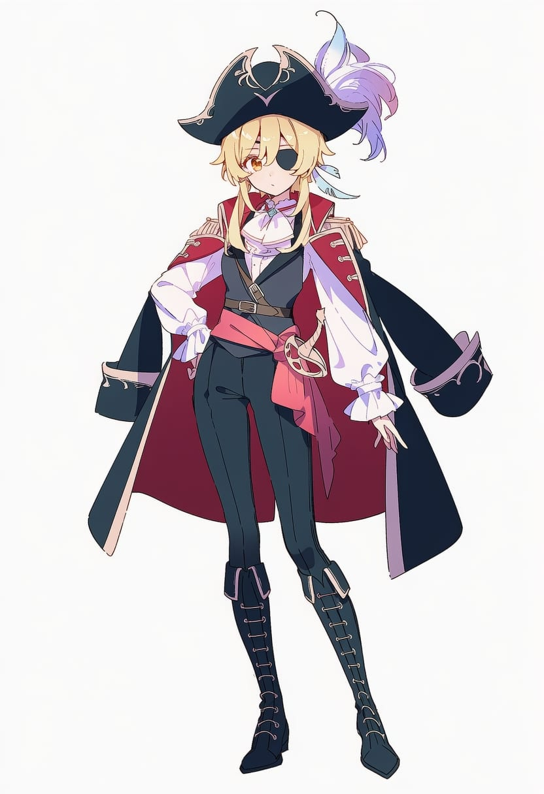

| 字段 | 内容 |
| --- | --- |
| 职业/身份原型（中文） | 海盗 |
| NovelAI / Danbooru Tag 串 | 1.35::pirate::, 1.28::pirate_hat::, 1.22::coat::, 1.16::vest::, 1.12::sash::, 1.10::boots::, 1.08::eyepatch::, 1.06::cutlass::, 1.04::belt_pouch:: |
| 组合思路（大白话） | 海盗帽、长外套、腰带/腰封、长靴和弯刀，再加眼罩做经典形象。 |
| 世界细分 | 大航海 / 海盗时代 |
| 模特 | 1girl,lumine_(genshin_impact) |
| 序号 | 0001 |

## 2. 海盗船长

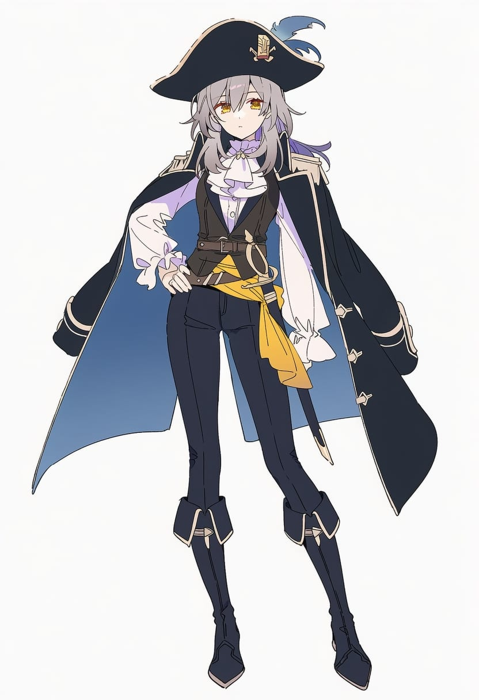

| 字段 | 内容 |
| --- | --- |
| 职业/身份原型（中文） | 海盗船长 |
| NovelAI / Danbooru Tag 串 | 1.35::pirate::, 1.28::tricorn::, 1.22::long_coat::, 1.16::vest::, 1.12::boots::, 1.10::belt::, 1.08::sash::, 1.06::sword::, 1.04::flintlock:: |
| 组合思路（大白话） | 三角帽、长外套、马甲、腰带和弯刀/燧发枪组合成经典海盗船长。 |
| 世界细分 | 大航海 / 海盗时代 |
| 模特 | 1girl,stelle_(honkai:_star_rail) |
| 序号 | 0002 |

## 3. 考古学家

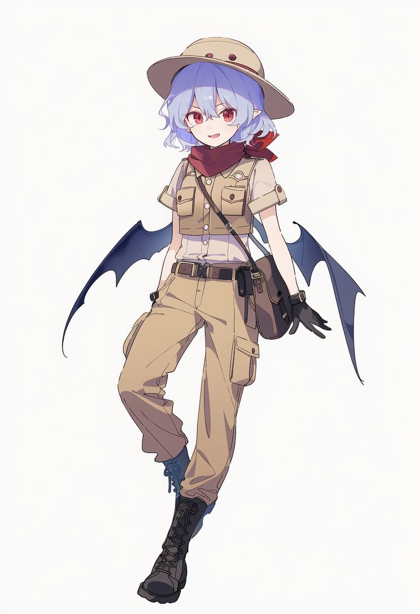

| 字段 | 内容 |
| --- | --- |
| 职业/身份原型（中文） | 考古学家 |
| NovelAI / Danbooru Tag 串 | 1.35::wide-brimmed_hat::, 1.28::vest::, 1.22::scarf::, 1.16::boots::, 1.12::satchel::, 1.10::gloves::, 1.08::safari_hat::, 1.06::button_up_shirt::, 1.04::cargo_pants::, 1.02::belt_pouch:: |
| 组合思路（大白话） | 宽檐帽、功能马甲、围巾、靴子和挎包，整体偏野外遗址工作而不是办公室学者。 |
| 世界细分 | 都市白领 / 专业职业 |
| 模特 | 1girl,remilia_scarlet |
| 序号 | 0003 |

## 4. 记者

| 字段 | 内容 |
| --- | --- |
| 职业/身份原型（中文） | 记者 |
| NovelAI / Danbooru Tag 串 | 1.35::trench_coat::, 1.28::collared_shirt::, 1.22::necktie::, 1.16::messenger_bag::, 1.12::camera::, 1.10::notebook::, 1.08::shoulder_bag::, 1.06::holding_microphone::, 1.04::press_badge:: |
| 组合思路（大白话） | 风衣、衬衫、斜挎包、相机和本子做出奔走采访的职业感。 |
| 世界细分 | 都市白领 / 专业职业 |
| 模特 | 1girl,mazaki_anzu |
| 序号 | 0004 |

## 5. 废土医生

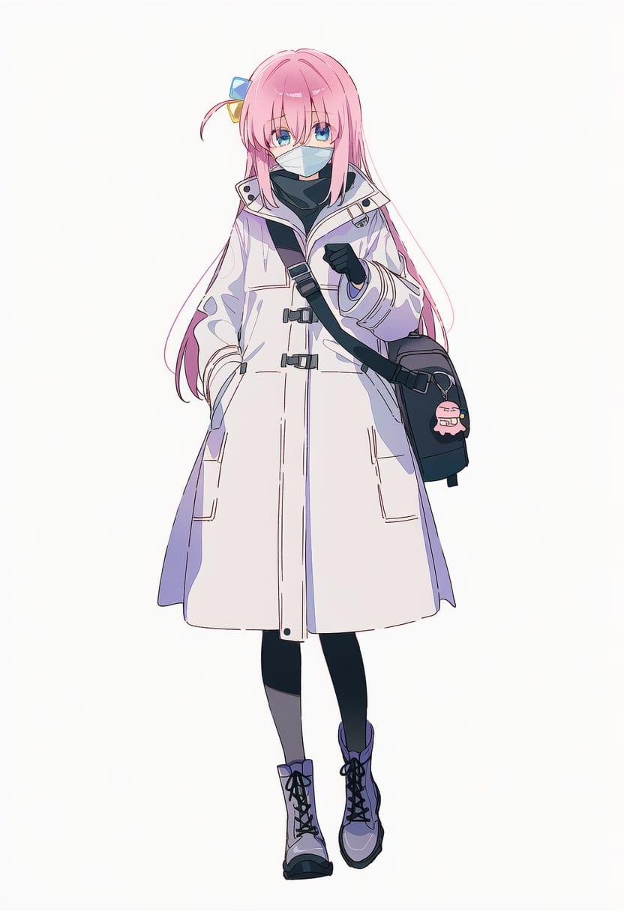

| 字段 | 内容 |
| --- | --- |
| 职业/身份原型（中文） | 废土医生 |
| NovelAI / Danbooru Tag 串 | 1.35::long_coat::, 1.28::gloves::, 1.22::surgical_mask::, 1.16::bandages::, 1.12::shoulder_bag::, 1.10::boots::, 1.08::goggles:: |
| 组合思路（大白话） | 磨损长外套、口罩、手套、绷带和医疗肩包，像资源紧缺环境中的流动医生。 |
| 世界细分 | 废土 / 灾后生存 |
| 模特 | 1girl,gotoh_hitori |
| 序号 | 0005 |

## 6. 废土游骑兵

| 字段 | 内容 |
| --- | --- |
| 职业/身份原型（中文） | 废土游骑兵 |
| NovelAI / Danbooru Tag 串 | 1.35::long_coat::, 1.28::body_armor::, 1.22::cowboy_hat::, 1.16::scarf::, 1.12::gloves::, 1.10::combat_boots::, 1.08::utility_belt:: |
| 组合思路（大白话） | 西部游骑兵和现代防护混搭：长外套、牛仔帽、围巾、轻甲和战斗靴。 |
| 世界细分 | 废土 / 灾后生存 |
| 模特 | 1girl,medusa_(fate) |
| 序号 | 0007 |

## 7. 厨师

| 字段 | 内容 |
| --- | --- |
| 职业/身份原型（中文） | 厨师 |
| NovelAI / Danbooru Tag 串 | 1.35::chef_hat::, 1.28::apron::, 1.22::neckerchief::, 1.16::gloves::, 1.12::kitchen_knife::, 1.10::chef::, 1.08::collared_shirt::, 1.06::holding_spatula::, 1.04::double-breasted::, 1.02::slacks:: |
| 组合思路（大白话） | 高厨师帽和围裙直接建立厨房职业感，领巾、手套和厨刀补充工作细节。 |
| 世界细分 | 服务业 / 餐饮 / 酒店 |
| 模特 | 1girl,hakurei_reimu |
| 序号 | 0008 |

## 8. 咖啡师

| 字段 | 内容 |
| --- | --- |
| 职业/身份原型（中文） | 咖啡师 |
| NovelAI / Danbooru Tag 串 | 1.35::apron::, 1.28::collared_shirt::, 1.22::rolled_up_sleeves::, 1.16::neckerchief::, 1.12::gloves::, 1.10::barista::, 1.08::name_tag::, 1.06::holding_cup::, 1.04::waist_apron:: |
| 组合思路（大白话） | 围裙放第一位，卷袖和衬衫让角色像在吧台持续操作，而不是正式餐厅侍者。 |
| 世界细分 | 服务业 / 餐饮 / 酒店 |
| 模特 | 1girl,tenjouin_asuka |
| 序号 | 0009 |

## 9. 女仆

| 字段 | 内容 |
| --- | --- |
| 职业/身份原型（中文） | 女仆 |
| NovelAI / Danbooru Tag 串 | 1.35::maid::, 1.28::maid_headdress::, 1.22::maid_apron::, 1.16::frilled_dress::, 1.12::puffy_sleeves::, 1.10::frills::, 1.08::bow::, 1.06::frilled_cuffs::, 1.04::mary_janes::, 1.02::thighhighs:: |
| 组合思路（大白话） | 经典女仆就让头饰和 maid_apron 做主角，再叠荷叶边、泡泡袖和蝴蝶结。 |
| 世界细分 | 服务业 / 餐饮 / 酒店 |
| 模特 | 1girl,rem_(re:zero) |
| 序号 | 0010 |

## 10. 客房服务员

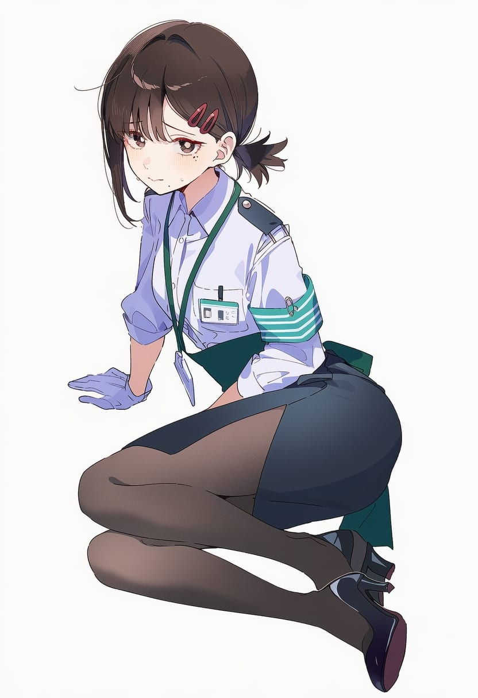

| 字段 | 内容 |
| --- | --- |
| 职业/身份原型（中文） | 客房服务员 |
| NovelAI / Danbooru Tag 串 | 1.35::uniform::, 1.28::apron::, 1.22::gloves::, 1.16::id_card::, 1.12::hairnet:: |
| 组合思路（大白话） | 统一工作服、围裙、手套和工牌，以干净、方便劳动为主。 |
| 世界细分 | 服务业 / 餐饮 / 酒店 |
| 模特 | 1girl,higashiyama_kobeni |
| 序号 | 0011 |

## 11. 清洁工

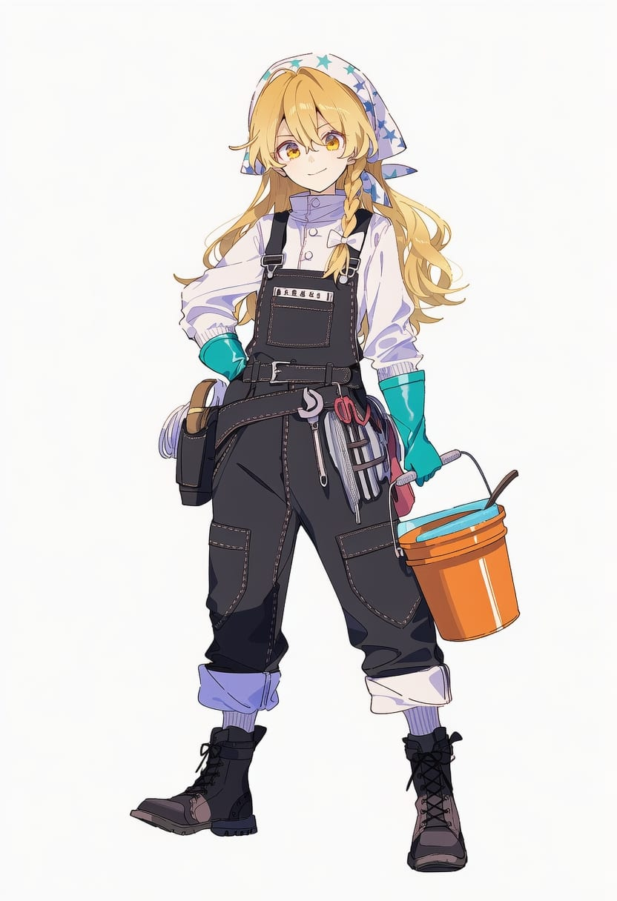

| 字段 | 内容 |
| --- | --- |
| 职业/身份原型（中文） | 清洁工 |
| NovelAI / Danbooru Tag 串 | 1.35::coveralls::, 1.28::apron::, 1.22::rubber_gloves::, 1.16::boots::, 1.12::headscarf::, 1.10::bucket:: |
| 组合思路（大白话） | 耐脏工作服、橡胶手套和靴子是核心，再用头巾与水桶强化清洁岗位。 |
| 世界细分 | 服务业 / 餐饮 / 酒店 |
| 模特 | 1girl,kirisame_marisa |
| 序号 | 0012 |

## 12. 环卫工人

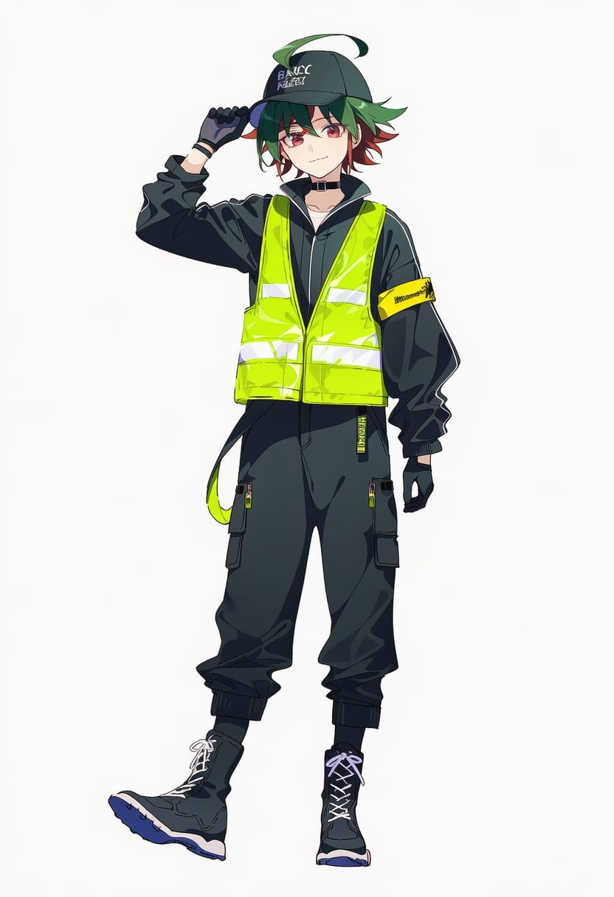

| 字段 | 内容 |
| --- | --- |
| 职业/身份原型（中文） | 环卫工人 |
| NovelAI / Danbooru Tag 串 | 1.35::coveralls::, 1.28::gloves::, 1.22::boots::, 1.16::baseball_cap::, 1.12::high-visibility_vest:: |
| 组合思路（大白话） | 连体工作服、手套、工作靴、棒球帽与高可视背心，直接强化市政环卫的高可视作业感。 |
| 世界细分 | 服务业 / 餐饮 / 酒店 |
| 模特 | 1boy,sakaki_yuya |
| 序号 | 0013 |

## 13. 人鱼祭司

| 字段 | 内容 |
| --- | --- |
| 职业/身份原型（中文） | 人鱼祭司 |
| NovelAI / Danbooru Tag 串 | 1.35::mermaid::, 1.28::capelet::, 1.22::pearl_necklace::, 1.16::circlet::, 1.12::bracelet::, 1.10::jewelry::, 1.08::staff:: |
| 组合思路（大白话） | 人鱼身份配短披肩、珍珠项链、额环、手镯和法杖，走水下神殿祭司路线。 |
| 世界细分 | 高幻想种族 / 魔兽风 |
| 模特 | 1girl,shirahoshi |
| 序号 | 0015 |

## 14. 兽人族猎手

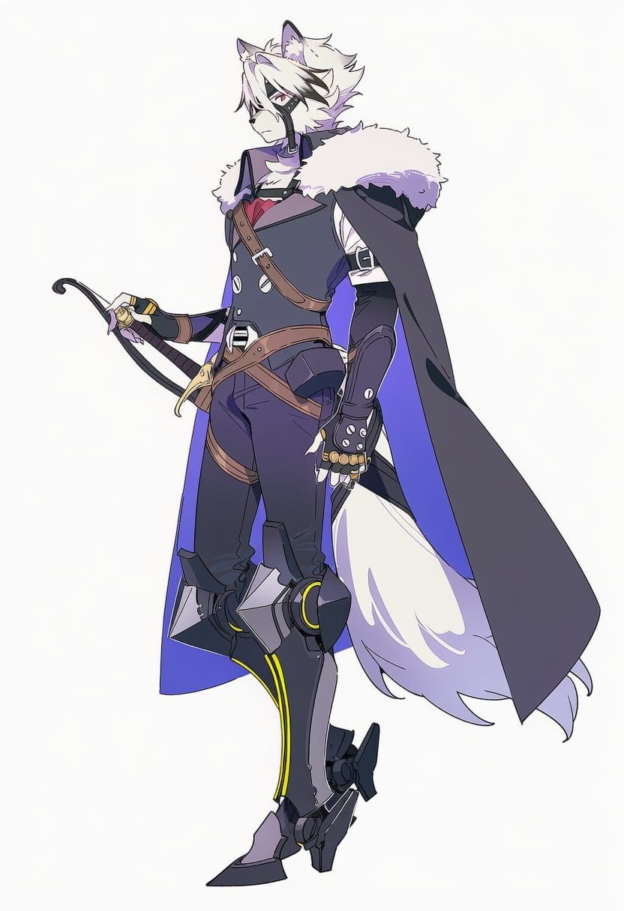

| 字段 | 内容 |
| --- | --- |
| 职业/身份原型（中文） | 兽人族猎手 |
| NovelAI / Danbooru Tag 串 | 1.35::animal_ears::, 1.28::fur_trim::, 1.22::leather_armor::, 1.16::cloak::, 1.12::bow_(weapon)::, 1.10::quiver::, 1.08::boots:: |
| 组合思路（大白话） | 兽耳和毛皮负责种族感，皮甲、披风、弓箭负责猎手职业。 |
| 世界细分 | 高幻想种族 / 魔兽风 |
| 模特 | 1boy,von_lycaon |
| 序号 | 0016 |

## 15. 哥布林技师

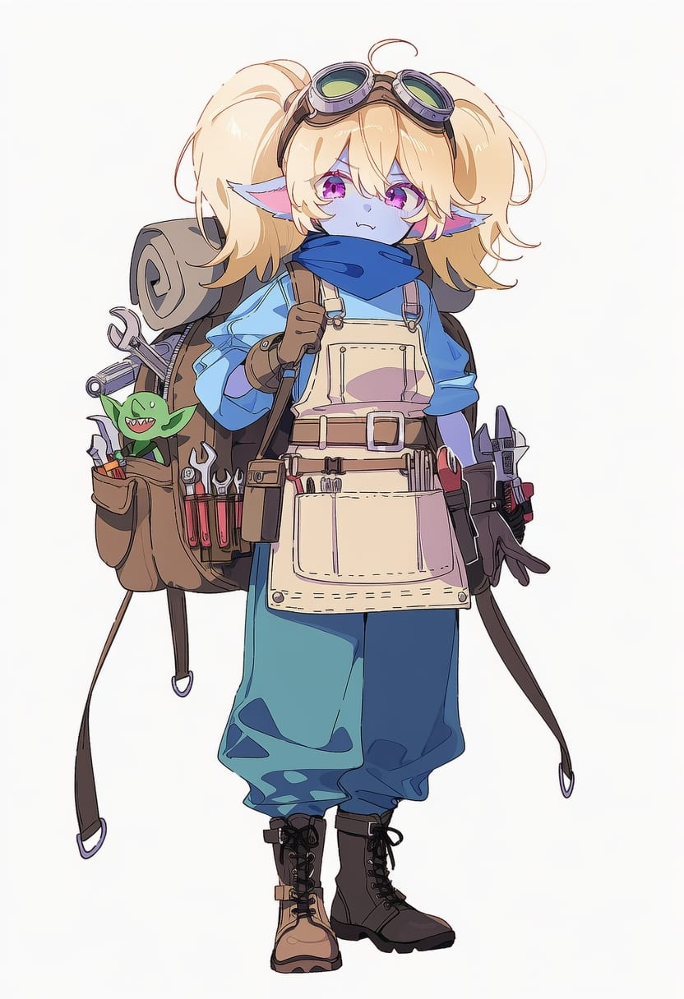

| 字段 | 内容 |
| --- | --- |
| 职业/身份原型（中文） | 哥布林技师 |
| NovelAI / Danbooru Tag 串 | 1.35::goblin::, 1.28::goggles::, 1.22::apron::, 1.16::gloves::, 1.12::tool_belt::, 1.10::wrench::, 1.08::backpack:: |
| 组合思路（大白话） | 护目镜、围裙、工具腰带、扳手和背包，做成忙碌、杂乱但能干的机械技师。 |
| 世界细分 | 高幻想种族 / 魔兽风 |
| 模特 | 1girl,poppy_(league_of_legends) |
| 序号 | 0017 |

## 16. 堕天使骑士

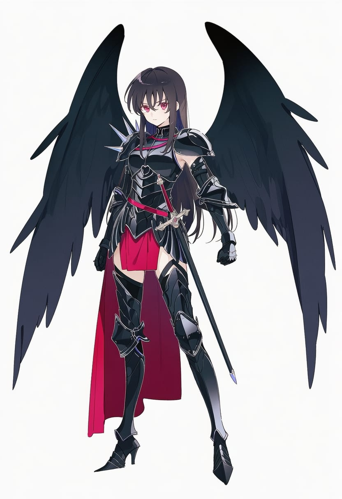

| 字段 | 内容 |
| --- | --- |
| 职业/身份原型（中文） | 堕天使骑士 |
| NovelAI / Danbooru Tag 串 | 1.35::black_wings::, 1.28::black_armor::, 1.22::plate_armor::, 1.16::pauldrons::, 1.12::gauntlets::, 1.10::cape::, 1.08::sword:: |
| 组合思路（大白话） | 黑翼是身份层，黑色板甲、肩甲、手甲、披风和剑负责骑士职业。 |
| 世界细分 | 高幻想种族 / 魔兽风 |
| 模特 | 1girl,raynare |
| 序号 | 0018 |

## 17. 天使圣女

| 字段 | 内容 |
| --- | --- |
| 职业/身份原型（中文） | 天使圣女 |
| NovelAI / Danbooru Tag 串 | 1.35::halo::, 1.28::white_dress::, 1.22::veil::, 1.16::capelet::, 1.12::gloves::, 1.10::rosary::, 1.08::tiara:: |
| 组合思路（大白话） | 白裙、面纱、短披肩、念珠和小冠饰是圣女服饰，光环只作为身份增强。 |
| 世界细分 | 高幻想种族 / 魔兽风 |
| 模特 | 1girl,gabriel_tenma_white |
| 序号 | 0019 |

## 18. 恶魔贵族

| 字段 | 内容 |
| --- | --- |
| 职业/身份原型（中文） | 恶魔贵族 |
| NovelAI / Danbooru Tag 串 | 1.35::horns::, 1.28::aristocratic_clothes::, 1.22::cape::, 1.16::gloves::, 1.12::cravat::, 1.10::brooch::, 1.08::boots:: |
| 组合思路（大白话） | 角是种族标识，贵族服、披风、手套、领巾和胸针负责建立上层阶级。 |
| 世界细分 | 高幻想种族 / 魔兽风 |
| 模特 | 1girl,rias_gremory |
| 序号 | 0020 |

## 19. 猫族商人

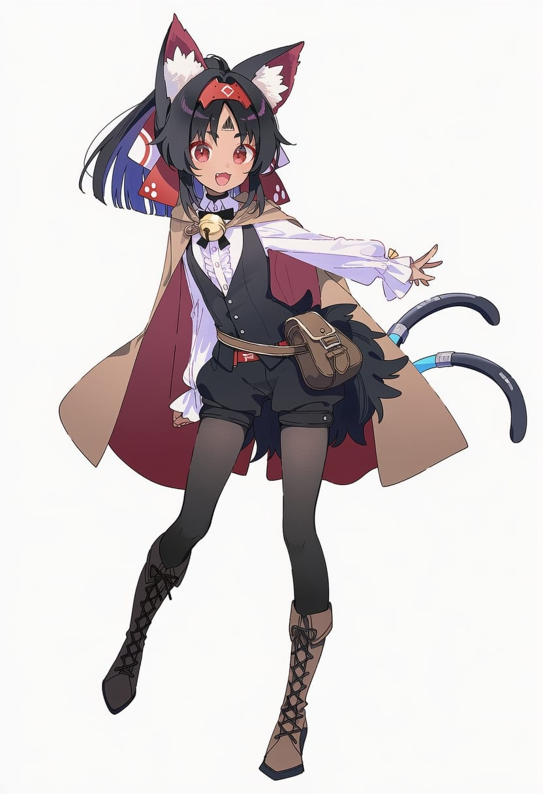

| 字段 | 内容 |
| --- | --- |
| 职业/身份原型（中文） | 猫族商人 |
| NovelAI / Danbooru Tag 串 | 1.35::cat_ears::, 1.28::cloak::, 1.22::pouch::, 1.16::satchel::, 1.12::jewelry::, 1.10::boots::, 1.08::vest:: |
| 组合思路（大白话） | 猫耳只是身份提示，真正的商人感来自大量钱袋/挎包、马甲和珠宝。 |
| 世界细分 | 高幻想种族 / 魔兽风 |
| 模特 | 1girl,nekomiya_mana |
| 序号 | 0021 |

## 20. 矮人战士

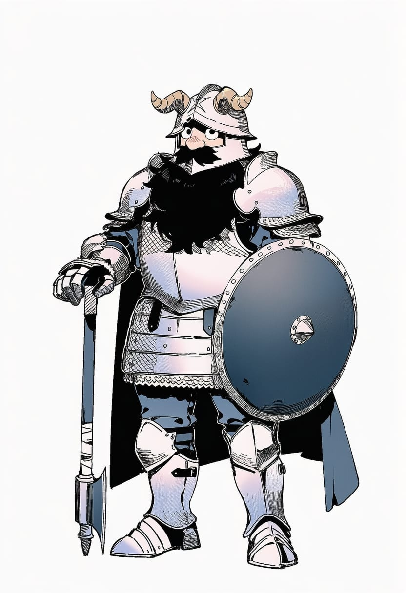

| 字段 | 内容 |
| --- | --- |
| 职业/身份原型（中文） | 矮人战士 |
| NovelAI / Danbooru Tag 串 | 1.35::dwarf::, 1.28::full_armor::, 1.22::horned_helmet::, 1.16::round_shield::, 1.12::axe::, 1.10::boots::, 1.08::gauntlets:: |
| 组合思路（大白话） | 短壮种族外形配厚甲、角盔、圆盾和战斧，形成经典矮人重战士。 |
| 世界细分 | 高幻想种族 / 魔兽风 |
| 模特 | 1boy,senshi_(dungeon_meshi) |
| 序号 | 0022 |

## 21. 高等精灵游侠

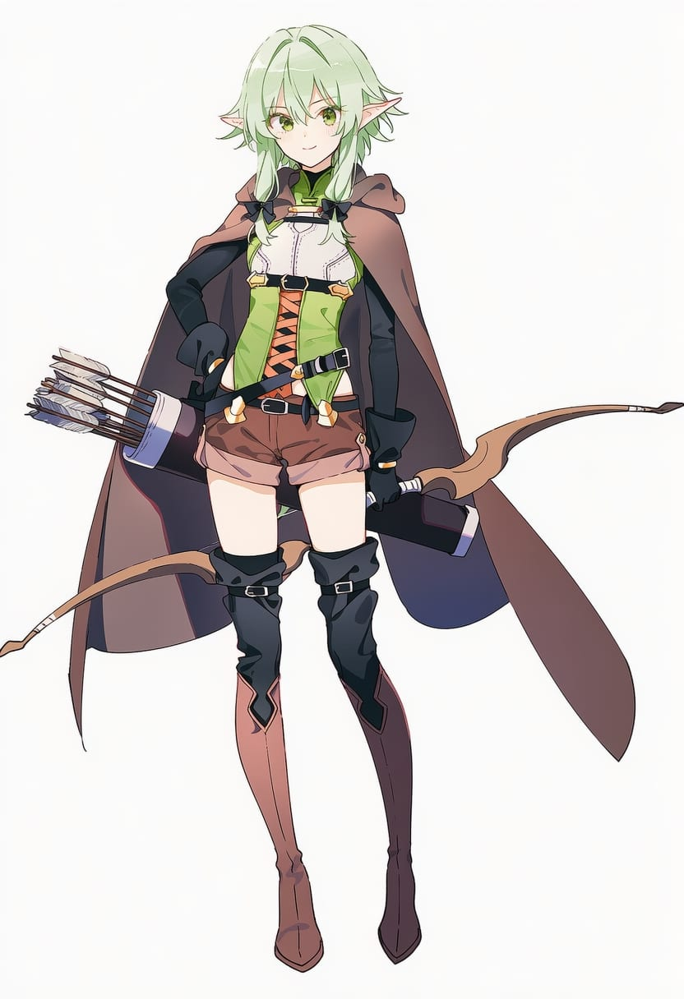

| 字段 | 内容 |
| --- | --- |
| 职业/身份原型（中文） | 高等精灵游侠 |
| NovelAI / Danbooru Tag 串 | 1.35::elf::, 1.28::pointy_ears::, 1.22::leather_armor::, 1.16::cape::, 1.12::boots::, 1.10::gloves::, 1.08::bow_(weapon)::, 1.06::quiver:: |
| 组合思路（大白话） | 尖耳、皮甲、披风、长靴和弓箭，做成轻装高机动精灵游侠。 |
| 世界细分 | 高幻想种族 / 魔兽风 |
| 模特 | 1girl,high_elf_archer_(goblin_slayer!) |
| 序号 | 0023 |

## 22. 黑暗精灵刺客

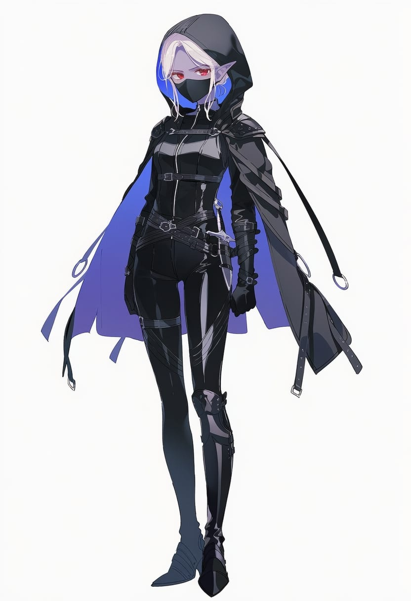

| 字段 | 内容 |
| --- | --- |
| 职业/身份原型（中文） | 黑暗精灵刺客 |
| NovelAI / Danbooru Tag 串 | 1.35::elf::, 1.28::pointy_ears::, 1.22::black_clothes::, 1.16::hood::, 1.12::mask::, 1.10::leather_armor::, 1.08::dagger::, 1.06::boots:: |
| 组合思路（大白话） | 尖耳只是种族底层，真正职业靠黑衣、兜帽、面罩、皮甲和短刃来读。 |
| 世界细分 | 高幻想种族 / 魔兽风 |
| 模特 | 1girl,minthara |
| 序号 | 0024 |

## 23. 龙人战士

| 字段 | 内容 |
| --- | --- |
| 职业/身份原型（中文） | 龙人战士 |
| NovelAI / Danbooru Tag 串 | 1.35::horns::, 1.28::scale_armor::, 1.22::pauldrons::, 1.16::gauntlets::, 1.12::greaves::, 1.10::cape::, 1.08::spear:: |
| 组合思路（大白话） | 角与鳞甲负责龙人身份，大肩甲、手甲、胫甲和长枪负责战士职业。 |
| 世界细分 | 高幻想种族 / 魔兽风 |
| 模特 | 1girl,tohru_(maidragon) |
| 序号 | 0025 |

## 24. 建筑工人

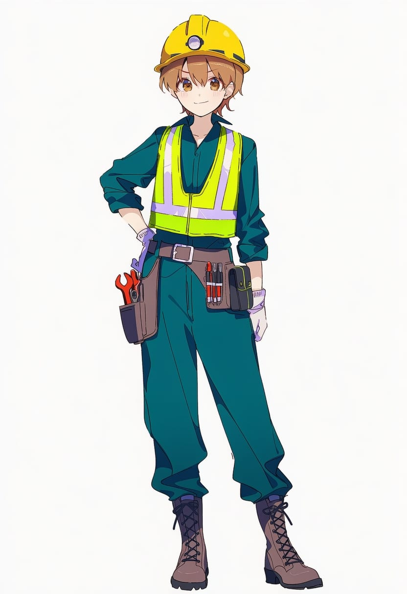

| 字段 | 内容 |
| --- | --- |
| 职业/身份原型（中文） | 建筑工人 |
| NovelAI / Danbooru Tag 串 | 1.35::hard_hat::, 1.28::work_clothes::, 1.22::work_gloves::, 1.16::boots::, 1.12::tool_belt::, 1.10::safety_glasses::, 1.08::high-visibility_vest:: |
| 组合思路（大白话） | 安全帽、工作服、工作手套、工具腰带、安全护目镜和高可视背心；去掉 hard_hat/hardhat 的重复写法。 |
| 世界细分 | 工业 / 技术 / 手工业 |
| 模特 | 1girl,fujimura_taiga |
| 序号 | 0027 |

## 25. 水管工

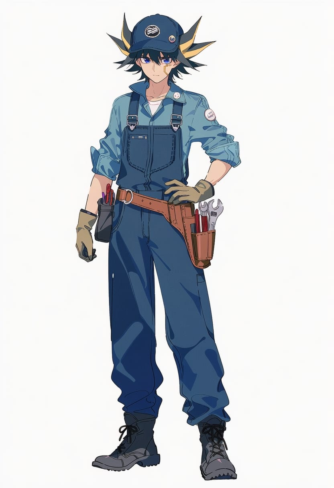

| 字段 | 内容 |
| --- | --- |
| 职业/身份原型（中文） | 水管工 |
| NovelAI / Danbooru Tag 串 | 1.35::overalls::, 1.28::rolled_up_sleeves::, 1.22::tool_belt::, 1.16::wrench::, 1.12::gloves::, 1.10::boots::, 1.08::baseball_cap:: |
| 组合思路（大白话） | 背带裤、卷袖、工具腰带和扳手，保留维修感但与汽车机械师的连体工装/护目镜区分。 |
| 世界细分 | 工业 / 技术 / 手工业 |
| 模特 | 1boy,fudou_yuusei |
| 序号 | 0028 |

## 26. 测量员

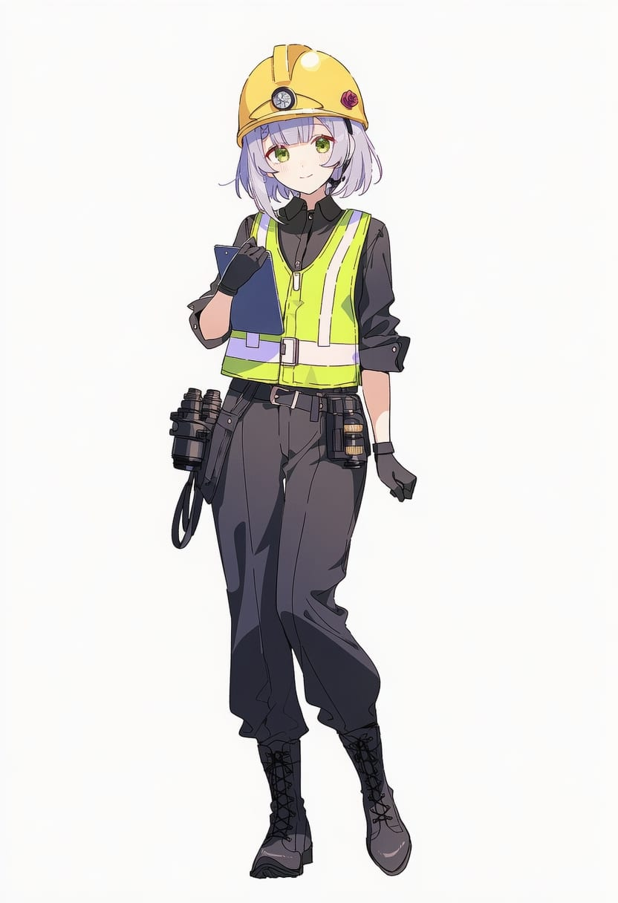

| 字段 | 内容 |
| --- | --- |
| 职业/身份原型（中文） | 测量员 |
| NovelAI / Danbooru Tag 串 | 1.35::hard_hat::, 1.28::vest::, 1.22::boots::, 1.16::gloves::, 1.12::clipboard::, 1.10::binoculars:: |
| 组合思路（大白话） | 安全帽、功能马甲、记录板和观察设备组成野外测绘/工程测量的职业感。 |
| 世界细分 | 工业 / 技术 / 手工业 |
| 模特 | 1girl,noelle_(genshin_impact) |
| 序号 | 0030 |

## 27. 理发师

| 字段 | 内容 |
| --- | --- |
| 职业/身份原型（中文） | 理发师 |
| NovelAI / Danbooru Tag 串 | 1.35::apron::, 1.28::dress_shirt::, 1.22::rolled_up_sleeves::, 1.16::scissors::, 1.12::comb::, 1.10::gloves:: |
| 组合思路（大白话） | 围裙、卷袖衬衫、剪刀和梳子就是最清晰的理发工作组合。 |
| 世界细分 | 工业 / 技术 / 手工业 |
| 模特 | 1girl,sariel_(touhou) |
| 序号 | 0031 |

## 28. 矿工

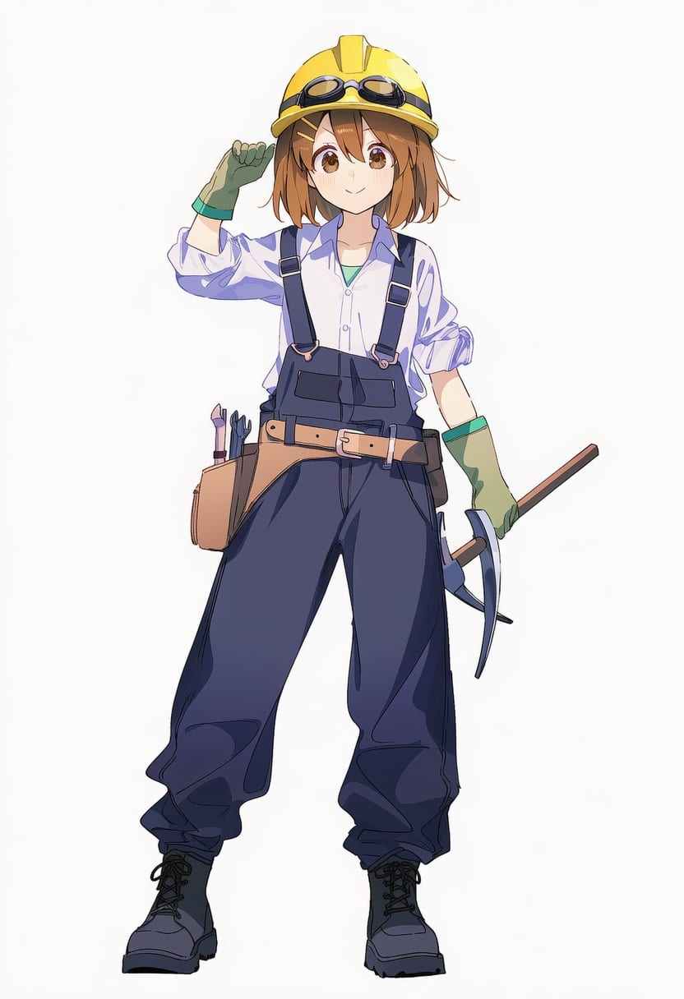

| 字段 | 内容 |
| --- | --- |
| 职业/身份原型（中文） | 矿工 |
| NovelAI / Danbooru Tag 串 | 1.35::hard_hat::, 1.28::goggles::, 1.22::work_gloves::, 1.16::coveralls::, 1.12::boots::, 1.10::pickaxe:: |
| 组合思路（大白话） | 安全帽、护目镜、工作手套、连体工装和镐，突出采掘工具而不是通用工程腰带。 |
| 世界细分 | 工业 / 技术 / 手工业 |
| 模特 | 1girl,hirasawa_yui |
| 序号 | 0033 |

## 29. 裁缝

| 字段 | 内容 |
| --- | --- |
| 职业/身份原型（中文） | 裁缝 |
| NovelAI / Danbooru Tag 串 | 1.35::apron::, 1.28::glasses::, 1.22::scissors::, 1.16::needle::, 1.12::thread::, 1.10::pouch:: |
| 组合思路（大白话） | 围裙、眼镜、剪刀、针线和小工具袋，把重点放在精细缝制工作上。 |
| 世界细分 | 工业 / 技术 / 手工业 |
| 模特 | 1girl,hoshimi_miyabi |
| 序号 | 0034 |

## 30. 铁路检修员

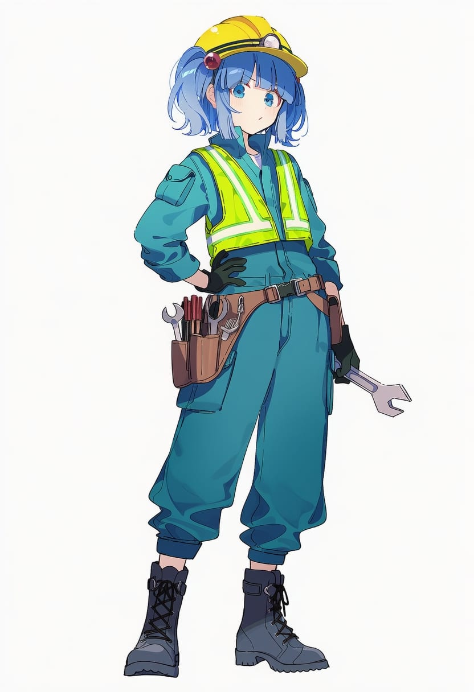

| 字段 | 内容 |
| --- | --- |
| 职业/身份原型（中文） | 铁路检修员 |
| NovelAI / Danbooru Tag 串 | 1.35::hard_hat::, 1.28::coveralls::, 1.22::gloves::, 1.16::boots::, 1.12::tool_belt::, 1.10::high-visibility_vest::, 1.08::holding_wrench:: |
| 组合思路（大白话） | 安全帽、工装、工具腰带、反光背心和手持扳手，形成明显的铁路线路检修形象。 |
| 世界细分 | 工业 / 技术 / 手工业 |
| 模特 | 1girl,kawashiro_nitori |
| 序号 | 0035 |

## 31. 古代中国武将

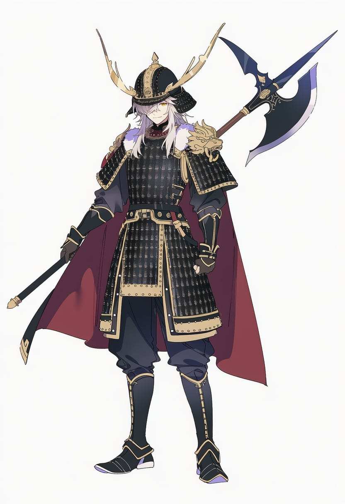

| 字段 | 内容 |
| --- | --- |
| 职业/身份原型（中文） | 古代中国武将 |
| NovelAI / Danbooru Tag 串 | 1.35::chinese_armor::, 1.28::lamellar_armor::, 1.22::helmet::, 1.16::cape::, 1.12::halberd::, 1.10::gauntlets::, 1.08::boots:: |
| 组合思路（大白话） | 中式札甲、头盔、披风与戟，强调统兵武将的大型长兵器轮廓。 |
| 世界细分 | 古代中国 / 东亚 |
| 模特 | 1boy,jing_yuan |
| 序号 | 0036 |

## 32. 古代厨师

| 字段 | 内容 |
| --- | --- |
| 职业/身份原型（中文） | 古代厨师 |
| NovelAI / Danbooru Tag 串 | 1.35::chinese_clothes::, 1.28::apron::, 1.22::headscarf::, 1.16::rolled_up_sleeves::, 1.12::kitchen_knife::, 1.10::boots:: |
| 组合思路（大白话） | 中式工作服叠围裙、头巾、卷袖和厨刀，做成古代酒楼后厨人员。 |
| 世界细分 | 古代中国 / 东亚 |
| 模特 | 1girl,xiangling_(genshin_impact) |
| 序号 | 0037 |

## 33. 古代文官

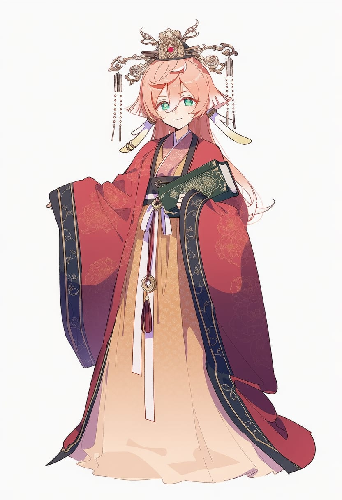

| 字段 | 内容 |
| --- | --- |
| 职业/身份原型（中文） | 古代文官 |
| NovelAI / Danbooru Tag 串 | 1.35::hanfu::, 1.28::robe::, 1.22::wide_sleeves::, 1.16::sash::, 1.12::book::, 1.10::folding_fan::, 1.08::hair_stick::, 1.06::yuanlingpao::, 1.04::chinese_clothes::, 1.02::guan_hat:: |
| 组合思路（大白话） | 大袖官服感的长袍配书本、折扇与整齐发饰，重点是文职、礼仪和克制。 |
| 世界细分 | 古代中国 / 东亚 |
| 模特 | 1girl,yanfei_(genshin_impact) |
| 序号 | 0038 |

## 34. 宫廷禁军

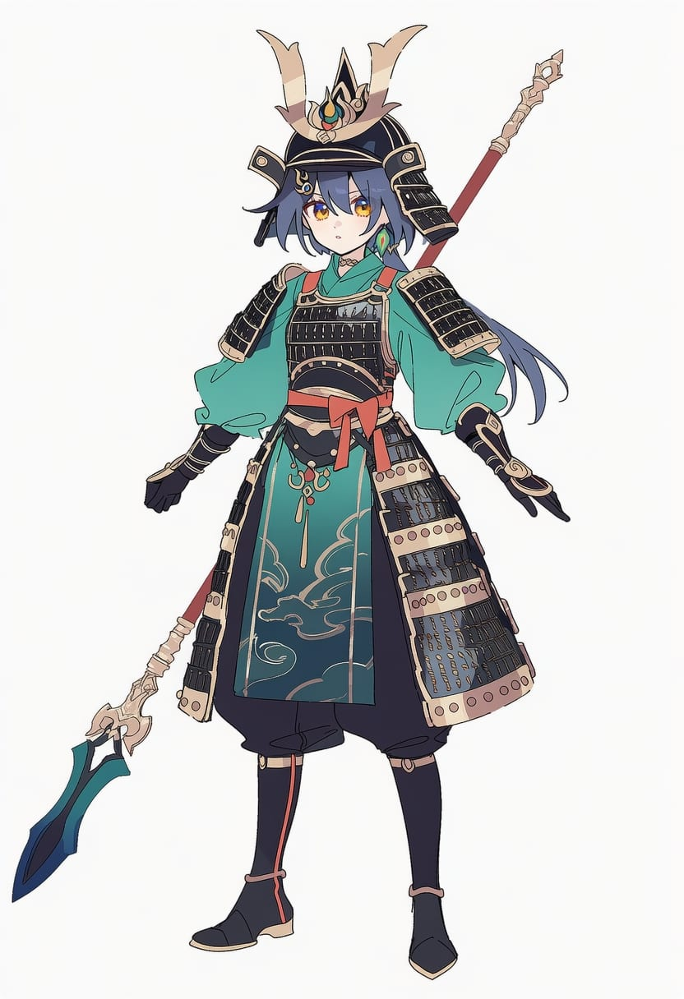

| 字段 | 内容 |
| --- | --- |
| 职业/身份原型（中文） | 宫廷禁军 |
| NovelAI / Danbooru Tag 串 | 1.35::chinese_armor::, 1.28::lamellar_armor::, 1.22::helmet::, 1.16::tabard::, 1.12::spear::, 1.10::gauntlets::, 1.08::boots:: |
| 组合思路（大白话） | 中式札甲、头盔、罩袍与长枪，强调宫廷守卫的制式制服感，与武将披风/戟区分。 |
| 世界细分 | 古代中国 / 东亚 |
| 模特 | 1girl,yunli_(honkai:_star_rail) |
| 序号 | 0039 |

## 35. 御医

| 字段 | 内容 |
| --- | --- |
| 职业/身份原型（中文） | 御医 |
| NovelAI / Danbooru Tag 串 | 1.35::hanfu::, 1.28::robe::, 1.22::wide_sleeves::, 1.16::sash::, 1.12::pouch::, 1.10::bottle::, 1.08::gloves:: |
| 组合思路（大白话） | 宫廷长袍结构里加入药袋、药瓶和手套，表现古代医官身份。 |
| 世界细分 | 古代中国 / 东亚 |
| 模特 | 1boy,baizhu_(genshin_impact) |
| 序号 | 0040 |

## 36. 古希腊重装步兵

| 字段 | 内容 |
| --- | --- |
| 职业/身份原型（中文） | 古希腊重装步兵 |
| NovelAI / Danbooru Tag 串 | 1.35::helmet::, 1.28::breastplate::, 1.22::greaves::, 1.16::cape::, 1.12::round_shield::, 1.10::spear::, 1.08::sandals:: |
| 组合思路（大白话） | 头盔、胸甲、胫甲、圆盾和长矛构成经典重装步兵几何轮廓。 |
| 世界细分 | 古典文明 / 地中海 |
| 模特 | 1girl,herta_(honkai:_star_rail) |
| 序号 | 0041 |

## 37. 罗马军团士兵

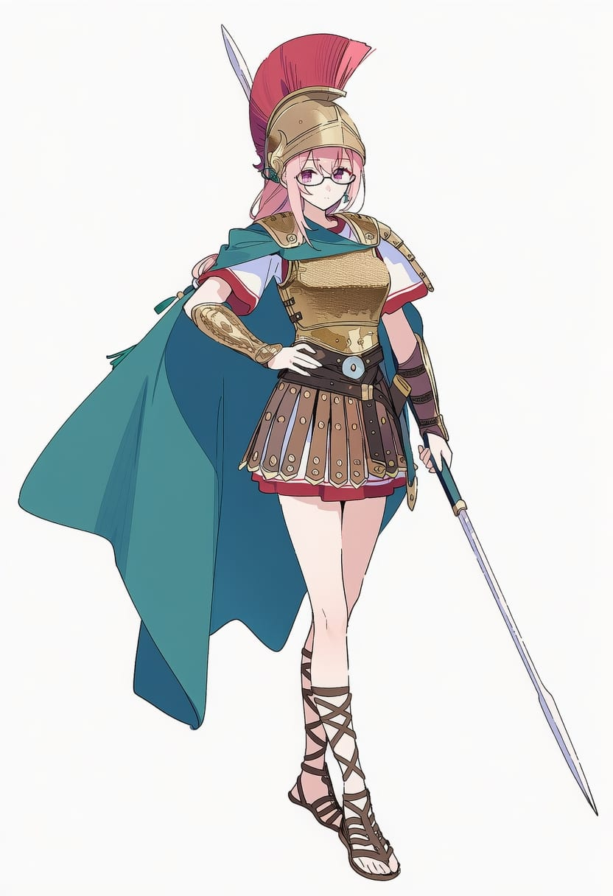

| 字段 | 内容 |
| --- | --- |
| 职业/身份原型（中文） | 罗马军团士兵 |
| NovelAI / Danbooru Tag 串 | 1.35::roman_armor::, 1.28::helmet::, 1.22::cape::, 1.16::sandals::, 1.12::shield::, 1.10::spear::, 1.08::sword::, 1.06::roman_clothes:: |
| 组合思路（大白话） | 罗马甲、头盔、披风、凉鞋、盾和短兵器，形成典型军团步兵形象。 |
| 世界细分 | 古典文明 / 地中海 |
| 模特 | 1girl,tsukishiro_yanagi |
| 序号 | 0042 |

## 38. 女巫猎人

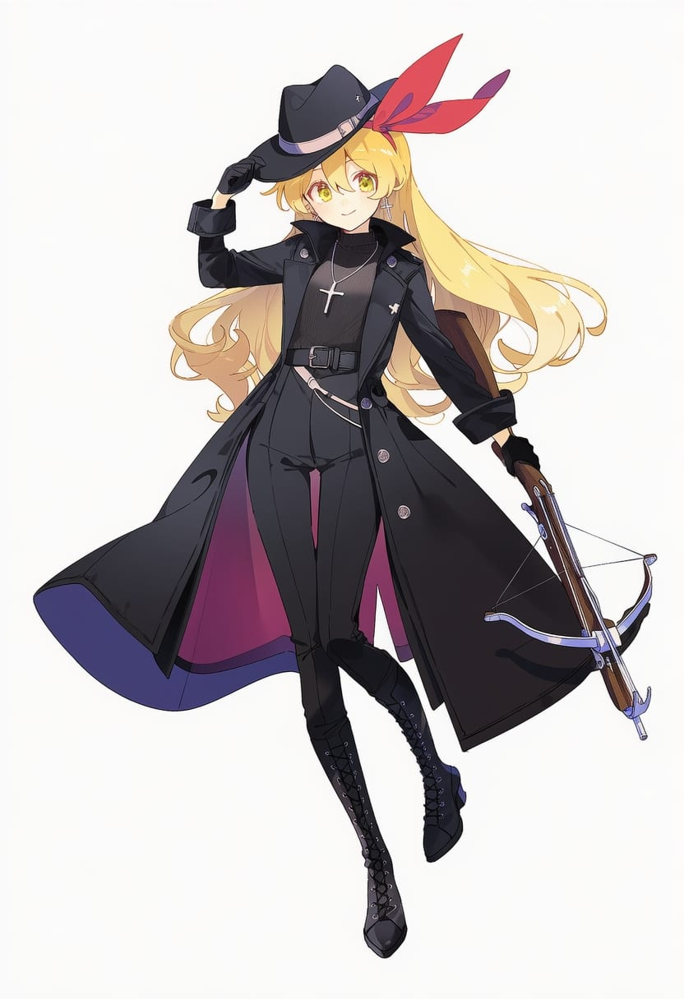

| 字段 | 内容 |
| --- | --- |
| 职业/身份原型（中文） | 女巫猎人 |
| NovelAI / Danbooru Tag 串 | 1.35::wide-brimmed_hat::, 1.28::long_coat::, 1.22::gloves::, 1.16::boots::, 1.12::belt::, 1.10::crossbow::, 1.08::cross_necklace:: |
| 组合思路（大白话） | 宽檐帽和长外套形成猎魔人的经典剪影，十字饰物和弩强调猎杀超自然目标。 |
| 世界细分 | 黑暗奇幻 / 哥特 |
| 模特 | 1girl,ellen_(touhou) |
| 序号 | 0043 |

## 39. 恶魔猎人

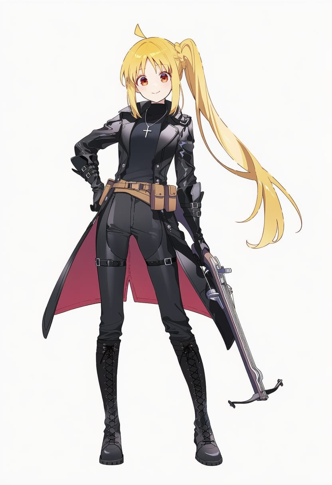

| 字段 | 内容 |
| --- | --- |
| 职业/身份原型（中文） | 恶魔猎人 |
| NovelAI / Danbooru Tag 串 | 1.35::leather_armor::, 1.28::long_coat::, 1.22::gloves::, 1.16::boots::, 1.12::cross_necklace::, 1.10::crossbow::, 1.08::belt_pouch:: |
| 组合思路（大白话） | 长皮装、长外套、十字配饰、弩和工具袋，像专门追猎超自然目标的猎人。 |
| 世界细分 | 黑暗奇幻 / 哥特 |
| 模特 | 1girl,ijichi_nijika |
| 序号 | 0044 |

## 40. 死灵法师

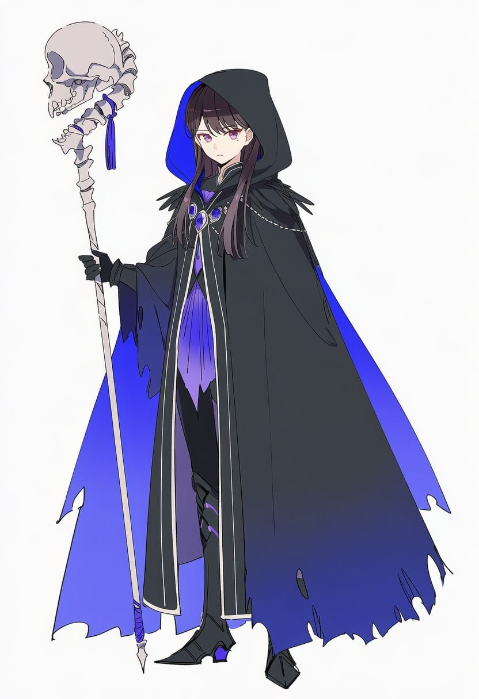

| 字段 | 内容 |
| --- | --- |
| 职业/身份原型（中文） | 死灵法师 |
| NovelAI / Danbooru Tag 串 | 1.35::hood::, 1.28::cloak::, 1.22::robe::, 1.16::skull::, 1.12::bone::, 1.10::staff::, 1.08::amulet::, 1.06::hooded_robe::, 1.04::necromancer::, 1.02::black_robe:: |
| 组合思路（大白话） | 兜帽、长袍、骨饰、骷髅和法杖组成阴暗施法者形象，避免用单一 necromancer 大词。 |
| 世界细分 | 黑暗奇幻 / 哥特 |
| 模特 | 1girl,shiina_taki |
| 序号 | 0045 |

## 41. 驱魔师

| 字段 | 内容 |
| --- | --- |
| 职业/身份原型（中文） | 驱魔师 |
| NovelAI / Danbooru Tag 串 | 1.35::robe::, 1.28::prayer_beads::, 1.22::ofuda::, 1.16::gloves::, 1.12::staff::, 1.10::cross_necklace::, 1.08::long_coat::, 1.06::clerical_collar::, 1.04::holding_book:: |
| 组合思路（大白话） | 长袍、念珠、符纸、法杖和十字饰物混合东西方驱魔视觉，重点是“仪式装备齐全”。 |
| 世界细分 | 黑暗奇幻 / 哥特 |
| 模特 | 1girl,kugisaki_nobara |
| 序号 | 0046 |

## 42. 园丁

| 字段 | 内容 |
| --- | --- |
| 职业/身份原型（中文） | 园丁 |
| NovelAI / Danbooru Tag 串 | 1.35::sun_hat::, 1.28::apron::, 1.22::gloves::, 1.16::boots::, 1.12::overalls::, 1.10::basket::, 1.08::straw_hat::, 1.06::work_gloves::, 1.04::holding_watering_can::, 1.02::holding_shovel:: |
| 组合思路（大白话） | 遮阳帽、围裙、手套、靴子是园艺工作的视觉重点，篮子增加采摘/维护感。 |
| 世界细分 | 户外 / 农林渔业 |
| 模特 | 1girl,misumi_uika |
| 序号 | 0047 |

## 43. 救生员

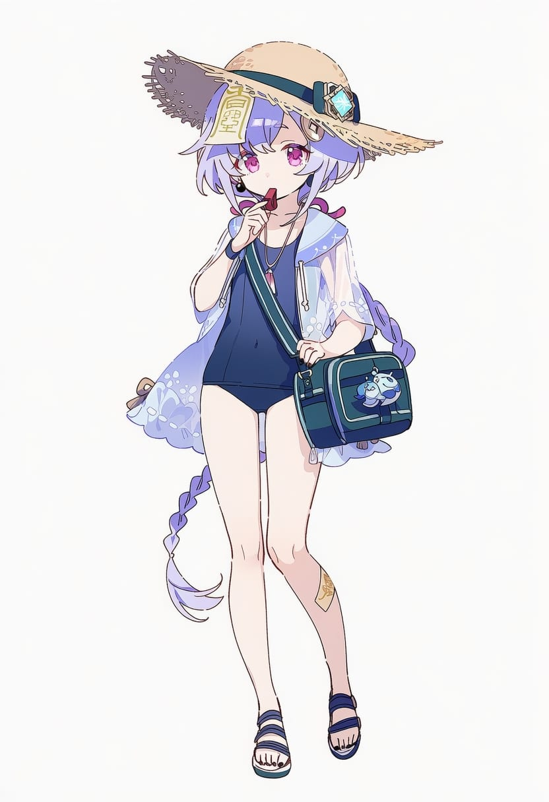

| 字段 | 内容 |
| --- | --- |
| 职业/身份原型（中文） | 救生员 |
| NovelAI / Danbooru Tag 串 | 1.35::swimsuit::, 1.28::whistle::, 1.22::sun_hat::, 1.16::sunglasses::, 1.12::sandals::, 1.10::fanny_pack:: |
| 组合思路（大白话） | 泳装、口哨、遮阳帽与太阳镜形成泳池/海滩救生员的典型轮廓。 |
| 世界细分 | 户外 / 农林渔业 |
| 模特 | 1girl,qiqi_(genshin_impact) |
| 序号 | 0048 |

## 44. 渔夫

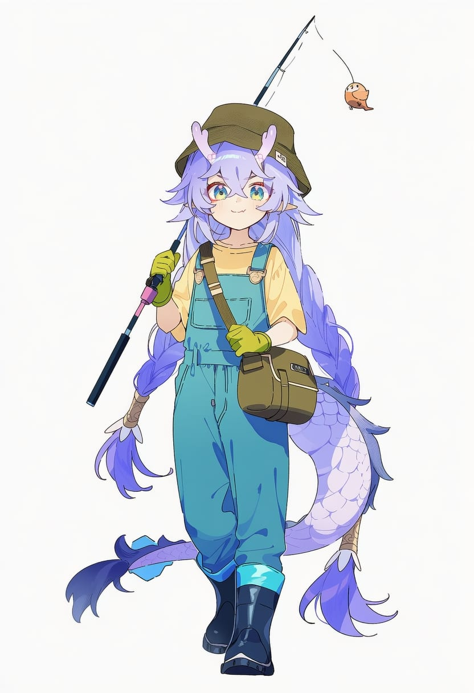

| 字段 | 内容 |
| --- | --- |
| 职业/身份原型（中文） | 渔夫 |
| NovelAI / Danbooru Tag 串 | 1.35::raincoat::, 1.28::rubber_boots::, 1.22::beanie::, 1.16::gloves::, 1.12::overalls::, 1.10::shoulder_bag::, 1.08::fishing_vest::, 1.06::bucket_hat::, 1.04::work_gloves::, 1.02::holding_fishing_rod:: |
| 组合思路（大白话） | 雨衣、胶靴、针织帽和背带裤，做出海边湿冷、耐脏耐水的工作服。 |
| 世界细分 | 户外 / 农林渔业 |
| 模特 | 1girl,bailu_(honkai:_star_rail) |
| 序号 | 0049 |

## 45. 生态穹顶园丁

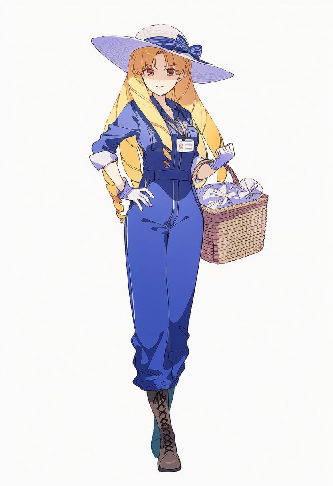

| 字段 | 内容 |
| --- | --- |
| 职业/身份原型（中文） | 生态穹顶园丁 |
| NovelAI / Danbooru Tag 串 | 1.35::coveralls::, 1.28::apron::, 1.22::gloves::, 1.16::boots::, 1.12::sun_hat::, 1.10::basket::, 1.08::id_card:: |
| 组合思路（大白话） | 园艺围裙和手套仍是核心，工作服与工牌让它更像封闭殖民地里的专业维护岗位。 |
| 世界细分 | 户外 / 农林渔业 |
| 模特 | 1girl,luviagelita_edelfelt |
| 序号 | 0050 |

## 46. 登山向导

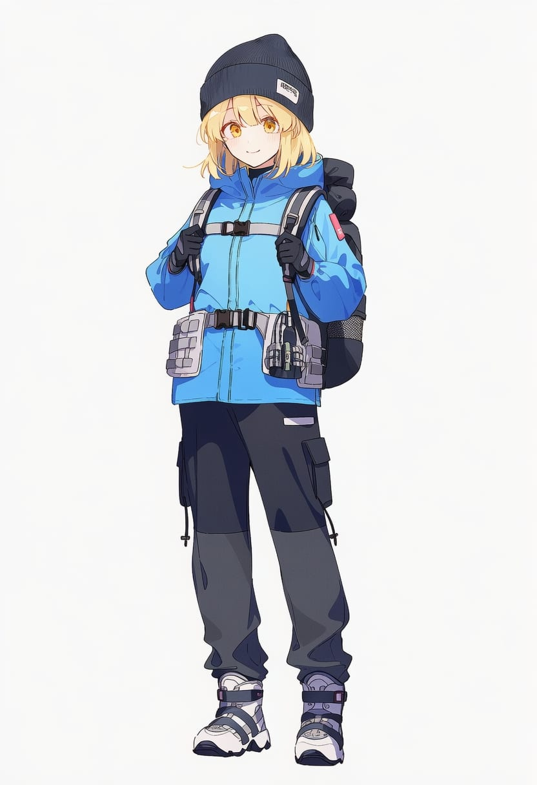

| 字段 | 内容 |
| --- | --- |
| 职业/身份原型（中文） | 登山向导 |
| NovelAI / Danbooru Tag 串 | 1.35::outdoor_clothes::, 1.28::hiking_boots::, 1.22::backpack::, 1.16::gloves::, 1.12::beanie::, 1.10::utility_belt:: |
| 组合思路（大白话） | 户外层叠服、登山靴、背包、手套和保暖帽，重视耐候性。 |
| 世界细分 | 户外 / 农林渔业 |
| 模特 | 1girl,kana_anaberal |
| 序号 | 0051 |

## 47. 神官

| 字段 | 内容 |
| --- | --- |
| 职业/身份原型（中文） | 神官 |
| NovelAI / Danbooru Tag 串 | 1.35::robe::, 1.28::stole::, 1.22::cross_necklace::, 1.16::long_sleeves::, 1.12::holding_staff::, 1.10::boots::, 1.08::priest::, 1.06::crosier::, 1.04::cape:: |
| 组合思路（大白话） | 用长袍、圣带、十字饰品和法杖，做 RPG 里的治疗/圣职角色。 |
| 世界细分 | 剑与魔法 / 冒险者世界 |
| 模特 | 1girl,emilia_(re:zero) |
| 序号 | 0052 |

## 48. 马戏团驯兽师

| 字段 | 内容 |
| --- | --- |
| 职业/身份原型（中文） | 马戏团驯兽师 |
| NovelAI / Danbooru Tag 串 | 1.35::tailcoat::, 1.28::top_hat::, 1.22::boots::, 1.16::white_gloves::, 1.12::whip:: |
| 组合思路（大白话） | 用夸张燕尾服、高礼帽、长靴和鞭子做马戏团领班/驯兽师。 |
| 世界细分 | 剑与魔法 / 冒险者世界 |
| 模特 | 1girl,izayoi_aki |
| 序号 | 0053 |

## 49. 乡野女巫

| 字段 | 内容 |
| --- | --- |
| 职业/身份原型（中文） | 乡野女巫 |
| NovelAI / Danbooru Tag 串 | 1.35::witch_hat::, 1.28::cloak::, 1.22::apron::, 1.16::long_skirt::, 1.12::boots::, 1.10::broom::, 1.08::pouch:: |
| 组合思路（大白话） | 用围裙、长裙、旧披风和扫帚做出乡野生活感，减少贵族和学院风。 |
| 世界细分 | 剑与魔法 / 冒险者世界 |
| 模特 | 1girl,wakaba_mutsumi |
| 序号 | 0054 |

## 50. 占卜师

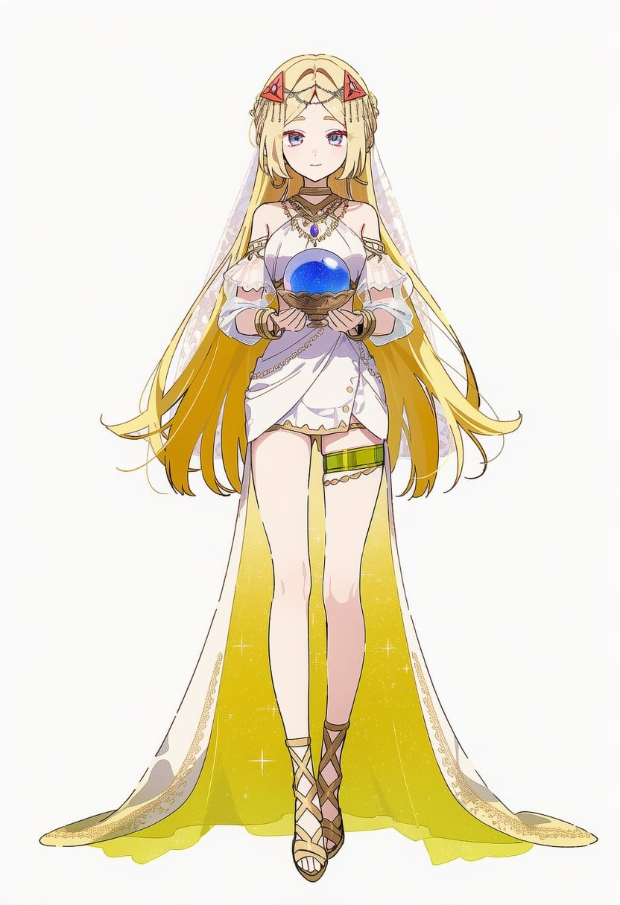

| 字段 | 内容 |
| --- | --- |
| 职业/身份原型（中文） | 占卜师 |
| NovelAI / Danbooru Tag 串 | 1.35::veil::, 1.28::shawl::, 1.22::jewelry::, 1.16::bangle::, 1.12::necklace::, 1.10::head_chain::, 1.08::crystal_ball:: |
| 组合思路（大白话） | 面纱、披肩和大量珠宝构成神秘感，水晶球是职业最直接的道具提示。 |
| 世界细分 | 剑与魔法 / 冒险者世界 |
| 模特 | 1girl,trigger_(zenless_zone_zero) |
| 序号 | 0055 |

## 51. 吟游诗人

| 字段 | 内容 |
| --- | --- |
| 职业/身份原型（中文） | 吟游诗人 |
| NovelAI / Danbooru Tag 串 | 1.35::feathered_hat::, 1.28::cape::, 1.22::tunic::, 1.16::belt::, 1.12::boots::, 1.10::lute::, 1.08::feather::, 1.06::vest::, 1.04::bard::, 1.02::capelet:: |
| 组合思路（大白话） | 羽饰帽、披风、束腰上衣和长靴，最后用鲁特琴把职业钉死。 |
| 世界细分 | 剑与魔法 / 冒险者世界 |
| 模特 | 1girl,kitashirakawa_chiyuri |
| 序号 | 0056 |

## 52. 地城测绘师

| 字段 | 内容 |
| --- | --- |
| 职业/身份原型（中文） | 地城测绘师 |
| NovelAI / Danbooru Tag 串 | 1.35::hood::, 1.28::cloak::, 1.22::boots::, 1.16::satchel::, 1.12::compass::, 1.10::book::, 1.08::gloves:: |
| 组合思路（大白话） | 兜帽披风、挎包、罗盘和记录本，突出在迷宫里画地图而不是正面战斗。 |
| 世界细分 | 剑与魔法 / 冒险者世界 |
| 模特 | 1boy,mutou_yuugi |
| 序号 | 0057 |

## 53. 学院女巫

| 字段 | 内容 |
| --- | --- |
| 职业/身份原型（中文） | 学院女巫 |
| NovelAI / Danbooru Tag 串 | 1.35::witch_hat::, 1.28::robe::, 1.22::collared_shirt::, 1.16::pleated_skirt::, 1.12::neck_ribbon::, 1.10::knee_boots::, 1.08::holding_wand:: |
| 组合思路（大白话） | 把女巫帽和魔杖保留，但服装改成学院制服结构，适合魔法学校设定。 |
| 世界细分 | 剑与魔法 / 冒险者世界 |
| 模特 | 1girl,beatrice_(re:zero) |
| 序号 | 0058 |

## 54. 宫廷女巫

| 字段 | 内容 |
| --- | --- |
| 职业/身份原型（中文） | 宫廷女巫 |
| NovelAI / Danbooru Tag 串 | 1.35::witch_hat::, 1.28::aristocratic_clothes::, 1.22::long_dress::, 1.16::corset::, 1.12::capelet::, 1.10::brooch::, 1.08::wand:: |
| 组合思路（大白话） | 保留女巫帽，但把粗糙旅行装换成贵族长裙、束腰、短披肩和胸针。 |
| 世界细分 | 剑与魔法 / 冒险者世界 |
| 模特 | 1girl,echidna_(re:zero) |
| 序号 | 0059 |

## 55. 宫廷预言师

| 字段 | 内容 |
| --- | --- |
| 职业/身份原型（中文） | 宫廷预言师 |
| NovelAI / Danbooru Tag 串 | 1.35::veil::, 1.28::robe::, 1.22::capelet::, 1.16::jewelry::, 1.12::head_chain::, 1.10::crystal_ball::, 1.08::staff:: |
| 组合思路（大白话） | 面纱、头链与水晶球形成神秘预言视觉，披肩和珠宝抬高宫廷身份。 |
| 世界细分 | 剑与魔法 / 冒险者世界 |
| 模特 | 1girl,okazaki_yumemi |
| 序号 | 0060 |

## 56. 异世界女巫

| 字段 | 内容 |
| --- | --- |
| 职业/身份原型（中文） | 异世界女巫 |
| NovelAI / Danbooru Tag 串 | 1.35::witch_hat::, 1.28::cloak::, 1.22::long_dress::, 1.16::corset::, 1.12::boots::, 1.10::wand::, 1.08::pouch::, 1.06::potion::, 1.04::robe::, 1.02::wide_sleeves:: |
| 组合思路（大白话） | 宽大的尖顶女巫帽放最高权重，再叠披风、长裙、束腰、靴子、魔杖和药剂袋。 |
| 世界细分 | 剑与魔法 / 冒险者世界 |
| 模特 | 1girl,dark_magician_girl |
| 序号 | 0061 |

## 57. 德鲁伊

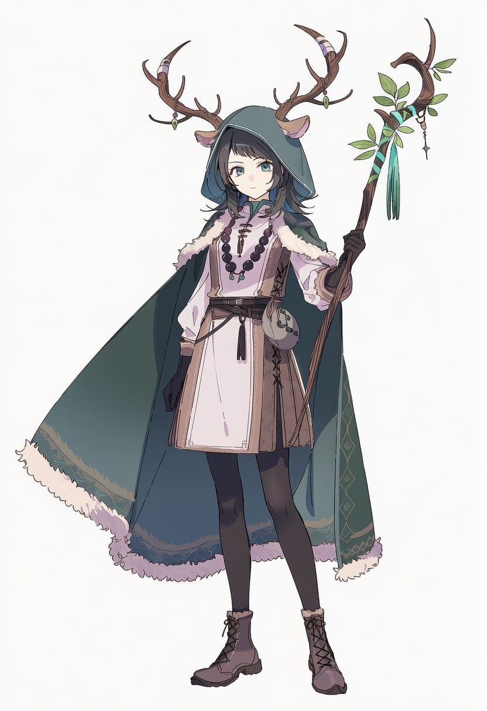

| 字段 | 内容 |
| --- | --- |
| 职业/身份原型（中文） | 德鲁伊 |
| NovelAI / Danbooru Tag 串 | 1.35::cloak::, 1.28::fur_trim::, 1.22::antlers::, 1.16::staff::, 1.12::prayer_beads::, 1.10::pouch::, 1.08::boots::, 1.06::leaf::, 1.04::druid::, 1.02::hooded_cloak:: |
| 组合思路（大白话） | 披风、毛皮、鹿角、木杖和小袋，把自然祭司/荒野施法者视觉做出来。 |
| 世界细分 | 剑与魔法 / 冒险者世界 |
| 模特 | 1girl,yahata_umiri |
| 序号 | 0062 |

## 58. 战斗法师

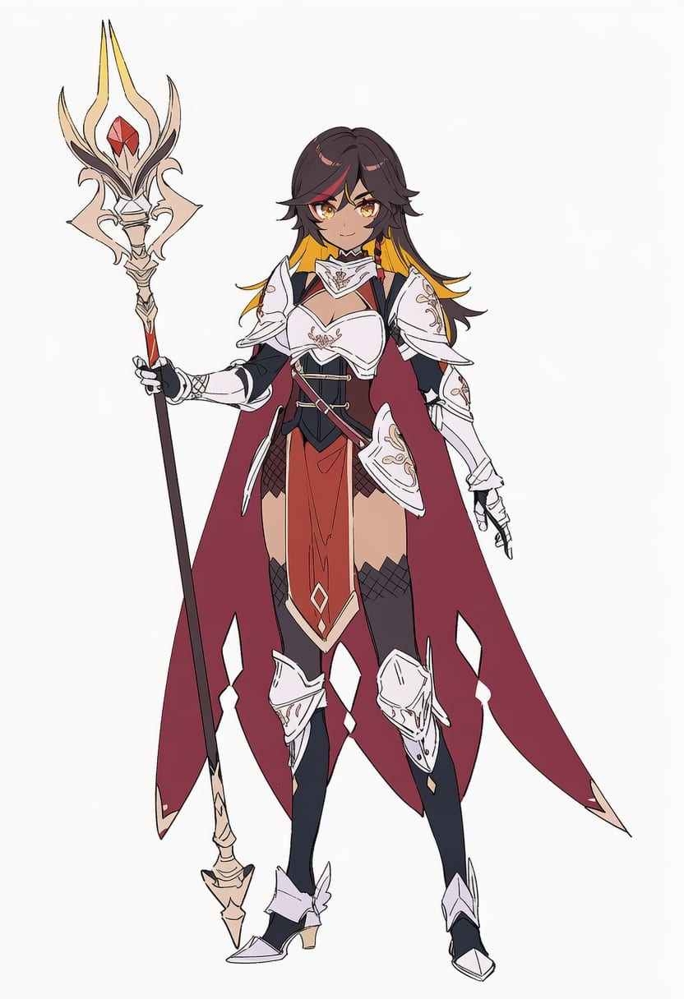

| 字段 | 内容 |
| --- | --- |
| 职业/身份原型（中文） | 战斗法师 |
| NovelAI / Danbooru Tag 串 | 1.35::armor::, 1.28::robe::, 1.22::pauldrons::, 1.16::gauntlets::, 1.12::staff::, 1.10::boots::, 1.08::cape::, 1.06::light_armor::, 1.04::shoulder_armor::, 1.02::bracer:: |
| 组合思路（大白话） | 把法袍穿进护甲体系：肩甲、手甲、靴子和法杖同时存在，视觉上就是“披甲法师”。 |
| 世界细分 | 剑与魔法 / 冒险者世界 |
| 模特 | 1girl,xinyan_(genshin_impact) |
| 序号 | 0063 |

## 59. 森林游侠

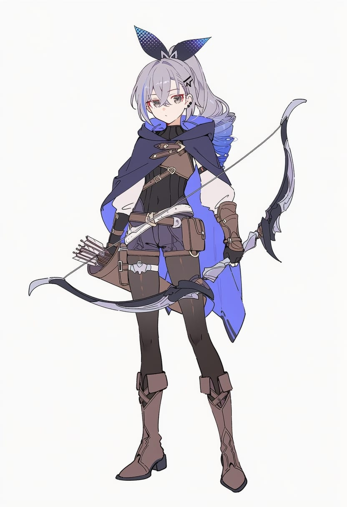

| 字段 | 内容 |
| --- | --- |
| 职业/身份原型（中文） | 森林游侠 |
| NovelAI / Danbooru Tag 串 | 1.35::hooded_cloak::, 1.28::leather_armor::, 1.22::bracer::, 1.16::quiver::, 1.12::bow_(weapon)::, 1.10::boots::, 1.08::belt_pouch::, 1.06::leaf:: |
| 组合思路（大白话） | 兜帽斗篷、皮甲、护臂、弓箭与叶片元素，突出森林游侠的自然系轮廓。 |
| 世界细分 | 剑与魔法 / 冒险者世界 |
| 模特 | 1girl,silver_wolf_(honkai:_star_rail) |
| 序号 | 0064 |

## 60. 炼金术士

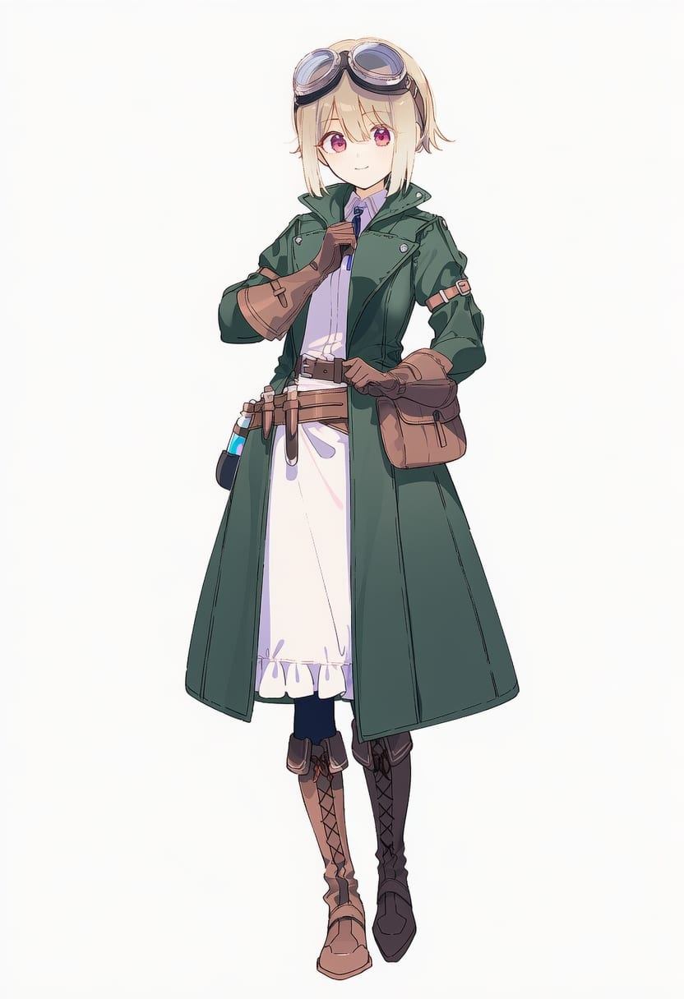

| 字段 | 内容 |
| --- | --- |
| 职业/身份原型（中文） | 炼金术士 |
| NovelAI / Danbooru Tag 串 | 1.35::apron::, 1.28::gloves::, 1.22::goggles::, 1.16::belt_pouch::, 1.12::bottle::, 1.10::satchel::, 1.08::long_coat::, 1.06::boots::, 1.04::alchemist::, 1.02::leather_gloves:: |
| 组合思路（大白话） | 围裙、护目镜、手套、药瓶和大量小包最重要，长外套增加实验旅行者的感觉。 |
| 世界细分 | 剑与魔法 / 冒险者世界 |
| 模特 | 1girl,prisma_illya |
| 序号 | 0066 |

## 61. 狮鹫骑士

| 字段 | 内容 |
| --- | --- |
| 职业/身份原型（中文） | 狮鹫骑士 |
| NovelAI / Danbooru Tag 串 | 1.35::plate_armor::, 1.28::winged_helmet::, 1.22::cape::, 1.16::gauntlets::, 1.12::boots::, 1.10::lance::, 1.08::shield:: |
| 组合思路（大白话） | 板甲、翼形头盔、披风、长枪和盾牌，让空中骑士的仪仗感更强。 |
| 世界细分 | 剑与魔法 / 冒险者世界 |
| 模特 | 1girl,serena_(yu-gi-oh!) |
| 序号 | 0067 |

## 62. 萨满

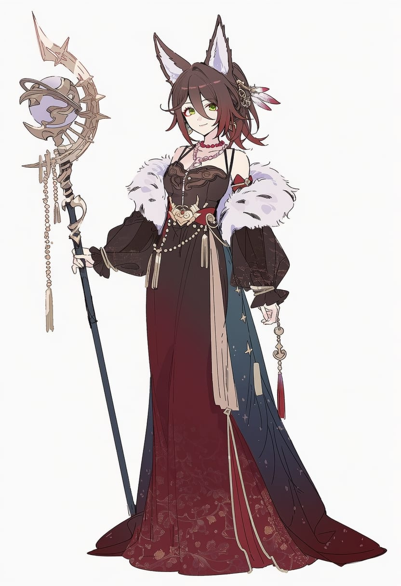

| 字段 | 内容 |
| --- | --- |
| 职业/身份原型（中文） | 萨满 |
| NovelAI / Danbooru Tag 串 | 1.35::fur_trim::, 1.28::feather::, 1.22::necklace::, 1.16::bone::, 1.12::staff::, 1.10::mask::, 1.08::beads:: |
| 组合思路（大白话） | 毛皮、羽毛、骨饰、面具和珠串，做成部族祭祀/灵媒式视觉。 |
| 世界细分 | 剑与魔法 / 冒险者世界 |
| 模特 | 1girl,tingyun_(honkai:_star_rail) |
| 序号 | 0068 |

## 63. 驯兽师

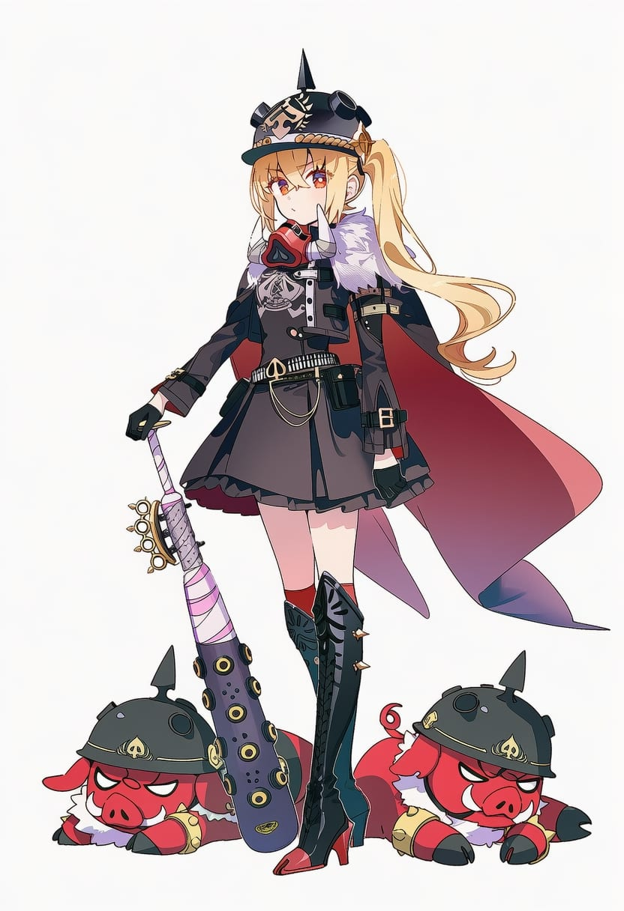

| 字段 | 内容 |
| --- | --- |
| 职业/身份原型（中文） | 驯兽师 |
| NovelAI / Danbooru Tag 串 | 1.35::leather_armor::, 1.28::fur_trim::, 1.22::gloves::, 1.16::boots::, 1.12::whip::, 1.10::belt_pouch::, 1.08::cloak::, 1.06::leash::, 1.04::animal:: |
| 组合思路（大白话） | 皮甲、毛皮、手套、鞭子和工具包，强调野外驯养而不是纯战士。 |
| 世界细分 | 剑与魔法 / 冒险者世界 |
| 模特 | 1girl,luciana_de_montefio |
| 序号 | 0069 |

## 64. 魔剑士

| 字段 | 内容 |
| --- | --- |
| 职业/身份原型（中文） | 魔剑士 |
| NovelAI / Danbooru Tag 串 | 1.35::armored_dress::, 1.28::gauntlets::, 1.22::boots::, 1.16::cape::, 1.12::sword::, 1.10::amulet::, 1.08::magic::, 1.06::light_armor::, 1.04::armor:: |
| 组合思路（大白话） | 用带甲礼服/轻甲而不是全身重甲，再加剑与护符，兼顾施法和近战。 |
| 世界细分 | 剑与魔法 / 冒险者世界 |
| 模特 | 1girl,chloe_von_einzbern |
| 序号 | 0070 |

## 65. 魔法学院学生

| 字段 | 内容 |
| --- | --- |
| 职业/身份原型（中文） | 魔法学院学生 |
| NovelAI / Danbooru Tag 串 | 1.35::school_uniform::, 1.28::robe::, 1.22::capelet::, 1.16::necktie::, 1.12::wand::, 1.10::book::, 1.08::satchel:: |
| 组合思路（大白话） | 校服作为底层，外加短法袍、披肩、魔杖、课本和书包，直接体现学院生活。 |
| 世界细分 | 剑与魔法 / 冒险者世界 |
| 模特 | 1girl,kochiya_sanae |
| 序号 | 0071 |

## 66. 魔法药草师

| 字段 | 内容 |
| --- | --- |
| 职业/身份原型（中文） | 魔法药草师 |
| NovelAI / Danbooru Tag 串 | 1.35::hood::, 1.28::apron::, 1.22::robe::, 1.16::basket::, 1.12::pouch::, 1.10::bottle::, 1.08::gloves:: |
| 组合思路（大白话） | 药草师的篮子、药瓶、围裙与法袍混合，像会用魔法处理植物与药剂的职业。 |
| 世界细分 | 剑与魔法 / 冒险者世界 |
| 模特 | 1girl,kitchen_dragonmaid |
| 序号 | 0072 |

## 67. 灵能术士

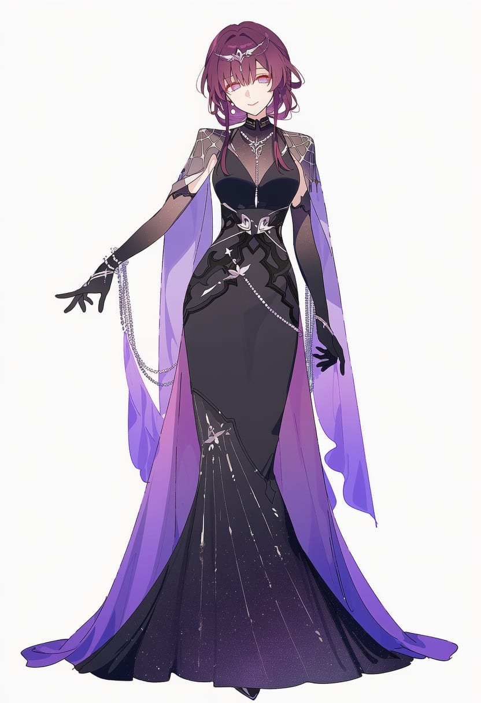

| 字段 | 内容 |
| --- | --- |
| 职业/身份原型（中文） | 灵能术士 |
| NovelAI / Danbooru Tag 串 | 1.35::bodysuit::, 1.28::robe::, 1.22::cape::, 1.16::gloves::, 1.12::circlet::, 1.10::jewelry:: |
| 组合思路（大白话） | 把法袍与紧身科技内层混搭，额环和珠宝让它更像科幻宇宙里的灵能阶层。 |
| 世界细分 | 剑与魔法 / 冒险者世界 |
| 模特 | 1girl,kafka_(honkai:_star_rail) |
| 序号 | 0074 |

## 68. 列车乘务员

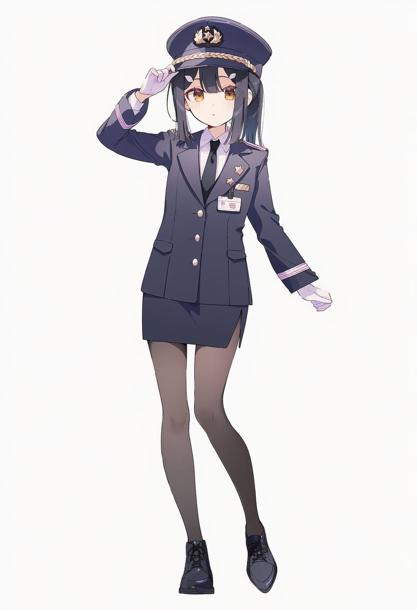

| 字段 | 内容 |
| --- | --- |
| 职业/身份原型（中文） | 列车乘务员 |
| NovelAI / Danbooru Tag 串 | 1.35::uniform::, 1.28::peaked_cap::, 1.22::blazer::, 1.16::collared_shirt::, 1.12::necktie::, 1.10::white_gloves::, 1.08::name_tag:: |
| 组合思路（大白话） | 铁路制服强调帽子、短外套、领带、白手套和工牌。 |
| 世界细分 | 交通 / 运输 |
| 模特 | 1girl,miyu_edelfelt |
| 序号 | 0075 |

## 69. 快递员

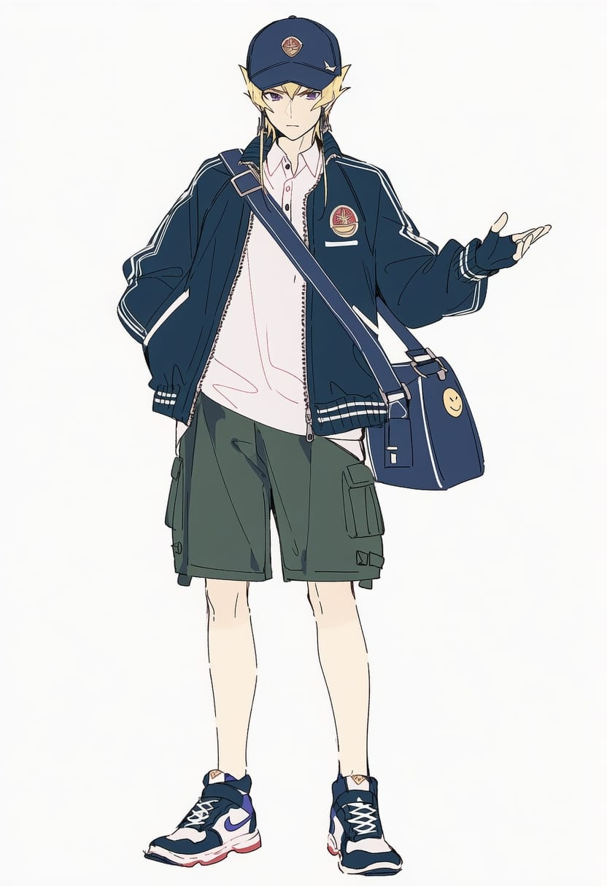

| 字段 | 内容 |
| --- | --- |
| 职业/身份原型（中文） | 快递员 |
| NovelAI / Danbooru Tag 串 | 1.35::baseball_cap::, 1.28::jacket::, 1.22::cargo_pants::, 1.16::sneakers::, 1.12::messenger_bag::, 1.10::fingerless_gloves::, 1.08::employee_uniform::, 1.06::cap::, 1.04::polo_shirt::, 1.02::cargo_shorts:: |
| 组合思路（大白话） | 轻便夹克、工装裤、运动鞋和斜挎包，突出城市配送时的机动性。 |
| 世界细分 | 交通 / 运输 |
| 模特 | 1boy,jack_atlas |
| 序号 | 0076 |

## 70. 摩托车手

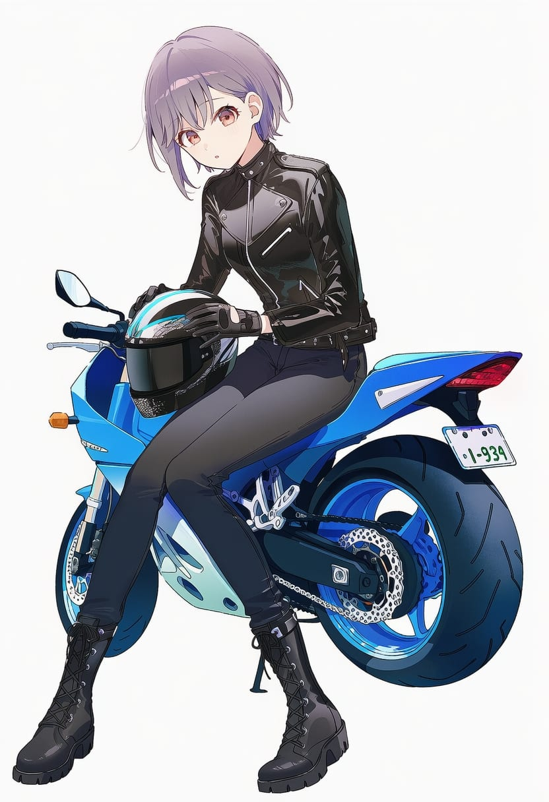

| 字段 | 内容 |
| --- | --- |
| 职业/身份原型（中文） | 摩托车手 |
| NovelAI / Danbooru Tag 串 | 1.35::motorcycle_helmet::, 1.28::leather_jacket::, 1.22::leather_gloves::, 1.16::boots::, 1.12::pants::, 1.10::belt:: |
| 组合思路（大白话） | 去掉与自行车运动员重复的 bodysuit，改成全盔+皮夹克+长裤+厚靴的重型骑行剪影。 |
| 世界细分 | 交通 / 运输 |
| 模特 | 1girl,takamatsu_tomori |
| 序号 | 0077 |

## 71. 水手

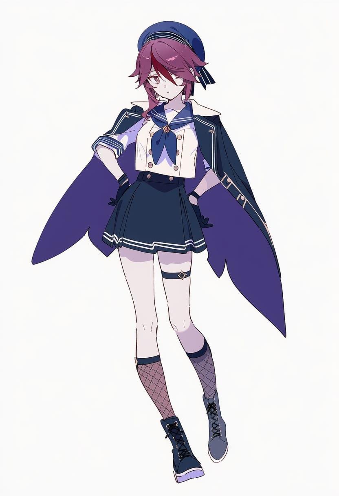

| 字段 | 内容 |
| --- | --- |
| 职业/身份原型（中文） | 水手 |
| NovelAI / Danbooru Tag 串 | 1.35::sailor_hat::, 1.28::neckerchief::, 1.22::double-breasted::, 1.16::gloves::, 1.12::boots::, 1.10::sailor::, 1.08::sailor_shirt::, 1.06::sailor_cap::, 1.04::sailor_collar::, 1.02::shirt:: |
| 组合思路（大白话） | 水手帽、领巾和双排扣上装形成海军水手感，避免和日式水手校服混淆。 |
| 世界细分 | 交通 / 运输 |
| 模特 | 1girl,rosaria_(genshin_impact) |
| 序号 | 0078 |

## 72. 空军飞行员

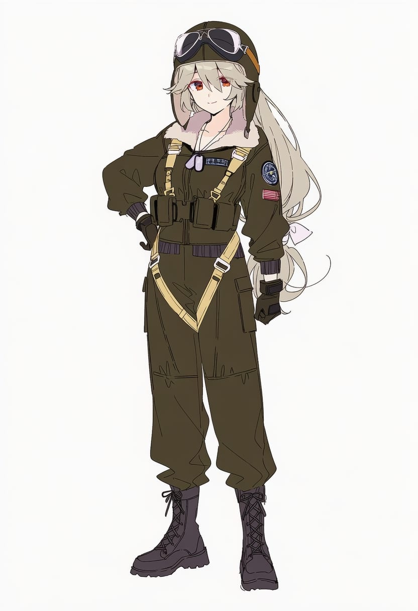

| 字段 | 内容 |
| --- | --- |
| 职业/身份原型（中文） | 空军飞行员 |
| NovelAI / Danbooru Tag 串 | 1.35::pilot::, 1.28::flight_suit::, 1.22::aviator_sunglasses::, 1.16::aviator_cap::, 1.12::gloves::, 1.10::combat_boots::, 1.08::dog_tags:: |
| 组合思路（大白话） | 飞行服配飞行员墨镜、手套和军靴，整体更接近军机驾驶员。 |
| 世界细分 | 交通 / 运输 |
| 模特 | 1girl,alexandrina_sebastiane |
| 序号 | 0079 |

## 73. 船长

| 字段 | 内容 |
| --- | --- |
| 职业/身份原型（中文） | 船长 |
| NovelAI / Danbooru Tag 串 | 1.35::peaked_cap::, 1.28::double-breasted::, 1.22::epaulettes::, 1.16::gloves::, 1.12::necktie::, 1.10::badge::, 1.08::captain_hat::, 1.06::naval_uniform::, 1.04::long_coat::, 1.02::boots:: |
| 组合思路（大白话） | 船长比普通水手更正式，用大檐帽、双排扣、肩章和徽章强化指挥岗位。 |
| 世界细分 | 交通 / 运输 |
| 模特 | 1girl,francis_drake_(fate) |
| 序号 | 0080 |

## 74. 体育教师

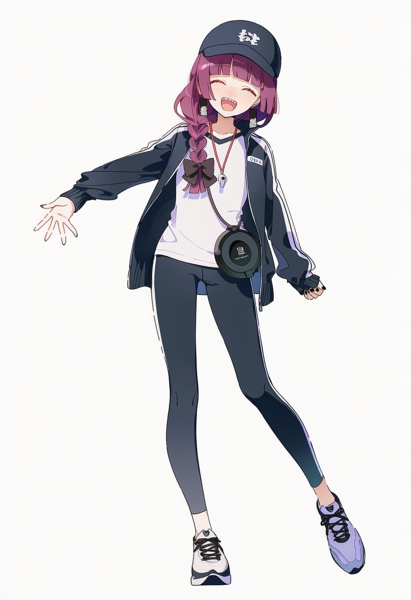

| 字段 | 内容 |
| --- | --- |
| 职业/身份原型（中文） | 体育教师 |
| NovelAI / Danbooru Tag 串 | 1.35::gym_teacher::, 1.28::track_suit::, 1.22::whistle::, 1.16::sneakers::, 1.12::stopwatch::, 1.10::baseball_cap:: |
| 组合思路（大白话） | 运动服和哨子是体育老师最直接的识别点，再补运动鞋、秒表和帽子。 |
| 世界细分 | 教育 / 学术 |
| 模特 | 1girl,hiroi_kikuri |
| 序号 | 0081 |

## 75. 教师

| 字段 | 内容 |
| --- | --- |
| 职业/身份原型（中文） | 教师 |
| NovelAI / Danbooru Tag 串 | 1.35::collared_shirt::, 1.28::cardigan::, 1.22::long_skirt::, 1.16::glasses::, 1.12::lanyard::, 1.10::book::, 1.08::teacher::, 1.06::holding_book::, 1.04::clipboard::, 1.02::pencil_skirt:: |
| 组合思路（大白话） | 不直接写 teacher，而用开衫、长裙/衬衫、眼镜、挂绳和书本拼出日常教师形象。 |
| 世界细分 | 教育 / 学术 |
| 模特 | 1girl,corin_wickes |
| 序号 | 0082 |

## 76. 义体特工

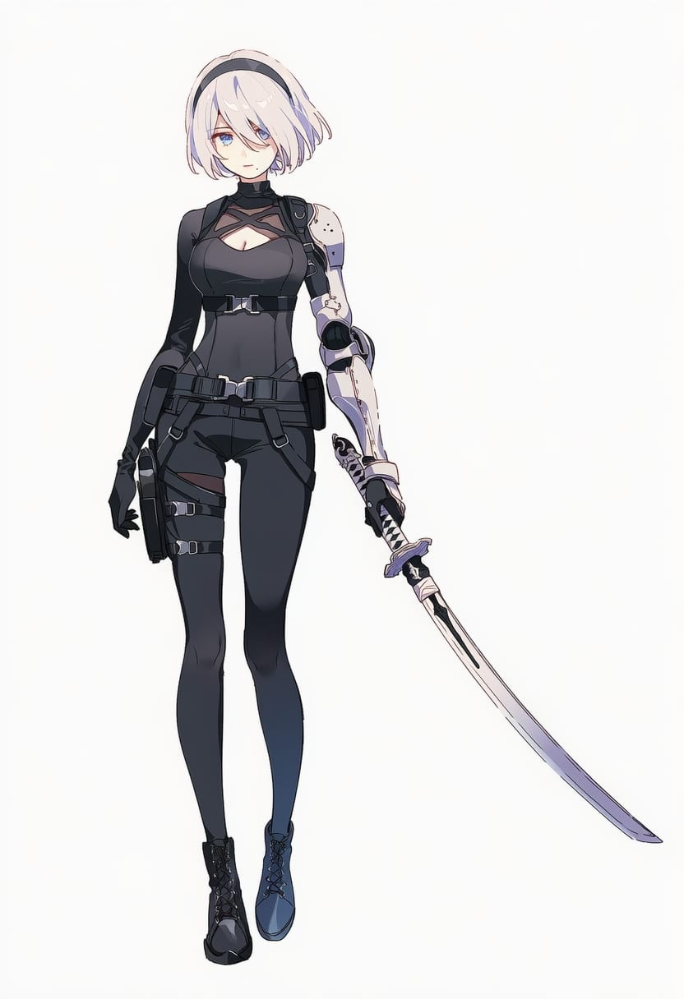

| 字段 | 内容 |
| --- | --- |
| 职业/身份原型（中文） | 义体特工 |
| NovelAI / Danbooru Tag 串 | 1.35::cyborg::, 1.28::techwear::, 1.22::bodysuit::, 1.16::single_mechanical_arm::, 1.12::goggles::, 1.10::utility_belt::, 1.08::handgun:: |
| 组合思路（大白话） | 紧身机能服配明显机械义肢和战术腰带，做潜入/执行任务型赛博特工。 |
| 世界细分 | 近未来 / 赛博朋克 |
| 模特 | 1girl,2b_(nier:automata) |
| 序号 | 0083 |

## 77. 仿生人战士

| 字段 | 内容 |
| --- | --- |
| 职业/身份原型（中文） | 仿生人战士 |
| NovelAI / Danbooru Tag 串 | 1.35::bodysuit::, 1.28::body_armor::, 1.22::mechanical_limbs::, 1.16::gloves::, 1.12::armored_boots::, 1.10::headset::, 1.08::neon_trim::, 1.06::android::, 1.04::robot_joints:: |
| 组合思路（大白话） | 紧身服和轻甲为底，机械肢体与霓虹细节负责表现仿生/人造人身份。 |
| 世界细分 | 近未来 / 赛博朋克 |
| 模特 | 1girl,a2_(nier:automata) |
| 序号 | 0084 |

## 78. 仿生人维修师

| 字段 | 内容 |
| --- | --- |
| 职业/身份原型（中文） | 仿生人维修师 |
| NovelAI / Danbooru Tag 串 | 1.35::techwear::, 1.28::apron::, 1.22::gloves::, 1.16::goggles::, 1.12::tool_belt::, 1.10::head-mounted_display:: |
| 组合思路（大白话） | 科技服装、工作围裙、护目镜、工具腰带和头戴显示器，强调精密维护。 |
| 世界细分 | 近未来 / 赛博朋克 |
| 模特 | 1girl,super_sonico |
| 序号 | 0085 |

## 79. 反乌托邦警察

| 字段 | 内容 |
| --- | --- |
| 职业/身份原型（中文） | 反乌托邦警察 |
| NovelAI / Danbooru Tag 串 | 1.35::police_uniform::, 1.28::peaked_cap::, 1.22::badge::, 1.16::body_armor::, 1.12::belt::, 1.10::gloves::, 1.08::boots:: |
| 组合思路（大白话） | 标准警服结构叠加护甲和更冷硬的企业制服提示，形成近未来治安部队。 |
| 世界细分 | 近未来 / 赛博朋克 |
| 模特 | 1girl,meira_(touhou) |
| 序号 | 0086 |

## 80. 网络潜行者

| 字段 | 内容 |
| --- | --- |
| 职业/身份原型（中文） | 网络潜行者 |
| NovelAI / Danbooru Tag 串 | 1.35::techwear::, 1.28::hooded_jacket::, 1.22::fingerless_gloves::, 1.16::headphones::, 1.12::goggles::, 1.10::thigh_strap::, 1.08::backpack:: |
| 组合思路（大白话） | 兜帽机能夹克、耳机、护目镜、手套和腿带，做出夜间潜入网络节点的街头黑客感。 |
| 世界细分 | 近未来 / 赛博朋克 |
| 模特 | 1girl,gengetsu_(touhou) |
| 序号 | 0087 |

## 81. 赛博侦探

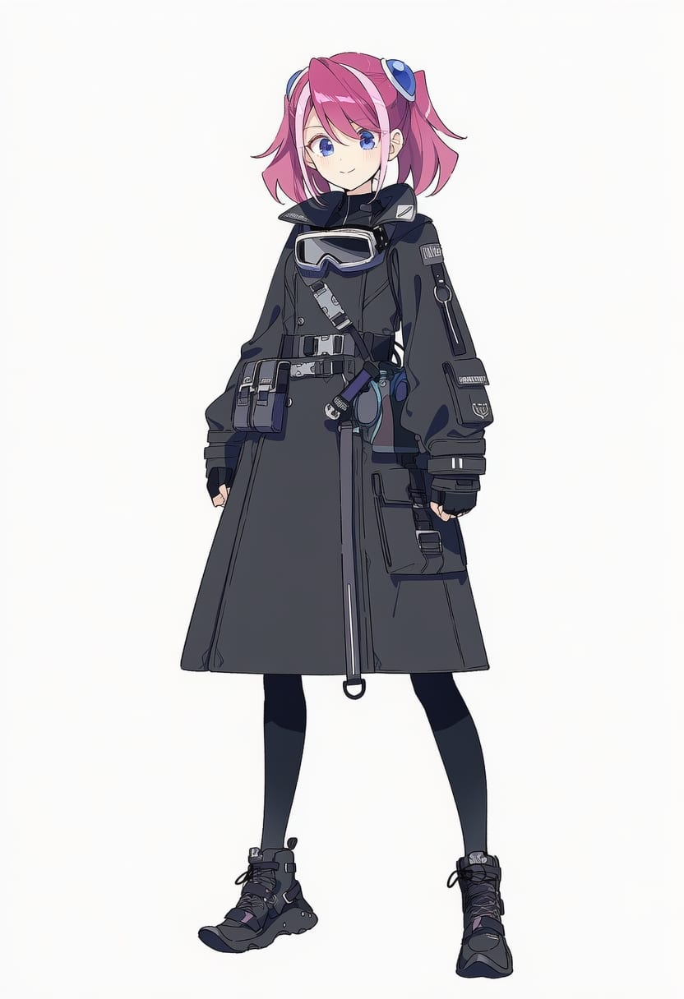

| 字段 | 内容 |
| --- | --- |
| 职业/身份原型（中文） | 赛博侦探 |
| NovelAI / Danbooru Tag 串 | 1.35::techwear::, 1.28::trench_coat::, 1.22::gloves::, 1.16::goggles::, 1.12::head-mounted_display::, 1.10::belt_pouch::, 1.08::boots:: |
| 组合思路（大白话） | 风衣保留侦探剪影，机能服、护目镜、头显和工具包把它推向赛博都市。 |
| 世界细分 | 近未来 / 赛博朋克 |
| 模特 | 1girl,hiiragi_yuzu |
| 序号 | 0088 |

## 82. 赛博黑客

| 字段 | 内容 |
| --- | --- |
| 职业/身份原型（中文） | 赛博黑客 |
| NovelAI / Danbooru Tag 串 | 1.35::techwear::, 1.28::hoodie::, 1.22::fingerless_gloves::, 1.16::head-mounted_display::, 1.12::headphones::, 1.10::cargo_pants::, 1.08::sneakers::, 1.06::cyberpunk::, 1.04::holographic_interface:: |
| 组合思路（大白话） | 黑客不需要重甲，重点是机能服、兜帽、露指手套、头显和耳机。 |
| 世界细分 | 近未来 / 赛博朋克 |
| 模特 | 1girl,topaz_(honkai:_star_rail) |
| 序号 | 0089 |

## 83. 量子实验员

| 字段 | 内容 |
| --- | --- |
| 职业/身份原型（中文） | 量子实验员 |
| NovelAI / Danbooru Tag 串 | 1.35::labcoat::, 1.28::latex_gloves::, 1.22::goggles::, 1.16::id_card::, 1.12::head-mounted_display::, 1.10::clipboard::, 1.08::bodysuit:: |
| 组合思路（大白话） | 实验服、手套、护目镜和头显，让传统实验室科学家更接近高科技研究设施。 |
| 世界细分 | 近未来 / 赛博朋克 |
| 模特 | 1girl,jane_doe_(zenless_zone_zero) |
| 序号 | 0090 |

## 84. 大魔导师

| 字段 | 内容 |
| --- | --- |
| 职业/身份原型（中文） | 大魔导师 |
| NovelAI / Danbooru Tag 串 | 1.35::wizard_hat::, 1.28::ornate_clothes::, 1.22::robe::, 1.16::cape::, 1.12::staff::, 1.10::jewelry::, 1.08::circlet:: |
| 组合思路（大白话） | 高权重法师帽与华丽服饰，再用法杖、珠宝和额环抬高阶级感。 |
| 世界细分 | 魔导科技 / 幻想工业 |
| 模特 | 1girl,tamamo_no_mae_(fate) |
| 序号 | 0091 |

## 85. 秘银矿工

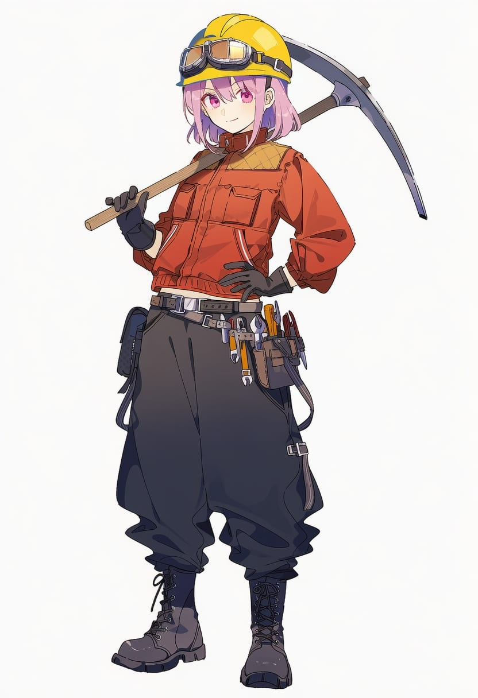

| 字段 | 内容 |
| --- | --- |
| 职业/身份原型（中文） | 秘银矿工 |
| NovelAI / Danbooru Tag 串 | 1.35::hard_hat::, 1.28::goggles::, 1.22::gloves::, 1.16::boots::, 1.12::tool_belt::, 1.10::pickaxe::, 1.08::leather_armor:: |
| 组合思路（大白话） | 矿工安全装备叠一层轻皮甲，以鹤嘴锄和金属采掘感表现幻想矿山劳动者。 |
| 世界细分 | 魔导科技 / 幻想工业 |
| 模特 | 1girl,sara_(touhou) |
| 序号 | 0092 |

## 86. 魔法工匠

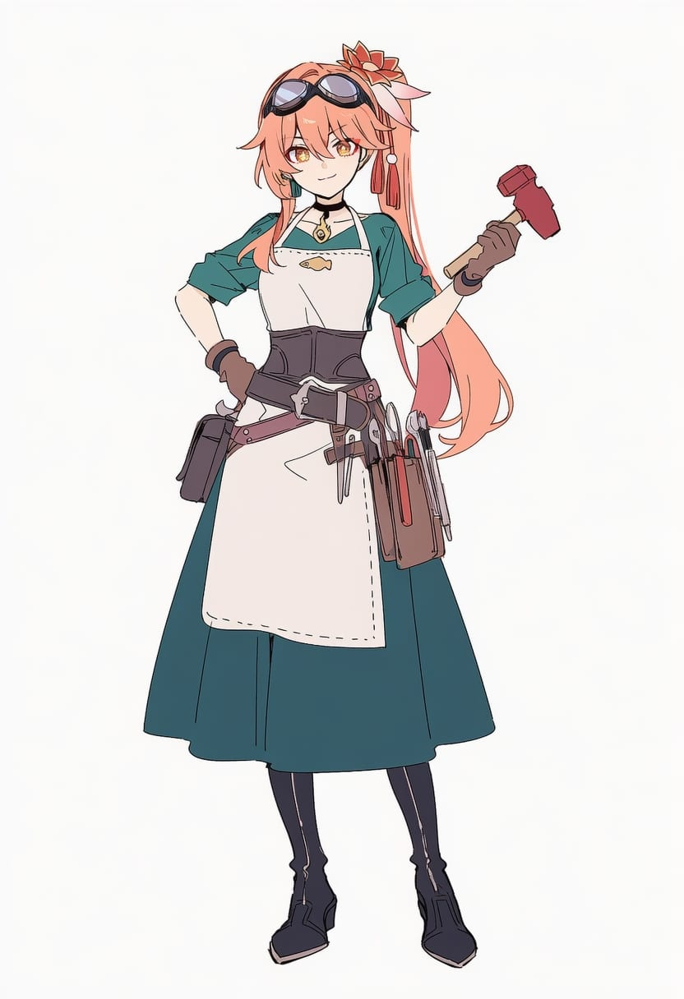

| 字段 | 内容 |
| --- | --- |
| 职业/身份原型（中文） | 魔法工匠 |
| NovelAI / Danbooru Tag 串 | 1.35::apron::, 1.28::goggles::, 1.22::gloves::, 1.16::tool_belt::, 1.12::amulet::, 1.10::hammer::, 1.08::robe:: |
| 组合思路（大白话） | 工匠围裙与工具装备叠在法袍上，用护符暗示制作的是魔法器具。 |
| 世界细分 | 魔导科技 / 幻想工业 |
| 模特 | 1girl,guinaifen_(honkai:_star_rail) |
| 序号 | 0093 |

## 87. 中世纪修士

| 字段 | 内容 |
| --- | --- |
| 职业/身份原型（中文） | 中世纪修士 |
| NovelAI / Danbooru Tag 串 | 1.35::monk::, 1.28::robe::, 1.22::hood::, 1.16::rope_belt::, 1.12::sandals::, 1.10::book::, 1.08::prayer_beads:: |
| 组合思路（大白话） | 宽松长袍、兜帽、绳腰带和经书，整体朴素、无甲、无华丽饰品。 |
| 世界细分 | 欧洲中世纪 / 近代历史 |
| 模特 | 1girl,nursery_rhyme_(fate) |
| 序号 | 0094 |

## 88. 中世纪修女

| 字段 | 内容 |
| --- | --- |
| 职业/身份原型（中文） | 中世纪修女 |
| NovelAI / Danbooru Tag 串 | 1.35::traditional_nun::, 1.28::nun_headdress::, 1.22::black_dress::, 1.16::veil::, 1.12::cross_necklace::, 1.10::long_sleeves::, 1.08::robe:: |
| 组合思路（大白话） | 按传统修女服走：黑色长裙/长袍、头巾、面纱和十字架。 |
| 世界细分 | 欧洲中世纪 / 近代历史 |
| 模特 | 1girl,louise_(touhou) |
| 序号 | 0095 |

## 89. 中世纪剑骑士

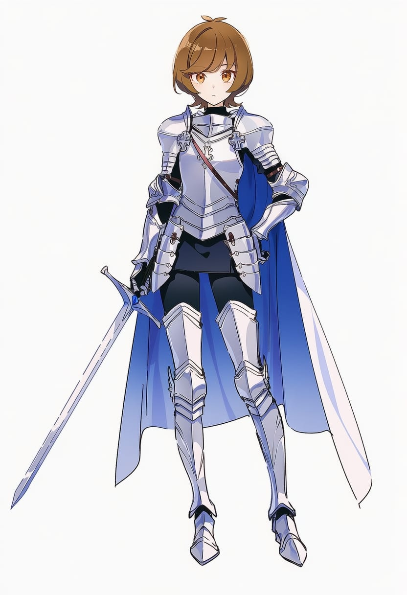

| 字段 | 内容 |
| --- | --- |
| 职业/身份原型（中文） | 中世纪剑骑士 |
| NovelAI / Danbooru Tag 串 | 1.35::plate_armor::, 1.28::breastplate::, 1.22::pauldrons::, 1.16::gauntlets::, 1.12::greaves::, 1.10::cape::, 1.08::sword::, 1.06::knight::, 1.04::holding_sword::, 1.02::shoulder_armor:: |
| 组合思路（大白话） | 板甲、胸甲、肩甲、臂甲和胫甲构成完整骑士轮廓，剑作为主武器放在最后确认职业。 |
| 世界细分 | 欧洲中世纪 / 近代历史 |
| 模特 | 1girl,zaizen_aoi |
| 序号 | 0096 |

## 90. 中世纪商人

| 字段 | 内容 |
| --- | --- |
| 职业/身份原型（中文） | 中世纪商人 |
| NovelAI / Danbooru Tag 串 | 1.35::medieval::, 1.28::tunic::, 1.22::cloak::, 1.16::belt_pouch::, 1.12::boots::, 1.10::bag::, 1.08::hat:: |
| 组合思路（大白话） | 不靠武器，重点是束腰外衣、斗篷、钱袋和货包，像旅行商贩。 |
| 世界细分 | 欧洲中世纪 / 近代历史 |
| 模特 | 1girl,yuutenji_nyamu |
| 序号 | 0097 |

## 91. 中世纪弓箭手

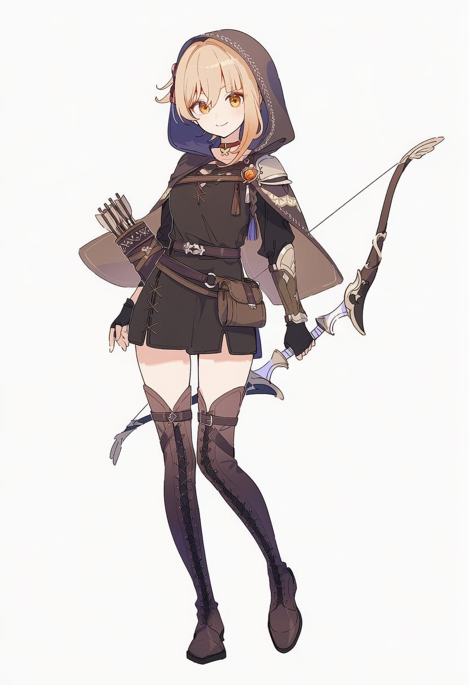

| 字段 | 内容 |
| --- | --- |
| 职业/身份原型（中文） | 中世纪弓箭手 |
| NovelAI / Danbooru Tag 串 | 1.35::hood::, 1.28::tunic::, 1.22::bracer::, 1.16::boots::, 1.12::quiver::, 1.10::bow_(weapon)::, 1.08::belt_pouch::, 1.06::archer::, 1.04::leather_armor::, 1.02::medieval:: |
| 组合思路（大白话） | 轻便兜帽、束腰上衣、护臂、箭袋和靴子，明显区别于重甲近战。 |
| 世界细分 | 欧洲中世纪 / 近代历史 |
| 模特 | 1girl,yoimiya_(genshin_impact) |
| 序号 | 0098 |

## 92. 中世纪弩手

| 字段 | 内容 |
| --- | --- |
| 职业/身份原型（中文） | 中世纪弩手 |
| NovelAI / Danbooru Tag 串 | 1.35::kettle_helm::, 1.28::chainmail::, 1.22::tunic::, 1.16::boots::, 1.12::crossbow::, 1.10::belt_pouch::, 1.08::gloves:: |
| 组合思路（大白话） | 壶形盔、锁子甲和弩形成普通城防/佣兵弩手的实用装备感。 |
| 世界细分 | 欧洲中世纪 / 近代历史 |
| 模特 | 1girl,minato_yukina |
| 序号 | 0099 |

## 93. 中世纪戟兵

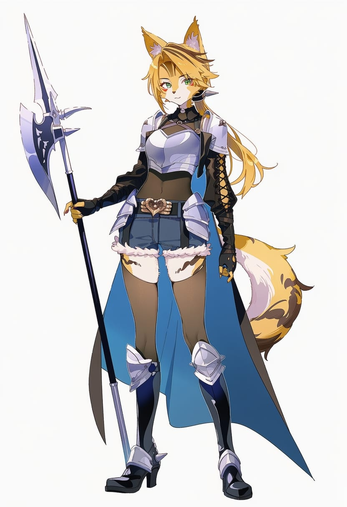

| 字段 | 内容 |
| --- | --- |
| 职业/身份原型（中文） | 中世纪戟兵 |
| NovelAI / Danbooru Tag 串 | 1.35::breastplate::, 1.28::pauldrons::, 1.22::gloves::, 1.16::boots::, 1.12::halberd::, 1.10::cape:: |
| 组合思路（大白话） | 胸甲和少量肩甲配长柄戟，适合城堡卫队或重装步兵。 |
| 世界细分 | 欧洲中世纪 / 近代历史 |
| 模特 | 1girl,pulchra_fellini |
| 序号 | 0100 |

## 94. 中世纪猎人

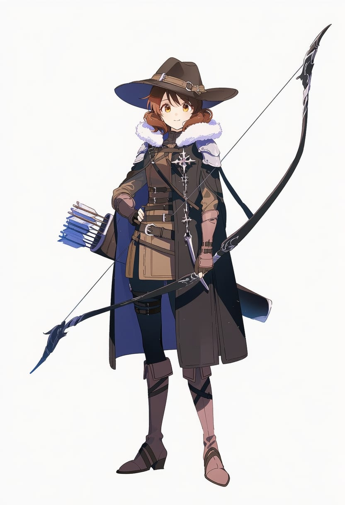

| 字段 | 内容 |
| --- | --- |
| 职业/身份原型（中文） | 中世纪猎人 |
| NovelAI / Danbooru Tag 串 | 1.35::fur_trim::, 1.28::leather_armor::, 1.22::wide-brimmed_hat::, 1.16::gloves::, 1.12::boots::, 1.10::bow_(weapon)::, 1.08::quiver::, 1.06::dagger:: |
| 组合思路（大白话） | 猎装、毛皮边、宽檐帽、皮甲、弓箭和匕首，做更粗犷的中世纪猎人，与森林游侠区分。 |
| 世界细分 | 欧洲中世纪 / 近代历史 |
| 模特 | 1girl,oumae_kumiko |
| 序号 | 0101 |

## 95. 中世纪重盾骑士

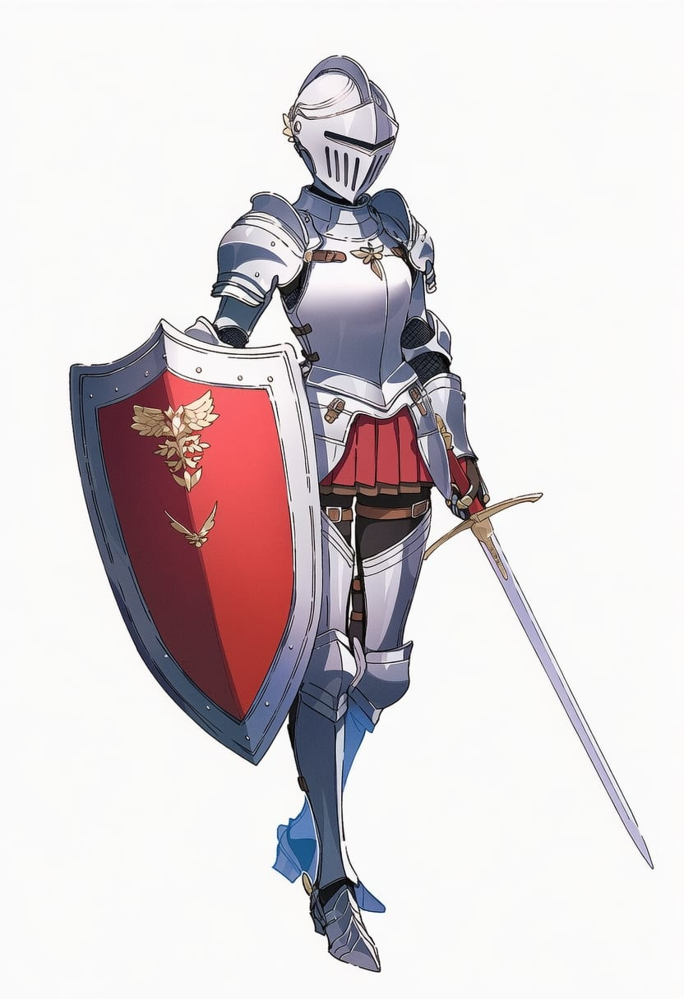

| 字段 | 内容 |
| --- | --- |
| 职业/身份原型（中文） | 中世纪重盾骑士 |
| NovelAI / Danbooru Tag 串 | 1.35::full_armor::, 1.28::plate_armor::, 1.22::great_helm::, 1.16::gauntlets::, 1.12::greaves::, 1.10::tower_shield::, 1.08::sword::, 1.06::shield::, 1.04::knight::, 1.02::pauldrons:: |
| 组合思路（大白话） | 比普通骑士更重：全身甲、大盔、塔盾，整体追求厚重防御感。 |
| 世界细分 | 欧洲中世纪 / 近代历史 |
| 模特 | 1girl,evelyn_chevalier |
| 序号 | 0102 |

## 96. 圣殿骑士

| 字段 | 内容 |
| --- | --- |
| 职业/身份原型（中文） | 圣殿骑士 |
| NovelAI / Danbooru Tag 串 | 1.35::full_armor::, 1.28::great_helm::, 1.22::tabard::, 1.16::cape::, 1.12::shield::, 1.10::sword::, 1.08::cross_necklace:: |
| 组合思路（大白话） | 大盔、全身甲、罩袍和十字配饰，把宗教骑士身份与重装战士结合。 |
| 世界细分 | 欧洲中世纪 / 近代历史 |
| 模特 | 1girl,laundry_dragonmaid |
| 序号 | 0104 |

## 97. 文艺复兴贵族

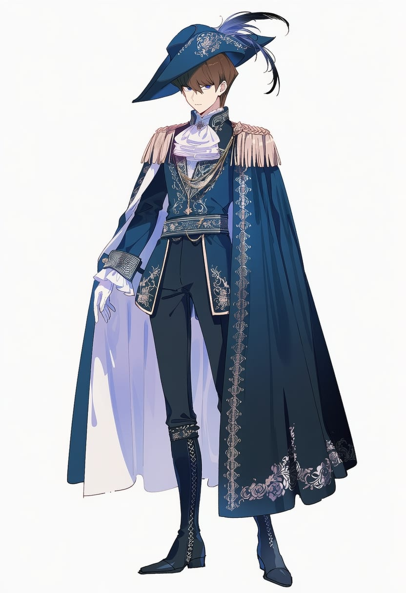

| 字段 | 内容 |
| --- | --- |
| 职业/身份原型（中文） | 文艺复兴贵族 |
| NovelAI / Danbooru Tag 串 | 1.35::renaissance_clothes::, 1.28::aristocratic_clothes::, 1.22::cape::, 1.16::ruff::, 1.12::jewelry::, 1.10::gloves::, 1.08::feathered_hat:: |
| 组合思路（大白话） | 用文艺复兴服装、轮状皱领、珠宝和羽饰帽，突出上层阶级。 |
| 世界细分 | 欧洲中世纪 / 近代历史 |
| 模特 | 1boy,kaiba_seto |
| 序号 | 0105 |

## 98. 火枪手

| 字段 | 内容 |
| --- | --- |
| 职业/身份原型（中文） | 火枪手 |
| NovelAI / Danbooru Tag 串 | 1.35::feathered_hat::, 1.28::cape::, 1.22::boots::, 1.16::gloves::, 1.12::bandolier::, 1.10::musket::, 1.08::rapier:: |
| 组合思路（大白话） | 羽饰帽、披风、长靴、火枪和细剑，直接走近代早期火枪手形象。 |
| 世界细分 | 欧洲中世纪 / 近代历史 |
| 模特 | 1girl,vivian_banshee |
| 序号 | 0106 |

## 99. 瘟疫医生

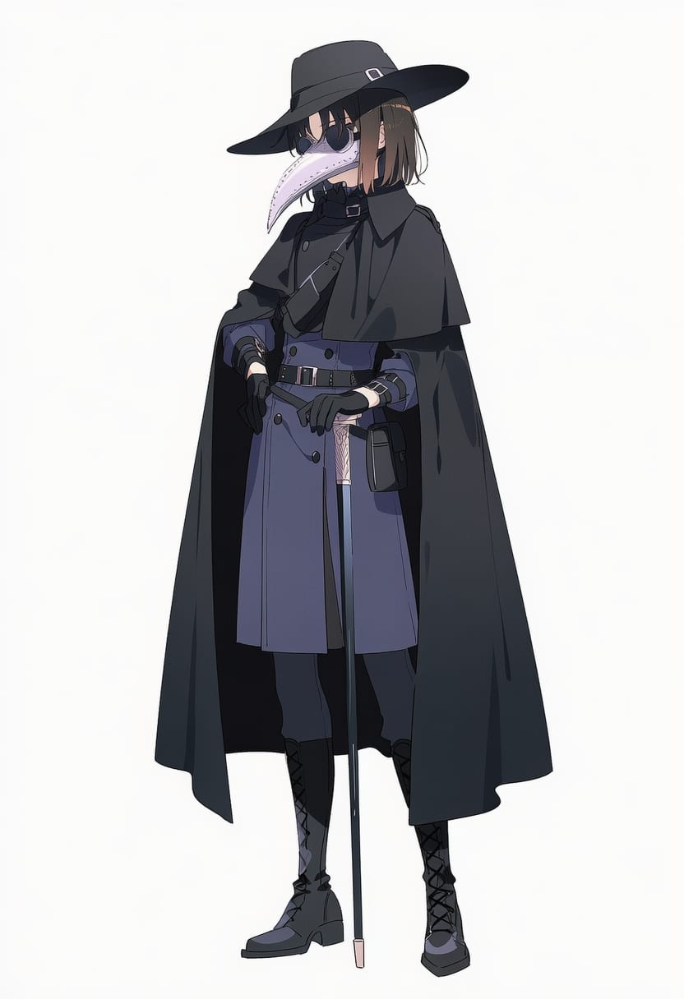

| 字段 | 内容 |
| --- | --- |
| 职业/身份原型（中文） | 瘟疫医生 |
| NovelAI / Danbooru Tag 串 | 1.35::plague_doctor_mask::, 1.28::long_coat::, 1.22::gloves::, 1.16::wide-brimmed_hat::, 1.12::boots::, 1.10::cane::, 1.08::plague_doctor::, 1.06::belt_pouch::, 1.04::hooded_cloak::, 1.02::hood:: |
| 组合思路（大白话） | 鸟嘴面具是绝对核心，再用长外套、宽檐帽、手套、靴子和手杖补完整历史造型。 |
| 世界细分 | 欧洲中世纪 / 近代历史 |
| 模特 | 1girl,ryougi_shiki |
| 序号 | 0107 |

## 100. 维京战士

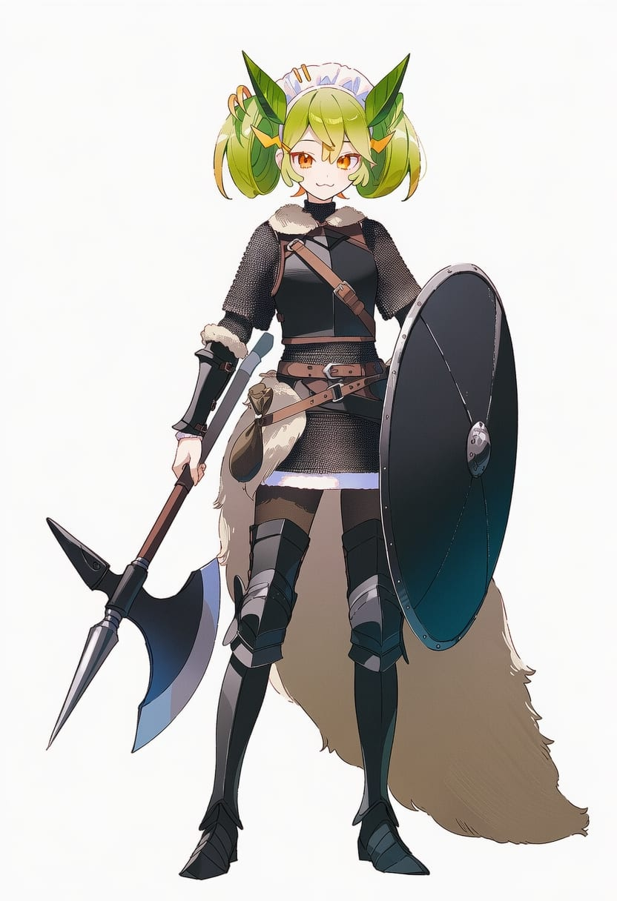

| 字段 | 内容 |
| --- | --- |
| 职业/身份原型（中文） | 维京战士 |
| NovelAI / Danbooru Tag 串 | 1.35::fur_trim::, 1.28::leather_armor::, 1.22::chainmail::, 1.16::round_shield::, 1.12::axe::, 1.10::boots::, 1.08::bracer:: |
| 组合思路（大白话） | 皮甲、锁子甲、毛皮边饰、圆盾和战斧，重点是北方战士的粗犷实用感。 |
| 世界细分 | 欧洲中世纪 / 近代历史 |
| 模特 | 1girl,parlor_dragonmaid |
| 序号 | 0108 |

## 101. 维多利亚侦探

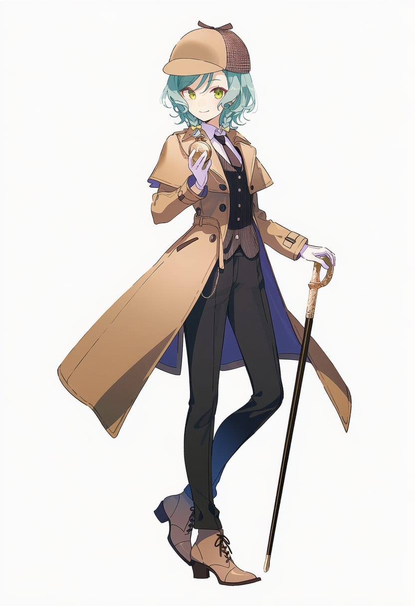

| 字段 | 内容 |
| --- | --- |
| 职业/身份原型（中文） | 维多利亚侦探 |
| NovelAI / Danbooru Tag 串 | 1.35::trench_coat::, 1.28::suit::, 1.22::gloves::, 1.16::boots::, 1.12::pocket_watch::, 1.10::cane::, 1.08::deerstalker:: |
| 组合思路（大白话） | 风衣/西装、手套、怀表、手杖和猎鹿帽，偏古典推理小说视觉。 |
| 世界细分 | 欧洲中世纪 / 近代历史 |
| 模特 | 1girl,hikawa_hina |
| 序号 | 0109 |

## 102. 维多利亚绅士

| 字段 | 内容 |
| --- | --- |
| 职业/身份原型（中文） | 维多利亚绅士 |
| NovelAI / Danbooru Tag 串 | 1.35::victorian::, 1.28::suit::, 1.22::top_hat::, 1.16::vest::, 1.12::cravat::, 1.10::gloves::, 1.08::cane::, 1.06::long_coat:: |
| 组合思路（大白话） | 礼帽、马甲、领巾、手杖和长外套组合成19世纪绅士。 |
| 世界细分 | 欧洲中世纪 / 近代历史 |
| 模特 | 1girl,jeanne_d'arc_(fate) |
| 序号 | 0110 |

## 103. 西部牛仔

| 字段 | 内容 |
| --- | --- |
| 职业/身份原型（中文） | 西部牛仔 |
| NovelAI / Danbooru Tag 串 | 1.35::cowboy_hat::, 1.28::western::, 1.22::vest::, 1.16::button_up_shirt::, 1.12::belt::, 1.10::holster::, 1.08::cowboy_boots::, 1.06::bandana::, 1.04::cowboy_western::, 1.02::neckerchief:: |
| 组合思路（大白话） | 牛仔帽、马甲、衬衫、枪套腰带、牛仔靴和方巾，一眼西部。 |
| 世界细分 | 欧洲中世纪 / 近代历史 |
| 模特 | 1girl,shinki_(touhou) |
| 序号 | 0111 |

## 104. 忍者

| 字段 | 内容 |
| --- | --- |
| 职业/身份原型（中文） | 忍者 |
| NovelAI / Danbooru Tag 串 | 1.35::hood::, 1.28::mask::, 1.22::black_clothes::, 1.16::arm_guards::, 1.12::shin_guards::, 1.10::fingerless_gloves::, 1.08::dagger::, 1.06::ninja::, 1.04::tabi::, 1.02::kunai:: |
| 组合思路（大白话） | 黑衣、兜帽、面罩、护臂护胫和短刃，尽量做成轻装潜行者。 |
| 世界细分 | 日本古典 / 武家时代 |
| 模特 | 1girl,black_swan_(honkai:_star_rail) |
| 序号 | 0112 |

## 105. 武士

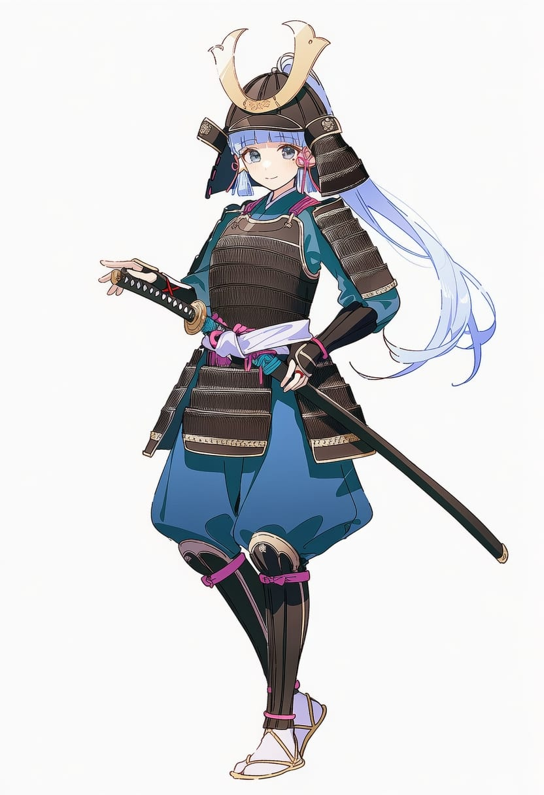

| 字段 | 内容 |
| --- | --- |
| 职业/身份原型（中文） | 武士 |
| NovelAI / Danbooru Tag 串 | 1.35::japanese_armor::, 1.28::kabuto_(helmet)::, 1.22::sode::, 1.16::kote::, 1.12::kusazuri::, 1.10::suneate::, 1.08::katana::, 1.06::samurai::, 1.04::kabuto::, 1.02::waraji:: |
| 组合思路（大白话） | 直接使用日式甲胄细分标签：兜、袖甲、笼手、草摺、胫当，再配刀。 |
| 世界细分 | 日本古典 / 武家时代 |
| 模特 | 1girl,kamisato_ayaka |
| 序号 | 0113 |

## 106. 阴阳师

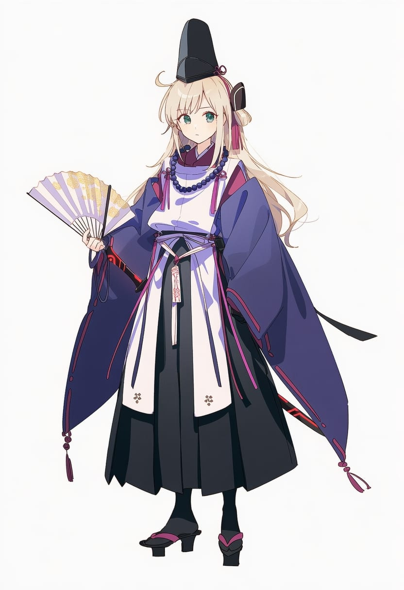

| 字段 | 内容 |
| --- | --- |
| 职业/身份原型（中文） | 阴阳师 |
| NovelAI / Danbooru Tag 串 | 1.35::kariginu::, 1.28::eboshi::, 1.22::ofuda::, 1.16::folding_fan::, 1.12::wide_sleeves::, 1.10::prayer_beads::, 1.08::onmyouji::, 1.06::japanese_clothes::, 1.04::robe::, 1.02::shikigami:: |
| 组合思路（大白话） | 狩衣、乌帽子、符纸和折扇是最核心组合，整体做成平安时代术士礼服感。 |
| 世界细分 | 神道 / 阴阳术 / 灵异 |
| 模特 | 1girl,sky_striker_ace_-_raye |
| 序号 | 0114 |

## 107. 狐族巫女

| 字段 | 内容 |
| --- | --- |
| 职业/身份原型（中文） | 狐族巫女 |
| NovelAI / Danbooru Tag 串 | 1.35::fox_ears::, 1.28::miko::, 1.22::hakama::, 1.16::wide_sleeves::, 1.12::hair_ornament::, 1.10::bell::, 1.08::gohei:: |
| 组合思路（大白话） | 狐狸耳与标准巫女服叠加，再用铃铛和御币增加灵性与仪式感。 |
| 世界细分 | 神道 / 阴阳术 / 灵异 |
| 模特 | 1girl,yae_miko |
| 序号 | 0115 |

## 108. 圣物猎人

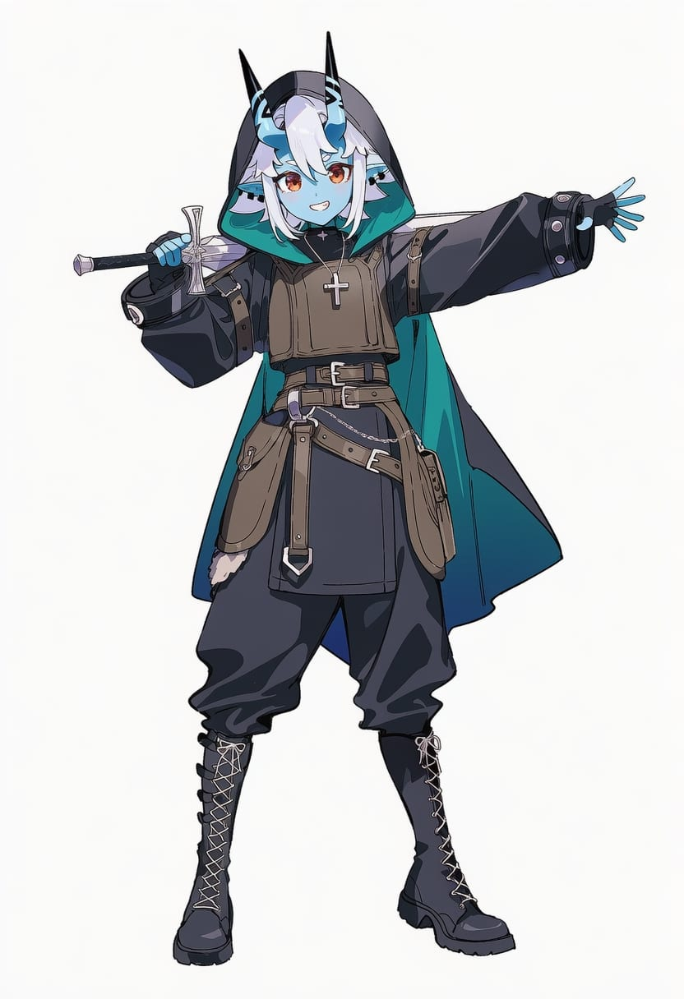

| 字段 | 内容 |
| --- | --- |
| 职业/身份原型（中文） | 圣物猎人 |
| NovelAI / Danbooru Tag 串 | 1.35::hood::, 1.28::cloak::, 1.22::leather_armor::, 1.16::gloves::, 1.12::boots::, 1.10::cross_necklace::, 1.08::satchel:: |
| 组合思路（大白话） | 轻甲、披风和挎包适合遗迹探索，十字/护符类配饰强调专门搜寻圣物。 |
| 世界细分 | 神圣幻想 / 教会体系 |
| 模特 | 1girl,soukaku_(zenless_zone_zero) |
| 序号 | 0116 |

## 109. 圣骑士

| 字段 | 内容 |
| --- | --- |
| 职业/身份原型（中文） | 圣骑士 |
| NovelAI / Danbooru Tag 串 | 1.35::white_armor::, 1.28::plate_armor::, 1.22::breastplate::, 1.16::pauldrons::, 1.12::gauntlets::, 1.10::cape::, 1.08::shield::, 1.06::sword::, 1.04::greaves::, 1.02::paladin:: |
| 组合思路（大白话） | 白色板甲、大肩甲、披风、盾剑组合，把“神圣”和“骑士”同时写进轮廓。 |
| 世界细分 | 神圣幻想 / 教会体系 |
| 模特 | 1girl,sparkle_(honkai:_star_rail) |
| 序号 | 0117 |

## 110. 魔门圣女

| 字段 | 内容 |
| --- | --- |
| 职业/身份原型（中文） | 魔门圣女 |
| NovelAI / Danbooru Tag 串 | 1.35::black_hanfu::, 1.28::ornate_clothes::, 1.22::wide_sleeves::, 1.16::red_jewelry::, 1.12::sash::, 1.10::veil::, 1.08::dark_aura:: |
| 组合思路（大白话） | 黑色华服配红色珠宝和薄纱，既有宗门高位身份，又保留邪道危险感。 |
| 世界细分 | 神圣幻想 / 教会体系 |
| 模特 | 1girl,yun_jin_(genshin_impact) |
| 序号 | 0119 |

## 111. 龙语祭司

| 字段 | 内容 |
| --- | --- |
| 职业/身份原型（中文） | 龙语祭司 |
| NovelAI / Danbooru Tag 串 | 1.35::robe::, 1.28::scale_armor::, 1.22::cape::, 1.16::horns::, 1.12::staff::, 1.10::amulet::, 1.08::jewelry:: |
| 组合思路（大白话） | 法袍与鳞甲并存，角、法杖和护符让角色像侍奉龙族或龙神的祭司。 |
| 世界细分 | 神圣幻想 / 教会体系 |
| 模特 | 1girl,lucoa_(maidragon) |
| 序号 | 0120 |

## 112. 生化危机研究员

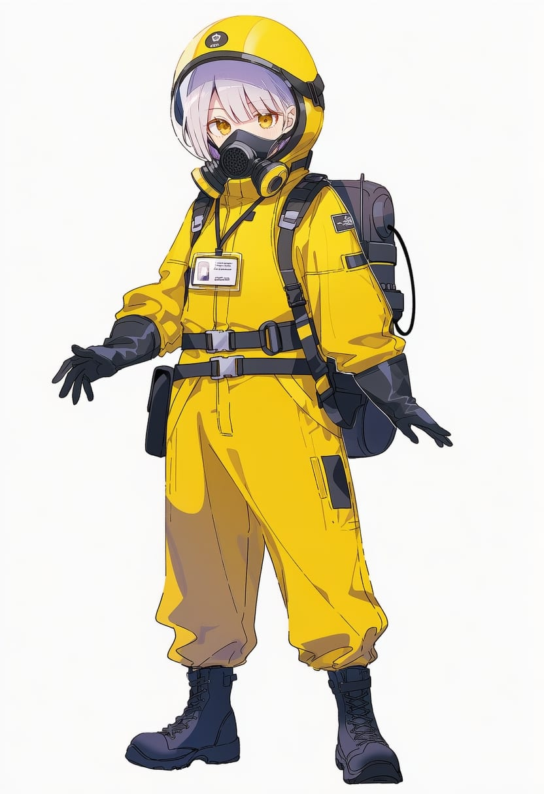

| 字段 | 内容 |
| --- | --- |
| 职业/身份原型（中文） | 生化危机研究员 |
| NovelAI / Danbooru Tag 串 | 1.35::hazmat_suit::, 1.28::gas_mask::, 1.22::latex_gloves::, 1.16::boots::, 1.12::backpack::, 1.10::id_card:: |
| 组合思路（大白话） | 密闭防化服、面罩、手套和背负设备，再加证件体现研究机构而非普通救援人员。 |
| 世界细分 | 生化危机 / 科研设施 |
| 模特 | 1girl,ukinami_yuzuha |
| 序号 | 0121 |

## 113. 刑警

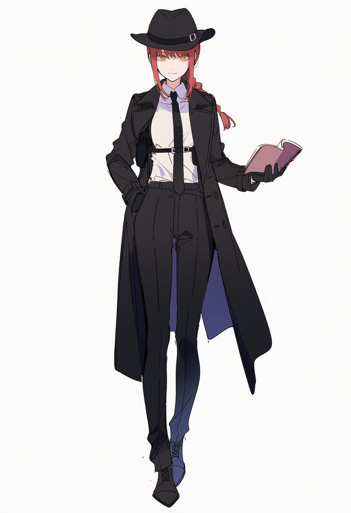

| 字段 | 内容 |
| --- | --- |
| 职业/身份原型（中文） | 刑警 |
| NovelAI / Danbooru Tag 串 | 1.35::trench_coat::, 1.28::suit::, 1.22::necktie::, 1.16::gloves::, 1.12::gun_holster::, 1.10::notebook::, 1.08::fedora::, 1.06::shoulder_holster:: |
| 组合思路（大白话） | 不走标准警服，改用风衣、西装、枪套和记事本，突出便衣调查人员的感觉。 |
| 世界细分 | 司法 / 执法 / 安保 |
| 模特 | 1girl,makima_(chainsaw_man) |
| 序号 | 0122 |

## 114. 律师

| 字段 | 内容 |
| --- | --- |
| 职业/身份原型（中文） | 律师 |
| NovelAI / Danbooru Tag 串 | 1.35::business_suit::, 1.28::dress_shirt::, 1.22::necktie::, 1.16::briefcase::, 1.12::lapel_pin::, 1.10::gloves::, 1.08::suit::, 1.06::suit_jacket::, 1.04::collared_shirt::, 1.02::formal_clothes:: |
| 组合思路（大白话） | 律师主要靠剪裁利落的商务套装和公文包，领带与翻领针强调正式场合。 |
| 世界细分 | 司法 / 执法 / 安保 |
| 模特 | 1girl,i:p_masquerena |
| 序号 | 0123 |

## 115. 警察

| 字段 | 内容 |
| --- | --- |
| 职业/身份原型（中文） | 警察 |
| NovelAI / Danbooru Tag 串 | 1.35::police_uniform::, 1.28::peaked_cap::, 1.22::badge::, 1.16::belt::, 1.12::handcuffs::, 1.10::gun_holster::, 1.08::boots::, 1.06::police_hat::, 1.04::utility_belt::, 1.02::police:: |
| 组合思路（大白话） | 警服、大檐帽、警徽、腰带、手铐和枪套形成非常明确的执法制服语言。 |
| 世界细分 | 司法 / 执法 / 安保 |
| 模特 | 1girl,robin_(honkai:_star_rail) |
| 序号 | 0124 |

## 116. 贴身保镖

| 字段 | 内容 |
| --- | --- |
| 职业/身份原型（中文） | 贴身保镖 |
| NovelAI / Danbooru Tag 串 | 1.35::suit::, 1.28::earpiece::, 1.22::gloves::, 1.16::sunglasses::, 1.12::necktie::, 1.10::gun_holster:: |
| 组合思路（大白话） | 深色西装、耳机、手套、墨镜和隐蔽枪套，是典型贴身护卫视觉。 |
| 世界细分 | 司法 / 执法 / 安保 |
| 模特 | 1girl,ju_fufu |
| 序号 | 0125 |

## 117. 乐团指挥

| 字段 | 内容 |
| --- | --- |
| 职业/身份原型（中文） | 乐团指挥 |
| NovelAI / Danbooru Tag 串 | 1.35::tailcoat::, 1.28::white_gloves::, 1.22::bowtie::, 1.16::vest::, 1.12::baton:: |
| 组合思路（大白话） | 燕尾服、白手套、领结和指挥棒直接给出古典乐团指挥的舞台形象。 |
| 世界细分 | 体育 / 演艺 / 艺术 |
| 模特 | 1girl,hong_meiling |
| 序号 | 0127 |

## 118. 健身教练

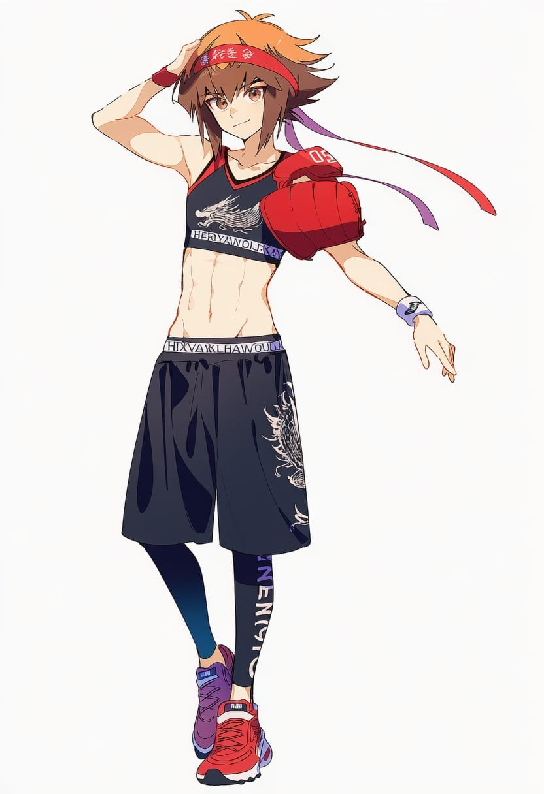

| 字段 | 内容 |
| --- | --- |
| 职业/身份原型（中文） | 健身教练 |
| NovelAI / Danbooru Tag 串 | 1.35::sportswear::, 1.28::sports_bra::, 1.22::leggings::, 1.16::sneakers::, 1.12::wristband::, 1.10::headband:: |
| 组合思路（大白话） | 贴身运动装、运动鞋和吸汗配件，偏现代健身房风格。 |
| 世界细分 | 体育 / 演艺 / 艺术 |
| 模特 | 1boy,yuuki_juudai |
| 序号 | 0128 |

## 119. 偶像

| 字段 | 内容 |
| --- | --- |
| 职业/身份原型（中文） | 偶像 |
| NovelAI / Danbooru Tag 串 | 1.35::idol::, 1.28::frilled_dress::, 1.22::frilled_skirt::, 1.16::bow::, 1.12::ribbon::, 1.10::thigh_boots::, 1.08::headset:: |
| 组合思路（大白话） | 偶像装重点是舞台感：荷叶边、蝴蝶结、丝带、长靴和耳麦。 |
| 世界细分 | 体育 / 演艺 / 艺术 |
| 模特 | 1girl,hoshino_ichika_(project_sekai) |
| 序号 | 0129 |

## 120. 大提琴家

| 字段 | 内容 |
| --- | --- |
| 职业/身份原型（中文） | 大提琴家 |
| NovelAI / Danbooru Tag 串 | 1.35::formal_clothes::, 1.28::long_dress::, 1.22::cello::, 1.16::gloves::, 1.12::jewelry::, 1.10::hair_ornament:: |
| 组合思路（大白话） | 正式演出服配大提琴，整体保持古典音乐舞台的端庄感。 |
| 世界细分 | 体育 / 演艺 / 艺术 |
| 模特 | 1girl,firefly_(honkai:_star_rail) |
| 序号 | 0131 |

## 121. 拳击手

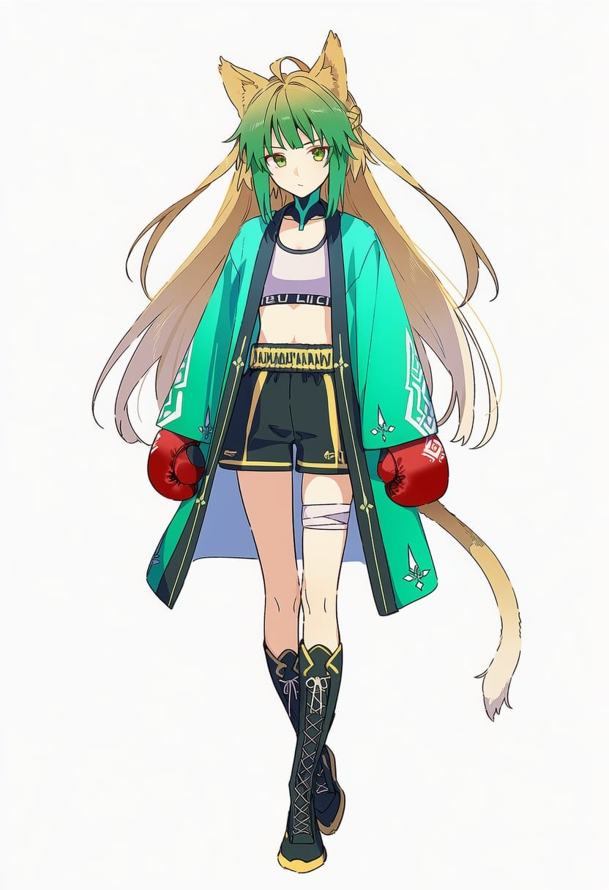

| 字段 | 内容 |
| --- | --- |
| 职业/身份原型（中文） | 拳击手 |
| NovelAI / Danbooru Tag 串 | 1.35::boxing_gloves::, 1.28::shorts::, 1.22::boots::, 1.16::robe::, 1.12::bandages::, 1.10::mouthguard:: |
| 组合思路（大白话） | 拳击手套、短裤、拳击靴和入场长袍，再加手部绷带强化擂台职业感。 |
| 世界细分 | 体育 / 演艺 / 艺术 |
| 模特 | 1girl,atalanta_(fate) |
| 序号 | 0132 |

## 122. 摄影师

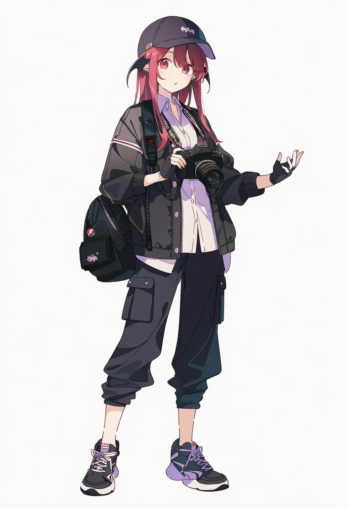

| 字段 | 内容 |
| --- | --- |
| 职业/身份原型（中文） | 摄影师 |
| NovelAI / Danbooru Tag 串 | 1.35::jacket::, 1.28::vest::, 1.22::camera::, 1.16::shoulder_bag::, 1.12::fingerless_gloves::, 1.10::baseball_cap::, 1.08::cargo_pants::, 1.06::camera_strap::, 1.04::camera_around_neck:: |
| 组合思路（大白话） | 摄影师不需要统一制服，靠相机、功能马甲、肩包和轻便手套体现职业。 |
| 世界细分 | 体育 / 演艺 / 艺术 |
| 模特 | 1girl,koakuma |
| 序号 | 0133 |

## 123. 棒球运动员

| 字段 | 内容 |
| --- | --- |
| 职业/身份原型（中文） | 棒球运动员 |
| NovelAI / Danbooru Tag 串 | 1.35::baseball_uniform::, 1.28::baseball_cap::, 1.22::baseball_glove::, 1.16::belt::, 1.12::pants::, 1.10::cleats:: |
| 组合思路（大白话） | 棒球制服、大檐棒球帽、球套、腰带和球裤。 |
| 世界细分 | 体育 / 演艺 / 艺术 |
| 模特 | 1girl,lil-la_(yu-gi-oh!) |
| 序号 | 0134 |

## 124. 游泳运动员

| 字段 | 内容 |
| --- | --- |
| 职业/身份原型（中文） | 游泳运动员 |
| NovelAI / Danbooru Tag 串 | 1.35::competition_swimsuit::, 1.28::swim_cap::, 1.22::goggles::, 1.16::towel::, 1.12::sandals:: |
| 组合思路（大白话） | 竞赛泳装、泳帽、泳镜和毛巾即可稳定表达专业游泳运动员。 |
| 世界细分 | 体育 / 演艺 / 艺术 |
| 模特 | 1girl,mitake_ran |
| 序号 | 0135 |

## 125. 画家

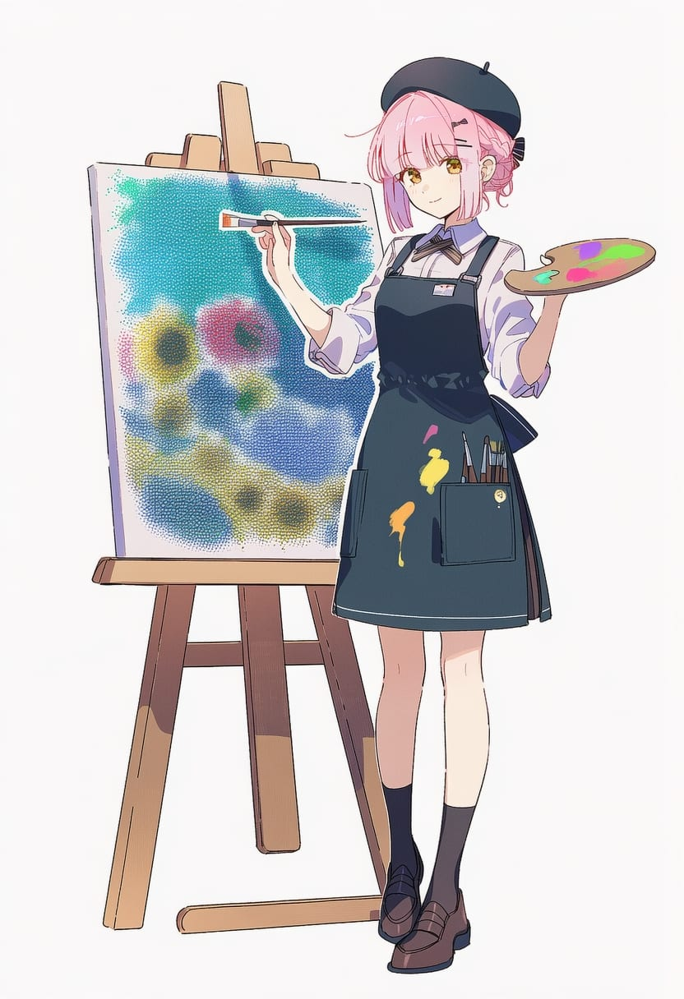

| 字段 | 内容 |
| --- | --- |
| 职业/身份原型（中文） | 画家 |
| NovelAI / Danbooru Tag 串 | 1.35::artist::, 1.28::apron::, 1.22::rolled_up_sleeves::, 1.16::beret::, 1.12::holding_paintbrush::, 1.10::paint_splatter:: |
| 组合思路（大白话） | 围裙和卷袖防颜料，贝雷帽做经典艺术家符号，再加画笔和颜料痕迹。 |
| 世界细分 | 体育 / 演艺 / 艺术 |
| 模特 | 1girl,yixuan_(zenless_zone_zero) |
| 序号 | 0136 |

## 126. 网球运动员

| 字段 | 内容 |
| --- | --- |
| 职业/身份原型（中文） | 网球运动员 |
| NovelAI / Danbooru Tag 串 | 1.35::tennis_uniform::, 1.28::tennis_skirt::, 1.22::visor_cap::, 1.16::sportswear::, 1.12::sneakers::, 1.10::wristband::, 1.08::holding_tennis_racket:: |
| 组合思路（大白话） | 网球服、网球裙、遮阳帽、腕带和球拍，直接做运动项目识别。 |
| 世界细分 | 体育 / 演艺 / 艺术 |
| 模特 | 1girl,patchouli_knowledge |
| 序号 | 0137 |

## 127. 自行车运动员

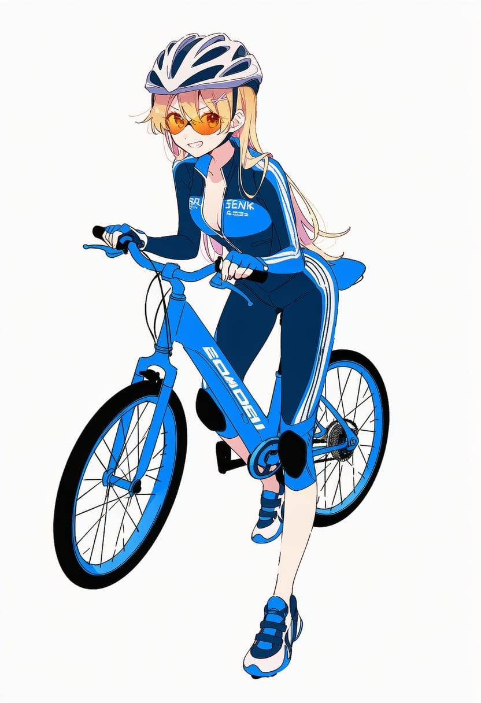

| 字段 | 内容 |
| --- | --- |
| 职业/身份原型（中文） | 自行车运动员 |
| NovelAI / Danbooru Tag 串 | 1.35::bodysuit::, 1.28::bicycle_helmet::, 1.22::gloves::, 1.16::sunglasses::, 1.12::sneakers::, 1.10::knee_pads:: |
| 组合思路（大白话） | 贴身骑行服、骑行头盔、手套和运动墨镜，强调速度与空气动力学轮廓。 |
| 世界细分 | 体育 / 演艺 / 艺术 |
| 模特 | 1girl,ki-sikil_(yu-gi-oh!) |
| 序号 | 0138 |

## 128. 舞台魔术师

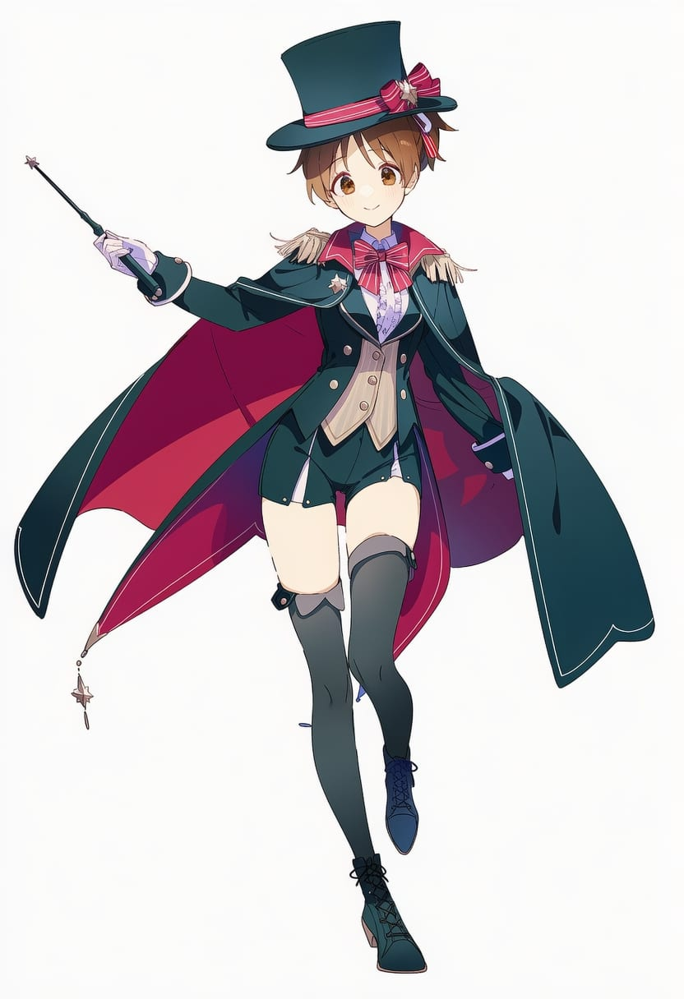

| 字段 | 内容 |
| --- | --- |
| 职业/身份原型（中文） | 舞台魔术师 |
| NovelAI / Danbooru Tag 串 | 1.35::top_hat::, 1.28::tailcoat::, 1.22::white_gloves::, 1.16::bowtie::, 1.12::cape::, 1.10::wand:: |
| 组合思路（大白话） | 高礼帽、燕尾服、白手套、披风和魔杖是古典舞台魔术师的完整剪影。 |
| 世界细分 | 体育 / 演艺 / 艺术 |
| 模特 | 1girl,hirasawa_ui |
| 序号 | 0139 |

## 129. 裁判员

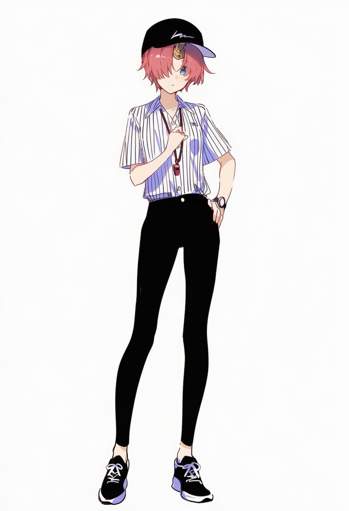

| 字段 | 内容 |
| --- | --- |
| 职业/身份原型（中文） | 裁判员 |
| NovelAI / Danbooru Tag 串 | 1.35::striped_shirt::, 1.28::whistle::, 1.22::slacks::, 1.16::sneakers::, 1.12::wristwatch::, 1.10::cap:: |
| 组合思路（大白话） | 条纹上衣、口哨、运动鞋和腕表是最简洁的体育裁判视觉。 |
| 世界细分 | 体育 / 演艺 / 艺术 |
| 模特 | 1girl,frankenstein's_monster_(fate) |
| 序号 | 0140 |

## 130. 音乐家

| 字段 | 内容 |
| --- | --- |
| 职业/身份原型（中文） | 音乐家 |
| NovelAI / Danbooru Tag 串 | 1.35::formal_clothes::, 1.28::dress_shirt::, 1.22::vest::, 1.16::bowtie::, 1.12::holding_instrument:: |
| 组合思路（大白话） | 没有限定乐器时用演奏会正装，让乐器本身成为职业锚点。 |
| 世界细分 | 体育 / 演艺 / 艺术 |
| 模特 | 1boy,venti_(genshin_impact) |
| 序号 | 0141 |

## 131. 喷气背包侦察兵

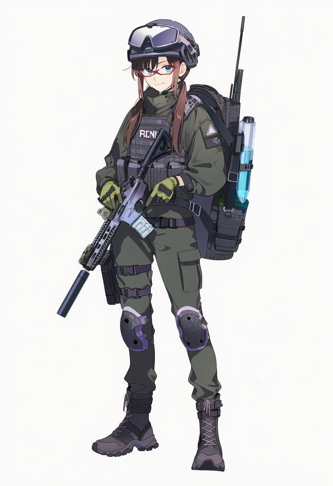

| 字段 | 内容 |
| --- | --- |
| 职业/身份原型（中文） | 喷气背包侦察兵 |
| NovelAI / Danbooru Tag 串 | 1.35::jetpack::, 1.28::tactical_clothes::, 1.22::helmet::, 1.16::goggles::, 1.12::utility_belt::, 1.10::combat_boots::, 1.08::rifle:: |
| 组合思路（大白话） | 喷气背包是绝对核心，配轻战术服、护目镜和步枪做高速空中侦察兵。 |
| 世界细分 | 未来战争 / 高科技装备 |
| 模特 | 1girl,makinami_mari_illustrious |
| 序号 | 0142 |

## 132. 外骨骼突击兵

| 字段 | 内容 |
| --- | --- |
| 职业/身份原型（中文） | 外骨骼突击兵 |
| NovelAI / Danbooru Tag 串 | 1.35::exoskeleton::, 1.28::tactical_clothes::, 1.22::bulletproof_vest::, 1.16::helmet::, 1.12::goggles::, 1.10::utility_belt::, 1.08::combat_boots::, 1.06::rifle:: |
| 组合思路（大白话） | 战术服外面叠机械外骨骼，保留现代军警装备，让科技升级感更可信。 |
| 世界细分 | 未来战争 / 高科技装备 |
| 模特 | 1girl,ayanami_rei |
| 序号 | 0143 |

## 133. 动力甲重装兵

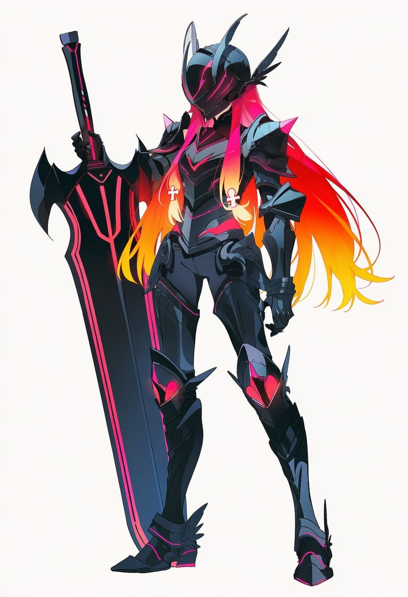

| 字段 | 内容 |
| --- | --- |
| 职业/身份原型（中文） | 动力甲重装兵 |
| NovelAI / Danbooru Tag 串 | 1.35::power_armor::, 1.28::helmet::, 1.22::gauntlets::, 1.16::armored_boots::, 1.12::shoulder_armor::, 1.10::glowing_armor::, 1.08::full_armor::, 1.06::greaves::, 1.04::large_weapon:: |
| 组合思路（大白话） | 直接让 power_armor 成为绝对主体，再堆大肩甲、重护手和发光装甲。 |
| 世界细分 | 未来战争 / 高科技装备 |
| 模特 | 1girl,yui_(angel_beats!) |
| 序号 | 0144 |

## 134. 未来军医

| 字段 | 内容 |
| --- | --- |
| 职业/身份原型（中文） | 未来军医 |
| NovelAI / Danbooru Tag 串 | 1.35::scrubs::, 1.28::body_armor::, 1.22::utility_vest::, 1.16::disposable_gloves::, 1.12::medical_mask::, 1.10::id_card::, 1.08::labcoat::, 1.06::holographic_interface::, 1.04::rubber_gloves:: |
| 组合思路（大白话） | 医疗服上叠轻型防护和多口袋背心，像战地/星际军医。 |
| 世界细分 | 未来战争 / 高科技装备 |
| 模特 | 1girl,lingsha_(honkai:_star_rail) |
| 序号 | 0145 |

## 135. 未来狙击手

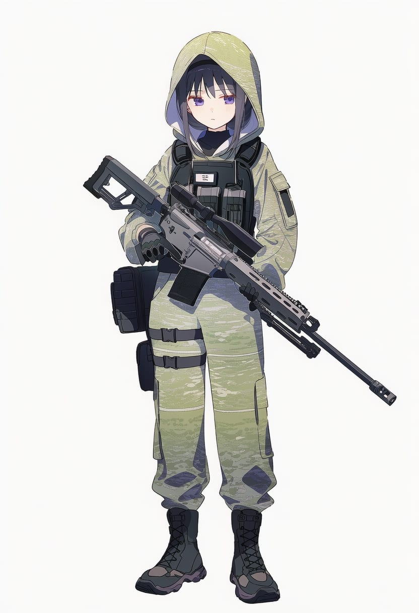

| 字段 | 内容 |
| --- | --- |
| 职业/身份原型（中文） | 未来狙击手 |
| NovelAI / Danbooru Tag 串 | 1.35::tactical_clothes::, 1.28::ghillie_suit::, 1.22::hood::, 1.16::body_armor::, 1.12::gloves::, 1.10::combat_boots::, 1.08::sniper_rifle:: |
| 组合思路（大白话） | 保留隐蔽服/兜帽和轻甲，狙击枪只是辅助职业识别，服装仍是重点。 |
| 世界细分 | 未来战争 / 高科技装备 |
| 模特 | 1girl,akemi_homura |
| 序号 | 0146 |

## 136. 机甲驾驶员

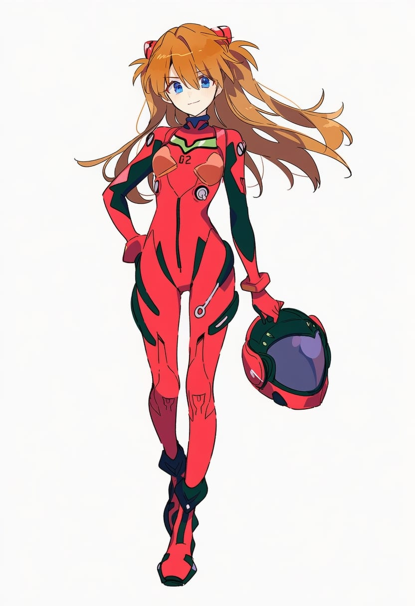

| 字段 | 内容 |
| --- | --- |
| 职业/身份原型（中文） | 机甲驾驶员 |
| NovelAI / Danbooru Tag 串 | 1.35::bodysuit::, 1.28::helmet::, 1.22::gloves::, 1.16::boots::, 1.12::headset::, 1.10::harness::, 1.08::mecha_pilot_suit::, 1.06::pilot::, 1.04::mecha:: |
| 组合思路（大白话） | 紧身驾驶服、头盔、耳机、安全带和手套，像进入驾驶舱前的专业装备。 |
| 世界细分 | 未来战争 / 高科技装备 |
| 模特 | 1girl,souryuu_asuka_langley |
| 序号 | 0147 |

## 137. 能量盾重装兵

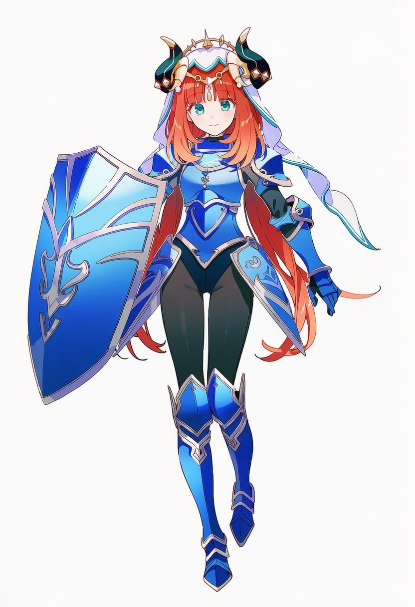

| 字段 | 内容 |
| --- | --- |
| 职业/身份原型（中文） | 能量盾重装兵 |
| NovelAI / Danbooru Tag 串 | 1.35::power_armor::, 1.28::helmet::, 1.22::gauntlets::, 1.16::greaves::, 1.12::shield::, 1.10::boots:: |
| 组合思路（大白话） | 重动力甲配实体/能量盾的视觉逻辑，重点是防御型科幻步兵。 |
| 世界细分 | 未来战争 / 高科技装备 |
| 模特 | 1girl,nilou_(genshin_impact) |
| 序号 | 0148 |

## 138. 山林猎户

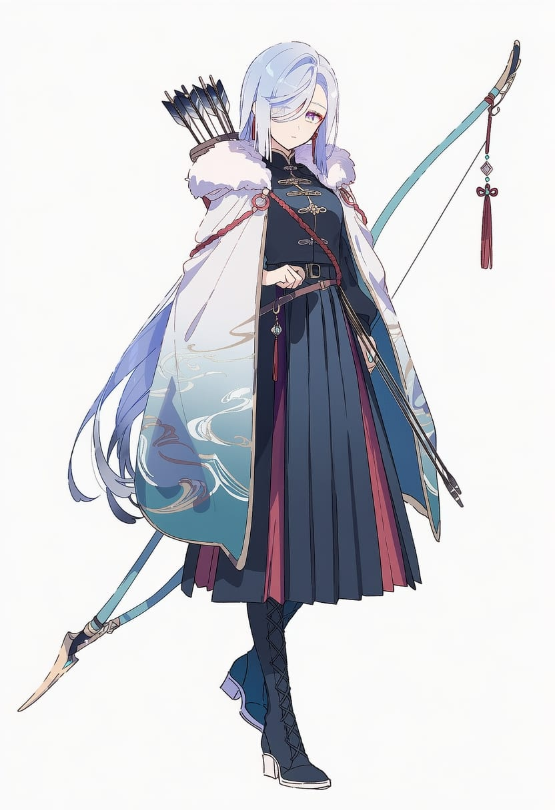

| 字段 | 内容 |
| --- | --- |
| 职业/身份原型（中文） | 山林猎户 |
| NovelAI / Danbooru Tag 串 | 1.35::chinese_clothes::, 1.28::cloak::, 1.22::boots::, 1.16::bow_(weapon)::, 1.12::quiver::, 1.10::basket::, 1.08::fur_trim:: |
| 组合思路（大白话） | 古风短装与披风配弓箭、篮筐和毛皮，像长期出入山林的猎户。 |
| 世界细分 | 武侠 / 江湖 / 东方奇术 |
| 模特 | 1girl,shenhe_(genshin_impact) |
| 序号 | 0149 |

## 139. 机关师

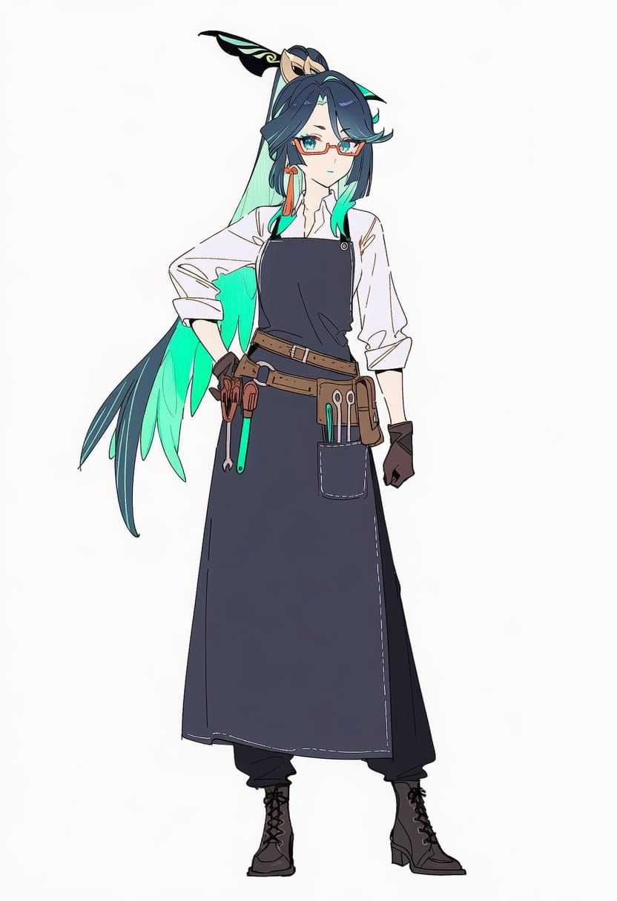

| 字段 | 内容 |
| --- | --- |
| 职业/身份原型（中文） | 机关师 |
| NovelAI / Danbooru Tag 串 | 1.35::hanfu::, 1.28::apron::, 1.22::goggles::, 1.16::gloves::, 1.12::tool_belt::, 1.10::wrench::, 1.08::pouch:: |
| 组合思路（大白话） | 古风衣着里混入护目镜、工具腰带和扳手，表达擅长机关与机械装置。 |
| 世界细分 | 武侠 / 江湖 / 东方奇术 |
| 模特 | 1girl,xianyun_(genshin_impact) |
| 序号 | 0150 |

## 140. 江湖刺客

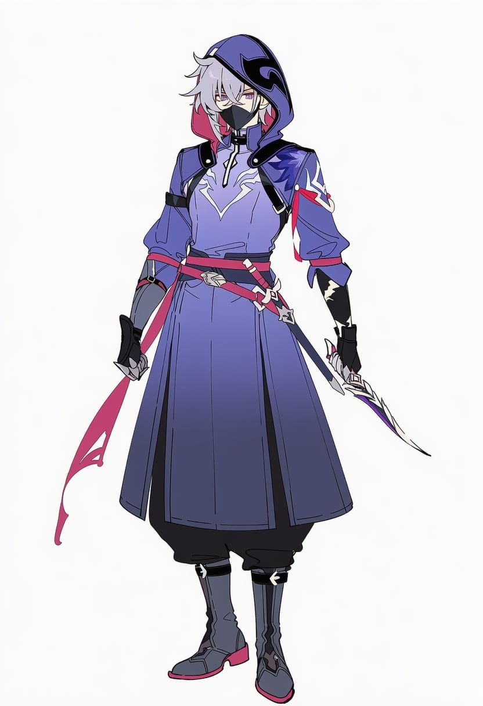

| 字段 | 内容 |
| --- | --- |
| 职业/身份原型（中文） | 江湖刺客 |
| NovelAI / Danbooru Tag 串 | 1.35::chinese_clothes::, 1.28::hood::, 1.22::mask::, 1.16::black_clothes::, 1.12::sash::, 1.10::boots::, 1.08::dagger:: |
| 组合思路（大白话） | 把古风衣着和刺客结构结合：黑衣、兜帽、面罩、束腰、短靴和短刃。 |
| 世界细分 | 武侠 / 江湖 / 东方奇术 |
| 模特 | 1boy,moze_(honkai:_star_rail) |
| 序号 | 0151 |

## 141. 琴师

| 字段 | 内容 |
| --- | --- |
| 职业/身份原型（中文） | 琴师 |
| NovelAI / Danbooru Tag 串 | 1.35::hanfu::, 1.28::wide_sleeves::, 1.22::sash::, 1.16::hair_stick::, 1.12::jewelry::, 1.10::guqin:: |
| 组合思路（大白话） | 宽袖汉服与发簪保持古典气质，古琴作为核心职业道具。 |
| 世界细分 | 武侠 / 江湖 / 东方奇术 |
| 模特 | 1girl,ruan_mei_(honkai:_star_rail) |
| 序号 | 0152 |

## 142. 轻功飞贼

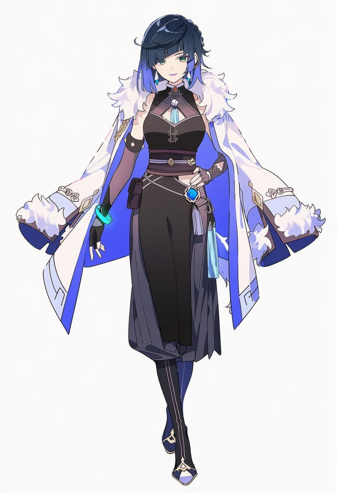

| 字段 | 内容 |
| --- | --- |
| 职业/身份原型（中文） | 轻功飞贼 |
| NovelAI / Danbooru Tag 串 | 1.35::chinese_clothes::, 1.28::hood::, 1.22::cloak::, 1.16::fingerless_gloves::, 1.12::sash::, 1.10::boots::, 1.08::belt_pouch:: |
| 组合思路（大白话） | 比刺客更轻更灵活，用兜帽、短披风、手套和小袋表现潜入与盗取工具。 |
| 世界细分 | 武侠 / 江湖 / 东方奇术 |
| 模特 | 1girl,yelan_(genshin_impact) |
| 序号 | 0153 |

## 143. 镖师

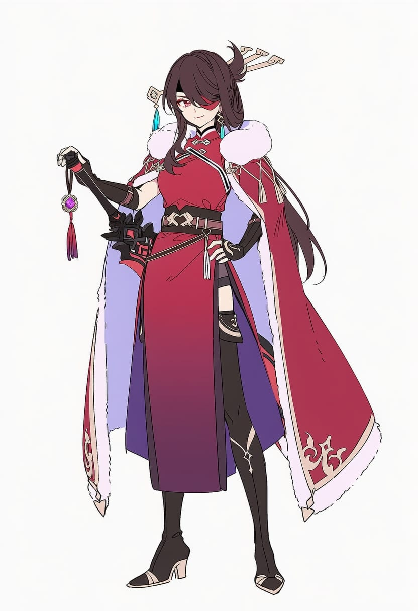

| 字段 | 内容 |
| --- | --- |
| 职业/身份原型（中文） | 镖师 |
| NovelAI / Danbooru Tag 串 | 1.35::chinese_clothes::, 1.28::robe::, 1.22::sash::, 1.16::boots::, 1.12::bracer::, 1.10::sword::, 1.08::cloak:: |
| 组合思路（大白话） | 耐行走的古风长袍、护臂、靴子和佩剑，突出长途护送与江湖武人属性。 |
| 世界细分 | 武侠 / 江湖 / 东方奇术 |
| 模特 | 1girl,beidou_(genshin_impact) |
| 序号 | 0154 |

## 144. 风水师

| 字段 | 内容 |
| --- | --- |
| 职业/身份原型（中文） | 风水师 |
| NovelAI / Danbooru Tag 串 | 1.35::chinese_clothes::, 1.28::robe::, 1.22::wide_sleeves::, 1.16::compass::, 1.12::book::, 1.10::sash::, 1.08::prayer_beads:: |
| 组合思路（大白话） | 中式法袍、罗盘、书册和念珠，做成擅长堪舆与方位测算的术士。 |
| 世界细分 | 武侠 / 江湖 / 东方奇术 |
| 模特 | 1girl,fu_xuan_(honkai:_star_rail) |
| 序号 | 0155 |

## 145. 伞兵

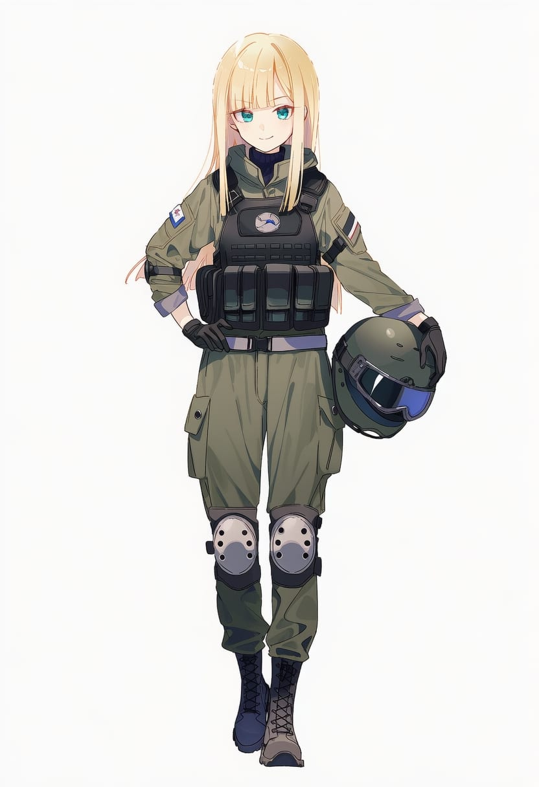

| 字段 | 内容 |
| --- | --- |
| 职业/身份原型（中文） | 伞兵 |
| NovelAI / Danbooru Tag 串 | 1.35::military_uniform::, 1.28::combat_helmet::, 1.22::body_armor::, 1.16::parachute::, 1.12::gloves::, 1.10::combat_boots:: |
| 组合思路（大白话） | 战斗装具之外，把降落伞放高权重，直接建立空降兵特征。 |
| 世界细分 | 现代军警 / 战术 / 应急 |
| 模特 | 1girl,reines_el-melloi_archisorte |
| 序号 | 0156 |

## 146. 侦察兵

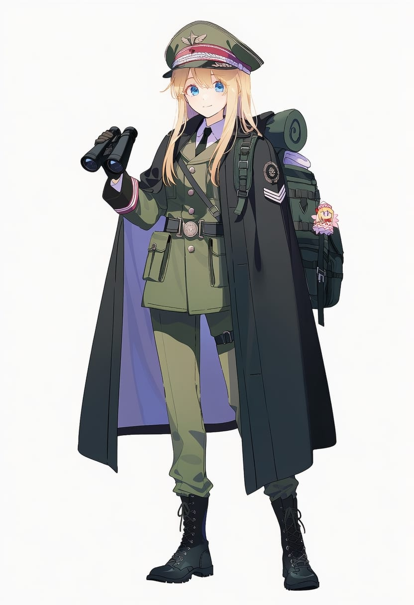

| 字段 | 内容 |
| --- | --- |
| 职业/身份原型（中文） | 侦察兵 |
| NovelAI / Danbooru Tag 串 | 1.35::military_uniform::, 1.28::cloak::, 1.22::binoculars::, 1.16::combat_boots::, 1.12::gloves::, 1.10::backpack:: |
| 组合思路（大白话） | 轻装军服、披风、望远镜、背包和军靴，强调长距离观察与机动。 |
| 世界细分 | 现代军警 / 战术 / 应急 |
| 模特 | 1girl,lily_white |
| 序号 | 0157 |

## 147. 军官

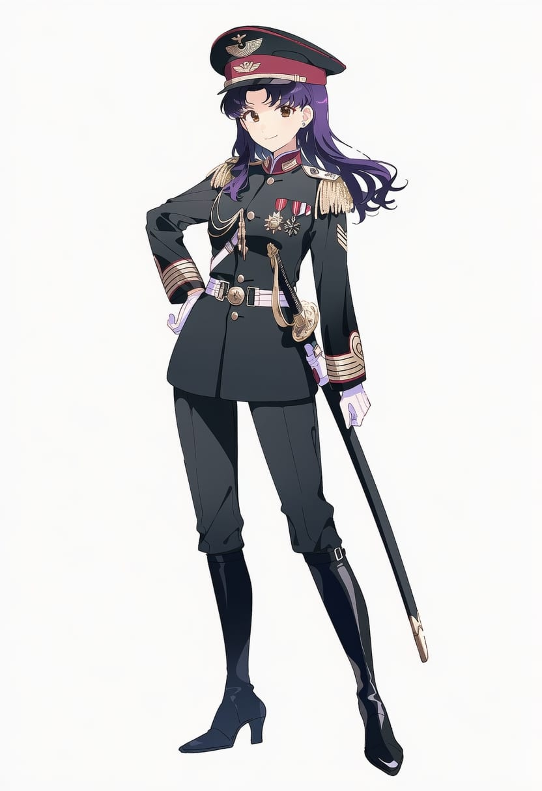

| 字段 | 内容 |
| --- | --- |
| 职业/身份原型（中文） | 军官 |
| NovelAI / Danbooru Tag 串 | 1.35::military_uniform::, 1.28::peaked_cap::, 1.22::epaulettes::, 1.16::aiguillette::, 1.12::gloves::, 1.10::sam_browne_belt::, 1.08::medal::, 1.06::military_dress_uniform::, 1.04::insignia::, 1.02::shoulder_boards:: |
| 组合思路（大白话） | 大檐帽、肩章、饰带、礼仪腰带与勋章，重点表现“指挥与礼服感”。 |
| 世界细分 | 现代军警 / 战术 / 应急 |
| 模特 | 1girl,katsuragi_misato |
| 序号 | 0158 |

## 148. 宪兵

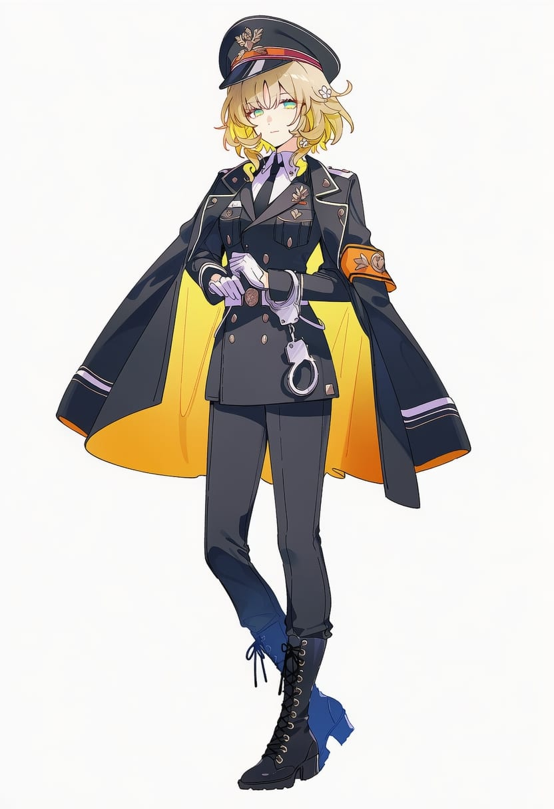

| 字段 | 内容 |
| --- | --- |
| 职业/身份原型（中文） | 宪兵 |
| NovelAI / Danbooru Tag 串 | 1.35::military_uniform::, 1.28::peaked_cap::, 1.22::armband::, 1.16::badge::, 1.12::belt::, 1.10::handcuffs::, 1.08::combat_boots:: |
| 组合思路（大白话） | 军服底子上加入执法臂章、徽章和手铐，视觉上介于军人和警察之间。 |
| 世界细分 | 现代军警 / 战术 / 应急 |
| 模特 | 1girl,aglaea_(honkai:_star_rail) |
| 序号 | 0159 |

## 149. 排爆人员

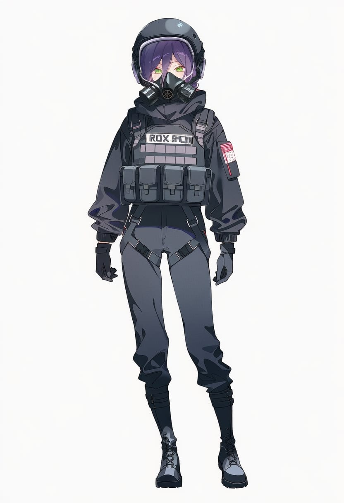

| 字段 | 内容 |
| --- | --- |
| 职业/身份原型（中文） | 排爆人员 |
| NovelAI / Danbooru Tag 串 | 1.35::bomb_suit::, 1.28::helmet::, 1.22::gloves::, 1.16::boots::, 1.12::gas_mask:: |
| 组合思路（大白话） | 排爆服本身就是最强职业标识，再加密闭头盔、手套和厚靴。 |
| 世界细分 | 现代军警 / 战术 / 应急 |
| 模特 | 1girl,reze_(chainsaw_man) |
| 序号 | 0162 |

## 150. 灾害救援队员

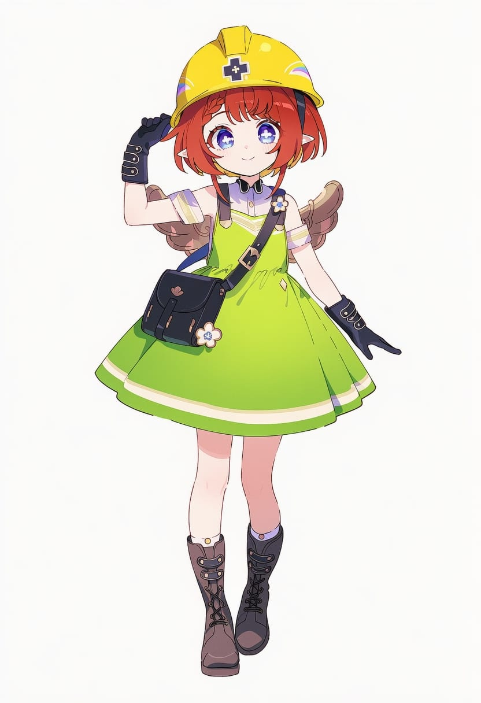

| 字段 | 内容 |
| --- | --- |
| 职业/身份原型（中文） | 灾害救援队员 |
| NovelAI / Danbooru Tag 串 | 1.35::hard_hat::, 1.28::gloves::, 1.22::boots::, 1.16::belt::, 1.12::shoulder_bag:: |
| 组合思路（大白话） | 安全帽、厚手套、靴子与高可视背心，整体更像地震、坍塌等灾害救援人员。 |
| 世界细分 | 现代军警 / 战术 / 应急 |
| 模特 | 1girl,tribbie_(honkai:_star_rail) |
| 序号 | 0163 |

## 151. 特警

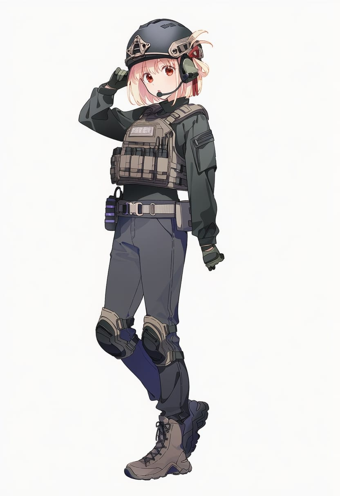

| 字段 | 内容 |
| --- | --- |
| 职业/身份原型（中文） | 特警 |
| NovelAI / Danbooru Tag 串 | 1.35::tactical_clothes::, 1.28::body_armor::, 1.22::ballistic_helmet::, 1.16::tactical_vest::, 1.12::utility_belt::, 1.10::knee_pads::, 1.08::combat_boots::, 1.06::headset::, 1.04::bulletproof_vest::, 1.02::helmet:: |
| 组合思路（大白话） | 战术服、防弹装备、头盔、战术背心和护膝一起上，和普通警察明显区分。 |
| 世界细分 | 现代军警 / 战术 / 应急 |
| 模特 | 1girl,nishikigi_chisato |
| 序号 | 0164 |

## 152. 狙击手

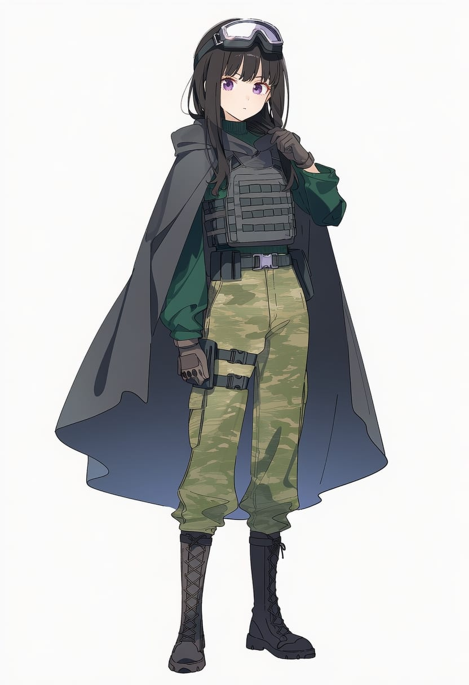

| 字段 | 内容 |
| --- | --- |
| 职业/身份原型（中文） | 狙击手 |
| NovelAI / Danbooru Tag 串 | 1.35::camouflage::, 1.28::cloak::, 1.22::gloves::, 1.16::combat_boots::, 1.12::balaclava::, 1.10::goggles:: |
| 组合思路（大白话） | 优先隐藏轮廓：迷彩、披风、面罩和护目镜，再补吉利伪装服的自然语言提示。 |
| 世界细分 | 现代军警 / 战术 / 应急 |
| 模特 | 1girl,inoue_takina |
| 序号 | 0165 |

## 153. 防暴警察

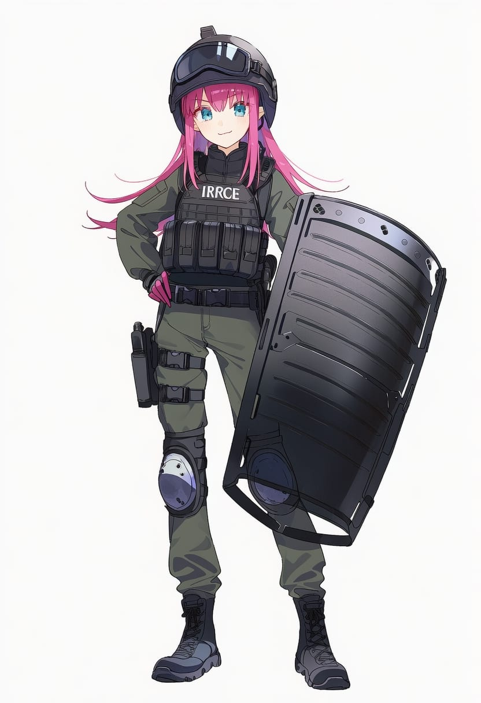

| 字段 | 内容 |
| --- | --- |
| 职业/身份原型（中文） | 防暴警察 |
| NovelAI / Danbooru Tag 串 | 1.35::body_armor::, 1.28::combat_helmet::, 1.22::riot_shield::, 1.16::gas_mask::, 1.12::gloves::, 1.10::knee_pads::, 1.08::combat_boots:: |
| 组合思路（大白话） | 防暴盾、全罩头盔、防毒面具、护膝和护甲组成厚重的街头防暴装备。 |
| 世界细分 | 现代军警 / 战术 / 应急 |
| 模特 | 1girl,elizabeth_bathory_(fate) |
| 序号 | 0166 |

## 154. 佣兵

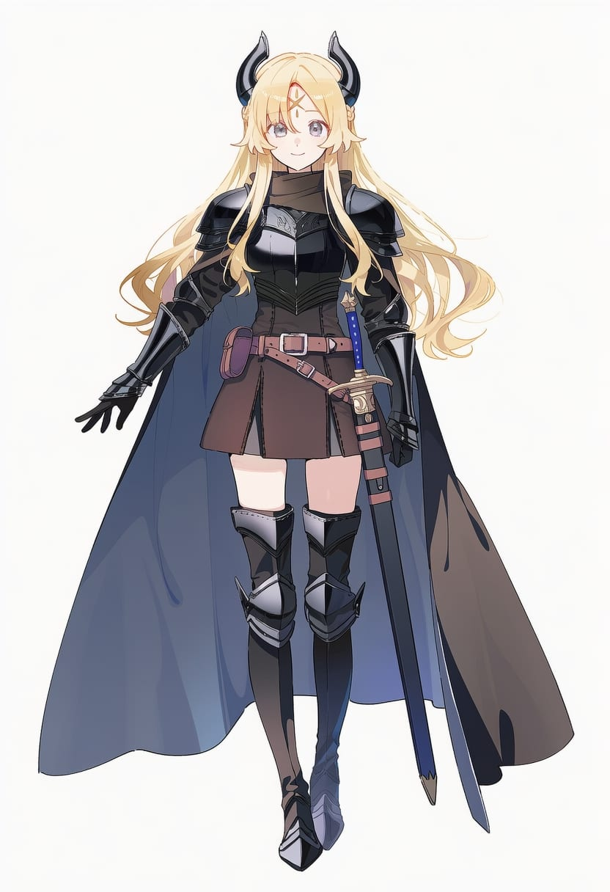

| 字段 | 内容 |
| --- | --- |
| 职业/身份原型（中文） | 佣兵 |
| NovelAI / Danbooru Tag 串 | 1.35::armor::, 1.28::leather_armor::, 1.22::pauldrons::, 1.16::bracer::, 1.12::belt_pouch::, 1.10::boots::, 1.08::sword::, 1.06::breastplate::, 1.04::cloak:: |
| 组合思路（大白话） | 混搭金属甲和皮甲，装备实用但不统一，突出长期战斗的雇佣兵感。 |
| 世界细分 | 现代通用职业 |
| 模特 | 1girl,ecclesia_(yu-gi-oh!) |
| 序号 | 0167 |

## 155. 危险环境作业员

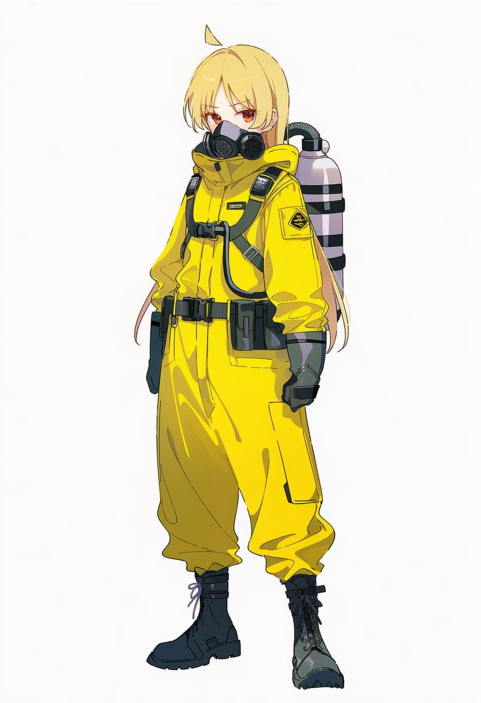

| 字段 | 内容 |
| --- | --- |
| 职业/身份原型（中文） | 危险环境作业员 |
| NovelAI / Danbooru Tag 串 | 1.35::hazmat_suit::, 1.28::respirator::, 1.22::goggles::, 1.16::gloves::, 1.12::boots::, 1.10::oxygen_tank::, 1.08::utility_belt:: |
| 组合思路（大白话） | 完整防化服、呼吸器和氧气罐直接塑造污染区/危险环境作业人员。 |
| 世界细分 | 现代通用职业 |
| 模特 | 1girl,ijichi_seika |
| 序号 | 0168 |

## 156. 宫廷侍女

| 字段 | 内容 |
| --- | --- |
| 职业/身份原型（中文） | 宫廷侍女 |
| NovelAI / Danbooru Tag 串 | 1.35::long_dress::, 1.28::apron::, 1.22::capelet::, 1.16::gloves::, 1.12::hair_ornament::, 1.10::brooch:: |
| 组合思路（大白话） | 长裙、围裙、短披肩和发饰，介于女仆与宫廷礼服之间。 |
| 世界细分 | 现代通用职业 |
| 模特 | 1girl,ram_(re:zero) |
| 序号 | 0169 |

## 157. 宫廷贵族

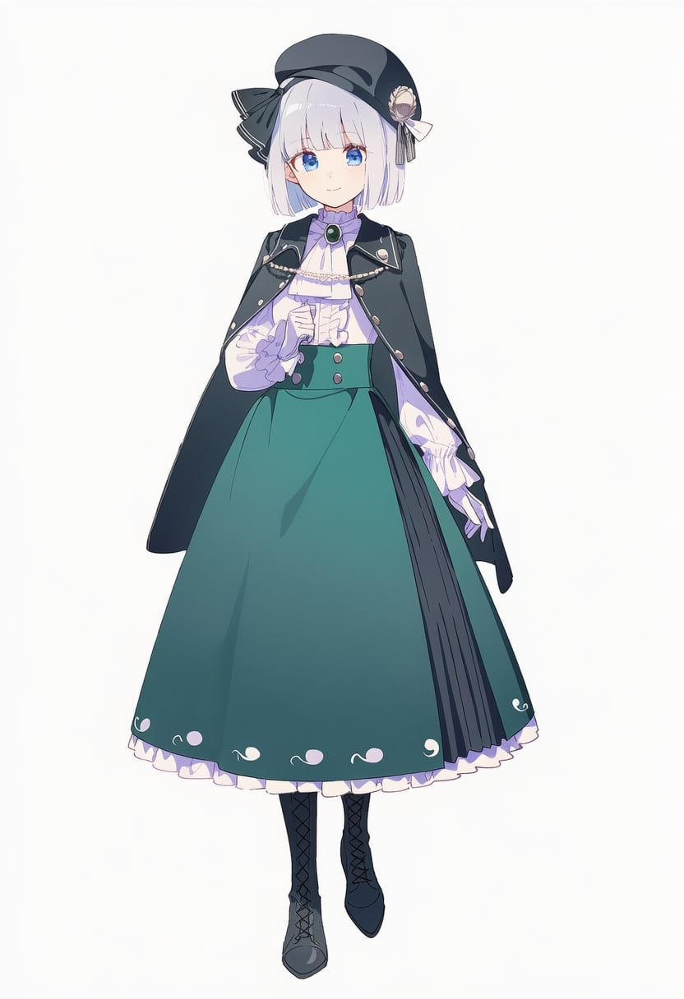

| 字段 | 内容 |
| --- | --- |
| 职业/身份原型（中文） | 宫廷贵族 |
| NovelAI / Danbooru Tag 串 | 1.35::aristocratic_clothes::, 1.28::frilled_shirt::, 1.22::cravat::, 1.16::brooch::, 1.12::cape::, 1.10::gloves::, 1.08::boots:: |
| 组合思路（大白话） | 贵族不靠职业工具，而靠繁复衬衫、领巾、胸针、披风和手套表现身份。 |
| 世界细分 | 现代通用职业 |
| 模特 | 1girl,konpaku_youmu |
| 序号 | 0170 |

## 158. 急救员

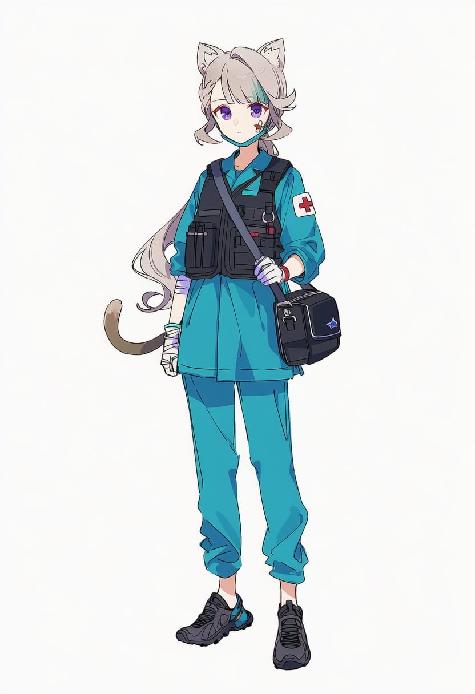

| 字段 | 内容 |
| --- | --- |
| 职业/身份原型（中文） | 急救员 |
| NovelAI / Danbooru Tag 串 | 1.35::uniform::, 1.28::gloves::, 1.22::surgical_mask::, 1.16::bandages::, 1.12::shoulder_bag::, 1.10::paramedic::, 1.08::scrubs::, 1.06::utility_vest::, 1.04::disposable_gloves:: |
| 组合思路（大白话） | 用制服、手套、绷带和急救包感的肩包表现现场救援，再用高可视背心把“院前急救”拉出来。 |
| 世界细分 | 现代通用职业 |
| 模特 | 1girl,lynette_(genshin_impact) |
| 序号 | 0171 |

## 159. 探险家

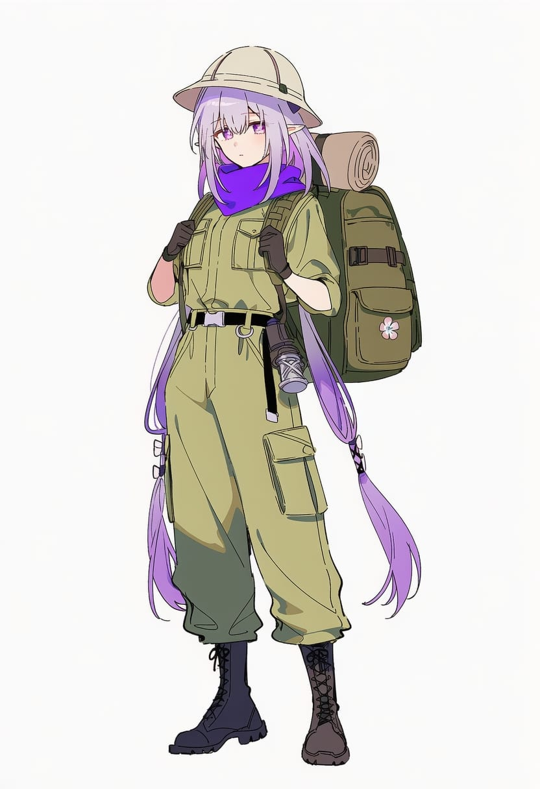

| 字段 | 内容 |
| --- | --- |
| 职业/身份原型（中文） | 探险家 |
| NovelAI / Danbooru Tag 串 | 1.35::pith_helmet::, 1.28::vest::, 1.22::scarf::, 1.16::boots::, 1.12::backpack::, 1.10::belt::, 1.08::safari_hat::, 1.06::utility_vest::, 1.04::cargo_pants::, 1.02::gloves:: |
| 组合思路（大白话） | 软木探险帽、马甲、围巾、靴子、背包是经典野外探险轮廓。 |
| 世界细分 | 现代通用职业 |
| 模特 | 1girl,castorice_(honkai:_star_rail) |
| 序号 | 0172 |

## 160. 歌手

| 字段 | 内容 |
| --- | --- |
| 职业/身份原型（中文） | 歌手 |
| NovelAI / Danbooru Tag 串 | 1.35::holding_microphone::, 1.28::stage_clothes::, 1.22::jacket::, 1.16::boots::, 1.12::jewelry:: |
| 组合思路（大白话） | 歌手没有固定制服，所以让麦克风和舞台服装主导。 |
| 世界细分 | 现代通用职业 |
| 模特 | 1girl,kitkallos_(yu-gi-oh!) |
| 序号 | 0175 |

## 161. 浪人

| 字段 | 内容 |
| --- | --- |
| 职业/身份原型（中文） | 浪人 |
| NovelAI / Danbooru Tag 串 | 1.35::hakama::, 1.28::kimono::, 1.22::haori::, 1.16::straw_hat::, 1.12::katana::, 1.10::sandals::, 1.08::ronin:: |
| 组合思路（大白话） | 比武士少完整甲胄，改成和服、袴、羽织、斗笠和刀，更像漂泊剑客。 |
| 世界细分 | 现代通用职业 |
| 模特 | 1girl,mochizuki_honami |
| 序号 | 0176 |

## 162. 消防员

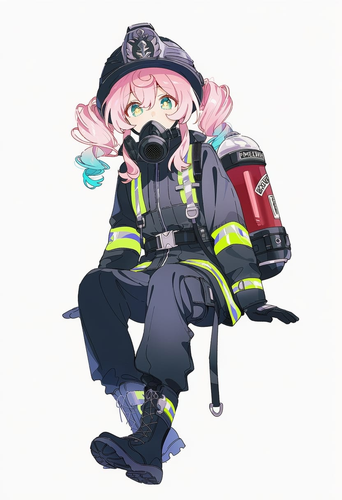

| 字段 | 内容 |
| --- | --- |
| 职业/身份原型（中文） | 消防员 |
| NovelAI / Danbooru Tag 串 | 1.35::helmet::, 1.28::gloves::, 1.22::boots::, 1.16::gas_mask::, 1.12::belt::, 1.10::firefighter::, 1.08::firefighter_jacket::, 1.06::firefighter_helmet::, 1.04::oxygen_tank:: |
| 组合思路（大白话） | 头盔、厚手套、靴子、呼吸面罩加耐火防护服，做出厚重的消防救援轮廓。 |
| 世界细分 | 现代通用职业 |
| 模特 | 1girl,hyacine_(honkai:_star_rail) |
| 序号 | 0177 |

## 163. 灵医

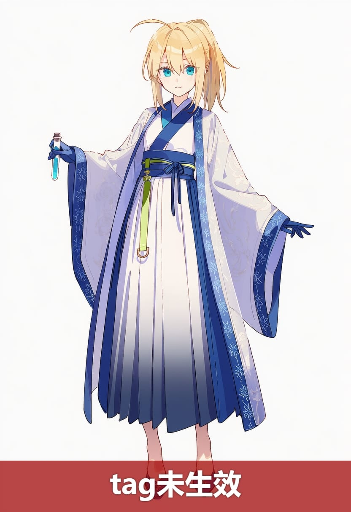

| 字段 | 内容 |
| --- | --- |
| 职业/身份原型（中文） | 灵医 |
| NovelAI / Danbooru Tag 串 | 1.35::white_hanfu::, 1.28::wide_sleeves::, 1.22::herb::, 1.16::robe::, 1.12::sash::, 1.10::vial::, 1.08::rubber_gloves:: |
| 组合思路（大白话） | 白色汉服和草药、药瓶组合，整体干净柔和，表现修仙世界里的治疗职业。 |
| 世界细分 | 现代通用职业 |
| 模特 | 1girl,mysterious_heroine_x_(fate) |
| 序号 | 0178 |

## 164. 炼器师

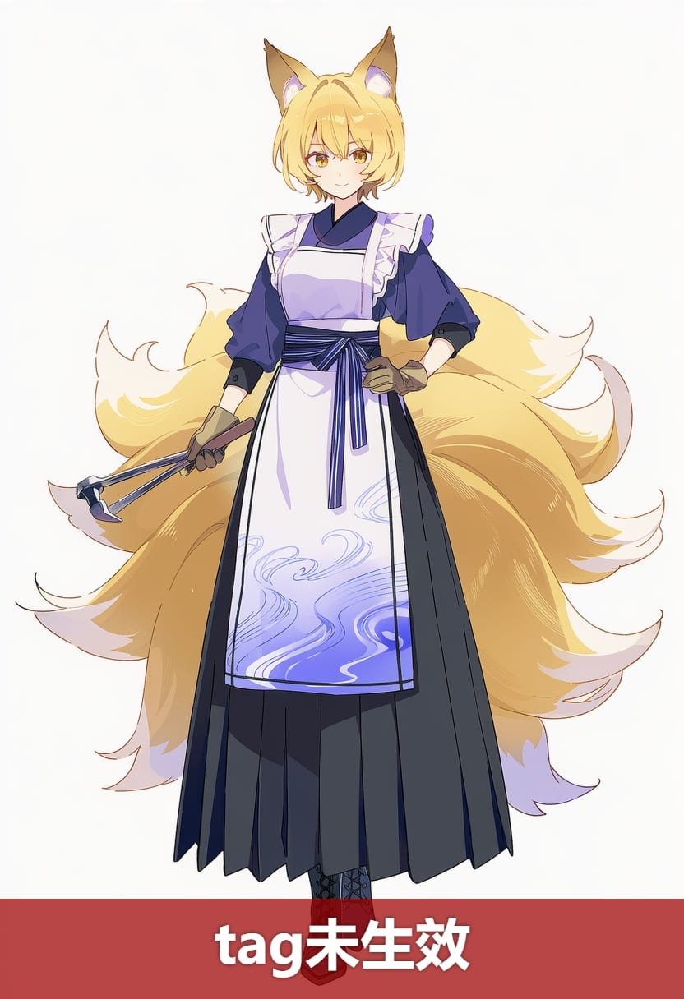

| 字段 | 内容 |
| --- | --- |
| 职业/身份原型（中文） | 炼器师 |
| NovelAI / Danbooru Tag 串 | 1.35::hanfu::, 1.28::apron::, 1.22::work_gloves::, 1.16::hammer::, 1.12::tongs::, 1.10::metal::, 1.08::sash:: |
| 组合思路（大白话） | 把仙门汉服和工匠围裙、手套、锤钳混在一起，表现专门打造法器的修士。 |
| 世界细分 | 现代通用职业 |
| 模特 | 1girl,yakumo_ran |
| 序号 | 0179 |

## 165. 狂战士

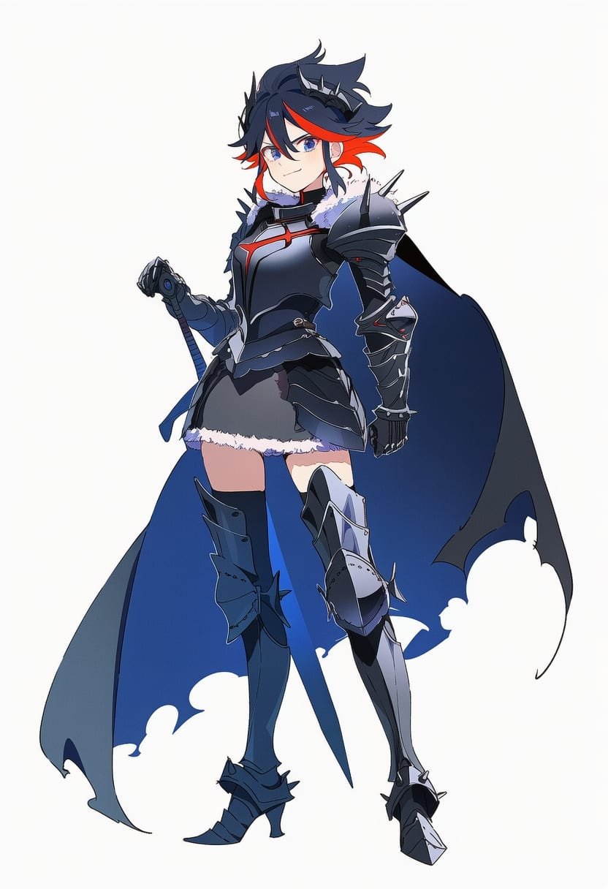

| 字段 | 内容 |
| --- | --- |
| 职业/身份原型（中文） | 狂战士 |
| NovelAI / Danbooru Tag 串 | 1.35::berserker_armor::, 1.28::spiked_armor::, 1.22::fur_trim::, 1.16::gauntlets::, 1.12::greaves::, 1.10::greatsword:: |
| 组合思路（大白话） | 狂战士比野蛮人更重、更凶，尖刺甲、毛皮、重护手和大剑一起堆。 |
| 世界细分 | 现代通用职业 |
| 模特 | 1girl,matoi_ryuuko |
| 序号 | 0180 |

## 166. 盾卫

| 字段 | 内容 |
| --- | --- |
| 职业/身份原型（中文） | 盾卫 |
| NovelAI / Danbooru Tag 串 | 1.35::body_armor::, 1.28::shield::, 1.22::gauntlets::, 1.16::greaves::, 1.12::helmet::, 1.10::cape:: |
| 组合思路（大白话） | 职业核心就是防御，所以把盾、头盔、护手和胫甲放在最前面。 |
| 世界细分 | 现代通用职业 |
| 模特 | 1girl,cipher_(honkai:_star_rail) |
| 序号 | 0181 |

## 167. 神父

| 字段 | 内容 |
| --- | --- |
| 职业/身份原型（中文） | 神父 |
| NovelAI / Danbooru Tag 串 | 1.35::cassock::, 1.28::clerical_collar::, 1.22::cross_necklace::, 1.16::long_sleeves::, 1.12::formal_clothes:: |
| 组合思路（大白话） | 黑色长袍和白色牧师领是最稳定的神父视觉，再加十字项链。 |
| 世界细分 | 现代通用职业 |
| 模特 | 1girl,kingprotea_(fate) |
| 序号 | 0182 |

## 168. 科学家

| 字段 | 内容 |
| --- | --- |
| 职业/身份原型（中文） | 科学家 |
| NovelAI / Danbooru Tag 串 | 1.35::scientist::, 1.28::labcoat::, 1.22::protective_eyewear::, 1.16::rubber_gloves::, 1.12::clipboard::, 1.10::pen::, 1.08::safety_glasses::, 1.06::test_tube::, 1.04::lanyard:: |
| 组合思路（大白话） | 白大褂是主轴，护目镜、实验手套和记录板让它更像实验室科研人员。 |
| 世界细分 | 现代通用职业 |
| 模特 | 1girl,akagi_ritsuko |
| 序号 | 0183 |

## 169. 赌场荷官

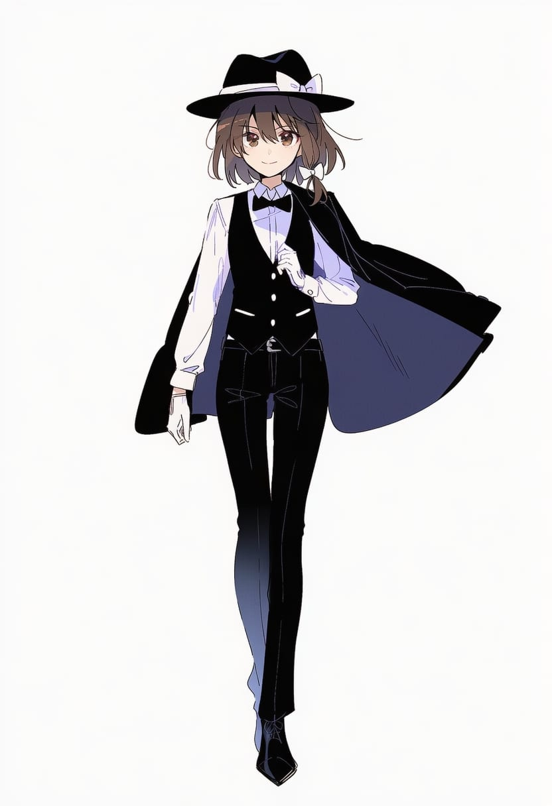

| 字段 | 内容 |
| --- | --- |
| 职业/身份原型（中文） | 赌场荷官 |
| NovelAI / Danbooru Tag 串 | 1.35::vest::, 1.28::dress_shirt::, 1.22::bowtie::, 1.16::white_gloves::, 1.12::waistcoat:: |
| 组合思路（大白话） | 赌场荷官主要靠正式马甲、衬衫、领结和干净白手套。 |
| 世界细分 | 现代通用职业 |
| 模特 | 1girl,usami_renko |
| 序号 | 0184 |

## 170. 鬼修

| 字段 | 内容 |
| --- | --- |
| 职业/身份原型（中文） | 鬼修 |
| NovelAI / Danbooru Tag 串 | 1.35::black_robe::, 1.28::hood::, 1.22::wide_sleeves::, 1.16::ofuda::, 1.12::skull::, 1.10::ghost::, 1.08::sash:: |
| 组合思路（大白话） | 黑袍和符箓做修士底色，再用鬼魂、头骨等阴属性元素强调鬼修。 |
| 世界细分 | 现代通用职业 |
| 模特 | 1girl,hu_tao_(genshin_impact) |
| 序号 | 0185 |

## 171. 魔修

| 字段 | 内容 |
| --- | --- |
| 职业/身份原型（中文） | 魔修 |
| NovelAI / Danbooru Tag 串 | 1.35::black_hanfu::, 1.28::black_robe::, 1.22::wide_sleeves::, 1.16::sash::, 1.12::jian_(weapon)::, 1.10::dark_aura::, 1.08::red_jewelry:: |
| 组合思路（大白话） | 黑色汉服、宽袖、深色气场和红色饰品一起做危险的邪道修士。 |
| 世界细分 | 现代通用职业 |
| 模特 | 1girl,jingliu_(honkai:_star_rail) |
| 序号 | 0186 |

## 172. 皇城司密探

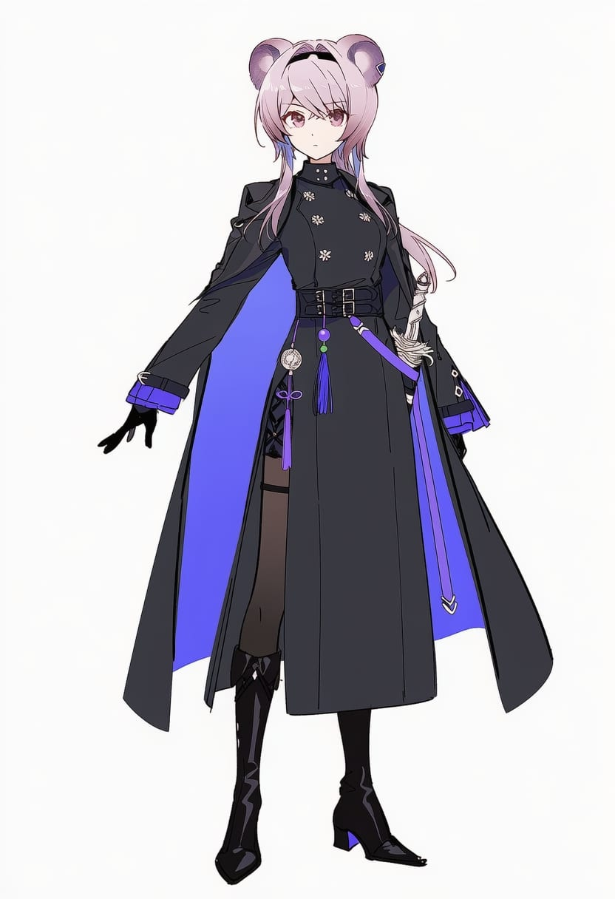

| 字段 | 内容 |
| --- | --- |
| 职业/身份原型（中文） | 皇城司密探 |
| NovelAI / Danbooru Tag 串 | 1.35::chinese_clothes::, 1.28::long_coat::, 1.22::sash::, 1.16::boots::, 1.12::gloves::, 1.10::dagger::, 1.08::badge:: |
| 组合思路（大白话） | 古风长外套、束腰、手套和隐蔽短刃，配身份腰牌感徽章，像官方秘密侦缉人员。 |
| 世界细分 | 现代通用职业 |
| 模特 | 1girl,lin_(arknights) |
| 序号 | 0187 |

## 173. 未来执法机器人

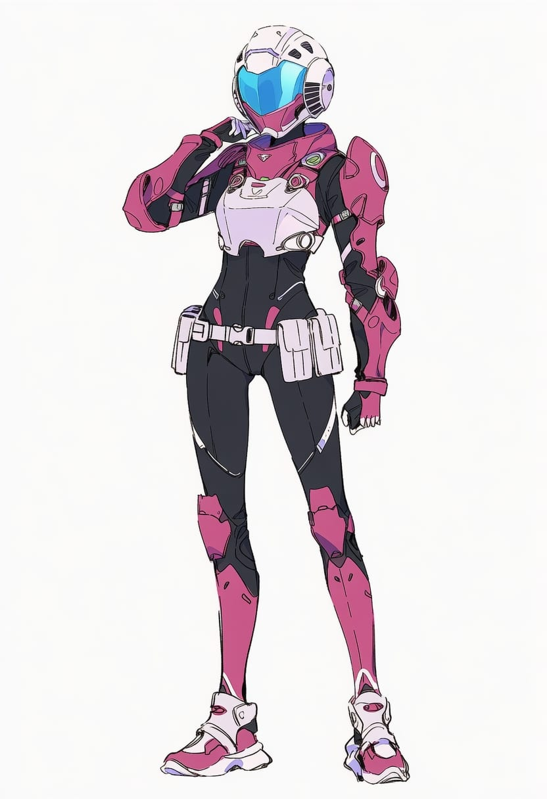

| 字段 | 内容 |
| --- | --- |
| 职业/身份原型（中文） | 未来执法机器人 |
| NovelAI / Danbooru Tag 串 | 1.35::power_armor::, 1.28::helmet::, 1.22::body_armor::, 1.16::mechanical_limbs::, 1.12::utility_belt::, 1.10::badge:: |
| 组合思路（大白话） | 让装甲、机械肢体和执法徽章组合起来，像重型机器人警员。 |
| 世界细分 | 现代通用职业 |
| 模特 | 1girl,arcee |
| 序号 | 0188 |

## 174. 赏金猎人

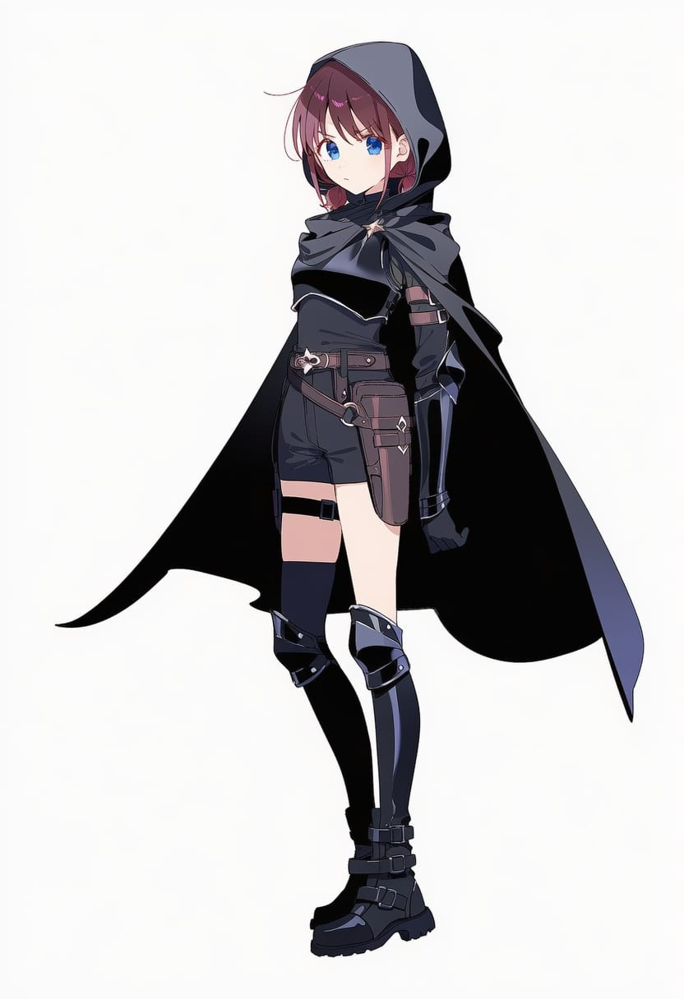

| 字段 | 内容 |
| --- | --- |
| 职业/身份原型（中文） | 赏金猎人 |
| NovelAI / Danbooru Tag 串 | 1.35::armor::, 1.28::helmet::, 1.22::cape::, 1.16::belt::, 1.12::gun_holster::, 1.10::boots::, 1.08::gloves::, 1.06::body_armor::, 1.04::hooded_cloak::, 1.02::leather_armor:: |
| 组合思路（大白话） | 混搭护甲、头盔、披风和枪套，做成不属于正规军、但装备精良的自由猎手。 |
| 世界细分 | 现代通用职业 |
| 模特 | 1girl,iseri_nina |
| 序号 | 0189 |

## 175. 外星外交官

| 字段 | 内容 |
| --- | --- |
| 职业/身份原型（中文） | 外星外交官 |
| NovelAI / Danbooru Tag 串 | 1.35::formal_clothes::, 1.28::cape::, 1.22::jewelry::, 1.16::brooch::, 1.12::gloves::, 1.10::circlet:: |
| 组合思路（大白话） | 先用正式礼服、披风和珠宝建立外交仪式感，再用发光外星礼服提示做非人类文明风格。 |
| 世界细分 | 星际文明 / 太空歌剧 |
| 模特 | 1girl,lum |
| 序号 | 0190 |

## 176. 太空工程师

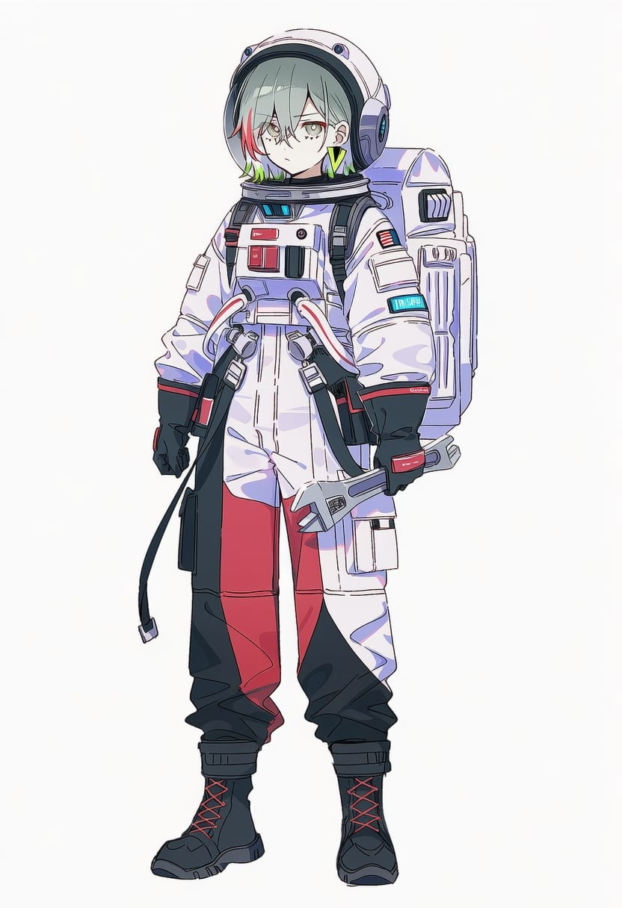

| 字段 | 内容 |
| --- | --- |
| 职业/身份原型（中文） | 太空工程师 |
| NovelAI / Danbooru Tag 串 | 1.35::spacesuit::, 1.28::space_helmet::, 1.22::gloves::, 1.16::boots::, 1.12::tool_belt::, 1.10::holding_wrench::, 1.08::goggles:: |
| 组合思路（大白话） | 宇航服、宇航头盔、工具腰带、护目镜和手持扳手，彻底拉开与地面工程工装的差异。 |
| 世界细分 | 星际文明 / 太空歌剧 |
| 模特 | 1girl,diabellstar_the_black_witch |
| 序号 | 0191 |

## 177. 太空考古学家

| 字段 | 内容 |
| --- | --- |
| 职业/身份原型（中文） | 太空考古学家 |
| NovelAI / Danbooru Tag 串 | 1.35::spacesuit::, 1.28::vest::, 1.22::gloves::, 1.16::boots::, 1.12::satchel::, 1.10::head-mounted_display:: |
| 组合思路（大白话） | 宇航服底层加功能马甲、挎包和头显，兼顾太空环境与考古工具携带。 |
| 世界细分 | 星际文明 / 太空歌剧 |
| 模特 | 1girl,hassan_of_serenity_(fate) |
| 序号 | 0192 |

## 178. 太空警察

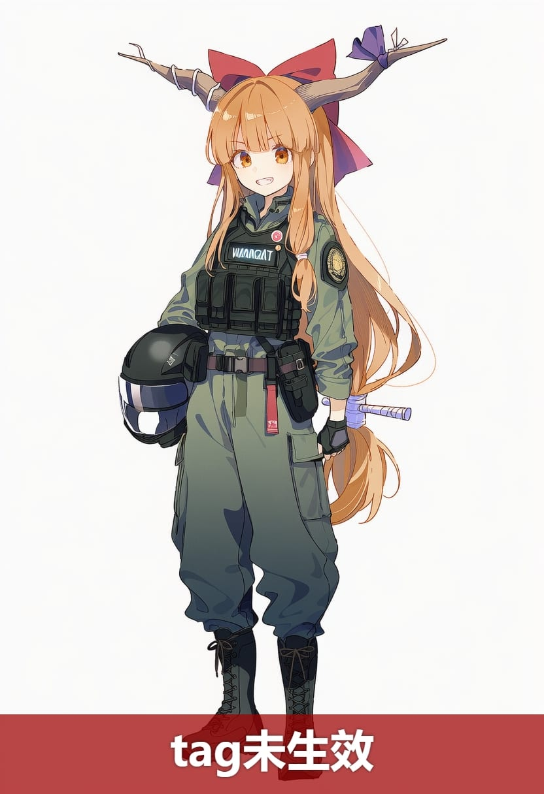

| 字段 | 内容 |
| --- | --- |
| 职业/身份原型（中文） | 太空警察 |
| NovelAI / Danbooru Tag 串 | 1.35::uniform::, 1.28::body_armor::, 1.22::badge::, 1.16::utility_belt::, 1.12::holster::, 1.10::helmet::, 1.08::headset:: |
| 组合思路（大白话） | 警察徽章和勤务腰带保留，但制服、头盔和防护改成科幻化。 |
| 世界细分 | 星际文明 / 太空歌剧 |
| 模特 | 1girl,ibuki_suika |
| 序号 | 0193 |

## 179. 异星生物学家

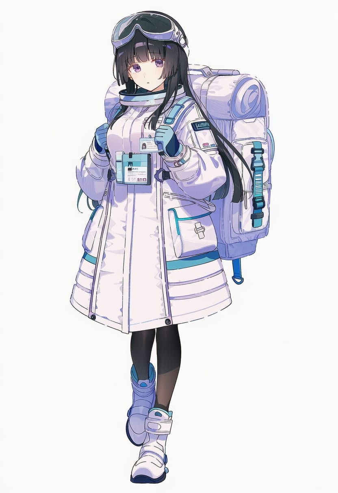

| 字段 | 内容 |
| --- | --- |
| 职业/身份原型（中文） | 异星生物学家 |
| NovelAI / Danbooru Tag 串 | 1.35::labcoat::, 1.28::gloves::, 1.22::goggles::, 1.16::id_card::, 1.12::clipboard::, 1.10::spacesuit::, 1.08::backpack:: |
| 组合思路（大白话） | 实验白大褂与太空防护层混搭，像在外星基地研究陌生生物的科学家。 |
| 世界细分 | 星际文明 / 太空歌剧 |
| 模特 | 1girl,shirokane_rinko |
| 序号 | 0194 |

## 180. 星舰军官

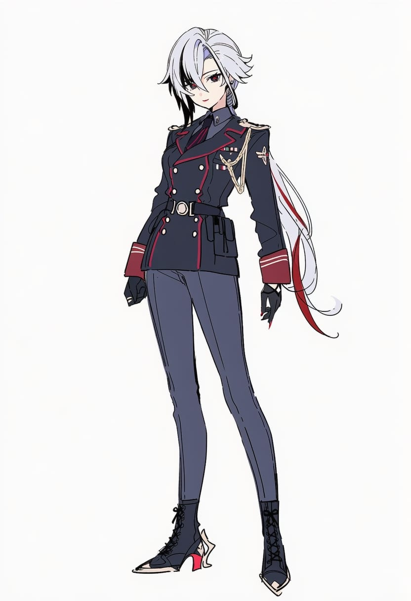

| 字段 | 内容 |
| --- | --- |
| 职业/身份原型（中文） | 星舰军官 |
| NovelAI / Danbooru Tag 串 | 1.35::space_uniform::, 1.28::military_uniform::, 1.22::insignia::, 1.16::shoulder_boards::, 1.12::utility_belt::, 1.10::boots::, 1.08::gloves:: |
| 组合思路（大白话） | 比舰长低调，保留制式太空军服、肩章和徽记，减少夸张披风。 |
| 世界细分 | 星际文明 / 太空歌剧 |
| 模特 | 1girl,arlecchino_(genshin_impact) |
| 序号 | 0195 |

## 181. 星舰科学官

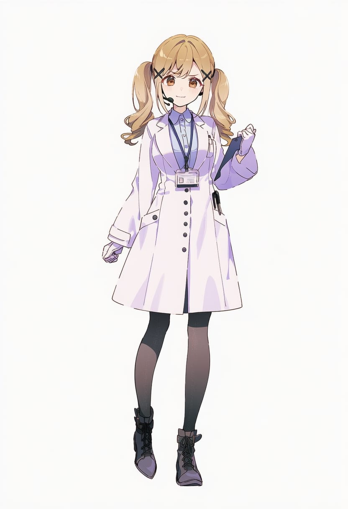

| 字段 | 内容 |
| --- | --- |
| 职业/身份原型（中文） | 星舰科学官 |
| NovelAI / Danbooru Tag 串 | 1.35::uniform::, 1.28::labcoat::, 1.22::gloves::, 1.16::id_card::, 1.12::headset::, 1.10::clipboard::, 1.08::boots:: |
| 组合思路（大白话） | 舰船制服叠白大褂和记录板，比普通研究员多一层正式舰员身份。 |
| 世界细分 | 星际文明 / 太空歌剧 |
| 模特 | 1girl,ichigaya_arisa |
| 序号 | 0197 |

## 182. 星舰通讯官

| 字段 | 内容 |
| --- | --- |
| 职业/身份原型（中文） | 星舰通讯官 |
| NovelAI / Danbooru Tag 串 | 1.35::military_uniform::, 1.28::headset::, 1.22::gloves::, 1.16::badge::, 1.12::id_card::, 1.10::boots::, 1.08::vest:: |
| 组合思路（大白话） | 制服和通讯耳机放在最高优先级，徽章和证件补军衔/岗位信息。 |
| 世界细分 | 星际文明 / 太空歌剧 |
| 模特 | 1girl,march_7th_(honkai:_star_rail) |
| 序号 | 0198 |

## 183. 星际矿工

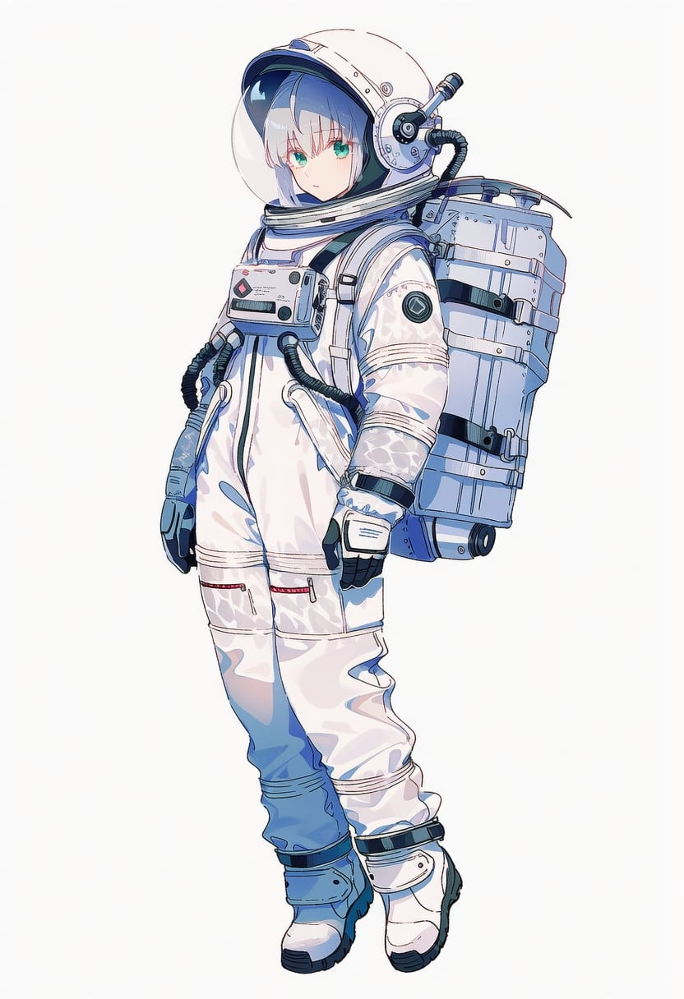

| 字段 | 内容 |
| --- | --- |
| 职业/身份原型（中文） | 星际矿工 |
| NovelAI / Danbooru Tag 串 | 1.35::spacesuit::, 1.28::space_helmet::, 1.22::work_gloves::, 1.16::boots::, 1.12::pickaxe::, 1.10::oxygen_tank::, 1.08::backpack:: |
| 组合思路（大白话） | 宇航服、宇航头盔、氧气罐、背包与镐，保留采矿工具同时强化星际环境。 |
| 世界细分 | 星际文明 / 太空歌剧 |
| 模特 | 1girl,gray_(fate) |
| 序号 | 0199 |

## 184. 星际赏金猎人

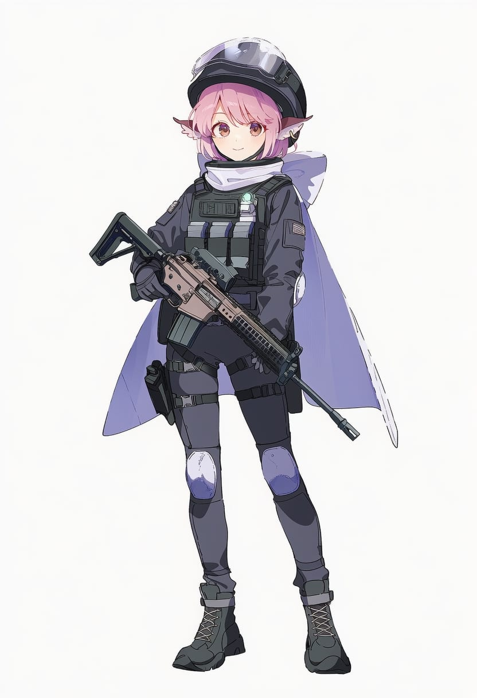

| 字段 | 内容 |
| --- | --- |
| 职业/身份原型（中文） | 星际赏金猎人 |
| NovelAI / Danbooru Tag 串 | 1.35::space_uniform::, 1.28::body_armor::, 1.22::helmet::, 1.16::cape::, 1.12::utility_belt::, 1.10::boots::, 1.08::handgun::, 1.06::rifle:: |
| 组合思路（大白话） | 太空服饰和护甲混搭披风、枪械和工具腰带，做独立行动的星际猎人。 |
| 世界细分 | 星际文明 / 太空歌剧 |
| 模特 | 1girl,mystia_lorelei |
| 序号 | 0200 |

## 185. 星际陆战队

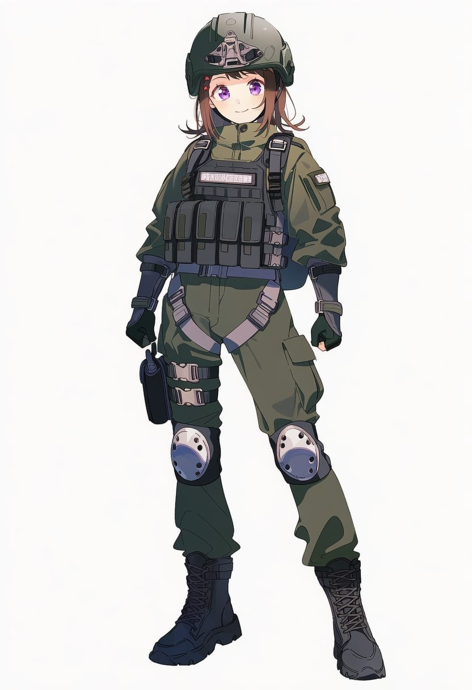

| 字段 | 内容 |
| --- | --- |
| 职业/身份原型（中文） | 星际陆战队 |
| NovelAI / Danbooru Tag 串 | 1.35::body_armor::, 1.28::combat_helmet::, 1.22::gauntlets::, 1.16::combat_boots::, 1.12::backpack::, 1.10::bandolier::, 1.08::power_armor::, 1.06::military_combat_uniform::, 1.04::helmet:: |
| 组合思路（大白话） | 比动力甲更像“未来版现代步兵”，保留护甲、头盔、弹带和背负系统。 |
| 世界细分 | 星际文明 / 太空歌剧 |
| 模特 | 1girl,toyama_kasumi |
| 序号 | 0201 |

## 186. 火星殖民地农夫

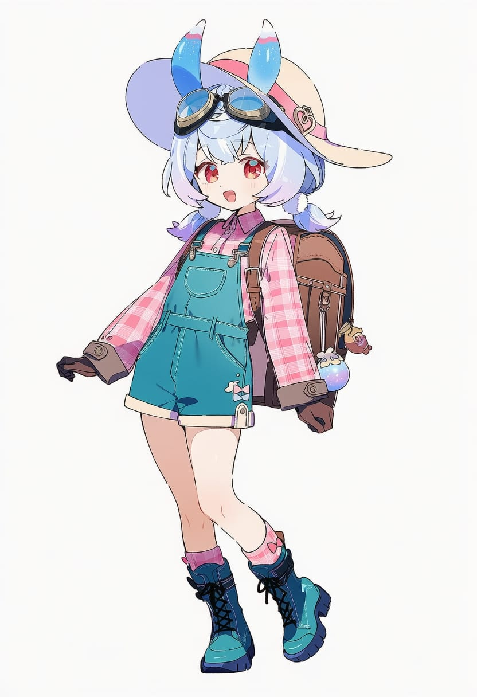

| 字段 | 内容 |
| --- | --- |
| 职业/身份原型（中文） | 火星殖民地农夫 |
| NovelAI / Danbooru Tag 串 | 1.35::coveralls::, 1.28::overalls::, 1.22::gloves::, 1.16::boots::, 1.12::goggles::, 1.10::sun_hat::, 1.08::backpack:: |
| 组合思路（大白话） | 背带裤/工装、手套、护目镜和背负设备，把传统农业劳动改造成殖民地版本。 |
| 世界细分 | 星际文明 / 太空歌剧 |
| 模特 | 1girl,sigewinne_(genshin_impact) |
| 序号 | 0202 |

## 187. 行星测绘员

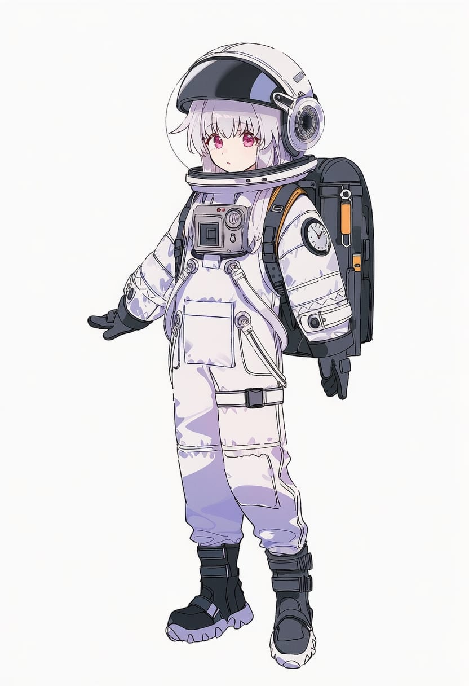

| 字段 | 内容 |
| --- | --- |
| 职业/身份原型（中文） | 行星测绘员 |
| NovelAI / Danbooru Tag 串 | 1.35::spacesuit::, 1.28::helmet::, 1.22::gloves::, 1.16::boots::, 1.12::backpack::, 1.10::compass::, 1.08::head-mounted_display:: |
| 组合思路（大白话） | 完整行星表面装备配罗盘和头显，重点是远程地形测绘与勘察。 |
| 世界细分 | 星际文明 / 太空歌剧 |
| 模特 | 1girl,clara_(honkai:_star_rail) |
| 序号 | 0203 |

## 188. 仙朝文官

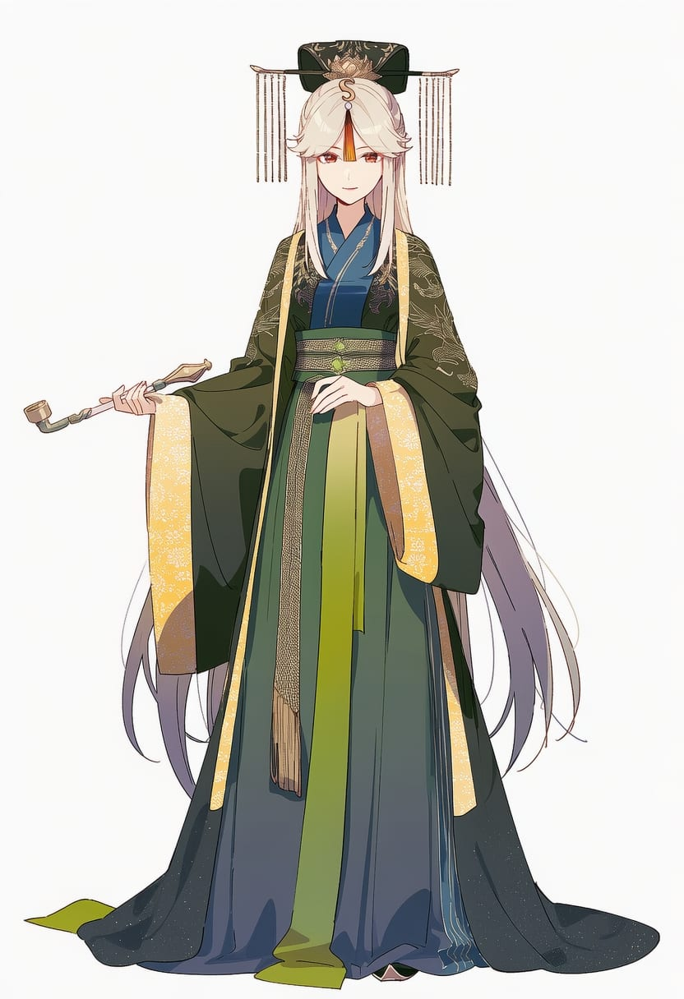

| 字段 | 内容 |
| --- | --- |
| 职业/身份原型（中文） | 仙朝文官 |
| NovelAI / Danbooru Tag 串 | 1.35::hanfu::, 1.28::yuanlingpao::, 1.22::wide_sleeves::, 1.16::sash::, 1.12::guan_hat::, 1.10::jade::, 1.08::scroll:: |
| 组合思路（大白话） | 圆领袍、冠帽、玉饰和卷轴做古代文官，再用更飘逸的仙侠材质感提升玄幻味。 |
| 世界细分 | 修仙 / 仙侠 / 玄幻 |
| 模特 | 1girl,ningguang_(genshin_impact) |
| 序号 | 0204 |

## 189. 剑仙

| 字段 | 内容 |
| --- | --- |
| 职业/身份原型（中文） | 剑仙 |
| NovelAI / Danbooru Tag 串 | 1.35::white_hanfu::, 1.28::jian_(weapon)::, 1.22::wide_sleeves::, 1.16::robe::, 1.12::sash::, 1.10::long_hair::, 1.08::xiao_guan_(headdress)::, 1.06::floating_weapon:: |
| 组合思路（大白话） | 比剑修更飘逸：白汉服、宽袖、小冠和悬浮飞剑，减少厚重护甲。 |
| 世界细分 | 修仙 / 仙侠 / 玄幻 |
| 模特 | 1boy,yanqing_(honkai:_star_rail) |
| 序号 | 0205 |

## 190. 仙门长老

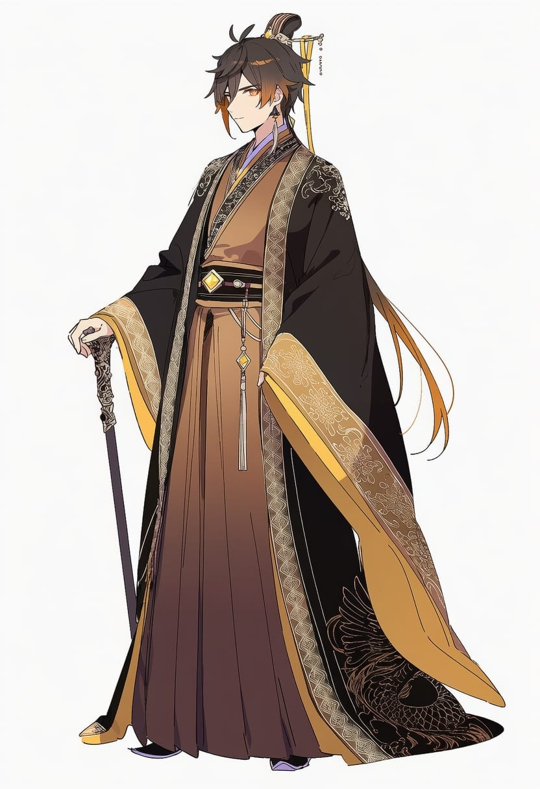

| 字段 | 内容 |
| --- | --- |
| 职业/身份原型（中文） | 仙门长老 |
| NovelAI / Danbooru Tag 串 | 1.35::hanfu::, 1.28::robe::, 1.22::wide_sleeves::, 1.16::sash::, 1.12::staff::, 1.10::hair_stick::, 1.08::ornate_clothes::, 1.06::xiao_guan_(headdress):: |
| 组合思路（大白话） | 比普通弟子更宽大、端庄，用礼仪袍、法杖和发簪提升资历与权威感。 |
| 世界细分 | 修仙 / 仙侠 / 玄幻 |
| 模特 | 1boy,zhongli_(genshin_impact) |
| 序号 | 0206 |

## 191. 佛修

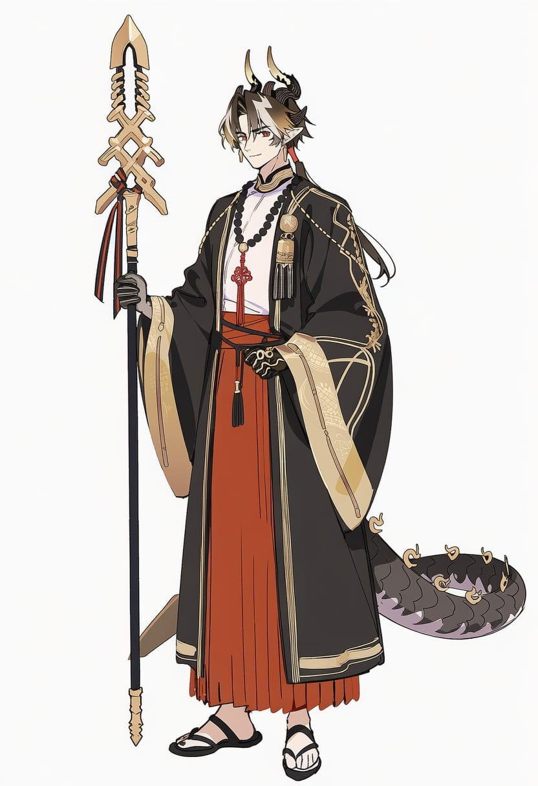

| 字段 | 内容 |
| --- | --- |
| 职业/身份原型（中文） | 佛修 |
| NovelAI / Danbooru Tag 串 | 1.35::monk::, 1.28::robe::, 1.22::prayer_beads::, 1.16::wide_sleeves::, 1.12::staff::, 1.10::sandals:: |
| 组合思路（大白话） | 僧袍、念珠和禅杖式长杖是核心，整体减少华丽饰品。 |
| 世界细分 | 修仙 / 仙侠 / 玄幻 |
| 模特 | 1boy,chongyue_(arknights) |
| 序号 | 0207 |

## 192. 宗主 / 掌门

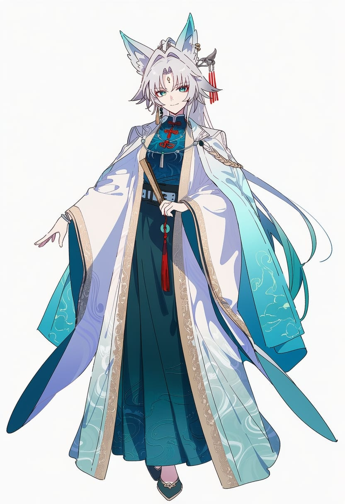

| 字段 | 内容 |
| --- | --- |
| 职业/身份原型（中文） | 宗主 / 掌门 |
| NovelAI / Danbooru Tag 串 | 1.35::ornate_clothes::, 1.28::hanfu::, 1.22::cape::, 1.16::wide_sleeves::, 1.12::sash::, 1.10::hair_stick::, 1.08::folding_fan:: |
| 组合思路（大白话） | 不再与剑仙共用“小冠+佩剑”，改为华服披风、发簪和折扇，强调统御者而不是剑修。 |
| 世界细分 | 修仙 / 仙侠 / 玄幻 |
| 模特 | 1girl,feixiao_(honkai:_star_rail) |
| 序号 | 0208 |

## 193. 散修

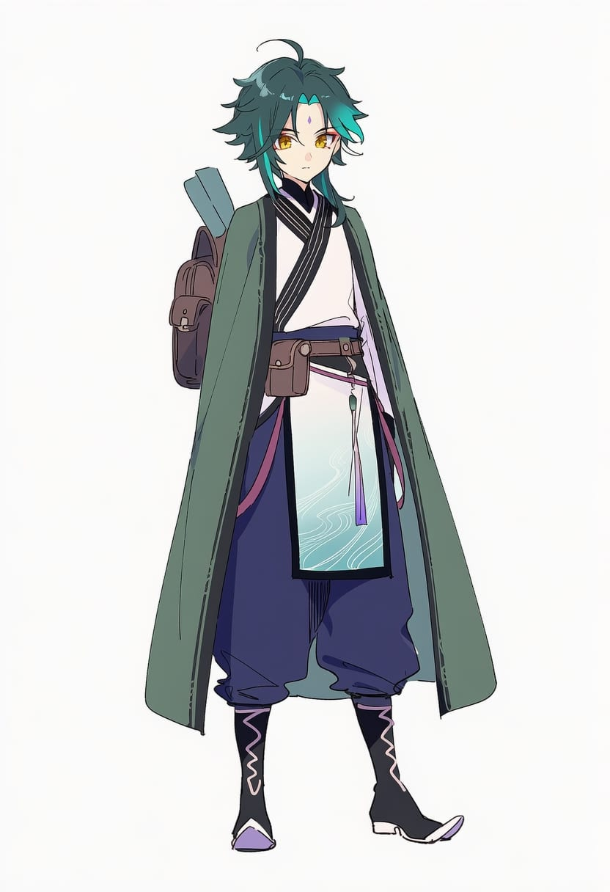

| 字段 | 内容 |
| --- | --- |
| 职业/身份原型（中文） | 散修 |
| NovelAI / Danbooru Tag 串 | 1.35::hanfu::, 1.28::robe::, 1.22::cloak::, 1.16::boots::, 1.12::belt_pouch::, 1.10::jian_(weapon)::, 1.08::backpack:: |
| 组合思路（大白话） | 不做整齐宗门制服，改用斗篷、背包、腰包和实用佩剑，像长期独自行走江湖。 |
| 世界细分 | 修仙 / 仙侠 / 玄幻 |
| 模特 | 1boy,xiao_(genshin_impact) |
| 序号 | 0209 |

## 194. 武修

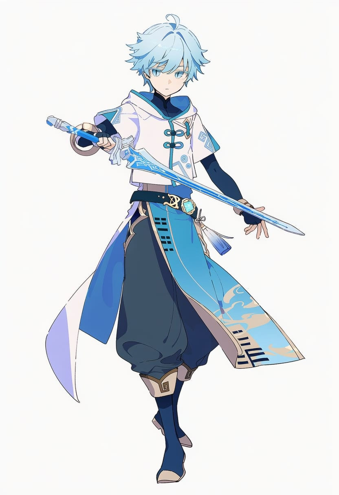

| 字段 | 内容 |
| --- | --- |
| 职业/身份原型（中文） | 武修 |
| NovelAI / Danbooru Tag 串 | 1.35::martial_arts::, 1.28::chinese_clothes::, 1.22::bracers::, 1.16::sash::, 1.12::boots::, 1.10::fingerless_gloves::, 1.08::jian_(weapon):: |
| 组合思路（大白话） | 更接近武侠：中式短装、护腕、腰带和轻便鞋靴，武器只是辅助。 |
| 世界细分 | 修仙 / 仙侠 / 玄幻 |
| 模特 | 1boy,chongyun_(genshin_impact) |
| 序号 | 0210 |

## 195. 灵兽师

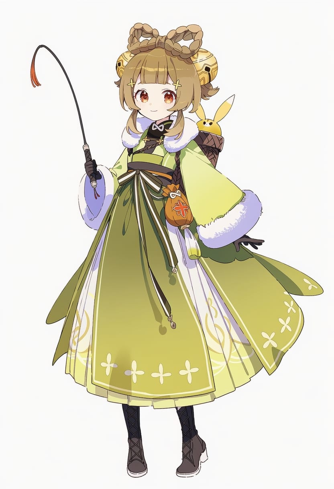

| 字段 | 内容 |
| --- | --- |
| 职业/身份原型（中文） | 灵兽师 |
| NovelAI / Danbooru Tag 串 | 1.35::hanfu::, 1.28::fur_trim::, 1.22::headband::, 1.16::pouch::, 1.12::whip::, 1.10::gloves::, 1.08::boots::, 1.06::sash::, 1.04::animal::, 1.02::robe:: |
| 组合思路（大白话） | 增加头带并保留毛皮、鞭子、兽类和小袋，让头部与手持工具都区别于御医/普通仙门长袍。 |
| 世界细分 | 修仙 / 仙侠 / 玄幻 |
| 模特 | 1girl,yaoyao_(genshin_impact) |
| 序号 | 0211 |

## 196. 符箓师

| 字段 | 内容 |
| --- | --- |
| 职业/身份原型（中文） | 符箓师 |
| NovelAI / Danbooru Tag 串 | 1.35::chinese_clothes::, 1.28::robe::, 1.22::wide_sleeves::, 1.16::ofuda::, 1.12::brush::, 1.10::sash::, 1.08::pouch::, 1.06::hanfu::, 1.04::xiao_guan_(headdress)::, 1.02::paper:: |
| 组合思路（大白话） | 法袍大袖加符纸、毛笔和小袋，突出随身画符与施术的工具结构。 |
| 世界细分 | 修仙 / 仙侠 / 玄幻 |
| 模特 | 1girl,huohuo_(honkai:_star_rail) |
| 序号 | 0212 |

## 197. 阵法师

| 字段 | 内容 |
| --- | --- |
| 职业/身份原型（中文） | 阵法师 |
| NovelAI / Danbooru Tag 串 | 1.35::hanfu::, 1.28::robe::, 1.22::wide_sleeves::, 1.16::circlet::, 1.12::compass::, 1.10::book::, 1.08::talisman::, 1.06::magic_circle::, 1.04::jewelry:: |
| 组合思路（大白话） | 把头部锚点改成额环，工具固定为罗盘、书册、符物和阵图；不再只是“长袍术士”，与御医/风水师明显拉开。 |
| 世界细分 | 修仙 / 仙侠 / 玄幻 |
| 模特 | 1girl,dusk_(arknights) |
| 序号 | 0213 |

## 198. 兽医

| 字段 | 内容 |
| --- | --- |
| 职业/身份原型（中文） | 兽医 |
| NovelAI / Danbooru Tag 串 | 1.35::labcoat::, 1.28::stethoscope::, 1.22::gloves::, 1.16::id_card::, 1.12::shoulder_bag:: |
| 组合思路（大白话） | 整体沿用医生结构，但减少正式领带，增加手套和随身包，显得更偏动物诊疗现场。 |
| 世界细分 | 医疗 / 科研 |
| 模特 | 1girl,suzuki_jun |
| 序号 | 0214 |

## 199. 医生

| 字段 | 内容 |
| --- | --- |
| 职业/身份原型（中文） | 医生 |
| NovelAI / Danbooru Tag 串 | 1.35::labcoat::, 1.28::stethoscope::, 1.22::dress_shirt::, 1.16::necktie::, 1.12::clipboard::, 1.10::id_card::, 1.08::gloves::, 1.06::doctor::, 1.04::collared_shirt::, 1.02::slacks:: |
| 组合思路（大白话） | 白大褂和听诊器先把“医生”钉死，再用衬衫、领带、证件和手套补出医院里的专业感。 |
| 世界细分 | 医疗 / 科研 |
| 模特 | 1girl,ishtar_(fate) |
| 序号 | 0215 |

## 200. 外科医生

| 字段 | 内容 |
| --- | --- |
| 职业/身份原型（中文） | 外科医生 |
| NovelAI / Danbooru Tag 串 | 1.35::scrubs::, 1.28::surgical_mask::, 1.22::latex_gloves::, 1.16::id_card::, 1.12::safety_glasses::, 1.10::rubber_gloves::, 1.08::stethoscope::, 1.06::surgeon::, 1.04::surgical_cap::, 1.02::cap:: |
| 组合思路（大白话） | 手术服、口罩和乳胶手套是最强识别点，护目镜和证件让它更像手术室人员而不是普通医生。 |
| 世界细分 | 医疗 / 科研 |
| 模特 | 1girl,fujiwara_no_mokou |
| 序号 | 0216 |

## 201. 护士

| 字段 | 内容 |
| --- | --- |
| 职业/身份原型（中文） | 护士 |
| NovelAI / Danbooru Tag 串 | 1.35::nurse_cap::, 1.28::white_dress::, 1.22::apron::, 1.16::stethoscope::, 1.12::badge::, 1.10::surgical_mask::, 1.08::nurse::, 1.06::scrubs::, 1.04::dress::, 1.02::name_tag:: |
| 组合思路（大白话） | 护士帽、白裙和围裙是传统视觉锚点，再加听诊器、徽章和口罩强化医疗岗位。 |
| 世界细分 | 医疗 / 科研 |
| 模特 | 1girl,tanaka_asuka |
| 序号 | 0217 |

## 202. 海洋研究员

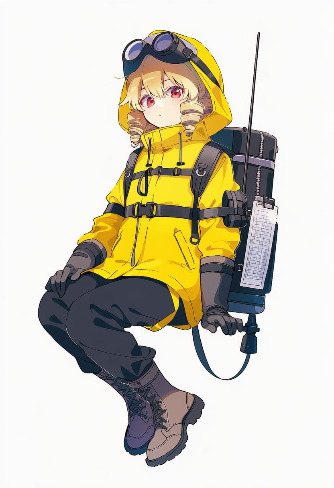

| 字段 | 内容 |
| --- | --- |
| 职业/身份原型（中文） | 海洋研究员 |
| NovelAI / Danbooru Tag 串 | 1.35::raincoat::, 1.28::life_jacket::, 1.22::gloves::, 1.16::boots::, 1.12::binoculars::, 1.10::clipboard:: |
| 组合思路（大白话） | 雨衣、救生衣、胶靴与记录板，像在科考船甲板做观察记录。 |
| 世界细分 | 医疗 / 科研 |
| 模特 | 1girl,luna_child |
| 序号 | 0218 |

## 203. 牙医

| 字段 | 内容 |
| --- | --- |
| 职业/身份原型（中文） | 牙医 |
| NovelAI / Danbooru Tag 串 | 1.35::labcoat::, 1.28::surgical_mask::, 1.22::latex_gloves::, 1.16::safety_glasses::, 1.12::apron::, 1.10::dentist::, 1.08::rubber_gloves::, 1.06::protective_eyewear::, 1.04::collared_shirt::, 1.02::eyewear:: |
| 组合思路（大白话） | 牙医最明显的是白大褂、口罩、手套和护目镜，围裙让近距离操作感更强。 |
| 世界细分 | 医疗 / 科研 |
| 模特 | 1girl,hazawa_tsugumi |
| 序号 | 0219 |

## 204. 药剂师

| 字段 | 内容 |
| --- | --- |
| 职业/身份原型（中文） | 药剂师 |
| NovelAI / Danbooru Tag 串 | 1.35::labcoat::, 1.28::glasses::, 1.22::id_card::, 1.16::gloves::, 1.12::bottle::, 1.10::clipboard::, 1.08::vial::, 1.06::apron::, 1.04::belt_pouch::, 1.02::collared_shirt:: |
| 组合思路（大白话） | 仍然保留白大褂，但把听诊器换成药瓶、记录板和眼镜，视觉上更接近配药与药房工作。 |
| 世界细分 | 医疗 / 科研 |
| 模特 | 1girl,kochou_shinobu |
| 序号 | 0220 |

---
