# 面部表情tag展示

## 1. angry — 明显愤怒的表情。

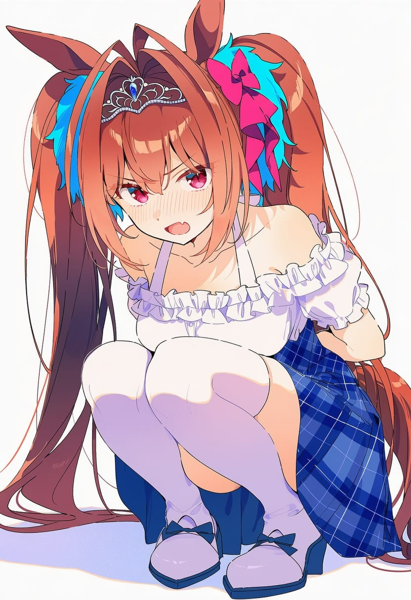

| 字段 | 内容 |
| --- | --- |
| 序号 | 1 |
| Danbooru Tag | angry |
| 中文名 | 生气 |
| 中文含义 | 明显愤怒的表情。 |
| 子类 | 情绪/基础表情 |
| 角色 | 1girl,daiwa_scarlet_(umamusume) |

## 2. annoyed — 不耐烦、被惹恼的表情。

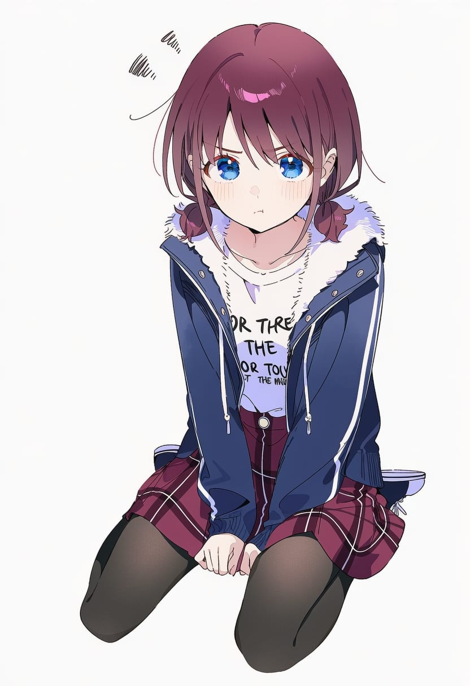

| 字段 | 内容 |
| --- | --- |
| 序号 | 2 |
| Danbooru Tag | annoyed |
| 中文名 | 烦躁 |
| 中文含义 | 不耐烦、被惹恼的表情。 |
| 子类 | 情绪/基础表情 |
| 角色 | 1girl,iseri_nina |

## 3. blush — 脸颊出现明显红晕。

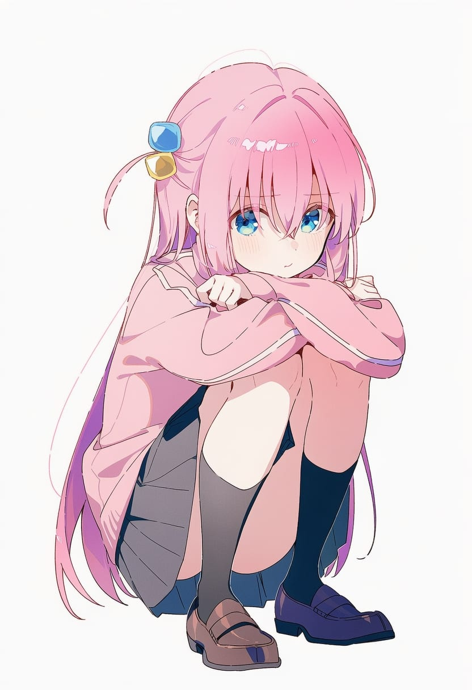

| 字段 | 内容 |
| --- | --- |
| 序号 | 3 |
| Danbooru Tag | blush |
| 中文名 | 脸红 |
| 中文含义 | 脸颊出现明显红晕。 |
| 子类 | 情绪/基础表情 |
| 角色 | 1girl,gotoh_hitori |

## 4. blush_stickers — 用漫画贴纸形状表现脸红。

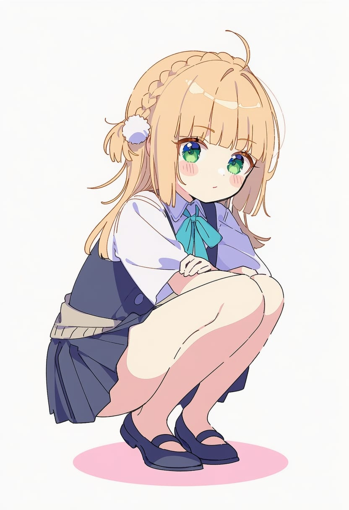

| 字段 | 内容 |
| --- | --- |
| 序号 | 4 |
| Danbooru Tag | blush_stickers |
| 中文名 | 贴纸式腮红 |
| 中文含义 | 用漫画贴纸形状表现脸红。 |
| 子类 | 情绪/基础表情 |
| 角色 | 1girl,rice_shower_(umamusume) |

## 5. embarrassed — 因害羞或尴尬而不自在。

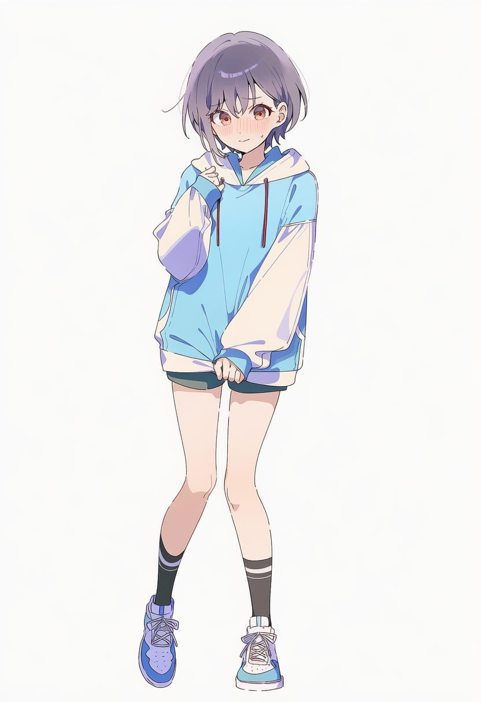

| 字段 | 内容 |
| --- | --- |
| 序号 | 5 |
| Danbooru Tag | embarrassed |
| 中文名 | 尴尬 / 害羞 |
| 中文含义 | 因害羞或尴尬而不自在。 |
| 子类 | 情绪/基础表情 |
| 角色 | 1girl,takamatsu_tomori |

## 6. full-face_blush — 整张脸大面积泛红。

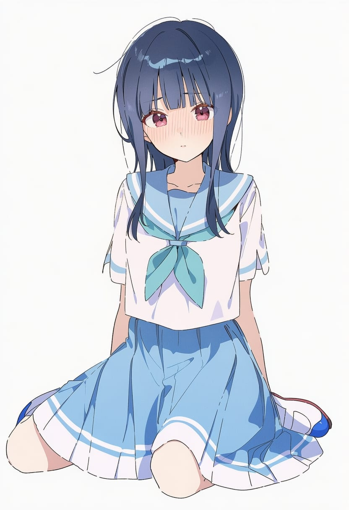

| 字段 | 内容 |
| --- | --- |
| 序号 | 6 |
| Danbooru Tag | full-face_blush |
| 中文名 | 满脸通红 |
| 中文含义 | 整张脸大面积泛红。 |
| 子类 | 情绪/基础表情 |
| 角色 | 1girl,yoroizuka_mizore |

## 7. nose_blush — 鼻子附近出现红晕。

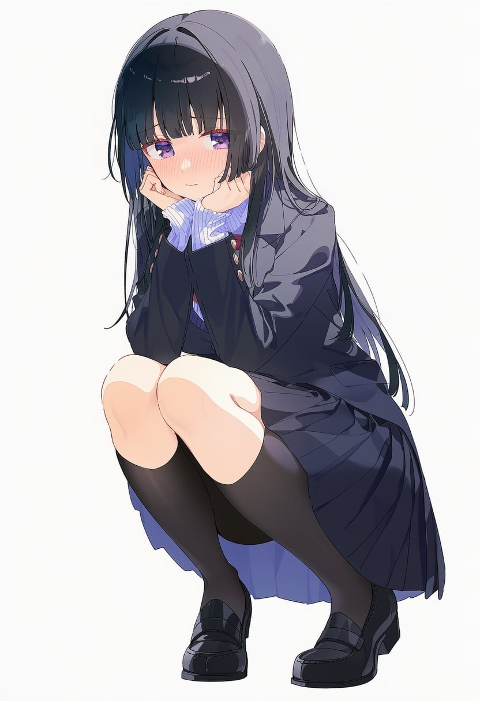

| 字段 | 内容 |
| --- | --- |
| 序号 | 7 |
| Danbooru Tag | nose_blush |
| 中文名 | 鼻尖泛红 |
| 中文含义 | 鼻子附近出现红晕。 |
| 子类 | 情绪/基础表情 |
| 角色 | 1girl,shirokane_rinko |

## 8. bored — 提不起兴趣、百无聊赖。

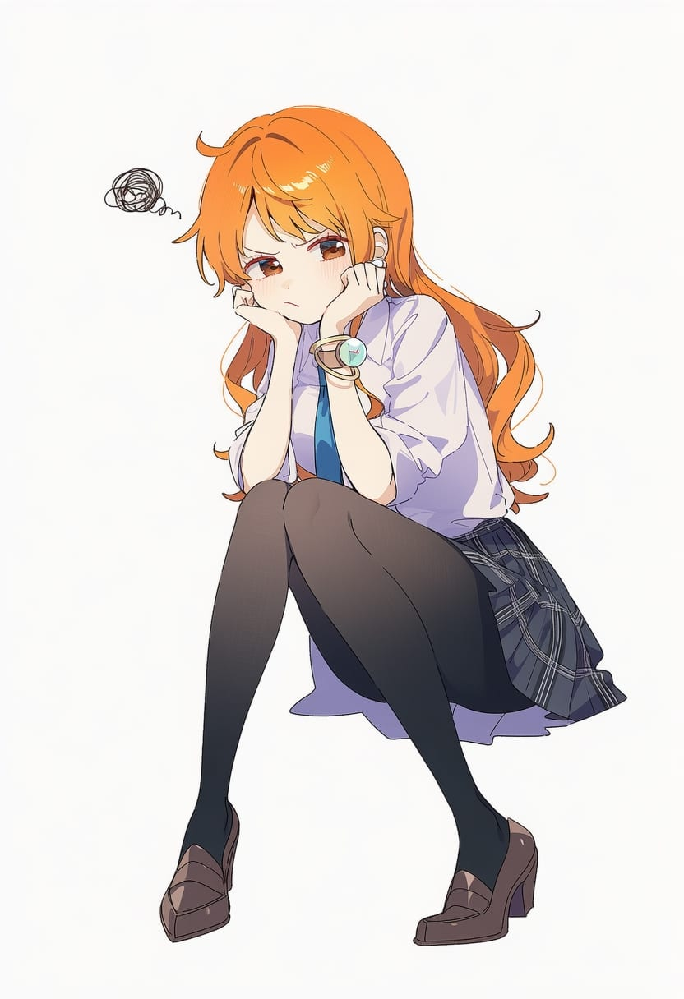

| 字段 | 内容 |
| --- | --- |
| 序号 | 8 |
| Danbooru Tag | bored |
| 中文名 | 无聊 |
| 中文含义 | 提不起兴趣、百无聊赖。 |
| 子类 | 情绪/基础表情 |
| 角色 | 1girl,nami_(one_piece) |

## 9. confident — 神态自信、有把握。

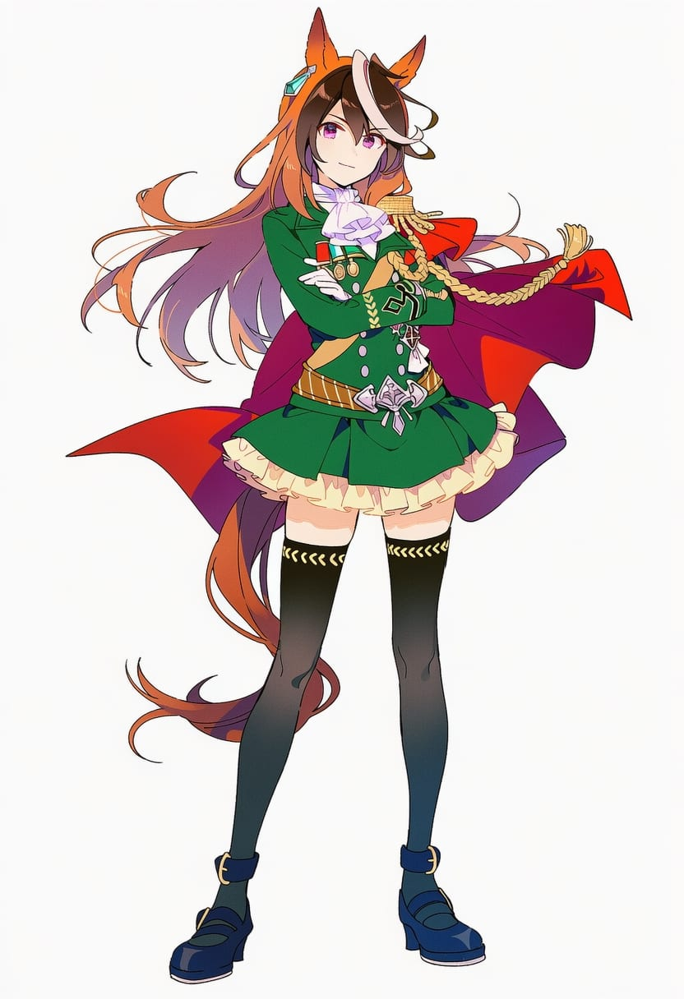

| 字段 | 内容 |
| --- | --- |
| 序号 | 9 |
| Danbooru Tag | confident |
| 中文名 | 自信 |
| 中文含义 | 神态自信、有把握。 |
| 子类 | 情绪/基础表情 |
| 角色 | 1girl,symboli_rudolf_(umamusume) |

## 10. confused — 不明白状况的疑惑表情。

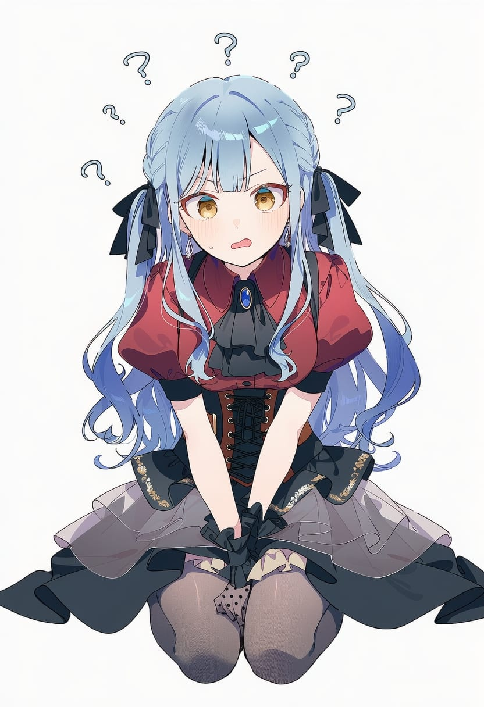

| 字段 | 内容 |
| --- | --- |
| 序号 | 10 |
| Danbooru Tag | confused |
| 中文名 | 困惑 |
| 中文含义 | 不明白状况的疑惑表情。 |
| 子类 | 情绪/基础表情 |
| 角色 | 1girl,togawa_sakiko |

## 11. crazy — 精神亢奋或失控的疯狂表情。

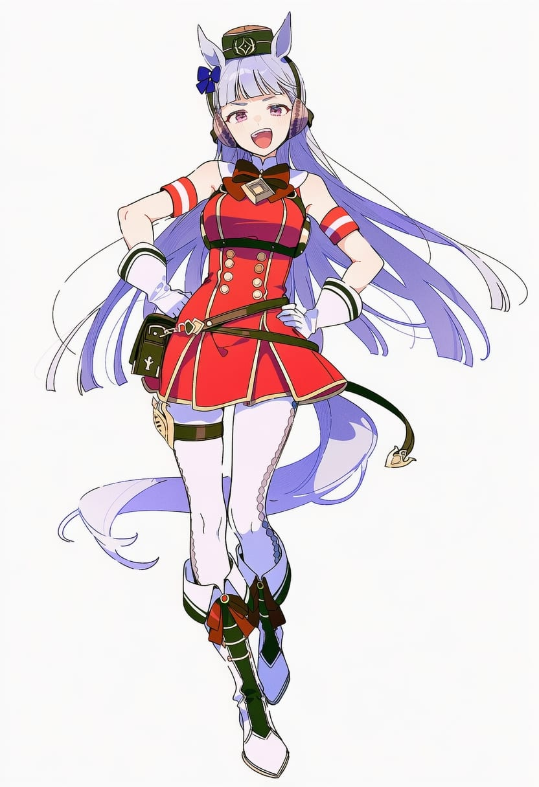

| 字段 | 内容 |
| --- | --- |
| 序号 | 11 |
| Danbooru Tag | crazy |
| 中文名 | 疯狂 |
| 中文含义 | 精神亢奋或失控的疯狂表情。 |
| 子类 | 情绪/基础表情 |
| 角色 | 1girl,gold_ship_(umamusume) |

## 12. despair — 明显失去希望的表情。

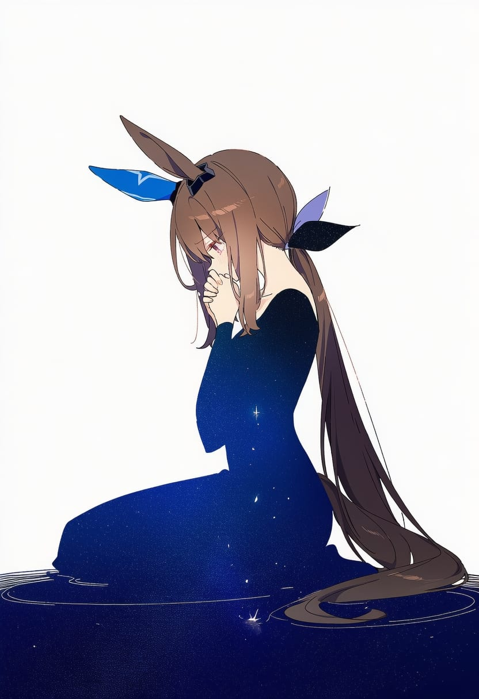

| 字段 | 内容 |
| --- | --- |
| 序号 | 12 |
| Danbooru Tag | despair |
| 中文名 | 绝望 |
| 中文含义 | 明显失去希望的表情。 |
| 子类 | 情绪/基础表情 |
| 角色 | 1girl,admire_vega_(umamusume) |

## 13. determined — 下定决心、意志坚定。

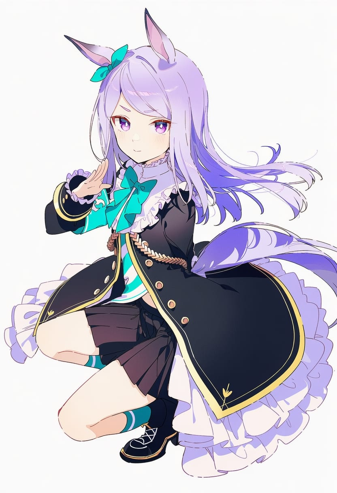

| 字段 | 内容 |
| --- | --- |
| 序号 | 13 |
| Danbooru Tag | determined |
| 中文名 | 坚定 |
| 中文含义 | 下定决心、意志坚定。 |
| 子类 | 情绪/基础表情 |
| 角色 | 1girl,mejiro_mcqueen_(umamusume) |

## 14. disappointed — 期待落空后的失望神情。

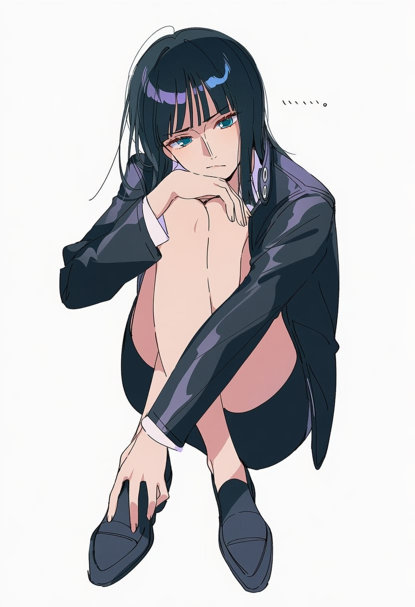

| 字段 | 内容 |
| --- | --- |
| 序号 | 14 |
| Danbooru Tag | disappointed |
| 中文名 | 失望 |
| 中文含义 | 期待落空后的失望神情。 |
| 子类 | 情绪/基础表情 |
| 角色 | 1girl,nico_robin |

## 15. disdain — 带鄙视和看不起的神情。

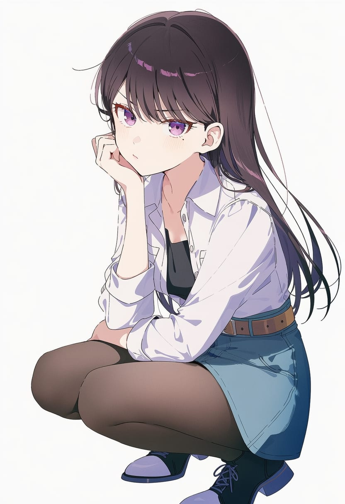

| 字段 | 内容 |
| --- | --- |
| 序号 | 15 |
| Danbooru Tag | disdain |
| 中文名 | 轻蔑 |
| 中文含义 | 带鄙视和看不起的神情。 |
| 子类 | 情绪/基础表情 |
| 角色 | 1girl,shiina_taki |

## 16. disgust — 明显厌恶或反胃的表情。

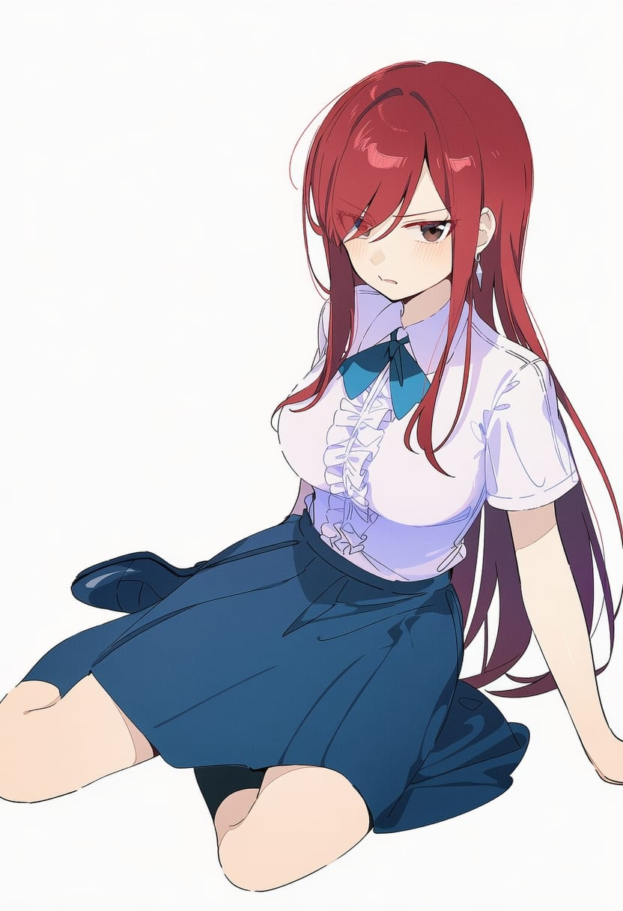

| 字段 | 内容 |
| --- | --- |
| 序号 | 16 |
| Danbooru Tag | disgust |
| 中文名 | 嫌恶 |
| 中文含义 | 明显厌恶或反胃的表情。 |
| 子类 | 情绪/基础表情 |
| 角色 | 1girl,erza_scarlet |

## 17. distress — 陷入痛苦或焦虑的神情。

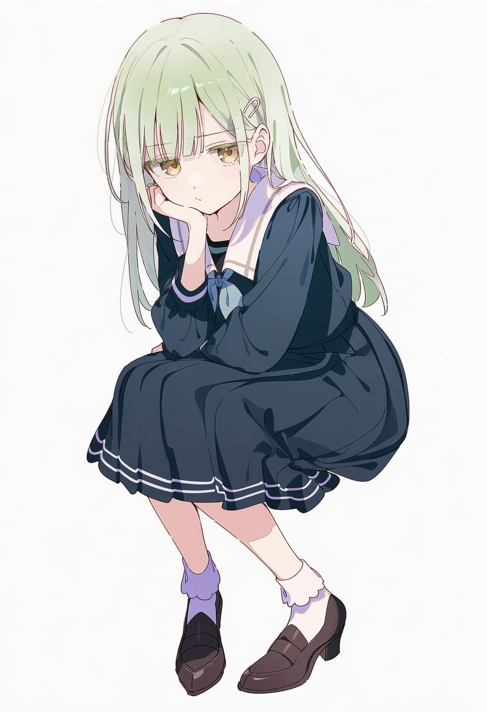

| 字段 | 内容 |
| --- | --- |
| 序号 | 17 |
| Danbooru Tag | distress |
| 中文名 | 痛苦焦虑 |
| 中文含义 | 陷入痛苦或焦虑的神情。 |
| 子类 | 情绪/基础表情 |
| 角色 | 1girl,wakaba_mutsumi |

## 18. drunk — 醉酒后迷糊或失控的表情。

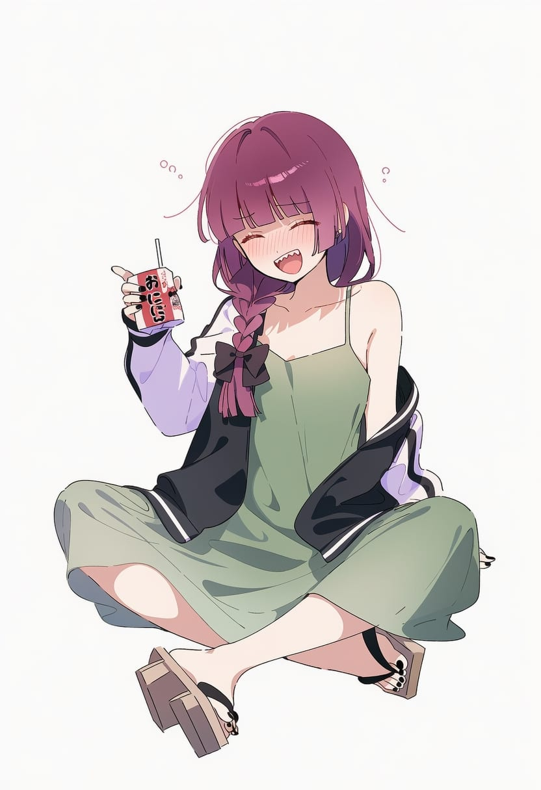

| 字段 | 内容 |
| --- | --- |
| 序号 | 18 |
| Danbooru Tag | drunk |
| 中文名 | 醉态 |
| 中文含义 | 醉酒后迷糊或失控的表情。 |
| 子类 | 情绪/基础表情 |
| 角色 | 1girl,hiroi_kikuri |

## 19. excited — 情绪高涨、非常激动。

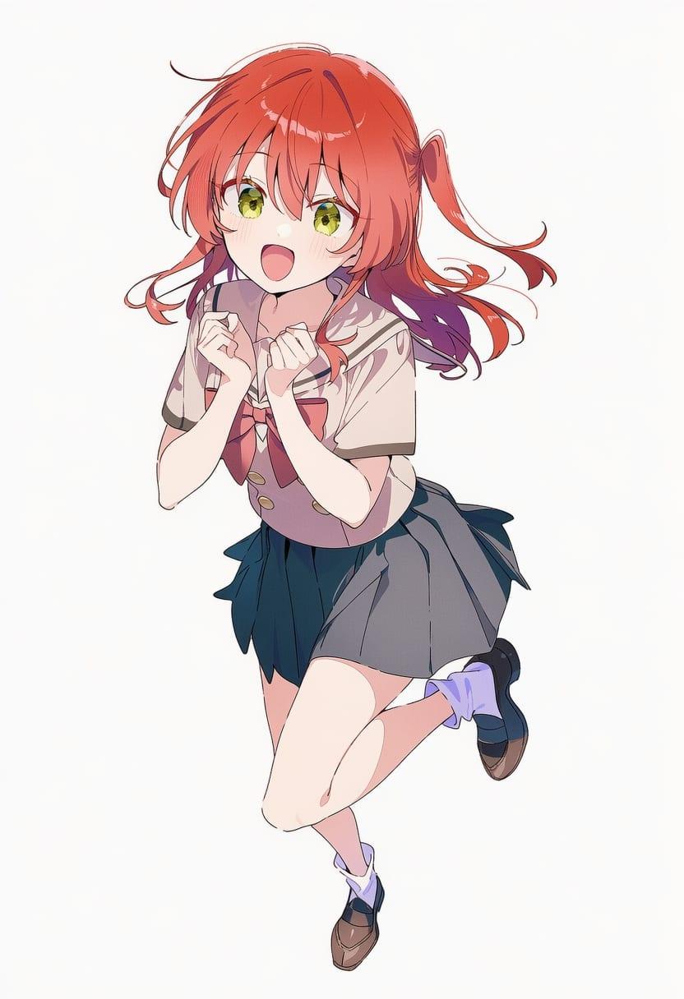

| 字段 | 内容 |
| --- | --- |
| 序号 | 21 |
| Danbooru Tag | excited |
| 中文名 | 兴奋 |
| 中文含义 | 情绪高涨、非常激动。 |
| 子类 | 情绪/基础表情 |
| 角色 | 1girl,kita_ikuyo |

## 20. exhausted — 疲惫到几乎没有精神。

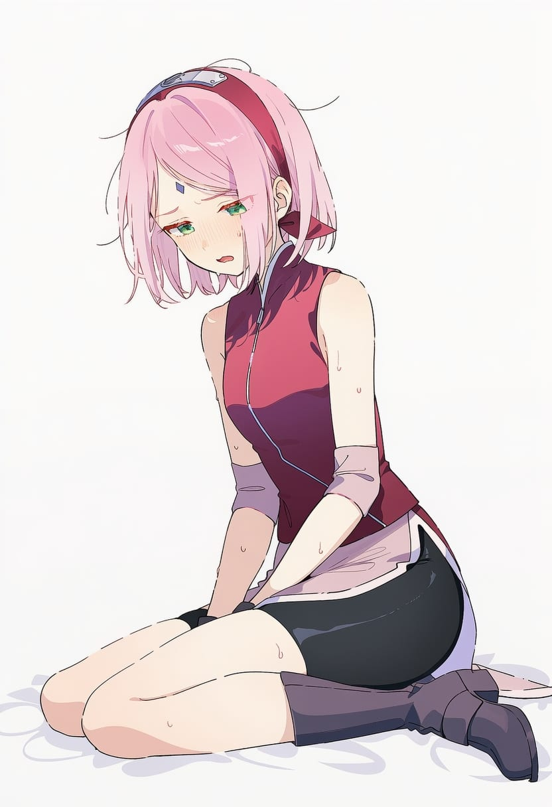

| 字段 | 内容 |
| --- | --- |
| 序号 | 22 |
| Danbooru Tag | exhausted |
| 中文名 | 精疲力尽 |
| 中文含义 | 疲惫到几乎没有精神。 |
| 子类 | 情绪/基础表情 |
| 角色 | 1girl,haruno_sakura |

## 21. expressionless — 脸上几乎没有明显情绪。

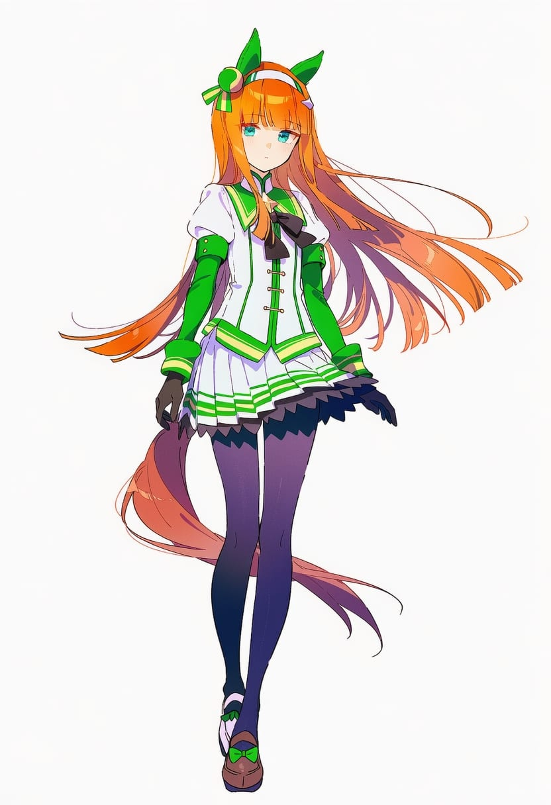

| 字段 | 内容 |
| --- | --- |
| 序号 | 23 |
| Danbooru Tag | expressionless |
| 中文名 | 无表情 |
| 中文含义 | 脸上几乎没有明显情绪。 |
| 子类 | 情绪/基础表情 |
| 角色 | 1girl,silence_suzuka_(umamusume) |

## 22. flustered — 紧张慌乱、手足无措。

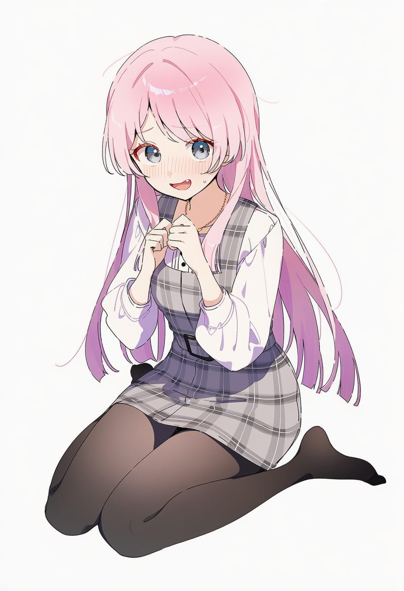

| 字段 | 内容 |
| --- | --- |
| 序号 | 24 |
| Danbooru Tag | flustered |
| 中文名 | 慌乱脸红 |
| 中文含义 | 紧张慌乱、手足无措。 |
| 子类 | 情绪/基础表情 |
| 角色 | 1girl,chihaya_anon |

## 23. frustrated — 受挫后烦躁不甘。

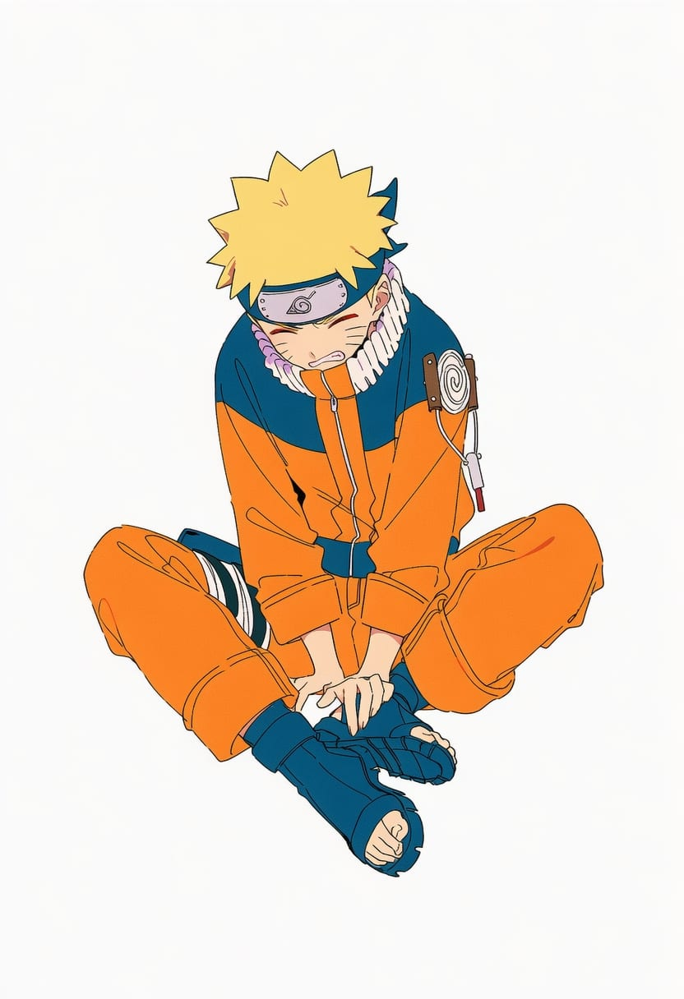

| 字段 | 内容 |
| --- | --- |
| 序号 | 25 |
| Danbooru Tag | frustrated |
| 中文名 | 挫败烦闷 |
| 中文含义 | 受挫后烦躁不甘。 |
| 子类 | 情绪/基础表情 |
| 角色 | 1boy,uzumaki_naruto |

## 24. furrowed_brow — 眉头紧锁。

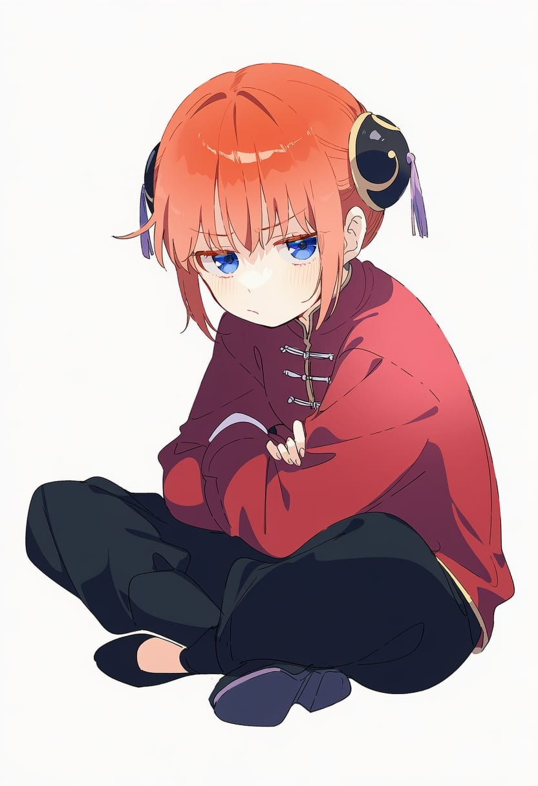

| 字段 | 内容 |
| --- | --- |
| 序号 | 26 |
| Danbooru Tag | furrowed_brow |
| 中文名 | 皱眉 |
| 中文含义 | 眉头紧锁。 |
| 子类 | 情绪/基础表情 |
| 角色 | 1girl,kagura_(gintama) |

## 25. guilt — 做错事后的心虚愧疚。

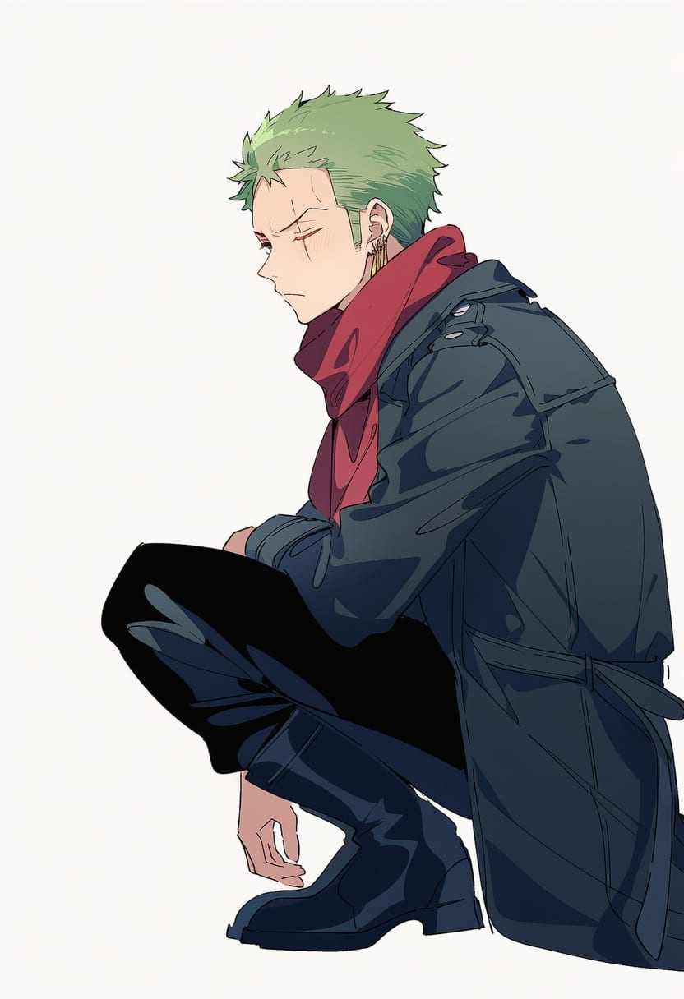

| 字段 | 内容 |
| --- | --- |
| 序号 | 28 |
| Danbooru Tag | guilt |
| 中文名 | 愧疚 |
| 中文含义 | 做错事后的心虚愧疚。 |
| 子类 | 情绪/基础表情 |
| 角色 | 1boy,roronoa_zoro |

## 26. happy — 明显愉快、开心的表情。

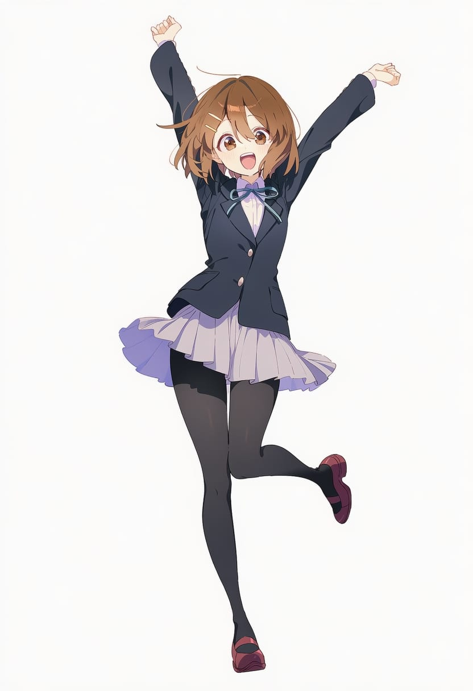

| 字段 | 内容 |
| --- | --- |
| 序号 | 29 |
| Danbooru Tag | happy |
| 中文名 | 开心 |
| 中文含义 | 明显愉快、开心的表情。 |
| 子类 | 情绪/基础表情 |
| 角色 | 1girl,hirasawa_yui |

## 27. lonely — 显得孤单、落寞。

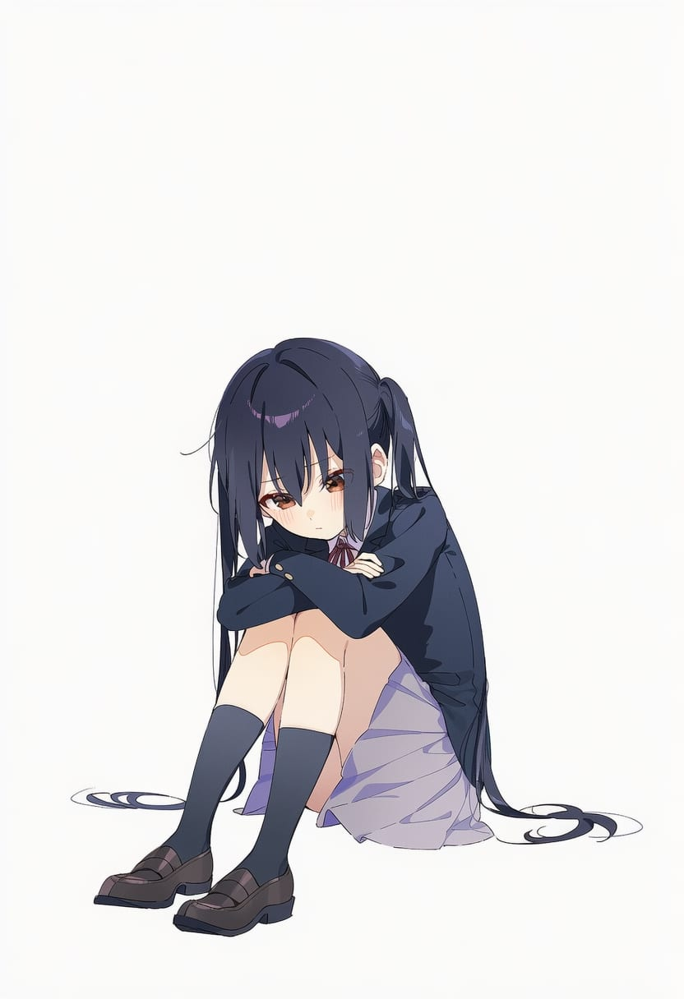

| 字段 | 内容 |
| --- | --- |
| 序号 | 30 |
| Danbooru Tag | lonely |
| 中文名 | 孤独 |
| 中文含义 | 显得孤单、落寞。 |
| 子类 | 情绪/基础表情 |
| 角色 | 1girl,nakano_azusa |

## 28. nervous — 紧张不安的表情。

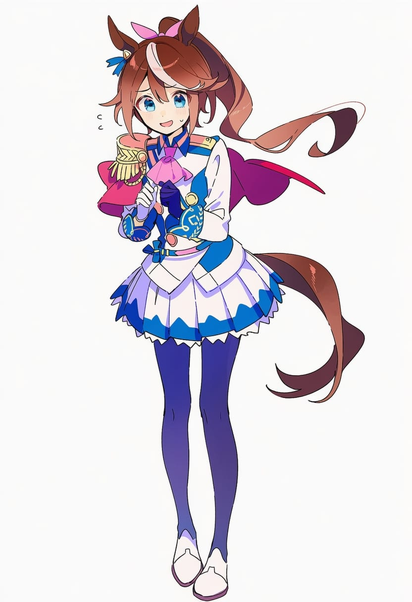

| 字段 | 内容 |
| --- | --- |
| 序号 | 31 |
| Danbooru Tag | nervous |
| 中文名 | 紧张 |
| 中文含义 | 紧张不安的表情。 |
| 子类 | 情绪/基础表情 |
| 角色 | 1girl,tokai_teio_(umamusume) |

## 29. pensive — 安静思考、若有所思。

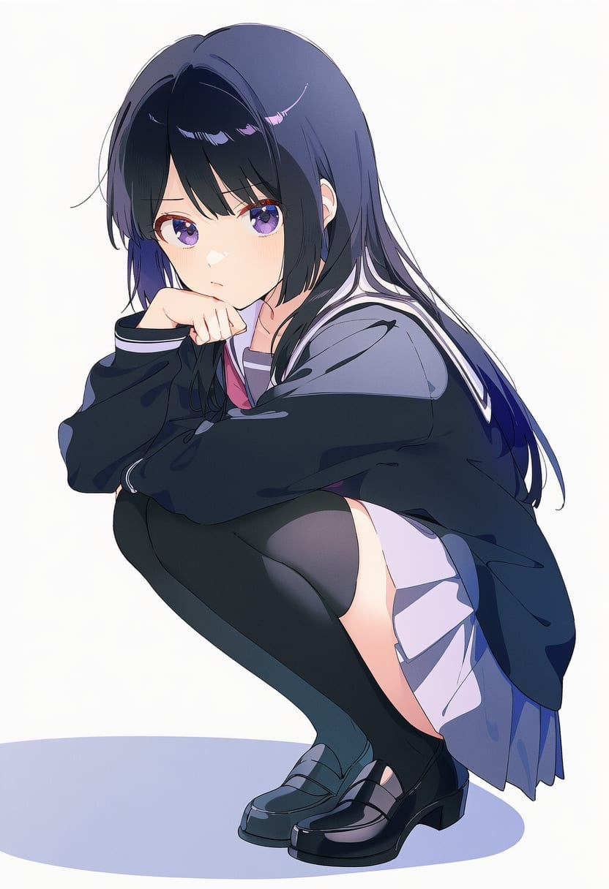

| 字段 | 内容 |
| --- | --- |
| 序号 | 33 |
| Danbooru Tag | pensive |
| 中文名 | 沉思 |
| 中文含义 | 安静思考、若有所思。 |
| 子类 | 情绪/基础表情 |
| 角色 | 1girl,kousaka_reina |

## 30. sad — 明显难过的表情。

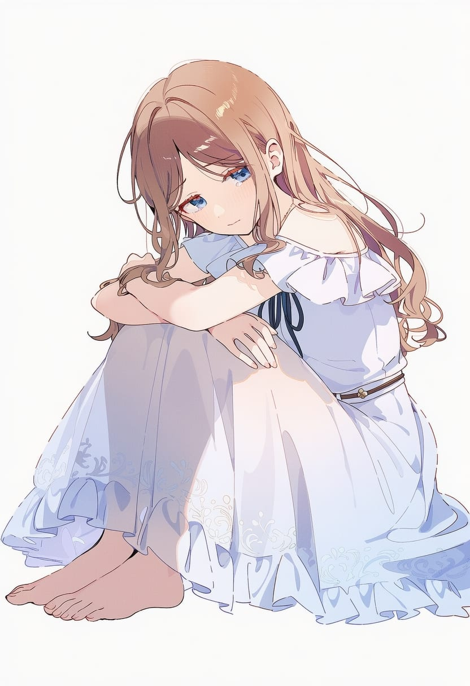

| 字段 | 内容 |
| --- | --- |
| 序号 | 34 |
| Danbooru Tag | sad |
| 中文名 | 悲伤 |
| 中文含义 | 明显难过的表情。 |
| 子类 | 情绪/基础表情 |
| 角色 | 1girl,nagasaki_soyo |

## 31. depressed — 情绪低落、很丧。

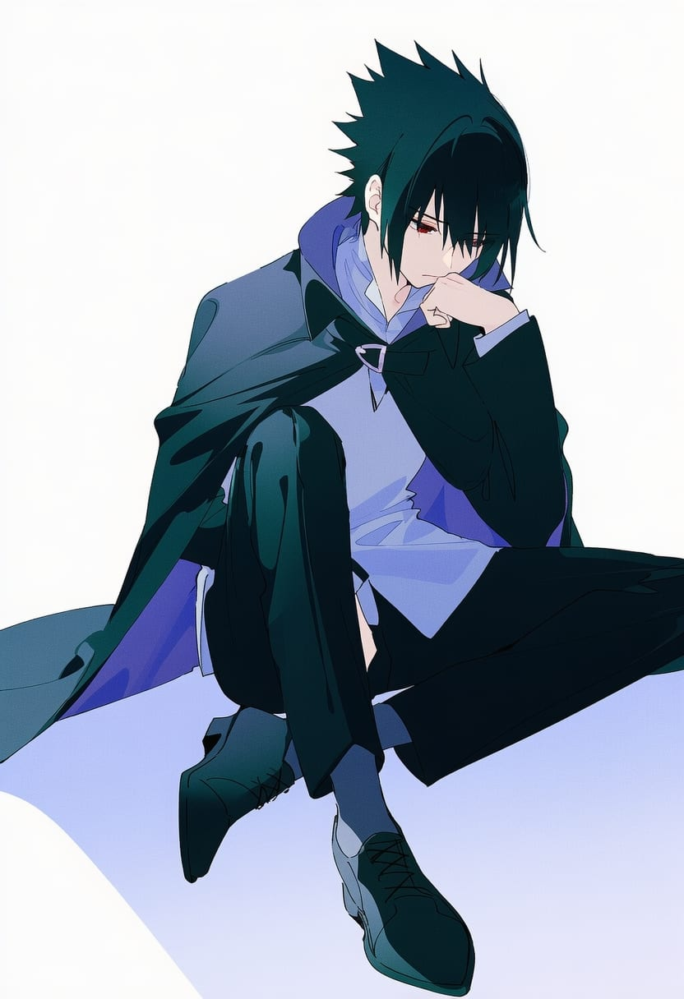

| 字段 | 内容 |
| --- | --- |
| 序号 | 35 |
| Danbooru Tag | depressed |
| 中文名 | 消沉 |
| 中文含义 | 情绪低落、很丧。 |
| 子类 | 情绪/基础表情 |
| 角色 | 1boy,uchiha_sasuke |

## 32. gloom_(expression) — 阴郁低沉、气压很低。

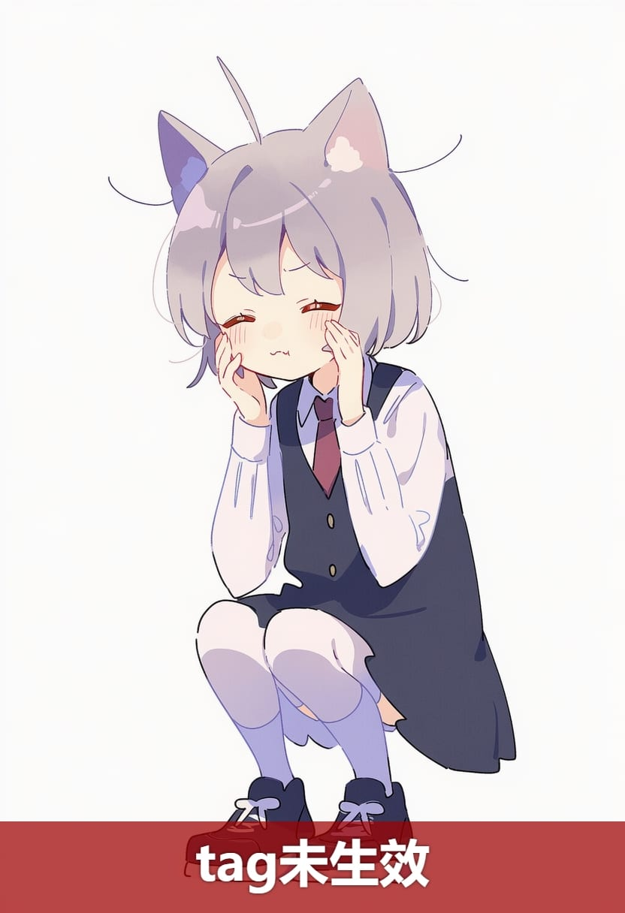

| 字段 | 内容 |
| --- | --- |
| 序号 | 36 |
| Danbooru Tag | gloom_(expression) |
| 中文名 | 阴沉 |
| 中文含义 | 阴郁低沉、气压很低。 |
| 子类 | 情绪/基础表情 |
| 角色 | 1girl,inoue_orihime |

## 33. scared — 受到惊吓、感到恐惧。

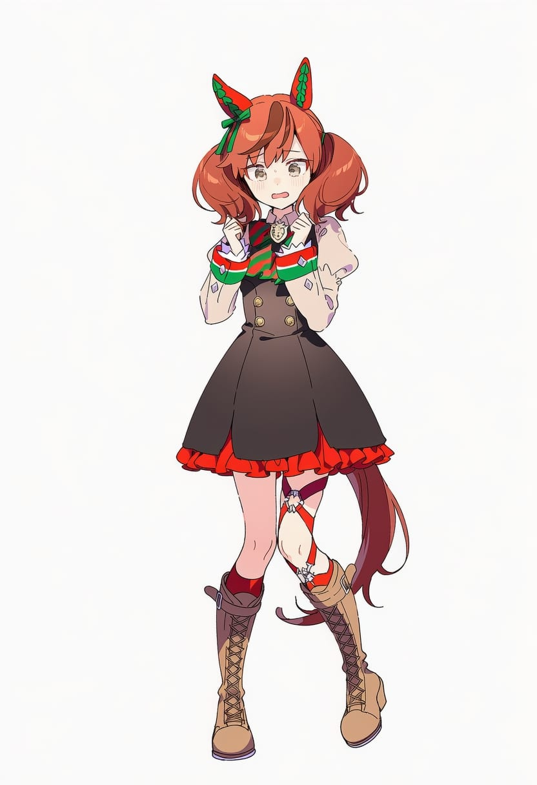

| 字段 | 内容 |
| --- | --- |
| 序号 | 37 |
| Danbooru Tag | scared |
| 中文名 | 害怕 |
| 中文含义 | 受到惊吓、感到恐惧。 |
| 子类 | 情绪/基础表情 |
| 角色 | 1girl,nice_nature_(umamusume) |

## 34. panicking — 慌张到快失去冷静。

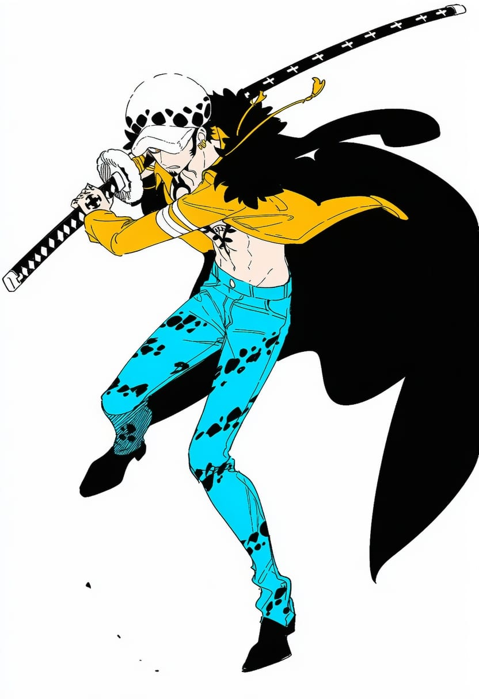

| 字段 | 内容 |
| --- | --- |
| 序号 | 38 |
| Danbooru Tag | panicking |
| 中文名 | 惊慌 |
| 中文含义 | 慌张到快失去冷静。 |
| 子类 | 情绪/基础表情 |
| 角色 | 1boy,trafalgar_law |

## 35. worried — 忧虑、不放心的神情。

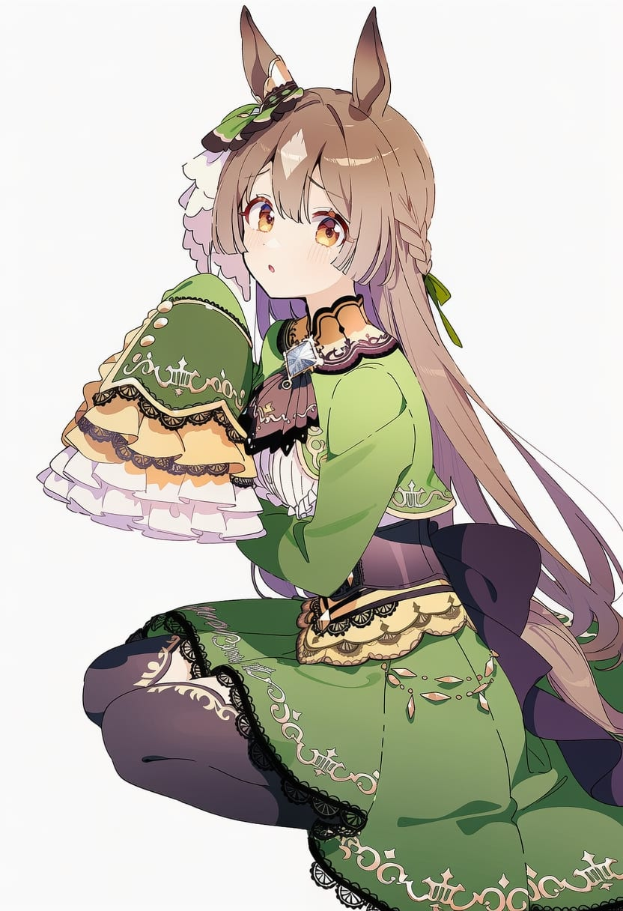

| 字段 | 内容 |
| --- | --- |
| 序号 | 39 |
| Danbooru Tag | worried |
| 中文名 | 担心 |
| 中文含义 | 忧虑、不放心的神情。 |
| 子类 | 情绪/基础表情 |
| 角色 | 1girl,satono_diamond_(umamusume) |

## 36. serious — 认真严肃、不带笑意。

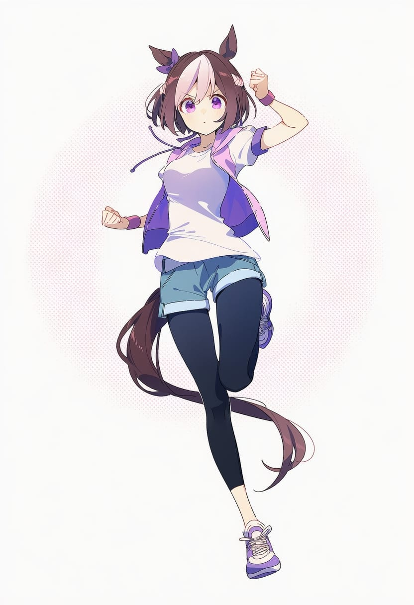

| 字段 | 内容 |
| --- | --- |
| 序号 | 40 |
| Danbooru Tag | serious |
| 中文名 | 严肃 |
| 中文含义 | 认真严肃、不带笑意。 |
| 子类 | 情绪/基础表情 |
| 角色 | 1girl,special_week_(umamusume) |

## 37. shy — 羞涩、拘谨的表情。

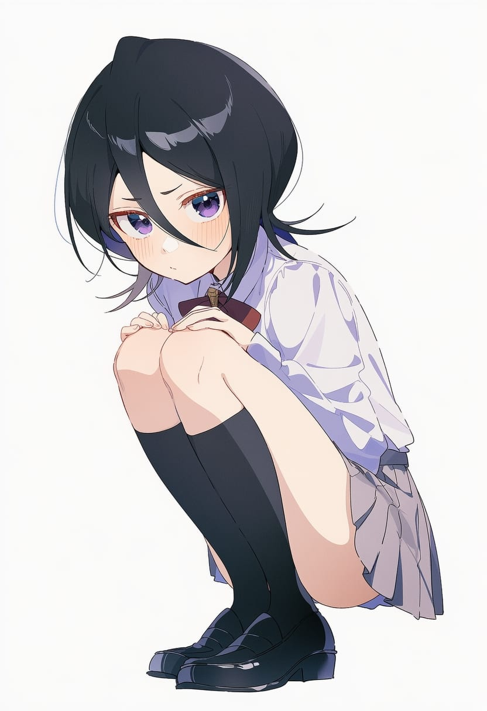

| 字段 | 内容 |
| --- | --- |
| 序号 | 41 |
| Danbooru Tag | shy |
| 中文名 | 害羞 |
| 中文含义 | 羞涩、拘谨的表情。 |
| 子类 | 情绪/基础表情 |
| 角色 | 1girl,kuchiki_rukia |

## 38. skeptical — 半信半疑、不太相信。

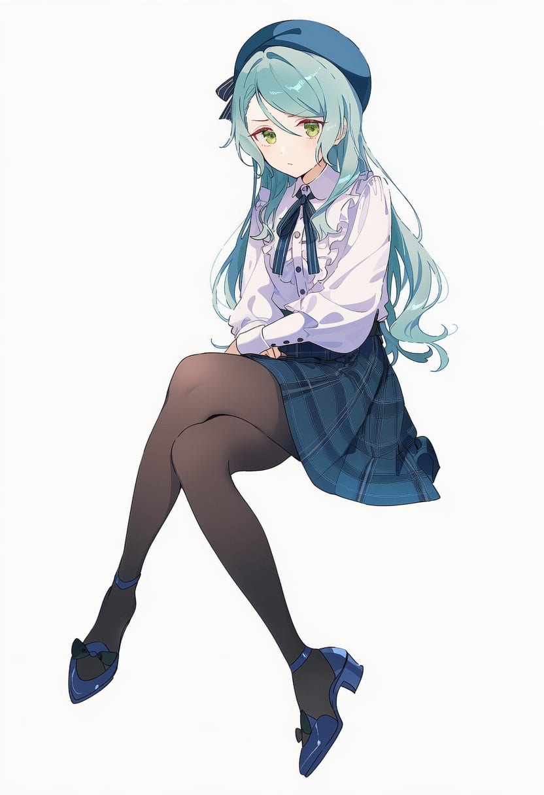

| 字段 | 内容 |
| --- | --- |
| 序号 | 42 |
| Danbooru Tag | skeptical |
| 中文名 | 怀疑 |
| 中文含义 | 半信半疑、不太相信。 |
| 子类 | 情绪/基础表情 |
| 角色 | 1girl,hikawa_sayo |

## 39. sleepy — 昏昏欲睡的表情。

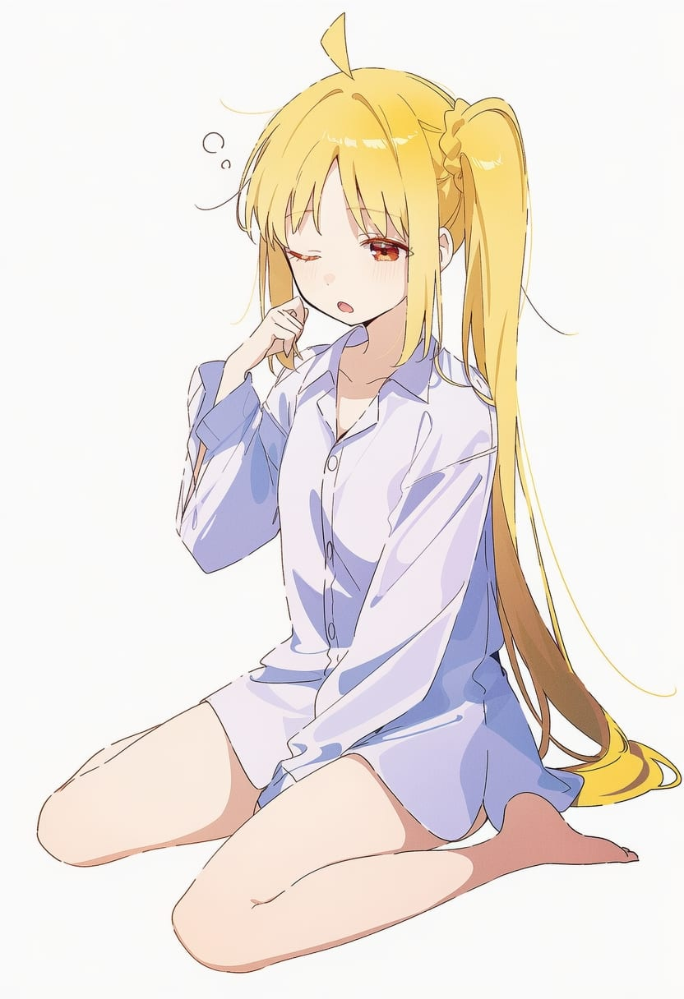

| 字段 | 内容 |
| --- | --- |
| 序号 | 43 |
| Danbooru Tag | sleepy |
| 中文名 | 困倦 |
| 中文含义 | 昏昏欲睡的表情。 |
| 子类 | 情绪/基础表情 |
| 角色 | 1girl,ijichi_nijika |

## 40. sulking — 赌气、闷闷不乐。

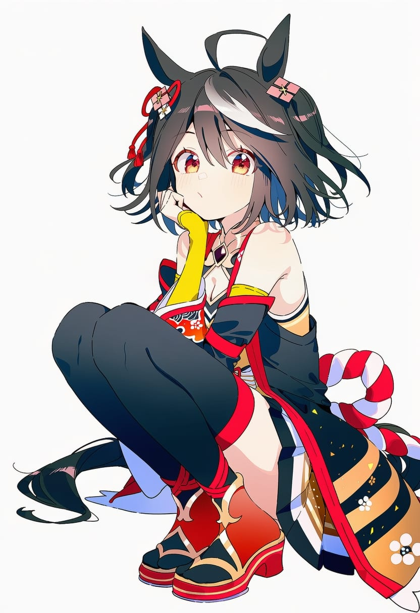

| 字段 | 内容 |
| --- | --- |
| 序号 | 44 |
| Danbooru Tag | sulking |
| 中文名 | 闹别扭 |
| 中文含义 | 赌气、闷闷不乐。 |
| 子类 | 情绪/基础表情 |
| 角色 | 1girl,kitasan_black_(umamusume) |

## 41. surprised — 突然吃惊的表情。

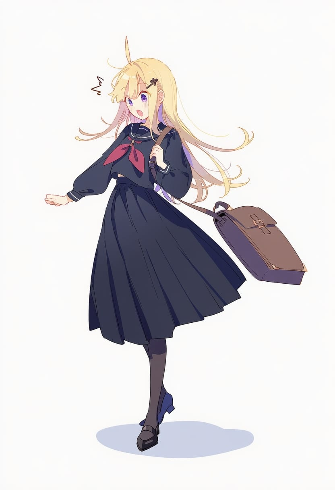

| 字段 | 内容 |
| --- | --- |
| 序号 | 45 |
| Danbooru Tag | surprised |
| 中文名 | 惊讶 |
| 中文含义 | 突然吃惊的表情。 |
| 子类 | 情绪/基础表情 |
| 角色 | 1boy,tony_tony_chopper |

## 42. thinking — 正在思考问题的神情。

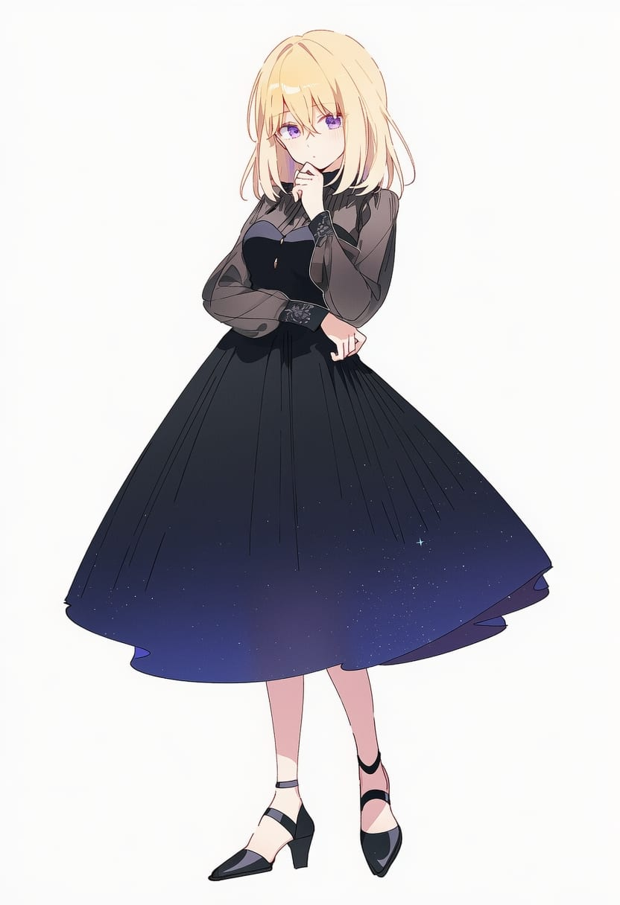

| 字段 | 内容 |
| --- | --- |
| 序号 | 46 |
| Danbooru Tag | thinking |
| 中文名 | 思考 |
| 中文含义 | 正在思考问题的神情。 |
| 子类 | 情绪/基础表情 |
| 角色 | 1girl,misumi_uika |

## 43. unamused — 完全没觉得好笑的冷淡表情。

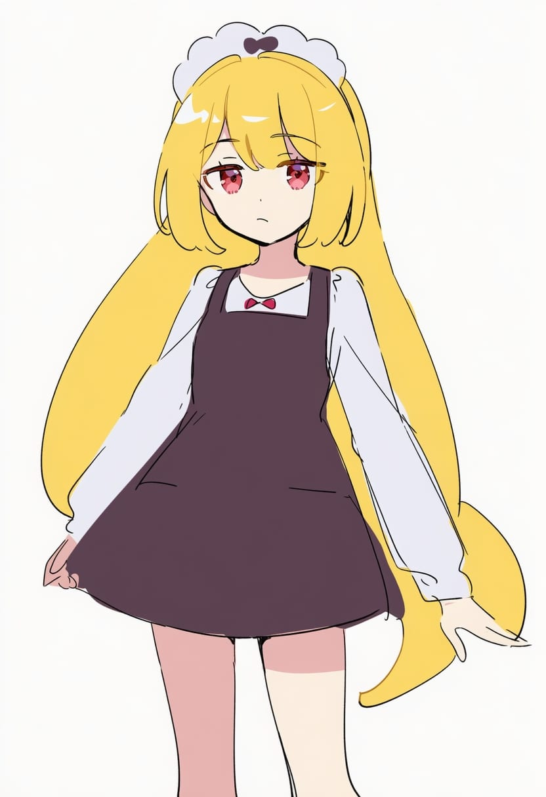

| 字段 | 内容 |
| --- | --- |
| 序号 | 47 |
| Danbooru Tag | unamused |
| 中文名 | 无语 |
| 中文含义 | 完全没觉得好笑的冷淡表情。 |
| 子类 | 情绪/基础表情 |
| 角色 | 1girl,tsurumaki_kokoro |

## 44. shaded_face — 脸被阴影压暗，表现低气压。

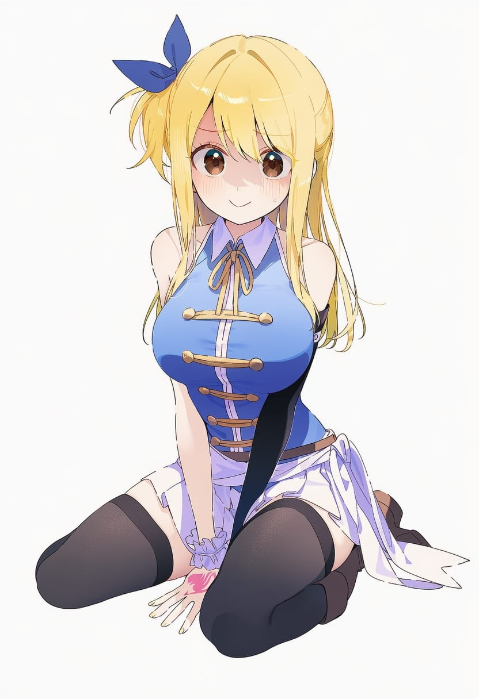

| 字段 | 内容 |
| --- | --- |
| 序号 | 52 |
| Danbooru Tag | shaded_face |
| 中文名 | 阴影脸 |
| 中文含义 | 脸被阴影压暗，表现低气压。 |
| 子类 | 情绪/基础表情 |
| 角色 | 1girl,lucy_heartfilia |

## 45. screaming — 张口大叫、强烈惊恐或激动。

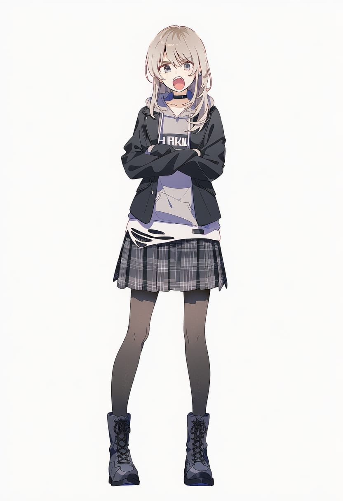

| 字段 | 内容 |
| --- | --- |
| 序号 | 53 |
| Danbooru Tag | screaming |
| 中文名 | 尖叫 |
| 中文含义 | 张口大叫、强烈惊恐或激动。 |
| 子类 | 情绪/基础表情 |
| 角色 | 1girl,kawaragi_momoka |

## 46. sobbing — 哭得很厉害、不断抽泣。

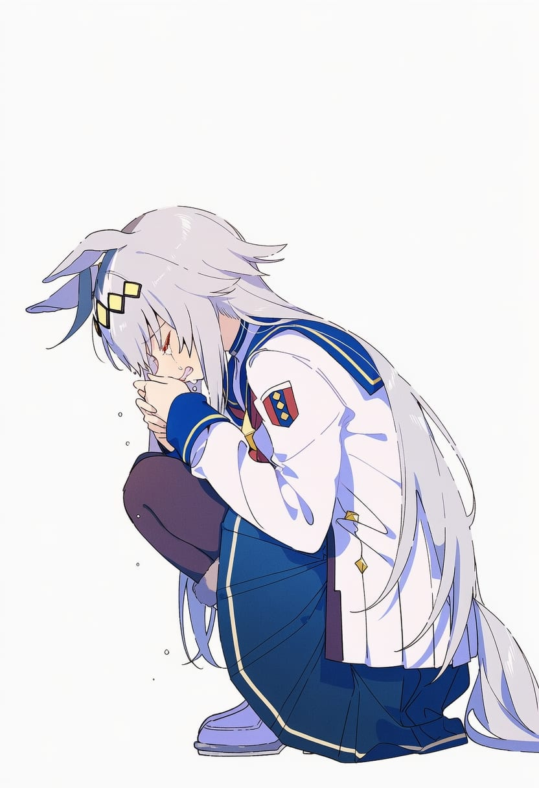

| 字段 | 内容 |
| --- | --- |
| 序号 | 54 |
| Danbooru Tag | sobbing |
| 中文名 | 抽泣 |
| 中文含义 | 哭得很厉害、不断抽泣。 |
| 子类 | 情绪/基础表情 |
| 角色 | 1girl,oguri_cap_(umamusume) |

## 47. tears — 眼睛流出泪水。

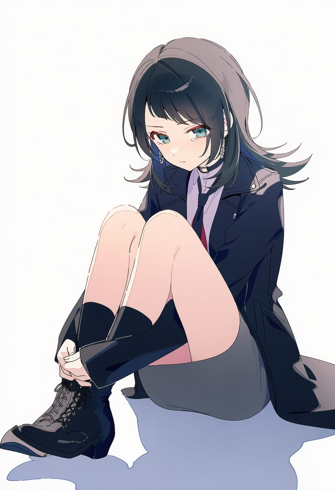

| 字段 | 内容 |
| --- | --- |
| 序号 | 55 |
| Danbooru Tag | tears |
| 中文名 | 流泪 |
| 中文含义 | 眼睛流出泪水。 |
| 子类 | 情绪/基础表情 |
| 角色 | 1girl,yahata_umiri |

## 48. tearing_up — 眼里蓄着泪、快要哭出来。

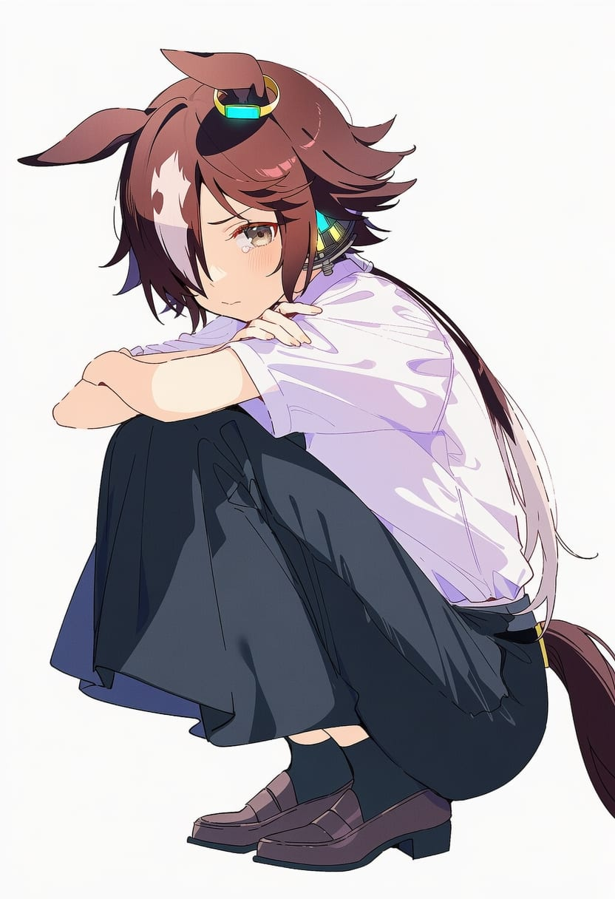

| 字段 | 内容 |
| --- | --- |
| 序号 | 56 |
| Danbooru Tag | tearing_up |
| 中文名 | 眼含泪光 |
| 中文含义 | 眼里蓄着泪、快要哭出来。 |
| 子类 | 情绪/基础表情 |
| 角色 | 1girl,vodka_(umamusume) |

## 49. nosebleed — 因激动等原因出现鼻血。

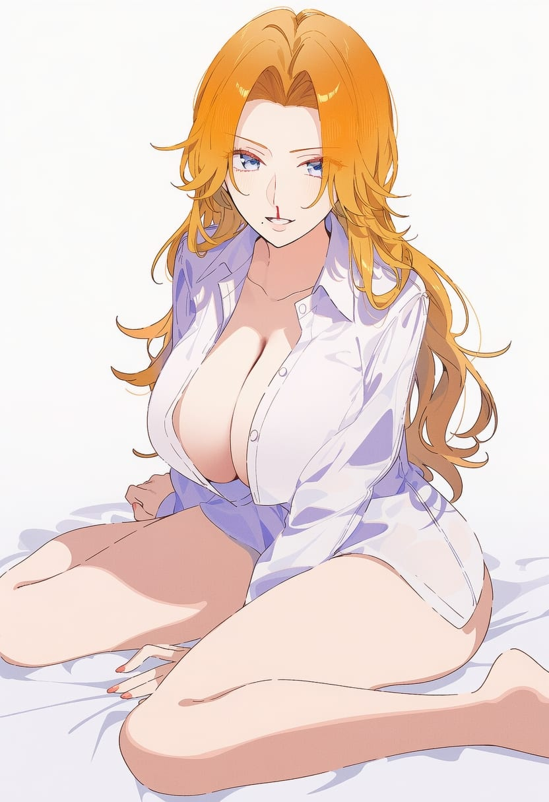

| 字段 | 内容 |
| --- | --- |
| 序号 | 57 |
| Danbooru Tag | nosebleed |
| 中文名 | 鼻血 |
| 中文含义 | 因激动等原因出现鼻血。 |
| 子类 | 情绪/基础表情 |
| 角色 | 1girl,matsumoto_rangiku |

## 50. sigh — 无奈或疲惫地叹气。

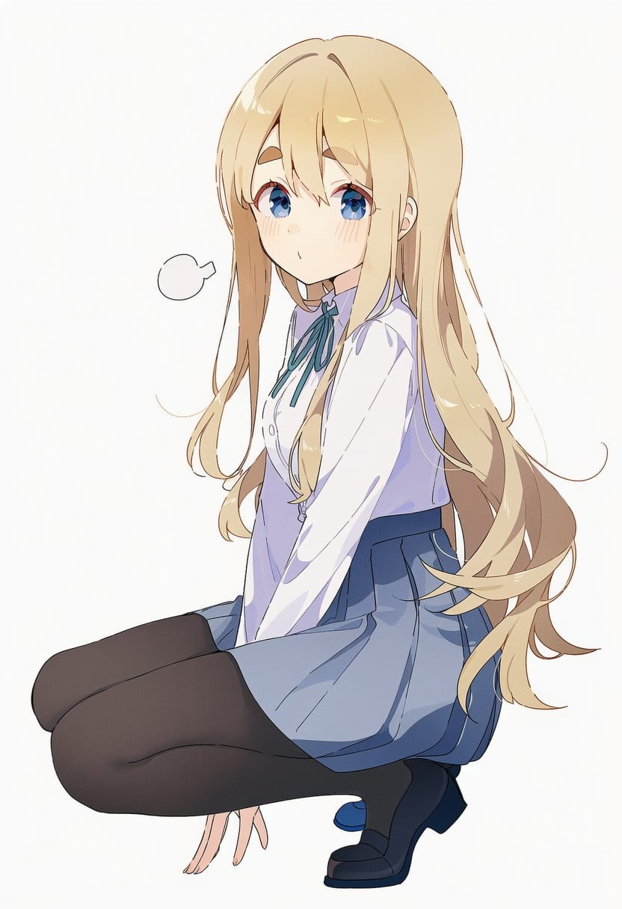

| 字段 | 内容 |
| --- | --- |
| 序号 | 58 |
| Danbooru Tag | sigh |
| 中文名 | 叹气 |
| 中文含义 | 无奈或疲惫地叹气。 |
| 子类 | 情绪/基础表情 |
| 角色 | 1girl,kotobuki_tsumugi |

## 51. anger_vein — 漫画式爆青筋愤怒符号。

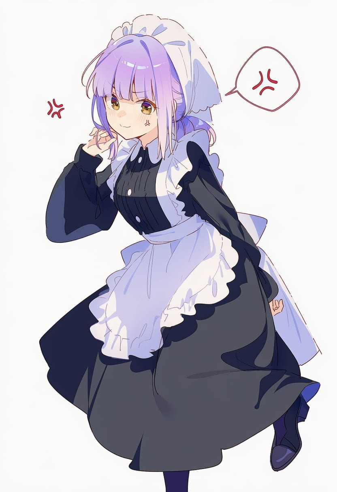

| 字段 | 内容 |
| --- | --- |
| 序号 | 59 |
| Danbooru Tag | anger_vein |
| 中文名 | 怒筋 |
| 中文含义 | 漫画式爆青筋愤怒符号。 |
| 子类 | 情绪/基础表情 |
| 角色 | 1girl,twin_turbo_(umamusume) |

## 52. sweatdrop — 漫画式大汗滴，表示尴尬或无语。

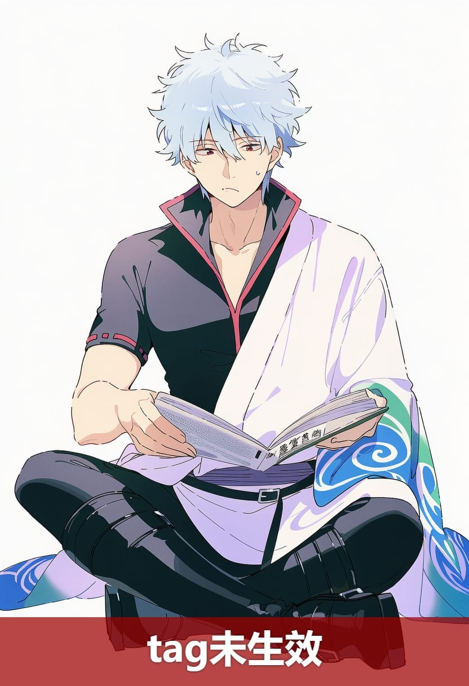

| 字段 | 内容 |
| --- | --- |
| 序号 | 60 |
| Danbooru Tag | sweatdrop |
| 中文名 | 汗滴 |
| 中文含义 | 漫画式大汗滴，表示尴尬或无语。 |
| 子类 | 情绪/基础表情 |
| 角色 | 1boy,sakata_gintoki |

## 53. small_sweatdrop — 较小的漫画汗滴。

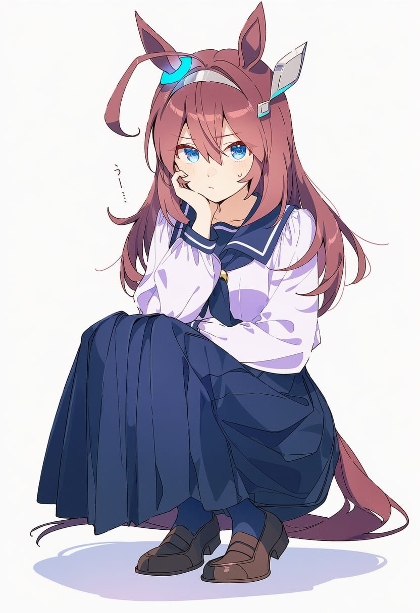

| 字段 | 内容 |
| --- | --- |
| 序号 | 61 |
| Danbooru Tag | small_sweatdrop |
| 中文名 | 小汗滴 |
| 中文含义 | 较小的漫画汗滴。 |
| 子类 | 情绪/基础表情 |
| 角色 | 1girl,mihono_bourbon_(umamusume) |

## 54. comedic_sweatdrop — 夸张漫画汗滴，强调尴尬或吐槽。

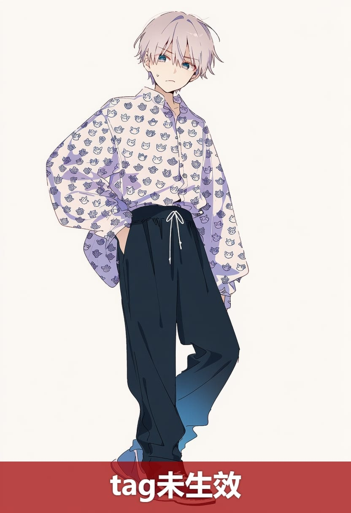

| 字段 | 内容 |
| --- | --- |
| 序号 | 62 |
| Danbooru Tag | comedic_sweatdrop |
| 中文名 | 搞笑汗滴 |
| 中文含义 | 夸张漫画汗滴，强调尴尬或吐槽。 |
| 子类 | 情绪/基础表情 |
| 角色 | 1boy,usopp |

## 55. flying_sweatdrops — 多颗汗滴向外飞散的夸张表现。

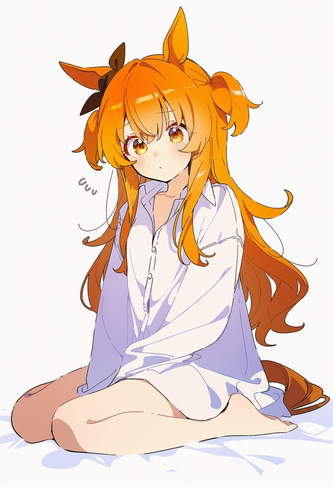

| 字段 | 内容 |
| --- | --- |
| 序号 | 63 |
| Danbooru Tag | flying_sweatdrops |
| 中文名 | 飞散汗滴 |
| 中文含义 | 多颗汗滴向外飞散的夸张表现。 |
| 子类 | 情绪/基础表情 |
| 角色 | 1girl,mayano_top_gun_(umamusume) |

## 56. sweat — 脸部或身体明显冒汗。

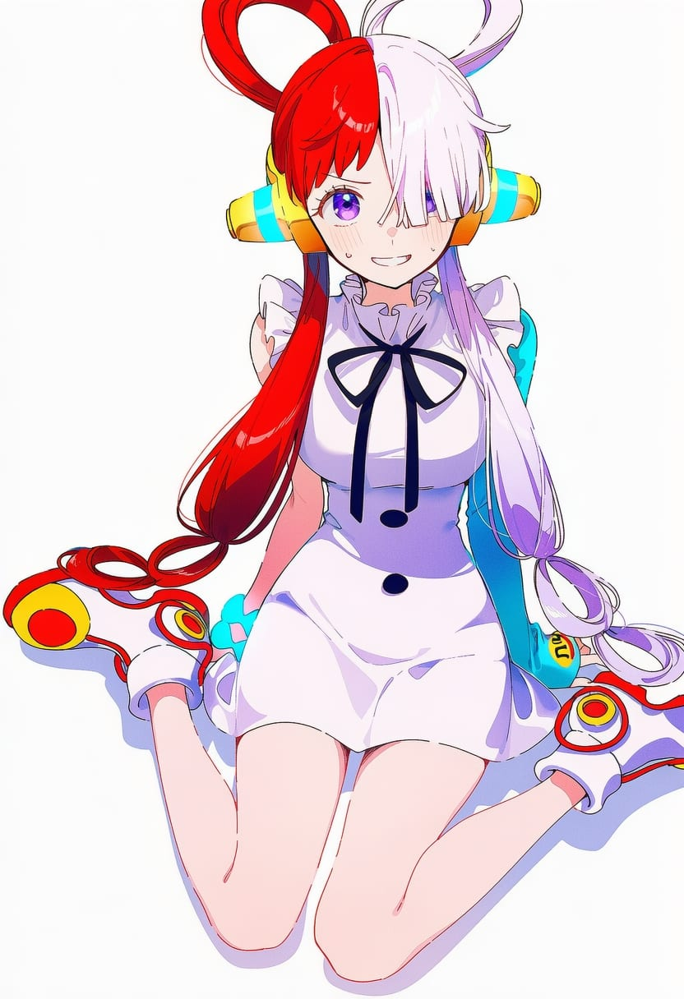

| 字段 | 内容 |
| --- | --- |
| 序号 | 64 |
| Danbooru Tag | sweat |
| 中文名 | 出汗 |
| 中文含义 | 脸部或身体明显冒汗。 |
| 子类 | 情绪/基础表情 |
| 角色 | 1girl,uta_(one_piece) |

## 57. snot — 鼻子流出鼻涕，常用于哭泣或搞笑。

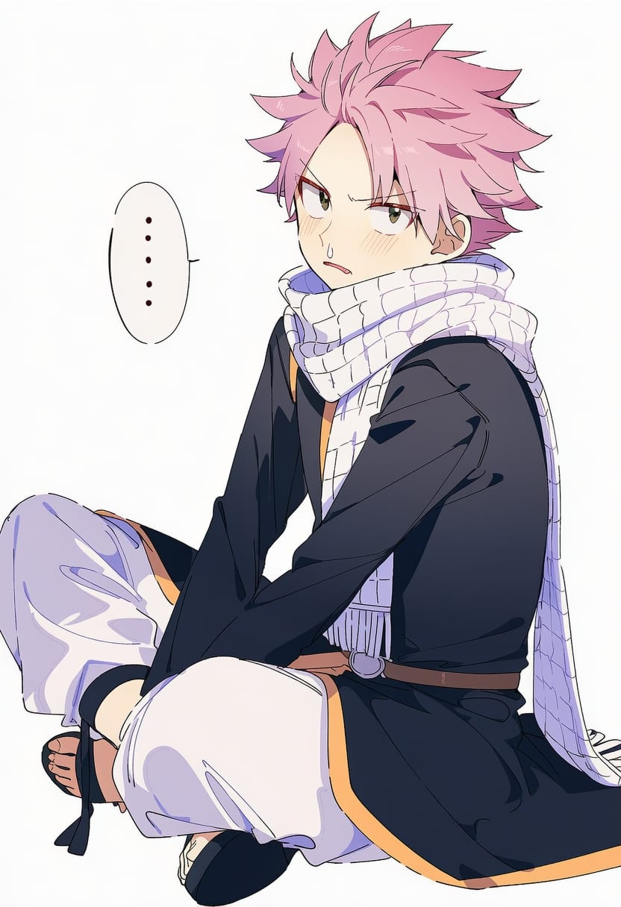

| 字段 | 内容 |
| --- | --- |
| 序号 | 65 |
| Danbooru Tag | snot |
| 中文名 | 鼻涕 |
| 中文含义 | 鼻子流出鼻涕，常用于哭泣或搞笑。 |
| 子类 | 情绪/基础表情 |
| 角色 | 1boy,natsu_dragneel |

## 58. smile — 嘴角上扬的普通笑容。

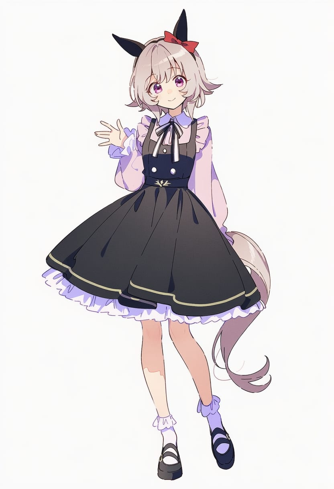

| 字段 | 内容 |
| --- | --- |
| 序号 | 66 |
| Danbooru Tag | smile |
| 中文名 | 微笑 / 笑容 |
| 中文含义 | 嘴角上扬的普通笑容。 |
| 子类 | 笑容/得意/特殊表情 |
| 角色 | 1girl,curren_chan_(umamusume) |

## 59. light_smile — 幅度很轻的柔和微笑。

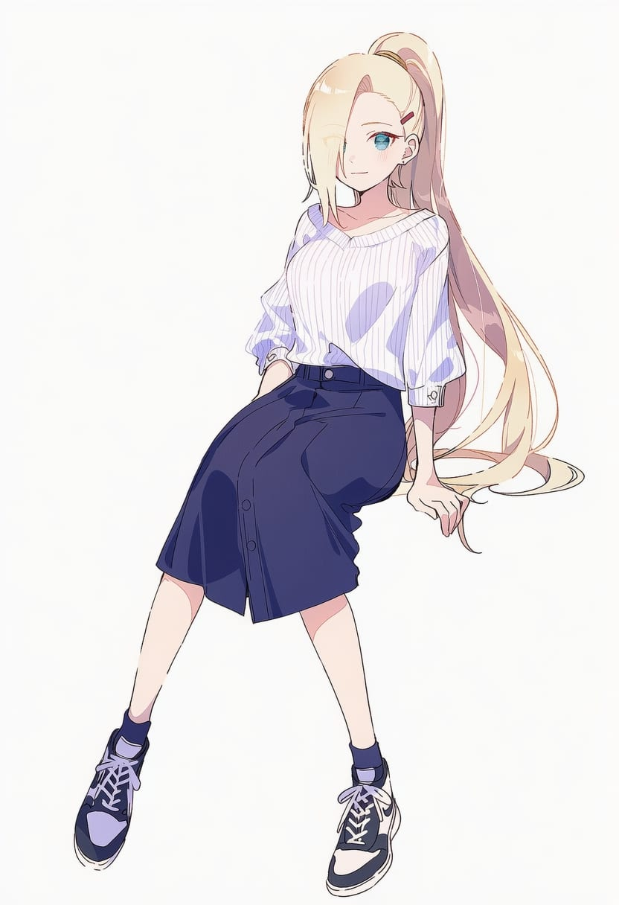

| 字段 | 内容 |
| --- | --- |
| 序号 | 67 |
| Danbooru Tag | light_smile |
| 中文名 | 浅笑 |
| 中文含义 | 幅度很轻的柔和微笑。 |
| 子类 | 笑容/得意/特殊表情 |
| 角色 | 1girl,yamanaka_ino |

## 60. grin — 张嘴或露齿的明显笑容。

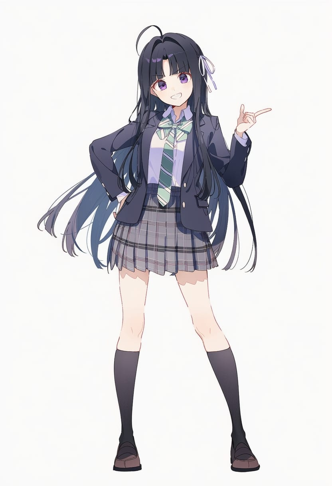

| 字段 | 内容 |
| --- | --- |
| 序号 | 68 |
| Danbooru Tag | grin |
| 中文名 | 露齿笑 |
| 中文含义 | 张嘴或露齿的明显笑容。 |
| 子类 | 笑容/得意/特殊表情 |
| 角色 | 1girl,awa_subaru |

## 61. evil_smile — 带恶意或阴谋感的笑容。

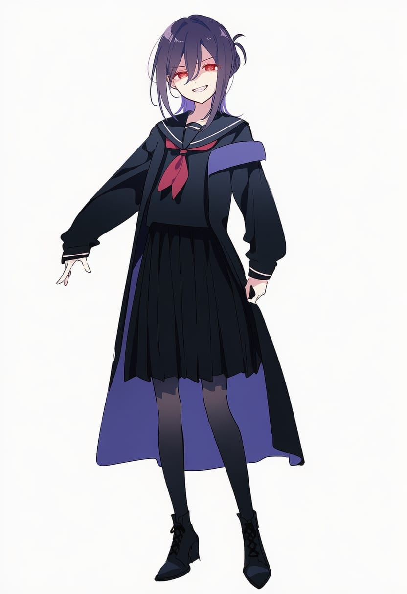

| 字段 | 内容 |
| --- | --- |
| 序号 | 69 |
| Danbooru Tag | evil_smile |
| 中文名 | 邪恶微笑 |
| 中文含义 | 带恶意或阴谋感的笑容。 |
| 子类 | 笑容/得意/特殊表情 |
| 角色 | 1girl,kaname_raana |

## 62. evil_grin — 露齿、带恶意的夸张笑容。

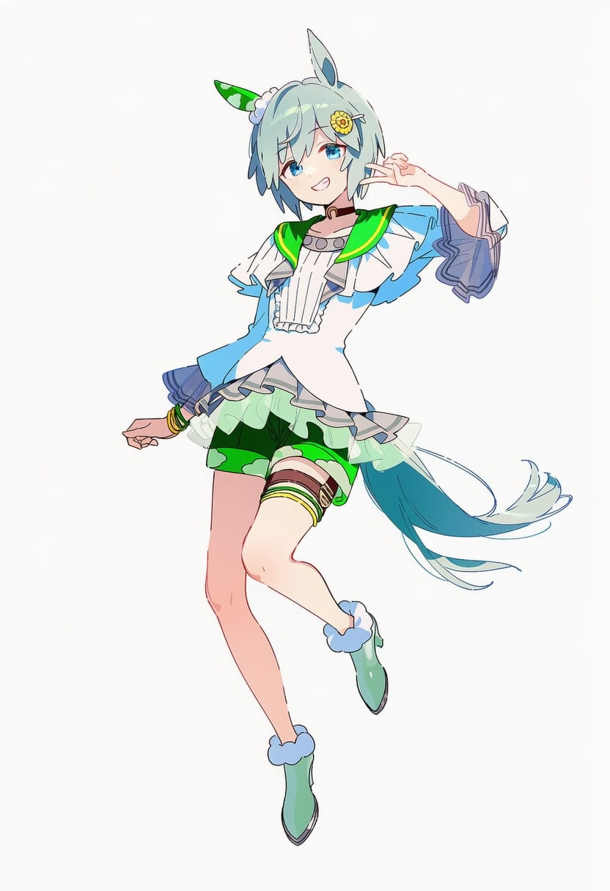

| 字段 | 内容 |
| --- | --- |
| 序号 | 70 |
| Danbooru Tag | evil_grin |
| 中文名 | 邪恶露齿笑 |
| 中文含义 | 露齿、带恶意的夸张笑容。 |
| 子类 | 笑容/得意/特殊表情 |
| 角色 | 1girl,seiun_sky_(umamusume) |

## 63. crazy_smile — 精神亢奋或失控的笑容。

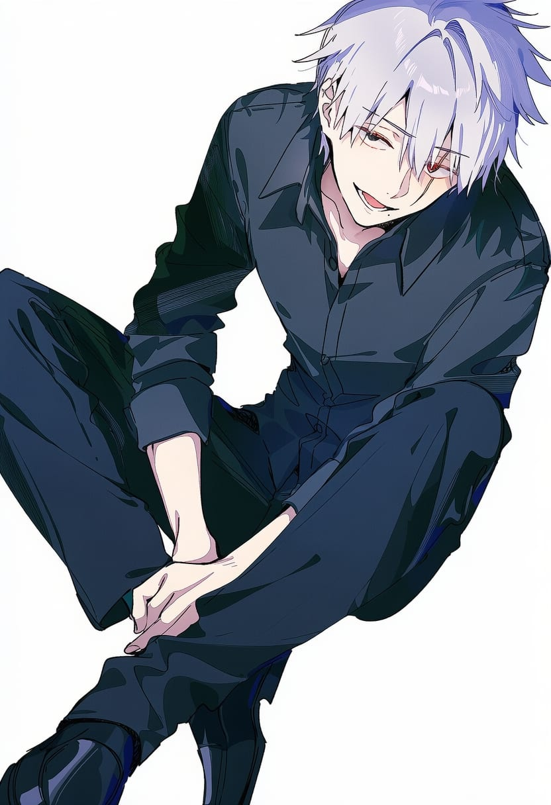

| 字段 | 内容 |
| --- | --- |
| 序号 | 71 |
| Danbooru Tag | crazy_smile |
| 中文名 | 疯狂笑容 |
| 中文含义 | 精神亢奋或失控的笑容。 |
| 子类 | 笑容/得意/特殊表情 |
| 角色 | 1boy,hatake_kakashi |

## 64. forced_smile — 明显勉强挤出来的笑容。

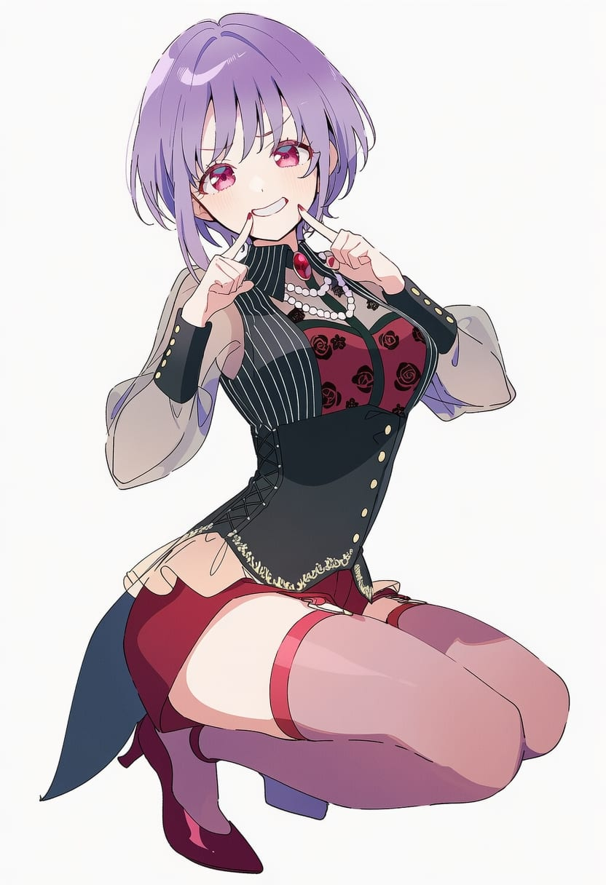

| 字段 | 内容 |
| --- | --- |
| 序号 | 72 |
| Danbooru Tag | forced_smile |
| 中文名 | 强颜欢笑 |
| 中文含义 | 明显勉强挤出来的笑容。 |
| 子类 | 笑容/得意/特殊表情 |
| 角色 | 1girl,yuutenji_nyamu |

## 65. sad_smile — 带难过情绪的笑容。

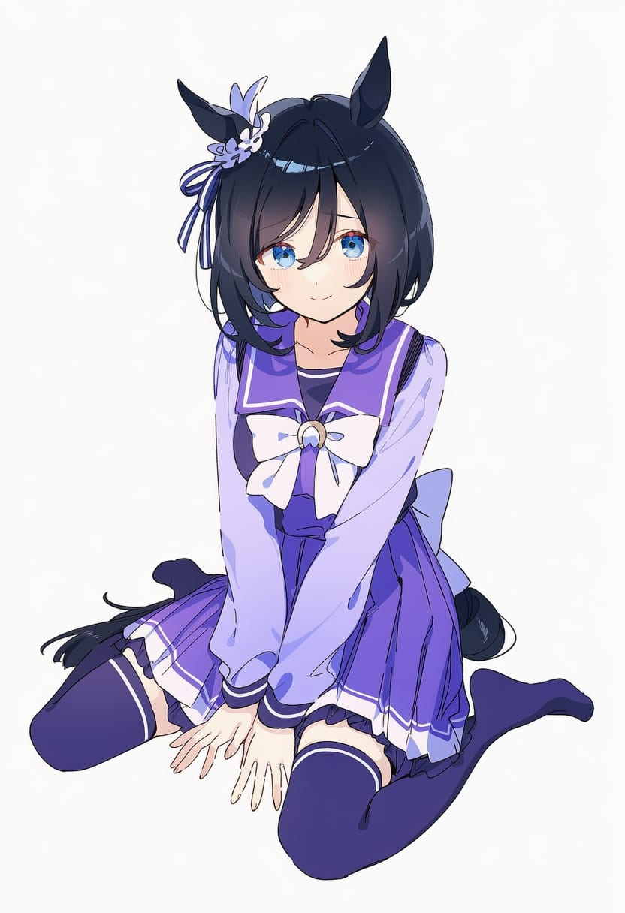

| 字段 | 内容 |
| --- | --- |
| 序号 | 73 |
| Danbooru Tag | sad_smile |
| 中文名 | 悲伤微笑 |
| 中文含义 | 带难过情绪的笑容。 |
| 子类 | 笑容/得意/特殊表情 |
| 角色 | 1girl,eishin_flash_(umamusume) |

## 66. seductive_smile — 带挑逗或诱惑感的笑容。

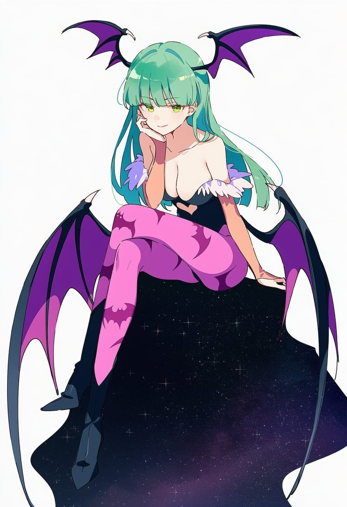

| 字段 | 内容 |
| --- | --- |
| 序号 | 74 |
| Danbooru Tag | seductive_smile |
| 中文名 | 诱惑微笑 |
| 中文含义 | 带挑逗或诱惑感的笑容。 |
| 子类 | 笑容/得意/特殊表情 |
| 角色 | 1girl,morrigan_aensland |

## 67. stifled_laugh — 努力忍住笑意。

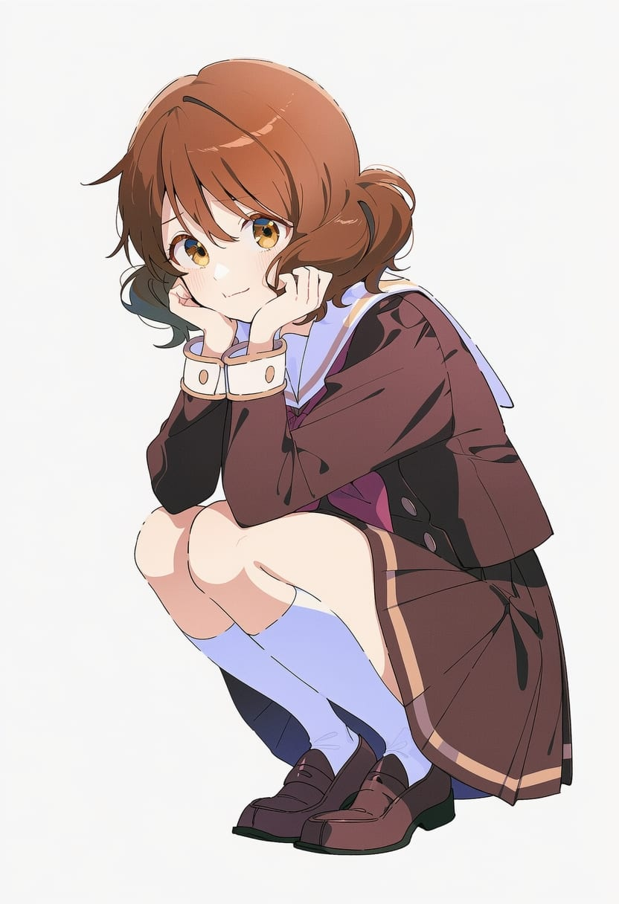

| 字段 | 内容 |
| --- | --- |
| 序号 | 75 |
| Danbooru Tag | stifled_laugh |
| 中文名 | 憋笑 |
| 中文含义 | 努力忍住笑意。 |
| 子类 | 笑容/得意/特殊表情 |
| 角色 | 1girl,oumae_kumiko |

## 68. laughing — 明显正在笑出声。

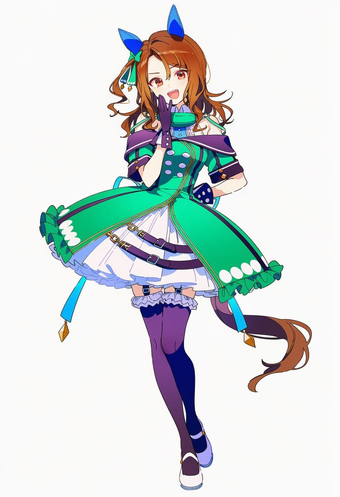

| 字段 | 内容 |
| --- | --- |
| 序号 | 76 |
| Danbooru Tag | laughing |
| 中文名 | 大笑 |
| 中文含义 | 明显正在笑出声。 |
| 子类 | 笑容/得意/特殊表情 |
| 角色 | 1girl,king_halo_(umamusume) |

## 69. smirk — 单侧嘴角上扬的得意笑。

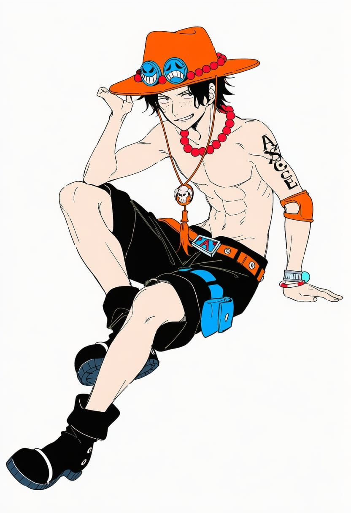

| 字段 | 内容 |
| --- | --- |
| 序号 | 77 |
| Danbooru Tag | smirk |
| 中文名 | 坏笑 / 歪嘴笑 |
| 中文含义 | 单侧嘴角上扬的得意笑。 |
| 子类 | 笑容/得意/特殊表情 |
| 角色 | 1boy,portgas_d._ace |

## 70. smug — 自鸣得意、胸有成竹。

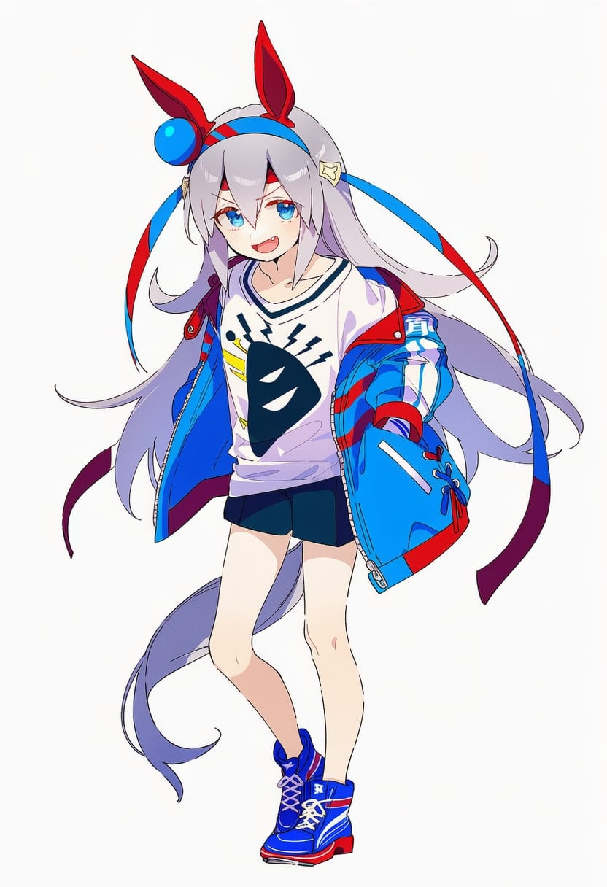

| 字段 | 内容 |
| --- | --- |
| 序号 | 78 |
| Danbooru Tag | smug |
| 中文名 | 得意脸 |
| 中文含义 | 自鸣得意、胸有成竹。 |
| 子类 | 笑容/得意/特殊表情 |
| 角色 | 1girl,tamamo_cross_(umamusume) |

## 71. doyagao — 日式夸张得意脸。

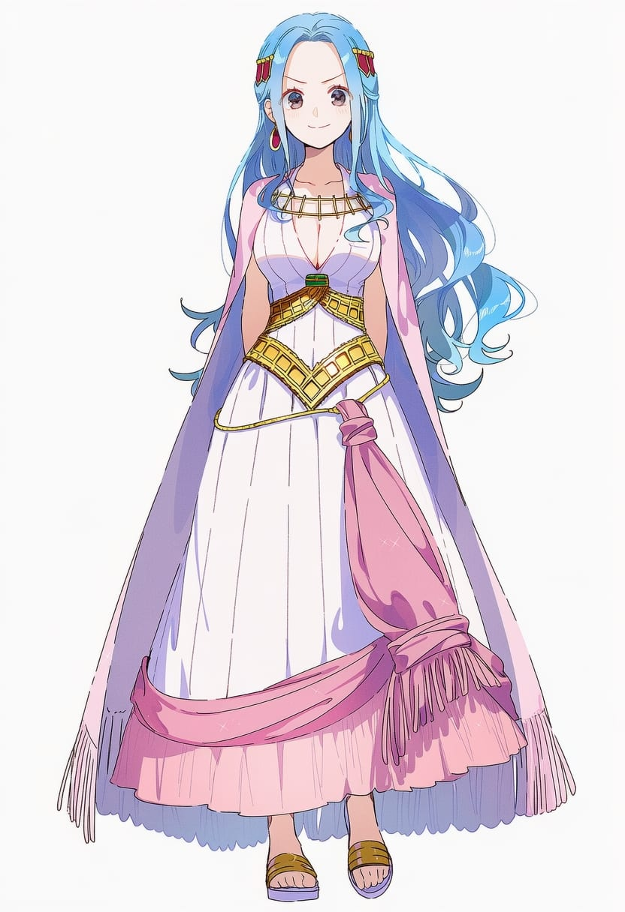

| 字段 | 内容 |
| --- | --- |
| 序号 | 79 |
| Danbooru Tag | doyagao |
| 中文名 | 得意颜 |
| 中文含义 | 日式夸张得意脸。 |
| 子类 | 笑容/得意/特殊表情 |
| 角色 | 1girl,nefertari_vivi |

## 72. naughty_face — 带调戏、恶作剧感的表情。

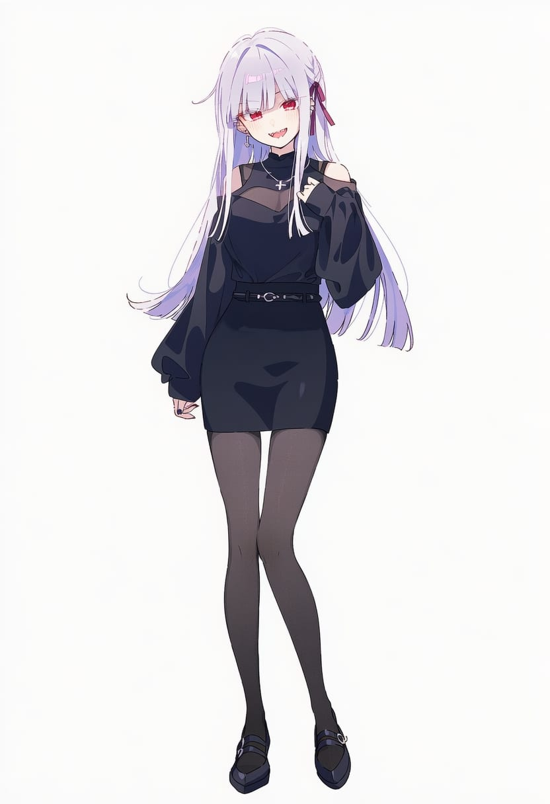

| 字段 | 内容 |
| --- | --- |
| 序号 | 81 |
| Danbooru Tag | naughty_face |
| 中文名 | 坏坏脸 |
| 中文含义 | 带调戏、恶作剧感的表情。 |
| 子类 | 笑容/得意/特殊表情 |
| 角色 | 1girl,zdrada_(helltaker) |

## 73. aroused — 带明显性兴奋或欲望的神情。

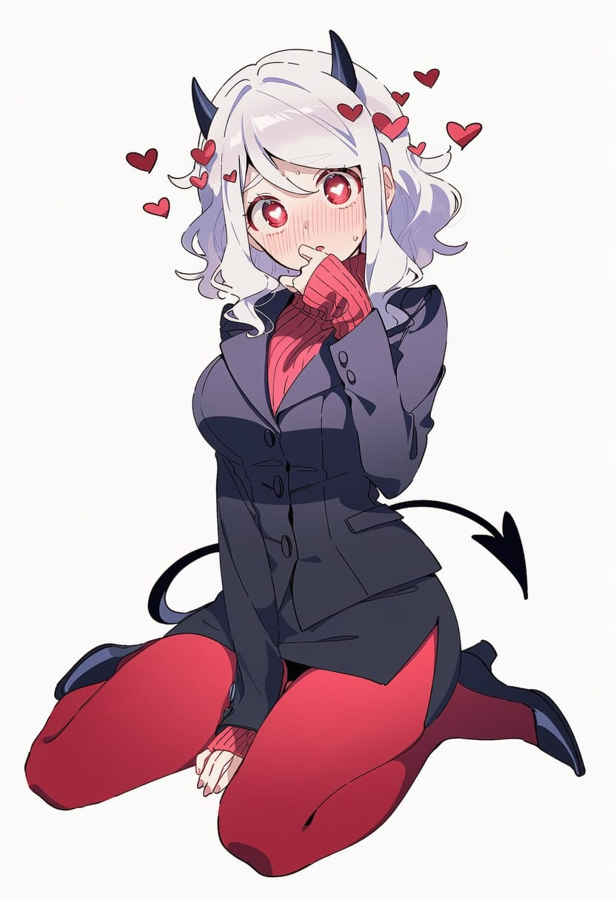

| 字段 | 内容 |
| --- | --- |
| 序号 | 86 |
| Danbooru Tag | aroused |
| 中文名 | 兴奋脸 |
| 中文含义 | 带明显性兴奋或欲望的神情。 |
| 子类 | 笑容/得意/特殊表情 |
| 角色 | 1girl,modeus_(helltaker) |

## 74. foodgasm — 吃到美食后极度满足陶醉。

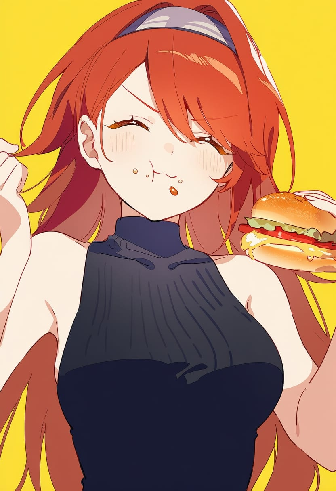

| 字段 | 内容 |
| --- | --- |
| 序号 | 87 |
| Danbooru Tag | foodgasm |
| 中文名 | 美食陶醉脸 |
| 中文含义 | 吃到美食后极度满足陶醉。 |
| 子类 | 笑容/得意/特殊表情 |
| 角色 | 1boy,donquixote_doflamingo |

## 75. closed_eyes — 双眼闭合。

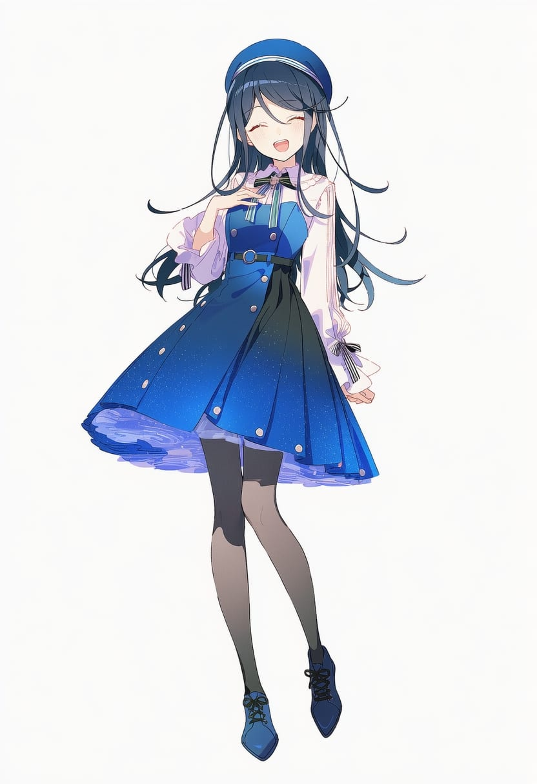

| 字段 | 内容 |
| --- | --- |
| 序号 | 94 |
| Danbooru Tag | closed_eyes |
| 中文名 | 闭眼 |
| 中文含义 | 双眼闭合。 |
| 子类 | 眼部表情/眼型 |
| 角色 | 1girl,hoshino_ichika_(project_sekai) |

## 76. one_eye_closed — 只闭上一只眼，常见于眨眼。

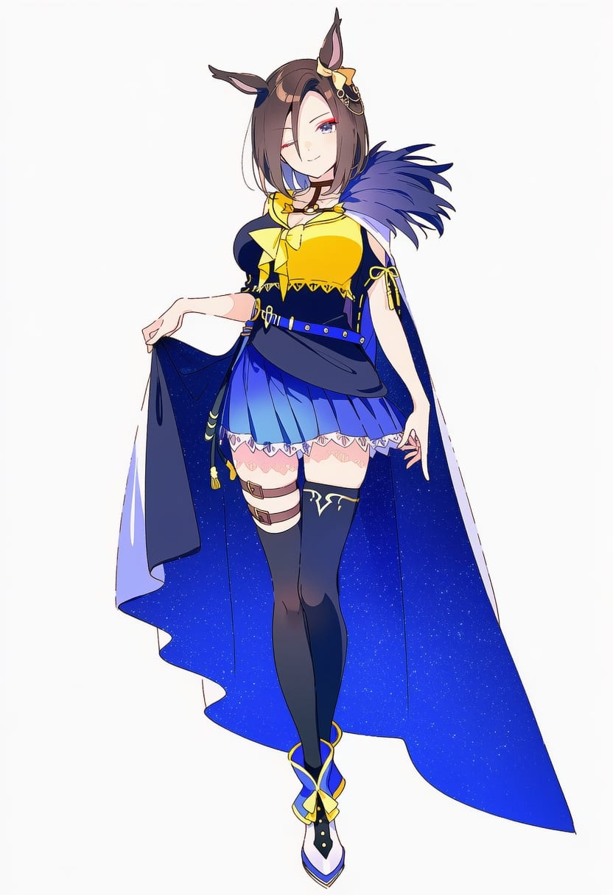

| 字段 | 内容 |
| --- | --- |
| 序号 | 95 |
| Danbooru Tag | one_eye_closed |
| 中文名 | 单眼闭合 |
| 中文含义 | 只闭上一只眼，常见于眨眼。 |
| 子类 | 眼部表情/眼型 |
| 角色 | 1girl,air_groove_(umamusume) |

## 77. blinking — 正在眨眼的瞬间。

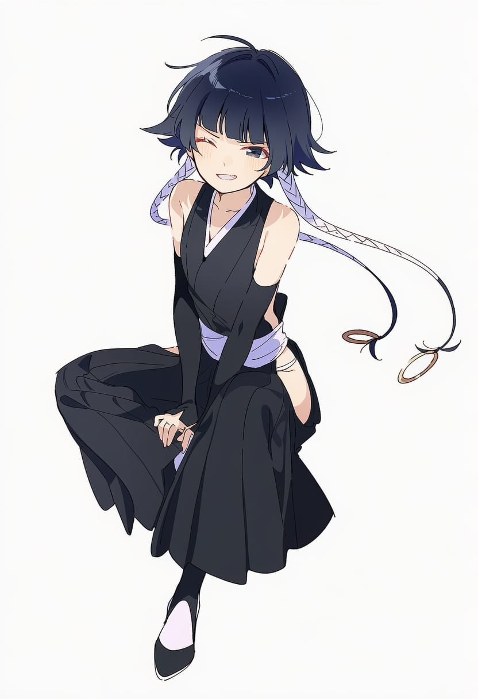

| 字段 | 内容 |
| --- | --- |
| 序号 | 96 |
| Danbooru Tag | blinking |
| 中文名 | 眨眼 |
| 中文含义 | 正在眨眼的瞬间。 |
| 子类 | 眼部表情/眼型 |
| 角色 | 1girl,sui-feng |

## 78. half-closed_eyes — 眼睛半睁半闭。

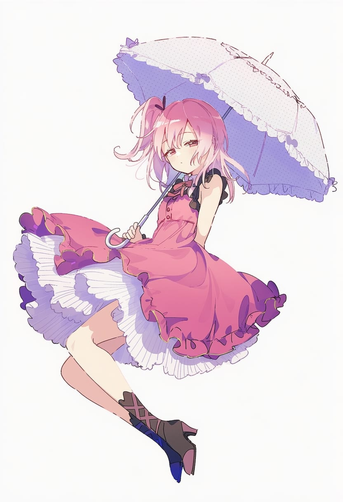

| 字段 | 内容 |
| --- | --- |
| 序号 | 97 |
| Danbooru Tag | half-closed_eyes |
| 中文名 | 半闭眼 |
| 中文含义 | 眼睛半睁半闭。 |
| 子类 | 眼部表情/眼型 |
| 角色 | 1girl,mitake_ran |

## 79. narrowed_eyes — 眼睛明显收窄。

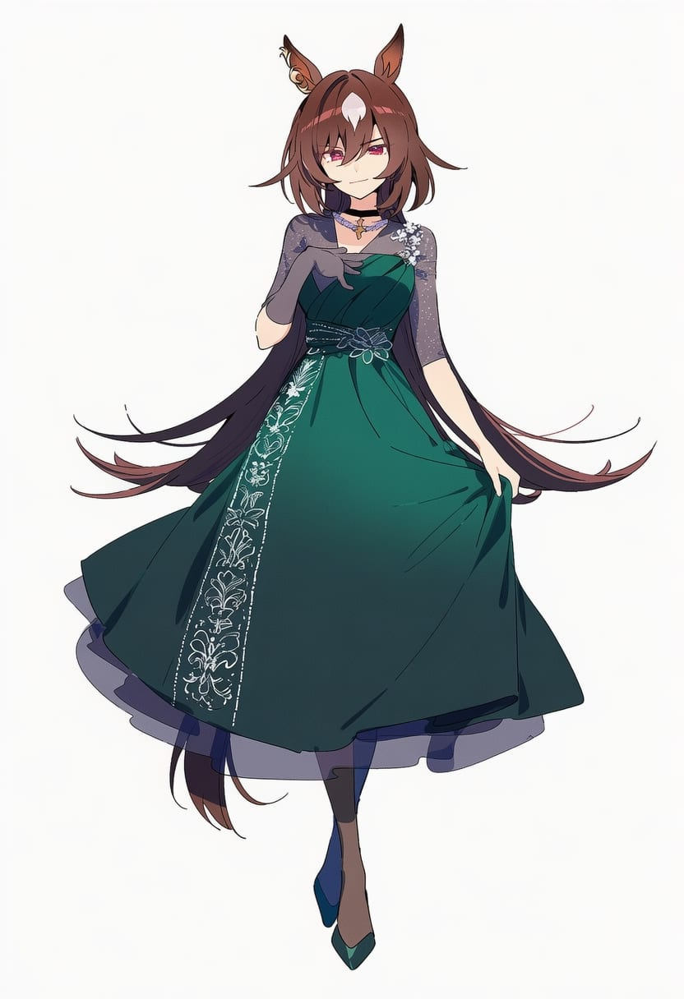

| 字段 | 内容 |
| --- | --- |
| 序号 | 98 |
| Danbooru Tag | narrowed_eyes |
| 中文名 | 眯眼 |
| 中文含义 | 眼睛明显收窄。 |
| 子类 | 眼部表情/眼型 |
| 角色 | 1girl,sirius_symboli_(umamusume) |

## 80. wide-eyed — 双眼睁得很大。

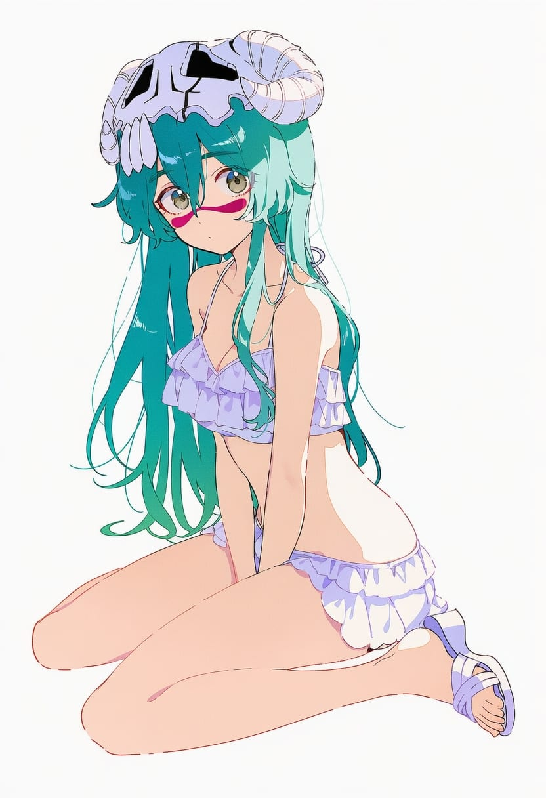

| 字段 | 内容 |
| --- | --- |
| 序号 | 99 |
| Danbooru Tag | wide-eyed |
| 中文名 | 瞪大眼 |
| 中文含义 | 双眼睁得很大。 |
| 子类 | 眼部表情/眼型 |
| 角色 | 1girl,nelliel_tu_odelschwanck |

## 81. squinting — 用力眯起眼睛看。

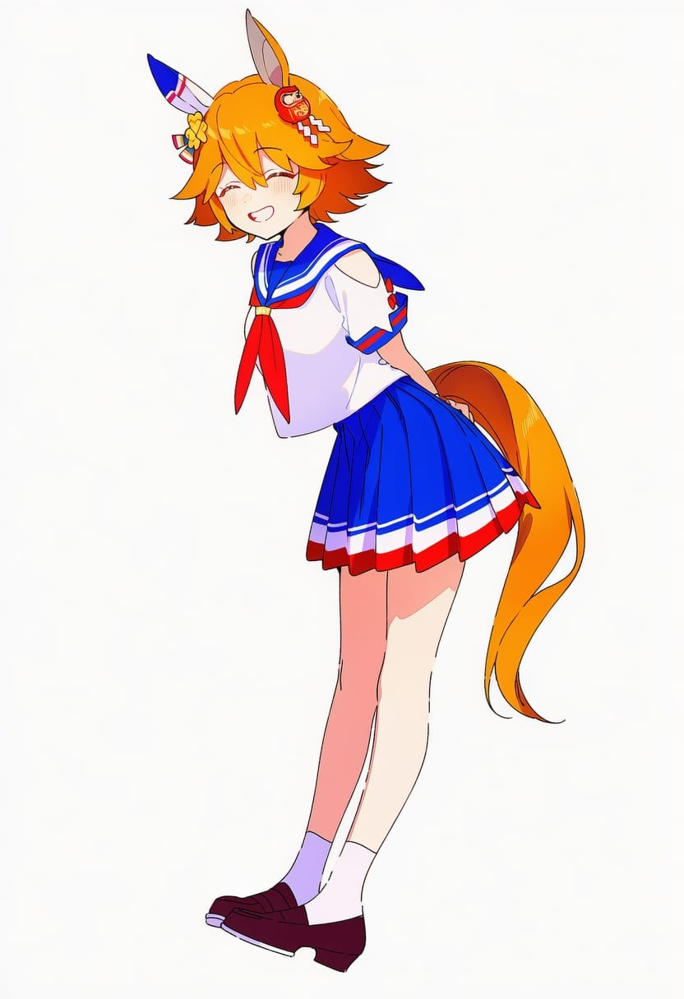

| 字段 | 内容 |
| --- | --- |
| 序号 | 101 |
| Danbooru Tag | squinting |
| 中文名 | 眯缝眼 |
| 中文含义 | 用力眯起眼睛看。 |
| 子类 | 眼部表情/眼型 |
| 角色 | 1girl,matikanefukukitaru_(umamusume) |

## 82. rolling_eyes — 眼珠向上翻或翻眼。

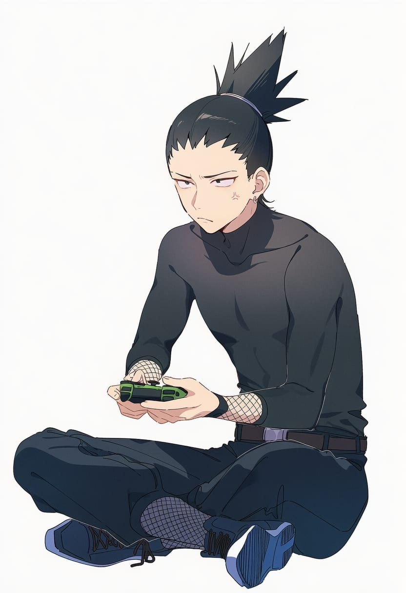

| 字段 | 内容 |
| --- | --- |
| 序号 | 104 |
| Danbooru Tag | rolling_eyes |
| 中文名 | 翻白眼 |
| 中文含义 | 眼珠向上翻或翻眼。 |
| 子类 | 眼部表情/眼型 |
| 角色 | 1boy,nara_shikamaru |

## 83. averting_eyes — 眼神刻意避开对方。

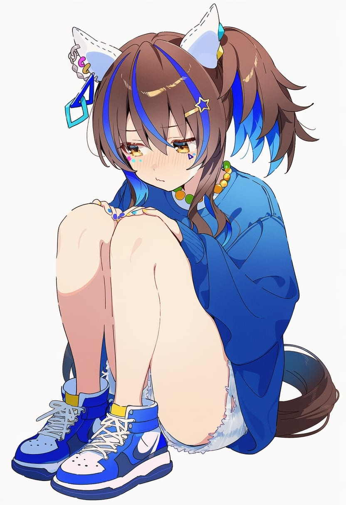

| 字段 | 内容 |
| --- | --- |
| 序号 | 109 |
| Danbooru Tag | averting_eyes |
| 中文名 | 移开视线 |
| 中文含义 | 眼神刻意避开对方。 |
| 子类 | 眼部表情/眼型 |
| 角色 | 1girl,daitaku_helios_(umamusume) |

## 84. sideways_glance — 只转动眼睛向侧面看。

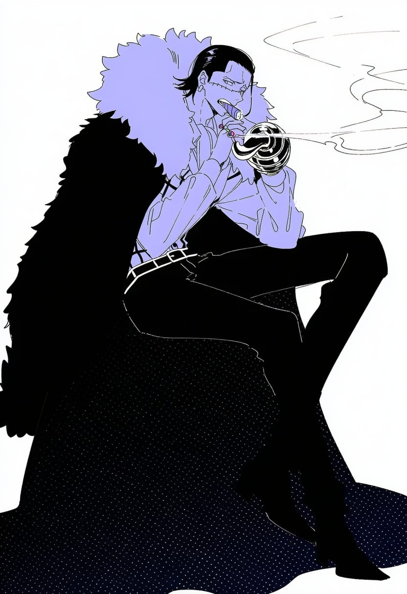

| 字段 | 内容 |
| --- | --- |
| 序号 | 110 |
| Danbooru Tag | sideways_glance |
| 中文名 | 侧眼看 |
| 中文含义 | 只转动眼睛向侧面看。 |
| 子类 | 眼部表情/眼型 |
| 角色 | 1boy,crocodile_(one_piece) |

## 85. pleading_eyes — 眼神可怜、像在请求。

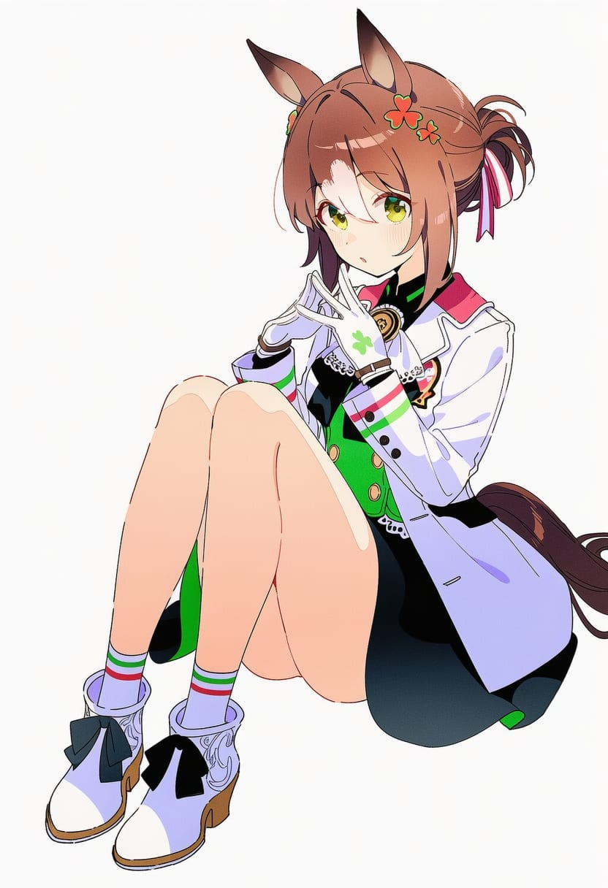

| 字段 | 内容 |
| --- | --- |
| 序号 | 112 |
| Danbooru Tag | pleading_eyes |
| 中文名 | 恳求眼 |
| 中文含义 | 眼神可怜、像在请求。 |
| 子类 | 眼部表情/眼型 |
| 角色 | 1girl,fine_motion_(umamusume) |

## 86. crazy_eyes — 眼神失控、狂气明显。

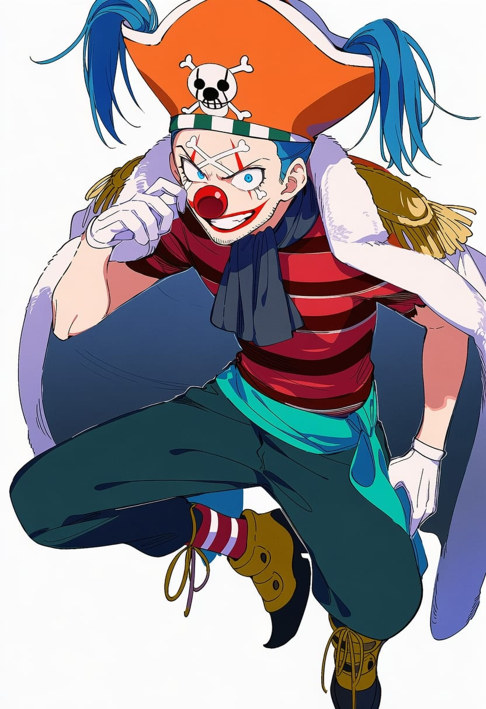

| 字段 | 内容 |
| --- | --- |
| 序号 | 113 |
| Danbooru Tag | crazy_eyes |
| 中文名 | 疯狂眼 |
| 中文含义 | 眼神失控、狂气明显。 |
| 子类 | 眼部表情/眼型 |
| 角色 | 1boy,buggy_the_clown |

## 87. empty_eyes — 眼神空洞、没有神采。

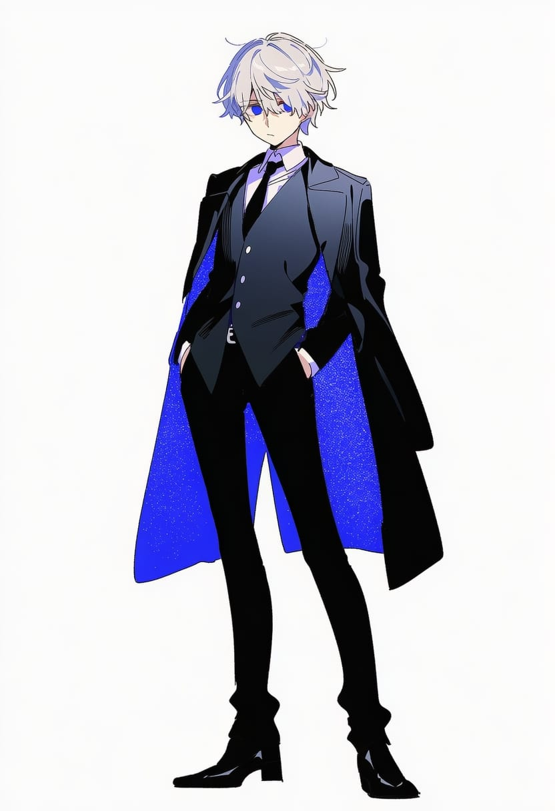

| 字段 | 内容 |
| --- | --- |
| 序号 | 114 |
| Danbooru Tag | empty_eyes |
| 中文名 | 空洞眼 |
| 中文含义 | 眼神空洞、没有神采。 |
| 子类 | 眼部表情/眼型 |
| 角色 | 1boy,franky_(one_piece) |

## 88. sparkling_eyes — 眼睛闪亮，表现期待或兴奋。

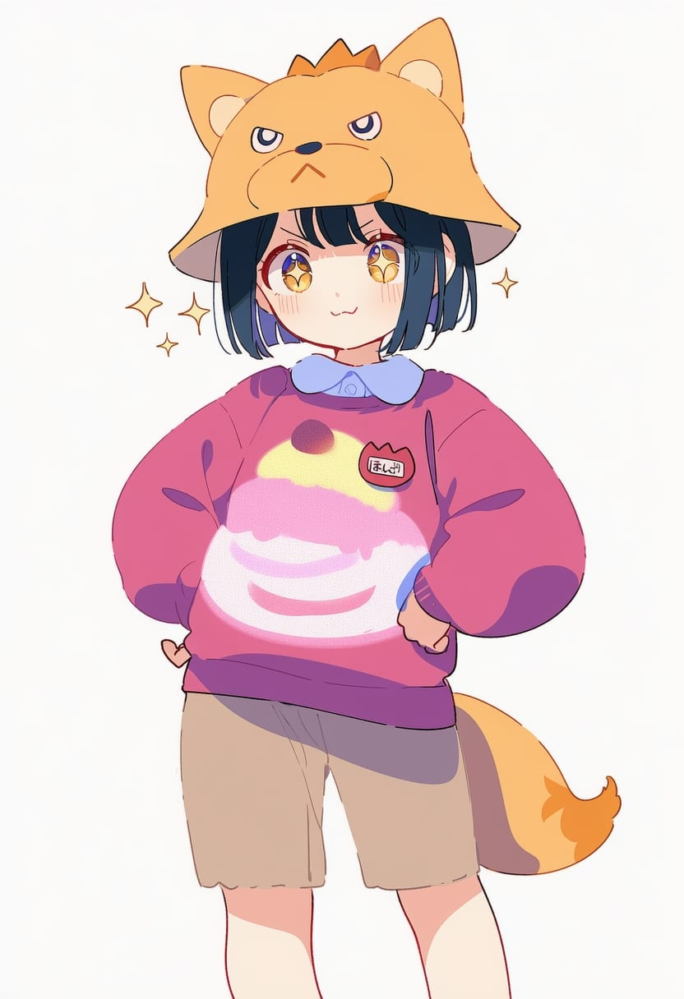

| 字段 | 内容 |
| --- | --- |
| 序号 | 115 |
| Danbooru Tag | sparkling_eyes |
| 中文名 | 闪闪发光眼 |
| 中文含义 | 眼睛闪亮，表现期待或兴奋。 |
| 子类 | 眼部表情/眼型 |
| 角色 | 1girl,kasaki_nozomi |

## 89. heart-shaped_eyes — 整只眼睛画成爱心形。

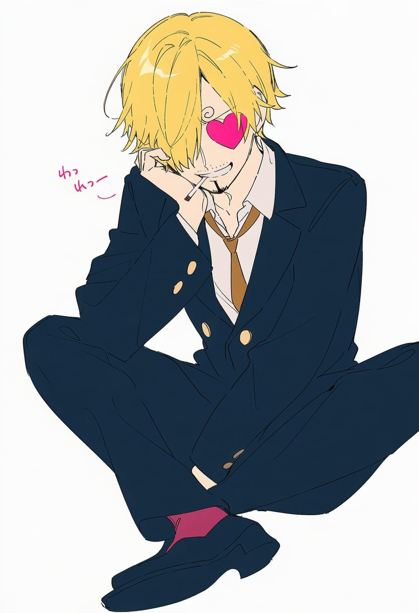

| 字段 | 内容 |
| --- | --- |
| 序号 | 116 |
| Danbooru Tag | heart-shaped_eyes |
| 中文名 | 爱心眼 |
| 中文含义 | 整只眼睛画成爱心形。 |
| 子类 | 眼部表情/眼型 |
| 角色 | 1boy,sanji_(one_piece) |

## 90. spiral-only_eyes — 眼睛用螺旋线表现眩晕或混乱。

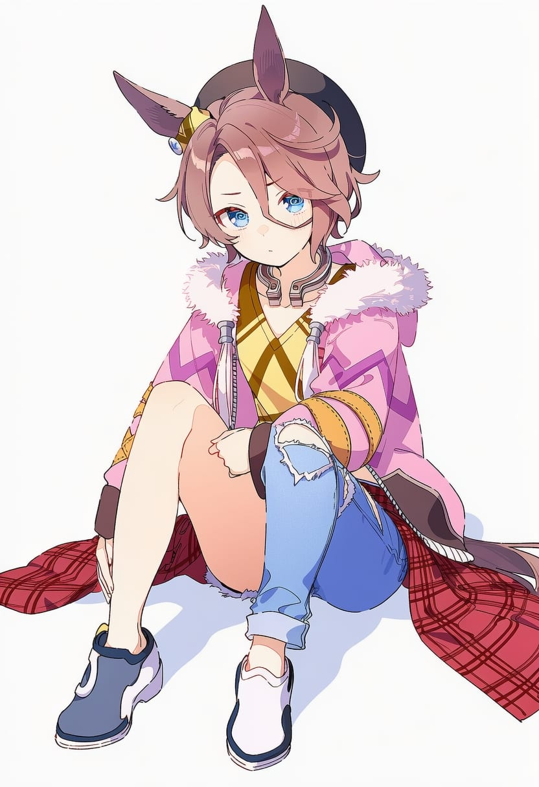

| 字段 | 内容 |
| --- | --- |
| 序号 | 117 |
| Danbooru Tag | spiral-only_eyes |
| 中文名 | 螺旋眼 |
| 中文含义 | 眼睛用螺旋线表现眩晕或混乱。 |
| 子类 | 眼部表情/眼型 |
| 角色 | 1girl,narita_taishin_(umamusume) |

## 91. ringed_eyes — 眼睛内部有明显同心环结构。

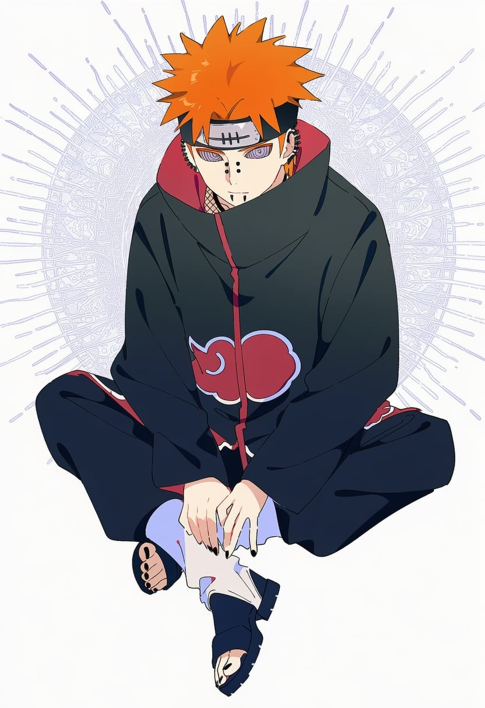

| 字段 | 内容 |
| --- | --- |
| 序号 | 122 |
| Danbooru Tag | ringed_eyes |
| 中文名 | 环状眼 |
| 中文含义 | 眼睛内部有明显同心环结构。 |
| 子类 | 眼部表情/眼型 |
| 角色 | 1boy,pain_(naruto) |

## 92. squiggle_eyes — 眼睛画成弯曲波浪线。

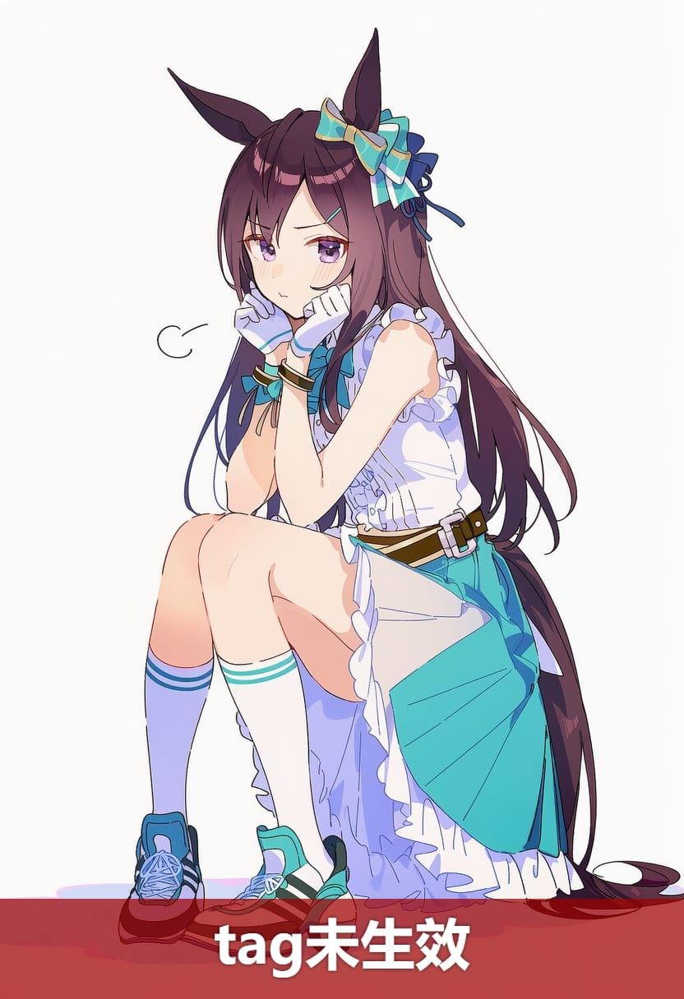

| 字段 | 内容 |
| --- | --- |
| 序号 | 123 |
| Danbooru Tag | squiggle_eyes |
| 中文名 | 波浪眼 |
| 中文含义 | 眼睛画成弯曲波浪线。 |
| 子类 | 眼部表情/眼型 |
| 角色 | 1girl,mejiro_dober_(umamusume) |

## 93. jitome — 半睁、冷淡或嫌弃感的眼神。

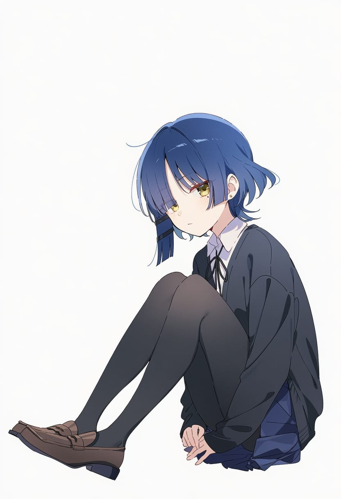

| 字段 | 内容 |
| --- | --- |
| 序号 | 124 |
| Danbooru Tag | jitome |
| 中文名 | ジト目 / 冷淡眼 |
| 中文含义 | 半睁、冷淡或嫌弃感的眼神。 |
| 子类 | 眼部表情/眼型 |
| 角色 | 1girl,yamada_ryo |

## 94. tareme — 外眼角向下，显得柔和。

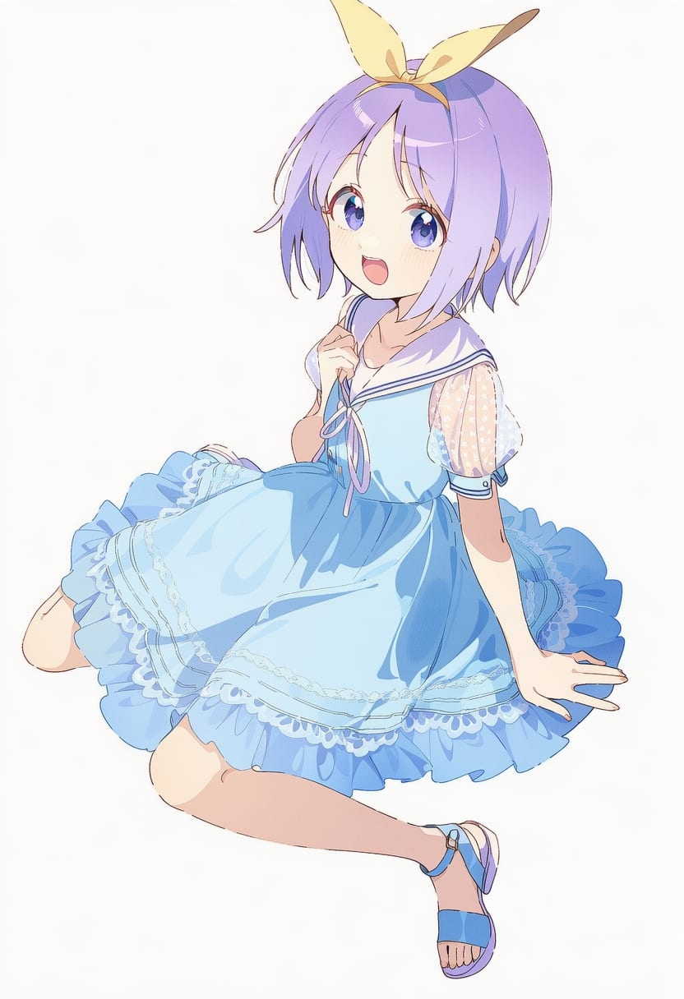

| 字段 | 内容 |
| --- | --- |
| 序号 | 126 |
| Danbooru Tag | tareme |
| 中文名 | 垂眼 |
| 中文含义 | 外眼角向下，显得柔和。 |
| 子类 | 眼部表情/眼型 |
| 角色 | 1girl,hiiragi_tsukasa |

## 95. tsurime — 外眼角向上，显得锐利。

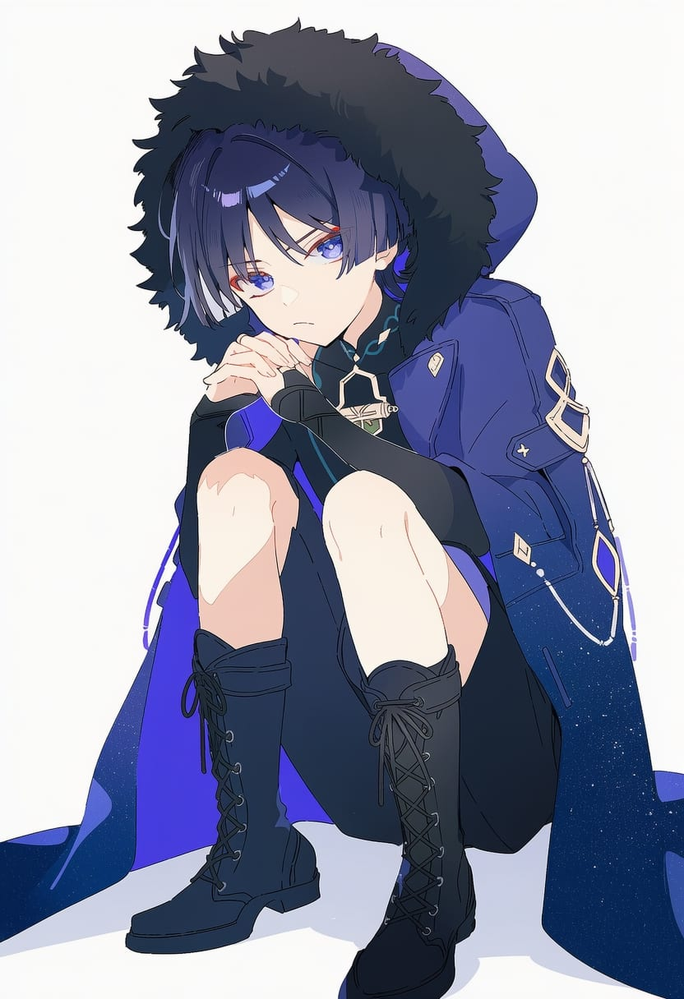

| 字段 | 内容 |
| --- | --- |
| 序号 | 127 |
| Danbooru Tag | tsurime |
| 中文名 | 吊眼 |
| 中文含义 | 外眼角向上，显得锐利。 |
| 子类 | 眼部表情/眼型 |
| 角色 | 1boy,scaramouche_(genshin_impact) |

## 96. no_pupils — 眼睛看不到瞳孔。

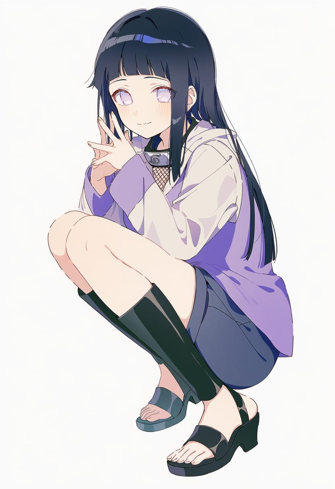

| 字段 | 内容 |
| --- | --- |
| 序号 | 136 |
| Danbooru Tag | no_pupils |
| 中文名 | 无瞳孔 |
| 中文含义 | 眼睛看不到瞳孔。 |
| 子类 | 眼部表情/眼型 |
| 角色 | 1girl,hyuuga_hinata |

## 97. mismatched_pupils — 两只眼的瞳孔形态不同。

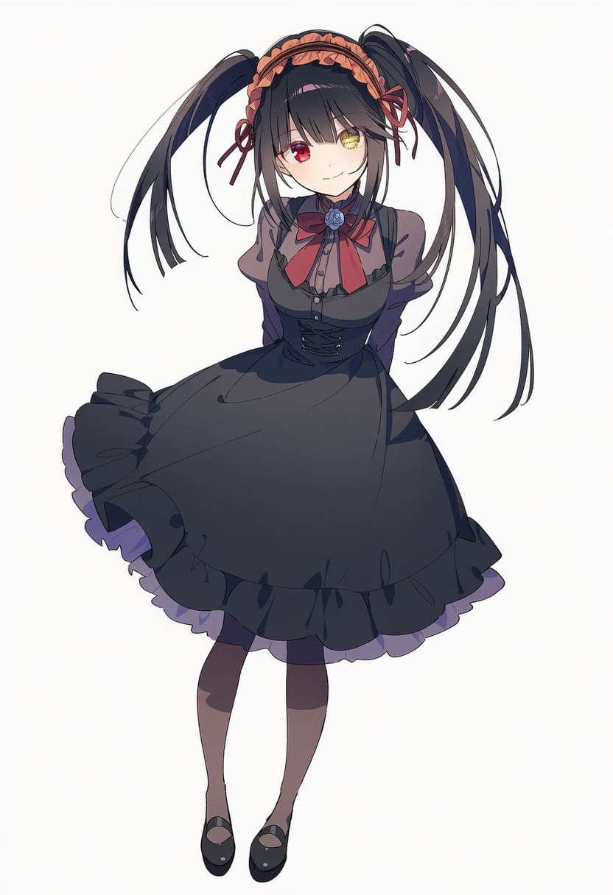

| 字段 | 内容 |
| --- | --- |
| 序号 | 137 |
| Danbooru Tag | mismatched_pupils |
| 中文名 | 异形双瞳 |
| 中文含义 | 两只眼的瞳孔形态不同。 |
| 子类 | 眼部表情/眼型 |
| 角色 | 1girl,tokisaki_kurumi |

## 98. horizontal_pupils — 瞳孔呈横向狭缝。

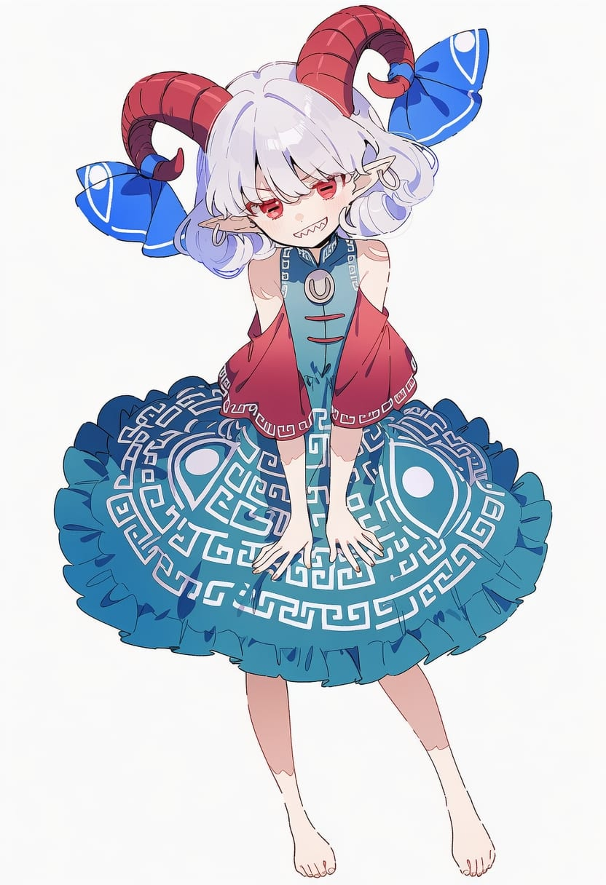

| 字段 | 内容 |
| --- | --- |
| 序号 | 138 |
| Danbooru Tag | horizontal_pupils |
| 中文名 | 横向瞳孔 |
| 中文含义 | 瞳孔呈横向狭缝。 |
| 子类 | 眼部表情/眼型 |
| 角色 | 1girl,toutetsu_yuuma |

## 99. rectangular_pupils — 瞳孔呈长方形。

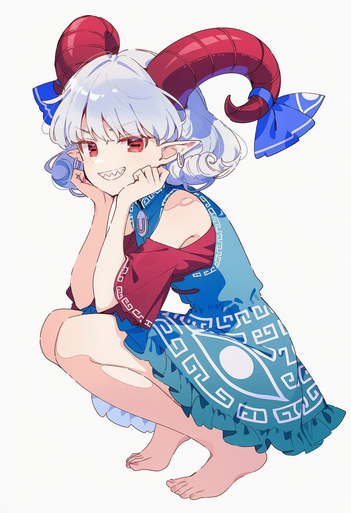

| 字段 | 内容 |
| --- | --- |
| 序号 | 139 |
| Danbooru Tag | rectangular_pupils |
| 中文名 | 矩形瞳孔 |
| 中文含义 | 瞳孔呈长方形。 |
| 子类 | 眼部表情/眼型 |
| 角色 | 1girl,toutetsu_yuuma |

## 100. slit_pupils — 瞳孔呈细长狭缝。

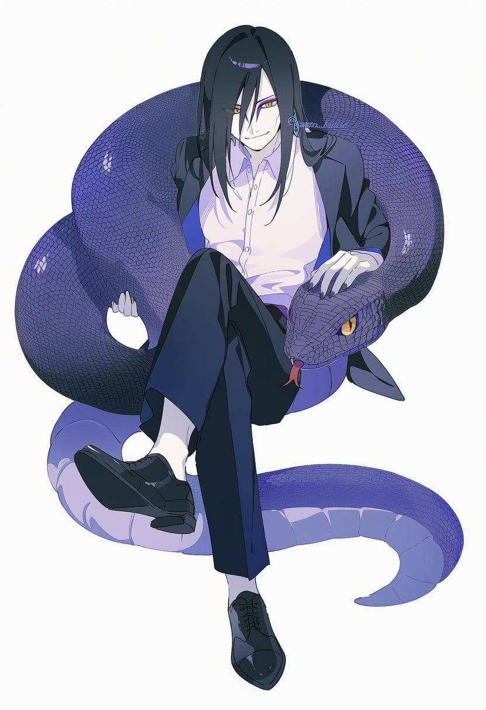

| 字段 | 内容 |
| --- | --- |
| 序号 | 140 |
| Danbooru Tag | slit_pupils |
| 中文名 | 竖缝瞳孔 |
| 中文含义 | 瞳孔呈细长狭缝。 |
| 子类 | 眼部表情/眼型 |
| 角色 | 1boy,orochimaru_(naruto) |

## 101. solid_circle_pupils — 瞳孔是实心圆点。

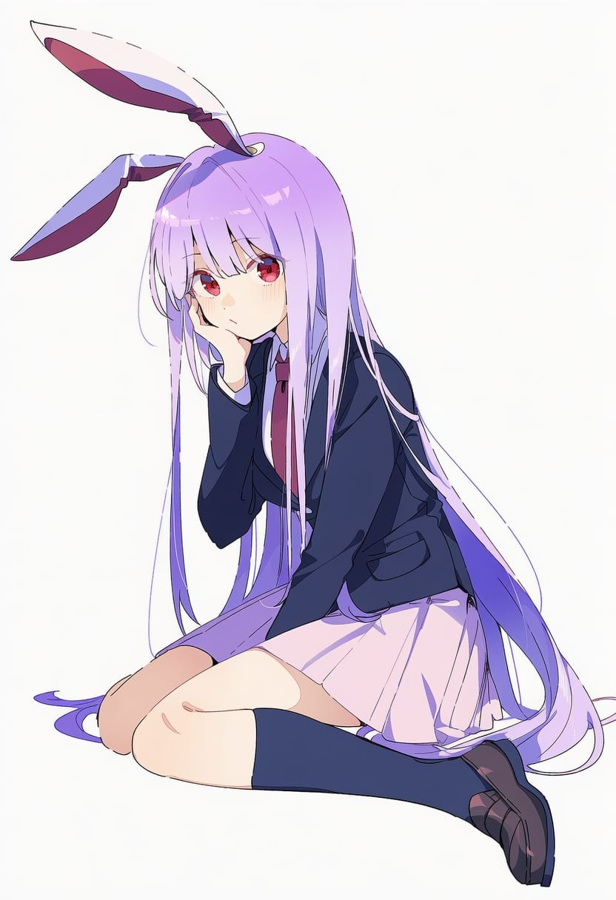

| 字段 | 内容 |
| --- | --- |
| 序号 | 141 |
| Danbooru Tag | solid_circle_pupils |
| 中文名 | 实心圆瞳 |
| 中文含义 | 瞳孔是实心圆点。 |
| 子类 | 眼部表情/眼型 |
| 角色 | 1girl,reisen_udongein_inaba |

## 102. symbol-shaped_pupils — 瞳孔被画成各种符号形状。

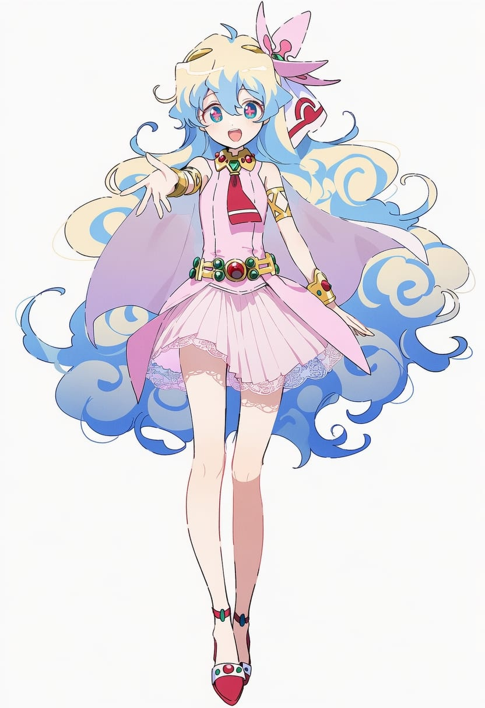

| 字段 | 内容 |
| --- | --- |
| 序号 | 142 |
| Danbooru Tag | symbol-shaped_pupils |
| 中文名 | 符号瞳孔 |
| 中文含义 | 瞳孔被画成各种符号形状。 |
| 子类 | 眼部表情/眼型 |
| 角色 | 1girl,nia_teppelin |

## 103. heart-shaped_pupils — 瞳孔呈爱心形。

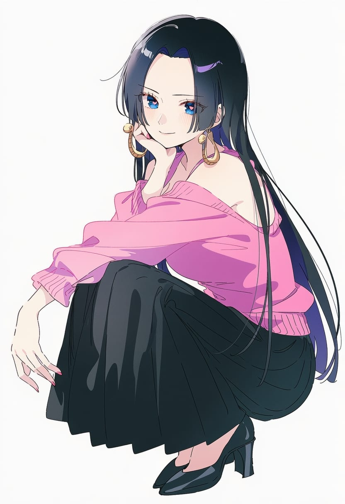

| 字段 | 内容 |
| --- | --- |
| 序号 | 143 |
| Danbooru Tag | heart-shaped_pupils |
| 中文名 | 爱心瞳孔 |
| 中文含义 | 瞳孔呈爱心形。 |
| 子类 | 特殊瞳孔 |
| 角色 | 1girl,boa_hancock |

## 104. star-shaped_pupils — 瞳孔呈星星形。

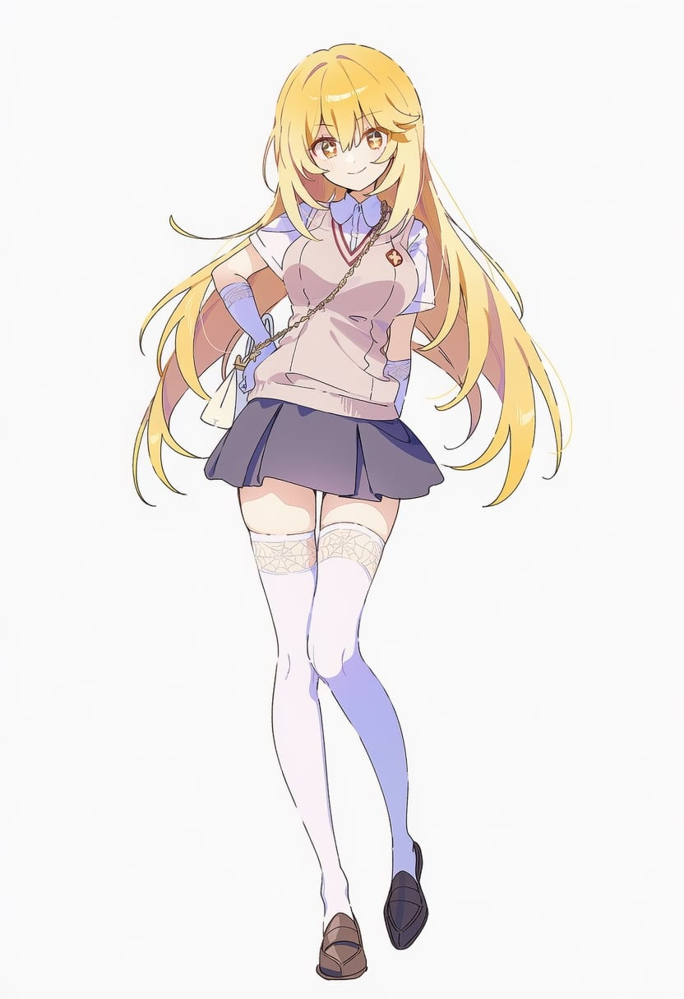

| 字段 | 内容 |
| --- | --- |
| 序号 | 144 |
| Danbooru Tag | star-shaped_pupils |
| 中文名 | 星形瞳孔 |
| 中文含义 | 瞳孔呈星星形。 |
| 子类 | 特殊瞳孔 |
| 角色 | 1girl,shokuhou_misaki |

## 105. cross-shaped_pupils — 瞳孔呈十字形。

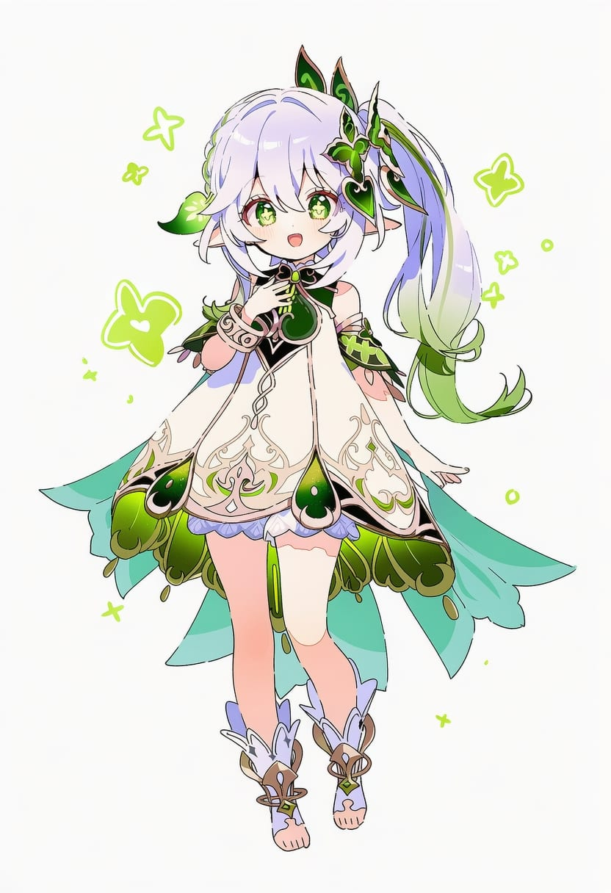

| 字段 | 内容 |
| --- | --- |
| 序号 | 145 |
| Danbooru Tag | cross-shaped_pupils |
| 中文名 | 十字瞳孔 |
| 中文含义 | 瞳孔呈十字形。 |
| 子类 | 特殊瞳孔 |
| 角色 | 1girl,nahida_(genshin_impact) |

## 106. x-shaped_pupils — 瞳孔呈 X 形。

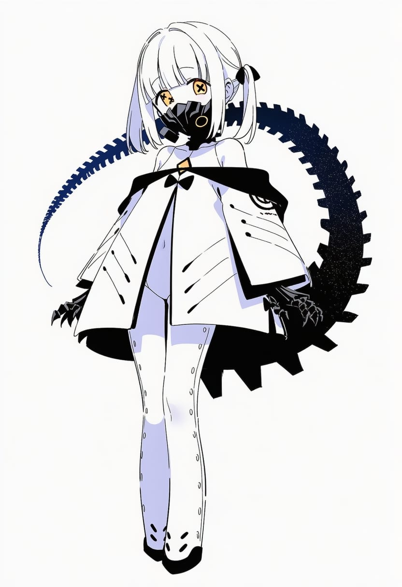

| 字段 | 内容 |
| --- | --- |
| 序号 | 146 |
| Danbooru Tag | x-shaped_pupils |
| 中文名 | X形瞳孔 |
| 中文含义 | 瞳孔呈 X 形。 |
| 子类 | 特殊瞳孔 |
| 角色 | 1girl,ein_(blue_archive) |

## 107. diamond-shaped_pupils — 瞳孔呈菱形。

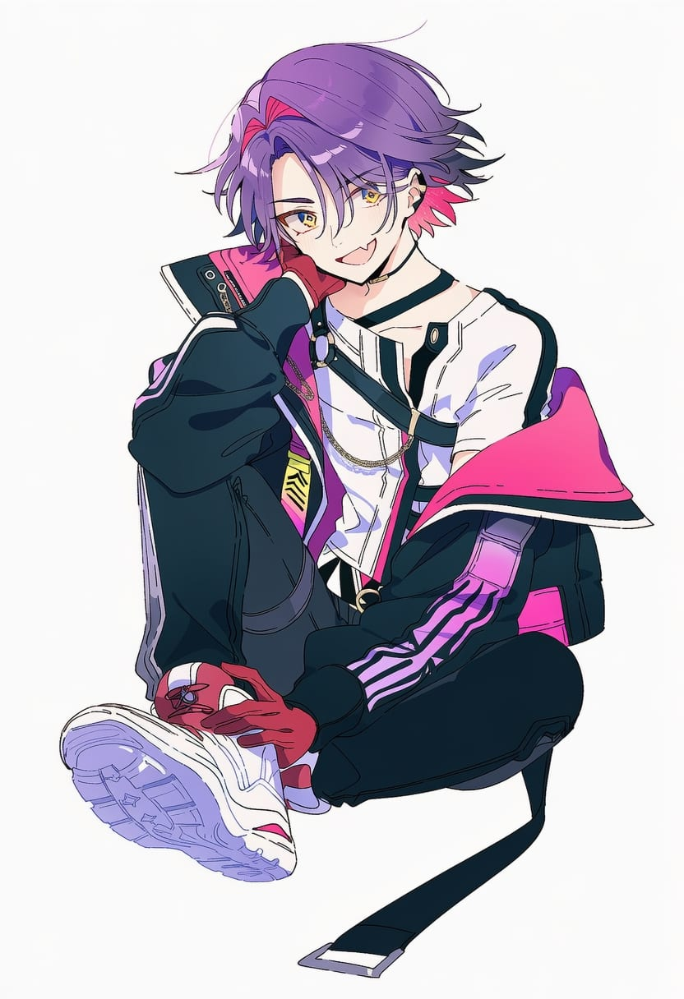

| 字段 | 内容 |
| --- | --- |
| 序号 | 147 |
| Danbooru Tag | diamond-shaped_pupils |
| 中文名 | 菱形瞳孔 |
| 中文含义 | 瞳孔呈菱形。 |
| 子类 | 特殊瞳孔 |
| 角色 | 1boy,watarai_hibari |

## 108. flower-shaped_pupils — 瞳孔呈花朵形。

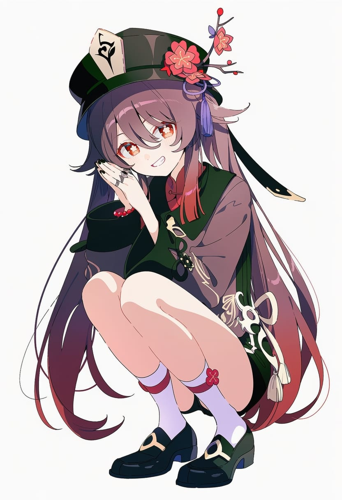

| 字段 | 内容 |
| --- | --- |
| 序号 | 148 |
| Danbooru Tag | flower-shaped_pupils |
| 中文名 | 花形瞳孔 |
| 中文含义 | 瞳孔呈花朵形。 |
| 子类 | 特殊瞳孔 |
| 角色 | 1girl,hu_tao_(genshin_impact) |

## 109. butterfly-shaped_pupils — 瞳孔呈蝴蝶形。

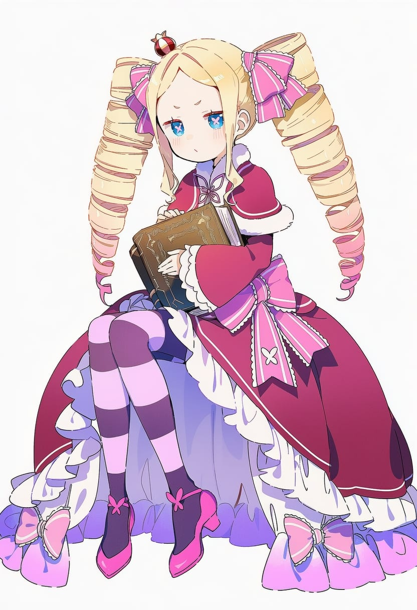

| 字段 | 内容 |
| --- | --- |
| 序号 | 149 |
| Danbooru Tag | butterfly-shaped_pupils |
| 中文名 | 蝴蝶瞳孔 |
| 中文含义 | 瞳孔呈蝴蝶形。 |
| 子类 | 特殊瞳孔 |
| 角色 | 1girl,beatrice_(re:zero) |

## 110. fish-shaped_pupils — 瞳孔呈鱼形。

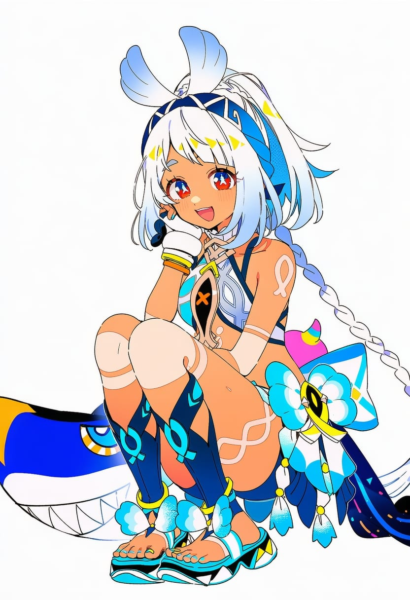

| 字段 | 内容 |
| --- | --- |
| 序号 | 150 |
| Danbooru Tag | fish-shaped_pupils |
| 中文名 | 鱼形瞳孔 |
| 中文含义 | 瞳孔呈鱼形。 |
| 子类 | 特殊瞳孔 |
| 角色 | 1girl,mualani_(genshin_impact) |

## 111. rabbit-shaped_pupils — 瞳孔呈兔子形。

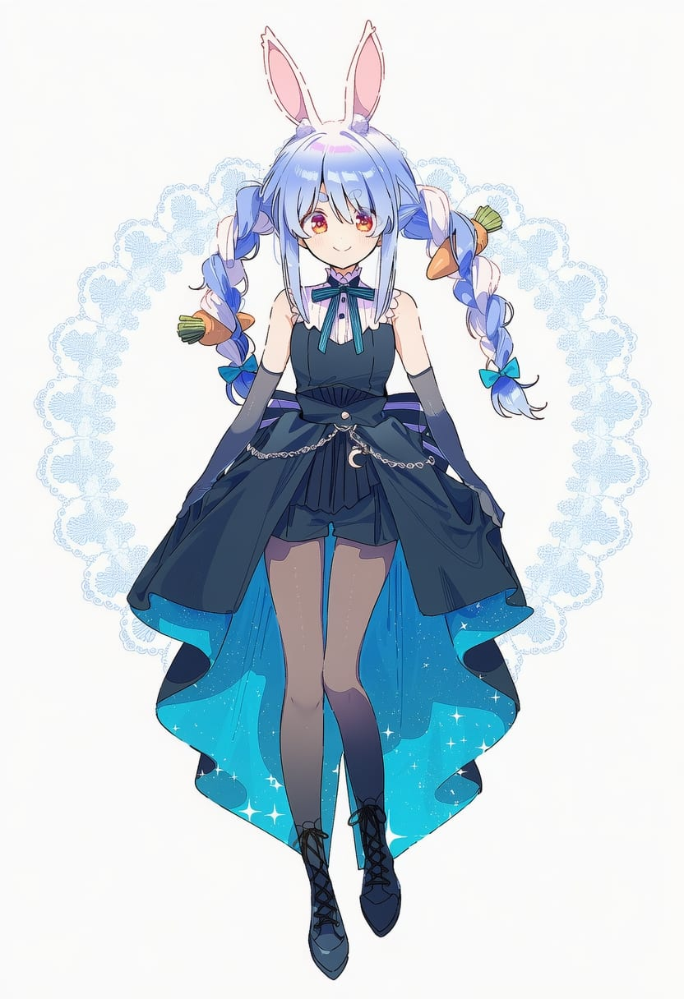

| 字段 | 内容 |
| --- | --- |
| 序号 | 151 |
| Danbooru Tag | rabbit-shaped_pupils |
| 中文名 | 兔子瞳孔 |
| 中文含义 | 瞳孔呈兔子形。 |
| 子类 | 特殊瞳孔 |
| 角色 | 1girl,usada_pekora |

## 112. paw-shaped_pupils — 瞳孔呈动物爪印形。

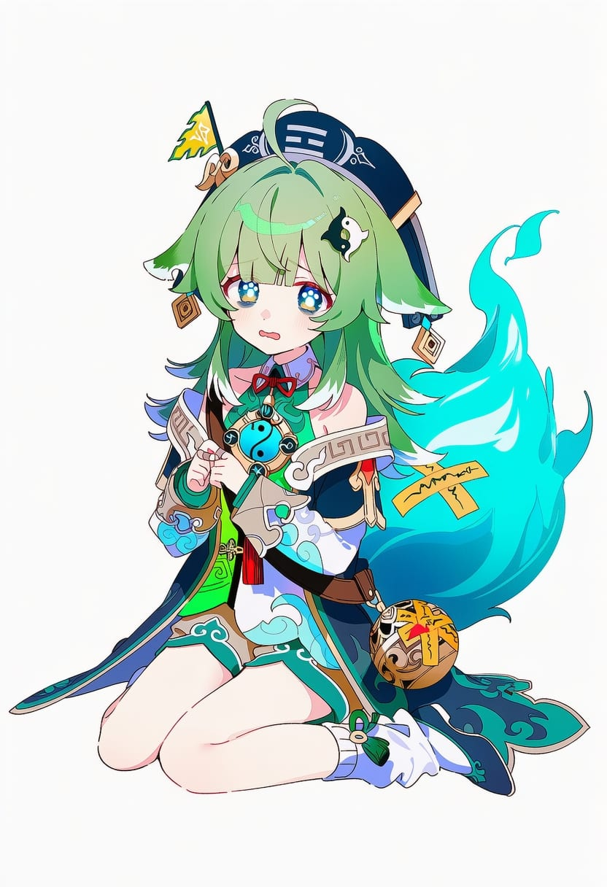

| 字段 | 内容 |
| --- | --- |
| 序号 | 152 |
| Danbooru Tag | paw-shaped_pupils |
| 中文名 | 爪印瞳孔 |
| 中文含义 | 瞳孔呈动物爪印形。 |
| 子类 | 特殊瞳孔 |
| 角色 | 1girl,huohuo_(honkai:_star_rail) |

## 113. power_symbol-shaped_pupils — 瞳孔呈电源开关符号。

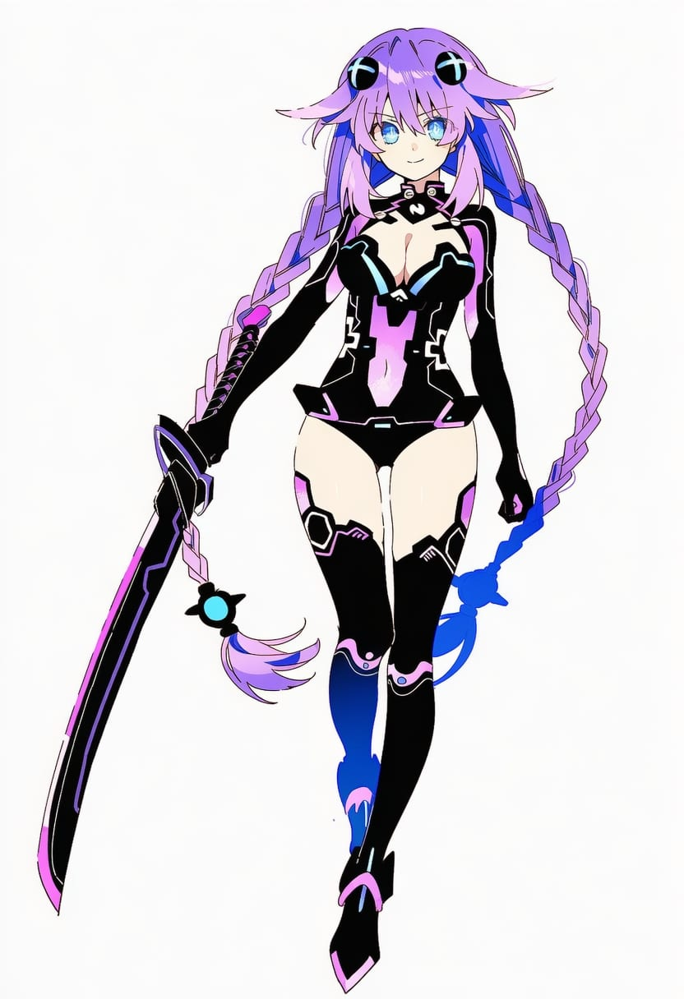

| 字段 | 内容 |
| --- | --- |
| 序号 | 153 |
| Danbooru Tag | power_symbol-shaped_pupils |
| 中文名 | 电源符号瞳孔 |
| 中文含义 | 瞳孔呈电源开关符号。 |
| 子类 | 特殊瞳孔 |
| 角色 | 1girl,purple_heart_(neptunia) |

## 114. triangle-shaped_pupils — 瞳孔呈三角形。

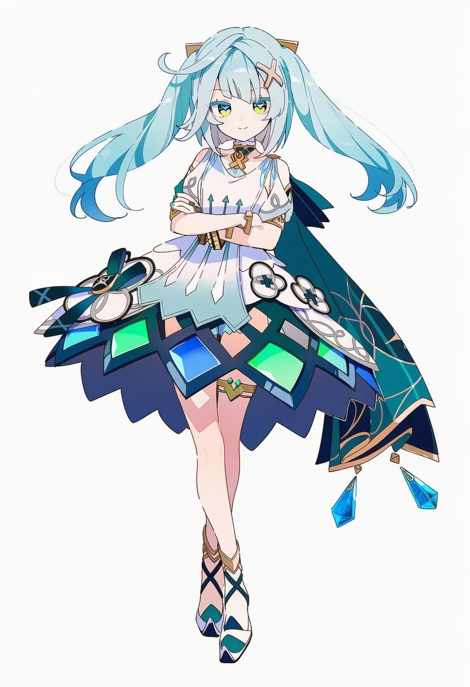

| 字段 | 内容 |
| --- | --- |
| 序号 | 154 |
| Danbooru Tag | triangle-shaped_pupils |
| 中文名 | 三角瞳孔 |
| 中文含义 | 瞳孔呈三角形。 |
| 子类 | 特殊瞳孔 |
| 角色 | 1girl,faruzan_(genshin_impact) |

## 115. crosshair_pupils — 瞳孔像瞄准镜准星。

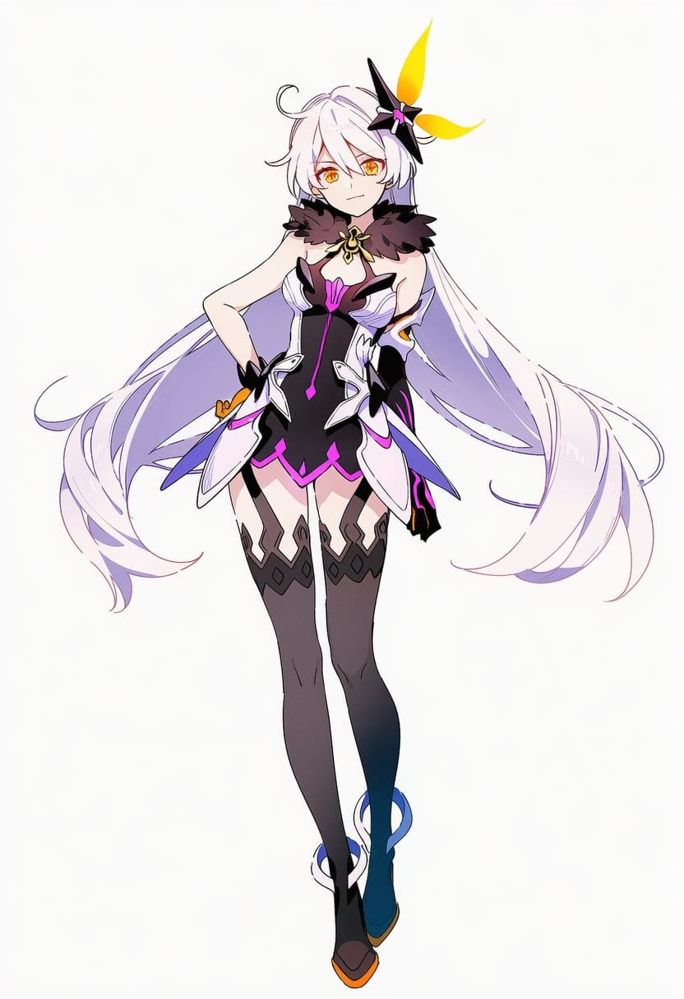

| 字段 | 内容 |
| --- | --- |
| 序号 | 155 |
| Danbooru Tag | crosshair_pupils |
| 中文名 | 准星瞳孔 |
| 中文含义 | 瞳孔像瞄准镜准星。 |
| 子类 | 特殊瞳孔 |
| 角色 | 1girl,kiana_kaslana_(herrscher_of_the_void) |

## 116. clock_eyes — 眼睛或瞳孔带时钟表盘结构。

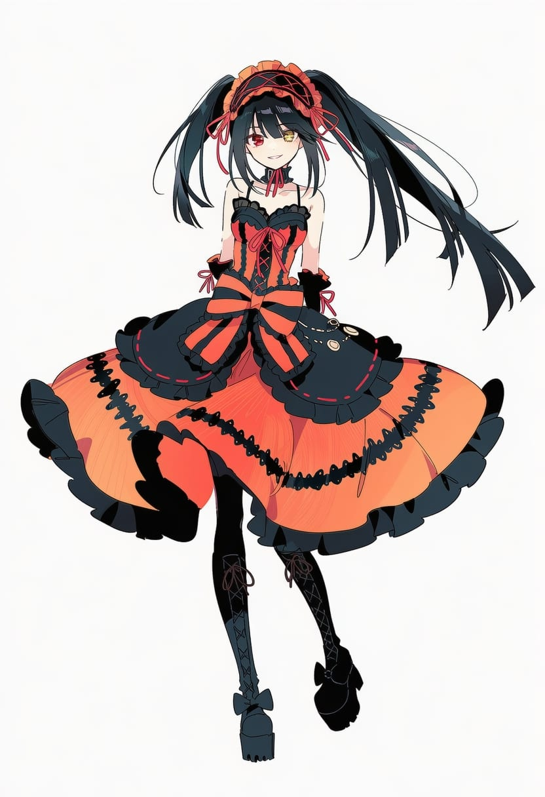

| 字段 | 内容 |
| --- | --- |
| 序号 | 156 |
| Danbooru Tag | clock_eyes |
| 中文名 | 时钟眼 |
| 中文含义 | 眼睛或瞳孔带时钟表盘结构。 |
| 子类 | 特殊瞳孔 |
| 角色 | 1girl,tokisaki_kurumi |

## 117. clenched_teeth — 牙齿紧紧咬住。

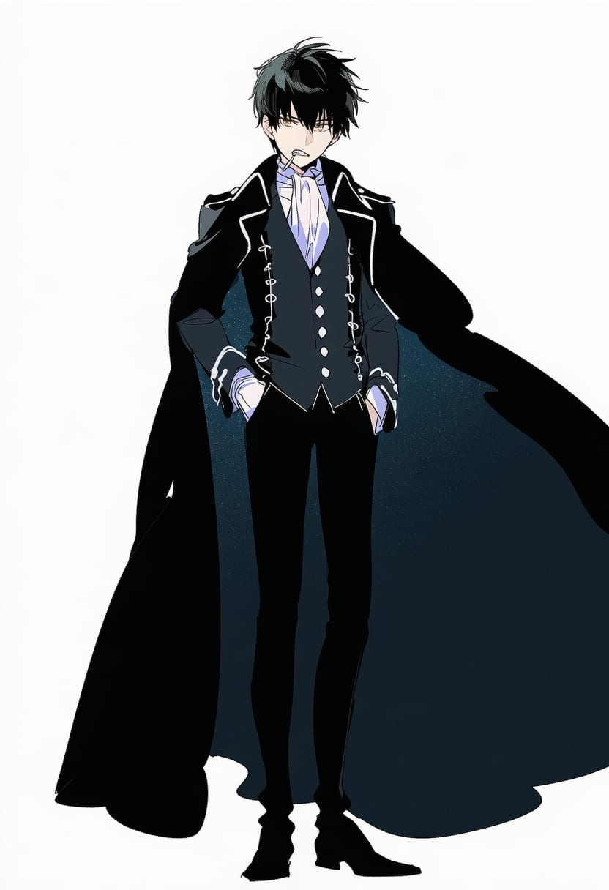

| 字段 | 内容 |
| --- | --- |
| 序号 | 157 |
| Danbooru Tag | clenched_teeth |
| 中文名 | 咬紧牙关 |
| 中文含义 | 牙齿紧紧咬住。 |
| 子类 | 眉眼/嘴部细节 |
| 角色 | 1boy,hijikata_toushirou |

## 118. open_mouth — 嘴巴明显张开。

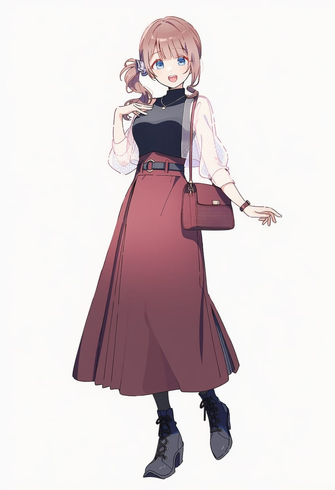

| 字段 | 内容 |
| --- | --- |
| 序号 | 158 |
| Danbooru Tag | open_mouth |
| 中文名 | 张嘴 |
| 中文含义 | 嘴巴明显张开。 |
| 子类 | 眉眼/嘴部细节 |
| 角色 | 1girl,mochizuki_honami |

## 119. closed_mouth — 嘴巴闭合。

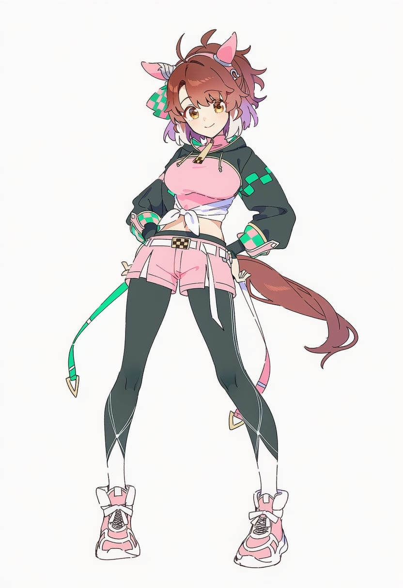

| 字段 | 内容 |
| --- | --- |
| 序号 | 159 |
| Danbooru Tag | closed_mouth |
| 中文名 | 闭嘴 |
| 中文含义 | 嘴巴闭合。 |
| 子类 | 眉眼/嘴部细节 |
| 角色 | 1girl,dantsu_flame_(umamusume) |

## 120. parted_lips — 嘴唇轻微分开。

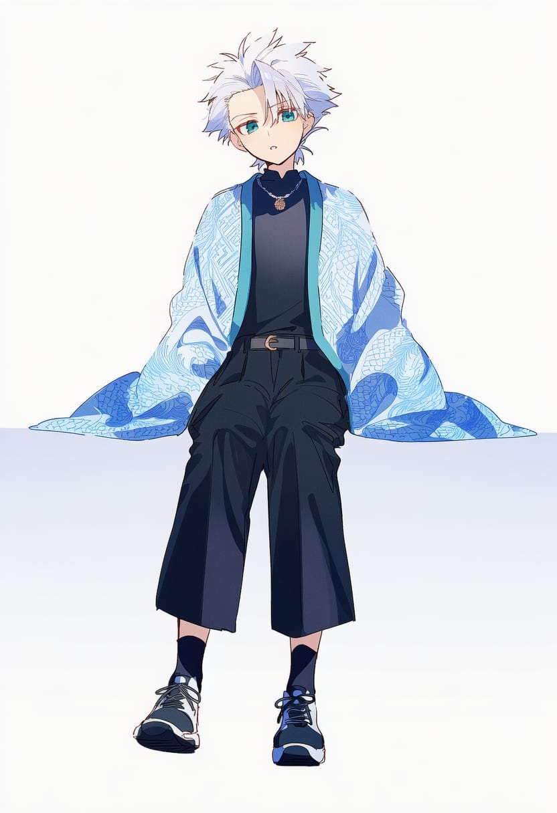

| 字段 | 内容 |
| --- | --- |
| 序号 | 160 |
| Danbooru Tag | parted_lips |
| 中文名 | 微张嘴唇 |
| 中文含义 | 嘴唇轻微分开。 |
| 子类 | 眉眼/嘴部细节 |
| 角色 | 1boy,hitsugaya_toushirou |

## 121. pout — 嘴唇向前撅起。

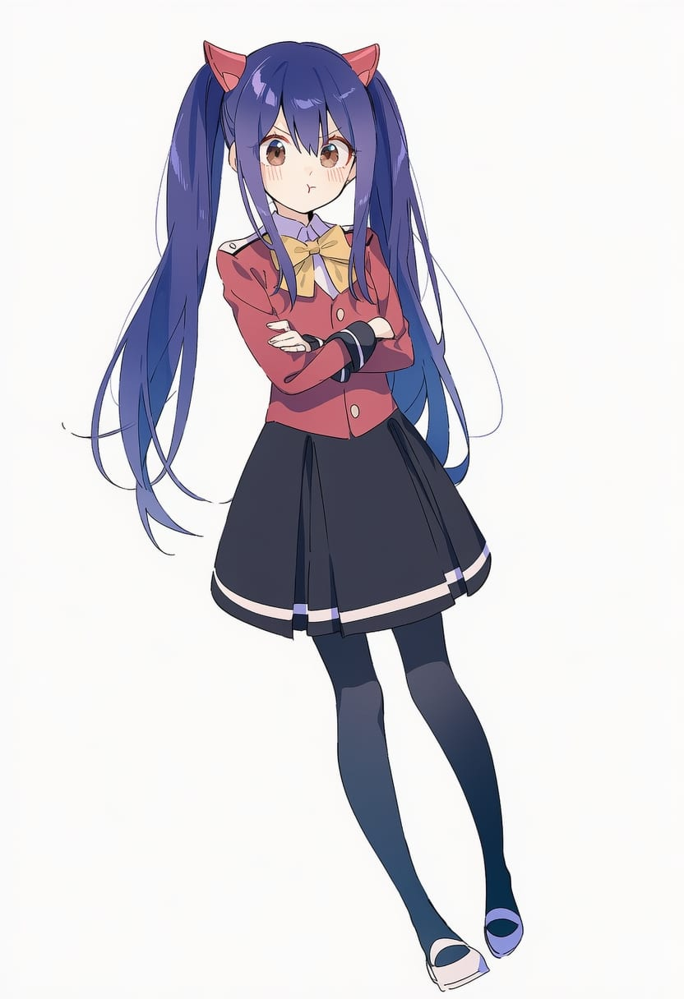

| 字段 | 内容 |
| --- | --- |
| 序号 | 161 |
| Danbooru Tag | pout |
| 中文名 | 嘟嘴 |
| 中文含义 | 嘴唇向前撅起。 |
| 子类 | 眉眼/嘴部细节 |
| 角色 | 1girl,wendy_marvell |

## 122. puffy_cheeks — 双颊鼓起，常用于生气或撒娇。

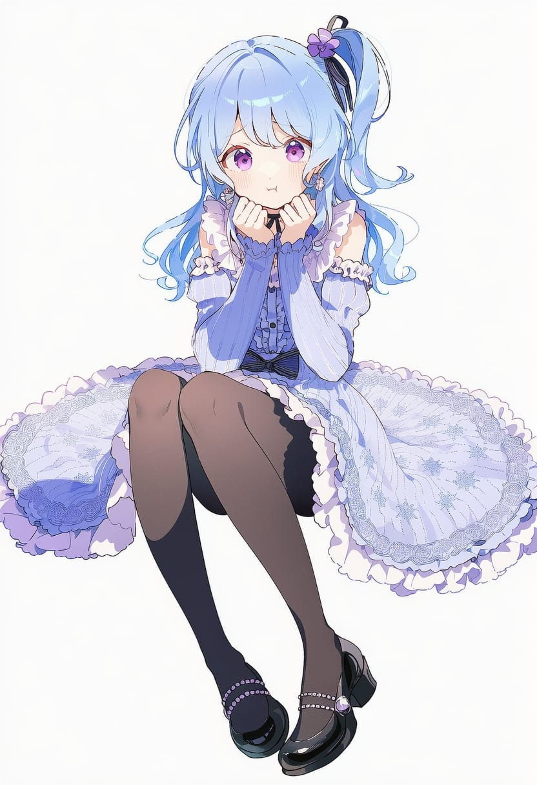

| 字段 | 内容 |
| --- | --- |
| 序号 | 162 |
| Danbooru Tag | puffy_cheeks |
| 中文名 | 鼓脸颊 |
| 中文含义 | 双颊鼓起，常用于生气或撒娇。 |
| 子类 | 眉眼/嘴部细节 |
| 角色 | 1girl,matsubara_kanon |

## 123. raised_eyebrow — 只抬起一侧眉毛。

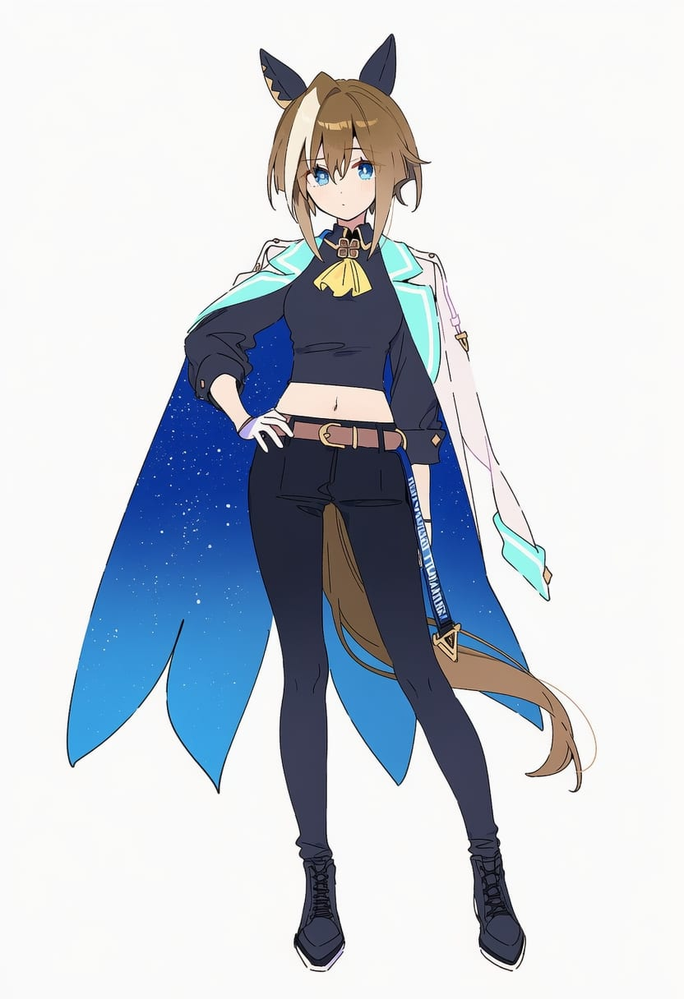

| 字段 | 内容 |
| --- | --- |
| 序号 | 163 |
| Danbooru Tag | raised_eyebrow |
| 中文名 | 单挑眉 |
| 中文含义 | 只抬起一侧眉毛。 |
| 子类 | 眉眼/嘴部细节 |
| 角色 | 1girl,cheval_grand_(umamusume) |

## 124. raised_eyebrows — 双眉抬高。

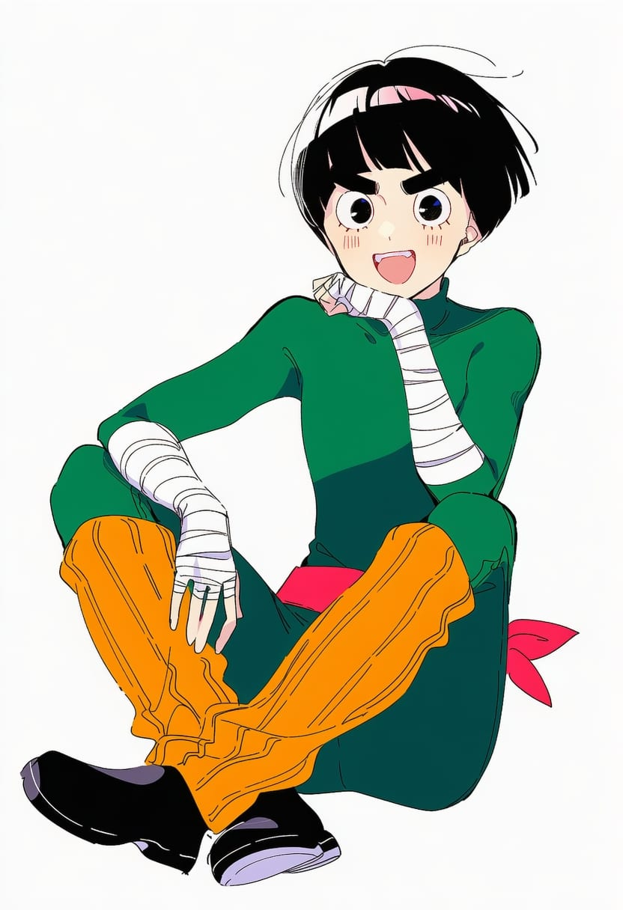

| 字段 | 内容 |
| --- | --- |
| 序号 | 164 |
| Danbooru Tag | raised_eyebrows |
| 中文名 | 挑眉 |
| 中文含义 | 双眉抬高。 |
| 子类 | 眉眼/嘴部细节 |
| 角色 | 1boy,rock_lee |

## 125. raised_inner_eyebrows — 眉毛内侧抬起，常显得委屈。

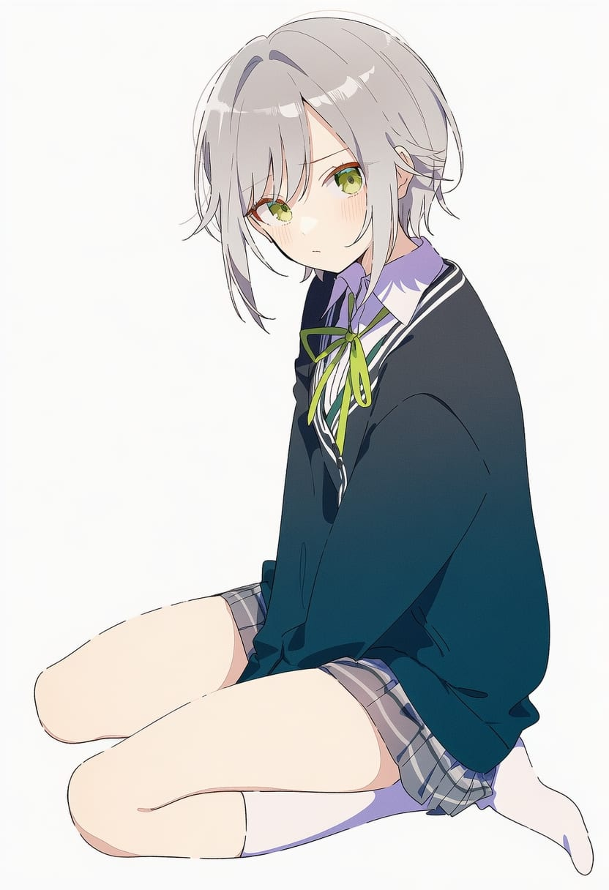

| 字段 | 内容 |
| --- | --- |
| 序号 | 165 |
| Danbooru Tag | raised_inner_eyebrows |
| 中文名 | 眉心上扬 |
| 中文含义 | 眉毛内侧抬起，常显得委屈。 |
| 子类 | 眉眼/嘴部细节 |
| 角色 | 1girl,hinomori_shiho |

## 126. v-shaped_eyebrows — 眉毛压成明显 V 字形。

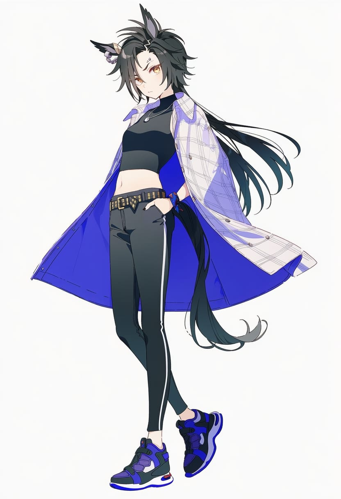

| 字段 | 内容 |
| --- | --- |
| 序号 | 166 |
| Danbooru Tag | v-shaped_eyebrows |
| 中文名 | V形眉 |
| 中文含义 | 眉毛压成明显 V 字形。 |
| 子类 | 眉眼/嘴部细节 |
| 角色 | 1girl,air_shakur_(umamusume) |

## 127. wavy_mouth — 嘴巴画成波浪线。

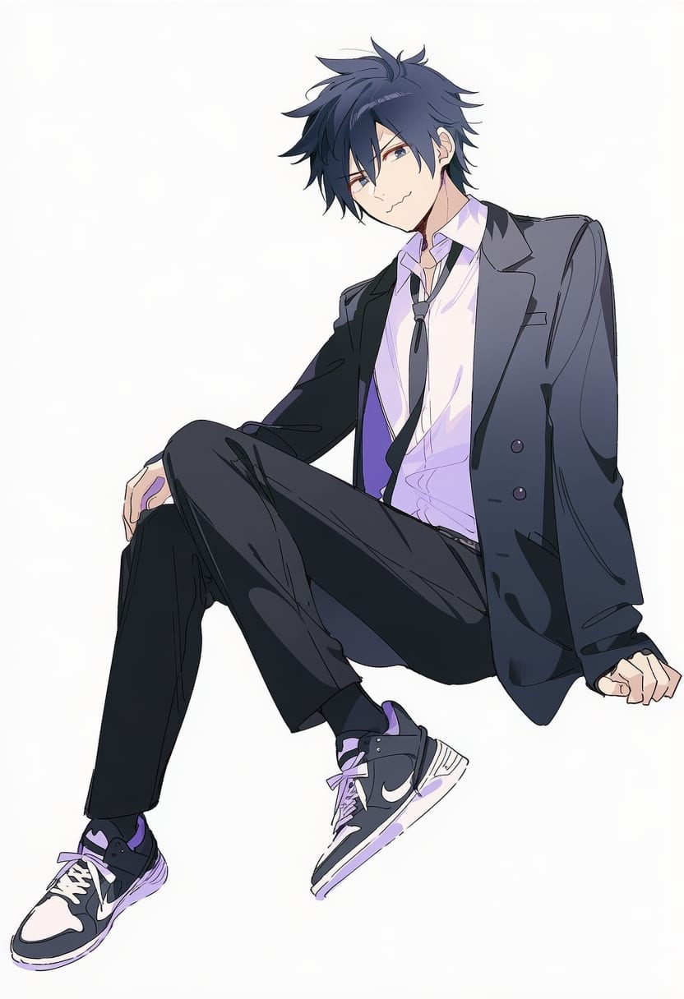

| 字段 | 内容 |
| --- | --- |
| 序号 | 167 |
| Danbooru Tag | wavy_mouth |
| 中文名 | 波浪嘴 |
| 中文含义 | 嘴巴画成波浪线。 |
| 子类 | 眉眼/嘴部细节 |
| 角色 | 1boy,gray_fullbuster |

## 128. triangle_mouth — 嘴巴呈三角形。

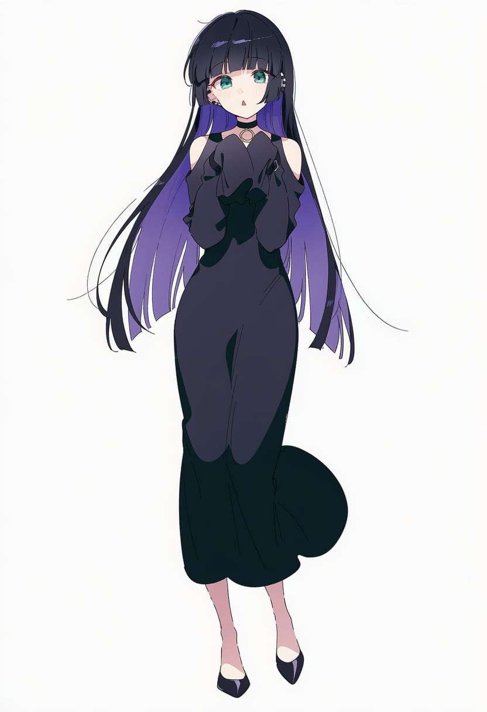

| 字段 | 内容 |
| --- | --- |
| 序号 | 168 |
| Danbooru Tag | triangle_mouth |
| 中文名 | 三角嘴 |
| 中文含义 | 嘴巴呈三角形。 |
| 子类 | 眉眼/嘴部细节 |
| 角色 | 1girl,pa-san |

## 129. sideways_mouth — 嘴巴明显偏向一侧。

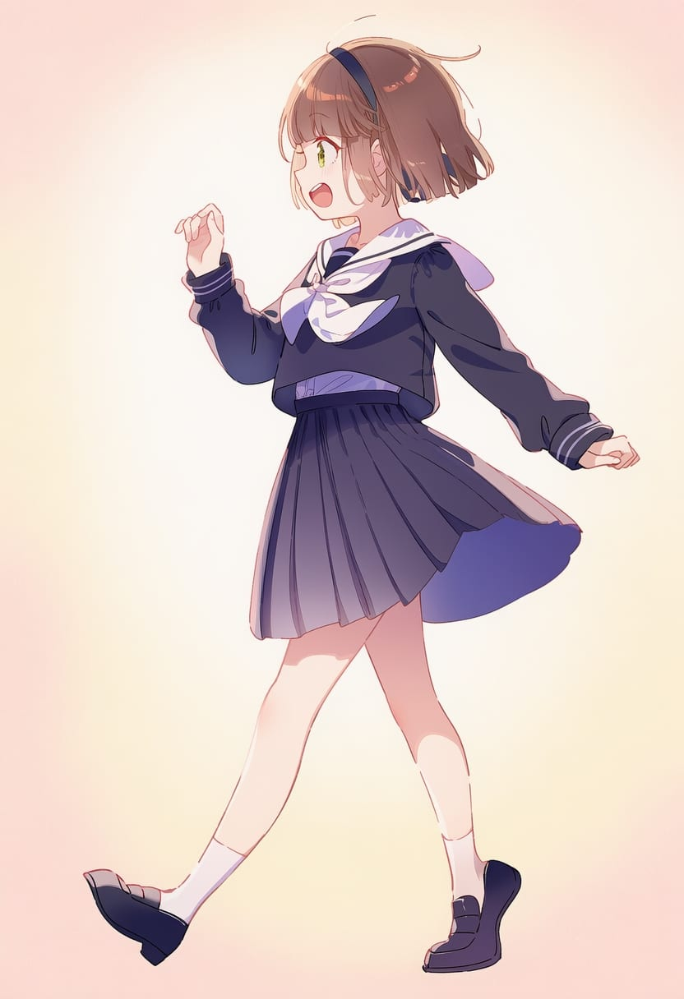

| 字段 | 内容 |
| --- | --- |
| 序号 | 169 |
| Danbooru Tag | sideways_mouth |
| 中文名 | 侧歪嘴 |
| 中文含义 | 嘴巴明显偏向一侧。 |
| 子类 | 眉眼/嘴部细节 |
| 角色 | 1girl,katsuragi_ace_(umamusume) |

## 130. split_mouth — 嘴线中间分叉或呈 W 状。

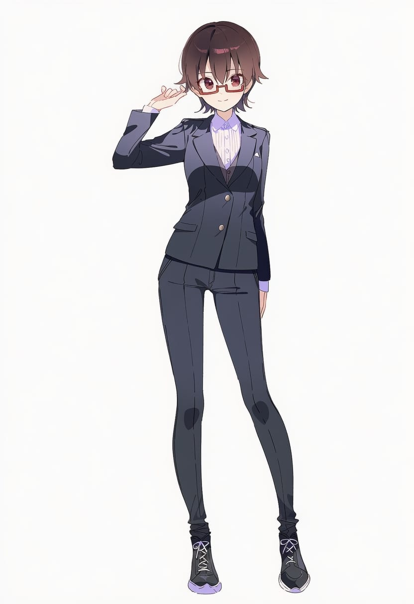

| 字段 | 内容 |
| --- | --- |
| 序号 | 170 |
| Danbooru Tag | split_mouth |
| 中文名 | 分叉嘴 |
| 中文含义 | 嘴线中间分叉或呈 W 状。 |
| 子类 | 眉眼/嘴部细节 |
| 角色 | 1girl,manabe_nodoka |

## 131. dot_mouth — 嘴巴简化成一个小点。

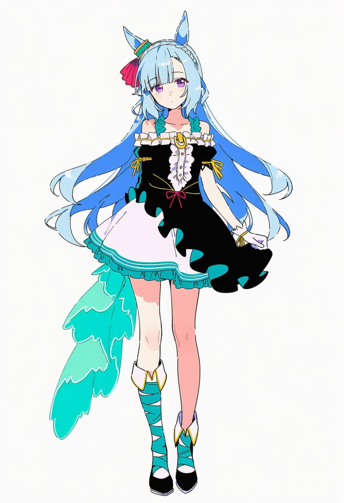

| 字段 | 内容 |
| --- | --- |
| 序号 | 171 |
| Danbooru Tag | dot_mouth |
| 中文名 | 点状嘴 |
| 中文含义 | 嘴巴简化成一个小点。 |
| 子类 | 眉眼/嘴部细节 |
| 角色 | 1girl,mejiro_ardan_(umamusume) |

## 132. chestnut_mouth — 嘴型像栗子般鼓起。

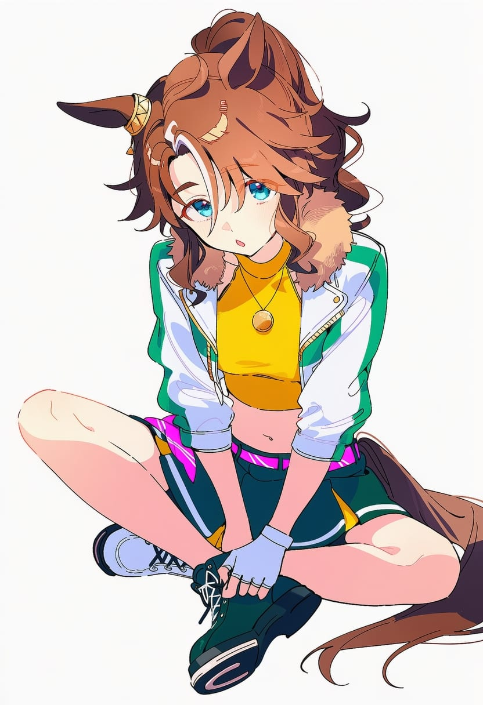

| 字段 | 内容 |
| --- | --- |
| 序号 | 174 |
| Danbooru Tag | chestnut_mouth |
| 中文名 | 栗子嘴 |
| 中文含义 | 嘴型像栗子般鼓起。 |
| 子类 | 眉眼/嘴部细节 |
| 角色 | 1girl,mejiro_palmer_(umamusume) |

## 133. rectangular_mouth — 张开的嘴呈长方形。

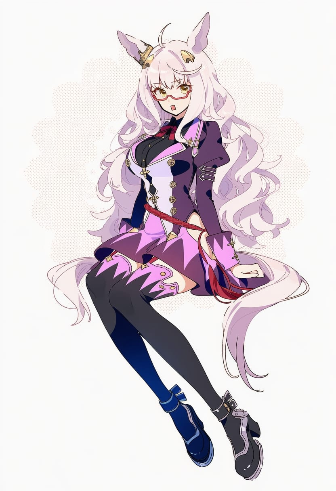

| 字段 | 内容 |
| --- | --- |
| 序号 | 176 |
| Danbooru Tag | rectangular_mouth |
| 中文名 | 矩形嘴 |
| 中文含义 | 张开的嘴呈长方形。 |
| 子类 | 眉眼/嘴部细节 |
| 角色 | 1girl,biwa_hayahide_(umamusume) |

## 134. stitched_mouth — 嘴部带缝线或缝合效果。

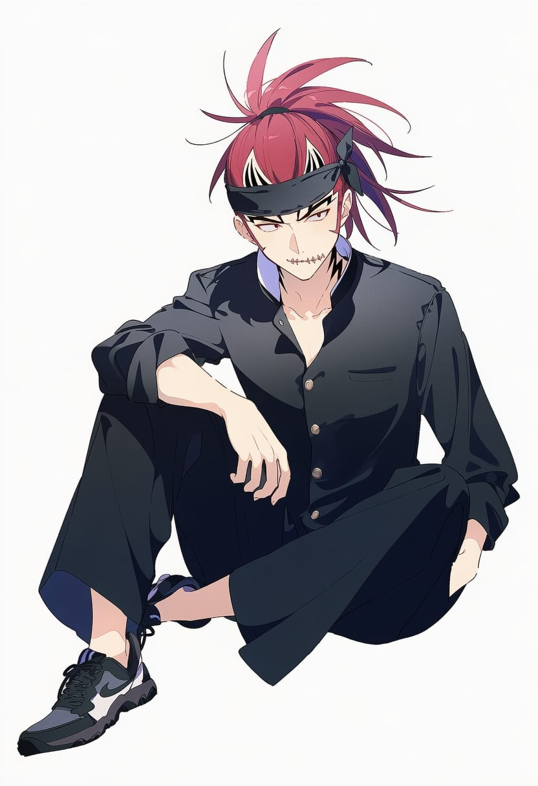

| 字段 | 内容 |
| --- | --- |
| 序号 | 177 |
| Danbooru Tag | stitched_mouth |
| 中文名 | 缝合嘴 |
| 中文含义 | 嘴部带缝线或缝合效果。 |
| 子类 | 眉眼/嘴部细节 |
| 角色 | 1boy,abarai_renji |

## 135. glowing_mouth — 口腔内部明显发光。

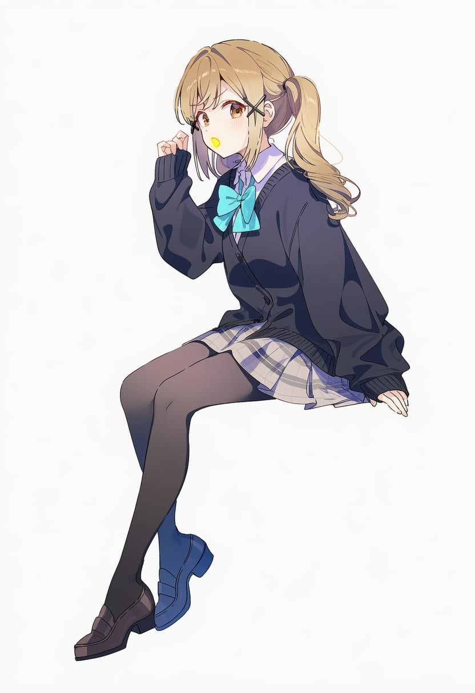

| 字段 | 内容 |
| --- | --- |
| 序号 | 178 |
| Danbooru Tag | glowing_mouth |
| 中文名 | 发光嘴 |
| 中文含义 | 口腔内部明显发光。 |
| 子类 | 眉眼/嘴部细节 |
| 角色 | 1girl,ichigaya_arisa |

## 136. mouth_drool — 口水从嘴角流下。

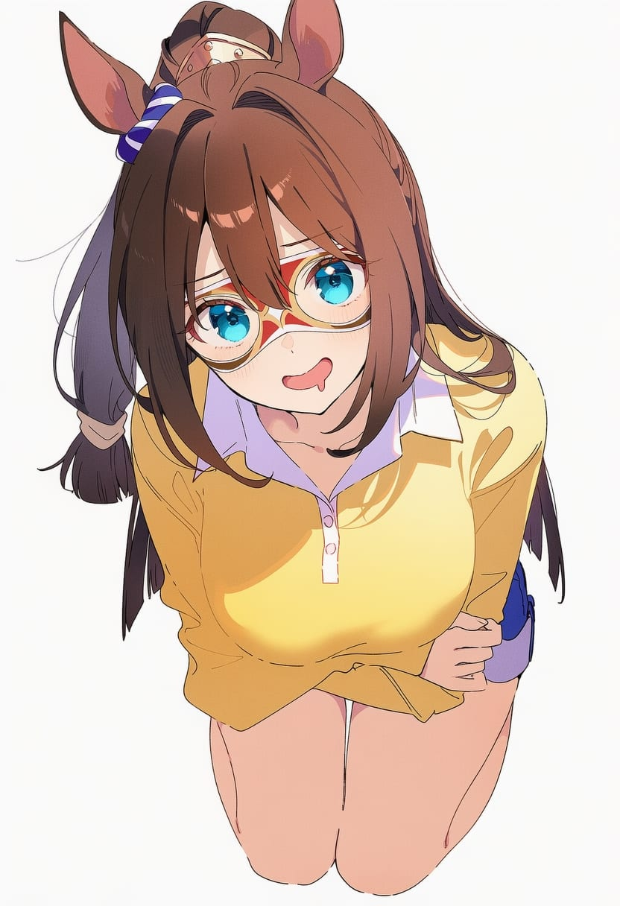

| 字段 | 内容 |
| --- | --- |
| 序号 | 179 |
| Danbooru Tag | mouth_drool |
| 中文名 | 嘴边口水 |
| 中文含义 | 口水从嘴角流下。 |
| 子类 | 眉眼/嘴部细节 |
| 角色 | 1girl,el_condor_pasa_(umamusume) |

## 137. tongue_out — 舌头伸出嘴外。

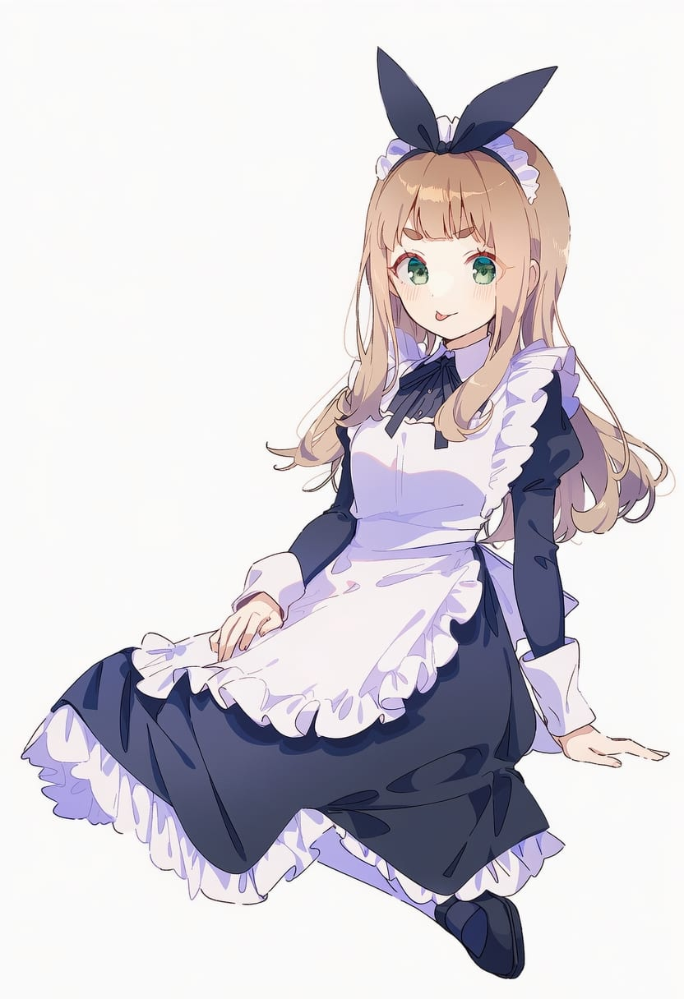

| 字段 | 内容 |
| --- | --- |
| 序号 | 184 |
| Danbooru Tag | tongue_out |
| 中文名 | 吐舌 |
| 中文含义 | 舌头伸出嘴外。 |
| 子类 | 眉眼/嘴部细节 |
| 角色 | 1girl,yoshikawa_yuuko |

## 138. fang — 露出一颗明显尖牙。

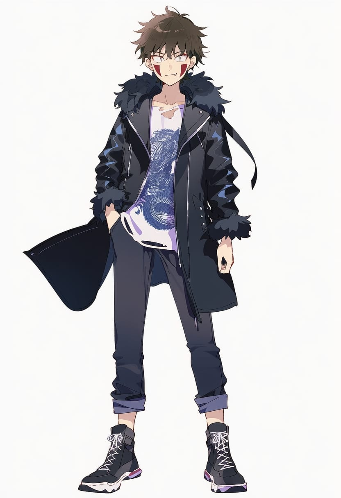

| 字段 | 内容 |
| --- | --- |
| 序号 | 185 |
| Danbooru Tag | fang |
| 中文名 | 露虎牙 |
| 中文含义 | 露出一颗明显尖牙。 |
| 子类 | 眉眼/嘴部细节 |
| 角色 | 1boy,inuzuka_kiba |

## 139. teeth — 嘴里能明显看到牙齿。

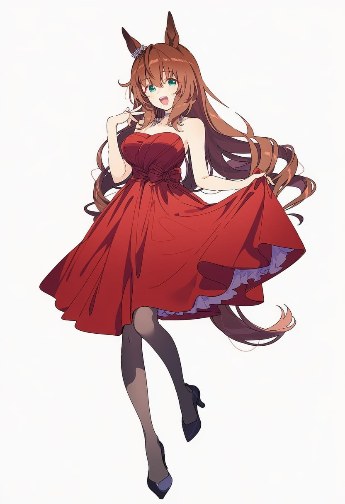

| 字段 | 内容 |
| --- | --- |
| 序号 | 186 |
| Danbooru Tag | teeth |
| 中文名 | 露牙 |
| 中文含义 | 嘴里能明显看到牙齿。 |
| 子类 | 眉眼/嘴部细节 |
| 角色 | 1girl,maruzensky_(umamusume) |

## 140. drooling — 明显有口水流出。

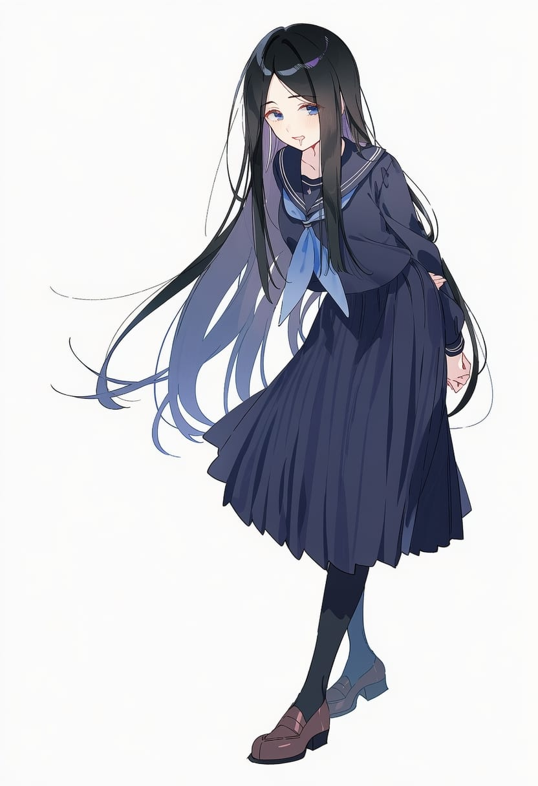

| 字段 | 内容 |
| --- | --- |
| 序号 | 187 |
| Danbooru Tag | drooling |
| 中文名 | 流口水 |
| 中文含义 | 明显有口水流出。 |
| 子类 | 眉眼/嘴部细节 |
| 角色 | 1girl,unohana_retsu |

## 141. puckered_lips — 嘴唇收紧向前突出。

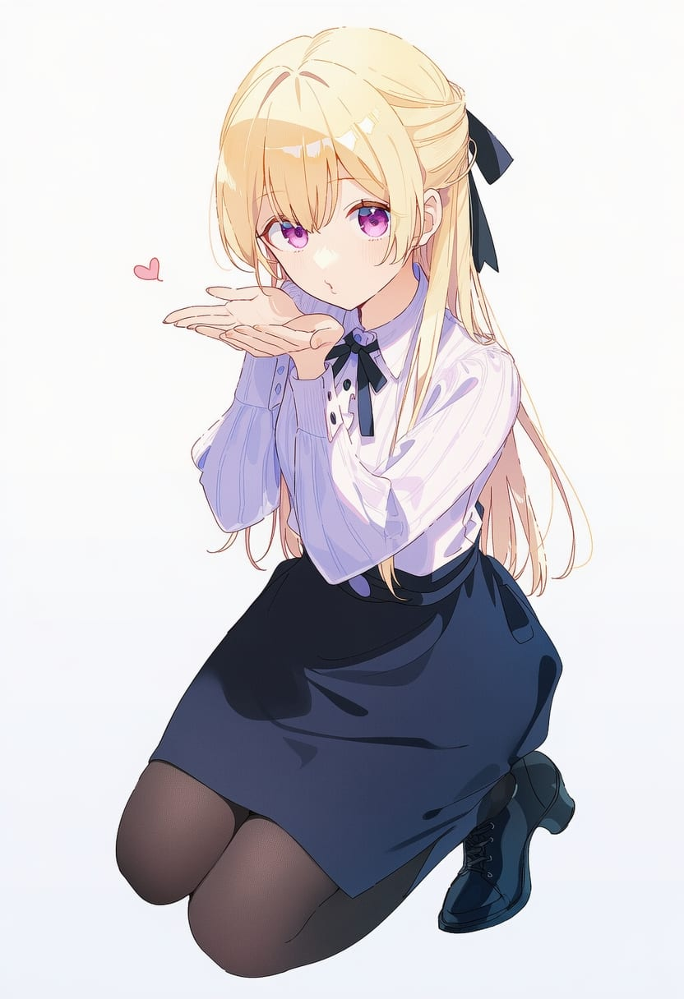

| 字段 | 内容 |
| --- | --- |
| 序号 | 188 |
| Danbooru Tag | puckered_lips |
| 中文名 | 撅唇 |
| 中文含义 | 嘴唇收紧向前突出。 |
| 子类 | 眉眼/嘴部细节 |
| 角色 | 1girl,shirasagi_chisato |

## 142. fang_out — 闭嘴时仍有尖牙露在外面。

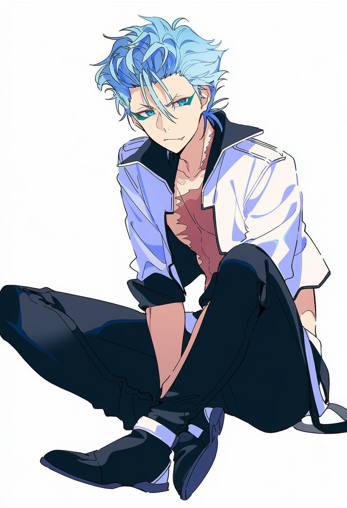

| 字段 | 内容 |
| --- | --- |
| 序号 | 189 |
| Danbooru Tag | fang_out |
| 中文名 | 虎牙外露 |
| 中文含义 | 闭嘴时仍有尖牙露在外面。 |
| 子类 | 眉眼/嘴部细节 |
| 角色 | 1boy,grimmjow_jaegerjaquez |

## 143. upper_teeth_only — 只显示上排牙齿。

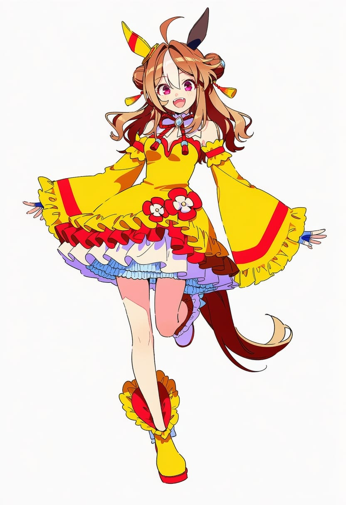

| 字段 | 内容 |
| --- | --- |
| 序号 | 190 |
| Danbooru Tag | upper_teeth_only |
| 中文名 | 只露上排牙 |
| 中文含义 | 只显示上排牙齿。 |
| 子类 | 眉眼/嘴部细节 |
| 角色 | 1girl,copano_rickey_(umamusume) |

## 144. skin_fang — 用肤色三角缺口表现虎牙。

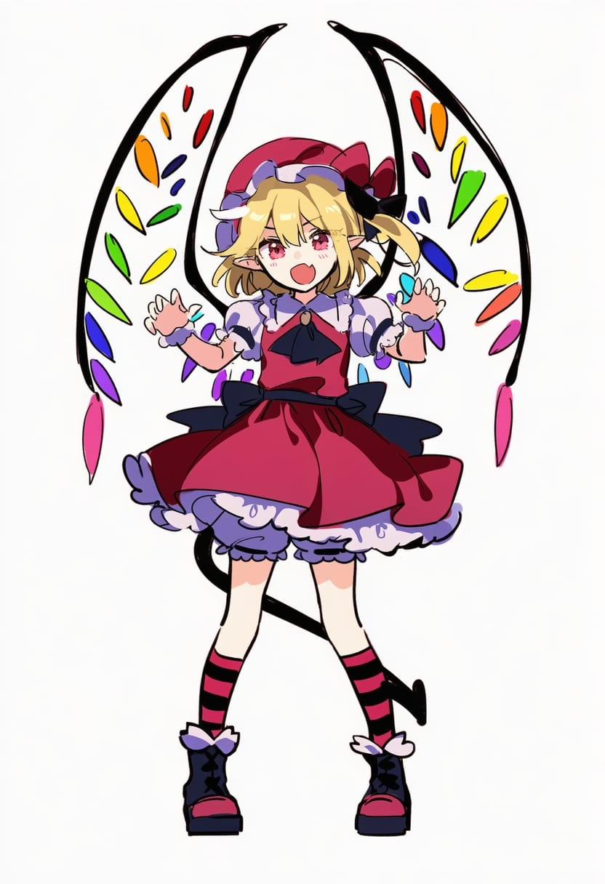

| 字段 | 内容 |
| --- | --- |
| 序号 | 191 |
| Danbooru Tag | skin_fang |
| 中文名 | 皮肤色虎牙 |
| 中文含义 | 用肤色三角缺口表现虎牙。 |
| 子类 | 眉眼/嘴部细节 |
| 角色 | 1boy,happy_(fairy_tail) |

## 145. sharp_teeth — 露出多颗明显尖锐牙齿。

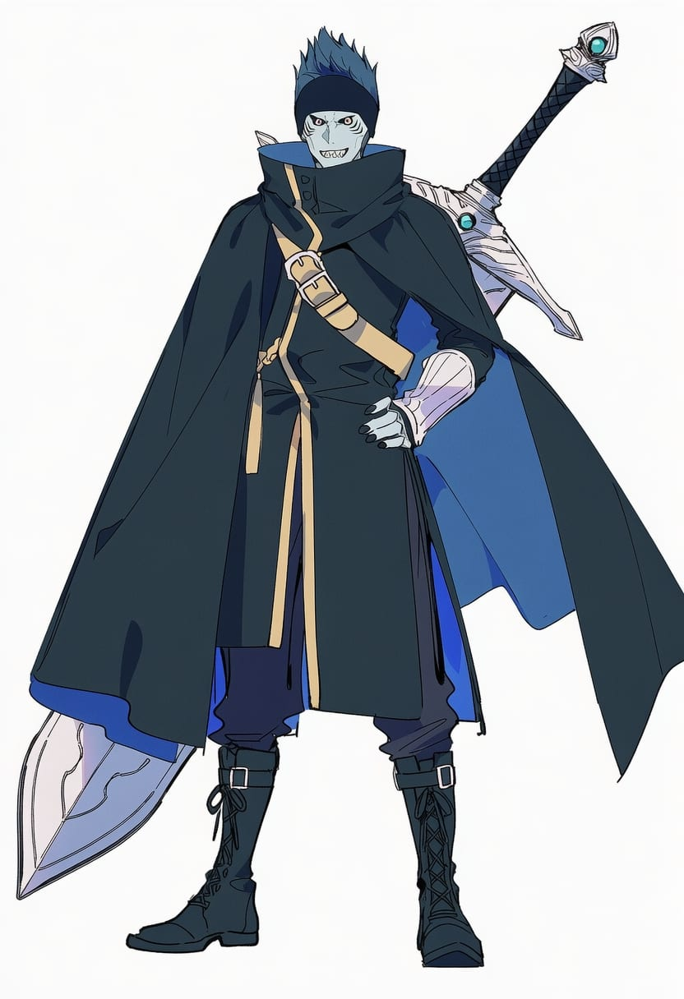

| 字段 | 内容 |
| --- | --- |
| 序号 | 192 |
| Danbooru Tag | sharp_teeth |
| 中文名 | 尖牙齿 |
| 中文含义 | 露出多颗明显尖锐牙齿。 |
| 子类 | 眉眼/嘴部细节 |
| 角色 | 1boy,hoshigaki_kisame |

## 146. ;) — 眨一只眼的微笑颜文字。

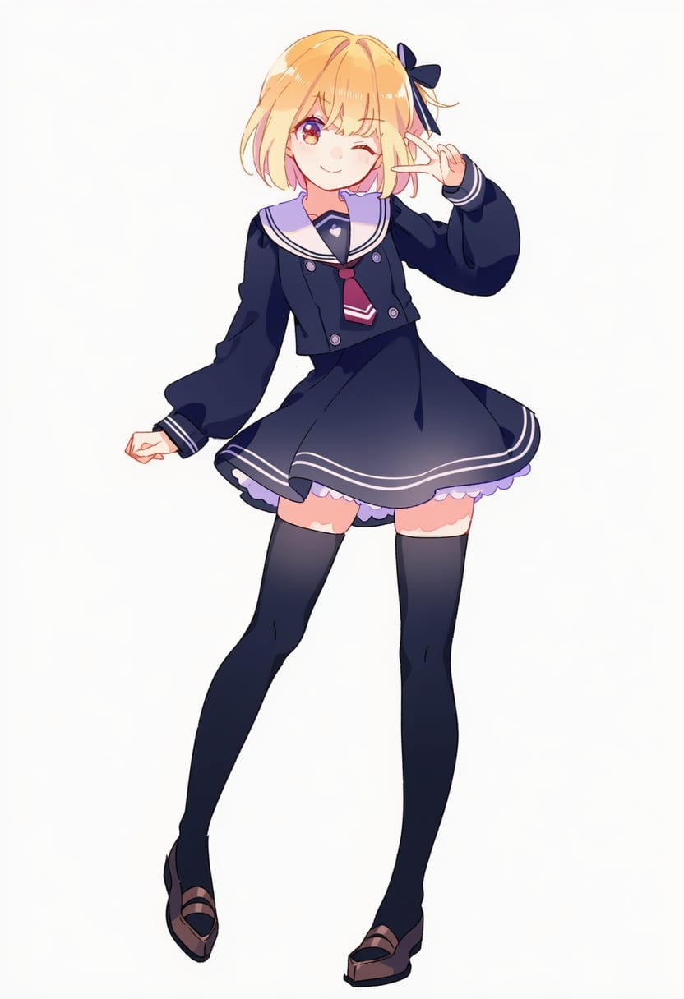

| 字段 | 内容 |
| --- | --- |
| 序号 | 193 |
| Danbooru Tag | ;) |
| 中文名 | 眨眼笑脸 |
| 中文含义 | 眨一只眼的微笑颜文字。 |
| 子类 | 颜文字/漫画表情 |
| 角色 | 1boy,jinbe_(one_piece) |

## 147. :d — 张大嘴开心笑。

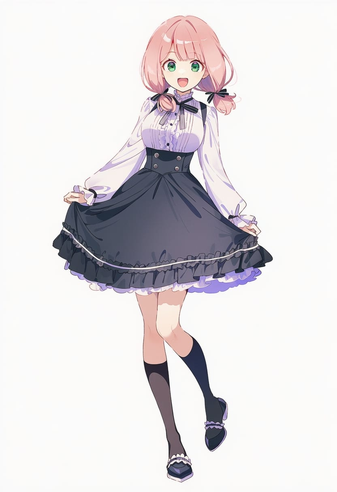

| 字段 | 内容 |
| --- | --- |
| 序号 | 194 |
| Danbooru Tag | :d |
| 中文名 | 大笑脸 :D |
| 中文含义 | 张大嘴开心笑。 |
| 子类 | 颜文字/漫画表情 |
| 角色 | 1girl,uehara_himari |

## 148. ;d — 眨眼并张嘴大笑。

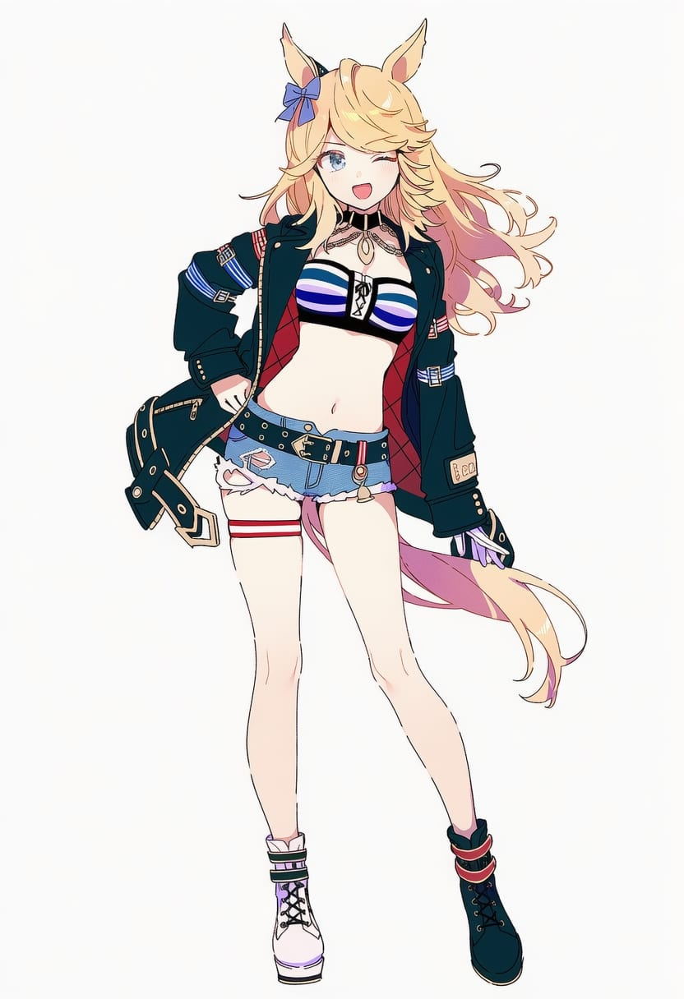

| 字段 | 内容 |
| --- | --- |
| 序号 | 195 |
| Danbooru Tag | ;d |
| 中文名 | 眨眼大笑 ;D |
| 中文含义 | 眨眼并张嘴大笑。 |
| 子类 | 颜文字/漫画表情 |
| 角色 | 1girl,gold_city_(umamusume) |

## 149. xd — 闭眼张嘴的爆笑表情。

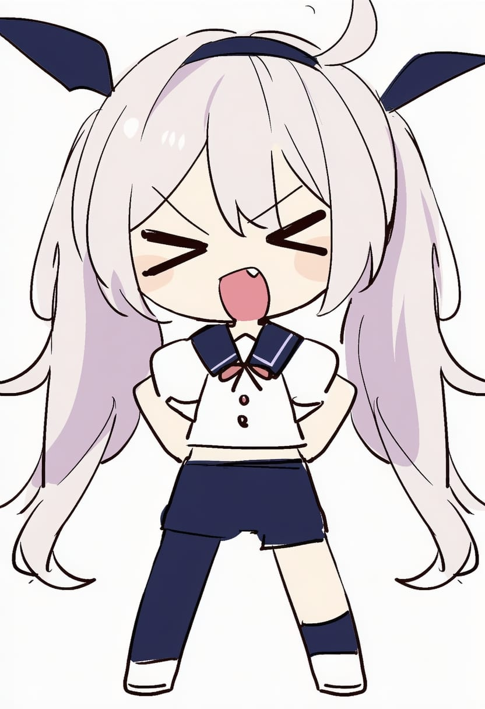

| 字段 | 内容 |
| --- | --- |
| 序号 | 196 |
| Danbooru Tag | xd |
| 中文名 | XD笑脸 |
| 中文含义 | 闭眼张嘴的爆笑表情。 |
| 子类 | 颜文字/漫画表情 |
| 角色 | 1girl,mirajane_strauss |

## 150. d: — 张嘴惊讶或惊恐。

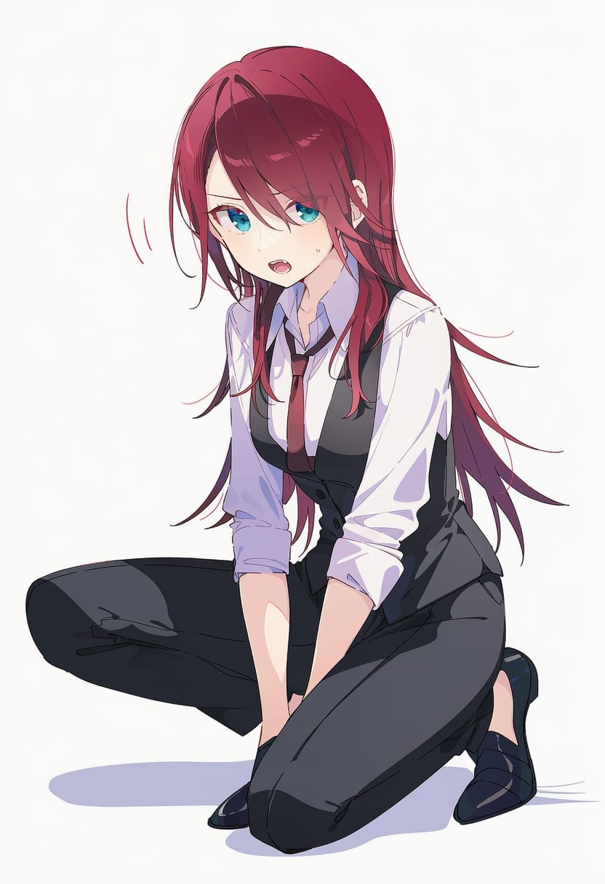

| 字段 | 内容 |
| --- | --- |
| 序号 | 197 |
| Danbooru Tag | d: |
| 中文名 | D:惊恐脸 |
| 中文含义 | 张嘴惊讶或惊恐。 |
| 子类 | 颜文字/漫画表情 |
| 角色 | 1girl,udagawa_tomoe |

## 151. :3 — 猫咪嘴式可爱笑脸。

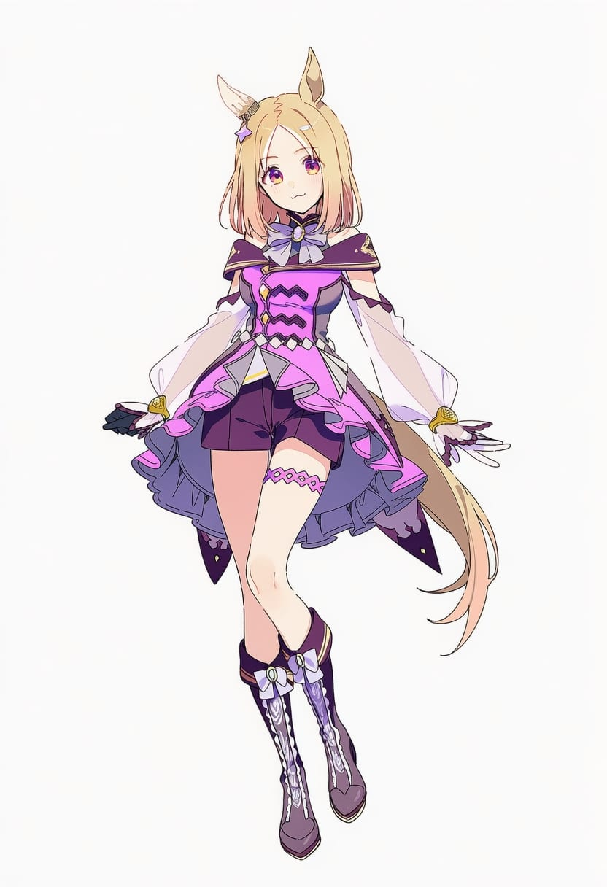

| 字段 | 内容 |
| --- | --- |
| 序号 | 198 |
| Danbooru Tag | :3 |
| 中文名 | 猫嘴 :3 |
| 中文含义 | 猫咪嘴式可爱笑脸。 |
| 子类 | 颜文字/漫画表情 |
| 角色 | 1girl,narita_top_road_(umamusume) |

## 152. ;3 — 眨眼加 :3 猫嘴。

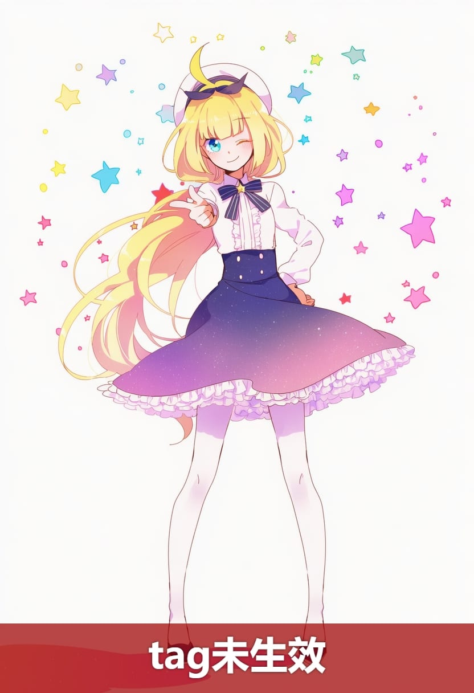

| 字段 | 内容 |
| --- | --- |
| 序号 | 199 |
| Danbooru Tag | ;3 |
| 中文名 | 眨眼猫嘴 ;3 |
| 中文含义 | 眨眼加 :3 猫嘴。 |
| 子类 | 颜文字/漫画表情 |
| 角色 | 1boy,uchiha_obito |

## 153. x3 — 闭眼配猫嘴的开心表情。

| 字段 | 内容 |
| --- | --- |
| 序号 | 200 |
| Danbooru Tag | x3 |
| 中文名 | X3笑脸 |
| 中文含义 | 闭眼配猫嘴的开心表情。 |
| 子类 | 颜文字/漫画表情 |
| 角色 | 1girl,suzuki_jun |

## 154. 3: — 类似 :3 但嘴角向下。

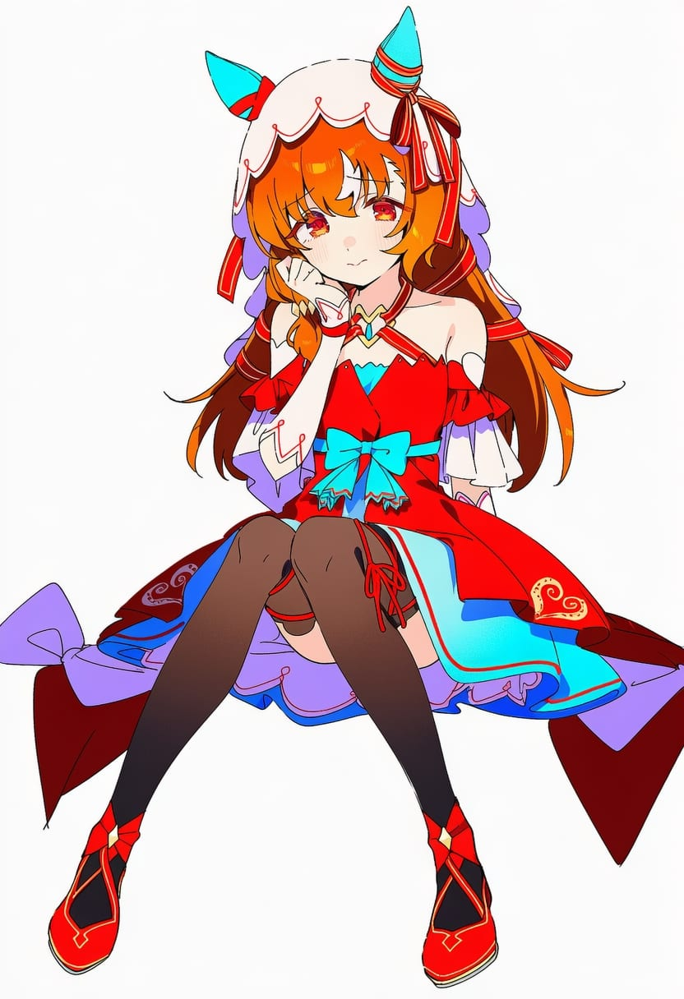

| 字段 | 内容 |
| --- | --- |
| 序号 | 201 |
| Danbooru Tag | 3: |
| 中文名 | 反向猫嘴 3: |
| 中文含义 | 类似 :3 但嘴角向下。 |
| 子类 | 颜文字/漫画表情 |
| 角色 | 1girl,still_in_love_(umamusume) |

## 155. 0w0 — 圆眼配 w 嘴的可爱表情。

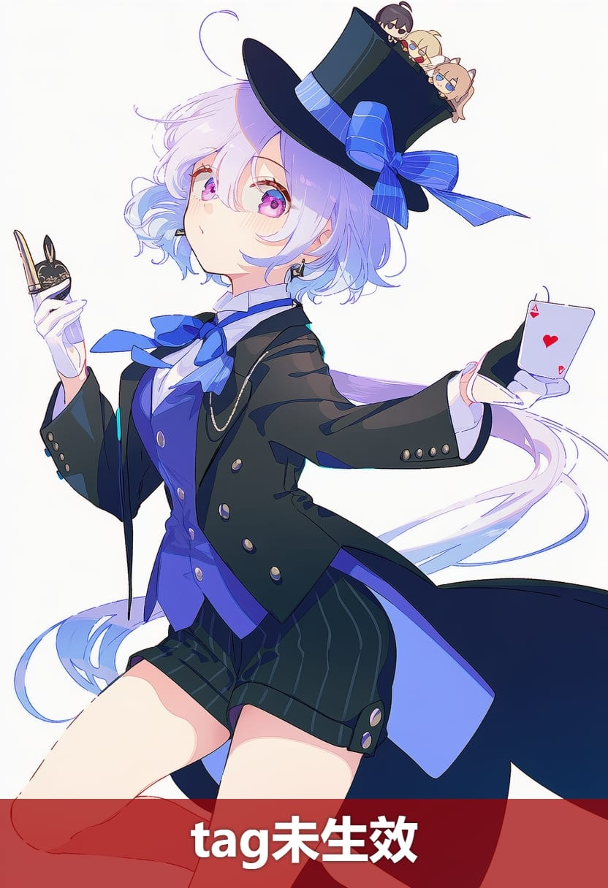

| 字段 | 内容 |
| --- | --- |
| 序号 | 202 |
| Danbooru Tag | 0w0 |
| 中文名 | 0w0萌脸 |
| 中文含义 | 圆眼配 w 嘴的可爱表情。 |
| 子类 | 颜文字/漫画表情 |
| 角色 | 1boy,shimura_shinpachi |

## 156. uwu — 闭眼猫嘴，表现满足或软萌。

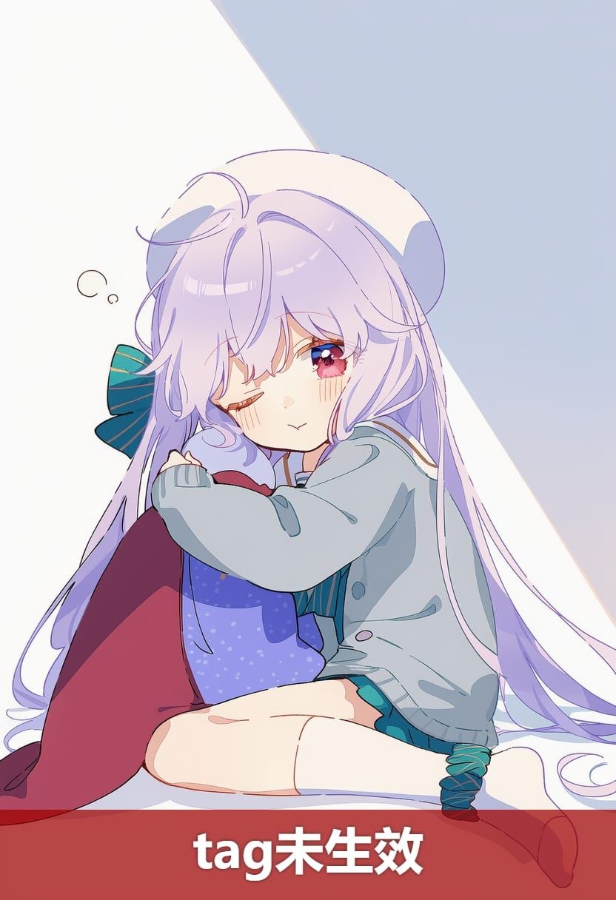

| 字段 | 内容 |
| --- | --- |
| 序号 | 203 |
| Danbooru Tag | uwu |
| 中文名 | uwu脸 |
| 中文含义 | 闭眼猫嘴，表现满足或软萌。 |
| 子类 | 颜文字/漫画表情 |
| 角色 | 1girl,tanaka_asuka |

## 157. :p — 睁眼吐舌的调皮脸。

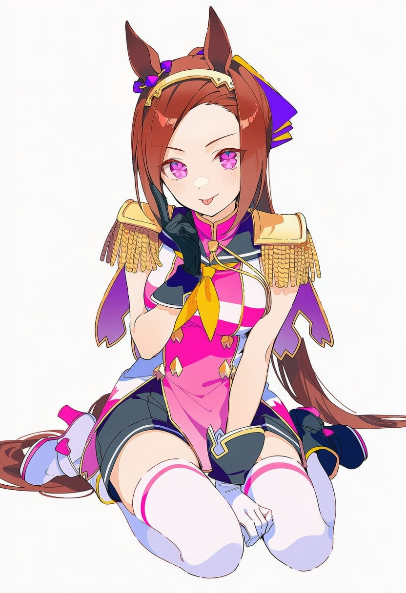

| 字段 | 内容 |
| --- | --- |
| 序号 | 204 |
| Danbooru Tag | :p |
| 中文名 | 吐舌 :P |
| 中文含义 | 睁眼吐舌的调皮脸。 |
| 子类 | 颜文字/漫画表情 |
| 角色 | 1girl,sakura_bakushin_o_(umamusume) |

## 158. ;p — 眨眼并吐舌。

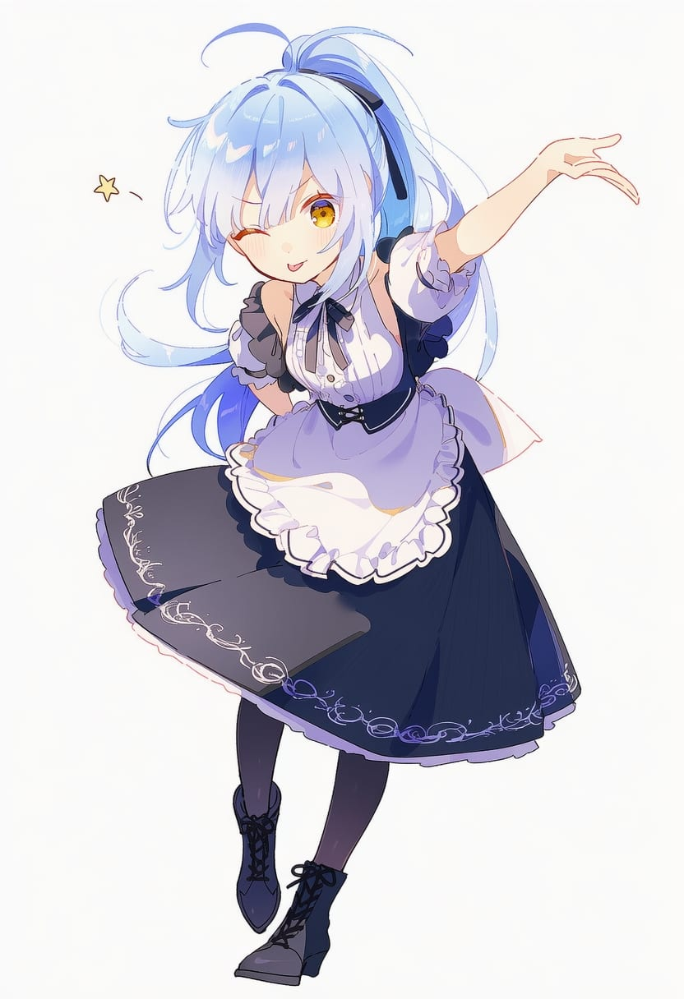

| 字段 | 内容 |
| --- | --- |
| 序号 | 205 |
| Danbooru Tag | ;p |
| 中文名 | 眨眼吐舌 ;P |
| 中文含义 | 眨眼并吐舌。 |
| 子类 | 颜文字/漫画表情 |
| 角色 | 1boy,deidara_(naruto) |

## 159. :q — 舌头偏向一侧的调皮表情。

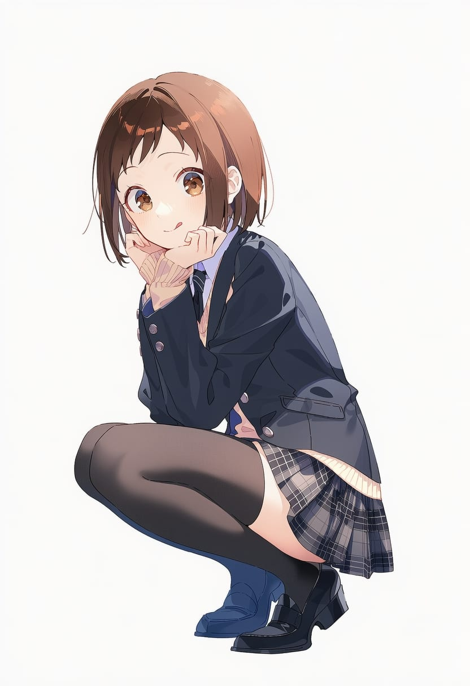

| 字段 | 内容 |
| --- | --- |
| 序号 | 206 |
| Danbooru Tag | :q |
| 中文名 | 舔嘴 :q |
| 中文含义 | 舌头偏向一侧的调皮表情。 |
| 子类 | 颜文字/漫画表情 |
| 角色 | 1girl,hazawa_tsugumi |

## 160. >:) — 带眉压感的邪恶笑脸。

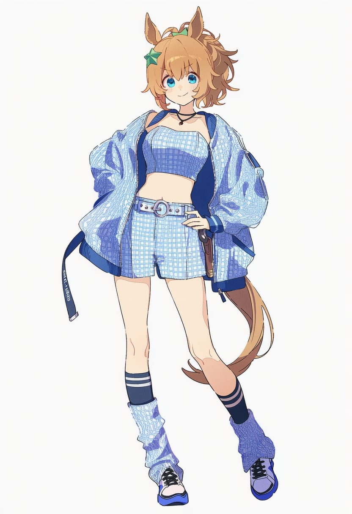

| 字段 | 内容 |
| --- | --- |
| 序号 | 207 |
| Danbooru Tag | >:) |
| 中文名 | 坏笑 >:) |
| 中文含义 | 带眉压感的邪恶笑脸。 |
| 子类 | 颜文字/漫画表情 |
| 角色 | 1girl,taiki_shuttle_(umamusume) |

## 161. >:( — 眉头下压的生气脸。

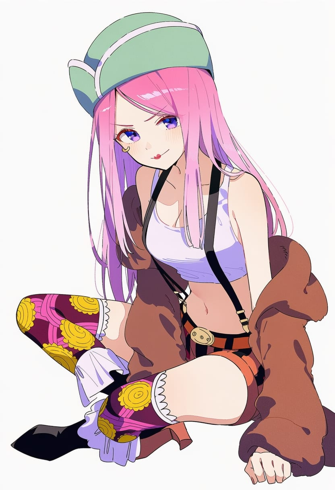

| 字段 | 内容 |
| --- | --- |
| 序号 | 208 |
| Danbooru Tag | >:( |
| 中文名 | 愤怒 >:( |
| 中文含义 | 眉头下压的生气脸。 |
| 子类 | 颜文字/漫画表情 |
| 角色 | 1girl,jewelry_bonney |

## 162. :t — 扁平嘴的无语或不满表情。

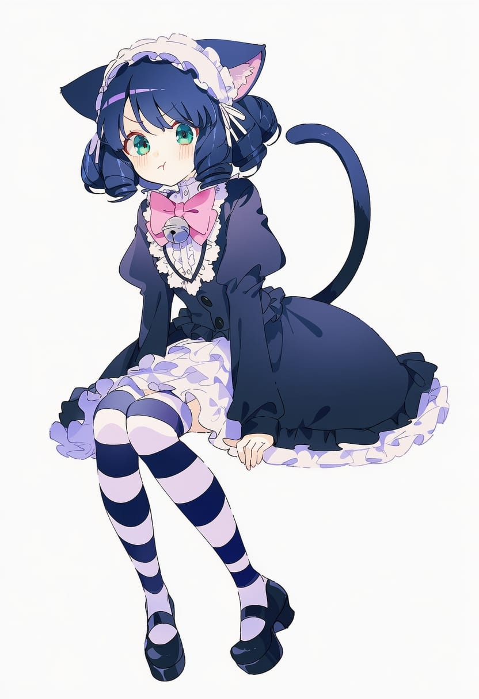

| 字段 | 内容 |
| --- | --- |
| 序号 | 209 |
| Danbooru Tag | :t |
| 中文名 | :T脸 |
| 中文含义 | 扁平嘴的无语或不满表情。 |
| 子类 | 颜文字/漫画表情 |
| 角色 | 1girl,cyan_(show_by_rock!!) |

## 163. :/ — 犹豫、无语或不确定。

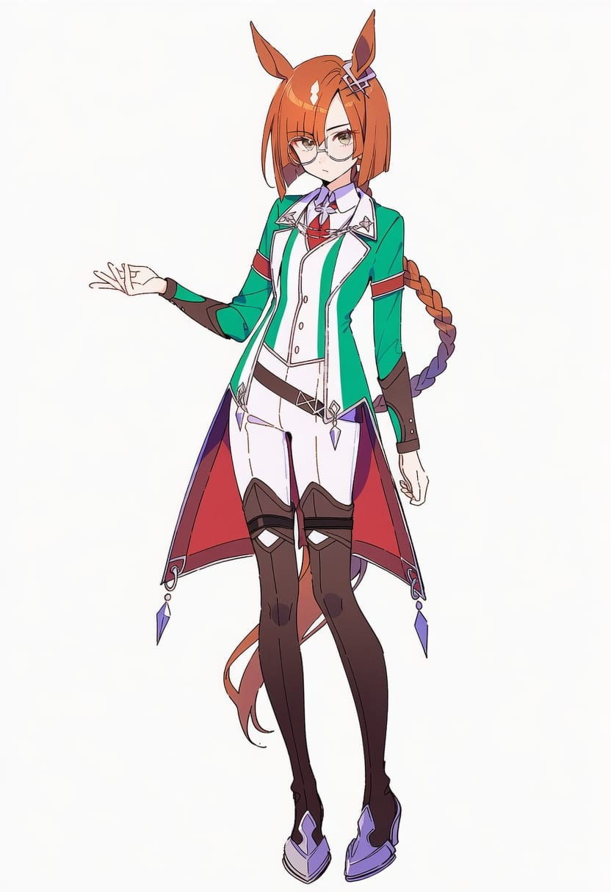

| 字段 | 内容 |
| --- | --- |
| 序号 | 210 |
| Danbooru Tag | :/ |
| 中文名 | 斜嘴 :/ |
| 中文含义 | 犹豫、无语或不确定。 |
| 子类 | 颜文字/漫画表情 |
| 角色 | 1girl,ikuno_dictus_(umamusume) |

## 164. :| — 面无表情的直线嘴。

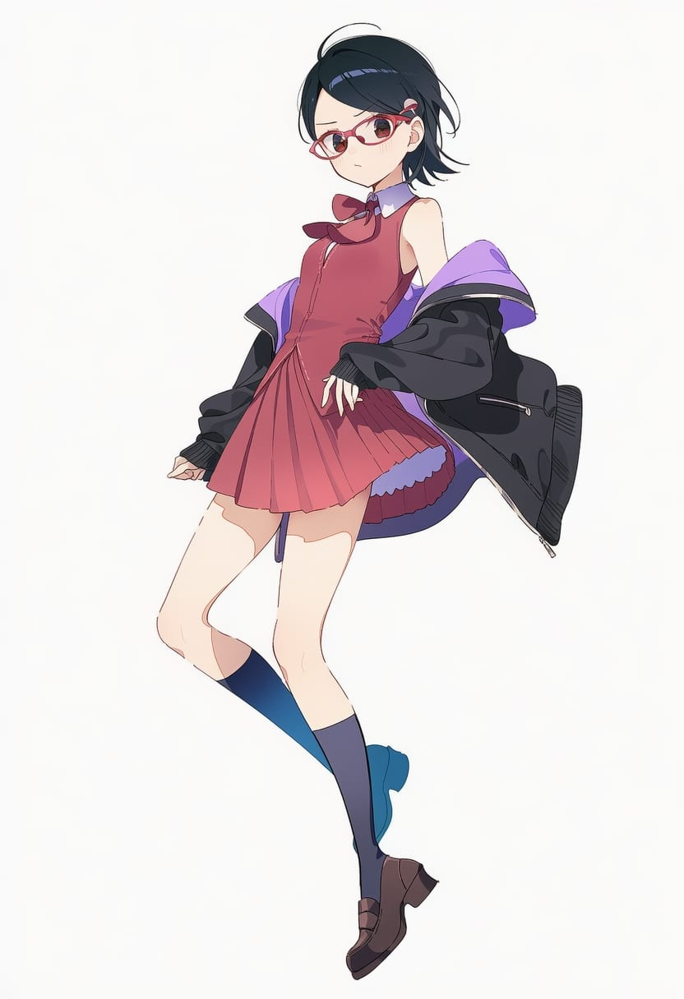

| 字段 | 内容 |
| --- | --- |
| 序号 | 211 |
| Danbooru Tag | :\| |
| 中文名 | 直线嘴 :\| |
| 中文含义 | 面无表情的直线嘴。 |
| 子类 | 颜文字/漫画表情 |
| 角色 | 1girl,uchiha_sarada |

## 165. :c — 嘴角向下的难过脸。

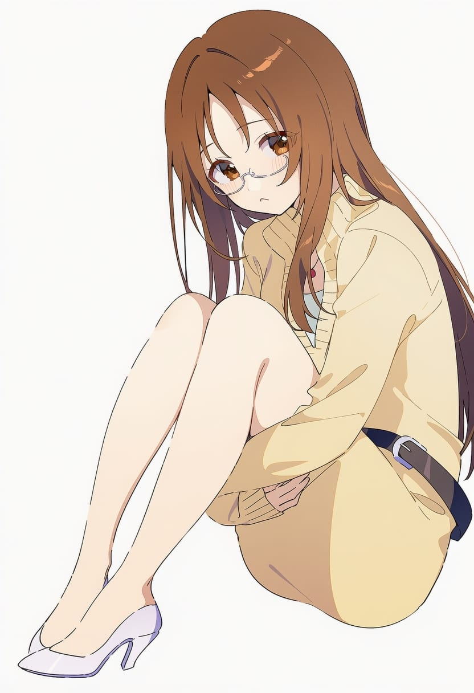

| 字段 | 内容 |
| --- | --- |
| 序号 | 212 |
| Danbooru Tag | :c |
| 中文名 | 难过 :c |
| 中文含义 | 嘴角向下的难过脸。 |
| 子类 | 颜文字/漫画表情 |
| 角色 | 1girl,yamanaka_sawako |

## 166. c: — 反向弧形嘴的简化笑脸。

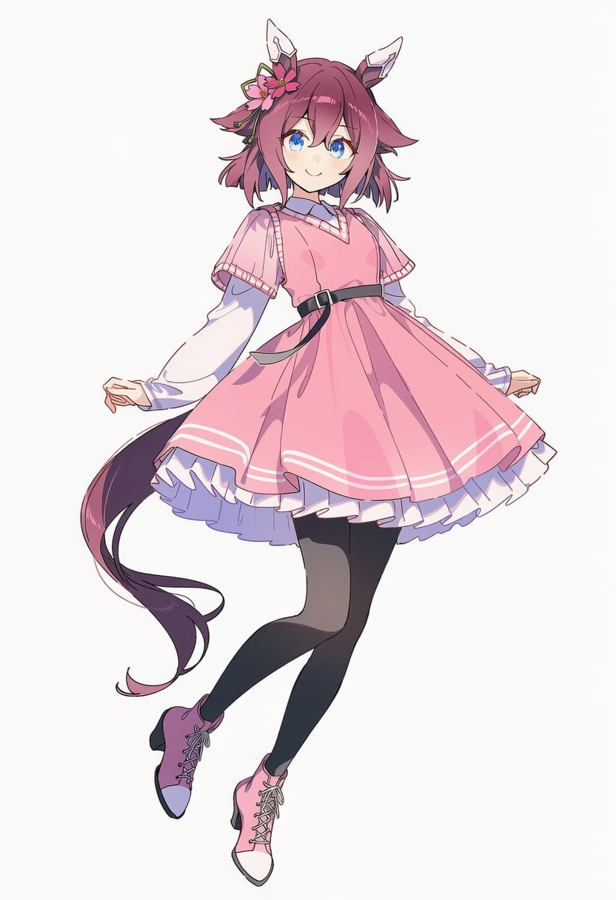

| 字段 | 内容 |
| --- | --- |
| 序号 | 213 |
| Danbooru Tag | c: |
| 中文名 | 反向 c: |
| 中文含义 | 反向弧形嘴的简化笑脸。 |
| 子类 | 颜文字/漫画表情 |
| 角色 | 1girl,sakura_chiyono_o_(umamusume) |

## 167. :< — 嘴角向下的委屈脸。

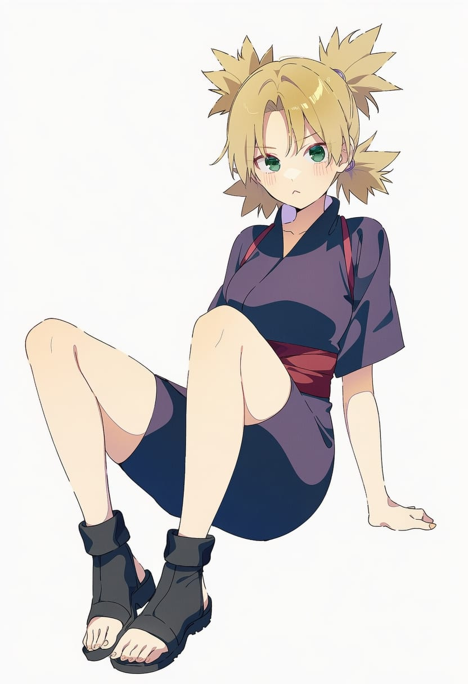

| 字段 | 内容 |
| --- | --- |
| 序号 | 214 |
| Danbooru Tag | :< |
| 中文名 | 委屈 :< |
| 中文含义 | 嘴角向下的委屈脸。 |
| 子类 | 颜文字/漫画表情 |
| 角色 | 1girl,temari_(naruto) |

## 168. :> — 尖嘴式轻笑或得意脸。

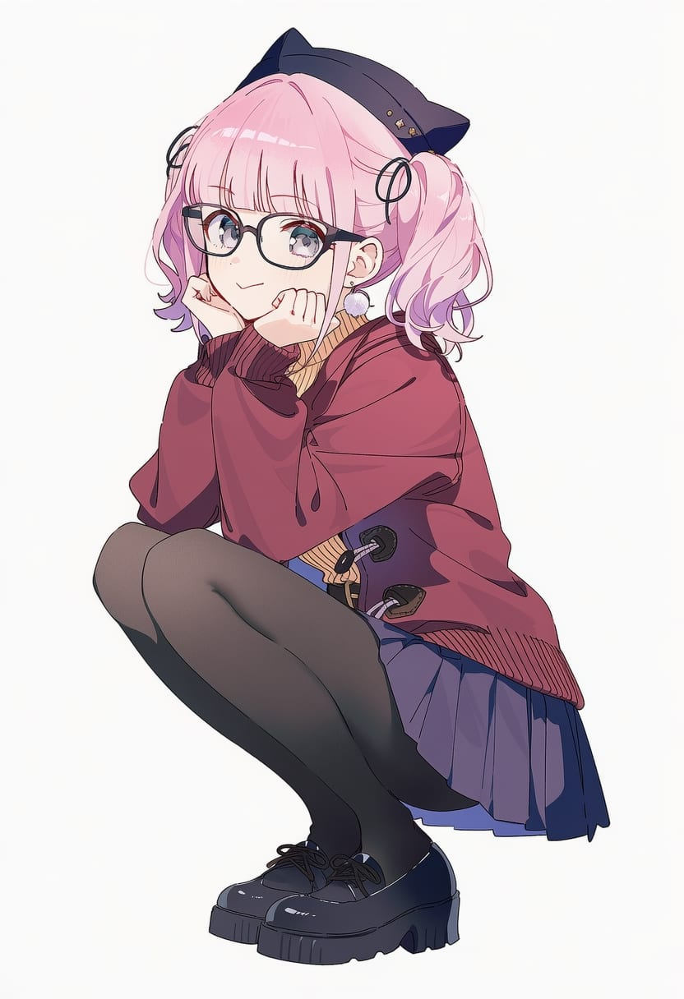

| 字段 | 内容 |
| --- | --- |
| 序号 | 215 |
| Danbooru Tag | :> |
| 中文名 | 小得意 :> |
| 中文含义 | 尖嘴式轻笑或得意脸。 |
| 子类 | 颜文字/漫画表情 |
| 角色 | 1girl,hina_(girls_band_cry) |

## 169. :o — 圆嘴惊讶脸。

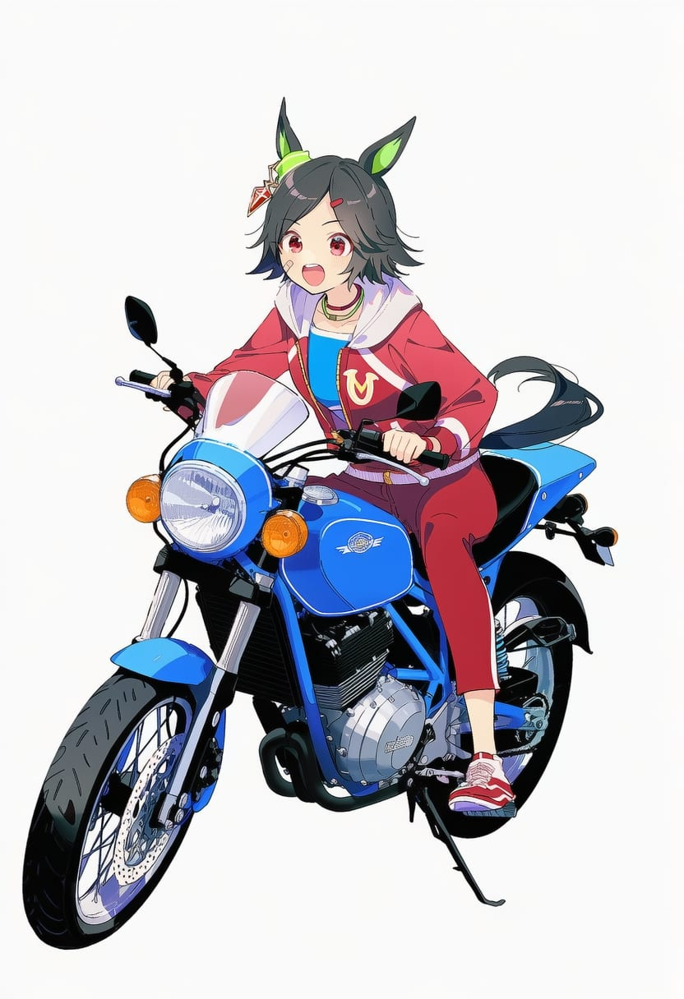

| 字段 | 内容 |
| --- | --- |
| 序号 | 216 |
| Danbooru Tag | :o |
| 中文名 | 惊讶 :o |
| 中文含义 | 圆嘴惊讶脸。 |
| 子类 | 颜文字/漫画表情 |
| 角色 | 1girl,winning_ticket_(umamusume) |

## 170. ;o — 眨眼配圆形嘴。

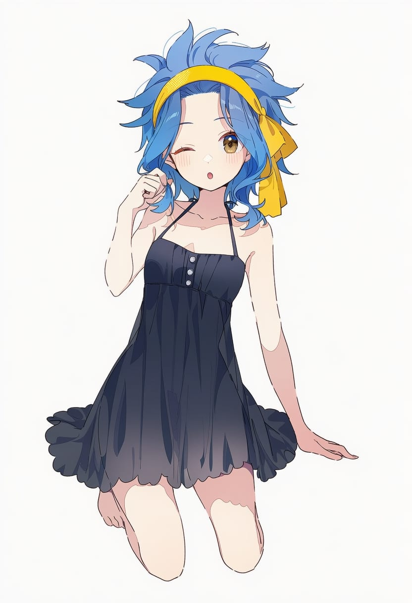

| 字段 | 内容 |
| --- | --- |
| 序号 | 217 |
| Danbooru Tag | ;o |
| 中文名 | 眨眼圆嘴 ;o |
| 中文含义 | 眨眼配圆形嘴。 |
| 子类 | 颜文字/漫画表情 |
| 角色 | 1girl,levy_mcgarden |

## 171. o3o — 圆眼配 3 字嘟嘴。

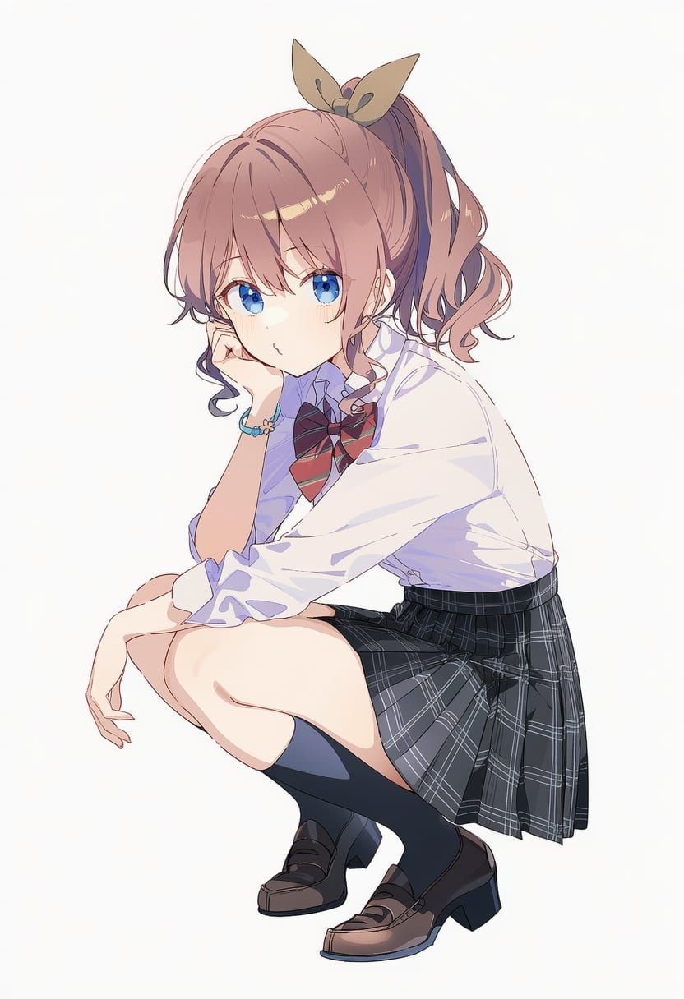

| 字段 | 内容 |
| --- | --- |
| 序号 | 218 |
| Danbooru Tag | o3o |
| 中文名 | o3o嘟嘴 |
| 中文含义 | 圆眼配 3 字嘟嘴。 |
| 子类 | 颜文字/漫画表情 |
| 角色 | 1girl,yamabuki_saya |

## 172. >3< — 挤眼配 3 字嘴的夸张可爱脸。

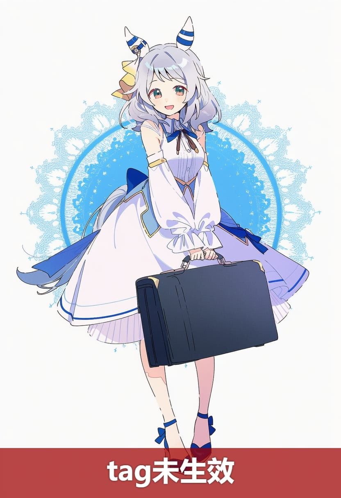

| 字段 | 内容 |
| --- | --- |
| 序号 | 219 |
| Danbooru Tag | >3< |
| 中文名 | >3<撒娇脸 |
| 中文含义 | 挤眼配 3 字嘴的夸张可爱脸。 |
| 子类 | 颜文字/漫画表情 |
| 角色 | 1girl,hishi_miracle_(umamusume) |

## 173. o_o — 双眼圆睁的呆滞或震惊脸。

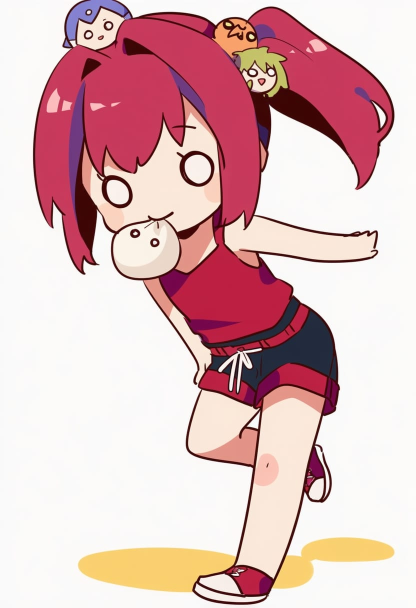

| 字段 | 内容 |
| --- | --- |
| 序号 | 220 |
| Danbooru Tag | o_o |
| 中文名 | O_O呆脸 |
| 中文含义 | 双眼圆睁的呆滞或震惊脸。 |
| 子类 | 颜文字/漫画表情 |
| 角色 | 1girl,rebecca_(one_piece) |

## 174. 0_0 — 大圆眼直视的震惊表情。

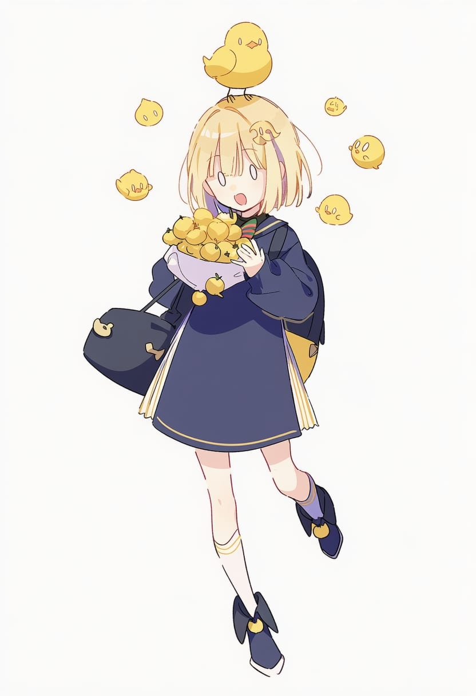

| 字段 | 内容 |
| --- | --- |
| 序号 | 221 |
| Danbooru Tag | 0_0 |
| 中文名 | 0_0震惊脸 |
| 中文含义 | 大圆眼直视的震惊表情。 |
| 子类 | 颜文字/漫画表情 |
| 角色 | 1girl,hanazono_tae |

## 175. ._. — 小眼配平嘴的尴尬无语脸。

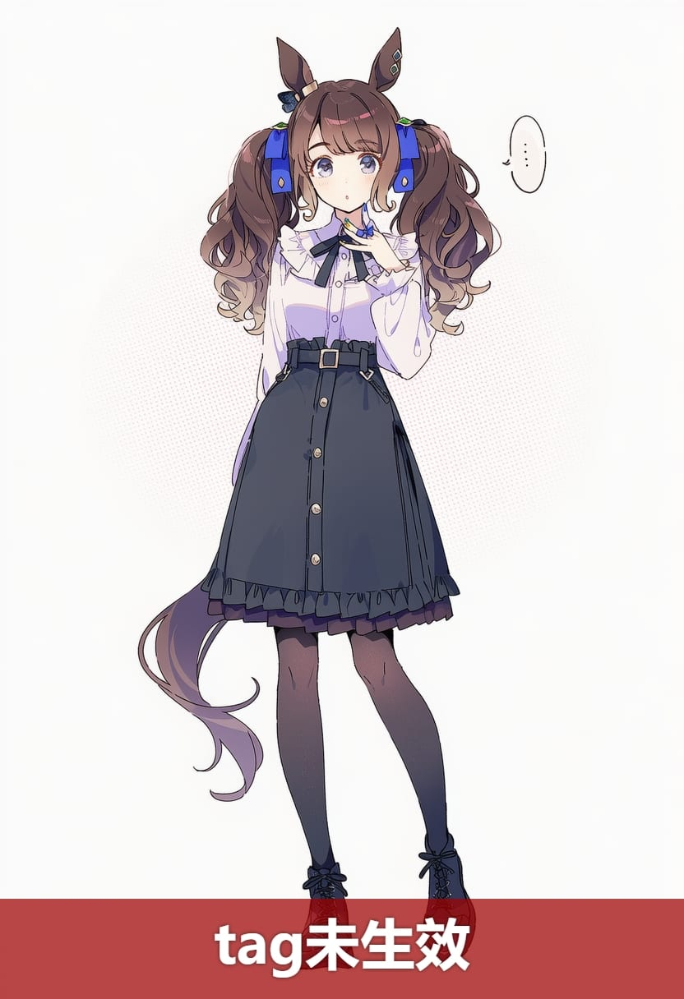

| 字段 | 内容 |
| --- | --- |
| 序号 | 222 |
| Danbooru Tag | ._. |
| 中文名 | ._.无语脸 |
| 中文含义 | 小眼配平嘴的尴尬无语脸。 |
| 子类 | 颜文字/漫画表情 |
| 角色 | 1girl,tosen_jordan_(umamusume) |

## 176. ^_^ — 弯弯闭眼的开心笑脸。

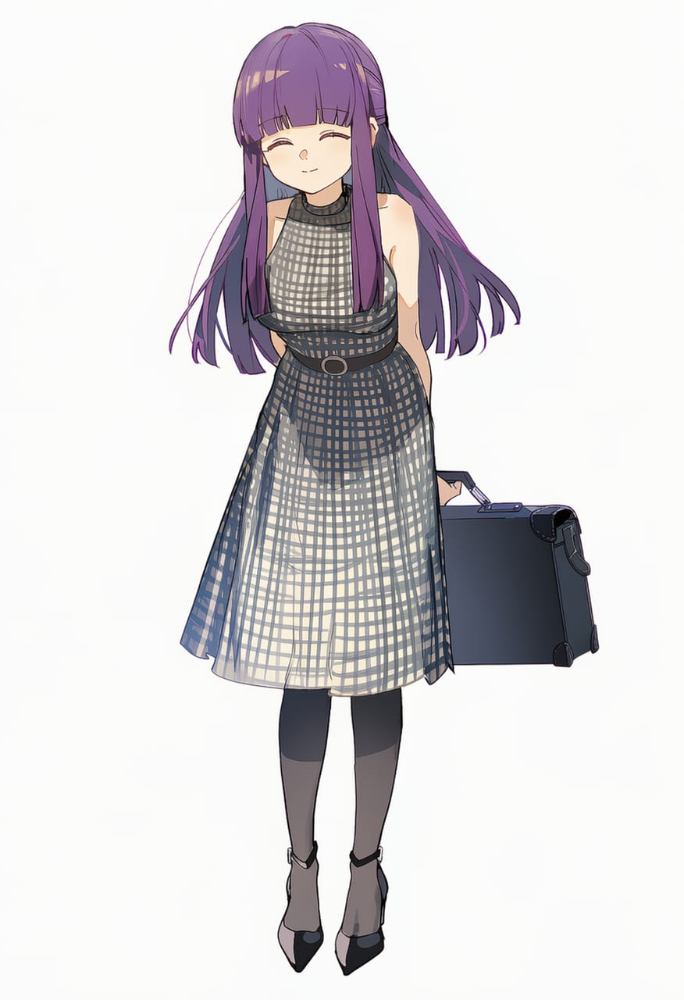

| 字段 | 内容 |
| --- | --- |
| 序号 | 223 |
| Danbooru Tag | ^_^ |
| 中文名 | ^_^笑眼 |
| 中文含义 | 弯弯闭眼的开心笑脸。 |
| 子类 | 颜文字/漫画表情 |
| 角色 | 1boy,hyuuga_neji |

## 177. ^q^ — 笑眼配流口水式嘴型。

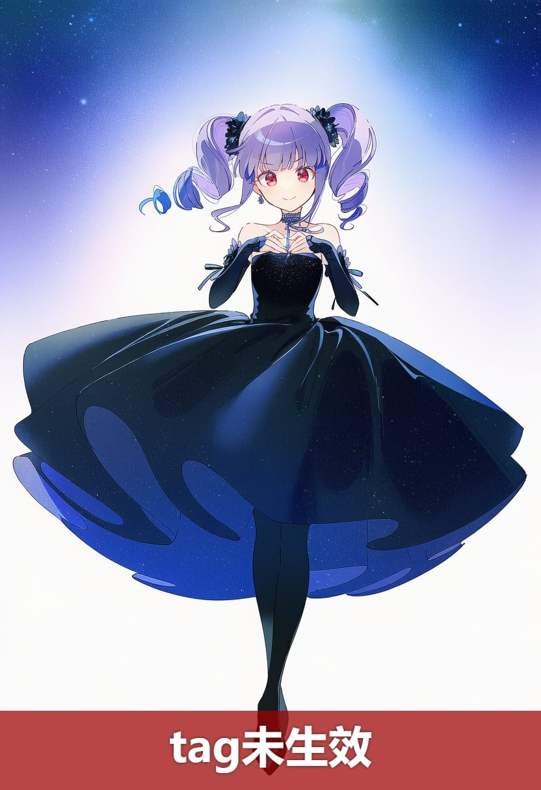

| 字段 | 内容 |
| --- | --- |
| 序号 | 224 |
| Danbooru Tag | ^q^ |
| 中文名 | ^q^陶醉脸 |
| 中文含义 | 笑眼配流口水式嘴型。 |
| 子类 | 颜文字/漫画表情 |
| 角色 | 1girl,udagawa_ako |

## 178. >_< — 双眼用力闭紧的表情。

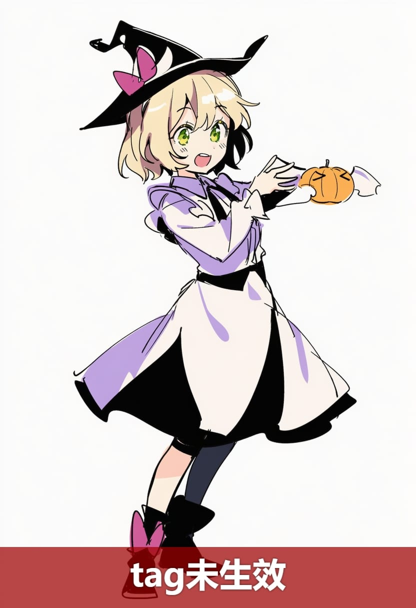

| 字段 | 内容 |
| --- | --- |
| 序号 | 225 |
| Danbooru Tag | >_< |
| 中文名 | >_<挤眼 |
| 中文含义 | 双眼用力闭紧的表情。 |
| 子类 | 颜文字/漫画表情 |
| 角色 | 1girl,hishi_amazon_(umamusume) |

## 179. >o< — 挤眼并张圆嘴大叫。

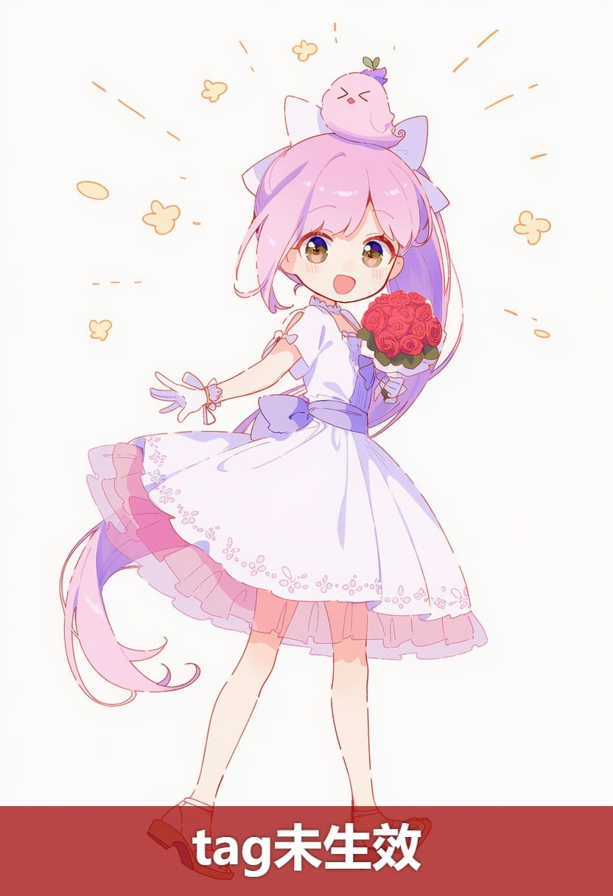

| 字段 | 内容 |
| --- | --- |
| 序号 | 226 |
| Danbooru Tag | >o< |
| 中文名 | >o<大叫脸 |
| 中文含义 | 挤眼并张圆嘴大叫。 |
| 子类 | 颜文字/漫画表情 |
| 角色 | 1boy,eustass_kid |

## 180. @_@ — 螺旋眼式眩晕或混乱。

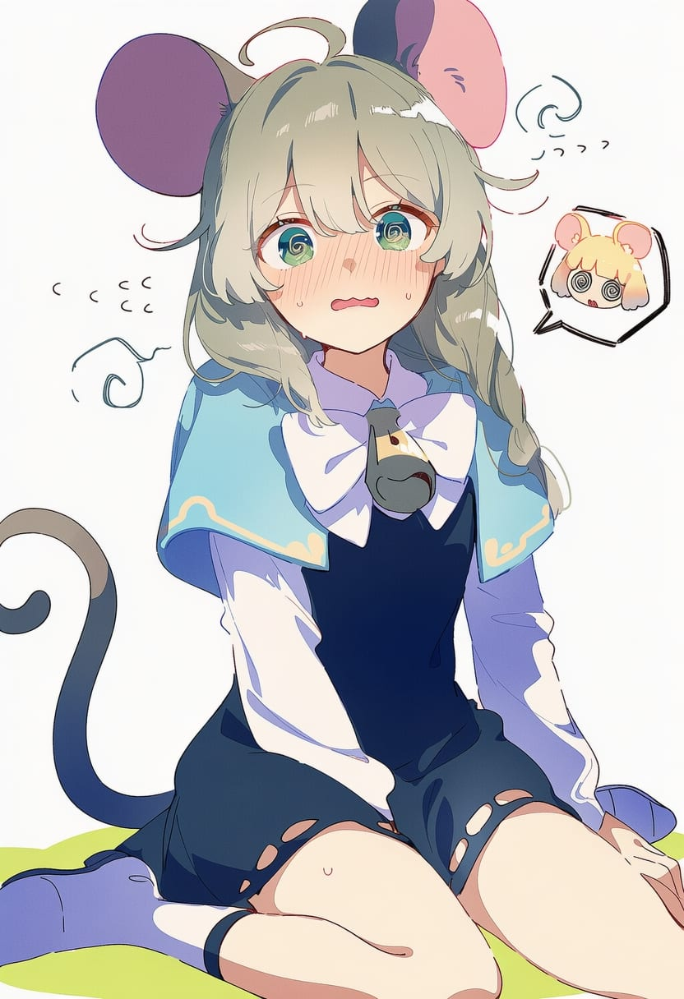

| 字段 | 内容 |
| --- | --- |
| 序号 | 227 |
| Danbooru Tag | @_@ |
| 中文名 | @_@眩晕眼 |
| 中文含义 | 螺旋眼式眩晕或混乱。 |
| 子类 | 颜文字/漫画表情 |
| 角色 | 1girl,yamanouchi_kano |

## 181. +_+ — 十字亮眼的兴奋表情。

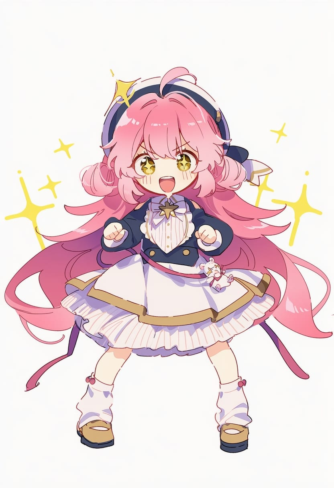

| 字段 | 内容 |
| --- | --- |
| 序号 | 228 |
| Danbooru Tag | +_+ |
| 中文名 | +_+闪亮眼 |
| 中文含义 | 十字亮眼的兴奋表情。 |
| 子类 | 颜文字/漫画表情 |
| 角色 | 1girl,aston_machan_(umamusume) |

## 182. =_= — 半闭平直眼的无语表情。

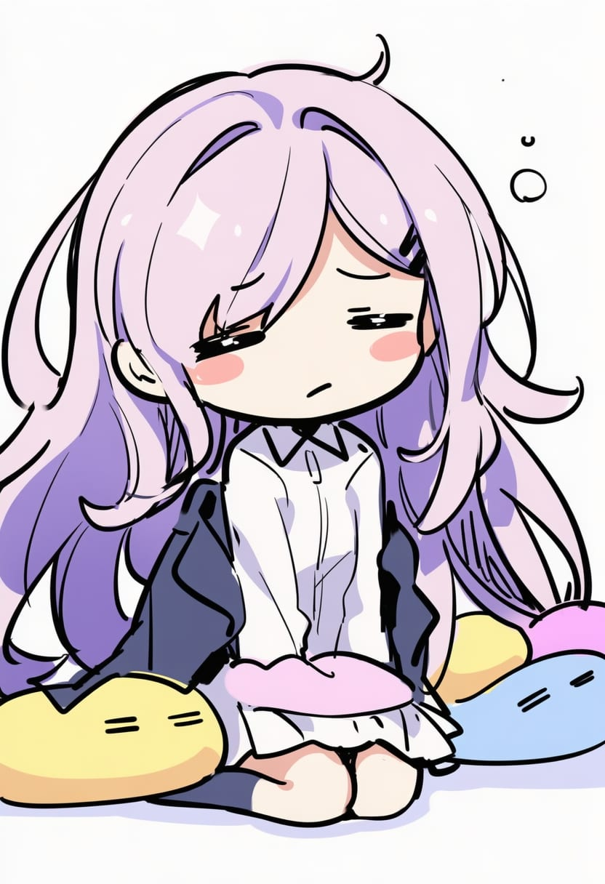

| 字段 | 内容 |
| --- | --- |
| 序号 | 229 |
| Danbooru Tag | =_= |
| 中文名 | =_=死鱼眼 |
| 中文含义 | 半闭平直眼的无语表情。 |
| 子类 | 颜文字/漫画表情 |
| 角色 | 1girl,bambietta_basterbine |

## 183. t_t — 双眼流泪的颜文字。

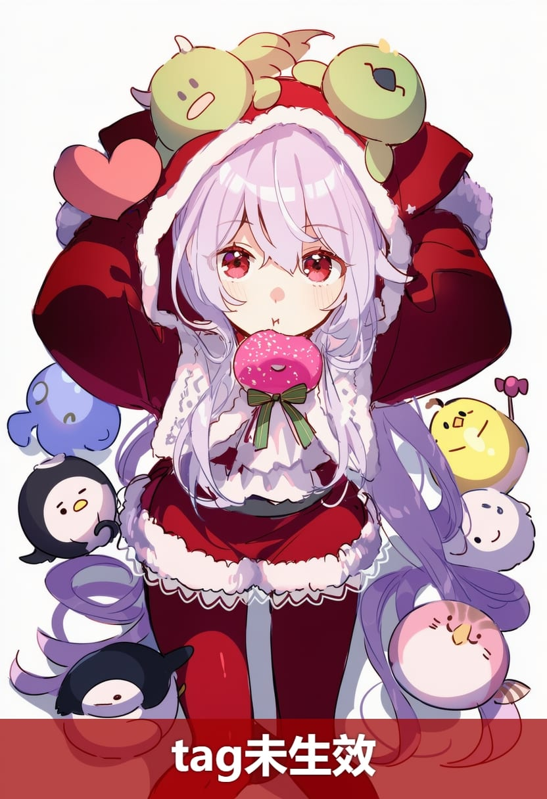

| 字段 | 内容 |
| --- | --- |
| 序号 | 230 |
| Danbooru Tag | t_t |
| 中文名 | T_T哭脸 |
| 中文含义 | 双眼流泪的颜文字。 |
| 子类 | 颜文字/漫画表情 |
| 角色 | 1girl,seta_kaoru |

## 184. x_x — 双眼 X 形，表示晕倒或死亡感。

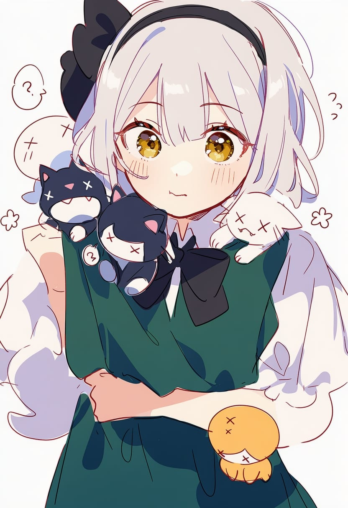

| 字段 | 内容 |
| --- | --- |
| 序号 | 231 |
| Danbooru Tag | x_x |
| 中文名 | X_X昏倒眼 |
| 中文含义 | 双眼 X 形，表示晕倒或死亡感。 |
| 子类 | 颜文字/漫画表情 |
| 角色 | 1girl,nakayama_festa_(umamusume) |

## 185. u_u — 向下弯的闭眼，安静或满足。

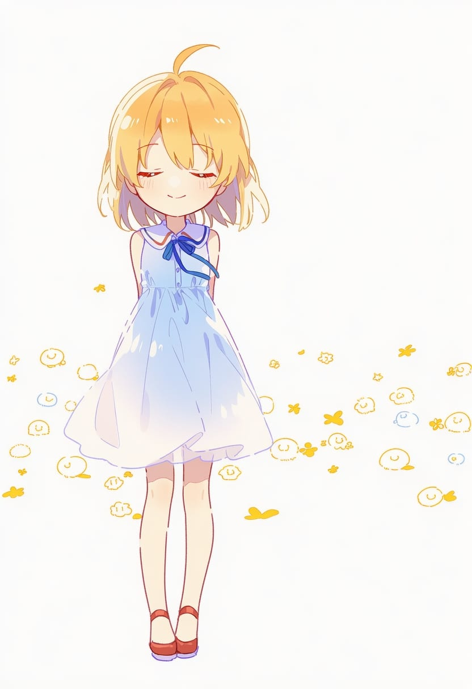

| 字段 | 内容 |
| --- | --- |
| 序号 | 232 |
| Danbooru Tag | u_u |
| 中文名 | u_u闭眼脸 |
| 中文含义 | 向下弯的闭眼，安静或满足。 |
| 子类 | 颜文字/漫画表情 |
| 角色 | 1boy,takasugi_shinsuke |

## 186. ^^^ — 用尖峰状符号表现惊讶或紧张。

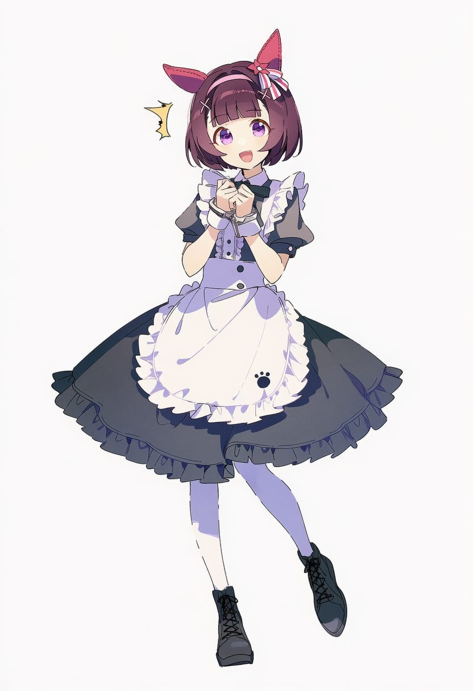

| 字段 | 内容 |
| --- | --- |
| 序号 | 233 |
| Danbooru Tag | ^^^ |
| 中文名 | 尖峰惊吓脸 |
| 中文含义 | 用尖峰状符号表现惊讶或紧张。 |
| 子类 | 颜文字/漫画表情 |
| 角色 | 1girl,nishino_flower_(umamusume) |

---
