# 鞋子tag展示

## 1. shoes — 鞋子

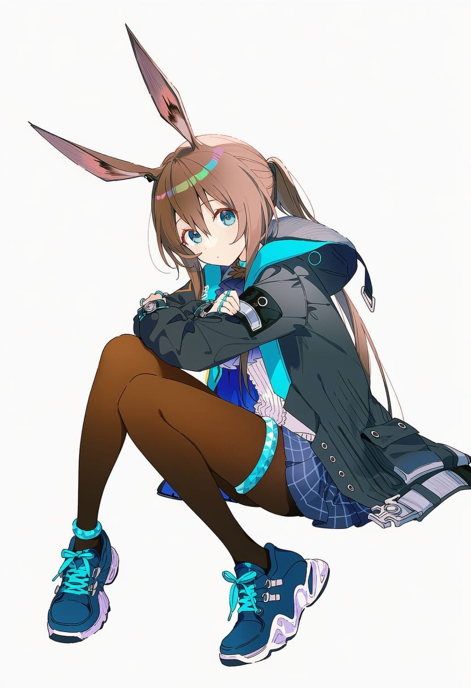

| 字段 | 内容 |
| --- | --- |
| Danbooru tag | shoes |
| 中文释义 | 鞋子 |
| 详细释义 | 覆盖足部、通常有坚固鞋底且鞋口不高于脚踝的通用鞋类标签；靴子、凉鞋等通常使用各自更具体的标签。 |
| 分类 | 基础大类 |

## 2. dress_shoes — 正装鞋

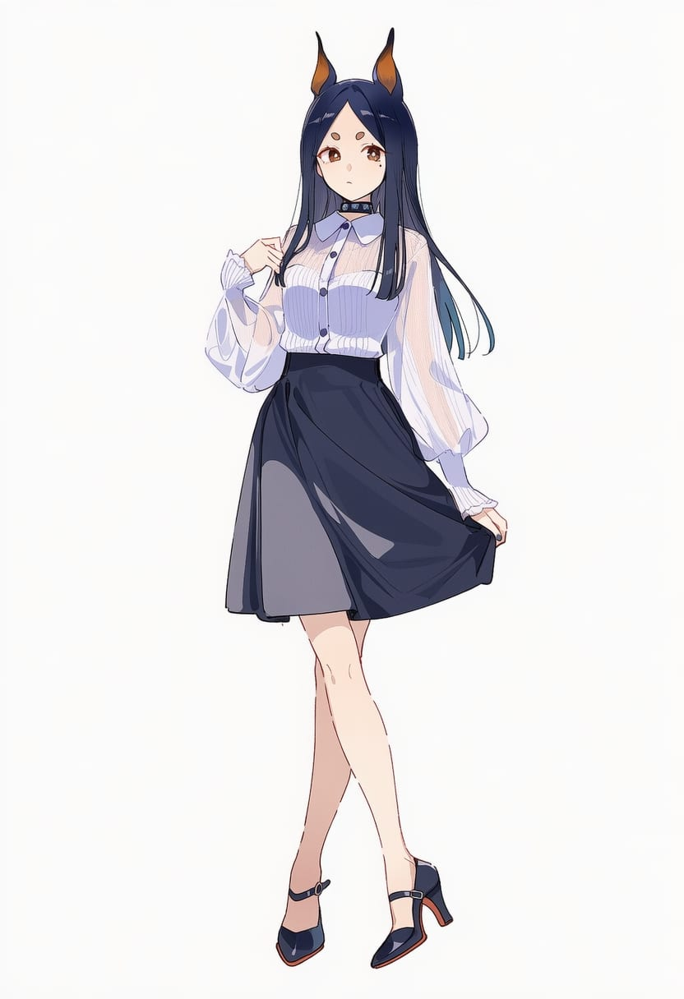

| 字段 | 内容 |
| --- | --- |
| Danbooru tag | dress_shoes |
| 中文释义 | 正装鞋 |
| 详细释义 | 用于正式或半正式穿着的鞋类总称，通常外观较精致，常与西装、制服或礼服搭配。 |
| 分类 | 基础大类 |

## 3. flats — 平底鞋

| 字段 | 内容 |
| --- | --- |
| Danbooru tag | flats |
| 中文释义 | 平底鞋 |
| 详细释义 | 鞋跟与前掌高度接近、没有明显高跟抬升的鞋类；与 high_heels 相对。 |
| 分类 | 基础大类 |

## 4. loafers — 乐福鞋

| 字段 | 内容 |
| --- | --- |
| Danbooru tag | loafers |
| 中文释义 | 乐福鞋 |
| 详细释义 | 无鞋带、低帮、可直接套穿的便鞋/正装鞋，常见于校服、商务和休闲穿搭。 |
| 分类 | 基础大类 |

## 5. penny_loafers — 便士乐福鞋

| 字段 | 内容 |
| --- | --- |
| Danbooru tag | penny_loafers |
| 中文释义 | 便士乐福鞋 |
| 详细释义 | 鞋面横带带有狭缝的乐福鞋，传统上可在缝中放置硬币。 |
| 分类 | 基础大类 |

## 6. kiltie_loafers — 流苏裙边乐福鞋

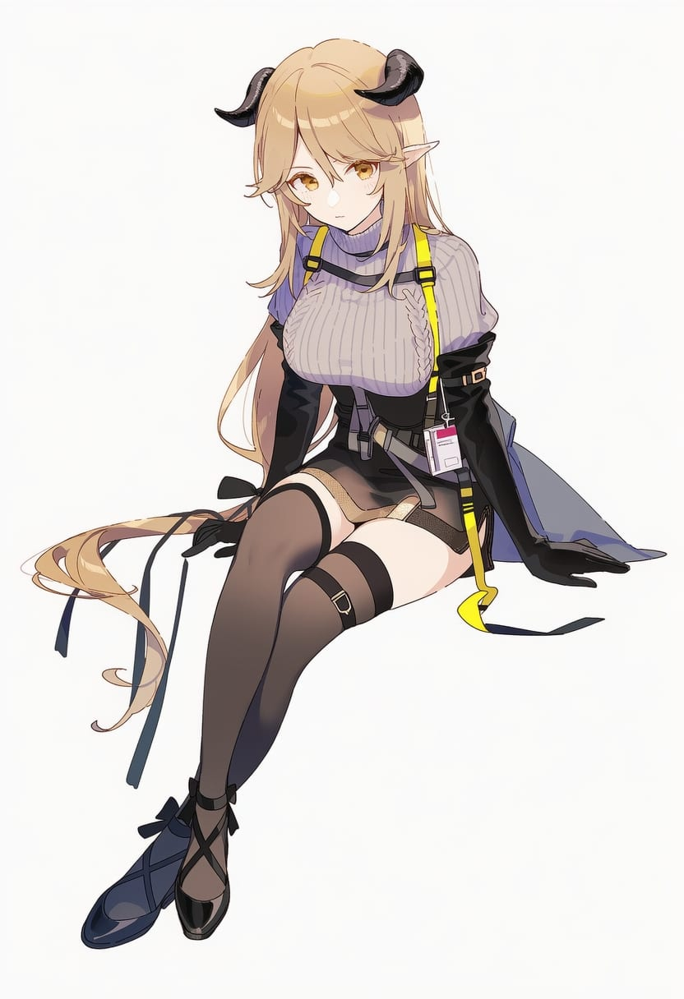

| 字段 | 内容 |
| --- | --- |
| Danbooru tag | kiltie_loafers |
| 中文释义 | 流苏裙边乐福鞋 |
| 详细释义 | 鞋面带皮革流苏/裙边装饰的乐福鞋。 |
| 分类 | 基础大类 |

## 7. mary_janes — 玛丽珍鞋

| 字段 | 内容 |
| --- | --- |
| Danbooru tag | mary_janes |
| 中文释义 | 玛丽珍鞋 |
| 详细释义 | 鞋面开口并有一条或多条横跨脚背固定带的鞋，常见圆头、低跟或平底款。 |
| 分类 | 基础大类 |

## 8. oxfords — 牛津鞋

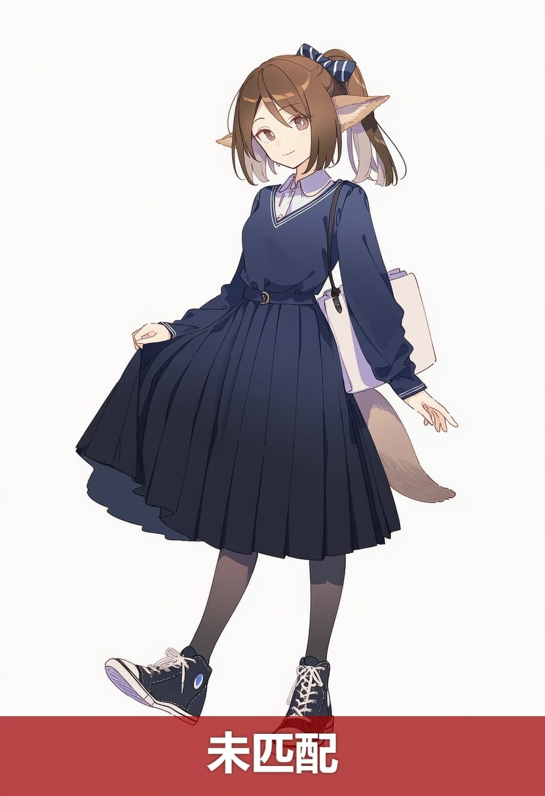

| 字段 | 内容 |
| --- | --- |
| Danbooru tag | oxfords |
| 中文释义 | 牛津鞋 |
| 详细释义 | 封闭式系带结构的低帮皮鞋，常用于正式、学院或复古风格。 |
| 分类 | 基础大类 |

## 9. saddle_shoes — 鞍鞋

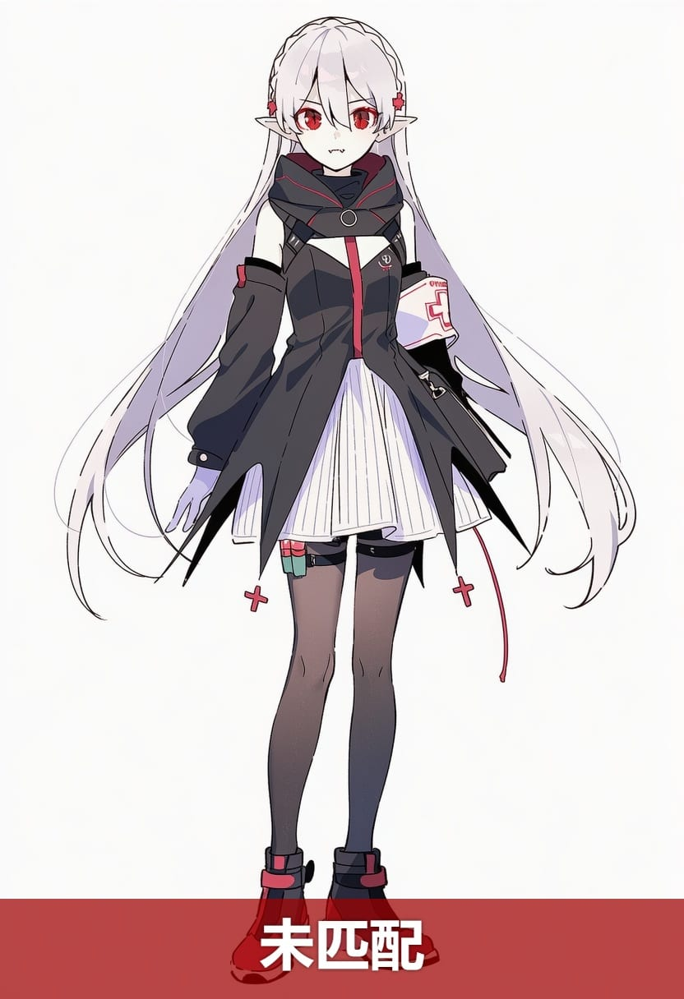

| 字段 | 内容 |
| --- | --- |
| Danbooru tag | saddle_shoes |
| 中文释义 | 鞍鞋 |
| 详细释义 | 一种双色牛津鞋，脚背中段有对比色“鞍形”拼接。 |
| 分类 | 基础大类 |

## 10. monk_shoes — 孟克鞋

| 字段 | 内容 |
| --- | --- |
| Danbooru tag | monk_shoes |
| 中文释义 | 孟克鞋 |
| 详细释义 | 不用鞋带、以一条或多条搭扣带固定的正装皮鞋。 |
| 分类 | 基础大类 |

## 11. pumps — 浅口高跟鞋

| 字段 | 内容 |
| --- | --- |
| Danbooru tag | pumps |
| 中文释义 | 浅口高跟鞋 |
| 详细释义 | 低鞋口、无明显绑带的正式高跟鞋，典型女式礼鞋轮廓。 |
| 分类 | 基础大类 |

## 12. ballet_flats — 芭蕾平底鞋

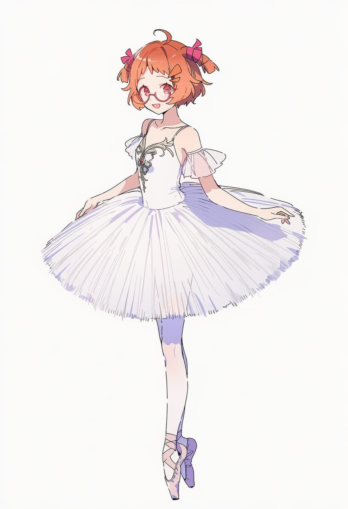

| 字段 | 内容 |
| --- | --- |
| Danbooru tag | ballet_flats |
| 中文释义 | 芭蕾平底鞋 |
| 详细释义 | 外形借鉴芭蕾舞鞋的浅口平底鞋，通常鞋底薄、鞋头圆润。 |
| 分类 | 基础大类 |

## 13. moccasins — 莫卡辛鞋

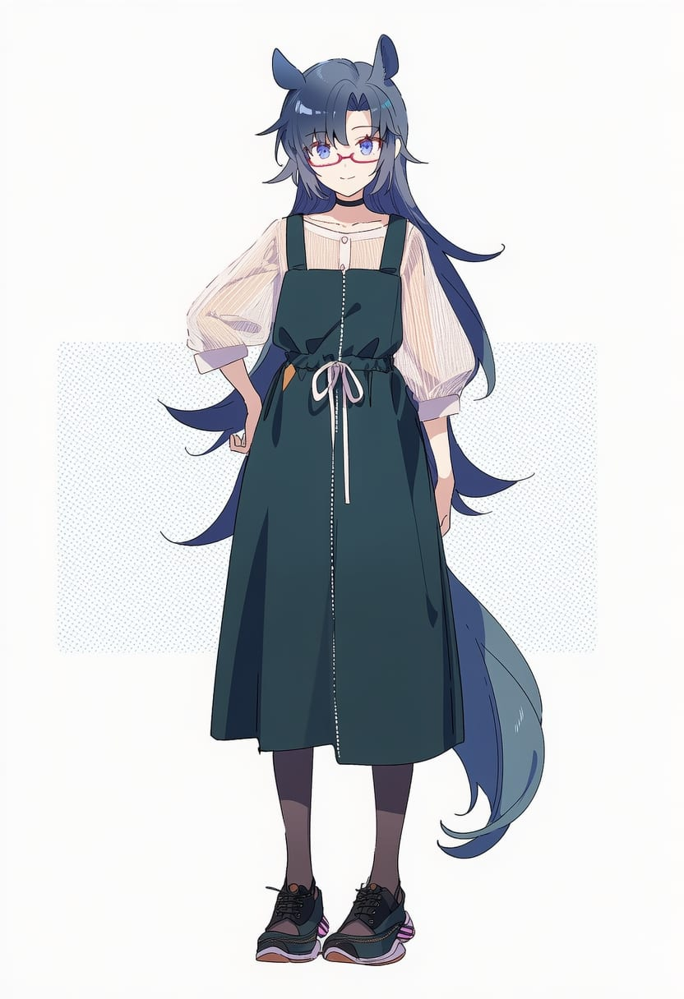

| 字段 | 内容 |
| --- | --- |
| Danbooru tag | moccasins |
| 中文释义 | 莫卡辛鞋 |
| 详细释义 | 传统软皮鞋结构，鞋面与侧帮常以明显接缝连接，现代也泛指莫卡辛式便鞋。 |
| 分类 | 基础大类 |

## 14. clogs — 木底鞋/木屐式鞋

| 字段 | 内容 |
| --- | --- |
| Danbooru tag | clogs |
| 中文释义 | 木底鞋/木屐式鞋 |
| 详细释义 | 厚重硬底、常为木质或仿木质鞋底的鞋类，鞋跟区域可开放或封闭。 |
| 分类 | 基础大类 |

## 15. espadrilles — 草编底鞋

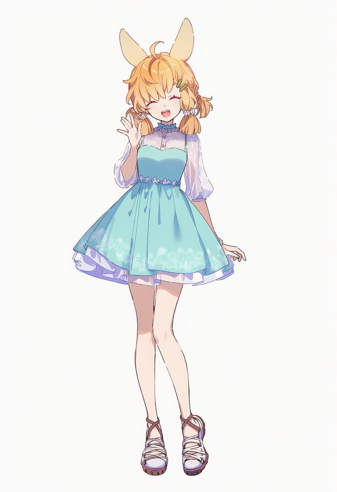

| 字段 | 内容 |
| --- | --- |
| Danbooru tag | espadrilles |
| 中文释义 | 草编底鞋 |
| 详细释义 | 以黄麻/草绳编织鞋底为显著特征的轻便鞋，常见帆布鞋面。 |
| 分类 | 基础大类 |

## 16. mules — 穆勒鞋

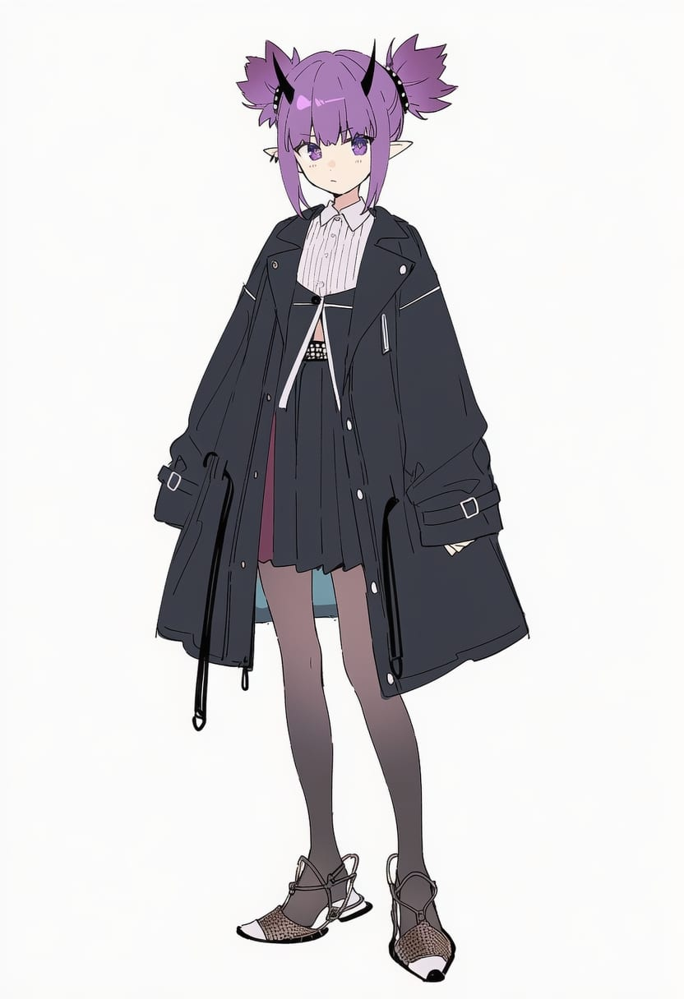

| 字段 | 内容 |
| --- | --- |
| Danbooru tag | mules |
| 中文释义 | 穆勒鞋 |
| 详细释义 | 后跟开放、前部包覆脚趾或脚背的无后帮鞋，可为平底或高跟。 |
| 分类 | 基础大类 |

## 17. crocs — 洞洞鞋

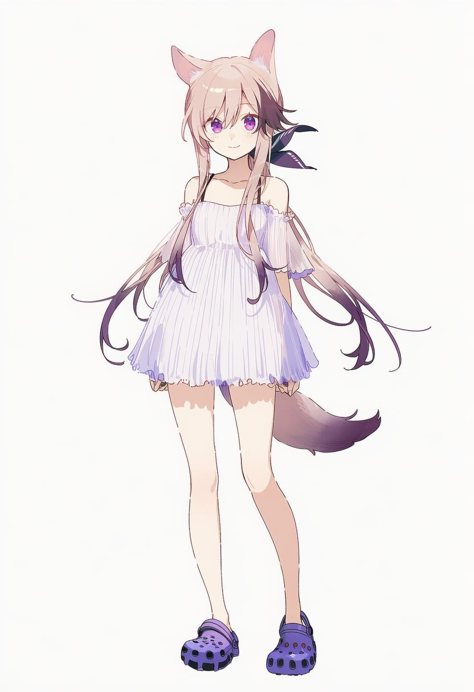

| 字段 | 内容 |
| --- | --- |
| Danbooru tag | crocs |
| 中文释义 | 洞洞鞋 |
| 详细释义 | 类似 Crocs 的泡沫树脂休闲鞋，鞋面常有通风孔并带可翻转后跟带。 |
| 分类 | 基础大类 |

## 18. sneakers — 运动鞋/休闲球鞋

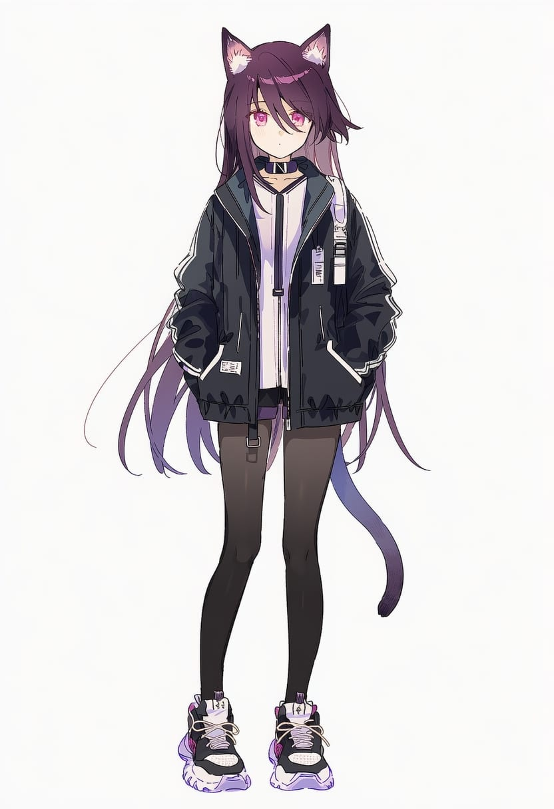

| 字段 | 内容 |
| --- | --- |
| Danbooru tag | sneakers |
| 中文释义 | 运动鞋/休闲球鞋 |
| 详细释义 | 橡胶或弹性鞋底的运动休闲鞋总类，常见系带结构。 |
| 分类 | 运动鞋 |

## 19. high_tops — 高帮运动鞋

| 字段 | 内容 |
| --- | --- |
| Danbooru tag | high_tops |
| 中文释义 | 高帮运动鞋 |
| 详细释义 | 鞋帮覆盖并延伸到脚踝附近或以上的运动鞋。 |
| 分类 | 运动鞋 |

## 20. running_shoes — 跑鞋

| 字段 | 内容 |
| --- | --- |
| Danbooru tag | running_shoes |
| 中文释义 | 跑鞋 |
| 详细释义 | 为跑步设计的运动鞋，通常有缓震中底、轻量鞋面和运动化外形。 |
| 分类 | 运动鞋 |

## 21. athletic_shoes — 专业运动鞋

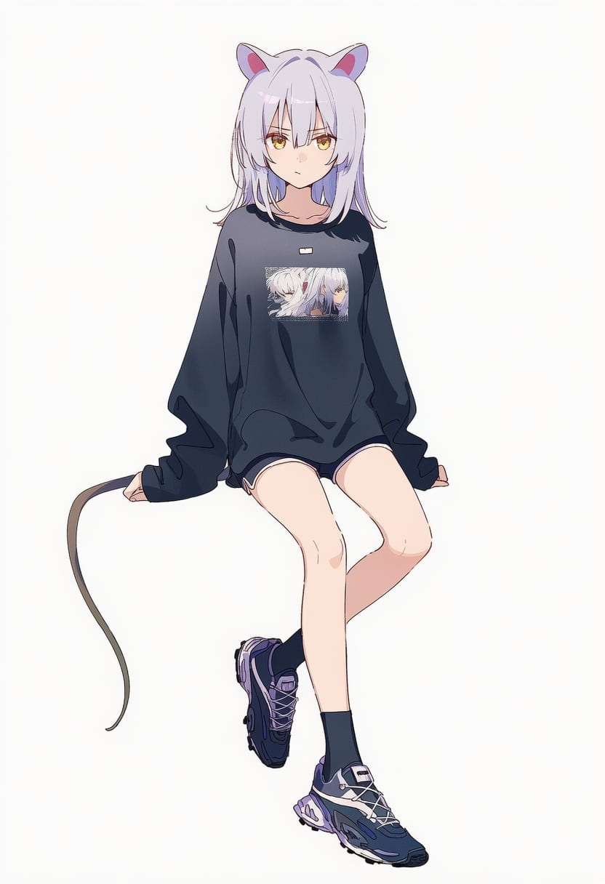

| 字段 | 内容 |
| --- | --- |
| Danbooru tag | athletic_shoes |
| 中文释义 | 专业运动鞋 |
| 详细释义 | 面向体育活动的鞋类泛称；当鞋型明显对应运动用途时使用。 |
| 分类 | 运动鞋 |

## 22. tennis_shoes — 网球鞋

| 字段 | 内容 |
| --- | --- |
| Danbooru tag | tennis_shoes |
| 中文释义 | 网球鞋 |
| 详细释义 | 为网球运动设计的运动鞋，通常强调侧向支撑与抓地。 |
| 分类 | 运动鞋 |

## 23. basketball_shoes — 篮球鞋

| 字段 | 内容 |
| --- | --- |
| Danbooru tag | basketball_shoes |
| 中文释义 | 篮球鞋 |
| 详细释义 | 为篮球运动设计的运动鞋，常见较强支撑、厚实中底和高/中帮轮廓。 |
| 分类 | 运动鞋 |

## 24. soccer_cleats — 足球钉鞋

| 字段 | 内容 |
| --- | --- |
| Danbooru tag | soccer_cleats |
| 中文释义 | 足球钉鞋 |
| 详细释义 | 鞋底带鞋钉、用于足球场地抓地的专业运动鞋。 |
| 分类 | 运动鞋 |

## 25. cleats — 钉鞋

| 字段 | 内容 |
| --- | --- |
| Danbooru tag | cleats |
| 中文释义 | 钉鞋 |
| 详细释义 | 鞋底具有突起鞋钉以增强草地或场地抓地力的运动鞋类。 |
| 分类 | 运动鞋 |

## 26. skates — 冰/轮滑鞋类

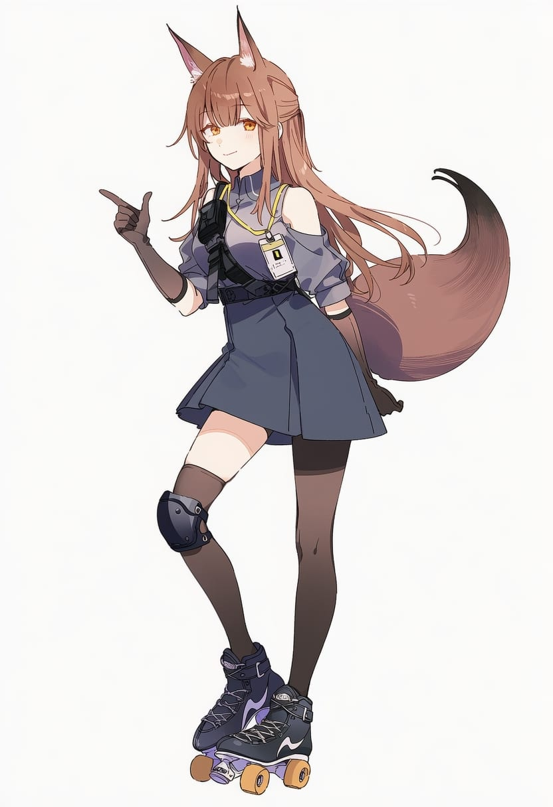

| 字段 | 内容 |
| --- | --- |
| Danbooru tag | skates |
| 中文释义 | 冰/轮滑鞋类 |
| 详细释义 | 脚下带冰刀或轮子的滑行鞋总类；具体可进一步使用 ice_skates、roller_skates 等。 |
| 分类 | 运动鞋 |

## 27. ice_skates — 冰鞋

| 字段 | 内容 |
| --- | --- |
| Danbooru tag | ice_skates |
| 中文释义 | 冰鞋 |
| 详细释义 | 鞋底安装冰刀、用于冰面滑行的鞋。 |
| 分类 | 运动鞋 |

## 28. roller_skates — 双排轮滑鞋

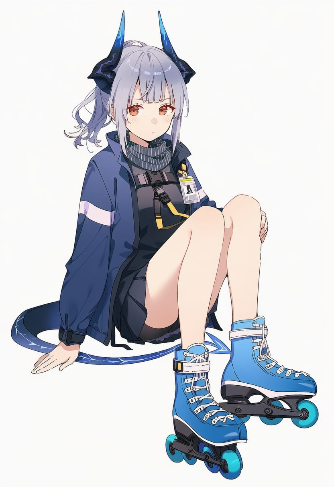

| 字段 | 内容 |
| --- | --- |
| Danbooru tag | roller_skates |
| 中文释义 | 双排轮滑鞋 |
| 详细释义 | 鞋底安装轮子的轮滑鞋，典型为前后两组并列轮。 |
| 分类 | 运动鞋 |

## 29. inline_skates — 直排轮滑鞋

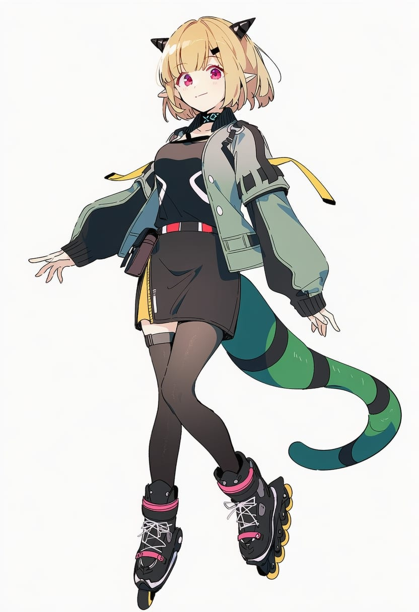

| 字段 | 内容 |
| --- | --- |
| Danbooru tag | inline_skates |
| 中文释义 | 直排轮滑鞋 |
| 详细释义 | 轮子沿鞋底纵向排成一列的轮滑鞋。 |
| 分类 | 运动鞋 |

## 30. ski_boots — 滑雪靴

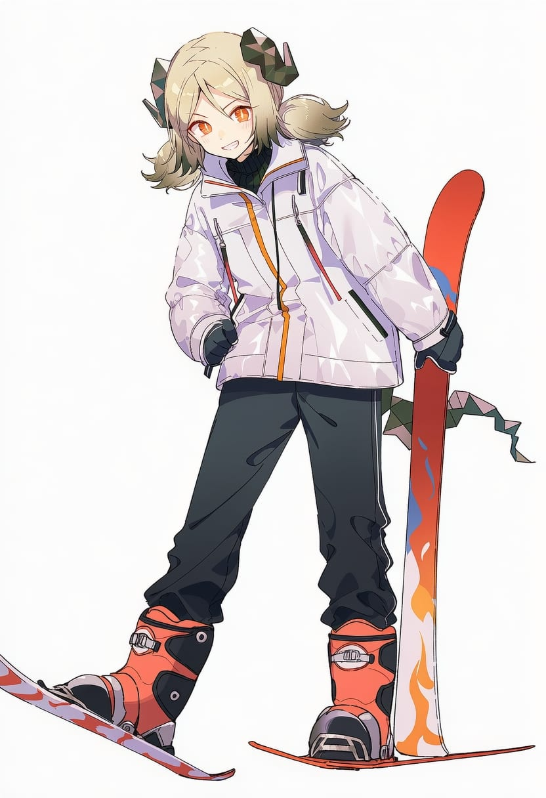

| 字段 | 内容 |
| --- | --- |
| Danbooru tag | ski_boots |
| 中文释义 | 滑雪靴 |
| 详细释义 | 用于滑雪板固定系统的硬质、厚重专用靴。 |
| 分类 | 运动鞋 |

## 31. climbing_shoes — 攀岩鞋

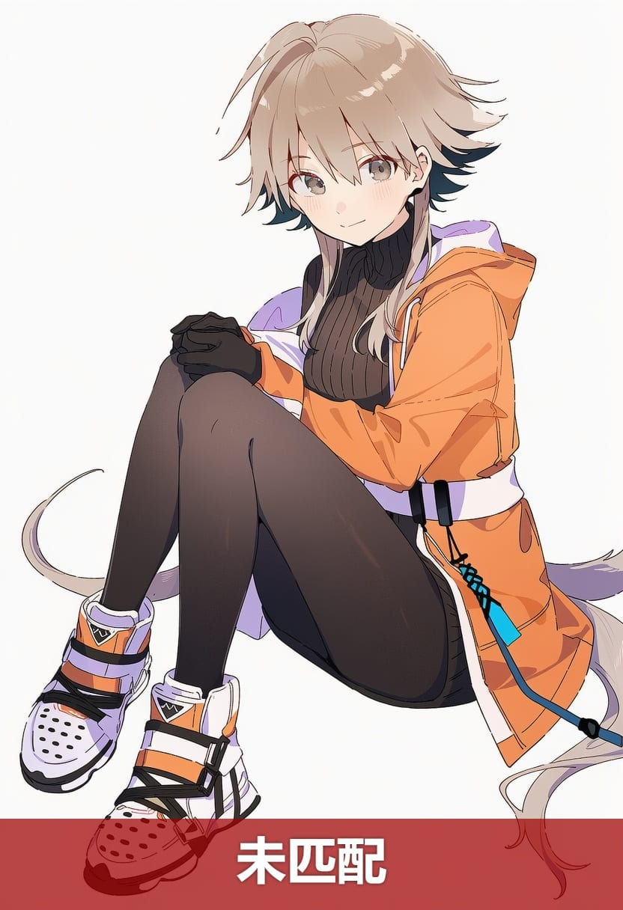

| 字段 | 内容 |
| --- | --- |
| Danbooru tag | climbing_shoes |
| 中文释义 | 攀岩鞋 |
| 详细释义 | 贴脚、橡胶包边明显、用于攀岩抓点的专用鞋。 |
| 分类 | 运动鞋 |

## 32. bowling_shoes — 保龄球鞋

| 字段 | 内容 |
| --- | --- |
| Danbooru tag | bowling_shoes |
| 中文释义 | 保龄球鞋 |
| 详细释义 | 用于保龄球运动的专用鞋，外观常为低帮系带鞋并有特殊滑步鞋底。 |
| 分类 | 运动鞋 |

## 33. boots — 靴子

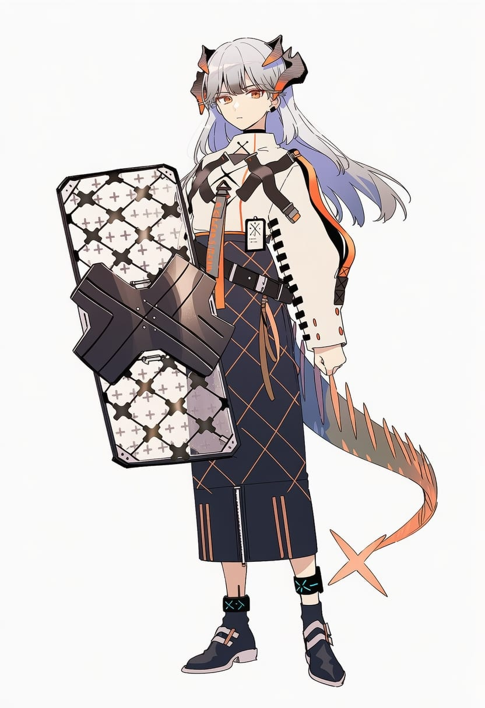

| 字段 | 内容 |
| --- | --- |
| Danbooru tag | boots |
| 中文释义 | 靴子 |
| 详细释义 | 鞋帮明显高于脚踝的鞋类总称，是各类短靴、长靴、功能靴的上位标签。 |
| 分类 | 靴子 |

## 34. ankle_boots — 踝靴

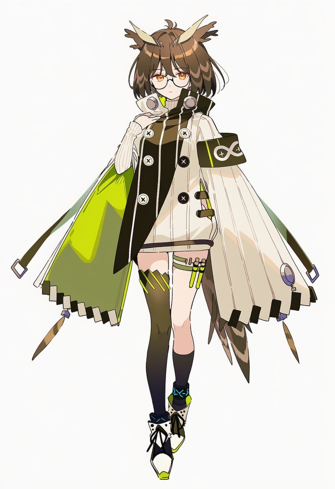

| 字段 | 内容 |
| --- | --- |
| Danbooru tag | ankle_boots |
| 中文释义 | 踝靴 |
| 详细释义 | 鞋筒高度到脚踝附近的短靴。 |
| 分类 | 靴子 |

## 35. knee_boots — 及膝靴

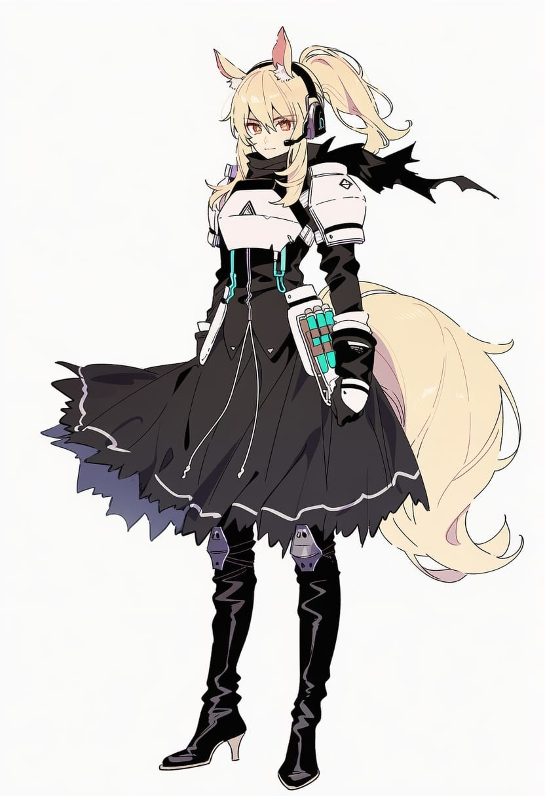

| 字段 | 内容 |
| --- | --- |
| Danbooru tag | knee_boots |
| 中文释义 | 及膝靴 |
| 详细释义 | 靴筒延伸至膝盖附近的长靴。 |
| 分类 | 靴子 |

## 36. thigh_boots — 过膝/大腿靴

| 字段 | 内容 |
| --- | --- |
| Danbooru tag | thigh_boots |
| 中文释义 | 过膝/大腿靴 |
| 详细释义 | 靴筒越过膝盖并延伸到大腿的长靴。 |
| 分类 | 靴子 |

## 37. high_heel_boots — 高跟靴

| 字段 | 内容 |
| --- | --- |
| Danbooru tag | high_heel_boots |
| 中文释义 | 高跟靴 |
| 详细释义 | 带明显高跟结构的靴子，同时具有 boots 与 high_heels 的视觉特征。 |
| 分类 | 靴子 |

## 38. platform_boots — 厚底靴

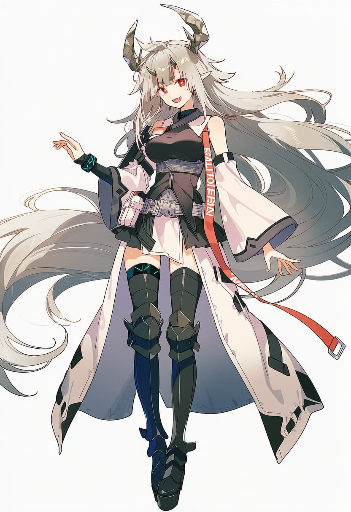

| 字段 | 内容 |
| --- | --- |
| Danbooru tag | platform_boots |
| 中文释义 | 厚底靴 |
| 详细释义 | 鞋底前掌与后跟整体明显加厚的靴子。 |
| 分类 | 靴子 |

## 39. lace-up_boots — 系带靴

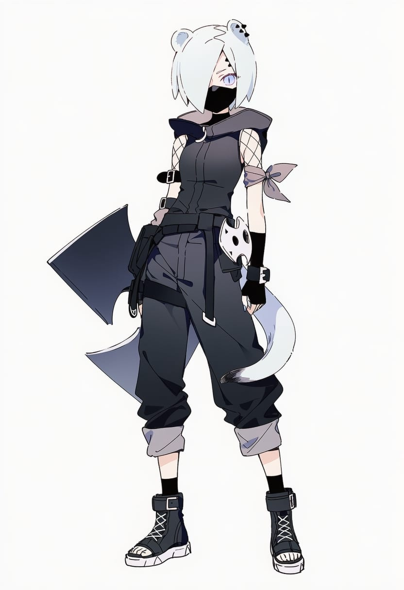

| 字段 | 内容 |
| --- | --- |
| Danbooru tag | lace-up_boots |
| 中文释义 | 系带靴 |
| 详细释义 | 以鞋带穿过鞋眼或钩扣固定的靴子。 |
| 分类 | 靴子 |

## 40. combat_boots — 战斗靴/军靴

| 字段 | 内容 |
| --- | --- |
| Danbooru tag | combat_boots |
| 中文释义 | 战斗靴/军靴 |
| 详细释义 | 军用或军风的结实系带靴，通常厚底、鞋帮较高。 |
| 分类 | 靴子 |

## 41. cowboy_boots — 牛仔靴

| 字段 | 内容 |
| --- | --- |
| Danbooru tag | cowboy_boots |
| 中文释义 | 牛仔靴 |
| 详细释义 | 西部牛仔风格长靴，常有尖/窄鞋头、斜跟和装饰性靴筒。 |
| 分类 | 靴子 |

## 42. riding_boots — 骑马靴

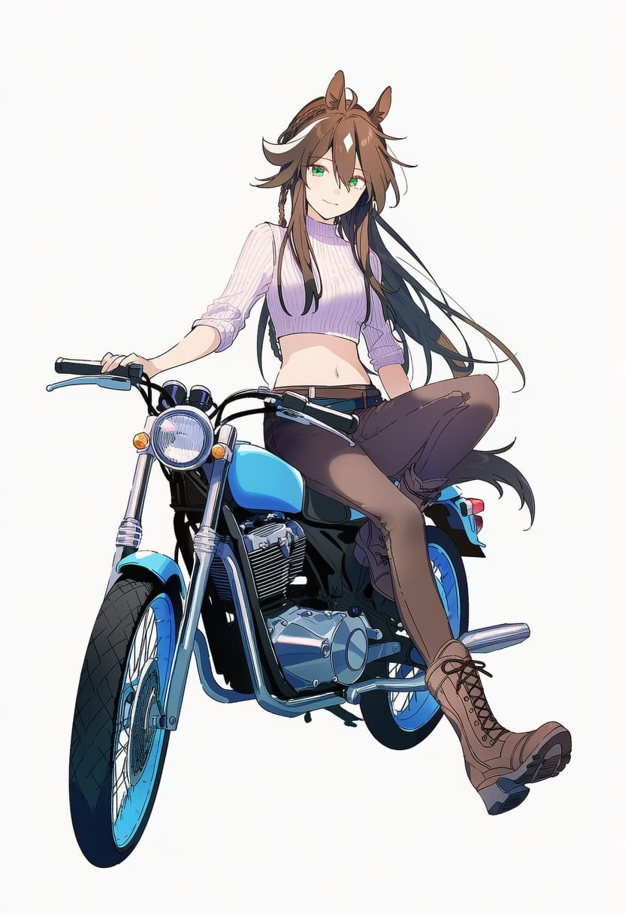

| 字段 | 内容 |
| --- | --- |
| Danbooru tag | riding_boots |
| 中文释义 | 骑马靴 |
| 详细释义 | 为骑马设计或具有骑马靴外观的高筒靴，通常线条简洁、贴合小腿。 |
| 分类 | 靴子 |

## 43. rubber_boots — 橡胶靴/雨靴

| 字段 | 内容 |
| --- | --- |
| Danbooru tag | rubber_boots |
| 中文释义 | 橡胶靴/雨靴 |
| 详细释义 | 由橡胶或防水材料制成的靴子，常用于雨天、泥地或作业环境。 |
| 分类 | 靴子 |

## 44. work_boots — 工作靴

| 字段 | 内容 |
| --- | --- |
| Danbooru tag | work_boots |
| 中文释义 | 工作靴 |
| 详细释义 | 为劳动和户外作业设计的耐用靴，通常厚底、防滑并强调保护性。 |
| 分类 | 靴子 |

## 45. armored_boots — 装甲靴

| 字段 | 内容 |
| --- | --- |
| Danbooru tag | armored_boots |
| 中文释义 | 装甲靴 |
| 详细释义 | 带金属或硬质护甲结构的靴子，常见于铠甲、战斗或幻想服装。 |
| 分类 | 靴子 |

## 46. leather_boots — 皮靴

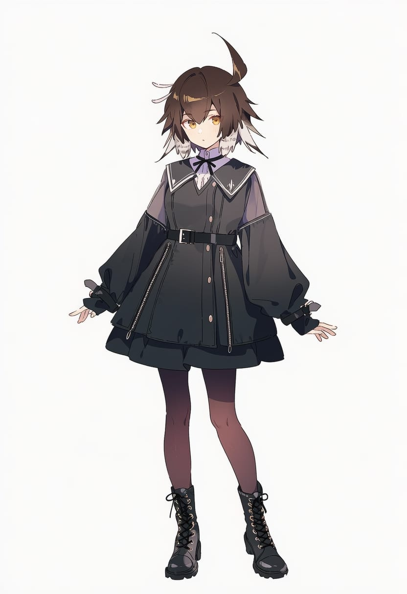

| 字段 | 内容 |
| --- | --- |
| Danbooru tag | leather_boots |
| 中文释义 | 皮靴 |
| 详细释义 | 主要由皮革材质构成的靴子；属于材质型但不是颜色差异。 |
| 分类 | 靴子 |

## 47. latex_boots — 乳胶靴

| 字段 | 内容 |
| --- | --- |
| Danbooru tag | latex_boots |
| 中文释义 | 乳胶靴 |
| 详细释义 | 由乳胶/高光弹性材质表现的靴子，表面通常紧身且强反光。 |
| 分类 | 靴子 |

## 48. fur_boots — 毛绒靴

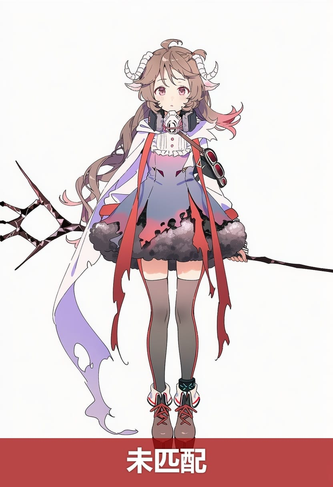

| 字段 | 内容 |
| --- | --- |
| Danbooru tag | fur_boots |
| 中文释义 | 毛绒靴 |
| 详细释义 | 主体具有明显毛皮/绒毛材质的靴子。 |
| 分类 | 靴子 |

## 49. fur-trimmed_boots — 毛边靴

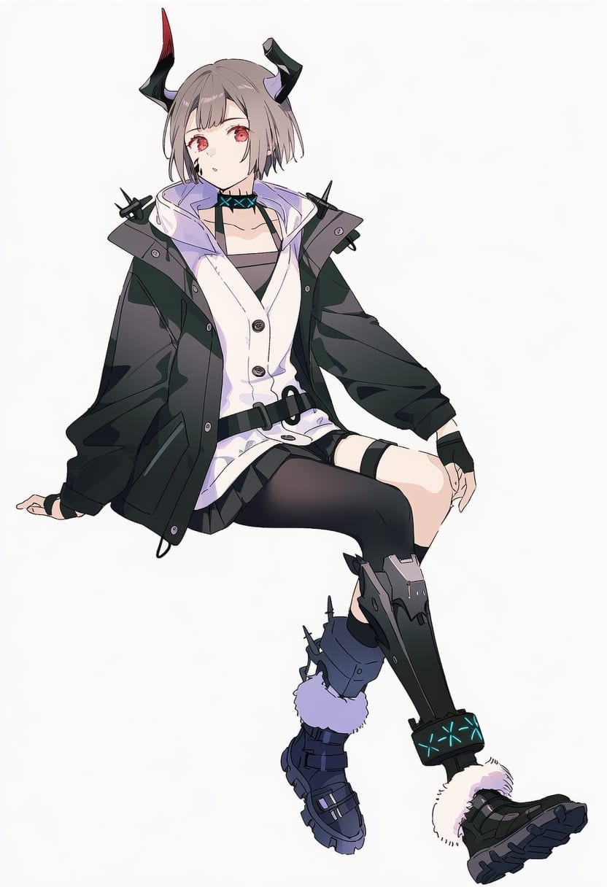

| 字段 | 内容 |
| --- | --- |
| Danbooru tag | fur-trimmed_boots |
| 中文释义 | 毛边靴 |
| 详细释义 | 靴口或边缘以毛皮/绒毛作饰边的靴子。 |
| 分类 | 靴子 |

## 50. fold-over_boots — 翻折靴

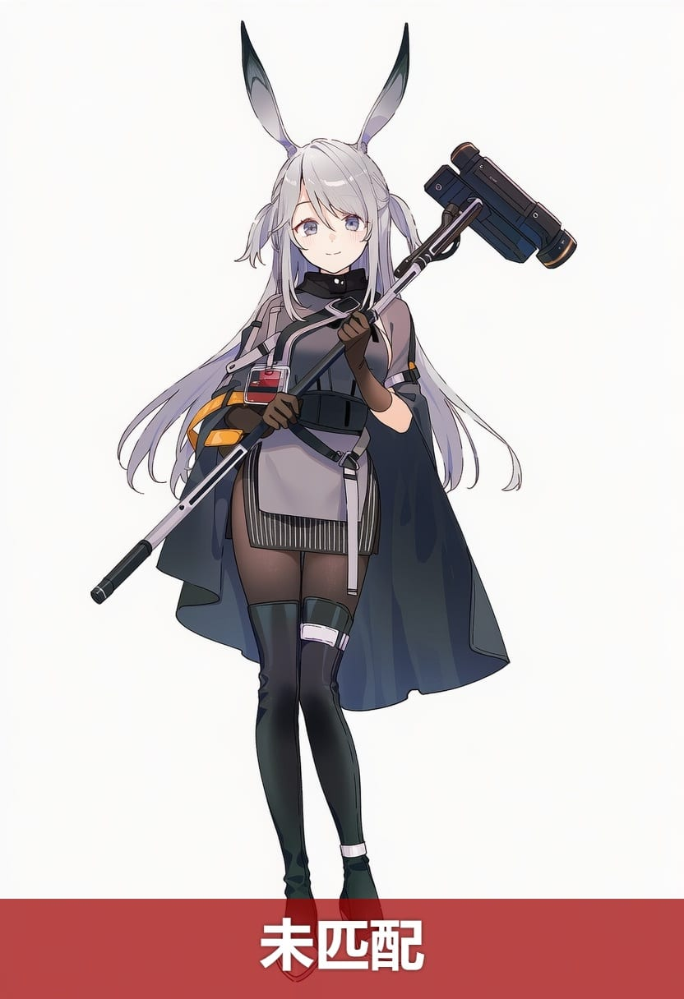

| 字段 | 内容 |
| --- | --- |
| Danbooru tag | fold-over_boots |
| 中文释义 | 翻折靴 |
| 详细释义 | 靴筒上缘向外翻折，形成明显翻领式结构的靴子。 |
| 分类 | 靴子 |

## 51. belt_boots — 带扣装饰靴

| 字段 | 内容 |
| --- | --- |
| Danbooru tag | belt_boots |
| 中文释义 | 带扣装饰靴 |
| 详细释义 | 靴身带有皮带、扣带或环绕式带状结构的靴子。 |
| 分类 | 靴子 |

## 52. frilled_boots — 褶边靴

| 字段 | 内容 |
| --- | --- |
| Danbooru tag | frilled_boots |
| 中文释义 | 褶边靴 |
| 详细释义 | 带荷叶边/褶边装饰的靴子。 |
| 分类 | 靴子 |

## 53. spiked_boots — 铆钉尖刺靴

| 字段 | 内容 |
| --- | --- |
| Danbooru tag | spiked_boots |
| 中文释义 | 铆钉尖刺靴 |
| 详细释义 | 靴身带明显尖刺或锥形铆钉装饰的靴子。 |
| 分类 | 靴子 |

## 54. ugg_boots — 雪地靴/Ugg式靴

| 字段 | 内容 |
| --- | --- |
| Danbooru tag | ugg_boots |
| 中文释义 | 雪地靴/Ugg式靴 |
| 详细释义 | 厚实柔软、常带羊毛/绒里并具有圆钝鞋头的 Ugg 风格短靴。 |
| 分类 | 靴子 |

## 55. jackboots — 长筒军靴

| 字段 | 内容 |
| --- | --- |
| Danbooru tag | jackboots |
| 中文释义 | 长筒军靴 |
| 详细释义 | 传统军用高筒皮靴，通常无明显鞋带、靴筒挺直。 |
| 分类 | 靴子 |

## 56. ballet_boots — 芭蕾高跟靴

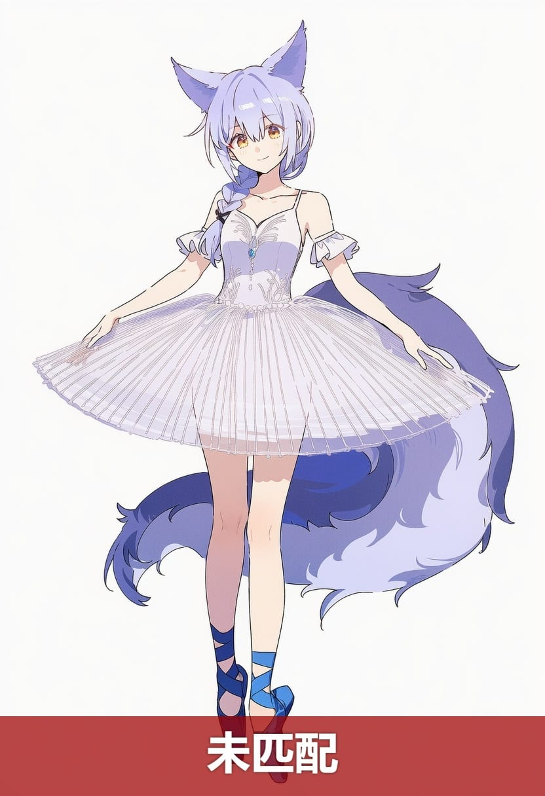

| 字段 | 内容 |
| --- | --- |
| Danbooru tag | ballet_boots |
| 中文释义 | 芭蕾高跟靴 |
| 详细释义 | 极端高跟、迫使脚部接近足尖姿态的靴型，外形借鉴芭蕾足尖。 |
| 分类 | 靴子 |

## 57. sandals — 凉鞋

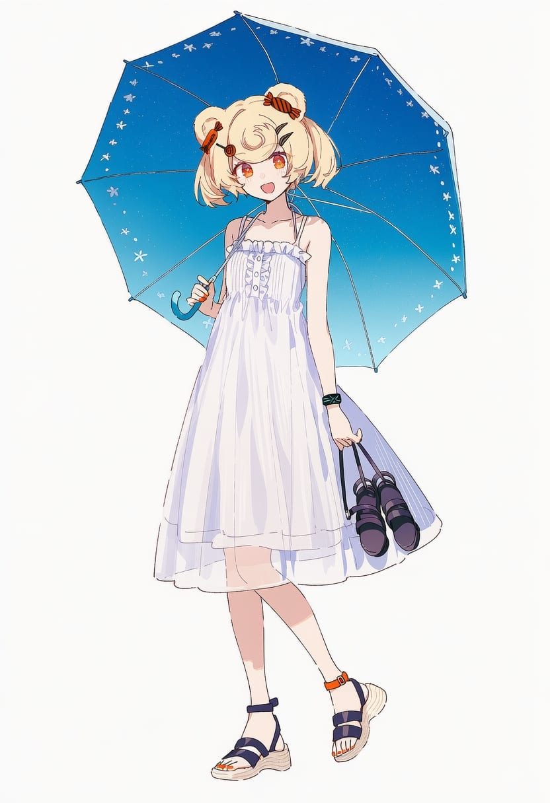

| 字段 | 内容 |
| --- | --- |
| Danbooru tag | sandals |
| 中文释义 | 凉鞋 |
| 详细释义 | 开放式鞋类，以鞋底配合带子固定足部，脚趾或脚背通常大面积外露。 |
| 分类 | 凉鞋与开放鞋 |

## 58. flip-flops — 人字拖

| 字段 | 内容 |
| --- | --- |
| Danbooru tag | flip-flops |
| 中文释义 | 人字拖 |
| 详细释义 | 脚趾间有 Y 形夹带的开放式拖鞋/凉鞋。 |
| 分类 | 凉鞋与开放鞋 |

## 59. slides — 一字拖/拖鞋式凉鞋

| 字段 | 内容 |
| --- | --- |
| Danbooru tag | slides |
| 中文释义 | 一字拖/拖鞋式凉鞋 |
| 详细释义 | 后跟完全开放，脚背由一条或多条横带固定、无需夹趾的开放鞋。 |
| 分类 | 凉鞋与开放鞋 |

## 60. sports_sandals — 运动凉鞋

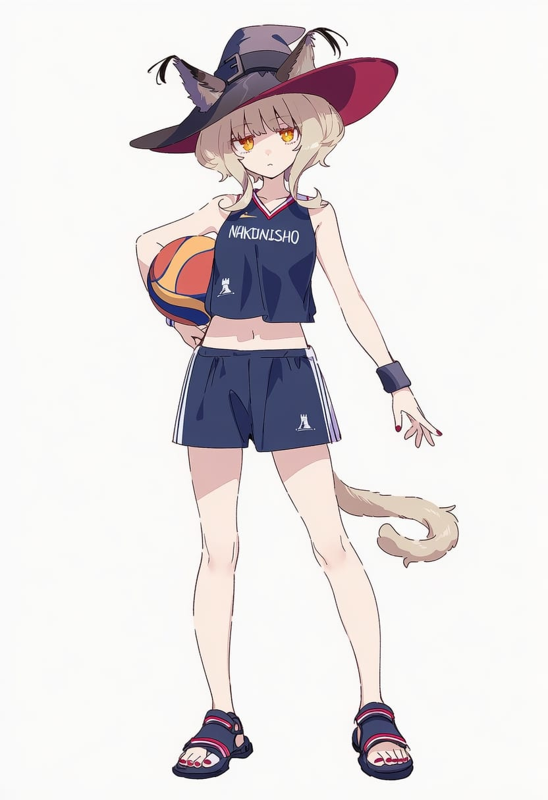

| 字段 | 内容 |
| --- | --- |
| Danbooru tag | sports_sandals |
| 中文释义 | 运动凉鞋 |
| 详细释义 | 具有较厚运动鞋底和多条可调固定带的功能型凉鞋。 |
| 分类 | 凉鞋与开放鞋 |

## 61. gladiator_sandals — 角斗士凉鞋

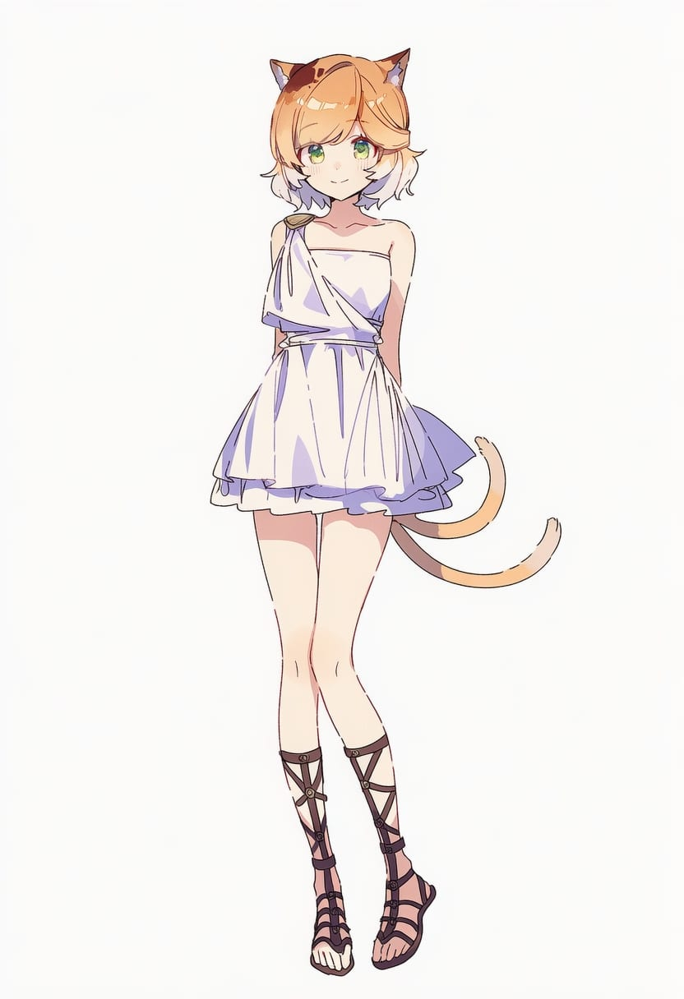

| 字段 | 内容 |
| --- | --- |
| Danbooru tag | gladiator_sandals |
| 中文释义 | 角斗士凉鞋 |
| 详细释义 | 多条细带沿脚背、脚踝甚至小腿向上延伸的古罗马风格凉鞋。 |
| 分类 | 凉鞋与开放鞋 |

## 62. cross-laced_sandals — 交叉绑带凉鞋

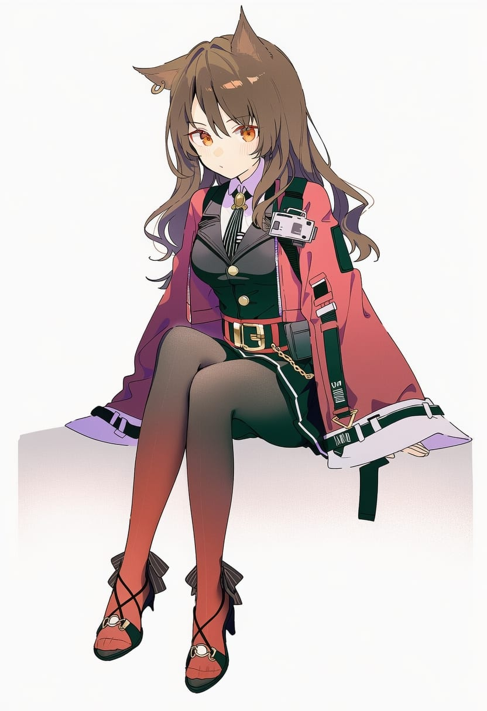

| 字段 | 内容 |
| --- | --- |
| Danbooru tag | cross-laced_sandals |
| 中文释义 | 交叉绑带凉鞋 |
| 详细释义 | 鞋带或细带在脚背/脚踝处多次交叉缠绕的凉鞋。 |
| 分类 | 凉鞋与开放鞋 |

## 63. platform_sandals — 厚底凉鞋

| 字段 | 内容 |
| --- | --- |
| Danbooru tag | platform_sandals |
| 中文释义 | 厚底凉鞋 |
| 详细释义 | 具有明显整体增高厚底的凉鞋。 |
| 分类 | 凉鞋与开放鞋 |

## 64. high_heel_sandals — 高跟凉鞋

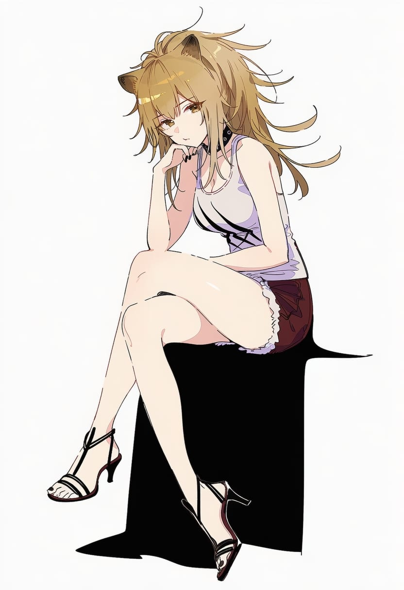

| 字段 | 内容 |
| --- | --- |
| Danbooru tag | high_heel_sandals |
| 中文释义 | 高跟凉鞋 |
| 详细释义 | 开放式凉鞋结构并带明显高跟。 |
| 分类 | 凉鞋与开放鞋 |

## 65. high_heel_slides — 高跟一字拖

| 字段 | 内容 |
| --- | --- |
| Danbooru tag | high_heel_slides |
| 中文释义 | 高跟一字拖 |
| 详细释义 | 后跟开放的 slides 结构与明显高跟结合的鞋型。 |
| 分类 | 凉鞋与开放鞋 |

## 66. geta — 下駄/日式木屐

| 字段 | 内容 |
| --- | --- |
| Danbooru tag | geta |
| 中文释义 | 下駄/日式木屐 |
| 详细释义 | 日本传统木屐，木制台面下通常有一到两块齿状支撑，以鼻绪固定脚部。 |
| 分类 | 传统鞋履 |

## 67. zouri — 草履

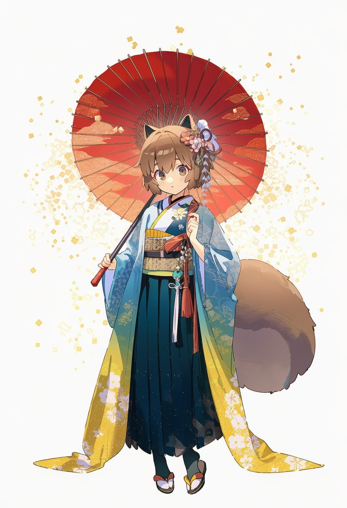

| 字段 | 内容 |
| --- | --- |
| Danbooru tag | zouri |
| 中文释义 | 草履 |
| 详细释义 | 日本传统平底夹趾鞋，外形类似较正式的人字拖，常与和服搭配。 |
| 分类 | 传统鞋履 |

## 68. okobo — 高底木屐

| 字段 | 内容 |
| --- | --- |
| Danbooru tag | okobo |
| 中文释义 | 高底木屐 |
| 详细释义 | 日本舞妓等常穿的高台木屐，整体鞋底像厚木块般显著增高。 |
| 分类 | 传统鞋履 |

## 69. waraji — 草鞋

| 字段 | 内容 |
| --- | --- |
| Danbooru tag | waraji |
| 中文释义 | 草鞋 |
| 详细释义 | 日本传统草编凉鞋，以草绳编织并用绳带绑在脚上。 |
| 分类 | 传统鞋履 |

## 70. paduka — 印度趾钮凉鞋

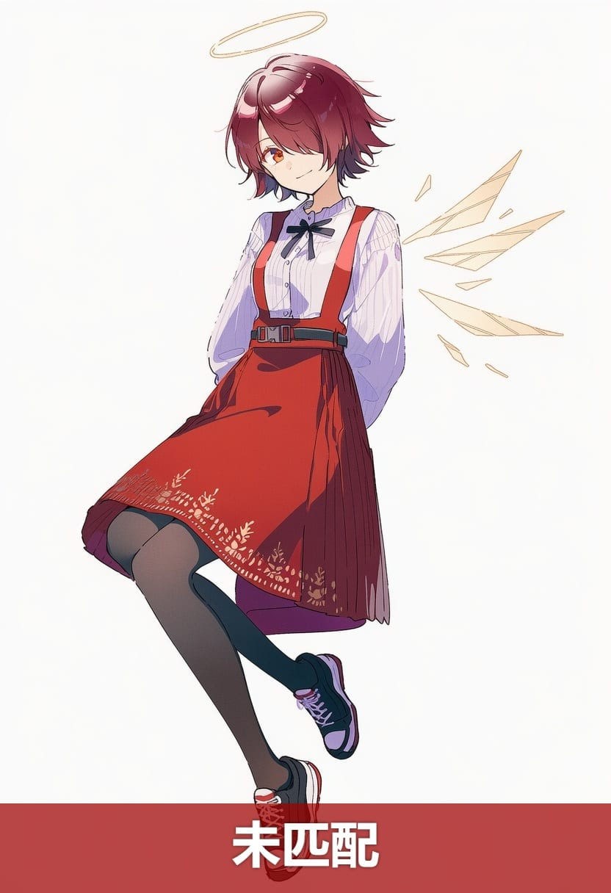

| 字段 | 内容 |
| --- | --- |
| Danbooru tag | paduka |
| 中文释义 | 印度趾钮凉鞋 |
| 详细释义 | 印度传统开放鞋，通常只有鞋底和位于大脚趾附近的趾钮固定结构。 |
| 分类 | 传统鞋履 |

## 71. gomusin — 韩式橡胶鞋

| 字段 | 内容 |
| --- | --- |
| Danbooru tag | gomusin |
| 中文释义 | 韩式橡胶鞋 |
| 详细释义 | 韩国传统低跟橡胶鞋，鞋型较宽，常与韩服搭配。 |
| 分类 | 传统鞋履 |

## 72. mojari — 莫贾里鞋

| 字段 | 内容 |
| --- | --- |
| Danbooru tag | mojari |
| 中文释义 | 莫贾里鞋 |
| 详细释义 | 南亚传统皮鞋，常有刺绣装饰与上翘或尖形鞋头。 |
| 分类 | 传统鞋履 |

## 73. slippers — 室内拖鞋

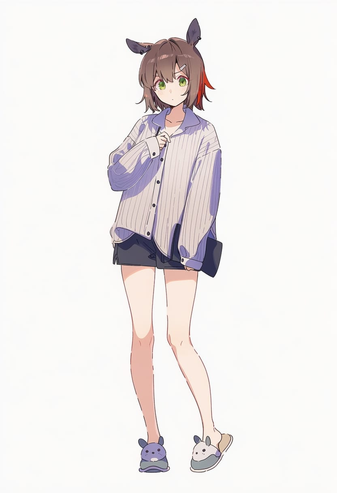

| 字段 | 内容 |
| --- | --- |
| Danbooru tag | slippers |
| 中文释义 | 室内拖鞋 |
| 详细释义 | 主要用于室内的轻便鞋，通常柔软、易穿脱，可为开放或包头结构。 |
| 分类 | 拖鞋与舞鞋 |

## 74. animal_slippers — 动物造型拖鞋

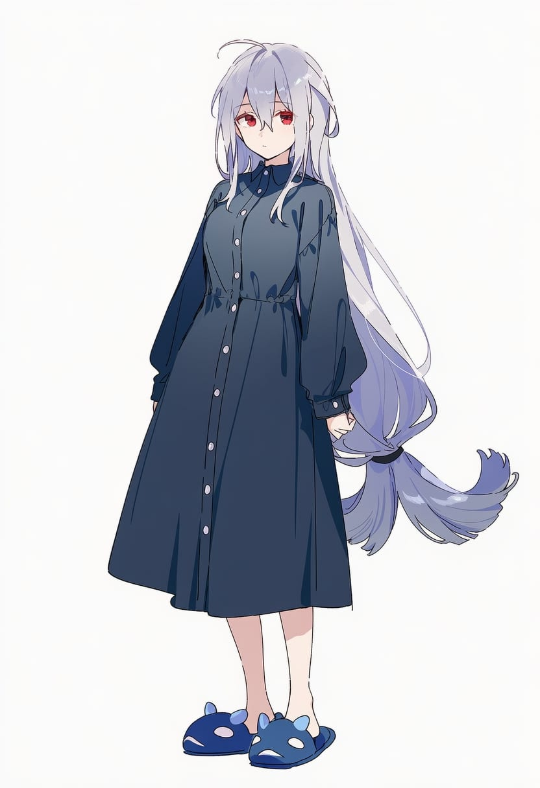

| 字段 | 内容 |
| --- | --- |
| Danbooru tag | animal_slippers |
| 中文释义 | 动物造型拖鞋 |
| 详细释义 | 做成动物头、动物脚掌或带动物特征的室内拖鞋。 |
| 分类 | 拖鞋与舞鞋 |

## 75. ballet_slippers — 芭蕾舞鞋

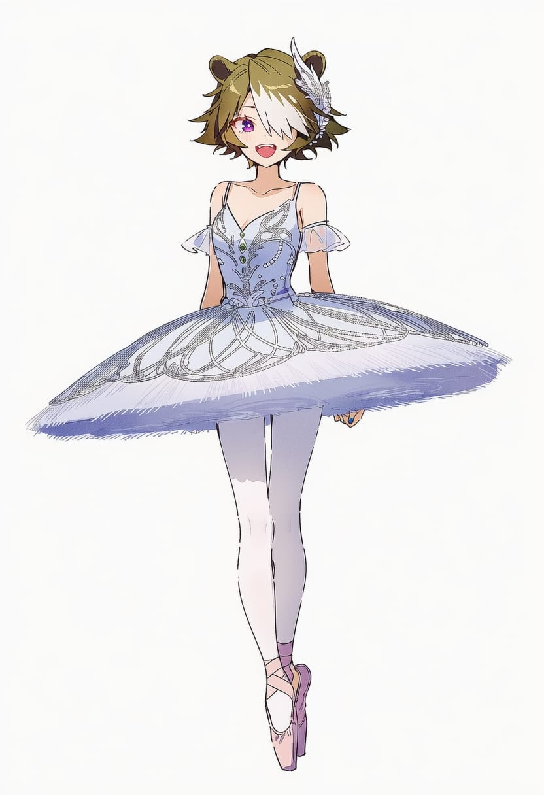

| 字段 | 内容 |
| --- | --- |
| Danbooru tag | ballet_slippers |
| 中文释义 | 芭蕾舞鞋 |
| 详细释义 | 柔软轻薄、贴脚的芭蕾训练鞋，通常没有硬质足尖盒。 |
| 分类 | 拖鞋与舞鞋 |

## 76. pointe_shoes — 芭蕾足尖鞋

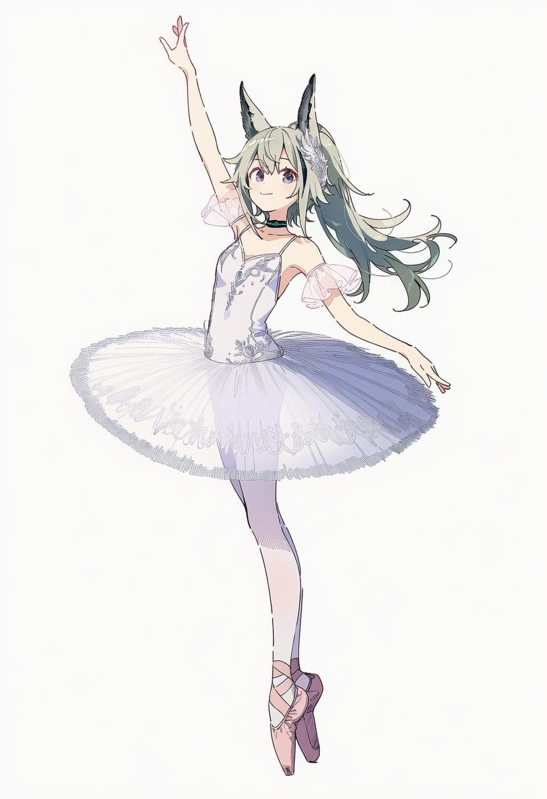

| 字段 | 内容 |
| --- | --- |
| Danbooru tag | pointe_shoes |
| 中文释义 | 芭蕾足尖鞋 |
| 详细释义 | 前端具有硬质足尖盒，可让芭蕾舞者以足尖站立的专业舞鞋。 |
| 分类 | 拖鞋与舞鞋 |

## 77. uwabaki — 上履/日式室内鞋

| 字段 | 内容 |
| --- | --- |
| Danbooru tag | uwabaki |
| 中文释义 | 上履/日式室内鞋 |
| 详细释义 | 日本学校常见的室内鞋，通常为浅口帆布/布鞋配橡胶底。 |
| 分类 | 拖鞋与舞鞋 |

## 78. tap_shoes — 踢踏舞鞋

| 字段 | 内容 |
| --- | --- |
| Danbooru tag | tap_shoes |
| 中文释义 | 踢踏舞鞋 |
| 详细释义 | 鞋底前掌和后跟装有金属片、用于发出清脆敲击声的舞鞋。 |
| 分类 | 拖鞋与舞鞋 |

## 79. high_heels — 高跟鞋

| 字段 | 内容 |
| --- | --- |
| Danbooru tag | high_heels |
| 中文释义 | 高跟鞋 |
| 详细释义 | 让脚后跟明显高于脚趾的鞋类特征标签，可用于鞋、靴、凉鞋等多种鞋型。 |
| 分类 | 高跟结构 |

## 80. stiletto_heels — 细高跟鞋

| 字段 | 内容 |
| --- | --- |
| Danbooru tag | stiletto_heels |
| 中文释义 | 细高跟鞋 |
| 详细释义 | 鞋跟细长、近似针状的高跟鞋。 |
| 分类 | 高跟结构 |

## 81. platform_heels — 厚底高跟鞋

| 字段 | 内容 |
| --- | --- |
| Danbooru tag | platform_heels |
| 中文释义 | 厚底高跟鞋 |
| 详细释义 | 前掌有明显厚底平台，同时后跟进一步抬高的高跟鞋。 |
| 分类 | 高跟结构 |

## 82. wedge_heels — 坡跟鞋

| 字段 | 内容 |
| --- | --- |
| Danbooru tag | wedge_heels |
| 中文释义 | 坡跟鞋 |
| 详细释义 | 后跟与前掌之间由连续楔形鞋底连接，而非独立鞋跟的高跟结构。 |
| 分类 | 高跟结构 |

## 83. kitten_heels — 猫跟鞋

| 字段 | 内容 |
| --- | --- |
| Danbooru tag | kitten_heels |
| 中文释义 | 猫跟鞋 |
| 详细释义 | 鞋跟较低且纤细、通常略向内收的小高跟鞋。 |
| 分类 | 高跟结构 |

## 84. block_heels — 粗跟鞋

| 字段 | 内容 |
| --- | --- |
| Danbooru tag | block_heels |
| 中文释义 | 粗跟鞋 |
| 详细释义 | 鞋跟宽厚、横截面较大的高跟鞋结构。 |
| 分类 | 高跟结构 |

## 85. low_block_heels — 低粗跟鞋

| 字段 | 内容 |
| --- | --- |
| Danbooru tag | low_block_heels |
| 中文释义 | 低粗跟鞋 |
| 详细释义 | 较低高度的宽粗鞋跟，兼具稳定性和轻度增高。 |
| 分类 | 高跟结构 |

## 86. slingback_heels — 后空带高跟鞋

| 字段 | 内容 |
| --- | --- |
| Danbooru tag | slingback_heels |
| 中文释义 | 后空带高跟鞋 |
| 详细释义 | 后跟开放，以细带绕过脚后跟固定的高跟鞋。 |
| 分类 | 高跟结构 |

## 87. d'orsay_heels — 奥赛高跟鞋

| 字段 | 内容 |
| --- | --- |
| Danbooru tag | d'orsay_heels |
| 中文释义 | 奥赛高跟鞋 |
| 详细释义 | 鞋身侧面有明显镂空/开放区域、脚弓侧边暴露的高跟鞋款。 |
| 分类 | 高跟结构 |

## 88. strappy_heels — 绑带高跟鞋

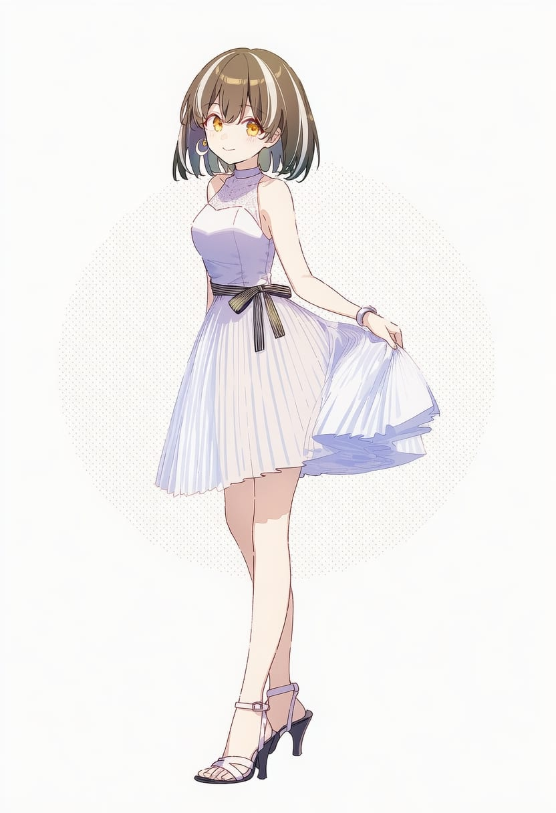

| 字段 | 内容 |
| --- | --- |
| Danbooru tag | strappy_heels |
| 中文释义 | 绑带高跟鞋 |
| 详细释义 | 以多条细带固定脚背或脚踝的高跟鞋，常见于礼服鞋。 |
| 分类 | 高跟结构 |

## 89. trapeze_heels — 梯形跟鞋

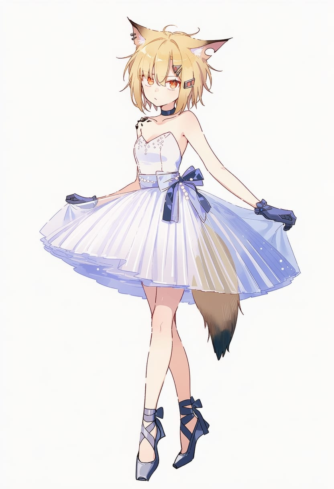

| 字段 | 内容 |
| --- | --- |
| Danbooru tag | trapeze_heels |
| 中文释义 | 梯形跟鞋 |
| 详细释义 | 鞋跟从上到下呈外扩或梯形轮廓的高跟结构。 |
| 分类 | 高跟结构 |

## 90. heel-less_heels — 无跟高跟鞋

| 字段 | 内容 |
| --- | --- |
| Danbooru tag | heel-less_heels |
| 中文释义 | 无跟高跟鞋 |
| 详细释义 | 没有传统后跟支柱，却通过前掌平台和鞋底结构让脚跟悬空抬高的高跟鞋。 |
| 分类 | 高跟结构 |

## 91. high_heel_sneakers — 高跟运动鞋

| 字段 | 内容 |
| --- | --- |
| Danbooru tag | high_heel_sneakers |
| 中文释义 | 高跟运动鞋 |
| 详细释义 | 运动鞋鞋面与明显高跟结构结合的混合鞋型。 |
| 分类 | 高跟结构 |

## 92. platform_footwear — 厚底鞋

| 字段 | 内容 |
| --- | --- |
| Danbooru tag | platform_footwear |
| 中文释义 | 厚底鞋 |
| 详细释义 | 前掌和/或整个鞋底明显加厚、使穿着者整体增高的鞋履特征。 |
| 分类 | 结构与造型 |

## 93. pointy_footwear — 尖头鞋

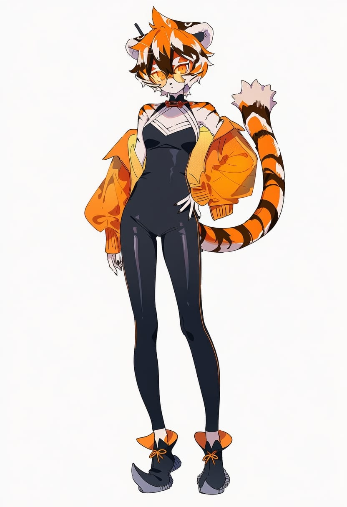

| 字段 | 内容 |
| --- | --- |
| Danbooru tag | pointy_footwear |
| 中文释义 | 尖头鞋 |
| 详细释义 | 鞋头明显收窄并形成尖角轮廓的鞋履。 |
| 分类 | 结构与造型 |

## 94. toeless_footwear — 露趾鞋

| 字段 | 内容 |
| --- | --- |
| Danbooru tag | toeless_footwear |
| 中文释义 | 露趾鞋 |
| 详细释义 | 鞋头开口、露出脚趾的鞋履结构。 |
| 分类 | 结构与造型 |

## 95. open-toe_shoes — 鱼嘴鞋/露趾鞋

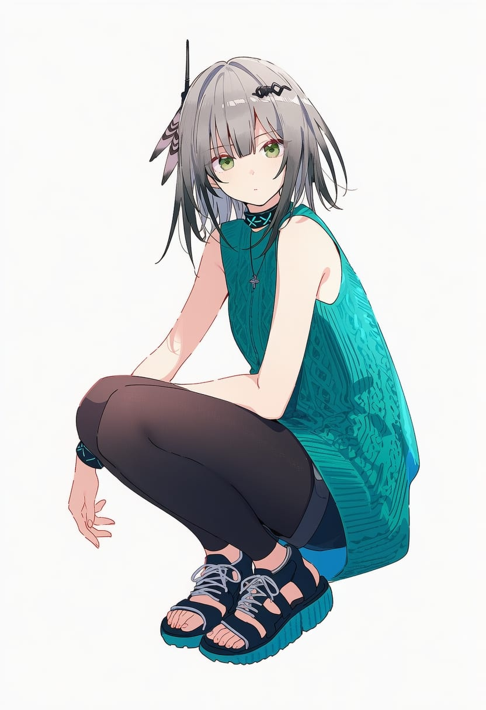

| 字段 | 内容 |
| --- | --- |
| Danbooru tag | open-toe_shoes |
| 中文释义 | 鱼嘴鞋/露趾鞋 |
| 详细释义 | 鞋面主体包覆足部但前端开口露出部分脚趾的鞋。 |
| 分类 | 结构与造型 |

## 96. cross-laced_footwear — 交叉系带鞋

| 字段 | 内容 |
| --- | --- |
| Danbooru tag | cross-laced_footwear |
| 中文释义 | 交叉系带鞋 |
| 详细释义 | 鞋带或绑带以明显交叉方式覆盖脚背、脚踝或小腿的鞋履。 |
| 分类 | 结构与造型 |

## 97. lace-up_shoes — 系带鞋

| 字段 | 内容 |
| --- | --- |
| Danbooru tag | lace-up_shoes |
| 中文释义 | 系带鞋 |
| 详细释义 | 以鞋带穿过鞋眼固定的鞋类。 |
| 分类 | 结构与造型 |

## 98. ankle_strap — 踝带鞋结构

| 字段 | 内容 |
| --- | --- |
| Danbooru tag | ankle_strap |
| 中文释义 | 踝带鞋结构 |
| 详细释义 | 鞋履带有环绕脚踝的固定带；可与高跟鞋、凉鞋等鞋型组合。 |
| 分类 | 结构与造型 |

## 99. footwear_bow — 鞋上蝴蝶结

| 字段 | 内容 |
| --- | --- |
| Danbooru tag | footwear_bow |
| 中文释义 | 鞋上蝴蝶结 |
| 详细释义 | 鞋、靴、凉鞋等鞋履上带有明显蝴蝶结装饰。 |
| 分类 | 装饰与材质 |

## 100. footwear_ribbon — 鞋上缎带

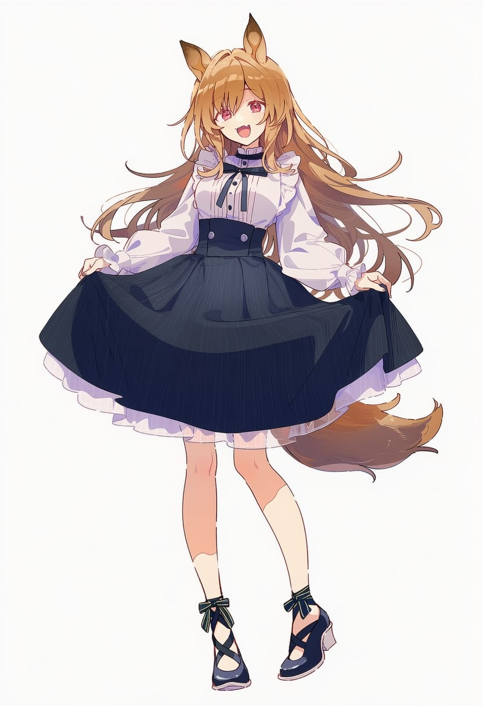

| 字段 | 内容 |
| --- | --- |
| Danbooru tag | footwear_ribbon |
| 中文释义 | 鞋上缎带 |
| 详细释义 | 鞋履上带有缎带/丝带装饰或用于系结的带状元素。 |
| 分类 | 装饰与材质 |

## 101. ribbon-trimmed_footwear — 缎带滚边鞋

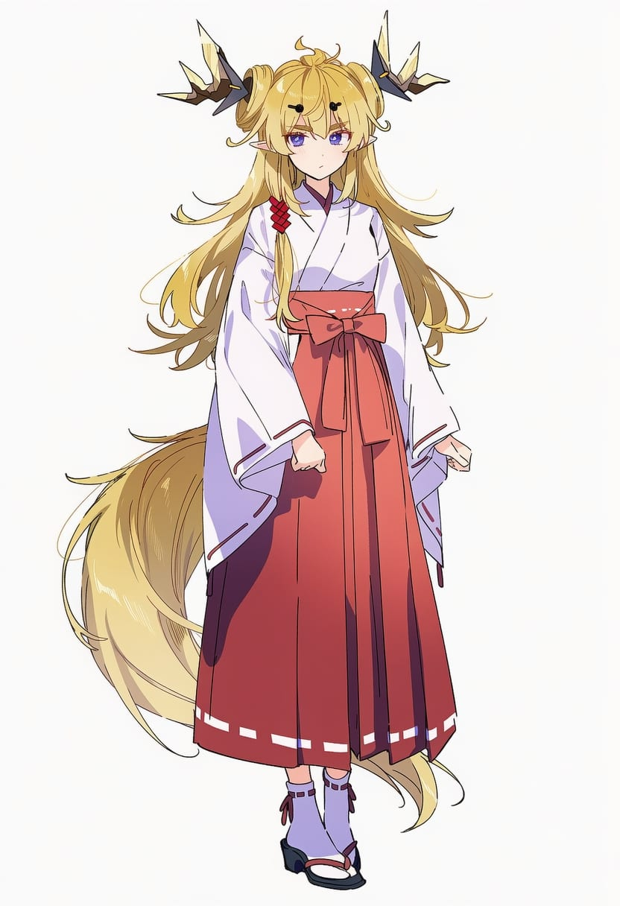

| 字段 | 内容 |
| --- | --- |
| Danbooru tag | ribbon-trimmed_footwear |
| 中文释义 | 缎带滚边鞋 |
| 详细释义 | 鞋履边缘带有连续的缎带式饰边，常表现为沿鞋口的一圈装饰线。 |
| 分类 | 装饰与材质 |

## 102. frilled_footwear — 褶边鞋

| 字段 | 内容 |
| --- | --- |
| Danbooru tag | frilled_footwear |
| 中文释义 | 褶边鞋 |
| 详细释义 | 鞋履带有荷叶边、褶边装饰。 |
| 分类 | 装饰与材质 |

## 103. winged_footwear — 带翼鞋

| 字段 | 内容 |
| --- | --- |
| Danbooru tag | winged_footwear |
| 中文释义 | 带翼鞋 |
| 详细释义 | 鞋履上具有翅膀造型装饰或幻想性的翼状结构。 |
| 分类 | 装饰与材质 |

## 104. fur-trimmed_footwear — 毛边鞋

| 字段 | 内容 |
| --- | --- |
| Danbooru tag | fur-trimmed_footwear |
| 中文释义 | 毛边鞋 |
| 详细释义 | 鞋口或边缘带明显毛皮/绒毛饰边。 |
| 分类 | 装饰与材质 |

## 105. plaid_footwear — 格纹鞋

| 字段 | 内容 |
| --- | --- |
| Danbooru tag | plaid_footwear |
| 中文释义 | 格纹鞋 |
| 详细释义 | 鞋履主体具有格纹/苏格兰格纹图案；属于图案差异而非单纯颜色差异。 |
| 分类 | 装饰与材质 |

## 106. striped_footwear — 条纹鞋

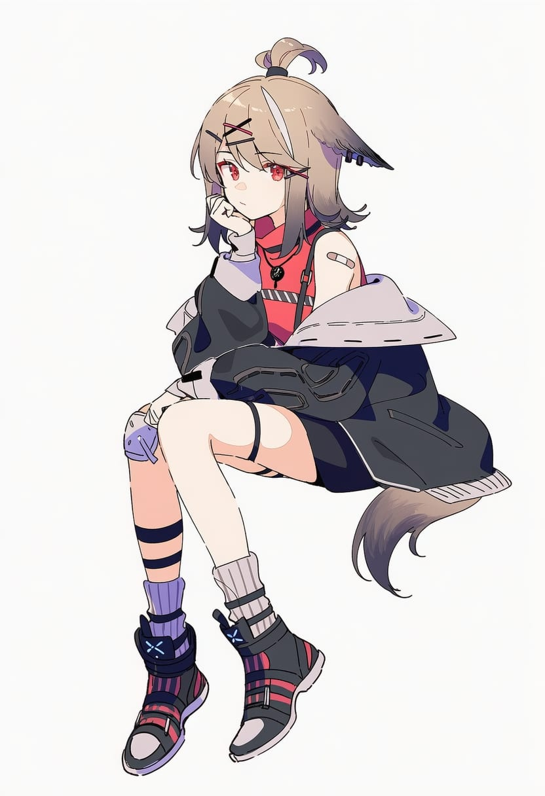

| 字段 | 内容 |
| --- | --- |
| Danbooru tag | striped_footwear |
| 中文释义 | 条纹鞋 |
| 详细释义 | 鞋履上具有明显条纹图案。 |
| 分类 | 装饰与材质 |

## 107. polka_dot_footwear — 波点鞋

| 字段 | 内容 |
| --- | --- |
| Danbooru tag | polka_dot_footwear |
| 中文释义 | 波点鞋 |
| 详细释义 | 鞋履上具有明显圆点/波点图案。 |
| 分类 | 装饰与材质 |

## 108. transparent_footwear — 透明鞋

| 字段 | 内容 |
| --- | --- |
| Danbooru tag | transparent_footwear |
| 中文释义 | 透明鞋 |
| 详细释义 | 鞋面或鞋体主要部分由透明/半透明材质表现。 |
| 分类 | 装饰与材质 |

## 109. unworn_shoes — 未穿着的鞋

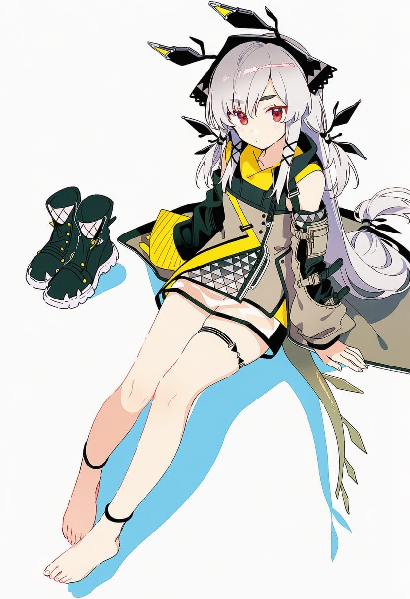

| 字段 | 内容 |
| --- | --- |
| Danbooru tag | unworn_shoes |
| 中文释义 | 未穿着的鞋 |
| 详细释义 | 鞋子出现在画面中但没有穿在脚上。 |
| 分类 | 状态类 |

## 110. unworn_boots — 未穿着的靴子

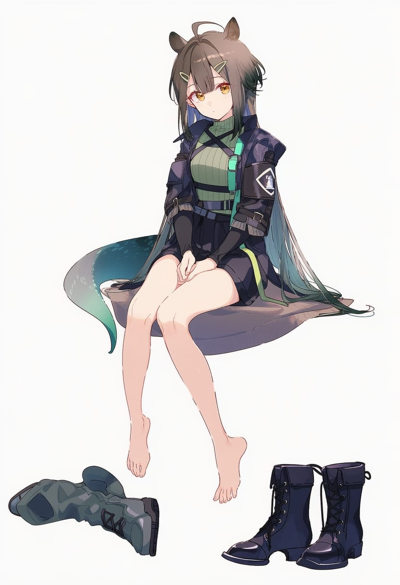

| 字段 | 内容 |
| --- | --- |
| Danbooru tag | unworn_boots |
| 中文释义 | 未穿着的靴子 |
| 详细释义 | 靴子出现在画面中但没有穿在脚上。 |
| 分类 | 状态类 |

## 111. unworn_sandals — 未穿着的凉鞋

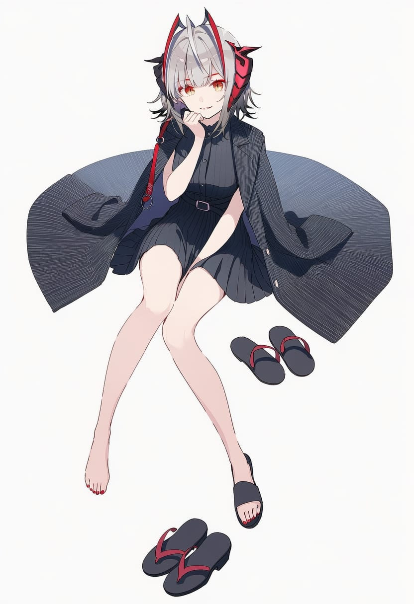

| 字段 | 内容 |
| --- | --- |
| Danbooru tag | unworn_sandals |
| 中文释义 | 未穿着的凉鞋 |
| 详细释义 | 凉鞋出现在画面中但没有穿在脚上。 |
| 分类 | 状态类 |

## 112. single_shoe — 单只鞋

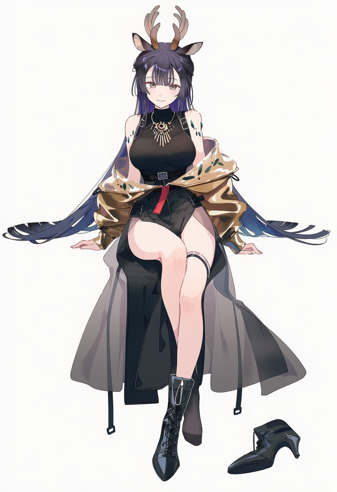

| 字段 | 内容 |
| --- | --- |
| Danbooru tag | single_shoe |
| 中文释义 | 单只鞋 |
| 详细释义 | 角色只穿着一只鞋，另一只脚没有对应鞋子。 |
| 分类 | 状态类 |

## 113. single_boot — 单只靴

| 字段 | 内容 |
| --- | --- |
| Danbooru tag | single_boot |
| 中文释义 | 单只靴 |
| 详细释义 | 角色只穿着一只靴子。 |
| 分类 | 状态类 |

## 114. single_sandal — 单只凉鞋

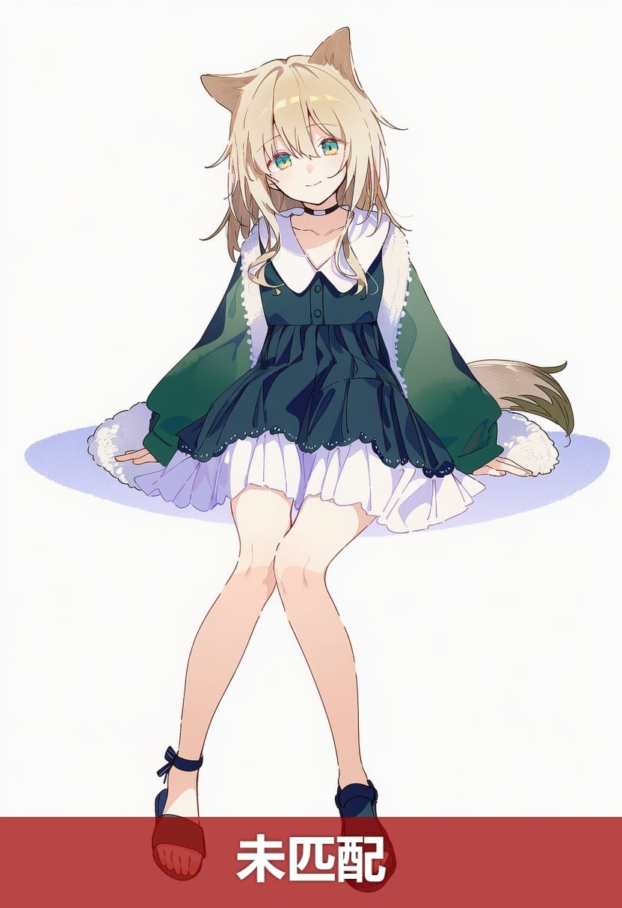

| 字段 | 内容 |
| --- | --- |
| Danbooru tag | single_sandal |
| 中文释义 | 单只凉鞋 |
| 详细释义 | 角色只穿着一只凉鞋。 |
| 分类 | 状态类 |

## 115. mismatched_footwear — 左右不同鞋

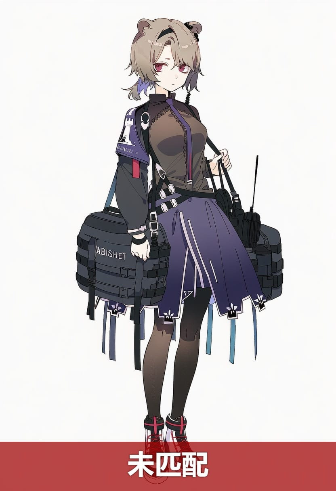

| 字段 | 内容 |
| --- | --- |
| Danbooru tag | mismatched_footwear |
| 中文释义 | 左右不同鞋 |
| 详细释义 | 左右脚穿着明显不成对、款式或类型不同的鞋履。 |
| 分类 | 状态类 |

## 116. untied_shoelaces — 鞋带松开

| 字段 | 内容 |
| --- | --- |
| Danbooru tag | untied_shoelaces |
| 中文释义 | 鞋带松开 |
| 详细释义 | 系带鞋的鞋带处于未系好、散开的状态。 |
| 分类 | 状态类 |

## 117. torn_footwear — 破损鞋履

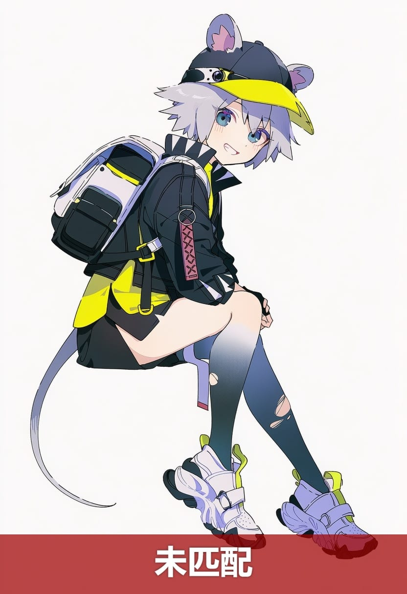

| 字段 | 内容 |
| --- | --- |
| Danbooru tag | torn_footwear |
| 中文释义 | 破损鞋履 |
| 详细释义 | 鞋履有明显撕裂、破洞或严重损坏。 |
| 分类 | 状态类 |

## 118. putting_on_footwear — 正在穿鞋

| 字段 | 内容 |
| --- | --- |
| Danbooru tag | putting_on_footwear |
| 中文释义 | 正在穿鞋 |
| 详细释义 | 角色正在把鞋、靴、凉鞋等穿到脚上的动作。 |
| 分类 | 状态类 |

## 119. taking_off_footwear — 正在脱鞋

| 字段 | 内容 |
| --- | --- |
| Danbooru tag | taking_off_footwear |
| 中文释义 | 正在脱鞋 |
| 详细释义 | 角色正在脱下鞋、靴、凉鞋等鞋履。 |
| 分类 | 状态类 |

## 120. adjusting_footwear — 整理鞋履

| 字段 | 内容 |
| --- | --- |
| Danbooru tag | adjusting_footwear |
| 中文释义 | 整理鞋履 |
| 详细释义 | 角色正在调整已经穿着的鞋履，例如拉正、扣紧或整理位置。 |
| 分类 | 状态类 |

## 121. holding_shoes — 手持鞋子

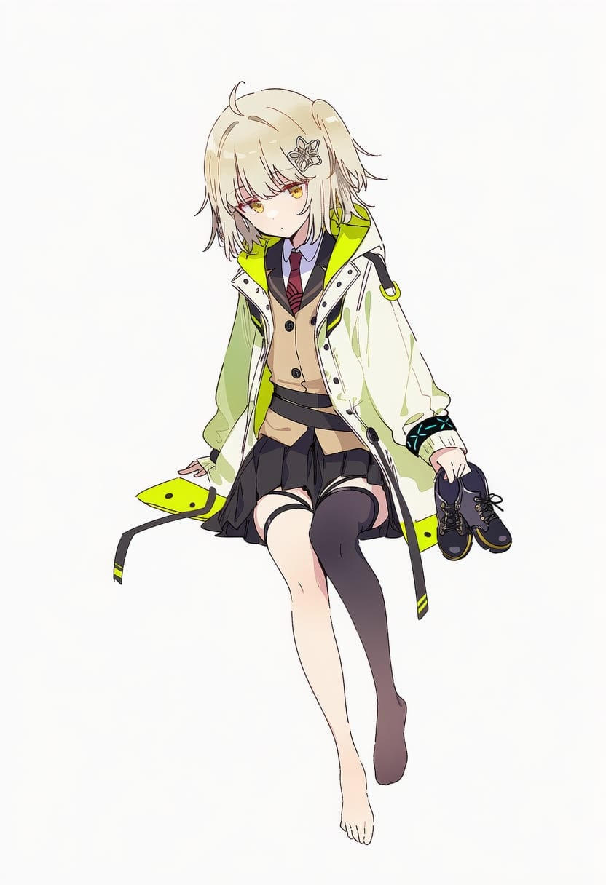

| 字段 | 内容 |
| --- | --- |
| Danbooru tag | holding_shoes |
| 中文释义 | 手持鞋子 |
| 详细释义 | 角色手中拿着鞋子而不是穿在脚上。 |
| 分类 | 状态类 |

---
